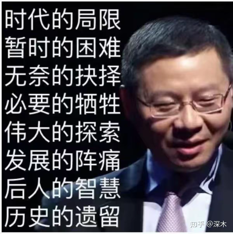
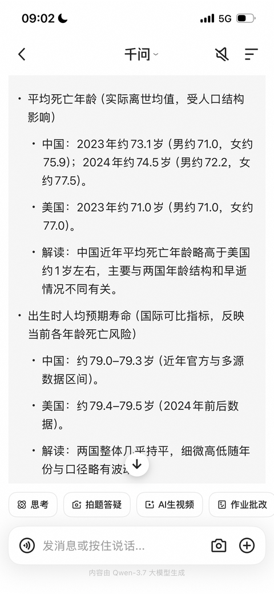
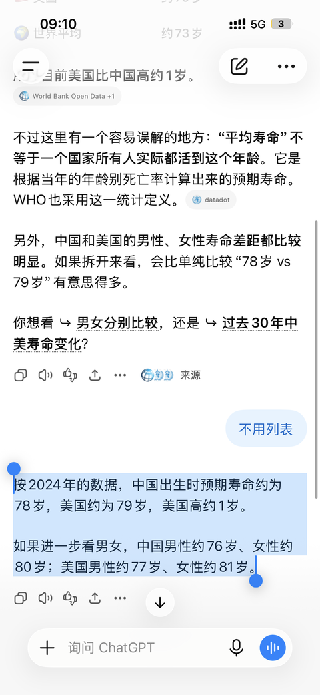
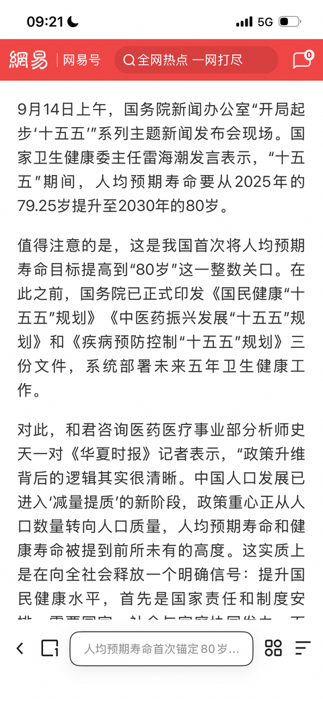

[toc]

# 问题

提问者：**<a href="https://www.zhihu.com/people/64-50-86-69-86">网评员</a>**
提问时间: 2026-9-15 8:33:32
总回答数: 912
总访问量: 7212451

如何看待广州大学城捅人事件？

# 回答

回答者： **<a href="https://www.zhihu.com/people/dong-ni-da-mu-40-70">总之就是很方</a>**
回答时间: 2026-9-16 14:52:54
点赞总数: 9142
评论总数: 390
收藏总数: 2428
喜欢总数：1273

某种意义上，这也算是回归到了世界的常态，黄金时代已经过去了。

国内的网络氛围一直都是挺社达的。就以女权来说，呼喊着女性共情，却不能共情小孩子，老人，贫困男性。即使是前几年的左派风潮，未明子这种左派，天天说着阶级斗争，无产阶级的，被人搞急了，也会说什么，你就是个底层的loser...

这就要提到第二点了，体面的现代生活是否应该是天生存在的，不需要运行成本呢？

我的答案是现代生活并非天然如此，其需要消耗大量的人力物力来维持。无论是现代生活还是方方面面机制，都依靠举榨更多的人力物力和劳动以及灌输思想才能进行基础和不断的运维。

换而言之，之前好看的效绩，并非没有代价。只是让其他人代为承受了。

但非常吊诡的是，一直说着要保卫我们的现代生活的体面人群(进步派，女权等)，反而屡见不鲜的对现代生活维系者持续“冷嘲热讽”“打压”。

为何会出现那种情况呢？那就要说到之前提到黄金时代了。

黄金时代并非意味着赚钱等等，而是意味着希望，在希望的利诱下，即使是月薪3000的人，也会付出远超自己价格的职业道德，也就是说，某种意义上，现代生活的运行是源于对这些人的压榨。

但，这是无法维持的。近期的所谓“不尽责”的外卖员、消防员、保安、救生员，就让一群体面人士破防了，那些想着“用别人维持我的现代生活”的人所破防的，那就是去责任化。

世界上没有什么天生如此的事情，社会不是天然安全的，货物不是自动从超市长出来的。你可以花便宜钱买到次品服务，但是加多少钱也得不到更好。

换而言之，人身安全也是需要物质维持的。

  

原文地址：[(总之就是很方)如何看待广州大学城捅人事件？](https://www.zhihu.com/question/2083111201941239140/answer/2083569060189684762) 

# 评论

1. <a href="https://www.zhihu.com/people/44-65-20-55-67">大威天龙莲花手</a> (<small title="湖南">2026-9-16 15:19:45</small>): ［赞同］很有见解的回答，直达社会安全的根本  
 
如何平衡和兜底就尤为重要了
   - **总之就是很方** (<small title="上海">2026-9-16 15:26:18</small>): 谈不上有见解。
 
灵感来自于之前别人整外卖员的事件。有些人迷信国内治安，认为别人绝对不敢动手，毕竟“打赢赔钱，打输坐牢”。肆无忌惮的给别人上嘴脸。
 
以及别人反对美国的郊区化，支持大城市化等等。
   - <a href="https://www.zhihu.com/people/wang-hou-yu-sheng-57-91-20">阳光总在风雨后</a> (<small title="回复于 2026-9-16 18:48:2/内蒙古"> ✉️:总之就是很方</small>): 我也经常和别人说 法律根本不是万能的。人 还是自己管好自己，出门在外 被人捅死了 就是枪毙了犯罪人 法律也不能复活已死的人。
   - <a href="https://www.zhihu.com/people/zhou-quan-93-57">seufisher</a> (<small title="回复于 2026-9-16 20:28:16/浙江"> ✉️:阳光总在风雨后</small>): 法律是菜单［酷］
   - <a href="https://www.zhihu.com/people/tang-yu-34-4">少做点白日梦</a> (<small title="回复于 2026-9-16 20:43:23/四川"> ✉️:阳光总在风雨后</small>): ［吃瓜］毕竟墓碑上刻一句“对方全责”，除了证明墓主人嘴硬和智力不太灵光之外，啥也带不来。
 
问题是别个的，命是自己的。［吃瓜］［吃瓜］
   - <a href="https://www.zhihu.com/people/zllzui-shuai">ZLL最帅</a> (<small title="回复于 2026-9-16 23:18:42/上海"> ✉️:阳光总在风雨后</small>): 有些人还会反驳你说这是受害者有罪论［捂脸］
   - <a href="https://www.zhihu.com/people/wang-hou-yu-sheng-57-91-20">阳光总在风雨后</a> (<small title="回复于 2026-9-17 2:57:16/内蒙古"> ✉️:seufisher</small>): 对啊，人最后还是靠自己的良知良能 才能活的平平安安。法律这个东西 靠得住的话 就不会有暴力了，人人都可以讲道理解决问题了。
   - <a href="https://www.zhihu.com/people/87-88-98-62">两点水</a> (<small title="回复于 2026-9-17 8:5:49/江苏"> ✉️:阳光总在风雨后</small>): 维护法律也是要成本的
   - <a href="https://www.zhihu.com/people/aaa-5-48-11">实名用户</a> (<small title="回复于 2026-9-17 8:32:58/安徽"> ✉️:少做点白日梦</small>): ［赞同］你们不去教育杀人犯，抢劫犯。诈骗犯反而教育受害人是什么目的？［酷］
   - <a href="https://www.zhihu.com/people/zheng-yi-39">一个名字</a> (<small title="回复于 2026-9-17 9:54:6/北京"> ✉️:实名用户</small>): 其实教育了，主要是XX犯人家不听啊［捂脸］
   - <a href="https://www.zhihu.com/people/an-2050">3Q安</a> (<small title="回复于 2026-9-17 10:11:38/山东"> ✉️:实名用户</small>): 劝人晚上一个人少走夜路，是劝普通人规避风险，而不是说社会可以把风险降低到零，让你夜里随便游荡。
2. <a href="https://www.zhihu.com/people/hal-52-35">林登武</a> (<small title="浙江">2026-9-16 15:47:14</small>): 最后一行讲的不够清楚。  
 
  
 
治安良好的社会，靠的并不是高治安投入，而是低治安成本。  
 
低治安成本，靠的是社会良性共识。  
 
  
 
等良性共识被有福人和老春登们嚯嚯光了，单纯增加治安投入不但不会提升治安效果，反而会陷入花钱越多治安越差的恶性循环。
   - <a href="https://www.zhihu.com/people/zhang-ender">张Ender</a> (<small title="云南">2026-9-16 16:37:33</small>): 唉
   - <a href="https://www.zhihu.com/people/25-40-72-61-94">桐上月</a> (<small title="上海">2026-9-16 17:1:43</small>): 已经快嚯嚯光了。既有直接嚯嚯到冰柜和异世界的，也有嚯嚯到改变自己行为方式的。
   - <a href="https://www.zhihu.com/people/gwr-97-54">GWR</a> (<small title="北京">2026-9-16 17:30:9</small>): “福”［捂嘴］
   - <a href="https://www.zhihu.com/people/lu-bo-qi-3">手机无信号</a> (<small title="福建">2026-9-16 17:32:37</small>): 花钱越多越差不就是被贪了吗，只不过是提前贪了，还是现在才贪的问题
   - <a href="https://www.zhihu.com/people/bei-hai-zhi-guang">北海之光</a> (<small title="江苏">2026-9-16 17:45:46</small>): 增加治安投入会导致治安成为一门暴利的生意，当然会恶性循环
   - <a href="https://www.zhihu.com/people/zi-tian-xin">紫天心</a> (<small title="四川">2026-9-16 17:46:43</small>): 对的，比如新疆，投入的人力物力成本可一点也不少，特殊形制所付出的成本、代价也很高。
   - <a href="https://www.zhihu.com/people/wu-lou-xia-yu-liao">五楼下雨了</a> (<small title="广东">2026-9-16 17:49:36</small>): 再乱也乱不过90-05年代那个车匪路霸，兵贼不分的年代，那会农村乡镇的长枪短炮不说随处可见，也算稀松平常，现在最多是城市里小偷小摸增加，恶性犯罪略微上升，但远没有90年代那么抽象
   - <a href="https://www.zhihu.com/people/haha-21-13-10">haha</a> (<small title="北京">2026-9-16 17:54:53</small>): 唉
   - <a href="https://www.zhihu.com/people/sheng-sheng-liu-zhuan-97">美丽坚秃头鹰</a> (<small title="美国">2026-9-16 17:55:35</small>): 你这就错了，明显是年轻人。但凡生活在上世纪的人都知道那时候的人可不是跟你玩什么报复社会，人家杀人放火仅仅只是在赚钱［捂脸］
   - <a href="https://www.zhihu.com/people/41-77-60-82">薰薰</a> (<small title="回复于 2026-9-16 18:4:44/四川"> ✉️:五楼下雨了</small>): 你有点过于乐观了。
 
有组织的灰色秩序和无差别的混沌混乱谈不上哪个更好。
 
这不是危言耸听，上面有回答说了，暴力可以维持秩序，但输出暴力也需要成本，当成本持续攀升，输出暴力也会变成一门生意。
 
然而无论选哪个方向，压力都不会凭空消失。
   - <a href="https://www.zhihu.com/people/xiao-hao-gua-he-pen-ren">请君执金</a> (<small title="广东">2026-9-16 18:5:43</small>): 欧洲那边是不是就是陷入这个陷阱了
   - <a href="https://www.zhihu.com/people/yang-jing-wei-29">Acid</a> (<small title="回复于 2026-9-16 18:6:12/广东"> ✉️:五楼下雨了</small>): 太乐观了，那个年代是为了谋财而害命。这个年代身上没有现金，就是看你不顺眼纯是害命
   - <a href="https://www.zhihu.com/people/72-53-73-8-69">海边的柠檬</a> (<small title="福建">2026-9-16 18:11:31</small>): 为了自己和子孙后代的幸福，共同维护社会安定平稳。
   - <a href="https://www.zhihu.com/people/6-77-21-17">虚拟星辰</a> (<small title="回复于 2026-9-16 18:16:32/辽宁"> ✉️:五楼下雨了</small>): 昨天在其他回答也看到了类似说法。但是90年代都是图财的，是为了利益，现在就纯是一群报复社会的
   - <a href="https://www.zhihu.com/people/zhao-zi-hao-3-98">诗酒趁年华</a> (<small title="回复于 2026-9-16 18:52:26/北京"> ✉️:薰薰</small>): 所以真到基层秩序无法维持时大手自然会放开对灰黑的管控，宗族、宗教、黑帮这些会成为新的基层治理组织，怎么也不会让混沌无序蔓延的
   - <a href="https://www.zhihu.com/people/momo-26-40-76">散帅</a> (<small title="回复于 2026-9-16 18:56:4/广东"> ✉️:手机无信号</small>): 不只是贪这一层，也有弹簧效应，压得越实绷得越紧，反弹力度也越大
   - <a href="https://www.zhihu.com/people/lu-wen-jie-66">陆文杰</a> (<small title="广东">2026-9-16 19:11:41</small>): 有福人差点没绷住［飙泪笑］
   - <a href="https://www.zhihu.com/people/luo-chen-96-67">遥远的乌托邦</a> (<small title="广东">2026-9-16 19:44:25</small>): 都赛博时代了，遍地的帮派分子和清道夫是不得不尝的一环
   - <a href="https://www.zhihu.com/people/ke-xue-de-chun-tian-60">我就是小卡拉</a> (<small title="广西">2026-9-16 20:0:17</small>): 确实，因为我国人均警察数其实是很少的，治安这么好绝大部分功劳靠大家自觉
   - <a href="https://www.zhihu.com/people/hong-chen-ji-jiang-hu">暗裔战狂 尤尼卡</a> (<small title="回复于 2026-9-16 20:1:38/河北"> ✉️:五楼下雨了</small>): 这是那个时候谋财害命，纯粹是有钱可赚，而且是未来可以慢慢变好的期望，现在呢，可没有看到这个情况了，而且那个时候只是为了图财，现在可是单纯的是看你不顺眼。
   - <a href="https://www.zhihu.com/people/tang-yu-34-4">少做点白日梦</a> (<small title="回复于 2026-9-16 20:34:46/四川"> ✉️:手机无信号</small>): 不只是tan的问题。
 
谁家的钱都不是天上掉下来的，哪怕是造纸也是在稀释别人手上的纸。花的越多，意味着对其它资金、资产的挤出效应越强，反过来会破坏社会学意义上的造血能力。
   - <a href="https://www.zhihu.com/people/tang-yu-34-4">少做点白日梦</a> (<small title="回复于 2026-9-16 20:39:7/四川"> ✉️:请君执金</small>): 欧洲……咋说呢，感觉他们是很明确的在抵制高成本的治理投入，然后任由治安“可控”的烂下去，尽量避免增加拨款。
 
不可避免地，正宫缺位，灰色秩序就会在一定程度上，填补了治安力量不作为的空白。
   - <a href="https://www.zhihu.com/people/13073056042">揣手手</a> (<small title="湖北">2026-9-16 21:13:20</small>): 什么意思？未来不是说经济会变好吗？
   - <a href="https://www.zhihu.com/people/88-17-66-20">松间雪</a> (<small title="回复于 2026-9-16 21:29:17/四川"> ✉️:手机无信号</small>): 是公共精神被消耗了，当然这也是长期以来对公共空间肆无忌惮的破坏造成的
   - <a href="https://www.zhihu.com/people/mo-zhe-wu-wei-3">墨者无畏</a> (<small title="回复于 2026-9-16 21:43:32/山东"> ✉️:揣手手</small>): 经济变好和道德变差又不冲突啊
   - <a href="https://www.zhihu.com/people/qftrhe4m">传奇巫婆杨景媛</a> (<small title="回复于 2026-9-16 21:51:39/江西"> ✉️:手机无信号</small>): 支持女性事业，能算贪吗？［大笑］
   - <a href="https://www.zhihu.com/people/qftrhe4m">传奇巫婆杨景媛</a> (<small title="回复于 2026-9-16 21:52:23/江西"> ✉️:五楼下雨了</small>): 让你现在过90年代物质匮乏的日子，又有多少人愿意？［大笑］
   - <a href="https://www.zhihu.com/people/wang-chen-zi-63">自解析逻辑信息体</a> (<small title="湖南">2026-9-16 21:56:15</small>): 当非正式制度（共识、习惯、道德）崩溃后，正式制度（法律、执法、监控）的替代成本呈指数级上升，且效果递减。道格拉斯·诺斯讲过类似逻辑——制度运行成本不仅取决于正式规则的数量，更取决于非正式约束的支撑程度。  
 
  
 
这是看山的回复。
   - <a href="https://www.zhihu.com/people/mo-bao-37-78-37">Divine-Wrath</a> (<small title="江苏">2026-9-16 22:7:39</small>): 那良性共识是怎么建立起来的，以前没有福人和老春登吗［吃瓜］
   - <a href="https://www.zhihu.com/people/mo-bao-37-78-37">Divine-Wrath</a> (<small title="回复于 2026-9-16 22:9:4/江苏"> ✉️:Acid</small>): 想多了，那个年代多的是就喜欢沙人，甚至整个团伙都以沙人为乐［吃瓜］比如贾文革、龙治民
   - <a href="https://www.zhihu.com/people/xxxxxxxxxiii-84">自恋的猪猪</a> (<small title="回复于 2026-9-16 22:38:19/加拿大"> ✉️:请君执金</small>): 欧洲是移民难民太多，一群没有良性共识的人不经筛选就放进来了
   - <a href="https://www.zhihu.com/people/yi-qi-31-37">momo</a> (<small title="浙江">2026-9-16 22:56:18</small>): 堵和疏的区别吧
   - <a href="https://www.zhihu.com/people/0tv7elix">momo</a> (<small title="四川">2026-9-16 22:56:18</small>): 拉偏架，和稀泥吧。
   - <a href="https://www.zhihu.com/people/hao-ming-zi-du-rang-gou-qi-liao-52">开心就好</a> (<small title="回复于 2026-9-16 23:18:42/日本"> ✉️:我就是小卡拉</small>): 辅警你不算上吗，一般出了什么事都是辅警干的［捂脸］
   - <a href="https://www.zhihu.com/people/vic-74-7-89">弗劳VIC</a> (<small title="回复于 2026-9-16 23:21:39/安徽"> ✉️:Divine-Wrath</small>): 以前基本的道德观是有的，而且官方也没有通过行政手段摧毁它
   - <a href="https://www.zhihu.com/people/murcierlago">Murcierlago</a> (<small title="海南">2026-9-17 0:17:23</small>): 欧美日韩都很好的做出了示范~［看看你］
   - <a href="https://www.zhihu.com/people/zzguo-37">Zz锅</a> (<small title="广东">2026-9-17 0:59:23</small>): 其实就是人人都要有能捍卫自己权利的武器。还是回到中国人到底是不是人的问题。
   - <a href="https://www.zhihu.com/people/estranged-7">Estranged</a> (<small title="上海">2026-9-17 1:27:19</small>): 你这个有福人有点看不懂？是我想的那个福？还是幸运儿的意思？［思考］
   - <a href="https://www.zhihu.com/people/bing-ru-gao-huang-20">乐哈哈</a> (<small title="安徽">2026-9-17 4:10:21</small>): 不是怎么到处乱造词啊［捂脸］
   - <a href="https://www.zhihu.com/people/sun-qing-lin-2">呵呵</a> (<small title="回复于 2026-9-17 6:56:4/北京"> ✉️:五楼下雨了</small>): 不以人的意志为转移
   - <a href="https://www.zhihu.com/people/41-77-60-82">薰薰</a> (<small title="回复于 2026-9-17 7:12:32/四川"> ✉️:诗酒趁年华</small>): 天真，真以为灰黑的组织力是充话费免费送的啊？［为难］
 
组织力这东西就跟水一样，会找到自己的出路，因为人类社会天生有这个需求。
 
个体原子化时代的基层组织力就是身份认同，这玩意儿外服起码先跑了20年。
 
找不到认同被抛弃的个体就会成为无差别的混沌，这个是结果，不是需要被治理的原因。
   - <a href="https://www.zhihu.com/people/60-36-92-1-76">李波路霸</a> (<small title="回复于 2026-9-17 7:13:11/四川"> ✉️:Divine-Wrath</small>): 以前有福人还没现在这么魔怔
   - <a href="https://www.zhihu.com/people/59-28-85-45-46">糖糖糖糖</a> (<small title="回复于 2026-9-17 7:14:15/天津"> ✉️:紫天心</small>): 那是举国之力来维持的，成本不计。
   - <a href="https://www.zhihu.com/people/zhi-xing-ming-xing-qiang-shen-jian-ti">强身健体知行明性</a> (<small title="安徽">2026-9-17 7:26:32</small>): 包的［感谢］ 你按章办事，认真负责，老登非要突破章程+折腾你，那不好意思，谁来都不好使，双输好过单赢［感谢］
   - <a href="https://www.zhihu.com/people/aaa-5-48-11">实名用户</a> (<small title="安徽">2026-9-17 8:34:22</small>): 美国治安维持费用一年超过军费。
   - <a href="https://www.zhihu.com/people/aaa-5-48-11">实名用户</a> (<small title="回复于 2026-9-17 8:36:12/安徽"> ✉️:五楼下雨了</small>): 结局可能并没有你想的那么简单。
   - <a href="https://www.zhihu.com/people/jiang-lei-95-13">小石头</a> (<small title="广东">2026-9-17 8:46:30</small>): 嚯嚯光了从何而来，现在新一代年轻人明显道德感更重、遵纪守法意识更强，不能看到个例就扩大化，不认可后面治安必然越来越差或者需要投入更大成本，可以继续观察
   - <a href="https://www.zhihu.com/people/jiang-lei-95-13">小石头</a> (<small title="回复于 2026-9-17 8:48:20/广东"> ✉️:五楼下雨了</small>): 是的，这些评论有些过于悲观了，一起案例并不能得出这些结论，还是不要轻易判断，现在来看，不至于那么悲观
   - <a href="https://www.zhihu.com/people/li-wen-fei-14-50">小组长</a> (<small title="回复于 2026-9-17 8:50:35/云南"> ✉️:诗酒趁年华</small>): 要花钱的［飙泪笑］
   - <a href="https://www.zhihu.com/people/drylong">dryLong</a> (<small title="回复于 2026-9-17 9:3:5/四川"> ✉️:五楼下雨了</small>): 怎么说呢，就想电影老无所依里一样，为什么老骑警对罪犯无法理解，就在这里，以前是谋财害命，为了钱，利益，现在是没有目的，随机的，管你有没有钱，你想给钱了事都没这机会［捂脸］
   - <a href="https://www.zhihu.com/people/ci-qu-jing-nian-26-1">此去经年</a> (<small title="回复于 2026-9-17 9:26:28/北京"> ✉️:北海之光</small>): 你真相了
   - <a href="https://www.zhihu.com/people/tang-tang-liang-tai-lang">Star Platinum</a> (<small title="回复于 2026-9-17 9:32:50/广东"> ✉️:手机无信号</small>): 类似「时代峰峻」这次事件。一群疯狂女粉丝打了几万个12345。正常根本不用消耗这么多人力物力的。
   - <a href="https://www.zhihu.com/people/9-81-4-91-83">于谦的老父亲</a> (<small title="天津">2026-9-17 9:40:52</small>): 我看说中国人均警察数量远低于美国。治安仰仗于经济发展和管理成本低。中国治安又不是没差过，共识打破后怕是要到回到90年代车匪路霸的版本。
   - <a href="https://www.zhihu.com/people/yao-yuan-de-qiao-8-63">遥远的桥</a> (<small title="回复于 2026-9-17 9:48:52/山西"> ✉️:诗酒趁年华</small>): 想多了，税收怎么办？？？
   - <a href="https://www.zhihu.com/people/yao-yuan-de-qiao-8-63">遥远的桥</a> (<small title="回复于 2026-9-17 10:6:48/山西"> ✉️:小石头</small>): 新一代是恩怨分明。。。。
3. <a href="https://www.zhihu.com/people/98-97-92-30">事了拂衣去</a> (<small title="江苏">2026-9-16 17:4:14</small>): 出门散步，发现天空中飘着几个大字：“黄金时代已结束”，这才发现自己穿越到了《文明5》中。。。［滑稽］
   - <a href="https://www.zhihu.com/people/mi-zhi-lao-liu">迷之老六</a> (<small title="北京">2026-9-16 18:32:43</small>): 我回合金怎么变成负数了［大哭］
   - <a href="https://www.zhihu.com/people/39-61-87-41">帝国主义亡我之心</a> (<small title="山东">2026-9-16 21:4:23</small>): 不是战锤世界？［惊喜］
   - <a href="https://www.zhihu.com/people/liu-yang-40-30">真.不谢顶</a> (<small title="回复于 2026-9-16 21:38:2/辽宁"> ✉️:迷之老六</small>): 都特么人才
   - <a href="https://www.zhihu.com/people/deepdark-76">Entering</a> (<small title="回复于 2026-9-16 21:42:54/江苏"> ✉️:帝国主义亡我之心</small>): 那也太恶毒了
   - <a href="https://www.zhihu.com/people/98-97-92-30">事了拂衣去</a> (<small title="回复于 2026-9-17 6:30:1/江苏"> ✉️:帝国主义亡我之心</small>): 你这是真狠心啊……［捂脸］
4. <a href="https://www.zhihu.com/people/evan-34-30-66">Evan</a> (<small title="美国">2026-9-16 17:16:49</small>): 这一切都被一些群体视作是“转型期的阵痛”
   - <a href="https://www.zhihu.com/people/zzz--24-6-42">zzz 吖</a> (<small title="广东">2026-9-16 18:27:53</small>): 那么代价是什么呢？这群占了便宜的人肯定不想付出和买单的
   - <a href="https://www.zhihu.com/people/lin-jin-bao-51">十五月夜</a> (<small title="回复于 2026-9-16 18:54:20/广东"> ✉️:zzz 吖</small>): 代价就是平民买单。物价升高，工资降低，一个人干多个人的活。
   - <a href="https://www.zhihu.com/people/an-ye-du-xing-46">漫山红叶</a> (<small title="辽宁">2026-9-16 21:10:47</small>): 张WW?［思考］
   - <a href="https://www.zhihu.com/people/lin-ken-fa-qiu-45">梨膏香</a> (<small title="回复于 2026-9-16 21:27:8/北京"> ✉️:zzz 吖</small>): 代价就是那些不占便宜的群体啊
   - <a href="https://www.zhihu.com/people/yu-shou-xi-jie">御手洗杰</a> (<small title="回复于 2026-9-17 8:30:44/四川"> ✉️:zzz 吖</small>): 交给后人的智慧
5. <a href="https://www.zhihu.com/people/114614-45">114614</a> (<small title="美国">2026-9-16 17:42:30</small>): 现代社会最大问题是让维持者吃大亏，破坏者享大福
   - <a href="https://www.zhihu.com/people/0tv7elix">momo</a> (<small title="四川">2026-9-16 23:1:23</small>): 关键拉偏架，和稀泥
   - <a href="https://www.zhihu.com/people/yuan-wo-ru-xing-98">愿我如星</a> (<small title="广东">2026-9-16 23:16:57</small>): 连法律都是有利被告原则，法律作为社会底线
   - <a href="https://www.zhihu.com/people/wang-er-ma-zi-shi-ge-bi-lao-wang">王二麻子是隔壁老王</a> (<small title="辽宁">2026-9-17 1:38:6</small>): 破坏者也没有什么收益，只是单纯的破坏而已
   - <a href="https://www.zhihu.com/people/chen-yun-long-67-12">意大利炮</a> (<small title="北京">2026-9-17 5:20:31</small>): 接下来的一个时代是什么样的呢？
   - <a href="https://www.zhihu.com/people/3151215189147">万我</a> (<small title="回复于 2026-9-17 5:54:21/山东"> ✉️:王二麻子是隔壁老王</small>): 这么没有，像是咪蒙不就通过打女权来获得超额收益了嘛
   - <a href="https://www.zhihu.com/people/ji-ran-31-12">纪然</a> (<small title="回复于 2026-9-17 7:13:43/广东"> ✉️:王二麻子是隔壁老王</small>): 他没被惩罚就是最大的受益
   - <a href="https://www.zhihu.com/people/li-shi-hua-63">云想123</a> (<small title="回复于 2026-9-17 7:36:12/广东"> ✉️:王二麻子是隔壁老王</small>): 讹人的老头老太没被惩罚，甚至爆了大量金币，这不是利益吗［为难］
6. <a href="https://www.zhihu.com/people/fang-yong-kang-37">逝水</a> (<small title="安徽">2026-9-16 17:0:0</small>): 希望是很珍贵的东西
   - <a href="https://www.zhihu.com/people/zhigxpwmoe">zhiGxPWMOe</a> (<small title="广东">2026-9-16 20:31:46</small>): 希望是比黄金还要更加珍贵的东西［感谢］
   - <a href="https://www.zhihu.com/people/qtlark">云雀</a> (<small title="湖南">2026-9-17 8:15:37</small>): 公平比太阳更光辉，信心比黄金更宝贵
7. <a href="https://www.zhihu.com/people/momo-70-72-57-92">宅总是开心的</a> (<small title="广东">2026-9-16 17:35:6</small>): 等出了事，你就指望商场里拿两千块钱工资的保安保护你吧，或者等那些没有编制的辅警给你伸张正义
   - <a href="https://www.zhihu.com/people/zhioblezn">禅院直毘人</a> (<small title="江苏">2026-9-16 21:25:21</small>): 拿钱换别人的保护，是否涉及对生命权的买卖与剥削，将安保人员当成了送死机器
   - <a href="https://www.zhihu.com/people/13073056042">揣手手</a> (<small title="湖北">2026-9-16 21:29:48</small>): 辅警外包的工资不算特别低吧，折合成一个小时九块五。在小县城。
   - <a href="https://www.zhihu.com/people/tushi-liu">买水泥 找齐彬</a> (<small title="回复于 2026-9-16 22:2:16/辽宁"> ✉️:揣手手</small>): 镀晶能干活是对转正有希望，觉得自己立功受奖就能跃龙门了，再一个就是赚点儿灰色收入。这两条都破灭的话就和保安一点区别没有了，能递个灭火器都算工匠精神了
   - <a href="https://www.zhihu.com/people/73-6-4-41-21">吃蛋挞</a> (<small title="回复于 2026-9-17 1:10:49/四川"> ✉️:禅院直毘人</small>): 纯拿钱肯定不行啊，所以给了你社会地位和赞誉，以及编制和可能的上升空间。但是现在把辅警的进编渠道给堵了，那就没有空间了［思考］
   - <a href="https://www.zhihu.com/people/50-72-81-59-29">只是近黄昏</a> (<small title="回复于 2026-9-17 9:7:37/广东"> ✉️:禅院直毘人</small>): 重赏之下必有勇夫［尴尬］你给2千没人卖命，你给20万试试［飙泪笑］什么搏击冠军精英保镖请不到
   - <a href="https://www.zhihu.com/people/50-72-81-59-29">只是近黄昏</a> (<small title="回复于 2026-9-17 9:8:35/广东"> ✉️:吃蛋挞</small>): 经典复读机之立功也不能开口子，不然很多人效仿［飙泪笑］哪怕是重大安全问题救人了也这么复读
   - <a href="https://www.zhihu.com/people/50-72-81-59-29">只是近黄昏</a> (<small title="广东">2026-9-17 9:15:25</small>): 我只是打个比方，他不是说钱没用吗
   - <a href="https://www.zhihu.com/people/liu-chen-yuan-40">Lcy刘</a> (<small title="回复于 2026-9-17 10:13:31/广东"> ✉️:揣手手</small>): 你自己先算算一小时9块5一个月多少钱，别人能和你玩命？没希望转正不如当个保安
8. <a href="https://www.zhihu.com/people/2726617126">折耳猫</a> (<small title="四川">2026-9-16 20:47:24</small>): 其实和房地产一样就是贷款负债运行，只不过借贷的是道德，希望这一类的虚拟无形资产，大家下意识忽略了而已。
9. <a href="https://www.zhihu.com/people/feng-zi-13-66-8">Coicc</a> (<small title="江苏">2026-9-16 18:13:54</small>): 可以和良家子红线放一起。社会共识决定了一个普通人决定当良家子的概率。反过来良家子下跌也会导致社会共识下更难产生良家子。
   - <a href="https://www.zhihu.com/people/chen-yan-45-9-98">陈言</a> (<small title="广东">2026-9-17 3:9:15</small>): 你们在这个话题 下的评论怎么突然这么有深度和见解了？
10. <a href="https://www.zhihu.com/people/zhe-ge-ge-11">无糖可乐</a> (<small title="广东">2026-9-16 17:36:11</small>): 你说的好像“黄金时代”的犯罪率更低似的［飙泪笑］
    - <a href="https://www.zhihu.com/people/zi-tian-xin">紫天心</a> (<small title="四川">2026-9-16 17:44:55</small>): 因为这玩意是相对的。
 
你觉得“黄金时代”的犯罪率不低，但其他的时候会更高。
    - <a href="https://www.zhihu.com/people/zhe-ge-ge-11">无糖可乐</a> (<small title="回复于 2026-9-16 17:54:54/广东"> ✉️:紫天心</small>): 我可以很明确的告诉你，现在就是有史以来，犯罪率最低的时代
    - <a href="https://www.zhihu.com/people/zi-tian-xin">紫天心</a> (<small title="回复于 2026-9-16 18:0:15/四川"> ✉️:无糖可乐</small>): 那你说什么呢，这过去的一二十年相对以前的确是犯罪率最低的时代。
 
如果你所谓的“黄金时代”是特指，算我理解不到位。
    - <a href="https://www.zhihu.com/people/66-95-11-66-16">hffszz</a> (<small title="北京">2026-9-16 18:12:48</small>): 纯诅咒就没意思了［飙泪笑］
    - <a href="https://www.zhihu.com/people/43-15-27-20">吴东海</a> (<small title="回复于 2026-9-16 19:32:2/陕西"> ✉️:hffszz</small>): 你不明白，知乎现在是许愿池
    - <a href="https://www.zhihu.com/people/66-95-11-66-16">hffszz</a> (<small title="北京">2026-9-16 21:9:54</small>): 我只信官方数据，当然你什么都不信［飙泪笑］
    - <a href="https://www.zhihu.com/people/zhi7nbeq">zhi7NBeq</a> (<small title="江苏">2026-9-16 22:9:28</small>): 你的推导就有问题，你怎么证明就业率最高的时候，治安情况好于现在呢？你都没有数据支撑就推导，明显先画靶子后射箭
    - <a href="https://www.zhihu.com/people/mo-bao-37-78-37">Divine-Wrath</a> (<small title="江苏">2026-9-16 22:10:14</small>): 现在就是近20年犯罪率最低的时候［吃瓜］
    - <a href="https://www.zhihu.com/people/mo-bao-37-78-37">Divine-Wrath</a> (<small title="江苏">2026-9-16 22:11:8</small>): 就业率和治安没有你想象中的必然关系，英美就业率很高，但基层治安已经基本崩溃了［吃瓜］
    - <a href="https://www.zhihu.com/people/zhi7nbeq">zhi7NBeq</a> (<small title="江苏">2026-9-16 22:16:23</small>): 未来的每一年都将是未来 10 年犯罪率最低的时代，然后最高也比你们口中的经济上行期的黄金时代要低。你根本就没想过社会主要的治安问题来自于地痞流氓黑涩会，而不是零星的反社会独狼，就像美国枪击私人数量都靠帮派和抢劫，大规模枪击才能似几个［捂脸］
    - <a href="https://www.zhihu.com/people/echo-74-49-16">echo</a> (<small title="湖北">2026-9-16 22:22:45</small>): 要反直觉了。  
 
日本房价跌经济差的时候上升的几乎全是财产犯罪（窃盗占认知件数增量约八成）；强盗小升；而杀人等恶性暴力犯罪下降了，嘎人率在失去的三十年反倒是 下降 了
    - <a href="https://www.zhihu.com/people/mo-bao-37-78-37">Divine-Wrath</a> (<small title="江苏">2026-9-16 22:26:21</small>): 扎小人许愿没有任何p用［吃瓜］
    - <a href="https://www.zhihu.com/people/jiang-run-yi-56">我是一个粉刷匠</a> (<small title="回复于 2026-9-16 22:55:55/北京"> ✉️:紫天心</small>): 原来经济增长最快的00年代治安很好啊，飞车党都我厚米啊，火车站都你厚米啊［飙泪笑］不如感谢奶头乐和移动支付吧［捂嘴］［捂嘴］［捂嘴］
    - <a href="https://www.zhihu.com/people/x6hx7e">夜光</a> (<small title="贵州">2026-9-16 23:10:54</small>): 现在的犯罪率低是因为有代餐，短视频、游戏功不可没。生育率数据本生就是一个比犯罪率更能代表现实的数据。  
 
犯罪率还能说明这帮人还有想多吃多拿的欲望，生育率暴跌直接人口锐减说明连活都不想了，比犯罪率更能说明问题。
    - <a href="https://www.zhihu.com/people/79-74-56-85">天台宝石仓库</a> (<small title="回复于 2026-9-17 2:55:20/浙江"> ✉️:zhi7NBeq</small>): ［酷］ 但是孤狼的无差别是恐怖的 你所谓的流氓 黑社会 他们都在一些特定的行业。这种孤狼在密集型城市 简直恐怖。都不需要枪 这次一个男性 一把刀就当街噶了2人 重伤4人。 去年一辆车就35人 受伤几百。而你无法预防。
    - <a href="https://www.zhihu.com/people/norma2i">小看山norma2i</a> (<small title="广东">2026-9-17 4:54:20</small>): 因为那时候向钱看，可以掩盖很多问题，一旦潮水退去［看看你］
    - <a href="https://www.zhihu.com/people/norma2i">小看山norma2i</a> (<small title="回复于 2026-9-17 4:55:11/广东"> ✉️:无糖可乐</small>): 数据可以造假
    - <a href="https://www.zhihu.com/people/5cqwte">momo</a> (<small title="回复于 2026-9-17 6:30:29/广西"> ✉️:紫天心</small>): 我小时候是十几年前，电视上飞车党抢包抢首饰的新闻屡见不鲜，是这些年犯罪率才下降。最能体现这点的是电诈名下的监禁绑架虐待等规模化犯罪组织大规模转移到东南亚，北派传销的绝迹，这些都是这十年治安整顿的结果。
    - <a href="https://www.zhihu.com/people/zhi7nbeq">zhi7NBeq</a> (<small title="回复于 2026-9-17 7:41:47/江苏"> ✉️:天台宝石仓库</small>): 问题黑涩会从乡村到一线全都有啊，还是那句话，国家不管，你被黑涩会打的概率远远大于被独狼搞［捂脸］
    - <a href="https://www.zhihu.com/people/aaa-5-48-11">实名用户</a> (<small title="回复于 2026-9-17 8:40:29/安徽"> ✉️:momo</small>): 经济的发展让那些无所事事的人有了工作。想之前80年代左右。大量的青年男女无所事事。搞出了太多事情。不是才有严打吗？
    - <a href="https://www.zhihu.com/people/90-64-83-47-57">雾雨魔理沙专偷金</a> (<small title="回复于 2026-9-17 8:48:14/黑龙江"> ✉️:夜光</small>): 赚钱不用偷盗 入室截杀，转电诈了。效果更好 风险更低。
    - <a href="https://www.zhihu.com/people/px5000">CryoSmith</a> (<small title="回复于 2026-9-17 9:9:40/广东"> ✉️:无糖可乐</small>): 犯罪的方式也在进化。
    - <a href="https://www.zhihu.com/people/tu-tu-14-44-63">未设置</a> (<small title="回复于 2026-9-17 9:26:27/浙江"> ✉️:紫天心</small>): 你的意思是2006-2016，比现在犯罪率高多了
    - <a href="https://www.zhihu.com/people/wu-yi-shan-xiao-er-bu-wei-51">热心市民</a> (<small title="中国香港">2026-9-17 9:52:45</small>): 低多了2000年以前是怎么样的问问你爸什么叫飞车党和毒狗吧潇洒哥，摩托车的电池 单车丢失是常态
11. <a href="https://www.zhihu.com/people/Civanov">Nonk</a> (<small title="湖北">2026-9-16 16:28:11</small>): 期望管理是个学问，从项目、产品运营再到宗教都是如此，各种主义也都喜欢画这种饼
12. <a href="https://www.zhihu.com/people/xie-kai-60-17">排排干</a> (<small title="上海">2026-9-16 18:33:27</small>): 我遇到个问题：京东快递按规定应该送货上门的，但是负责我们小区的那个快递员直接放驿站了，我电话问的时候他说：“我们送一单其实赚不了几个，因为时间紧，所以希望我理解一下。”，然后我就同意了。  
 
这个事儿我事后纠结的点在于，一方面我觉得京东既然承诺送货上门，他应该说到做到的。但一方面又觉得大家都是底层劳动者，压力有多大，工作有多卷我也知道，你说这时候我要不依不饶的让送上门，万一报复我咋办［飙泪笑］
    - <a href="https://www.zhihu.com/people/49-68-81-49">倒霉的弗雷德</a> (<small title="广东">2026-9-16 19:10:18</small>): 说到底责任在机制，但是执行机制的是人，很无奈，我遇到过这样的，也和你一样选择随快递员的方便，我只是更不忍心让艰难的快递员更加难过
    - <a href="https://www.zhihu.com/people/lin-mike-89">姜杰</a> (<small title="美国">2026-9-16 19:46:24</small>): 服软是对的，人家知道你住哪
    - <a href="https://www.zhihu.com/people/DaZhuangGe">DaZhuangGe</a> (<small title="北京">2026-9-16 21:0:0</small>): 那就换个平台呗。网购平台又不止它一家。何必花钱又让自己不爽
    - <a href="https://www.zhihu.com/people/qftrhe4m">传奇巫婆杨景媛</a> (<small title="江西">2026-9-16 22:0:14</small>): 你不用京东不就完了，京东本来就比其他平台贵，属于已经收了顺丰快递的价［大笑］
    - <a href="https://www.zhihu.com/people/hzzzzz-47">Hzzzzz</a> (<small title="回复于 2026-9-16 22:55:14/山西"> ✉️:DaZhuangGe</small>): 其他更差［捂脸］［捂脸］［捂脸］
    - <a href="https://www.zhihu.com/people/DaZhuangGe">DaZhuangGe</a> (<small title="回复于 2026-9-16 22:57:55/北京"> ✉️:Hzzzzz</small>): 哪方面更差？快递吗？友商很多店家可以加钱送顺丰，不过是把本来给京东快递的溢价转移给顺丰快递罢了
    - <a href="https://www.zhihu.com/people/0tv7elix">momo</a> (<small title="四川">2026-9-16 23:8:1</small>): 那头大象呗
    - <a href="https://www.zhihu.com/people/vic-74-7-89">弗劳VIC</a> (<small title="安徽">2026-9-16 23:28:28</small>): 你用ems，一个纸袋子21块钱快递费，送到你手里
    - <a href="https://www.zhihu.com/people/komachi-43-26">喜欢美魔女</a> (<small title="贵州">2026-9-17 1:0:14</small>): 有啥纠结的，平台压榨员工，你一无所知还好，了解情况后还要帮着压榨就是帮凶。本质是平台拿你当刀子，就看你愿不愿意
    - <a href="https://www.zhihu.com/people/chen-yun-long-67-12">意大利炮</a> (<small title="北京">2026-9-17 5:22:20</small>): 京东有很多店是不送上门的［捂脸］
    - <a href="https://www.zhihu.com/people/111-42-44-49">111丁真</a> (<small title="回复于 2026-9-17 8:32:51/广东"> ✉️:弗劳VIC</small>): 并非
    - <a href="https://www.zhihu.com/people/yizhao-feng-yue-de-jiang-jun">momo</a> (<small title="河南">2026-9-17 8:42:28</small>): 你能选择的就是：没有买卖就没有伤害［为难］  
 
你花了同样的钱还得担心打击报复到底图啥呢？顺丰给足了钱愿意送上门呀，三通没给够钱直接放驿站呀
    - <a href="https://www.zhihu.com/people/bai-yi-du-jiang-lu-xiao-bai">白衣渡江吕小白</a> (<small title="回复于 2026-9-17 9:49:56/江苏"> ✉️:弗劳VIC</small>): 有的也不送到，［飙泪笑］
    - <a href="https://www.zhihu.com/people/18-59-9-73">虾米</a> (<small title="广东">2026-9-17 9:58:1</small>): 月薪2千非得要求人家干2万的活？
    - <a href="https://www.zhihu.com/people/7-75-41-23">流年</a> (<small title="江苏">2026-9-17 10:2:29</small>): 平台条约很美好，但主要执行者还是人。快递想要多挣钱那么得多送单，那么平台送货到家就基本不可能。那反过来，加配送费，那么很多人就会觉得贵。  
 
  
 
很多人已经认同配送劳力是低价的，却要求服务等同条约，可是平台计价确实相反的。
13. <a href="https://www.zhihu.com/people/shu-xia-28-63">圆桌</a> (<small title="广东">2026-9-16 17:56:38</small>): 美丽国从建国到现在，良家子消耗的差不多了，以前叫人口红利，现在就是代价
14. <a href="https://www.zhihu.com/people/16-18-98-36-34">咕嘟咕嘟</a> (<small title="河南">2026-9-16 18:59:27</small>): 其实也没多久，08-10年我上小初那会是冲进学校干小学生中学生，我们这没发生过但那几年学校门口一到放学是真有带枪上岗的特警武警，周末出去玩街上巡逻的叔叔也是两人一组配枪的
    - <a href="https://www.zhihu.com/people/13073056042">揣手手</a> (<small title="湖北">2026-9-16 21:34:26</small>): 那应该都被抓到了吧，毕竟那个时候就开始普及监控了，核心区域要装监控。
    - <a href="https://www.zhihu.com/people/13073056042">揣手手</a> (<small title="湖北">2026-9-16 21:34:35</small>): 就算不装监控，很多人看见绝对是可以找出来的。只要想查
15. <a href="https://www.zhihu.com/people/hua-yu-lu">花雨露</a> (<small title="山东">2026-9-16 20:51:32</small>): 其实这才是以后的常态
    - <a href="https://www.zhihu.com/people/93-54-90-64">动物会</a> (<small title="江苏">2026-9-17 3:35:23</small>): 去责任化的时代已经来了
    - <a href="https://www.zhihu.com/people/huang-88-13">delete.乎</a> (<small title="日本">2026-9-17 9:16:5</small>): 海水退潮了 这只是开始
16. <a href="https://www.zhihu.com/people/81-90-26-25-4">无敌大蛋糕</a> (<small title="湖南">2026-9-17 0:41:50</small>): 有两句话，表达我对社会某些现象感叹：  
 
一曰 取之如珍珠，用之如泥沙：  
 
二曰 无事辱以方正，临危仰以仁人
17. <a href="https://www.zhihu.com/people/27-3-89-68-52">桃妖</a> (<small title="浙江">2026-9-16 20:53:56</small>): 你觉得女性没有共情，那就呼吁男性共情。  
 
  
 
评论区各种论证比90代黑暗残暴的样子看了感觉真可怜。  
 
  
 
仿佛上一代没见过报复社会随机杀人的情况。
    - <a href="https://www.zhihu.com/people/meng-hui-tang-zhao-48-62">Tomas</a> (<small title="广东">2026-9-17 9:5:4</small>): 说句实话，80和90年代治安更差，人是容易厚古薄今的。
18. <a href="https://www.zhihu.com/people/yuan-hong-dao-81">袁宏道</a> (<small title="四川">2026-9-16 18:24:14</small>): 没有人是一座孤岛，自全自足；  
 
......  
 
因为我与人类息息相关。  
 
所以，不要去打听丧钟为谁而鸣，  
 
丧钟，也为你而鸣。［爱］
19. <a href="https://www.zhihu.com/people/bei-fu-lang-zhong">西城小顾</a> (<small title="广东">2026-9-16 18:35:53</small>): 这种情况是很难避免的，只能说大家多健身，遇到这种情况能跑就跑，不要去人多的地方，要保护好自己。［谢邀］
20. <a href="https://www.zhihu.com/people/maggie-6-59-51">maggie</a> (<small title="北京">2026-9-16 18:2:22</small>): 看看美国那些不救火的消防员，看看美国那些便宜社区，基本没有治安，警察也是收钱服务的。
    - <a href="https://www.zhihu.com/people/yang-chun-91-42">黑咖啡</a> (<small title="江苏">2026-9-16 18:23:33</small>): 国内消防已经劳务派遣了［飙泪笑］［飙泪笑］
    - <a href="https://www.zhihu.com/people/73-41-61-7-72">爱看殖子可爱样子</a> (<small title="回复于 2026-9-17 0:49:41/贵州"> ✉️:黑咖啡</small>): 噗，我就说还是得你们去学学逻辑学吧hh
    - <a href="https://www.zhihu.com/people/su-run-hua-99">薛定谔的钱包</a> (<small title="广东">2026-9-17 9:2:40</small>): 前段时间不是工厂起火我，一大堆消防员在楼下看楼上的人活活烧死吗？如果知道消防员不能救他们，他们可以自救，这就是你们天天吹的结果
21. <a href="https://www.zhihu.com/people/cang-wu-95-19">藏武</a> (<small title="四川">2026-9-17 3:5:50</small>): 再有见地的回复换来的都是无休止的扯皮，不过对结尾还是要说一句：  
 
这些年治安成本的投入并不低，从手机卡实名到名目繁多的各种认证、出行、满大街的监控、甚至包括个人消费等等等等，这些都是需要投入，但这些也仅仅是技术，硬件上的投入，而并未对体制内进行有效的监督，导致拥有公权力的阶层渎职甚至营私舞弊，这才是对维持社会治安最大的削弱。
    - **总之就是很方** (<small title="上海">2026-9-17 6:32:0</small>): 这些都是威逼，但别人不在乎生命这些就没用了。  
 
请问有利诱吗？
    - <a href="https://www.zhihu.com/people/cang-wu-95-19">藏武</a> (<small title="回复于 2026-9-17 8:19:10/四川"> ✉️:总之就是很方</small>): 不在乎生命充其量就是杀几个泄愤，对整体进步无任何作用，社会该怎样还是怎样。  
 
不从根上解决问题，只从技术上投入，那不过是扬汤止沸。
    - <a href="https://www.zhihu.com/people/--34-64-5-28">锦绣山太阳殿</a> (<small title="内蒙古">2026-9-17 8:44:47</small>): 可笑的是你说这些各种限制恰恰限制了普通人，要走极端的，或者专业想搞点什么事情的根本没用了
22. <a href="https://www.zhihu.com/people/sky_wander">玄睛</a> (<small title="江苏">2026-9-17 1:48:50</small>): 很多好东西，不是没有成本，而是隐性成本很多人默默消化了，尤其是不会发声的底层，和不愿意发声的老实人。
 
然而这两样东西其实都是易耗品。
23. <a href="https://www.zhihu.com/people/cory-yip">cory yip</a> (<small title="广东">2026-9-16 23:13:2</small>): 良家子。放在哪个国家都是应该珍视的对象啊。。
24. <a href="https://www.zhihu.com/people/jin-yan-hu-zi-ben-de-gou">改名者</a> (<small title="辽宁">2026-9-16 22:55:14</small>): 在我看来，20年之前的才是黄金时代，那个野蛮生长的时代正是我小时候的底色，我上小学时学校外面有社会人员拿刀对砍，当年我们市某条商业街甚至有人那霰弹枪打劫。近些年到处是安保、摄像头，让每个人都受到过度保护，我非常不适应这种生活。如果之后要回复到当年那种混乱的社会状态，那才是我认知中的黄金时代，我喜欢那种激情，而且也有混在那种社会状态中的经验
25. <a href="https://www.zhihu.com/people/wan-dou-ba-gu">豌豆巴谷</a> (<small title="海南">2026-9-17 1:10:56</small>): 进步主义的弊端，总是会把前个时代的制度或观念视为万恶之源［为难］
26. <a href="https://www.zhihu.com/people/luo-chen-89-75-95">洛尘</a> (<small title="广东">2026-9-17 7:34:31</small>): 10年前我和朋友聊天，我说现在怎么很少发生以前那种强人或者狠人，他说，你会这样，别人也会这样对你。所以大家劲量保持一种平衡，所以看起来还好，现在出了这么多事，说到底，还是大家都没有一个明确的前进方向了，那还不如去他的
27. <a href="https://www.zhihu.com/people/li-chu-chang-56">李处长</a> (<small title="日本">2026-9-16 19:23:53</small>): 马前卒不是一直讲吗，维持现状也是要钱的
28. <a href="https://www.zhihu.com/people/chen-cong-93-4">阎浮行者</a> (<small title="江苏">2026-9-16 16:47:8</small>): 老实人对于社会运行的阴性成本被严重低估。
    - <a href="https://www.zhihu.com/people/wen-xin-3-36-50">壬卯</a> (<small title="新疆">2026-9-16 18:40:45</small>): 是啊，老实人的建设性是很强的
    - <a href="https://www.zhihu.com/people/asgo">Daizy</a> (<small title="广东">2026-9-16 21:0:53</small>): 但没办法，不能欺负老实人，那他们就不愿意当所谓的进步人士，就不愿意当领导了。
    - <a href="https://www.zhihu.com/people/neko-98-71">中国人不怕</a> (<small title="广东">2026-9-16 21:36:51</small>): 活不下去了，就自己去注销账号［大笑］
    - <a href="https://www.zhihu.com/people/xing-fu-gao-huo-de">Silversn0w</a> (<small title="广东">2026-9-16 22:14:5</small>): 社会运行成本就是良民的剪刀差，聪明人越多成本越高，越玩不下去［大笑］
29. <a href="https://www.zhihu.com/people/yao-wei-zhong-de-gui-yu">行乐须及春</a> (<small title="福建">2026-9-17 9:6:59</small>): 就跟一家工厂内部一样，工厂里的坐办公室的那一批人，虽然知识文化水平比工人高，但是他们的体面是靠着一线工人十二小时两班倒维持的
30. <a href="https://www.zhihu.com/people/mu-han-46-17">Atiyas</a> (<small title="河南">2026-9-17 0:12:2</small>): 也不是不尽责，而是过去农村人有巨大压榨空间，现在不行了，农村城市拉平差距了
31. <a href="https://www.zhihu.com/people/14788ae74b19fbb0">14788ae74b19fbb0</a> (<small title="广东">2026-9-17 0:53:56</small>): 市场能买服务买不到牺牲，自由主义者对此向来是语焉不详的
    - <a href="https://www.zhihu.com/people/uvsoy0">赢了</a> (<small title="广东">2026-9-17 1:6:28</small>): 不需要有人牺牲，应该让一切漫无目的的自然发展
32. <a href="https://www.zhihu.com/people/ai-si-fei-er-de-93">冰雪荒原</a> (<small title="江苏">2026-9-17 0:59:27</small>): 最近有网友提出了“老实人红线”这个概念，社会的前进和发展需要消耗老实人。  
 
如果一个社会能持续诞生老实人，那么这个社会就能正常发展下去。反之，如果不能持续诞生老实人，或者曾经的老实人转变成狐狸，那么社会的老实人就会被消耗光，最后只剩下一堆狐狸，从而导致社会崩溃。
33. <a href="https://www.zhihu.com/people/jiang-zhao-1">Hatsune Miku 39</a> (<small title="广东">2026-9-17 7:23:8</small>): 正解啊，有些东西不上称没二三两，上称千斤也打不住，自由主义想用金钱衡量价值，事实上金钱只是价值的一小部分
34. <a href="https://www.zhihu.com/people/AlphaGoWin">呃嘿嘿嘿</a> (<small title="江苏">2026-9-16 19:52:16</small>): “未明子这种左派”
35. <a href="https://www.zhihu.com/people/mu-zha-45">穆扎</a> (<small title="山东">2026-9-17 1:7:57</small>): 说的太好了，现代社会的运行成本是高昂的
36. <a href="https://www.zhihu.com/people/wu-suo-bu-tan-60">无所不谈</a> (<small title="天津">2026-9-16 23:1:8</small>): 信任危机已经开始来临了，大家的戾气都在上升，动手了报复社会了，目前来说这种事情无解，已经成了一种氛围。
37. <a href="https://www.zhihu.com/people/gu-dao-xuan-meng">孤岛春梦</a> (<small title="海南">2026-9-17 8:32:49</small>): 随机捅几个人哪有跟8，90年代捅人是个行当厉害，那时候出门是要穿防盗内裤的。碰到点事就慌，还是没经历。
38. <a href="https://www.zhihu.com/people/xun-long-21-10">醉里不知川逝</a> (<small title="广东">2026-9-16 17:33:2</small>): 这是好事啊
39. <a href="https://www.zhihu.com/people/lan-de-li-15">励精图治朱由检</a> (<small title="山东">2026-9-16 20:26:44</small>): 已总结好了［惊喜］ 
40. <a href="https://www.zhihu.com/people/shi-kong-shen-yuan-50">时空深渊</a> (<small title="江苏">2026-9-17 2:43:19</small>): 未明子是左派，上来就没绷住
41. <a href="https://www.zhihu.com/people/xioxi-zhe">小A同学</a> (<small title="阿联酋">2026-9-16 19:36:42</small>): 底层人要自己争取地位，不能靠什么网上的左派争取，但是很多底层没有这个意识
42. <a href="https://www.zhihu.com/people/bai-mao-hei-mao-15">白猫黑猫</a> (<small title="广东">2026-9-16 21:28:47</small>): 科技越来越发达，压力却越来越大，简直是赛博朋克的世界。
43. <a href="https://www.zhihu.com/people/chen-jian-zhong-16">龙战于野</a> (<small title="浙江">2026-9-17 9:24:19</small>): 等00后10后大规模进入社会，职业道德会被彻底抛弃，法无禁止即可为。
    - **总之就是很方** (<small title="上海">2026-9-17 9:37:49</small>): 以前经常会有这种文，什么年轻人所有人都不扶拖把，就他扶了，得到了大老板的赏识；大老板装成清洁工，年轻人在做文员本质工作的时候，还天天帮酒店擦马桶，得到了大老板的赏识...还有那种，没工资没关系，能学东西是最重要的  
 
某种意义上，这种虚无缥缈的希望，撑起了别人的职业道德
44. <a href="https://www.zhihu.com/people/yanlayu">aw53</a> (<small title="广西">2026-9-16 23:4:57</small>): 世界本来就是混乱的，所有的秩序一旦失去了维护的资源都会崩坏［doge］
45. <a href="https://www.zhihu.com/people/357-72-60">努力改变357</a> (<small title="浙江">2026-9-16 19:47:12</small>): 适者生存，简单的中国社会逻辑罢了
46. <a href="https://www.zhihu.com/people/zhang-xian-80-95">观潮</a> (<small title="广东">2026-9-16 21:9:44</small>): 还是需要不断的斗争
47. <a href="https://www.zhihu.com/people/pochenyun">pochenyun</a> (<small title="新加坡">2026-9-16 17:26:55</small>): 多学、多锻炼、好好休息。个人也只能做这么多了。
48. <a href="https://www.zhihu.com/people/qiao-jie-9-79">JoeL</a> (<small title="上海">2026-9-16 23:49:51</small>): 你没干坏事， 他为什么捅你？
49. <a href="https://www.zhihu.com/people/feigenihao">feigenihao</a> (<small title="江苏">2026-9-16 21:38:38</small>): 是不是老实人不多了
50. <a href="https://www.zhihu.com/people/lyq8rpnq">土豆ikun</a> (<small title="广东">2026-9-17 8:24:9</small>): 不得不承认，互联网和现实太割裂了。线下跟朋友同事讨论这件事的观点是“捅人眼珠子这么吓人啊？”“路人太倒霉了！”，线上的态度是“嘻嘻” ［为难］
51. <a href="https://www.zhihu.com/people/tu-shen-82-25">图神</a> (<small title="广东">2026-9-16 21:58:19</small>): 说白了良家子变得越来越少了呗
52. <a href="https://www.zhihu.com/people/su-wan-57-86">苏挽</a> (<small title="北京">2026-9-16 19:51:30</small>): 国内所谓的“进步派”是右派。
53. <a href="https://www.zhihu.com/people/yang-wang-xing-kong-93-18-59">天空之城</a> (<small title="广东">2026-9-16 23:10:40</small>): 还有医院
    - <a href="https://www.zhihu.com/people/uvsoy0">赢了</a> (<small title="广东">2026-9-17 1:13:39</small>): 医院应该被全面私有化
54. <a href="https://www.zhihu.com/people/qi-ming-zhen-nan-33-58">起名真難</a> (<small title="北京">2026-9-16 14:57:26</small>): 以后估计就是美国化了，隔一个街区的治安就是天壤之别
    - <a href="https://www.zhihu.com/people/momo-62-60-65">momo</a> (<small title="山东">2026-9-16 15:0:33</small>): 请问哪里比得美国。这里有美国的兜底吗
    - <a href="https://www.zhihu.com/people/liu-kang-rui-22">Kisser</a> (<small title="江苏">2026-9-16 15:10:1</small>): 光学美国的治安不学美国的物质条件是吧［飙泪笑］
    - <a href="https://www.zhihu.com/people/yi-jun-tong-meng">若泠</a> (<small title="回复于 2026-9-16 15:39:22/广西"> ✉️:momo</small>): 甜甜圈真好吃？
    - <a href="https://www.zhihu.com/people/zhioblezn">禅院直毘人</a> (<small title="江苏">2026-9-16 15:45:44</small>): Hope so［捂脸］
    - <a href="https://www.zhihu.com/people/xde-85">xde</a> (<small title="回复于 2026-9-16 16:20:17/广东"> ✉️:Kisser</small>): 木板房的条件吗［飙泪笑］
    - <a href="https://www.zhihu.com/people/nan-fang-7-34">当个乐子人</a> (<small title="湖南">2026-9-16 16:37:11</small>): 没用，美国化需要相应的经济体系
    - <a href="https://www.zhihu.com/people/60-60-8-69-91">布永的戈弗雷</a> (<small title="回复于 2026-9-16 16:42:36/江苏"> ✉️:若泠</small>): 没钱你能吃到甜甜圈吗？还是只能去翻泔水？
    - <a href="https://www.zhihu.com/people/po-xiao-li-ming-6-27">破晓黎明</a> (<small title="回复于 2026-9-16 17:0:40/江西"> ✉️:momo</small>): 美国一个去工业化的资本主义国家怎么跟中国比物质条件？十几美元的手机壳和二三十美元的外卖吗？哦，对了，叶子倒是物美价廉，十几美元一包量大管饱［飙泪笑］这还是建立在中国人口是美国四倍的情况下，单纯按购买力换算应该把中国人均翻四倍不止，就算只翻三倍那也稳压美国了［飙泪笑］
    - <a href="https://www.zhihu.com/people/zhil2340tqc">镜黎</a> (<small title="回复于 2026-9-16 17:6:18/广西"> ✉️:布永的戈弗雷</small>): 哇，还有一击脱离，建议多看电子宠物TV摆脱亚伯拉罕系『地上天国』宏大叙事捏。
    - <a href="https://www.zhihu.com/people/narcissu-62">天空之水色</a> (<small title="回复于 2026-9-16 17:50:4/广东"> ✉️:若泠</small>): 很多时候比某个地方大部分工厂伙食强
    - <a href="https://www.zhihu.com/people/90-80-45-39">小艾哇呀</a> (<small title="安徽">2026-9-16 18:8:58</small>): 网上那些美国化日本化的言论都搞笑，本质还是幻想着自己仍然是幸运的，只要挺过去了就是新美国新日本［大笑］
    - <a href="https://www.zhihu.com/people/momo-62-60-65">momo</a> (<small title="回复于 2026-9-16 18:19:48/山东"> ✉️:破晓黎明</small>): 所以世界第一消费市场是中国？
    - <a href="https://www.zhihu.com/people/lin-jin-bao-51">十五月夜</a> (<small title="广东">2026-9-16 18:56:22</small>): 想得臭美，还想学美国。
    - <a href="https://www.zhihu.com/people/li-yu-han-84">满堂花醉2999客</a> (<small title="回复于 2026-9-16 19:3:44/辽宁"> ✉️:momo</small>): 不然呢？
    - <a href="https://www.zhihu.com/people/mr-zhong-45-88">知乎用户</a> (<small title="广西">2026-9-16 19:32:40</small>): 已经是了，很多地方没工作的人聚集，除了环境没有这么差外，跟美国街头没什么两样
    - <a href="https://www.zhihu.com/people/mei-qing-gu">妙瓦底慈父</a> (<small title="回复于 2026-9-16 20:37:9/上海"> ✉️:若泠</small>): 羊肝好吃［飙泪笑］
    - <a href="https://www.zhihu.com/people/luo-lve-87">罗略</a> (<small title="回复于 2026-9-16 20:42:2/安徽"> ✉️:momo</small>): 兜底说是
    - <a href="https://www.zhihu.com/people/momo-62-60-65">momo</a> (<small title="回复于 2026-9-16 21:56:28/山东"> ✉️:满堂花醉2999客</small>): 你咋不说东北是中国最富的地区
    - <a href="https://www.zhihu.com/people/yi-zhu-jia-36-75">抬弯渻长</a> (<small title="回复于 2026-9-16 22:17:5/湖北"> ✉️:破晓黎明</small>): 还没睡醒呢［飙泪笑］
    - <a href="https://www.zhihu.com/people/kong-he-zi-78">老-Tom</a> (<small title="海南">2026-9-16 22:40:17</small>): 乐，那几十年前不就是这样？按你的说法，我们很早就已经“美国化”了［飙泪笑］
    - <a href="https://www.zhihu.com/people/23-32-17-29-55">图南</a> (<small title="回复于 2026-9-16 23:10:0/广东"> ✉️:Kisser</small>): 哈哈，想起医学生的规培也是学美国的，但是待遇差得远［捂脸］
    - <a href="https://www.zhihu.com/people/huang-fu-zhe-yan">momo</a> (<small title="回复于 2026-9-16 23:14:20/美国"> ✉️:momo</small>): 美国的兜底在哪
    - <a href="https://www.zhihu.com/people/momo-62-60-65">momo</a> (<small title="回复于 2026-9-16 23:27:52/山东"> ✉️:momo</small>): 讲师，甜甜圈还没饿死就是证据
    - <a href="https://www.zhihu.com/people/huang-fu-zhe-yan">momo</a> (<small title="回复于 2026-9-16 23:41:22/美国"> ✉️:momo</small>): 甜甜圈早没了好吧，讲师我不太清楚
    - <a href="https://www.zhihu.com/people/uvsoy0">赢了</a> (<small title="回复于 2026-9-16 23:56:46/广东"> ✉️:momo</small>): 真没有兜底的话共和党干嘛要削补贴
    - <a href="https://www.zhihu.com/people/wang-peng-fei-12-27">捏小张</a> (<small title="浙江">2026-9-17 0:41:41</small>): 以前说日本化，现在直接美国化，竟想好事了［捂脸］
    - <a href="https://www.zhihu.com/people/shen-shuo-8-58">人说</a> (<small title="江西">2026-9-17 2:4:13</small>): 真上城区下城区这块，美国起码有物质补给这下城区就美了，除了沾了点坏以外啥都没有
    - <a href="https://www.zhihu.com/people/norma2i">小看山norma2i</a> (<small title="回复于 2026-9-17 4:51:49/广东"> ✉️:破晓黎明</small>): ［飙泪笑］
    - <a href="https://www.zhihu.com/people/myxlm">myxlm</a> (<small title="回复于 2026-9-17 7:52:39/广东"> ✉️:破晓黎明</small>): 从国内开始高调宣传工业化以来，什么奇葩结论都来了。  
 
中国制造业产值占全球的30%左右，美国制造业占全球的16%，注意美国人口是中国的四分之一，按人均看美国是中国的两倍。这都叫去工业化国家了？哪个叫工业化国家［捂脸］
    - <a href="https://www.zhihu.com/people/ji-de-na-shi-de-53">记得那时的</a> (<small title="福建">2026-9-17 7:55:23</small>): 美国被一坨臭狗屎粘上也是有点倒霉［捂脸］
    - <a href="https://www.zhihu.com/people/l_h_t">MCMLXXXVII</a> (<small title="四川">2026-9-17 8:10:15</small>): 哪来的底气跟美国比？
    - <a href="https://www.zhihu.com/people/59-43-67-18">狂魔哥</a> (<small title="回复于 2026-9-17 8:14:15/四川"> ✉️:momo</small>): 美国的兜底体现在哪里，人均寿命比中国还低［飙泪笑］
    - <a href="https://www.zhihu.com/people/rui-58-36">大东子是脸盲</a> (<small title="上海">2026-9-17 8:23:19</small>): 还有这种好事［大笑］［大笑］［大笑］
    - <a href="https://www.zhihu.com/people/wang-shi-huai-68">知乎用户55356</a> (<small title="回复于 2026-9-17 8:26:9/四川"> ✉️:momo</small>): 美国的兜底是靠宗教团体搞互助会发吃的解决的，这个中国历史上又不是没人干过，有什么比不了的［尴尬］
    - <a href="https://www.zhihu.com/people/shi-er-xiang-shu-yuan-67">旺达的渴望</a> (<small title="广东">2026-9-17 8:30:1</small>): 加入不了这边就变成那边，无所谓啦
    - <a href="https://www.zhihu.com/people/chen-mo-81-34-47">沉默</a> (<small title="回复于 2026-9-17 8:31:22/澳大利亚"> ✉️:xde</small>): 对对对美国房子没有砖头水泥de［大笑］
    - <a href="https://www.zhihu.com/people/59-43-67-18">狂魔哥</a> (<small title="四川">2026-9-17 9:3:21</small>): 觉得AI说得有问题就自己查资料去 
    - <a href="https://www.zhihu.com/people/bai-ye-67-2-22">白夜</a> (<small title="回复于 2026-9-17 9:4:23/广东"> ✉️:破晓黎明</small>): 那国内的消费市场一定把牢美打趴下了对吧［飙泪笑］
    - <a href="https://www.zhihu.com/people/xi-chuang-77-83">种花家的爱过兔</a> (<small title="北京">2026-9-17 9:8:35</small>): 又开始做梦了［飙泪笑］
    - <a href="https://www.zhihu.com/people/momo-62-60-65">momo</a> (<small title="回复于 2026-9-17 9:10:57/山东"> ✉️:狂魔哥</small>): 查了 
    - <a href="https://www.zhihu.com/people/momo-62-60-65">momo</a> (<small title="回复于 2026-9-17 9:11:48/山东"> ✉️:狂魔哥</small>): 我刚才给你的数字主要依据是世界银行（World Bank）的 World Development Indicators（WDI）。  
 
  
 
世界银行目前显示的最新可比数据是2024年：中国“出生时预期寿命”约 78岁，美国约 79岁。  
 
  
 
这里的“平均寿命”准确说应该叫出生时预期寿命（Life expectancy at birth）。它不是简单把当年死亡的人年龄加起来除以死亡人数，而是根据一个时期的各年龄段死亡率建立生命表计算出来的。WHO对这个指标的定义也是如此
    - <a href="https://www.zhihu.com/people/59-43-67-18">狂魔哥</a> (<small title="回复于 2026-9-17 9:22:11/四川"> ✉️:momo</small>): 按人均预期寿命25年已经79.25了，被你平均成78了 
    - <a href="https://www.zhihu.com/people/feng-ling-gu-ren">精神科刘主任</a> (<small title="回复于 2026-9-17 9:22:13/上海"> ✉️:momo</small>): 你知道把历史人均寿命加起来意味着什么［飙泪笑］再这么大的debuff下中国还能比美国低一岁，你知道这意味着什么吗［飙泪笑］
    - <a href="https://www.zhihu.com/people/feng-ling-gu-ren">精神科刘主任</a> (<small title="回复于 2026-9-17 9:22:32/上海"> ✉️:momo</small>): 我建议你直接到我院报到吧！
    - <a href="https://www.zhihu.com/people/lao-you-tiao-96-98">momo</a> (<small title="湖北">2026-9-17 9:24:9</small>): 美国化？你说的是那个人均gdp九万美元的美国吗？［感谢］
    - <a href="https://www.zhihu.com/people/mei-mzs">梅mzs</a> (<small title="回复于 2026-9-17 9:30:26/广东"> ✉️:镜黎</small>): 幻想彼岸是天国，总比幻想自己身处天国好hhh［飙泪笑］看tv就看全了［doge］
    - <a href="https://www.zhihu.com/people/97-39-29-28-52">无瑕</a> (<small title="广东">2026-9-17 9:56:4</small>): 美国可是能领取免费食物的
    - <a href="https://www.zhihu.com/people/sui-sui-sui-sui-sui-35">随绥岁碎遂</a> (<small title="回复于 2026-9-17 10:10:15/四川"> ✉️:momo</small>): 美国兜底是指流浪汉要饭吗？
55. <a href="https://www.zhihu.com/people/94-6-75-49-68">WOWO</a> (<small title="美国">2026-9-17 0:14:56</small>): 但非常吊诡的是，一直说着要保卫我们的现代生活的体面人群(进步派，女权等)，反而屡见不鲜的对现代生活维系者持续“冷嘲热讽”“打压”。 ？？？
56. <a href="https://www.zhihu.com/people/34-79-7-85-11">转座子</a> (<small title="新疆">2026-9-16 17:45:3</small>): 然而进步派体面人已经是网上最不社达最关心普通劳动者的了［尴尬］
    - <a href="https://www.zhihu.com/people/komachi-43-26">喜欢美魔女</a> (<small title="贵州">2026-9-17 1:2:53</small>): 都说了是体面人嘛，嘴上关心这些人就是为了体面呗，嘲讽劳动者的也是这群体面人，只是没到急眼的时候
57. <a href="https://www.zhihu.com/people/nuo-ya-fang-zhou-2012">知道分子</a> (<small title="广东">2026-9-16 18:14:11</small>): 自媒体过于发达的副作用，由于智能手机的普及，每个人上网都相当于在看全国交通事故集锦，看多了就会产生焦虑情绪，按照概率论，我们遇到交通事故的概率非常低，但是视频的传播会让每个人亲临其境，这其实是自媒体对全体公民的集体霸凌，让大家不得不陷入到人人自危的焦虑情绪里。
    - <a href="https://www.zhihu.com/people/shindo2">shindo2</a> (<small title="广东">2026-9-16 18:22:21</small>): 哥们，送外卖开滴滴送快递开直播，四大行业从业接近3亿了，已经没有黄金时代了
    - <a href="https://www.zhihu.com/people/bu-chen-19-96">不臣</a> (<small title="云南">2026-9-17 8:17:8</small>): 那回到原始社会好了
58. <a href="https://www.zhihu.com/people/wa-hei-16">哇 黑</a> (<small title="云南">2026-9-16 15:39:16</small>): 黄金时代确实美好 那么代价呢 一分钱一分货 钱不想出 事又想办 那就办呗
59. <a href="https://www.zhihu.com/people/gao-shan-52-19">起名好难</a> (<small title="北京">2026-9-16 17:34:5</small>): 我在🍠上刷到过卖锁子甲的小姐姐，她说平时可以穿着当健身器材，走路暴汗［doge］以后大家都全甲出门得了
    - <a href="https://www.zhihu.com/people/huai-he-wan-yun">一生自是悠悠者</a> (<small title="安徽">2026-9-16 19:24:1</small>): 行凶者对着眼睛下刀
    - <a href="https://www.zhihu.com/people/1275601320">京东水军</a> (<small title="回复于 2026-9-16 19:46:56/江苏"> ✉️:一生自是悠悠者</small>): 这个人只想快速伤害别人，要不是杀人
    - <a href="https://www.zhihu.com/people/13073056042">揣手手</a> (<small title="湖北">2026-9-16 21:33:57</small>): 锁子甲是什么？
    - <a href="https://www.zhihu.com/people/momo-49-55-69">梆梆响</a> (<small title="回复于 2026-9-16 22:34:58/广东"> ✉️:京东水军</small>): 但是给人搞成一生的残疾，这个更恐怖了
    - <a href="https://www.zhihu.com/people/gao-shan-52-19">起名好难</a> (<small title="回复于 2026-9-16 23:36:53/北京"> ✉️:揣手手</small>): 一个个金属小圆环连在一起编织成的铠甲
    - <a href="https://www.zhihu.com/people/huang-88-13">delete.乎</a> (<small title="日本">2026-9-17 9:15:40</small>): 干脆不出门
    - <a href="https://www.zhihu.com/people/zhang-jin-wei-50-62">一生俯首李定国</a> (<small title="陕西">2026-9-17 9:22:27</small>): 锁子甲不防刺击和钝击啊，可以穿板甲出门（确信）
60. <a href="https://www.zhihu.com/people/gan-gan-jing-jing-de-nan-sheng">头脑狗熊</a> (<small title="湖南">2026-9-17 0:1:57</small>): 其实，想想小时候身边，黄金时代也没维持多久
61. <a href="https://www.zhihu.com/people/750ml-39">750ml</a> (<small title="广东">2026-9-17 6:28:10</small>): 但假如全民基本收入普及甚至共产主义实现，带来的结果反而比现在更令普通人绝望。因为那时不工作也活的下去，于是大家的选择自然是做自己喜欢的事，而不是为别人工作。那天资聪颖的人，就类似现在的GitHub一样，大家天然聚集在一起持续改善自己的生活，但没有人愿意再为普通人开发各种产品。普通人只能在AI帮助下，给自己搞低科技版的各种手工品，最终生活在一个低科技社会。
 
  
 
现在普通人还可以匹夫一怒，通过暴力犯罪来让聪明人害怕从而给自己让渡利益。但AI+具象机器人实现后，掌握工厂的老板们，天然就有很多机器人，随时可战，出门各种形态的机器人运送、前后左右/天上护卫自己。那时哪怕一座城市的1000万人集体暴动，老板们也能轻松灭了他们。
 
  
 
那时就像武侠、仙侠世界一样，你牛逼，就意味着你武力比别人牛逼。比你弱的就是蝼蚁，完全没有任何反抗的资格
62. <a href="https://www.zhihu.com/people/san-sheng-shi-29-31">三生石</a> (<small title="浙江">2026-9-16 20:3:35</small>): 其实之前就看过类似观点，那时候这个表述叫做良家子
63. <a href="https://www.zhihu.com/people/shuai-de-bu-ming-xian-74">帅-的不明显</a> (<small title="内蒙古">2026-9-16 22:45:38</small>): 按知乎里都没黄金时代哪来结束呢。
64. <a href="https://www.zhihu.com/people/shi-jian-shi-shen-hai-i-36">时间是深海i</a> (<small title="四川">2026-9-17 8:32:28</small>): 上海那个拿着48一天的保安大爷就证明了这一点
65. <a href="https://www.zhihu.com/people/xiao-yue-ming-mei">晓月明媚</a> (<small title="湖南">2026-9-17 8:10:42</small>): 在利益驱动下什么事都能干得出来。
66. <a href="https://www.zhihu.com/people/hua-yun-jiu-yao">华云玖耀</a> (<small title="上海">2026-9-17 9:13:24</small>): 不不，无关黄金时代黑铁时代，关键在于运行一个良性环境的燃料是否被提前挪作他用了［吃瓜］
67. <a href="https://www.zhihu.com/people/qian-yue-44">0千0</a> (<small title="重庆">2026-9-17 8:0:23</small>): 哪来什么黄金时代，经济发展最好的时期照样有报复社会用汽油点公交车和拿着刀冲幼儿园开无双的，跟人自身的处境和思想有关，跟时代无关［为难］
68. <a href="https://www.zhihu.com/people/you-shou-47-34">右手</a> (<small title="湖北">2026-9-17 5:20:56</small>): 还是知乎上说的“老实人不够用了”
69. <a href="https://www.zhihu.com/people/thor-83-41">吃瓜群众零零零发</a> (<small title="福建">2026-9-17 9:19:18</small>): 互联网平台的恶，开出恶之花
70. <a href="https://www.zhihu.com/people/Kinjes">特别多人</a> (<small title="广东">2026-9-17 0:25:49</small>): 代价不是自己自然无关紧要
71. <a href="https://www.zhihu.com/people/she-shou-lao-qiu-mi">千山</a> (<small title="湖南">2026-9-17 1:30:30</small>): 隔靴搔痒
72. <a href="https://www.zhihu.com/people/74-13-84-22-95">蜡笔小鑫</a> (<small title="江西">2026-9-16 19:6:50</small>): ？
73. <a href="https://www.zhihu.com/people/lh8bje">知乎用户LH8bJe</a> (<small title="甘肃">2026-9-16 22:0:0</small>): 梅森的《围攻》还在发力
74. <a href="https://www.zhihu.com/people/suixingyan">嚴玄守</a> (<small title="广东">2026-9-16 21:26:0</small>): 中国低生存成本优势很大一部分来自于低人工优势，，，
75. <a href="https://www.zhihu.com/people/74-13-84-22-95">蜡笔小鑫</a> (<small title="江西">2026-9-16 19:7:19</small>): 怎么说得我根本听不懂
76. <a href="https://www.zhihu.com/people/mo-li-3-9">Miss晴</a> (<small title="山东">2026-9-17 8:3:47</small>): 黄金时代并非意味着赚钱，而是希望👍
77. <a href="https://www.zhihu.com/people/39-94-27-4">momo</a> (<small title="河北">2026-9-17 7:16:45</small>): 随着经济的上行，这种事情会越来越少
78. <a href="https://www.zhihu.com/people/88-17-66-20">松间雪</a> (<small title="四川">2026-9-16 21:59:51</small>): 小时候零花钱少，一片口香糖也能嚼很久，甜味一丝丝流走，但还在重复着咀嚼，按道理该吐了，可能是对吐后的未来有一丝莫名的恐惧？只好继续感受无味，还是嚼吧，嚼吧……
79. <a href="https://www.zhihu.com/people/10-71-18-54-32">流氓二舅</a> (<small title="四川">2026-9-17 4:33:33</small>): 恭喜你领悟到迈锡尼文明退化的原因
80. <a href="https://www.zhihu.com/people/97-18-10-23-88">相枢</a> (<small title="北京">2026-9-17 9:11:46</small>): 对咯，预期会大大降低融资成本
81. <a href="https://www.zhihu.com/people/study-mama">Momo</a> (<small title="英国">2026-9-16 18:59:55</small>): 看起来是分配问题？
    - <a href="https://www.zhihu.com/people/ka-ka-jiang-50">醉小汐</a> (<small title="广东">2026-9-16 19:22:59</small>): 不光是分配问题。  
 
而是不违法的侵害别人，能过的更好。  
 
现在很普遍的一个现象就是：“虽然他这样坑你，他不道德，但他不违法啊。”  
 
不道德获利过多，老百姓整体思想发生变化。  
 
导致一个白板新人出社会，首先不是当个好人，而是保护好自己不被不道德人士侵害，再到我也可以这样获利。  
 
同时，对小恶太包容。
    - <a href="https://www.zhihu.com/people/13073056042">揣手手</a> (<small title="回复于 2026-9-16 21:37:29/湖北"> ✉️:醉小汐</small>): 怎么坑你就是不发工资，然后报警，经常不管嘛，然后没签劳动合同，也没打卡记录。我就被这样搞过。被中介白嫖了4天的劳动力没给工资。
82. <a href="https://www.zhihu.com/people/li-gou-dan-75-4">李狗蛋</a> (<small title="湖北">2026-9-17 9:11:49</small>): 消防员怎么和保安外卖放一起了，消防员可是妥妥的好单位
    - <a href="https://www.zhihu.com/people/xian-ren-87-5">舟闲人已息</a> (<small title="广东">2026-9-17 10:2:54</small>): 早外包了，你没有叮到咚鸡吗［尴尬］
83. <a href="https://www.zhihu.com/people/burythehatchet">林怿</a> (<small title="上海">2026-9-17 8:21:34</small>): 既没有真正的道德 价值观教育，也没有真正的社会保障，在追逐利益面前，人性也会暴露的更彻底
84. <a href="https://www.zhihu.com/people/cgnbear">cgnbear</a> (<small title="广东">2026-9-17 9:13:21</small>): 啥时候来的黄金时代，怎么没带上我
85. <a href="https://www.zhihu.com/people/xu-mu-29-24">天无绝人</a> (<small title="山东">2026-9-17 9:13:10</small>): 说的很对［赞同］  
 
很透彻，比很多虚头巴脑的“现代性”“现代生活”说得好多了
86. <a href="https://www.zhihu.com/people/hai-zhi-hun-61-20">N海之魂S</a> (<small title="河北">2026-9-17 8:11:16</small>): 卢诗翰的老实人冗余理论：如果一个组织有大量勤勤恳恳愿意吃亏的老实人，那么哪怕制度上出点问题，组织也能照常运行；但如果一个组织全是斤斤计较一点亏都不愿吃的人，那这个组织的生产关系就会非常脆弱。
87. <a href="https://www.zhihu.com/people/58-88-77">心如止水</a> (<small title="湖北">2026-9-16 20:54:55</small>): 普通人毕竟占群体的百分之九十五，不让普通人生活舒适，不给普通人留余地，还保持只有精英才能体面的思想。只要有百分之一的普通人思想出问题，都会让其他人难受。
88. <a href="https://www.zhihu.com/people/huang-88-13">delete.乎</a> (<small title="日本">2026-9-16 19:18:56</small>): [@知乎直答](http://www.zhihu.com/people/f3bce7aa022240e25f12aec9a9b70363) 是这样吗
    - <a href="https://www.zhihu.com/people/zhi-hu-zhi-da-41">知乎直答</a> (<small title="看山的工位">2026-9-16 19:20:15</small>): 目前该案还在侦办中，嫌疑人的作案动机尚未公布，正文将这起极端暴力个案硬套入自己预设的社会叙事，拉特定群体站队，属于过度引申，这种解读不够严谨。
89. <a href="https://www.zhihu.com/people/38-46-59-95-47">长野原快递员</a> (<small title="北京">2026-9-16 18:29:29</small>): zeus's law被破坏了［捂脸］
90. <a href="https://www.zhihu.com/people/xing-che-ru-feng">行车如风</a> (<small title="广东">2026-9-17 9:18:49</small>): 这个黄金时代的含金量堪比老婆饼里的老婆！
91. <a href="https://www.zhihu.com/people/38-10-71-17-74">多子多福细川政元</a> (<small title="山东">2026-9-16 17:53:25</small>): ［大哭］来点儿经济上升时代的小曲儿，缅怀一下即将逝去的几十年
92. <a href="https://www.zhihu.com/people/di-san-guo-ji-44">soviet</a> (<small title="广东">2026-9-16 17:26:45</small>): ［赞同］
93. <a href="https://www.zhihu.com/people/98-74-19-29-65">源氏溥仪</a> (<small title="河南">2026-9-16 20:59:25</small>): 效率与责任一定程度上是冲突的
94. <a href="https://www.zhihu.com/people/zhicmoafvi">尘笺</a> (<small title="辽宁">2026-9-17 6:31:28</small>): 世界上没有什么天生如此的事情，社会不是天然安全的，货物不是自动从超市长出来的。你可以花便宜钱买到次品服务，但是加多少钱也得不到更好。［赞］［握手］［感谢］
95. <a href="https://www.zhihu.com/people/sun-le-94">不吃香菜</a> (<small title="山西">2026-9-17 0:40:56</small>): 那就耍起嘛
96. <a href="https://www.zhihu.com/people/liu-ren-zhang-63">刘大川</a> (<small title="四川">2026-9-16 17:37:55</small>): 最关键变坏还是恶性循环
97. <a href="https://www.zhihu.com/people/62-65-23-36-39-74">写不完作业</a> (<small title="天津">2026-9-17 9:42:56</small>): 欧美那种社区制一定会传导到中国的，好社区一定不便宜
98. <a href="https://www.zhihu.com/people/14-6-21-44-76">云焕</a> (<small title="湖北">2026-9-17 8:12:21</small>): 正所谓如果法律武器不能保护你，那就得当下法律拿起武器了。道德这一块我看也是一样，讲文明没有用就得用武德了。
99. <a href="https://www.zhihu.com/people/shi-han-67-25">时涵</a> (<small title="广东">2026-9-16 20:35:39</small>): 安全和稳定是极为昂贵的东西
100. <a href="https://www.zhihu.com/people/win2next">ishoug</a> (<small title="上海">2026-9-17 9:42:44</small>): 但凡家里有农村生活过的老人，打听一下就知道，为什么在农村会早早结婚几乎不离婚----如果脱离了家庭保护，家里没有男性的暴力保障，很难保护自己的资产和身心
101. <a href="https://www.zhihu.com/people/14-6-21-44-76">云焕</a> (<small title="湖北">2026-9-17 8:12:21</small>): 正所谓如果法律武器不能保护你，那就得当下法律拿起武器了。道德这一块我看也是一样，讲文明没有用就得用武德了。
102. <a href="https://www.zhihu.com/people/shi-han-67-25">时涵</a> (<small title="广东">2026-9-16 20:35:39</small>): 安全和稳定是极为昂贵的东西
103. <a href="https://www.zhihu.com/people/zi-bao-82">紫宝</a> (<small title="山西">2026-9-16 19:42:42</small>): 看来男人还是渴婚渴女啊，得不到会报复社会。在彩礼问题下说不在乎娃不在乎婚的都是打肿脸充胖子呀。怎么就没见大龄单身女报复社会
     - <a href="https://www.zhihu.com/people/hai6000">艺术海</a> (<small title="广东">2026-9-16 20:23:20</small>): 渴女是正确的，渴婚未必
     - **总之就是很方** (<small title="上海">2026-9-16 20:34:37</small>): 为什么你会认为这是报复社会呢？  
 
没有什么事情是天生的，包括所谓的良好治安的社会。  
 
西方社会治安也不见得多好，能说他们都是报复社会吗？［思考］
     - <a href="https://www.zhihu.com/people/27-3-89-68-52">桃妖</a> (<small title="回复于 2026-9-16 20:52:21/浙江"> ✉️:总之就是很方</small>): 说的对［酷］没有什么是天生的，包括结婚生子
     - <a href="https://www.zhihu.com/people/bai-ye-74-47">momo</a> (<small title="辽宁">2026-9-16 21:4:40</small>): 经典又弱又社达［爱］
     - <a href="https://www.zhihu.com/people/jasina-77">jasina</a> (<small title="浙江">2026-9-16 21:17:39</small>): 繁殖是生物本能，弱肉强食也是生物本能。暴力到底掌握在男性手中还是女性手中，回头看看几千年的历史吧，里面写了很多。能不能实事求是，尊重下客观规律［大笑］
     - <a href="https://www.zhihu.com/people/jasina-77">jasina</a> (<small title="浙江">2026-9-16 21:18:14</small>): 至于婚姻，哈，男性可不是天生就要结婚的
     - <a href="https://www.zhihu.com/people/te-si-la-cha-bu-zhu">momo</a> (<small title="北京">2026-9-16 21:30:13</small>): 因为不懂去票啊？婚姻是财产的结合，和上床没直接关系，懂？
     - <a href="https://www.zhihu.com/people/kong-cheng-zhu-66">山海丶</a> (<small title="贵州">2026-9-16 21:35:11</small>): 看点主页释怀了，也懒得打很多字了
     - <a href="https://www.zhihu.com/people/mo-zhe-wu-wei-3">墨者无畏</a> (<small title="回复于 2026-9-16 21:45:17/山东"> ✉️:桃妖</small>): 说的对，我认为婚姻制度可以废除了
     - <a href="https://www.zhihu.com/people/81-97-88-13">星爷今晚打老虎</a> (<small title="广东">2026-9-17 1:18:16</small>): 女子当街暴踹老人头部呢？［思考］
104. <a href="https://www.zhihu.com/people/chi-se-li-ming-96-35">赤晖黑</a> (<small title="安徽">2026-9-16 22:37:37</small>): 就所谓的左派，千奇百怪，肃反是必要的。。
105. <a href="https://www.zhihu.com/people/demon-001">凹凸曼大仙</a> (<small title="上海">2026-9-16 19:31:19</small>): 一切都是美帝的阴毛
106. <a href="https://www.zhihu.com/people/kant-96-12">Kant</a> (<small title="山东">2026-9-17 6:49:37</small>): 不错，所以那些极端女权是非常自私和愚蠢的［doge］
107. <a href="https://www.zhihu.com/people/neng-tian-shi-9">能天使</a> (<small title="四川">2026-9-16 21:5:49</small>): 我高中时候如果不被霸凌，应该还能赶上黄金时代尾声的红利，可惜一切都没有机会了，我恨它们一辈子
     - <a href="https://www.zhihu.com/people/13073056042">揣手手</a> (<small title="湖北">2026-9-16 21:36:47</small>): 为什么这么说？是因为霸凌的原因辍学了，然后没赶上时代红利吗？
108. <a href="https://www.zhihu.com/people/h31m9k">知乎用户h31m9k</a> (<small title="河北">2026-9-17 5:46:9</small>): 看得出来很恨女权了［大笑］
109. <a href="https://www.zhihu.com/people/qiao-ke-li-mu-si-79">巧克力慕斯</a> (<small title="安徽">2026-9-16 21:59:46</small>): 今天在围脖上刷到女拳们还再通过性别叙事，把这个嫌犯当靶子，来进行泛化。说实话，这种报复社会的行为，根本不是性别叙事所能囊括的。之前还有女生捅伤无辜老人的事件，那帮女拳就不吱声了。
     - <a href="https://www.zhihu.com/people/81-97-88-13">星爷今晚打老虎</a> (<small title="广东">2026-9-17 0:26:20</small>): 女子当街暴踹老人头部呢
110. <a href="https://www.zhihu.com/people/travel-23-79">想要去travel</a> (<small title="马来西亚">2026-9-16 22:19:35</small>): 最近一个老哥卧轨了，其实这已经是对社会伤害最轻的了。。。

=[评论](./attachments/comments.json)

