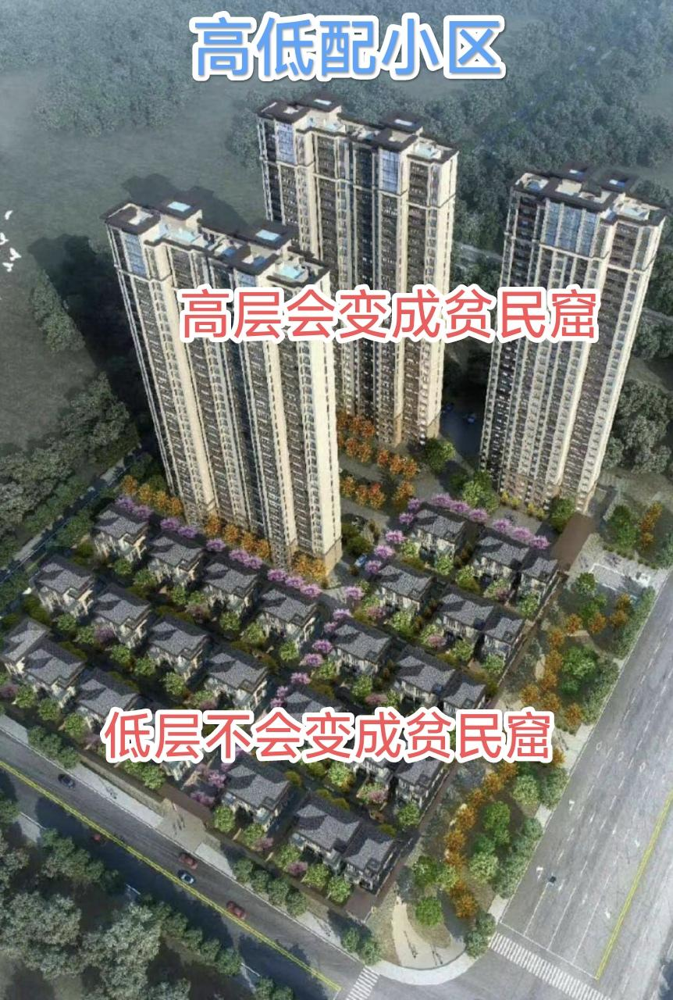
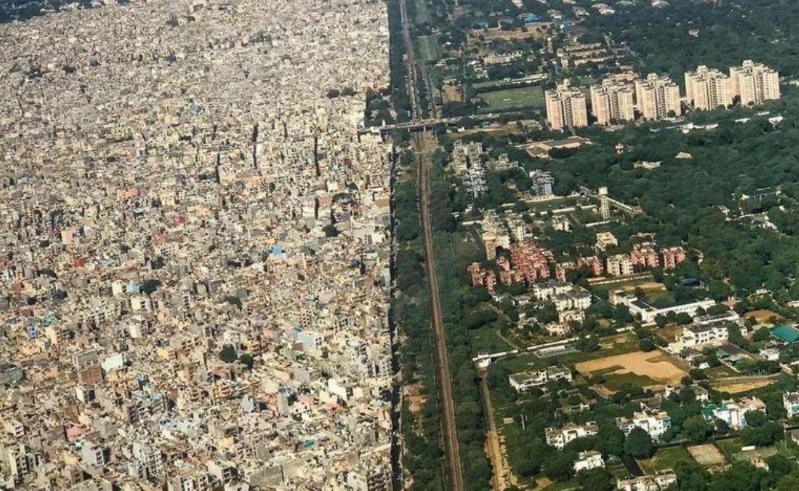
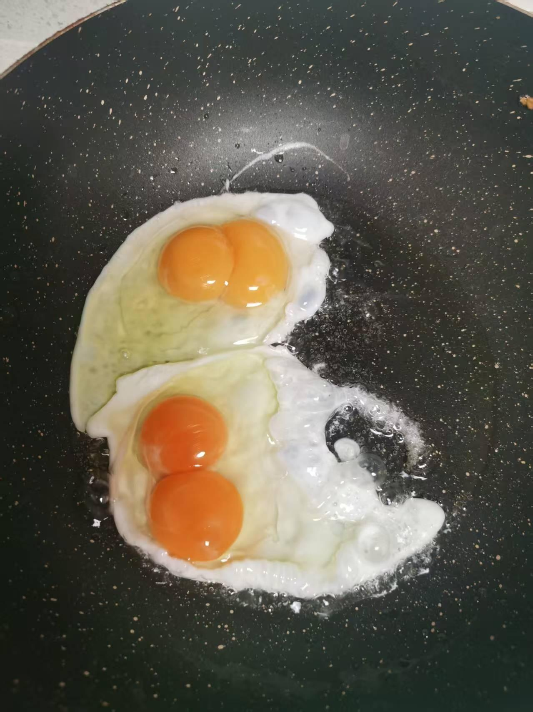

[toc]

# 问题

提问者：**<a href="https://www.zhihu.com/people/zzz-sir">米斯特尔</a>**
提问时间: 2023-11-16 16:27:28
总回答数: 1491
总访问量: 19634350

发达国家的高层住宅不多，年久失修后有钱人（中产）搬走住进大house，于是高层住宅就被穷人或者租客占据。

可是我国全是高层住宅，就连县城都全是密密麻麻的高层住宅，没几个大house，年久失修后，中产没几个能搬进大house吧，会不会中产就一直住在高层住宅里，或者搬进新一点的高层住宅，这样高层住宅很难变成贫民窟了？

问题补充：高低配小区里的低层住宅，如6层及以下洋房甚至别墅是不是能避免变成“贫民窟”？

# 回答

回答者： **<a href="https://www.zhihu.com/people/ban-chen-zhao">战上海</a>**
回答时间: 2024-2-26 20:12:16
点赞总数: 102
评论总数: 31
收藏总数: 12
喜欢总数：4

诅咒高层住宅变成鸽子笼，变成贫民窟，是简中网特有的一种现象。

根源是网友买不起大城市（一二线）的新房子。

很想住，但又买不起。

于是，简中网就出现了一批又一批的提问：电梯楼以后要变成贫民窟、房价要跌80-90%、为什么不建造一户建、房产税要开始了……一系列的月经话题。

而且这种话题，评论特别多，更多的是吵架，发泄不满。

至于深层次的社会规律、解决办法，那跟网友没有关系，网友只想骂人，骂骂社会，其他的什么都不想管。

电梯房变成贫民窟？

这是什么意思呢，是二三百万的电梯房，几十年后，价格跌到三五万一套；还是两三千万的电梯房，跌到三五十万一套？

电梯房都沦为贫民窟，那这些口袋又没攒到几个钱的网友，住在哪里，住在什么地方呢。

住在一户建，每天忍受亲嘴楼、巨大噪音、发霉潮湿、不通风不透气、面积贼小、没有绿化、没有小区设施、没有公共场合？

还是住在郊区的大号别墅，有游泳池，有三五层，七八个车库，有篮球场的庄园？

网友不愿意想清楚，也不愿意去想。

想明白了，那是更痛苦啊。

要是走街串巷，国内外捋的清清楚楚，很容易就可以发现，要么忍受孤独住在较远的破旧城镇，房子很大，院子很大，就是没几个人。

要么住在拥挤的市中心，电梯楼一般还只能租，大城市破房子都不一定买得起。

没错，这说的是国外，说的是欧美。

很多网友拿着网上流传的房价收入比数据，工资中位数，平均收入数据等等，在网上和别人吵的天翻地覆：老外买房子非常容易！

网友描述的：老外买房子轻松到了，吃一顿大餐的价格而已。

一提到可怜的住房拥有率，网友就憋红了脸，说老外不喜欢买房，就喜欢租房。

而且还是特别喜欢租那种“租售比特别高”的高租金房子。

至于便宜租金的房子，网友一般不提。

毕竟，国外租过房的人，百倍于国外买过房的人。

租住面积，网友更是基本不说。

特别是一说买房，网友漫天遍野的大豪斯，超大独栋；但一说租房，网友从来就不提大豪斯了，基本上都随便聊几句合租，强调“租售同权”。

那种大城市的，带有三五个车位的，上下三层的，可能还有篮球场，游泳池的大豪斯，很少看到有网友说：老外就喜欢租这种房子。

然后顺口再贬低一下国内的老破小，鸽子笼，嘟囔一句电梯楼未来都会变成贫民窟。

很少很少看到几个网友，认真分析自己的收入，可以买什么地段、什么建筑及装修、什么学区的房子。

如果买得起，怎么买。

如果买不起，怎么租，怎么租一辈子，特别是五六十岁以后怎么过日子。

几乎看不到什么像样的分析。

大部分都是疯狂的贬低国内各种房子，然后又疯狂的吹捧国外各种房子，特别是日本的一户建这种垃圾建筑，日本人公认的垃圾建筑，在简中网，这却是超然于别墅的产物。

当我问了一些自己接触的老外，老外翻个白眼，问我要不要滴滴下打人单，要的话，先送我几个挨打的单子。

我在上海见过的老外，有租在老破小的穷老外，有租在市中心大平层的老外，也有租在郊区大独栋的老外，从来没有人跟我说，租房更快乐。

问过为什么不买房？结果不是我挨打，就是一堆白眼。

问过喜欢郊区别墅，还是市区电梯楼，除了一个外国官员要住别墅，其他都是选择市区大平层，要电梯楼，很高很高的那些电梯楼。

还问过为什么不选择住郊区小别墅，回答基本上是市区电梯楼住的非常爽，如果是做生意，才考虑郊区别墅，方便谈生意开银趴，方便拖家带口。

对于上海最近五年的新电梯房，住过的老外赞不绝口，就是租金太贵了。

还有个比较有钱的老外，选择的是工作日租住在市区大平层，周末租住在郊区别墅，不选择，全都要。

还有个老外，一句话挑明：穷在闹市无人问，富在深山有远亲。

本来就是穷人住的房子，小区设施差，维护差，秩序差，租住体验从来没有好过；而有些一开始就是富人小区的，比如他住过的仁恒滨江，国际丽都，二十多年的小区，一点都不差。

总结说：一开始就差的房子，之后还是一直差；之前好的房子，虽然每年都有变的更差一些的，但相对于之前就差的房子，这些房子依然超过别人。

什么贫民窟不贫民窟的。

只是某些网友的一厢情愿，总有人以为自己诅咒几句，买房子的人以后就会倒大霉。

电梯房变贫民窟，房价跌80%，房产税收死有房子的，等等，都是一样的诅咒。

其实，从2000年开始，诅咒房产、骂社会、骂房价的人，就一直存在。

你只要问问他们，这二十多年来，他们过的幸福吗，就知道了结果。

也可以问问，疫情之后五年来，骂房价的网友，过的怎么样，就什么都知道了。

  

  

  

原文地址：[(战上海)都说高层住宅几十年后会变成贫民窟，但是我国几乎全是高层住宅，总不能全变成贫民窟吧？](https://www.zhihu.com/question/630417564/answer/3410163480) 

# 评论

1. <a href="https://www.zhihu.com/people/32-30-84-24-15">辣几志虎</a> (<small title="陕西">2026-7-16 10:26:7</small>): 你是不是在高点上车买房的？［飙泪笑］［飙泪笑］
   - <a href="https://www.zhihu.com/people/li-qiang-40-4-2">ramp丶</a> (<small title="山东">2026-8-9 18:14:31</small>): 你别提，你一提，他晚上饭都吃不下
2. <a href="https://www.zhihu.com/people/askji-du-cai-bao">像素模糊</a> (<small title="广东">2026-2-25 2:10:23</small>): 那不是诅咒，那是许愿呢。  
 
低认知都是从不考虑自己，然后从别人的生活上获得快乐，哪怕对别人的分析都是是错的，只要他自己认为对，他就是快乐的。
3. <a href="https://www.zhihu.com/people/shi-jian-de-mei-gui-21">时间的玫瑰</a> (<small title="重庆">2025-8-14 11:0:14</small>): 第二张图足以说明问题
   - <a href="https://www.zhihu.com/people/jimmy0411">GoodLuck135</a> (<small title="甘肃">2025-12-27 22:54:13</small>): 第2张图左边是哪里？右边是哪里？
4. <a href="https://www.zhihu.com/people/you-ge-suo-tuo-si-de-xun-dao-zhe-92">犹格·索托斯的殉道者</a> (<small title="广东">2026-5-28 20:6:29</small>): 上海≠全中国
5. <a href="https://www.zhihu.com/people/yu-zi-jiang-42-51-90">阿鱼子</a> (<small title="内蒙古">2025-4-13 9:33:31</small>): 天呐忍受孤独 我看到你这句话就不敢苟同了，忍受孤独??
   - **战上海** (<small title="上海">2025-4-13 21:36:18</small>): 等你住到十几万一平的豪宅里，才会真正体会到
   - <a href="https://www.zhihu.com/people/0-0-32-93-6">0.0</a> (<small title="回复于 2025-10-17 9:9:40/广东"> ✉️:战上海</small>): 还有触发条件啊
   - **战上海** (<small title="回复于 2025-10-17 14:39:49/上海"> ✉️:0.0</small>): 是的，智商达不到门槛，是触发不了理解层次的
   - <a href="https://www.zhihu.com/people/zui-hou-de-huang-di-89">最后的皇帝</a> (<small title="回复于 2026-8-5 10:37:32/重庆"> ✉️:战上海</small>): 为什么要住这么便宜的房子？［好奇］
   - <a href="https://www.zhihu.com/people/fang-xiang-hui-88">灰灰</a> (<small title="回复于 2026-8-6 10:22:5/浙江"> ✉️:战上海</small>): 十几万一平就算豪宅了？什么时候豪宅门槛这么低了［捂脸］
   - **战上海** (<small title="回复于 2026-8-6 10:37:25/上海"> ✉️:灰灰</small>): 对于有钱人来说，当然不是。  
 
对你来说，就是你下辈子也无法逾越的天花板。
   - <a href="https://www.zhihu.com/people/fang-xiang-hui-88">灰灰</a> (<small title="回复于 2026-8-6 14:3:58/浙江"> ✉️:战上海</small>): 你凭什么假定我没钱呢［好奇］
6. <a href="https://www.zhihu.com/people/ScHZergCat">猫虫</a> (<small title="河南">2026-8-7 3:6:41</small>): 原来只有一二线才有高层［思考］  
 
看了一眼ip.，释怀了［尴尬］
   - **战上海** (<small title="上海">2026-8-7 11:2:29</small>): 18线的别墅，那么便宜，也没有见你买一套啊
7. <a href="https://www.zhihu.com/people/a-fei-ai-he-bing-kuo-luo">阿飞爱喝冰阔落</a> (<small title="内蒙古">2026-8-7 7:15:29</small>): 说吧，你的房子降了多少
   - **战上海** (<small title="上海">2026-8-7 10:59:7</small>): 上一套？从11万降到不到5万，我5万买的
   - <a href="https://www.zhihu.com/people/a-fei-ai-he-bing-kuo-luo">阿飞爱喝冰阔落</a> (<small title="回复于 2026-8-7 12:12:50/内蒙古"> ✉️:战上海</small>): 英雄所见略同，我高点咬死不买，今年买了130平的小高新房。零公摊［赞同］
8. <a href="https://www.zhihu.com/people/googleyi-sai-nuo-zhang-bo-ming">你也是达瓦立氏</a> (<small title="河南">2026-8-6 10:13:23</small>): 你看，没人回你了
9. <a href="https://www.zhihu.com/people/ni-cai-23-78-35">黄粱一梦</a> (<small title="陕西">2026-7-30 11:23:57</small>): 哄抬物价
10. <a href="https://www.zhihu.com/people/mob-42-9">爱党爱国爱人民</a> (<small title="云南">2026-4-3 20:51:2</small>): 高层变贫民窟也不是不可能，反正富豪基本一套住不过十年，换一套更新、更好的住就行了，长期只住一套的确实没见过
11. <a href="https://www.zhihu.com/people/hei-ya-3-15">海狗子</a> (<small title="上海">2026-1-23 10:39:14</small>): 火麒麟888后来不也免费送［飙泪笑］
    - <a href="https://www.zhihu.com/people/nicklemars">nicklemars</a> (<small title="回复于 2026-4-23 7:59:21/河北"> ✉️:战上海</small>): 这是还没到维修时期，你看看90年代的高层都是什么样子了。
    - **战上海** (<small title="上海">2026-1-23 15:38:31</small>): 国内住宅楼大火的比例，远少于欧美吧？
12. <a href="https://www.zhihu.com/people/42-70-42-69">太阳</a> (<small title="上海">2026-1-19 19:52:41</small>): 10年换一部电梯，户均5000而已。物业费3000一年，管道整体更换成本更低，物业费已经覆盖了维修成本，已经不需要再筹集维修基金了。高层住宅的维护问题没有那么可怕
    - <a href="https://www.zhihu.com/people/49-50-17-80-70">风之沙言</a> (<small title="河南">2026-5-31 17:3:19</small>): 5000而已，房贷压着，500都够呛，还有入住率
    - **战上海** (<small title="上海">2026-1-19 20:50:16</small>): 我这边有十几年的电梯，没有总是出啥故障，有，但并没有被污蔑的那样
13. <a href="https://www.zhihu.com/people/jiu-jue-de-ni">就觉得你</a> (<small title="江苏">2026-1-5 15:13:48</small>): 疫情之后房价不已经跌了一半了吗
    - **战上海** (<small title="上海">2026-1-5 16:31:57</small>): 那看你住在哪儿了，我陆家嘴附近的老破小，是跌之后买下来的，目前还在跌，就看拆迁能不能轮到。
 
至于旁边的电梯房，呵呵。
 
你慢慢等陆家嘴的电梯房下跌，你有的是机会。
 
等30年，说不定还真让你等到了。
14. <a href="https://www.zhihu.com/people/xiao-ke-ai-71-94-44">想游泳的咸鱼</a> (<small title="山东">2025-8-8 8:18:47</small>): 我觉得你说的没错［捂脸］超高层大平层变贫民窟？难道以后豪宅标准是老破小吗［捂脸］

=[评论](./attachments/comments.json)

