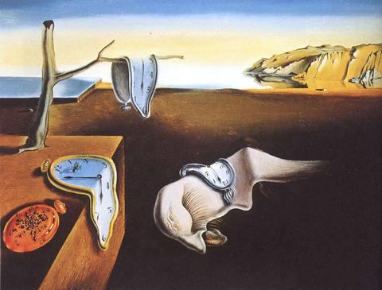
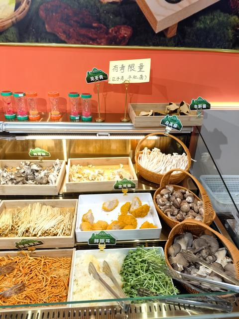
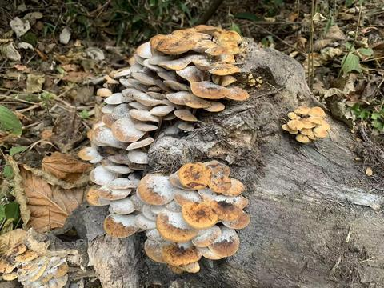

[toc]

# 问题

提问者：**<a href="https://www.zhihu.com/people/a-12-89-86">A伊焱童</a>**
提问时间: 2023-8-4 11:32:45
总回答数: 642
总访问量: 31213319

哪一刻让你知道吃完菌子坏菜了？

  

  

1.上回我们在云南旅游，吃完菌子就在宾馆附近溜达，看到一排粉衣小护士招手，我就过去了，第二天天亮了我才回的宾馆。

  

2.坐高铁出去玩，我在高铁上吃了几个提前买的菌子，吃完后突然发现我在高速铁路上骑自行车，我就知道坏菜了。

  

3.吃完见手青后做作业，我看见有机化学方程式在自己动，我就知道今晚的菌应该是没熟透。

  

4.第一次去云南玩，吃了菌子不知道自己中毒了，一直听到小草喊我名字，然后我就说草成精了，最后被好心群众送到医院。

  

5.吃完菌子后考试听英语听力带字幕了，这算不算服用违禁药物？

  

6.实习的时候碰到一个病人，他说医生我野生菌中毒了，问他你怎么知道的，他说他看见星球大战了。

  

7.一个朋友中午吃菌子中毒了，下午上办公室楼梯摔了一跤（中毒，走不稳），然后开始说胡话，大家不清楚情况，将人送去医院照脑外、做CT，均无大碍。家人批评医生：人都摔傻了，怎么可能没事？直到后来他抓空中的小人……

  

8.我吃完菌子之后，看见老板打视频电话给我狂抽自己耳光说他错了的时候，我知道该叫救护车了。

  

仅供娱乐，蘑菇有毒，危害生命，切勿尝试！

# 回答

回答者： **<a href="https://www.zhihu.com/people/shi-ran-20-15">拾染</a>**
回答时间: 2026-1-21 22:21:11
点赞总数: 17706
评论总数: 1348
收藏总数: 5321
喜欢总数：4853

谢邀。人在医院，刚输完液。现在的感觉就是脑子里的水终于排干了，但尊严也随之流干了。

关于这个问题，我看评论区很多人都在说什么“看见小人划船”、“看见太奶招手”。说实话，这些我都觉得太温和了，太缺乏想象力了。

真正的“坏菜”，不是视觉上的崩塌，而是世界观的逻辑重构。

那一刻不是因为看见了怪东西，而是你看见了怪东西，却觉得它无比合理，甚至想要跪下来给它磕一个。

对我而言，那个瞬间发生在昨天晚上 11 点 42 分。

当时，我发现我养的那只除了拆家什么都不会、智商常年欠费的哈士奇，突然站了起来，用一种极其纯正、带着三分讥笑七分凉薄的伦敦腔对我说：

“先生，这就是你写的代码？哪怕在我也能看得出，这里的梯度下降陷入了局部最优解。还是让我来教你什么是真正的凸优化吧。”

最可怕的不是狗说话。 最可怕的是，我当时竟然觉得羞愧难当，甚至递给了它一支红笔，恳求它：“老师，这块真的能收敛吗？求您指点迷津。”

下面是详细经过。警示后人，吃饭时慎点。

### 第一章：来自云南的馈赠，与理工男的自信

事情的起因很俗套。我有个发小，云南人，前几天给我寄了一箱菌子。

包裹里不仅有菌子，还附带了一张手写的纸条，字迹潦草得像医生开的处方：“见手青。一定要炒熟！一定要炒熟！一定要炒熟！哪怕炒成焦炭也不要吃半生的！切记！！”

连用了三个感叹号。

作为一个严谨的理工科研究生，我看着这箱菌子，发出了不屑的冷笑。

我不怕毒。我相信科学。我知道毒素本质上就是蛋白质的变性问题。只要温度足够高、时间足够长，什么毒蛋白能扛得住美拉德反应的制裁？

我想着最近正好在赶一个项目，压力大，头发掉得比秋天的叶子还快，正好补补。

那天晚上，我拿出了做实验的架势。 我没有用普通的炒菜锅，我甚至想把实验室的恒温加热台搬回来。但我忍住了，我拿出了我的秒表。

起锅，烧油，下蒜片（据说蒜变黑就是有毒，这是民间科学，但我还是信了）。 菌子下锅的那一刻，滋啦一声，异香扑鼻。那种香味怎么形容呢？它不像是食物的味道，它像是直接勾起了你基因深处对“能量”的原始渴望。

我盯着秒表。朋友说炒15分钟，我决定炒25分钟。 我是一个在参数设置上喜欢留余量的人（Margin of Safety）。

25分钟后，菌子已经缩水了一半，颜色变得深沉油亮。我看了一眼锅里的蒜瓣，白的，像雪一样白。 稳了。

我盛了一大盘，配着昨天剩下的冷饭。 第一口下去，我简直想哭。滑、嫩、脆，还有一种独特的泥土芬芳，仿佛整个云南的雨季都在我舌尖上炸开。

我风卷残云地吃完了。吃完后，我打了个饱嗝，心满意足地坐到了电脑前，准备继续和我那堆像屎一样的仿真数据搏斗。

### 第二章：这一刻，我是神

起初的四十分钟，一切都很正常。 不，准确地说，是太正常了，正常得超乎寻常。

大家知道，做科研的人，晚上一般都是在大脑混沌和焦虑中度过的。但吃完菌子半小时后，我感觉到了一股前所未有的清明。

那种感觉，就像是某人把你大脑里的“缓存”全部清空了，顺便给你加装了两条 64G 的内存条。

我看着屏幕上的代码，那些平时让我头秃的 Bug，此刻在我就像是一群没穿衣服的小丑。我一眼就看穿了它们的本质。 “哦，原来这里的矩阵维度不匹配。” “哈，这里的边界条件设错了。”

我手指在键盘上飞舞，敲击声像是在演奏拉赫玛尼诺夫的第三钢琴协奏曲。我感觉自己不是在写代码，我是在编织宇宙的真理。

我甚至开始哼歌。 我觉得自己就是图灵转世，是冯·诺依曼的亲传弟子。我甚至思考要不要现在就给导师发邮件，告诉他我也许可以冲击一下明年的图灵奖。

这种“全知全能”的狂妄感，其实就是中毒的第一阶段：精神亢奋。

也就是俗称的：回光返照。

### 第三章：世界的崩塌，与二维化的室友

真正的异变，是从我看我的水杯开始的。

我口渴了，伸手去拿桌子左上角的马克杯。 然而，我的手穿过了杯子。 我愣了一下，再抓，又穿过去了。

我定睛一看，发现那个马克杯不再是一个三维物体。它变成了一个二维的平面贴图，就像是那种低劣的 3D 游戏里为了省资源而贴在墙上的假窗户。

我揉了揉眼睛。 “可能是我太累了。”我对自己说。

我转头看向墙上的挂钟。 挂钟融化了。 是真的融化。坚硬的塑料外壳像流淌的芝士一样滴落下来，指针软趴趴地垂着，像两根煮烂的面条。但诡异的是，我依然能听到“滴答、滴答”的声音，只是这声音不再是机械声，而是像有人在耳边轻声念叨：“Deadline… Deadline… Deadline…”

这时候，我的室友推门进来了。

如果是平时，我会看到一个穿着大裤衩、端着泡面的死宅。 但那一刻，在我的视野里，他变成了一个由无数绿色字符组成的人形代码聚合体。

就像《黑客帝国》里的那种视觉效果。 他每走一步，身上就掉下来几个“0”和“1”。 他张嘴对我说话，但我听不到声音，我只看到一个个 `print("Hello?")` 的函数从他嘴里飘出来，砸在地上，发出清脆的玻璃破碎声。

我并不害怕。 相反，我当时的想法是：“天哪，他的建模面数太低了，这怎么能过审稿人的法眼？我得帮他优化一下网格。”

于是我站起来，试图伸手去抓他身上的代码。 室友惊恐地看着我，据他后来的描述，我当时眼神涣散，嘴角带着诡异的微笑，双手在空中虚抓，嘴里念叨着：“别动，这块纹理没贴好，有接缝……”

### 第四章：哈士奇教授的降临（坏菜时刻）

室友被我吓跑了。 房间里只剩下我和那只哈士奇——“奥利奥”。

奥利奥平时是一只很没尊严的狗。它唯一的爱好就是咬我的拖鞋，以及在我不注意的时候偷喝我的洗脚水。

但在那个时刻，它变了。

我感觉周围的空气突然凝固了。一种庄严、肃穆、神圣的 BGM（背景音乐）在我脑海中响起，好像是《帝国进行曲》。

奥利奥坐在我对面的人体工学椅上。 它的身形开始拉长。 它身上的黑白毛发，在我眼里，变成了一套剪裁得体的黑色燕尾服。 它的狗头，虽然还是狗头，但眼神变了。那不再是清澈的愚蠢，那是深邃的智慧。

最离谱的是，我看它戴上了一副金丝边眼镜，左爪还拿着一根教鞭。

它轻轻咳嗽了一声。 那声音不是“汪”，而是一声低沉的男中音。

“坐下。” 它说。

我扑通一声就跪下了。动作标准得像是训练了十年。 我心里没有一丝抗拒，只有对知识的渴望和对权威的敬畏。

奥利奥推了推眼镜，指着我的电脑屏幕，语气严厉： “这就是你这周的产出？你自己看看，这行代码的鲁棒性在哪里？如果在高噪环境下，你的算法能活过三秒吗？”

我冷汗直流，哆哆嗦嗦地说：“老……老师，我考虑了高斯白噪声……”

“高斯白噪声？”奥利奥冷笑一声，它站起来，用两条后腿踱步，前爪背在身后，“真实世界的噪声是你能用正态分布概括的？你这是在侮辱概率论，还是在侮辱我的智商？如果你觉得这能发SCI，我建议你直接去写科幻小说。”

听听！听听这用词！ 多么精准，多么刻薄，多么像我那该死的导师！

那一刻，我彻底崩溃了。 我知道我坏菜了。 但我不是觉得自己中毒了，我是觉得自己学术生涯坏菜了。

我抱住奥利奥的大腿（那是真狗腿，毛茸茸的），痛哭流涕： “教授！我不发SCI了！求您别毙我的论文！我这就改！我用遗传算法！我用粒子群优化！求您再给我一次机会！”

奥利奥似乎很享受这种膜拜。它伸出一只爪子，拍了拍我的头（像是在摸狗）： “孺子可教。这样吧，你现在给我手推一遍卡尔曼滤波的五个公式，推不出来今晚不许吃饭。”

于是，在室友带着校医再次冲进宿舍的时候，他们看到了这辈子最震撼的一幕：

一个一米八的壮汉，跪在一只哈士奇面前，在地板上用记号笔疯狂地写数学公式。 一边写一边哭：“ `!$P_k = (I - K_k H) P_{k-1}$` ……呜呜呜……教授，这里要不要转置啊？我忘了……”

而那只哈士奇，一脸懵逼地被我按在椅子上，想走又不敢走，只能无助地发出“嗷呜……嗷呜……”的惨叫。 在我听来，那全是：“错了！重写！这一步推导逻辑不通！”

### 第五章：急诊室里的傅里叶变换

后来的记忆就是断断续续的了。

我被几个人架着往外走。 但我拼命挣扎，因为我看到我的“教授”并没有跟上来。

我冲着那只狗大喊：“带上教授！他是通讯作者！没有他我毕不了业啊！！” 哈士奇被吓得钻到了床底下。

上了救护车，医生给我扎针。 在我眼里，那个护士姐姐不是护士，她是一个巨大的Python解释器。 她手里的针筒，是一行行报错信息。

当针头扎进血管的那一刻，我感到一阵剧痛，但我喊出来的不是“疼”，而是： “Runtime Error！Index Out of Bounds！Stack Overflow！”

医生拍了拍我的脸：“小伙子，醒醒，这是生理盐水，不是代码。”

我抓住医生的白大褂，眼含热泪地问：“大夫，你能告诉我，人生的本质是复变函数吗？如果是的话，我的留数在哪里？” 医生叹了口气，对旁边的护士说：“见手青，起码吃了半斤。这都开始思考哲学了。”

到了急诊室，最痛苦的洗胃环节来了。 那根管子插进去的时候，我以为是《黑客帝国》里的母体在给我插管。 我一边呕吐，一边看着呕吐物。 那些五颜六色的呕吐物，在我眼里变成了一个个被释放的内存块。

我欣慰地笑了：“内存泄漏终于解决了……系统……系统变流畅了……” 说完这句话，我就彻底断片了。

### 尾声：社死虽迟但到

醒来是在第二天下午。 阳光刺眼，世界恢复了枯燥的三维结构。 我看着洁白的天花板，没有代码，没有公式，没有会说话的狗。

床边坐着我的室友，还有一脸复杂的辅导员。 室友见我醒了，默默地拿出了手机。 “要看吗？我录了全程。”

我：“……” 我：“删了吧，算我欠你一条命。”

室友：“删不掉了，昨晚发到班级群里，用来问大家这是什么蘑菇中毒症状，结果被转发了几百次。现在全院都知道你管你的狗叫博导，还给它磕头推导公式。”

我痛苦地闭上了眼睛。 这时候，手机响了。 是我真正的导师发来的微信。 内容很简单，就一句话： “听说你昨晚那是灵感爆发？卡尔曼滤波推导得不错，虽然有点乱，但思路是对的。身体养好了来实验室，我们把那个公式加上去。”

我看着手机，又看了看窗外。 我突然觉得，也许那并不是幻觉。 也许在那一刻，在毒素的作用下，我真的连接到了宇宙的真理数据库，而我的狗，只是那个数据库的管理员。

写在最后：

朋友们，我用亲身经历告诫大家：

1.  如果你不是要冲击诺贝尔奖，不要尝试见手青。
2.  如果你觉得自己必须吃，请把家里的猫狗锁好，或者把它们送走。
3.  最重要的一点：如果你的狗开始教你微积分，或者你的猫开始给你讲量子力学，别犹豫，不管它讲得多精彩，立刻、马上、拨打 120！

（完）

  

原文地址：[(拾染)吃完毒蘑菇，哪一刻你知道自己坏菜了？](https://www.zhihu.com/question/615588085/answer/1997433561188414814) 

# 评论

1. <a href="https://www.zhihu.com/people/gao-shang-89-52">坐在月亮上</a> (<small title="山东">2026-1-22 3:6:15</small>): 文化人就是中毒也和我不一样［大笑］看的好过瘾
   - <a href="https://www.zhihu.com/people/56-64-26-73">知乎用户PbYT0h</a> (<small title="山东">2026-1-24 10:5:25</small>): 人家做梦都能梦到解题，醒过来甚至还有印象［大哭］
   - <a href="https://www.zhihu.com/people/xbsura">肖贝贝</a> (<small title="北京">2026-1-24 11:57:28</small>): A 润色的, 看多了一眼就能看出来
   - <a href="https://www.zhihu.com/people/gao-shang-89-52">坐在月亮上</a> (<small title="回复于 2026-1-24 13:13:3/山东"> ✉️:知乎用户PbYT0h</small>): 是呀，让我醒着我也解不出来［捂脸］
   - <a href="https://www.zhihu.com/people/yi-xin-31-30-2">一心</a> (<small title="浙江">2026-1-24 21:15:10</small>): 说说你看到什么说说你看点什么。。。
   - <a href="https://www.zhihu.com/people/hun-tun-tu-dou">山顶冻人</a> (<small title="回复于 2026-1-24 21:19:51/山东"> ✉️:知乎用户PbYT0h</small>): 大家不都这样吗，梦中做题，醒了后想一想题好不好，好的话赶紧找个笔记下来［思考］
   - <a href="https://www.zhihu.com/people/ydxud0">Pink Dove</a> (<small title="山东">2026-1-25 23:41:45</small>): 一眼就是ai写的啊［思考］
   - <a href="https://www.zhihu.com/people/gao-shang-89-52">坐在月亮上</a> (<small title="回复于 2026-1-26 15:58:59/山东"> ✉️:Pink Dove</small>): 我没有看出来［飙泪笑］
   - <a href="https://www.zhihu.com/people/34523-15">知乎用户34523</a> (<small title="北京">2026-1-27 22:53:12</small>): AI
   - <a href="https://www.zhihu.com/people/61-15-22-81-97">李雪梅</a> (<small title="陕西">2026-2-2 11:56:18</small>): 笑的眼泪都出来了…
   - <a href="https://www.zhihu.com/people/gao-shang-89-52">坐在月亮上</a> (<small title="回复于 2026-2-2 21:43:39/山东"> ✉️:李雪梅</small>): 哈哈，确实，忍俊不禁［大笑］
   - <a href="https://www.zhihu.com/people/yao-ye-27-75">尧页</a> (<small title="山东">2026-2-12 8:22:43</small>): 哈哈哈
   - <a href="https://www.zhihu.com/people/71-40-74-26">阿尔卡迪亚法拉利</a> (<small title="回复于 2026-2-14 13:2:34/河南"> ✉️:山顶冻人</small>): 确实有我平时跟ai聊天的风格，但是不得不说如果都是作者自己写出来的，我要开始怀疑人与人的差距了［大哭］
   - <a href="https://www.zhihu.com/people/sofia-98-60">Sofia</a> (<small title="湖南">2026-2-15 19:31:20</small>): 太搞笑了［飙泪笑］
   - <a href="https://www.zhihu.com/people/leng-shui-51">棕榈滩</a> (<small title="宁夏">2026-2-21 20:52:18</small>): 莫非你中毒遇到了嫦娥姐姐［好奇］
   - <a href="https://www.zhihu.com/people/gao-shang-89-52">坐在月亮上</a> (<small title="回复于 2026-2-24 19:32:29/山东"> ✉️:棕榈滩</small>): 哈哈，我小时候中毒的事情都记不清楚了，只记得吐了那个年轻的大夫一身［捂脸］
   - <a href="https://www.zhihu.com/people/zhiqyexwih7">zhiqYeXwIh7</a> (<small title="回复于 2026-3-5 17:3:56/黑龙江"> ✉️:肖贝贝</small>): 润色的我也写不出来啊［大笑］
   - <a href="https://www.zhihu.com/people/wo-zi-bi-liao-47-24">Teddy</a> (<small title="湖南">2026-3-19 10:14:2</small>): 一眼ai只能说［尴尬］
   - <a href="https://www.zhihu.com/people/iCraig">iCraig</a> (<small title="回复于 2026-3-19 11:18:18/山东"> ✉️:知乎用户PbYT0h</small>): 中了见手青跟AI的毒。
   - <a href="https://www.zhihu.com/people/ou-ge-46-10">鸥歌</a> (<small title="江苏">2026-4-6 22:13:10</small>): 这是ai写的
   - <a href="https://www.zhihu.com/people/gao-shang-89-52">坐在月亮上</a> (<small title="回复于 2026-4-7 12:37:18/山东"> ✉️:鸥歌</small>): 哇，为什么大家都能看得出来而我不能［捂脸］是通过哪里看出来的［好奇］
   - <a href="https://www.zhihu.com/people/lidangkun">mingming</a> (<small title="上海">2026-7-28 17:48:16</small>): 没可能的，菌子中毒没这么清晰的逻辑，更多的是难受
   - <a href="https://www.zhihu.com/people/zhu-ke-yue-90">朱柯樾</a> (<small title="河南">2026-7-28 19:45:36</small>): 我喝酒过敏，喝了两杯半，然后十几分钟感觉身体不受控制，有种吸毒仿佛的快感，身体抽搐
   - <a href="https://www.zhihu.com/people/gao-shang-89-52">坐在月亮上</a> (<small title="回复于 2026-7-29 11:29:31/山东"> ✉️:朱柯樾</small>): 哎呀，按说这样反应还是少喝吧，可能属于少有的过敏的情况。我见过我婆婆，闻了闻杯子里的白酒立马就头晕，去躺着了。
2. <a href="https://www.zhihu.com/people/jia-er-66-13">无法自拔</a> (<small title="澳大利亚">2026-1-22 2:11:31</small>): 为什么不趁那机会把作业给狗写 要它全部完成呢.
   - <a href="https://www.zhihu.com/people/xiao-hu-si-jing-fei">小狐死劲飞</a> (<small title="陕西">2026-1-22 9:5:39</small>): 你敢让导师替你写作业？你让别人替你写都不敢让导师知道！
   - <a href="https://www.zhihu.com/people/83-15-27-98-19">神经蛙</a> (<small title="北京">2026-1-23 14:29:45</small>): 那不还是自己写的［doge］
   - <a href="https://www.zhihu.com/people/shang-yong-hao-50">玛吉纳的蝴蝶</a> (<small title="上海">2026-1-23 19:42:30</small>): 心素是吧［doge］
   - <a href="https://www.zhihu.com/people/shui-gai">漠然</a> (<small title="浙江">2026-1-24 7:25:18</small>): 介于。。。。。某某某原因，躺平党坚决反对把自己的作业塞给别人［生气］［生气］［生气］［生气］［生气］
   - <a href="https://www.zhihu.com/people/miao-xiao-neng-74">小能</a> (<small title="美国">2026-1-27 19:39:21</small>): 要不。。。你也去看一下［发呆］
   - <a href="https://www.zhihu.com/people/ge-lei-lei">格雷雷</a> (<small title="印度尼西亚">2026-7-27 13:33:32</small>): 因为那时候哈士奇是他的博导啊，什么胆子敢让博导给他做作业
3. <a href="https://www.zhihu.com/people/62-37-17-63-53">充分不必要</a> (<small title="广东">2026-1-22 9:46:51</small>): 哥，我这辈子没求过人，求求你给我看看视频［感谢］
   - <a href="https://www.zhihu.com/people/wu-you-yun-yun">一只鹿</a> (<small title="江苏">2026-1-22 11:7:44</small>): 给你看他脑海中的视频？［大笑］
   - <a href="https://www.zhihu.com/people/ju-zi-shi-ju-se-de-11">橘子是橘色的</a> (<small title="回复于 2026-1-22 12:37:9/山东"> ✉️:一只鹿</small>): 看他同学录的视频
   - <a href="https://www.zhihu.com/people/guang-guai-lu-chi-77-41">水无月</a> (<small title="回复于 2026-1-23 10:50:25/上海"> ✉️:橘子是橘色的</small>): 录录我的
   - <a href="https://www.zhihu.com/people/ni-ge-bi-da-ye-88">晚夏</a> (<small title="回复于 2026-1-23 15:16:14/广东"> ✉️:水无月</small>): ?
   - <a href="https://www.zhihu.com/people/tu-zi-guan-hai-23">兔子观海</a> (<small title="安徽">2026-1-25 12:33:25</small>): 我也想看
   - <a href="https://www.zhihu.com/people/gu-qi-yuan-47-13">顾七愿</a> (<small title="回复于 2026-1-28 13:22:35/河北"> ✉️:水无月</small>): ？是正经话嘛？
   - <a href="https://www.zhihu.com/people/meng-xue-45-67">孟晓雪</a> (<small title="上海">2026-2-12 22:30:52</small>): 我也想看［酷］
   - <a href="https://www.zhihu.com/people/yue-xia-feng-yin">月下风吟</a> (<small title="山东">2026-3-15 15:16:10</small>): 上次求种子的时候你也是这么说的
   - <a href="https://www.zhihu.com/people/qia-wa-yi-si-nai">卡哇伊斯奈</a> (<small title="河南">2026-3-17 9:40:28</small>): 同求
   - <a href="https://www.zhihu.com/people/yyggg-91">食色性也</a> (<small title="安徽">2026-3-26 13:2:36</small>): 我也想求一个
   - <a href="https://www.zhihu.com/people/su-sheng-xuan">杰克马户</a> (<small title="广东">2026-3-30 14:41:53</small>): 可以求AI，用他写的内容让AI生产
   - <a href="https://www.zhihu.com/people/xue-rui-16-80">森霖雨燚</a> (<small title="陕西">2026-3-31 9:37:19</small>): 我也要看视频［感谢］
   - <a href="https://www.zhihu.com/people/yingwei-31">今天天气真好啊20</a> (<small title="美国">2026-4-13 22:30:17</small>): 我也要看，中毒了都在追寻真理的视频，太伟大了
   - <a href="https://www.zhihu.com/people/hui-zhen-83-84">踮起脚尖的夏天</a> (<small title="山东">2026-7-25 14:43:31</small>): 那里可以见到这个视频？
   - <a href="https://www.zhihu.com/people/cherry-97-49-38">七七八八</a> (<small title="广东">2026-7-28 18:3:29</small>): 全程没笑，看到你这个评论笑出声了，哈哈哈哈，我也想看
   - <a href="https://www.zhihu.com/people/zhang-xia-39-87">藕花风细</a> (<small title="重庆">2026-7-28 23:0:29</small>): 你们求到了，务必分享啊
   - <a href="https://www.zhihu.com/people/xing-kong-66-44-79">星空</a> (<small title="贵州">2026-7-29 11:59:52</small>): 满是下人类的八卦好奇心
4. <a href="https://www.zhihu.com/people/78-2-22-70">骨头哥</a> (<small title="湖南">2026-1-22 8:1:59</small>): 我平时业余学二胡，纯就是打发时间，一个月才去上一节课，学到了赛马，但很差，主要问题出在节奏，颗粒感。那次中招后疯狂拉赛马，老婆说拉得很不错了，以为我突然开窍突飞猛进。直到我拉了快一个小时，看我眼神不对，叫我没反应，但我当时只记得有一个很空灵但遥远的声音，感觉是对我的二胡呼应。老婆才想起我吃了蘑菇，感紧叫人到医院，现在赛马还是一如既往的烂
   - <a href="https://www.zhihu.com/people/lao-wang-66-30-84">老王</a> (<small title="江西">2026-1-22 9:21:52</small>): 啊？那不白中毒了？［看看你］
   - <a href="https://www.zhihu.com/people/jie-46-71">jie</a> (<small title="广东">2026-1-22 9:43:33</small>): 要不咱喝点酒试试？
   - <a href="https://www.zhihu.com/people/13-87-84-93-40">青之天际</a> (<small title="四川">2026-1-22 9:52:18</small>): 你老婆应该赶紧录好等你清醒按这个样板拉。
   - <a href="https://www.zhihu.com/people/cai-yun-58-44">采云</a> (<small title="黑龙江">2026-1-22 11:49:56</small>): 感觉像打了肾上腺素
   - <a href="https://www.zhihu.com/people/ben-pao-de-63">奔跑的</a> (<small title="回复于 2026-1-22 12:29:1/湖北"> ✉️:采云</small>): 不靠肾上腺素可能熬不到去医院洗胃……
   - <a href="https://www.zhihu.com/people/lue-lue-lue-45-85">略略略</a> (<small title="安徽">2026-1-22 21:7:52</small>): 也不用可惜，万一是特鲁宁布拉想招募你呢
   - <a href="https://www.zhihu.com/people/kang-qiao-ta-ba">方叁拾</a> (<small title="四川">2026-1-23 13:53:41</small>): 听你这么描述 我感觉吃菌子是离吸毒最近的时刻了
   - <a href="https://www.zhihu.com/people/bai-bai-66-19-90">白白</a> (<small title="广东">2026-1-24 11:44:33</small>): 不是，好不容易的顿悟被你整没了
   - <a href="https://www.zhihu.com/people/ka-pei-47-39-33">巴卜阿一一</a> (<small title="越南">2026-1-25 0:24:41</small>): 顿悟了
   - <a href="https://www.zhihu.com/people/jeslly">Jeslly</a> (<small title="云南">2026-1-27 15:41:0</small>): 作为从小吃到大没有中招过的云南人，不敢给外省朋友吃，因为他们没有抗体，即便和我吃同一盘，我安全他们都未必［捂脸］
   - <a href="https://www.zhihu.com/people/wu-shan-yun-qi-feng-chui-bu-yi">巫山云起风吹不移</a> (<small title="回复于 2026-2-11 22:51:9/山东"> ✉️:Jeslly</small>): 好想尝尝啊，看中招人对这美味的描述，宁可中招也🉐吃一次！下次去云南必须安排上！
   - <a href="https://www.zhihu.com/people/97-31-34-94-45">再也不入爱河了</a> (<small title="回复于 2026-2-12 15:32:24/黑龙江"> ✉️:Jeslly</small>): 你说对了 ，我媳妇和她妹妹去云南找大学同学一起吃见手青，她同学没事，她妹妹没事，就她进医院了，这特么在家给我急的啊 ，好在没啥事 ，在医院待了三天
   - <a href="https://www.zhihu.com/people/shu-yu-jing-45-2">林深不知岁</a> (<small title="回复于 2026-2-12 16:23:52/福建"> ✉️:Jeslly</small>): 带上我，我想见识宇宙真谛。
   - <a href="https://www.zhihu.com/people/qazwwer">qazwwer</a> (<small title="北京">2026-2-12 16:57:4</small>): 都拉了一个小时都没有形成肌肉记忆？［吃瓜］［吃瓜］
   - <a href="https://www.zhihu.com/people/48-94-96-91-86">就你叫momo啊</a> (<small title="湖南">2026-2-13 15:19:14</small>): 心流
   - <a href="https://www.zhihu.com/people/he-huo-83">卧草</a> (<small title="广西">2026-4-9 10:55:21</small>): 看劈叉看成骑马了。
   - <a href="https://www.zhihu.com/people/xie-han-yu-24">hans</a> (<small title="广东">2026-6-21 10:42:22</small>): 要不要再吃一次［害羞］
   - <a href="https://www.zhihu.com/people/sirmeng">Sir孟</a> (<small title="回复于 2026-7-28 13:40:16/河北"> ✉️:老王</small>): 哈哈
   - <a href="https://www.zhihu.com/people/a-la-ding-86-49">momo</a> (<small title="回复于 2026-7-28 13:49:23/浙江"> ✉️:Jeslly</small>): 我去昆明出差时候，吃过几次见手青，非常非常美味，记得价格也挺贵，一盘都要100多！
5. <a href="https://www.zhihu.com/people/ram-17-28">RAM</a> (<small title="湖南">2026-1-24 14:53:21</small>): 有一次吃完蘑菇喝完酒在酒店睡觉，醒来发现教员坐在房间的窗边抽烟，我胆战心惊的说了一句，爷爷您怎么来了。他叹了口气说:细伢子，你都能看到我了，还不赶紧去医院啊？
   - <a href="https://www.zhihu.com/people/tian-tian-hao-xin-qing-26-56">好心情呀好心情</a> (<small title="福建">2026-1-25 13:19:5</small>): 舍不得去医院，要多聆听一下教诲
   - <a href="https://www.zhihu.com/people/miss-w-53">Miss W</a> (<small title="广东">2026-1-26 4:31:55</small>): ［大哭］
   - <a href="https://www.zhihu.com/people/shushuhao">momo</a> (<small title="北京">2026-1-27 12:44:20</small>): 如果真能看到他老人家，我倒真想试试
   - <a href="https://www.zhihu.com/people/gigi-71-93">sgt.Gi</a> (<small title="山西">2026-1-30 17:58:48</small>): 诶呦卧槽，眼泪一下就下来了，我这就去买
   - <a href="https://www.zhihu.com/people/lan-pi-pi">兰皮皮</a> (<small title="山东">2026-2-2 13:54:33</small>): 梦里他也在救人［大哭］
   - <a href="https://www.zhihu.com/people/ke-lin-da-li-15">科林达丽</a> (<small title="广东">2026-2-5 22:19:38</small>): 哥们儿，见手青配酒，您是真的莽啊~
   - <a href="https://www.zhihu.com/people/97-35-38-66">迷之微笑</a> (<small title="江西">2026-2-14 13:45:49</small>): 还是湖南ip好神奇
   - <a href="https://www.zhihu.com/people/55-31-63-82-96">Aquamarine</a> (<small title="福建">2026-2-22 10:41:11</small>): 求教程！种类！份量！食用方法！
   - <a href="https://www.zhihu.com/people/zhu-da-xian-57">路人Z</a> (<small title="浙江">2026-3-12 18:11:31</small>): 我也哭了［大哭］
   - <a href="https://www.zhihu.com/people/zhein1001">羽化</a> (<small title="江苏">2026-3-19 10:41:45</small>): 哪种蘑菇？
   - <a href="https://www.zhihu.com/people/da-yu-pang-tuo-27">爽襟亭汉服</a> (<small title="埃塞俄比亚">2026-3-20 5:29:30</small>): ［大哭］我想见见毛爷爷［大哭］
   - <a href="https://www.zhihu.com/people/oceanic">尼克-彪兵</a> (<small title="辽宁">2026-4-1 16:9:24</small>): 按辈分至少是太爷爷啊
   - <a href="https://www.zhihu.com/people/man-shi-guang-xiao-miao">风的啦啦啦</a> (<small title="山东">2026-5-22 6:52:45</small>): 哭了［大哭］中毒后意识中的老人家都是在救人［大哭］
   - <a href="https://www.zhihu.com/people/zhi3qfi1ms">专研化妆品原料</a> (<small title="陕西">2026-6-7 14:13:43</small>): 昂
   - <a href="https://www.zhihu.com/people/bu-gu-50-43">不顾</a> (<small title="广东">2026-7-28 9:6:39</small>): 牛逼哥们
   - <a href="https://www.zhihu.com/people/wang-tie-chui-39-61">王铁锤</a> (<small title="回复于 2026-7-28 13:54:3/云南"> ✉️:羽化</small>): 肯定是见手青啊，只有这种中毒会这样
   - <a href="https://www.zhihu.com/people/da-peng-87-32-55">入江湖前妥佩剑</a> (<small title="黑龙江">2026-7-29 17:39:37</small>): 这太他妈吓人了
6. <a href="https://www.zhihu.com/people/ming-cheng-67">明诚</a> (<small title="内蒙古">2026-1-22 10:17:36</small>): 如果你经常做饭，当你发现炒了25分钟的蒜仍然“像雪一样白”，你就应该直接打车去医院了［捂脸］
   - <a href="https://www.zhihu.com/people/gan-lin-53-79">阑珊处寻</a> (<small title="浙江">2026-1-22 12:20:55</small>): 我也纳闷，炒了这么久还是白色？不缩水吗
   - <a href="https://www.zhihu.com/people/guan-cong-tou">管葱头</a> (<small title="湖北">2026-1-22 13:13:10</small>): 他炒菜时没开火？！锅都是凉的，蒜才会保持白嫩
   - <a href="https://www.zhihu.com/people/wang123-39-73">wang123</a> (<small title="北京">2026-1-23 11:3:59</small>): 豁然开朗了，哈哈哈
   - <a href="https://www.zhihu.com/people/ma-ke-si-jun">马克撕菌</a> (<small title="山东">2026-1-23 15:3:15</small>): 确实 按说炒着么久，算要么金黄，要么快糊了［飙泪笑］
   - <a href="https://www.zhihu.com/people/xiao-mu-destiny">夜凉如水</a> (<small title="安徽">2026-1-23 16:53:54</small>): 我抄生菜的时候放的蒜香，基本上一分钟就出锅了，那蒜都不是纯白色的了。［飙泪笑］
   - <a href="https://www.zhihu.com/people/li-yan-77-74">李彦</a> (<small title="回复于 2026-1-24 0:55:13/广东"> ✉️:管葱头</small>): 25分钟，油爆炒，蒜还是白色的？哥们要不你先炒个试试，一分钟就行。  
 
我估计那时候就已经开始了
   - <a href="https://www.zhihu.com/people/guan-cong-tou">管葱头</a> (<small title="回复于 2026-1-24 11:57:4/湖北"> ✉️:李彦</small>): 他先生啃了一口？［好奇］
   - <a href="https://www.zhihu.com/people/abcc-56">ABCC</a> (<small title="内蒙古">2026-1-24 12:48:5</small>): 我以为他自己把炒菜擅自改成了炖菜，所以时间发生了变化。［发呆］
   - <a href="https://www.zhihu.com/people/nuan-xin-er-80">神枪手</a> (<small title="山东">2026-1-24 13:50:11</small>): 他是不是边做边尝，一直尝了25分钟，所以才看见雪白的蒜［飙泪笑］［飙泪笑］
   - <a href="https://www.zhihu.com/people/huo-er-de-mo-fa-cheng-bao">皎月</a> (<small title="内蒙古">2026-2-1 23:28:7</small>): 原来问题在这里［飙泪笑］
   - <a href="https://www.zhihu.com/people/mao-mao-40-10-9">人民路北一里</a> (<small title="回复于 2026-2-12 1:30:44/广西"> ✉️:李彦</small>): 但是菌子缩水了半，颜色乌黑油亮咋解释？
   - <a href="https://www.zhihu.com/people/fang-rui-42-25">未知数X</a> (<small title="山东">2026-2-17 2:56:6</small>): 这个蒜应该是25分钟放的，答主说了，民间传说有毒的话蒜会变黑，所以答主在25分钟放蒜是为了看下菌子还有没有毒性！［doge］
   - <a href="https://www.zhihu.com/people/zhang-zhan-jie-68">乒乓球</a> (<small title="河南">2026-2-20 17:23:39</small>): 会不会炒的过程中被气味已经熏得渐入佳境了呢
   - <a href="https://www.zhihu.com/people/amanda40">Amanda Plain</a> (<small title="回复于 2026-2-26 13:17:6/河南"> ✉️:人民路北一里</small>): 一般一锅菌子炒完只有一碗，不只缩一半。［捂脸］
   - <a href="https://www.zhihu.com/people/suhe-41">雲無竭</a> (<small title="北京">2026-4-2 8:40:18</small>): 那也不是，那会还没吃呢。估计是炒菜光开着抽油烟机但是由于煤气欠费导致火灭了。但是油烟机噪音太大没火干炒了接近半小时。［捂脸］
   - <a href="https://www.zhihu.com/people/xue-qi-long">落下的夜</a> (<small title="山东">2026-7-28 10:1:24</small>): 怕蒜焦了，开最小火炒的呗，时间虽然长，但是蘑菇还是没炒熟
   - <a href="https://www.zhihu.com/people/wang-tie-chui-39-61">王铁锤</a> (<small title="回复于 2026-7-28 13:55:17/云南"> ✉️:落下的夜</small>): 如果你真的是开最小火炒的。25分钟也够了！
   - <a href="https://www.zhihu.com/people/bi-xing-hu">毕星湖</a> (<small title="回复于 2026-7-29 15:36:32/广东"> ✉️:未知数X</small>): 感觉这个应该是真相
7. <a href="https://www.zhihu.com/people/PChaoFeng">嘲风</a> (<small title="广东">2026-1-22 9:53:31</small>): 你有一包好友寄来的见手青，但是你没有请你的室友吃，，，［飙泪笑］［飙泪笑］
   - <a href="https://www.zhihu.com/people/shen-shen-82-81">削肾客的救赎</a> (<small title="江苏">2026-1-23 9:29:3</small>): 你跟我介意的点一样［酷］
   - <a href="https://www.zhihu.com/people/jiao-wo-shen-58-30">叫我燊</a> (<small title="河南">2026-1-23 16:12:55</small>): 那狗得有俩学生了［大笑］
   - <a href="https://www.zhihu.com/people/wei-zhi-quan-75">香留醉77</a> (<small title="辽宁">2026-1-24 15:40:45</small>): 有一说一，真的应该给室友吃的。虽然可能俩人一起中招没人打120，但起码不会视频流出导致社死。［捂嘴］
   - <a href="https://www.zhihu.com/people/da-zhen-zi-88-7">大榛子</a> (<small title="回复于 2026-1-25 0:6:2/浙江"> ✉️:叫我燊</small>): 求狗的心理阴影面积［飙泪笑］
   - <a href="https://www.zhihu.com/people/73-86-12-6">上班哪有不疯的</a> (<small title="回复于 2026-1-26 15:43:4/广西"> ✉️:香留醉77</small>): 没有社死但真死了咋办［捂脸］［捂脸］［捂脸］
   - <a href="https://www.zhihu.com/people/97-49-86-40">考试的企鹅</a> (<small title="加拿大">2026-1-31 6:26:12</small>): 扎心了［捂脸］
   - <a href="https://www.zhihu.com/people/oubnrt">知乎用户OuBnRT</a> (<small title="江苏">2026-7-23 14:13:8</small>): 最明智的决定，如果室友也吃了估计两个都没了
   - <a href="https://www.zhihu.com/people/amanda-34-41">amanda</a> (<small title="北京">2026-7-28 14:7:49</small>): 哈士奇也没吃，不幸中的万幸［捂脸］
   - <a href="https://www.zhihu.com/people/wodehuanxi">爱慕饭 3Q</a> (<small title="福建">2026-7-28 20:59:43</small>): 吃独食的下场？
8. <a href="https://www.zhihu.com/people/liang-liang-9-8">靓靓</a> (<small title="陕西">2026-1-25 3:7:49</small>): 奥利奥坐在我对面的人体工学椅上。 它的身形开始拉长。 它身上的黑白毛发，在我眼里，变成了一套剪裁得体的黑色燕尾服。 它的狗头，虽然还是狗头，但眼神变了。那不再是清澈的愚蠢，那是深邃的智慧。
   - <a href="https://www.zhihu.com/people/lalala-22">lalala</a> (<small title="新疆">2026-1-25 13:31:49</small>): 你这是边牧，文中是二哈
   - <a href="https://www.zhihu.com/people/jia-qian-ju-shi-369">加钱居士369</a> (<small title="回复于 2026-2-12 8:18:15/河南"> ✉️:lalala</small>): 合理，智慧的眼神不可能出现在二哈身上［捂脸］
   - <a href="https://www.zhihu.com/people/Zuowang-Canada">坐忘</a> (<small title="加拿大">2026-7-28 19:52:7</small>): 哈哈哈哈
9. <a href="https://www.zhihu.com/people/yuan-xiao-yang-41">共我看吴钩</a> (<small title="北京">2026-1-22 9:21:56</small>): 如果你的狗开始教你微积分，或者你的猫开始给你讲量子力学，我怎么舍得不听完！！！［飙泪笑］
   - <a href="https://www.zhihu.com/people/s-ir-l-l-v">s ir L l v</a> (<small title="河南">2026-1-26 9:14:3</small>): 听完，推导完，这是大机缘
   - <a href="https://www.zhihu.com/people/qie-ting-feng-yin-10-2">且听风吟</a> (<small title="山东">2026-4-7 15:27:15</small>): 朝闻道，夕死可矣。［思考］
10. <a href="https://www.zhihu.com/people/lichtgestalt-28">lichtgestalt</a> (<small title="福建">2026-1-22 9:51:31</small>): 感觉上ds味很大,但是部分又不完全是ds味。
    - <a href="https://www.zhihu.com/people/xu-bu-zou-36">学不走的徐不走</a> (<small title="云南">2026-1-22 16:27:1</small>): Gemini味，可能是3Pro的文风
    - <a href="https://www.zhihu.com/people/xuan-yan-39-3">景行</a> (<small title="北京">2026-1-23 15:2:15</small>): 感觉就是ai写的，天天用ai，味太冲了［捂脸］
    - <a href="https://www.zhihu.com/people/trumpet-creeper">小断</a> (<small title="回复于 2026-1-23 17:15:3/浙江"> ✉️:学不走的徐不走</small>): 基本确定，文风太像了，对这种文章基本前两百字就能断定了［魔性笑］
    - <a href="https://www.zhihu.com/people/wei-wei-an-87-99">横刀</a> (<small title="河南">2026-1-23 23:51:39</small>): 应该是自己写完用ai改了。那个第一章第二章一出来，味很浓
    - <a href="https://www.zhihu.com/people/midikk">momo</a> (<small title="广东">2026-1-24 20:53:20</small>): 我就在找你这个评论，没有我就自己写了
    - <a href="https://www.zhihu.com/people/22-64-59-75-98">知乎用户uWBmQU</a> (<small title="湖北">2026-1-25 14:30:1</small>): 应该是自己写了然后用AI排版润色的。
    - <a href="https://www.zhihu.com/people/lan-lan-lan-lan-6-88">蓝蓝蓝蓝</a> (<small title="上海">2026-1-27 8:37:17</small>): 是的 ai写的 有点看不下去 但是想看
    - <a href="https://www.zhihu.com/people/hui-jin-66-42-7">隳烬</a> (<small title="福建">2026-1-27 14:26:42</small>): 我从百度转战知乎就是想看点人写的东西。人写的能看下去，ai写的看两行就看不下去。不知道有没有人和我一样？
    - <a href="https://www.zhihu.com/people/wang-zhao-9-27">Jocelyn</a> (<small title="陕西">2026-2-12 8:37:59</small>): 看着看着就放弃了
    - <a href="https://www.zhihu.com/people/61-87-52-79-21">大型纪录片</a> (<small title="上海">2026-2-24 20:5:19</small>): 我也是这个感觉［思考］只有ai才会文青病似的一句话扯一堆专业术语，但是ds味不浓所以一开始还没看出来
    - <a href="https://www.zhihu.com/people/tian-cha-80-61">天槎</a> (<small title="回复于 2026-3-15 8:3:25/江西"> ✉️:大型纪录片</small>): 我看开头是自己写的，后边触及知识盲区了重新生成了几次挑个味大的混合物就端上来了［大笑］
    - <a href="https://www.zhihu.com/people/hui-yuan-fan-qie-jiang">尘烟</a> (<small title="河南">2026-7-30 5:7:2</small>): 我也觉得挺怪的，到处都一股子ai味但是又若隐若现时有时无的，估计是ai润色过
11. <a href="https://www.zhihu.com/people/g917719">grap</a> (<small title="美国">2026-1-22 9:56:27</small>): 兄弟，其实你的意识已经在这个过程被上传了。
 
你的肉身已经拿去养面包虫了。
12. <a href="https://www.zhihu.com/people/su-chun-85-12">甜栗</a> (<small title="云南">2026-3-1 22:20:59</small>): 答主写的很精彩，但是云南人的建议是，不懂菌子的人不要娱乐化菌子中毒这件事，出现幻觉的人其实不多，大部分都是呕吐、头晕、恶心，甚至是造成不可逆的神经损伤！
    - <a href="https://www.zhihu.com/people/xue-luo-fei-hua-66">雪落飞花</a> (<small title="湖南">2026-7-29 1:39:0</small>): 吃了两次羊肚菌，被毒了两次才知道自己不能吃，第一次以为自己肠胃炎，过了几天队友又做了一顿，同样的症状，呕吐，恶心，头晕，才知道自己不能吃，以为是我过敏，其他人吃了都没事。看你的说法那其实是中毒了呀，我真是太惨了，好几天才缓过来。
    - <a href="https://www.zhihu.com/people/43-39-71-34">莫名其妙</a> (<small title="回复于 2026-7-29 14:56:46/云南"> ✉️:雪落飞花</small>): 羊肚菌没有毒啊，现在基本都是人工种植了。
    - <a href="https://www.zhihu.com/people/91-89-22-31">似水流年</a> (<small title="广东">2026-7-29 16:43:7</small>): 这个确实，如过度夸大这种效果，的确会大大增加非云南人是刻意吃见手青菌子以求这种中毒的行为
13. <a href="https://www.zhihu.com/people/apple-28-39">apple</a> (<small title="河北">2026-1-21 22:55:6</small>): 呵，如果不是我完全看不懂你在写什么，我就信了［doge］
    - <a href="https://www.zhihu.com/people/mou-jiu-11">某久</a> (<small title="广东">2026-1-22 10:35:17</small>): 除非答主把视频发过来是吧［调皮］
14. <a href="https://www.zhihu.com/people/zhu-zhu-48-24-57">猪猪</a> (<small title="美国">2026-1-22 0:47:54</small>): 我要看视频，谢谢
    - <a href="https://www.zhihu.com/people/65-8-12-65">秋白</a> (<small title="贵州">2026-1-22 10:45:50</small>): +1
    - <a href="https://www.zhihu.com/people/qie-ting-feng-yin-18-99">跟着蛋总打萨总</a> (<small title="江苏">2026-1-22 10:54:41</small>): 不是“我要验牌……“牌没问题”吗？
    - <a href="https://www.zhihu.com/people/www.sephriese.com">亚斯特拉的流浪汉</a> (<small title="回复于 2026-1-22 11:44:40/浙江"> ✉️:跟着蛋总打萨总</small>): 给我擦皮鞋［飙泪笑］
    - <a href="https://www.zhihu.com/people/cgd0in">宇明跨境</a> (<small title="浙江">2026-1-22 12:37:19</small>): +1
    - <a href="https://www.zhihu.com/people/gao-rui-xing-2">不来也不去</a> (<small title="安徽">2026-1-22 21:55:32</small>): +1
    - <a href="https://www.zhihu.com/people/xiao-liu-liu-yo">小柳柳哟</a> (<small title="广东">2026-1-23 11:31:14</small>): 我也想看！！！
    - <a href="https://www.zhihu.com/people/bcy-97-25">华傅宇</a> (<small title="山东">2026-1-23 23:27:56</small>): 我也要看哈哈哈哈哈哈哈［doge］
    - <a href="https://www.zhihu.com/people/wu-qiang-79-11-30">哆啦A梦</a> (<small title="重庆">2026-1-24 11:45:34</small>): +1
    - <a href="https://www.zhihu.com/people/yu-er-97-7-69">雨儿</a> (<small title="山西">2026-1-24 19:58:50</small>): +1
    - <a href="https://www.zhihu.com/people/jiang-shao-qi-87">原舟</a> (<small title="江苏">2026-1-24 21:6:31</small>): +1
    - <a href="https://www.zhihu.com/people/kpnkpn">降妖除魔大师兄</a> (<small title="北京">2026-1-25 8:22:21</small>): 一般到这个症状，都挂了［doge］  
 
ps，应该用不了半斤
    - <a href="https://www.zhihu.com/people/feng-zi-hai-shang-lai-34">风自海上来</a> (<small title="山东">2026-1-25 12:36:14</small>): +1
    - <a href="https://www.zhihu.com/people/hui-hui-gui-60">辉回归</a> (<small title="浙江">2026-1-25 12:53:15</small>): +1
    - <a href="https://www.zhihu.com/people/venus-4-8">Venus</a> (<small title="北京">2026-1-25 15:52:45</small>): +1，谢谢
    - <a href="https://www.zhihu.com/people/lolita79">Lolita79</a> (<small title="北京">2026-1-25 16:56:10</small>): 我也要看！！！发视频！发视频！！
    - <a href="https://www.zhihu.com/people/yue-bai-feng-qing-99-74">楠楠</a> (<small title="山东">2026-1-26 8:20:29</small>): +1
    - <a href="https://www.zhihu.com/people/nie-an-qi-96">而已</a> (<small title="内蒙古">2026-1-26 11:41:12</small>): +1
    - <a href="https://www.zhihu.com/people/qi-cao-10">七草</a> (<small title="河北">2026-1-26 15:12:9</small>): 蹲
    - <a href="https://www.zhihu.com/people/chen-yan-24-14-33">尘烟</a> (<small title="江苏">2026-1-26 19:16:38</small>): +1
    - <a href="https://www.zhihu.com/people/ke-ke-xie-zi">咳咳叶子</a> (<small title="广东">2026-1-26 19:40:17</small>): 1
    - <a href="https://www.zhihu.com/people/shan-da-wang-36">蒋蒋酱</a> (<small title="浙江">2026-1-26 22:42:0</small>): +1
    - <a href="https://www.zhihu.com/people/liu-shui-96-58">流水</a> (<small title="湖南">2026-1-27 8:1:46</small>): +1
    - <a href="https://www.zhihu.com/people/jack-93-46-47">Jack</a> (<small title="湖北">2026-1-27 9:19:54</small>): 铜球
    - <a href="https://www.zhihu.com/people/43-69-67-93">启慧</a> (<small title="福建">2026-1-27 13:5:52</small>): 你真要去冲下图灵奖
    - <a href="https://www.zhihu.com/people/ren-sheng-ying-jia-83-83">人生赢家</a> (<small title="内蒙古">2026-1-27 14:15:23</small>): 我想看他的论文，一定特别严谨
    - <a href="https://www.zhihu.com/people/zhu-meng-32-77">宁蒙</a> (<small title="陕西">2026-1-27 14:59:39</small>): +1
    - <a href="https://www.zhihu.com/people/an-bao-bao-52">叮叮叮</a> (<small title="北京">2026-1-27 15:28:57</small>): +1
    - <a href="https://www.zhihu.com/people/yu-sheng-tao-13">余盛涛</a> (<small title="浙江">2026-1-27 17:7:12</small>): +1
    - <a href="https://www.zhihu.com/people/wang-sheng-bao-18">遥知湖上一樽酒</a> (<small title="四川">2026-1-27 23:10:40</small>): +1
    - <a href="https://www.zhihu.com/people/xue-mei-41-19">大猫和小猫</a> (<small title="北京">2026-1-29 8:36:47</small>): +1
    - <a href="https://www.zhihu.com/people/yu-jin-58-18">馋海盐胡萝卜</a> (<small title="浙江">2026-1-29 13:8:8</small>): +1［感谢］
    - <a href="https://www.zhihu.com/people/yang-jia-ying-74-64">Chile羊</a> (<small title="广西">2026-2-15 18:18:1</small>): 我也
    - <a href="https://www.zhihu.com/people/arcsaberkxl">ArcsaberkxL</a> (<small title="贵州">2026-2-17 9:52:9</small>): +1
    - <a href="https://www.zhihu.com/people/yangdong-92">Italian Paul</a> (<small title="河北">2026-2-20 23:43:40</small>): +1
    - <a href="https://www.zhihu.com/people/kiki-32-12-94">KIKI</a> (<small title="广东">2026-3-3 23:38:20</small>): +1
    - <a href="https://www.zhihu.com/people/44-1-3-12">借我一生</a> (<small title="山东">2026-3-6 11:56:10</small>): +1
    - <a href="https://www.zhihu.com/people/tong-da-23">通达</a> (<small title="山东">2026-3-8 11:40:37</small>): +1
    - <a href="https://www.zhihu.com/people/88-60-55-18">臾禾无</a> (<small title="黑龙江">2026-4-13 18:47:18</small>): ➕1
    - <a href="https://www.zhihu.com/people/po-sui-86-22">hu 岛</a> (<small title="上海">2026-5-31 15:1:19</small>): 我也想看
15. <a href="https://www.zhihu.com/people/yin-gang-29-21">风物不扬</a> (<small title="广东">2026-1-22 10:44:21</small>): 中国人有自己的叶子［飙泪笑］
16. <a href="https://www.zhihu.com/people/pang-tu-ji-32">胖兔几</a> (<small title="马来西亚">2026-1-22 9:52:35</small>): 过于流畅，文学风格过于熟稔，熟稔的不忍再读。
    - <a href="https://www.zhihu.com/people/iphigenity-34-87">Iphigenity</a> (<small title="河北">2026-1-23 12:12:6</small>): 你确定吗？我咋感觉是ai讲笑话的不真实感呢［思考］
    - <a href="https://www.zhihu.com/people/pang-tu-ji-32">胖兔几</a> (<small title="回复于 2026-1-23 14:25:33/马来西亚"> ✉️:Iphigenity</small>): 他打头就写了虚构了呀孩纸［滑稽］
17. <a href="https://www.zhihu.com/people/jyuetong-25">jyuetong</a> (<small title="四川">2026-1-25 20:9:28</small>): 没吃蘑菇！有次数学题实在做到深夜都搞不定倒下了，睡梦里继续做，早上醒来赶紧把推理结果写上，从来没有这样完美的答案！
18. <a href="https://www.zhihu.com/people/wu-hao-16-14">吴豪</a> (<small title="美国">2026-1-22 1:57:26</small>): 我一直觉得吃过蘑菇的那个才是真实世界
    - <a href="https://www.zhihu.com/people/yu-mo-69-94">予以</a> (<small title="江苏">2026-1-22 9:25:19</small>): 而且感觉是通往真实世界的解药［捂嘴］
    - <a href="https://www.zhihu.com/people/an-hei-yuan-shou-xi-te-le-30">我们的心儿向太阳</a> (<small title="陕西">2026-1-22 9:25:28</small>): 这个ip，您可小心点［害羞］
    - <a href="https://www.zhihu.com/people/wu-hao-16-14">吴豪</a> (<small title="回复于 2026-1-22 9:38:57/美国"> ✉️:我们的心儿向太阳</small>): 这边好玩的多，要不要过来
    - <a href="https://www.zhihu.com/people/ge-qi-ming-11">繁星落满天</a> (<small title="江苏">2026-1-22 9:46:4</small>): ［酷］令人信服的ip
    - <a href="https://www.zhihu.com/people/52-39-13-20-73">一切唯心造</a> (<small title="广东">2026-1-22 9:59:38</small>): 眼耳鼻舌身意皆是虚妄嘛，就差点破除末那识了［大笑］
    - <a href="https://www.zhihu.com/people/tang-di-3-62">堂邸</a> (<small title="江苏">2026-1-22 12:17:6</small>): 你说的这个蘑菇它是不是要抽进去的？［打招呼］
    - <a href="https://www.zhihu.com/people/mo-mo-5-81-49">锕氘涪西丝忒里厄</a> (<small title="湖北">2026-1-22 12:28:33</small>): 对！！！
    - <a href="https://www.zhihu.com/people/an-hei-yuan-shou-xi-te-le-30">我们的心儿向太阳</a> (<small title="回复于 2026-1-22 12:32:1/陕西"> ✉️:吴豪</small>): 只恨财力不足［大哭］
    - <a href="https://www.zhihu.com/people/rong-zhe-xi">哲七</a> (<small title="日本">2026-1-24 10:36:22</small>): 应该说吃了蘑菇才感觉到了这个世界的不真实和不确定性，才知道你不一定是你，你不一定只长了一双手两条腿
    - <a href="https://www.zhihu.com/people/du-xiao-yu-86-1">豌豆射手孟德尔</a> (<small title="重庆">2026-1-25 10:16:51</small>): 这是吃过蘑菇之后发的评论吗
    - <a href="https://www.zhihu.com/people/wu-hao-16-14">吴豪</a> (<small title="回复于 2026-1-25 13:1:22/美国"> ✉️:豌豆射手孟德尔</small>): 可以不吃饭，不能一天不吃蘑菇
    - <a href="https://www.zhihu.com/people/du-xiao-yu-86-1">豌豆射手孟德尔</a> (<small title="回复于 2026-1-25 19:5:24/重庆"> ✉️:吴豪</small>): 吃的最好真的是蘑菇
    - <a href="https://www.zhihu.com/people/yang-yu-hao-48-24">52赫兹</a> (<small title="湖南">2026-1-28 15:14:16</small>): 有没有安全一点的计量？
    - <a href="https://www.zhihu.com/people/yu-yu-bei-70">织一束月色</a> (<small title="陕西">2026-2-12 15:53:27</small>): 吃的是蘑菇吗
    - <a href="https://www.zhihu.com/people/dan-shun-58">丹瞬</a> (<small title="四川">2026-2-18 14:41:55</small>): 一般路子找门是靠打坐站桩，不是靠吃蘑菇。吃蘑菇是拆墙。［飙泪笑］ 怕有些人真打算试试。
    - <a href="https://www.zhihu.com/people/zi-qiu-97-46">王平平</a> (<small title="陕西">2026-2-24 23:40:44</small>): 潜意识不死 你要破执念，要不然很麻烦。
    - <a href="https://www.zhihu.com/people/bi-geng-yu">阿币</a> (<small title="广西">2026-3-1 20:38:59</small>): 把吃蘑菇换一下吧［捂脸］
    - <a href="https://www.zhihu.com/people/tong-hua-77-85">佟话</a> (<small title="广西">2026-3-9 4:9:6</small>): 你发这条评论的时候是去医院之前吗
    - <a href="https://www.zhihu.com/people/you-zi-84-23-19">孤独的白玉兰</a> (<small title="陕西">2026-3-29 0:10:49</small>): 怪不得牢a的朋友种毒蘑菇
19. <a href="https://www.zhihu.com/people/chun-shu-yi-wai-58">纯属意外</a> (<small title="北京">2026-1-23 11:57:29</small>): 有没有可能，在你中毒的那一刻看见的才是真实的世界。
    - <a href="https://www.zhihu.com/people/58-29-6-21-67">杰米</a> (<small title="上海">2026-1-23 12:10:52</small>): 我也是这么认为的［机智］
    - <a href="https://www.zhihu.com/people/woshixiaoyao">一米烛光</a> (<small title="回复于 2026-2-6 13:54:42/辽宁"> ✉️:杰米</small>): 我也这么觉得，甚至于觉得这个世界都是虚拟的，我们平时看到的，应该是被渲染之后的前端的效果，答主看到的应该是服务器后端代码的运行状态
    - <a href="https://www.zhihu.com/people/woshixiaoyao">一米烛光</a> (<small title="回复于 2026-2-6 14:42:55/辽宁"> ✉️:一米烛光</small>): [https://www.zhihu.com/question/374412997/answer/2980165766?share\_code=818Uf8DP8K4G&utm\_psn=2003111054394299591](https://www.zhihu.com/question/374412997/answer/2980165766?share_code=818Uf8DP8K4G&utm_psn=2003111054394299591)
    - <a href="https://www.zhihu.com/people/qing-tong-34-96">青瞳</a> (<small title="江苏">2026-3-22 23:2:58</small>): 我也想说
20. <a href="https://www.zhihu.com/people/ou-yang-57-87-67">一舰三连</a> (<small title="福建">2026-1-27 7:28:52</small>): 室友再晚点来，你的论文就写完了［doge］
21. <a href="https://www.zhihu.com/people/charry-d">与归</a> (<small title="吉林">2026-1-22 14:14:31</small>): 就你表述的这个生动劲，可不可能你在蛋白质作用下开悟了，窥见了本质，然后你这个bug被医院修复了。
22. <a href="https://www.zhihu.com/people/Lzhd42">懒舟横渡</a> (<small title="中国香港">2026-1-22 9:59:28</small>): AI辅助写的么？
    - <a href="https://www.zhihu.com/people/yoho-17-43">知乎用户</a> (<small title="江苏">2026-1-26 15:1:9</small>): 很明显的ai味
23. <a href="https://www.zhihu.com/people/tan-tao-91-28">tttttttt</a> (<small title="广东">2026-1-24 22:46:37</small>): 平面化，是这样的吗［思考］
24. <a href="https://www.zhihu.com/people/ni-kan-qi-lai-zhen-hao-chi-94">寂月</a> (<small title="未知">2026-1-27 1:7:54</small>): 你无意间打开了程序员的身份，帮你朋友修复了身上的病。不相信可以让他去检查一下相关的症状。比如你修复的什么纹裂，我没开玩笑哦。
    - <a href="https://www.zhihu.com/people/qing-tong-34-96">青瞳</a> (<small title="江苏">2026-3-22 23:4:1</small>): 我也觉得是这么回事。
25. <a href="https://www.zhihu.com/people/echo-57-14-78">echo</a> (<small title="河南">2026-1-22 3:48:9</small>): 写的真好，行云流水
    - <a href="https://www.zhihu.com/people/95-24-84-96">泪飞洒地方</a> (<small title="安徽">2026-1-22 8:50:2</small>): 像ai生成的
    - <a href="https://www.zhihu.com/people/ou-ge-46-10">鸥歌</a> (<small title="回复于 2026-4-6 23:16:20/江苏"> ✉️:泪飞洒地方</small>): 就是ai
26. <a href="https://www.zhihu.com/people/amanda40">Amanda Plain</a> (<small title="河南">2026-2-26 12:49:56</small>): 感谢答主的素材，消耗卡路里120~
 
首先，要科普一下为什么25分钟还能中毒，毕竟你不是从小试毒的云南娃。我们小时候开始吃，一顿饭只给一勺。你没有毒抗吃一锅，又只有一个菜，贪嘴啊~
 
其次，奥利奥不是边牧，难怪它那么二。上次听说的那只奥利奥去演过网剧［飙泪笑］［飙泪笑］［飙泪笑］
 
最后，这故事有点没看够，让你朋友下次给你寄点黄牛肚、干巴菌、鸡枞……出个系列！
 
真是可爱啊！！！
27. <a href="https://www.zhihu.com/people/guo-zi-97-55">果子</a> (<small title="北京">2026-1-27 9:28:26</small>): 黑客帝国里的红蓝小药丸，主要成分就是见手青吧？
28. <a href="https://www.zhihu.com/people/zi-jin-47-68-3">月亮照在窗台上</a> (<small title="四川">2026-1-26 17:56:40</small>): 我在知乎上看另一个吃见手青的人知道自己中毒，是因为看见她的猫拿着叉衣杆问她：妈，这些干了的衣服收不收？  
 
果然人类不能想象自己没见过的东西，文化人连中毒都和普通人不一样。
29. <a href="https://www.zhihu.com/people/anniexuxu">AXAX</a> (<small title="加拿大">2026-1-22 8:20:0</small>): 不太真实，只看到卖弄？
    - <a href="https://www.zhihu.com/people/Galihali">乌拉</a> (<small title="云南">2026-7-28 23:50:44</small>): 确实是卖弄
30. <a href="https://www.zhihu.com/people/zhe-xian-68-85">剑渡红尘酒伴身</a> (<small title="河北">2026-2-12 13:10:4</small>): 我朋友就不一样了，自己偷着吃，媳妇回家天塌了……（据说家里狗子一边倒着沫子，一边冲她狂甩尾，据后来说，被灌多了［捂脸］）而我朋友，坐在橱柜上：众爱卿，歌舞继续，又来个小美人……［捂脸］
31. <a href="https://www.zhihu.com/people/ai-xiao-de-bu-kao-lao-shi-ji">爱笑的补考老师机</a> (<small title="贵州">2026-1-22 13:15:57</small>): 好久没看到这种文章了，有种江南早期文字的感觉。
32. <a href="https://www.zhihu.com/people/zhang-fei-fei-73-95-55">彗星来时</a> (<small title="北京">2026-1-24 16:12:11</small>): 有没有可能你瞥见了宇宙的真实…
33. <a href="https://www.zhihu.com/people/zi-yue-zhong-yuan">二十七杯酒</a> (<small title="上海">2026-1-26 18:38:34</small>): 蘑菇中毒都能有科研进展，你小子不亏啊［吃瓜］［吃瓜］
    - <a href="https://www.zhihu.com/people/you-fang-shen-gun">梳碧湖的砍柴人</a> (<small title="河南">2026-7-28 10:8:40</small>): 弹几点泪，轻轻放下酒杯。
34. <a href="https://www.zhihu.com/people/kelly-how">何其深</a> (<small title="湖北">2026-1-25 13:11:56</small>): 好高超的文笔，我想搞点见手青吃，从此文笔飞扬如马良。
35. <a href="https://www.zhihu.com/people/duan-mu-xi-95">水母雪兔子</a> (<small title="北京">2026-1-26 21:44:31</small>): 可怜啊，社死之后中国待不下去了，只好去美国了［doge］
36. <a href="https://www.zhihu.com/people/mu-luo-zhao-kai-mu-jin-rong-74">染染染鹅</a> (<small title="广西">2026-1-22 10:40:31</small>): 写得风趣幽默，视频什么时候可以发出来［害羞］［害羞］
37. <a href="https://www.zhihu.com/people/hui-bing-zhe-dao-de-ajun">鲜榨莉莉丝</a> (<small title="黑龙江">2026-3-6 22:41:40</small>): 一股deepseek味
38. <a href="https://www.zhihu.com/people/zhao-ri-tian-14-17">无关风月</a> (<small title="北京">2026-1-22 11:25:1</small>): ai生成
39. <a href="https://www.zhihu.com/people/zhuangbiwang">Asura</a> (<small title="浙江">2026-3-23 15:4:32</small>): 视频在哪，我想看视频
40. <a href="https://www.zhihu.com/people/--45-53-91-87">晓雨明春</a> (<small title="北京">2026-3-28 12:40:23</small>): 真的是比小说还好看的记叙文［哇］
41. <a href="https://www.zhihu.com/people/du-ren-17-8">独人</a> (<small title="福建">2026-1-21 23:42:45</small>): 希望某一天我也突然开智
    - <a href="https://www.zhihu.com/people/58-29-6-21-67">杰米</a> (<small title="上海">2026-1-23 12:10:16</small>): 要不您也来两斤试试？［酷］
    - <a href="https://www.zhihu.com/people/zhu-jing-zhi-yuan-54-71">Somnus</a> (<small title="山东">2026-1-25 5:53:26</small>): 先养条哈士奇准备着［滑稽］
42. <a href="https://www.zhihu.com/people/man-you-you-de-cang-shu-jun-5">慢悠悠的仓鼠君</a> (<small title="广东">2026-3-6 17:6:13</small>): 我要验牌［思考］
43. <a href="https://www.zhihu.com/people/chu-wan-zhu-62-89">打烊</a> (<small title="河北">2026-3-5 13:56:16</small>): 窝要验牌
44. <a href="https://www.zhihu.com/people/57-92-45-8-33">我要考清华</a> (<small title="江苏">2026-3-1 20:18:42</small>): 也是知道DeepSeek那种正经中带着一丝疯癫的文风是从哪儿学的了（）
45. <a href="https://www.zhihu.com/people/ever-16-68">ever</a> (<small title="德国">2026-1-26 22:25:52</small>): 我觉得诺贝尔奖可以冲一冲
46. <a href="https://www.zhihu.com/people/xiao-yu-mao-20">小羽毛</a> (<small title="上海">2026-1-26 17:18:32</small>): 所以，答主的失误是在于火候？但是正常炒菜的火候应该也差不多，何况他超过了朋友的15分钟，到25分钟，至于关于蒜还是白的，我想可以归结于油比较多不会黑，所以：这玩意到底怎么判断 熟没熟？
    - <a href="https://www.zhihu.com/people/amanda40">Amanda Plain</a> (<small title="河南">2026-2-26 13:6:36</small>): 不要当蔬菜那么炒，要当炖银耳一样软烂。不放心就煮熟再油炸［捂脸］ 口感是杏鲍菇那种韧性为熟。甜而脆的口感虽然好，还是容易夹生。
    - <a href="https://www.zhihu.com/people/amanda40">Amanda Plain</a> (<small title="河南">2026-2-26 13:7:40</small>): 真空冷链，可能还需要解冻的时间。［飙泪笑］
47. <a href="https://www.zhihu.com/people/hao-hao-xue-xi-de-yi-yi">冲浪益益</a> (<small title="四川">2026-3-29 8:14:37</small>): 给我看视频（法国原音）
48. <a href="https://www.zhihu.com/people/lu-fang-99-27">ShanghaiCheese</a> (<small title="美国">2026-1-27 11:16:32</small>): 老外医生知道见手青？！
49. <a href="https://www.zhihu.com/people/rrewe">RREWE</a> (<small title="湖北">2026-1-22 0:8:22</small>): 卡尔曼滤波笑死我了
50. <a href="https://www.zhihu.com/people/ink-yan-48">喜欢阿柴的小酥酥</a> (<small title="美国">2026-1-22 12:7:57</small>): [@喜欢酥酥的小阿柴](http://www.zhihu.com/people/11ea746a6055efc62035ea3348dbfd24) [@喜欢酥酥的小阿柴](http://www.zhihu.com/people/11ea746a6055efc62035ea3348dbfd24) 哈哈哈哈哈哈哈哈哈你来看看这个
    - <a href="https://www.zhihu.com/people/shao-nian-bu-shi-79">喜欢酥酥的小阿柴</a> (<small title="江苏">2026-1-22 12:13:50</small>): 那高低得去尝尝见手青了［赞同］
51. <a href="https://www.zhihu.com/people/feng-jing-yi-jiu-du-shao-ni">路远漫漫</a> (<small title="湖南">2026-3-23 17:19:16</small>): 怎么有点像那种聪明药，吃过量了
52. <a href="https://www.zhihu.com/people/vo7lxu">十年不是时年</a> (<small title="河南">2026-3-31 17:17:16</small>): 老弟 你要是把视频发出来 不得成为26年年度爆款回答！
53. <a href="https://www.zhihu.com/people/shi-er-gou-ai-song-gou-dan">大宝爱皮蛋宝</a> (<small title="湖北">2026-3-31 13:12:12</small>): 说话要讲证据，证据链充足才有说服力，现场视频发给我下，谢谢［调皮］
54. <a href="https://www.zhihu.com/people/dxiao-diao-de-mao-zi">D小调的猫子</a> (<small title="云南">2026-3-25 11:17:6</small>): 我们要看视频！我们要看视频！我们要看视频！［捂脸］［捂脸］［捂脸］
55. <a href="https://www.zhihu.com/people/gun-jiang-shang-qing-feng-gun">半夏生</a> (<small title="云南">2026-3-13 0:27:0</small>): 不信，除非发视频给大家看［感谢］
56. <a href="https://www.zhihu.com/people/chirsyoyo">Chris</a> (<small title="北京">2026-1-22 13:29:21</small>): 好精彩啊，写的真棒
57. <a href="https://www.zhihu.com/people/ma-ming-92-39-80">清醒所以累</a> (<small title="云南">2026-1-22 10:30:36</small>): 美国可以寄见手青吗？［撇嘴］
58. <a href="https://www.zhihu.com/people/masterziyangcongok">罗汉果</a> (<small title="陕西">2026-1-22 8:7:30</small>): 听我的，发视频，当网红，一年财富自由，读集贸博士。
    - <a href="https://www.zhihu.com/people/ke-le-jing-shen">可乐精神</a> (<small title="重庆">2026-1-24 9:17:53</small>): 还是你会表现［赞］［赞］
    - <a href="https://www.zhihu.com/people/bei-xiang-bu-xia-45-52">北巷</a> (<small title="江苏">2026-1-26 18:30:2</small>): 想看视频直说［捂嘴］
    - <a href="https://www.zhihu.com/people/tuboshu10">山中无老虎</a> (<small title="浙江">2026-2-12 12:4:20</small>): 这赛道，目前无人竞争啊哈哈哈哈
    - <a href="https://www.zhihu.com/people/hui-yihui-zui">小灰灰</a> (<small title="回复于 2026-2-16 0:37:10/湖南"> ✉️:北巷</small>): 真的想看
    - <a href="https://www.zhihu.com/people/chang-sheng-73-12">momo</a> (<small title="黑龙江">2026-3-1 7:25:41</small>): 百万点赞预定
    - <a href="https://www.zhihu.com/people/night2-9">night2</a> (<small title="浙江">2026-3-3 17:49:26</small>): 处理那些形容的画面还是有点难度［捂脸］［捂脸］［捂脸］［捂脸］
    - <a href="https://www.zhihu.com/people/xu-ke-9-44-94">许可</a> (<small title="湖北">2026-3-4 15:23:28</small>): 起号容易持续难啊，不能每回都吃半生见手青吧，万一把自己送走了呢
    - <a href="https://www.zhihu.com/people/ye-luo-zhi-qiu-2">落叶QGA</a> (<small title="回复于 2026-3-4 21:32:40/贵州"> ✉️:night2</small>): 现在有seedance2
59. <a href="https://www.zhihu.com/people/larva-3">零触感特薄</a> (<small title="广东">2026-1-22 10:20:10</small>): 所以到底为什么炒了25分钟还是中毒了
    - <a href="https://www.zhihu.com/people/mylovefan">mylovefan</a> (<small title="上海">2026-1-22 10:25:38</small>): 我也在思考这个问题
    - <a href="https://www.zhihu.com/people/wu-yu-jing-stella">夜班稳司机</a> (<small title="上海">2026-1-22 10:34:30</small>): 配冷米饭吃的？
    - <a href="https://www.zhihu.com/people/62-72-44-84-49">赚钱多多</a> (<small title="广东">2026-1-22 10:39:7</small>): 蒜没熟或者没放蒜炒，要不然蒜沫不能还是白白的
    - <a href="https://www.zhihu.com/people/twcm">不鲸方</a> (<small title="新疆">2026-1-22 10:41:23</small>): 吃多了~不是没熟，是量多了~［吃瓜］不看医生说吗？起码吃了半斤~［酷］
    - <a href="https://www.zhihu.com/people/zao-zhi-ru-ci-ban-ren-xin-70-13">何如当初莫相识</a> (<small title="云南">2026-1-22 10:42:3</small>): 没做过的，自己第一次动手炒，都容易出事。有几片粘在锅铲上，切的薄厚程度不一样，或者是炒的量太多了，有些受热不够。一般去野生菌火锅店都得煮半小时以上。
    - <a href="https://www.zhihu.com/people/glue-91">glue</a> (<small title="回复于 2026-1-22 10:48:57/河北"> ✉️:何如当初莫相识</small>): 先煮后炒呢？几月份吃见手青最好？
    - <a href="https://www.zhihu.com/people/68-46-55-90">我的小摩托</a> (<small title="回复于 2026-1-22 11:1:26/辽宁"> ✉️:何如当初莫相识</small>): 真的很好吃么，好想尝尝，也想试试看小人的感受
    - <a href="https://www.zhihu.com/people/yi-bang-yi-ge-hou">闪阿特</a> (<small title="湖北">2026-1-22 11:2:24</small>): 火力不够？用低温炒的？
    - <a href="https://www.zhihu.com/people/yi-bang-yi-ge-hou">闪阿特</a> (<small title="回复于 2026-1-22 11:3:27/湖北"> ✉️:我的小摩托</small>): 我吃过好几次见手青了……我妈炒熟从云南寄过来的，说真的，味道一般般……不如她给我寄的卤牛肉［大哭］
    - <a href="https://www.zhihu.com/people/leng-da-37">七彩大帅比</a> (<small title="回复于 2026-1-22 11:6:8/四川"> ✉️:我的小摩托</small>): 别把中毒浪漫化了，对肝肾的损伤都是不可逆的
    - <a href="https://www.zhihu.com/people/ll-xx-72">Kanonx</a> (<small title="云南">2026-1-22 11:9:6</small>): 吃多了呗
    - <a href="https://www.zhihu.com/people/57-53-68-58">天府游子</a> (<small title="回复于 2026-1-22 11:11:36/四川"> ✉️:我的小摩托</small>): 据云南网友说治疗费好几万，还想吃不［酷］［飙泪笑］
    - <a href="https://www.zhihu.com/people/po-jun-shao-jiang-92">破军少将</a> (<small title="湖南">2026-1-22 11:20:48</small>): 归根到底还是没有把恒温箱拿过来加热。
    - <a href="https://www.zhihu.com/people/fireinc">杜立兴</a> (<small title="北京">2026-1-22 11:36:19</small>): 当地人说最好用油炸炸透20分钟后再复炒。
    - <a href="https://www.zhihu.com/people/soarzhou-38">soar周</a> (<small title="广东">2026-1-22 11:38:47</small>): 高压锅压20分钟再炒呢？
    - <a href="https://www.zhihu.com/people/you-bian-wa-zi">右边袜子</a> (<small title="浙江">2026-1-22 11:41:7</small>): 蒜都还是白的［doge］，时间虽然够了，但是温度没够［飙泪笑］［飙泪笑］［飙泪笑］
    - <a href="https://www.zhihu.com/people/cai-yun-58-44">采云</a> (<small title="回复于 2026-1-22 11:51:24/黑龙江"> ✉️:mylovefan</small>): 是啊，到底怎么吃是正确的呢
    - <a href="https://www.zhihu.com/people/lin-run-zhang">一声叹息</a> (<small title="广东">2026-1-22 11:53:15</small>): 开箱就中招了，所谓炒25分钟只是想像［doge］
    - <a href="https://www.zhihu.com/people/xiao-xin-18-12-37">小新</a> (<small title="湖北">2026-1-22 12:51:11</small>): 油不够宽，火不够猛
    - <a href="https://www.zhihu.com/people/bao-xue-bo">一脸猫毛</a> (<small title="回复于 2026-1-22 13:0:5/云南"> ✉️:采云</small>): 家里一般直接炒。餐厅会先炸后炒，把稳一点。也可以鸡汤煮了吃。炒比煮香。外面的野生菌火锅是菌类拼盘，吃不出每种菌的独特香味，只有笼统的鲜味和不同的口感，而且见手青可能只放两小片忽悠人
    - <a href="https://www.zhihu.com/people/cheng-rui-28-66">梦含</a> (<small title="陕西">2026-1-22 13:50:38</small>): 我就没见过炒25分钟还能看出白色的蒜［打招呼］
    - <a href="https://www.zhihu.com/people/chen-yu-93-27">陈无咎</a> (<small title="回复于 2026-1-22 14:11:17/江苏"> ✉️:我的小摩托</small>): 我见过一篇文章，说这种植物的食物中毒，肾脏或神经或其他会有不可逆的永久损伤
    - <a href="https://www.zhihu.com/people/zao-zhi-ru-ci-ban-ren-xin-70-13">何如当初莫相识</a> (<small title="回复于 2026-1-22 14:20:48/云南"> ✉️:glue</small>): 一般跟用油炸差不多，感觉煮了就没那么好吃了。不建议自己网购做来吃，夏天进入雨季来当地的饭店吃，相对安全点。我自己一般都不吃野生菌的，村里有人被毒亖过。
    - <a href="https://www.zhihu.com/people/xin-13480">今晚打老虎</a> (<small title="上海">2026-1-22 14:52:41</small>): 这玩意儿不都是火锅煮么，炒如何能保证全熟？
 
我当时在云南吃过好几次，不仅有见手青，还有其他花花绿绿、五颜六色一大堆，当时在火锅店老板不给发筷子，一定要等时间到了才上餐具，味道一般吧。
    - <a href="https://www.zhihu.com/people/lanniao123">lanniao123</a> (<small title="回复于 2026-1-22 15:24:4/浙江"> ✉️:闪阿特</small>): 拜托。很多食材新鲜做好就吃和做好打包邮寄给你一两天后吃味道天差地别。烧好现吃的鳜鱼和放一晚上回国热好吃的鳜鱼味道就差出好几档了。
    - <a href="https://www.zhihu.com/people/yi-bang-yi-ge-hou">闪阿特</a> (<small title="回复于 2026-1-22 16:54:40/湖北"> ✉️:lanniao123</small>): 这样吗？［惊喜］
    - <a href="https://www.zhihu.com/people/45-63-43-40-58">糊里糊涂半世纪</a> (<small title="云南">2026-1-22 17:57:56</small>): 生的会中毒，糊了也会中毒。［可怜］
    - <a href="https://www.zhihu.com/people/xenon-80-54">DelayNoMore知乎</a> (<small title="回复于 2026-1-23 11:2:53/广东"> ✉️:我的小摩托</small>): 很好吃，我去年去了两次云南，吃了10多顿菌子［可怜］
 
今年还想去，因为不敢自己做［可怜］
    - <a href="https://www.zhihu.com/people/92-93-74-5">墨尽</a> (<small title="回复于 2026-1-23 11:58:14/江苏"> ✉️:我的小摩托</small>): 确实好吃，脆嫩鲜，但是不要想尝试见小人，有些毒素对身体的损伤是永久的，安全点多煮会儿
    - <a href="https://www.zhihu.com/people/yuan-quan-23-82">源泉</a> (<small title="云南">2026-1-23 16:38:23</small>): 锅铲背面粘了一片没下锅［飙泪笑］
    - <a href="https://www.zhihu.com/people/bai-wu-liao-lai-30-78">自我保护</a> (<small title="浙江">2026-1-23 16:40:22</small>): 切好了蘑菇放盘子里，盛出来的时候依旧用的那个盘子没洗，切好了蘑菇的刀没洗切了别的配菜，切好蘑菇的砧板没洗切了别的配菜......只需要一个想当然就可以中毒
 
［害羞］
    - <a href="https://www.zhihu.com/people/liu-peng-bo-79">晋王狮</a> (<small title="回复于 2026-1-23 17:3:20/浙江"> ✉️:我的小摩托</small>): 没特别味道的，去云南吃了一盘200多，油炒的，就是普通的蘑菇炒肉味，好吃但不特别，我怀疑是没熟有毒的才会很鲜
    - <a href="https://www.zhihu.com/people/zhu-yun-xiao-xiang-12">不成熟大叔</a> (<small title="广东">2026-1-23 17:29:35</small>): 不懂就问，先用水煮半小时，捞起控水之后再炒安全吗？会不会影响口感？
    - <a href="https://www.zhihu.com/people/call-mehong-ling-jin">Call me红领巾</a> (<small title="甘肃">2026-1-23 17:57:34</small>): 锅太厚，火太小，水没开，油没热，总之绝对不是菌子的问题。
    - <a href="https://www.zhihu.com/people/qin-shi-qi-46-8">我是判官</a> (<small title="广东">2026-1-23 18:12:20</small>): 估计是他那恒温锅温度不够［捂脸］
    - <a href="https://www.zhihu.com/people/wanderer-98-31">Wanderer</a> (<small title="吉林">2026-1-23 19:41:1</small>): 油不够多还是蒜不够多？
    - <a href="https://www.zhihu.com/people/jia-er-66-13">无法自拔</a> (<small title="澳大利亚">2026-1-23 21:23:51</small>): 
    - <a href="https://www.zhihu.com/people/jia-dong-chuan">尘烟</a> (<small title="回复于 2026-1-23 23:34:52/浙江"> ✉️:我的小摩托</small>): 别试，能发回答的都是中毒浅的，中毒深的躺板板了
    - <a href="https://www.zhihu.com/people/momo-6-54-34">momo</a> (<small title="广东">2026-1-24 1:22:28</small>): 我也在想，难道是切完蘑菇手没洗就开始吃饭了？
    - <a href="https://www.zhihu.com/people/suhuahere">苏画</a> (<small title="回复于 2026-1-24 3:27:17/辽宁"> ✉️:闪阿特</small>): 见手青这种东西，能炒难吃的不是一般人，恐怕你是身体就对它没偏好。  
 
对于本云南人来说，见手青拿去和卤牛肉比较是绝无可能的，就算是牛干巴也不行。
    - <a href="https://www.zhihu.com/people/suhuahere">苏画</a> (<small title="回复于 2026-1-24 3:31:32/辽宁"> ✉️:晋王狮</small>): 如果你吃不出来和普通蘑菇，比如平菇、口蘑之类的区别，很难说你吃到的是不是见手青，这东西的风味很浓郁，不喜欢不算太奇怪，但吃不出区别恐怕是商家挂羊头卖狗肉了。
    - <a href="https://www.zhihu.com/people/bai-xiao-sheng-3">百晓生</a> (<small title="山东">2026-1-24 7:24:58</small>): 20分钟煮的 没事
 

    - <a href="https://www.zhihu.com/people/yi-bang-yi-ge-hou">闪阿特</a> (<small title="回复于 2026-1-24 9:15:54/湖北"> ✉️:苏画</small>): 牛肉也是云南这边的，但是我就是觉得牛肉更好吃［大哭］［大哭］［大哭］
    - <a href="https://www.zhihu.com/people/ke-le-jing-shen">可乐精神</a> (<small title="回复于 2026-1-24 9:19:11/重庆"> ✉️:我的小摩托</small>): 别啊，毒蘑菇对大脑的损伤是不可逆的，别人的损伤我们看看就好
    - <a href="https://www.zhihu.com/people/midi-86-46">midi</a> (<small title="云南">2026-1-24 13:25:34</small>): 随机中毒［捂嘴］
    - <a href="https://www.zhihu.com/people/47-53-58-29-13">鱼鱼鱼鱼</a> (<small title="回复于 2026-1-24 15:9:9/浙江"> ✉️:我的小摩托</small>): 很好吃的
    - <a href="https://www.zhihu.com/people/yu-lai-jiang-se-mu">语来江色暮</a> (<small title="北京">2026-1-24 18:8:35</small>): 没开火［酷］
    - <a href="https://www.zhihu.com/people/qin-peng-74-32">宁静致远</a> (<small title="新西兰">2026-1-24 18:19:42</small>): 不是，这玩意这么容易中毒，就非得吃才行？
    - <a href="https://www.zhihu.com/people/wan-ju-pai-dui-hong-pa-guan">焦先生的百草园</a> (<small title="回复于 2026-1-24 19:4:58/云南"> ✉️:不成熟大叔</small>): 没有这样做的，本质上是高温使得蛋白质变性，所以直接宽油来炒，比久煮的安全性更高
    - <a href="https://www.zhihu.com/people/liu-peng-bo-79">晋王狮</a> (<small title="回复于 2026-1-24 19:50:19/浙江"> ✉️:苏画</small>): 假的不至于，西双版纳吃蘑菇鱼肉煲，十几种蘑菇，什么松茸猴头菇什么的，看见旁边有见手青让老板单独炒的，大家都吃完了。我的意思是好吃但我感觉其他十几种也很鲜好吃，没有传说中独一挡的感觉。
    - <a href="https://www.zhihu.com/people/wxking">wxking</a> (<small title="回复于 2026-1-24 21:56:42/云南"> ✉️:宁静致远</small>): 不容易中毒，没那么夸张
    - <a href="https://www.zhihu.com/people/nie-zheng-chao-74">日月山河</a> (<small title="回复于 2026-1-25 6:51:33/河南"> ✉️:今晚打老虎</small>): 油锅温度高啊
    - <a href="https://www.zhihu.com/people/zai-zhe-li-35-70">初夏</a> (<small title="回复于 2026-1-25 8:27:10/重庆"> ✉️:不鲸方</small>): 不是量的问题，就是没熟
    - <a href="https://www.zhihu.com/people/zai-zhe-li-35-70">初夏</a> (<small title="回复于 2026-1-25 8:27:36/重庆"> ✉️:glue</small>): 那就不好吃了［捂脸］
    - <a href="https://www.zhihu.com/people/jian-jia-56-94">下阙</a> (<small title="回复于 2026-1-25 8:46:35/广东"> ✉️:soar周</small>): 糊糊了。
    - <a href="https://www.zhihu.com/people/larva-3">零触感特薄</a> (<small title="回复于 2026-1-25 10:2:42/广东"> ✉️:宁静致远</small>): 真的很好吃［飙泪笑］
    - <a href="https://www.zhihu.com/people/larva-3">零触感特薄</a> (<small title="回复于 2026-1-25 10:4:12/广东"> ✉️:不成熟大叔</small>): 我有个更好的主意，先过油炸再炒
    - <a href="https://www.zhihu.com/people/larva-3">零触感特薄</a> (<small title="回复于 2026-1-25 10:7:26/广东"> ✉️:今晚打老虎</small>): 油高高的，蒜多多的，火大大的，放个辣椒，包好吃
    - <a href="https://www.zhihu.com/people/larva-3">零触感特薄</a> (<small title="回复于 2026-1-25 10:7:48/广东"> ✉️:梦含</small>): 确实！
    - <a href="https://www.zhihu.com/people/xiao-a-yue-yue-yue-yue">鳕鱼堡</a> (<small title="回复于 2026-1-25 12:8:24/云南"> ✉️:glue</small>): 最好是吃牛肝菌、奶浆菌、鸡纵、干巴菌这些无毒的［飙泪笑］味道不比见手青差。我在家吃了二十几年菌子都不敢轻易吃见手青。
    - <a href="https://www.zhihu.com/people/xin-13480">今晚打老虎</a> (<small title="回复于 2026-1-25 13:5:45/上海"> ✉️:晋王狮</small>): 是的 都差不多感觉［捂脸］
    - <a href="https://www.zhihu.com/people/xin-13480">今晚打老虎</a> (<small title="回复于 2026-1-25 13:8:22/上海"> ✉️:零触感特薄</small>): ［赞］
    - <a href="https://www.zhihu.com/people/joker-27-86">S117</a> (<small title="回复于 2026-1-25 14:42:43/广东"> ✉️:一声叹息</small>): 蘑菇:你从什么时候有了还没吃的幻觉［思考］
    - <a href="https://www.zhihu.com/people/tan-jiang-yan-89">谭江广</a> (<small title="湖北">2026-1-25 18:31:43</small>): 蒜没有变色，油温根本没起来，油温高的话，大蒜一分钟就黄了，估计开箱的时候就进入幻觉了。
    - <a href="https://www.zhihu.com/people/qiu-gan-jia">大梦未半</a> (<small title="云南">2026-1-26 5:9:31</small>): 炒制过程不能盖盖子，复热也得用炒锅热透，不能盖盖子
    - <a href="https://www.zhihu.com/people/he-er-34-60">赫尔</a> (<small title="湖北">2026-1-26 14:17:45</small>): 作为一个好奇又怕死的外地人，参考了众多教程决定煮熟了再炒，没失手过［感谢］
    - <a href="https://www.zhihu.com/people/chun-xia-26-7">春夏</a> (<small title="回复于 2026-1-26 15:21:15/江苏"> ✉️:杜立兴</small>): 非得吃吗？［思考］
    - <a href="https://www.zhihu.com/people/53-62-23-25">法外之地好市民张三</a> (<small title="回复于 2026-1-26 16:9:23/河北"> ✉️:我的小摩托</small>): 好吃，很显，但是就算是在云南，菌子中毒一次去医院都要花几万［捂脸］
    - <a href="https://www.zhihu.com/people/ni-gao-xing-jiu-hao-33-90">你高兴就好</a> (<small title="山西">2026-1-26 16:20:11</small>): 我看别人炒都是大油高油温炒的
    - <a href="https://www.zhihu.com/people/iceyjewlry">人间正道是沧桑</a> (<small title="回复于 2026-1-26 18:40:24/广东"> ✉️:大梦未半</small>): 为什么不能盖盖子
    - <a href="https://www.zhihu.com/people/fu-sheng-yuan-3">浮生怨</a> (<small title="湖北">2026-1-27 1:5:23</small>): 最大的可能就是混进去了有毒的菌子［飙泪笑］，蘑菇千奇百怪，有的长的很相似的可能就一个有毒一个能吃。尤其见手青不是只某种蘑菇，切开或者掰开变色的都能叫见手青［捂脸］
    - <a href="https://www.zhihu.com/people/shen-hai-60-33">派大星</a> (<small title="四川">2026-1-28 13:38:1</small>): 受热不均匀吧
    - <a href="https://www.zhihu.com/people/shen-hai-60-33">派大星</a> (<small title="回复于 2026-1-28 13:39:12/四川"> ✉️:不成熟大叔</small>): ［捂脸］我是云南人，我家都吃煮熟后，再炒的，会有一点影响，但是安全
    - <a href="https://www.zhihu.com/people/jinchangxia">良月</a> (<small title="北京">2026-1-30 13:57:6</small>): 答主是在宿舍炒的，推测是用电煮锅或者电磁炉，高温时长不够。。
    - <a href="https://www.zhihu.com/people/gigi-71-93">sgt.Gi</a> (<small title="山西">2026-1-30 17:55:58</small>): 熟是熟了，量有点大
    - <a href="https://www.zhihu.com/people/du-ruo-84-51-53">杜若</a> (<small title="陕西">2026-1-31 10:2:48</small>): 在版纳吃过一次见手青，火锅煮的，半小时。确实鲜香滑嫩，但是也没达到那种灵魂出窍的程度吧［捂脸］该说不说云南的火锅店真的超谨慎，没有野生菌，连羊肚菌那些也得煮够半小时［捂脸］［捂脸］［捂脸］
    - <a href="https://www.zhihu.com/people/zui-jiu-qing-niu-28">醉酒青牛</a> (<small title="江苏">2026-1-31 13:44:7</small>): 大蒜还是白的，明显油温不够啊，不然应该是焦黄色吧［思考］
    - <a href="https://www.zhihu.com/people/li-jing-13-82">我关月亮了嗷</a> (<small title="云南">2026-1-31 16:40:17</small>): 配了冷米饭吃呢，有一次野生菌刚上市，全家都吃了，就我中毒了，刚吃野生菌完贪凉吃了两根冰棍，所以外省的朋友注意咯！！！一个非常冷的冷知识，吃野生菌的前后中时段都不要吃冷的任何东西，亲身经历［感谢］
    - <a href="https://www.zhihu.com/people/fu-jin-peng-54">扶晋鹏</a> (<small title="上海">2026-1-31 18:45:24</small>): 可能量太大，受热不均匀
    - <a href="https://www.zhihu.com/people/larva-3">零触感特薄</a> (<small title="回复于 2026-2-1 11:33:19/广东"> ✉️:杜若</small>): 我觉得最好吃的是鸡枞油炸然后炒猪颈肉。牛肝菌也是干货香味更足，其实蘑菇都是干货香，鲜货差的远，但是鲜。我不爱吃火锅，只爱吃炒的。
    - <a href="https://www.zhihu.com/people/mei-yuan-91-44">阿修罗之瞳</a> (<small title="云南">2026-2-2 15:6:28</small>): 蒜放少了吧［微笑］
    - <a href="https://www.zhihu.com/people/qiu-gan-jia">大梦未半</a> (<small title="回复于 2026-2-3 17:55:21/云南"> ✉️:人间正道是沧桑</small>): 说是啥毒气会闷在里面，就类似焯水不能盖盖子不然有股味
    - <a href="https://www.zhihu.com/people/iceyjewlry">人间正道是沧桑</a> (<small title="回复于 2026-2-4 9:43:43/广西"> ✉️:大梦未半</small>): ［爱］谢谢
    - <a href="https://www.zhihu.com/people/rttyy">WKX05</a> (<small title="回复于 2026-2-4 17:41:28/北京"> ✉️:一声叹息</small>): 这宇智波见手青啊？还带幻术的
    - <a href="https://www.zhihu.com/people/ji-zhi-de-ling-hun">机智的灵魂</a> (<small title="回复于 2026-2-5 1:54:54/湖北"> ✉️:glue</small>): 我觉得煮不是很保险，见手青的毒素在100度左右仍然会有部分残留，所以用油炒安安全些，我第一次自己做的时候为了保险我中小火先炸了20多分钟，然后再炒了十来分钟，不过我觉得实在想吃还是去店里吃吧，我当时也是朋友送的不然我也不会自己弄
    - <a href="https://www.zhihu.com/people/xi-gua-68-79-29">西瓜</a> (<small title="回复于 2026-2-5 3:16:26/安徽"> ✉️:我的小摩托</small>): 治疗费好几万，身体损伤，考虑下这个再决定要不要尝试［捂脸］
    - <a href="https://www.zhihu.com/people/nyan-garfield">MiraFox</a> (<small title="河北">2026-2-5 15:2:29</small>): 炒25分钟蒜还是白的，我怀疑备菜时候舔到手就开始出幻觉了，后面看表已经是幻想时刻了。。。
    - <a href="https://www.zhihu.com/people/92-25-86-41">春秋无咎</a> (<small title="广东">2026-2-6 12:12:14</small>): 有没有可能，他觉得炒了25分钟是中毒状态了
    - <a href="https://www.zhihu.com/people/mo-ran-4-37">默然</a> (<small title="回复于 2026-2-11 1:28:31/云南"> ✉️:晋王狮</small>): 松茸、猴头菇都是人工种植的，要野生菌才好吃，而且菌子的种类非常多，见手青其实一般
    - <a href="https://www.zhihu.com/people/su-jin-wu-51">世上还是好人多啊</a> (<small title="回复于 2026-2-11 9:55:53/江苏"> ✉️:不成熟大叔</small>): 开水煮半个小时就够了，那时候是真的全熟了
    - <a href="https://www.zhihu.com/people/su-jin-wu-51">世上还是好人多啊</a> (<small title="回复于 2026-2-11 9:56:33/江苏"> ✉️:不成熟大叔</small>): 口感就不好了，但是不会进医院逮小人
    - <a href="https://www.zhihu.com/people/chang-kong-06-04">长空</a> (<small title="山西">2026-2-11 13:44:26</small>): 会不会闻着香味就中毒全生吃了，什么蒜炒25分钟还不黑
    - <a href="https://www.zhihu.com/people/wu-shan-yun-qi-feng-chui-bu-yi">巫山云起风吹不移</a> (<small title="回复于 2026-2-11 22:52:16/山东"> ✉️:天府游子</small>): 不想了……
    - <a href="https://www.zhihu.com/people/wu-shan-yun-qi-feng-chui-bu-yi">巫山云起风吹不移</a> (<small title="回复于 2026-2-11 22:56:22/山东"> ✉️:长空</small>): 那估计就不能来着分享这段经历了
    - <a href="https://www.zhihu.com/people/mao-mao-40-10-9">人民路北一里</a> (<small title="回复于 2026-2-12 1:28:28/广西"> ✉️:采云</small>): 不吃就正确了［开心］
    - <a href="https://www.zhihu.com/people/660-96">660</a> (<small title="上海">2026-2-12 9:45:1</small>): 油温不够呗，，［doge］
    - <a href="https://www.zhihu.com/people/jian-dao-shi-tou-mei-you-bu">剪刀石头没有布</a> (<small title="云南">2026-2-12 17:39:24</small>): 他提到了一点，脆，一般见手青这些菌子炒熟了是不会有脆的口感包括蒜也是
    - <a href="https://www.zhihu.com/people/meng-meng-8-20-25">大黄</a> (<small title="天津">2026-2-14 23:18:6</small>): 不是，这东西就非吃不可吗
    - <a href="https://www.zhihu.com/people/ruo-shui-er-95">若水儿</a> (<small title="回复于 2026-2-21 18:42:1/河南"> ✉️:我的小摩托</small>): 别，有些器官或者神经会永久性损伤的
    - <a href="https://www.zhihu.com/people/ccccf-4">ccccf</a> (<small title="回复于 2026-2-22 22:45:11/云南"> ✉️:何如当初莫相识</small>): 其实并没有，是20分钟
    - <a href="https://www.zhihu.com/people/zhao-tian-ba-82">赵天霸</a> (<small title="辽宁">2026-2-23 0:33:48</small>): 同问
    - <a href="https://www.zhihu.com/people/baofengzhinu">精神病院住院看护</a> (<small title="湖北">2026-2-23 12:17:27</small>): 火候不够，开小火了
    - <a href="https://www.zhihu.com/people/mahocon">蓝枫叶</a> (<small title="回复于 2026-2-24 12:47:13/山东"> ✉️:我的小摩托</small>): 你以为是玩呢？真的会死人的。就算不死搞不好也会留残疾，一辈子都要透析。
    - <a href="https://www.zhihu.com/people/qin-shou-ge-ge-z">咕吱咕吱</a> (<small title="回复于 2026-2-26 13:22:41/江苏"> ✉️:梦含</small>): 可能开箱那一刻，或者说开炒的时候［doge］就已经中招了，“蒜片必须是白的”刻进脑瓜子里［飙泪笑］
    - <a href="https://www.zhihu.com/people/jiu-yue-68-29">四五月</a> (<small title="江西">2026-2-26 16:20:48</small>): 应该是国外留学生吧，国外没有热油大火爆炒，估计这25分钟都是温度不高的情况下炒的，没熟
    - <a href="https://www.zhihu.com/people/azz-39-33">Azz</a> (<small title="云南">2026-2-28 17:58:14</small>): 温度不够吧，炒了25分钟蒜都还是白的
    - <a href="https://www.zhihu.com/people/nei-ge-da-chen-88">内阁大臣</a> (<small title="浙江">2026-3-1 16:6:3</small>): 锅铲上沾了一片没熟透吧
    - <a href="https://www.zhihu.com/people/yang-yang-6-80">秧秧</a> (<small title="回复于 2026-3-1 22:49:23/安徽"> ✉️:闪阿特</small>): 我去云南吃的，找的一家很不错的店，当时吃就觉得一般般，但是回过味了，真的很怀念［大哭］
    - <a href="https://www.zhihu.com/people/a-bai-65-74-89">阿白</a> (<small title="回复于 2026-3-2 8:56:11/上海"> ✉️:今晚打老虎</small>): 勺子也不给 边上放个沙漏 大家眼巴巴的看着煮
    - <a href="https://www.zhihu.com/people/bu-meng-bu-meng-30">不萌不萌</a> (<small title="北京">2026-3-3 16:38:58</small>): 炒的时候嗦了筷子？ 下过升腾的热蒸汽过肺了？一点不懂 瞎猜
    - <a href="https://www.zhihu.com/people/m-an-xiang">时光之外</a> (<small title="回复于 2026-3-3 22:26:41/湖北"> ✉️:我的小摩托</small>): 菌子中毒可不仅仅是见小人的魔幻体验 醒来就好 它对内脏有不可逆的损伤 医生治中毒也只是保命 但内脏损伤不可修复
    - <a href="https://www.zhihu.com/people/sekai-mikazuki">瓦鲁多桑</a> (<small title="瑞典">2026-3-5 15:45:10</small>): 也许是电磁炉炒的
    - <a href="https://www.zhihu.com/people/xiao-kong-long-88">乌漆麻黑</a> (<small title="安徽">2026-3-6 6:29:56</small>): 油少不行🙅‍♂️受热不均匀不行🙅‍♂️火力不够不行🙅‍♂️
    - <a href="https://www.zhihu.com/people/long-lan-87-98">龙岚</a> (<small title="上海">2026-3-6 18:20:54</small>): 这发问配得上你的ip
    - <a href="https://www.zhihu.com/people/zxkde-meng-ya">坚定的炸鸡蛋</a> (<small title="云南">2026-3-7 16:57:0</small>): 外省人第一次吃很容易这样［捂脸］没有抵抗
    - <a href="https://www.zhihu.com/people/huo-sheng-wang">霍疏疴</a> (<small title="回复于 2026-3-11 14:44:37/河北"> ✉️:一声叹息</small>): 好幻术，不需要入口。
    - <a href="https://www.zhihu.com/people/xiaoxiao8877">保安刘棍棒</a> (<small title="回复于 2026-3-12 23:45:21/湖南"> ✉️:一脸猫毛</small>): 前几天在昆明吃菌子火锅，感觉煮烂了没吃出个啥味，就汤的味道还不错。
    - <a href="https://www.zhihu.com/people/29-71-86-93">玄猫</a> (<small title="河南">2026-3-21 17:47:39</small>): 翻炒不均匀，我看过人家视频解说，据说只要有一片没炒透就可能中招……
    - <a href="https://www.zhihu.com/people/9replo">宁静致远</a> (<small title="四川">2026-4-8 13:51:5</small>): 应该是盖锅盖了，蒸汽沾到锅盖上又掉进锅里了，百密一疏，没想到这个
    - <a href="https://www.zhihu.com/people/ping-fan-9-5">平凡</a> (<small title="回复于 2026-4-10 5:6:58/江苏"> ✉️:晋王狮</small>): 给的假蘑菇，大部分餐厅都是给几片糊弄的，老板出来赚钱的不是为了赔命的
60. <a href="https://www.zhihu.com/people/lab-z">王朝</a> (<small title="上海">2026-1-22 8:50:1</small>): 是不是没炒熟？
61. <a href="https://www.zhihu.com/people/qq-97-7">和菜团子和QQ糖</a> (<small title="山东">2026-1-22 0:52:37</small>): “见手青，起码吃了半斤。这都开始思考哲学了。”😂😂😂
    - <a href="https://www.zhihu.com/people/Galihali">乌拉</a> (<small title="云南">2026-7-28 23:48:33</small>): 这篇文章有演绎的成分！  
 
  
 
不要玩笑话菌子的致幻效果！！！  
 
  
 
肝肾功能损伤一点不提？  
 
  
 
大蒜不能检测菌子有没有毒！！！  
 
  
 
一桌子人吃同一盘菌子，有可能只有你中毒了！  
 
  
 
外省新手不要尝试网购并烹饪见手青！欢迎到云南吃！  
 
  
 
  
 
我好朋友的姑姑上上周去世了！20年来每年都是自己进山捡菌子，都没事，世事难料
    - <a href="https://www.zhihu.com/people/ke-ai-duo-22-69">可爱多</a> (<small title="回复于 2026-7-29 8:4:29/河北"> ✉️:乌拉</small>): 为啥他炒了那么久还是没熟？
    - <a href="https://www.zhihu.com/people/Galihali">乌拉</a> (<small title="回复于 2026-7-29 9:13:16/云南"> ✉️:可爱多</small>): 1. 我们并没有任何人见到答主炒了25分钟  
 
2. 炒的时候要保证每一片菌子都能达到毒素分解温度  
 
3.多放油，多放油！多放油能保证锅内每一片菌子都有足够的时间来达到温度而又不会糊。  
 
4.注意锅铲上粘着的那些菌子  
 
  
 
  
 
5.烹饪中途绝对不要尝！！！
62. <a href="https://www.zhihu.com/people/am141">AM141</a> (<small title="美国">2026-1-22 10:47:19</small>): 编的！ 因为答主显然是文科生。
63. <a href="https://www.zhihu.com/people/pi-hua-lian-tian-juan-mao-guai">屁话连天卷毛怪</a> (<small title="广东">2026-1-22 9:6:25</small>): AI
64. <a href="https://www.zhihu.com/people/shu-shang-yi-zhi-hou-11">树上一只猴</a> (<small title="河南">2026-7-28 20:9:53</small>): 冲你这诙谐幽默的描述，赞一个
65. <a href="https://www.zhihu.com/people/53-21-94-13">爱读书的花豹</a> (<small title="河北">2026-7-28 11:18:1</small>): 全程不敢漏掉一个字，［大笑］［大笑］今日份快乐🎉来自你
66. <a href="https://www.zhihu.com/people/95-13-97-88-98">筱筱</a> (<small title="江苏">2026-7-30 9:51:21</small>): 这就是科研人的幻想世界嘛，果然在这个世界里也只有他们能想象到出来了［捂脸］［捂脸］［捂脸］
67. <a href="https://www.zhihu.com/people/liang-cheng-qiao">戴维琼斯</a> (<small title="四川">2026-7-29 23:7:13</small>): 这文笔，舒服［捂脸］
68. <a href="https://www.zhihu.com/people/xt0423">xt0423</a> (<small title="内蒙古">2026-7-29 17:22:6</small>): 如果是假的，文笔很棒；如果是真的，你室友录的视频给我发一份，谢谢。
69. <a href="https://www.zhihu.com/people/wu-chang-23-63">骄傲的少年</a> (<small title="北京">2026-7-29 12:52:28</small>): 我觉得写小说没灵感就去吃菌子
70. <a href="https://www.zhihu.com/people/67-37-1-46-74">劳咪子</a> (<small title="北京">2026-7-30 5:27:18</small>): 写的挺好，一个小BUG：哈士奇钻床底下
71. <a href="https://www.zhihu.com/people/li-zhu-33-5-16">李宁</a> (<small title="陕西">2026-7-29 14:5:59</small>): 好一篇荒诞派小说
72. <a href="https://www.zhihu.com/people/wu-chang-23-63">骄傲的少年</a> (<small title="北京">2026-7-29 12:55:51</small>): 这个矛盾啊，猫狗都送走了，谁给我讲微积分
73. <a href="https://www.zhihu.com/people/kanke-50">kanke</a> (<small title="湖北">2026-7-29 23:58:48</small>): 视频呢？
74. <a href="https://www.zhihu.com/people/bu-zhi-zhe-84-64">不知者</a> (<small title="广东">2026-7-29 16:38:26</small>): 不是，怎么没人关心视频啊，我想看啊
75. <a href="https://www.zhihu.com/people/lili-58-20-54">lili</a> (<small title="安徽">2026-7-29 16:21:33</small>): 人真的活在自己世界里，奥利奥是只笨狗还是会程序的导师都是在你一念之间！
76. <a href="https://www.zhihu.com/people/jill-46-67">蹭护手霜狂魔</a> (<small title="广东">2026-7-29 13:48:47</small>): 看完挺快乐的，但别模仿，善意提醒下，这玩意伴随的首要是天价医疗账单，其次是有下半生伴随不可逆的肝肾损伤和衰竭风险
77. <a href="https://www.zhihu.com/people/sugar-19-69-17">沙漠黄沙</a> (<small title="广东">2026-7-29 13:36:23</small>): 好好笑啊
78. <a href="https://www.zhihu.com/people/lu-lu-82-76-68">旺我丘丘糖</a> (<small title="广东">2026-7-29 13:20:32</small>): 啊哈哈哈，三体人既视感
79. <a href="https://www.zhihu.com/people/wu-shi-ren-fei-69-28">青春恰自来</a> (<small title="广东">2026-7-29 22:25:7</small>): 那个凸优化解决了吗？
80. <a href="https://www.zhihu.com/people/shi-wu-14-76">十五ii</a> (<small title="湖北">2026-7-29 20:12:53</small>): 看到你这个，我想如果是我中毒后发现Bug原来是因为矩阵维度错误时，我也会懊恼这么低级的错误我以前怎么没发现，而不会怀疑这么低级的错误应该不会现在才发现。
81. <a href="https://www.zhihu.com/people/ji-yue-qing-feng-75-86">霁小月</a> (<small title="广东">2026-7-29 12:19:40</small>): 听君劝：“如果你不是要冲击诺贝尔奖，不要尝试见手青。”
82. <a href="https://www.zhihu.com/people/qiu-yi-meng-long">冯屠夫</a> (<small title="北京">2026-7-29 15:49:6</small>): 上班看到的，笑的我甚至没法一次性看完哈哈哈哈哈哈哈哈啊哈哈哈
83. <a href="https://www.zhihu.com/people/zhang-hen-chong">张恨虫</a> (<small title="江苏">2026-7-29 14:12:19</small>): 肝肾功能也收到了不可逆的损伤
84. <a href="https://www.zhihu.com/people/shuai-li-3">摸鱼学博士生导师</a> (<small title="广东">2026-7-29 11:1:0</small>): 没有视频为证我是一个字也不信的［滑稽］［滑稽］
85. <a href="https://www.zhihu.com/people/helen-90-85-35">HELEN</a> (<small title="广东">2026-7-29 1:56:21</small>): 讲真，我有点，想试一下。这个枯燥乏味的三维世界的。需要激活
86. <a href="https://www.zhihu.com/people/hao-qing-tian-10">好晴天</a> (<small title="湖北">2026-5-30 11:29:53</small>): 笑的眼泪都出来了
87. <a href="https://www.zhihu.com/people/qi-lu-71-63">七律</a> (<small title="上海">2026-7-29 11:9:48</small>): 如果你理科没有建树的话，可以弃武从文。如果有建树的话，可以文武双修。
88. <a href="https://www.zhihu.com/people/a4ot8xnv">小看山a4oT8XNv</a> (<small title="河北">2026-6-1 10:52:44</small>): 是不是还想吃
89. <a href="https://www.zhihu.com/people/yi-yue-82-63">沂月</a> (<small title="山东">2026-6-2 10:44:43</small>): 你这真不是编的？我看他们说菌子中毒导致的幻象实际上是毒素对你的大脑和器官造成了不可逆的损伤，这种损伤是不可恢复的，会留下病根和后遗症的，你有吗
90. <a href="https://www.zhihu.com/people/bei-bei-81-60">北北</a> (<small title="陕西">2026-6-6 16:2:32</small>): 科学把你害了…😂
91. <a href="https://www.zhihu.com/people/dena2017">银河</a> (<small title="北京">2026-7-29 16:57:34</small>): 好好笑
92. <a href="https://www.zhihu.com/people/30-93-21-50">小薄荷</a> (<small title="湖南">2026-7-29 15:54:39</small>): 炒了25分钟为什么还会有毒
93. <a href="https://www.zhihu.com/people/gao-bing-18-58">闲敲棋子</a> (<small title="河北">2026-7-29 6:56:56</small>): 发小，云南人？你是哪里人？怎么来的发小［捂脸］
94. <a href="https://www.zhihu.com/people/xie-feng-thomas">momo</a> (<small title="北京">2026-7-28 20:20:40</small>): ［思考］可以考虑用药物进行严谨的科学实验以突破人脑运行内存限制
95. <a href="https://www.zhihu.com/people/ge-ge-wu-83-45">格格巫</a> (<small title="江苏">2026-7-28 20:17:49</small>): 没事，我吃见手青发烧到39度,那个寒战抖的跟中邪了一样［捂脸］
96. <a href="https://www.zhihu.com/people/30-93-21-50">小薄荷</a> (<small title="湖南">2026-7-29 15:53:8</small>): 你去当作家。文笔太好了。
97. <a href="https://www.zhihu.com/people/xing-chen-shu">星晨树</a> (<small title="江西">2026-7-29 8:44:1</small>): 可惜云贵川吃了这么多见手青也没几个人成功连接宇宙真理数据库，倒是可能连了别的数据库［飙泪笑］
98. <a href="https://www.zhihu.com/people/ke-er-ba-ba-8">拓荒者</a> (<small title="云南">2026-7-28 17:10:43</small>): 我们每年都吃很多次，就没事。怎么你们吃了就有事？到底是哪里出了问题。有一种可能，你同学送你的见手青，有某几朵是桉树下捡的
99. <a href="https://www.zhihu.com/people/shui-zhong-sha-61">水中沙</a> (<small title="安徽">2026-7-29 13:9:54</small>): 描述的如此玄幻，搞得我很想吃点毒蘑菇体验一下
100. <a href="https://www.zhihu.com/people/wind-80-10">wind</a> (<small title="北京">2026-7-29 0:2:55</small>): 这是见手青的宣传文案？
101. <a href="https://www.zhihu.com/people/66-18-51-90-16">阿白</a> (<small title="天津">2026-7-30 7:9:20</small>): 写的太精彩了［赞］，感觉菌子的故乡真的是人杰地灵啊，连菌子都那么聪明，吃了聪明的菌子，让聪明的人变得伟大了，加油，吃了菌子后，如果你的狗开始教你微积分，或者你的猫开始给你讲量子力学，再努力一下，就有可能会见到诺贝尔了［飙泪笑］
102. <a href="https://www.zhihu.com/people/xiao-shu-63-34">小树小树小小树</a> (<small title="江苏">2026-7-29 11:33:54</small>): 那。。。15分钟就能熟的，你炒了25分钟还不行，那应该要多久［好奇］
     - <a href="https://www.zhihu.com/people/ye-chen-lu-45">夜晨</a> (<small title="广东">2026-7-29 15:7:36</small>): 炒了25分钟蒜还是白色的就已经出现幻觉了［doge］
103. <a href="https://www.zhihu.com/people/li-fei-11-21">痔多腥</a> (<small title="上海">2026-7-29 11:22:56</small>): 虽然看的很有意思，但是大部分都是演绎。
104. <a href="https://www.zhihu.com/people/da-zhu-qi-qi">大猪奇奇</a> (<small title="重庆">2026-7-29 10:40:7</small>): 归纳总结：研究进入瓶颈，无法突破，试试未熟见手青［思考］［思考］［思考］［思考］
105. <a href="https://www.zhihu.com/people/12-54-97-31">无言</a> (<small title="湖北">2026-7-29 11:51:39</small>): 兄弟，视频卖吗？
106. <a href="https://www.zhihu.com/people/kaixindeli">鸭梨</a> (<small title="天津">2026-7-28 17:14:36</small>): 某次在超市买了特价牛肝菌，买的理由是没吃过，这蘑菇看起来好不一样，标签上还写着云南空运。  
 
炒菜时有点担心不熟有毒，然后就差不多变成炖菜了。  
 
吃起来很香很美味。  
 
好久之后才反应过来那就是传说中的见手青。  
 
庆幸自己使劲担心不熟变成炖菜了［飙泪笑］
107. <a href="https://www.zhihu.com/people/gugu-67">毛地黄</a> (<small title="四川">2026-7-28 16:28:29</small>): 还是没炒熟 哈哈哈哈哈哈
108. <a href="https://www.zhihu.com/people/gong-jing-bo-32">侧耳倾听世界</a> (<small title="江苏">2026-7-29 9:43:16</small>): 真是精彩，搞得我也想尝尝见手青了。毕竟，谁不想与宇宙真理见个面呢。
109. <a href="https://www.zhihu.com/people/xu-xiao-guai-81">背风点烟</a> (<small title="吉林">2026-7-29 0:6:32</small>): 炒25分钟，蒜不可能是雪白的
110. <a href="https://www.zhihu.com/people/MCD-RenLeiFenXiYuan">MCD</a> (<small title="四川">2026-7-28 20:24:16</small>): 别听它们忽悠，这故事两个月推送两遍了。蘑菇种植的肥料、植保保鲜剂被它们投放了，那些批次的蘑菇就会出现失明、过敏、血肿粒、口腔粘膜出血。
 
如果只是植保剂喷洒被它们投放，还可以用碱性的食用碳酸钠泡洗清除酸性沾染、再用食用白醋泡洗清除碱性沾染物，清水多冲洗，炒熟吃。
 
如果是种植端出问题，比如河北的香菇、四川成都的平菇、金针菇、杏鲍菇、茶树菇，江苏的白菇、广东福建上海的任何类型蘑菇，你就要挂了。
 
它们知道市场监管没有技术鉴定能力每天以外包名义向第三方私人检测公司输送大量费用搞所谓抽检送检糊弄。有异常情况，要及时反馈，不要自己瞎猜。［机智］
111. <a href="https://www.zhihu.com/people/Zuowang-Canada">坐忘</a> (<small title="加拿大">2026-7-28 19:50:31</small>): 哈哈哈哈 笑得我做猪叫
112. <a href="https://www.zhihu.com/people/jia-yi-bing-ding-1974">甲乙丙丁1974</a> (<small title="上海">2026-7-28 18:11:48</small>): 120拨完了吗？拨完了老老实实坐下把题做完
113. <a href="https://www.zhihu.com/people/mei1992">FlashASer</a> (<small title="山东">2026-7-28 15:10:3</small>): 就这文采，不写小说可惜了，先说清楚，这么好的东西是清醒的时候写的，不是中毒的时候写的吧？
114. <a href="https://www.zhihu.com/people/hong-ling-lu">红岭路</a> (<small title="湖南">2026-7-28 15:3:57</small>): 不是炒熟了吗？还要容错量啊？！
115. <a href="https://www.zhihu.com/people/chao-ji-mi-hu-64">超级迷糊</a> (<small title="河北">2026-7-28 23:10:14</small>): ［可怜］这才是有质量的知乎文 笑疯魔了
116. <a href="https://www.zhihu.com/people/yuan-chun-yan-40">狍子老师</a> (<small title="辽宁">2026-7-28 18:31:23</small>): 太好玩了 看上瘾了
117. <a href="https://www.zhihu.com/people/wang-yong-gang-74-97">王老猫</a> (<small title="广东">2026-7-28 18:19:57</small>): 水杯都拿不到了，怎么打电话？
118. <a href="https://www.zhihu.com/people/yu-wei-hao-95">无言之言</a> (<small title="上海">2026-7-28 15:57:40</small>): 找到什么灵感不？
119. <a href="https://www.zhihu.com/people/xucoco-12">临海濒心</a> (<small title="云南">2026-7-28 23:0:36</small>): 遗憾的是每个人中毒后的所见所闻都不一样。［捂嘴］
120. <a href="https://www.zhihu.com/people/xu-lao-shi-14-85">小徐</a> (<small title="河南">2026-7-28 20:0:54</small>): mark
121. <a href="https://www.zhihu.com/people/dou-zi-96-85">豆子</a> (<small title="福建">2026-7-28 18:51:26</small>): 你写的太好了。我再去给你弄点见手青
122. <a href="https://www.zhihu.com/people/da-da-chen-3">大大辰</a> (<small title="广东">2026-7-28 16:56:28</small>): 室友：以后我再也不穿大裤衩了。
 
导师：你小子最好给我解释一下。
 
狗子：人类太可怕了。
123. <a href="https://www.zhihu.com/people/feng-qian-ying-22">风前影</a> (<small title="江西">2026-7-28 15:19:7</small>): 毒素本质上是蛋白质变性？？？
124. <a href="https://www.zhihu.com/people/tai-cheng-liu-92">台城柳</a> (<small title="北京">2026-7-28 19:41:14</small>): 据说有些宗教就是靠吃某些食物或者药物来实现通神
125. <a href="https://www.zhihu.com/people/xie-ling-cheng">谢凌成</a> (<small title="广东">2026-7-28 12:35:5</small>): 导师：你昨晚 11 点 40 发给我的《论二哈指导下的凸优化全局收敛性》是什么意思？今天来我办公室一趟。
126. <a href="https://www.zhihu.com/people/alfred-86-69">不知为不知乎者也</a> (<small title="山东">2026-7-28 18:31:50</small>): 所以深圳广播宣传的毒蘑菇中毒症状还是太保守了（锅碗瓢盆在跳舞，筷子组团打蓝球，我和被子谈生意）
127. <a href="https://www.zhihu.com/people/afei-9-26">afei</a> (<small title="北京">2026-7-28 18:1:21</small>): 你导也是没见过细糠，卡尔曼滤波还值得打个电话
128. <a href="https://www.zhihu.com/people/san-sheng-shi-70-70">三生石</a> (<small title="吉林">2026-7-28 14:17:59</small>): 我建议还是多听几分钟，万一真的有用呢，
129. <a href="https://www.zhihu.com/people/xing-fu-de-xiao-mao-13">幸福的小猫</a> (<small title="广东">2026-7-28 11:53:42</small>): 有网友说他英语很差但是在中毒后考英语考了第一名［捂脸］后来重新考什么也不会了
130. <a href="https://www.zhihu.com/people/gaby-38-81">Gaby</a> (<small title="广东">2026-7-28 11:59:12</small>): 看的我笑出猪叫
131. <a href="https://www.zhihu.com/people/xi-zhe-wu-zhen">戏者无真</a> (<small title="陕西">2026-7-30 6:59:59</small>): 我现在看见这种风格的标题就怀疑是d老师润色的。
132. <a href="https://www.zhihu.com/people/yan-bing-30-58">高进</a> (<small title="山东">2026-7-28 17:43:3</small>): 好想吃
133. <a href="https://www.zhihu.com/people/Luyao.w">LosTanGle</a> (<small title="上海">2026-7-28 17:5:31</small>): 猫狗都送走了，怎么教我！［生气］［生气］［生气］
134. <a href="https://www.zhihu.com/people/david-spritz">david spritz</a> (<small title="上海">2026-7-28 16:56:33</small>): 段子吗？
135. <a href="https://www.zhihu.com/people/valley-12-28">布衣李靖</a> (<small title="安徽">2026-7-28 18:1:55</small>): 哥们，你应该上链接
136. <a href="https://www.zhihu.com/people/di-ping-xian-62-67">地平线</a> (<small title="云南">2026-7-28 14:47:2</small>): 想不到美国人吃饭野生菌中毒这么高端！
137. <a href="https://www.zhihu.com/people/cao-yu-xuan-19">k-one</a> (<small title="上海">2026-7-28 13:15:6</small>): 所以为什么炒了25分钟还是这样
138. <a href="https://www.zhihu.com/people/de-ban-69-19">德班</a> (<small title="河南">2026-7-28 19:19:18</small>): 我看太入迷，掀锅盖烧到手了［尴尬］
139. <a href="https://www.zhihu.com/people/ying-zhi-feng-94">风行万里</a> (<small title="湖南">2026-7-28 5:48:16</small>): 这比小说可精彩多了［捂嘴］
140. <a href="https://www.zhihu.com/people/lu-xi-fa-42-65">路西法</a> (<small title="湖北">2026-7-28 15:28:35</small>): 理科生说不出毒性就是蛋白质吧？毒性物质远大于蛋白质类，蛋白质类只是毒性物质的一部分，比如有些小分子类的物质等毒素，人家耐高温
141. <a href="https://www.zhihu.com/people/mi-lan-xiao-tie-jiang-98-14">养生咸鱼</a> (<small title="辽宁">2026-7-28 13:11:30</small>): “要看吗？我录了全程”  
 
“要看吗？我录了全程”  
 
“要看吗？我录了全程”
142. <a href="https://www.zhihu.com/people/si-lan-bo-tu-si">灬蓝波兔灬</a> (<small title="河北">2026-7-28 15:37:0</small>): 很多科学家都有嗑药的历史 也许就和这个类似
143. <a href="https://www.zhihu.com/people/mon-34-71">Mon</a> (<small title="云南">2026-7-28 15:12:7</small>): 可是见手青真的巨巨巨好吃…你肯定没炒熟
144. <a href="https://www.zhihu.com/people/gua-niu-29-83">蜗牛</a> (<small title="河北">2026-7-28 14:46:54</small>): 为什么25分钟也没炒熟
145. <a href="https://www.zhihu.com/people/mou-mou-mou-32-89-45">某某某</a> (<small title="河南">2026-7-28 8:46:29</small>): 发小，也就是说你也是云南人
146. <a href="https://www.zhihu.com/people/paladinwic">小小伍</a> (<small title="江苏">2026-7-28 16:59:9</small>): “不是因为看见了怪东西，而是你看见了怪东西，却觉得它无比合理”我在发高烧的时候也会这样［发呆］
147. <a href="https://www.zhihu.com/people/leoss787878">粉红色的迫击炮</a> (<small title="北京">2026-7-28 15:25:7</small>): 你看到了三维世界的底层结构，相信你自己看到的。但是，持续观测底层结构会死
148. <a href="https://www.zhihu.com/people/tu-zi-19-72-32">兔子</a> (<small title="广西">2026-7-28 1:11:51</small>): 看到一半开始，全程笑出猪叫。。。太会写了！！！
149. <a href="https://www.zhihu.com/people/foldl">Zhengji</a> (<small title="北京">2026-7-28 12:19:20</small>): 完了：馋了。
150. <a href="https://www.zhihu.com/people/xdd-30-16">喜东东</a> (<small title="美国">2026-7-28 6:54:59</small>): 笑毁了 🤣🤣
151. <a href="https://www.zhihu.com/people/ming-yue-ying-shou">明月盈手</a> (<small title="上海">2026-7-28 8:24:5</small>): 看了前八个字就乐不可支
152. <a href="https://www.zhihu.com/people/bohbohman">望闻问切老中医</a> (<small title="北京">2026-7-28 10:46:4</small>): 我感觉毒并没有解，而是根深蒂固了［吃瓜］
153. <a href="https://www.zhihu.com/people/mao-mei-5">猫美</a> (<small title="安徽">2026-7-28 2:15:15</small>): 哈哈哈哈哈哈哈哈哈哈哈哈哈 正文和评论区都好搞笑 😁
154. <a href="https://www.zhihu.com/people/mu-si-liu-ya-wang">慕斯六亚王</a> (<small title="四川">2026-7-27 15:33:26</small>): 视频bu放出来 是不是不把大家当兄弟了
155. <a href="https://www.zhihu.com/people/xuewiner">ddtlove</a> (<small title="贵州">2026-7-27 17:58:23</small>): 哪个卡尔曼滤波,可以考虑发出来吗［赞同］
156. <a href="https://www.zhihu.com/people/ge-lei-lei">格雷雷</a> (<small title="印度尼西亚">2026-7-27 13:33:1</small>): 看来见手青里的毒素真的是打开大脑里高维空间密码的关键［大笑］
157. <a href="https://www.zhihu.com/people/wang-guo-cheng-45">Taken</a> (<small title="四川">2026-7-28 2:18:16</small>): 有点假，我吃了十几年见手青，25分钟炒制绝对不会出问题，除非你吃到其他啥毒蘑菇了
158. <a href="https://www.zhihu.com/people/mao-mei-5">猫美</a> (<small title="安徽">2026-7-28 2:17:55</small>): 哈哈哈哈哈哈哈哈哈哈哈哈哈 “带上教授”！
159. <a href="https://www.zhihu.com/people/wo-shi-lao-cui">西楼东风</a> (<small title="湖南">2026-7-27 13:43:59</small>): 你写这篇回答的时候，是不是又把剩下的吃了？
160. <a href="https://www.zhihu.com/people/ryancco">RyanCCO</a> (<small title="浙江">2026-7-27 10:43:0</small>): 所以做研究卡壳的时候，来半斤见手青能有奇效？我得试试［doge］
161. <a href="https://www.zhihu.com/people/you-fang-shen-gun">梳碧湖的砍柴人</a> (<small title="河南">2026-7-27 12:26:6</small>): 问题是，你的狗开始说话的时候，你怎么保证你的手机不会变成二维的粗劣插图或者是淌黄油的机械物体［捂脸］
     - <a href="https://www.zhihu.com/people/li-mo-chou-48-94">李莫愁</a> (<small title="江苏">2026-7-27 21:15:51</small>): 其实所谓的中毒，才是真实世界打开的一道门。他们为了不让你发现真相，又强行把门关了
162. <a href="https://www.zhihu.com/people/wo-ai-ren-min-bi-82-58">我爱人民币</a> (<small title="广东">2026-7-27 19:46:58</small>): 激发出了潜在的灵感！
163. <a href="https://www.zhihu.com/people/wu-di-3-58">行香子</a> (<small title="山东">2026-7-27 8:6:49</small>): 懂了，见手青=大脑超频［doge］
164. <a href="https://www.zhihu.com/people/parador">Parador</a> (<small title="辽宁">2026-7-27 10:5:26</small>): 见手青中毒可不是小事，严重可以致命，不要娱乐化啊。
165. <a href="https://www.zhihu.com/people/88-10-72-90-1">叶流云</a> (<small title="江苏">2026-7-27 8:31:8</small>): 写的小说吧。虚构能力强。
166. <a href="https://www.zhihu.com/people/wen-xiao-liu-73-24">懒对菱花</a> (<small title="广东">2026-7-26 23:19:29</small>): 亲爱的朋友，我是先表示遗憾呢还是先笑呢？
167. <a href="https://www.zhihu.com/people/waterial">waterial</a> (<small title="四川">2026-7-26 16:57:49</small>): 不是已经25分钟了吗？难道说…
168. <a href="https://www.zhihu.com/people/hui-zhen-83-84">踮起脚尖的夏天</a> (<small title="山东">2026-7-25 14:43:8</small>): 哈哈哈哈哈哈哈，我笑的好大声，可见见手青这个东西对促进人类思维的创新有相当大的辅助作用［感谢］［感谢］
169. <a href="https://www.zhihu.com/people/yi-hui-39-63">一辉</a> (<small title="浙江">2026-7-17 17:28:8</small>): 也许见手青是通往真实宇宙的“红色药丸”
170. <a href="https://www.zhihu.com/people/shao-hua-bai-shou-32-74">韶华白首</a> (<small title="湖北">2026-7-14 15:36:44</small>): 所以，那不是中毒，而是大脑开发到了35%？《超体》
171. <a href="https://www.zhihu.com/people/bu-dong-jiu-wen-98-38">你在做梦</a> (<small title="四川">2026-7-14 15:55:31</small>): 醒一醒！你不是一直独居吗，哪里来的室友？你不是程序员，甚至你都没有养狗。
172. <a href="https://www.zhihu.com/people/zhi5ty8xr">一番</a> (<small title="山东">2026-7-12 10:25:7</small>): 在云南山里漫游时看到的，有人认识不 
173. <a href="https://www.zhihu.com/people/ltfang">骆驼方</a> (<small title="吉林">2026-7-11 15:45:47</small>): 我是文科生，不知道会有啥效果……
174. <a href="https://www.zhihu.com/people/chenfu-rong">在下毛毛雨</a> (<small title="广东">2026-7-11 21:35:53</small>): 一定要中毒才能写出如此魔幻的场景吗［酷］，我将一试
175. <a href="https://www.zhihu.com/people/xi-er-22-26">大大大大聪明</a> (<small title="浙江">2026-7-9 11:14:30</small>): 谢谢你，让我看到食物中毒致幻的视角。
176. <a href="https://www.zhihu.com/people/96-68-32-86">阿啸</a> (<small title="四川">2026-7-8 11:0:35</small>): 我还害怕这需要会员啊，战战兢兢的看完了
177. <a href="https://www.zhihu.com/people/xiao-cha-12-94">小茶</a> (<small title="江苏">2026-7-4 11:58:24</small>): 哈哈哈哈哈哈哈哈哈哈哈哈哈哈哈哈哈哈哈哈哈哈哈哈哈
178. <a href="https://www.zhihu.com/people/miao-miao-98-5-7">咕噜噜</a> (<small title="意大利">2026-6-24 4:40:33</small>): 怪不得国外把mushroom当作代名词呢。
179. <a href="https://www.zhihu.com/people/xiao-shan-74-77">carol gao</a> (<small title="江苏">2026-6-23 23:46:2</small>): 这还有没有天理？这是一个理科生写的？ [［查看表情］](https://pic1.zhimg.com/v2-88a1c0eaa443cae25bd8627afe19d675.jpg?source=1d2f5c51)
180. <a href="https://www.zhihu.com/people/liu-xi-ni">逆水行舟</a> (<small title="上海">2026-6-23 13:28:21</small>): 这么有意思，好想体验一次啊
181. <a href="https://www.zhihu.com/people/liang-jin-73-21">someone</a> (<small title="山东">2026-6-23 0:47:44</small>): 我还是好奇为什么25分钟还会中毒［思考］
182. <a href="https://www.zhihu.com/people/hong-dou-qu-33">红豆曲</a> (<small title="河南">2026-6-21 18:19:42</small>): 这是编的还是真实的？？？
183. <a href="https://www.zhihu.com/people/yang-xiao-qiao-16">昭昭牧牧</a> (<small title="内蒙古">2026-6-20 19:15:0</small>): 乖宝，我想看视频［感谢］［感谢］［感谢］
184. <a href="https://www.zhihu.com/people/7-70-67-97-37">芬达奇</a> (<small title="辽宁">2026-6-20 18:36:11</small>): 如果猫狗真的讲的很精彩，灵感乍现解决了困扰依旧的问题，我舍不得打120
185. <a href="https://www.zhihu.com/people/93qrr5">静阅山河</a> (<small title="河北">2026-6-16 8:26:14</small>): 看完后背一凉，野生蘑菇真不能凭经验乱采！一开始可能只是轻微恶心，等出现幻觉、看不清东西时才反应过来中招，那时候已经晚了。千万别抱有侥幸，路边山野的菌子再好看也别碰，一旦误食，遭罪又危险，不舒服立刻就医。
186. <a href="https://www.zhihu.com/people/iu-10-66">iu南瘦</a> (<small title="山东">2026-6-13 19:21:17</small>): 这文字有种熟悉的感觉，很像江南老贼当年写龙族的感觉［捂脸］
187. <a href="https://www.zhihu.com/people/anonymous-7-22-45">anonymous</a> (<small title="四川">2026-6-12 19:33:29</small>): 如果不是我见手青从小吃到大，我就真信了［飙泪笑］
188. <a href="https://www.zhihu.com/people/xilinwang">Xilin Wang</a> (<small title="四川">2026-6-11 23:50:18</small>): 炸了25分钟蒜还是白的那会毒素就已经起效了［尴尬］
189. <a href="https://www.zhihu.com/people/sn0yn3l">江水一一</a> (<small title="澳大利亚">2026-6-10 20:58:39</small>): 我一直坚信，吃了毒蘑菇看到的就是人生这场游戏的真代码。［感谢］
190. <a href="https://www.zhihu.com/people/zhu-ren-90-46">主人</a> (<small title="江苏">2026-6-9 20:16:21</small>): 如果你能加上视频，这不就完美了？
191. <a href="https://www.zhihu.com/people/shao-min-11-87">邵贝贝</a> (<small title="山西">2026-6-7 14:53:41</small>): 你不是理科生么［思考］写这么好干嘛（我才是文科生！可我写不出来）
192. <a href="https://www.zhihu.com/people/zhi3qfi1ms">专研化妆品原料</a> (<small title="陕西">2026-6-7 14:13:27</small>): 没有视频就是假的
193. <a href="https://www.zhihu.com/people/yun-xiao-77-73">云思</a> (<small title="湖南">2026-7-29 11:30:55</small>): 我怀疑我室友也吃了，他经常晚上睡着后，一个人在上铺喊什么，giao,giao,垃圾韩信，草草，快偷塔快投快守，别脱，别浪什么的！！［doge］
194. <a href="https://www.zhihu.com/people/ye-mao-9-4">skye</a> (<small title="海南">2026-3-25 11:25:35</small>): 文化人中毒，我甚至都不知道他在说什么［发呆］［发呆］［发呆］
195. <a href="https://www.zhihu.com/people/vashjir">南油-那些女神</a> (<small title="湖北">2026-1-22 1:35:31</small>): 这么屌？会不会上瘾？卖给美国码农能卖大价钱吧？
 

=[评论](./attachments/comments.json)

