[toc]

# 问题

提问者：**<a href="https://www.zhihu.com/people/pstjdw1">死性不改</a>**
提问时间: 2023-5-5 17:44:43
总回答数: 1047
总访问量: 4251585

为何华夏失去了殖民东南亚、澳洲和美洲的昭昭天命?

# 回答

回答者： **<a href="https://www.zhihu.com/people/7315570822">探耽求究</a>**
回答时间: 2025-12-24 14:13:23
点赞总数: 5384
评论总数: 822
收藏总数: 3182
喜欢总数：1392

拉倒吧，一个陆上西域从汉到明清都整不明白，还澳洲美洲。西域就在家门口，陆路相连，经营了快两千年，都是“进进退退、断断续续”。甚至被反推，还有蒙古东北西北，很大程度都是在清朝才稳定统治。清末朝廷控制力衰弱，靠民间自发移民的闯关东走西口才把这些地方变成了“汉地”。还昭昭天命，天天招笑还差不多！

连陆地上的“跳岛战术”都玩得如此吃力，还指望去玩真正的远洋海岛殖民？去控制几万里之外的澳洲美洲？搞笑呢？

很多人都以为西域是一片黄沙，实际上的西域。

这里不是连成片的土地，而是被戈壁和沙漠切割得支离破碎的点状城郭 河谷 盆地，碎地难治，就类似一个个海岛，瀚海的海！

所以整不明白就对了，不是因为不想，是因为菜。

## 因为：秦制利于收割，不利于生根！

似汉唐往往只能开疆，而不能守疆！因为秦制政权本质上是一种对内极度压迫、对外极度汲取的制度。秦制政权就是个“高压锅”，短则数十年，长则二三百，就一定会发生周期性“脆断”。往往大力移民军屯的开发出来的地方，还没捂热乎就丢掉了。

秦制的核心逻辑是把社会所有人变成原子化的纳税和征兵单位。是一种农业时代“总体战”，将农业社会军事潜力最大化的制度，政权汲取能力最大化！说白了就是种古典军国主义，一旦开启，各国就变成了零和博弈。互相比谁更没底线的征税练兵，直到卷出一个终极怪物，就是所谓的秦制。

战争也从周制的贵族精锐战争变成了全民战争，开始变得无比的惨烈！规模越来越大，越来越没底线！每次秦制换代，都得打的十室九空，赤地千里。一次换代，烈度赶得上两次世界大战！而且是周期性的自我放血。技术失传，文化断代，文明多年积累几乎归零，每次都要这样推倒重新来过！这是种竞底博弈！

因为秦制消灭了原本因该有的社会中坚阶层，比如周制是：君主-贵族-国人-野人。即使君主没了，贵族和国人还能维持社会秩序（如欧洲中世纪），而不是像秦制下一样发生连锁崩溃！如春秋战国时期，周天子失去威信，周制崩坏，开始卷秦制化。但因为社会骨架仍存，不会一整个脆断，人口像过山车一样上下。会持续一段时间缓慢下跌再回复！如下面虚线，300年- 600年，罗马崩溃后的欧洲。缓慢下跌一段时间，达到政治平衡后就一直持续增长直到现在。

而秦制社会是“皇权 <-> 原子化编户齐民”的结构。 中间阶层没有了！没有了自治的城邦，没有了独立的教会，没有了的武装贵族。

官僚士大夫，是无法取代他们成为中间阶层的，因为他们本质上不过是皇权政治系统下的“打工仔”、“螺丝钉”，是无法独立系统生存的。每次改朝换代，打工仔只会想着换个老板，而不是自己当老板！

一旦皇权体系发生脆断，社会就会连锁崩溃，彻底解体，所有人为了争夺剩余的存粮开始了彻底生存竞争，甚至将对方视作食物。变成“人相食”的丛林（如汉末 隋末 元末 明末）。 老百姓为了活命，只能盼望下一个更狠的“秦始皇”出来收拾残局，重建秩序。

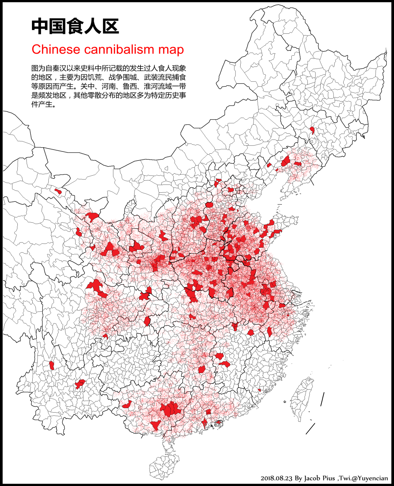

 **因为社会丧失了自组织能力，所以只能依赖强权。 这是一个无解的死循环。** 

这是特别可怕的，这和周崩后春秋战国还不一样，这是政权之间的斗争，好比两个黑帮利益集团在抢地盘。屠杀也往往只是种恐吓手段或者乱兵的发泄，不是你死我活的生存竞争。因为多中心的，战乱往往只是局部的。

___

秦制宛如毒品，尝过了就很难戒掉了。一旦秦制化后君主是很难主动解除的，反而时刻防备出现新的其他“秦国”出现。即使有君主试图恢复周制，也难以为继，要么亡于秦制之国，要么被后继者恢复秦制！

因为秦制是种将人性弱点拿捏到极致的制度（商鞅是个天才），对上如此，对下亦如此，没有君王能受得了“朕即天下”的诱惑。而下面呢，面临秦制崩溃后大乱，打的十室九空人相食的惨状时，纷纷立刻吓得哭着喊着要“圣君”，求着把d品吸回去。到了这个阶段，人的意志力已经被系统性的Y民教育给阉割了。大家已经不相信世界上还有“不吸d也能活”的另一种活法（比如宪政）。甚至他们会很自然的得出一个结论，国家会乱是因为管的不够严，不够秦制！（秦制是如何驯服民众，大家可以去看一下我关于科举的几篇回答）

[如何反驳“要知道，科举制是无数穷人翻身的唯一途径”这种观点?](https://www.zhihu.com/question/573863735/answer/1936953371492882334?share_code=131bQhfNDq8r9&utm_psn=1990454645030660061)

  

[如何评价“苏联耗尽英雄气，俄乌尽是鼠辈出”这种说法？](https://www.zhihu.com/question/635424343/answer/1983477058324682182?share_code=UrtJUHEzjHf8&utm_psn=1990455188390184134)

君主官僚们很快就发现，相比周制刁民，还是“秦制之民”好管，秦制真爽！尤其是他们发现对外战争其实是件高风险低回报的事情，反而是九州内的原子矿，取之不尽，用之不竭。剩下的只需要保持一定的武力，防止矿流失或反抗，以及外面的野狼偷吃就够了。缺点就是容易“脆断”，被其他军事集团乃至异族集团斩首！

和平时期秦制所汇集地人力物力就变成了君王的宫殿，或官僚集团的财富。

随着人口的恢复和经济快速发展，中间阶层和社会自组织也会有一定的恢复。 **随之，我们会发现一个非常反常识的现象：** 

 **就是人口越繁衍，经济越发达，秦制国家是越衰弱的！两千年循环的皆是如此！** 

 **因为秦制是反人性的，举天下奉一人、一家、一族，一个利益集团。自然是与天下人为敌！** 

古代不是个“契约社会”，老百姓不是天生就要给你交税服役，是皇权和利益集团把刀子架在老百姓脖子上，逼着你纳粮当差。这是个黑帮劫匪和受害者的关系。所以各阶层老百姓，一有机会有能力一定会千万百计的“偷税漏税逃役”，因为不偷不逃的老实人一定活不下去！而黑帮劫匪一有机会就一定会多拿多占，这是人性使然！

（体制内的也一样，“不偷不拿”的老实人在官场一定是升不上去活不下来的。结果几千年下来孕育了许多非常扭曲的家庭的、社会的、民间的和官场的文化和潜规则，荼毒至今！———题外话）

所以当社会中间阶层越繁荣，各种隐性的显性的反抗也就会越激烈，秦制朝廷也就会越激烈的试图瓦解他们。史书上的常见反派，他们被称作豪强大户，豪侠乱民，刁民会党。当然其中也有成功融入体制的，被称作世家望族、士绅地主。朝廷往往只能妥协，以其保去武力化和散装化，换取部分特权，以降低统治成本。最终，完成劫匪和骗子的合流，一起合伙哄着小民百姓们独自交税服役，负担起整个国家政权的运作！

结果就是小民自耕农往往不堪重税徭役，纷纷作了隐户逃户，他们自然跑不出国，而是藏进豪强大户当中，或托庇于士绅家中。历史教科书称之为“土地兼并”，其实更主要的是人口兼并，而这其实往往是个双向奔赴的过程。

政权税基动摇，自然逐渐衰落不堪，越是衰落，为了求生，政权只会越激烈压榨还能控制的小民小户，自耕农、小地主、城市手工业者、商贾之流，造成恶性循环，最终达到一个临界后，脆断！！

 **如果这时候边疆崛起某个边疆军事集团（如满清），便会乘虚而入李代桃僵。中央因为脆断，虚弱不堪一击，而地方长期被提防，人为拆散吸血和去武装化，同样难以反抗。反而是些割据势力能稍作抵抗。而官僚们往往也会迅速投向新主子。结局便是阖族沦陷！** 

 **典型的因为早熟而导致的制度性内卷！后世也路径依赖的陷入了这个“局部最优解”中不可自拔。** 

（题外话——小民不是愿意纳粮才交税，是不得不交。大户不是不愿意才不交，是因为能不交我就不交。包括朱家的藩王勋贵百官，他们最有能力，所以一点不交！这是个能力问题。只有皇帝一个人着急！所以知乎上很多抨击明朝东南抗税导致明末奔溃是很荒谬。你们已经拿了那么多，又加派了那么多，还嫌不够。再拿了更多，你就能突然变好喽！怎么可能嘛！）

## 有些人甚至说，宋末明末正是因为不够秦制化，才导致亡国。

就更可笑了。他们没有意识到，秦制是饮鸩止渴，秦制本来就不可能维持长久。秦朝自己都猝死了。除非你就能故意的维持人口不繁衍，经济不发展，整个社会维持一个低维度状态。

人口刚好够种地打仗，别太多，多了难管。家族不能太大，大了就必须分家，大了难管。只有农业，没有商业，因为商人流动性强，不好控制。只有愚民，大家都别思考，听话就行。这就是商鞅制造的理想秦国。

所以秦制就好比是一种“社会盆景艺术”。 它为了维持统治的稳定，必须不断修剪社会的枝叶（扼杀商业、思想、技术），限制根系的生长（限制人口流动）。当社会繁荣复杂到一定程度，秦制这套简陋的系统就注定无法执行。说宋明不够秦制，这就好比你跟韩隔壁半岛人说，为了对抗曹县，不如我们自己先变成曹县吧！

[为什么中国历史上会两次被人口远少于自己的异族征服？](https://www.zhihu.com/question/1938534811175219329/answer/1946615097985333103?share_code=3q8mqrVZ7UH7&utm_psn=1987881211151009411)

  

[女真满万不可敌，是不是被吹得太过头了？](https://www.zhihu.com/question/624535048/answer/1984598429838636419?share_code=1k3r33CwSXtu5&utm_psn=1988324667208008052)

然而如果边疆也实行秦制，那么沉重的赋税和兵役会逼得汉民逃亡；如果边疆不实行秦制，中央又觉得无法掌控。

而秦制是单一中心的“高压锅”，一旦中央出现一些问题，财政紧张或着政治动荡，这些边地往往就无以为继。百姓要么逃散，要么孤立无援被异族吞并。用现代话说，抗风险能力奇差！

所以自秦汉两千年来，秦制王朝的有效版图，其实从来没有实质性地突破“周制”下的汉地九州！一直围绕这九州之地，进进出出！

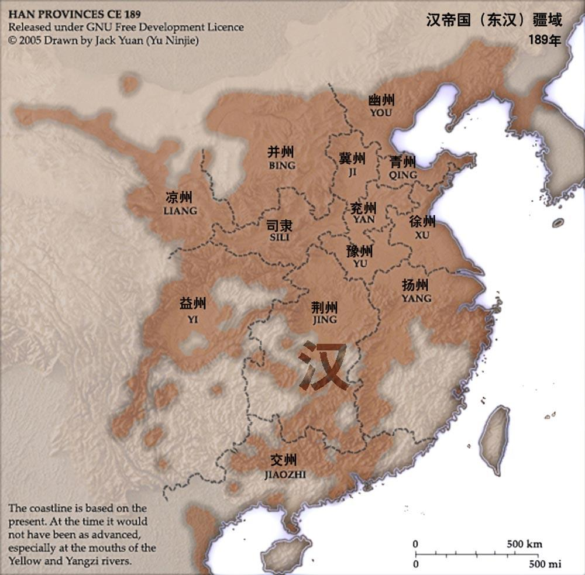

下面是明代中期人口分布图！

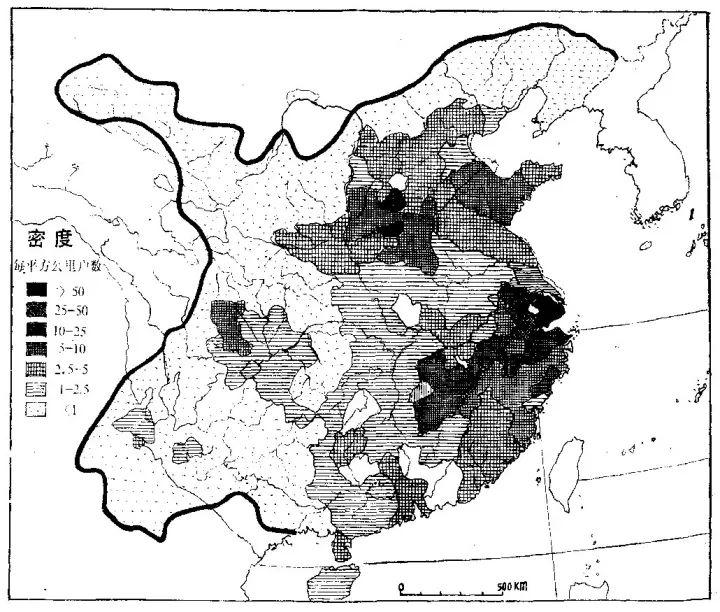

 **秦制王朝就是个高压锅，边疆的汉民少民有机会也一定会跑，从汉到清，汉入胡者不计其数！长城可不只是抵御外敌的，更是一道围栏！** 

往往每到到了王朝末年，朝廷控制力衰弱，人口才能再次有组织的大规模流动起来！流向低压的边地乃至国外。

包括自古东南亚的汉民遗民，乃至近代海外唐人，基本全是逃民子孙！而内地人跑不了的，就只能忍喽。直到忍无可忍，彻底活不去了再闹个天翻地覆。（高压锅爆炸了）

等到“十室九空，赤地千里”，气泄了。

然后王侯将相，循环往复！

## 还不懂的话，看明末南北。

同一个时代，北方就是典型的秦制无底线汲取脆断后的系统性社会连锁崩溃，流民军起义主要发生在关中河南河北（四川比较倒霉的被大西军攻破了）。而南方反而因为远离秦制中心，两百年中间阶层力量有所恢复，反而扛住了冲击，保持了稳定。其实南方的土地兼并情况其实一直是远胜北方的！而经济发展也远胜北方。

最后结果就是，发生在北方的是人相食的生存竞争，连锁崩溃后的“霍布斯丛林”，搞的十室九空。最后被满清乘虚而入传檄而定！而发生在南方的，是清入关后和南明之间的政权斗争，因为反抗激烈，发生了诸多恐吓和报复性屠杀。但南方大体却保持了社会主干，没有彻底崩溃。最后又被强制大量移民，填充北方损失的人口。

这不是北方没有血性，是北方离秦制中心太近，被深度的汲取导致的。包括清末也是同理！

## 有评论说，秦制下唐宋也很繁荣，甚至发展出了市井文化。

市井文化其是城市化产的产物，是商业经济发展的产物，和秦制周制没关系。周制下的城邦、自由市，没有市井么？战国时期商业繁荣的齐国没有市井么？

恰恰在秦制下，市井永远停留在市井，永远无法发展成独立的资产阶级，乃至资本主义，永远在萌芽中。 因为野草一样的市井文化恰恰秦制朝廷控制力下降，导致人口大量流入城市的产物。

 **你没发现经济越发达，重农抑商的秦制政权就越虚弱么？这是互为表里的！** 

 **我不妨把话说的再明白点，鸭绿江对面现在就是秦制，喜欢的话可以去体验下怀旧服！几乎完美复刻了秦制的“饥饿控制法”，让你饿不死，但也吃不饱，只能像牲口一样依附于饲养员。** 

  

[诺贝尔奖经济学奖《国家为什么失败》这本书是一本漏洞百出的书籍吗？如果是，为什么？](https://www.zhihu.com/question/1913328769365706552/answer/1983936048322070461?share_code=1spuMj7emoubs&utm_psn=1988748926837351964)

## 罗马不是一天建成，周制才能完成文明的有效积累！

 **如果说秦制是把人管的死死的高压锅，那周制之国就是一个个普通锅，普通锅锅开了，气会自己跑了，不会连锅带灶的炸个稀烂。** 

 **周制之民，若封君残暴，可或走或逃，不必忍到忍无可忍。有才之士在本国不得用，也可求士于四方，不必君要臣死臣不得不死。这便是春秋战国百家争鸣的原因。反之在秦制之下必然是万马齐喑！** 

周制之下，百姓才是人，才是国人，才有统战价值，才能活的有尊严，才会尊重知识和技术。

 **周制也会战争，但是周制是多元化的，多中心的。周制也会战乱，但往往是局部的，而非秦制下的系统性的社会连锁奔溃。这就是为什么周制哪怕开始奔溃，春秋战国乱了几百年，文明也能继续向前发展甚至大爆发，这是厚积薄发的结果！秦制一乱，就是文明的大倒退，甚至大毁灭。** 

仔细看图下面虚线，黑暗中世纪西欧的人口增长，除了罗马奔溃后的缓慢倒退，以及因为黑死病爆发的严重衰退外，几乎就是一直稳步增长的。

 **开荒殖民必须是要有组织、有武力、有一定财产积蓄的殖民团，原子人只有做奴隶的份！古今中外的都一样。而秦制下，原子化的汉民长期被去自组织化、去武力化，挣扎在温饱线上下，是极度缺乏开荒和自保能力的。** 

 **而能够长期执行下来的移民，也一定是自发逐利或求生性质的移民，如清末闯关东，美国西进运动！** 

所以真正实现长久稳定治理、并将边缘地区彻底“汉化/本土化”的时期，恰恰是靠周制，靠分封，靠割据，或靠被迫自发移民的“逃民”， **宗族 乡团 宗教团体之流。** 

秦制天下每隔两三百年就要来一次“大崩溃+大清洗”。人口减半，文明毁灭，书籍烧光，一切从零开始。这导致由于无法完成积累，文明始终在低水平上打转。秦制两千年所有的思想制度基本上没有什么大的创新，都没有脱出先秦诸子百家的窠臼，缝缝补补。

 **秦制王朝往往在靠着极致压榨卷完九州之地，短暂爆发后“脆断”！国初盛时短暂扩张，却不能持久，然后迅速收缩转向防御。** 原本因为军事需要的扩张移民就会变的难以为继，迅速丢失！

 **而周制虽然分散，却后劲绵长，去中心化，能够持久发展文明！** 不容易被中心爆破，因此抗风险能力也远强于秦制。不容易全面崩盘，所以技术、法律、财富可以实现“代际积累”。

因此才可能完成文明的有效积累，最终量变产生质变！引发范式革命！历史证明，只有“藏富于民”且“结构分散”的社会，才拥有穿越千年的真实生命力。

商周不说，哪怕春秋战国内部打成一锅粥，总体也依然在对外拓殖。楚国（湖南湖北）向南，秦国（关中）向西和西南（巴蜀），燕赵（山西河北）向东向北。

 **八百年的持续发展与积累，才基本奠定了传统九州之地，以及汉文明的制度与文化基石！** 

用更直白的话说，周天子分封诸侯，这块地打下来就是我自己的家底，我必须移民、实边、搞好关系，否则我就死定了。这是“把地当家”。 相当于周代版的“包产到户”。自家的地才会上心！而不是敲骨吸髓，竭泽而渔！而从诸王侯到诸国人的层层分包开发，才有传统九州之地。

秦扫六合，北征匈奴，南征百越。然而根本无法形成长期统治，很快就四分五裂。靠汉高分封诸王才维持了下来。

汉武帝征匈奴、开河套、征西域、征云贵、征东北。然而除了河套，很多地方都没能真正“留下来”。河套也很快就丢了。

南方真正的开发等到三国乱世，东吴为了生存，不得不拼命开发江南，剿抚山越；蜀汉为了北伐，不得不拼命开发西南夷（七擒孟获）。

东晋南朝，世家大族南渡，这其实是一种“变相的贵族分封”。乔家、王家、谢家在江南圈地占山，虽然对中央不利，但客观上把江南彻底同化成了汉文化的核心区。

至唐朝武皇开边意未已，唐军四处奔波，灭国无数，高丽、突厥、西域。结果呢？一个都没真正占下来，反而是吐蕃、南诏（大理）、契丹又崛起了。

最后唐朝自己也亡于藩镇割据。讽刺的是，恰恰是这些割据的藩镇（如归义军），在中央崩溃后还死死守着边疆，因为那是他们自己的地盘。

羁縻才是常态 ，一直到明清，对边疆的真正有效控制，其实也是一种“变相分封”的土司制度。 中央承认当地头人的世袭统治，只要你名义上臣服。 有机会了就“改土归流”（秦制化），没机会就让他自治。 一旦强行推行“流官制”（秦制），往往就会激起大规模的民变（如明朝的万历三大征之一播州之役）。

 **明朝真的特别典型。** 从朱元璋朱棣的打出三宣六卫，本来朱元璋是效仿周制，分封诸塞王守边，逐步消化这些包括河套的从汉末就丢失千年的故地新土。

结果朱元璋死后，允文上来就准备削藩，Judy起兵靖难成功后，又怕别人效仿，于是又将北方诸塞王和边将或撤藩或内迁，对草原控制力大降，瓦剌迅速兴起，这些肥沃土地又重新落入蒙古人手中，成为进攻明朝的桥头堡。

原本是朝廷稳定天下的重要助力的藩王，却成了不稳定因素和财政负担。结果就是“天子守国门”，明朝迅速退化龟缩到长城以南，还整出个九边。搞出了“片板不得下海”的海禁。这便是秦制专制政权的悲哀，防内永远是第一要务。又因为是单中心的，中心一旦超负荷，整个系统就会发生“脆断”。于是原本因为军事需要的扩张移民就会变的难以为继，迅速丢失！

而清朝，比较特殊，因为它既是极致的秦制，而相比以前的秦制王朝，清朝又是有“国人”的。它和蒙元又不一样，秦制虽然残酷，但至少把百姓当成自家的牛马（即使是为了长期使用）；而蒙元则把百姓当成了野外的猎物，经常杀鸡取卵。具体改天再讲！话题太长。

___

大一统的秦制帝国，擅长的是收割成熟的麦子，统治已开发的农业区； 而真正擅长“开垦荒地、扎根边疆”的，永远是更有自主权、更有利益驱动的分封团体或殖民者（周制逻辑）。

指望一个把老百姓管得死死的、连路引都要查的王朝去搞大航海和全球殖民，这本身就是一种痴心妄想。

 **反而是秦制朝廷衰弱后，控制下降，人口能够重新有组织的大规模流动起来，反而促使了汉文明恢复了些活动空间，如清末闯关东！** 

可以说秦制化后的汉文明，其实是种非常内敛，非常低扩张欲的“防御型/内卷型”文明（注意是文明，不是某个国家朝代）。往往在军事强势时，在军事贵族或帝王野心的主导下扩张，然后受阻后帝国就会迅速的趋向于保守。像新月教文明那种持续几百上千年契而不舍的扩张是秦制化汉文明不可想象的。

有些人可能自尊心作祟，把一切归咎于东亚地缘太封闭，所以才使得汉文明无法发展起来，地理原因的导致扩张到了极限。

那请问，佛教是怎么来到中原，传到东南亚，传到日本的？新月教又怎么来到西域的？这西域高原是个半透膜么？只能东进不能西出？

所谓包容，兼容并蓄，吸收同化了所有入侵者，其实是一种幸存者偏差。 真相可能是：我们只是幸运地躲在了世界的角落里，用漫长的时间和庞大的人口，慢慢消化了一些没有文明根基的蛮族而已。

假设元清有一个是新月教的，我们现在已经全包上头巾了！

## 所谓“闻战则喜”！

很多人都听过秦人“闻战则喜”，为强秦的赫赫武功，为秦人的慷慨豪迈而感到向往！今天就扒一扒秦国为什么强大，秦人为什么闻战则喜！

 **秦制王朝以秦始，以清终。这不仅是时间的闭环，更是逻辑的闭环。 说到大秦，很多人都知道秦人“闻战则喜”；其实，入关前的满清八旗也“闻战则喜”！** 

什么样的人会“闻战则喜”？

答：只有烂命一条的人才闻惨则喜。打仗是要命的，当一个人有恒产、有家庭、有尊严时，他是不愿意轻易去打仗的。所秦清二者的共同点在于：生存的机会成本极低，而战争的边际收益极高。

八旗的喜是被残酷环境逼出来的“狼群逻辑” ，生活在白山黑水中的后金八旗，是被自然界折磨得“闻战则喜”。苦寒之地，渔猎为生，不拼命就是饿死。

战争对于他们是“狩猎”的延伸。打仗就是抢钱、抢粮、抢女人。这是一种“低成本+高激励”的强盗逻辑。他们像饿狼一样，闻到血腥味就兴奋，因为那是生存的希望。

秦人的喜则是被制度囚笼逼出来的“囚徒逻辑” 。生活在关中平原的秦人，是被商鞅的制度折磨得“闻战则喜”。 商鞅变法的核心是“利出一孔”的耕战。把社会上所有发财、致富、尊荣的门路统统堵死，只留下一条缝：军功。

平时是“耕”，被严刑峻法管着，被重赋苦役压着，活得像牲口。如果不打仗，你就是个毫无尊严的农奴；只有上了战场，砍了脑袋，你才能获得爵位，才能赎买罪刑，才能像个人一样活着。

这是一种“绝望+求生”的越狱逻辑。秦兵的“喜”，不是嗜血，而是“终于有机会逃离那个令人窒息的连坐社会了”。

先把国民搞得一无所有，搞得生不如死（弱民/疲民）。只有当“活着”比“死了”还痛苦时，这群“烂命一条”的战争机器才会爆发出惊人的破坏力。

而这种被贫困与绝望驱动的“虎狼之师”，一旦失去了扩张的空间（没仗打/没东西抢），内部积累的戾气就会瞬间反噬。

后世朝代当然不像秦朝搞的这么极端，但是以专制皇权为绝对核心， 以郡县官僚为执行触手 ，旨在将社会彻底原子化的治理逻辑是始终如一的！历代只是制度细节上和执行力度上的差异。有些许的版本更新和打补丁，然而核心操作系统始终没变。都是为了“汲取能力最大化”和“压制社会自组织”。

##  **不妨再多说一句，** 

 **华夏，文明也！在分不在合！** 

 **宗周八佰年，掩有九州大地！** 

 **秦制贰千载，无多半分汉土！** 

 **一家之天下，短则数十年，长则不过二三百。他们追求合，是利益相关，是出于统的危机感。而对华夏数千年文明而言，分其实种常态。对文明对民族而言，对小民而言，其实未必是件坏事，毕竟乡下老太太都知道，鸡蛋不要放在一个篮子里！** 

___

## 答评论区：

秦周当然都已成历史，但分合这个东西无分东西洋汉古今，西方当然也卷过“秦制”，拿破仑战争，一战二战，不都是么。但幸运的是，他们失败了。 欧洲的历史，就是一部“秦始皇们不断失败”的历史，比如查理五世、路易十四、拿破仑、希特勒。

甚至可以说，正因为欧洲也开始卷“秦制”，导致生存环境剧烈恶化，人们才愿意纷纷出海碰碰运气，去新大陆，去亚洲，去非洲。欧洲是处于卷“秦制” ，但又没有完全“秦制”化的过程中，文明得到了快速发展（类似春秋）。

也正是因为没有一个终极的 “秦制帝国”能彻底终结博弈，欧洲才保留了无数个“权力的缝隙”。 这些缝隙，后来长出了自由市，长出了大学，长出了资本主义，最终长出了现代文明。

有时候，一个文明最大的幸运，就是没让那个最强大的“秦国”笑到最后，让历史陷入了死循环！这是欧洲的幸运，也是人类的幸运！

欧洲得感谢旁边有个搅屎棍大英！

天不生大英，万古如长夜！哈哈（狗头）

___

## 答评论：

回复老被夹，真是服了，讲讲历史也夹。这里统一回复，我一个个答。

## 问：你是不是鼓吹殖民主义，只恨自己不是殖民者！

答：并不是，这里仅是从历史和经济角度来分析制度，不带有道德判断。殖民这个词本来就是中性的，一种经济行为。只不过近代世界各民族大部分都被欧洲殖民过了，挨了打，所以殖民就变成了贬义词。试问，古今存活下来哪个民族没有搞过殖民？

所以跨时空搞道德审判没有意义。只是我们现代人发展到现在，我们已经意识到过去的零和殖民是种错误路线。因此就因该毫不讳言的正视历史，才能吸取教训，避免未来各民族和国家间再次发生零和博弈！而不是“为尊者讳”，含含糊糊，的用“历史的阵痛”之类的就糊弄过去！

## 有同学反驳，两千年并非都是“秦制”。

答：这里的”秦制“指的是以专制皇权为绝对核心 + 以郡县官僚为执行触手 + 旨在将社会彻底原子化的治理逻辑。历代只是制度细节上的版本更新，打补丁，然而核心操作系统始终没变。都是为了“汲取能力最大化”和“压制社会自组织”。当然中间也有就是分封和割据时期混合的阶段，但总体就是“秦制”逻辑。

## 问：秦以后并没有导致有万马齐喑，后世也有文化繁荣。

答：秦制下思想禁锢这不很明显么！只不过秦以后的朝代在秦制执行力有松有紧，民众属于带着镣铐跳舞，在皇权划定的牢笼里搞搞装修。即使号称开明的宋朝，也不过是镣铐松了点而已，和春秋战国时期的“范式革命”是两回事情，更启蒙运动比更是云泥之别。其特征呈现往往开国时期严厉，到了王朝末年，皇权控制力低谷期，也即是当时思想最自由的时期，比如魏晋明末清末。这恰恰说明了秦制下的思想禁锢。

## 问: 明清是没有预期收益才不对外殖民！

答：兰芳共和国听说过没？首先殖民本质上是一种经济行为， 历史上能够长期执行的殖民运动，基本是依赖民众自发的逐利冲动，如美国西进、清末闯关东。而对皇权和官僚集体，可预期的是取之不尽用之不竭的“矿”，更会严厉阻止“矿”出海，限制人口流动。所以我说秦制利于收割，不利于殖民生根。

让民众出海，意味着人口即税源 兵源的流失，更意味着他们可能在海外建立不受控制的“化外之民”政权，这是对皇权最大的威胁。当然缺乏殖民冲动。秦制政权主动移民往往都是带着军事目的实边流放之类的，而非经济目的。

此外殖民必须是团体！殖民团必须要有基本的自卫武力，有组织有武装有技术有基本的财产，而秦制下的零散的逃民往往只能沦为异族的奴隶。这也是为什么华人能在东南亚扎根，靠的就是闽粤的宗族 乡党这些没被彻底原子化的基本社会自组织。原子人是没法搞开荒殖民的。

## 又有同学问：为什么欧洲连近在咫尺北非西亚都没征服？

答：因为欧洲已经进化出了“零和博弈退出机制”，懂得止损，没“卷化”成秦制，不会无底线的卷！殖民归根是种经济行为。当统治成本大于收益时，人家选择退出，比如典型的二战后法国退出阿尔及利亚，英国撤离等等。如果是换成秦制的政权比如大清大明会怎么做呢？不服管的叛乱分子杀光就好了，因为秦制逻辑就是种零和博弈，你死我活。

历史上也一直是这么做的，比如大清灭族准噶尔，在征服过程中也是各种图。哪怕文明点的大宋也差点把方腊起义后的浙江杀空了。那法国是没能力做到么？是不可能这么做，因为现代政权会面临巨大的内部道德压力和外部政治破产。因为一个仅仅因为不服管，就能搞屠杀的政权，内部人都怕，你也不想生活在这种政权吧！早跑了，皇帝怕你跑了，所以就搞出了秦制来把你管/关起来。而欧洲人还没卷到秦制地步就进化出来退出机制。所以说这是欧洲的幸运，也是人类的幸运。

当然西方的殖民也并不正义，但至少证明了他们已经走出了“黑暗森林”；而后者，依然把“留地不留人”奉为圭臬。

___

## 另外，我发现很多人把中世纪的西亚和北非当成什么软柿子了。

实际上恰恰相反，新月教文明是农业时代最强势最具有侵略性的文明之一。那时候欧洲才是防守方，甚至西班牙本土都差点绿化。中世纪的欧洲能扛住蒙古帝国和新月奥斯曼帝国的进攻就已经非常不容易了。

广府从秦汉开始被纳入统治，但一直到唐宋都属于边疆地，拿来流放的。真正完成汉化因该是南宋末元明才成为普遍意义上的汉地，前后花了近千年，这个速度已经慢的离谱了。这还是在周边没有强力文明竞争的情况下。换个角度，中国能慢慢汉化南方，更多是南方没什么强力的对手而已。

秦制化后的汉文明，其实是种非常内敛，非常低扩张欲的“防御型/内卷型”文明（注意是文明，不是某个国家朝代）。说难听点，能够顺利的同化大陆南北，把影响力扩张到现在的所谓儒家文化圈，纯属于是因为偏安远东一隅，被西域高原和荒漠所保护着。没有碰到更先进的对手。真实影响力甚至不如佛家文化圈广。更别提新月教和十字教文明！根本不可能是对手。

所谓同化了所有入侵者，其实是一种幸存者偏差。 真相可能是：我们只是幸运地躲在了世界的角落里，用漫长的时间和庞大的人口，慢慢消化了一些没有文明根基的蛮族而已。

## 回评论区还在纠结大一合/桶的人：

你们还在拥护秦制无非就是说：没有秦制就没有大一桶之类的。

现在假如你是英美澳加人，一样的语言文字，相似的文化规则，享受同样待遇。可以随意或者低成本的迁徙 工作 生活。那么对你而言，对民族而言。他们是分是合很重要么？反之，即使你大一合，但你却不能随意迁徙 工作 生活，区别对待。那你为什么一定要执着于一合呢？

乃至对文明而言，合不合真的不是很重要！也可以说是“不合而合”，是种更高层面的合。

可以说，执着大一合本身就是种零和博弈。军事利益集团没完没了的内卷，就是为了一合。因为他们始终会担心被被别人一合了，囚徒困境！这就是造成每次改朝换代都如此惨烈的原因。一次换代放的血抵得上人家两次世界最大战。

所以汉文明始终无法有效积累，每两三百年周期性的自我放血个十室九空。技术失传，文化断代，文明几乎归零重启，每次再重新来过。这能发展的起来就怪了！

## 问：秦制下那么多朝代人口众多。

答：问得好，因为养殖场里只需要考虑吃和生产！越穷越生，越生越穷！这倒不是汉族的特点，基本上古老的农耕民族都这德性。比如印度伊朗埃及。

人口膨胀这个事情比较反直觉，太穷太饿了不行，吃太饱也不行。只有时刻处于不上不下，能活下去但又不能吃太饱，时刻处于饥饿恐惧中，这时候是最有繁殖欲的。传宗接代延续基因的本能会让人拼命的生产，人口迅速膨胀，而越膨胀越不能吃饱。

我不敢说封建皇帝官僚懂这个道理，但长期秦制实践下来是往这个方向发展的。秦制官僚的政绩其实是以实控人口为纲的，土地反而是次要，人口就意味赋税和劳力。

所以每次改朝换代人口锐减，民众极端饥饿贫困，到换代后安定下来，分到了一定土地，开始吃上饭后就拼命繁衍，人口迅速以指数规模爆炸。然后陷入“越穷越生，越生越穷”的怪圈！直到新的循环开启！

  

又被夹了，回上面评论：

##  **问：最不像秦的宋朝一定扩张的很好吧［大笑］。更像周朝的神罗一定完成殖民扩张了吧［大笑］。** 

答：下面朋友已经说的很好，我补充几点，宋朝确实在一桶王朝里最不像秦朝，但不是说它就像周朝了，它依然是高度的集权专制的皇权官僚体系，加彻底的编户齐民。甚至可以说是集权的一个高峰时期。它只是在重商重文上不像秦国，在汲取民力上有过之而不及！

甚至可以说，宋朝实际上就是个文治化的秦朝，用科举取代了军功爵而已。依然是个高度内敛的防御型内卷国家。它把所有的资源都用来供养庞大的官僚系统和收买武人防止造反，导致其对外丧失了所有的野性，结果就是容易脆断！！最终沦为金元砧板上的肥肉。本质还是“秦制”的！

真正的“周制”才具有反脆弱性，欧洲的神罗帝国，确实是很像“周朝”的封建邦联。 很多人嘲笑神罗“既不神圣也不罗马”，但请看它的地缘环境：身处四战之地，旁边是英法意俄瑞典丹麦，还要直面蒙古铁骑和奥斯曼土耳其的兵锋。

换成任何一个中央集权的秦制王朝放在中欧那个绞肉机位置，首都一旦被围，财政一旦断裂，立刻就是亡国。

但神罗存续了千年，并发展成了欧洲腹心最大的国家，横跨中南欧，包括德奥捷克为中心以及周边地区。因为它“散”。维也纳危机了，波希米亚还在；北方打烂了，南方还在。这种多中心的结构，赋予了它极强的韧性。如同中国历史上的宗周！

然而当普鲁士开始卷秦制化的时候，结果呢？两次世界大战，德国把欧洲打烂了，也把自己打烂了。 神罗虽然“乱”，但它存续了千年，并孕育了繁荣的文化艺术、经济与科学，至今深远影响着世界；普鲁士虽然“强”，但它把德国带入了两度毁灭的深渊。

___

## 答读者问：秦制也很繁荣，发展出市井文化。周制也战乱不断，也镇压百姓，宁为太平犬不懂么？

我不是说周制君主诸侯就是什么好人，而是他不像秦制一样终极的人身控制，让人跑无可跑，忍无可忍，最后发生系统性崩溃连锁。这不是个道德问题，是技术问题。不是不想而是做不到。所以秦制是大高压锅，周制是一个个普通小锅。

你仔细读读历史你就会发现，你说的菜人现象最严重的时期，恰恰就是秦制两千年时期，尤其秦制政权短择几十，长则二三百的崩溃时期（最近的一次自己搜）。吓怕了，反而把秦始皇当成了救世主。其实秦制一直是因，只能暂时压制社会矛盾的毒药，而不是解决问题的良药。

 **周制也会战争，但是周制是多元化的，多中心的。周制也会战乱，但往往是局部的，而非系统性的社会连锁奔溃。这就是为什么周制乱了几百年，文明反而大爆发；秦制一乱，就是文明的大倒退，甚至大毁灭。** 

再说你说的市井文化，这是城市化产生的，是经济发展的产物，和秦制周制没关系。周制下的城邦、自由市，没有市井么？

恰恰在秦制下，市井永远停留在市井，永远无法发展成独立的资产阶级，乃至资本主义，永远在萌芽中。 因为野草一样的市井文化恰恰秦制朝廷控制力下降，导致人口大量流入城市的产物。你没发现经济越发达，重农抑商的秦制政权就越虚弱么？这是互为表里的！

很多人不承认秦制的危害，我能理解。毕竟两千年都过来了。告诉自己，这一切都是必然的，无法改变，外面也一样，这样心里会好受点。但是当鸵鸟是解决不了问题的。

你耐心把文章看长一点再来评论好吧。

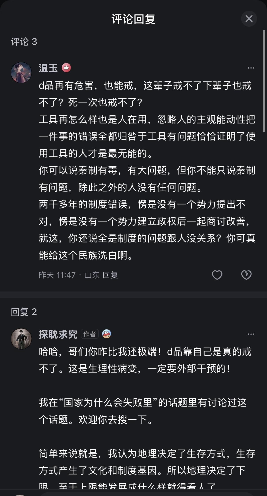

## 答评论：

所以姐妹你的结论是什么，是人种问题？那对面不是同文同种吗？半岛上的两个国家不是同文同种么？［思考］

我有洗白什么？我是在做病理分析，得先承认有病才能治病！从什么时候开始病，病根在哪，为什么会染上，0号是谁。我在告诉你为什么“海L因难戒”，你却指责我是在给吸d者洗白。我认为这是病。你认为这是坏！

走向秦制，并非地理的绝对宿命，而是在历史的十字路口，我们因为恐惧混乱、渴望速成，在无数种可能性中，偶然地、但也是主动地拿起了那瓶“剧毒的止痛药”而已。而尝了这一口，后面就难戒了！

你肯定没看到文章后面，耐心往后看看。我在正文后仔细讲讲。

春秋战国。那是东大历史上主观能动性最强、智慧最迸发的时刻（百家争鸣）。 我们当时面前摆着很多“药丸”：墨家的兼爱、道家的小国寡民、儒家的封建秩序、法家的集权。

为什么选了法家（秦制）？ 因为在那个战乱频仍的年代，法家这口药“起效最快”。它能让你迅速止痛（结束战争），迅速强壮（富国强兵）。 这是一种“急功近利”的历史选择。 当时的人为了立刻结束痛苦，选择了那剂药效最猛、副作用最大的猛药。

一旦这一口吸进去了，制度化了（秦汉确立），逻辑就全变了。

整个社会的血管（官僚体系）、肌肉（军队）、神经（儒家文化）都根据这种“毒品”重组了。 这时候你想戒？

 **一旦皇权衰落，就是军阀混战，就是人头滚滚。老百姓一看到乱世，立刻吓得哭着喊着要“圣君”，求着把毒品吸回去。简直就像戒断反应！** 

 **到现在都是！评论区很多人依然认为汉唐宋明的衰落恰恰是不够秦制［捂脸］。** 

 **到了这个阶段，人的意志力已经被系统性的愚民教育给阉割了。大家已经不相信世界上还有“不吸毒也能活”的另一种活法（比如宪政、mz）。** 

我讨论了为什么会有秦制这种“制度陷阱”，为什么跳不出来。

为什么文明在分不在合！在周不在秦！

为什么周朝有百家争鸣？因为分。

为什么欧洲能诞生现代文明？因为分。

分才有竞争，分才有逃跑的空间，分才有制度创新的可能。

其实历史上大多数的古老农耕民族都掉入了各自的“制度陷阱”里，有的甚至都没了，远不止中国人倒霉，甚至算幸运的。比如古埃及，死水一潭的转了3000年，直到被外力打破循环。

追求稳定与秩序是农业社会的本能，这是常态。而超稳定就是毒，能跳出来的反而是变T！而秦制就是种超稳定结构，过度了就是种d品，碰了，靠自己几乎是不可能戒掉的。

秦制为了维持这种绝对的“低熵”状态，就必须杀死一切“变量”。 而所有的创新、技术革命、思想突破，在萌芽状态时，看起来都像是“破坏稳定的变量”。

你也可以理解成一种制度决定论，但碰之前，我认为这是偶然。彻底上瘾了也是偶然！在这之前是可以靠发挥人的主观能动性，意志力和智慧走向另一条路的。

为什么地中海沿岸文明经历埃及希腊罗马中世纪后的数千年发展，最终反而是在一个欧洲旁边小岛上开花结果？

这个小岛几乎孕育了现代文明的一切。而这个小岛上的一切，文化、制度，甚至人种都是来自欧洲旧大陆。

这些都是种子，由旧大陆孕育的“因”，地理也是“因”，希腊的思辨、罗马的法治、日耳曼的习惯法、基督教的伦理、荷兰的金融制度……这些良性的“外部变量”在旧大陆孕育，最后陆续的汇聚到了这个不易被强权一统的岛屿上。

至于能不能结果，结出什么样的果，最后还真得要看点运气！

如果不是一场“新教神风” ，威廉三世这个荷兰佬就不一定能登录小岛，未来还会有光荣革命，还会有工业革命科技革命么？还会有现代文明吗？

真未必！国运这个东西真的有哎！别把现代文明当作理所当然的，她的诞生，本身就是一系列极小概率的“幸存者偏差”。

错过了，人类可能还得再等个一两千年，而在这一千年里，欧洲可能就被某个路易或维奇给大一统了！开始了欧洲卷。

  

原文地址：[(探耽求究)为何华夏失去了殖民东南亚、澳洲和美洲的昭昭天命?](https://www.zhihu.com/question/599245778/answer/1987163941223294083) 

# 评论

1. **探耽求究** (<small title="日本">2025-12-29 14:12:20</small>): 评论又被夹了，我贴在正文最后了，有兴趣去看一眼。 一句话总结，周制国家或文明，或许不完美，但是很少会发生像秦制那样的系统性社会连锁大崩溃的。[@Sephiroth](http://www.zhihu.com/people/69e9202293eeb9de6614d350054831f1) 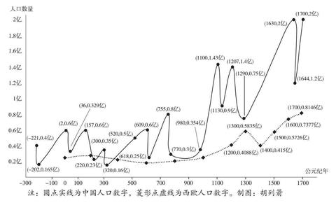
   - <a href="https://www.zhihu.com/people/ya-li-shi-duo-de-20-21">亚里士多得</a> (<small title="江苏">2025-12-29 14:18:56</small>): “很少会发生像秦制那样的系统性社会连锁大崩溃”？
 
行，那你告诉我古希腊古罗马拜占庭这样的老牌文明或者其传承者在哪呢？一定是躲过了大崩溃活的好好的吧［吃瓜］
   - <a href="https://www.zhihu.com/people/91-97-94-83-46">未设置</a> (<small title="回复于 2025-12-29 14:24:52/新疆"> ✉️:亚里士多得</small>): 很少等于没有？寿命增加等于永远不死？［飙泪笑］
   - **探耽求究** (<small title="回复于 2025-12-29 14:26:38/日本"> ✉️:亚里士多得</small>): 知道什么叫社会系统性奔溃么？就是图中实线那样，直下直下。历史上这叫十室九空，赤地千里，户口减半，人X食。再看看下面虚线有一段缓慢下降的阶段，就是罗马崩溃后战乱导致的，但这不是社会系统性崩溃，社会骨架还在，所以只会阴跌，不会直上直下。达到政治平衡开始一直增长！
   - <a href="https://www.zhihu.com/people/54-12-53-36-31">昨夜西风</a> (<small title="福建">2025-12-29 14:29:21</small>): （1），《史记 - 太史公自序》：“春秋之中，弑君三十六，亡国五十二，诸侯奔走不得保其社稷者不可胜数”  
 
（2.1），93.1%，以下这篇文章数据  
 
（2.2），[中制西制，谁更能代表最多数人利益？](https://zhuanlan.zhihu.com/p/713609207)
   - <a href="https://www.zhihu.com/people/ya-li-shi-duo-de-20-21">亚里士多得</a> (<small title="回复于 2025-12-29 14:55:50/江苏"> ✉️:昨夜西风</small>): “弑君三十六”？罗马５９位皇帝中，光死于军队之手或在军队哗变中殒命的皇帝人数为26人，彼此彼此，要不要把西欧那群封建国王算上［吃瓜］
   - <a href="https://www.zhihu.com/people/54-12-53-36-31">昨夜西风</a> (<small title="回复于 2025-12-29 15:1:17/福建"> ✉️:亚里士多得</small>): （1），司马迁的《史记》写的不是欧洲历史  
 
（2），春秋100多诸侯国，到了战国，主要剩下7个，和平统一？
   - <a href="https://www.zhihu.com/people/ya-li-shi-duo-de-20-21">亚里士多得</a> (<small title="回复于 2025-12-29 15:22:5/江苏"> ✉️:昨夜西风</small>): 不明所以，所以你承认罗马皇帝死的也不少了？
 
（1）我说的是爱德华·吉本写的《罗马帝国衰亡史》，怎么了
 
（2）不然呢？我寻思也没人说非得和平统一啊？罗马从城邦拓展到亚非欧，英格兰阿尔弗雷德统一七国，查理曼统一法兰克等等，不都是打出来的吗［好奇］？
   - <a href="https://www.zhihu.com/people/54-12-53-36-31">昨夜西风</a> (<small title="回复于 2025-12-29 15:25:55/福建"> ✉️:亚里士多得</small>): 我对欧洲历史不熟悉，我可没说欧洲历史
   - <a href="https://www.zhihu.com/people/ya-li-shi-duo-de-20-21">亚里士多得</a> (<small title="回复于 2025-12-29 15:29:22/江苏"> ✉️:昨夜西风</small>): 不熟悉欧洲历史，却来讨论“中制西制，谁更能代表最多数人利益”［好奇］
 
你怎么不和素食者讨论肉香不香呢［撇嘴］
   - <a href="https://www.zhihu.com/people/54-12-53-36-31">昨夜西风</a> (<small title="回复于 2025-12-29 15:33:59/福建"> ✉️:亚里士多得</small>): （1），比喻类比不等同事实，这是基本的逻辑常识，懂？  
 
（2），文章哪说错了？讲不出自己道理，把话题转到对方个人？
   - <a href="https://www.zhihu.com/people/54-12-53-36-31">昨夜西风</a> (<small title="福建">2025-12-29 15:40:43</small>): 眼见为实，一个城建现代化，一个城建老破旧，哪个才是现代文明的未来该有的样子？
 
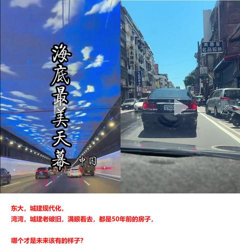
   - <a href="https://www.zhihu.com/people/54-12-53-36-31">昨夜西风</a> (<small title="福建">2025-12-29 16:13:50</small>): 主观认定而已，问题的根源基本都是三观问题，自欺欺人么？
   - **探耽求究** (<small title="回复于 2025-12-29 16:15:1/日本"> ✉️:昨夜西风</small>): 哈哈，又看到你了。这种小红对账法没有什么意义。要比就拿好的面根好的面比，差根差的面比，人均和人均比。拿一些能量化的东西比。［调皮］  
 
  
 
哪个是文明的未来方向我不知道！但改k发展经济肯定没错吧？请问，改的是什么？你支持重农抑商么？限制人口流动？全民皆兵？那建议你可以去鸭绿江对面。 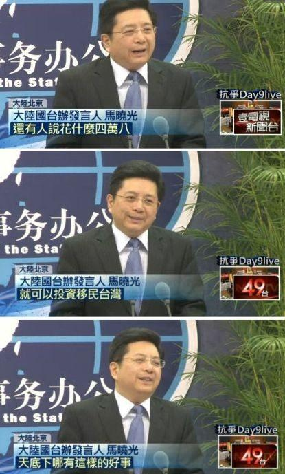
   - <a href="https://www.zhihu.com/people/ya-li-shi-duo-de-20-21">亚里士多得</a> (<small title="回复于 2025-12-29 16:27:35/江苏"> ✉️:昨夜西风</small>): （1）怎么引用《罗马帝国衰亡史》和《史记》成了“比喻类比”了，是谁不讲逻辑？
 
（2）这里讨论中西对比，我拿西方史料反驳怎么就“讲不出自己道理”？不熟悉欧洲历史就去问AI问百度，岛上高中级别的历史教育这么差吗？别拿勿知当挡箭牌［吃瓜］
   - <a href="https://www.zhihu.com/people/ya-li-shi-duo-de-20-21">亚里士多得</a> (<small title="江苏">2025-12-29 16:31:58</small>): 不如你去查查希腊黑铁民族入侵，罗马各大继承内战和“三世纪危机”是不是大崩溃再说？希腊罗马人种文化传统语言文字都丢没了还“好好的继承着呢”？周制蛮族吃绝户也要有个限度吧，欺负别人后继者死绝了说不出话是吧？［吃瓜］
 
这也没人提“大一统”啊［好奇］
   - <a href="https://www.zhihu.com/people/54-12-53-36-31">昨夜西风</a> (<small title="回复于 2025-12-29 16:33:53/福建"> ✉️:探耽求究</small>): 弯弯喜欢城建老破旧，不喜欢城建现代化？呵呵，铁皮屋喜欢吗？茅草屋呢？常识呢？
 
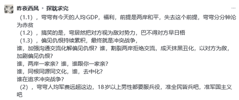
   - <a href="https://www.zhihu.com/people/ya-li-shi-duo-de-20-21">亚里士多得</a> (<small title="江苏">2025-12-29 16:37:1</small>): 我想说无论东西古典封建帝国都是“帝王私计”啊，怎么，你还想在奴隶制国家里找什么文明不成［好奇］
   - <a href="https://www.zhihu.com/people/54-12-53-36-31">昨夜西风</a> (<small title="回复于 2025-12-29 16:40:22/福建"> ✉️:亚里士多得</small>): 输不起？［大笑］
   - <a href="https://www.zhihu.com/people/54-12-53-36-31">昨夜西风</a> (<small title="回复于 2025-12-29 16:40:39/福建"> ✉️:亚里士多得</small>): 拿今天的认识去批古人容易，说说看，都这么懂了，咋还这么多人没财富自由呢？［大笑］
   - <a href="https://www.zhihu.com/people/ya-li-shi-duo-de-20-21">亚里士多得</a> (<small title="回复于 2025-12-29 16:42:11/江苏"> ✉️:昨夜西风</small>): 没词反驳只能论输赢啦［吃瓜］
   - <a href="https://www.zhihu.com/people/ya-li-shi-duo-de-20-21">亚里士多得</a> (<small title="回复于 2025-12-29 16:45:12/江苏"> ✉️:昨夜西风</small>): 那就说说啊，有些人没财富自由呢，是因为他们历史教育很差啊，有的还认贼作父，有奶便是娘，也不懂得吸取经验教训，一遍又一遍踩进同一个坑里啊，这种怎么能积累财富呢，只会被电诈骗光啊［吃瓜］
   - <a href="https://www.zhihu.com/people/ya-li-shi-duo-de-20-21">亚里士多得</a> (<small title="江苏">2025-12-29 17:43:45</small>): 那我就再问一遍吧“希腊黑铁民族入侵，罗马各大继承内战和“三世纪危机”是不是大崩溃？希腊罗马人种文化传统语言文字都丢没了为什么还被你说是“好好的继承着呢”？”［好奇］
   - <a href="https://www.zhihu.com/people/xu-hong-zu-64">蔡徐坤</a> (<small title="回复于 2025-12-29 18:15:45/山东"> ✉️:亚里士多得</small>): 罗马帝国就是秦制社会啊！！！！
 
罗马帝国的毁灭反而证明了答主说得对
   - <a href="https://www.zhihu.com/people/xu-hong-zu-64">蔡徐坤</a> (<small title="回复于 2025-12-29 18:17:50/山东"> ✉️:亚里士多得</small>): 罗马共和国是周制国家，罗马帝国是秦制国家，包括后来的东罗马帝国也是秦制社会，如果你看看东罗马帝国末期的操作，你会发现和中国的秦制王朝一模一样。
 
反而当时的威尼斯人是周制国家，以一小国艹大国，这就是周制的牛逼之处。
   - <a href="https://www.zhihu.com/people/ya-li-shi-duo-de-20-21">亚里士多得</a> (<small title="回复于 2025-12-29 19:16:4/江苏"> ✉️:蔡徐坤</small>): 我是在反驳上一个评论说东方战争烈度频率比西方大，你在反驳什么［好奇］
   - <a href="https://www.zhihu.com/people/ya-li-shi-duo-de-20-21">亚里士多得</a> (<small title="回复于 2025-12-29 19:20:11/江苏"> ✉️:蔡徐坤</small>): 真伟大啊，周制。
 
那么为什么公元前27年奥古斯都称帝，罗马由周制变秦制了呢？他们捡了芝麻丢西瓜想不开吗？［好奇］
 
那么为什么1796年威尼斯共和国被秦制拿破仑帝国打败国家灭亡了呢，不是能“以一小国艹大国”吗？［好奇］
   - <a href="https://www.zhihu.com/people/ya-li-shi-duo-de-20-21">亚里士多得</a> (<small title="江苏">2025-12-29 19:22:32</small>): 中国都被你论证成罗马了我还能说啥？［看看你］  
 
隔着太平洋，中国是第四西罗，美国是第四东罗呗［吃瓜］
   - <a href="https://www.zhihu.com/people/yong-hu-5743017808">角上之争</a> (<small title="回复于 2025-12-29 19:39:53/河北"> ✉️:探耽求究</small>): 但从你这张图来看，别说是在中国古代的盛世巅峰期了，哪怕是在你所谓的中国古代系统性崩溃十室九空人相食的乱世人口低谷期，中国的人口在大多数时候都还是比同时期的西欧要多。
   - <a href="https://www.zhihu.com/people/jmzgn3">知乎用户jMZGn3</a> (<small title="回复于 2025-12-30 1:13:58/北京"> ✉️:亚里士多得</small>): 呵呵了，现在的希腊意大利就是古代希腊古代罗马的继承人，另外可以说整个现代社会都是古希腊古罗马思想的继承人，而可怜的秦制，最近一千年频繁的被异族征服，每次都被大量杀死
   - <a href="https://www.zhihu.com/people/ya-li-shi-duo-de-20-21">亚里士多得</a> (<small title="回复于 2025-12-30 1:44:28/江苏"> ✉️:知乎用户jMZGn3</small>): “现在的希腊意大利就是古代希腊古代罗马的继承人”是吗？我想问问古罗马古希腊的本土民族呢？传统呢？多神信仰呢？世家传承呢？共同历史记忆呢？名人名将纪念日呢？就这点蛮族从废墟里抄来的文字技术还好意思攀亲戚啊？
 
嗯嗯，你说得对“整个现代社会都是古希腊古罗马思想的继承人”，中国绝对是第四罗马。不是欧美这种血债累累异化变种能碰瓷的。
 
“最近一千年频繁的被异族征服，每次都被大量杀死”笑死，反正中国撑过来了，现在还是世界上数一数二的广土巨族。而古希腊被马其顿人，古罗马被法兰克日耳曼汪达尔等蛮族图的干干净净，国土也七零八落。你说欧洲其他国家？近一千年不也是被异族维京人，阿拉伯人，匈奴人轮着打吗，“每次都被大量杀死”要是没外敌就开启拿破仑战争一战二战自己内部杀个天昏地暗，现在俄乌还死性不改得在绞肉呢［为难］
   - <a href="https://www.zhihu.com/people/zhuo-tan-quan">不是药师</a> (<small title="回复于 2025-12-30 14:27:52/河南"> ✉️:亚里士多得</small>): 为什么你的眼里只有皇帝和国王？皇帝国王死再多，跟老百姓活得好不好有什么关系？皇帝国王活得好，老百姓过得凄惨无比的你是一点都看不到吗？你天天想着皇帝国王过得好不好到底是种什么心态？
   - <a href="https://www.zhihu.com/people/ya-li-shi-duo-de-20-21">亚里士多得</a> (<small title="回复于 2025-12-30 14:39:55/江苏"> ✉️:不是药师</small>): 请问你是从来不看上下文吗？我是反驳上一层评论说的“《史记 - 太史公自序》：“春秋之中，弑君三十六，亡国五十二，诸侯奔走不得保其社稷者不可胜数””我拿罗马皇帝反驳论证东西方情况都一样有什么问题？你要骂不该骂那位首先提"弑君三十六，亡国五十二"的那位吗，冲我来劲干什么？
 
另外，我说皇帝死得多天天被禁卫军砍，怎么到你嘴里成了“皇帝国王活得好”了［好奇］你那边的平行世界生活好是天天掉脑袋吗［好奇］
   - <a href="https://www.zhihu.com/people/zhuo-tan-quan">不是药师</a> (<small title="回复于 2025-12-30 19:5:25/河南"> ✉️:亚里士多得</small>): 所以老百姓死了多少？
   - <a href="https://www.zhihu.com/people/ya-li-shi-duo-de-20-21">亚里士多得</a> (<small title="回复于 2025-12-30 20:36:5/江苏"> ✉️:不是药师</small>): 没听懂我说的话？去问“眼里只有皇帝和国王”先发《史记》“弑君三十六，亡国五十二”的那位始作俑者，别来问我［打招呼］
   - <a href="https://www.zhihu.com/people/cynicism-doge">黄犬</a> (<small title="福建">2025-12-30 22:23:25</small>): 附上注解版
 
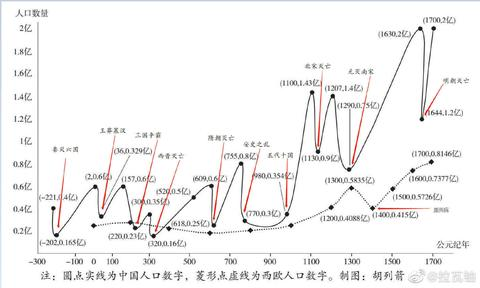
   - <a href="https://www.zhihu.com/people/tian-tian-lun-tan-lun-tian-xia">我是萍水相逢</a> (<small title="江西">2025-12-30 22:36:52</small>): 工业革命和大航海能够发生确实与欧洲类似周制有关，但到现在类似周制的欧盟一盘散沙与中美这样的单一的大国相比明显处于劣势，另外明治维新前的日本一直类似周制，但是明治维新之前日本可没有多强大。［思考］
   - <a href="https://www.zhihu.com/people/zhuo-tan-quan">不是药师</a> (<small title="回复于 2025-12-30 23:50:0/河南"> ✉️:亚里士多得</small>): 所以老百姓死了多少？
   - <a href="https://www.zhihu.com/people/ya-li-shi-duo-de-20-21">亚里士多得</a> (<small title="回复于 2025-12-30 23:58:49/江苏"> ✉️:不是药师</small>): 这么想知道，那帮你问问AI吧：
 
1. 罗马共和国晚期内战 (公元前 1 世纪)  
 
这一时期的战争导致了共和国的解体，军队规模巨大，且多为职业化的军团对垒。  
 
法萨卢斯战役 (公元前 48 年)：恺撒与庞培的决战。  
 
伤亡：庞培方约 6,000 至 15,000 人战死，另有约 24,000 人被俘。恺撒自称仅损失 230 名步兵和 30 名百夫长，但现代史学家认为这一数字可能过低，实际伤亡应在 1,200 人左右。  
 
腓立比战役 (公元前 42 年)：后三头（屋大维、安东尼）对阵恺撒刺杀者（布鲁图、卡西乌斯）。  
 
伤亡：这是罗马历史上规模最大的战役之一，双方共动员约 20 万人。据估计，两阶段战斗的总死亡人数约为 14,000 至 40,000 人。  
 
亚克兴海角战役 (公元前 31 年)：屋大维与安东尼、克娄巴特拉的决战。  
 
情况：海战导致的直接阵亡人数相對較少（约数千人），但安东尼的陆军随后大规模投降或解散，标志着内战时代的终结。  
 
2. 帝国动荡时期的内部冲突  
 
四帝之年 (公元 69 年)：尼禄死后的混战。其中第二次贝德里亚库姆战役规模庞大，导致约 30,000 至 40,000 名 罗马士兵丧生，且大多是在同室操戈中阵亡。  
 
三世纪危机 (公元 235-284 年)：长达 50 年的频繁内战、篡位与边境入侵。  
 
总体评估：这一时期没有单一的精确统计，但持续的内战极大地削弱了罗马的兵源和经济韧性。部分战役如 穆尔萨战役 (公元 351 年)（君士坦提乌斯二世与篡位者马格嫩提乌斯），据传伤亡高达 54,000 人，是 4 世纪最血腥的内战。
 
  
 
我只举证我举例的罗马，至于东方的情况你得问提史记的那位。
 
啥，你说这是士兵伤亡而不是老百姓的伤亡？乐，你不会以为西方历史就关心“老百姓过得怎么样”，记载什么平民死亡的数字吧［打招呼］
   - <a href="https://www.zhihu.com/people/zhuo-tan-quan">不是药师</a> (<small title="回复于 2025-12-31 0:1:38/河南"> ✉️:亚里士多得</small>): 所以老百姓到底死了多少人？
   - <a href="https://www.zhihu.com/people/ads10029">ads10029</a> (<small title="回复于 2026-1-4 12:6:39/中国香港"> ✉️:探耽求究</small>): 问题是你这个图画错了，罗马帝国人口巅峰是六千五左右，在大迁徙时代开始前是3600万左右。下次建议查查西方数据。
   - <a href="https://www.zhihu.com/people/ads10029">ads10029</a> (<small title="回复于 2026-1-4 12:13:54/中国香港"> ✉️:探耽求究</small>): 还有三十年战争，哈布斯堡和土耳其的拉锯战，瑞典对波兰的入侵，以及波兰对俄罗斯的入侵，这些战争都造成了百分之四十左右的人口死亡，这还是在文艺复兴之后欧洲军队军纪大幅度改善以后的。
   - <a href="https://www.zhihu.com/people/ads10029">ads10029</a> (<small title="回复于 2026-1-4 12:17:9/中国香港"> ✉️:探耽求究</small>): Historian Kyle Harper provides an estimate of a population of 75 million and an average population density of about 20 people per square kilometre at its peak.
 
  
 
The historian J. C. Russell's 1958 estimate for the population of the empire in 350 CE was as follows:［68］  
 
  
 
Region Population (in millions)  
 
Total Empire 39.3  
 
European part 18.3  
 
Asian part 16  
 
North African part 5
   - <a href="https://www.zhihu.com/people/ads10029">ads10029</a> (<small title="回复于 2026-1-4 12:19:7/中国香港"> ✉️:探耽求究</small>): 要不你先解释以下罗马帝国的人口怎么从巅峰的 59 to 75 millions 下降到 350ce的 39 millions［大笑］
   - <a href="https://www.zhihu.com/people/feng-xiang-qian-ren-72">米哈尔</a> (<small title="回复于 2026-1-4 14:52:3/北京"> ✉️:亚里士多得</small>): 历史上的朝代更替不就是这样吗？
   - <a href="https://www.zhihu.com/people/--36-88-70-26">暖诶-</a> (<small title="湖北">2026-3-20 12:29:39</small>): 后面的曲线能不能预测一下，比较敢兴趣［大笑］［大笑］［大笑］
   - <a href="https://www.zhihu.com/people/webdog.cn">曹江</a> (<small title="四川">2026-5-15 2:9:40</small>): 你这个图没啥意义。欧洲当时就没什么靠谱的人口统计。更何况欧洲的战争从未停止过，人口又如何发展呢。
   - <a href="https://www.zhihu.com/people/liang-jing-45-36">Matt</a> (<small title="回复于 2026-6-26 9:6:32/河南"> ✉️:我是萍水相逢</small>): 美国也是联邦国家谢谢
   - <a href="https://www.zhihu.com/people/es7007">C40分割大师</a> (<small title="广东">2026-7-6 12:24:1</small>): 但是宋朝以后我们搞的是自我阉割武力，这算是古典军国主义吗？
   - <a href="https://www.zhihu.com/people/tan-yue-53-82">檀越</a> (<small title="回复于 2026-7-8 14:34:12/北京"> ✉️:亚里士多得</small>): 那可太多了，别的不说古希腊古罗马直接引起了文艺复兴，有了文艺复兴才有科学思辨的精神去破除中世纪的宗教迷信~古希腊古罗马的继承者，就是现在的大西洋文明
2. <a href="https://www.zhihu.com/people/mo-xi-56-27">河东布衣</a> (<small title="北京">2025-12-26 0:30:29</small>): 梁启超对秦制的总结就是【愚民，疲民，弱民，辱民】
   - <a href="https://www.zhihu.com/people/ni-zai-83-6">你在</a> (<small title="浙江">2025-12-26 3:48:8</small>): 梁启超不是保皇党吗？难道资料有误？还是满清当时是开放包容的。？
   - <a href="https://www.zhihu.com/people/x-watch">宅隐</a> (<small title="回复于 2025-12-26 5:43:52/山东"> ✉️:你在</small>): 不管保不保皇也是宪政派不是秦制。
   - <a href="https://www.zhihu.com/people/ni-zai-83-6">你在</a> (<small title="浙江">2025-12-26 7:0:45</small>): 咋地？祖龙这个中央集权制是第一代初始皇帝。到被梁启超保皇党保的皇帝。就不是皇帝了？  
 
就突然转性了（不愚民、不疲民、不辱民）。  
 
何止满清是比英国还进步的朝代。  
 
时代总是前进的，后面比前面应该是进步，没想到不横向对比。喜欢倒退对比。服气［思考］。 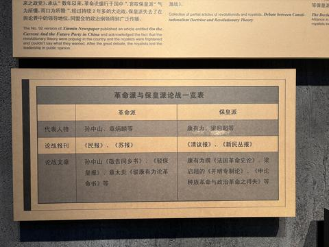
   - <a href="https://www.zhihu.com/people/wan-meng-si-lu">莞梦似麓</a> (<small title="回复于 2025-12-26 7:36:51/四川"> ✉️:你在</small>): 人家是君主立宪的资产阶级［大笑］
   - <a href="https://www.zhihu.com/people/mo-xi-56-27">河东布衣</a> (<small title="回复于 2025-12-26 7:45:19/北京"> ✉️:你在</small>): 君主立宪≠集权专制
   - <a href="https://www.zhihu.com/people/54-12-53-36-31">昨夜西风</a> (<small title="福建">2025-12-26 11:31:17</small>): 以今天的认识批评古人容易，今天，眼见为实，一个城建现代化，一个城建老破旧，哪个才是未来该有的样子？  
 

   - <a href="https://www.zhihu.com/people/201207-96">继续走咯201207</a> (<small title="回复于 2025-12-26 11:48:2/山东"> ✉️:昨夜西风</small>): 不过是烈火烹油
   - <a href="https://www.zhihu.com/people/hei-zi-48-86">三总五项做仌</a> (<small title="回复于 2025-12-26 11:55:20/湖南"> ✉️:你在</small>): 梁启超前后变化挺大的，人也在不断成长
   - <a href="https://www.zhihu.com/people/lt-fallout">Lt.Fallout</a> (<small title="回复于 2025-12-26 12:16:6/浙江"> ✉️:昨夜西风</small>): 右边。  
 
省钱
   - <a href="https://www.zhihu.com/people/89-34-57-81">鄭觀應</a> (<small title="回复于 2025-12-26 12:17:26/天津"> ✉️:你在</small>): 保皇党是要的是保留皇制，君主立宪，在稳定的局面中一步一步融入世界。其实摆在当时有识之士面前的几条道路都很烂，选择哪条道路就是比哪条更烂就避开哪条。法国打出狗脑子的暴乱，英国日本保守的立宪，美国两党轮流执政的民主，苏联红色组织掀桌子的革命，这些在从旧制度中走过来的人眼里看来都一堆问题，但清朝烂到拾不起来的局面又必须收拾，所以梁选择了保守治疗。
   - <a href="https://www.zhihu.com/people/84-62-8-71-68">反骨</a> (<small title="回复于 2025-12-26 12:32:56/江苏"> ✉️:昨夜西风</small>): 一个公司没有老员工不适合长期留下
   - <a href="https://www.zhihu.com/people/54-12-53-36-31">昨夜西风</a> (<small title="回复于 2025-12-26 12:37:52/福建"> ✉️:Lt.Fallout</small>): 弯喜欢城建老破旧？不喜欢城建现代化？铁皮屋喜欢吗？茅草屋呢？
   - <a href="https://www.zhihu.com/people/54-12-53-36-31">昨夜西风</a> (<small title="回复于 2025-12-26 12:39:23/福建"> ✉️:反骨</small>): （1），比喻类比不等同事实，基本逻辑常识  
 
（2），弯喜欢城建老破旧？不喜欢城建现代化？铁皮屋喜欢吗？茅草屋呢？
   - <a href="https://www.zhihu.com/people/lt-fallout">Lt.Fallout</a> (<small title="回复于 2025-12-26 12:56:2/浙江"> ✉️:昨夜西风</small>): 主要是省钱，没钱了
   - <a href="https://www.zhihu.com/people/54-12-53-36-31">昨夜西风</a> (<small title="回复于 2025-12-26 13:26:22/福建"> ✉️:继续走咯201207</small>): （1），世行IMF华尔街高盛摩根高薪欢迎你去指点他们如何写这边基建城建研报  
 
（2），弯喜欢城建老破旧？不喜欢城建现代化？铁皮屋喜欢吗？茅草屋呢？
   - <a href="https://www.zhihu.com/people/54-12-53-36-31">昨夜西风</a> (<small title="回复于 2025-12-26 13:29:32/福建"> ✉️:Lt.Fallout</small>): 请欣赏，喜欢吗？
 
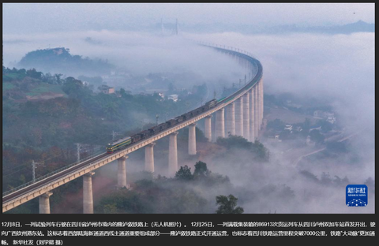
   - <a href="https://www.zhihu.com/people/ni-zai-83-6">你在</a> (<small title="回复于 2025-12-26 15:56:12/浙江"> ✉️:莞梦似麓</small>): 哈哈哈哈。没有流血的革命，注定不会成功。就像英国能走上工业革命一样。
 
就算大清叫做君主立宪，也改变不了本质。
 
换汤不换药，利益结构没变。跟戊戌变法一样，终究会失败。
 
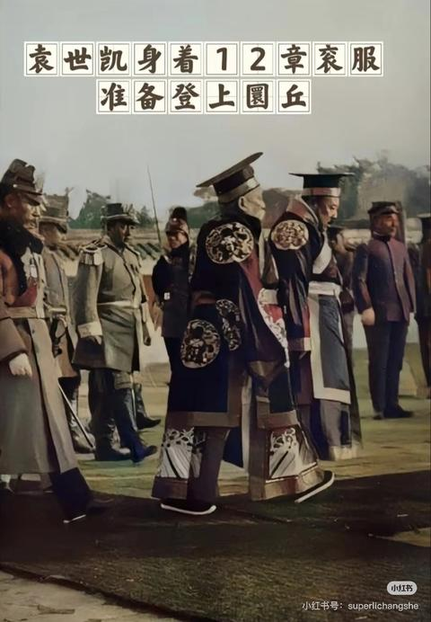
   - **探耽求究** (<small title="回复于 2025-12-26 21:21:6/日本"> ✉️:昨夜西风</small>): 喜欢，这也是种进步。不过我认为，文明的进步不在于多少高楼大厦，修多少宏伟奇观。在于百姓的衣食住行，基本保障，在于我们如何对待弱势群体。  
 
  
 
城市老旧，可能是当地没钱把街道搞定华丽好看，因为都拿去给农m发退休金了。你可能吃到了时代红利，靠拆迁收租过日子。但更多人恐怕是没有的。［思考］
   - <a href="https://www.zhihu.com/people/54-12-53-36-31">昨夜西风</a> (<small title="回复于 2025-12-26 22:19:49/福建"> ✉️:探耽求究</small>): （1），请用数据说话，  
 
（2），[陆港台，最低月薪，谁为低收入民众提供相对更多的生活保障？](https://zhuanlan.zhihu.com/p/10345286108)  
 
（3），大陆农民是养老险，不是退休金，懂？大陆农民的养老险是有补贴的，懂？有最高档和最低档的区别，懂？  
 
（4），弯喜欢城建老破旧？不喜欢城建现代化？铁皮屋喜欢吗？茅草屋呢？
   - <a href="https://www.zhihu.com/people/cheng-cheng-97-34-4">花龙舞月</a> (<small title="回复于 2025-12-27 8:6:8/福建"> ✉️:昨夜西风</small>): 还提农民养老险呢？1 个月 100 多［捂脸］，你提点别的都比这有说服力啊。［doge］
   - <a href="https://www.zhihu.com/people/zhu-ran-ze">死肥宅快乐猪</a> (<small title="回复于 2025-12-27 9:36:51/湖南"> ✉️:你在</small>): 君主立宪制皇帝还是要的，核心本质是王在法下，君是虚君，真正的权力在议会
   - <a href="https://www.zhihu.com/people/19-19-20-6">诺大尊</a> (<small title="回复于 2025-12-27 9:52:54/浙江"> ✉️:你在</small>): 保皇派和跪舔派还是两回事
   - <a href="https://www.zhihu.com/people/54-12-53-36-31">昨夜西风</a> (<small title="福建">2025-12-27 9:56:35</small>): 大陆农民没有退休金一说，懂？
   - <a href="https://www.zhihu.com/people/miracle-78-56-92">miracle</a> (<small title="回复于 2025-12-27 10:8:16/上海"> ✉️:昨夜西风</small>): 懂？
   - <a href="https://www.zhihu.com/people/54-12-53-36-31">昨夜西风</a> (<small title="回复于 2025-12-27 10:8:17/福建"> ✉️:花龙舞月</small>): 自己看图
   - <a href="https://www.zhihu.com/people/27-34-90-70-65">白挚</a> (<small title="回复于 2025-12-27 11:59:52/广东"> ✉️:昨夜西风</small>): 台湾最低月薪6000，这边是2000  
 
昨天刷到视频，台湾那边拆迁得九成同意才行，所以那边房子大多都是几十年的老房子
   - <a href="https://www.zhihu.com/people/54-12-53-36-31">昨夜西风</a> (<small title="回复于 2025-12-27 12:15:56/福建"> ✉️:白挚</small>): （1），[陆港台，最低月薪，谁为低收入民众提供相对更多的生活保障？](https://zhuanlan.zhihu.com/p/10345286108)  
 
（2），弯喜欢城建老破旧？不喜欢城建现代化？铁皮屋喜欢吗？茅草屋呢？
   - <a href="https://www.zhihu.com/people/timur-12">Tantrazonni</a> (<small title="上海">2025-12-27 18:22:26</small>): 这四个词是真精辟
   - <a href="https://www.zhihu.com/people/lt-fallout">Lt.Fallout</a> (<small title="回复于 2025-12-27 18:48:10/浙江"> ✉️:昨夜西风</small>): 喜欢好看，但是别搞了，没钱
   - <a href="https://www.zhihu.com/people/54-12-53-36-31">昨夜西风</a> (<small title="回复于 2025-12-27 18:50:6/福建"> ✉️:Lt.Fallout</small>): 世行IMF华尔街高盛摩根高薪欢迎你去指点他们如何写这边基建城建研报 ［大笑］
   - <a href="https://www.zhihu.com/people/lt-fallout">Lt.Fallout</a> (<small title="回复于 2025-12-27 19:7:19/浙江"> ✉️:昨夜西风</small>): 你是说钱多随便花是吗？  
 
城投的债就决定是你负责还了［飙泪笑］
   - <a href="https://www.zhihu.com/people/54-12-53-36-31">昨夜西风</a> (<small title="回复于 2025-12-27 19:22:41/福建"> ✉️:Lt.Fallout</small>): （1），大陆实行市场经济是从0开始，对市场经济的理解也是个从0开始逐渐提高的过程，地方债是过去对市场经济理解不够，管理没跟上留下的问题  
 
（2），大陆对于解决地方债问题有自己的处置安排  
 
（3），基建投资拉动经济，这是基本经济常识，懂？  
 
（4），如何花钱，专业的事情留给专业人士去做  
 
（5），世行IMF华尔街高盛摩根高薪欢迎你去指点他们如何写这边基建城建研报 ［大笑］
   - <a href="https://www.zhihu.com/people/54-12-53-36-31">昨夜西风</a> (<small title="回复于 2025-12-27 19:31:39/福建"> ✉️:Lt.Fallout</small>): （6），台湾居民负债占GDP比例远超大陆，懂？
 
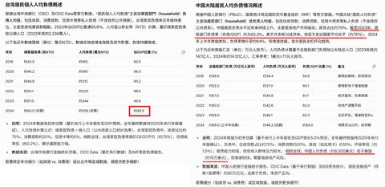
   - <a href="https://www.zhihu.com/people/lt-fallout">Lt.Fallout</a> (<small title="回复于 2025-12-27 20:8:13/浙江"> ✉️:昨夜西风</small>): 专业人士花到欠几百几千个亿？专业人士花到钱没了房也没了贷款还在［飙泪笑］？专业人士给某地产注资，把最挣钱的某市地铁搞成负债？［飙泪笑］  
 
专业人士？［飙泪笑］［飙泪笑］［飙泪笑］他们就是贪污的太特么专业了
   - <a href="https://www.zhihu.com/people/54-12-53-36-31">昨夜西风</a> (<small title="回复于 2025-12-27 20:15:3/福建"> ✉️:Lt.Fallout</small>): （1.1），至于贪污，这是另外一个问题，历史遗留问题  
 
（1.2），[关于中的贪腐的个人理解](https://zhuanlan.zhihu.com/p/703947326)  
 
（2），呱呱呱台电负债率97%的吧，咋还没破产？［大笑］
   - <a href="https://www.zhihu.com/people/song-gen-kun-49">文猴</a> (<small title="河北">2025-12-29 14:19:31</small>): 那五代十国就是盛世对吧？
   - <a href="https://www.zhihu.com/people/yehehua-59">yehehua</a> (<small title="四川">2025-12-29 14:44:9</small>): 梁启超一个保皇派会说这些?编的吧
   - <a href="https://www.zhihu.com/people/asong-12-78">梵高先生asong</a> (<small title="回复于 2025-12-30 18:49:4/四川"> ✉️:昨夜西风</small>): 李善德问
   - <a href="https://www.zhihu.com/people/54-12-53-36-31">昨夜西风</a> (<small title="回复于 2025-12-30 19:31:49/福建"> ✉️:继续走咯201207</small>): 弯喜欢城建老破旧，不喜欢城建现代化？铁皮屋喜欢吧，茅草屋呢？
   - <a href="https://www.zhihu.com/people/54-12-53-36-31">昨夜西风</a> (<small title="回复于 2025-12-30 21:32:26/福建"> ✉️:梵高先生asong</small>): （1），湾湾喜欢城建老破旧？不喜欢城建现代化？铁皮屋喜欢吗？茅草屋呢？  
 
（2），[关于中的贪腐的个人理解](https://zhuanlan.zhihu.com/p/703947326)
   - <a href="https://www.zhihu.com/people/69-8-34-94-51">师姨长技以制姨</a> (<small title="广东">2026-1-7 14:5:40</small>): 这样的制度无法激励人珉的智慧，所以科技远远落后，从而失去了大航海时代的开疆拓土机会
   - <a href="https://www.zhihu.com/people/40-18-41-6-24">魏什么禁言中</a> (<small title="回复于 2026-7-3 13:38:39/上海"> ✉️:昨夜西风</small>): 你ip不够有说服力啊
   - <a href="https://www.zhihu.com/people/54-12-53-36-31">昨夜西风</a> (<small title="回复于 2026-7-3 22:20:23/福建"> ✉️:师姨长技以制姨</small>): 欧洲最近30~40年，没有新出类似谷歌特斯拉英伟达这类世界级大公司，是因为欧制的缘故？
   - <a href="https://www.zhihu.com/people/54-12-53-36-31">昨夜西风</a> (<small title="回复于 2026-7-3 22:22:17/福建"> ✉️:魏什么禁言中</small>): 谁的IP有说服力？
   - <a href="https://www.zhihu.com/people/tan-yue-53-82">檀越</a> (<small title="回复于 2026-7-8 14:40:51/北京"> ✉️:你在</small>): 保皇的意思是君主立宪，本质上属于资产阶级改良派，当时的革命党属于资产阶级革命派，又叫共和派。这俩本质上都是资产阶级，你先搞懂这些历史术语再出来质疑！君主也可以是西方式的虚君，也可以是东方式的实君。秦制君主全都是集权式实君，梁启超保皇显然是西方式虚君，所以叫君主立宪制！
3. <a href="https://www.zhihu.com/people/zhutianwei">胡怀昭</a> (<small title="江苏">2025-12-26 1:1:8</small>): 说个搞笑的，江苏发展的好除了是传统的经济富庶区外，更重要的是这里的地方层级比起其他省来说更接近“联邦”，主打一个地级市不服省会，县区不服所在市，连乡镇都相互顶。所以苏超才能办得好。十三个队伍都打得有来有回，没见谁一家独大的［吃瓜］
   - <a href="https://www.zhihu.com/people/jiu-shi-zhe-yike">momo</a> (<small title="北京">2025-12-26 1:14:8</small>): 我想到蒙超整了几个巴西外援。
   - <a href="https://www.zhihu.com/people/zhu-se-sheng-xin">阿衡</a> (<small title="北京">2025-12-26 8:26:49</small>): 散装的嘛
   - <a href="https://www.zhihu.com/people/jiang-hhh">浮云流水</a> (<small title="江苏">2025-12-26 9:43:17</small>): 其实还可以划分苏南是吴文化、苏中是江淮文化、苏北是中原文化、南京是徽文化
   - <a href="https://www.zhihu.com/people/doctorfan-38">doctorfan</a> (<small title="回复于 2025-12-26 10:12:31/江苏"> ✉️:浮云流水</small>): 苏中皖中都是江淮文化，口音都很类似
   - <a href="https://www.zhihu.com/people/a-bei-er-qia">阿贝尔卡</a> (<small title="江苏">2025-12-26 12:24:10</small>): 少扯了 江苏也就是清朝才有的行政划分。没有江苏之前淮扬地区发展的也很好
   - <a href="https://www.zhihu.com/people/fu-lang-ci-na-ke">滑稽列夫斯基</a> (<small title="回复于 2025-12-26 13:2:0/北京"> ✉️:阿贝尔卡</small>): 那主要因为黄河夺淮入海导致淮河水系紊乱吧［好奇］
   - <a href="https://www.zhihu.com/people/a-bei-er-qia">阿贝尔卡</a> (<small title="回复于 2025-12-26 13:42:23/江苏"> ✉️:滑稽列夫斯基</small>): ？？？
   - <a href="https://www.zhihu.com/people/hai-sen-bao-de-xiao-hao-shou">知乎用户</a> (<small title="江苏">2025-12-26 20:44:42</small>): 是吗？浙江发展的好，是因为各省辖市不服省会杭州？［飙泪笑］
   - <a href="https://www.zhihu.com/people/zhutianwei">胡怀昭</a> (<small title="回复于 2025-12-27 0:38:50/江苏"> ✉️:知乎用户</small>): 我话只看一半？江苏是传统富庶区。浙江也是，发展的最好的都集中在北部港口区。山地里天生就是发展劣势。这点福建，广东也一样。
   - <a href="https://www.zhihu.com/people/xue-dao-lu-34">无知的人类</a> (<small title="回复于 2025-12-27 1:36:38/安徽"> ✉️:浮云流水</small>): 南京是江淮文化，
   - <a href="https://www.zhihu.com/people/qiju-lu">陆启居</a> (<small title="河北">2025-12-27 8:26:56</small>): 河北：？？
   - <a href="https://www.zhihu.com/people/tie-yi-42-90">美国完蛋了</a> (<small title="安徽">2025-12-27 10:11:2</small>): 机械大师［捂嘴］
   - <a href="https://www.zhihu.com/people/gutodcy">gutodcy</a> (<small title="广西">2025-12-27 10:46:48</small>): 这样才好，相互竞争，比那些强省会的好。
   - <a href="https://www.zhihu.com/people/sun-yi-kai-52">孙一开</a> (<small title="陕西">2025-12-28 12:40:22</small>): 我想到雷军他公司的跑步比赛视频。要是江苏机关搞个千米跑步，下级也不会让上级，按地位排名次是不？
   - <a href="https://www.zhihu.com/people/dr-mao-86">天父下凡人间体</a> (<small title="上海">2025-12-29 22:56:1</small>): 真要那么好，联省自治就不会失败了。
   - <a href="https://www.zhihu.com/people/zhutianwei">胡怀昭</a> (<small title="回复于 2025-12-30 1:22:18/江苏"> ✉️:天父下凡人间体</small>): 年代不一样，积贫积弱的时代和和平的现代能比么［doge］
   - <a href="https://www.zhihu.com/people/zhuo-tan-quan">不是药师</a> (<small title="河南">2025-12-30 14:29:36</small>): 反面典型就是珠三角经济连广东自身多数县市都难惠及……
   - <a href="https://www.zhihu.com/people/die-mannschaft-34">阿雷夫斯</a> (<small title="回复于 2026-1-1 21:46:3/安徽"> ✉️:胡怀昭</small>): 你这就是在拿结果倒推原因，你看看我们安徽，散装程度一点不比你们江苏差，但是经济呢，一个天上一个地下，为啥？因为你们沿海，我们不沿海［微笑］ 。跟什么散装程度有什么关系。
   - <a href="https://www.zhihu.com/people/ha-ha-36-35-68">哈哈</a> (<small title="北京">2026-2-9 10:7:24</small>): 哪里的经济好一点的地级市服省会？不服省会是因为自身发展好，听起来你的逻辑是因为不服省会所以发展好
   - <a href="https://www.zhihu.com/people/xiao-jin-28-32-40">嘎嘎达可</a> (<small title="河南">2026-3-13 9:3:44</small>): 有点按图索骥倒果为因
   - <a href="https://www.zhihu.com/people/--36-88-70-26">暖诶-</a> (<small title="回复于 2026-3-20 12:35:45/湖北"> ✉️:天父下凡人间体</small>): 不是好才成功，往往是坏的事物才成功，你成长过程中绝对是不好的东西，道德败坏的东西活的比你好，比你滋润，这是自然规律
   - <a href="https://www.zhihu.com/people/dr-mao-86">天父下凡人间体</a> (<small title="回复于 2026-3-23 16:36:47/上海"> ✉️:暖诶-</small>): 自然规律就是适者生存，不适者淘汰。制度的好与坏取决于是否适应当地情况，能否得到当地人的支持与拥护。显然联省自治没有做到。
   - <a href="https://www.zhihu.com/people/fei-se-ri-zhao">绯色日照</a> (<small title="山东">2026-6-27 10:39:16</small>): 画靶射箭，是因为传统富庶的鱼米之乡，外加近现代海运贸易集装箱的出现，贴近上海这个长三角沿海地区经济发达，使得各个地级市地区有了经济实力才发展的好，而不是散装导致发展的好。
4. <a href="https://www.zhihu.com/people/mark-30-4">卡妙</a> (<small title="广东">2025-12-25 18:42:5</small>): 历史可以看出，古代汉人的拓荒能力是比较差的，地理气候条件差一点，汉人就很少能大规模扎根生存，就算汉人发现了澳洲，在那个少水的环境也无法开拓土地，更别说大规模移民了
   - <a href="https://www.zhihu.com/people/woxiangmodamimi">兰博</a> (<small title="山东">2025-12-25 20:19:50</small>): 那大和族的拓荒能力是不是很强？［好奇］
   - <a href="https://www.zhihu.com/people/woxiangmodamimi">兰博</a> (<small title="山东">2025-12-25 20:20:2</small>): 白人的拓荒能力很强吗？［好奇］
   - <a href="https://www.zhihu.com/people/yehehua-59">yehehua</a> (<small title="四川">2025-12-25 20:59:6</small>): 周朝从小小的中原扩张到九州，这还差吗？制度不行怪人种?秦制就是垃圾，有问题吗？一个最多二百多年就亡国的制度，这不是垃圾什么是垃圾?
   - <a href="https://www.zhihu.com/people/jin-xue-feng-1">金大大侠</a> (<small title="回复于 2025-12-25 21:25:38/江苏"> ✉️:兰博</small>): 澳大利亚和美洲不是白人开拓出来的？
   - <a href="https://www.zhihu.com/people/woxiangmodamimi">兰博</a> (<small title="回复于 2025-12-25 22:21:21/山东"> ✉️:金大大侠</small>): 澳洲是，美洲不算，美洲有原住民的文明
   - <a href="https://www.zhihu.com/people/duo-la-duo-la-xiao-chao">多拉多啦小超</a> (<small title="回复于 2025-12-25 22:47:20/山西"> ✉️:兰博</small>): ……哪里没有原始人，不过是迁移时间，白人没去的时候美洲不就是荒土
   - <a href="https://www.zhihu.com/people/ruo-fei-sheng-shi">天漢复兴</a> (<small title="回复于 2025-12-26 0:44:41/江苏"> ✉️:yehehua</small>): 西方资本主义制度也挺垃圾，什么事都干不成
   - <a href="https://www.zhihu.com/people/yang-song-lin-45-16">kira</a> (<small title="回复于 2025-12-26 1:31:42/山东"> ✉️:兰博</small>): 美洲原住民又没开拓什么东西，那时候美洲也是荒地一片啊
   - <a href="https://www.zhihu.com/people/ren-jian-shi-50">知乎用户x5Ab3g</a> (<small title="回复于 2025-12-26 4:35:8/江苏"> ✉️:天漢复兴</small>): 什么事也干不成？？？那手机算什么，手机可是资本主义下的发明。秦制比资本主义烂多了［飙泪笑］［飙泪笑］
   - <a href="https://www.zhihu.com/people/woxiangmodamimi">兰博</a> (<small title="回复于 2025-12-26 6:52:21/山东"> ✉️:多拉多啦小超</small>): 玛雅、阿兹特克和印加是荒土？
   - <a href="https://www.zhihu.com/people/yehehua-59">yehehua</a> (<small title="回复于 2025-12-26 8:42:40/四川"> ✉️:知乎用户x5Ab3g</small>): 秦制粉可能都不知道铁犁牛耕这一农业技术其实周朝就已经出现了，但是一直到建国后几十年都还有不少地方在铁犁牛耕，秦制二千多年都整不出个比铁犁牛耕更先进的技术，就这他们还好意思嘲笑周制［捂嘴］
   - <a href="https://www.zhihu.com/people/mu-yi-zhi-zhou-50">木易之州</a> (<small title="回复于 2025-12-26 8:50:12/江苏"> ✉️:yehehua</small>): 曲辕犁，你在说什么
   - <a href="https://www.zhihu.com/people/mu-yi-zhi-zhou-50">木易之州</a> (<small title="江苏">2025-12-26 8:55:44</small>): 古代广东气候好吗？
   - <a href="https://www.zhihu.com/people/jin-xue-feng-1">金大大侠</a> (<small title="回复于 2025-12-26 9:11:52/江苏"> ✉️:兰博</small>): 美洲印第安人是游猎部落，开不了一点荒，后来美洲发展起来靠的是白人，不是印第安人
   - <a href="https://www.zhihu.com/people/da-xing-xing-38-55">知乎用户wAAFTr</a> (<small title="北京">2025-12-26 9:13:17</small>): 主要问题是秦朝开始的那套制度，无法让人随意离开。  
 
  
 
周朝时候就有先人直接从西边迁移到了吴越地带。  
 
  
 
如果考虑到西周时候的气候温度更高，那时候的吴越地带应该不会和现如今的海南越南差太多。  
 
  
 
但就算如此，西周人还是跑过去了。
   - <a href="https://www.zhihu.com/people/66-7-97-12">我见杨柳醉</a> (<small title="回复于 2025-12-26 9:17:8/北京"> ✉️:木易之州</small>): 这人初中历史睡觉了
   - <a href="https://www.zhihu.com/people/mo-long-94616">京云</a> (<small title="回复于 2025-12-26 9:22:16/四川"> ✉️:兰博</small>): 等大航海时代之后拓荒是已经开始工业化拓荒了，不在依赖密集劳动力
   - <a href="https://www.zhihu.com/people/woxiangmodamimi">兰博</a> (<small title="回复于 2025-12-26 9:50:29/山东"> ✉️:金大大侠</small>): 美国和加拿大印第安人是游猎部落，但是玛雅、阿兹特克和印加都是定居文明
   - <a href="https://www.zhihu.com/people/guardofpeople">大日孁貴</a> (<small title="回复于 2025-12-26 10:24:48/浙江"> ✉️:兰博</small>): 美中到美西差不多算是 那地方气候过于极端养不出高级文明 你说的这几个都集中在中美和南美啊
   - <a href="https://www.zhihu.com/people/kahouki-84">kahouki</a> (<small title="回复于 2025-12-26 11:22:48/上海"> ✉️:木易之州</small>): 我的天呐，居然是曲辕犁，那可太先进了，生产力得到了质的飞跃
   - <a href="https://www.zhihu.com/people/mu-yi-zhi-zhou-50">木易之州</a> (<small title="回复于 2025-12-26 11:30:6/江苏"> ✉️:kahouki</small>): 请不要阴阳怪气，事实上就是这就是革命性的进步
   - <a href="https://www.zhihu.com/people/zhang-42-8-76">zhang</a> (<small title="回复于 2025-12-26 11:59:8/北京"> ✉️:兰博</small>): 中美南美是这样的，但是北美没什么人
   - <a href="https://www.zhihu.com/people/mark-30-4">卡妙</a> (<small title="回复于 2025-12-26 12:8:56/广东"> ✉️:知乎用户wAAFTr</small>): 吴越那时候已经有很多本土人聚居，并不是荒地，中国南方开发难度算，很低的，雨水充足农作物极易生长
   - <a href="https://www.zhihu.com/people/mark-30-4">卡妙</a> (<small title="回复于 2025-12-26 12:10:14/广东"> ✉️:木易之州</small>): 广东气候都不算好，那全中国没什么地方好的了
   - <a href="https://www.zhihu.com/people/lt-fallout">Lt.Fallout</a> (<small title="回复于 2025-12-26 12:11:17/浙江"> ✉️:yehehua</small>): 因为海外扩张最难的就是第一步据点的建立，需要本土支援。而汉族的本土支援？不抓你就偷着乐吧还支援［飙泪笑］
   - <a href="https://www.zhihu.com/people/3MLvJN3A">罪人彼得</a> (<small title="回复于 2025-12-26 16:43:57/上海"> ✉️:兰博</small>): 台湾是日控时期彻底改变的,明清几百年都没有对台湾产生什么实质性影响
   - <a href="https://www.zhihu.com/people/woxiangmodamimi">兰博</a> (<small title="回复于 2025-12-26 16:57:29/山东"> ✉️:罪人彼得</small>): 国统时期是不是又把民国时期的文化带过去了？［好奇］
   - <a href="https://www.zhihu.com/people/3MLvJN3A">罪人彼得</a> (<small title="回复于 2025-12-26 17:22:33/上海"> ✉️:兰博</small>): 国统时期是接手一个完成现代化改造的台湾,即使是现在的台湾也是更像日本
   - <a href="https://www.zhihu.com/people/tank1924">tank1924</a> (<small title="河南">2025-12-26 17:35:39</small>): 因为有民可以牧，所以就不拓荒，牧的不好推倒重建换一家牧
   - <a href="https://www.zhihu.com/people/mu-yi-zhi-zhou-50">木易之州</a> (<small title="回复于 2025-12-26 19:52:57/江苏"> ✉️:卡妙</small>): “瘴疠之地”流放之地，怎么可能好？广东那边气候也是几度变化才好的，开发那边都跨越了千年时空间
   - <a href="https://www.zhihu.com/people/yue-gong-8-1">岳工</a> (<small title="回复于 2025-12-26 19:53:40/浙江"> ✉️:兰博</small>): 美国舔了这三个里哪个的包？
   - <a href="https://www.zhihu.com/people/luo-jie-26-23">罗杰</a> (<small title="回复于 2025-12-26 21:14:29/天津"> ✉️:兰博</small>): 很强
   - **探耽求究** (<small title="日本">2025-12-26 22:35:21</small>): 是原子化后的汉人拓荒能力差，拓荒殖民是需要组织和武力保障的，还要有一定财产。原子化的汉人贫农跑去拓荒，要么饿死要么沦为奴隶！这点放欧洲也一样，假如五月花号上的英国清教徒没有武装没有组织的就跑到北美会是什么下场呢？
   - <a href="https://www.zhihu.com/people/woxiangmodamimi">兰博</a> (<small title="回复于 2025-12-26 23:8:35/山东"> ✉️:岳工</small>): 阿兹特克［捂脸］
   - <a href="https://www.zhihu.com/people/woxiangmodamimi">兰博</a> (<small title="回复于 2025-12-26 23:9:53/山东"> ✉️:探耽求究</small>): 汉人在东北的拓荒成就不是很卓著吗？本来那里是女真人的地盘。汉人在蒙古草原倒是没啥建树，蒙古族依然是那里的主体民族［好奇］
   - **探耽求究** (<small title="回复于 2025-12-26 23:36:23/日本"> ✉️:兰博</small>): 所以闯关东得等到朝廷控制衰弱，民众能够有组织的大规模行动，以宗族 村落 乡团 行动。这在朝廷强势时期是不可能的。刚出县就被杀光了。包括下南洋也是一样的。必须是要有组织的武装移民才能扎根活下去。
   - **探耽求究** (<small title="回复于 2025-12-26 23:37:53/日本"> ✉️:兰博</small>): 这不是，清末蒙古也已经有很多汉人去垦荒了。
   - <a href="https://www.zhihu.com/people/yehehua-59">yehehua</a> (<small title="回复于 2025-12-27 9:47:50/四川"> ✉️:Lt.Fallout</small>): 周朝时期各诸侯国都只有初始据点，然后慢慢扩张领土，一个诸侯面临生存危机，临近诸侯会帮忙的，毕竟都是周天子分封的华夏诸侯，如果临近诸侯的力量也不行，那王畿的西六师或者东八师就该出动了，天子大军和诸侯联军会汇合起来把蛮夷驱逐，分封制就这么支援的。
   - <a href="https://www.zhihu.com/people/yehehua-59">yehehua</a> (<small title="回复于 2025-12-27 9:49:22/四川"> ✉️:兰博</small>): 那没办法，汉人移民又打不过苏军，如果汉人移民能打赢苏军，蒙古国早就成汉人国家了
   - <a href="https://www.zhihu.com/people/woxiangmodamimi">兰博</a> (<small title="回复于 2025-12-27 10:57:46/山东"> ✉️:yehehua</small>): 东北也曾是苏军占领区
   - <a href="https://www.zhihu.com/people/yehehua-59">yehehua</a> (<small title="回复于 2025-12-27 11:6:16/四川"> ✉️:兰博</small>): 那是东北汉人人数太多，苏军杀不完，要是东北汉人稀少，那苏联真的可以杀光汉人后扶持少数民族建立国家，就像蒙古国那样。当然苏匪也遭到报应，现在原苏联国家都在大力去俄化，俄罗斯族移民越来越少，当地人也不会再讲俄语
   - <a href="https://www.zhihu.com/people/58-29-6-21-67">杰米</a> (<small title="回复于 2025-12-27 11:51:59/上海"> ✉️:天漢复兴</small>): 今天你能享受到的人类现代化文明几乎都是你口中的垃圾资本主义所创造出来的。［飙泪笑］
   - <a href="https://www.zhihu.com/people/ruo-fei-sheng-shi">天漢复兴</a> (<small title="回复于 2025-12-27 15:27:41/江苏"> ✉️:杰米</small>): 是西方的科学家技术人员创造出来的，和他们垃圾的政治制度没关系
   - <a href="https://www.zhihu.com/people/xie-xian-sheng-95-70-26">谢先生</a> (<small title="回复于 2025-12-27 21:38:3/四川"> ✉️:yehehua</small>): 亡的不是国亡的是政权
   - <a href="https://www.zhihu.com/people/37-43-55-56">超级地球真理部</a> (<small title="江苏">2025-12-28 3:28:51</small>): 不是汉人拓荒差，是朝廷拓荒差
   - <a href="https://www.zhihu.com/people/lang-tian-7-4">浪天</a> (<small title="回复于 2025-12-28 8:4:4/北京"> ✉️:yehehua</small>): 三千年前，其他地方都是野人，野人怎么打的过我们
   - <a href="https://www.zhihu.com/people/yehehua-59">yehehua</a> (<small title="回复于 2025-12-28 8:25:33/四川"> ✉️:浪天</small>): 野人或者蛮夷只是不臣服周天子罢了，所以被华夏诸国蔑称，但这不代表他们弱，相反，在科技上华夏四周所谓的蛮夷很可能和周朝是同一水平，不然也不需要几百年才能征服他们，他们差在组织度，周朝实行的是封建制度，组织度远比奴隶制甚至部落制先进，所以处在同一科技水平，野人也只有被华夏征服的命运
   - <a href="https://www.zhihu.com/people/ze-ze-48-63-67">啧啧</a> (<small title="回复于 2025-12-28 9:51:43/浙江"> ✉️:yehehua</small>): 周搞分封制呀，世界上看欧洲殖民也能发现，分封制确实最有利于扩张。大明吞新疆不也是找了干儿子永镇云南吗。问题是分封制有个最大弊端就是小宗做大有可能反过来把大宗吞了，这放在周朝那种环境险恶，需要最大化的稳定周边的形势下或者欧洲发现新大陆，需要快速抢先手抢地盘的情况下比较合理。像中原王朝，有稳定基本盘的情况下，就没这个动力了。事实上美国的出现也证明了脱离实控的殖民最后反而让小宗得利。说明封建统治者一点不傻。
   - <a href="https://www.zhihu.com/people/fan-yang-sheng-64">范阳生</a> (<small title="回复于 2025-12-28 15:49:36/山东"> ✉️:天漢复兴</small>): ？然后咱们用的全是西方东西［飙泪笑］
   - <a href="https://www.zhihu.com/people/14-57-46-13">司马水镜</a> (<small title="回复于 2025-12-29 0:20:41/辽宁"> ✉️:探耽求究</small>): 也就是说秦制是将社会从一块块鹅卵石慢慢拆解成一盘散沙，社会发展的需求更多的是取决于底层民众的需求。但是秦制下民众的组织能力有限，所以像对外殖民这种对民间组织度有高度需求的事情就无法发生？就比如周制下各个诸侯国的领土可以不断向“蛮夷”地区扩张，其实主要原因是民众能自由交流，文化融合，军事上的征服反而是次要的？
   - <a href="https://www.zhihu.com/people/lang-tian-7-4">浪天</a> (<small title="回复于 2025-12-29 7:49:39/北京"> ✉️:yehehua</small>): 之前看到一个山东人还知道几千年前山东的文化信仰（说明野人并不是被图沙光了，也是被同化）
   - <a href="https://www.zhihu.com/people/95-79-59-84-83">星野</a> (<small title="回复于 2025-12-29 10:45:24/广西"> ✉️:yehehua</small>): 奈何取之尽锱铢，用之如泥沙？［吃瓜］
   - <a href="https://www.zhihu.com/people/95-79-59-84-83">星野</a> (<small title="回复于 2025-12-29 10:52:8/广西"> ✉️:司马水镜</small>): 抽象的在于当代史书上赞美民族融合带来的繁荣，但民族融合是离不开军事征服的，对欧美国家殖民的进退史大批特批，只可恨不是自己，在秦制下肯定会这种行为赞美成民族融合［吃瓜］
   - <a href="https://www.zhihu.com/people/14-57-46-13">司马水镜</a> (<small title="回复于 2025-12-29 10:55:29/辽宁"> ✉️:星野</small>): 这种大一统带来的僵化确实很可悲，不过好处就在于，它告诉了我们这条路不可行。
   - <a href="https://www.zhihu.com/people/frankie-97-86">司马后懿</a> (<small title="回复于 2025-12-30 18:28:21/广东"> ✉️:探耽求究</small>): 你罔顾了为何荷兰葡萄牙这样的弹丸小国要去搞殖民，因为他在欧大陆没法混，它们自己能活下去就不错，本地搞不过法国德国英国丹麦。但是地理大发现之后，它们一步步就开始非洲西海岸，美洲东海岸，南亚等地方建立起海外殖民地。
 
甚至你可以发现它们在北美殖民地都少，为什么，因为搞不过英法和西班牙［捂脸］。而殖民思想最早起源自古希腊地中海。
 
为何会想搞海外殖民这种模式？因为本地资源不足以维持生存，所以去其它地方弄资源，渐渐演变为殖民主义。
   - <a href="https://www.zhihu.com/people/68-32-89-95">闪击猫Zwei</a> (<small title="回复于 2025-12-31 12:0:45/湖南"> ✉️:探耽求究</small>): 小宗拓荒就是没用，除非有压倒性的军事代差。日耳曼骑士够符合知乎对拓荒者画像的期望吧？第四次十字军东征就是因为没有厉害的大宗引领，结果卖家产贷款朝圣东征的穷鬼骑士直接被威尼斯人扣了，不帮打架还钱当场给你图了，但骑士威尼斯人相对还算讲信誉的。部分骑士和朝圣者因为贪小便宜找了穆斯林富商帮忙搞船，结果被卖到北非当奴隶了
   - <a href="https://www.zhihu.com/people/ni-gou-liao-55">汉尼拔青春版</a> (<small title="江苏">2026-1-3 5:33:24</small>): 东北汉人：？？？？
   - <a href="https://www.zhihu.com/people/xiao-chuan-9-25-42">小川</a> (<small title="回复于 2026-1-4 16:16:41/云南"> ✉️:探耽求究</small>): 还是出去的人有眼光
   - <a href="https://www.zhihu.com/people/black-chen">black chen</a> (<small title="回复于 2026-3-21 18:44:49/印度尼西亚"> ✉️:兰博</small>): 白人能把原住民干掉大半，开拓难度比澳洲高［大笑］  
 
美洲土著接触到白人后，马匹弓箭火枪一应俱全，全学过去了，白人还是花了上百年吞并了美洲。  
 
带明对付满人都费劲。
   - <a href="https://www.zhihu.com/people/5-86-62-98">北君悟</a> (<small title="山东">2026-4-15 1:12:52</small>): 地理封闭，周边全是想抢的，就这怎么拓荒，再说下南洋也算一定程度拓荒了，至于澳洲本来最早就是靠流放过渡的，现在也没几个人，才开拓多点地方，更别提大规模移民了
   - <a href="https://www.zhihu.com/people/mark-30-4">卡妙</a> (<small title="回复于 2026-4-15 11:54:8/广东"> ✉️:北君悟</small>): 明代下南洋的汉人人数远多于荷兰人，离大陆也近可谓近水留台了，但还是被几百荷兰人给屠杀赶跑了
   - <a href="https://www.zhihu.com/people/wang-hai-xiang-87">魔王</a> (<small title="回复于 2026-4-15 12:55:38/江苏"> ✉️:兰博</small>): 北美？原住民？文明？
   - <a href="https://www.zhihu.com/people/woxiangmodamimi">兰博</a> (<small title="回复于 2026-4-15 13:8:59/山东"> ✉️:魔王</small>): 玛雅和阿兹特克
   - <a href="https://www.zhihu.com/people/wang-hai-xiang-87">魔王</a> (<small title="回复于 2026-4-15 13:25:56/江苏"> ✉️:兰博</small>): 这是北美？英国人也没去南美
   - <a href="https://www.zhihu.com/people/woxiangmodamimi">兰博</a> (<small title="回复于 2026-4-15 14:1:50/山东"> ✉️:魔王</small>): 墨西哥是不是南美？玛雅和阿兹特克跟南美有一点关系吗？
   - <a href="https://www.zhihu.com/people/5-86-62-98">北君悟</a> (<small title="回复于 2026-4-15 14:7:2/山东"> ✉️:卡妙</small>): 赶跑啥了？荷兰人殖民是靠打压华人，制造华人和南洋原住民冲突来统治的，荷兰人才几个人？不光荷兰人，几乎来南洋殖民的列强基本都是这么个政策，最多的肯定是原住民，其次是华人，最后才是列强的公民
   - <a href="https://www.zhihu.com/people/5-86-62-98">北君悟</a> (<small title="回复于 2026-4-15 14:14:21/山东"> ✉️:卡妙</small>): 而且明朝很强吗？明朝连内部都没治理明白，还支持南洋的汉人开拓？明朝中叶下南洋的汉人不基本是因为明朝腐败被逼的吗？
   - <a href="https://www.zhihu.com/people/wang-hai-xiang-87">魔王</a> (<small title="回复于 2026-4-15 14:20:14/江苏"> ✉️:兰博</small>): 算中北美吧，这也不是英国人地盘啊
   - <a href="https://www.zhihu.com/people/5-86-62-98">北君悟</a> (<small title="回复于 2026-4-15 14:27:57/山东"> ✉️:black chen</small>): 你说的那部分美洲土著和满人差不多，中美洲和南美洲的那些墨西加、印加这类相对先进的灭的最快
   - <a href="https://www.zhihu.com/people/5-86-62-98">北君悟</a> (<small title="回复于 2026-4-15 14:33:43/山东"> ✉️:兰博</small>): 清政府唯一做过的好事可能就是开放汉人移民东北，当然这也是呆清以前不让移民，日俄战争就是抢东北的，最后两败俱伤，相互制衡分割下来，给了清政府移民补救的机会，彻底放开了移民，要不然现在是谁的真不好说
   - <a href="https://www.zhihu.com/people/woxiangmodamimi">兰博</a> (<small title="回复于 2026-4-15 14:34:40/山东"> ✉️:魔王</small>): 都是被西班牙人攻陷的
   - <a href="https://www.zhihu.com/people/82-73-69-58">尘世</a> (<small title="回复于 2026-7-8 18:32:39/北京"> ✉️:兰博</small>): 这些不就是原始人王朝嘛，在中国就是番膏
5. <a href="https://www.zhihu.com/people/x-38-62-87">不叫蚌樂典孝急</a> (<small title="北京">2025-12-25 22:25:7</small>): 但是周制系统内，越秦制，就越可以统一华夏［捂脸］或者反过来说，有能力统一华夏者就是秦制的发明者和践行者
   - <a href="https://www.zhihu.com/people/jia-ke-si-68-87">格林</a> (<small title="广东">2025-12-25 22:38:0</small>): 周制很擅长开拓和殖民，因为分封出去的诸侯有动力。——因为开拓的都是自己的。
 
  
 
但周制不利于中央，因为开拓的是诸侯的，中央控制不了，甚至出去开拓的诸侯反过来威胁甚至取代中央。
 
  
 
中央一算，还不如不开拓。不开拓，他还是所有人的爹。开拓了，搞不好就被取代甚至灭绝了。
   - <a href="https://www.zhihu.com/people/75-41-20-1">晴翠荒城</a> (<small title="上海">2025-12-26 10:46:26</small>): 周也是统一的，秦汉那种所谓统一根本不比周高级，从今天角度看
   - <a href="https://www.zhihu.com/people/yi-zhi-w-32">一只w</a> (<small title="浙江">2025-12-26 10:53:46</small>): 周朝从关中平原鲸吞整个华北
   - <a href="https://www.zhihu.com/people/95-17-98-33-21">天降甘霖</a> (<small title="福建">2025-12-26 12:53:6</small>): 同意华夏并不是什么好事，欧洲从来没被统一过，并不妨碍最近两千多年领跑地球
   - <a href="https://www.zhihu.com/people/jiao-mao-zi-fa-shi">碳酸電機</a> (<small title="广东">2025-12-26 15:49:15</small>): 西欧也是这个趋势，但有英格兰这个异类，谁尝试统一就介入打断进程。
   - <a href="https://www.zhihu.com/people/3MLvJN3A">罪人彼得</a> (<small title="上海">2025-12-26 16:48:49</small>): 秦制只适合打仗,不适合统治
   - <a href="https://www.zhihu.com/people/hyy-22-54">hyy</a> (<small title="回复于 2025-12-26 20:33:37/陕西"> ✉️:格林</small>): 所以这是一个动态博弈的过程，只不过东大这边的地理环境太适合统一也太需要统一了，并且统一所能够带来的回报也太大了，付出和回报完全不成正比
   - <a href="https://www.zhihu.com/people/momo-17-85-8">momo</a> (<small title="回复于 2025-12-26 21:16:43/湖南"> ✉️:格林</small>): 话虽如此，周难道不是寿命最长的吗［吃瓜］
 
反倒是后来不开拓的，300年诅咒了。
   - <a href="https://www.zhihu.com/people/Thundertt">Eclair</a> (<small title="上海">2025-12-27 10:1:6</small>): 现在地球就是周制 从长远看地球必将统一
   - <a href="https://www.zhihu.com/people/aaron-zhou-318">强国有我</a> (<small title="广东">2025-12-27 12:0:43</small>): 周制相当于幕府天皇制，下面藩属的战斗力和开拓欲望相当高
   - <a href="https://www.zhihu.com/people/34-22-76-31">五天</a> (<small title="回复于 2025-12-27 15:47:46/广西"> ✉️:天降甘霖</small>): 你这句话有点草率了，不过是不同地区适合不同的政策罢了，欧洲也没有领先2000年。
   - <a href="https://www.zhihu.com/people/yehehua-59">yehehua</a> (<small title="回复于 2025-12-29 14:47:14/四川"> ✉️:格林</small>): 然而不开拓一样是灭亡的下场，没有人能永远当上位者，周朝选择开拓，姬家于是享有800年富贵，后世选择不开拓，结果最长的也只有二百多年，还不如人家开拓的周朝呢［飙泪笑］
   - <a href="https://www.zhihu.com/people/yehehua-59">yehehua</a> (<small title="回复于 2025-12-29 14:49:54/四川"> ✉️:格林</small>): 总的来说就是开拓分封最终虽然会被取代，但是统治时间较长，而大一统则是统治时间又短的同时还不开拓
   - <a href="https://www.zhihu.com/people/jia-ke-si-68-87">格林</a> (<small title="回复于 2025-12-29 15:3:44/广东"> ✉️:yehehua</small>): 周制相比秦制。最重要的是，富贵的质量不一样。
 
  
 
秦制可以全国事情你说了算。
 
  
 
但周制只能控制京畿所在的王室直属之地，对诸侯封地的约束能力比秦制要弱很多。
 
  
 
你是周王，你也渴望秦制。
   - <a href="https://www.zhihu.com/people/momo-17-85-8">momo</a> (<small title="回复于 2025-12-29 17:7:19/湖南"> ✉️:格林</small>): 秦二世而亡。  
 
我觉得现代人会选可持续发展。
   - <a href="https://www.zhihu.com/people/qi-lai-ban-zhuan-5">起来搬砖</a> (<small title="山西">2026-3-7 10:27:31</small>): 秦制属于把技能点都点在生存上了
   - <a href="https://www.zhihu.com/people/lmr-15-63">lmr</a> (<small title="回复于 2026-4-7 13:35:8/四川"> ✉️:格林</small>): 可惜的是地球很大，开拓了至少亡也是亡于自己人，而不开拓也会亡，还是亡于外人，再不孝的儿子取代了爹怎么也会给点体面，但外人就不需要了，直接刨坟挫骨扬灰，把地铲平了盖人家的新房子
   - <a href="https://www.zhihu.com/people/75-41-20-1">晴翠荒城</a> (<small title="回复于 2026-4-8 18:24:25/上海"> ✉️:yehehua</small>): 后期不开拓是因为触及地理隔离屏障了，至少当时技术层面如此。下南洋是在明清以后，闯关东也得等清中后期。而因为唐宋以后逐渐走向高度集权造成武德沦丧，早期初级集权王朝开拓出来的朝鲜和越南反而都得而复失了
   - <a href="https://www.zhihu.com/people/blanket58">南陶洛</a> (<small title="陕西">2026-7-6 6:17:29</small>): 为什么非要统一？欧盟那样有什么不好
   - <a href="https://www.zhihu.com/people/82-73-69-58">尘世</a> (<small title="回复于 2026-7-8 18:34:48/北京"> ✉️:碳酸電機</small>): 主要是日本离大陆太远了
   - <a href="https://www.zhihu.com/people/hir1rfrc">小看山hiR1RfRc</a> (<small title="回复于 2026-7-10 9:0:2/北京"> ✉️:momo</small>): 现在各国在互联网时代都没有分封空间
6. <a href="https://www.zhihu.com/people/sui-sui-96-56">知乎用户ifSmyX</a> (<small title="广东">2025-12-26 7:32:29</small>): 确实如此，而且现在英国不行了，英国人要run去美澳新加也比其他国家的人容易不要太多，国家收益小，但人的收益大啊
   - <a href="https://www.zhihu.com/people/95-17-98-33-21">天降甘霖</a> (<small title="福建">2025-12-26 12:54:4</small>): 英国人移民去阳光之地只是为了舒服的环境，温度，而不是收入和生活水平….
   - <a href="https://www.zhihu.com/people/34-7-13-10-92">路过</a> (<small title="广东">2025-12-26 13:43:10</small>): 聪明人躲避苦难，傻子以吃苦为荣［酷］
   - <a href="https://www.zhihu.com/people/ha-ha-he-he-78-59">哈哈呵呵</a> (<small title="回复于 2025-12-27 10:14:37/天津"> ✉️:天降甘霖</small>): 其实就算论收入和生活水平，美加澳也都比英国高，可能也就新和英打得有来有回。美不用说了，大国中唯一的极富裕发达国家，比它更富裕的都是袖珍国家，显然比英国强太多了。澳、加的收入水平那也是发达国家中收入不较高的，比不上美国但还是胜过主要欧洲大国。只有新西兰这几年经济不景气，真未必比英国强到哪里去。
   - <a href="https://www.zhihu.com/people/liu-an-33">独秀六合</a> (<small title="安徽">2025-12-27 19:10:56</small>): ［赞同］民族的收益才是根本的。五眼联盟都是昂撒人，从英国到美国定居，比我们从内地到北上广定居要容易吧。
   - <a href="https://www.zhihu.com/people/sui-sui-96-56">知乎用户ifSmyX</a> (<small title="回复于 2025-12-28 10:0:27/广东"> ✉️:独秀六合</small>): 跨国肯定是比跨省难。同民族不同国的好处主要是文化融入的难度，就是你比其他国家的人更好融入这个国家，像英国人去美国就直接是人家基本盘 不担心歧视什么的。以前广东刚开发那会限制人口流动时是差不多的，得不到合法身份的偷渡行为，抓到就遣返。［捂脸］
   - <a href="https://www.zhihu.com/people/sui-sui-96-56">知乎用户ifSmyX</a> (<small title="回复于 2025-12-28 10:3:8/广东"> ✉️:独秀六合</small>): 现在人口自由流动，你哪怕每月赚三千 只要能租个房子能温饱就能留下来了，不存在遣返。但深圳还是有限入，限车牌，那也比国界线轻。
7. <a href="https://www.zhihu.com/people/suifa-82">suifa</a> (<small title="广东">2025-12-25 23:49:19</small>): 榨取性质的社会就是强干弱枝，这样的社会结构都是会在新朝100年内国力领土最强盛，这样的社会根本不可能持续性的向外扩张
   - <a href="https://www.zhihu.com/people/jiu-shi-zhe-yike">momo</a> (<small title="北京">2025-12-26 1:12:54</small>): 弱的时候容易被推倒，有个成语叫传檄而定。只要打垮中央，剩下的一封信就自动认主了。
   - <a href="https://www.zhihu.com/people/shi-zhang-hong-chen-57">十丈红尘</a> (<small title="回复于 2025-12-26 2:35:21/福建"> ✉️:momo</small>): 南明为你点赞
8. <a href="https://www.zhihu.com/people/34-43-97-47-10">警我</a> (<small title="日本">2025-12-27 15:26:12</small>): 。
9. **探耽求究** (<small title="日本">2025-12-28 11:51:43</small>): 举例西域只是因为西域地理上被戈壁沙漠分割成一个个点状绿洲河谷，比较像一个个海上孤岛。实际上这些路线早就都是前人摸透了，远比海上安全稳定。  
 
  
 
说西域你觉得远，那敦煌呢？ 说西域 敦煌没概念。那并州九原知道不？包头吕布就是九原人，汉以后丢掉了九原，你猜什么时候再次被中原王朝稳定控制，再次成为汉地的呢？  
 
  
 
答，清朝。唐都不算，唐代的巅峰期其实非常短暂。  
 
  
 
更新了些评论回复，老规矩放到正文最后，有兴趣的朋友可以看一眼。
   - <a href="https://www.zhihu.com/people/60-74-98-60">黄什乙</a> (<small title="新疆">2025-12-28 12:30:39</small>): 连11公里深度的马里亚纳海沟都没探索明白，人类文明也有能力飞出大气层？笑话。
   - **探耽求究** (<small title="回复于 2025-12-28 13:31:44/日本"> ✉️:黄什乙</small>): 包头在哪都不知道，就在大同上面点，还在欺骗自己。其实明初时短暂的恢复过统治，明太祖本意效仿周朝分封诸塞王守边。允文上来就削藩，然后朱棣靖难后，防止有人学他，就把塞王撤藩内迁了。结果就是明朝迅速丢掉了这些秦汉旧土，缩回了长城以南。秦制王朝的悲哀，重心永远是防内。  
 
  
 
ps 海底本来就比太空探索难度大啊，空间站破个缝贴个胶布就能堵住就，一个气压差，海底破个缝就全军覆没了。
   - <a href="https://www.zhihu.com/people/60-74-98-60">黄什乙</a> (<small title="回复于 2025-12-28 14:26:53/新加坡"> ✉️:探耽求究</small>): “能一样吗？”.jpg
   - <a href="https://www.zhihu.com/people/miao-wu-61-57-57">喵嗚</a> (<small title="上海">2026-7-9 1:19:17</small>): 造成華夏文明三千年未有之格局的清朝？沒漢人兜著底，這反動統治早被列強瓜分乾淨了。
10. <a href="https://www.zhihu.com/people/16-91-31-28">401装甲旅旅长</a> (<small title="安徽">2025-12-25 19:59:17</small>): 中国历史每一次有大发展都是在分裂时期，而不是统一时期，几次大的扩张和大量吸收舶来品并产生创新性的东西，都是集中在先秦，三国-南北朝，五代-宋，清末民初
    - <a href="https://www.zhihu.com/people/95-17-98-33-21">天降甘霖</a> (<small title="福建">2025-12-26 12:46:6</small>): 王朝周期率
    - <a href="https://www.zhihu.com/people/ye-ban-wu-sheng-24">囚徒</a> (<small title="山东">2025-12-26 12:53:30</small>): 原因很简单，户籍制度加保甲制，限制人口流动，出门都要路引。只有乱世老百姓才能以流民的形式到处迁移。
    - <a href="https://www.zhihu.com/people/16-91-31-28">401装甲旅旅长</a> (<small title="安徽">2025-12-26 13:55:54</small>): 重点不在于分裂还是统一，重点在于有没有等量齐观的政治体进行高强度互动。古代中国的世界基本就是东亚一隅，一旦统一就占据东亚绝大部分，剩下的都是边角料，缺乏高等级的竞争博弈合作，给中国带不来什么良性互动。  
 
  
 
当今世界已经是全球视野了，东亚也只是世界的一部分，从全球来看，今天的世界就更似分裂而非统一，就像先秦的中国或者古代的欧洲，因此大国既可以保有规模优势，也不会失去等量齐观的政治主体进行高强度互动。  
 
  
 
因此我们可以引入一个粗浅的统一度的概念。如果中国古代大一统王朝在自己的东亚世界里统一度是70，欧洲是30，那么大概可以认为，当已知世界内的统一度＞50就有大一统的趋势，一旦在已知世界统一度超过这个临界点，就会扼杀文明活力。因此一旦地球50%以上被一个国家所统一，那人类文明将陷入古代中国的困境。
    - <a href="https://www.zhihu.com/people/jin-xin-66-53">薛与莉凉与薇</a> (<small title="海南">2025-12-29 7:47:43</small>): 不利于吹嘘大一统的话不要说
    - <a href="https://www.zhihu.com/people/xi-huan-shang-liao-he-jiu">我难过的笑了</a> (<small title="山东">2026-1-2 16:37:23</small>): 历史规律面前无能为力。。。还是忙好自己的事吧
11. <a href="https://www.zhihu.com/people/wang-zi-wen-78-51">王子文</a> (<small title="广东">2025-12-26 17:24:6</small>): 最喜欢的就是周，现在都鼓吹汉唐明，但周才是真正的开疆拓土的黄金时代，而且是能巩固下来。分封制，分布式发展还是有很大好处的。内部统一，周边分封，才是组织扩大的正途。区块链发展的好，也和分布式有关系。
    - <a href="https://www.zhihu.com/people/bu-goodman">媠氣</a> (<small title="北京">2025-12-27 23:9:6</small>): 看来孔子要恢复周制还是有道理的，可惜后来连儒家都变秦制工具了
    - <a href="https://www.zhihu.com/people/yehehua-59">yehehua</a> (<small title="回复于 2025-12-29 14:55:47/四川"> ✉️:媠氣</small>): 孔子想恢复周礼，而周礼除了分封外最重要的就是团结，大家对外开拓对内团结，各诸侯国一直对外，而不是内部不守规矩纷纷打内战，有点像美国的联邦制，各州都有极大的自治权，联邦政府也认可地方搞自治，但这个自治特权是让地方好好搞建设和开拓，不是让地方用来打内战的。
    - <a href="https://www.zhihu.com/people/hei-shi-zhuan-lun-wang">黑石转轮王</a> (<small title="江西">2025-12-29 16:54:19</small>): 分封制也封不了多久的，封了的诸侯国，生子为君，君子生大夫，大夫还有采邑，大夫的后代为士，而有食邑的士就很少了，所以士只能打工为生。
 
随着士这个群体的扩大，分封制就封不下去了，进入大争之世，因为士也要吃饭啊！
    - <a href="https://www.zhihu.com/people/lucky-3-1-6">竹外閣2000</a> (<small title="广东">2025-12-31 21:30:2</small>): 但实际上周制正是因为开疆拓土才灭亡的，本来最开始周天子分封的土地都是经过精确对比的，每个国家的实力都差不多，有一些边远之地的就多封一点但是后来科技进步了，原本不能使用的地也可以使用了，边缘国家就发展起来了，直到演变到最后的零和博弈
    - <a href="https://www.zhihu.com/people/zhuan-quan-quan-de-shi-jian-ling-zhu">楚灵心</a> (<small title="上海">2026-1-2 3:33:12</small>): 生物进化到底层逻辑就是在稳定的生态系统内部尽可能增大多样性，不管自然社会还是人类社会都是这样。物种单一的生态圈很快就会灭亡。
    - <a href="https://www.zhihu.com/people/huang-yan-97-70">献出忠诚</a> (<small title="回复于 2026-7-12 12:34:49/上海"> ✉️:媠氣</small>): 孔子是真正的至圣先师，毕生追求一个理想的周制社会，结果独尊儒术后念的周经、行的秦事，还自诩孔子的好学生，只能说释经权很重要。
12. <a href="https://www.zhihu.com/people/75-2-12-84-87">打酱油</a> (<small title="广东">2025-12-26 8:25:18</small>): 熟地只管收割，生地需要开拓，熟地够吃了，想办法围起来，谁还费神费力开生地……
    - <a href="https://www.zhihu.com/people/huo-yao-tong-98">是最美的玩具</a> (<small title="湖南">2025-12-26 12:0:56</small>): 但是周开创的独特的嫡长子继承制，只有嫡长子才能继承熟地，生地派次子、庶子自行开拓，既有效避免熟地分割，又能让次子们拥有动力去开疆拓土，只是后面发现次子的后代在百年后可能会是将来的敌人，慢慢变成秦制后，把次子庶子都只给银两官职养着，没有实权，也没有开拓力。
    - <a href="https://www.zhihu.com/people/qian-duo-duo-588">开朗橘子喜滋滋</a> (<small title="回复于 2025-12-26 22:44:1/山西"> ✉️:是最美的玩具</small>): 周朝最长，五六百年该开的荒适合人住的地方都弄的差不多了，这么多年人口肯定爆涨。等秦的时候早变了
    - <a href="https://www.zhihu.com/people/66-14-96-59">从今天开始幸福</a> (<small title="回复于 2025-12-28 14:45:3/云南"> ✉️:开朗橘子喜滋滋</small>): 红河三角洲那么好的地方，也没见收了
13. <a href="https://www.zhihu.com/people/wang-wei-71-79">阮文追</a> (<small title="江苏">2025-12-25 17:38:35</small>): 一百来公里的台湾都得清朝才开发出来
    - <a href="https://www.zhihu.com/people/94-32-78-13">蓝终向南</a> (<small title="广东">2025-12-25 18:44:14</small>): 明郑
    - <a href="https://www.zhihu.com/people/liang-sheng-92-77">梁岛主</a> (<small title="广东">2025-12-25 22:12:7</small>): 大清几百年也只是开发台岛沿海地带，真正深耕且把台岛现代化是太阳国，部分台人对日有特殊感情也有这原因，有如港对英。
    - <a href="https://www.zhihu.com/people/ya-li-shi-duo-de-20-21">亚里士多得</a> (<small title="江苏">2025-12-25 22:39:36</small>): 你说的“一百来公里”是到清朝首都的距离吗［好奇］
    - <a href="https://www.zhihu.com/people/sui-bo-zhu-liu-59-88">随波逐流</a> (<small title="回复于 2025-12-25 23:43:24/广东"> ✉️:亚里士多得</small>): 那是海峡距离
    - <a href="https://www.zhihu.com/people/doublebacks-89">MOMO</a> (<small title="上海">2025-12-26 1:24:34</small>): 真的不要嘲笑大清，继承大明的话，现在的中国没印度大。人家清帝退位的时候，可是把一个包括了蒙藏青海新疆东北的完整帝国交给了民国，这些地方汉人几千年要么从没统治过，要么勉强羁縻有个名义上的统治权，大清全部建立了牢固的控制。别的不说，从汉唐到大明，中原政权在东北的实控线一直在辽东。
    - <a href="https://www.zhihu.com/people/ai-ren-zhi-sheng-ji-21">矮人直升机</a> (<small title="辽宁">2025-12-26 5:58:34</small>): 清朝也没有开发。是因为日本要抢，才开始重视发展这个地方。也没开发太多。
    - <a href="https://www.zhihu.com/people/46-74-44-12-66">知乎用户pMK3ye</a> (<small title="上海">2025-12-26 7:39:12</small>): 带清为数不多的正面遗产就是领土
    - <a href="https://www.zhihu.com/people/he-fang-53-45">何妨</a> (<small title="回复于 2025-12-26 7:51:3/广东"> ✉️:MOMO</small>): 也因为此，所有末代皇族中，爱新觉罗算是最幸运的。
    - <a href="https://www.zhihu.com/people/17-15-47-13">还看今喵</a> (<small title="中国台湾">2025-12-26 8:0:7</small>): 沒毛病［吃瓜］
    - <a href="https://www.zhihu.com/people/transnwang">transnwang</a> (<small title="江苏">2025-12-26 9:53:22</small>): 台湾是明海盗头子开发的
    - <a href="https://www.zhihu.com/people/xiao-wei-xiang-qian-chong">通辽国环境部长</a> (<small title="广东">2025-12-26 10:2:50</small>): 讲个笑话，第一个对台湾全域有控制能力的政权是日本
    - <a href="https://www.zhihu.com/people/sdfzsaaz">Akary</a> (<small title="广东">2025-12-26 11:2:52</small>): 台湾西岸到17世纪还没整明白，东岸更是一坨，就这样还有脸追溯到吴国，真的是可笑至极。
    - <a href="https://www.zhihu.com/people/wang-wei-71-79">阮文追</a> (<small title="回复于 2025-12-26 11:38:13/江苏"> ✉️:Akary</small>): 土著在荷兰人来之前都是原始部落社会，说明跟大陆几乎没有任何交流
    - <a href="https://www.zhihu.com/people/201207-96">继续走咯201207</a> (<small title="回复于 2025-12-26 11:43:43/山东"> ✉️:MOMO</small>): 元
    - <a href="https://www.zhihu.com/people/kong-cheng-zhi-you-jiu-meng-zai-94-29">空城只有旧梦在</a> (<small title="回复于 2025-12-26 12:21:0/湖南"> ✉️:蓝终向南</small>): 明郑时的台湾总共就几万人
    - <a href="https://www.zhihu.com/people/kong-cheng-zhi-you-jiu-meng-zai-94-29">空城只有旧梦在</a> (<small title="回复于 2025-12-26 12:22:46/湖南"> ✉️:阮文追</small>): 台湾真正大规模开发是日据时期！
    - <a href="https://www.zhihu.com/people/4goclv">昵称不合法</a> (<small title="陕西">2025-12-26 14:53:54</small>): 清朝也只开发了一半，台西。中央山脉以东还管不到。李鸿章曾以这条推脱日本赔偿要求，当时外国人画的的中国地图有些也不画台东
    - <a href="https://www.zhihu.com/people/huang-chen-43-17">稻荷狐仙</a> (<small title="上海">2025-12-26 14:59:54</small>): 清的开发约等于🈚［捂脸］，跟明郑相比根本没多少进步，你要么把台湾的开发归功于明郑，要么归功于1905后的日本，大清何德何能。
    - <a href="https://www.zhihu.com/people/zhang-liang-44-8">中年奈德丽</a> (<small title="回复于 2025-12-26 15:9:14/江西"> ✉️:MOMO</small>): 民国可怜啊，打完日本打套皮苏联。
    - <a href="https://www.zhihu.com/people/xiao-jin-yue-91">索马里海贼</a> (<small title="回复于 2025-12-26 15:10:15/陕西"> ✉️:Akary</small>): 总比20世纪的日本早吧
    - <a href="https://www.zhihu.com/people/xiao-jin-yue-91">索马里海贼</a> (<small title="回复于 2025-12-26 15:10:37/陕西"> ✉️:Akary</small>): 东南亚宅男，差不多行了
    - <a href="https://www.zhihu.com/people/xiao-jin-yue-91">索马里海贼</a> (<small title="回复于 2025-12-26 15:11:15/陕西"> ✉️:稻荷狐仙</small>): 怎么定义开发？有人在就是开发啊，台湾本省人就是明清几百年自发从福建跑过去的
    - <a href="https://www.zhihu.com/people/3MLvJN3A">罪人彼得</a> (<small title="回复于 2025-12-26 16:37:59/上海"> ✉️:蓝终向南</small>): 郑成功是割据,而且对台湾的控制极为有限,真正改造台湾的是日本
    - <a href="https://www.zhihu.com/people/bao-long-zhan-shi-28-18">超级无敌暴龙战士</a> (<small title="回复于 2025-12-26 17:15:10/山西"> ✉️:蓝终向南</small>): 孙吴［doge］
    - <a href="https://www.zhihu.com/people/AniEric">海苔肉松</a> (<small title="回复于 2025-12-26 18:51:49/山东"> ✉️:超级无敌暴龙战士</small>): 你是指不知道去哪里抓了些野人还碰了一脑袋回来还被孙权给看了的那两位吗［机智］
    - <a href="https://www.zhihu.com/people/yue-gong-8-1">岳工</a> (<small title="回复于 2025-12-26 19:52:7/浙江"> ✉️:何妨</small>): 历代都玩二王三恪，大部分人倒霉，少部分人立个牌坊能过的比前朝还好
    - <a href="https://www.zhihu.com/people/ae86-90-1">dhdhkk</a> (<small title="回复于 2025-12-26 21:0:31/江苏"> ✉️:Akary</small>): 至少台湾人都是大陆跑过去的
    - <a href="https://www.zhihu.com/people/sdfzsaaz">Akary</a> (<small title="回复于 2025-12-26 21:3:51/广东"> ✉️:dhdhkk</small>): 对，绝大多数是这样
    - <a href="https://www.zhihu.com/people/qian-duo-duo-588">开朗橘子喜滋滋</a> (<small title="回复于 2025-12-26 22:25:29/山西"> ✉️:MOMO</small>): 所以清朝是比较体面的退位，现在人说起满族来是感觉和汉族一样的，没人当他少数民族［捂脸］
    - <a href="https://www.zhihu.com/people/qian-duo-duo-588">开朗橘子喜滋滋</a> (<small title="回复于 2025-12-26 22:27:12/山西"> ✉️:矮人直升机</small>): 要这么说真正开发是解放军，去东北去大西北去蒙古搞建设
    - <a href="https://www.zhihu.com/people/qian-duo-duo-588">开朗橘子喜滋滋</a> (<small title="回复于 2025-12-26 22:34:54/山西"> ✉️:罪人彼得</small>): 那是两个时代中间差了多少年，郑成功到是想开发，大明的人谁愿意去，就跟让你现在移民柬埔寨一样，日本那是打仗占地盘做据点直接移民过去，就和以前日本移民东北一样，资源就那么多，原来东北人的地是不是让日本人占了。现在台湾对日本有好感是因为他们不是那会儿死的那一批人
    - <a href="https://www.zhihu.com/people/weakleilei">weakleilei</a> (<small title="广东">2025-12-27 8:41:44</small>): 其实清朝也没能把台湾全岛实现统治。真实现要到日本殖民台湾之后［捂脸］
    - <a href="https://www.zhihu.com/people/weakleilei">weakleilei</a> (<small title="回复于 2025-12-27 8:44:35/广东"> ✉️:索马里海贼</small>): 台湾土著是南岛语系人，起码一两万年前就上岛了，和中国大陆的汉藏语系人根本不是一个人种。
    - <a href="https://www.zhihu.com/people/tian-dao-gao-yuan">天道高远</a> (<small title="黑龙江">2025-12-27 9:49:1</small>): 元末台湾本来已经被一部分汉人开垦，然后被朱元璋给灭了图了，又把台湾放弃了
    - <a href="https://www.zhihu.com/people/liang-sheng-92-77">梁岛主</a> (<small title="回复于 2025-12-27 10:31:18/福建"> ✉️:索马里海贼</small>): 不是的，台湾原住民不是来自中国大陆。
    - <a href="https://www.zhihu.com/people/bai-yun-cang-you">屋顶睡觉的猫</a> (<small title="湖北">2025-12-27 11:35:54</small>): 大清初期是不想开发的，奈何姓郑的认死理［思考］
    - <a href="https://www.zhihu.com/people/victor-sino">Victor Sino</a> (<small title="孟加拉">2025-12-27 13:42:52</small>): 明郑
    - <a href="https://www.zhihu.com/people/li-cong-7-93">马保国</a> (<small title="回复于 2025-12-27 17:34:46/河北"> ✉️:MOMO</small>): 你不要被历史地图忽悠了。  
 
清代对许多地方都是羁縻统治，云贵、蒙古、川藏，都没有完全控制。当时只是纳贡且名义上顺从。乾隆年间才击败了大小和卓，但也未能完全控制西贝疆。
    - <a href="https://www.zhihu.com/people/grunge-37-1-61">Grunge</a> (<small title="回复于 2025-12-27 19:33:37/山东"> ✉️:MOMO</small>): 印度是人家大英帝国整合的
    - <a href="https://www.zhihu.com/people/peter-60-80">烽火戏猪猴</a> (<small title="回复于 2025-12-28 10:26:50/北京"> ✉️:MOMO</small>): 结果民国接手就把外蒙古丢了……［流泪］咱们一直就没觉得那些地方是自己的疆域，驱除鞑虏吗，总想把外族赶出汉地，汉族守了上千年的长城，思想上已经把自己禁锢在自己这块地盘上了。
    - <a href="https://www.zhihu.com/people/wei-qi-jian">无名</a> (<small title="回复于 2025-12-28 14:14:5/广东"> ✉️:马保国</small>): 照你的标准那中国所有封建王朝领土都得大缩水
    - <a href="https://www.zhihu.com/people/ai-xin-jue-luo-51-42">开元盛世李隆基</a> (<small title="回复于 2025-12-28 22:31:26/河南"> ✉️:何妨</small>): 汉朝刘家还不幸运？两次灭国都能平安的下台
    - <a href="https://www.zhihu.com/people/ai-xin-jue-luo-51-42">开元盛世李隆基</a> (<small title="回复于 2025-12-28 22:31:59/河南"> ✉️:transnwang</small>): 海盗头子抢过来的
    - <a href="https://www.zhihu.com/people/huang-chen-43-17">稻荷狐仙</a> (<small title="回复于 2025-12-29 8:33:46/江苏"> ✉️:索马里海贼</small>): 那也是明郑开发的啊，清朝根本没开发什么，只是接手了明郑的基本盘而已。
    - <a href="https://www.zhihu.com/people/shan-dong-dao-da-xing-tai-27">知乎用户</a> (<small title="回复于 2025-12-30 14:43:27/黑龙江"> ✉️:知乎用户pMK3ye</small>): 逆天
    - <a href="https://www.zhihu.com/people/frankie-97-86">司马后懿</a> (<small title="广东">2025-12-30 18:11:59</small>): 打匈奴的时候，好像还没有穆斯林呢［捂脸］
    - <a href="https://www.zhihu.com/people/zzz-65-7-75-60">zzz</a> (<small title="回复于 2025-12-31 21:11:33/山东"> ✉️:知乎用户pMK3ye</small>): 皇汉表示没大清，汉人王朝能更大，我寻思他们是不会看明朝这200年的表现吗？［捂脸］
    - <a href="https://www.zhihu.com/people/kan-kan-69-56-16">看看</a> (<small title="回复于 2026-1-2 10:56:59/上海"> ✉️:MOMO</small>): 没有谁交给谁的说法，每一寸土地都是打下来的，然后立杆枪在上面守着
    - <a href="https://www.zhihu.com/people/zzz-65-7-75-60">zzz</a> (<small title="回复于 2026-1-7 3:4:12/山东"> ✉️:稻荷狐仙</small>): 你看看明政多少人口，清朝台湾多少人口好不好？明政只有台南而已看的是不如清朝的，但把全岛开发确实是本子国
    - <a href="https://www.zhihu.com/people/zzz-65-7-75-60">zzz</a> (<small title="回复于 2026-1-7 3:9:40/山东"> ✉️:马保国</small>): 羁縻之间亦有差距啊，虽然不像汉地那样全部派流官管辖，但当地的军事外交司法行政大权归中央派遣的官员管辖，各种大小事务也是清朝官员说了算，事实其实就是实控了，赵屠夫和张荫棠杀西藏亲英派杀的人头滚滚，dllm不老实直接绑去北京了（注意此时立清朝完蛋没几年了）
14. <a href="https://www.zhihu.com/people/xu-gang-5-12">爱吃可乐鸡翅的猫</a> (<small title="江苏">2025-12-28 9:12:31</small>): 中国古代其实是大型农奴制，和平时期搞建设（徭役）种田（佃农），要打仗了就放下锄头入伍作战，这种形式远比开拓殖民更加容易控制也更容易榨出油水
    - <a href="https://www.zhihu.com/people/asdxsw44">佛系车手</a> (<small title="四川">2026-7-1 0:42:1</small>): 农民好歹有地，苏连那种把地都收走的那种才是真的农奴社会
15. <a href="https://www.zhihu.com/people/damienxiao-bai-ke">拯救一下地球</a> (<small title="澳大利亚">2025-12-27 9:28:33</small>): 有点道理，长城其实防的是自己人跑出去
16. <a href="https://www.zhihu.com/people/43-23-44-9-81">子尘</a> (<small title="四川">2025-12-27 6:10:15</small>): 就说近的，几十年前农民进城都要开证明。
17. <a href="https://www.zhihu.com/people/zhu-ran-ze">死肥宅快乐猪</a> (<small title="湖南">2025-12-27 9:35:44</small>): 殖民究竟是怎么殖民的，历史上有过三种模式，第一种叫雅典模式，即母邦子邦，名义上有联系，但互相独立。第二种叫西班牙模式，核心就是米塔制度，也就是我们大家最熟悉的竭泽而渔模式，殖民地本质是征服者的战利品。第三种是漂亮国模式，即自下而上式殖民，殖民地的扩大不如说是宪法管理范围的扩大。
    - <a href="https://www.zhihu.com/people/zhu-ran-ze">死肥宅快乐猪</a> (<small title="回复于 2025-12-29 10:15:10/湖南"> ✉️:知乎用户桂</small>): 法国后两种都试过，都不咋行［吃瓜］
    - <a href="https://www.zhihu.com/people/42-71-90-94">知乎用户桂</a> (<small title="黑龙江">2025-12-28 20:3:40</small>): 法国算第几种，若第三种那不该法国资厉早？［感谢］
18. <a href="https://www.zhihu.com/people/72-91-91-7">源洲律</a> (<small title="广东">2025-12-26 10:31:14</small>): 一管就死，一放就活
    - <a href="https://www.zhihu.com/people/song-gen-kun-49">文猴</a> (<small title="河北">2025-12-29 14:25:53</small>): 那五代十国就是盛世是吧？
    - <a href="https://www.zhihu.com/people/yehehua-59">yehehua</a> (<small title="回复于 2025-12-29 14:40:20/四川"> ✉️:文猴</small>): 蒙元和满清都能被大一统爱好者吹成盛世，那五代十国为什么不能是盛世?
    - <a href="https://www.zhihu.com/people/song-gen-kun-49">文猴</a> (<small title="回复于 2026-1-3 10:49:17/河北"> ✉️:yehehua</small>): 蒙元和满清是殖民时代，不是大一统时代，你不用串
    - <a href="https://www.zhihu.com/people/jian-xin-91-32">剑心</a> (<small title="回复于 2026-1-9 23:43:28/上海"> ✉️:文猴</small>): 蒙元不谈，满清的制度是百分之一百的秦制大一统吧，且集权程度是工业革命前最高峰，怎么你们不喜欢了？［爱］，就因为统治者不是汉人吗？
    - <a href="https://www.zhihu.com/people/xu-gang-5-12">爱吃可乐鸡翅的猫</a> (<small title="回复于 2026-7-10 12:43:18/江苏"> ✉️:剑心</small>): 这个是针对汉地，其他地方不是
19. **探耽求究** (<small title="美国">2026-7-1 13:21:44</small>): 发现很多人有个误解，明实录其实不是原始档案，什么是原始档案，皇帝的圣旨，大臣的奏折，朝廷的公文，鱼鳞黄册，这叫原始档案，实录其实也是二次加工后的东西。明实录也是几经周折才补全，虽然也是极其重要史料，但也是二手的，甚至三手四手。真正明朝的原始档案早就毁的差不多了，遗存的不足万一。宋实录仅能拼凑出一些残本，跟远的基本上毁干净了。  
 
  
 
所以很多吹虚的详尽的史料，其实只有很多人看不上的离得近的清朝算得上。这就是大一统的魅力吧！ 而本文采用的人口数字，其实是历史学家通过质鳞片爪的史料记载和考古发掘最后通过统计模型给出的数字。
    - <a href="https://www.zhihu.com/people/zhu-ran-ze">死肥宅快乐猪</a> (<small title="湖南">2026-7-1 14:5:21</small>): 毕竟一堆人认为历史研究=看文献，有别人没有的文献就像拿了金手指，完全不用动脑子［吃瓜］
    - <a href="https://www.zhihu.com/people/mo-xi-56-27">河东布衣</a> (<small title="北京">2026-7-1 18:15:26</small>): 明末流落到日本的明实录跟清刻本没啥区别你怎么解释？［惊喜］
    - <a href="https://www.zhihu.com/people/huang-chen-43-17">稻荷狐仙</a> (<small title="回复于 2026-7-3 11:52:51/上海"> ✉️:河东布衣</small>): 这跟作者说的有什么关系吗［捂脸］？又不是说带清篡改明实录。
    - <a href="https://www.zhihu.com/people/xiami-d">xiami zhuhai</a> (<small title="广东">2026-7-7 2:44:39</small>): 作者是不是很赞同秦晖老师的《秦汉史讲义》观点，最近正在看这本书
20. <a href="https://www.zhihu.com/people/wang13990884950">光禄寺大夫</a> (<small title="四川">2025-12-28 10:27:59</small>): 深表认同，但是我看俞敏洪写的新东方公司的经历：一个新公司最开始小，都是类似于周朝井田制分封制的管理方式，但是公司大了，这种方式会造成混乱与分裂，最后只能走向现代大公司制度，集中管理。但是又看到抖音上讲大公司确实有弊端，就一直吃老本，很难创新，遇到时代新风口就赶不上了，最终没落，柯达，诺基亚，百事达，迪士尼，腾讯都是这样，只能靠小公司创新。有的小公司遇到时代大风口，一跃就能干翻老牌大厂（奈飞干翻百事达），一些大公司为了避免危机，只能用老本收购创新公司（迪士尼收购皮克斯），最后一些大公司，为了活下去，只能自我革命，跳出现有公司框架，成立不受大公司制度管控的独立部门，下场搞创新业务，最终内部实现更迭（腾讯微信替代QQ成为主业）。
21. <a href="https://www.zhihu.com/people/3MLvJN3A">罪人彼得</a> (<small title="上海">2025-12-26 16:42:9</small>): 秦制几个弱点,爬不了山,打不了草原,过不了河,一旦中央对地方的限制变弱,地方立刻叛变,不管明朝还是清朝,对台湾的控制都极为有限,只控制极少数平原地区,根本扩展不开,而日本人控制台湾期间,用了不到半个世纪的时间就彻底改变台湾了
22. <a href="https://www.zhihu.com/people/60-54-67-84">瀚海</a> (<small title="吉林">2025-12-27 9:15:33</small>): 先别家门口了，家里都未必整的明白。武当山以西，汉中以东，就是三国时期孟达上庸三郡中的房陵，大明至少一半时间没有有效管理。
23. **探耽求究** (<small title="日本">2025-12-26 20:53:44</small>): 回复又被夹了，老规矩放到正文最后了，我挨个回答了一些问题，有兴趣同学可以看一眼。
24. <a href="https://www.zhihu.com/people/ya-li-shi-duo-de-20-21">亚里士多得</a> (<small title="江苏">2025-12-25 22:38:52</small>): 想必那些非秦制的西方殖民帝国都能摆脱“进进退退、断断续续”，把扩张的地稳稳拿在手里了吧［吃瓜］
    - <a href="https://www.zhihu.com/people/ddg335">momo</a> (<small title="广东">2025-12-26 0:28:19</small>): 五眼这样的才是属于玩明白了
    - <a href="https://www.zhihu.com/people/ya-li-shi-duo-de-20-21">亚里士多得</a> (<small title="回复于 2025-12-26 0:32:6/江苏"> ✉️:momo</small>): 玩明白啥了［好奇］
    - <a href="https://www.zhihu.com/people/ddg335">momo</a> (<small title="回复于 2025-12-26 0:37:31/广东"> ✉️:亚里士多得</small>): 那下次就不要天天逮着五眼，北约之类的联盟骂了［大笑］［大笑］［大笑］
    - <a href="https://www.zhihu.com/people/ya-li-shi-duo-de-20-21">亚里士多得</a> (<small title="回复于 2025-12-26 1:7:10/江苏"> ✉️:momo</small>): 管的真宽，希望你尊重我的言论自由［撇嘴］
    - <a href="https://www.zhihu.com/people/ddg335">momo</a> (<small title="回复于 2025-12-26 1:10:58/广东"> ✉️:亚里士多得</small>): 一边骂人家把自己怎么怎么着了一边看不上人家，这属于自取其辱，自降身份。
    - <a href="https://www.zhihu.com/people/jiu-shi-zhe-yike">momo</a> (<small title="回复于 2025-12-26 1:11:16/北京"> ✉️:亚里士多得</small>): 五眼就是小宗继承大统了，五眼内部移民，比你搞个北京户口还要简单。
    - <a href="https://www.zhihu.com/people/ya-li-shi-duo-de-20-21">亚里士多得</a> (<small title="回复于 2025-12-26 1:26:45/江苏"> ✉️:momo</small>): 笑死，从来没听说过英加澳新申请美国绿卡或公民身份有特殊照顾［吃瓜］
    - <a href="https://www.zhihu.com/people/jiu-shi-zhe-yike">momo</a> (<small title="回复于 2025-12-26 1:30:6/北京"> ✉️:亚里士多得</small>): 要不你搜索一下英国人移民美国需求，对应一下你办这里户口的难度？了解一下，比你在这杠更有意义。
    - <a href="https://www.zhihu.com/people/ren-893">人忍忍</a> (<small title="回复于 2025-12-26 1:38:12/南非"> ✉️:亚里士多得</small>): 他们工作认证体系能无缝对接，还不用卡7%
    - <a href="https://www.zhihu.com/people/ya-li-shi-duo-de-20-21">亚里士多得</a> (<small title="回复于 2025-12-26 1:57:32/江苏"> ✉️:momo</small>): 你提出的反驳你不举证吗？这么会布置作业啊［吃瓜］
    - <a href="https://www.zhihu.com/people/ya-li-shi-duo-de-20-21">亚里士多得</a> (<small title="回复于 2025-12-26 2:0:54/江苏"> ✉️:人忍忍</small>): 我寻思你在新疆还是海南考的资格证北京也能用啊。
 
另外，如果你说的7%是美国法律规定的“单一国家每年的职业绿卡配额不能超过总数的7%”，那答案很简单：因为加澳新公民申请人数根本就没能达到7%限额。反观也是说英语的移民大国印度，那就卡的死死的［撇嘴］
    - <a href="https://www.zhihu.com/people/jiu-shi-zhe-yike">momo</a> (<small title="回复于 2025-12-26 2:2:7/北京"> ✉️:亚里士多得</small>): 不是你提出的反驳吗？我说容易，你说不容易没有特殊照顾。怎么，是你不会搜索吗？
    - <a href="https://www.zhihu.com/people/jiu-shi-zhe-yike">momo</a> (<small title="回复于 2025-12-26 2:5:47/北京"> ✉️:亚里士多得</small>): 算了吧，看你不会搜索。我帮你查下。  
 
1. E-1/E-2专属：英美贸易条约覆盖，中国公民无此资格，是创业/投资快速赴美关键跳板。  
 
2. EB类排期极短：国家配额充足，EB-2/EB-3几乎无排期，远快于中国申请人。  
 
3. 语言与适配：英语母语，材料准备/面试/职场融入更顺畅，审核阻力小。  
 
4. 领事程序便利：伦敦使馆办理，流程成熟，预约与沟通成本低。
    - <a href="https://www.zhihu.com/people/jiu-shi-zhe-yike">momo</a> (<small title="回复于 2025-12-26 2:9:57/北京"> ✉️:亚里士多得</small>): 对了，我顺便帮你查下，江苏转北京户口的需求。  
 
基础门槛：  
 
  
 
持有北京居住证、在京连续缴纳社保满7年（补缴累计不超5个月）、未达法定退休年龄、无刑事犯罪记录。2025年积分线约117.33分，名额约6000个，按积分排名录取。  
 
积分项：学历（博士37分、硕士26分）、社保（每年3分）、住房（自有或租赁每年1分）、纳税（近3年每年纳税≥10万加2分）、职住转移、荣誉表彰等可加分。  
 
核心材料：身份证、户口本、居住证、学历认证、社保/个税证明、住房证明、荣誉证书等；随迁未成年子女需提供户口本、出生医学证明、婚姻凭证。  
 
办理周期：约7-10年，每年集中申报→审核→公示→落户。
    - <a href="https://www.zhihu.com/people/jiu-shi-zhe-yike">momo</a> (<small title="回复于 2025-12-26 2:11:49/北京"> ✉️:亚里士多得</small>): 还有，英国人通过结婚移民需要3年。而江苏通过结婚拿北京户口需要10年。
    - <a href="https://www.zhihu.com/people/ya-li-shi-duo-de-20-21">亚里士多得</a> (<small title="回复于 2025-12-26 2:24:13/江苏"> ✉️:momo</small>): AI用的挺熟练啊。
 
真是无语，你真的清楚投资签证和绿卡/公民身份的区别吗？
 
关于 1 ，2：E1E2是美国一种投资者签证，要求投资者投入至少10万美元创办企业，才能获得最少两年的居留权力。绿卡还要再申请，这和工签排队抽绿卡有什么本质区别？
 
类比一下你发的北京户口条件，就是相当于外地人在北京仅仅呆两年就需要投资70万办企业，申请户口再另算，呵呵。
 
至于 3,4 就是英语国家优势，AI诌不出来凑数用的，亏你好意思贴上来［吃瓜］
 
  
 
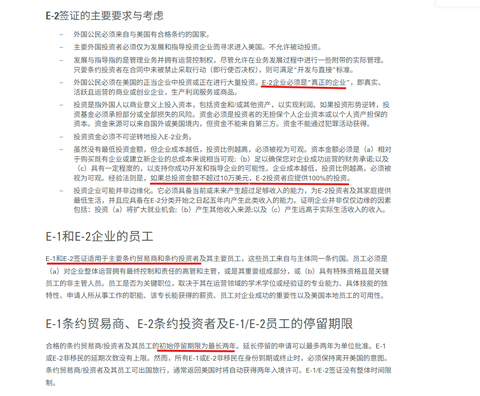
    - <a href="https://www.zhihu.com/people/ya-li-shi-duo-de-20-21">亚里士多得</a> (<small title="回复于 2025-12-26 2:26:24/江苏"> ✉️:momo</small>): 莫名其妙。我说“没听说过英加澳新申请美国绿卡或公民身份有特殊照顾”，你反驳说“有的，是你不知道而已”不该是你举证来支持你的观点吗？我有什么必要去搜集资料来反对自己的观点啊［好奇］
    - <a href="https://www.zhihu.com/people/shou-xin-hua-yu-61">呃呃呃</a> (<small title="回复于 2025-12-26 6:24:58/上海"> ✉️:亚里士多得</small>): 其实真的有［捂脸］澳洲就有E3,加拿大也有
    - <a href="https://www.zhihu.com/people/jiang-xiao-xiang-72-99">继续</a> (<small title="回复于 2025-12-26 7:12:15/江苏"> ✉️:亚里士多得</small>): 说你是来江苏旅游的［捂嘴］［捂嘴］
    - <a href="https://www.zhihu.com/people/sui-sui-96-56">知乎用户ifSmyX</a> (<small title="回复于 2025-12-26 7:39:25/广东"> ✉️:momo</small>): 别说转户口了，我一个湖南人在广东读书也是积分入学［捂脸］
    - <a href="https://www.zhihu.com/people/lin-jin-an-68">八幡愚童记</a> (<small title="四川">2025-12-26 8:4:38</small>): ［捂嘴］在欧洲想要稳稳的拿在手里的人都死无葬身之地了。
    - <a href="https://www.zhihu.com/people/shou-xin-hua-yu-61">呃呃呃</a> (<small title="上海">2025-12-26 9:33:47</small>): 我们为什么要入籍，澳洲去美国的E3每年都申不满，我们在澳洲待着挺好的
    - <a href="https://www.zhihu.com/people/shou-xin-hua-yu-61">呃呃呃</a> (<small title="上海">2025-12-26 9:36:15</small>): 疯掉的人真的太多了［捂脸］［捂脸］［捂脸］［捂脸］［捂脸］
    - <a href="https://www.zhihu.com/people/jiu-shi-zhe-yike">momo</a> (<small title="回复于 2025-12-26 9:38:25/北京"> ✉️:亚里士多得</small>): e1e2你觉得难。对比起来，你们连通过配偶入籍都需要10年，工作入籍需要起步7年。哪个更难不言而喻。  
 
  
 
哦，对了，积分落户也有投资这一项哦。10万刀你嫌多，4000万你是不是嫌少了啊？高新或科技型中小企业持股加分：持股比例不低于10%，在企业连续工作满1个自然年度，且企业近3年累计股权类现金融资≥4000万元，每年加2分，最高加6分。  
 
  
 
还有就算你能搞到户口，那也是集体户口，需要买房哦，算你300万不多吧？
    - <a href="https://www.zhihu.com/people/feng-bu-yu-44">风不语</a> (<small title="辽宁">2025-12-26 10:7:31</small>): 现代社会都是西方开启的，跟你闹呢？没有西方咱这说不定还剃头呢。
    - <a href="https://www.zhihu.com/people/ya-li-shi-duo-de-20-21">亚里士多得</a> (<small title="回复于 2025-12-26 10:46:32/江苏"> ✉️:风不语</small>): 闹什么？难道辛亥革命是西方发起的？按照你的理论，印第安人也得感谢西方带来“文明”不然自己还在捕野牛呢［吃瓜］。
    - <a href="https://www.zhihu.com/people/ya-li-shi-duo-de-20-21">亚里士多得</a> (<small title="江苏">2025-12-26 10:48:48</small>): 英国靠这个特许经营的港口倾销赚取的海量的利益就不提了是吧？爱尔兰也在英国家门口，怎么不也建个“世界级都市”啊？按照你的逻辑东北人是不是还要感谢日本人建铁路啊［好奇］
    - <a href="https://www.zhihu.com/people/ya-li-shi-duo-de-20-21">亚里士多得</a> (<small title="回复于 2025-12-26 11:5:26/江苏"> ✉️:momo</small>): 还在混淆“签证”与“永居/公民”的概念田忌赛马啊［好奇］那就比比：
 
1 北京“签证”：不需要工签/投资签证，随便来
 
美国“签证”：投资签e1e2要投70万，只能呆两年
 
  
 
2 北京 “绿卡”：随便来，身份证 医保等全国联网
 
美国“绿卡”：Eb-5投资绿卡，至少180万美元管2年再申请永久绿卡；特朗普金卡，100万美元4年或者工签H-2B转EB-3满6年再申请绿卡
 
  
 
3 北京户口：积分制/投资换积分
 
美国“入籍”需要持有绿卡5年，或者婚姻绿卡3年
 
  
 
够清晰了吧，还在拿北京户口硬比美国“非入籍”的条件吗？北京买房300万，美国绿卡不要买房吗？那你强制在美国居住的一半时间住在哪，西雅图下水道吗？既然你这么想赢，那就10年>3年好棒哦，想必在非美国逮个美国人结婚很容易吧［为难］
    - <a href="https://www.zhihu.com/people/jcsbnxue-43">jcsb</a> (<small title="回复于 2025-12-26 11:34:40/中国台湾"> ✉️:亚里士多得</small>): 印第安人是真的感谢啊,不然你看印第安有规模在搞民族自决吗?
    - <a href="https://www.zhihu.com/people/xiao-feng-45-82">小风</a> (<small title="回复于 2025-12-26 12:8:58/浙江"> ✉️:亚里士多得</small>): 这个有人感谢过了
    - <a href="https://www.zhihu.com/people/vivi-43-69-15">ViVi</a> (<small title="回复于 2025-12-26 12:17:52/广东"> ✉️:亚里士多得</small>): 近代的格命哪次不是西方思想主导的？布而什为克也是舶来品呢。
    - <a href="https://www.zhihu.com/people/ya-li-shi-duo-de-20-21">亚里士多得</a> (<small title="回复于 2025-12-26 12:18:44/江苏"> ✉️:jcsb</small>): 你是故意提“有规模”这个词吗，有点地狱笑话了
    - <a href="https://www.zhihu.com/people/ya-li-shi-duo-de-20-21">亚里士多得</a> (<small title="回复于 2025-12-26 12:20:23/江苏"> ✉️:ViVi</small>): 西方思想不也是文艺复兴前从古罗马古希腊废墟里捡起来的，没什么原创性的“舶来品”吗［好奇］
    - <a href="https://www.zhihu.com/people/kong-cheng-zhi-you-jiu-meng-zai-94-29">空城只有旧梦在</a> (<small title="回复于 2025-12-26 12:28:40/湖南"> ✉️:亚里士多得</small>): 当然得感谢，只是你在情感上接受不了，中国历史几千年没有西方介入一直都是在原地转！科技，粮食亩产没有任何提升
    - <a href="https://www.zhihu.com/people/ya-li-shi-duo-de-20-21">亚里士多得</a> (<small title="回复于 2025-12-26 12:42:48/江苏"> ✉️:空城只有旧梦在</small>): “粮食亩产没有任何提升”人口是怎么从秦汉几千万到清末四亿的？天天刀耕火种吗？
 
科学规律是欧洲人首先发现的他们就能一直“拥有支配”科技所有权了？你用英文字母汽车计算机是不是还要给西方人交专利费啊？
    - <a href="https://www.zhihu.com/people/vivi-43-69-15">ViVi</a> (<small title="回复于 2025-12-26 13:12:51/广东"> ✉️:亚里士多得</small>): 古罗马古希腊不是西方？还是你认为的西方只有美国？
    - <a href="https://www.zhihu.com/people/ya-li-shi-duo-de-20-21">亚里士多得</a> (<small title="回复于 2025-12-26 13:17:31/江苏"> ✉️:ViVi</small>): 不是啊，我不觉得种族语言文字文化都换了一遍的日耳曼法兰克蛮族和希腊罗马有什么继承传承关系，就好像强盗杀人全家还霸占家产，虽然冲着旧牌位喊得情真意切，外人只会觉得是鸠占鹊巢吃绝户［吃瓜］
    - <a href="https://www.zhihu.com/people/jiu-shi-zhe-yike">momo</a> (<small title="回复于 2025-12-26 13:46:28/北京"> ✉️:亚里士多得</small>): 看来你不了解情况。你们外地人过来工作需要居住证，车过来需要进京证。你居住满7年以后才有资格落户。这和英国人去美国先办绿卡，然后排期移民是一模一样的，只是你更难而已。  
 
  
 
“北京市居住证”持有人在京依法享受劳动就业，参加社会保险，缴存、提取和使用住房公积金的权利。
    - <a href="https://www.zhihu.com/people/ya-li-shi-duo-de-20-21">亚里士多得</a> (<small title="江苏">2025-12-26 21:35:25</small>): 除了地域攻击就没点脑细胞含量高的反驳吗［好奇］
    - <a href="https://www.zhihu.com/people/qian-duo-duo-588">开朗橘子喜滋滋</a> (<small title="回复于 2025-12-26 22:46:8/山西"> ✉️:momo</small>): 英国裔美国人是美国的一等公民。那会儿美国就是英国人开发的啊［捂脸］，比你去台湾香港还容易
    - <a href="https://www.zhihu.com/people/ddg335">momo</a> (<small title="回复于 2025-12-26 23:51:47/广东"> ✉️:亚里士多得</small>): 三民主义还真是孙中山借鉴了美国宪法里的那些概念，孙中山先生是在檀香山创办的兴中会
    - <a href="https://www.zhihu.com/people/ya-li-shi-duo-de-20-21">亚里士多得</a> (<small title="回复于 2025-12-27 1:48:42/江苏"> ✉️:momo</small>): 所以呢，说的和美国是多大原创性一样，美国宪法不也是抄的法国启蒙思想家孟德斯鸠的三权分立吗［好奇］
    - <a href="https://www.zhihu.com/people/damienxiao-bai-ke">拯救一下地球</a> (<small title="回复于 2025-12-27 9:36:28/澳大利亚"> ✉️:亚里士多得</small>): 包有的朋友，连80年代出生的香港人也有的
    - <a href="https://www.zhihu.com/people/jin-qun-41-42">进群</a> (<small title="回复于 2025-12-27 11:31:2/黑龙江"> ✉️:亚里士多得</small>): 所以你就把老美开除西方了？
    - <a href="https://www.zhihu.com/people/vivi-43-69-15">ViVi</a> (<small title="回复于 2025-12-27 11:54:48/广东"> ✉️:亚里士多得</small>): 但凡你多读两本书，多出去走走也讲不出这些幼稚的话。这个不是你觉不觉得能否定的。现在的西方文明就是以古希腊思想为源头，古罗马的制度为雏形，其他文明为多元化因素融合的意识形态。
    - <a href="https://www.zhihu.com/people/ni-ming-69-65">纠结的米其林</a> (<small title="上海">2025-12-27 12:4:59</small>): 我很想了解下，天天线上厌恶西方世界的你，现实生活中生活到底怎么样
    - <a href="https://www.zhihu.com/people/ya-li-shi-duo-de-20-21">亚里士多得</a> (<small title="回复于 2025-12-27 12:25:39/江苏"> ✉️:纠结的米其林</small>): 为什么我只是举例反驳答主的观点，就会被你贴上“天天线上厌恶西方世界”的标签呢？建议把有色眼镜摘了再说吧［吃瓜］
    - <a href="https://www.zhihu.com/people/ni-ming-69-65">纠结的米其林</a> (<small title="回复于 2025-12-27 12:34:25/上海"> ✉️:亚里士多得</small>): 因为可以家访，当然了，我对你的印象自然是主观的。所以回到我的疑问，你现实生活过得咋样，好奇而已
    - <a href="https://www.zhihu.com/people/ya-li-shi-duo-de-20-21">亚里士多得</a> (<small title="江苏">2025-12-27 12:45:16</small>): 那么我因为你对我先入为主的这种有色眼镜标签产生了负面印象，所以拒绝这种莫名其妙的隐私窥探，希望你能接受［思考］
    - <a href="https://www.zhihu.com/people/bill-13-99-38">汉歌悠扬</a> (<small title="江苏">2025-12-29 0:43:33</small>): 你们都有罪，敢让优质资产明辨是非，罪过。
    - <a href="https://www.zhihu.com/people/kong-cheng-zhi-you-jiu-meng-zai-94-29">空城只有旧梦在</a> (<small title="回复于 2025-12-31 13:21:59/湖南"> ✉️:亚里士多得</small>): 人口从几千万到4个亿是因为西方人从美洲带回来了土豆，玉米，番薯等高产作物，怎么不是刀耕火种？自己去查一下汉朝的亩和清朝的亩产几乎一样~
    - <a href="https://www.zhihu.com/people/feng-bu-yu-44">风不语</a> (<small title="回复于 2026-1-14 23:23:59/辽宁"> ✉️:亚里士多得</small>): 对满清来说，不就是境外势力吗
    - <a href="https://www.zhihu.com/people/wang-hai-xiang-87">魔王</a> (<small title="江苏">2026-4-15 13:14:25</small>): 澳大利亚 新西兰 加拿大 北美，现在不都是昂撒人的地盘吗？不稳？
25. <a href="https://www.zhihu.com/people/ming-yu-48-19">鸣玉</a> (<small title="广西">2025-12-26 17:4:58</small>): 欧洲有个卷秦制成功了的——苏
    - <a href="https://www.zhihu.com/people/43-23-44-9-81">子尘</a> (<small title="四川">2025-12-27 6:11:47</small>): 成功了吗
    - <a href="https://www.zhihu.com/people/mao-wu-shi-72">猫武士</a> (<small title="回复于 2025-12-27 11:33:44/广东"> ✉️:子尘</small>): 不在乎天长地久，只在乎曾经拥有［尴尬］
    - <a href="https://www.zhihu.com/people/bordeauxlin">Kyen</a> (<small title="新疆">2025-12-27 20:38:54</small>): 现在也有博主分析梅和苏都是西方上层建立的实验郭，梅主仿明制（全世界番薯郭，），苏主仿秦制
    - <a href="https://www.zhihu.com/people/fan-yang-sheng-64">范阳生</a> (<small title="回复于 2025-12-28 15:53:53/山东"> ✉️:Kyen</small>): 这个仿字搞笑了，谁稀罕仿中国？
26. <a href="https://www.zhihu.com/people/jhmsmk">老蒋在合肥</a> (<small title="广东">2025-12-26 13:12:50</small>): 强化汲取+重农抑商＝治乱循环
27. <a href="https://www.zhihu.com/people/li-xin-67-3">李昕</a> (<small title="浙江">2025-12-26 12:37:42</small>): 说白了就是管的太死了，但凡管的死的地方，都不可能开疆拓土的，因为开疆拓土会被认定为润了
28. <a href="https://www.zhihu.com/people/trimersparks">OfficerK</a> (<small title="河北">2025-12-26 0:36:3</small>): 中原在农业时代算是全世界都比较好的肥地，也正因如此，大家都陷入了路径依赖死循环，如今的中国依然是绝大部分人口居住在第三阶梯上
 
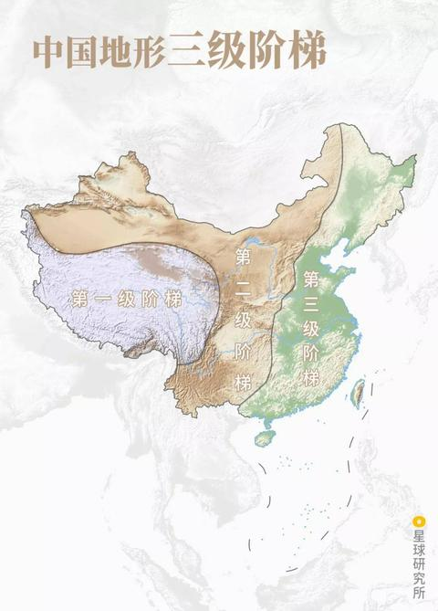
29. <a href="https://www.zhihu.com/people/guo-guo-31-23-45">翰墨观文</a> (<small title="陕西">2025-12-27 7:49:44</small>): 早熟到制度性内卷。有水平。
30. <a href="https://www.zhihu.com/people/jimmy-23-2">Jimmy</a> (<small title="浙江">2025-12-29 1:19:49</small>): 确实就是落后，重农抑商就一定搞不了这种事，只有商业才不挑地方，什么地方有机会都会去，农民就呆田里，哪可能久住他乡。所以汉唐啥的说得好听疆域大，其实就那点地，不能耕种的根本管不久。
31. <a href="https://www.zhihu.com/people/xu-you-jin-32">阿拉灯神丁</a> (<small title="广东">2025-12-28 12:49:35</small>): 这倒是实话，只要不是上升到对整个文明层面的全盘否认，我就认可
    - <a href="https://www.zhihu.com/people/17-11-84-82">香醋滤镜</a> (<small title="福建">2025-12-28 16:28:14</small>): 但是这个答主真的有一点文明悲观主义
    - <a href="https://www.zhihu.com/people/xiao-cang-ya-22">小苍呀</a> (<small title="回复于 2025-12-29 15:32:48/北京"> ✉️:香醋滤镜</small>): 因为中国古代长时间的实践没有取得一个好的结果，在于西方的竞争中很明显是落后的  
 
因此产生的对于自己国家制度的反思很正常
    - <a href="https://www.zhihu.com/people/yi-wan-tang-fen-54">一碗汤粉</a> (<small title="回复于 2026-1-2 7:8:38/江西"> ✉️:香醋滤镜</small>): 因为古中国发展确实不咋地，要不然几千年怎么越发展越……，实事求是就这样，要不然学小粉红罔顾事实赢赢赢？
32. <a href="https://www.zhihu.com/people/lu-en-jun-nan">我寻思也没啥</a> (<small title="安徽">2025-12-27 9:27:59</small>): 其实就是无恒产者无恒心
33. <a href="https://www.zhihu.com/people/sdfzsaaz">Akary</a> (<small title="广东">2025-12-26 11:11:13</small>): 秦朝的名义领土、隋朝疆域、唐中后期领土、明中后期领土基本是重合的，可见西域、东北和蒙古（甚至很长时间的西南）确实是有点鞭长莫及了，且两千年来一直如故。
    - <a href="https://www.zhihu.com/people/19-19-20-6">诺大尊</a> (<small title="浙江">2025-12-26 13:17:11</small>): 这些才是汉地，或者说周地
    - <a href="https://www.zhihu.com/people/zhang-hu-hu-85">张乎乎</a> (<small title="山西">2026-7-11 9:15:26</small>): 如果是周制，就扩张出去了
34. <a href="https://www.zhihu.com/people/jian-jia-wu-yi-44">蒹葭无衣</a> (<small title="广东">2025-12-27 0:18:6</small>): 通透［赞］  
 
  
 
佩服
35. <a href="https://www.zhihu.com/people/ya2imn">知乎用户yA2IMn</a> (<small title="江苏">2025-12-28 22:14:46</small>): 感谢上帝，没让这个瘟疫染指东南亚澳洲啥地方的
    - <a href="https://www.zhihu.com/people/lchg-18">莫里亚蒂教授</a> (<small title="回复于 2025-12-30 18:10:48/江苏"> ✉️:寻静音隔音居所</small>): 如果这样的话，秦就很难扫六合了，大不了举国搬到海岛上去，强如极盛期的蒙古也拿日本无可奈何。
    - <a href="https://www.zhihu.com/people/liu-xiao-yuan-96-68-23">寻静音隔音居所</a> (<small title="河南">2025-12-29 0:35:9</small>): 要是秦发展慢些，等到楚吃了东南亚，吴吃了日本，越吃了澳洲，燕吃了朝韩，秦再“扫六合”，那这些地方也变成这样了［捂脸］
36. <a href="https://www.zhihu.com/people/Alex2Wang">alex2wang</a> (<small title="重庆">2025-12-28 16:52:22</small>): 我也觉得新月教是优于儒教的，虽然他们的经书读着很零散口水话，但是人家的宗教神学传片了欧亚大陆甚至是东南亚海上贸易的一个工具，类似后面欧洲人主导海外贸易后，各种华商搞外贸的也信洋教
37. <a href="https://www.zhihu.com/people/joker-16-87-8">南洋提督</a> (<small title="江苏">2025-12-25 21:36:8</small>): 到了现代社会和分合无关了，而是和能否认可并保障私有制，有没有实现宪政有关系
    - <a href="https://www.zhihu.com/people/fang-ling-xin-65">微shan</a> (<small title="浙江">2025-12-26 17:24:38</small>): 现代社会一样需要地方自治
38. <a href="https://www.zhihu.com/people/happypen-78">happypen</a> (<small title="河北">2025-12-27 19:37:13</small>): 可拉倒吧［飙泪笑］哪次统治西域，不比那群海盗国家统治的小岛时间长？  
 
你荷兰的欧洲外领土还有几个？你西班牙还有几个？哪怕你日不落，还有几个？
    - <a href="https://www.zhihu.com/people/limhim">Quicktoe</a> (<small title="广东">2025-12-27 21:39:9</small>): 按文明扩张来说，英语和西语文明都非常成功
    - <a href="https://www.zhihu.com/people/fan-yang-sheng-64">范阳生</a> (<small title="山东">2025-12-28 15:56:38</small>): 然后你得出了结论，英国殖民没有中国成功，那中国就是地球殖民最强国［赞］牛
    - <a href="https://www.zhihu.com/people/die-mannschaft-34">阿雷夫斯</a> (<small title="回复于 2026-1-1 21:55:48/安徽"> ✉️:Quicktoe</small>): 那是因为他们运气好，碰到的都是些美洲、澳洲这些文明水平低的土著，英国能把印度同化吗？能把埃及同化吗？
    - <a href="https://www.zhihu.com/people/ren-jian-bu-chai-16-74">洪钧</a> (<small title="回复于 2026-1-5 7:23:4/广东"> ✉️:阿雷夫斯</small>): 英国已经同化全世界，你的衣服发型住房出行语言文字都受到英国的深度影响。你和清人无论是文化还是生活方式都已经天差地别，你是西化而不自知。
    - <a href="https://www.zhihu.com/people/die-mannschaft-34">阿雷夫斯</a> (<small title="回复于 2026-1-5 10:52:3/安徽"> ✉️:洪钧</small>): 英化等于西化？人家法国德国意大利同意了吗？就说出行，汽车是你英国人发明的？
 
还有你对同化的定义是什么？同化至少人家要说你的语言，过你的节日吧，中国人把英语当母语吗？春节和圣诞节哪个在中国更重要？你最多只能说英语文化现在强势对中国文化有影响，同化中国？开玩笑呢。
    - <a href="https://www.zhihu.com/people/fan-yang-sheng-64">范阳生</a> (<small title="回复于 2026-1-7 7:51:58/山东"> ✉️:阿雷夫斯</small>): 影响太大了，太牛了
    - <a href="https://www.zhihu.com/people/wang-hai-xiang-87">魔王</a> (<small title="回复于 2026-4-15 13:17:36/江苏"> ✉️:阿雷夫斯</small>): 运气好？大航海是运气好？
39. <a href="https://www.zhihu.com/people/yang-yang-35-9-96">阳阳</a> (<small title="内蒙古">2025-12-27 19:34:2</small>): 之前知乎讨论兰州女选调生辞职河西走廊城市的 知友有个评论说 很多人心中国土大致只有明朝汉地十八省
40. <a href="https://www.zhihu.com/people/xu-yi-ding-33">余鼐</a> (<small title="上海">2025-12-26 10:34:41</small>): 抛开贸易不谈是这样的。  
 
为什么后面不开发西域了，因为欧洲人直接从海上来贸易了，没了贸易的西域就几块绿洲，当然不再开发了。
41. <a href="https://www.zhihu.com/people/32-28-36-53-71">帘斋主人</a> (<small title="贵州">2026-4-4 5:23:30</small>): 英国连爱尔兰都没同化下来，别张嘴就是秦制，实际上欧洲的制度和社会体系，是根据其地理和气候的演变而来的，欧洲平原多，但是海港湖泊更多，欧洲地形被分割得碎片化，导致欧洲只能采取分封制的社会制度一千多年，如果欧洲的地形像中国一样，欧洲也会集权，也会采取中央集权的模式。本质上是地理决定论和资源决定论，而不是什么制度决定论。动不动就是制度原罪论，而不是从地理和气候的角度进行分析，这是一种典型的惰于思考的形而上学，也是河殇派的余波的回声。从人类有文明开始，一直到15世纪，东方一直领先西方，中国一直都是世界大国
    - <a href="https://www.zhihu.com/people/transsiberia">西伯利亚大铁路</a> (<small title="湖北">2026-7-7 10:5:18</small>): 爱尔兰人现在都不讲爱尔兰语了，基本就是英国一个方言区
    - <a href="https://www.zhihu.com/people/transsiberia">西伯利亚大铁路</a> (<small title="湖北">2026-7-7 10:8:47</small>): 欧洲平原多？欧洲地形跟中国内地差不多，北方多平原，南方多山地丘陵，中间阿尔卑斯就是秦岭
42. <a href="https://www.zhihu.com/people/yi-hua-quan-shi-jie">强汉兴华</a> (<small title="安徽">2026-2-22 19:11:13</small>): 还怪秦制呢，华夏几千年来面对的是最野蛮、最暴力的游牧集团，在17世纪步兵革命最黑暗的前夜被通古斯野人集团趁虚而入，汉族被套上了两百多年的鞑靼枷锁。如果明之后是大顺，在17-20世纪世界各个主要定居民族大扩张的时代，北亚、东亚、、中亚和东南亚都会被带着燧发枪的汉人收入囊中，美洲鹿死谁手还不好说。
    - <a href="https://www.zhihu.com/people/bi-dong-84-41">壁咚</a> (<small title="北京">2026-7-5 23:26:5</small>): 明朝之后只要还是封建朝代，都是一个下场，明朝同期的欧洲国家已经文艺复兴思想启蒙，开始成体系的建立科学体系了［飙泪笑］
43. <a href="https://www.zhihu.com/people/lchg-18">莫里亚蒂教授</a> (<small title="江苏">2025-12-26 9:13:27</small>): 还有一个最大的幸运，就是远离东大，避免被其靠着巨大体量规模扼杀在摇篮里，可以攀科技树缓慢正常发育。
    - <a href="https://www.zhihu.com/people/hei-shi-zhuan-lun-wang">黑石转轮王</a> (<small title="江西">2025-12-26 19:52:35</small>): 这种问题带有浓郁的乡下口音，我想不出来谁提出来的！
    - <a href="https://www.zhihu.com/people/d4qz12">d4qz12</a> (<small title="浙江">2025-12-27 21:13:46</small>): 天佑西欧
44. <a href="https://www.zhihu.com/people/li-peng-you-de-xiao-hao">星漢灿烂</a> (<small title="陕西">2025-12-26 19:47:23</small>): 我看完也是忽然想到一种另一个位面可能的情况，是我没想过的角度，大概就是，  
 
我们自上古时代一直到周，这么长时间内奠定的，当时确实亲如兄弟的 这么一个大的文化圈，会在战国时代持续N年后未统一的情况，会逐渐走向疏远，不过这也是正常的情况，文字自然也不会完全统一，各国是会有所区别。到以后渐行渐远的时候，可能就会变得像欧洲那样了。（但也比今天东亚这个状态亲昵，毕竟日韩是个什么鬼，而在那个世界观中，大家都记得上古时代是一家人）这个文化圈的最大领土范围极大概率会远超现在的面积，毕竟还是按照分封制来的。最好的情况可能是北起北冰洋，南到南洋群岛，这么一个庞大区域；域外的文化圈也会自然而然的把这么一个庞大的地方当做一个文化圈，里面有许多 各不相同，但外人看起来十分相似的国家。尽管不会想象成同一个国家（就像我们这个位面 也不会去想象整个欧洲国……）他们会把汉字当成拉丁字母一样的存在，“他们都是用同一种文字系统的人呀”  
 
届时 可能占据近代俄罗斯生态位的大赵帝国或者大什么帝国在最强盛的时候，或许会被中原/南方各国联合西北方向的欧洲人夹击一次以后就会痛骂“\*\*楚/吴/越\*\*\*，狗周奸，联合色目鬼挤压/侵犯诸夏的生存空间，不得好死\*\*\*\*”或者反过来，自行脑补N国的N种情形［捂脸］想想还真是有意思啊［捂脸］相当于我们的文化圈和我们汉人本身的生存空间（姑且这么称呼）相比于这个位面都有了极大的拓展，这是很好的事情。可惜就是极大概率里面最强的那个国家 也不会有真历史上的各个中国朝代那么强了（包括今天的共和国）不过也是自然而然的事情，毕竟今天的我们是相当于“他们的联合”……并且他们也会有更多的内战和内耗……唉，尽管这样，这么想，真历史上的情况，现在也还是挺亏的，毕竟生存空间相比于白人来说，真的不大
    - <a href="https://www.zhihu.com/people/yu-chui-xue-70">羽吹雪</a> (<small title="上海">2025-12-27 21:58:46</small>): 我曾经设想过天龙八部体制，也就是保持宋，辽，吐蕃，西夏，大理五国，建成类似五眼联盟的圈子，把周围的安南，朝鲜，日本，中亚，东南亚，印度都一点点推了，我们汉人不用扩张，就守着汉地，四个兄弟往外打［捂脸］
    - <a href="https://www.zhihu.com/people/li-peng-you-de-xiao-hao">星漢灿烂</a> (<small title="陕西">2025-12-26 19:52:23</small>): 检查的时候发现有不妥的地方，懒得改了，怕重发就发不出来了。我应该删掉特指地域的字，你们可以自行替换成秦晋韩赵魏燕齐巴蜀……
45. <a href="https://www.zhihu.com/people/nong-qing-qiao-ke-li-11">浓情巧克力</a> (<small title="北京">2025-12-31 0:43:37</small>): 这答主能把这篇帖子保住靠了六个字，始于秦，终于清。
46. <a href="https://www.zhihu.com/people/yang-yang-35-9-96">阳阳</a> (<small title="内蒙古">2025-12-27 19:31:46</small>): 我这里呼伦贝尔 人口现在慢慢撤离这个地方［捂脸］，人口要么高度集中在海拉尔牙克石 要么岭东农业区扎兰屯 或者直接大城市润了 大面积荒无人烟了 这是2025年 收缩的厉害
47. <a href="https://www.zhihu.com/people/napnap-10">家是本北美总经销</a> (<small title="广东">2026-1-18 3:22:37</small>): 其实反直觉的是陆上这种岛古代比海洋难治理多了。走陆路成本高于走海路
48. <a href="https://www.zhihu.com/people/feng-xie-hong-xie">知重夕</a> (<small title="陕西">2026-1-4 2:53:3</small>): 一上来拿张现代图片，你知道你在做什么吗［飙泪笑］
49. <a href="https://www.zhihu.com/people/wang-yan-92-84-80">一身藏</a> (<small title="浙江">2025-12-26 21:32:47</small>): 好文章 长见识了
50. <a href="https://www.zhihu.com/people/cuo-huo-luo-ruo-mo">错或落若莫</a> (<small title="河南">2026-5-28 13:25:32</small>): 最烦吹捧“大一统”，我对所有整齐划一，规整方正的东西天然反感。
    - <a href="https://www.zhihu.com/people/2-74-43-21-88">举报没完了是吧</a> (<small title="陕西">2026-7-2 9:46:5</small>): 经典量产非基辈
51. <a href="https://www.zhihu.com/people/1899123">知乎拥户</a> (<small title="广东">2025-12-26 10:51:28</small>): 统治者大都是中原人，农耕时期，最主要的是要平整的农田，人口很快就能繁衍，草原沙漠这种地方，他也玩不转。
    - <a href="https://www.zhihu.com/people/yang-yogi">木易</a> (<small title="北京">2025-12-30 18:27:46</small>): 确实，农耕思想就算扩张也是优先选择大平原，那些费劲打下来又不能种地的地方估计看都懒得看。
52. <a href="https://www.zhihu.com/people/bei-ji-feng-15-82">南极雨</a> (<small title="湖北">2025-12-27 18:39:59</small>): 很好的视角［吃瓜］
53. <a href="https://www.zhihu.com/people/hao-ba-24-26">保守鸽派</a> (<small title="广东">2025-12-26 12:34:14</small>): 现在所有民族都是在史前某个时候分叉的，分久了就没有意义了，欧洲能统合成一个文明还是要靠基督教。
54. <a href="https://www.zhihu.com/people/10-75-33-2">小丁</a> (<small title="江苏">2025-12-28 1:24:3</small>): 抖音老说什么千年世家，他们真的不看历史，能存在百年的家族在中国已近很稀奇了古代
55. <a href="https://www.zhihu.com/people/qing-cheng-bai-qiu-xie">云彩琅琅</a> (<small title="四川">2025-12-29 5:39:36</small>): 六朝何事，只为门户私计
56. <a href="https://www.zhihu.com/people/lecou">lecou</a> (<small title="山东">2025-12-31 8:12:41</small>): 看评论区有一种回到二十年前的愤青的感觉“我大中华哪哪都比不上人家”。历史没有如果，成败也不能论英雄，如果国土面积算成功，最成功的是俄罗斯，如果人口数量算成功，最成功的是印度，如果经济实力算成功，最成功的是美国，如果算所谓的文明影响力，伊斯兰文明算最成功的，但我不知道用哪个国家来代表它。但就从这个时间点来说，从哪个维度来说，西方文明也不能算是成功的，就像沙县小吃和兰州拉面知名度可能高于蜜雪冰城，但又能怎么样呢？但大家别忘了，周制不一定能让我们成为“西方文明”，也有可能成为“伊斯兰教文明”“印度文明”“非洲文明”。没有一个强者不想统一，文明的本质就是生存，生存的本质就是征服，征服的本质就是改土归流，而不是把一堆散装国家从造一个名词叫西方文明，谁能代表西方文明这句问话足以让他们之间打一次世界大战了。时代一直在变化，现在新的时代已经到来了，此时此刻多少人说英语，多少人说汉语并不重要，甚至国家是不是强盛都不重要，最重要的是人民富足，大家积极客观向上，未来可期，不吸毒不滥交不放弃
57. <a href="https://www.zhihu.com/people/Alex2Wang">alex2wang</a> (<small title="重庆">2025-12-28 16:54:37</small>): 现在中国还是缺少工会做工资博弈阶段，目前还没摆脱靠低工资的低价模式做竞争的阶段，所以内需消费不足［捂脸］
58. <a href="https://www.zhihu.com/people/yong-hu-5743017808">角上之争</a> (<small title="河北">2025-12-28 19:55:55</small>): 用不着动不动就拿什么秦制说事，搞得好像那些不搞秦制的国家就能长盛不衰永世不灭一样。大英帝国不搞秦制，它的霸权也就维持了一百来年，到如今当年的日不落帝国已经退化到连一段四百公里长的高铁都修不出来的地步了。神圣罗马帝国也不搞秦制，可是三十年战争时也一样杀的尸山血海千里无人烟，论起战争的残酷程度丝毫不亚于同时期的明清易代。说到底，自古无不灭之朝也无不亡之国，不管你是秦制英制法制还是美制，终究都躲不过历史周期律。
    - **探耽求究** (<small title="日本">2025-12-29 11:34:8</small>): 这个问题我回答过了，你可以翻到正文后面答评论区。 没有哪个地区的分合会像秦制换代一样惨烈，这个我可以打包票的！
    - <a href="https://www.zhihu.com/people/yong-hu-5743017808">角上之争</a> (<small title="回复于 2025-12-29 18:57:1/河北"> ✉️:探耽求究</small>): 所以你怎么解释三十年战争？这场战争使德意志人口锐减，部分地区损失达60%以上，波美拉尼亚死亡65%，西里西亚25%，男性死亡率近半，经济也遭到严重破坏，它的惨烈程度可是丝毫不逊于同时期的明清易代战争。
    - <a href="https://www.zhihu.com/people/meng-noonlei">渔民</a> (<small title="日本">2025-12-31 7:7:57</small>): 我看的想笑了，一会儿说别人三十年战争是村战，一会儿又说别人死伤惨重。你干脆直接问ai西方历史上发生过的人相食的次数，是比我们多还是少。
    - <a href="https://www.zhihu.com/people/hello-kitty-27-96">hello Kitty</a> (<small title="回复于 2026-4-18 19:45:6/山东"> ✉️:探耽求究</small>): 秦末再乱尚有乡土宗族维系，那就等着看看美国吧，你能看到，美国一旦崩塌彻底无依，必是寸草不生的地狱级混乱，惨烈程度远超任何王朝末期。
59. <a href="https://www.zhihu.com/people/wu-bu-wei-27-52">吴补为</a> (<small title="山西">2025-12-30 6:39:42</small>): 怪不得孔子说，吾从周。
60. <a href="https://www.zhihu.com/people/17-11-84-82">香醋滤镜</a> (<small title="福建">2025-12-26 0:56:33</small>): 本人有三个不同意的点。1.“秦制”并不是一个稳定不变的制度实体，把两千年差异极大的国家形态，压缩成一个“古典军国主义模型”，是叙事爽，但解释力虚。2.答主列举先秦时代，但是秦汉之后并非“万马齐喑”，汉代、唐代、宋代的思想创造力并不低于先秦。3.明清没有殖民美洲，是因为没有预期收益，所以不存在殖民冲动。
    - <a href="https://www.zhihu.com/people/jmzgn3">知乎用户jMZGn3</a> (<small title="北京">2025-12-26 6:33:51</small>): 没得那本事，就拿预期来说话［飙泪笑］
    - <a href="https://www.zhihu.com/people/yao-ting-liang">Asdf</a> (<small title="北京">2025-12-26 8:47:3</small>): 你别唐宋了，你说咱们现在 2025 年创造力强不强吧，结果比亚迪的出海项目到了巴西还得让人家说你虐待自己人，你就说秦制牛不牛吧，成特么思想钢印了
    - <a href="https://www.zhihu.com/people/llun-lun-lun">鹿鹿l</a> (<small title="广东">2025-12-27 9:18:48</small>): 朱棣要郑和七下西洋是干嘛，因为实在赚钱啊［飙泪笑］［飙泪笑］［飙泪笑］什么没预期
    - <a href="https://www.zhihu.com/people/llun-lun-lun">鹿鹿l</a> (<small title="广东">2025-12-27 9:21:23</small>): 大部分研究中国历史的都有个共识，先秦是巅峰，因为他打下了基础，后代都是补充发展
    - <a href="https://www.zhihu.com/people/llun-lun-lun">鹿鹿l</a> (<small title="回复于 2025-12-27 9:22:7/广东"> ✉️:Asdf</small>): 制度文化惯性可以有上千年［飙泪笑］
    - <a href="https://www.zhihu.com/people/17-11-84-82">香醋滤镜</a> (<small title="回复于 2025-12-28 15:6:52/荷兰"> ✉️:Asdf</small>): 这个倒是有道理［思考］
    - <a href="https://www.zhihu.com/people/17-11-84-82">香醋滤镜</a> (<small title="回复于 2025-12-28 15:7:10/荷兰"> ✉️:鹿鹿l</small>): 倒也是
    - <a href="https://www.zhihu.com/people/17-11-84-82">香醋滤镜</a> (<small title="回复于 2025-12-28 15:14:53/荷兰"> ✉️:鹿鹿l</small>): 我认为确实是巅峰，但是先秦是“不可复制的高峰”。扩展来讲，大部分时候赞美先秦时代更多的是在说百家争鸣，百家争鸣是“制度未定型期”的产物，是一次性红利，不是常态。这个“巅峰”不可回到，也不该回到。你还提到了奠基，但是“奠基 ≠ 后世没有创造力”，把“创造力”理解为能不能再来一次百家争鸣这样“再打一次地基”的观念不敢苟同，如果我们把创造力理解为：制度创新、技术扩散、知识体系深化，那我们很难否认：汉代完成了帝国制度的定型、唐代完成了文化—宗教的整合、宋代完成了经济到技术到社会结构的飞跃。
    - <a href="https://www.zhihu.com/people/llun-lun-lun">鹿鹿l</a> (<small title="回复于 2025-12-28 15:34:38/广东"> ✉️:香醋滤镜</small>): 说起来太长，去看看历史学家比如冯时之类的怎么说，后面中国几乎没有诞生过新东西
61. <a href="https://www.zhihu.com/people/bing-huo-86">冰火</a> (<small title="福建">2026-5-21 10:23:22</small>): 翻来覆去的几句车轱辘话，有点没意思了，每种体制都有些复杂的地缘和科技发展关系，并不是你想选择哪一种就选择哪一种，而是历史选择这种体制
    - **探耽求究** (<small title="美国">2026-7-1 12:35:51</small>): 庸俗的地理决定论，欢迎去我专栏搜 国家为什么会失败的相关回答。一切历史都曾经是当代史，既然地理决定了一切，那也就决定了现在，那还挣扎什么呢？地理往往只决定了一个国家民族的下限，上限得看人的选择，有时候也得看点运气。
    - <a href="https://www.zhihu.com/people/92-8-81-92">Wolkenwandler</a> (<small title="回复于 2026-7-4 21:1:10/北京"> ✉️:探耽求究</small>): 所以不用挣扎了，出生在一片土地这个人的价格已经注定了。西方那些也只是少数精英俱乐部，没见同样文明英联邦的印度普通人就很值钱了。
    - <a href="https://www.zhihu.com/people/92-8-81-92">Wolkenwandler</a> (<small title="回复于 2026-7-4 21:39:51/北京"> ✉️:探耽求究</small>): 印度联邦制是完美的周制哦［捂脸］
    - <a href="https://www.zhihu.com/people/xia-ya-12-68">Casval</a> (<small title="回复于 2026-7-10 22:39:11/上海"> ✉️:探耽求究</small>): 人就是被地理条件所影响的，地理决定论毫无问题。除非你是个唯心主义的教徒，相信上帝存在［捂嘴］
62. <a href="https://www.zhihu.com/people/ymq22p">不知也</a> (<small title="浙江">2025-12-25 22:0:7</small>): 有成熟海运不走非要走陆运的多少沾点［doge］
63. <a href="https://www.zhihu.com/people/liu-rong-rong-49-33">卡西莫多</a> (<small title="江苏">2025-12-27 9:37:20</small>): 一天到晚在这秦制秦制，亚欧大陆上面那么多不同制度的国家，有一个实际控制面积超过中国的吗？
64. <a href="https://www.zhihu.com/people/zpconsciousness">赛Ting船长</a> (<small title="重庆">2026-1-20 22:38:9</small>): 我要是没看过各人种朊病毒抗性基因携带率的相关内容，可能就信你了
65. <a href="https://www.zhihu.com/people/tonylx">Tonylx</a> (<small title="新加坡">2025-12-26 8:53:7</small>): 从DNA研究看 汉人其实有一定的拓荒能力 中原地区饥荒 很多人跑到漠北或西域讨生活 然后伪装成“少数名族”
66. <a href="https://www.zhihu.com/people/yu-chui-xue-70">羽吹雪</a> (<small title="上海">2025-12-27 21:26:13</small>): 意大利统一，德国统一，法国加强中央集权的道路都给你吃了［捂脸］，如果分就是好，欧洲也不会打生打死几百年。。。
    - <a href="https://www.zhihu.com/people/banko7">banko7</a> (<small title="江苏">2025-12-27 21:52:22</small>): 啊［doge］俩二战输家，一个一战赢家［doge］这个赢家还不如输了呢［doge］
    - **探耽求究** (<small title="日本">2025-12-27 21:58:7</small>): 不要急着反驳，你看长一点点就会发现，我反对的是秦制的大一统。谁说周制就不是统呢？只要百姓能在周制诸国中自由迁徙，这不是一种统么？你在想想现在这些国家更接近哪种统呢？
    - **探耽求究** (<small title="日本">2025-12-27 22:3:20</small>): 再想想这些国家在统的过程，其实就是为了打仗而卷“秦制”，结果如何呢？一个搞出欧洲全面战争，一个搞出两次大战。有什么好下场么？最终欧洲还是回到“周制”的逻辑当中。
    - <a href="https://www.zhihu.com/people/dr-mao-86">天父下凡人间体</a> (<small title="回复于 2025-12-29 23:5:48/上海"> ✉️:探耽求究</small>): 笑死那不是民国
    - <a href="https://www.zhihu.com/people/creatanddestroy">creatanddestroy</a> (<small title="江苏">2026-4-20 17:26:34</small>): 德二那个整合程度甚至还不如内战前的美国
67. <a href="https://www.zhihu.com/people/luis-da-fonseca">Luis da Fonseca</a> (<small title="日本">2025-12-26 18:34:7</small>): 殖民东南亚可是很成功的，你这个有点结果反推过程了。因为成功了的地区被你视为自古以来，而直接忽视整个长江以南都是最近2000年渐进式殖民的结果。你看今天殖民地的不少一点汉血不沾的广府土著还是最狂热的皇汉，我就问你成功不成功吧。
    - **探耽求究** (<small title="日本">2025-12-26 18:58:59</small>): 广府从秦汉开始被纳入统治，但一直到唐宋都属于边疆地，拿来流放的。真正完成汉化因该是南宋元明才成为普遍意义上的汉地，前后花了近千年，这个速度已经慢的离谱了。这还是在周边没有强力文明竞争的情况下。换个角度，中国能慢慢汉化南方，更多是南方没什么强力的对手而已。
68. <a href="https://www.zhihu.com/people/17-11-84-82">香醋滤镜</a> (<small title="福建">2025-12-28 16:21:6</small>): 再次对答主大大的观点提出两个疑问，第一，您的“秦制 = 零和博弈 = 必然屠杀”观点，这是历史决定论。您说如果是秦制政权，不服管就杀光。这是典型的反事实恐吓论证。问题在于：清朝对回疆、西藏、蒙古，大量使用的是宗教妥协、贵族合作、低汲取治理。明清并不是一遇到反抗就“留地不留人”。您选择性放大了最极端的例子（准噶尔），却无视大量“低烈度治理”的历史事实。第二，您把宋朝定义为“文治化的秦朝”，这是概念滥用。您说宋朝是汲取民力有过之而不及。但问题是：宋代人均税负并不高，宋代国家对社会的渗透方式，主要是货币与市场，不是强制动员，宋的问题是军事安全，不是社会窒息。
69. <a href="https://www.zhihu.com/people/suo-ge-lai-ni">卖惨症康复中心</a> (<small title="辽宁">2026-1-7 14:54:36</small>): 自从染上了大秦页，一旦停药，头也疼，腿也疼，浑身上下不听使唤，夜夜焦虑睡不得安稳觉，胳膊腿心肝肾都想着那一口。大力给上了，好了不闹腾了，开始喝稀粥生孩子吹牛逼，攒下的钱就留着买大秦页。
70. <a href="https://www.zhihu.com/people/chu-yuan-36">楚元</a> (<small title="上海">2025-12-31 8:40:42</small>): 蒙古帝国用“超级周制”（大分封）横扫欧亚，结果成吉思汗死后迅速分裂内战，证明单纯分封制长期稳定性极差。  
 
把“周制”当理想模板是误读历史——欧洲的“稳定”源于地理破碎难以统一，而非制度优越；中国“秦制”恰是维系超大型文明在技术局限下不散架的现实方案。
    - <a href="https://www.zhihu.com/people/wan-zhi-shang">魔法哲学家</a> (<small title="四川">2026-1-2 19:19:6</small>): 中国历史上分裂的时间比大一统的时间要多得多
71. <a href="https://www.zhihu.com/people/54-84-43-25-39">天使</a> (<small title="陕西">2025-12-25 2:29:16</small>): 其实宗教就是周制。
72. <a href="https://www.zhihu.com/people/ben-dan-xben-dan-xx">momo</a> (<small title="湖北">2025-12-28 11:44:42</small>): 观点新颖，不过有个别举例不完全符合事实
73. <a href="https://www.zhihu.com/people/try002-47">try002</a> (<small title="重庆">2025-12-30 11:27:19</small>): 难绷，因为除了汉地，其它地方就是一吞金兽［飙泪笑］
74. <a href="https://www.zhihu.com/people/yang-yogi">木易</a> (<small title="北京">2025-12-30 11:21:21</small>): 写太多了导致观点有些漂移，给前些部分点个赞，加油。
75. <a href="https://www.zhihu.com/people/ymq22p">不知也</a> (<small title="浙江">2025-12-26 22:20:7</small>): 周制就是战国，杀人盈城，喜欢的尽管去吧［doge］
    - <a href="https://www.zhihu.com/people/zhang-huai-min-6">张怀民</a> (<small title="江苏">2025-12-27 0:5:9</small>): 战国和春秋是完全不一样的，战国的战争烈度是基于总体战的，春秋才属于周制。
    - <a href="https://www.zhihu.com/people/ymq22p">不知也</a> (<small title="回复于 2025-12-27 1:40:13/浙江"> ✉️:张怀民</small>): 难道战国就是秦制了？喜欢就喜欢他的全部
    - <a href="https://www.zhihu.com/people/llun-lun-lun">鹿鹿l</a> (<small title="广东">2025-12-27 9:24:27</small>): 认真的？？？？？秦制之后的战争烈度全球最高好吗，三国，晋唐，太平天国死多少人没点数吗。即使战国礼乐崩坏了烈度也不及后面
    - <a href="https://www.zhihu.com/people/zui-ke-ai-de-qia-sha-ya">作家天涯</a> (<small title="回复于 2025-12-27 10:20:55/云南"> ✉️:鹿鹿l</small>): 糖狮一分钟，串子十年功。  
 
他大概率不知道春秋时期打仗，排头先冲锋的是国君和贵族。春秋打仗完全属于贵族的特权，平民甚至没资格去打仗。
    - <a href="https://www.zhihu.com/people/ymq22p">不知也</a> (<small title="回复于 2025-12-27 10:44:53/浙江"> ✉️:鹿鹿l</small>): 秦制好歹两百年开打，你周制战国可是无时无刻都在打
    - <a href="https://www.zhihu.com/people/lchg-18">莫里亚蒂教授</a> (<small title="回复于 2025-12-27 20:51:57/江苏"> ✉️:张怀民</small>): 总体战就是秦国开的坏头，虽然三晋败坏了春秋时期的传统，但是强国们的目标仍然是争夺霸主之位，比如魏武卒就是精锐常备军，魏国和齐国的马陵之战，不过就是十万规模，魏国败了就老老实实参加齐国的会盟，没有打成灭国战争。正是商鞅变法后的秦国开启了总体战灭国模式，不再追求什么霸主之位，各国迫于压力也不得不跟着卷起来。
    - <a href="https://www.zhihu.com/people/llun-lun-lun">鹿鹿l</a> (<small title="回复于 2025-12-28 13:27:12/广东"> ✉️:作家天涯</small>): 对，贵族才能上战车，然而秦军坏了规矩搞军功制
76. <a href="https://www.zhihu.com/people/yu-wan-cheng-2">张三</a> (<small title="上海">2025-12-26 18:31:52</small>): 家门口，有苏格兰和英格兰距离近吗？按答主的说法，家门口的苏格兰都整合不好，英格兰想开启海上霸权肯定是天天招笑
77. <a href="https://www.zhihu.com/people/ai-chi-fan-qie-jiang-18">快乐番茄哥</a> (<small title="江苏">2025-12-28 11:35:6</small>): 怎么说呢，历史充满了偶然性，用历史案例举例法是不足够论证你的观点的，拿破仑要是成功了又怎么说？英国日不落帝国算秦制还是周制？从（进化论）演变论角度来看，周制和秦制只是有不同特点，不同历史环境下阶段性的更适应环境，不能说孰优孰劣吧
78. <a href="https://www.zhihu.com/people/sephiroth-41-38">Sephiroth</a> (<small title="安徽">2025-12-29 8:46:8</small>): 要不你还是去了解一下什么是央地矛盾吧！  
 
  
 
本来想喷一个认知只有秦制的人，结果看到的是一个24的学生。  
 
  
 
假如你是一个周制的君主，距离你的国度400公里外有一伙叛乱，请问您怎么用最有效最节省的方式去处理。
    - **探耽求究** (<small title="日本">2025-12-29 11:30:43</small>): 你可以先问问人家为什要叛乱，你作为小民别一屁股坐在君主那边，这样好么？［思考］
    - <a href="https://www.zhihu.com/people/mei-jian-de-suo">半半星一</a> (<small title="重庆">2026-1-2 8:3:59</small>): 不是哥们，24岁学生怎么你了？  
 
  
 
山大无柴，树大空心，人大无力，登老无识。
79. <a href="https://www.zhihu.com/people/ken-84-32-78">空格ken</a> (<small title="福建">2026-7-2 16:38:54</small>): 地球其实是个实验室，造物主在做一个实验。欧洲和远东是实验对照组
    - <a href="https://www.zhihu.com/people/xia-ya-12-68">Casval</a> (<small title="上海">2026-7-10 22:37:28</small>): 不用实验，欧洲就是比东亚更宜居。从结果来看，欧洲就是世界上最宜居的地方，东亚次之。
80. <a href="https://www.zhihu.com/people/qian-duo-duo-588">开朗橘子喜滋滋</a> (<small title="山西">2025-12-26 22:22:11</small>): 每多一块新地方吸收消化也得好多年，汉强大也是和匈奴打地盘打西域，唐强大也是有好多小弟依附政权一变又独立了。宋和辽和金和蒙古也是打了好长时间。明清的时候才真正统一一块长久治理中央集权。西方殖民是工业社会，明清还是农耕社会
81. <a href="https://www.zhihu.com/people/yu-fei-27-75">与非</a> (<small title="陕西">2025-12-28 13:7:48</small>): 有点东西，但不多
82. <a href="https://www.zhihu.com/people/jue-qi-46">彡四</a> (<small title="四川">2026-7-3 17:16:2</small>): 强盛是秦制动员，衰败是秦制脆断，商业繁荣是控制放松，商业受压又是秦制本性——如此一来，任何史实都能证明它，等于不可证伪。反正锅扔给秦制就是了，历史要是这么简单就好了［飙泪笑］［飙泪笑］［飙泪笑］
    - **探耽求究** (<small title="美国">2026-7-4 14:8:36</small>): 很多人总把那些人不如狗、社会结构单一、扁平，中央控制强，动员成本极低，所以能够四处出击的时代，误以为这叫强，叫盛。只能说认配苦啊。［发呆］
    - <a href="https://www.zhihu.com/people/urltr_cn">uiuiu</a> (<small title="回复于 2026-7-5 12:12:17/新疆"> ✉️:探耽求究</small>): 好歹你的族群活了下来。国外有吗？
    - <a href="https://www.zhihu.com/people/urltr_cn">uiuiu</a> (<small title="回复于 2026-7-5 12:12:32/新疆"> ✉️:探耽求究</small>): 和社会制度是以族群的意志为第一，不是以个人的意志为第一。
    - <a href="https://www.zhihu.com/people/urltr_cn">uiuiu</a> (<small title="回复于 2026-7-5 12:13:7/新疆"> ✉️:探耽求究</small>): 答制度问题和历史问题的时候，眼光放长远一些，不要把你的个人的喜好加进去，显得你很幼稚，就像个小孩子。
    - <a href="https://www.zhihu.com/people/urltr_cn">uiuiu</a> (<small title="回复于 2026-7-5 12:14:8/新疆"> ✉️:探耽求究</small>): 另外，你觉得你现在活的就是一个人吗？你怎么定义你是一个人？你只不过是活在一个时代的文化和制度之中。你确定是你自己塑造了你自己吗？你如此确信吗？
    - <a href="https://www.zhihu.com/people/transsiberia">西伯利亚大铁路</a> (<small title="回复于 2026-7-7 10:0:44/湖北"> ✉️:uiuiu</small>): 欧美哪些大国是族群没活下来？
83. <a href="https://www.zhihu.com/people/luo-shi-yong-46">路在脚下</a> (<small title="江苏">2026-7-11 13:51:29</small>): 说实话要被喷
84. <a href="https://www.zhihu.com/people/song-46-2">泽雉</a> (<small title="广东">2025-12-31 7:43:51</small>): 生态多样性
85. <a href="https://www.zhihu.com/people/le-le-66-56">乐乐</a> (<small title="上海">2025-12-29 12:6:49</small>): 有一点有疑问，洪武不是意图恢复周制。
    - **探耽求究** (<small title="日本">2025-12-29 12:55:25</small>): 严格来说朱元璋是仿周制，通过分封了很多塞王守边，内里依然是秦制化。结局也是更彻底的秦制化。
    - <a href="https://www.zhihu.com/people/le-le-66-56">乐乐</a> (<small title="回复于 2026-1-4 12:23:46/上海"> ✉️:探耽求究</small>): 嗯嗯，这样说比较准确，和周制还是不同的。
86. <a href="https://www.zhihu.com/people/chen-ge-36-30-18">辰哥</a> (<small title="广东">2025-12-28 18:47:4</small>): 顶
87. <a href="https://www.zhihu.com/people/029084">029084</a> (<small title="河南">2025-12-27 18:26:47</small>): 切实如此，核心问题就是分好权，分好钱，这两样，到了任何地方都是最底层的限制代码。
88. <a href="https://www.zhihu.com/people/sai-na-li-ao-da-gu-gu">35一1一43</a> (<small title="江苏">2025-12-27 17:26:41</small>): 图一是哪里，这么漂亮
    - **探耽求究** (<small title="日本">2025-12-27 19:4:55</small>): 西域阿勒泰地区，这张更漂亮。  
 

89. <a href="https://www.zhihu.com/people/ge-bi-lao-liu-90">牛哥不牛</a> (<small title="重庆">2025-12-27 10:28:24</small>): 言之有理
90. <a href="https://www.zhihu.com/people/ban-xing-de-hu-li-22">半醒的狐狸</a> (<small title="湖北">2025-12-26 11:57:52</small>): 下意识拉到最后想看作者民族［doge］
91. <a href="https://www.zhihu.com/people/zhang-lei-33-99">张磊</a> (<small title="山东">2025-12-26 12:11:35</small>): 下南洋的也都是逃民
92. <a href="https://www.zhihu.com/people/shu-chang-95-73">法兰克</a> (<small title="山东">2025-12-26 20:0:13</small>): 最不像秦的宋朝一定扩张的很好吧［大笑］  
 
更像周朝的神罗一定完成殖民扩张了吧［大笑］
    - <a href="https://www.zhihu.com/people/zui-ke-ai-de-qia-sha-ya">作家天涯</a> (<small title="云南">2025-12-27 10:31:32</small>): 按理来说是的，宋朝的海运已经非常发达，关税占了南宋税收的一大半，私人资本和手工业在城市中生根发芽，出海贸易成了常态，相信再过几十一百年就会出现有组织的海外殖民公司。  
 
可惜最不像秦制的宋朝遇上了根本不吃你这一套的蒙古人。  
 
最像周制的神罗，在类似战国的秦制化过程中没有自我纠正，最终制造出了和秦国一样的普鲁士军事帝国这个怪物，间接性地引发了一战和二战。普鲁士和秦国一样是秦制的最终获胜者，同样是一支军队统治一个国家。最终普鲁士得到了大一统的德意志，秦国变成了秦朝，同样德意志第二帝国就和秦朝一样短命。
    - **探耽求究** (<small title="日本">2025-12-27 14:10:44</small>): 下面朋友已经说的很好，我补充几点，宋朝确实在一桶王朝里最不像秦朝，但不是说它就像周朝了，它依然是高度的集权专制的皇权官僚体系，加彻底的编户齐民。是指可以说集权的一个高峰时期。它只是在重商重人文上不像秦国，在汲取民力上有过之而不及！  
 
  
 
甚至可以说，宋朝实际上就是个文治化秦朝，用科举取代了军功爵而已。依然是个高度内敛的防御型内卷国家。它把所有的资源都用来供养庞大的官僚系统和收买武人防止造反，导致其对外丧失了所有的野性，最终沦为金元砧板上的肥肉。  
 
  
 
真正的“周制”才具有反脆弱性，欧洲的神罗帝国，确实是很像“周朝”的封建邦联。 很多人嘲笑神罗“既不神圣也不罗马”，但请看它的地缘环境：身处四战之地，旁边是英法意俄瑞典丹麦，还要直面蒙古铁骑和奥斯曼土耳其的兵锋。最终却发展成了腹心最大的国家。  
 
  
 
然而当普鲁士开始卷秦制化的时候，结果呢？两次世界大战，德国把欧洲打烂了，也把自己打烂了。 神罗虽然“乱”，但它存续了千年，并孕育了繁荣的文化与经济（奥地利、捷克）；普鲁士虽然“强”，但它把德国带入了两度毁灭的深渊。
93. <a href="https://www.zhihu.com/people/44-27-74-44">天下大吉</a> (<small title="吉林">2025-12-26 8:32:16</small>): 生产关系的性质，协作共赢or零和博弈。难以对外开拓增加福祉，海量内部互害。  
 
秦制下生产活动收益系数是负的，不断减少，200年后收益降到0，发生周期律生产重置。
94. <a href="https://www.zhihu.com/people/54-12-53-36-31">昨夜西风</a> (<small title="福建">2025-12-26 11:24:17</small>): （1），今天的湾独应该清楚意识到自己实力弱的根源是在于地盘小人少吧  
 
（2.1），柳宗元，《封建论》：“然而公天下之端自秦始”
 
（2.2），制和治的关系，良治才是关键，制对治有影响，但制不是良治的绝对决定性因素，参考以下这篇文章，
 
（2.3），[做好事情或者做不好事情，和中制西制，有必然关系吗？](https://zhuanlan.zhihu.com/p/715146399)
 
（2.4），当然，过去封建君主专制是有很大问题以及隐患，秦法家治，后世儒家治，这2治理念差别可大了，
 
（2.5），《商君书》强烈反对儒家弊端，《商君书》最是反对君主专制，最是反对君主世袭
95. <a href="https://www.zhihu.com/people/33-75-45-45">啊切不行呀花</a> (<small title="吉林">2026-1-2 9:54:43</small>): 你说这个玩意儿严格来说不是秦而是大一统的弊端［飙泪笑］所以不仅仅是中国，其他地区的大一统也同样会遇到相同的问题，只不过全世界大一统最猛的其实就是我们［捂脸］
96. <a href="https://www.zhihu.com/people/manuel--rediaz">Manuel  Rediaz</a> (<small title="湖南">2025-12-24 17:15:26</small>): “西域”确实绝大部分是戈壁滩，你问我咋知道的？我是哈密人［捂嘴］
    - <a href="https://www.zhihu.com/people/win9455">win9455</a> (<small title="哈萨克斯坦">2025-12-24 19:39:18</small>): 单纯干不过波斯，伊斯兰罢了，哈萨克就是一个反映
    - <a href="https://www.zhihu.com/people/you-qu-de-ling-hun-jiang-nan">有趣的灵魂江南</a> (<small title="回复于 2025-12-25 15:26:33/法国"> ✉️:win9455</small>): 反了，是波斯干不过突厥，新疆、中亚自古是雅利安人的地盘，突厥被汉人打败后西迁打败当地雅利安原住民、波斯、希腊，了解一下
    - <a href="https://www.zhihu.com/people/woxiangmodamimi">兰博</a> (<small title="山东">2025-12-25 20:19:15</small>): 那你怎么去湖南了？［好奇］
    - <a href="https://www.zhihu.com/people/manuel--rediaz">Manuel  Rediaz</a> (<small title="回复于 2025-12-25 21:15:37/湖南"> ✉️:兰博</small>): 上学呗
    - <a href="https://www.zhihu.com/people/xiao-hun-40-59">吴涛</a> (<small title="北京">2025-12-25 23:54:54</small>): 现在是戈壁沙漠，古代的时候气候不同。
    - <a href="https://www.zhihu.com/people/shi-huo-de-rubisco">失活的Rubisco</a> (<small title="回复于 2025-12-26 0:31:32/上海"> ✉️:吴涛</small>): 当年罗布泊还在呢［捂嘴］
    - <a href="https://www.zhihu.com/people/jiu-shi-zhe-yike">momo</a> (<small title="回复于 2025-12-26 1:9:4/北京"> ✉️:有趣的灵魂江南</small>): 看结果，看当地是不是儒家就行了。
    - <a href="https://www.zhihu.com/people/you-qu-de-ling-hun-jiang-nan">有趣的灵魂江南</a> (<small title="回复于 2025-12-26 1:46:26/法国"> ✉️:momo</small>): 现代人看民族，看当地是不是中国的就行了
    - <a href="https://www.zhihu.com/people/mi-zong-shi-si-shi">圆头耄耋</a> (<small title="回复于 2025-12-26 9:40:55/山东"> ✉️:win9455</small>): 想多了［飙泪笑］
    - <a href="https://www.zhihu.com/people/win9455">win9455</a> (<small title="回复于 2025-12-26 16:29:6/哈萨克斯坦"> ✉️:有趣的灵魂江南</small>): 灭亡波斯的是伊斯兰哈里发国。至于后半句，你知道这个历史夸度有多长吗？而且这个问题很复杂，涉及唐，西辽的汉化和崩溃，以及波斯的短暂复兴和伊斯兰的兴盛。汉文化完全是输入型的，在中亚没有自我维持能力
    - <a href="https://www.zhihu.com/people/you-qu-de-ling-hun-jiang-nan">有趣的灵魂江南</a> (<small title="回复于 2025-12-26 16:43:24/法国"> ✉️:win9455</small>): 中亚本来就是雅利安人发源地，了解一下，当年雅利安人就是以中亚为基地入侵商朝被妇好抵抗住，中亚和东亚天然分界线是昆仑山、河西走廊、阿尔泰山，中国获得新疆、一度获得中亚那本来就是意外，要知道河西走廊的距离相当于英国到冰岛的距离，就这距离，欧洲人愣是花了一千多年没有发现美洲大陆
97. <a href="https://www.zhihu.com/people/zhouwubai">InnerPeace</a> (<small title="广东">2026-1-2 0:6:56</small>): 手动写了个回答不赞成这个观点。我觉得很简单，我们不够野，当然我们也走过野的路，现在变得不野了。变得不野的原因，是我们领先太久，人变“废”，变白左了。
98. <a href="https://www.zhihu.com/people/lchg-18">莫里亚蒂教授</a> (<small title="江苏">2025-12-25 12:55:11</small>): 其实唐朝也算是个军国主义扩张文明，汉武帝举国之力，也没把匈奴灭亡，而唐朝没费多大力气，却能把称霸欧亚大草原的突厥打残，靠的就是草原式的游牧打法，依靠机动兵力而不是依赖大量后勤的农耕军团。
    - <a href="https://www.zhihu.com/people/banko7">banko7</a> (<small title="江苏">2025-12-25 16:53:53</small>): 但草原是一直连到乌克兰的［doge］你把表兄弟匈奴打跑了，再过来的可不是你亲戚了，不管你怎么搞，那地儿永远会有人来
    - <a href="https://www.zhihu.com/people/77-5-27-7">普通人</a> (<small title="陕西">2025-12-25 19:13:15</small>): 没打残啊，照样是羁縻统治，安禄山是哪里人？
    - <a href="https://www.zhihu.com/people/tsluu-1">知乎用户biBloI</a> (<small title="湖南">2025-12-25 22:2:57</small>): 你写东西前但凡问问“豆包”，都不会写出这段话。
    - <a href="https://www.zhihu.com/people/lchg-18">莫里亚蒂教授</a> (<small title="回复于 2025-12-25 22:14:3/江苏"> ✉️:知乎用户biBloI</small>): 那你倒是说说哪里不对吧
    - <a href="https://www.zhihu.com/people/xuan-yi-34-4">玄逸</a> (<small title="回复于 2025-12-26 8:5:11/江苏"> ✉️:普通人</small>): 安禄山不是突厥人，突厥是残了，不过武则天时期复国了，打残和复国不冲突
    - <a href="https://www.zhihu.com/people/15-66-77-51">时不必</a> (<small title="回复于 2025-12-26 13:2:6/广东"> ✉️:banko7</small>): ［吃瓜］匈奴之后是鲜卑，东汉运气好，檀石槐死得早。到了两晋，鲜卑直接入关了。鲜卑之后是柔然，这俩相爱相杀，结果西边崛起了突厥，从日本海砍到波斯拜占庭。突厥之后回纥挺安定，辽崩溃后，金没法控制草原，下一个就是蒙古了
    - <a href="https://www.zhihu.com/people/banko7">banko7</a> (<small title="回复于 2025-12-26 15:19:33/江苏"> ✉️:时不必</small>): 其实也是看有没有利，汉想吃丝绸之路独食，把匈奴干挺了，西夏也想拦路收过路费，所以单出来了，后来海上优势不断扩大，内亚商路已经是鸡肋了
99. <a href="https://www.zhihu.com/people/llun-lun-lun">鹿鹿l</a> (<small title="广东">2025-12-27 9:25:34</small>): 答主漏了秦制之后的战争烈度直线飙升［飙泪笑］
    - <a href="https://www.zhihu.com/people/bu-goodman">媠氣</a> (<small title="北京">2025-12-27 23:7:19</small>): 还有牛马因为古代中国战争烈度参团人数远大于欧洲自豪的［捂脸］
    - <a href="https://www.zhihu.com/people/free-xiao-yao-liu">Free 逍遥柳</a> (<small title="回复于 2025-12-28 0:2:24/浙江"> ✉️:媠氣</small>): 我个人是无法理解战争烈度强是有什么好自豪的…［捂脸］
    - <a href="https://www.zhihu.com/people/llun-lun-lun">鹿鹿l</a> (<small title="回复于 2025-12-28 13:24:27/广东"> ✉️:媠氣</small>): 嘲讽别人村战［飙泪笑］［飙泪笑］
    - <a href="https://www.zhihu.com/people/xiao-xin-yi-yi-86-34">小心翼翼</a> (<small title="河南">2025-12-31 9:58:28</small>): 十室九空，赤地千里出现的次数已经够多了吧。
    - <a href="https://www.zhihu.com/people/mei-jian-de-suo">半半星一</a> (<small title="重庆">2026-1-2 7:37:4</small>): 作者解释过。  
 
秦制是毒品，一口就上瘾，天下我有的感觉可比喝点糖水爽多了。  
 
两伙人火并，比的就是人多，比得就是谁下手狠。
    - <a href="https://www.zhihu.com/people/suo-ge-lai-ni">卖惨症康复中心</a> (<small title="回复于 2026-1-6 19:53:59/辽宁"> ✉️:媠氣</small>): 他们什么项目都想赢，包括但不限于赤石。
100. <a href="https://www.zhihu.com/people/56-36-29-53-76">欧阳</a> (<small title="云南">2025-12-29 16:21:13</small>): 你这个完全是以制度倒果为因。古代中国最早的国家是为了什么而诞生的？治河，你知不知道要保证黄河的通畅到底要怎么做？是需要人工平行开挖河道，枯水期时然后让她改道后清理原来的河道，之后反反复复这个过程。来我请问：如果中国不大一统，而是无数个独立王国，那么这些国家还会去治理黄河吗，他们有能力集中资源去治理吗？那些不是黄泛区的国家又凭什么去治理呢？如此真的是一对分封王朝，那黄河在历史上泛滥的次数不说翻倍吧，是不是比现在的多，那么这些被淹了的小国会怎么样呢？不能正常的农业生产，还能怎么办，抢没有呗淹的其他国家呗，反正是要饿死，那么请问稳定在哪儿。请问这是中国人自己选择的大一统？还是自然条件逼着中国必须用一这套制度。哪怕新中国有了机械，炸药等等现代条件，那焦裕禄是怎么死的？你猜猜：一条黄河千古为患，到底是多恐怖的一件事；不治河，两岸经济怎么发展？你不要告诉我说古代农业不需要依托大型河流哈。
 
最后要不要想想中国为什么保不住西域，到底是制度问题，还是中国的漕运是可以大量从西到东，但不能从东到西，为什么呢？你要是真不知道建议来云南去逛一下白衣河或者茶马古道。分析了一堆，连基本的常识都欠缺：经济基础决定上层建筑。
     - <a href="https://www.zhihu.com/people/wang-xu-14-42-95">听雨小筑</a> (<small title="河南">2026-1-24 0:22:46</small>): 明白人，可笑的是这个回答下会有这么多附和者
     - <a href="https://www.zhihu.com/people/ji-ren-gao-tai-ji-qing-tian">几人高台祭青天</a> (<small title="福建">2026-3-1 18:39:14</small>): 那你这样反而证明欧洲是罕见的天选之地。因为古埃及有尼罗河，古印度有恒河，美索不达米亚有幼发拉底河和底格里斯河，四大古国里三个断绝一个陷入秦制，那证明了因治水而倾向于中央集权的大河文明就没有好下场啊。反而欧洲（古希腊、罗马）、东南亚、印加文明这些海洋、山地、草原倾向于建立城邦和联盟式的文明才传承至今。
     - <a href="https://www.zhihu.com/people/2-68-34-55">草鱼2</a> (<small title="四川">2026-7-1 12:58:21</small>): 北宋为了维持统治，三易回河，好嘛！这下手段和目的反过来了，为了统治河道也不治理了［为难］
101. <a href="https://www.zhihu.com/people/34-41-74-1">蔓草</a> (<small title="陕西">2026-1-8 5:21:5</small>): ［飙泪笑］感情你这个西域的定义最多也就到葱岭，其实真正的西域是欧亚大草原，俄国人崛起之前，无法封锁游牧生存空间，这问题就是无解的。你也太自恨了。
102. <a href="https://www.zhihu.com/people/webdog.cn">曹江</a> (<small title="四川">2026-5-15 2:15:35</small>): 你这图反反复复用意义在哪呢？中国的数字一般来自户籍统计数据，户数甚至精确到个位数，欧洲哪来这样的人口统计？
     - **探耽求究** (<small title="美国">2026-7-1 12:51:11</small>): 现在的罗马依然保存着曾经的征兵记录，退伍记录，中世纪教会的洗礼记录税收档案，欧洲保存的原始史料远超大一统修史的中国，中国所谓详细的修书是在毁书，每次换代都是一次大毁灭，目前保存的原始史料少的惊人，宋实录只剩少数残卷，明实录也只剩几千卷，不足清朝万一，更早全都毁掉了。所谓人口户数其实都是后来学者考古发掘加上统计模型估计出来的。  
 
  
 
真正称得上档案详实的其实只有清朝保存的比较完好，高达千万件。你所学习到的所谓悠久历史，其实大多只是被阉割的神话。望周知［发呆］
     - <a href="https://www.zhihu.com/people/webdog.cn">曹江</a> (<small title="回复于 2026-7-1 19:28:17/四川"> ✉️:探耽求究</small>): 说来说去，就是没有户籍人数记录对吧。［赞］何况，你知道欧洲有多少个国家吗？
     - <a href="https://www.zhihu.com/people/transsiberia">西伯利亚大铁路</a> (<small title="湖北">2026-7-7 10:3:3</small>): 欧洲就算缺乏人口统计，实际人口也只会多不会少［笑哭］
103. <a href="https://www.zhihu.com/people/dangenan-shi-bi-ji">熊猫太子B</a> (<small title="广东">2026-3-21 22:38:14</small>): 你所谓陆地殖民都整不明白，去整海洋殖民的说法，不成立。  
 
海运的运力比陆运强多了
104. <a href="https://www.zhihu.com/people/ruo-kong-fei-yu">若空飞羽</a> (<small title="北京">2026-3-12 18:43:24</small>): IP在日本，成色可见
105. <a href="https://www.zhihu.com/people/byh0xyz">登楼</a> (<small title="陕西">2025-12-27 16:52:55</small>): 唐（太宗个人秀及其遗泽期除外）、宋、中晚明之弱恰恰是没有真的遵行秦制，没有真做到中央集权、郡县通达、强公室杜私门，导致五倍之地十倍之众拿不下吐蕃契丹南诏西夏，同等体量搞不定辽金蒙。  
 
真秦制的西汉时代开拓并实控西域甚至远征比左宗棠收的伊犁还要再远千里的大宛国，只是击溃匈奴后顺手的事。  
 
至于科技，当科技能与生产力、军事实力强挂钩时，秦、西汉这样的锐意变革的政权不可能不推行科技
106. <a href="https://www.zhihu.com/people/bi-xiong-jia-lan-bai">猫屋</a> (<small title="福建">2025-12-25 9:26:2</small>): 那你怎么解释明朝发明蒸汽机？
     - <a href="https://www.zhihu.com/people/zz567358">ZZ567358</a> (<small title="广东">2025-12-25 10:11:16</small>): 然后被入关？
     - <a href="https://www.zhihu.com/people/shi-shi-xiang-61">汝工作室</a> (<small title="广东">2025-12-25 12:24:23</small>): 明朝发明蒸汽机哪来的野史？
     - <a href="https://www.zhihu.com/people/ming-ren-16-85">明人</a> (<small title="河南">2025-12-25 12:28:11</small>): 发明了蒸汽机然后被骑射干死了
     - <a href="https://www.zhihu.com/people/pai-da-xing-55-74-91">派大猩</a> (<small title="广东">2025-12-25 17:52:29</small>): 你怎么解释你家就你一个？
     - <a href="https://www.zhihu.com/people/yi-ge-bei-yi-wang-de-ren-59">杨安泽寄了</a> (<small title="美国">2025-12-25 18:44:52</small>): 永乐大典，然后欧洲人偷走了是吧［尴尬］
     - <a href="https://www.zhihu.com/people/augustyu-29">三点半的天台</a> (<small title="海南">2025-12-25 20:37:17</small>): 那大清一定是天顶星科技吧
     - <a href="https://www.zhihu.com/people/ba-qia-84">momo</a> (<small title="广东">2025-12-25 21:7:38</small>): 明明是原子弹
     - <a href="https://www.zhihu.com/people/fljfljfljflj">fljfljfljflj</a> (<small title="上海">2025-12-25 22:40:22</small>): 怎么理解你这句话？ 明朝什么人或团队发明了蒸汽机？ 记载在哪里？ 用在什么地方？ 有什么文献和文物？
     - <a href="https://www.zhihu.com/people/cai-yun-xin-58">永恒常量</a> (<small title="回复于 2025-12-26 0:39:18/湖北"> ✉️:fljfljfljflj</small>): 记载在永乐大典，永乐大典被洋人抢走了，完美闭环的逻辑
     - <a href="https://www.zhihu.com/people/55-16-66-77">继续解封</a> (<small title="北京">2025-12-26 1:3:7</small>): 你是从抖音还是头条过来的？
     - <a href="https://www.zhihu.com/people/18-39-73-77">不知道</a> (<small title="上海">2025-12-26 4:5:35</small>): 就算发明了划时代的工具，在自己手上还是糟蹋，1840年被打成了猪头。新这个，只能反衬自己更不堪。过几天要说大明发明原子弹了。
     - <a href="https://www.zhihu.com/people/a-mu-7-47">阿木</a> (<small title="上海">2025-12-26 6:24:53</small>): 这还真有人信？？
     - <a href="https://www.zhihu.com/people/hzk-17-34">hzk</a> (<small title="福建">2025-12-26 8:9:49</small>): 哈哈哈哈
     - <a href="https://www.zhihu.com/people/doctorfan-38">doctorfan</a> (<small title="回复于 2025-12-26 10:13:35/江苏"> ✉️:汝工作室</small>): 回答他你就输了［飙泪笑］
     - <a href="https://www.zhihu.com/people/sdfzsaaz">Akary</a> (<small title="广东">2025-12-26 11:1:5</small>): 真羡慕你能够如此笃定地说出一个谎言
     - <a href="https://www.zhihu.com/people/li-guo-can">樵布斯</a> (<small title="广东">2025-12-26 11:23:25</small>): 因为明朝有永乐大典啊
     - <a href="https://www.zhihu.com/people/fljfljfljflj">fljfljfljflj</a> (<small title="回复于 2025-12-26 13:40:18/上海"> ✉️:永恒常量</small>): 永乐大典？ 原文是什么？
     - <a href="https://www.zhihu.com/people/34-7-13-10-92">路过</a> (<small title="广东">2025-12-26 13:44:43</small>): ［感谢］这个我知道，明朝还发明了光刻机对吧
 
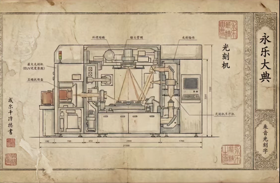
     - <a href="https://www.zhihu.com/people/55-16-66-77">继续解封</a> (<small title="回复于 2025-12-26 17:35:33/北京"> ✉️:路过</small>): ［赞］［赞］［赞］
     - <a href="https://www.zhihu.com/people/56-54-82-41">风向仪</a> (<small title="云南">2025-12-27 15:4:27</small>): 笑出声
     - <a href="https://www.zhihu.com/people/bi-xiong-jia-lan-bai">猫屋</a> (<small title="福建">2025-12-27 15:10:48</small>): 想反串钓鱼，居然没钓到，生气
     - <a href="https://www.zhihu.com/people/mei-jian-de-suo">半半星一</a> (<small title="重庆">2026-1-2 7:54:43</small>): 逆天神胎。  
 
但凡看了超过两分钟，思考三十秒，就算基本盘，也不会问出这种问题。
107. <a href="https://www.zhihu.com/people/24-71-76-62">吾黄万睡</a> (<small title="江苏">2025-12-26 2:20:45</small>): 你以为的西域:就在家门口，汉人不去拿  
 
实际上的西域:北接草原，南接吐蕃，西接教国 ，东接中原，西域因为丝绸之路的缘故，富得流油，无数势力都想来分一杯羹。这片土地上，国家，文明，政权你方唱罢我登场，失败者倒在历史尘埃里，层层叠叠的遗迹被黄沙掩埋。 最后只有中国笑到最后，控制了这块土地。你不应该把中国视为无能的统治者，应该视为争夺战里最后的赢家，从来没有什么土地是永远属于某个民族的，只有自己争气 土地才是自己的
108. <a href="https://www.zhihu.com/people/60-74-98-60">黄什乙</a> (<small title="新疆">2025-12-26 10:11:33</small>): 这种回答是如何得到这么多赞的？我很费解。
     - <a href="https://www.zhihu.com/people/60-74-98-60">黄什乙</a> (<small title="新疆">2025-12-26 15:24:19</small>): 这时候就不拿我IP说事了［尴尬］
     - <a href="https://www.zhihu.com/people/miracle-78-56-92">miracle</a> (<small title="上海">2025-12-28 14:51:22</small>): 请提出反驳论点
     - <a href="https://www.zhihu.com/people/60-74-98-60">黄什乙</a> (<small title="回复于 2025-12-28 15:7:10/新疆"> ✉️:miracle</small>): 看我IP。
     - <a href="https://www.zhihu.com/people/climb-43-29">climb</a> (<small title="陕西">2025-12-29 16:49:31</small>): 湖北出土的秦简恰恰说明了问题，秦朝对士兵和家属待遇不错，弟兄两个，一个服兵役，一个在家照顾父母，而且还有工资。
109. <a href="https://www.zhihu.com/people/kaja-34-4">skt李明博</a> (<small title="山东">2025-12-25 22:36:26</small>): 要是周制时间长点，可能华夏文化圈会比现在大不少
     - <a href="https://www.zhihu.com/people/li-xin-67-3">李昕</a> (<small title="浙江">2025-12-26 12:42:24</small>): 会变集团型国家，比今天欧盟紧密不了太多
     - <a href="https://www.zhihu.com/people/bu-goodman">媠氣</a> (<small title="回复于 2025-12-26 23:37:5/北京"> ✉️:李昕</small>): 那可太棒了
     - <a href="https://www.zhihu.com/people/melt-78">melt</a> (<small title="回复于 2025-12-27 12:51:4/广东"> ✉️:李昕</small>): 这不挺好的
     - <a href="https://www.zhihu.com/people/kaja-34-4">skt李明博</a> (<small title="回复于 2025-12-29 14:55:12/山东"> ✉️:李昕</small>): 文化和国家形式有什么关系
     - <a href="https://www.zhihu.com/people/xjh-71-30">jh152915</a> (<small title="北京">2026-7-3 22:40:47</small>): 会比现在大的多，北美不敢说有点远，但至少澳大利亚，新西兰绝对轮不到英国人了。
     - <a href="https://www.zhihu.com/people/bi-dong-84-41">壁咚</a> (<small title="北京">2026-7-5 23:20:53</small>): 中亚和东南亚一定会有更多汉人的国家，但是中原同样也会有更多汉人的国家...
     - <a href="https://www.zhihu.com/people/kaja-34-4">skt李明博</a> (<small title="回复于 2026-7-5 23:27:15/山东"> ✉️:壁咚</small>): 这就很难说是好是坏了
110. <a href="https://www.zhihu.com/people/51-42-94-67">定国</a> (<small title="英国">2026-1-14 9:22:4</small>): 怎么总是秦制秦制的，没秦国在那镇压犬戎义渠西域你一块地都不会有
111. <a href="https://www.zhihu.com/people/lao-dao-87-78">老道</a> (<small title="重庆">2025-12-26 17:42:55</small>): 你忽略了另外一面。  
 
始皇统一，六国遗民都不认为自己是秦人，若非两汉前后相加，大一统的意识根本不够。  
 
没有大一统的意识，中国也不可能捏造起如此大的疆域。  
 
就连宋辽金的时候，还有南人北人的分别。
112. <a href="https://www.zhihu.com/people/28-19-23-9">宋教人</a> (<small title="广东">2025-12-27 10:25:15</small>): 各个地方高度自治才是正确答案［赞］
113. <a href="https://www.zhihu.com/people/chusuke-82">official-chak</a> (<small title="广东">2025-12-26 8:29:27</small>): ［好奇］秦制利于收割，为啥每个朝代还能有那么多人口
     - **探耽求究** (<small title="日本">2025-12-26 9:41:35</small>): 问得好，因为养殖场里只需要考虑吃和生产！越穷越生，越生越穷！
     - <a href="https://www.zhihu.com/people/64-27-11-21">出去玩</a> (<small title="广西">2025-12-26 11:25:23</small>): 汉人的优点，比动物还能生
     - **探耽求究** (<small title="回复于 2025-12-26 11:46:36/日本"> ✉️:探耽求究</small>): 人口膨胀这个事情比较反直觉，太穷太饿了不行，吃太饱也不行。只有时刻处于饥饿线上下徘徊，能活下去但又不能吃太饱，时刻处于饥饿恐惧的阶段，这时候是最有繁殖欲的。传宗接代延续基因的本能会让人拼命的生产，人口迅速膨胀，而越膨胀越不能吃饱。我不敢说封建皇帝官僚懂这个道理，但长期秦制实践下来是往这个方向发展的。
     - <a href="https://www.zhihu.com/people/44-27-74-44">天下大吉</a> (<small title="回复于 2025-12-26 21:50:33/吉林"> ✉️:探耽求究</small>): 人口是，底层无政府状态，宗法制生殖竞赛的结果。  
 
根源依然是零和博弈，不能协作开拓自然
     - <a href="https://www.zhihu.com/people/mei-jian-de-suo">半半星一</a> (<small title="重庆">2026-1-2 8:14:19</small>): 村里稍微肥沃的一块地，一块田，甚至一颗大树，都有自己单独的名字。  
 
怎么证明和守护，靠的是拳头硬和人多。
114. <a href="https://www.zhihu.com/people/26-60-60-35">冷眼看世界</a> (<small title="北京">2025-12-25 20:8:30</small>): 洋人也一样呀，陆上北非和西亚一直很难征服，不妨碍殖民美洲、澳洲、西伯利亚、非洲、南亚、东南亚
     - **探耽求究** (<small title="日本">2025-12-26 0:11:0</small>): 评论老被夹，我把一些评论回复放到回答最后了统一回答了，有兴趣的同学看一眼。
115. <a href="https://www.zhihu.com/people/53-54-76-75">文科鼠鼠罢了</a> (<small title="上海">2026-1-29 17:58:6</small>): 这个回答跟历史关系不大，但是反映了作者本人的中产阶级观点，他希望自己能够成为类似于中世纪欧洲自由城邦教师集团的中间阶层，拥有其独自的意识，上能对抗君主，下能对抗平民
116. <a href="https://www.zhihu.com/people/hu-xin-13-61">润到非洲开矿</a> (<small title="四川">2026-7-4 18:21:45</small>): 这个所谓秦制就是一个开环系统，有时候可以跑很快 但是很快系统会趋于发散，而类似美国这种是一个有负反馈机制的闭环系统，跑得不一定快，但是有负反馈可以调节系统的误差，整个系统运行会比叫稳定
117. <a href="https://www.zhihu.com/people/97-78-18-18">电饭锅</a> (<small title="江苏">2026-7-12 9:13:20</small>): 为什么总是崇洋媚外呢［思考］
118. <a href="https://www.zhihu.com/people/67-57-66-18-25">神么渡渡鸟</a> (<small title="贵州">2026-7-11 12:6:41</small>): 主要就是依靠战乱与屠杀。激发了难民潮外溢扩张。下一轮扩张至少100年后。
119. <a href="https://www.zhihu.com/people/chao-ji-xiao-dang-jia">小当家Nick</a> (<small title="上海">2026-7-11 9:37:1</small>): 960万平方公里，难道是天生的吗？都是慢慢“殖民”出来的，和欧洲殖民世界的区别是，距离不同罢了。
120. <a href="https://www.zhihu.com/people/duo-liao-shi-yao-dong-xi">多了什么东西</a> (<small title="广东">2026-7-10 17:1:24</small>): 农业社会怎么殖民 英国怎么不在一千年前殖民澳洲 他们可不是秦制啊
121. <a href="https://www.zhihu.com/people/16-57-95-46-64">反弹</a> (<small title="广东">2026-7-10 18:59:9</small>): 西域反复很正常，朝代都经常更迭，何况西域。不过秦制国家确实是不会喜欢离岸控制的，离岸势力注定是牢固不了的，这种他们绝对会在反复拉锯后丢失，然后再没有丝毫动力去培养离岸势力
122. <a href="https://www.zhihu.com/people/wu-ya-xian-sheng-54-27">乌鸦先生</a> (<small title="四川">2026-7-9 22:56:19</small>): 实际上秦制才是最适合殖民的制度，能用最低的成本管控殖民地
     - **探耽求究** (<small title="美国">2026-7-10 10:52:37</small>): 因该说是适合内殖民的制度，但是要控制内部近亲繁殖的速度，不然很快就会自爆。
123. <a href="https://www.zhihu.com/people/wu-sheng-52-97-51">吴生</a> (<small title="重庆">2026-7-9 9:58:49</small>): 都这个时间点了…作者在这里文化体制不自信…
124. <a href="https://www.zhihu.com/people/wu-sheng-52-97-51">吴生</a> (<small title="重庆">2026-7-9 10:5:20</small>): 贵州的山旮旯通了公路…青藏高原通了铁路…历史还在继续…你说的这些留待后人评说吧…
125. <a href="https://www.zhihu.com/people/ming-ming-38-29-92">铭铭德</a> (<small title="河南">2026-7-9 12:55:35</small>): 完全正确
126. <a href="https://www.zhihu.com/people/qian-zhi-he-28">momo</a> (<small title="北京">2026-7-8 18:41:29</small>): 历史不是线性匀速变化的。二十世纪前半叶如果没有一系列变故，华人是有可能占领南洋的。但是西方殖民和世界大战强化了马来人的民族主义和宗教主义，使得事情复杂了
127. <a href="https://www.zhihu.com/people/struct-78">xuges</a> (<small title="安徽">2026-7-8 17:7:9</small>): 周制确实是利于扩张，但是缺点是经常有摩擦，秦制利于维稳，不利于久治。说白了事物具有两面性，既要也要是不现实的，没有完美是制度。秦汉以后不可能再回到纯分封了，其实古代一直都是分封集权并行的。
128. <a href="https://www.zhihu.com/people/72-63-19-33-71">流浪啊流浪</a> (<small title="浙江">2026-7-8 2:53:0</small>): 太高看皇权了
129. <a href="https://www.zhihu.com/people/ha-ha-ha-ha-27-29">马鸡化巴腾</a> (<small title="安徽">2026-7-7 20:32:39</small>): ［赞同］
130. <a href="https://www.zhihu.com/people/36-32-5-96-20">怀沙</a> (<small title="上海">2026-7-7 12:17:17</small>): 因为商人和周人本来就是殖民者
131. <a href="https://www.zhihu.com/people/4-57-28-73">小亮</a> (<small title="上海">2026-7-7 14:49:57</small>): 深刻！
132. <a href="https://www.zhihu.com/people/liu-cai-yun-nan">六彩云南</a> (<small title="云南">2026-7-6 16:38:4</small>): up厉害［赞］
133. <a href="https://www.zhihu.com/people/mo-zhi-hu-44">默之狐</a> (<small title="江苏">2026-7-6 17:17:39</small>): 这是一只被闺了的狮子
134. <a href="https://www.zhihu.com/people/mo-zhi-hu-44">默之狐</a> (<small title="江苏">2026-7-6 16:51:27</small>): 我不支持这种观点，虽然我很钦佩搂主的才华。楼主说的一点没错，但是忘了一点。此一时彼一时。  
 
如果在1300年，你会这样认为吗？  
 
马可波罗到中国的时候，他可能想法恰恰相反？他会想罗马为什么会衰老，中国为什么会崛起？封建制有固定的社会缺陷。而中国古代春秋战国的战乱包含着社会进步的因素。就像现在吹中世纪一样。  
 
我反对鄙视伪史论，但是西史辨伪是有道理的，西方史确实被拔高了。  
 
明朝末年为什么没有发展出工业化？是因为他不能也不愿意面对社会变革。  
 
而西方的工业化是因为它近代的变革，而不是因为希腊罗马的遗产。
     - <a href="https://www.zhihu.com/people/mo-zhi-hu-44">默之狐</a> (<small title="江苏">2026-7-6 16:58:53</small>): 所以秦制的问题固然是中国社会走向末路的原因？但是在古典农业社会，它是最好的制度。  
 
而航海殖民对于中国的土地，种地来说是高风险，低收益的行为。  
 
比如东罗马帝国。如果在中世纪他像欧洲一样封建，那在近代兴许都可以发展。但是中式1000年的繁荣就没有了？  
 
兴衰自有定数。  
 
再比如英国的工业化蒸汽机？被神化了太多？要知道过了几十年，英国就落后了。蒸汽机几乎是他落后的主要原因？固守和成熟的制度都会成为阻碍进步的原因。只是因为它的制度上去成熟，所以没有完全掉队。  
 
就是路径依赖和发展先进？  
 
打个比方说，恐龙之所以灭亡，就是因为它发展的太好？但是也因此他霸占了一个时代？  
 
你是要现在，还是要过去？放在现代，你可以说过去不好，但是如果你站在明朝的时候，你是选择移民到欧洲，还是准备留在中国？  
 
所以你站在当时的情况下，你是选择中国2000年以后经历100年的衰败？还是选择1000年的中世纪，然后1000年的获得成功？
135. <a href="https://www.zhihu.com/people/bi-dong-84-41">壁咚</a> (<small title="北京">2026-7-5 23:23:9</small>): 就像创业公司想崛起必须得人人有股份，拿死工资的打工仔是不会为公司拼命的［飙泪笑］
136. <a href="https://www.zhihu.com/people/ao-li-yu-ma-ma">奥里与妈妈</a> (<small title="湖北">2026-7-6 7:0:7</small>): pro max
137. <a href="https://www.zhihu.com/people/su-jiang-10-91">苏江</a> (<small title="山东">2026-7-5 9:8:59</small>): 可我们明明，想干美就干美，想干日就能干，想打韩打台就能打回来，一挑全球好像也绰绰有余。  
 
我总结的网商的言论，非我个人想法。
138. <a href="https://www.zhihu.com/people/urltr_cn">uiuiu</a> (<small title="新疆">2026-7-5 12:11:0</small>): 但是下线好歹是国土不少吧，古代西方有这样的吗。现代殖民只不过是借了工业革命的东风罢了，这是生产力的变革，不要涉及到制度，你的角度真的奇怪，思维单一的就像一条线。
     - <a href="https://www.zhihu.com/people/sklzxvm">昨日重现</a> (<small title="福建">2026-7-5 22:8:37</small>): 不少不是因为有多牛逼，只是远东绝大部分无人区，有人口就能占领
     - <a href="https://www.zhihu.com/people/urltr_cn">uiuiu</a> (<small title="回复于 2026-7-6 9:31:22/新疆"> ✉️:昨日重现</small>): 我说的不少是基本盘至少得以保留吧。西方的传统的这种文明古国的人口基本盘，文化基本盘，边界基本盘都已经丧失了。中国在进入现代文明后，虽然示弱，但是基本盘依旧是存在的，这个你是无法否认的吧？你的理解是过于狭义了，为什么要关注仅仅说所谓的扩张性的一些意义不大的地方？
     - <a href="https://www.zhihu.com/people/urltr_cn">uiuiu</a> (<small title="回复于 2026-7-6 9:32:24/新疆"> ✉️:昨日重现</small>): 你知道西方文明从古代到现在换了多少波人吗？人种和族别换了多少次呢？而且他的文明也就从工业革命前后吧，1000年还不到，还没有经过更为严峻的考验。
     - <a href="https://www.zhihu.com/people/xia-ya-12-68">Casval</a> (<small title="上海">2026-7-10 22:35:26</small>): 秦制确实下线高，但是他上线低
     - <a href="https://www.zhihu.com/people/urltr_cn">uiuiu</a> (<small title="回复于 2026-7-14 2:38:30/新疆"> ✉️:Casval</small>): 我们总拿中国古代的制度来和西方现代的制度做对比，我认为这是不公平的。延续西方古代他所倡导的理念更符合现代的价值观，但这并不代表西方古代的族群延续了下来。事实上，西方的文化的承载者已经换了好几拨人了。我们国家现在它面临的是像现代制度的一种转型，我始终认为我们还在进行中，并没有做到完成时。当然全球都没有进入完成时，因为工业革命并没有成熟，比如说deep seek，智能的人工智能，基本金属元素的获取最大区域，也就是说，既然工业革命或者说工业社会的发展还没有成熟，那么它的制度也是没有成熟的，不会有一个绝对成熟的制度。嗯我认为我们总在怀疑过去，但是嗯，对未来的投入，或者说看向未来的眼光少了很多。
139. <a href="https://www.zhihu.com/people/bu-er-qiao-ya-90">布尔乔亚</a> (<small title="意大利">2026-7-5 12:38:48</small>): 看得透透的
140. <a href="https://www.zhihu.com/people/ken-84-32-78">空格ken</a> (<small title="福建">2026-7-2 16:23:34</small>): 所以秦国大一统战争导致了华夏人外逃胡化，然后导致匈奴崛起。那时候的华夏还不是原子化，估计是整族的人口迁徙。
141. <a href="https://www.zhihu.com/people/asdxsw44">佛系车手</a> (<small title="四川">2026-7-1 0:50:51</small>): 说的很有道理也很透彻
142. <a href="https://www.zhihu.com/people/christmas-eve-91">Christmas Eve</a> (<small title="未知">2026-6-29 8:3:0</small>): 秦制+法儒 2000年锁死了
143. <a href="https://www.zhihu.com/people/zheng-wu-ji-99">郑无极</a> (<small title="四川">2026-6-26 23:8:13</small>): ［赞］
144. <a href="https://www.zhihu.com/people/11-85-43-96-26">知用户</a> (<small title="甘肃">2026-5-2 8:9:48</small>): 你不能要求一个2000年的帝国永远强大嘛。  
 
  
 
历史的辉煌那是秦汉的辉煌，近代的落后那是自己无能，还能赖祖宗吗。
     - <a href="https://www.zhihu.com/people/81-33-64-55">知乎用户DPXcK0</a> (<small title="湖南">2026-5-5 0:31:20</small>): 白人花几百年扩张到全球了，我们还在老家玩泥巴［doge］更魔怔的是，许多人连近代的落后都不承认了，张口就是西方全靠偷永乐大典。
145. <a href="https://www.zhihu.com/people/hi-cho">让她生</a> (<small title="山西">2026-4-29 21:29:32</small>): 卧槽！还有这么年轻的夏娜受众［惊喜］
146. <a href="https://www.zhihu.com/people/hello-kitty-27-96">hello Kitty</a> (<small title="山东">2026-4-18 19:50:0</small>): 你只一味否定秦制，却从没认真思考制度演变的逻辑。从尧舜禹的禅让制，到夏商周的分封制，再到秦代的中央集权与郡县制，每一步都是为适配更大规模人口与疆域、实现更有效治理的必然选择。更何况你也没考虑边疆治理的现实，比如西域新疆一带，中原政权本就面临治理成本远高于收益的问题，只要能通过羁縻使其不对中原构成威胁，便是最务实的策略。势力弱时暂弃、势力强时羁縻掌控，本就是兼顾安全与成本的最高明安排。
     - <a href="https://www.zhihu.com/people/hello-kitty-27-96">hello Kitty</a> (<small title="山东">2026-4-18 19:51:20</small>): 另外禅让制在学界已经认为类似于现在的共和制度！
147. <a href="https://www.zhihu.com/people/liyuanjia">liyuanjia</a> (<small title="江西">2026-4-3 10:1:21</small>): 在现代化工业体系加成下。都没几个人愿意去鹤岗。  
 
你叫老百姓那时候去。你玩呢。  
 
然后。是清末政府组织百姓去东北的。而不是自发。  
 
乾隆时候军垦也是政府组织
148. <a href="https://www.zhihu.com/people/92-36-9-71-21">驲逆</a> (<small title="四川">2026-4-2 15:48:28</small>): 好了，现在请评价一下你的西方文明现在追求的扁平化管理［为难］
149. <a href="https://www.zhihu.com/people/yan-huang-70-34">知乎用户</a> (<small title="广东">2026-3-17 5:12:34</small>): 印度：我怎么不知道周制这么牛逼
150. <a href="https://www.zhihu.com/people/chen-tie-guang-84">皮皮帕</a> (<small title="湖南">2026-2-28 2:33:17</small>): 民众自我组织能力差，原子化的社会结构本来就不适合开拓。适合开拓的制度是分封制。但是分封制已经被我们钉在了历史的耻辱柱上。所以中国历史对西域的统治也就断断续续。分封制或者领主制配合文化思想生活方式的变更才会实现开拓成功。所以新疆西北这种地方说实话后续怎么讲很难说。建政快80年，从准噶尔灭亡算的话都几百年了，到现在都不能实现语言无障碍交流，不要觉得自己的管理方式很厉害。
     - <a href="https://www.zhihu.com/people/gh12345-24">GH12345</a> (<small title="湖南">2026-4-9 19:25:18</small>): 那就改制吧
151. <a href="https://www.zhihu.com/people/like-32-74">LKMengW</a> (<small title="河南">2026-2-17 2:35:4</small>): 看一半有点怕这是反贼常用的那套话术浪费时间，不过看完了还是挺有启发的。  
 
有个说法说:商鞅先给秦王讲了帝道，秦王嫌慢睡着了不听，商鞅又讲王道，秦王还嫌慢，又睡着了不听，商鞅讲霸道，秦王开心的重用了商鞅。  
 
三皇五帝都是因为贡献才称帝，而王是让人服气于是推举为王，霸道则是让人怕才称霸。作者的秦制和霸道类似。而周制类似王道。帝道则是现在欧美老吹嘘自己的文明和贡献，新月教吹嘘洗脑，中国则还没有对全世界进行吹嘘洗脑，落后进度了。得有霸道的实力防御美国，得有王道的伎俩操纵盟国，还得有帝道的追求，最终思想统一全球。
152. <a href="https://www.zhihu.com/people/liu-bei-11-17">刘备</a> (<small title="四川">2026-2-7 17:51:20</small>): 周制利于开拓但不利于统一，西方就是这样，两者有利有弊吧
153. <a href="https://www.zhihu.com/people/97-55-68-33-28">丫姿</a> (<small title="四川">2026-2-4 18:18:13</small>): 作者的意思是我们还在秦制的怪圈里。我看你将大一统与秦制等同。我觉得这不对。以前秦制走不出怪圈是因为信息不通畅，中央到地方，地方到中央的信息都会被消耗部分，大一统统治本身效率不够。如果我们在效率上跑赢内卷的高压锅，那就能延迟爆炸的到来时间，甚至可能永远都不会迎来这个问题。现实是目前的政府效率还是比较高效的。而且大一统国家虽然对内是熵减，但对外还是更加有效率和力量的。现在世界格局处于多国争霸的春秋时期，大一统在目前我认为还是比较有效和有必要的。
154. <a href="https://www.zhihu.com/people/xi-yuan-si-dao-ren">知乎用户07</a> (<small title="北京">2026-1-8 10:3:50</small>): 所以我们注定了结局了吗？
155. <a href="https://www.zhihu.com/people/xin-zhi-hua-81-8">鑫之花</a> (<small title="河南">2026-1-9 9:56:10</small>): 我只知道，大部分人都是宁为鸡头，不为牛后。宁可一隅有生杀大权，传承子孙千万。也不愿意共治一大片土地，优胜劣汰。
156. <a href="https://www.zhihu.com/people/76-15-9-28">知行合一</a> (<small title="内蒙古">2026-1-9 0:5:0</small>): 研究制度的！我倒是觉得是生产力的发展促进的殖民地大开发。
157. <a href="https://www.zhihu.com/people/49-42-95-73-67">zhihuyonghu</a> (<small title="四川">2026-1-16 13:23:28</small>): 其实元也没被同化，现在蒙古族是信藏传佛教用回鹘式蒙古文的，朝鲜日本的文化都比蒙古文化和汉族更近，中亚的蒙古人倒是突厥化了；  
 
而且往南也就到越南，中南半岛剩下的明显受印度影响比较多。
158. <a href="https://www.zhihu.com/people/shen-shuo-8-58">人说</a> (<small title="江西">2026-1-13 18:39:17</small>): 我突然想到了闭关锁国这个词，在很多人的认知里闭关锁国往往指代一种禁止对外交流的政治方针，但答主对所谓包容的解释让我突然想到了回民这一群体，虽然他们也很不老实但没那么极端，而网络上在讨论为什么伊和基的宗教派系为什么没斗起来时往往会说这是因为上面厉害和国情使然，但是答主你说的这些让我想到所谓闭关锁国并非是指禁止对外交流这个意思，而更应该是指傲慢国家或者文明这个层级的傲慢；初期的傲慢是因为我有所以不需要的傲慢，这导致了字面意义上的闭关锁国；而回民的出现是因为我强所以不在乎的傲慢；为什么回民会出现？因为战乱民众过得不好但你总要活所以部分人受到了东来的伊教传教士影响成了回民，而为什么这些回民没有受到伊教派系的影响？因为这时的民众是求个念想且传教士的传教是小范围且稀少的，他们的力量不足以构成一个宗教群体而且他们普遍有私心的，因为华夏是个未被开发的处女地这些传教士或许有部分传教士是真心来传教的，但还有相当一部分是打着成为传火者来的，他们传播了符合自己内心的教义但总的是不变的，而也正是他们的影响之下成就了回民这个伊教在华夏的基本盘，本来接下来的步骤应该是体系力量（伊教国家下场输出宗教革命）的持续输出，但败在距离和战争等其他因素所以体系介入不成型；这就好像真正的小说母本（伊教）没进来进来的全是各种同人，还因为距离和时代影响小说一直没影响到就这种情况下同化不了那才叫见鬼了［思考］所以古典大一统国家最怕的反而不是强攻，而是思想革命很不凑巧宗教就是古代的思想革命，因为他不用废一兵一卒之力就足以颠覆并摧毁一个古典大一统国家，为什么可以这样？因为古典大一统国家很容易诞生的情绪就是傲慢，也正如我开头所讲的那样古典大一统国家的力量是强大的但他们没有思想的力量，民众生活也不好所以受到宗教革命影响是必然的事情，这就是典型的文化输出而古典大一统国家呢？他们知道但没办法他们想到的方法要么是流放要么是以杀止传要么就是禁止私人救助难民，闭关锁国不在于是否开放而在于傲慢；欧洲那些国家差点就被摧毁不过他们选择了以魔法打败魔法，虽然衍生出了各种派系但那只是为了不被同化所做出的必要牺牲罢了，
159. <a href="https://www.zhihu.com/people/la-ge-lang-ri-lu-de-wei-xi">拉格朗日路德维希</a> (<small title="山东">2026-1-10 21:13:46</small>): 没有“秦制”就没有“忠裹”。欧洲人征服了大半个世界，ysl同化了小半个世界，这并不意味着存在桶一的“欧罗巴国”或者“ysl国”
160. <a href="https://www.zhihu.com/people/kong-bu-zhe-74">烈日炽威</a> (<small title="陕西">2026-4-2 21:8:36</small>): 就说一点，周制要是真的那么好，印度人就不会被莫卧儿人杀的跟狗一样。
161. <a href="https://www.zhihu.com/people/91-79-42-14">梅花芬芳</a> (<small title="辽宁">2026-4-19 14:31:12</small>): 安南都搞不明白还东南亚，牠们纯粹是笑话

=[评论](./attachments/comments.json)

