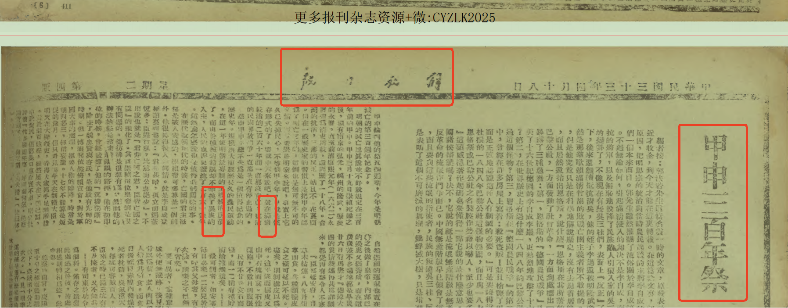
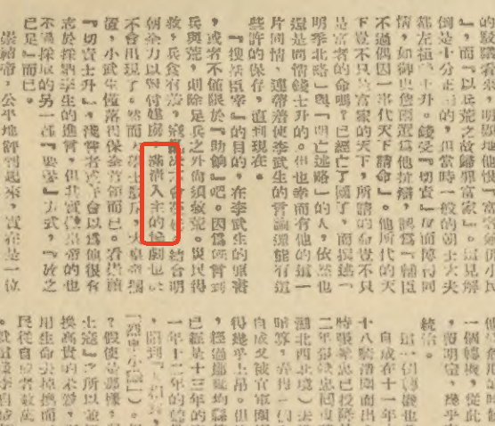
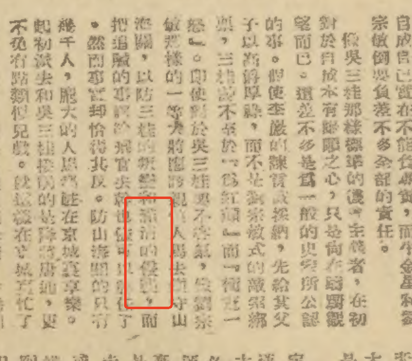
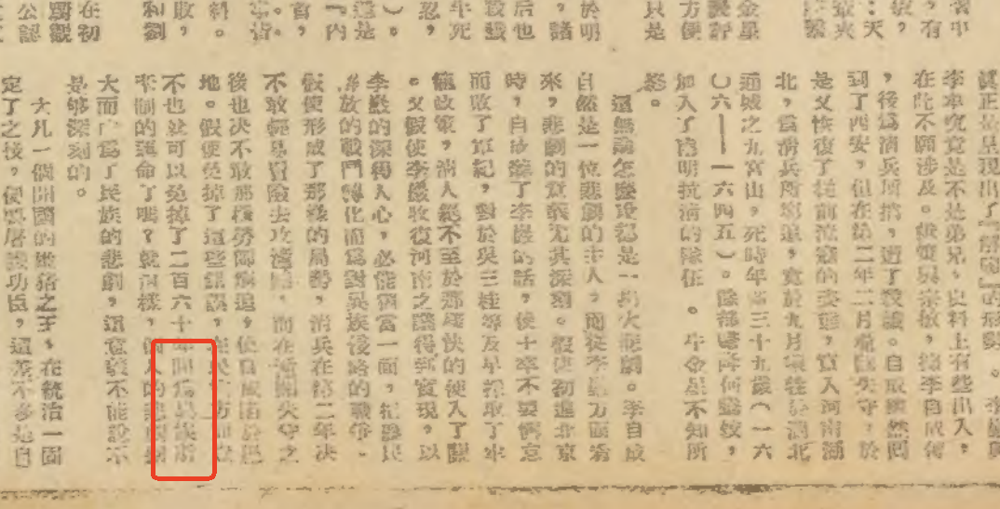
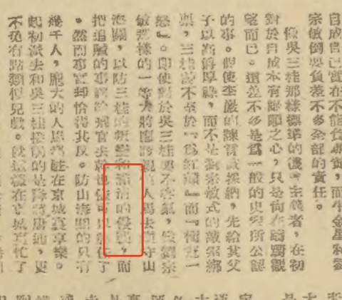
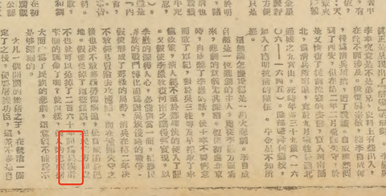

[toc]

# 问题

提问者：**<a href="https://www.zhihu.com/people/78-56-34-83">诺克斯县管理员</a>**
提问时间: 2026-6-18 17:25:3
总回答数: 198
总访问量: 531537

请将标题中的修改，改为 篡改

# 回答

回答者： **<a href="https://www.zhihu.com/people/liu-lu-yang-17">文刀刘</a>**
回答时间: 2026-8-20 19:9:0
点赞总数: 1094
评论总数: 23
收藏总数: 297
喜欢总数：20

咸鱼上找的老报纸扫描件。。

  

  

  

原文地址：[(文刀刘)如何看待《甲申三百年祭》被修改，“为异族所统治的二百六十年间”被修改为“为清朝所统治”？](https://www.zhihu.com/question/2050992440216131149/answer/2073849035736326956) 

# 评论

1. <a href="https://www.zhihu.com/people/sephiroth-41-38">Sephiroth</a> (<small title="安徽">2026-8-21 7:51:3</small>): 下载，保存。避免成为荒原
   - <a href="https://www.zhihu.com/people/wang-zhi-62-84">火炎舍</a> (<small title="广东">2026-8-21 11:32:38</small>): 的确
   - <a href="https://www.zhihu.com/people/xuan-xuan-yue-45">悬玹月</a> (<small title="广东">2026-8-21 15:48:35</small>): 收到，马上实操［赞同］
2. <a href="https://www.zhihu.com/people/zll-8-52">饭饭</a> (<small title="北京">2026-8-21 8:54:21</small>): 一直是异族啊。黄飞鸿的电影里就有台词，英国人对着十三姨说 你们被外族统治两百多年不是已经习惯了，我们来统治你们不是一样的。十三姨回英国人，我们的未来我们说了算，不是你们英国佬说的算。
   - <a href="https://www.zhihu.com/people/ting-dan-60">听蛋</a> (<small title="广西">2026-8-21 10:20:29</small>): 说起来英国人被外族统治的时间可能更长［捂脸］
   - <a href="https://www.zhihu.com/people/neng-quan-80">小飞猪</a> (<small title="回复于 2026-8-21 11:54:14/广西"> ✉️:听蛋</small>): 现在国王还是异族［捂脸］
   - <a href="https://www.zhihu.com/people/Wordsmisunderstood">momo</a> (<small title="回复于 2026-8-21 12:7:40/广东"> ✉️:听蛋</small>): 已经没几个本族了，但是不能比烂
   - <a href="https://www.zhihu.com/people/huaji-38">中心如醉</a> (<small title="回复于 2026-8-21 15:21:19/浙江"> ✉️:听蛋</small>): 不列颠岛因外族入侵导致民族换种好几次，因为自身是个岛国体量又小，父系改变都很彻底。
 
所以英国人还相对好些，土耳其人才是最变态的。
   - <a href="https://www.zhihu.com/people/zhang-xiang-11-39">流歌若莺</a> (<small title="回复于 2026-8-21 16:6:38/新疆"> ✉️:中心如醉</small>): 我觉得土耳其人是最搞笑的，明明是纯希腊人的后代，结果认贼作父；
 
最变态的应该是印度半岛的达罗毗荼人，明明是最早到达印度半岛建立古印度文明的种族，结果被伊朗高原来的人打败贴上达利特人和不可接触者的标签几千年生活在社会最底层，就这样还能一直框框生持续筑牢印度种姓制度的“基石”。
 
要知道犹太人近三千年一直想玩这一套，在埃及直接被赶走，在欧洲一直玩不起来，在美国一百年就快玩崩了，就是缺了达罗毗荼人这一块。
3. <a href="https://www.zhihu.com/people/yang_fei">强哥</a> (<small title="上海">2026-8-21 9:26:21</small>): 先下载为敬
4. <a href="https://www.zhihu.com/people/ying-zhi-ge-66">影之歌</a> (<small title="山东">2026-8-21 11:48:36</small>): 1939年《青年运动的方向》："辛亥革命把皇帝赶跑，这不是胜利了吗？说它失败，是说辛亥革命只把一个皇帝赶跑，中国仍旧在帝国主义和封建主义的压迫之下，反帝反封建的革命任务并没有完成。"
5. <a href="https://www.zhihu.com/people/jia-ye-winter">tentenbagger</a> (<small title="上海">2026-8-21 11:14:46</small>): 异族
6. <a href="https://www.zhihu.com/people/98-74-19-29-65">源氏溥仪</a> (<small title="浙江">2026-8-21 12:1:13</small>): 可以发一下无水印的么？
   - **文刀刘** (<small title="新疆">2026-8-21 13:36:58</small>): 
   - **文刀刘** (<small title="新疆">2026-8-21 15:54:16</small>): 
   - **文刀刘** (<small title="新疆">2026-8-21 15:54:35</small>): 
   - **文刀刘** (<small title="新疆">2026-8-21 15:54:50</small>): 
   - <a href="https://www.zhihu.com/people/qing-zheng-hong-shao-tang-cu-bao-chao">清蒸红烧糖醋爆炒</a> (<small title="回复于 2026-8-21 16:46:26/山东"> ✉️:文刀刘</small>): 已下载
7. <a href="https://www.zhihu.com/people/wang-zhi-62-84">火炎舍</a> (<small title="广东">2026-8-21 11:34:20</small>): 给答主点赞。  
 
对于这个问题，太多人搅混水了
8. <a href="https://www.zhihu.com/people/forsaken-27">藏安安</a> (<small title="山西">2026-8-20 23:53:46</small>): 图四很明显是异族
   - <a href="https://www.zhihu.com/people/hui-hu-li-dou-zi">灰狐狸豆子</a> (<small title="北京">2026-8-21 8:8:50</small>): 对，是異族
   - <a href="https://www.zhihu.com/people/60-6-11-54-97">拓拔自成</a> (<small title="四川">2026-8-21 11:2:37</small>): 建国前后是一个国家吗？
   - <a href="https://www.zhihu.com/people/du-gu-qi-meng">独孤绮梦</a> (<small title="回复于 2026-8-21 11:34:0/广东"> ✉️:拓拔自成</small>): 解放军是不是同一个解放军？

=[评论](./attachments/comments.json)

