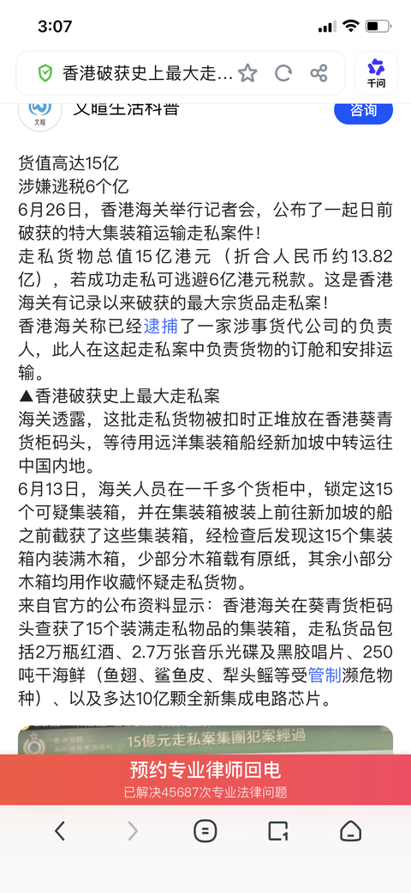
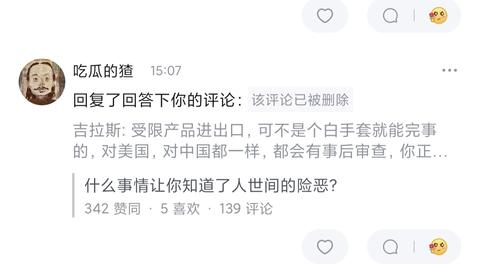
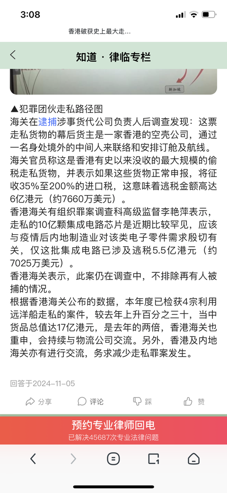

[toc]

# 问题

提问者：**<a href="https://www.zhihu.com/people/wang-shi-dou-19XX">王十斗</a>**
提问时间: 2017-8-9 14:51:7
总回答数: 767
总访问量: 8229388

狗血情节真的出现在你生活中时，发现我还是太天真了。

首先感谢各答主，评论的朋友。

真的没想到会有这么多人回答，这也证明了，世界远没有我们之前想的那么美好。

无力是我看下来最大感触，真的是在太无力了！太无力！！太无力了！！！

这几百个难兄难妹，鬼知道我们都经历了什么！人性本善？人性本恶？

尽管生活待我们如此残暴，我还是希望大家都好好的，将来10年、20年后去回答“我为何如此幸福”这种问题。

我愿世界待我们安好，今后无灾无难过此生。

10年之后 我来提问 你们来答可好？

# 回答

回答者： **<a href="https://www.zhihu.com/people/xiao-bai-38-66-75">明月</a>**
回答时间: 2026-1-13 13:48:27
点赞总数: 1378
评论总数: 436
收藏总数: 779
喜欢总数：60

讲一个近几年某沿海地区海关查获的价值10个亿大型集成电路走私案，哪家企业就不说了，你们自己猜测，绝对能打破你的三观。

某一次海关国门利剑行动中，沿海地区海关人员在抽查集装箱时，用手持式X光与大型集装箱检验设备检查时，扫描出来是空箱子，箱子里装的是泡沫，纸巾，锡箔纸之类的东西，当时查验人员觉得可疑，漂洋过海，拉着空集装箱进来干嘛？国内就不缺空箱子，运费来回可不少钱！！于是立即打开几个集装箱，里面的木箱子打开几个，检查后发现确实是空箱子，于是将这个情况报告给了科长，科长立即带人前往。

科长到来后直接走到最里面的箱子，指挥着，打开这六个，里面的木箱子抱出来几个，直接检查中间的木箱子，然后一顿干活找出来里面的箱子时就比较重了，四个人抬出来的，科长直接撬开，满箱子集成电路板，又撬开其他集装箱，也发现都是集成电路板，最后安排人抓紧撬开查验所有集装箱，发现所有集装箱中都夹带这集成电路板，清点后发现金额巨大！！初步估计价值十个亿。自从国门利剑开展后，还没有一次性破获这么大涉案金额的走私案。

地方政府知道后，市长直接过来了，找打了关长询问这件事，并且表明了来意，能否放过这批货，是本市重点企业的集成电路板，为了避免不必要的麻烦，才安排走集装站进境的，关长当时很为难，这种事情，现场参与的人员太多了，现在全关甚至隔壁关都知道了，这个时候直接慢下来肯定是瞒不住的，而且涉案金额有巨大，难以通融。直接安排科长看看现场能有办法处理没？

不久企业负责人找到了科长，送了一盒海鲜，科长不受礼，直接拒绝了，对方说市长排他过来的，而且关长也知道了这件事，现场问问您 有没有解决办法。一来：这批集成电路板确实是国内急需的。二来并没有进境不合格商品，也是用于某些行业的，为了响应国家智能高端设备发展。科长接了小海鲜后感觉很重，就问他海鲜那么重吗？这个人说有冰块，您到家再打开，我这边先过去了，您看这个事情得怎么个处理方法？科长看着海鲜小盒子非常为难，这么大金额走私案，说破天了也不可能瞒下来。打开盒子一看，一块块金黄色的金块！！足足有五六斤！！！科长顿时怒了，这是什么意思！！直接隔着窗户扔出来了，喊来保安，直接拦着这人，把外面海鲜小盒子给他退回去！！

查验科全体人员待命，所有货物信息，查获走私集成电路板直接现场联网，上传国务院端！！就这样，一大批走私进境的集成电路板被曝光了，价值十个亿！！沿海关进境，什么样的企业有如此大的需求呢？评论区可以猜测一下，当时我们听说后，大概也猜到了是哪一家企业的，但是货主显示是香港一家空壳公司！！！

  

原文地址：[(明月)什么事情让你知道了人世间的险恶？](https://www.zhihu.com/question/63638475/answer/1994405422606619295) 

# 评论

1. <a href="https://www.zhihu.com/people/chen-jun-yan-6-16">mUL4qR</a> (<small title="北京">2026-1-13 15:1:12</small>): 这家企业是做AI的，主要负责生成答主发的故事。
   - <a href="https://www.zhihu.com/people/yin-yu-tao-96">夜话光阴</a> (<small title="江西">2026-1-13 15:3:3</small>): 哈哈哈［飙泪笑］ 我真不知道就国内这么卷的环境 有几层板是造不出来的 还走私上了
   - <a href="https://www.zhihu.com/people/hao-ku-liao">好苦了</a> (<small title="广东">2026-1-13 15:34:9</small>): 这人就是ai的，你看他的历史发言
   - **明月** (<small title="河南">2026-1-13 16:19:16</small>): 哈哈哈
   - **明月** (<small title="回复于 2026-1-13 16:22:44/河南"> ✉️:好苦了</small>): 这可不是AI哈，AI写不出来这么详细
   - <a href="https://www.zhihu.com/people/hao-ku-liao">好苦了</a> (<small title="回复于 2026-1-13 17:0:13/广东"> ✉️:明月</small>): 你是不是有个回答，说你们各家用力绊倒了县二号的。
   - **明月** (<small title="回复于 2026-1-13 19:51:44/河南"> ✉️:好苦了</small>): 那个让删了，人家找过来了［捂脸］［捂脸］
   - **明月** (<small title="回复于 2026-1-13 19:52:28/河南"> ✉️:好苦了</small>): 一般的故事不找过来我不删，我也没指明是谁
   - **明月** (<small title="河南">2026-1-13 20:42:22</small>): 你咋不看看我被借钱的故事，要账要不回来，用劣质酒给我抵了。这个故事你看看是不是AI
   - <a href="https://www.zhihu.com/people/hao-ku-liao">好苦了</a> (<small title="回复于 2026-1-13 22:37:13/广东"> ✉️:明月</small>): 太有实力了，小说一样，一群世家绊倒另外一个世家［赞］
   - <a href="https://www.zhihu.com/people/lin-tao-28-27">lllttt</a> (<small title="浙江">2026-1-14 23:58:50</small>): 上次看到类似的事情讲的是日本进口海鲜里面有寄生虫，前面开头到中间都一模一样［惊喜］
   - **明月** (<small title="回复于 2026-1-15 12:13:9/河南"> ✉️:lllttt</small>): 哪里一样？人物还是故事情节？
   - <a href="https://www.zhihu.com/people/zhang-shuang-54-20">知平用户NmgbWc</a> (<small title="广东">2026-1-16 1:56:20</small>): 10亿大案说编就编
   - **明月** (<small title="回复于 2026-1-16 8:30:15/河南"> ✉️:知平用户NmgbWc</small>): 你不相信，看我声明，纯属虚构，你知道虚构的，还说什么编的
   - <a href="https://www.zhihu.com/people/63-79-62-90">知乎用户GycV25</a> (<small title="回复于 2026-1-16 16:31:46/广西"> ✉️:明月</small>): 这电路板用来做什么的  
 
你这回大榭的含糊其辞啊  
 
在其他气氛渲染部分着墨极多  
 
为什么？
   - **明月** (<small title="回复于 2026-1-16 21:32:50/河南"> ✉️:知乎用户GycV25</small>): 这个能明说吗？你就当电饭煲用的吧
   - <a href="https://www.zhihu.com/people/zhe-ye-96-48-88">fvjuff</a> (<small title="回复于 2026-1-17 11:14:46/山东"> ✉️:夜话光阴</small>): 卷低端而已，到了高端又不说话了
   - <a href="https://www.zhihu.com/people/yin-yu-tao-96">夜话光阴</a> (<small title="回复于 2026-1-17 18:12:40/江西"> ✉️:fvjuff</small>): 电路板有哪方面是很高端国内造不出来的吗 又不是芯片
   - <a href="https://www.zhihu.com/people/dudubibi-88">dudubibi</a> (<small title="回复于 2026-1-18 11:52:11/美国"> ✉️:夜话光阴</small>): 口罩那几年国内买国内的产品都买不来［捂脸］订单量小的话加钱都不给
   - <a href="https://www.zhihu.com/people/zdghjop">zdghjop</a> (<small title="回复于 2026-2-14 22:2:17/陕西"> ✉️:明月</small>): 这才哪到哪，说到走私，我有一个故事，就怕你不敢讲。这种事情很正常吧。我只能说照你的说辞我们国家就不该存在。
   - <a href="https://www.zhihu.com/people/momo-14-86-13-85">momo</a> (<small title="江苏">2026-7-18 11:30:46</small>): 这个故事是真的，我就是盒子里面的黄金，我作证，这个答主当时就在旁边。
2. <a href="https://www.zhihu.com/people/cp118-71">吉拉斯</a> (<small title="广东">2026-1-13 18:57:47</small>): 正常得很，不然某企业如何发展起来的［吃瓜］  
 
不过应该不是线路板，而是未封装芯片，一些可能是芯片厂卖出来的，一些可能是检测不合格要销毁然后第三方偷偷卖的。  
 
这种生意，九十年代开始就有了，别问我怎么知道的
   - **明月** (<small title="河南">2026-1-13 19:54:38</small>): 握草，握草，牛掰啊，你这一说，你是知道是哪家了？不要说哈，我会删评论［捂脸］
   - **明月** (<small title="河南">2026-1-13 19:55:16</small>): 万万不要评论是哪家，谐音也不行，我会删的
   - <a href="https://www.zhihu.com/people/ji-zi">籍子</a> (<small title="回复于 2026-1-13 20:34:3/江苏"> ✉️:明月</small>): 假设是真的，不能说的企业还能有谁，不此地无银三百两嘛
   - <a href="https://www.zhihu.com/people/poc7wo">闫晓</a> (<small title="四川">2026-1-13 21:18:58</small>): 封装了的、不过是用木板做的封装
   - <a href="https://www.zhihu.com/people/jack-29-79">Jack</a> (<small title="回复于 2026-1-14 4:36:10/河南"> ✉️:明月</small>): 千万别说，很会宣传正能量的一家公司！
   - <a href="https://www.zhihu.com/people/chenl0012008">万能中年客栈</a> (<small title="浙江">2026-1-14 8:46:19</small>): 那个公司起步没点黑料呢。
   - <a href="https://www.zhihu.com/people/CTdog">吃瓜的猹</a> (<small title="广东">2026-1-14 10:24:58</small>): 你说的是flash吧？要么就是dram？
   - **明月** (<small title="回复于 2026-1-14 12:22:54/河南"> ✉️:万能中年客栈</small>): 这不是起步哈，这是惯犯
   - <a href="https://www.zhihu.com/people/wolf-chan-64">Wolf Chan</a> (<small title="回复于 2026-1-14 12:37:4/上海"> ✉️:明月</small>): yylx?
   - <a href="https://www.zhihu.com/people/feng-zi-hao">据说他姓feng</a> (<small title="广东">2026-1-14 14:27:58</small>): 只能是它了
   - **明月** (<small title="回复于 2026-1-14 16:10:25/河南"> ✉️:据说他姓feng</small>): 是的，大家心照不宣就可以。相信终究会被清算，等机会
   - <a href="https://www.zhihu.com/people/32-51-39-17">黑大壮</a> (<small title="回复于 2026-1-14 22:37:17/广东"> ✉️:明月</small>): 嘿嘿嘿［思考］V我50就不说［捂嘴］
   - <a href="https://www.zhihu.com/people/tai-qin-64">泰秦</a> (<small title="山东">2026-1-14 22:58:15</small>): 这哥们嗑药梦想自己是海关，你问问身边的朋友海关什么尿性，还给你这知乎发帖子？
   - <a href="https://www.zhihu.com/people/hao-ren-hao-meng-67-10">好人好梦</a> (<small title="山西">2026-1-14 23:10:2</small>): ［微笑］
   - <a href="https://www.zhihu.com/people/lshu-guang-dong-ming">戮戰勝曉</a> (<small title="江苏">2026-1-15 0:0:33</small>): 集成电路，俗称芯片。
   - <a href="https://www.zhihu.com/people/65-70-10-15-3">知乎用户ix7LHR</a> (<small title="上海">2026-1-15 1:7:18</small>): 都说了是不能说的企业了。能让你说出来的肯定不是［捂嘴］
   - <a href="https://www.zhihu.com/people/65-70-10-15-3">知乎用户ix7LHR</a> (<small title="回复于 2026-1-15 1:7:28/上海"> ✉️:Wolf Chan</small>): 都说了是不能说的企业了。能让你说出来的肯定不是［捂嘴］
   - <a href="https://www.zhihu.com/people/kuang-biao-de-gua-niu-6">狂飙的蜗牛</a> (<small title="回复于 2026-1-15 10:12:45/广东"> ✉️:明月</small>): 中华十万个为什么
   - **明月** (<small title="回复于 2026-1-15 10:50:3/河南"> ✉️:泰秦</small>): 我的梦能做到，你能做这种梦不
   - <a href="https://www.zhihu.com/people/cp118-71">吉拉斯</a> (<small title="回复于 2026-1-15 11:16:46/广东"> ✉️:戮戰勝曉</small>): 答主查扣的是集成电路板，那是模块级别的东西，走私集成电路的话，根本不需要集装箱，直接走裸片，十几亿货值一个行李箱搞掂
   - <a href="https://www.zhihu.com/people/cp118-71">吉拉斯</a> (<small title="回复于 2026-1-15 11:18:7/广东"> ✉️:泰秦</small>): 答主说的海关，让团灭几次了
   - <a href="https://www.zhihu.com/people/li-bin-teng">李斌腾</a> (<small title="广东">2026-1-15 14:55:13</small>): 肯定是民族之光的IT企业啦
   - <a href="https://www.zhihu.com/people/bai-du-ren-23-20">渡桥</a> (<small title="回复于 2026-1-15 14:55:25/山东"> ✉️:知乎用户ix7LHR</small>): 看来是了，我评论没了［捂脸］
   - <a href="https://www.zhihu.com/people/bai-du-ren-23-20">渡桥</a> (<small title="回复于 2026-1-15 14:56:43/山东"> ✉️:Wolf Chan</small>): 哈哈哈，感觉是的，各个方面都很符合。
   - **明月** (<small title="回复于 2026-1-15 15:29:29/河南"> ✉️:泰秦</small>): 我刚才问了同事，我们都一致认为发帖子很正常的。
   - **明月** (<small title="回复于 2026-1-15 15:30:14/河南"> ✉️:渡桥</small>): 不要再评论了那家企业了，别称也不行，我这号还要留着讲故事呢
   - <a href="https://www.zhihu.com/people/tai-qin-64">泰秦</a> (<small title="回复于 2026-1-15 15:35:27/山东"> ✉️:明月</small>): 哈哈哈，哥们你开心就好，你说你是普京也行，哈哈哈
   - <a href="https://www.zhihu.com/people/bai-du-ren-23-20">渡桥</a> (<small title="回复于 2026-1-15 15:40:2/山东"> ✉️:明月</small>): Yes, sir.
   - <a href="https://www.zhihu.com/people/xue-dao-32">学道</a> (<small title="北京">2026-1-16 7:23:52</small>): 能用的起这个量级的芯片没有自己研究能力。基本就头部几家，而且还能打通这么多关卡。
   - <a href="https://www.zhihu.com/people/mrco-38">我奶常扇赵子聋</a> (<small title="北京">2026-1-16 7:37:25</small>): 蹲一下，看会不会删
   - **明月** (<small title="回复于 2026-1-16 8:25:1/河南"> ✉️:我奶常扇赵子聋</small>): 不用蹲了，得删［捂脸］
   - <a href="https://www.zhihu.com/people/13546718323">风也好</a> (<small title="福建">2026-1-16 14:41:23</small>): 联想吧
   - <a href="https://www.zhihu.com/people/dai-xiao-xiang-20">客舟雨</a> (<small title="回复于 2026-1-16 16:47:37/越南"> ✉️:吉拉斯</small>): 对的，如果是IC远远不需要这么大一个包装。
   - <a href="https://www.zhihu.com/people/ha-ha-ha-y-66">JO太郎</a> (<small title="四川">2026-1-16 18:21:51</small>): ？？？hw？？？？？？？？？
   - <a href="https://www.zhihu.com/people/pn0x8k">浥轻尘</a> (<small title="上海">2026-1-17 1:5:18</small>): 不合格的可以加型号abcd
   - <a href="https://www.zhihu.com/people/micy1888">micy1888</a> (<small title="浙江">2026-1-17 21:50:49</small>): ［大笑］你泄漏田忌了
   - <a href="https://www.zhihu.com/people/ni-guang-30-36">巴淖</a> (<small title="北京">2026-1-18 0:52:5</small>): 我觉得肯定不是小米，苹果，三星，OPPO
   - **明月** (<small title="回复于 2026-1-18 17:55:5/河南"> ✉️:巴淖</small>): 这个能确定
   - <a href="https://www.zhihu.com/people/shao">鄧DENG</a> (<small title="回复于 2026-1-18 20:35:12/广东"> ✉️:明月</small>): 创始人去美国了，最近和王石发视频那个吗
   - <a href="https://www.zhihu.com/people/cp118-71">吉拉斯</a> (<small title="回复于 2026-1-19 14:32:48/广东"> ✉️:明月</small>): 也肯定不是锤子和西贝［捂嘴］
   - <a href="https://www.zhihu.com/people/55-78-3-39-49">盛胜</a> (<small title="回复于 2026-1-22 8:38:19/河北"> ✉️:明月</small>): 不是不是，别笑啊，我看不太明白，那如果是为了国家制造业的，那就放过去呗。就是这意思是卡脖子的东西，咱们自己造不出来，那就让它放过去呗
   - <a href="https://www.zhihu.com/people/ivy-wang-64">ivy wang</a> (<small title="回复于 2026-1-23 13:48:25/陕西"> ✉️:明月</small>): 嘿嘿，yaoyao那家呗。。
   - <a href="https://www.zhihu.com/people/jiu-yue-shi-wu-ri">九月十五</a> (<small title="回复于 2026-2-1 22:10:55/河北"> ✉️:明月</small>): 华为吗
   - <a href="https://www.zhihu.com/people/67-58-74-37">深山幽谷</a> (<small title="回复于 2026-2-7 23:23:37/广东"> ✉️:明月</small>): 遥遥领先
   - <a href="https://www.zhihu.com/people/chun-nuan-hua-kai-15-50">春暖花开</a> (<small title="回复于 2026-2-14 13:29:0/河南"> ✉️:九月十五</small>): 嗯
   - <a href="https://www.zhihu.com/people/xiao-hu-tu-89-75">小糊涂</a> (<small title="回复于 2026-6-10 14:47:24/陕西"> ✉️:泰秦</small>): 看到礼品从窗户扔出去就是编的了，哪有这么搞的［大笑］
   - <a href="https://www.zhihu.com/people/lei-zhe-37">在路上</a> (<small title="湖北">2026-7-15 12:36:16</small>): 步步高很难卖。。公开的秘密。
   - <a href="https://www.zhihu.com/people/hzsfl">一步莲华</a> (<small title="回复于 2026-7-15 14:36:4/广东"> ✉️:明月</small>): 其实这家的死对头也这么搞，因为出自一家
   - <a href="https://www.zhihu.com/people/hai-hua-71-39">海华</a> (<small title="回复于 2026-7-21 19:23:5/湖南"> ✉️:明月</small>): 华为
   - <a href="https://www.zhihu.com/people/bluebuffer32">bluebuffer32</a> (<small title="日本">2026-7-26 23:11:5</small>): ali
3. <a href="https://www.zhihu.com/people/wangsir-5-70">wangsir</a> (<small title="北京">2026-1-13 20:0:26</small>): 所以市长知道，关长知道，就是执行层面的科长被蒙在鼓里，而这家企业在出事前只是打通了高层，没考虑过执行层面风险，那确实很有风险意识了
   - **明月** (<small title="河南">2026-1-13 20:38:52</small>): 这种现场查验到了，谁也没有用，上报是一定的，谁来都是多余，几百双眼睛看着
   - <a href="https://www.zhihu.com/people/78-68-72-58">水之源</a> (<small title="回复于 2026-1-13 22:10:50/广东"> ✉️:明月</small>): 那么多人知道了！谁知道有没有其它派别或者关系的人在啊！而且就算没有，人心难测人家以后有机会找到敌对派别借机爬上去也有可能。
   - <a href="https://www.zhihu.com/people/77-70-35-76-3">星空</a> (<small title="回复于 2026-1-15 10:41:49/福建"> ✉️:明月</small>): 换谁都不敢放过。得罪领导，顶多坐冷板凳，最多丢工作；要是敢放过去，那不但丢工作，还得吃牢饭，孰重孰轻大家都明白
   - <a href="https://www.zhihu.com/people/zhi-xue-20">志雪</a> (<small title="湖南">2026-1-15 10:48:3</small>): 其实，当年希拉里下属的案件也是这么捅出来的［doge］
   - <a href="https://www.zhihu.com/people/di-jing-xiu-bu-jiang-65">地精糊表匠</a> (<small title="回复于 2026-1-15 22:57:50/山东"> ✉️:星空</small>): ［大笑］太天真了，很多时候是死局，不是孰轻孰重能解决的
   - <a href="https://www.zhihu.com/people/yi-bie-liang-kuan-ge-sheng-huan-xi-39-79">一别两宽 各生欢喜</a> (<small title="回复于 2026-1-16 8:31:1/湖北"> ✉️:明月</small>): 这就是铁饭碗的意义
   - <a href="https://www.zhihu.com/people/wang-zhu-ren-52">王主任</a> (<small title="回复于 2026-1-16 22:12:22/山东"> ✉️:地精糊表匠</small>): 也可以晚死
   - <a href="https://www.zhihu.com/people/acmoc">少海边鲁B男</a> (<small title="山东">2026-7-15 11:15:5</small>): 这个事不谈。很多事嘛，一锅肉汤，你吃肉我喝汤，然后锅反过来让不知情的戴上。
4. <a href="https://www.zhihu.com/people/bu-yao-hui-da-19">sx20240410ED</a> (<small title="广西">2026-1-13 23:3:30</small>): 广西的蓝蓝的天笑而不语
   - <a href="https://www.zhihu.com/people/wo-jiu-shi-yao-yuan-meng">卓越</a> (<small title="辽宁">2026-1-17 4:54:15</small>): 蓝子汉当顶天立地［赞］
5. <a href="https://www.zhihu.com/people/ranger-33-36">查拉图斯特拉</a> (<small title="北京">2026-1-13 17:43:37</small>): 这不就是扁豆馅的月饼吗［捂脸］  
 
一盒海鲜没多少钱，也不算什么大事。可一箱子小金块，这玩意能枪毙了［捂脸］
   - **明月** (<small title="河南">2026-1-13 19:53:37</small>): 主要是涉案太大了，对方公司在国内很强大，我不敢透漏一点点，立即是下架
   - <a href="https://www.zhihu.com/people/da-hao-diu-le-xiao-hao-lai-bu">大号丢了小号来补</a> (<small title="浙江">2026-1-16 13:13:50</small>): 几斤哎，牢底坐穿和吃子弹的事情能开玩笑么
   - <a href="https://www.zhihu.com/people/1-83-26-30">我是怪兽呀</a> (<small title="四川">2026-1-17 9:54:37</small>): 要是真拿了，那才是死定了。虽然这事儿上面都打通了，但是证据呢？你要拿了，你一辈子被拿捏，以后如果有事儿也是第一个被丢出来背锅的。
   - <a href="https://www.zhihu.com/people/damocris">damocles</a> (<small title="回复于 2026-1-18 4:41:57/上海"> ✉️:明月</small>): 遥遥领先呗
   - <a href="https://www.zhihu.com/people/zou-shao-long-18">邹少龙</a> (<small title="重庆">2026-7-19 2:14:25</small>): 深圳坂田和东莞松山湖
6. <a href="https://www.zhihu.com/people/admin-22-64-94">爱玩猫</a> (<small title="广东">2026-1-14 0:23:11</small>): 开头就暴露了企业名字，所以不用点明，因为只有一家
   - **明月** (<small title="河南">2026-1-14 3:52:49</small>): 哈哈，都猜出来了
   - <a href="https://www.zhihu.com/people/mao-liang-49-83">毛亮</a> (<small title="回复于 2026-1-18 3:11:35/广东"> ✉️:明月</small>): 华为嘛
   - <a href="https://www.zhihu.com/people/64-38-12-12">米菲斯塔</a> (<small title="回复于 2026-2-3 10:58:18/广东"> ✉️:明月</small>): 哈哈，这个能量的数得着［捂嘴］而且敢走红线的他们家做的事太多了
   - <a href="https://www.zhihu.com/people/62-96-62-68-36">陌陌</a> (<small title="回复于 2026-2-25 16:30:24/中国香港"> ✉️:米菲斯塔</small>): 那我要说干得漂亮了［捂脸］
   - <a href="https://www.zhihu.com/people/2v5dix">知乎用户2V5dix</a> (<small title="回复于 2026-2-26 8:52:20/越南"> ✉️:毛亮</small>): 不是，答主没有删就说明不是
7. <a href="https://www.zhihu.com/people/wen-wen-90-39-82">问问</a> (<small title="陕西">2026-1-13 19:18:59</small>): 对，，我全程参与了这个过程，，5，6斤的黄金砸中窗外的我［调皮］
   - **明月** (<small title="河南">2026-1-13 19:56:48</small>): 是吗？［捂脸］
   - <a href="https://www.zhihu.com/people/how-to-play-43">How do you do</a> (<small title="江苏">2026-1-18 22:56:39</small>): 见者有份，不然举报！［思考］［doge］［酷］
   - <a href="https://www.zhihu.com/people/zzhuo-ju-z">z絀局z</a> (<small title="重庆">2026-6-3 11:55:35</small>): 这不找他赔钱？［酷］
   - <a href="https://www.zhihu.com/people/a-ai-yu-a-shuai-2">阿呆与阿衰</a> (<small title="上海">2026-7-18 8:20:2</small>): 我就是那块黄金，我证明，是真的。
   - <a href="https://www.zhihu.com/people/an-de-88-73">安得</a> (<small title="上海">2026-7-18 15:13:38</small>): 没砸费你［滑稽］
8. <a href="https://www.zhihu.com/people/drnu-zi-lolju-le-bu">乖乖七七</a> (<small title="江苏">2026-1-14 1:12:47</small>): 能让市长下场的企业，十个亿也不算多，但如果都是板卡，国内需要及卖的火的无非GPU或者Nvidia板卡。考虑到能用到的企业，也就字节+双马+浪潮+Lenovo。  
 
这里面有胆子这么搞的，盲猜阿里/Lenovo。［滑稽］
   - <a href="https://www.zhihu.com/people/2-81-24-85">知乎用户517z2l</a> (<small title="河南">2026-1-14 8:17:26</small>): 不都是海外新加坡那条路，阿里可能性不大吧
   - <a href="https://www.zhihu.com/people/jiu-shi-zhe-yike">momo</a> (<small title="北京">2026-1-14 9:31:55</small>): 评论没删，所以不是。从作者的反应来看，我猜到了，应该是某著名的巨头企业。
   - <a href="https://www.zhihu.com/people/drnu-zi-lolju-le-bu">乖乖七七</a> (<small title="江苏">2026-1-14 11:6:16</small>): 嗯，我得出发点是根据企业文化来推的，胆子最大可能性最高是某巨头通信企业，但美国法律管着应该胆子再大也不至于这么大批量。  
 
  
 
退而求其次那就是阿里/Lenovo了，毕竟这两家路子野出了名的，还都是在坡县这条线上名声不错。  
 
  
 
当然最主要的是阿里已经算大半个国企了，能喊的动市长，虽然最后还是爆了。  
 
  
 
至于LENOVO，这个反倒是它不管怎么搞，美国人都不会管，反而会支持的，所以可能性也非常大，只是这次中国人不支持了，才爆出来，可能性也很高。
   - <a href="https://www.zhihu.com/people/zhi-xue-20">志雪</a> (<small title="湖南">2026-1-15 10:51:27</small>): 他们俩一伙，还有一个大米
   - <a href="https://www.zhihu.com/people/yuan-shou-yi-63">元守一</a> (<small title="湖南">2026-1-15 13:41:49</small>): 应该不是
   - <a href="https://www.zhihu.com/people/kuang-feng-81-97">狂风</a> (<small title="上海">2026-1-15 18:50:24</small>): 度小满
   - <a href="https://www.zhihu.com/people/ling-dian-shang-ban">钢琴世界</a> (<small title="海南">2026-1-15 20:23:25</small>): 估计是企鹅或遥遥领先
   - <a href="https://www.zhihu.com/people/huo-yan-yan-yi-62-99">火炎焱燚</a> (<small title="江苏">2026-1-16 11:59:27</small>): 上市公司谁敢这样搞，大概率遥遥领先，有前科
   - <a href="https://www.zhihu.com/people/little-winter">little winter</a> (<small title="回复于 2026-1-16 13:38:19/四川"> ✉️:火炎焱燚</small>): 遥遥领先是上市公司吗？
   - <a href="https://www.zhihu.com/people/hao-hao-de-huo-14-32">好好的活</a> (<small title="回复于 2026-1-16 14:17:28/江西"> ✉️:little winter</small>): 手机
   - <a href="https://www.zhihu.com/people/95-18-20-73">可以</a> (<small title="辽宁">2026-1-18 9:48:26</small>): 新凯来
   - <a href="https://www.zhihu.com/people/azh-56">Azh</a> (<small title="湖南">2026-1-18 12:13:8</small>): 华为
   - <a href="https://www.zhihu.com/people/64-38-12-12">米菲斯塔</a> (<small title="广东">2026-2-3 10:58:40</small>): 大概率爱国情怀hw［捂嘴］
   - <a href="https://www.zhihu.com/people/ming-yue-qing-feng-68-44-16">明月清风</a> (<small title="重庆">2026-3-12 19:36:39</small>): 必然是满城尽带黄金甲那家［思考］
   - <a href="https://www.zhihu.com/people/ming-yue-qing-feng-68-44-16">明月清风</a> (<small title="回复于 2026-3-12 19:37:9/重庆"> ✉️:little winter</small>): 不上市
9. <a href="https://www.zhihu.com/people/zhao-yan-17-6">i你heart</a> (<small title="北京">2026-1-13 15:34:3</small>): 第三篇了
   - **明月** (<small title="河南">2026-1-13 16:19:45</small>): 前两篇网友搜不到，这篇大概率能搜到
   - <a href="https://www.zhihu.com/people/zhao-yan-17-6">i你heart</a> (<small title="回复于 2026-1-13 16:24:11/北京"> ✉️:明月</small>): 哈哈哈哈
   - <a href="https://www.zhihu.com/people/bu-duan-sheng-chang-de-da-tun-shi-mo">空山舞新雨</a> (<small title="四川">2026-1-14 16:12:8</small>): 正好都看了［大笑］
   - <a href="https://www.zhihu.com/people/zhao-yan-17-6">i你heart</a> (<small title="回复于 2026-1-14 17:18:31/北京"> ✉️:空山舞新雨</small>): 哈哈哈
10. <a href="https://www.zhihu.com/people/tian-ming-xuan-niao-96-53">天命玄鸟</a> (<small title="浙江">2026-1-14 6:57:40</small>): 一看就是被美禁售，通过第三方转运。
    - **明月** (<small title="河南">2026-1-14 16:11:32</small>): 不是的，赤裸裸走私，这家企业是传统了
    - <a href="https://www.zhihu.com/people/tian-ming-xuan-niao-96-53">天命玄鸟</a> (<small title="回复于 2026-1-14 17:43:2/浙江"> ✉️:明月</small>): 没有转刑事吗，胆子这么大。
    - **明月** (<small title="回复于 2026-1-14 19:1:37/河南"> ✉️:天命玄鸟</small>): 谁敢转他们啊！［捂脸］［捂脸］这个节骨眼，需要等机会
    - <a href="https://www.zhihu.com/people/jia-xiao-jun-45-82">贾小军</a> (<small title="山西">2026-1-16 15:44:18</small>): 人人都有黑材料，就看需要不需要！
    - <a href="https://www.zhihu.com/people/dai-xiao-xiang-20">客舟雨</a> (<small title="回复于 2026-1-16 16:51:38/越南"> ✉️:明月</small>): 是因为买不到，不是因为想逃税那还可以接受感觉
11. <a href="https://www.zhihu.com/people/li-xi-75-3">人不是我杀的</a> (<small title="天津">2026-1-15 11:8:36</small>): 走私是真事，其他全是添油加醋编的，金块的密度是冰的20倍，一盒金子得上百公斤了［尴尬］
    - **明月** (<small title="河南">2026-1-15 12:15:38</small>): 没那么重，应该是十几块吧，500克的
12. <a href="https://www.zhihu.com/people/xu-lei-72">轻舟</a> (<small title="江苏">2026-1-15 15:10:24</small>): 
13. <a href="https://www.zhihu.com/people/qing-dou-jiao-rou-mo-wei-la-zai-zhe-chi">青豆角肉末微辣在这吃</a> (<small title="广东">2026-1-14 3:29:39</small>): 老黄家的H100？［白眼］这玩意都是从新加坡买然后走Hk进华强北，怎么可能通过海关？
    - **明月** (<small title="河南">2026-1-15 15:31:38</small>): 走私过来的
14. <a href="https://www.zhihu.com/people/a-wu-98-24">阿五</a> (<small title="湖南">2026-1-13 20:7:13</small>): 这些事情一般都是知道的不说，不知道的乱说。然后知道又敢说的，一般是利益相关有诉求。
15. <a href="https://www.zhihu.com/people/lulu-63-89">没要自行车</a> (<small title="北京">2026-1-13 14:0:30</small>): 真要是这么大的事儿 市长敢打招呼？
 
真要是这么大的事儿 企业负责人敢去贿赂科长？
 
真要是这么大的事儿 关长敢像鸵鸟一样缩起来？
    - **明月** (<small title="河南">2026-1-13 16:18:58</small>): 网上查查，这个事情存在的，因为该企业在当地影响力比较大，这批货只是没有正常报关交税
    - <a href="https://www.zhihu.com/people/xie-mo-mo-22">落叶满长安</a> (<small title="回复于 2026-1-13 17:36:55/四川"> ✉️:明月</small>): 网上都是小作文，恨不得写成几万亿。
    - **明月** (<small title="回复于 2026-1-13 19:59:9/河南"> ✉️:落叶满长安</small>): 这个不是小作文哈
    - <a href="https://www.zhihu.com/people/xia-zhi-23-46">夏至</a> (<small title="陕西">2026-1-13 23:23:20</small>): 市长打招呼只是嘴说，也没有留下证据，真正办事的是科长，东窗事发了，那就是科长私自放的，和别人都没有关系。［大哭］［大哭］
    - **明月** (<small title="回复于 2026-1-15 15:30:57/河南"> ✉️:夏至</small>): 是的，这种大金额走私，谁来都没用
    - <a href="https://www.zhihu.com/people/xiu-xiu-61-90">秀秀</a> (<small title="湖北">2026-1-15 15:55:33</small>): 真有这种事情，细节全部要他知道了［捂脸］
    - <a href="https://www.zhihu.com/people/ao-xiang-tian-kai">翱翔天开</a> (<small title="广东">2026-2-25 14:45:23</small>): 卡脖子的东西，而且国内也没几家需要的，其实哪怕被查了，企业都不怕，最后东西还是会送到自己手里的
    - <a href="https://www.zhihu.com/people/ming-yue-qing-feng-68-44-16">明月清风</a> (<small title="回复于 2026-3-12 19:39:44/重庆"> ✉️:明月</small>): 那海关查没后，这批货物是只能销毁？还是货主补钱补罚款后领回？毕竟是对国家有用的高价值高科技商品。
    - <a href="https://www.zhihu.com/people/76-93-74-66">拉格朗日应力张量</a> (<small title="回复于 2026-4-30 10:14:4/河北"> ✉️:落叶满长安</small>): 黄埔海关缉私局“HP2024-05”服务保障自由贸易试验区建设打击伪报贸易性质走私电子产品专案  
 
  
 
涉案团伙利用控制的加工贸易企业加贸合同手册，将本应以一般贸易方式征税进口的集成电路等电子产品伪报成保税货物免税进口，“飞料”走私内销给国内客户。查证走私集成电路等电子产品18.7亿个，案值229.2亿元。
    - <a href="https://www.zhihu.com/people/76-93-74-66">拉格朗日应力张量</a> (<small title="回复于 2026-4-30 10:14:27/河北"> ✉️:落叶满长安</small>): 你自己去看看就知道了，真实的事件，就爱打你脸
16. <a href="https://www.zhihu.com/people/lin-han-ge-ge">林寒哥哥</a> (<small title="陕西">2026-1-15 17:3:36</small>): 老板拖欠工资倒成了合理合法，我去要工资倒成了恶意讨薪。
17. <a href="https://www.zhihu.com/people/wemice">清清白水流</a> (<small title="湖北">2026-1-14 23:44:30</small>): 每年从香港走私到内地的欧美芯片多的吓死人。。。  
 
我以前在一家做光猫的代工厂做跟单，他们客户有华为，中兴，烽火，里面有一个关键芯片是进口的，经常计划给的答复就是等着芯片过关送来就排产，不然给不了交货期。。。
    - <a href="https://www.zhihu.com/people/59-37-98-54">自由素人</a> (<small title="江西">2026-7-19 6:18:9</small>): 晕，十年前我进过“代工厂”光猫，那个是真的便宜，版本低！
18. <a href="https://www.zhihu.com/people/hydegene">monsters</a> (<small title="上海">2026-1-14 10:10:59</small>): 没关系啊，既然高层都知道的事，直接走程序就好了。海关查没，该上缴该拍卖走你的流程，领导直接签字划拨，别说哪个领导敢，就是你级别不够！
    - **明月** (<small title="河南">2026-1-15 15:32:3</small>): 那你这个说法确实是级别不够［捂脸］
    - <a href="https://www.zhihu.com/people/qidazhuang">大壮</a> (<small title="回复于 2026-7-23 10:11:8/广东"> ✉️:明月</small>): 你只是其中一环。实际上上头都知道，交上去之后还是会溜回你说的那个公司。你政治站位不够高，也就执行层
19. <a href="https://www.zhihu.com/people/sheng-bo-50-62">声波</a> (<small title="江西">2026-1-18 9:30:32</small>): 这种大规模芯片上板调试是要生产厂家配合的，如果是走私品就没法很快的得到技术支持。  
 
要么是自己在外面用白手套生产的片子回不来只能走这路子。  
 
别把大规模集成电路想成逻辑片子，插上就能用。
20. <a href="https://www.zhihu.com/people/yu-gao-pian-98">七月七日晴</a> (<small title="四川">2026-1-15 10:4:6</small>): 19年之后深圳只有它了
    - **明月** (<small title="河南">2026-1-15 10:53:17</small>): 正解
    - <a href="https://www.zhihu.com/people/yu-gao-pian-98">七月七日晴</a> (<small title="回复于 2026-1-15 11:39:22/四川"> ✉️:明月</small>): 太离谱了我刚刚看到你这个帖子都惊了半天
    - <a href="https://www.zhihu.com/people/82-27-17-90-92">知乎用户0hfZu4</a> (<small title="四川">2026-1-16 21:4:7</small>): 三折叠吗
    - <a href="https://www.zhihu.com/people/zpzh5352">zpzh5352</a> (<small title="回复于 2026-1-17 7:17:37/广东"> ✉️:明月</small>): 菊花😂
    - <a href="https://www.zhihu.com/people/jiang-li-58-32">蒋力</a> (<small title="广东">2026-1-18 12:52:27</small>): 菊花哪部分要用英伟达的算力卡，哪里要用高通的SOC
    - <a href="https://www.zhihu.com/people/yu-gao-pian-98">七月七日晴</a> (<small title="回复于 2026-1-19 10:37:54/四川"> ✉️:蒋力</small>): 你开心就好
 
[［欢呼］](https://picx.zhimg.com/v2-ba306425d0a7aee2c7260381f1bf7b97.gif?source=1d2f5c51)
21. <a href="https://www.zhihu.com/people/kuang-bin-23">星光变淡</a> (<small title="广东">2026-1-13 20:5:12</small>): 没有纪检一下这个关长？
    - **明月** (<small title="河南">2026-1-13 20:39:17</small>): 不需要的，人家是委婉执行，
    - <a href="https://www.zhihu.com/people/dong-hu-shui">陌上行人</a> (<small title="安徽">2026-1-14 19:22:1</small>): 海关属于海关总署直管的，地方上管不着吧？
    - **明月** (<small title="回复于 2026-1-15 10:51:36/河南"> ✉️:陌上行人</small>): 市政府出面还是有面子的
    - <a href="https://www.zhihu.com/people/73290-79">momo</a> (<small title="回复于 2026-1-15 20:38:59/四川"> ✉️:陌上行人</small>): 虽然直属，但工作人员和家属是生活在当地的
22. <a href="https://www.zhihu.com/people/zhen-de-you-shen-xian">三家村打更人</a> (<small title="江西">2026-1-14 21:49:2</small>): 姜文葛优  
 

    - **明月** (<small title="河南">2026-1-15 10:53:30</small>): 是的
23. <a href="https://www.zhihu.com/people/jiang-nan-shan-jian-qing-94">江南烟雨山渐青</a> (<small title="安徽">2026-1-14 4:35:15</small>): 张峰 聂明宇
    - **明月** (<small title="河南">2026-1-14 8:0:54</small>): 牛批
24. <a href="https://www.zhihu.com/people/you-du-shen-jin">有毒慎近</a> (<small title="新疆">2026-1-13 18:58:21</small>): 葵青码头那件事吗
25. <a href="https://www.zhihu.com/people/rabbi-99">打铁攻城狮</a> (<small title="上海">2026-1-14 16:22:4</small>): 还是发《故事会》吧
    - **明月** (<small title="河南">2026-1-14 20:24:11</small>): 好
26. <a href="https://www.zhihu.com/people/ai-ai-lun-68">我是艾艾伦</a> (<small title="河南">2026-1-13 18:45:11</small>): 这个事情确实是查到了，就是查不到哪家公司进口的
    - **明月** (<small title="河南">2026-1-13 19:56:32</small>): 怎么可能查不到！！！只是默认不追究就可以了。
    - <a href="https://www.zhihu.com/people/ai-ai-lun-68">我是艾艾伦</a> (<small title="回复于 2026-1-13 20:28:58/河南"> ✉️:明月</small>): 我的意思是，我在网上查到这个事情了，只是没有查到哪个公司进口的。
    - **明月** (<small title="回复于 2026-1-13 20:40:44/河南"> ✉️:我是艾艾伦</small>): 深究不可能，所以，一些企业现在蹦哒，干的很多违法的事情都记录在案。规规矩矩很好，他日若有想法，新帐旧帐一起清算，覆灭！！
    - <a href="https://www.zhihu.com/people/poc7wo">闫晓</a> (<small title="回复于 2026-1-13 21:22:9/四川"> ✉️:明月</small>): 然后这家公司股价翻倍了？
    - <a href="https://www.zhihu.com/people/zhzabc">zhzabc</a> (<small title="回复于 2026-1-13 21:47:49/山东"> ✉️:我是艾艾伦</small>): 还用查吗 看看谁肚子最大 谁能吃得下
    - <a href="https://www.zhihu.com/people/lucky-82-12-95">lucky</a> (<small title="回复于 2026-1-14 17:20:54/山东"> ✉️:闫晓</small>): 最爱国的那家
    - <a href="https://www.zhihu.com/people/mie-mie-jun-de-nao-dong">咩咩菌的脑洞</a> (<small title="回复于 2026-1-15 21:41:20/广西"> ✉️:lucky</small>): 那是小米没错了［爱］
    - <a href="https://www.zhihu.com/people/4-70-8-75-89">鱼吃六送</a> (<small title="回复于 2026-2-7 18:36:51/湖北"> ✉️:明月</small>): 都听你的得了。
    - <a href="https://www.zhihu.com/people/ming-yue-qing-feng-68-44-16">明月清风</a> (<small title="回复于 2026-3-12 19:42:39/重庆"> ✉️:明月</small>): 现在是斗争激烈，等到了合适的时候，某公司肯定会被拆分成不同集团，我国不可能允许庞大到像韩国三星那样的巨无霸。太过于巨大，其实对它也未必是好事。
    - <a href="https://www.zhihu.com/people/ming-yue-qing-feng-68-44-16">明月清风</a> (<small title="回复于 2026-3-12 19:43:14/重庆"> ✉️:闫晓</small>): 更大的可能是这巨无霸没有上市［思考］
27. <a href="https://www.zhihu.com/people/32-56-25-80">向上</a> (<small title="浙江">2026-1-17 11:54:38</small>): 阿为，又投机摸狗了？
28. <a href="https://www.zhihu.com/people/faner2013">fenghhh</a> (<small title="山东">2026-1-16 15:30:19</small>): 某个被制裁的公司
29. <a href="https://www.zhihu.com/people/rainbow-19-64">云水春山</a> (<small title="北京">2026-1-13 14:23:50</small>): 什么上用的电路板？
    - **明月** (<small title="河南">2026-1-13 16:19:26</small>): 电饭煲
    - <a href="https://www.zhihu.com/people/bajiezhanzhang">八戒哪里跑</a> (<small title="回复于 2026-1-13 17:10:39/重庆"> ✉️:明月</small>): 电饭煲的电路板还要进口吗［发呆］
    - <a href="https://www.zhihu.com/people/hua-luo-shui-jia-59-98">花落谁家</a> (<small title="回复于 2026-1-13 17:13:49/广东"> ✉️:明月</small>): 这煲是练丹的吧
    - **明月** (<small title="回复于 2026-1-13 19:54:52/河南"> ✉️:花落谁家</small>): 哈哈哈
    - <a href="https://www.zhihu.com/people/diao-si-7-55">冰糖豆腐</a> (<small title="广东">2026-1-13 21:55:33</small>): 鱼头朝向机上用的
    - <a href="https://www.zhihu.com/people/ba-ba-55-43-53">吧吧</a> (<small title="山西">2026-1-14 7:14:22</small>): 格力
30. <a href="https://www.zhihu.com/people/yuan-shou-yi-63">元守一</a> (<small title="湖南">2026-1-15 13:50:13</small>): 书记愿意担风险必然是有更高层允许，应该是正常渠道进不来，那必然是被国外管控，那必然是AI芯片或5G芯片。但后文中是说可以合法进口但走了不合法的路子，这就猜不透了。
31. <a href="https://www.zhihu.com/people/wu-kuai-shi-tou">清水塘</a> (<small title="江西">2026-1-16 6:37:56</small>): 如果真是市里知道的，经办人又怎么会把事情落到一个小科长手里，又怎么会送什么海参。
    - **明月** (<small title="河南">2026-1-16 8:28:20</small>): 可不要小看海关的小科长，掌握着生杀大权
    - <a href="https://www.zhihu.com/people/wu-kuai-shi-tou">清水塘</a> (<small title="回复于 2026-1-16 16:34:54/江西"> ✉️:明月</small>): 按常理，如果要办这样的事情，都会提前安排好，对领导来说就是说一句这几天清关速度加快些，有些企业反应到市里了，这类大家都懂的意思，更不会事后自己主动补一个手柄。
    - <a href="https://www.zhihu.com/people/piao-yi-de-kong-jian-65">飘移的空间</a> (<small title="浙江">2026-1-17 17:53:0</small>): 我猜不是第一次，而是很多次了，没想到这次来个行动。这个行动还有专门名字。所以翻车了。
32. <a href="https://www.zhihu.com/people/di-ge-li-si-he-98">上天保佑搞迷信的</a> (<small title="上海">2026-1-15 11:19:12</small>): 上次看到的版本是海鲜，早上看到一个猪肉版的，这次是集成电路版
    - **明月** (<small title="河南">2026-1-15 12:16:24</small>): 一直看海鲜，怕你们看腻了
33. <a href="https://www.zhihu.com/people/mao-yi-feng-bao">贸易风暴</a> (<small title="河北">2026-1-13 23:47:21</small>): 进来战略物资查个屁啊！有本子你打通美国正规渠道进来试试。
    - **明月** (<small title="河南">2026-1-16 11:43:18</small>): 战略啥？大量阉割以次充好的！！你看看你这几年用的手机，是不是不如前几年好用了！！
    - <a href="https://www.zhihu.com/people/deng-min-1-1">猫咪</a> (<small title="湖南">2026-7-19 20:9:35</small>): 走私不交税啊！
34. <a href="https://www.zhihu.com/people/gu-liang-91-55">故凉</a> (<small title="广东">2026-1-14 8:56:22</small>): 哪家工厂进口线路板啊。
 
这个行业中国应该是顶尖了吧。
    - **明月** (<small title="河南">2026-1-14 12:23:45</small>): 顶尖的
35. <a href="https://www.zhihu.com/people/fengciaotian">fengciaotian</a> (<small title="湖北">2026-1-17 16:0:8</small>): 看得我菊花一紧，科长十几斤黄鱼，那出动的市长得多少黄鱼?逃税数额确实可买很多黄鱼。
36. <a href="https://www.zhihu.com/people/ni-na-me-mei-57-17">你那么美</a> (<small title="江苏">2026-1-14 6:53:22</small>): 还是没整到位，俺们在珠海都是悄悄的明着来
    - **明月** (<small title="河南">2026-1-14 8:0:6</small>): 哪家？
37. <a href="https://www.zhihu.com/people/xin-yuan-26-26-6">心缘</a> (<small title="山西">2026-1-13 16:59:34</small>): 这次怎么没写美女空姐的事？
    - **明月** (<small title="河南">2026-1-13 19:55:57</small>): 不写了，写多了会被谈话，稍微写写就行了
38. <a href="https://www.zhihu.com/people/xiao-pi-hai-51-52-87">小屁孩</a> (<small title="贵州">2026-1-14 14:58:42</small>): 我知道，但是正如作者反复强调的，有人说出答案了，也会删掉。
 
所以但凡说出答案，没被删掉的，就不是答案，至于是谁，你们猜。
 
  
 
洪秀全不在广西的时候，杨秀清口吐白沫，对外宣称自己是上帝下凡，萧朝贵有样学样，号称耶稣代言人，洪秀全自己心里没点数杨和萧是什么货色吗？但是他能反驳吗？
 
让子弹飞中的老六怎么自证清白，难道只能破腹吗？
 
  
 
最后还是友善的提醒一下，依据《治安管理处罚法》第25条：散布谣言，谎报险情、疫情、警情或者以其他方法故意扰乱公共秩序的，处：5日以上10日以下拘留，可以并处500元以下罚款；情节较轻的，处5日以下拘留或者500元以下罚款。
    - **明月** (<small title="河南">2026-1-14 16:12:41</small>): 所以，评论区我一直再删，没有一个谣言存在的
39. <a href="https://www.zhihu.com/people/qi-shi-gong">去码头整点薯条</a> (<small title="山西">2026-1-21 15:40:16</small>): 扯淡吧，就没有深圳做不出来的板材，要走私也是走私芯片，怎么可能走私集成电路
40. <a href="https://www.zhihu.com/people/ou-mai-gao-31">分外妖娆</a> (<small title="江苏">2026-1-17 23:49:11</small>): 答主年纪轻轻，遇到这么多事，很不容易。上次看到在某地查获的诺如病毒日本海鲜，这次又是这个。还有别的许多。让人想起那个夜间急诊科医生的传奇经历，每个案例都很精彩。
41. <a href="https://www.zhihu.com/people/gong-bing-34">冰封九里</a> (<small title="江西">2026-1-13 15:41:8</small>): 笑了
    - <a href="https://www.zhihu.com/people/chu-yi-88-65">精神疾病科刘医生</a> (<small title="广东">2026-1-14 17:12:56</small>): 黄埔海关缉私局“HP2024-05”服务保障自由贸易试验区建设打击伪报贸易性质走私电子产品专案  
 
  
 
涉案团伙利用控制的加工贸易企业加贸合同手册，将本应以一般贸易方式征税进口的集成电路等电子产品伪报成保税货物免税进口，“飞料”走私内销给国内客户。查证走私集成电路等电子产品18.7亿个，案值229.2亿元。
    - **明月** (<small title="河南">2026-1-13 16:23:1</small>): 过几天我写个江西的
42. <a href="https://www.zhihu.com/people/lin-zhen-hua-37">我是老布</a> (<small title="广东">2026-7-18 8:37:11</small>): 大概率是某花的民族企业，当年从全世界搜刮芯片走私进来，然后封装打上自己的logo，说自己研发的刮起了良心民族企业［捂脸］，其实典型就是资本家的搞法
    - <a href="https://www.zhihu.com/people/7wmpq">知乎用户7wmpq</a> (<small title="河南">2026-7-26 10:14:43</small>): 大家都是这样赚钱的，谁也不说谁
43. <a href="https://www.zhihu.com/people/xie-hou-moment">邂逅Moment</a> (<small title="河南">2026-7-17 11:12:20</small>): 即使这件事情是真的，这过程也假的没边了，海关绝不会是这种反应。［飙泪笑］
44. <a href="https://www.zhihu.com/people/lian-an-yi-55">未来可期</a> (<small title="广西">2026-1-13 22:21:52</small>): 菌儿，肯定是菌儿的公司，里面的芯片是用在汽车上的，200公里瞬间刹停！
    - **明月** (<small title="河南">2026-1-14 3:53:22</small>): 菌可是没这么大能量
    - <a href="https://www.zhihu.com/people/ming-yue-qing-feng-68-44-16">明月清风</a> (<small title="重庆">2026-3-12 19:46:28</small>): 满城尽带黄金甲那家
45. <a href="https://www.zhihu.com/people/fa-fa-gou">花花</a> (<small title="上海">2026-1-18 13:13:13</small>): 滑伪呗
46. <a href="https://www.zhihu.com/people/lao-wang-64-18">老王</a> (<small title="山东">2026-1-16 5:55:6</small>): 真不真不知道，反正攻击效果达到了
    - **明月** (<small title="河南">2026-1-16 8:32:7</small>): 攻击谁了？指名道姓了吗？说是哪家了吗？还是这个案子就该查处？
47. <a href="https://www.zhihu.com/people/yang-jun-80-3">YJ-SZ</a> (<small title="广东">2026-1-13 22:20:30</small>): 估计是 AI+英伟达的板卡 才能有如此大的能力。
    - **明月** (<small title="河南">2026-1-13 22:22:5</small>): 正解，很多人还是知道一点点
    - <a href="https://www.zhihu.com/people/65-70-10-15-3">知乎用户ix7LHR</a> (<small title="上海">2026-1-15 1:11:12</small>): 上海啊。。。小红书或者拼多多？要不就是阿里？
    - <a href="https://www.zhihu.com/people/wang-zhu-ren-52">王主任</a> (<small title="回复于 2026-1-16 22:13:26/山东"> ✉️:知乎用户ix7LHR</small>): 就不能是遥遥领先吗
    - <a href="https://www.zhihu.com/people/ming-yue-qing-feng-68-44-16">明月清风</a> (<small title="重庆">2026-3-12 19:47:5</small>): 229亿，也只有这种玩意，才这么高的价值
48. <a href="https://www.zhihu.com/people/rabbitxp">rabbitxp</a> (<small title="浙江">2026-1-14 3:45:51</small>): 黄埔海关缉私局“HP2024-05”服务保障自由贸易试验区建设打击伪报贸易性质走私电子产品专案  
 
  
 
涉案团伙利用控制的加工贸易企业加贸合同手册，将本应以一般贸易方式征税进口的集成电路等电子产品伪报成保税货物免税进口，“飞料”走私内销给国内客户。查证走私集成电路等电子产品18.7亿个，案值229.2亿元。
    - **明月** (<small title="河南">2026-1-14 8:1:6</small>): 是这个
    - <a href="https://www.zhihu.com/people/shaohaivip">CUSH</a> (<small title="山东">2026-1-15 21:41:33</small>): 案值是十亿的二十多倍。［哇］
    - <a href="https://www.zhihu.com/people/jacksonwong-77">骑破车过闹市</a> (<small title="广东">2026-1-16 12:49:49</small>): 所以，目的还是逃税
    - <a href="https://www.zhihu.com/people/ming-yue-qing-feng-68-44-16">明月清风</a> (<small title="回复于 2026-3-12 19:37:59/重庆"> ✉️:明月</small>): 229亿，案值吓人
    - <a href="https://www.zhihu.com/people/xie-san-29-15">叶三</a> (<small title="浙江">2026-4-20 22:0:3</small>): 多少？
49. <a href="https://www.zhihu.com/people/lu-xiao-yang-87-59">huoyeqianxun</a> (<small title="广东">2026-1-14 10:17:40</small>): 既然案件都曝光了，有证据是哪家就直接说，没证据就不要说，最烦这种装神秘让别人猜的。
 
说到底指向哪家企业你也是道听途说，难不成你亲耳听到市长说是哪家企业了？
    - <a href="https://www.zhihu.com/people/han-ting-34-23">反方向的钟</a> (<small title="广东">2026-1-17 1:50:15</small>): 他已经意淫了几篇了［捂脸］，全国海关这么多又不是就它一家，什么烂事都在这里可能吗？明摆着外行人写小说，骗骗无知群众就行了，内行人有签各种条例，那这么有空发上网［为难］
    - <a href="https://www.zhihu.com/people/ni-cai-dao-wo-liao-93">你踩到我了</a> (<small title="回复于 2026-2-5 13:59:25/上海"> ✉️:反方向的钟</small>): 哈哈哈哈哈你可以搜搜新闻，然后看看是谁意淫
50. <a href="https://www.zhihu.com/people/CTdog">吃瓜的猹</a> (<small title="广东">2026-1-13 23:3:6</small>): 集成电路板，这东西一般国内都可以生产，除了极个别特殊板材外，不值得走私，我觉得题主说的是集成电路，或者说是芯片，如果是走私品，绝对是不会是一般消费品芯片，只可能是CPU之类的高价值芯片，或者是高端FPGA，货值很高，这玩意儿的包装是有讲究的，要密封防潮，还要防静电，x光一照就可以显示出来。  
 
如果是CPU/GPU之类的，大概率是生产服务器的。深圳生产服务器的，也就那么一俩家。  
 
如果是FPGA，除非最终用户是军方，一般用不着走私。深圳能用到高端FPGA的大户只有两家，拿货价极低而且需要厂家直接服务，没必要走私。大概率是贸易商，或是某些单位的白手套。  
 
不能再分析了，就那么几家，一只手都能数过来，别找不痛快。
    - <a href="https://www.zhihu.com/people/xiang-cen-62">湘岑</a> (<small title="甘肃">2026-1-13 23:43:37</small>): 沿海城市的网友就是厉害［飙泪笑］
    - **明月** (<small title="河南">2026-1-14 7:59:23</small>): 沿海网友厉害［赞］
    - <a href="https://www.zhihu.com/people/cp118-71">吉拉斯</a> (<small title="广东">2026-1-14 9:37:12</small>): 如果是高端FPGA，那么就很有必要走私了，2019尸体清单出来后，里面的企业都没办法正常下单，去年4月后直接申请默拒，也就安科迈瑞那些医疗器械公司可以小批量正常下单，腾讯没在清单还勉强正常。  
 
军用就不要提了，这玩意卡着脖子，不走私点，好多国之重器就趴窝了［飙泪笑］
    - <a href="https://www.zhihu.com/people/kd20084">心宿二</a> (<small title="上海">2026-1-14 10:6:11</small>): IC这不是一般国内可以生产，而是中高端的IC大多都是欧美公司的产品。
    - <a href="https://www.zhihu.com/people/CTdog">吃瓜的猹</a> (<small title="回复于 2026-1-14 10:19:27/广东"> ✉️:吉拉斯</small>): 实体清单和走私没有一毛钱关系。
 
实体清单可以通过海外白手套购买，正常报关入境，有什么走私的必要？
 
白手套公司的问题不是如何入境，而是购买量太大，容易被发现。
 
至于军方，量不大，反而没什么问题。
    - <a href="https://www.zhihu.com/people/CTdog">吃瓜的猹</a> (<small title="回复于 2026-1-14 10:26:10/广东"> ✉️:心宿二</small>): 很多都是在国内封装的
    - <a href="https://www.zhihu.com/people/cp118-71">吉拉斯</a> (<small title="回复于 2026-1-14 13:1:1/广东"> ✉️:吃瓜的猹</small>): 受限产品进出口，可不是个白手套就能完事的，对美国，对中国都一样，都会有事后审查，你正常报关，等于告诉别人白手套们违规了。  
 
军方用量也不少，目测超过大疆，不到腾讯的级别，而且都是七八千美刀一个的超高端货，这个级别，仅仅够维持日常训练少量库存外加部分出口，富余的每年炸炸鱼应该问题不大，如果要备战，起码是某为某兴的级别，赖同学不慌，是有数据支撑的。  
 
当然，军方用的，直接驻港部队运青菜的大卡车运进来就行了，当然也有其他一些免检渠道，你要有什么货，体积不大的，最好一个手提箱能搞掂的，可以找我啊［捂嘴］
    - <a href="https://www.zhihu.com/people/cp118-71">吉拉斯</a> (<small title="回复于 2026-1-14 15:19:10/广东"> ✉️:吃瓜的猹</small>): 啥东东？让某乎吞了
    - <a href="https://www.zhihu.com/people/sayitright-32">蒙汗药可口</a> (<small title="回复于 2026-1-14 15:21:38/广东"> ✉️:吉拉斯</small>): 从业人员啊［捂脸］
    - <a href="https://www.zhihu.com/people/watermanchu">momo</a> (<small title="天津">2026-1-14 17:45:11</small>): 军用的到不了海关那
    - <a href="https://www.zhihu.com/people/CTdog">吃瓜的猹</a> (<small title="回复于 2026-1-14 20:14:20/广东"> ✉️:吉拉斯</small>): 说多了
    - <a href="https://www.zhihu.com/people/CTdog">吃瓜的猹</a> (<small title="回复于 2026-1-14 20:14:58/广东"> ✉️:momo</small>): 正大光明的进海关。
    - <a href="https://www.zhihu.com/people/dai-xiao-xiang-20">客舟雨</a> (<small title="越南">2026-1-16 16:49:7</small>): Xray照不出来很奇怪。哪怕是隔着铁，铝，也是很明显的
    - <a href="https://www.zhihu.com/people/wx52d18912c39e0cd7">lonyin2020</a> (<small title="回复于 2026-2-10 12:15:8/湖北"> ✉️:吉拉斯</small>): 富士康，华为，中兴，腾讯？我不懂这个，瞎猜的
    - <a href="https://www.zhihu.com/people/cp118-71">吉拉斯</a> (<small title="回复于 2026-2-10 16:48:57/广东"> ✉️:lonyin2020</small>): 富士康无须自己进口，也不敢走私［捂嘴］
    - <a href="https://www.zhihu.com/people/wx52d18912c39e0cd7">lonyin2020</a> (<small title="回复于 2026-2-10 18:4:33/湖北"> ✉️:吉拉斯</small>): 那应该是国字头了，只有某兴能有这么大胆。华为还不敢。
    - <a href="https://www.zhihu.com/people/cp118-71">吉拉斯</a> (<small title="回复于 2026-2-10 19:7:10/广东"> ✉️:lonyin2020</small>): 某兴上市了，这账没法做［飙泪笑］
    - <a href="https://www.zhihu.com/people/lu-yi-kun-43">陆怡坤律师</a> (<small title="广东">2026-2-12 10:1:38</small>): 消费类芯片的走私案件多得很，从未停止过。2024年打击走私十大典型案例中的第一个就是。
    - <a href="https://www.zhihu.com/people/zhang-zhang-jia-jia-75">olivcefs</a> (<small title="北京">2026-2-17 0:11:38</small>): 遥遥领先呗
    - <a href="https://www.zhihu.com/people/jia-you-38-52">加油</a> (<small title="江西">2026-3-3 22:32:41</small>): 最终用户如果是军方，那为什么要走私呢？不是更应该不走私才好吗
    - <a href="https://www.zhihu.com/people/jia-you-38-52">加油</a> (<small title="回复于 2026-3-3 22:32:59/江西"> ✉️:吉拉斯</small>): 为什么一定要走私呢
    - <a href="https://www.zhihu.com/people/CTdog">吃瓜的猹</a> (<small title="回复于 2026-3-3 23:20:12/日本"> ✉️:加油</small>): 走私的目的有两种。一是为了避税，一般是商业公司干的，另一种是为了躲避禁运，也就是出口国的检查，而不是进口国的检查。军品一般是这种。
    - <a href="https://www.zhihu.com/people/ming-yue-qing-feng-68-44-16">明月清风</a> (<small title="回复于 2026-3-12 19:30:14/重庆"> ✉️:加油</small>): 自己无法生产
    - <a href="https://www.zhihu.com/people/liu-siyang">LIU SIYANG</a> (<small title="回复于 2026-4-24 15:26:49/中国香港"> ✉️:吉拉斯</small>): 驻港部队大卡车就是好 疫情时候就靠这些渠道吃点好的 ［捂脸］
51. <a href="https://www.zhihu.com/people/liang-guo-94-96">自性与自有</a> (<small title="上海">2026-1-14 8:35:4</small>): 过去很多航天级的芯片都是灰色途径进来的。这些都不可能报关。
    - **明月** (<small title="河南">2026-1-14 12:27:24</small>): 那不是的，他这纯属投机倒把
    - <a href="https://www.zhihu.com/people/ming-yue-qing-feng-68-44-16">明月清风</a> (<small title="回复于 2026-3-12 19:47:53/重庆"> ✉️:明月</small>): 再过10年，看国产芯片制造，能不能赶上美国的水平
52. <a href="https://www.zhihu.com/people/fred-27-59">Fred</a> (<small title="江西">2026-1-13 22:15:56</small>): 先进l20，为了避110
53. <a href="https://www.zhihu.com/people/hai-ming-de-shi-jie">海明的世界</a> (<small title="广东">2026-1-27 13:39:36</small>): 2010年之前好多行业玩这个套路，比如LCD/LED屏，轮胎，各种价值高点的电子零件，国外废旧电子。如果答主说的事件2010年以后，我觉得多半是屏，小零件不会有货柜
54. <a href="https://www.zhihu.com/people/chen-da-da-22-68">明月心</a> (<small title="江西">2026-1-16 11:57:42</small>): 猜不出来一律以为是遥遥领先家的
    - **明月** (<small title="河南">2026-1-18 17:58:27</small>): 你也叫明月，我也是啊
55. <a href="https://www.zhihu.com/people/dong-liang-85-26">Pepe</a> (<small title="北京">2026-7-26 21:46:53</small>): 只有遥遥领先敢这么干，我是指小海鲜［doge］
56. <a href="https://www.zhihu.com/people/michael-xu-19">momo</a> (<small title="广东">2026-7-27 9:8:3</small>): 这是香港海关查获的，与内地海关无无，都有报导了
57. <a href="https://www.zhihu.com/people/liang-sheng-69-70">宅男</a> (<small title="广东">2026-7-24 5:14:58</small>): 华为还是中兴?
58. <a href="https://www.zhihu.com/people/Truman123">Truman</a> (<small title="江苏">2026-7-19 20:35:0</small>): 走私这个东西对国家有没有好处?如果有好处，为啥还违法呢
59. <a href="https://www.zhihu.com/people/xin-zai-cao-ying">深井冰</a> (<small title="广东">2026-7-18 21:7:16</small>): 遥遥领先吗
60. <a href="https://www.zhihu.com/people/60--33">60 分钟先生</a> (<small title="广西">2026-7-18 22:35:14</small>): 化十吗？
61. <a href="https://www.zhihu.com/people/yue-ge-xing-yu">收割者233号</a> (<small title="浙江">2026-7-17 22:26:25</small>): 假，一般这是事都是把底层实际经手的搞定就差不多了
62. <a href="https://www.zhihu.com/people/ks1a1w">知乎用户KS1a1W</a> (<small title="广东">2026-7-17 19:59:36</small>): 抖音一点消息都没有啊
63. <a href="https://www.zhihu.com/people/hui-lang-12-76">归不归</a> (<small title="山西">2026-7-17 7:55:8</small>): 做买卖嘛，不寒颤，只要能拿到钱，怎么做都可以，被抓包了就认，挨打就立正，这没什么，不过话又说回来了，既然能被查到，那就是技术不过关，怨不得别人。［赞同］［赞同］［赞同］
64. <a href="https://www.zhihu.com/people/chun-kun-qiu-fa-xia-da-dun-66">你想要的我都没有</a> (<small title="山东">2026-1-13 22:1:2</small>): 最近几天刷到好几个海关过亿走私的了，上一个好像是带毒的化妆品
    - **明月** (<small title="河南">2026-1-14 21:15:33</small>): 多刷几次
65. <a href="https://www.zhihu.com/people/gu-du-de-jiu-shi-tiao-gou">汉家子孙绝不屈服</a> (<small title="广东">2026-7-17 7:52:28</small>): 除了那家，还能有谁？我用脚后跟都能猜出来，哪有企业不敢被报名字的？对不对
66. <a href="https://www.zhihu.com/people/ao-ao-51-12">嗷嗷</a> (<small title="辽宁">2026-7-17 2:23:5</small>): 是我干的！把黄金还给我！！
67. <a href="https://www.zhihu.com/people/rui-zhi-jin">胖白</a> (<small title="山东">2026-7-17 8:45:24</small>): 　黄埔海关缉私局“HP2024-05”服务保障自由贸易试验区建设打击伪报贸易性质走私电子产品专案  
 
  
 
　　涉案团伙利用控制的加工贸易企业加贸合同手册，将本应以一般贸易方式征税进口的集成电路等电子产品伪报成保税货物免税进口，“飞料”走私内销给国内客户。查证走私集成电路等电子产品18.7亿个，案值229.2亿元。
68. <a href="https://www.zhihu.com/people/huang-zhen-14-73">龙烟</a> (<small title="广东">2026-7-17 4:20:23</small>): 官企，比国企还牛，就没不敢干的。毕竟国企也不给官员分红啊！
69. <a href="https://www.zhihu.com/people/li-qiao-nan">熊熊乌索克</a> (<small title="重庆">2026-7-16 23:21:41</small>): 哥们，看过986的图吗，集成电路图像上怎么显示的，怎么会扫出来空箱子？
70. <a href="https://www.zhihu.com/people/gzswat">幽浮</a> (<small title="广东">2026-7-17 1:19:46</small>): 不就是华为嘛。  
 
有什么好遮遮掩掩的，这个案子网上应该可以查到。
71. <a href="https://www.zhihu.com/people/lao-wang-64-18">老王</a> (<small title="山东">2026-7-9 10:12:2</small>): 你不是第一个发的，那些黑粉整天说这个
72. <a href="https://www.zhihu.com/people/wang-e-13-81">德云</a> (<small title="四川">2026-7-4 19:55:38</small>):   
 
综合来看，这些芯片很可能是种类繁杂的通用型集成电路，可能广泛应用于消费电子、工业控制等多个领域。由于走私团伙利用加工贸易手册伪报，其走私的芯片可能涵盖多种中低端通用型号，这类芯片批量大、单价相对低，适合通过此种方式牟利。
73. <a href="https://www.zhihu.com/people/bula-96">bula</a> (<small title="河南">2026-6-12 21:8:36</small>): 集成电路 板？？？确定是板子吗？
74. <a href="https://www.zhihu.com/people/kuang-ye-li-de-yan-xi">鲜衣怒马</a> (<small title="中国香港">2026-6-9 13:39:54</small>): 所以要提高基层执法队伍待遇啊，几百万，科长也不敢啊。要是几千万那说不准了
75. <a href="https://www.zhihu.com/people/lai-ang-da-duo">来昂达多</a> (<small title="河北">2026-5-28 23:24:16</small>): Tax
76. <a href="https://www.zhihu.com/people/cbzsaisi">华源</a> (<small title="福建">2026-5-11 10:40:0</small>): 没有这些走私芯片的话 还想有现在的国产AI大模型？
77. <a href="https://www.zhihu.com/people/mo-tuo-xiao-qi-shou">韧嵙酩</a> (<small title="四川">2026-4-7 19:54:38</small>): 这种情况下，一个小小的ke㽴应该怎么保全自己呢？
78. <a href="https://www.zhihu.com/people/1vwxobd">知乎用户1VWxObD</a> (<small title="浙江">2026-4-4 15:22:28</small>): 偷偷领先？
79. <a href="https://www.zhihu.com/people/40-97-16-51">赫尔</a> (<small title="安徽">2026-3-4 0:0:30</small>): 遥遥领先？
80. <a href="https://www.zhihu.com/people/bxhdjskajsbc">专业戳肺管子</a> (<small title="浙江">2026-3-3 11:4:50</small>): 这个企业很搞笑，  
 
又不缺钱，  
 
走私的人多的是，直接市场上找人干就是了，还自己干，
81. <a href="https://www.zhihu.com/people/jiu-te-29">九Te</a> (<small title="广东">2026-3-3 10:7:51</small>): 小米［赞同］
82. <a href="https://www.zhihu.com/people/feiba88">David图拉丁</a> (<small title="上海">2026-1-13 18:5:52</small>): 真事发生在霉国
    - **明月** (<small title="河南">2026-1-13 19:57:1</small>): 对，美帝
83. <a href="https://www.zhihu.com/people/liu-zhen-huan-30-68">岭南小吏</a> (<small title="广东">2026-2-25 23:36:12</small>): 其实没啥问题，大家都知道咋回事，但是下面的人不懂事［捂脸］
84. <a href="https://www.zhihu.com/people/silence-81-67">silence</a> (<small title="浙江">2026-2-25 8:22:22</small>): Tx？
85. <a href="https://www.zhihu.com/people/lu-yi-kun-43">陆怡坤律师</a> (<small title="广东">2026-2-12 9:59:44</small>): 如果往前推几年，那估计是H100和A100这类高性能卡。说实话，这类产品一直以来都是逃税的重点，国内有非常大的需求，但部分企业还真不是单纯为了逃那13%进口环节增值税才走私的。前几年美国就把H100这类高性能卡列入出口管制的范围，评论区说的通过海外白手套从美国走私，事实上其实也真的是这么干的，新加坡就是很好地例子，但一旦量太大，海外供货商就不好解释最终用户的问题。夹藏进口的风险虽然大，但毕竟保护了上游。据我所了解到的，很多国企央企都这么干，他们的需求量不亚于头部民企。当然啦，国企央企和其他头部企业还有其他更高明的手段，通过综保区虚假核销搞出来，俗称“伪报贸易性质走私”。［酷］
86. <a href="https://www.zhihu.com/people/4-70-8-75-89">鱼吃六送</a> (<small title="湖北">2026-2-7 18:37:29</small>): 市长敢趟这浑水？
87. <a href="https://www.zhihu.com/people/qiu-du-58">求度</a> (<small title="上海">2026-2-7 0:59:59</small>): 既然市长知道了，干嘛非要走私呢？
88. <a href="https://www.zhihu.com/people/wu-ming-13-69">无业</a> (<small title="北京">2026-2-6 1:0:33</small>): 市长都能出面，直接走正常手续不行吗
    - <a href="https://www.zhihu.com/people/ao-xiang-tian-kai">翱翔天开</a> (<small title="广东">2026-2-25 14:50:35</small>): 保护上游企业啊，中国报关之后，被美国查到的风险就高多了。
89. <a href="https://www.zhihu.com/people/wu-mou-guo">向尹泽桂将军学习</a> (<small title="湖北">2026-1-29 20:56:36</small>): 难道是英伟达的芯片？［捂脸］
90. <a href="https://www.zhihu.com/people/gamaggt">GamaGGT</a> (<small title="安徽">2026-1-13 21:30:11</small>): 国内不缺空箱子？那应该是疫情快结束或者之后的时候？  
 
我记得之前那段时间空箱子都堆在国外了
    - **明月** (<small title="河南">2026-1-13 22:22:23</small>): 哈哈哈这可不是空箱子
91. <a href="https://www.zhihu.com/people/29-42-16-87-89">知乎用户CoNuu4</a> (<small title="浙江">2026-1-14 5:27:21</small>): 广东还是浙江的事［好奇］
92. <a href="https://www.zhihu.com/people/ling-mao-wu-ying">灵猫无影</a> (<small title="辽宁">2026-1-20 6:24:8</small>): ［思考］遥遥领先?
93. <a href="https://www.zhihu.com/people/nicelight">流星</a> (<small title="江苏">2026-1-19 9:53:27</small>): 纯属误会，都是好人
94. <a href="https://www.zhihu.com/people/pang-zi-89-12-29">胖子</a> (<small title="四川">2026-1-18 11:19:0</small>): 这一个套路没完没了了么
95. <a href="https://www.zhihu.com/people/zhan-shen-guo-fei-yu">邢鹰</a> (<small title="内蒙古">2026-1-17 23:44:11</small>): 哈哈哈，盲猜中华十万个为什么，看完整篇文章，也就是只有他家了。［感谢］［感谢］［感谢］［感谢］［感谢］［感谢］［感谢］［感谢］［感谢］［感谢］［感谢］［感谢］［感谢］［感谢］［感谢］［感谢］［感谢］［感谢］［感谢］［感谢］［感谢］［感谢］［感谢］［感谢］［感谢］［感谢］［感谢］［感谢］
96. <a href="https://www.zhihu.com/people/fa-fa-gou">花花</a> (<small title="上海">2026-1-18 13:15:43</small>): 你们领导好正直
97. <a href="https://www.zhihu.com/people/xin-yun-5-33">无名</a> (<small title="四川">2026-1-17 10:37:54</small>): 被老美卡脖子了，才这样的？
98. <a href="https://www.zhihu.com/people/damocris">damocles</a> (<small title="上海">2026-1-18 4:41:32</small>): 估计是遥遥领先
99. <a href="https://www.zhihu.com/people/tian-he-bei-jie">天河北街</a> (<small title="福建">2026-1-17 21:6:7</small>): 你是黄埔关的吗？走的是老港还是新港？这事我问一下就知道了。
100. <a href="https://www.zhihu.com/people/piao-yi-de-kong-jian-65">飘移的空间</a> (<small title="浙江">2026-1-17 17:35:23</small>): 明月没必要下大力气去让别人相信，信的会信，不信的说再多也将信将疑。
101. <a href="https://www.zhihu.com/people/huang-si-yong-17">黄思永</a> (<small title="北京">2026-1-17 10:24:40</small>): 他在外边那几个箱子装点普通货物是不是就没事了
102. <a href="https://www.zhihu.com/people/you-zhou-ming-yue">幽州明月</a> (<small title="四川">2026-1-17 15:32:4</small>): 这个很正常，不然怎么暴力赚钱
103. <a href="https://www.zhihu.com/people/dong-jiang-xi-chuan-yi-ke-sai-ting">南江水暖</a> (<small title="江苏">2026-1-17 14:9:29</small>): 科长:这么大的事，是一个金条能了的嘛？［思考］
104. <a href="https://www.zhihu.com/people/jie-yang-liang-zhao-wei">揭阳梁朝伟</a> (<small title="广东">2026-1-17 12:16:43</small>): 充公，然后没有销毁。拍卖
     - <a href="https://www.zhihu.com/people/chun-nuan-hua-kai-15-50">春暖花开</a> (<small title="回复于 2026-2-14 13:30:6/河南"> ✉️:明月</small>): 补税就是了
     - **明月** (<small title="河南">2026-1-18 17:57:12</small>): 这种不销毁，拍卖，但是还是回流到这家企业手中了，没办法，
105. <a href="https://www.zhihu.com/people/si-hai-46-76">四海</a> (<small title="广东">2026-1-17 15:15:2</small>): 谁？
106. <a href="https://www.zhihu.com/people/lv-lao-han-28">驴老汉</a> (<small title="山西">2026-1-17 9:53:4</small>): 大概率是英伟达焊了GPU芯片的的nvlink模组。［飙泪笑］
107. <a href="https://www.zhihu.com/people/xia-li-88-89">火云天月</a> (<small title="广东">2026-1-17 12:5:34</small>): 是hw的？
108. <a href="https://www.zhihu.com/people/13546718323">风也好</a> (<small title="福建">2026-1-16 15:36:48</small>): 用AI查了一下位于深圳有企鹅和遥遥领先，企鹅对H100的需求更大些
109. <a href="https://www.zhihu.com/people/jason1106-33">Jason1106</a> (<small title="广东">2026-1-17 11:42:54</small>): 能够动用GOV关系，
 
并可以令市长亲自交代的
 
沿海地区，大湾区
 
大湾区其他地区体量都不够
 
那就只能是深圳
 
结果呼之欲出
 
  
 
以上是我瞎编的，大家随便看看就好
     - <a href="https://www.zhihu.com/people/b9ox0788">知乎用户b9OX0788</a> (<small title="回复于 2026-6-11 13:38:11/辽宁"> ✉️:明月</small>): 他妈的早就感觉那小子不对劲～
     - **明月** (<small title="河南">2026-1-18 17:57:43</small>): 你已经知道了标准答案了，不要再写了
110. <a href="https://www.zhihu.com/people/nan-ma-18-92">南马</a> (<small title="浙江">2026-1-16 16:28:25</small>): 一方面不让进口，一方面还要求发展。
 
即使你们报上去，这种硬通货还会给到国内其它企业，绝对不会被销毁。
 
市里肯定会以其他方式补贴这家企业的损失。
111. <a href="https://www.zhihu.com/people/she-hui-ni-tong-ge">社会你仝哥</a> (<small title="安徽">2026-1-16 13:15:55</small>): 确实很意外，震惊三观，不止这一家吧
     - **明月** (<small title="河南">2026-1-16 21:35:4</small>): 明目张胆的做，是这家传统了
112. <a href="https://www.zhihu.com/people/679551">679551</a> (<small title="四川">2026-1-16 18:56:52</small>): 这些集成块过后会变成自主知识产权的高科技产品！专利跟上！遥控领先［飙泪笑］
113. <a href="https://www.zhihu.com/people/li-bing-51-22-58">先天五色神光</a> (<small title="辽宁">2026-7-27 22:31:52</small>): 这么多人看着呢，别难为人科长。  
 
走罚没程序拍卖，你再买回来呗，就那么几家，谁还能和你抢？下回谨慎点就完了。
114. <a href="https://www.zhihu.com/people/pa-lou-ti-hen-lei">只看</a> (<small title="湖北">2026-1-16 8:29:6</small>): 就这？我以为是啥污染源被海关抓到
     - **明月** (<small title="河南">2026-1-16 11:44:49</small>): 那要不下次写一个走私几百辆进口车的事情？
     - <a href="https://www.zhihu.com/people/pa-lou-ti-hen-lei">只看</a> (<small title="回复于 2026-1-16 14:8:31/湖北"> ✉️:明月</small>): 才几百辆，没兴趣。你是刚上班吗？你说的这些我读小学的时候都晓得，而且非常普遍，你给我的感觉就是你刚知道北京申奥成功
115. <a href="https://www.zhihu.com/people/hou-hai-bo">星辰大海</a> (<small title="北京">2026-1-16 16:49:0</small>): 感谢所有知道企业名没有说的人，让我在今天还能看到这么好的文［doge］
116. <a href="https://www.zhihu.com/people/nbkls-31-30">nbkls</a> (<small title="江西">2026-1-15 22:28:51</small>): 市长都同流合污了
     - **明月** (<small title="河南">2026-1-16 8:26:46</small>): 不算吧，应该是为了保住纳税大户
117. <a href="https://www.zhihu.com/people/wo-zheng-zai-ting-67">我正在聽</a> (<small title="湖北">2026-1-15 22:52:18</small>): 常规操作。这种事儿对那家企业来说轻车熟路
     - **明月** (<small title="河南">2026-1-16 8:31:34</small>): 是的，传统起家的，劣根性，现在很多人无奈他们
118. <a href="https://www.zhihu.com/people/yuan-lai-de-hao">原来的号</a> (<small title="江苏">2026-1-15 18:26:10</small>): 既然是国内急需的又不是禁止产品，为啥不好好申报进口啊？都上亿的金额了，还差那点关税？
     - **明月** (<small title="河南">2026-1-16 8:27:5</small>): 这家企业干这种是老传统
119. <a href="https://www.zhihu.com/people/85-33-36-71">渡红尘</a> (<small title="山东">2026-1-15 18:4:17</small>): 界是什么车？
120. <a href="https://www.zhihu.com/people/feng-jiang-8-41">知乎用户BMz08y</a> (<small title="河北">2026-1-16 10:57:58</small>): 我知道，这写电路板入关后，都切割了，然后变成了芯片，这个回答你们是不是很期待
121. <a href="https://www.zhihu.com/people/xbt19">xbt19</a> (<small title="四川">2026-1-15 11:39:59</small>): 货值那么大，付的肯定是美元，上亿美元，换汇不容易
     - **明月** (<small title="河南">2026-1-15 12:17:4</small>): 这家企业毛毛细雨
122. <a href="https://www.zhihu.com/people/bao-li-xiao-long-ren">暴力小龙人</a> (<small title="江苏">2026-1-15 10:32:50</small>): 上一次看到的货物是海鲜啊［捂脸］
     - **明月** (<small title="河南">2026-1-15 12:15:0</small>): 整天海鲜，怕你们看腻了
123. <a href="https://www.zhihu.com/people/xu-lei-72">轻舟</a> (<small title="江苏">2026-1-15 15:9:50</small>): 还真有，10个亿芯片，香港空壳公司 
     - <a href="https://www.zhihu.com/people/xu-lei-72">轻舟</a> (<small title="回复于 2026-1-15 15:51:29/江苏"> ✉️:明月</small>): ［捂嘴］
     - **明月** (<small title="河南">2026-1-15 15:32:54</small>): 被你发现了［赞］
124. <a href="https://www.zhihu.com/people/0852-35">0852</a> (<small title="贵州">2026-1-15 12:9:16</small>): 如果站位高一点，这不算什么，因为规则是有适用范围的，难道要在制裁面前作茧自缚吗？你海关看是走私，从国家利益看是解决燃眉之急
125. <a href="https://www.zhihu.com/people/an-li-ming-20">momo</a> (<small title="江苏">2026-1-14 22:22:29</small>): 大市长是闲着没事干还是嫌自己屁股太干净了管这事? 分管副市长还差不多
     - **明月** (<small title="河南">2026-1-15 10:54:41</small>): 那必须市长出面，其实是书记
     - **明月** (<small title="河南">2026-1-15 12:15:48</small>): 这家企业能量大
     - <a href="https://www.zhihu.com/people/an-li-ming-20">momo</a> (<small title="回复于 2026-1-15 12:56:48/江苏"> ✉️:明月</small>): 能量大为什么不直接让市委书记出面?
126. <a href="https://www.zhihu.com/people/xiaobuniu">小布溜</a> (<small title="江苏">2026-1-15 15:40:40</small>): 这票干的有点大了
     - **明月** (<small title="河南">2026-1-15 20:41:32</small>): 这家公司传统
127. <a href="https://www.zhihu.com/people/76-51-33-46-83">枫桥</a> (<small title="广东">2026-1-13 19:29:49</small>): 国内大把电路板厂，都卷出天际了。
     - **明月** (<small title="河南">2026-1-13 19:56:40</small>): 不一样的
128. <a href="https://www.zhihu.com/people/runandrun-39">runandrun</a> (<small title="江苏">2026-1-14 9:31:34</small>): AI+英伟达的板卡 ，这个全知道啊！
129. <a href="https://www.zhihu.com/people/4603-75">4603</a> (<small title="广东">2026-1-14 16:40:37</small>): 人世间没有险恶，只有人性的险恶。
     - **明月** (<small title="河南">2026-1-16 8:27:54</small>): 是的，披着羊皮的狼
130. <a href="https://www.zhihu.com/people/a-shun-31">阿顺</a> (<small title="山东">2026-1-13 21:13:43</small>): 为什么要进口电路板，国内的价格不是应该更低才对吗
     - <a href="https://www.zhihu.com/people/78-68-72-58">水之源</a> (<small title="广东">2026-1-13 22:11:28</small>): 国内没有的吧！
     - <a href="https://www.zhihu.com/people/ran-you-27">冉有</a> (<small title="河南">2026-1-14 0:37:33</small>): 他说的应该不是那种贴满原件的 PCBA，应该是芯片，或者成品板卡
     - <a href="https://www.zhihu.com/people/2-81-24-85">知乎用户517z2l</a> (<small title="河南">2026-1-14 8:15:35</small>): 电路板上最值钱的是芯片
131. <a href="https://www.zhihu.com/people/xiao-he-he-22-74">小呵呵</a> (<small title="云南">2026-1-14 8:34:52</small>): 沿海城市，阿里巴巴？？
     - **明月** (<small title="河南">2026-1-16 11:44:10</small>): 不是
132. <a href="https://www.zhihu.com/people/83-92-33-39">胖胖鱼</a> (<small title="湖南">2026-1-13 23:12:2</small>): By?
     - <a href="https://www.zhihu.com/people/95-57-14-34-93">对笨蛋反胃</a> (<small title="回复于 2026-7-15 22:41:39/甘肃"> ✉️:明月</small>): 藤子
     - **明月** (<small title="河南">2026-1-14 7:59:53</small>): 那不是，没怎么大影响力
133. <a href="https://www.zhihu.com/people/6311188022">用户6311188022</a> (<small title="四川">2026-1-13 21:11:34</small>): 窃钩者株
134. <a href="https://www.zhihu.com/people/uzhang">张井淘</a> (<small title="广东">2026-1-14 8:16:9</small>): 马无夜草不肥，你不干有的人干，看来把市长都要搭进去了。
135. <a href="https://www.zhihu.com/people/zi-fei-yu-26">子非鱼</a> (<small title="河北">2026-1-13 21:5:47</small>): 黄埔海关是哪里的
     - <a href="https://www.zhihu.com/people/colt-63-41">Colt</a> (<small title="广东">2026-1-14 2:13:40</small>): 广州
     - <a href="https://www.zhihu.com/people/zi-fei-yu-26">子非鱼</a> (<small title="回复于 2026-1-14 13:28:23/河北"> ✉️:Colt</small>): 广州的公司啊，那我不知道是哪家了，我只知道华子在深圳。
     - <a href="https://www.zhihu.com/people/colt-63-41">Colt</a> (<small title="回复于 2026-1-14 18:0:24/广东"> ✉️:子非鱼</small>): 黄埔海关的管辖地包括东莞的部分镇街……
136. <a href="https://www.zhihu.com/people/ma-er-si-18-23">马尔斯</a> (<small title="河北">2026-1-14 11:2:58</small>): 这意思是，即使你能把我国需要的世界最先进的光刻机装集装箱里瞒天过海拉倒港口，也不一定能过了海关呗 。
     - **明月** (<small title="河南">2026-1-14 12:26:22</small>): 那可不是，这种走私的一是逃税，二是躲避检测，劣质充好
     - <a href="https://www.zhihu.com/people/jun-xiang-xiao-xiang-84">最后的轻语</a> (<small title="回复于 2026-1-14 21:6:47/江苏"> ✉️:明月</small>): 是不是 “251” 那家
137. <a href="https://www.zhihu.com/people/91-53-75-25-91">苹果</a> (<small title="山西">2026-1-14 6:56:56</small>): 科长看见金条为啥发怒？
     - **明月** (<small title="河南">2026-1-14 8:0:31</small>): 这不是明着拉科长下水吗？人家不傻！！
138. <a href="https://www.zhihu.com/people/xiao-gong-ji-28">石头</a> (<small title="上海">2026-1-13 22:17:14</small>): 可能这些晶圆确实也是不得不用
139. <a href="https://www.zhihu.com/people/xie-tao-16-17-68">闻过则喜</a> (<small title="河南">2026-1-14 9:16:19</small>): 下回用军舰拉货，就说是俄国的，跟毛子以无人机，反无人机电子设备换毛子的货。看谁敢查
140. <a href="https://www.zhihu.com/people/bu-ke-shen-su-46">乱标钓点缺德哦</a> (<small title="江苏">2026-1-15 1:4:20</small>): 科长不爱国啊［赞同］
     - **明月** (<small title="河南">2026-1-15 8:1:9</small>): 某些角度讲，确实不爱国［捂脸］
141. <a href="https://www.zhihu.com/people/feng-luan-qiu">风乱秋</a> (<small title="上海">2026-1-18 8:19:25</small>): 既然已经曝光了，为啥不敢指名道姓，难以理解，既然答主能关注3000多人，以我个人对知乎上答主的观察，貌似这类人都没啥正经职业吧
     - **明月** (<small title="河南">2026-1-18 17:59:45</small>): 这个你会意错了，我是有正当职业的！！五险一金足足的
142. <a href="https://www.zhihu.com/people/peng-er-fa">二光线</a> (<small title="广东">2026-1-13 23:44:29</small>): 让我知道是谁，ZX？
     - **明月** (<small title="河南">2026-1-18 17:58:46</small>): no
143. <a href="https://www.zhihu.com/people/peng-wen-wei-13">且枯燥</a> (<small title="湖南">2026-1-16 11:56:38</small>): 网上造谣的太多了 不知道这个是不是真的 每次看到这种消息都回复一句 造谣编故事的户口本只有一页
     - **明月** (<small title="河南">2026-1-16 21:36:46</small>): 现在AI那么强大，你去搜一下嘛
144. <a href="https://www.zhihu.com/people/MCD-RenLeiFenXiYuan">MCD</a> (<small title="四川">2026-2-26 9:11:57</small>): 别听它们忽悠，最好的电路板都在中国贴片生产，它们只控制芯片，所有美欧日韩芯片都内置硬件木马可以遥控破坏，全球工业和科技社会就建立在脆弱的硬件木马和软件木马随时失效的威慑之下。
 
我国芯片生产爬坡提供给全球那刻，就是它们科技案沙全面闪崩时刻。［机智］
145. <a href="https://www.zhihu.com/people/he-bo-78-41">河伯</a> (<small title="浙江">2026-1-13 18:1:54</small>): 这是坏了国家的大计，一定是美国间谍［惊喜］
     - **明月** (<small title="河南">2026-1-13 19:58:26</small>): 美帝
146. <a href="https://www.zhihu.com/people/fob1u1gw">知乎用户oEaFW8</a> (<small title="陕西">2026-7-18 7:43:54</small>): 菊花吧
147. <a href="https://www.zhihu.com/people/fei-chi-bu-kai">执迷不悔</a> (<small title="江苏">2026-7-18 12:42:33</small>): 小米还是华为啊，写作文写的真好啊［飙泪笑］［飙泪笑］［飙泪笑］
148. <a href="https://www.zhihu.com/people/shu-chang-28-74">舒畅</a> (<small title="上海">2026-7-17 16:56:46</small>): 真JB土  
 
  
 
见过军车军舰通关的嘛？
149. <a href="https://www.zhihu.com/people/forza-26-45">瓦坎达的牛马</a> (<small title="广东">2026-7-16 22:16:30</small>): 屁眼疼的厉害。
150. <a href="https://www.zhihu.com/people/he-he-e-27-9">呵呵哦</a> (<small title="山西">2026-7-15 20:47:7</small>): 很智障一样，你要是说是黄仁勋的芯片还好，集成电路？？？湾湾的叫法吧。
151. <a href="https://www.zhihu.com/people/56-16-11-50-8">太平洋武装船长</a> (<small title="河南">2026-7-15 19:42:28</small>): 这个科长危险了，今后一定想办法搞掉他！
152. <a href="https://www.zhihu.com/people/ju-hui-a">银剑不能移</a> (<small title="重庆">2026-1-29 9:2:36</small>): 谁不知道一样？市长的面子都不给了？
153. <a href="https://www.zhihu.com/people/xiao-guo-88-73">山县高</a> (<small title="湖南">2026-1-23 7:32:32</small>): 作者明月，你这个名字怎么那么像一个深山修道的道士带的一个小书童呢，你师傅在清修，你没事做闲的，在这里写小说啊， 不过我还蛮喜欢你写的，那啥，你赶快说一下这海关关长住在哪里，我去他家小区垃圾桶去找那盒被丢掉的海鲜去，里面有金条哦
154. <a href="https://www.zhihu.com/people/mu-lu-xiong-guang-52">目露凶光</a> (<small title="山东">2026-1-21 21:1:46</small>): 腚眼儿
155. <a href="https://www.zhihu.com/people/tai-yang-hong-1949">鲜艳红领巾</a> (<small title="浙江">2026-1-18 9:25:4</small>): 装神弄鬼［惊喜］，你说秦始皇也可以了，v我五十，没钱买洗发水了
156. <a href="https://www.zhihu.com/people/79-92-75-17">为啥呢</a> (<small title="广东">2026-1-17 20:57:29</small>): 查不到啊，答主能不能写一首打油诗啊［捂脸］
     - <a href="https://www.zhihu.com/people/79-92-75-17">为啥呢</a> (<small title="回复于 2026-1-18 18:14:26/广东"> ✉️:明月</small>): 那用全拼音私信告诉一下吧［飙泪笑］
     - **明月** (<small title="河南">2026-1-18 17:59:4</small>): 咋写？我不敢［捂脸］
157. <a href="https://www.zhihu.com/people/bian-fu-xia-56-26">北碚盆鱼宴</a> (<small title="重庆">2026-1-15 21:54:1</small>): 只有粗粮会干这种不要脸的事
158. <a href="https://www.zhihu.com/people/kong-gao-zheng-huan-zhe-70">恐高症患者</a> (<small title="江苏">2026-1-14 3:25:12</small>): 这种文笔水平居然能上岸［飙泪笑］［飙泪笑］
     - **明月** (<small title="河南">2026-1-14 12:28:1</small>): 哈哈
159. <a href="https://www.zhihu.com/people/liu-yi-bu-shuo">queen</a> (<small title="山西">2026-1-13 18:6:47</small>): 篇篇雷同，篇篇冠冕堂皇。
     - **明月** (<small title="河南">2026-1-13 19:58:12</small>): 如有雷同，实属巧合
160. <a href="https://www.zhihu.com/people/64-67-4-69">晃悟</a> (<small title="广东">2026-1-13 18:28:53</small>): 真会写小作文［赞］［赞］海关关地方什么事？都是直属中央的［尴尬］，还地方打招呼？跨部门打招呼有啥用？发现就上报。
     - **明月** (<small title="河南">2026-1-13 19:57:44</small>): 这家企业能量巨大，一般不会动它
     - <a href="https://www.zhihu.com/people/wu-lian-35-96">向上飞的笨鸟</a> (<small title="回复于 2026-1-13 22:52:16/甘肃"> ✉️:明月</small>): 是不是当地的龙头企业纳税大户，甚至是这座城的名片，真动了，可不太好好收场，是这意思不
     - <a href="https://www.zhihu.com/people/wu-lian-35-96">向上飞的笨鸟</a> (<small title="回复于 2026-1-14 15:25:4/甘肃"> ✉️:明月</small>): 你又删评论啦［捂脸］
     - **明月** (<small title="回复于 2026-1-14 16:13:55/河南"> ✉️:向上飞的笨鸟</small>): 删了好多了，给你们说了，不要乱评论，我这账号好像保住讲故事呢
     - <a href="https://www.zhihu.com/people/wu-lian-35-96">向上飞的笨鸟</a> (<small title="回复于 2026-1-14 16:21:52/甘肃"> ✉️:明月</small>): 谁让你的故事除了没人名地名，其他的都保真呢，知道的人一看就知道你讲的谁
     - **明月** (<small title="回复于 2026-1-14 19:2:49/河南"> ✉️:向上飞的笨鸟</small>): ［捂脸］［捂脸］
161. <a href="https://www.zhihu.com/people/yun-xiang-4-85-51">云祥</a> (<small title="山东">2026-1-13 18:14:17</small>): 还把海鲜丢到窗户外面，小作文写的挺好
     - **明月** (<small title="河南">2026-1-13 19:58:6</small>): 直接扔掉，砸在了我脚上，疼死我了［捂脸］

=[评论](./attachments/comments.json)

