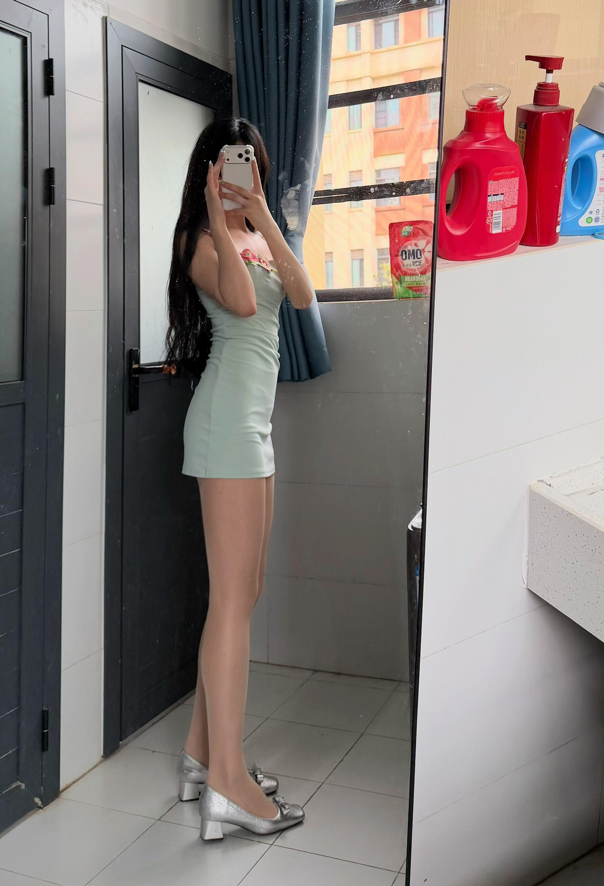
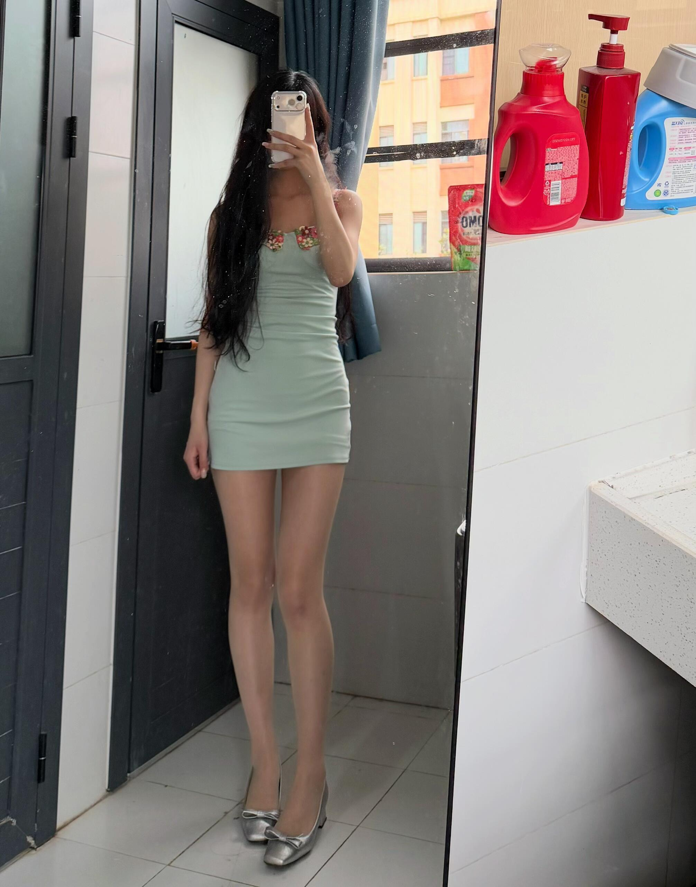
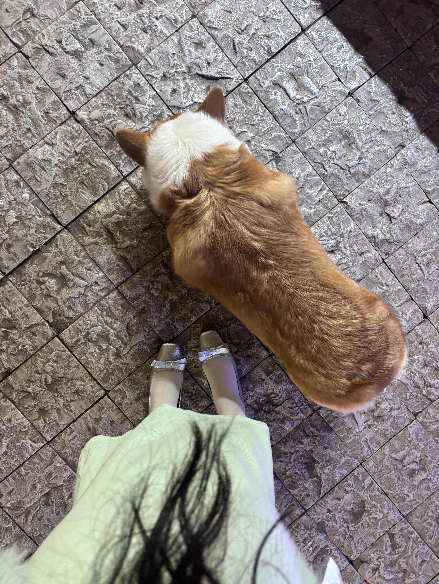
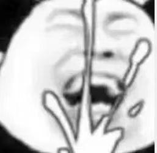

[toc]

# 问题

提问者：**<a href="https://www.zhihu.com/people/zhigpabnm">小刀</a>**
提问时间: 2026-4-27 14:2:26
总回答数: 117
总访问量: 751515

一直很好奇，丝袜其实算是很实用的穿搭单品，既能修饰腿型、遮盖肤色不均，秋冬还能保暖。

但现实里很多人穿丝袜容易显得廉价、刻意，甚至有点尴尬。

想问问大家：

1. 日常通勤、上学、逛街，黑丝/肉丝/灰丝分别该怎么选？

​

2. 普通身材怎么避开丝袜穿搭雷区？

​

3. 有没有简约耐看、不油腻的丝袜搭配思路？

单纯交流穿搭审美，理性讨论～

# 回答

回答者： **<a href="https://www.zhihu.com/people/pkpukdqg">星河</a>**
回答时间: 2026-7-17 11:38:7
点赞总数: 128
评论总数: 31
收藏总数: 136
喜欢总数：9

要穿出高级感还不违和，我认为主要靠身材以及自身的气质，我平时喜欢穿肉色和黑色的丝袜，我身高168体重105斤，经常去健身房练瑜伽，自认为身材还算可以，自拍了几张，大家看下上身效果怎么样

我有个闺蜜是个大象腿，每次穿丝袜都感觉有种油腻的违和感，名牌丝袜也有种廉价感，我都不好意思说她，女孩子还是要减减穿衣服才好看点

每次和闺蜜出门，闺蜜都说我有御姐范，一脸高冷，其实我是很温柔到女孩子的啦，每次遇到猫猫狗狗我都心疼，会去超市买火腿肠去喂，感觉那些流浪的猫猫狗狗好可怜

  

原文地址：[(星河)女生日常穿丝袜，怎样穿才高级不违和？](https://www.zhihu.com/question/2032097281751635280/answer/2061414379996942890) 

# 评论

1. <a href="https://www.zhihu.com/people/shen-hai-zhong-de-hai">梦鱼</a> (<small title="河北">2026-7-17 13:1:38</small>): 这么优秀的题主居然没人反应？
   - **星河** (<small title="山东">2026-7-17 14:2:53</small>): ［感谢］刚在和闺蜜在蜜雪冰城买奶茶🧋
   - <a href="https://www.zhihu.com/people/lu-se-chi-mi">燃烧</a> (<small title="陕西">2026-7-17 19:32:33</small>): 舔🐶
   - <a href="https://www.zhihu.com/people/wen-sen-feng">文森峰</a> (<small title="回复于 2026-7-20 11:11:10/辽宁"> ✉️:星河</small>): 能问一下你踩死过虫子吗
   - **星河** (<small title="回复于 2026-7-20 11:38:3/山东"> ✉️:文森峰</small>): 谁没踩过虫子蚂蚁，不过没故意踩过
2. <a href="https://www.zhihu.com/people/san-xun-lao-yi-80-77">香蕉你个芭乐</a> (<small title="陕西">2026-7-18 1:9:36</small>): 
   - <a href="https://www.zhihu.com/people/hua-shan-da-yan-mao">华山大眼猫</a> (<small title="广东">2026-7-21 9:24:25</small>): 不是，哥们［飙泪笑］
3. <a href="https://www.zhihu.com/people/bian-yi-85-67">尢仄</a> (<small title="河北">2026-7-21 0:8:45</small>): 肉丝好啊
4. <a href="https://www.zhihu.com/people/ll-zed-80">LL-zed</a> (<small title="湖北">2026-7-21 11:11:13</small>): 现在很好看，瘦到98斤把，这个体重最好看
   - **星河** (<small title="山东">2026-7-21 11:19:37</small>): 嗯呢［感谢］［感谢］
5. <a href="https://www.zhihu.com/people/jingfengvae-84">jingfengvae</a> (<small title="北京">2026-7-21 17:40:49</small>): 拉腿太明显了
6. <a href="https://www.zhihu.com/people/13-68-19-87-73">得吃得吃的</a> (<small title="黑龙江">2026-7-21 15:59:9</small>): 我想看 厚黑
7. <a href="https://www.zhihu.com/people/mo-wen-12-11">莫问</a> (<small title="湖南">2026-7-20 16:4:22</small>): 拉腿了
   - **星河** (<small title="山东">2026-7-20 23:13:43</small>): ［doge］
8. <a href="https://www.zhihu.com/people/yu-yu-gua-huan-29-34">热爱生活</a> (<small title="北京">2026-7-20 15:10:17</small>): 觉得流浪猫狗可怜为什么不带回去收养呢，而是选择临时投喂
   - **星河** (<small title="山东">2026-7-20 23:13:39</small>): 你怎么不收养呢［doge］
   - <a href="https://www.zhihu.com/people/zhou-qin-20-46-90">IT行业受害男</a> (<small title="回复于 2026-7-21 11:12:23/重庆"> ✉️:星河</small>): 投喂猫狗并不是爱心之举哦,反而是自私之举
   - **星河** (<small title="回复于 2026-7-21 11:19:54/山东"> ✉️:IT行业受害男</small>): 嗯哼
   - <a href="https://www.zhihu.com/people/yu-yu-gua-huan-29-34">热爱生活</a> (<small title="回复于 2026-7-21 17:44:4/北京"> ✉️:星河</small>): 我也没投喂流浪呀，再说，我收养了［发呆］
9. <a href="https://www.zhihu.com/people/li-fa-qiang-98">其乐融融</a> (<small title="山东">2026-7-20 16:43:3</small>): 老乡，咱能把拉腿特效关了吗？［拜托］
   - **星河** (<small title="山东">2026-7-20 23:13:52</small>): ［doge］
10. <a href="https://www.zhihu.com/people/45-46-95-92">天真以为</a> (<small title="北京">2026-7-20 20:21:4</small>): 脚多大
11. <a href="https://www.zhihu.com/people/gu-a-da-24">查无此人</a> (<small title="浙江">2026-7-20 8:54:19</small>): 感觉比一般的肤色丝袜还要亮一些，肤色YYDS［doge］
12. <a href="https://www.zhihu.com/people/xyh-91-68">不知名知乎用户</a> (<small title="北京">2026-7-17 19:6:28</small>): YYDS
    - **星河** (<small title="山东">2026-7-17 20:38:17</small>): 嗯呢，谢谢
13. <a href="https://www.zhihu.com/people/zhigpabnm">小刀</a> (<small title="江西">2026-7-17 21:5:28</small>): ［感谢］
14. <a href="https://www.zhihu.com/people/shino-37-10">无名</a> (<small title="辽宁">2026-7-17 22:8:28</small>): 姐姐太漂亮了
15. <a href="https://www.zhihu.com/people/iowdlk">知乎用户iOwDlK</a> (<small title="陕西">2026-7-17 13:53:23</small>): 有闲置吗 女王
    - <a href="https://www.zhihu.com/people/iowdlk">知乎用户iOwDlK</a> (<small title="回复于 2026-7-17 14:21:13/陕西"> ✉️:星河</small>): 求个私信可以吗
    - **星河** (<small title="山东">2026-7-17 14:2:59</small>): 没有呀

=[评论](./attachments/comments.json)

