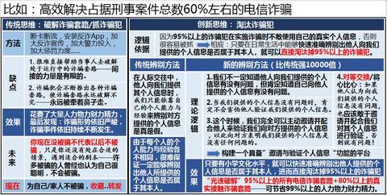

[toc]

# 问题

提问者：**<a href="https://www.zhihu.com/people/chen-xin-91-16">陈新</a>**
提问时间: 2025-3-11 12:36:52
总回答数: 1020
总访问量: 5911576

为什么感觉电诈怎么查都查不干净啊?

# 回答

回答者： **<a href="https://www.zhihu.com/people/yun-han-50">楚熳熠</a>**
回答时间: 2026-8-13 21:15:44
点赞总数: 1443
评论总数: 109
收藏总数: 249
喜欢总数：20

我一开始也觉得，区区电诈，剿灭不干净，对于现在的中国国力来说，是种侮辱，肯定是勾结。

然后看了一下明朝倭寇的问题。

还有最近又开始扫黑除恶了。

只能说，别把他们看成一个整体。

以及，高估了权力、执行力以及效率等。

电诈本质上就是倭寇问题在当代的重现。

明实录里有大量记载，死于此事上的中央、地方官员也不少。

皇帝基本上也是想剿灭的。

但是因为很多问题，基本上就是做不到。

明朝还经常有倭寇入侵内地，攻陷城池的记载。

现代相比明朝，已经能做到让相关事情尽量发生在国境之外，不得不说是种进步了。

明朝的东南沿海遇到的倭寇，类似于现在的云南。

日本变成了缅甸。

本质上都是手套。

印度，又是他们想要养寇自重的满清雏形。

明朝有成化犁庭，现代也有清理三非。

引进外人和清理外人的，并不是一个势力。

明朝有的问题，在现代基本上也会重现。

借助电诈，就能看清明朝的倭寇了。

  

原文地址：[(楚熳熠)为什么感觉电诈怎么查都查不干净啊?](https://www.zhihu.com/question/14661635845/answer/2071344214949074096) 

# 评论

1. <a href="https://www.zhihu.com/people/li-li-65-20-72">李李</a> (<small title="浙江">2026-8-14 9:44:46</small>): 历史上让他们吃到甜头了，而这些地方一直没有彻底革命过。
   - <a href="https://www.zhihu.com/people/lan-36-72">lan</a> (<small title="河南">2026-8-14 11:53:44</small>): 哪里
   - <a href="https://www.zhihu.com/people/he-xue-feng-38">山与海</a> (<small title="回复于 2026-8-14 11:57:25/江苏"> ✉️:lan</small>): 福建
   - <a href="https://www.zhihu.com/people/43-77-12-44-29">两个寄生虫族</a> (<small title="回复于 2026-8-14 12:1:22/广东"> ✉️:lan</small>): 浙闽赣科考舞弊案
   - <a href="https://www.zhihu.com/people/yang-shi-ping-2">老洪教你爱国</a> (<small title="回复于 2026-8-14 12:3:33/浙江"> ✉️:lan</small>): 北满
   - <a href="https://www.zhihu.com/people/wang-ji-qiong-94-8">新罗将军玉素甫</a> (<small title="北京">2026-8-14 12:58:46</small>): 应该派一个清乡工作队到电诈高发区基层开展工作
   - <a href="https://www.zhihu.com/people/wang-da-shuai-shuai-15">王大帅帅</a> (<small title="回复于 2026-8-14 13:36:37/山东"> ✉️:山与海</small>): 主要就是浙闽，历史上也是
2. <a href="https://www.zhihu.com/people/ta-shuo-jiao-you-yong">南山网友的霸气</a> (<small title="广东">2026-8-14 10:14:33</small>): 新办一张卡，号码谁都没说，第二天就有诈骗电话进来。［飙泪笑］
   - <a href="https://www.zhihu.com/people/ye-wu-feng-yu-ye-wu-qing-40-24">也无风雨也无晴</a> (<small title="江西">2026-8-14 11:25:5</small>): 看无间道，那个短信（有内鬼），电脑编辑，一键群发，全市都能收到。
   - <a href="https://www.zhihu.com/people/xxx-96-14-96">Xxx</a> (<small title="回复于 2026-8-14 11:40:47/江苏"> ✉️:也无风雨也无晴</small>): 这套方法根本不能用在批量诈骗上
   - <a href="https://www.zhihu.com/people/mrmkxf-35">哆啦B梦</a> (<small title="中国香港">2026-8-14 11:56:35</small>): 我把电信卡设置了屏蔽所有来电和短信，电信营销愣是给我移动号连续打了好几天电话，关键是我没给电信留过移动号码，就只提供了身份证
   - <a href="https://www.zhihu.com/people/lin-wen-jie-21-11">丝丝爱我</a> (<small title="广东">2026-8-14 12:4:25</small>): 我都好几年不接陌生电话了，外卖快递都是指定地点放那就行［飙泪笑］
   - <a href="https://www.zhihu.com/people/lin-wen-jie-21-11">丝丝爱我</a> (<small title="回复于 2026-8-14 12:5:26/广东"> ✉️:哆啦B梦</small>): 互通的，我联通号被我设置了不接电话也是会打我移动号过来推荐套餐［捂脸］
   - <a href="https://www.zhihu.com/people/zhong-gong-yao-wan-dan-liao">兵哥</a> (<small title="安徽">2026-8-14 12:29:51</small>): 你办卡电信公司知道
   - <a href="https://www.zhihu.com/people/25-63-85-40">疯狂的石头</a> (<small title="浙江">2026-8-14 14:3:4</small>): 批量打的，你以为是准对你吗
3. <a href="https://www.zhihu.com/people/wang-zhe-yi-jiu-24">皇帝炒饭</a> (<small title="上海">2026-8-14 11:21:59</small>): 实名制以后确实方便了很多，诈骗电话再也不是看运气了，全都私人订制
4. <a href="https://www.zhihu.com/people/wo-ai-bao-bao-po">我爱宝宝婆</a> (<small title="河北">2026-8-14 7:5:24</small>): 观点挺新奇 很不错
   - <a href="https://www.zhihu.com/people/shi-san-nan-hai-bu-er">耳语叮咛</a> (<small title="北京">2026-8-14 9:30:7</small>): 一直都在左右脑互博呢 敌对势力很强大
   - <a href="https://www.zhihu.com/people/ziv-97-52">Ziv</a> (<small title="回复于 2026-8-14 10:5:30/河北"> ✉️:耳语叮咛</small>): 绝大多数国家，甚至企业家庭，都不是一条心
   - <a href="https://www.zhihu.com/people/wu-ruo-mu-92">西山居她力量</a> (<small title="回复于 2026-8-14 10:34:53/江苏"> ✉️:Ziv</small>): 没办法，许多东西古今中外普遍存在并且可能一直存在
5. <a href="https://www.zhihu.com/people/qyjhyh">qyjhyh</a> (<small title="广东">2026-8-14 7:53:22</small>): 四五十公斤的电话卡
6. <a href="https://www.zhihu.com/people/32-89-13-64-24">西西无敌</a> (<small title="浙江">2026-8-14 8:58:41</small>): 洗钱和资金转移渠道加上以前的黑恶势力跑路去国外一起搞出来的。
7. <a href="https://www.zhihu.com/people/18569952267">每日一问</a> (<small title="河南">2026-8-14 10:37:50</small>): 明朝那些倭寇的身份到底是清一色的倭寇还是砸中倭寇呢［吃瓜］
   - <a href="https://www.zhihu.com/people/996test">996test</a> (<small title="广东">2026-8-14 11:35:16</small>): 倭寇头子确定就是代明海盗，而这个大海盗又和代明时期的沿海大族关系密切，查吧查吧［吃瓜］
   - <a href="https://www.zhihu.com/people/marsius">极地银河</a> (<small title="广东">2026-8-14 11:50:34</small>): 早期确实是日本人，后来是因为中国人把日本人给宰了自己当倭寇。
   - <a href="https://www.zhihu.com/people/qian-long-wu-yong-63-28">潜龙勿用</a> (<small title="广东">2026-8-14 12:40:11</small>): 哪怕是00年代的人教版历史书都承认倭寇是由日本的流浪武士以及东南沿海的走私商人组成的军事集团，春秋笔法的地方只在于没给你细讲他们各自的角色，主导方是谁，以及背后的推动力有哪些
   - <a href="https://www.zhihu.com/people/qing-dan-guo-ri-zi">momo</a> (<small title="四川">2026-8-14 13:6:44</small>): 倭寇只是出人出力的角色，背后真正出钱出脑子的角色另有其人
   - <a href="https://www.zhihu.com/people/donggehz">xxxxx</a> (<small title="广东">2026-8-14 14:13:6</small>): 挨刀的是倭寇，但是背后挣钱又不是它们。郑家不就是海盗然后投靠明朝的么，驻地在日本。
8. <a href="https://www.zhihu.com/people/gu-dan-de-li-mao">孤单的狸猫</a> (<small title="陕西">2026-8-14 10:4:18</small>): 拿古代套现代。古代是因为信息不流通，人往人群里一钻就变成良民了。现在你试试
   - **楚熳熠** (<small title="江苏">2026-8-14 10:8:27</small>): 现代比古代信息更不流通。这是 21 世纪初互联网刚刚兴起的时候，就有人说了。古代的信息不流通，是信息匮乏。现代的信息不流通，是信息太多，难以分辨。
   - <a href="https://www.zhihu.com/people/nelius">nelius</a> (<small title="回复于 2026-8-14 11:47:7/湖北"> ✉️:楚熳熠</small>): 看似现在信息流通，其实是有价值的信息对普通人来说还是信息壁垒。
   - <a href="https://www.zhihu.com/people/6-73-7-14">阿坤</a> (<small title="上海">2026-8-14 11:48:39</small>): 要学会信息过滤，互联网的信息壁垒是，放出的消息，不知道真假，不然也不会有网暴这一说了
   - <a href="https://www.zhihu.com/people/i-never-41">晴空万里</a> (<small title="湖南">2026-8-14 11:49:27</small>): 现在信息看似流通，实际上多少废物信息垃圾信息，有价值的信息一样是有壁垒门槛。
   - <a href="https://www.zhihu.com/people/rain-22-25">越王勾拳他爸</a> (<small title="回复于 2026-8-14 11:58:18/湖北"> ✉️:楚熳熠</small>): 这个 观点可以
 
信息太多 也是一种不流通 需要核对 验证
   - <a href="https://www.zhihu.com/people/qu-ge-sha-ming-92">元气书签</a> (<small title="北京">2026-8-14 13:20:31</small>): 两千年来，科技发展翻天覆地，而人性从未改变。  
 
倭寇和电诈，因为人性贪婪所以类似。  
 
科技发展只是把倭寇变成了电诈，改变个形式而已。
9. <a href="https://www.zhihu.com/people/ha-sa-ya-qi-56">哈萨雅琪</a> (<small title="广东">2026-8-14 11:1:15</small>): 重点是实名后信息泄露，电诈都是针对性 诈骗了。不然对方电话过来一开口就露馅怎么诈骗。而且信息泄露无处不在，包括政府部门登记信息泄露，办个营业执照，骗子比我先知道到结果
10. <a href="https://www.zhihu.com/people/wang-xiong-64-8">竹叶</a> (<small title="山东">2026-8-14 10:13:18</small>): 明朝皇帝永远不会知道自己收的辽饷有三成是被东林党安排晋商去养金融产品东北人参护卫私兵满洲八旗用的，另外七成辽饷是东林党安排人收买军头，铲除满洲八旗心头大患，然后等辽饷收到东林党的时候，东林党就安排人撮合收买到的军头和满洲八旗围杀他的。
11. <a href="https://www.zhihu.com/people/maikjing">maikjing</a> (<small title="山东">2026-8-14 7:36:52</small>): 确实都是差不多的情况，
12. <a href="https://www.zhihu.com/people/san-luo-6">san luo</a> (<small title="福建">2026-8-14 9:31:44</small>): 好角度
13. <a href="https://www.zhihu.com/people/gao-yuan-36-26">高原</a> (<small title="辽宁">2026-8-14 10:37:12</small>): 电诈电诈，没有电何来诈？从运营商入手源头治理。
14. <a href="https://www.zhihu.com/people/lu-jun-rong-62">hauilo</a> (<small title="广东">2026-8-14 11:44:35</small>): 万物皆有两面性，得接受光明与黑暗并存，不要什么都甩境外势力
15. <a href="https://www.zhihu.com/people/ye-mi-la-zhi-tan-xi">业余吃瓜人</a> (<small title="广东">2026-8-14 10:32:29</small>): 你要看过倭寇你应该明白那群所谓的倭寇都是国人
16. <a href="https://www.zhihu.com/people/qing-wu-da-rao-80-33">请勿打扰4</a> (<small title="北京">2026-8-14 12:17:16</small>): 说的挺好的，绞不干净是因为关联太深。
17. <a href="https://www.zhihu.com/people/hchxyf">hchxyf</a> (<small title="江苏">2026-8-14 10:45:1</small>): 不能不剿，不能全剿
18. <a href="https://www.zhihu.com/people/7-36-11-13-96">不同观点</a> (<small title="重庆">2026-8-14 12:45:17</small>): 非要把简单的问题复杂化。  
 
  
 
  
 
不就是国内扫黑除恶，打击犯罪把这些搞黑厂产的人吓跑出去了吗？  
 
  
 
而主要市场又在中国，自然不会跑去太远的地方。  
 
  
 
这叫做高效供应链。
19. <a href="https://www.zhihu.com/people/ly18888">ly18888</a> (<small title="重庆">2026-8-14 11:33:5</small>): 对，不要把他们看成一个整体，分开观察。
20. <a href="https://www.zhihu.com/people/lishen226">锋行</a> (<small title="辽宁">2026-8-14 10:40:32</small>): 美国国力如何？不也搞不定？这事儿跟国力就没啥关系，总有办法钻空子
21. <a href="https://www.zhihu.com/people/shui-mian-zhi-xia">塞里斯之风</a> (<small title="福建">2026-8-14 9:12:51</small>): 你办一张卡又是按手印又是人脸识别登记又要签名，人家搞电诈的一抄就是40多公斤电话卡［捂脸］你觉得问题出在哪呢［捂脸］
    - <a href="https://www.zhihu.com/people/qnwang-68">qnwang</a> (<small title="北京">2026-8-14 9:54:21</small>): 电话这种上个世纪的技术它到处都是漏洞，电话卡就是一种信号处理的芯片，你掌握了算法是台电脑都能干这点事，例如苹果的虚拟电话卡，还有网络电话。偏巧电话这种通讯工具它的编解码算法是公开的，要不你怎么能从中国跨好几个运营商打电话到美国呢
 
  
 
电诈这个问题其实非常好解决，废掉电话全员改用微信、QQ就行了
    - <a href="https://www.zhihu.com/people/ji-ce-37">计策</a> (<small title="回复于 2026-8-14 10:16:6/广东"> ✉️:qnwang</small>): 你怕不知道现在网络诈骗比较集中的聊天工具就是微信和QQ？
    - <a href="https://www.zhihu.com/people/1461825184648">田鸡</a> (<small title="回复于 2026-8-14 10:40:55/上海"> ✉️:qnwang</small>): 重点是信息［捂脸］
 
我给你一个联系方式，你连这个人叫什么都不知道，啥信息没有，你怎么诈骗？
 
你好，张先生；不好，我不姓张  
 
你父亲出车祸了，现在要交钱；我父亲前些年就去世了
 
这边是学信网的，您的学信网信息有误，需要配合更改；我高中都没毕业，这玩意儿跟我有关系？
 
  
 
所以到底是什么让别人通过你的手机就能查到你的人，就能查到你的多方面信息就显而易见了。
    - <a href="https://www.zhihu.com/people/chang-he-luo-ri-87">长河落日</a> (<small title="回复于 2026-8-14 11:29:5/浙江"> ✉️:田鸡</small>): HR，中介手里全是个人信息，而且你不会以为搞诈骗必须知道个人信息吧？
    - <a href="https://www.zhihu.com/people/wzy-25-64">Wzy</a> (<small title="回复于 2026-8-14 11:49:11/陕西"> ✉️:田鸡</small>): 不需要知道任何信息，哪怕你不姓张总有姓张的，人家一次就给一百万一千万人发同一条消息总有一两个上当的。
    - <a href="https://www.zhihu.com/people/a-xian-95-40">阿贤</a> (<small title="回复于 2026-8-14 12:8:16/贵州"> ✉️:计策</small>): 现在又不喊保护隐私了？
    - <a href="https://www.zhihu.com/people/stella200707">文小护说</a> (<small title="上海">2026-8-14 13:6:56</small>): 有部小说里写就是三家公司卖的，他们还拎得清有级别的公务员的号是不会卖的，所以有级别的公务员是体会不到骚扰电话的。
    - <a href="https://www.zhihu.com/people/gao-le-16-71">小皮球</a> (<small title="回复于 2026-8-14 13:18:30/辽宁"> ✉️:田鸡</small>): 没有你信息就不能诈骗了么
    - <a href="https://www.zhihu.com/people/li-wu-63-32">火火兔的程序之路</a> (<small title="回复于 2026-8-14 13:32:53/江西"> ✉️:田鸡</small>): 提出问题很容易！麻烦问下！怎么解决你的信息不被泄露出去！
    - <a href="https://www.zhihu.com/people/lu-man-19-72">路漫</a> (<small title="回复于 2026-8-14 13:38:58/浙江"> ✉️:qnwang</small>): 没有三大运营商点头，电诈敢偷三大运营商的资料干，最多3天电诈园区的幕后老大就在国内某个监狱里打螺丝。
    - <a href="https://www.zhihu.com/people/wu-zhi-50-43-99">腻歪</a> (<small title="湖南">2026-8-14 14:10:57</small>): 你办理手机号码，一般会有个副卡，只要你不说，门店工作人员就不会把副卡给你，并从后台隐藏显示，然后把副卡卖给电诈人员。还有就是各种酒店座机转外呼系统。非零即一思维是不行的，上头想打掉，不代表下面的想啊，总有贪钱的，近两年严厉打击的帮信罪，不就是一棒子为了几百块吧自己银行卡借给朋友啥的，结果洗钱一下进去了
    - <a href="https://www.zhihu.com/people/hu-po-su-ming">琥珀苏明</a> (<small title="安徽">2026-8-14 14:11:30</small>): 都是虚拟卡了，没有重量［飙泪笑］
22. <a href="https://www.zhihu.com/people/delete-5-23">Delete</a> (<small title="广东">2026-8-14 9:0:19</small>): 并非做不到，只是性价比不高，而且倭寇的存在也有利于团结。
23. <a href="https://www.zhihu.com/people/liu-zhi-18-72">彰武路雷神</a> (<small title="上海">2026-8-14 12:7:47</small>): 有意思的观点
24. <a href="https://www.zhihu.com/people/qing-dan-guo-ri-zi">momo</a> (<small title="四川">2026-8-14 13:7:41</small>): ［赞同］
25. <a href="https://www.zhihu.com/people/guo-ling-feng-76-80">无忧</a> (<small title="河南">2026-8-14 14:7:52</small>): 其实根治很简单，所有被骗的资金不管最终流向哪里流向那些企业不管国企私企外企全部要退还受害者并且罚款收款企业，现在诈骗款项大部分都流入了水电力，通信，银行，房地产，新能源，互联网公司，这些公司没法查也没人敢查，导致只要款到了这些账户就无法被追回
26. <a href="https://www.zhihu.com/people/wen-feng-sang-dan-de-nong-min">闻风丧胆的农民</a> (<small title="四川">2026-8-14 13:48:29</small>): 买了房子，立马就有装修电话打进来了，还有冒充退税的诈骗电话，去医院生了小孩，就有奶粉推销还有独生子女退费的诈骗电话打进来。
27. <a href="https://www.zhihu.com/people/li-bo-20-64-77">个个</a> (<small title="陕西">2026-8-14 12:18:48</small>): 本质就是利益不一致，别人捞到好处比损失的更多，就肯定有动力打掩护
28. <a href="https://www.zhihu.com/people/wo-tuo-qi-ni-de-fen-mu-6-25">梦醒已是女儿身</a> (<small title="广东">2026-8-14 12:51:51</small>): 太过偷懒了，阴谋论，简单归因，套用历史，对解决实际问题没有帮助。
29. <a href="https://www.zhihu.com/people/liu-lang-de-ji-feng-9">流浪的疾风</a> (<small title="江苏">2026-8-14 10:56:13</small>): 北京的卡会接到诈骗电话吗？那我去北京办卡
    - <a href="https://www.zhihu.com/people/da-pang-hui-88">大胖灰</a> (<small title="北京">2026-8-14 11:56:21</small>): 有，但不多。
    - <a href="https://www.zhihu.com/people/huan-hao-huan-hao-ha-99">野钓空军只是爱好</a> (<small title="北京">2026-8-14 13:27:36</small>): 现在也很多，咋骗电话都是全国各地的号码
30. <a href="https://www.zhihu.com/people/kkkk-33-9">kkkk</a> (<small title="湖北">2026-8-14 9:10:42</small>): ［感谢］［感谢］
31. <a href="https://www.zhihu.com/people/jjl166">jjl166</a> (<small title="福建">2026-8-14 10:48:34</small>): 这个贴切，电诈果然跟明朝的倭寇一样
32. <a href="https://www.zhihu.com/people/xiong-zheng-22">楚君</a> (<small title="湖北">2026-8-14 9:31:30</small>): 人只要超过一个，就不可能完全一条心
33. <a href="https://www.zhihu.com/people/yao-ya-qing-88">丶命</a> (<small title="安徽">2026-8-14 9:32:21</small>): 有点深奥
34. <a href="https://www.zhihu.com/people/liu-jian-jun-50-20">无法识别的字符</a> (<small title="广东">2026-8-14 13:0:42</small>): 佛伯乐抓了个电闸的，发现他们给咋嫩送礼的账本，猜猜写了啥［赞同］
35. <a href="https://www.zhihu.com/people/nu-tao-56-25">駑濤</a> (<small title="广东">2026-8-14 12:14:24</small>): 进步了［思考］
36. <a href="https://www.zhihu.com/people/yipeng-huang-sha">一捧黄沙</a> (<small title="河南">2026-8-14 13:16:9</small>): 以史为鉴，可以知兴替。
37. <a href="https://www.zhihu.com/people/da-nei-jin-yi-wei-46">大内仅一位</a> (<small title="福建">2026-8-14 11:44:57</small>): 那就是说，军力不行喽
38. <a href="https://www.zhihu.com/people/26-12-62-55">马马虎虎</a> (<small title="辽宁">2026-8-14 10:46:33</small>): 有这些次要矛盾吸引注意力是好事［酷］
39. <a href="https://www.zhihu.com/people/mi-yi-ye">妄为</a> (<small title="广西">2026-8-14 11:51:34</small>): 什么花里胡哨的，就是利润高，贩毒的风险那么大，要跑到国内，被抓了还要吃花生米，做的人都那么多，电诈在外面动动嘴皮子的事，根本不怕被抓，风险那么低利润比贩毒还高，贩毒能动动嘴皮子赚几十上百万？
    - <a href="https://www.zhihu.com/people/mi-yi-ye">妄为</a> (<small title="广西">2026-8-14 11:54:1</small>): 还有，现在对电诈的打击那么大，你但凡收到黑款就封账户，做手机kou上午做下午按头，但是抵不住网上一堆人卖号卖卡的，随随便便都能低价买各种账户，你能怎么办？
    - <a href="https://www.zhihu.com/people/96-22-98-5">知乎用户乾</a> (<small title="回复于 2026-8-14 12:22:54/北京"> ✉️:妄为</small>): 你连楼主说的什么都听不明白
    - <a href="https://www.zhihu.com/people/mi-yi-ye">妄为</a> (<small title="回复于 2026-8-14 14:17:1/广西"> ✉️:知乎用户乾</small>): 那你说他想说什么
40. <a href="https://www.zhihu.com/people/55-23-36-95-28">呵呵</a> (<small title="福建">2026-8-14 11:0:30</small>): 引进外人那波人是为什么［打招呼］
41. <a href="https://www.zhihu.com/people/zhou-da-shuai-14">汉族是主体民族</a> (<small title="四川">2026-8-14 11:44:32</small>): 那满清时期有没有倭寇呢，有点好奇［思考］
    - <a href="https://www.zhihu.com/people/27-75-3-88-47">老田</a> (<small title="湖北">2026-8-14 12:3:0</small>): 没有。因为有跟汉民搞种族隔离的八旗驻军
    - <a href="https://www.zhihu.com/people/xiao-qiao-liu-shui-32-26-82">小桥流水</a> (<small title="广东">2026-8-14 14:4:48</small>): 满清入关，倭寇就有入股在里面
42. <a href="https://www.zhihu.com/people/69-41-14-49">渐酒空金榼</a> (<small title="山东">2026-8-14 13:29:5</small>): 你在说什么？我们超级大国一小时收复台湾，你说我们奈何不了电诈？把我的无人机机器狗叫来。
43. <a href="https://www.zhihu.com/people/li-jin-qiang-40">不吃烤地瓜</a> (<small title="辽宁">2026-8-14 12:12:28</small>): 腾讯知道吧，私营企业吧，里面的QQ和vx互相都不对付，经常互相拆台
44. <a href="https://www.zhihu.com/people/vam-68">陈皮糖</a> (<small title="湖北">2026-8-14 11:49:40</small>): 电诈不平，何以平台湾
45. <a href="https://www.zhihu.com/people/Strike.Back">Strike Back</a> (<small title="江苏">2026-8-14 13:7:22</small>): ［赞］
 
多看历史,心如明镜
46. <a href="https://www.zhihu.com/people/18688731248">蚂蚁螃蟹风雨电</a> (<small title="江苏">2026-8-14 13:0:24</small>): 这些还是法律外的，现在好多触碰红线的，入某SW智慧房东，点进去就是一个保险的登录菜单，如果不仔细看，还以为是这个APP的操作，一路操作下去，后面怎么又要填身份证什么的，仔细一看，原来是保险。这样子的还有很多，如搜社保APP，很多APP看起来很像官方的，你下载点进去，是联通某根本没有使用效果的某定制功能，只要注册了，就从联通手机卡扣钱，我着了一次道。还有某保险，发信息你不点击退订，就敢大摇大摆的在银行卡扣钱，不知道是怎么搞到我的信息，也没有我签字同意。
47. <a href="https://www.zhihu.com/people/sirius-1-79">Sirius</a> (<small title="山西">2026-8-14 12:24:36</small>): [@Severus](http://www.zhihu.com/people/e99d1d8a3a8c4dfc239787a8179a6faf)
48. <a href="https://www.zhihu.com/people/28-46-21-48-12">阿司匹林</a> (<small title="广东">2026-8-14 13:54:56</small>): 赔钱的买卖没人干，杀头的买卖有人干
49. <a href="https://www.zhihu.com/people/13891984225">aaabbb</a> (<small title="陕西">2026-8-14 13:40:9</small>): 诈骗明明是国内发生的，怎么是国外。以前倭寇进来抢劫，现在诈骗电话全国点名
50. <a href="https://www.zhihu.com/people/dao-dao-zhai-1990-98">刀刀斋1990</a> (<small title="浙江">2026-8-14 13:13:30</small>): ［捂脸］［捂脸］广州的倭患因为戚继光被北调去防务俺答入寇，延迟了好几十年才被凌云翼平定
51. <a href="https://www.zhihu.com/people/gu-yue-tian-65">会飞的导弹</a> (<small title="浙江">2026-8-14 13:12:33</small>): 其实这种东西，未来只要有个人的专属高级AI就会彻底解决，因为高级AI会全面接管你的生活，就算有信息进来也会优先要求核实真实性，得到你的授权才会进行另外的操作。
52. <a href="https://www.zhihu.com/people/20-13-85-14">呀屎了雷</a> (<small title="江苏">2026-8-14 10:59:38</small>): 这个角度挺新奇
53. <a href="https://www.zhihu.com/people/75-22-73-83">森林</a> (<small title="浙江">2026-8-14 13:23:11</small>): 我被电诈过，所以劝大家不认识的电话不要接，现在都微信联系了嘛
54. <a href="https://www.zhihu.com/people/kowloon">Kowloon</a> (<small title="上海">2026-8-14 11:16:19</small>): 因为想赚大钱的人太多了。
55. <a href="https://www.zhihu.com/people/16-84-71-93">潘潘达</a> (<small title="山西">2026-8-14 8:26:49</small>): ［感谢］
56. <a href="https://www.zhihu.com/people/90-84-8-36">迷途小书童</a> (<small title="广东">2026-8-14 12:58:32</small>): 解决诈骗问题的突破点：95%以上的骗子在进行诈骗时不敢使用自己的真实个人信息。  
 
因此，只要我们在日常生活中能够快速辨别他人提供的个人信息是否属于其本人，就可以避免绝大多数诈骗套路。[https://zhuanlan.zhihu.com/p/10327899627?utm\_psn=1896181192824435852](https://zhuanlan.zhihu.com/p/10327899627?utm_psn=1896181192824435852)
57. <a href="https://www.zhihu.com/people/2025-58-96">测试2025</a> (<small title="广西">2026-8-14 11:29:57</small>): 一看还真是，不然一堆人赶着去印度送干嘛
58. <a href="https://www.zhihu.com/people/89-91-46-61-18">鳄霸</a> (<small title="江西">2026-8-14 13:23:54</small>): 如何看待福建男子勾结江西多名警员，借国家反诈平台倒卖公民银行账户信息牟利？
59. <a href="https://www.zhihu.com/people/89-14-77-43">担月</a> (<small title="山东">2026-8-14 12:39:33</small>): 偷换概念
60. <a href="https://www.zhihu.com/people/wmysdu">wmysdu</a> (<small title="浙江">2026-8-14 13:29:42</small>): 毫无逻辑，两个完全两码事的硬拉一起比较，这思维有了
61. <a href="https://www.zhihu.com/people/71-37-43-42">唯雨销魂</a> (<small title="内蒙古">2026-8-14 12:10:28</small>): 脑回路清奇，建议纳入宣传部门。
62. <a href="https://www.zhihu.com/people/momo-63-76-78-85">momo</a> (<small title="上海">2026-8-13 21:28:4</small>): ［捂嘴］［捂嘴］［捂嘴］
63. <a href="https://www.zhihu.com/people/piao-bai-81-55">Digi星球</a> (<small title="福建">2026-8-14 13:18:30</small>): 现在的中国国力来说，是种侮辱，肯定是勾结 ，这不是搞笑吗，电诈不就是骗吗，这个世界上能禁止骗子吗，电诈没了，没有传销吗，没有P2P吗，保健品是骗吗，美国国力更强，电诈消失了吗

=[评论](./attachments/comments.json)

