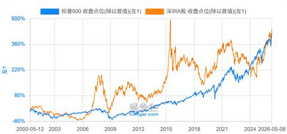

[toc]

# 问题

提问者：**<a href="https://www.zhihu.com/people/shan-mu-yin-o">鱿鱼须</a>**
提问时间: 2026-6-12 8:27:3
总回答数: 506
总访问量: 3380938

我问过我爸一个问题，我问他，你知道标普500吗？他想了很久，说不知道，我又问他，你年轻的时候，有没有人跟你聊过投资？他说没有。

# 回答

回答者： **<a href="https://www.zhihu.com/people/1-50-55-98">燃点</a>**
回答时间: 2026-8-7 20:0:39
点赞总数: 1393
评论总数: 102
收藏总数: 407
喜欢总数：110

小伙子，不要那么傲慢。

假如，你现在20岁，那么20年前，有一个贵人（假设这个贵人的名字是张良），告诉了你的父亲，标普500是什么。

而你的父亲也不是一般人，你的父亲姓刘，排行第三。拥有阔达的性格。后来贵人张良评价你的父亲天赋很好。

既然你的父亲天赋很好，那么他听到标普500，他一下子就听懂了。

于是，他决定购买标普500.

但那时候是2006年。2006年4月，中国刚刚推出银行QDII，但最初允许银行拿居民人民币去投的主要是 **境外固定收益产品** 。监管文件当时明确，银行代客境外理财不能直接投资境外股票；一直到2007年5月才放宽，而且最初投资境外股票的银行理财，单一客户起点还是  **30万元人民币** 。

你的父亲根本没有资格投资。

但你的父亲不是一般人，他没有失去信心。因为他的投资天赋一流。

转机发生在第二年。证监会在  **2007年6月** 正式启动证券经营机构QDII试点；大众后来熟悉的华夏全球精选，是2007年9月发行、10月成立。

你的父亲看到这个全球精选也有标普500的影子，虽然吃不到标普500，但吃点风味的也是好的。

于是，你的父亲开始定投华夏全球精选，结果呢？到今天为止，这个基金的总收益是37%。

___

当然，你的父亲很有天赋，所以，他并没有吊死在这棵树上。

博时标普500ETF——一个真正的标普500宽基指数，成立于  **2013年12月5日** 。

你的父亲立刻换仓到这个基金，并且从来没有卖出过。

那么他获得了489%的收益！（接近5倍！）（年化 15%，人称中国小巴菲特

___

但故事还没有结束，你有个叔叔，日子过得浑浑噩噩的。

他06年刚结婚，被父母逼着买房，叔叔为人好面子，一定要在上海买房，他还啃老，借空了6个钱包。

2006 年 6 月 1 日起，商业性个人住房贷款原则上最低首付  **30%** ；但购买  **90㎡以下自住房** ，最低首付仍可以是  **20%** 。也就是说，符合条件的小户型理论最高贷款成数是  **80%** 。

06年到26年，上海的房价涨了7倍，他又贷款80%，相当于5倍杠杆。那么他的收益是：35倍！

远远超过了你的父亲。

为什么呢？因为 他获得了一种你父亲买标普500时根本得不到的东西——长期、低成本、几乎不会因为价格下跌而被强制平仓的5倍杠杆。

___

年轻人，现在轮到你了。

你当然可以笑你的父亲不懂标普500。

也可以笑你的叔叔没有投资理念，只知道借钱买房。

可是二十年后，你的孩子也会坐在你面前。

他会打开一张2026—2046年的走势图，然后问你：

 **“爸，这么明显的机会，你当年为什么没有买？”** 

到那个时候，你准备怎么回答？

你会告诉他：

我买了标普500。

我买了纳斯达克。

我买了人工智能。

我买了区块链。

还是你会发现——

 **2046年真正改变世界的那个东西，今天甚至还没有名字？** 

所以投资真正困难的地方，从来不是看懂过去。

看懂过去，人人都是巴菲特。

真正困难的是：

 **在你不知道答案的时候，拿真金白银做选择。** 

2006年的父辈如此。

2026年的你，也一样。

  

原文地址：[(燃点)为什么爸妈那一代从来没人告诉他们标普500？](https://www.zhihu.com/question/2048682720256177684/answer/2069150992051050117) 

# 评论

1. <a href="https://www.zhihu.com/people/29-54-46-48">金石开</a> (<small title="陕西">2026-8-8 11:52:37</small>): 买房是一般人少有的满杠杆机会了  
 
  
 
经济上行期的房子可不熟美股牛市哈哈  
 
  
 
可惜房子牛市结束了
   - <a href="https://www.zhihu.com/people/yi-hong-xi-bei-97">一泓喜悲</a> (<small title="广东">2026-8-8 18:21:19</small>): 房子有门槛啊，又是限购还要社保年限啥的
   - <a href="https://www.zhihu.com/people/fei-xiang-zhi-yuan-zhe-1307">飞翔志愿者1307</a> (<small title="回复于 2026-8-8 20:51:26/重庆"> ✉️:一泓喜悲</small>): 买房都不会搞的话 投资更是一坨
   - <a href="https://www.zhihu.com/people/xxx-74-53-9">xxx</a> (<small title="回复于 2026-8-8 20:58:55/上海"> ✉️:一泓喜悲</small>): 你感觉这你都解决不了，去投资更难发财，当时为了炒房，深圳那边能集资买房(没记错叫深房理)，更有经营贷去炒的
   - <a href="https://www.zhihu.com/people/29-54-46-48">金石开</a> (<small title="回复于 2026-8-8 23:12:15/陕西"> ✉️:一泓喜悲</small>): 这不是最容易的吗？中介早准备好了一群可以随时结婚的叔叔阿姨啊，这算什么门槛？
   - <a href="https://www.zhihu.com/people/Grand-Warden">罗杰</a> (<small title="回复于 2026-8-10 9:20:50/浙江"> ✉️:一泓喜悲</small>): 这是最简单的
2. <a href="https://www.zhihu.com/people/wu-zong-hui-41">starry</a> (<small title="上海">2026-8-8 10:13:16</small>): 2006年买毛qdii，线上就能开境外券商，管的又不严
   - <a href="https://www.zhihu.com/people/rodneyxp2002">迅疾</a> (<small title="四川">2026-8-8 15:38:59</small>): 据说十年前，内地银行都还可以直接给外国券商汇款。
   - <a href="https://www.zhihu.com/people/hai-shi-dao-zhao-de-tian-70-20">就差一个程序员</a> (<small title="回复于 2026-8-8 16:30:31/湖北"> ✉️:迅疾</small>): 不用据说，就是。我17年在线开的券商，直接在内地往里面汇的款，当时只道是平常
   - <a href="https://www.zhihu.com/people/xiao-xiao-liao-liao-37">小小廖廖</a> (<small title="回复于 2026-8-8 21:23:46/广西"> ✉️:迅疾</small>): 那会支付宝上就能买BTC
   - <a href="https://www.zhihu.com/people/ming-mei-de-you-shang-55-59">去城市化专家</a> (<small title="广东">2026-8-10 10:3:8</small>): 15年之前外汇都是自由流动的吧［吃瓜］
3. <a href="https://www.zhihu.com/people/89-97-62-91">看山不是山</a> (<small title="上海">2026-8-8 12:7:16</small>): 10年的波动在眼前就是一条线段，但是其中每一个下滑波动其实都是煎熬，2000年初我们家在上海中环1万出头买了一套117的，第二年就跌到8000，那时候一堆温州老乡亏本卖的，后来涨到1万多也有老乡卖了。过了近15年，我们涨到7万8卖了，后来最高到9万，现在又跌到7了，我还有亲戚住着呢，以后跌到5万也不是没可能，他们回报率怎么算？  
 
  
 
回头看你觉得距离巅峰快10倍涨幅，其实没人能高抛低吸全吃进利润的。房子是这样，其他投资也差不多。
   - <a href="https://www.zhihu.com/people/89-97-62-91">看山不是山</a> (<small title="回复于 2026-8-9 13:19:6/浙江"> ✉️:neverhood</small>): 有利有弊吧，因为流动性和手续费太高，让买房的散户不会想着每天做T［酷］，反而变成长期投资了。
   - <a href="https://www.zhihu.com/people/zhi-hu-ta-die-53">neverhood</a> (<small title="美国">2026-8-9 0:56:32</small>): 买房的特点是不能随时加仓，sp500我今天拿到工资就可以加一点...
4. <a href="https://www.zhihu.com/people/19-83-3-44-77">江原道三清</a> (<small title="山东">2026-8-7 23:24:1</small>): 
   - <a href="https://www.zhihu.com/people/qiu-yu-chen-8">普罗修卡</a> (<small title="上海">2026-8-8 0:30:0</small>): 标普的优势是曲线平滑A股大起大落，根本拿不住的
   - <a href="https://www.zhihu.com/people/19-83-3-44-77">江原道三清</a> (<small title="回复于 2026-8-8 1:46:48/山东"> ✉️:普罗修卡</small>): 00年代A股涨美股横盘，10 年代以来美股涨A股横盘
   - <a href="https://www.zhihu.com/people/adrian1019">Adrian</a> (<small title="回复于 2026-8-8 9:24:41/上海"> ✉️:普罗修卡</small>): 拿不住A股的人，美股照样拿不住，现在不就一堆七月末精准逃底纳指的人在哭天抢地，甚至连黄金他们都能挂在1300上
   - <a href="https://www.zhihu.com/people/ling-luan-57-10-2">曦禾</a> (<small title="北京">2026-8-8 13:17:53</small>): 这夏普比率上天了
   - <a href="https://www.zhihu.com/people/19-83-3-44-77">江原道三清</a> (<small title="回复于 2026-8-8 14:30:47/山东"> ✉️:Adrian</small>): A股不太适合拿住，包括经济上行期
   - <a href="https://www.zhihu.com/people/alexmercer-20-59">AlexMercer</a> (<small title="回复于 2026-8-8 15:27:59/江苏"> ✉️:江原道三清</small>): 缅a才几年？00以前才几个股［思考］
   - <a href="https://www.zhihu.com/people/mao-yang-47">sasion</a> (<small title="广东">2026-8-8 17:44:28</small>): 投资不仅要看收益还要看波动，波动太大性价比低，有几个人买在低点？
   - <a href="https://www.zhihu.com/people/yang-zheng-li-75">陆仁亿</a> (<small title="北京">2026-8-9 22:29:33</small>): 你这个图不对，实际上2000年到现在标普翻了5倍，深成指3倍出头［doge］
   - <a href="https://www.zhihu.com/people/19-83-3-44-77">江原道三清</a> (<small title="回复于 2026-8-10 0:18:13/山东"> ✉️:陆仁亿</small>): 这是深综指［飙泪笑］
   - <a href="https://www.zhihu.com/people/ma-se-er-31-43">茶小萨</a> (<small title="广西">2026-8-10 8:23:37</small>): 发这种有啥用呢？你中途上了这么高的高峰，现在再也没回去了，就说明你在山顶上挂了无数人
   - <a href="https://www.zhihu.com/people/cha-wu-ci-ren-17-51-42">查无此人</a> (<small title="回复于 2026-8-10 9:17:9/山东"> ✉️:茶小萨</small>): 换句话说就是超额收益拉满
   - <a href="https://www.zhihu.com/people/19-83-3-44-77">江原道三清</a> (<small title="回复于 2026-8-10 9:26:20/山东"> ✉️:茶小萨</small>): 发这种是说哪怕是底部，00年A股大幅跑赢美股；10年代以来美股大幅跑赢A股
5. <a href="https://www.zhihu.com/people/83-77-44-53-6">急急国王的毛毛</a> (<small title="广东">2026-8-8 23:28:14</small>): 题主还是个年轻人，也就知道个标普500，13年刷刷知乎，买点btc，拿到现在，到哪都是巨鳄
   - **燃点** (<small title="江苏">2026-8-9 11:13:3</small>): 我10年就知道比特币了，但我现在还是个穷逼，只能每天夜里扇自己两个巴掌
   - <a href="https://www.zhihu.com/people/pao-pao-bu">跑跑步</a> (<small title="北京">2026-8-9 14:53:53</small>): 你拿了多少呀
6. <a href="https://www.zhihu.com/people/huo-ling-huo-er">羽光</a> (<small title="广东">2026-8-8 15:9:27</small>): 写得很好，少见的非常独特的观点。  
 
我想起了在几年前，我和一位朋友坐在椅子上聊天，思考未来几年市场流行什么，我俩聊了很久也聊不出个所以然。  
 
谁能想到AI突然就来了。  
 
那时A股一路下跌，跌到2700点，我都没卖出手上的基金，所以后来大涨确实赚了点小钱。  
 
在这里，我也借花献佛分享一下我个人的观点。  
 
就说科技泡沫，6月知乎上也有很多大佬说卖吧，赶紧卖，泡沫很严重了。  
 
于是六月听了这些大佬的分析和建议，我就清仓了一大半。  
 
我定投纳指基金，也是这两年慢慢学的，大佬们分享的越多，学的也就能更具体些。  
 
所以我想分享的是，对普通人而言，啥都不会，啥都不知道的阶段，先赚点小钱，慢慢积累经验，一边学习，再扩大自己的认知，赚的更多一点。  
 
［抱抱］
   - <a href="https://www.zhihu.com/people/90-65-73-92">虞于鱼</a> (<small title="回复于 2026-8-9 12:3:14/山西"> ✉️:燃点</small>): 只要不卖就不亏本
   - **燃点** (<small title="江苏">2026-8-9 11:13:41</small>): 最重要的是不能亏本［害羞］
7. <a href="https://www.zhihu.com/people/18-88-44-21">夏天的风</a> (<small title="湖北">2026-8-8 9:10:6</small>): 有100万，200万的时候，我跟你是一样的。当有100 200的亿时候，稳定大于一切。
8. <a href="https://www.zhihu.com/people/jing-88-90">jing</a> (<small title="上海">2026-8-8 9:17:5</small>): 送出一个礼物～
   - **燃点** (<small title="江苏">2026-8-9 11:13:54</small>): 谢谢大佬［爱］
9. <a href="https://www.zhihu.com/people/fu-sheng-ruo-meng-44-44-80">幼稚的孩子</a> (<small title="天津">2026-8-8 12:23:20</small>): 永远不要以后来者的视野来蔑视过去人，我们在那个时代也会做出一样的选择。
10. <a href="https://www.zhihu.com/people/ming-zi-zen-yao-qi-79">名字怎么起</a> (<small title="美国">2026-8-8 10:22:24</small>): 答主是叔叔还是那个老父亲？
    - <a href="https://www.zhihu.com/people/pao-pao-bu">跑跑步</a> (<small title="北京">2026-8-9 14:55:41</small>): 一线城市大多数都是那个叔叔
    - <a href="https://www.zhihu.com/people/ming-zi-zen-yao-qi-79">名字怎么起</a> (<small title="回复于 2026-8-9 15:36:53/美国"> ✉️:跑跑步</small>): 叔叔好！
11. <a href="https://www.zhihu.com/people/cheng-jun-48-53">妙手空空</a> (<small title="广东">2026-8-8 17:23:3</small>): 段永平说的看懂未来十年，既不简单也不容易！
12. <a href="https://www.zhihu.com/people/han-si-yuan-46-13">相关部门</a> (<small title="河北">2026-8-9 15:47:22</small>): 看未来远不如看过去那样清晰——高植物［思考］［思考］［思考］
13. <a href="https://www.zhihu.com/people/72-67-33-63">月牙儿</a> (<small title="山西">2026-8-8 11:51:47</small>): 可以永远相信黄金！不说大赚吧，保底没问题
    - <a href="https://www.zhihu.com/people/wang-jie-77-20-17">王杰</a> (<small title="上海">2026-8-8 12:14:23</small>): 信黄金的我真是不明白，黄金短期波动极大，高于标普500；长期又跑不过标普500，最多是做点地缘政治的对冲，但是这对于非专业玩家也没有必要啊
    - <a href="https://www.zhihu.com/people/sqh9kx">憧憬成为恐虐冠军</a> (<small title="回复于 2026-8-8 13:56:1/上海"> ✉️:王杰</small>): 普通人可以买积存金，有点水平在国内也可以上杠杆做期货，门槛低到普通人也能玩
    - <a href="https://www.zhihu.com/people/rodneyxp2002">迅疾</a> (<small title="回复于 2026-8-8 15:46:57/四川"> ✉️:王杰</small>): 因为黄金是唯一不限购、约等于不记名的全球定价的资产。  
 
只有黄金普通人才能随时不受限的买卖，其他的全球定价资产，都有各种买卖限制。  
 
比如纳指们，一个个10块钱的羞辱式限额。
    - **燃点** (<small title="江苏">2026-8-9 11:20:10</small>): 黄金年化7%，远远优于定期存款。只要能拿住，长期不会亏。
    - <a href="https://www.zhihu.com/people/liu-zhong-mou-67">電我雷</a> (<small title="安徽">2026-8-10 0:0:6</small>): 黄金长期收益也就跑赢通胀一点，但是大周期非常长，前十年收益非常高，很可能意味着未来十年零收益
14. <a href="https://www.zhihu.com/people/zhang-meng-10-38">rubo</a> (<small title="广东">2026-8-9 10:40:48</small>): 我在孩子7岁时，已经给他一个证券账户，把他压岁钱买了沪深300和标普500，平均年化14%
    - <a href="https://www.zhihu.com/people/xiao-chen-75-77">小晨</a> (<small title="广东">2026-8-10 8:17:35</small>): 加上沪深300哪有这么高，
    - <a href="https://www.zhihu.com/people/dawn-80-36-9">白日梦</a> (<small title="四川">2026-8-9 17:3:29</small>): 一直攒到22岁，应该可以保底了
15. <a href="https://www.zhihu.com/people/ludwig-20-90">ludwig</a> (<small title="江苏">2026-8-9 18:18:26</small>): ［飙泪笑］所以现在的机会是学日元套息交易 但是不走公司对倒过得去外汇局那关吗
16. <a href="https://www.zhihu.com/people/mu-si-liu-ya-wang">慕斯六亚王</a> (<small title="四川">2026-8-8 18:22:8</small>): 所以现在买什么？ 你说的太复杂了 直接讲该梭哈什么［酷］
    - <a href="https://www.zhihu.com/people/chen-chen-95-56-80">审势笃行</a> (<small title="广东">2026-8-8 22:51:38</small>): 还是标普500加a股红利低波基金
17. <a href="https://www.zhihu.com/people/jing-mo-84-86-56">仓鱼</a> (<small title="广东">2026-8-8 18:22:49</small>): 送出一个礼物～
18. <a href="https://www.zhihu.com/people/xiao-xiao-liao-liao-37">小小廖廖</a> (<small title="广西">2026-8-8 8:47:56</small>): 长牛或长熊，杠杠的威力都很大。我倒是觉得以前梭哈买房的人赚钱是应该的，毕竟承担了这么大的风险
    - <a href="https://www.zhihu.com/people/one-life-one-thing">旧时代</a> (<small title="上海">2026-8-8 14:8:22</small>): 梭哈买房的人可没觉得风险
    - <a href="https://www.zhihu.com/people/cjboli">大可不必当真</a> (<small title="回复于 2026-8-8 16:24:12/广东"> ✉️:旧时代</small>): 所以后面跌的时候，很多人被搞得家破人亡、妻离子散了［大笑］
    - <a href="https://www.zhihu.com/people/xiao-xiao-liao-liao-37">小小廖廖</a> (<small title="回复于 2026-8-8 17:13:25/广西"> ✉️:旧时代</small>): 只见贼吃肉，不见贼挨打，是这样的
    - <a href="https://www.zhihu.com/people/shi-tai-de-you-sang-28">师太的忧桑</a> (<small title="浙江">2026-8-8 22:12:8</small>): 风险还行吧，因为这个杠杆不会爆仓，房地产市场的波动也没股票这么大
    - <a href="https://www.zhihu.com/people/xiao-xiao-liao-liao-37">小小廖廖</a> (<small title="回复于 2026-8-8 22:26:32/广西"> ✉️:师太的忧桑</small>): 有些人首付都是借的、刷信用卡凑的，你说风险还行吧［酷］
    - <a href="https://www.zhihu.com/people/meng-xing-59-78">梦醒</a> (<small title="天津">2026-8-9 7:49:29</small>): 正相反，那些认为有风险的，还硬上的反而都套在高位了，那些赚钱的大多数当时都没什么风险
    - <a href="https://www.zhihu.com/people/xiao-xiao-liao-liao-37">小小廖廖</a> (<small title="回复于 2026-8-9 10:59:59/广西"> ✉️:梦醒</small>): 风险一直都在，只是当初大多数人只看到巨额的收益而忽略了它，跟这波科技牛有点像。
19. <a href="https://www.zhihu.com/people/ai-wu-ji-wu-68-67">满江红</a> (<small title="江苏">2026-8-10 9:57:52</small>): 说的太好了，马后炮谁都会
20. <a href="https://www.zhihu.com/people/small-24">small</a> (<small title="上海">2026-8-9 16:52:36</small>): 说的透彻
21. <a href="https://www.zhihu.com/people/a-mao-68-95">阿毛</a> (<small title="浙江">2026-8-10 11:0:23</small>): 七八十年代持有标普500二十年，裤子又要没了。没有永久的指数，又有多少人能可以忍受套牢二三十年，只能说近20年美股确实牛，分散投资长期持有才是正途
22. <a href="https://www.zhihu.com/people/jin-yu-han-36">Yuhan Jin</a> (<small title="上海">2026-8-9 14:11:25</small>): 谁能解释解释华夏这个基金到底咋回事这么烂
    - <a href="https://www.zhihu.com/people/zhang-qi-wei-17">曙光</a> (<small title="天津">2026-8-9 16:7:16</small>): 一直追涨杀跌式的调仓，加之A股比例很高
23. <a href="https://www.zhihu.com/people/jimmy-8">Jimmy</a> (<small title="加拿大">2026-8-9 8:1:47</small>): 都知道标准普尔了，还要只买QDII？
24. <a href="https://www.zhihu.com/people/phineas">Phineas</a> (<small title="江苏">2026-8-9 2:23:3</small>): 这段写得真好，偷走了
25. <a href="https://www.zhihu.com/people/ding-xiao-fan-43-2">为什么要用真名</a> (<small title="江苏">2026-8-8 20:45:48</small>): “长期、低成本、几乎不会因为价格下跌而被强制平仓的5倍杠杆”很多人都意识不到过去房地产造福，杠杆有多重要
26. <a href="https://www.zhihu.com/people/yang-zheng-li-75">陆仁亿</a> (<small title="北京">2026-8-9 22:30:23</small>): 这里有一个逻辑悖论，实际上买房和投资可以都做的［doge］
27. <a href="https://www.zhihu.com/people/chen-chen-95-56-80">审势笃行</a> (<small title="广东">2026-8-8 22:55:38</small>): 投资房子是单一行业，标普500各行各业都有，理性的看还是后者好一点，哪怕前者特定时期跑赢了
    - <a href="https://www.zhihu.com/people/22-98-96-30">从心</a> (<small title="浙江">2026-8-9 2:15:53</small>): 但是前者能拉满优质，稳定，拒绝爆仓的杠杆，如果有足够理性的思想思维，并且了解历史，确实是能够得出房子远大于标普的理论的，一个是从1-50，一个是50-500
28. <a href="https://www.zhihu.com/people/wu-dong-yang-59">吴东阳</a> (<small title="江苏">2026-8-8 18:22:36</small>): 我只要回07年指点一下自己［惊喜］
29. <a href="https://www.zhihu.com/people/chen-hou-ming-19">H-Chen</a> (<small title="美国">2026-8-9 7:37:54</small>): 说得太对了。事后人人都能当诸葛亮。
30. <a href="https://www.zhihu.com/people/shui-lei-57">水雷</a> (<small title="北京">2026-8-8 17:46:20</small>): 对这些早知道，都不如提前知道彩票开奖号码。
31. <a href="https://www.zhihu.com/people/da-dao-ru-chen-40">hui jam</a> (<small title="广东">2026-8-8 14:49:47</small>): 其实科技是在10年就很明显了［doge］
32. <a href="https://www.zhihu.com/people/da-dao-ru-chen-40">hui jam</a> (<small title="广东">2026-8-8 14:43:33</small>): 06年可以不知道苹果，10可以不知道，13年知道了吧，那个时候去香港开个账户买苹果好难？多少人跑去香港买包包买手表买房子，现在香港房子多少钱？别整天用这种战术来混淆记忆。
    - <a href="https://www.zhihu.com/people/ye-xing-chen-91">叶星辰</a> (<small title="浙江">2026-8-8 15:27:54</small>): 2013年aapl前复权价16（实际价格700多，拆好几次股），现在涨了20倍，确实是跑赢指数。但是如果你买的是人人电脑上都有的英特尔（如果撑不住在这波以前抛了，10年横盘几乎一分不挣，即使到现在也就5倍，选了半天也就和指数差不多）呢？如果你在诺基亚手机风头无两的时候买诺基亚股票呢（从00年高点下跌90%+）？要比个股肯定有无数成功失败案例。要香港买房的话，13年到现在涨了50%，要是杠杆大的话也可以挣很多
    - <a href="https://www.zhihu.com/people/alexmercer-20-59">AlexMercer</a> (<small title="回复于 2026-8-8 15:29:56/江苏"> ✉️:叶星辰</small>): 那你怎么不说电脑上还贴着nvidia呢［思考］
    - <a href="https://www.zhihu.com/people/ye-xing-chen-91">叶星辰</a> (<small title="回复于 2026-8-8 16:25:3/浙江"> ✉️:AlexMercer</small>): 你要能选对肯定赚，但当时没后视镜就是可能选不对
    - <a href="https://www.zhihu.com/people/su-xi-po-75">配乐诗朗诵</a> (<small title="回复于 2026-8-8 16:31:34/北京"> ✉️:叶星辰</small>): 你能不能抓重点，人家意思是质疑答主13年普通人能不能、容不容易去香港开户买美股的这个细节，只是拿appl举个例子，这个例子可以换成qqq、spy，你反驳啥啊，就你知道普通人买标普最合适？
    - <a href="https://www.zhihu.com/people/ye-xing-chen-91">叶星辰</a> (<small title="回复于 2026-8-8 19:42:23/浙江"> ✉️:配乐诗朗诵</small>): 答主就在标普啊，这人想说的是买苹果会更好，我反驳他个股风险大啊，有问题吗？  
 
答主说的标的全是国内标的，不涉及去香港开户啊，你在说什么？  
 
然后层主说的是“好难”，部分地方可能把这个理解成“有多难”，后面描述的买包买手表买房子，前俩倒是刷个卡就行，最后一个当然要开账户，都有银行账户了随便买美股，层主的意思是不难啊？
33. <a href="https://www.zhihu.com/people/feng-yue-525">风月525</a> (<small title="广东">2026-8-8 11:47:29</small>): 2046年真正改变世界的那个东西到底是什么，我已经在等知友解答了
    - <a href="https://www.zhihu.com/people/yang-xiao-jun-81-58">秋石</a> (<small title="福建">2026-8-8 12:7:1</small>): 知友能在2041年回答这个问题就很厉害了
    - <a href="https://www.zhihu.com/people/89-32-15-82">Makarious</a> (<small title="广东">2026-8-8 12:29:54</small>): 二十年后回你
    - <a href="https://www.zhihu.com/people/yang-wang-yang-guang-10-80">仰望阳光</a> (<small title="广东">2026-8-8 15:7:24</small>): AI+机器人，关键是你知道这是能改变世界的东西，但你怎么从这上面吃肉就是另一回事了。
    - <a href="https://www.zhihu.com/people/da-lin-46-45">大林</a> (<small title="广东">2026-8-8 15:11:30</small>): 谷歌或谷歌出走的子公司。国内对应的是字节。
    - <a href="https://www.zhihu.com/people/hu-lu-wa-39-63">我来助你</a> (<small title="湖北">2026-8-8 15:15:13</small>): 你不应该问2046，你应该问2028年，因为就算有人猜对了2046，知乎不一定能挺到2046
    - <a href="https://www.zhihu.com/people/ya-lu-jiang-da-chang-tui">鸭绿江大长腿</a> (<small title="回复于 2026-8-8 19:52:15/辽宁"> ✉️:我来助你</small>): 高见，以后每个省一个软件，没错一个！只能看不能评论
    - <a href="https://www.zhihu.com/people/dawn-80-36-9">白日梦</a> (<small title="四川">2026-8-9 17:6:39</small>): 或许就在某个无人问津的角落，然后等几年后一堆人挖坟［doge］（不过我玩知乎7年了还没碰见过那种预测大势的，谁家内幕消息像以前天涯一样随便放呀［笑哭］）
    - <a href="https://www.zhihu.com/people/dawn-80-36-9">白日梦</a> (<small title="回复于 2026-8-9 17:8:7/四川"> ✉️:我来助你</small>): 2028记得是华尔街预测ai失控导致结构性失业的时间节点［doge］
    - <a href="https://www.zhihu.com/people/james-52-98-32">James</a> (<small title="山东">2026-8-9 21:46:16</small>): 没法预测这个，直接买大盘，标普或者纳斯达克就完事了
34. <a href="https://www.zhihu.com/people/39-41-5-19">邵亚东</a> (<small title="河南">2026-8-8 18:7:3</small>): 是呀，谁能保证目前的科技行情就一定能能成为未来的趋势
35. <a href="https://www.zhihu.com/people/hou-shi-ru-he-kan">哄堂大笑666号</a> (<small title="云南">2026-8-8 15:12:43</small>): 当时其实大牛股频出，远远超越标普500，涨幅也超越房子。格力、伊利、茅台、万科，人生财富靠康波，经济周期上行时候要做的就是保证有现金流，然后将现金流持之以恒的投资。
36. <a href="https://www.zhihu.com/people/diao-ling-zhu-ai">不识花</a> (<small title="广东">2026-8-10 11:27:23</small>): 难道十几年前的BTC你不知道？你连撬动自己亲爹买BTC的能耐都没有，你还指责别人不会投资？
37. <a href="https://www.zhihu.com/people/xiao-xiao-nuo-mi-tuan-12">小小糯米团</a> (<small title="广东">2026-8-9 9:43:51</small>): 孩子，你的老爸是个废物，他卖飞了商业航天，通信ETF［大哭］［大哭］［大哭］
38. <a href="https://www.zhihu.com/people/xavier-20-98">人生如棋</a> (<small title="湖南">2026-8-8 16:43:40</small>): 还标普呢，等你儿子问你为什么年轻时不投资AI、自媒体去捡钱，就老实了［飙泪笑］
39. <a href="https://www.zhihu.com/people/zha-bi-da-ni-ma">精神病院王院长</a> (<small title="美国">2026-8-8 20:58:18</small>): 你也是个人才 做梦都只敢想QDII［为难］06年港美股随便开个海外大行账户就能买了 就想着境内ETF和QDII还怎么在地球上混
    - <a href="https://www.zhihu.com/people/zhang-qi-wei-17">曙光</a> (<small title="天津">2026-8-9 16:10:57</small>): 考虑资金安全的问题，当年能开我也不敢去
40. <a href="https://www.zhihu.com/people/wei-chen-meng-han">微塵夢涵</a> (<small title="北京">2026-8-8 18:38:9</small>): 有些人答题是不会写就瞎写一通，能拿高分就怪了，蒙对了也算是实力？

=[评论](./attachments/comments.json)

