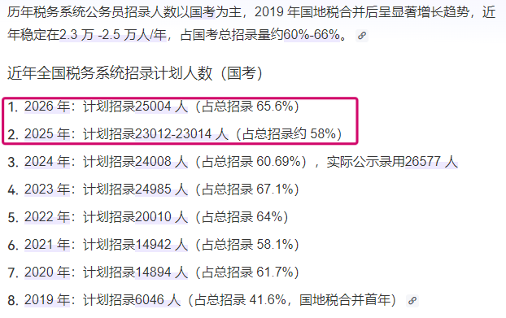

[toc]

# 问题

提问者：**<a href="https://www.zhihu.com/people/91-91-12-75-18">你没事吧</a>**
提问时间: 2026-4-19 3:8:0
总回答数: 324
总访问量: 1598146

房产税一旦落地，会出现踩踏式抛售房子吗？

# 回答

回答者： **<a href="https://www.zhihu.com/people/13-83-57-98">爱做爱做的事</a>**
回答时间: 2026-7-14 16:1:52
点赞总数: 37
评论总数: 5
收藏总数: 10
喜欢总数：0

 **用数据说话，战报会骗人，但战线不会骗人** 

注意看， **2026年是拐点，公务员招录总人数开始往下走的** 

但另一组 **国考税务系统招录人数** 情况，辨识度就很高了：  

注意看2025年，占比是58%，但2026年总人数下降的前提下，税务系统招录人数反而扭头提升，占比飙到65.5%，也就是说平均招100个人里头有65个人被税务拿走了。哪怕整体资源再收缩，也优先满足税务的用人需要，应该能想到这意味着什么了吧？

 **某种程度上，绝对是在谋划“干大事”了，毕竟这可不是善堂，养人可是要干活的。**

  

原文地址：[(爱做爱做的事)房产税一旦落地，会出现踩踏式抛售房子吗？](https://www.zhihu.com/question/2029033486305047507/answer/2060393593060193687) 

