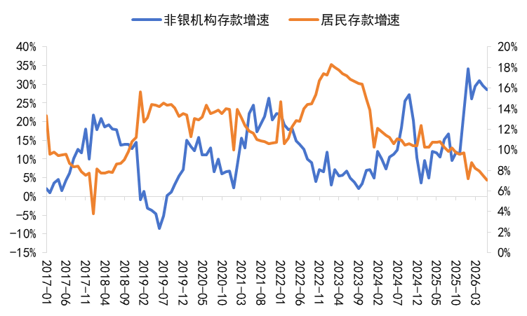

[toc]

# 问题

提问者：**<a href="https://www.zhihu.com/people/wooooow-28-86">佐条WOOOOOW</a>**
提问时间: 2026-8-15 0:53:22
总回答数: 26
总访问量: 48485

8月14日，央行发布7月份金融统计数据，存贷款数据引发市场广泛关注。

  

 **A股市场调整，居民存款搬家强度弱于去年同期** 

  

央行数据显示，前七个月人民币存款增加17.79万亿元。其中，住户存款增加6.95万亿元，非金融企业存款增加1.57万亿元，财政性存款增加1.95万亿元，非银行业金融机构存款增加5.76万亿元。

  

从单月数据观察，7月新增人民币存款300亿元，同比少增4700亿元，人民币存款余额同比从6月的8.2%降至8.1%，7月实体部门存款延续季节性变化，不过非银机构存款同比明显少增，人民币存款增长小幅放缓。

  

把存款拆开看，不同主体的资金行为差异非常明显。具体来看，7月份居民存款减少6300亿元，7月居民存款转向净流出；非银机构存款增加11100亿元，但环比由负转正，资金继续向理财、基金等资本市场渠道流转；非金融企业存款减少16300亿元，企业存款显著回落，企业账面资金消耗加大；财政存款增加9785亿元，政府债发行维持高位和财政资金收缴

  

  

[7月金融数据出炉：贷款继续“降速提质”，居民存款仍在搬家](https://www.bjnews.com.cn/detail/1786715890129550.html)

# 回答

回答者： **<a href="https://www.zhihu.com/people/yapoka">牛肉丸夫斯基</a>**
回答时间: 2026-8-18 11:35:18
点赞总数: 79
评论总数: 10
收藏总数: 24
喜欢总数：3

说一个非常反直觉的观察，不是结论，我们一起讨论一下：

我知道七月存款少增是季节性传统，但这次让我感到揪心的恰恰还就是存款增速的变化。

因为在存款搬家之外，可能存在一个被总量掩盖的结构性变化—— **一部分居民的存款缓冲垫正在失效。** 

粗看数据都没什么大问题，经过这两年的确认，居民去杠杆已经是一个确定性的事情了，居民存款减少，也可以解释为存款搬家继续进行。

但是 **居民存款的增速下滑的同时** 和 **非银机构存款的增速也有失速的苗头** ，这就值得引起注意。

过去几年我们理解居民部门存款增加的模型主要来自于这几个假设：

-   收入预期下降带来的消费意愿下降和储蓄意愿上升；
-   房地产市场下行导致大量的购房本金被动挤出；
-   24年前权益市场羸弱导致的风险偏好重分配。

直到权益市场重新转牛，存款利率不断下调，资金才重新回到权益市场当中去，也就是所谓的“居民存款搬家”。

那么也就是说，只要收入预期下行和房地产市场调整还没有结束，存款增速就可能一直维持高速增长的趋势，但是现在存款增速和非银存款的增速，都在下滑，7月居民存款罕见的出现了负增长。

居民存款究竟在这轮经济转型/资产负债表修复的过程当中扮演者什么样的作用

一个很重要的问题，为什么房地产市场“重大调整”到今天，体感的痛觉没有普遍同时剧烈的向多数市民阶层去传导？而是仅仅停留在“经济确实不太景气，再熬一熬吧”这个层面？

房地产市场调整理论上可以被抽象成一个典型的资产负债表衰退模型：

> 房地产市场调整 → 家庭财富下降 → 消费下降 → 企业收入下降→ 就业预期下降 → 居民收入预期调整 → 杠杆空间收缩 → 房地产进一步调整

但是从这两年的实证中，这个循环没有迅速的自我实现，一个很重要的原因是我国现实中这里多出了几层巨大的缓冲，而 **存款在这个过程中发挥了巨大的作用** ：

第一层是代际资产负债表。一个 30 岁的人房子跌 20%，并不等于这个人的家庭财富跌 20%。

如果首付来自父母、父母有多套房、有存款、有养老金、有稳定职业，那么年轻人的资产负债表和父母的资产负债表其实是一个隐性的联合资产负债表。

第二层是“财富损失”和“现金流损失”不同导致的巨大体感差异。同样上面的例子虽然房子跌掉了200万，但是只要没有交易行为产生，财富缩水在日常生活中，并不会体现出任何的变化。但是，对一个存款很少，收入下降，无依无靠甚至有负债的年轻人，体感却会非常的强烈。

所以，现金流是否充沛区分了人群获得痛苦的程度，资产端发生了巨大的重新定价， **但痛苦首先出现在现金流脆弱的人群：年轻人、学生、小企业主、高杠杆购房人群……** 而拥有大量既有资产、稳定现金流、代际支持的人 **甚至可以旁观整个房地产周期。** 

 **但是，当居民存款增速和非银机构存款增速在同步走低的时候，就是引起警觉的时候。** 

当然你可以把居民存款总量下降理解成存款搬家，存款搬家的速度下降，理解为市场调整产生了搬家阻力。但是观察公开的理财数据居民部门总体的风险偏好，仍然是较为保守的。并且在存款搬家同比减速的情况下，仍然出现了存款总量的下降。

在收入预期没有显著修复的当下，这可能意味着大概率存款这个巨大的缓冲垫正在快速的被消耗，为什么这么说？

在招商银行还公布金葵花用户存款比例的时候，我们知道，哪怕是居民部门内部，都存在巨大的分化（2.5%的用户存了80%的款）

那么当有余裕的钱放慢流入权益市场的脚步的时候，当消费仍然在不停的被压缩的时候，从存款总量里消失的存款，究竟是谁在消耗？

结合前文分层缓冲的讨论，我真正关心的问题不是总量的消失，而是央行没有给出的，但是可能出现的的结构性变化：

-   头部的居民仍然持续增加金融资产；
-   中间阶层主要是在低收益资产之间搬家；
-   底层居民已经开始显著的消耗存量储蓄；

而一旦是最末端的消耗显著大于顶端，并且已知末端的财富积累总额远小余金字塔尖，那么过去几年存款积累的缓冲将会迅速的失效，资产负债表修复的痛苦将加速向上传递，这样痛苦将不再困于沉默人群的体感，而是浮出了水面，转化成了普遍人的时代记忆。

至于此刻会不会就是那个拐点，还不好说，但是无论是黄金年代、最有希望的夏天，还是失去的x年，生活大概率都不会长期维持过去几年的样子。

现在的生活最诡异的不是是否有希望，而是没有方向，没有彻底的希望，没有彻底的绝望，生活只是在这里，明天去往哪里，没人知道。

  

原文地址：[(牛肉丸夫斯基)居民存款 7 月少了 6300 亿，贷款「降速提质」，一系列数据反映了哪些经济趋势？](https://www.zhihu.com/question/2071761372854194433/answer/2073010082145638107) 

# 评论

1. <a href="https://www.zhihu.com/people/36-31-94-75">杯弓蛇影</a> (<small title="北京">2026-8-18 11:50:21</small>): 确实，问题在于没有披露的信息。这减少的居民存款分布，究竟是集中在头部账户，还是普通账户
2. <a href="https://www.zhihu.com/people/san-er-yi-50-60">三二一</a> (<small title="上海">2026-8-18 12:46:25</small>): 其实买房贷款的居民比例并不大，很大一部分还是多年前买的，现在也还是赚的
   - <a href="https://www.zhihu.com/people/san-er-yi-50-60">三二一</a> (<small title="回复于 2026-8-18 13:7:25/上海"> ✉️:Clifford</small>): 我家14年买的还涨了一倍呢［害羞］其实上海18年就开始跌了，但幅度不大
   - <a href="https://www.zhihu.com/people/clifford-47">Clifford</a> (<small title="上海">2026-8-18 13:3:14</small>): 上海房间跌回十年前，赚啥。十年前买的现在卖亏一个首付
3. <a href="https://www.zhihu.com/people/clifford-47">Clifford</a> (<small title="上海">2026-8-18 13:5:20</small>): 存粮房贷不降息就不会贷款买房，资产负债表也修复不了。现在是全家托底承担杠杆买房的损失。父母把二三线的房子卖一套给一线失业的孩子还房贷，不然会大面积出现断供
4. <a href="https://www.zhihu.com/people/peng-bo-de-yu-wang">蓬勃的欲望</a> (<small title="湖南">2026-8-18 12:43:11</small>): 稳中向好，高质量发展，win
5. <a href="https://www.zhihu.com/people/hx3d-23">HH XD</a> (<small title="上海">2026-8-18 13:34:18</small>): 增速减少又不代表下降？［思考］  
 
  
 
现在的人喜欢提前还款你不知道？
6. <a href="https://www.zhihu.com/people/antoshen">一览芳华</a> (<small title="上海">2026-8-18 13:44:7</small>): 居民存款与债务一中和就自然缩表了［机智］但它们可以借新还旧，继续扩表，债主们居然没意见
7. <a href="https://www.zhihu.com/people/li-oneding-1">李one丁</a> (<small title="天津">2026-8-18 12:21:53</small>): 这是好事啊（认真）
8. <a href="https://www.zhihu.com/people/77-67-86-82">神龙大侠</a> (<small title="湖北">2026-8-18 12:28:52</small>): 有没有可能外逃了

=[评论](./attachments/comments.json)

