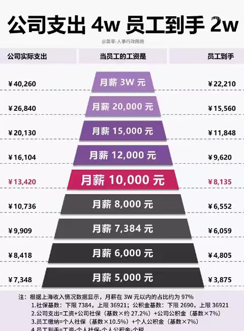

[toc]

# 问题

提问者：**<a href="https://www.zhihu.com/people/cai-xin-wang-95">财新网</a>**
提问时间: 2026-8-14 9:47:16
总回答数: 602
总访问量: 1813019

最近半年，社保基数夯实正在多地抓紧落实。

不少企业财务及HR（人力资源）反映称，收到税务部门通知，发现其单位的社保缴费基数与个税工资不匹配，存在未足额申报缴纳社保费风险，要求尽快自查、调整申报，夯实社保缴费基数。

何淼就职于某大型IT外包企业在山东的一家分公司。7月接到社保基数夯实的通知后，公司给出两个方案：一是由员工承担此前1—5月公司需要补缴的全部社保及公积金费用，二是重新入职省内跨市的另一家子公司。如果两项都不接受，就得退项坐班，每月只发4000元的基本工资。

[封面报道｜夯实社保](https://weekly.caixin.com/2026-08-07/102472223.html?originReferrer=caixinzhihu)

# 回答

回答者： **<a href="https://www.zhihu.com/people/nogirlnotalk">王子君</a>**
回答时间: 2026-8-18 2:16:42
点赞总数: 1820
评论总数: 106
收藏总数: 325
喜欢总数：135

谢邀。

公平，公平，还是特么的公平。

___

如果按月入一万基数交足四十年，个人承担的社保成本差不多100万，企业承担的差不多170万；

假设65岁退休、75岁闭眼，这十年也就领个90万。

这还是完全静态的算法，如果算上资金成本，退休后领的90万勉强也就算退休前的60万，甚至对半。

而且这里咱还得强调一点：你正当年时的钱、和你临老的钱，花起来感觉是不一样的。

人自然衰老的话，一般在临终前最后几年会进入失能状态。底子好的可能就一两年，底子差的会五六年（所以高龄后突然急速衰老死亡是喜寿）。

这账本来就算不过来，如果设身处地地算就更难绷:你是愿意透支大半辈子只为了最后几年能每月多领一两千？还是大半辈子无束缚临老了玩不动了再比别人穷点？

___

咱是现收现支制，所以理解社保很简单:现在交钱的就是在养现在领钱的。

至于“我现在交钱是为了未来养自己”，扯淡，未来养你的人还有很多没出生（或者干脆不出生）。

假设你95年65岁退休，2060年，那年适龄劳动力估计只有6亿多点，而退休人口估计4亿多。

现收现支下，咱们很多人要纠结的是未来的6亿养4亿，眼下的9亿养2亿基本没有参考价值。

除非政策强力刺激生育硬是把未来人口拉起来，那你此时交的钱才算真正在未来养了你，因为政府用政策把你交的钱转化为未来的人口和生产力。

那人口这几年有任何逆转趋势么？

所以你现在交的钱就是养现在领的人，不是养自己。

___

那现在领的人是啥区别？

机关事业单位的养老金一般是城镇职工养老金的两三倍，是城乡居民养老金的三四十倍。

而机关事业单位的参保领保人数也就六七千万，后两个都是六亿规模。

收这块有这么大的差距么？没有，但支的时候就是泾渭分明。

而且机关事业单位养老金也有近四成的财政补贴，所以就是对规模最小的一群做了人均力度最大的补贴。

我相信对于交职工养老保险的胖友，有一个感觉是普遍的:

财政补贴城乡居民养老，可以理解，毕竟城乡二元制和剪刀差，该补点；而且补城乡养老金能直接刺激消费；

补机关事业单位，何意味？稳定程度那么高，视同缴纳，还有职业年金，咋还跟着连涨呢？

年景好的时候就当没看到，现在荒年，职工社保一年能亏七八千亿。要决堤了，不堵大坝堵小家。

___

真正的恶果，是迫使维持高费率。

咱这五项社保得总费率，15年时41%，最近到34%，总之在全球范围内都偏高。

一般来说，经济放缓期里咱可以尝试调整这个费率，例如宽税基低税率，一方面强调普遍合规缴纳，另一方面稍微降低，给企业减负。

但现在亏空趋势太明确，费率就不好降，只能以收钱为第一。这事实上导致政策丧失弹性，并且在公平问题还未解决的情况下削弱小胖友们对社保的信心。

所以最终联动下来，就是越合规越压缩人工，降工资甚至裁员。

因为这一切都是有成本的。改革的本意是削冗，砍成本；你现在成本砍不下去，于是改革变成了成本的刚性转移。

那一定会转移到没有协商权利的人身上，也就是普通打工人。

___

闲聊公号:王子君的碎碎念。

  

原文地址：[(王子君)多地严查社保缴纳，要求提高夯实率，有职员反映工资被下调，该如何理解？](https://www.zhihu.com/question/2071533345910022775/answer/2072869505861211402) 

# 评论

1. <a href="https://www.zhihu.com/people/yixie-zhi-qiu-2-33">木子</a> (<small title="江苏">2026-8-18 2:30:57</small>): 就和买房一个样，当大部分人发现好处和自己没关系，就都不玩了
   - <a href="https://www.zhihu.com/people/du-ding-de-xu-cheng-ye">笃定的徐承业</a> (<small title="湖南">2026-8-18 7:54:24</small>): 很多年轻人已经不打算交社保了的，当然，公司强制交的另算
   - <a href="https://www.zhihu.com/people/wang-ze-16-30">捡到猫了</a> (<small title="回复于 2026-8-18 9:42:50/河南"> ✉️:笃定的徐承业</small>): 缴最低的呗，医保还是有用的
2. <a href="https://www.zhihu.com/people/xxx-73-29">XxX</a> (<small title="福建">2026-8-18 3:27:31</small>): 成本转到最后直接裁员，最后大概会轮到管就业的部门和管社保的部门kpi左右互搏有感觉吗（
   - <a href="https://www.zhihu.com/people/ma-hua-teng-77-40">老马识途</a> (<small title="湖北">2026-8-18 5:43:2</small>): 呃，这两块是一个部门管的，人社部［飙泪笑］
   - <a href="https://www.zhihu.com/people/luo-yi-bu-95">北落师门</a> (<small title="江西">2026-8-18 7:32:47</small>): 社保本来就是税
   - <a href="https://www.zhihu.com/people/shui-jing-yue-73">水镜月</a> (<small title="回复于 2026-8-18 7:40:7/上海"> ✉️:老马识途</small>): 社保现在是税务在管了
   - <a href="https://www.zhihu.com/people/yangrouchuan-29-6-5">面饼</a> (<small title="北京">2026-8-18 9:16:11</small>): 不会的，只要能收上来钱就没人管就业［飙泪笑］
   - <a href="https://www.zhihu.com/people/peter-80-25-44">peter</a> (<small title="上海">2026-8-18 9:17:34</small>): 七分税，三分保。
3. <a href="https://www.zhihu.com/people/yang-alice-97">能躺着绝不坐着</a> (<small title="加拿大">2026-8-18 6:7:24</small>): 最大的原因是高的发的太多，如果要每个人都觉得划算，这个账谁都不可能算圆，别人转移支付又不肯学，就这样。
4. <a href="https://www.zhihu.com/people/cph-74">ccccc</a> (<small title="湖北">2026-8-18 7:54:7</small>): 这玩意，我三倍基数交的，就纯亏。  
 
数学超过初一的都能算出来。  
 
  
 
不止养老，医保也是纯亏，不是说不生大病才纯亏，就是生大病也是纯亏［捂脸］  
 
  
 
但是就一帮人每次不算，就硬反驳。［捂脸］
   - <a href="https://www.zhihu.com/people/yun-shui-nu-10">云水</a> (<small title="江苏">2026-8-18 8:14:50</small>): 你别问，问就是我去年得了大病报销了不少钱很［滑稽］
   - <a href="https://www.zhihu.com/people/cph-74">ccccc</a> (<small title="回复于 2026-8-18 8:18:59/湖北"> ✉️:云水</small>): 主要是，就是报销一大笔，也亏啊。  
 
因为交的更多。  
 
  
 
按我这基数，只要职业生涯交够10年，基本按现在集采环境，病死都报不出交的那么多［捂脸］
   - <a href="https://www.zhihu.com/people/wolfduke">打柴人</a> (<small title="回复于 2026-8-18 8:33:28/上海"> ✉️:ccccc</small>): 你不交他不交，icu里躺几年的灵岛从哪来的特权
   - <a href="https://www.zhihu.com/people/chen-max-42">浮生偷闲</a> (<small title="上海">2026-8-18 9:15:40</small>): 我封顶交20年了，亏到姥姥家了，赚不回来了
   - <a href="https://www.zhihu.com/people/qing-dan-zi-wei">捕鱼者言</a> (<small title="江苏">2026-8-18 9:22:1</small>): 超过一倍缴纳就是亏的
   - <a href="https://www.zhihu.com/people/iie2010">锦衣夜行</a> (<small title="回复于 2026-8-18 9:23:49/浙江"> ✉️:捕鱼者言</small>): 以前二三十年为什么有一大帮人一直按最低标准缴费，明显就是赚啊。
   - <a href="https://www.zhihu.com/people/hu-bao-shi-xiang">鼠牛虎兔</a> (<small title="福建">2026-8-18 9:34:44</small>): 大部分高收入者，不在意多交社保医保的。
 
因为社医保也就3倍封顶，多大事。
 
个税才是大头。
   - <a href="https://www.zhihu.com/people/cph-74">ccccc</a> (<small title="回复于 2026-8-18 9:41:26/湖北"> ✉️:鼠牛虎兔</small>): 那可太在乎了。  
 
我就很在乎。  
 
因为三倍根本不算什么高收入。  
 
  
 
三倍基数的绝大多数人，社保负担远远大于个税。  
 
你说那种是纯工资收入7位以上的，根本没几个人。
   - <a href="https://www.zhihu.com/people/yan-ling-31-90">延陵</a> (<small title="广东">2026-8-18 9:43:37</small>): 你自己交的在个人账户，如果有企业年金，就算按12%交，单位部分公积金刚好也是12%，抵掉了，亏在哪里，那要说如果不用交，单位那部分都能给你，what can I say
   - <a href="https://www.zhihu.com/people/cph-74">ccccc</a> (<small title="回复于 2026-8-18 9:45:7/湖北"> ✉️:延陵</small>): 如果有企业年金，12%。  
 
你给我［尴尬］［尴尬］［尴尬］？？  
 
不是国企的，直接发工资不得了，为啥弄什么企业年金，有几个有的。  
 
  
 
这也能硬反驳［尴尬］［尴尬］
5. <a href="https://www.zhihu.com/people/huang-jia-er-shao-3">黄家二少</a> (<small title="广东">2026-8-18 7:59:35</small>): 人们总是把自己当人，也觉得某机构会把他们当人。实际上他们在机构眼里，不就是奶牛［大笑］
   - <a href="https://www.zhihu.com/people/he-lin-50-82">愚蠢的天才</a> (<small title="贵州">2026-8-18 8:48:48</small>): 奶牛不用拉磨，奶驴还差不多
6. <a href="https://www.zhihu.com/people/a-bu-cuo-de-fei-guo-hai">啊不错的飞过海</a> (<small title="天津">2026-8-18 2:56:59</small>): 机关事业单位搞成这样是从早年间公费医疗、公费养老切换到需要缴养老金、医保的过渡政策吧。横竖都是吃财政的钱，管理权转移给社保起码把领钱的人和管钱的人分开了，总不能真让退休干部一个月三千不是。当然教师医生跟着沾光就是另一个故事了。
   - <a href="https://www.zhihu.com/people/chen-xuan-jing-45">那一墨暗殇</a> (<small title="江苏">2026-8-18 5:7:39</small>): 退休干部为什么不能一个月三千，觉悟在哪，享福享多了吧，三千块活不下去？那么多的一两千的退休金怎么活下去的［大笑］
   - <a href="https://www.zhihu.com/people/xiang-xiang-de-yi-zhu">想像的艺术</a> (<small title="黑龙江">2026-8-18 5:52:59</small>): 退休干部难道比别人高级么？拿公共资金给自己养老，必须比别人拿的多么？
   - <a href="https://www.zhihu.com/people/knightuniverse">進擊的猴子</a> (<small title="福建">2026-8-18 6:11:53</small>): 为什么不行。
   - <a href="https://www.zhihu.com/people/kb1-44">空白</a> (<small title="辽宁">2026-8-18 7:14:59</small>): 退休干部一个月为什么不能三千？  
 
这块土地上的最低工资标准就两千来块钱呢，说明默认一个壮年劳动力一个月两千来块钱就能活  
 
那凭啥一个快入土的一个月三千不够？
   - <a href="https://www.zhihu.com/people/253358-26">因为主不在乎</a> (<small title="江苏">2026-8-18 7:44:43</small>): 这时候不提视同缴纳了［生气］
   - <a href="https://www.zhihu.com/people/tang-shen-67">游水玩泥</a> (<small title="吉林">2026-8-18 7:46:25</small>): 这里的人太义愤填膺了，换个词，养廉银，是不是就明白了
   - <a href="https://www.zhihu.com/people/jtrfyo">秋月春风</a> (<small title="回复于 2026-8-18 8:26:18/广东"> ✉️:游水玩泥</small>): 在职的时候才是养廉，退休了你还做什么贡献［捂嘴］
   - <a href="https://www.zhihu.com/people/iie2010">锦衣夜行</a> (<small title="回复于 2026-8-18 9:26:0/浙江"> ✉️:秋月春风</small>): 你的逻辑不行，国家的想法是你在职时清廉，退休了给高额退休金。就相当于是给狗的脑袋上吊了一根骨头。
 
美国高中老师也是这样，在职工资很低，而401K非常高。
   - <a href="https://www.zhihu.com/people/na-po-lun-si-shi">哈哈哈</a> (<small title="陕西">2026-8-18 9:26:39</small>): 退休干部就高贵吗
   - <a href="https://www.zhihu.com/people/piao-liu-2-3">漂流</a> (<small title="回复于 2026-8-18 9:28:53/江苏"> ✉️:锦衣夜行</small>): 清廉了吗［捂脸］
   - <a href="https://www.zhihu.com/people/jtrfyo">秋月春风</a> (<small title="回复于 2026-8-18 9:31:45/广东"> ✉️:锦衣夜行</small>): 美国的教师工资低［捂脸］你在说什么笑话，相对金融业湾区码农是低，对普通人来说是高，还有一堆福利，公务员的工资也一样对普通人来说是高了
   - <a href="https://www.zhihu.com/people/jtrfyo">秋月春风</a> (<small title="回复于 2026-8-18 9:36:22/广东"> ✉️:锦衣夜行</small>): 普通人在你眼里是不是人，教师和公务员的工资和福利比普通人好不算养廉？
   - <a href="https://www.zhihu.com/people/iie2010">锦衣夜行</a> (<small title="回复于 2026-8-18 9:39:50/浙江"> ✉️:秋月春风</small>): 公务员工资正常就应该在中等略偏上一点，这是合理的。
 
太高，财政负担太重，太低，会滋生出各种腐败问题。
 
你普通人有什么资格跟他们比？你有权力吗？
   - <a href="https://www.zhihu.com/people/iie2010">锦衣夜行</a> (<small title="回复于 2026-8-18 9:43:26/浙江"> ✉️:秋月春风</small>): 老师医生这种良心活的岗位也是一样，工资低，老师就每天照本宣科，关键点不讲或者只讲一遍，你跟不上或者听不懂，课后自己补课去。
 
医生专业门槛高，知识壁垒更严重，明明很轻的病，我给你描述得很严重。也可以反过来，只要病人不死在面前就行。美国日本的医疗体制下，这种事情难道还少吗？
   - <a href="https://www.zhihu.com/people/jtrfyo">秋月春风</a> (<small title="回复于 2026-8-18 9:45:21/广东"> ✉️:锦衣夜行</small>): 现在讨论的问题是退休前工资本来就是当地中上水平养廉，退休后的还要高退休金养廉吗，别乱扯医生了［尴尬］
7. <a href="https://www.zhihu.com/people/ruan-da-shi">青蛙先生爱好者</a> (<small title="浙江">2026-8-18 8:34:48</small>): 之前发过感觉被隐藏了，我在国企，基本工资+绩效一个月将近三万，实际到手一个月一万六七（我们扣绩效也凶，其实算是符合的，我们公积金足额，我公积金近五千），算是比较符合这张表格的，我的收入在同辈甚至国内都算高的。  
 
下面转折一下，我在浙北，我认识体制内退休的，但凡工龄久一点或者有职级（他们退休前都会提一级，提到退休待遇），他们的退休金都要比我高（1.5 万-2w 的退休金），国内分配问题大的去了，公务员群体，真的是我现实生活中消费力很强的群体了（排除掉企业主这种群体，我周围底层公务员夫妇，在这种房地产大环境下，真会直接上 600 万以上的平层，我们现在改善新房和准新房购买主力就是体制内了［捂脸］）
   - <a href="https://www.zhihu.com/people/da-gou-bang-45-65">有为青年</a> (<small title="广东">2026-8-18 8:37:47</small>): 实话，嚎年轻人羊毛补贴制度内老登。还说年轻人不努力
   - <a href="https://www.zhihu.com/people/ruan-da-shi">青蛙先生爱好者</a> (<small title="回复于 2026-8-18 8:42:12/浙江"> ✉️:有为青年</small>): 我反正发养老金话题的东西点赞一多就封号，隐藏或者删评。60 年代那批退休的绝对没吃过苦和没有贡献，以前那批城镇户口毕业就分配工作，工龄久，在职正规华为灰色收入都不低。我爸也是 60 年代，以前浙北农村太穷，出去打工（去新疆打工了，我们村出去打工，全国都有分布）都要村委的介绍信，很难的［捂脸］
   - <a href="https://www.zhihu.com/people/lin-deng-wan-52">林登万</a> (<small title="广东">2026-8-18 9:38:8</small>): 月入一万到手才八千出头？
8. <a href="https://www.zhihu.com/people/chai-dong-70-23">柴懂</a> (<small title="上海">2026-8-18 8:5:7</small>): AI不需要缴纳社保，望周知。
9. <a href="https://www.zhihu.com/people/niu-li-niu-qi-24">牛里牛气</a> (<small title="贵州">2026-8-18 7:50:35</small>): 你们不消费是吧，行，那直接扣钱［飙泪笑］
10. <a href="https://www.zhihu.com/people/lun-dao-fu-ai-shou-yi">伦道夫爱手艺</a> (<small title="天津">2026-8-18 7:23:37</small>): 社保里别的不说还有大头医疗呢［捂脸］这辈子谁保不齐生病做手术啊，单独看退休金不合适
11. <a href="https://www.zhihu.com/people/ao-tu-84-62">凹凸</a> (<small title="上海">2026-8-18 7:47:9</small>): 不知道为什么，看完有一股苍凉的感觉
12. <a href="https://www.zhihu.com/people/william-sheeran-46">William Sheeran</a> (<small title="湖北">2026-8-18 3:46:43</small>): 未来感觉不会刺激出生率，而是引进外来人口，这样搞的话能不能填补社保差距［可怜］
    - <a href="https://www.zhihu.com/people/zhu-wen-zhou-53">零落</a> (<small title="上海">2026-8-18 4:29:2</small>): 世界上只有中国人能接受这个工作环境了，引谁啊，无论更发达的更贫穷的都不接受这个工时…很多地方只是穷，它不怎么累的
    - <a href="https://www.zhihu.com/people/dong-mu-jie-bai">天街公卿</a> (<small title="四川">2026-8-18 4:32:24</small>): 除了东亚人，谁能接受这种待遇生活，东南亚？非洲？南亚？
    - <a href="https://www.zhihu.com/people/feng-yue-tian-wu">风跃天舞</a> (<small title="河南">2026-8-18 5:5:31</small>): 你真当老外跟老中一样都是任劳任怨的牛马啊［飙泪笑］？老外哪怕赚的少，都无法忍受老中这种工作环境加工作时长的，哪怕是老黑，都是一有钱就地开躺。就我们现在这工作环境你能吸引来谁？
    - <a href="https://www.zhihu.com/people/49-80-61-28">大言若正</a> (<small title="北京">2026-8-18 5:46:28</small>): 有能力来中国的老外 不会同时考虑别的国家吗？ 一考虑 一对比 毅然决定来中国给大家交社保？
    - <a href="https://www.zhihu.com/people/e-er-duo-si-9">那个谁是谁的的谁</a> (<small title="回复于 2026-8-18 6:52:8/江苏"> ✉️:零落</small>): 中国人大多数是接受不了穷的，所以就是框框干。接受穷的话，下限还是不低的。
    - <a href="https://www.zhihu.com/people/shizuku233">雾岛雫</a> (<small title="河北">2026-8-18 7:23:32</small>): 想的太多了，人家来你这图啥，图你这996还是税高还是完全没社会保障？［飙泪笑］
    - <a href="https://www.zhihu.com/people/bo-yun-jian-ri-77-18">拨云见日</a> (<small title="河北">2026-8-18 8:14:38</small>): 发达的美欧日韩澳加新不说，东南亚，非洲黑叔叔，都是到点下班，加班？给钱也不加，这辈子就别想让我加班［捂嘴］
13. <a href="https://www.zhihu.com/people/mowenqiancheng">解语电气喵</a> (<small title="江苏">2026-8-18 5:52:1</small>): 高税率是发达国家的标志
    - <a href="https://www.zhihu.com/people/fake-faker">Lova</a> (<small title="北京">2026-8-18 7:20:12</small>): 高福利呢［大笑］
    - <a href="https://www.zhihu.com/people/mowenqiancheng">解语电气喵</a> (<small title="回复于 2026-8-18 7:27:19/江苏"> ✉️:Lova</small>): 先有强财政，后有强福利
    - <a href="https://www.zhihu.com/people/kb1-44">空白</a> (<small title="回复于 2026-8-18 7:44:35/辽宁"> ✉️:解语电气喵</small>): 别狡辩了  
 
有司自己早说了，这儿不养闲人，不玩高福利
    - <a href="https://www.zhihu.com/people/ya-hu-77">呀乎</a> (<small title="上海">2026-8-18 7:50:57</small>): 我们什么时候属于发达国家啦
    - <a href="https://www.zhihu.com/people/pei-chen-chao">stepino</a> (<small title="山西">2026-8-18 8:8:38</small>): 也够
    - <a href="https://www.zhihu.com/people/29-52-21-37">奇怪的中单</a> (<small title="山东">2026-8-18 8:42:48</small>): 高收入和高福利在哪补［尴尬］
    - <a href="https://www.zhihu.com/people/jieluote77">杰洛特今天打什么</a> (<small title="回复于 2026-8-18 8:54:33/江西"> ✉️:解语电气喵</small>): 在体制内吗就想要高福利
    - <a href="https://www.zhihu.com/people/wxbc91783e1de2eba4">wxbc91783e1de2eba4</a> (<small title="山东">2026-8-18 8:58:40</small>): 你35岁没工作的时候该找谁呢？
    - <a href="https://www.zhihu.com/people/an-rui-90-66">安瑞</a> (<small title="回复于 2026-8-18 9:1:59/浙江"> ✉️:空白</small>): 养的不是你罢了
14. <a href="https://www.zhihu.com/people/wxbc91783e1de2eba4">wxbc91783e1de2eba4</a> (<small title="山东">2026-8-18 9:0:30</small>): 待会风吹雨打(城南花开)就来说美国也这样［大笑］
15. <a href="https://www.zhihu.com/people/jiang-xia-97">讨厌醋大蒜</a> (<small title="浙江">2026-8-18 9:0:50</small>): 普通人的反抗就是躺平，反正饿不死，心理健康比去追求那三瓜两枣更重要，希望以后机器人能替我养老
16. <a href="https://www.zhihu.com/people/xu-jia-52-89">想养一只猫</a> (<small title="江苏">2026-8-18 8:50:35</small>): 有些群体的退休金太高了，不要说和企业退休的比了，就是和在职的比都高很多，退休金就不能设置封顶线吗
    - <a href="https://www.zhihu.com/people/lin-deng-wan-52">林登万</a> (<small title="广东">2026-8-18 9:40:8</small>): 按和当地平均收入挂钩会好点。
17. <a href="https://www.zhihu.com/people/qi-zhao-gua-niu-guang-jie-43">骑着蜗牛逛该</a> (<small title="上海">2026-8-18 9:18:46</small>): 其实在上海事业单位退休工资也就那样 中级职称退休1个月1w出头 国企才是真夸张 银行一个大堂经理退休直接2w一个月
18. <a href="https://www.zhihu.com/people/shi-jian-you-ling-ju-shou">Eureka</a> (<small title="湖北">2026-8-18 3:49:16</small>): 所以之前看到的帖子有个观点很对，现在年轻人最大的红利就是可以不参与。每个人每天唯一的主线任务，就是获取2000大卡热量和2升水，其他的事情都是支线。  
 
你参与，吃亏的是你，不参与，吃亏的可就是想让你吃亏的人了。
    - <a href="https://www.zhihu.com/people/sun-yi-ge">momo</a> (<small title="黑龙江">2026-8-18 6:35:26</small>): 以赛亚伯林的“消极自由”
    - <a href="https://www.zhihu.com/people/70-38-69-39">托卡马克之冠军</a> (<small title="广西">2026-8-18 6:54:24</small>): 这还不简单？跟金牌讲师一起要饭，每天碳水管饱［捂脸］
    - <a href="https://www.zhihu.com/people/lu-lu-xiu-30-68">反叛的鲁鲁修</a> (<small title="广东">2026-8-18 7:34:29</small>): 骗骗别人别把自己也骗了，目前没有任何兜底保障措施可以让你不上班不啃老也能好好活着。不上班是真的会饿死的。就算可以靠住城中村做日结躺平，万一生病了没钱治，也是真的要等死的。  
 
而上班了，但凡好点的公司都会强制交社保。不交社保的公司连社保都交不起，也不会给你发多少钱。
    - <a href="https://www.zhihu.com/people/you-jia-93-37">有嘉</a> (<small title="江西">2026-8-18 8:31:15</small>): 宣传这种事不责任的人才干得出来的事。网上这种人多了去，你自己可以各种选择，但是不能将不符合公共利益的事当做正面宣传
19. <a href="https://www.zhihu.com/people/mowenqiancheng">解语电气喵</a> (<small title="江苏">2026-8-18 8:2:20</small>): 社保医保2025年共募资8.5万亿，如果真的全民实现34%的募资水平，这个还要翻一翻多
20. <a href="https://www.zhihu.com/people/zou-yu-lai-5">风雨同路人</a> (<small title="上海">2026-8-18 6:10:21</small>): 数字不对吧，静态的算，月薪一万，五险支出1050，40年也就50万。怎么变100万了？
    - <a href="https://www.zhihu.com/people/li-xing-37-69">Lemony</a> (<small title="陕西">2026-8-18 6:15:47</small>): 王哥这算法没错，我一万多点，每月五险支出1900左右，没算公积金。你们上海基数可能更高
    - <a href="https://www.zhihu.com/people/zou-yu-lai-5">风雨同路人</a> (<small title="回复于 2026-8-18 6:44:0/上海"> ✉️:Lemony</small>): 五险个人交10.5%。  
 
你这1900是加公积金了吧。
    - <a href="https://www.zhihu.com/people/yan-jin-94-93">Yan.jin</a> (<small title="江苏">2026-8-18 6:53:51</small>): 每个月1千存40年，你只算本金难道没有利息嘛？
    - <a href="https://www.zhihu.com/people/zou-yu-lai-5">风雨同路人</a> (<small title="回复于 2026-8-18 6:59:34/上海"> ✉️:Yan.jin</small>): 你觉得，静态的算，是包含利息的吗？
    - <a href="https://www.zhihu.com/people/43-18-33-87-71">飞翔</a> (<small title="山东">2026-8-18 7:9:4</small>): 企业给你交的算了嘛？
    - <a href="https://www.zhihu.com/people/zou-yu-lai-5">风雨同路人</a> (<small title="回复于 2026-8-18 7:12:10/上海"> ✉️:飞翔</small>): 你先去看看原文，再问我
21. <a href="https://www.zhihu.com/people/cang-shu-de-tu-zi">仓鼠的兔子</a> (<small title="上海">2026-8-18 7:17:58</small>): 社保支出里面包含医保、生育险、工伤和失业险，不只是养老保险。  
 
所以以社保支出和获取的退休养老金进行比较是错误的
    - <a href="https://www.zhihu.com/people/pei-chen-chao">stepino</a> (<small title="山西">2026-8-18 8:12:3</small>): ［大笑］［大笑］［大笑］你说的这些能领很多吗
    - <a href="https://www.zhihu.com/people/cang-shu-de-tu-zi">仓鼠的兔子</a> (<small title="回复于 2026-8-18 8:17:18/上海"> ✉️:stepino</small>): 能啊，我两个小孩，生育金一共领了四十多万
    - <a href="https://www.zhihu.com/people/pei-chen-chao">stepino</a> (<small title="回复于 2026-8-18 8:42:0/山西"> ✉️:仓鼠的兔子</small>): 上海有这么多补贴吗
22. <a href="https://www.zhihu.com/people/ming1874">橘子与茴香豆</a> (<small title="湖南">2026-8-18 4:27:26</small>): 需要二次改革了，还会有勇闯地雷阵一往无前的人吗？
23. <a href="https://www.zhihu.com/people/guan-suo-fan-wen-chang">勃非立</a> (<small title="内蒙古">2026-8-18 8:42:39</small>): 大多数省的机关事业单位就那点工资，几千一万的，工资高的反而是当地的垄断国企，国企才是大头吧
24. <a href="https://www.zhihu.com/people/gu-du-29-25">孤独</a> (<small title="新疆">2026-8-18 5:31:58</small>): 这不是好事吗？社保总归是个保障啊，这正是福利型社会的基础吗？
25. <a href="https://www.zhihu.com/people/liu-jia-chong">ZZLL</a> (<small title="浙江">2026-8-18 8:40:39</small>): 本人机关事业单位上班 举双手赞成机关养老不要再涨了 社会主义不能这样啊 要可持续发展
26. <a href="https://www.zhihu.com/people/yi-da-zhe">梵天丸</a> (<small title="江苏">2026-8-18 8:55:59</small>): 没事，可以国资划归的，不怕[［欢呼］](https://pic1.zhimg.com/v2-ba306425d0a7aee2c7260381f1bf7b97.gif?source=1d2f5c51)
27. <a href="https://www.zhihu.com/people/versace-50-79">小肥仔</a> (<small title="山东">2026-8-18 9:23:11</small>): 五险一共10.5%，一个月1050，40年个人部分成本应该是50.4万呀
28. <a href="https://www.zhihu.com/people/13-74-37-53">二次猿刀哥</a> (<small title="山东">2026-8-18 8:14:36</small>): 什么是协商权［doge］
29. <a href="https://www.zhihu.com/people/yang-shu-chang-33">我的面条呢</a> (<small title="河北">2026-8-18 8:41:49</small>): 说到底，还是钱，钱，钱
30. <a href="https://www.zhihu.com/people/han-yi-78-93">临江踏月</a> (<small title="浙江">2026-8-18 8:16:22</small>): 大胆，你发这个回答有什么目的［生气］
31. <a href="https://www.zhihu.com/people/na-po-lun-si-shi">哈哈哈</a> (<small title="陕西">2026-8-18 9:33:27</small>): 历史经验已经很多次证明过了，只要抓住基本盘，就能保证整个体系稳定运行下去，至于基本盘以外的人，掀不起什么大风大浪［飙泪笑］
32. <a href="https://www.zhihu.com/people/yan-ling-31-90">延陵</a> (<small title="广东">2026-8-18 9:44:48</small>): 个人承担100多万怎么算的？
33. <a href="https://www.zhihu.com/people/bu-zhi-suo-yun-hu-14">知所云乎</a> (<small title="江苏">2026-8-18 9:6:41</small>): 说这么多就一个问题，你能改变吗？不能改变。
34. <a href="https://www.zhihu.com/people/zhang-fan-14-53">爆爆龙宝宝要抱抱</a> (<small title="江苏">2026-8-18 8:41:28</small>): 月入一万个人承担一年怎么可能有两万五，一万差不多
35. <a href="https://www.zhihu.com/people/jjh000">小镇做题家</a> (<small title="上海">2026-8-18 8:37:8</small>): 为什么不交社保，还不是性价比不够嘛，对未来预期不足嘛。那就应该朝这方面入手，给大家看到一个光明的未来，否则社保体系崩塌只是时间问题
36. <a href="https://www.zhihu.com/people/bao-feng-cheng-de-nuan">暴风城的暖</a> (<small title="北京">2026-8-18 6:47:4</small>): ［拜托］［拜托］［拜托］
37. <a href="https://www.zhihu.com/people/gao-gao-65-29-31">高高</a> (<small title="吉林">2026-8-18 9:15:34</small>): 怎么 你不服气？［好奇］
38. <a href="https://www.zhihu.com/people/2-29-74-66-7">法我笑</a> (<small title="中国香港">2026-8-18 9:35:57</small>): 香港的强积金跟美国的401K感觉有一定的合理性。
39. <a href="https://www.zhihu.com/people/ben-pao-de-300kuai">山人</a> (<small title="四川">2026-8-18 9:12:11</small>): 这时候又可以套不可能三角了

=[评论](./attachments/comments.json)

