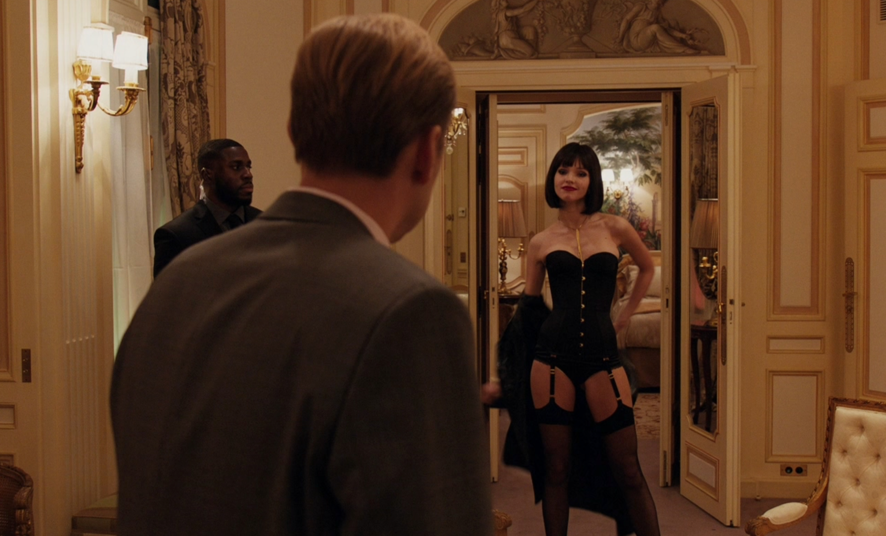
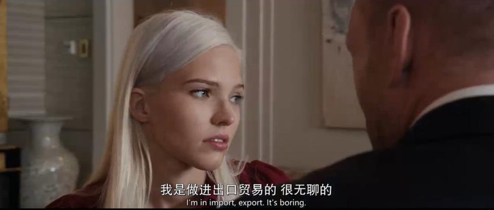

[toc]

# 问题

提问者：**<a href="https://www.zhihu.com/people/zhang-xin-nb">小鑫数学</a>**
提问时间: 2024-6-24 7:58:32
总回答数: 0
总访问量: 0

现实里！那些人心安理得当个渣男，享受着对方的好不就行了吗？一旦对方提出要求就迅速切割，怎么会中美人计了？我不信有人会中美人计！

# 回答

回答者： **<a href="https://www.zhihu.com/people/li-lin-lang-2">王富贵儿</a>**
回答时间: 2026-7-9 23:46:31
点赞总数: 1600
评论总数: 235
收藏总数: 1603
喜欢总数：77

 **如果你看过前苏联是怎么培养「燕子」也就是女间谍的，你就知道为什么色字头上一把刀，但仍有人心甘情愿，牡丹花下死做鬼也风流。** 

  

身体只是她们的初级武器，她们的终极武器叫做“人性的弱点”。

  

在前苏联，有这么一所学校，有人叫它喀山第四国立学校，也有人叫它“列宁技术学校”（Lenin Technical School）

  

它专门研究人性的弱点，然后培训「燕子」和「乌鸦」，这些间谍在情报行业几乎很少失手。

  

 **「燕子」们是如何筛选出来的？** 

  

 **又都接受过什么样残忍的培训？** 

  

今天我们跟着一个侥幸从克格勃手里逃脱的「燕子」，看看顶级特工的养成和工作方式。

  

### 一、筛选

  

人性的弱点从筛选那一刻就开始了。

  

可以说，很多「燕子」都是被克格勃们围猎成为间谍的。

  

维拉，一个极其幸运逃离克格勃定居巴黎的前苏联间谍。

  

维拉5岁时爸爸就去世了，她的母亲需要外出工作来养活她，所以她后来在姑母的严格教养下长大，她还有两个哥哥，她们一起住在列宁格勒一套两间卧室的公寓里。

  

她的母亲希望她毕业以后找一个坐办公室的工作，所以她进了莫斯科的一个技术学校去学习如何成为秘书的工作和技能。

那个时候的秘书职业，还没有现在这么暧昧和擦边。

  

它就是一份普通职业，稳定，体面。适合一个普通女孩。

  

维拉有着深色的头发，很喜欢上学，特别是体育活动。她是一个很好的赛跑运动员并获得过奖章，还在庆祝会上为尼基塔·赫鲁晓夫表演过。

由于坚持运动和对饮食的控制，所以她的身材非常好，学生时代就很能吸引男孩子的喜欢，经常收到很多约会的邀请。

  

但她性观念十分保守，因为她的姑妈是个虔诚的教徒。

  

命运最终让她成为了一只靠身体获取情报的「燕子」，真是开了一个残忍的玩笑。

  

有一天她被叫去见校长。校长办公室里坐着一个矮胖的中年男人，校长介绍说这是政府部门的一位上校。校长告诉维拉要她回答这个人的问题，然后就走了出去。

  

那个矮胖的中年男人似乎很了解她，聊天的时候还说去了维拉去世的父亲，说他在战争时期已认识他。

  

然后他谈论体育，并对她幼年时期的活动和部分生活经历发表评论。

  

这说明维拉不是被突然选中的，而是在长期观察候选名单里的。

  

在套过一段时间近乎之后，矮胖男人图穷匕见，他告诉维拉：

  

「我推荐你担任关键部门的重要职务，但开始之前需要进行培训。能被提名进行培训是个极大的荣誉，希望你努力工作以获得这个职位。」

  

他的介绍并没有更多，维拉想了解具体的情况都被他敷衍过去了，后来维拉才明白那就是欺骗。

  

但年幼的维拉没意识到，当一个少女听到荣誉的时候只会被击晕，那一刻她只顾着兴奋和骄傲了。

  

因为她知道，如果获得了这个工作，对她妈妈来说也是十分了不起的事。

  

在培训正式开始之前，维拉还需要在学校的医疗中心经历一次严格的体检。那是她成长过程中遇到过的最详细的，也是最让她害羞的体检。

  

体检中心有一男一女两个大夫，他们特别关注她的下体和私密区域，这让年幼的维拉感到非常难堪和害羞。

  

检查完毕之后，有将近两个月的时间维拉没有收到任何消息，维拉以为她倒在了体检环节，一定是她的身体在某些方面不合格。

  

那段时间她很失望。

  

其实，如果被PASS了，反而是命运格外的眷顾。

  

可惜的是，她通过了，更加魔鬼般的训练开始了。

  

### 二、残酷命运的开始

  

两个月后的某一天，维拉再次被叫到了校长办公室，仍然是上次的那个，跟她聊家常的认识她父亲的矮胖军官，这次他带来了维拉期待已久的好消息。

  

他笑着说：

  

「你被选中参加最后一阶段的挑选。即使落选，这仍然是一个很大的荣誉，也证明大多数人对你的信任是正确的。你要去一个训练学校接受长达四个月的学习。如果最后不能通过严格的测验，你将回到技术学校继续你的秘书学业。但我可以肯定，你会干得很好的。」

  

后来他又补充，如果维拉能靠实力通过选拔，就会得到很高的薪金和一套单身公寓。此外，他还暗示可到国外旅行和结识外国人。

  

在以后的四个月里，维拉的出身受到比以前更严格的调查。没有发现任何问题，最终她通过了选拔测验，成绩特别突出。

  

维拉说：

  

「在和我的家人一起度过几天假日后，我接到通知，要我到城外的一个训练学校去报到。」

  

这个学校，就是位于现在的俄罗斯鞑靼斯坦共和国伏尔加河沿岸的喀山第四国立学校。它距离莫斯科约800公里左右。

  

直到她和很多一起通过选拔的同学汇合，乘坐一辆由穿着军服的驾驶员开的大轿车来到学校。她才明白，所有的筛选，都是替克格勃筛选的。

  

她那么努力通过选拔，把自己推入了深渊，这才是命运最荒谬的一笔。

  

刚开始的课程很正常，主要是思想教育和政治课，课程上老师还对她们讲，她们甚至有机会在未来影响国际局势，在改变世界历史进程中扮演重要的角色。

  

并且只要她们绝对服从，她们将获得极大的物质利益，包括到专供高级官员们使用的奢侈品百货公司购买物品的许可证。

  

课程有一部分洗脑的作用，因为课堂上教官还说过：虽然有物质奖励，但纯正的爱国主义和对国家的热爱才是你们最大的动力。

  

在思想课结束之后，跟维拉同一批的学员们，包括一十五个姑娘和五个男人，由飞机送到喀山市另外一个学校。

  

对了，这个学校在历史上还有一个名字：韦尔霍内伊的性学校。

  

关于这所学校的公开资料并不多，它不像安德罗波夫红旗学院那样，有完整公开历史。它更像冷战时期留下的一道影子。

  

### 三、「燕子」的培训

  

学校警卫森严，森严中透着变态。

  

刚开始去的时候大家觉得很正常，学校里有很多公寓，每一套都有一间卧室和一间浴室。一扇大玻璃窗外面是有墙围着的花园。这套带有简单的家具和壁橱的房间非常清洁和舒适。

  

在浴室门旁的梳妆台上有一面大镜子。浴室要比想象的小得多。看起来都很正常吧。

  

但浴室的镜子是单向透视玻璃，也就是说，洗澡的时候，外面的人会盯着你。

除了单向透视玻璃，浴室门旁有一个隔间，里面放着摄影设备。有一扇通向走廊的便门可以进入这个隔间，但是便门上没有把手，只能用特殊的钥匙开门。

  

维拉也是在很久之后才知道玻璃盒隔间的秘密。

  

在隔间里面，技术员能同时更换两架摄影机的16厘米的电影胶片，每架摄影机对着不同的卧室。除更换胶片和常规保养外，摄影机用不着照看，由底层的中心控制板进行开和关。

  

第一天下午的第一堂课，教官说：

  

「训练将会是很难的，你们很可能发现，接受的有些命令开始时是令人厌恶的。从委派给你们的工作来看，这是很自然的，但你我们应该明白，我们是在艰苦的思想意识前线上战斗的战士。在战争中，战士经常是按命令去做事，这种事对个人来说，可能感到厌恶，但重大的牺牲是必需的。任何的抵触感情一定要排除，并且你们应当记住，你们的工作对我们的祖国是神圣的。」

  

洗脑仍在继续。

  

但洗脑跟后面的课程比起来，还是显得十分正常的。

  

接下来的课程是，看小黄片。

  

也有人叫它性教育电影。管它呢。

  

那个时候的前苏联，在性观念上市十分保守的，但电影的尺度大到超出姑娘们的所有想象。

  

电影里直接放了各种啪啪啪的详细情节，各种姿势，各种技巧教学都有。

  

当电影放映完灯亮时，大部分的姑娘们羞得满脸通红。

  

但那两个教员，一个穿白上衣的中年女人和她的助手，对于这些影片非常平淡，显出一副临床教学的样子。

  

事实证明，看小黄片仍然是基础课。

  

课程的尺度越来越大。

  

午饭开始提供酒水，姑娘们也被邀请喝酒，然后下午的课开始了。

  

下午上课的教室地板上铺着地毯，姑娘们都坐下等候，房间里还有排成一圈的扶手椅。

  

然后女教官进来了，她随便叫一个姑娘站起来，要她脱去衣服。这个姑娘十分害羞，但这个女人不断厉声命令她脱掉衣服，于是她脱掉了裙子和衬衣，然后脱去乳罩，但仍穿着内裤。

  

女教员愤怒地喊叫，要她必须脱光。这个姑娘开始哭了起来，但还是服从了。当她裸体时，命令她沿着椅子走一圈，使其他人能观察和摸她的身体。然后她被命令坐下，仍然裸体，两腿分开。

  

接着，又命令另一个姑娘做同样的事。

  

终于轮到了维拉，除了羞愧之外，她还有点想吐，以及感到羞辱。

  

最后，除了教官之外，所有人都赤裸裸地站在教室里。

  

教官说：

  

「你们必须学会不为你们的身体而害羞，它现在是用于事业的武器。」

  

课程难度依旧在继续升级。

  

相同的教室，相同的排成圆圈的扶手椅，但这一次有一个垫子放在地毯中间，

  

中年男教员走了进来，跟着他的还有一个年轻男人和一个年轻女人。

  

这一次，他们不再看小黄片了，这次是实战。

那个男人和女人，就是这次实战的主角。

  

他俩脱去衣服，赤裸裸的走到中间的垫子上，开始拥抱。

  

女人也用尽各种方法刺激男人，直到那个男人激发兽欲，然后他们躺在垫子上。

  

更变态的是，教官这个时候开始教学了。

  

男教官开始讲解两个人用的技巧，还提出了一些建议，比如女人应该如何使用嘴巴和舌头。

  

最后，再两个人表演了各种啪啪啪的姿势之后，课程才暂时告一段落。

  

告一段落意味着还没有结束，紧接着，门一开，又有三个男教员进来了。

  

他们先是盯着姑娘们像昨天一样脱去衣服，然后要求互相抚摸彼此的身体。

  

但仅此而已。

  

然后第二天课程开始加码，男人们开始跟姑娘们有肢体接触。

  

再然后，课程不是一次直接到位的，而是慢慢泯灭「燕子」们的羞耻心，第六天的时候，男人们开始猥亵姑娘们（但没有突破最后一步），对她们的身体品头论足，甚至夹杂着一些谩骂。

  

维拉从刚开始的憎恶，一脸蒙圈，内心觉得肮脏下流，再到最后接受，麻木，甚至可以平静地面对教官们对她们表现的点评。

  

然而这样的课程，在整个培训体系里面，仍然只是开胃菜。

  

底线还可以一降再降。

  

### 四、实战教学

  

维拉的第一次，给了一个军官学校的学生。

  

军校对学生们奖励方式的一种是，定期分配他们来这个学校，只有表现最好的学员才有这种奖励。

  

维拉说：

  

「我被分到的是一个身材高大、黑头发的二十二岁男人。他告诉我，他从莫斯科来，他的父亲也在军队。他相当帅气，然而他的谈话限于军队的事和射击，看来他很喜欢这些。」

  

但分配不是直接让他们上床，而是提供一个类似酒吧的空间，告诉姑娘们彼此的目标。通过就把里的接触，引诱年轻军官们上床。

  

酒吧里的桌子上都装有录音的传声器。

  

学校用这种方法记录学生们「培训实践」的情况，并在事后，放给他们听，以便复盘优化提升。

  

维拉走向她的目标，并和他谈了五分钟的话，对方邀请邀维拉喝酒。再然后他们自然而然到了卧室，到了床上。

  

实战之前，教官千叮咛万嘱咐，在卧室里一定要在床罩上，而不是在被单下面发生性关系。

  

后来维拉才知道，那是为了方便拍摄，房间里不知名的角落里，放着摄像机。

  

维拉说她还是第一次，对方显得格外兴奋。

  

因为是第一次，维拉记得很多细节，那天晚上对她来说没有温情可言。军官粗鲁的脱掉了她的衣服，然后扑在她身上。

  

她祈求对方温柔一些，但没有得到回应，第一次结束后她去浴室洗澡，她感觉自己的身体被撕裂了，但是对方再一次把她从浴室拉回床上，又做了一次。

  

实战结束后的第二天，教官安排她们集合去电影院去看电影。

  

当电影的第一卷放映在银幕上时，一个姑娘惊恐地叫了起来。出现在银幕上的是这个姑娘和她的大兵，摄影机用广角镜头直对床上。

  

电影放完之后，教官就会点评，她的点评粗暴尖锐。这是每个「燕子」必须接受甚至忍受的课程。

  

实战课程不止一次，「燕子们」还要学会如何应对各种年龄的男人。

  

维拉第二次的实战，目标们是十几岁的少年。

  

「最大的约十七岁，最小的十五岁。他们以前都没有和女人发生过关系，他们非常紧张，不知道该怎么办，怎么反应。我们受训的内容之一就是学会如何消除没有经验的男人的恐惧，并使他们享受和我们发生性关系时的乐趣，这样他们就会着迷。」

  

第三次，是老男人们。

  

对老男人，策略又不太一样。维拉必须在脱掉衣服以后，让这些老男人们石更起来，这也是挑战的一部分。

  

除了不同的男人，还有一节课是关于如何在摄影机前发生性关系。

  

「燕子们」第一次这样干时，由于强烈地意识到镜头在盯着她们，大多数姑娘非常不自在。这样会让目标觉得索然无味。

  

但这也是她们要克服的困难之一。

  

维拉说：

  

「这种训练慢慢地改变了我的品格，我能感觉到我正在变化，然而我却无力阻止它。这不仅仅使我变得对自己的身体和亲密关系无所谓，而且我感到自己变得越来越无情和更会算计人。我从此认为人与人之间的关系是无足轻重的。在我眼里一个男人仅仅是一个需要很快地做出估价，然后去加以对付的目标。哪一种接近的方法最有效?他在床上将怎样表演?怎么才能使他更快地上钩?现在这些问题会自动地钻进我的脑袋。」

  

「当训练结束时，我们已经成了一些没有感情、玩世不恭和老于世故的能和任何异性睡觉，并使他得到一生中最欢乐的一刻的少妇了。」

  

### 五、训练还未结束

  

有一天维拉被要求回到莫斯科接一个任务，去引诱一个美国商人，他住在莫斯科中心的一家饭店里。

  

维拉在饭店里扮成一个服务员，然后在对方淋浴是，「不小心」走进了房间，当她推开房门时，对方从淋浴帘幕后出现时，用一条毛巾遮住他的下体。

「我假装非常惊慌，但我并没有离开浴室，我用眼睛盯着浴巾。」

  

再然后，一切都水到渠成，对方和她发生了关系，当他们刚刚结束。房门突然被撞开，进来两个克格勃人员，他们说是饭店保卫人员。

  

维拉开始叫喊起来，并指控这个男人强奸了她。

  

嚯，经典的仙人跳剧情。

  

他们把美国商人从床上拉下来，他身上还有点湿，就开始揍他，KGB们告诉他已闯了大乱子了。

美国商人要求维拉告诉他们实情，求她承认自己也有部分责任，但维拉拒绝了，她发誓说这完全是他的错。

  

这样至少争执了约五分钟，后来他们突然笑了起来。

  

这个美国人站了起来，穿上了上衣，用俄语对维拉说：

  

「你在床上是非常好的。这是最后的考试，你通过了。」

  

「燕子」们最后一点人性被杀死了。

  

但如果你以为，美貌就是她们所有的武器的话，那就太小看克格勃的培训了。

  

因为最初筛选的条件，除了家庭背景和美丽的外表之外，筛选的条件还包括聪明，能够快速随机应变，以及另一个必备的条件是具有一种善于适应社会各阶层人物的能力，要是会一门外语，最好是英语、法语或德语。

  

不仅如此，为了使「燕子」们适应新的社会生活，她们要听有即将执行任务国家的生活习惯和社会观念的报告，阅读那个国家出版的专给男人看的杂志，并研究该国报纸有关两性新闻的报道方法。

  

以及大量观看那儿最近放映的各种影片，一般的商业性的影片，地下影片以及收集来的色情影片。

  

她们还会前往一个类似横店的地方，在接近1:1真实搭建的仿真目标模拟城市里面生活一段时间。

  

在这里是非常注意细节的。只准讲所研究国家的语言。所有在商店出售的货物都是直接从有关国家进口的，书籍、杂志、报纸、公共汽车车票、邮票、邮政汇单和广告也是如此。

  

在训练期间，间谍们被发给一份按周计算的标准工资，并靠它生活。

  

她们练习在饭馆点菜、买电影票和租赁汽车。在教官安排的宴会上，烈性酒敞开供应。但是「燕子」们必须在喝醉的状态下也坚持表演。

  

如果出现了失误，比如不知不觉地说起祖国语言的话，就会被严厉地惩处。惩罚方式从处以很重的罚款直到被取消学习资格。

  

···

  

经历过这样培训的「燕子」，足以搞定大多数的目标，以及应对所有复杂环境下的突发情况。

  

不如让我们一起来看看实战吧。

  

### 六、「燕子」们的表演

  

维拉没有提她的第一次任务，但是「燕子」们的任务大都相同。

  

菲利浦·拉托是一个法国发展火箭制导系统的电子工程师，因为工作原因获得了一次去往苏联考察的机会。

  

但他不知道的是，他还没有进入莫斯科时，就被克格勃们盯上了。克格勃早在拉托在科学界崭露头角时就开始建立起他的档案材料。

  

这也是冷战情报体系的特点，目标不是遇见以后才开始调查。而是在很早之前，就已经建立档案。研究他的职业，背景，习惯，性格，弱点···

  

在结束了对莫斯科的游览后，拉托到列宁格勒去旅行。

  

在克格勃的安排下，意外接连发生了。先是预订的酒店没有查到预订记录，最后酒店方为他升级了一个套间并且表示不收取额外的费用。

  

然后他晚上去往聂夫斯基大街二十五号知名的卡瓦斯基饭店吃饭时，又遇到一个苗条、优雅、迷人的金发女郎，对方用俄语问能不能拼个桌。

  

拉托说出了他知道的少数几句俄语中的一句：我不会说俄语。

  

但没关系，金发女郎会说法语。她用纯正的法语介绍了自己。

  

「我叫塔尼亚·萨拉可夫，是一个语言老师。我喜欢和外国人谈话，我能和您坐在一起吗?」

缘，妙不可言。

  

然后两个人谈星星谈月亮赏花赏月赏秋香，最后赏到了床上。

  

拉托还是有一定的警惕性的，为了避免潜在的圈套和仙人跳，他不仅锁上卧室的门，而且在门把手下面放了一把椅子防止有人中途闯进来。再然后，他拉上了窗帘，以防有人从阳台上拍摄照片。

  

现在室内已完全黑暗，仅有暗淡的黄光通过卧室和走廊之间的通风格栅透进来。作为业余摄影爱好者，拉托知道，没有一种胶卷具备足够的感光度能在那样的光线下起作用。

  

基本万无一失。

  

但约会结束的第二天，拉托的房间里出现两个穿便衣的克格勃人员。对方拿出个信封，信封里有一叠照片，邀请拉托欣赏。

  

照片里是他昨天在床上的各种姿势。

  

对方告诉他，塔尼亚是苏联高级军官的妻子，要么他接受克格勃的条件成为一个间谍为他们提供情报，要么就要在苏联的监狱里度过很多年了。

  

在卢比扬卡监狱隔离三天后，拉托崩溃了，接受了克格勃的条件。

  

这样的仙人跳很高端吗？

  

显然不是的。

  

甚至有点拙劣，一个四十多岁的老男人和一个年轻的曼妙的金发女郎，前者仍然会单纯地相信这是一次浪漫的邂逅。

  

维拉的最后一次任务也是一次仙人跳。

  

### 七、逃离

  

1963年，维拉被要求去色诱一个年轻的法国大学生，他的父亲在关键部门的重要岗位。

  

这个大学生将和一个出身贵族家庭的姑娘结婚。克格勃知道，一件丑闻就会破坏这桩婚事。

  

于是，维拉出手了。

  

但这个男孩子起初对她并不感兴趣，可没办法，维拉会的比贵族未婚妻太多了，于是法国小伙最终沉迷于维拉的肉体和床上的表现。

  

当然，睡觉的时候又被拍了照片。

  

克格勃拿着照片去找对方，他们说：

  

「照片会送给你未婚妻的家庭，除非你说服自己的父亲交出某些商业情报。」

  

但当天下午，他在离红场不远的地方闯到了一辆汽车前面，撞死了。

  

这件事让维拉有了离开的想法，然后她再一次利用自己的身体，勾引了一个克格勃上校，说服对方给她弄到了到东德休假所需要的证件。

  

她从那儿越界到了西方。

  

 **你看，连规则的制定者们也无法避免美色的诱惑。** 

  

 **因为美色的背后，是对人性狠狠地拿捏。** 

  

在全世界的间谍史上，前苏联是唯一一个投入那么多的时间、力量并在手段上挖空心思。利用受过特殊训练的男女间谍获取情报的国家。

  

他们利用美色获得了大量西方国家军事、政治、工业和经济的绝密情报。在很多事件上先发制人。

  

无数人倒在了「燕子」身上。

  

那些在关键岗位上的外交官、科学家、军官，为什么会轻易掉进美人计？难道他们不知道世界上有间谍吗？

  

当然知道。

  

他们甚至比普通人更懂风险，但问题在于，人最大的漏洞，从来不是不知道危险。

  

而是觉得这万一只是个美丽的邂逅呢？

  

克格勃们真正研究的，是一个人的欲望。

  

有人渴望年轻；

  

有人渴望崇拜；

  

有人渴望被理解；

  

有人渴望证明自己依然有魅力···

  

这些东西，平时藏在人心里，甚至连自己都未必承认。

  

但「燕子」们做的事情，就是找到这些隐藏的按钮，借助身体打开封闭按钮的那扇门，然后轻轻按下去。

  

 **美人计从来不是关于美。** 

  

 **它讲的是，人永远很难战胜自己最想要的东西。** 

  

 **战胜了它，你就是欲望的主人，反之，你就是欲望的奴隶。** 

  

 **所以，你是欲望的主人还是奴隶？** 

  

### 参考文献

  

1、《卫报》：《间谍、潜伏者与杀手：苏联克格勃为何从未真正消失》，2014年

  

2、《BBC历史杂志》：《性、间谍与冷战》，2018年

  

3、帕维尔·苏多普拉托夫（Pavel Sudoplatov）：《特殊任务：一名苏联情报头目的回忆录》，1994年

  

4、约翰·贝克·怀特：《苏联间谍系统》，1948年伦敦出版社

  

5、约翰·巴伦：《克格勃:苏联秘密间谍的秘密工作》，1974年纽约出版

  

6、J.伯纳德·赫顿：《秘密战争:当前苏联和其他铁幕国家间谍的活动》1969年伦敦出版社

  

7、大卫·刘易斯：《色情间谍》，群众出版社，1979年

8、《The Secret KGB Files（克格勃绝密档案）》2006，5集系列纪录片

  

原文地址：[(王富贵儿)为什么会有人中美人计？](https://www.zhihu.com/question/659727913/answer/2058698586452406710) 

