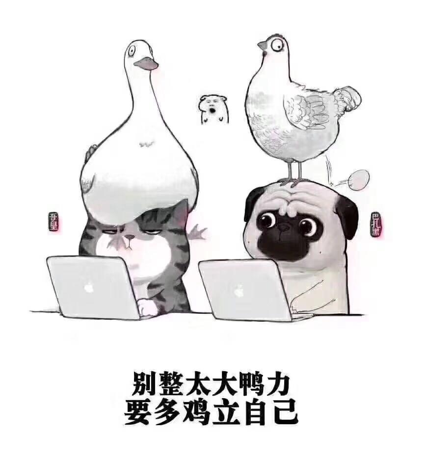
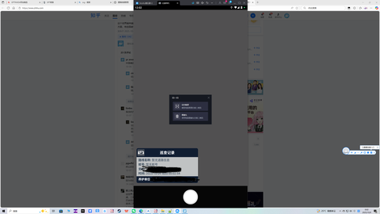
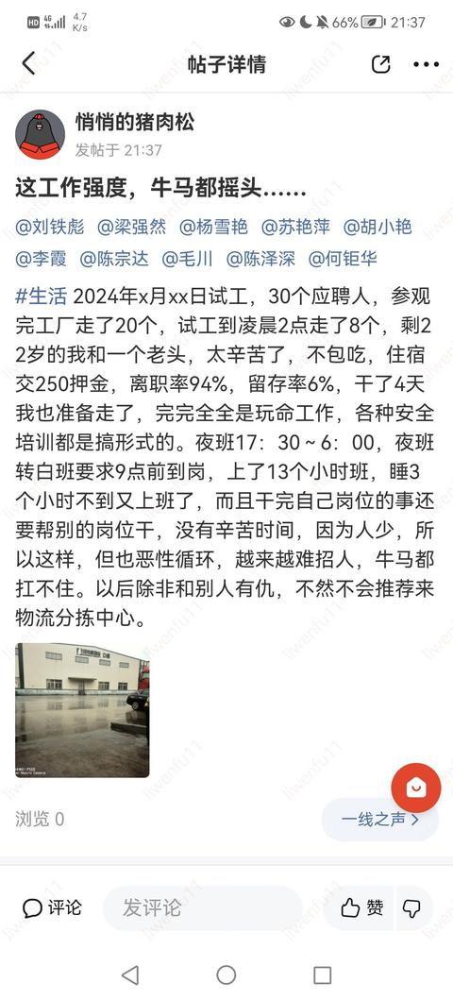
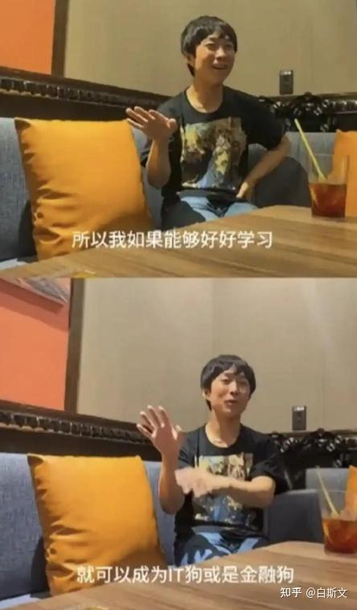
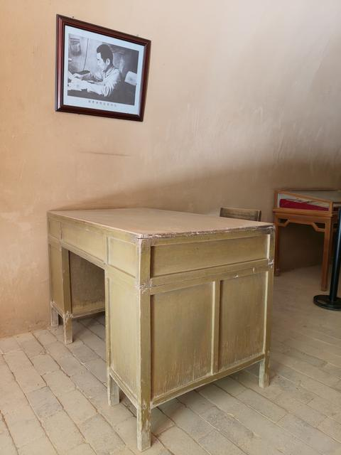

[toc]

# 问题

提问者：**<a href="https://www.zhihu.com/people/101-49-56">奋斗的蝼蚁101</a>**
提问时间: 2025-8-17 8:4:18
总回答数: 0
总访问量: 0

今天聊个比较扎心的问题：一份能把人榨干的烂工作，和突然没了工作断了粮，到底哪个更痛苦？

社交平台上有人这么问：一份表面光鲜、实则烂透的工作：钱少事多熬夜家常便饭，一点小错能给你放大成天塌了，天天自我消耗，生活完全被拖垮。另一边，是突然失业：人一下子没了重心，迷茫无措，钱包迅速见底，吃了上顿愁下顿。一个累得想吐，一个穷得叮当响，都痛苦，让你选，你怎么选？

# 回答

回答者： **<a href="https://www.zhihu.com/people/li-lin-lang-2">王富贵儿</a>**
回答时间: 2025-9-26 8:20:4
点赞总数: 34597
评论总数: 1609
收藏总数: 36175
喜欢总数：1249

 **我看完了《周恩来传》，发现一个问题：** 

哪怕位高权重如周总理，在工作中也很不如意。

陈独秀做负责人时，是典型的妥协派；周总理跟他意见相左，但又无可奈何；

等换了李立三当老大，又变成了左倾冒险主义，周总理还是持不同意见，但也只能尽力挽救，军事上出了问题还要被连累，明明做决议的不是他；

然后是王明博古李德当了领导，三人又是不知兵的，但自己这个受过黄埔军校和莫斯科正规军事培训的专业人才意见，他们又不听；

看似一直都是二把手，外人总说他长袖善舞，如鱼得水，但事实上，用共产国际调停国共矛盾时说的话就是：

相忍为国罢了。

\*他身体上和家庭上遭的罪我就不提了。

 **⭐️我看完了《毛泽东传》，发现一个问题：** 

哪怕能力强如教员，在工作中也有坐不完的冷板凳。

跟共产国际理念不合，被强行拿掉军事指挥权；

尽管三次反围剿取得了显著成果，但新领导上来就是推翻之前的一切，要结硬寨，打呆仗，跟老蒋硬碰硬；

好不容易在后方跑通了钨砂矿的销路，结果又被领导摘走了“长熟”的桃子；

经过4年的漫长等待，重回核心领导层，接手的却又是一个烂摊子。

上任第一把火，就被集体投了反对票。

\*二渡赤水后，因为主攻方向教员的决策，被林彪聂荣臻等否了。

等到确立了绝对的指挥权，碰到的抗日盟友又是个极不靠谱的。

总之教员的“创业之路”，就像他在《矛盾论》里写的：

> 一个矛盾克服了，又一个矛盾产生了。在任何时间、任何地方、任何人身上，总是有矛盾存在。

 **⭐️我看完了《埃隆·马斯克传》，发现一个问题：** 

尽管从毕业就开始创业，直接当上了老板。

埃隆·马斯克似乎一直也很痛苦。他第一次创业的项目Zip2很快收到了300万美元的融资，但资方跟他的理念有冲突，甚至还尝试架空他；

马斯克缺少共情能力，不擅长跟团队相处，哪怕是他的亲弟弟，他们也经常有分歧，有时候直接在办公室扭打。

马斯克第二次创业的时候，因为新婚度蜜月休假，被他的合伙人们联手解除了他CEO的职务；

马斯克在做SpaceX和特斯拉的时候，多次面临破产危机，尽管最后都挺过来了，但过程极其痛苦，马斯克一直在看心理医生。

 **⭐️我看完了俞敏洪的自述体传记和新东方的这些年大件事，发现一个问题：** 

老俞这个老板当的可谓是如履薄冰。

03年非典，现金链断裂，遇到家长集中退费，差点倒闭；

20年又疫情，21年疫情中遇到了双减政策，被迫转型三农直播做东方甄选。

苦熬一年没有任何进展，直到董宇辉一夜爆红，东方甄选才算活了过来···

但好日子不长，又遭遇小作文危机，最后董宇辉单飞创造自己的IP与辉同行···

看过《中国合伙人》的应该清楚，俞敏洪跟他的两位合伙人也因为理念问题，闹得不欢而散，甚至一度被逼得离开管理层。

⭕️

 **现在我的问题来了，如果老板或者“领袖”的工作都看起来那么痛苦的话。** 

 **世界上真的有好工作吗？** 

我有个朋友，利兹毕业之后进了外企爱立信中国，朝九晚五，疫情期间甚至试点了上4休3，各种福利拉满，结果爱立信经营不善，整个项目组干掉裁员了。上班的时候几乎对所有事满意，除了他的领导。最后裁员还捅了他一刀，本来有机会签欧洲一家公司，面试流程都走完了，结果背调黑了他···

拿了大礼包之后现在去了某第二梯队的互联网大厂，加班加到头秃。他也经常说这B班不上也罢；

可他的薪资换给很多人，都会觉得，这至少不是个“烂工作”；

⭐️ **说说我自己吧，从小喜欢看书写东西，现在开了个小公司，给客户做方案，理论上已经算是跟自己兴趣爱好很搭的工作了，我自己还是老板。** 

收入从7月份开始还行，亏损6个月之后开始单月盈利了。比我之前打工好点了。

但遇到客户外行指手画脚想改这改那的时候，也想喊一句：老子不伺候了。

但为了钱还是不得不一遍又一遍地改。

以前上班最多996，现在好了，自己创业007。

有客户的时候觉得客户SB，没客户的时候焦虑下个月的收入咋办···

 **⭕️所以，我这算是好工作还是烂工作？** 

心理学上有一个术语叫做：

损失厌恶，在这个问题的语境下是指：

> 人们对损失的敏感度远大于对获得的敏感度。在工作中，一次批评带来的痛苦感，可能需要五次表扬才能抵消。一个“较好”的工作环境中，依然存在挫折和负面情绪（如截止日期压力、人际摩擦），这些“损失”会被大脑放大，从而产生不成比例的痛苦。

也就是说，人们在工作上感到快乐很难，但感到痛苦却非常容易。

让一个人快乐的工作可能需要同时满足：

 **高薪、有意义、轻松、良好的人际关系、低风险、有归属感、能帮你成长···** 

可能满足所有的条件你才会感到快乐，但让你痛苦，只需要一个因素不满足就足够了。

而且上面所说的几个条件，还存在一些不可能三角：

 **一个工作不可能在高薪的同时，还轻松/低风险。** 

\*回头看看前面那几个大人物的传记，也再次验证了这句话。

⭐️

 **讲了这么多故事，我有一个关于工作的观点想跟大家分享：** 

工作就是工作，没有烂工作也没有好工作。

工作就是为了赚钱养活自己。

工作的本质就是解决问题，赚钱。

解决的问题越难，薪资越高；

薪资越高，解决的问题越难，不确定性和风险性就更大。

 **能力越大，问题越大。** 

一个风投的创始人说：

 **老板是在用不确定性换取高收益，员工是用稳定性换取低收益。** 

谁的幸福感更高，不取决于外人怎么评价，而取决于当事人怎么看。

所以，当你在工作中感到痛苦时，请读读这句话：

>  **除了生理上的病痛即疾病，你所有的痛苦都是你的价值观带给你的。**   
>  **你的价值观变了，痛苦就不存在了。** 

工作不负责让你开心。

工作之外的生活，才是你开心的来源。

 **⭐️斯坦福大学职业规划课上有一个理论叫做：** 

当一个问题，像地球的重力一样无法被解决时，它就不是问题。

没有答案的问题不是问题。

它是环境本身，我们需要适应它。

工作中的某个负面情绪是有解决方案的。

但工作中的“痛苦”是无解的。

 **众生皆苦，人人平等，就看你怎么看待它。** 

除非你命很好，生长在一个锦衣玉食的家庭，可以一直不工作。

减少工作带来的痛苦。【实际上有人在替你负重前行

否则不工作永远都只是短暂逃离痛苦的解决方案。

因为你要生存，要赚钱。

当你在一份工作中，感到极度痛苦，即将崩溃，身体都出现了一些疾病信号的时候，你可以休息一段时间。

⭐️最终的解决方案是改变自己的认知。

强烈建议读读毛选中的《矛盾论》，多读几遍，读完人会通透很多。

 **因为《矛盾论》就是教员解决问题/痛苦的思路。** 

 **我们在工作中遇到的问题，不可能比教员更难了。** 

分享几个实际缓解了我工作中痛苦的段落：

①

> 生命也是存在于物体和过程本身中的不断地自行产生并自行解决的矛盾；这一矛盾一停止，生命亦即停止，于是死就来到。

②

> 党内如果没有矛盾和解决矛盾的思想斗争，党的生命也就停止了。

③

> 矛盾是普遍的、绝对的，存在于事物发展的一切过程中，又贯串于一切过程的始终。

④

> 没有顺利，无所谓困难；没有困难，也无所谓顺利。没有地主，就没有佃农；没有佃农，也就没有地主。没有资产阶级，就没有无产阶级；没有无产阶级，也就没有资产阶级。

这几段都是在说，问题是相对存在的，不要去对抗它。

去接受它，解决能解决的部分。

你的工资，就是来解决这些问题的，包括人际关系问题。

而解决实际问题的办法，也在《矛盾论》中。

以上~ [@知乎职场](https://www.zhihu.com/people/7da508b3129cef2b0105fc704dd7249d)

  

原文地址：[(王富贵儿)烂工作和失业哪个更痛苦？](https://www.zhihu.com/question/1940323024697013261/answer/1954822505710715784) 

# 评论

1. **王富贵儿** (<small title="河南">2025-9-26 21:58:29</small>): 创作不易，觉得对大家有帮助的，条件允许的可以在文章底部请俺喝杯咖啡呀～☕你们的认可是俺写作的最大动力～祝友友们都发财💰～有钱的捧个钱场，没钱的捧个收藏。手动比心～
   - <a href="https://www.zhihu.com/people/-----------------41-90">不要圣诞树</a> (<small title="湖南">2025-9-26 21:59:51</small>): ［赞］［赞］［赞］
   - <a href="https://www.zhihu.com/people/li-wei-66-13-22">李薇</a> (<small title="广东">2025-9-26 23:23:4</small>): 感谢分享，写的很好，很有收获，已请喝咖啡[［干杯］](https://picx.zhimg.com/v2-cb8443f07a41298e45191cef11b90fd2.gif?source=1d2f5c51)
   - <a href="https://www.zhihu.com/people/wutongsky">wutongsky</a> (<small title="陕西">2025-9-27 7:2:27</small>): ［感谢］［感谢］［感谢］
   - <a href="https://www.zhihu.com/people/hanboy">汉堡</a> (<small title="湖南">2025-9-27 11:12:40</small>): 看到你这名字，我怎么想起来以前江苏台的《新相亲大会》的一个嘉宾？［飙泪笑］当时磕了好一阵！
   - <a href="https://www.zhihu.com/people/liuyijun2021">刘翊钧</a> (<small title="回复于 2025-9-29 11:11:36/河北"> ✉️:汉堡</small>): 您这个名字是德甲汉堡吗？
   - <a href="https://www.zhihu.com/people/hanboy">汉堡</a> (<small title="回复于 2025-9-29 14:42:16/湖南"> ✉️:刘翊钧</small>): 哈哈！不是。就是一个绰号，被同学叫出来，就身边人约定俗成了，自己就用作网名了。
   - <a href="https://www.zhihu.com/people/yuan-shi-yi-2">很闲的何掌柜</a> (<small title="湖北">2025-9-30 11:16:41</small>): 接受问题，不去对抗不就没矛盾了吗
   - <a href="https://www.zhihu.com/people/10-22-98-28">行知合一</a> (<small title="回复于 2025-10-4 10:46:40/江西"> ✉️:很闲的何掌柜</small>): 你这个叫做逆来顺受［捂脸］［捂脸］［捂脸］
   - <a href="https://www.zhihu.com/people/tanek-78">祖宇</a> (<small title="回复于 2025-10-16 14:53:32/广东"> ✉️:很闲的何掌柜</small>): 这种属于唯心主义了
   - <a href="https://www.zhihu.com/people/hui-ge-18-81">孤独的小灰灰</a> (<small title="陕西">2025-11-17 8:57:49</small>): ［赞同］［赞同］［赞同］
   - <a href="https://www.zhihu.com/people/man-man-93-84-46">悦越</a> (<small title="江西">2025-11-18 15:56:18</small>): 我想把它打印出来。隔段时间让我儿子读一读。
   - <a href="https://www.zhihu.com/people/40-60-90-4-66">燕麦拿铁</a> (<small title="河南">2025-11-26 11:12:51</small>): 写的真好。我咋没看到请你喝咖啡的地方，是不是忘了开通赞赏？
   - <a href="https://www.zhihu.com/people/40-60-90-4-66">燕麦拿铁</a> (<small title="河南">2025-11-26 11:13:51</small>): 看到了看到了，请一杯瑞幸9.9吧~
   - **王富贵儿** (<small title="回复于 2025-11-26 19:44:52/河南"> ✉️:燕麦拿铁</small>): 手动比心［感谢］
   - <a href="https://www.zhihu.com/people/nuan-nuan-nuan-52">猕猴桃nuan</a> (<small title="江苏">2025-12-18 10:9:2</small>): 哈哈哈，收藏啦老铁［大笑］
   - <a href="https://www.zhihu.com/people/soso-68-32-37-19">soso</a> (<small title="广东">2025-12-19 10:57:25</small>): 我是冲着大佬们的传记点进来看的。看完确实觉得作者写得很实在。收藏啦！谢谢  
 
  
 
看到的友友点我个关注呗，在攒100粉丝，收到必回关。感谢支持［感谢］
   - <a href="https://www.zhihu.com/people/jiang-xiao-li-77-43">美丽滴活着</a> (<small title="福建">2025-12-19 11:53:30</small>): 哇，富贵儿，想起小红娘了
   - <a href="https://www.zhihu.com/people/qian-xiu-84-21">浅修</a> (<small title="河南">2025-12-23 9:7:9</small>): 牛的，作者。
   - <a href="https://www.zhihu.com/people/47-48-28-28-4">三文鱼</a> (<small title="江西">2026-1-6 23:21:42</small>): ［赞同］［赞同］［赞同］［赞同］
   - <a href="https://www.zhihu.com/people/liang-xin-fei-29-50">暖阳</a> (<small title="广东">2026-1-21 15:38:39</small>): 写的真牛，这创造力无人能及［感谢］
   - <a href="https://www.zhihu.com/people/bao-bao-48-84-51">得老天眷顾</a> (<small title="河北">2026-1-22 22:34:25</small>): ［感谢］［感谢］［感谢］
   - <a href="https://www.zhihu.com/people/neng-shang-neng-xia-19">能上能下</a> (<small title="天津">2026-2-12 9:32:32</small>): 收藏 加油加油[［涨知识了］](https://pic1.zhimg.com/v2-da2e791835353bb9ac70900d00b4f5da.gif?source=1d2f5c51)
   - <a href="https://www.zhihu.com/people/feng-qing-yun-dan-80-91-15">陌上花</a> (<small title="北京">2026-2-25 8:10:18</small>): 创作不易，互相珍惜［赞］［赞］
   - <a href="https://www.zhihu.com/people/wo-ke-yi-lu-ni-jia-mao-ma">阿珍你来真的啊</a> (<small title="回复于 2026-3-9 9:38:43/湖北"> ✉️:很闲的何掌柜</small>): 我跟你想的差不多，我不算烂工作但是有烂同事，我已经小半年没跟对方说话了（除必要的工作交接 ，工作很配合其余废话一句不说），对方想找茬但无法选中，我反正摆烂了，不爽那你报警吧［doge］
   - <a href="https://www.zhihu.com/people/yuan-shi-yi-2">很闲的何掌柜</a> (<small title="回复于 2026-3-18 12:35:33/湖北"> ✉️:行知合一</small>): 原来是这个啊，也有结局了哪怕我这样，也被公司裁员了，逆来顺受不可行啊
   - <a href="https://www.zhihu.com/people/yuan-shi-yi-2">很闲的何掌柜</a> (<small title="回复于 2026-3-18 12:35:53/湖北"> ✉️:阿珍你来真的啊</small>): 被裁员了，不行啊，你呢
   - <a href="https://www.zhihu.com/people/wo-ke-yi-lu-ni-jia-mao-ma">阿珍你来真的啊</a> (<small title="回复于 2026-3-18 12:42:36/湖北"> ✉️:很闲的何掌柜</small>): 摆烂中，我都巴不得裁我赔一笔钱，早tm不想干了［笑哭］
   - <a href="https://www.zhihu.com/people/yuan-shi-yi-2">很闲的何掌柜</a> (<small title="回复于 2026-3-29 18:15:48/湖北"> ✉️:阿珍你来真的啊</small>): 摆烂对我来说百害无一利，失业到现在少赚好几万，这是我走过的路，这些天熟读毛选其他各类书籍再到处游玩，觉得天地广大，人不能没有志气，如果你还在岗位，就与工作中的问题搏一搏，也到有趣，天地广阔不要稀里糊涂就过去了，不虚度光阴，有实力就狂，隐忍只是片刻，也是对我说也是对你说。
   - <a href="https://www.zhihu.com/people/feng-xiao-9">闻仲</a> (<small title="北京">2026-4-2 18:28:37</small>): 已请咖啡，写得不错
   - <a href="https://www.zhihu.com/people/zhilii5my5">蔡姐来过</a> (<small title="广东">2026-4-19 16:16:9</small>): 这是明晃晃的的要钱呢？很直接，很好我喜欢，我也想像这样子。
   - <a href="https://www.zhihu.com/people/luo-xia-91-82">MasonYang</a> (<small title="广东">2026-5-19 10:5:52</small>): 感谢分享
   - <a href="https://www.zhihu.com/people/dong-bu">流沙</a> (<small title="广东">2026-5-28 15:36:9</small>): 你说的很对，很好，但是真的很痛苦
   - <a href="https://www.zhihu.com/people/qi-nan-zi-jin">孟德斯鸠</a> (<small title="湖北">2026-7-22 9:38:14</small>): 你想过工地的工作吗？全年无休，工资半年发一次还降薪？
   - <a href="https://www.zhihu.com/people/ju-bei-yao-ming-yue-44-43">举杯邀明月</a> (<small title="日本">2026-8-14 23:9:27</small>): ［哇］［赞］
2. <a href="https://www.zhihu.com/people/5-64-92-87">瞬间记忆</a> (<small title="广东">2025-9-26 12:26:8</small>): 所谓的痛苦，除了身体疾病所带来的疼痛外，很多是你的价值观所带来的
   - <a href="https://www.zhihu.com/people/jimsoupchen">JimSoup</a> (<small title="广东">2025-9-26 20:15:50</small>): 这句话老听到，但依然解决不了痛苦的感受。说明：每个人都有价值观，只要有价值观，就一定有对应的痛苦。
   - <a href="https://www.zhihu.com/people/han-geng">韩耿律师</a> (<small title="陕西">2025-9-26 20:19:16</small>): ［赞同］［赞同］［赞同］
   - <a href="https://www.zhihu.com/people/jie-xiao-38-82">二三</a> (<small title="回复于 2025-9-26 21:7:24/加拿大"> ✉️:JimSoup</small>): 你这段和叔本华说的痛苦和无聊的观点一样。也许宿命或悲观了？
   - <a href="https://www.zhihu.com/people/snowtree-95">snowtree</a> (<small title="广东">2025-9-26 21:18:16</small>): 除了身体疾病，精神痛苦大多也是生理性的，与环境及三观可以关系不大。
   - <a href="https://www.zhihu.com/people/chu-zhong-3">初众</a> (<small title="回复于 2025-9-26 23:49:2/黑龙江"> ✉️:JimSoup</small>): 都有，但是多和少是有区别的，我就认识不长心的人，不可能没有烦恼，但比普通人快乐得多
   - <a href="https://www.zhihu.com/people/linonetwo">林一二</a> (<small title="上海">2025-9-27 0:8:10</small>): 价值观也是地球OL最有意思的玩点，例如先烈的价值观就是祖国伟大光复中国，所以他们玩出了全服罕有的剧情。当然大部分人可以直接选择不玩。
   - <a href="https://www.zhihu.com/people/zhong-cheng-hui-89-42">必归尘</a> (<small title="回复于 2025-9-27 8:15:49/上海"> ✉️:JimSoup</small>): 解决不了谁的痛苦感受？你的，答主的，他文中举例的各种人物？你们的感受一样吗？你认为自己真知道他们的感受吗？
   - <a href="https://www.zhihu.com/people/xian-ting-gao-shan">闲听高山</a> (<small title="回复于 2025-9-27 12:18:40/广东"> ✉️:JimSoup</small>): 有大有小，释迦摩尼，庄子此类人痛苦很小，但是可能上百亿人里才出一个
   - <a href="https://www.zhihu.com/people/tang-sir">五线城市农民</a> (<small title="四川">2025-9-27 14:3:3</small>): 这句话是没用的，因为不要价值观也是一种价值观
   - <a href="https://www.zhihu.com/people/54-89-47-24">哇哈</a> (<small title="回复于 2025-9-27 20:36:23/广东"> ✉️:闲听高山</small>): 释迦故国被灭，父妻被囚，你说他痛不痛苦
   - <a href="https://www.zhihu.com/people/ya-ya-ya-ya-ya-94-64">呀呀呀呀呀</a> (<small title="回复于 2025-9-28 0:50:0/广东"> ✉️:snowtree</small>): 那与什么关系大，精神痛苦就是环境与三观不同带来的
   - <a href="https://www.zhihu.com/people/liu-si-79-76">织生</a> (<small title="回复于 2025-9-28 10:30:20/未知"> ✉️:JimSoup</small>): 虽然不能解决，但是能够减轻或者缓解。
 
举个例子：学生时代总是有些风言风语，如果认为说风言风语的都是一群傻逼，根本不值得自己去认真对待，对这种情况也就没什么痛苦了。这也是“人不可无傲骨”的一种价值观体现
   - <a href="https://www.zhihu.com/people/q6jadb">知乎用户q6JadB</a> (<small title="回复于 2025-9-28 10:33:24/四川"> ✉️:JimSoup</small>): 还有句老话就是当你没有吃饱的时候你只有吃不饱一个烦恼，当你吃饱后烦恼就多了
   - <a href="https://www.zhihu.com/people/liu-gu-73-60">六呱</a> (<small title="湖北">2025-9-28 11:45:41</small>): 良心带来的［捂脸］
   - <a href="https://www.zhihu.com/people/5-64-92-87">瞬间记忆</a> (<small title="回复于 2025-9-28 12:1:31/广东"> ✉️:六呱</small>): 良心也是一种价值观，利他［捂脸］
   - <a href="https://www.zhihu.com/people/snowtree-95">snowtree</a> (<small title="回复于 2025-9-28 12:15:40/广东"> ✉️:呀呀呀呀呀</small>): 内分泌，基因。
   - <a href="https://www.zhihu.com/people/apple-du-64">Apple Du</a> (<small title="回复于 2025-9-28 13:3:25/四川"> ✉️:五线城市农民</small>): 它的解决之道不是不要价值观，是不要让人痛苦的价值观吧，可以用积极的价值观替换呀
   - <a href="https://www.zhihu.com/people/yang-shao-54-58">苏明阳</a> (<small title="浙江">2025-9-29 11:10:0</small>): 那倒不是还有你的同事领导敌人折磨你带来的
   - <a href="https://www.zhihu.com/people/da-cheng-48-60">大橙</a> (<small title="回复于 2025-9-29 11:53:8/贵州"> ✉️:闲听高山</small>): 不是先有极大的痛苦便成为不了释迦摩尼、庄子
   - <a href="https://www.zhihu.com/people/ji-yi-yi-mo-hu">记忆已模糊</a> (<small title="回复于 2025-9-29 17:34:45/北京"> ✉️:snowtree</small>): 不就是精神病（并不是骂人），这不还是生理上的问题，价值观带来的痛苦若是自己不去调整，时间长了就会反映在生理上，从而造成生理上的痛苦，但这种痛苦本质上还是价值观导致的，你不解决价值观的问题，光看身体上的问题是解决不了的
   - <a href="https://www.zhihu.com/people/1233211234567-41-1">被开过盒所以怕了</a> (<small title="山东">2025-9-30 21:32:40</small>): 唯心主义，可以理解但无法接受
   - <a href="https://www.zhihu.com/people/han-jia-hui-40">夜袭白帝城</a> (<small title="回复于 2025-10-9 15:37:18/江苏"> ✉️:JimSoup</small>): 只要是活人，就一定有让你不舒服的事情
   - <a href="https://www.zhihu.com/people/64-63-74-48-35">肆意挥洒</a> (<small title="中国">2025-10-12 15:43:16</small>): 是的，但是我觉得是人性的本质驱使让价值观不断的改变。人性是很可怕的，尤其是贪婪和嫉妒。
   - <a href="https://www.zhihu.com/people/5-64-92-87">瞬间记忆</a> (<small title="回复于 2025-10-12 16:8:1/广东"> ✉️:肆意挥洒</small>): 人性有两面性
   - <a href="https://www.zhihu.com/people/yong-hu-7081221891">用户7081221891</a> (<small title="回复于 2025-10-18 8:48:26/上海"> ✉️:snowtree</small>): 精神痛苦都是精神病了说是
   - <a href="https://www.zhihu.com/people/yong-hu-7081221891">用户7081221891</a> (<small title="回复于 2025-10-18 9:14:21/上海"> ✉️:snowtree</small>): 精神状态受生理机制驱动这一点无可厚非，但要明确区分两种情况：一种确实是大脑生理机制本身出了问题，由此引发的精神问题才是真正的生理性问题；另一种是环境刺激或价值观差异带来的精神影响，这种情况中大脑生理机制没有出现器质性异常，更多是生理机制在正常运作下，对外部环境和内在认知做出的相对反应。对于正常人来说后者情况更多，所以不能像你说的那样，把这类精神痛苦都视为生理性问题，这完全忽视了环境与三观对精神内在的作用。
   - <a href="https://www.zhihu.com/people/snowtree-95">snowtree</a> (<small title="回复于 2025-10-18 10:54:29/广东"> ✉️:用户7081221891</small>): 我的意思是精神痛苦来源可能非常多样，不能只限制于有限的几种原因。
   - <a href="https://www.zhihu.com/people/yong-hu-7081221891">用户7081221891</a> (<small title="回复于 2025-10-18 12:1:54/江苏"> ✉️:snowtree</small>): 没错，精神痛苦来源确实是多样的，这一点我们达成共识。我是对你发表的‘除了身体疾病，精神痛苦大多也是生理性的，与环境及三观可以关系不大。’的观点进行回应。你这一表达更倾向于生理的单方面作用，恰恰没有体现‘多样性’这一点，反而在弱化且否定‘价值观、现实环境’这两类对正常人而言更常见的痛苦来源。我回应中的区分不同来源，本质是想指出：不能用‘大多是生理性’的单一判断，掩盖并忽略了环境与三观对于普通正常人精神状态的核心影响。  
 
生理疾病、价值观、现实环境这类属于‘痛苦来源’这一层次范畴，也许是你将‘实行痛苦’的这套人体反应生理基础机制，归纳到了‘痛苦来源’的层次范畴中。但这套生理反应机制只是一种基础中间工具。只要基础中间工具没有出错，也就是没有精神疾病的情况下，‘基础工具’不能算作‘痛苦来源’同一层次范畴中。
   - <a href="https://www.zhihu.com/people/yunfan01">品古医学知识</a> (<small title="回复于 2025-10-30 15:29:45/福建"> ✉️:JimSoup</small>): 还是要自己改变价值观呢，多读书，自己洗脑自己［大笑］
   - <a href="https://www.zhihu.com/people/zuo-tian-1-98">知否</a> (<small title="北京">2025-11-3 21:6:33</small>): 疾病也分人，感冒对我来说就不算病
   - <a href="https://www.zhihu.com/people/13-49-75-11">瑛子短剧场</a> (<small title="江苏">2025-12-12 17:44:16</small>): 什么才是痛苦，没有绝对的痛苦，也没有绝对幸福。只有感受痛苦，感受幸福吧了。比如身体健康的人，他因为钱不能满足，而感到痛苦；钱化不掉的人，又因为身体有患或情感不能满足而痛苦等等，所以，我们要积极向上，不要因为一点点的挫折而感到痛苦。
   - <a href="https://www.zhihu.com/people/eer-57">EEr</a> (<small title="广东">2025-12-19 9:54:53</small>): 复制粘贴这些网红句奉为圭臬，你没有自己的思考的么
   - <a href="https://www.zhihu.com/people/51-61-60-80-10">莫辛纳甘1891</a> (<small title="河北">2025-12-19 10:8:17</small>): 然而人之所以为人，正是因为超脱了温饱和趋利避害的动物本能，拥有了价值观的所在。你认为价值观能带来痛苦的同时，就要承认价值观同样能带来快乐和成就
   - <a href="https://www.zhihu.com/people/soso-68-32-37-19">soso</a> (<small title="回复于 2025-12-19 11:0:15/广东"> ✉️:JimSoup</small>): 可是没有价值观的话，就变成违心或空心。虽然痛，至少真实，学会调整和取舍就变成智慧。
   - <a href="https://www.zhihu.com/people/yangtaowork">江南</a> (<small title="四川">2025-12-19 12:48:47</small>): 有欲皆苦，不过伟人的欲和普通人的欲不同罢了。
   - <a href="https://www.zhihu.com/people/he-he-3-24-47">金波</a> (<small title="安徽">2025-12-19 15:46:19</small>): 对！身体带来的痛苦，最难解决，有些即使是现代医学也是解决不了的。
 
那个是客观制约，没有办法。
 
  
 
但是价值观痛苦，其实只要一念抓换，就可以马上消除，但这一转念，也不是那么容易的事
   - <a href="https://www.zhihu.com/people/ma-la-tang-88-34">工号002</a> (<small title="湖北">2025-12-19 17:41:5</small>): 降低自己的职业道德感，就会好很多
   - <a href="https://www.zhihu.com/people/fang-fang-53-39-89">诗sss</a> (<small title="回复于 2025-12-27 0:57:28/广东"> ✉️:记忆已模糊</small>): 赞同一部分 不过很多人就是因为家庭包括自己经历太多不好的事情 所谓的负能量了，厉害的人才会抑郁，因为不厉害的已经🔪了
   - <a href="https://www.zhihu.com/people/ai-you-wo-cao-zhu">华岚</a> (<small title="浙江">2026-4-20 11:25:23</small>): 一个人的价值观，是由天赋和后天的环境给予的。个体本身没有选择的能力。要么足够聪明例如哲学家能自己想明白，要么原声家庭，学校，工作环境足够优秀，把好的价值观传递。
   - <a href="https://www.zhihu.com/people/a-ha-53-31-97">鲁小一</a> (<small title="上海">2026-6-11 8:58:46</small>): 难道要为了逃避痛苦而改变自己的价值观？
   - <a href="https://www.zhihu.com/people/leo-59-56">北海之歌</a> (<small title="浙江">2026-6-29 21:12:58</small>): 这句真的是警世名言！但是能领悟并加以实践的，真的少之又少，需要强大的自我调试能力。
   - <a href="https://www.zhihu.com/people/li-xu-89-64">荒诞绅士</a> (<small title="江苏">2026-6-30 11:28:21</small>): 做人是要有坚定的价值观的，照你这么说 做个有灵活价值观的烂人就没痛苦了是吧
   - <a href="https://www.zhihu.com/people/qi-nan-zi-jin">孟德斯鸠</a> (<small title="湖北">2026-7-22 9:38:21</small>): 你想过工地的工作吗？全年无休，工资半年发一次还降薪？
3. <a href="https://www.zhihu.com/people/wang-98-57-54">Wang</a> (<small title="湖北">2025-9-26 16:57:57</small>): 人生路上起起伏伏、坑坑洼洼，没有绝对一帆风顺的时候， 当登上高峰的时候也就是就开始走下坡路了，在谷底的时候其实每一步都是向上的。所以心态一定要好 凡事看淡点。
   - <a href="https://www.zhihu.com/people/bb-gb-20">拔剑四顾心茫然</a> (<small title="新疆">2025-9-29 12:30:40</small>): 看完您的评论，心里豁达了很多。仔细想想，人不可能一辈子倒霉，也不能一直顺利。所谓否极泰来就是这样的吧。
 

   - <a href="https://www.zhihu.com/people/li-xue-yan-99-20">Viviene LI</a> (<small title="中国香港">2025-10-9 18:10:25</small>): 感謝您的回答，對我的鼓勵很大［流泪］
   - <a href="https://www.zhihu.com/people/17788-3-54">知乎用户17788</a> (<small title="上海">2025-10-17 11:38:53</small>): 说的对，生活不满意十之八九，都只能自己经历，调整好心态，看淡些
   - <a href="https://www.zhihu.com/people/ma-yuan-jing-49">Unlocked1222</a> (<small title="宁夏">2026-1-12 23:50:55</small>): 哇哦 被这个观点惊艳 登上高峰就=走下坡路 在谷底其实每一步都是向上的
   - <a href="https://www.zhihu.com/people/xiao-nan-gua-8-36">西点</a> (<small title="海南">2026-4-1 17:21:49</small>): 爱了爱了你的评语，感谢你的指点
   - <a href="https://www.zhihu.com/people/zhang-ting-ting-38-63">年年超神了</a> (<small title="浙江">2026-6-2 18:35:15</small>): 工作真的带来很大痛苦，每天都在心理疏导，感谢友友们的安慰
   - <a href="https://www.zhihu.com/people/kang-kang-xue-shen-99">Kang</a> (<small title="北京">2026-6-5 10:1:48</small>): 我的观点是越是位高权重的工作，责任越大，则应该越“痛苦”。达则兼济天下，肉食者有义务创造让打工人更舒心，更工作生活平衡的日子；打工人理应过上承担责任少的，舒心的生活。
   - <a href="https://www.zhihu.com/people/qi-nan-zi-jin">孟德斯鸠</a> (<small title="湖北">2026-7-22 9:38:27</small>): 你想过工地的工作吗？全年无休，工资半年发一次还降薪？
4. <a href="https://www.zhihu.com/people/tong-you-14">恶意</a> (<small title="重庆">2025-9-28 7:52:58</small>): 罗翔老师的话：没有好工作，只有好好工作
   - <a href="https://www.zhihu.com/people/zhang-shuai-39">张帅</a> (<small title="四川">2025-10-9 8:22:6</small>): 烟草局、电力局等单位的算不算好工作
   - <a href="https://www.zhihu.com/people/sx9ybg">知乎用户sX9Ybg</a> (<small title="回复于 2025-10-9 14:7:22/山西"> ✉️:张帅</small>): 他们有她们的烦恼
   - <a href="https://www.zhihu.com/people/zi-fei-yu-14-96-71">葭月十六</a> (<small title="回复于 2025-10-23 11:53:39/江苏"> ✉️:张帅</small>): 算
   - <a href="https://www.zhihu.com/people/hu-shi-san-lang-77">狐十三郎</a> (<small title="回复于 2025-10-27 18:22:33/广西"> ✉️:张帅</small>): 不一定全是好工作。烟草局、电力局也是有很多活要干的，也会有一些人累的半死，一些人坐享其成。好不好的看你属于哪一波人了。单论收入都不错，但工作好坏可不仅仅是看收入。
   - <a href="https://www.zhihu.com/people/chen-lu-67-71">王路</a> (<small title="回复于 2025-12-3 22:54:7/甘肃"> ✉️:张帅</small>): 烦恼来自于自己，这些单位同样有同工不同酬，甚至干的多拿的少，即便拿的少仍比其他单位多，你要是那个不被公平对待或者被打压的那个这还算不算好工作？
   - <a href="https://www.zhihu.com/people/zhang-shuai-39">张帅</a> (<small title="四川">2025-12-4 14:59:56</small>): 你这完全是偷换概念
   - <a href="https://www.zhihu.com/people/yi-ge-45-58">一个</a> (<small title="回复于 2025-12-14 22:1:13/陕西"> ✉️:张帅</small>): 这怎么算偷换概念？他能考进去肯定横向对比呀。不可能和你对比吧？［赞同］
   - <a href="https://www.zhihu.com/people/wang-chuan-34-29">忘川</a> (<small title="回复于 2025-12-18 16:51:46/广东"> ✉️:张帅</small>): 累死累活，PUA、摘桃子一样存在，而且环境让你很难躺平，要么内心不自洽，要么所谓的“躺平”其实是好好工作的底线
   - <a href="https://www.zhihu.com/people/chen-chao-65-7">洗墨烹烟</a> (<small title="回复于 2025-12-19 20:7:35/湖北"> ✉️:张帅</small>): 我同学家里都是电力局的，他亲戚也都是电力局的，后辈都可以进电力局，几乎都快算世袭制了。但是他们年轻人，都不愿意去，原因就是觉得太苦太累了。
   - <a href="https://www.zhihu.com/people/xi-zi-16-46">爱学习的席字君</a> (<small title="回复于 2025-12-23 11:50:46/重庆"> ✉️:张帅</small>): 没有人会觉得工作是完美的，你问这些人，也会有形式主义重，关系户多，官僚作风强，个人价值能力无法体现等通病
   - <a href="https://www.zhihu.com/people/cui-gang-61-7">心弦轻弹</a> (<small title="回复于 2026-2-20 21:59:7/湖南"> ✉️:忘川</small>): 实际真是躺不了，你真躺，那刁难你的人多了。
   - <a href="https://www.zhihu.com/people/zhu-ming-rui-61">铁制鼠标</a> (<small title="广东">2026-2-22 15:54:43</small>): 从待遇来看是好工作，从稳定性来看是好，从工作内容来看未必，但也没有人是因为工作内容才考的公务员吧［大笑］
   - <a href="https://www.zhihu.com/people/hubugui-91">紫皮糖</a> (<small title="上海">2026-3-8 23:58:27</small>): 哈哈是的
   - <a href="https://www.zhihu.com/people/67-31-71-66">随便一个名</a> (<small title="回复于 2026-4-2 7:22:36/浙江"> ✉️:狐十三郎</small>): 给广东浙江的打工人，这绝对是好工作。你敢给就敢抢着要
   - <a href="https://www.zhihu.com/people/28-12-74-90-60">会飞的鱼</a> (<small title="回复于 2026-5-4 15:23:28/山东"> ✉️:洗墨烹烟</small>): 站的平台高度不一样。他所谓的累是建立在他现在的平台，比一般人位置高很多，没法比！
   - <a href="https://www.zhihu.com/people/qi-nan-zi-jin">孟德斯鸠</a> (<small title="湖北">2026-7-22 9:38:34</small>): 你想过工地的工作吗？全年无休，工资半年发一次还降薪？
5. <a href="https://www.zhihu.com/people/tian-xia-si-er">天下灬贰</a> (<small title="河南">2025-9-26 15:33:56</small>): 学会不放大自己经历的痛苦，不忽视自己拥有的幸福，那基本上就能处理好工作和生活。［酷］
   - **王富贵儿** (<small title="河南">2025-9-26 16:37:6</small>): [［赞同］](https://picx.zhimg.com/v2-cfc14c7293afd962ecbd1dc31dafd002.gif?source=1d2f5c51)
   - <a href="https://www.zhihu.com/people/lwj-24-36">清正廉洁赵立春</a> (<small title="回复于 2025-9-28 8:44:56/浙江"> ✉️:王富贵儿</small>): 看了那段历史后，还是很佩服周总理的，
 
  
 
这么多次，都没落到他头上，最后还算是安稳落地，
 
  
 
算是很不错了，非常智慧了。
   - <a href="https://www.zhihu.com/people/qian-yu-38-88-42">大道至简</a> (<small title="湖南">2025-10-9 1:40:10</small>): 你们都值得我学习，受教了！［拜托］
   - <a href="https://www.zhihu.com/people/zui-mei-bu-guo-cha-na-46">最美不过刹那</a> (<small title="山东">2025-10-9 15:21:39</small>): 人们往往只在乎自己得到的太少，不记得自己拥有什么。
   - <a href="https://www.zhihu.com/people/shi-zhong-ru-yi-14-80">始终如一</a> (<small title="广东">2025-10-23 22:55:28</small>): 这才是人本来该有的心态，看看网上的人，浮躁急了
   - <a href="https://www.zhihu.com/people/qi-nan-zi-jin">孟德斯鸠</a> (<small title="湖北">2026-7-22 9:38:39</small>): 你想过工地的工作吗？全年无休，工资半年发一次还降薪？
6. <a href="https://www.zhihu.com/people/you-ya-de-ci-wei-72-63">优雅的刺猬</a> (<small title="云南">2025-9-26 15:28:23</small>): 看完辞职的心没那么强烈了
   - **王富贵儿** (<small title="河南">2025-9-26 15:48:59</small>): 这就是对我的最高评价［蹲］
   - <a href="https://www.zhihu.com/people/dong-feng-xian-zi">东风仙子</a> (<small title="山东">2025-9-27 9:47:50</small>): 辞职没问题，但要想清楚为什么辞职，辞职能不能解决问题。
   - <a href="https://www.zhihu.com/people/sha-bi-15-76">农民</a> (<small title="回复于 2025-10-1 22:39:34/湖南"> ✉️:东风仙子</small>): 半年换了三份工作了，辞职没有用［衰］［衰］
   - <a href="https://www.zhihu.com/people/chen-xiao-nuo-50-13">晨小诺</a> (<small title="北京">2025-10-10 15:32:41</small>): 哈哈哈［大笑］［大笑］
   - <a href="https://www.zhihu.com/people/shao-hua-19-57">揽月</a> (<small title="回复于 2025-11-3 13:17:9/北京"> ✉️:王富贵儿</small>): 真的看完觉得还能再苟一苟
   - <a href="https://www.zhihu.com/people/he-he-3-24-47">金波</a> (<small title="安徽">2025-12-19 15:48:43</small>): 好死不如赖活。  
 
还有一个，一个上班族有没有出息，看他下班以后做什么。  
 
沉迷游戏，还是喝酒吹牛，还是有自己的想法在落地。这个也重要。  
 
国家还有五年计划呢。
 
  
 
工作和事业是可以分开的，工作是早九晚五，为了糊口，事业是自己安身立命的梦想。
 
上班族这辈子有没有出息，就看业余属于自己的时间是如何支配的了。
   - <a href="https://www.zhihu.com/people/xiao-mei-gui-84-25">糯米</a> (<small title="贵州">2025-12-20 0:57:42</small>): 哈哈哈哈救人一命胜造七级浮屠
   - <a href="https://www.zhihu.com/people/forever-yisheng-you-ni">forever-一生有你</a> (<small title="浙江">2026-1-25 16:21:19</small>): 我也有同感，就是一份工作而已
   - <a href="https://www.zhihu.com/people/tai-yang-zui-hong-43">太阳最红</a> (<small title="广东">2026-4-5 19:2:32</small>): 看完马上找一份高薪，压力小，离家近，成长好，氛围好，福利齐全的公司。
   - <a href="https://www.zhihu.com/people/111-53-18">TOMMY</a> (<small title="北京">2026-4-16 15:7:17</small>): 就是一鸡汤文
   - <a href="https://www.zhihu.com/people/zhiontlfmuu">单亲妈妈写网文</a> (<small title="四川">2026-4-17 9:28:2</small>): 现在的工作不好找，安安分分的做好一件事就行了。
   - <a href="https://www.zhihu.com/people/grlkic">知乎用户grLkiC</a> (<small title="山东">2026-5-16 9:39:31</small>): 哪能一样吗，总理心中的终极目标是什么，是为了建立新中国，有这个目标撑着，再多的苦也能吃。但我们平时的工作是为了什么，为了给老板换豪车换别墅
   - <a href="https://www.zhihu.com/people/chaos-32-61">chaos</a> (<small title="回复于 2026-6-27 17:16:5/福建"> ✉️:金波</small>): 没有朝九晚五，加班呢［尴尬］
   - <a href="https://www.zhihu.com/people/qi-nan-zi-jin">孟德斯鸠</a> (<small title="湖北">2026-7-22 9:38:47</small>): 你想过工地的工作吗？全年无休，工资半年发一次还降薪？
   - <a href="https://www.zhihu.com/people/77-63-40-65-62">无极限</a> (<small title="回复于 2026-8-18 21:39:41/河南"> ✉️:农民</small>): 我从去年年底找工作，也换了三个了，第一个试工两天，第二个干43天和大老板口角被辞退，现在的3.10入职，感觉又干不下去了，请一天假扣我工资，6个公司外账其中3个要做内账，还美其名曰招聘成本会计，还要做标书等其他杂活只有4000，请个假就拿不到了，昨夜气的一夜睡不着，今天还是很生气，跟大老板说了，她说这是公司政策，而且这政策只对我个人，其他人请假都不扣钱，其他人都是二老板招来的，我的工资大老板发一半二老板发一半，我是大老板招来的，之所以招我是让我审核他们的报销，他们本来都很排挤我，大老板又给我开最低工资，又处处优待出纳，发个小零食都是我最后一个，导致我更被孤立，大老板补偿了我200吗，那200是我8小时之外做业务推广的补贴，不想干又怕年龄大找不到工作，气的我一直长出气
   - <a href="https://www.zhihu.com/people/sha-bi-15-76">农民</a> (<small title="回复于 2026-9-4 8:52:34/湖南"> ✉️:无极限</small>): 财务有前景［调皮］［调皮］［调皮］
   - <a href="https://www.zhihu.com/people/77-63-40-65-62">无极限</a> (<small title="回复于 2026-9-4 9:47:4/河南"> ✉️:农民</small>): 还不如回家做农民
7. <a href="https://www.zhihu.com/people/hytree">hytree</a> (<small title="湖北">2025-9-27 9:6:12</small>): 这其实不是一个真问题，真问题不是如何接纳工作中的痛苦，教员，马斯克为什么能在那么困难和矛盾从生的情况下还能坚持，根源还是他们的信念和理想，接受和解决困难是执行的层面、不是他们能坚持下去的原因。普通人难以坚持下去的原因，是工作的无意义感，现在社会大部分工作都是社会大分工后细分的职业，你跟一个流水线上的工人说这些道理？他是不得不做，不是马斯克这种，他是主动选择要做更大的事情才接受过程中的艰难困苦
   - **王富贵儿** (<small title="河南">2025-9-28 7:51:36</small>): 缺少主观能动性就去提升自驱，我的方式就是读书。没有自驱或者信念感，谁也帮不了你
   - <a href="https://www.zhihu.com/people/yi-mei-piao-piao-55-16">衣袂飘飘</a> (<small title="广东">2025-9-28 13:52:42</small>): 你说的有意义，是在后来者看到他们成功后，感觉他们当初的努力与坚持有意义。在当时那个时代他们，也会像现在迷茫的人一样对未来的不可知而迷茫。
   - <a href="https://www.zhihu.com/people/linkcrazymind">linkcrazymind</a> (<small title="回复于 2025-9-28 14:19:52/上海"> ✉️:王富贵儿</small>): 还是要看你具体干的事，马斯克也好教员也好，工作就是他们的目标向的具体解决手段所以才会有很强的信念感。你让一个厂妹，厂哥的流水线工人对自己的工作有信念感？他们工作的目的是生存下去。马斯洛的第一层目标还没实现呢，何来信念感？教员当年也是做过图书管理员，开过学校，换了好多工作后才 成为职业革命家的。那说明如果以生存论，教员基本已经脱离生存压力，有了在当时社会足够的生存能力的。不革命，他也有足够能力活下去，而且活的相当不错的。马斯克就更别说了，第一次创业就满足了财富自由，后面的每次创业都是为了兴趣而做的。他们。都不存在生存危机，或者说在他们潜意识里是没有生存危机的意识的。而普通人，特别是国人，大部分都是生存危机第一位的，你这个工作不干，接下来怎么活？或者孩子怎么养，房贷怎么还？在这种情况下看再多书又如何可能培养出对信念感和自驱力？
   - <a href="https://www.zhihu.com/people/xie-peng-cheng-79-91">悦耳</a> (<small title="回复于 2025-9-29 18:46:9/上海"> ✉️:王富贵儿</small>): 读书能读出自驱和主观能动性？怕不是读成了纸上谈兵和本本主义
   - <a href="https://www.zhihu.com/people/rainylee-1">小虫子向上爬</a> (<small title="北京">2025-10-9 8:18:52</small>): 觉得工作是否有意义，是否能够坚持下去，还是在于个人的选择，一个有信念感的流水线工人，将来必定不只是流水线工人。教员、马斯克是先接受了生活中的困苦才有了主动选择的机会，还是有了主动选择的机会才接受了生活中的困苦，这是一个问题。
   - <a href="https://www.zhihu.com/people/ddgy">不是不能说</a> (<small title="回复于 2025-10-13 8:42:48/广东"> ✉️:王富贵儿</small>): 请问要提升自驱力或者信念感，读哪些书比较好，可以推荐吗
   - <a href="https://www.zhihu.com/people/xiao-yu-22-21-60">小鱼</a> (<small title="回复于 2025-10-27 7:12:17/上海"> ✉️:不是不能说</small>): 他也不知道，或者干脆推荐你看毛选［飙泪笑］
   - <a href="https://www.zhihu.com/people/yan-xiao-58-84">就这样吧累了</a> (<small title="回复于 2025-10-31 15:23:55/陕西"> ✉️:不是不能说</small>): 读书提升不了自驱力，做事才可以。具体方法就是工作中定期复盘、总结提升，通过不断地完成小任务小工作积累经验和信心，逐步在自己的生态位实现利益最大化，如果觉得平台嫁接不了自己能力再换去更好的平台
   - <a href="https://www.zhihu.com/people/38-34-21-64-41">守正待机出奇</a> (<small title="回复于 2025-11-3 18:40:50/四川"> ✉️:王富贵儿</small>): 我也不认同读书能解决问题，因为我就失败了，还是得做事，做具体的事情。
   - **王富贵儿** (<small title="回复于 2025-11-3 22:50:18/河南"> ✉️:守正待机出奇</small>): 读书是提升认知，但认知提升后需要结合实践，再通过实践调整认知，循环往复……
   - <a href="https://www.zhihu.com/people/yu-meng-ze-53">天天向上咸君</a> (<small title="新疆">2025-12-19 14:44:59</small>): 谁都会经历无意义感的工作，并且这个无意义感是你自己定义的，流水线上的工人吧工作干好这是非常有意义的，通过慢慢的工作来寻找你的目标。很多人没有目标，或者只是嘴上目标，比如说我是一个流水线上的人，我的目标是挣个小目标，但是我也不付出行动，我就机械的流水线，下班刷抖音，然后抱怨工作没意义，那我的目标就是嘴上目标。又比如你在流水线上，你的目标是挣个小目标，你在流水线上干活，寻找更高效，更方便的方法，并成功，获得推广，成为班长，主任，然后积累更多的资源，最后就算目标没完成，也是有反馈的。再比如说，他是个流水线工人，他的目标是个小目标，他好了半年发现自己这么干没有希望，就总结自己的优点，从事自己更擅长的工作，一边工作，一边优化，一边自我认知，最后找到自己适合的道路，也挺好。  
 
工作的意义不是某个人定义的，所以题主说通过阅读提高自我认知能力，是可以提高主观能动性的。但是如果你读九州缥缈录的话，可能就不算有效阅读了，铁甲依然在
   - <a href="https://www.zhihu.com/people/wu-yi-chuan-tang-feng-67-5">月光鹿</a> (<small title="回复于 2025-12-27 14:9:54/陕西"> ✉️:王富贵儿</small>): 有没有推荐的书单？
   - <a href="https://www.zhihu.com/people/40-61-59-11-33">陈硕</a> (<small title="广东">2026-1-22 12:24:34</small>): 那么多的书，读什么书呢？
   - <a href="https://www.zhihu.com/people/93-14-98-78">甜蜜滋味儿</a> (<small title="北京">2026-1-23 18:19:5</small>): 大部分人的劳动的追求结果的时候就把劳动关系商品化，那就失去了意义
   - <a href="https://www.zhihu.com/people/39-57-91-56-52">爱是三万里程孤单</a> (<small title="回复于 2026-3-14 21:27:15/重庆"> ✉️:王富贵儿</small>): 你还是没碰到，总有人的理念和信仰，需要的道路，和现在这个社会系统不可兼容。
   - <a href="https://www.zhihu.com/people/viva-44-31">Lenkav</a> (<small title="中国香港">2026-4-14 22:24:21</small>): 其实，更重要的是想明白，为什么。为什么那份烂工作你还做，想清楚自己图什么，能舍弃什么，拎得清不就没啥好纠结嘛！ 另外，目标和信念强的人，我觉得大概两类：一类别无选择，放弃更痛苦，没后路了; 一类就是，他们很清楚知道自己，想要的梦想人生。每个人都不同，更多是结合自己的三观，阅历，看你你想要什么样的人生。我觉得是在边做，复盘思考，再做，随着阅历，走过那段混沌期才会明白
8. <a href="https://www.zhihu.com/people/zhoushuang-83">蓝领</a> (<small title="广东">2025-9-27 6:34:30</small>): 我五十多岁了，至今没有经历过什么好工作，能力差吧。但也有一点心得，那就是别和文化素质低扎堆的人一起工作，除了最原始的互害毫无所得，这才是真痛苦的工作，而且这样的工作也不可能高薪。我说的是中国大多数制造业、服务业。
 
  
 
看了你的文章和大家的评论，你们都是脱离了低级趣味的人，从事着可以叫做工作的工作，而我前半生长期的工作不配叫工作，但这却是中国大多数人的命运。由此，你文章里关于毛泽东的部分，我更有不同的认知，那就是他的工作是真的伟大。
   - <a href="https://www.zhihu.com/people/47-69-70-80">岁祟岁</a> (<small title="湖北">2025-9-29 1:9:44</small>): 他说工作没有好坏之分我不赞同。起码有的工作体面，有的工作不体面，有的福利好，有的是赚血汗钱，如果工作没有好坏之分，谁还努力读书。工作中的麻烦痛苦对每个人也不一样，有的人对勾心斗角是半点无法忍受，有人还能乐在其中。所以工作该换还得换，适合自己最重要。
   - <a href="https://www.zhihu.com/people/pi-xing-yan-57">我有一只小白猫</a> (<small title="回复于 2025-10-5 14:11:24/天津"> ✉️:岁祟岁</small>): 有些人努力读书是因为读书使他快乐。
   - <a href="https://www.zhihu.com/people/57-77-83-12-84">知乎用户KpXEpu</a> (<small title="回复于 2025-10-13 9:51:33/江苏"> ✉️:岁祟岁</small>): 这就是你个人价值观带来的痛苦。
   - <a href="https://www.zhihu.com/people/wu-he-198311">多乐</a> (<small title="回复于 2025-12-6 21:25:7/浙江"> ✉️:知乎用户KpXEpu</small>): 但是人和人之间的区分不就活一个个人价值观吗
   - <a href="https://www.zhihu.com/people/hei-tao-20-13">我跪了</a> (<small title="广东">2025-12-17 5:8:0</small>): 但在当时的处境下，谁知道什么叫伟大不伟大？都是血肉之躯，枪林弹雨
   - <a href="https://www.zhihu.com/people/he-he-3-24-47">金波</a> (<small title="安徽">2025-12-19 15:51:51</small>): 说的太多了，我比你小一点，算是小老弟了。
 
从大城市落地到小县城，发现这里人，基本没有梦想，天天就是上班挣钱家长里短那些事。也可能沉浸其中是一种幸福。
 
但是我们不能沉浸其中的人来说，就是一种痛苦。
 
天天屁大的事吵来吵去，互相攻击，烦死了。
 
没有谁有一个清晰的目标和人生规划，没有谁有正能量可以带动自己，而自己的能量又不足以带动他们。
 
  
 
这样下去迟早被同化，只有下班后使劲看书。让写书的这些大能的人的能量来激励自己。
   - <a href="https://www.zhihu.com/people/hcm748">hcm748</a> (<small title="回复于 2025-12-23 3:5:28/浙江"> ✉️:金波</small>): 你痛苦是因为水土不服。小县城和大城市的核心区别，就是小县城其实是一个比较封闭的生态圈。基本的发展机会和收入上限被定死了，没有什么太大的上升空间。所以玩命卷是没有意义的。小县城里但凡比较轻松和赚钱的工作，基本上都和各大权力关系隐形绑定。剩下的工作，普遍性质的都是在一个水平线附近。那可不就整天只能掰扯家长里短的事情了嘛。人生规划有P用啊。县城压根就没什么赚大钱公司。你规划谁去啊。能卷的，年轻的时候去大城市卷一下。卷不动了，回县城，思维就该改过来。别老拿大城市的思维往小县城里去套，你很明显就是水土不服了。
   - <a href="https://www.zhihu.com/people/jjqhzzj">jjqhzzj</a> (<small title="回复于 2025-12-25 6:19:57/浙江"> ✉️:hcm748</small>): 去一下新昌
   - <a href="https://www.zhihu.com/people/wang-qian-53-98">沧海揽月</a> (<small title="河南">2026-4-2 14:38:30</small>): 赞同 工作环境和人际关系很重要，长期身处泥淖消耗的精气神是很难精准估算的，但现在大家一说好工作就只关注待遇好不好
9. <a href="https://www.zhihu.com/people/li-bo-77-50">老李的心理实验室</a> (<small title="河北">2025-9-26 17:0:14</small>): 还是有本质区别，你提到的例子都是在解决重要问题，所以更能接受痛苦，而普通人的工作很多就是工作，发挥不了主观能动性，所以感觉到痛苦。
   - **王富贵儿** (<small title="河南">2025-9-26 18:18:35</small>): 可以去读读他们的传记，以马斯克为例他们当时对抗的问题有的是社会制度问题，别说主观能动性了，啥能动性都不好使。不用过分夸张我们遇到的困难。
   - <a href="https://www.zhihu.com/people/yan-jin-41-79">楚水</a> (<small title="广东">2025-9-26 23:23:18</small>): 面对小问题、克服小困难的忍耐力和手段都没有，真的面对上那些生死存亡的大问题，别说主观能动性了，怕不是两眼一黑直接晕倒［捂脸］
   - <a href="https://www.zhihu.com/people/chu-zhong-3">初众</a> (<small title="黑龙江">2025-9-26 23:50:2</small>): 不能这么说，解决重要问题压力和折磨也更大，你搞了烂摊子可是要追责的
   - <a href="https://www.zhihu.com/people/xiao-ke-55-48-70">萧柯</a> (<small title="回复于 2025-9-27 8:35:21/西藏"> ✉️:王富贵儿</small>): 是啊，主观能动性也可以是乐观接受，积极面对。古人有话，尽人事听天命！是吧，也是一种主观能动性的表现吧。
   - <a href="https://www.zhihu.com/people/dong-feng-xian-zi">东风仙子</a> (<small title="山东">2025-9-27 9:47:3</small>): 你觉得他们是在解决重要问题，是事后诸葛的判断啊，当时谁知道啊，就算知道又有几个人能坚持下来啊，就算坚持又有几个人能幸运的走过来啊！
   - <a href="https://www.zhihu.com/people/yu-san-tu-17">书袋里的猫胡子</a> (<small title="江西">2025-9-28 9:18:48</small>): 不考虑工资和工作强度的情况下，不用发挥主观能动性的工作才是舒服的，只需要按部就班，太轻松了。
   - <a href="https://www.zhihu.com/people/q6jadb">知乎用户q6JadB</a> (<small title="四川">2025-9-28 10:35:58</small>): 我看了下教员和设计师，他们的做事风格几乎一致，就是忍耐中斗争，斗争中坚持，坚持中忍耐［捂脸］
   - <a href="https://www.zhihu.com/people/ban-zhu-dui-chang">斑竹队长</a> (<small title="江苏">2025-9-28 18:59:24</small>): 那你根本没理解答主的意思，还在强调个人工作中的困难，谁都有困难，只是困难的表现形式各有不同。
   - <a href="https://www.zhihu.com/people/ysz-82-68">yeahspelrve</a> (<small title="湖北">2025-9-28 22:44:6</small>): 他们也是从客服小问题开始的
   - <a href="https://www.zhihu.com/people/yao-wei-nuo-91">momo</a> (<small title="上海">2025-9-29 10:18:52</small>): 他们当时创业的时候也不知道未来自己的坟前是鲜花还是牛粪，干就完了，人只要在劳动，总能创造出一点价值的
   - <a href="https://www.zhihu.com/people/liu-51-87">liu</a> (<small title="湖北">2025-9-29 14:44:22</small>): 我跟你感觉一致，这作者说了半天，就说了一个字“忍”，没触及到事物的本质：付出与收获的比较，所有痛苦来源于收获与付出不匹配，他举的例子都很表面，都是些容错率低但回报巨大的人物，成功的收获期望值还是很高的，心理压力是付出的一部分。而普通人可能连评估付出和收获的能力都没有，同时也不具备接受沉没成本的胆量，造成死结，只会痛苦却不能解决问题。  
 
一旦觉得值得，并能忍受的时候，那就继续向前。如果判断不值得，或者客观条件无法忍受，那就直接换个环境，走人！毕竟大部分人改变不了环境，只能改变自己。
   - <a href="https://www.zhihu.com/people/liu-51-87">liu</a> (<small title="回复于 2025-9-29 14:46:16/湖北"> ✉️:东风仙子</small>): 大概率是AI写的，基本无参考性，通俗讲就是：不接地气，举的全是神话故事一样的例子
   - <a href="https://www.zhihu.com/people/shi-ji-meng-nan-54">世纪猛男</a> (<small title="江苏">2025-10-1 11:49:53</small>): 什么是重要问题，什么是简单问题。什么是好工作，什么是烂工作。问题就是问题，工作就是工作。矛盾就是矛盾，一切都是对立且统一的。矛盾停止生命停止，问题停止时就是一切结束时。
   - <a href="https://www.zhihu.com/people/fang-shi-yi-yue">方十一</a> (<small title="北京">2025-10-3 12:17:43</small>): 我懂你的意思，现在很多人的痛苦还有很大一部分是劳动的无意义感，这是资本主义对人与劳动的异化带来的，知道自己为什么奋斗，能选择奋斗的方向，和不知道，不能选，显然是两种体验。读毛选却没考虑到这部分，还是很有缺憾。
   - <a href="https://www.zhihu.com/people/ren-cheng-long-7">大树</a> (<small title="江苏">2025-10-6 7:23:21</small>): 自己都知道不是重要的问题何必痛苦？不必有压力，干就完了，干好干坏没那么重要，心情顺身体好才重要。
   - <a href="https://www.zhihu.com/people/shi-yan-lin-86">云痕</a> (<small title="山东">2025-10-9 19:8:7</small>): 借用《潜伏》里余则成的一句话“你知道我们战死沙场之后墓碑上是鲜花还是粪土。”无限可能的未来也意味着无限的风险与不确定性。也许今天还是英雄，明天就是罪人，一旦有问题就是自己一生的事业、一生的奋斗努力都全为自己的罪业。这样大的风险压力，随时有可能的全面覆灭，我是扛不住。
   - <a href="https://www.zhihu.com/people/ting-ting-83-55">亭亭</a> (<small title="回复于 2025-10-12 13:17:41/湖南"> ✉️:世纪猛男</small>): 举个例子，你随时可能背锅赔钱，然后每天必须要完成的工作内容是从早上8点做到凌晨1点，但一个月之后工资只有5000不到，还没有社保，工作过程中还有很多勾心斗角的事情，而且这点工资上面动不动就找理由拖欠甚至不发，这就叫烂工作。他举的例子里说的东西无非就是工作遇到了矛盾问题，但矛盾不会一直卡在这里不动，每个人工作的时候都会遇到矛盾问题，但是这并不影响他们的基层保障问题，或者说推进的总体是往他们希望的目标走的，大家无非都是为了事情能得到好的结果和发展，而真正所谓的烂工作，根本没有往你的目标在走
   - **王富贵儿** (<small title="回复于 2025-11-4 9:56:37/河南"> ✉️:liu</small>): 所谓收获与付出匹配，就是遇到的问题跟收益匹配。你可以去创业，创业就可能亏钱，你能承受这个风险吗？不要总看贼吃肉。不看贼挨打。这不是忍。是告诉你如何选择……
   - <a href="https://www.zhihu.com/people/zhengyankanshijie">郑眼看世界</a> (<small title="回复于 2025-12-19 14:37:8/陕西"> ✉️:liu</small>): 付出与收获的比较，是不是匹配，在事前没有人能给你确认，只有在事后才能。文章的例子肯定是用事后结果来评价了，但是在事前和事进行中的时候，没有人能给你匹不匹配的确认，只有你自己的信念：事成了，就是付出和收获匹配；事不成，收获经验，下次避免，也是付出和收获匹配。如果你的信念一开始就是纠结于“付出与收获是不是匹配”，那么可能大概率事成不了，于是你就会进入“自证其理”的循环论证中。没有人能让给你保证“觉得值得”，只有你自己判断和衡量“值不值得”后选择行动。道理那么多，都是事后的总结，只能参考，不是绝对整理，事情是做出来的，不是讲道理讲出来，要讲道理也要在事情完成之后。教员也是逐步从“改变不了环境，就改变自己”到致力于“改变环境”，再到“改天换地”的，谁又给他确认“付出和收获”的匹配？你对所谓“付出和收获的比较，是不是匹配”的要求，就像那个“如果我知道我会死在哪儿，我就永远不去那个地方”怪论一样，只是另一种形式的“刻舟求剑”，但是人生本质就是环境/个人性格/家庭/教育等综合作用的结果，你唯一能影响和决定的就是自己的信念和基于信念的选择/行动，如果你把信念这一点再放弃，那就是把自己的人生放手与他人，还谈什么其他的？
   - <a href="https://www.zhihu.com/people/zhengyankanshijie">郑眼看世界</a> (<small title="回复于 2025-12-19 14:40:38/陕西"> ✉️:亭亭</small>): 背锅赔钱，总比天上飞机轰炸/地上围追堵截要好点吧？你只看到了别人大块分肉，没看到人家出生入死；只看到人家大谈成功后的经验，没看到人家死去活来的折磨。
   - <a href="https://www.zhihu.com/people/zhengyankanshijie">郑眼看世界</a> (<small title="回复于 2025-12-19 14:48:41/陕西"> ✉️:方十一</small>): 有没有意义，是思想问题，不是现实问题；意义本来就是人赋予自己的行为的，如果你没有赋予自己行为的意义的能力，老天也帮不了你。至于为什么现在很多人有“劳动的无意义感”，是人的欲望的无限性和维持生活的易得性的矛盾，要解决这个问题，让自己觉得“劳动有意义感”，要么降低自己的欲望，要么提高自己的能力，让欲望与能力匹配，否则，就永远无法解决你说的这个问题。再说了，你都知道“这是资本主义对人劳动的异化带来的”，为何还要深陷其中？毛一生就是不让别人定义自己，不活在别人的定义中。
   - <a href="https://www.zhihu.com/people/k9999-73-84">k9999</a> (<small title="江苏">2025-12-23 10:20:45</small>): 人家享受的特权 人家那叫工作吗， 人家那叫伟业 这作者是丝毫不提啊
   - <a href="https://www.zhihu.com/people/ting-ting-83-55">亭亭</a> (<small title="回复于 2026-1-10 15:38:10/湖南"> ✉️:郑眼看世界</small>): 背锅赔钱，你得知道你赔多少钱，没见过实习生背锅安全隐患进去蹲几年的案例啊？还总比狂轰滥炸好［捂脸］
   - <a href="https://www.zhihu.com/people/ci-gua-er">葡萄奶油卷蛋糕</a> (<small title="回复于 2026-1-28 17:55:11/江苏"> ✉️:liu</small>): 最简单的评估就是是否影响到自己健康了 烂工作猝死的新闻可不少
   - <a href="https://www.zhihu.com/people/kang-le-64-92">小康总</a> (<small title="北京">2026-2-6 8:41:16</small>): 主观能动性的原动力在于人的本身，和做什么工作关系不大。  
 
退一万步讲，哪怕你做的是自己最喜欢最感兴趣的工作，一旦加入KPI，或者有人给使绊子，时间一长，也会觉得心烦意乱的。
   - <a href="https://www.zhihu.com/people/tian-cai-shao-nu-deng-wu-shuang">思君朝与暮</a> (<small title="湖南">2026-2-22 6:24:24</small>): 一句话：打工不等于事业。
   - <a href="https://www.zhihu.com/people/svbbnvl">知乎用户AF3DEr</a> (<small title="浙江">2026-3-20 11:17:14</small>): 普通人但凡能解决问题，也不会在工作上这么痛苦。
   - <a href="https://www.zhihu.com/people/gui-lian-du-du-59-99">大佳小Jo</a> (<small title="回复于 2026-4-11 23:50:52/上海"> ✉️:知乎用户q6JadB</small>): 就是阳奉阴违，初心不改嘛，但非常消耗心力，他们是有坚定信仰的人。
10. <a href="https://www.zhihu.com/people/zhang-zi-ren-25">张子仁</a> (<small title="吉林">2025-9-26 21:38:28</small>): 员工的思想是: 女人生孩子，一般得三百天左右才行呀！  
 
而领导认为，那我给你凑三百人，一天就可以生孩子了！
    - <a href="https://www.zhihu.com/people/zheng-xian-11-83">euphoria</a> (<small title="湖北">2025-9-29 22:2:52</small>): 你是懂领导的［感谢］
    - <a href="https://www.zhihu.com/people/qu-jing-tong-you-22-33">安静的火焰</a> (<small title="江苏">2025-10-3 15:50:8</small>): 哈哈哈好比喻
    - <a href="https://www.zhihu.com/people/le-shi-23-19">乐事</a> (<small title="浙江">2025-11-7 9:32:23</small>): 用空间换时间哈哈哈哈
    - <a href="https://www.zhihu.com/people/chen-chao-65-7">洗墨烹烟</a> (<small title="湖北">2025-12-19 20:12:2</small>): 社会科学和自然科学并非是平行的，交集点其实非常多。300人，一年时间，仅仅薪水就是三千万。按照利润比例，领导最少愿意投资1亿。如果是这样，这事儿的操作空间很大，大把人愿意试试。
    - <a href="https://www.zhihu.com/people/zhu-ming-rui-61">铁制鼠标</a> (<small title="广东">2026-2-22 15:56:28</small>): 真能给300人那算是好领导了［大笑］大概率只会说，你克服一下，争取一天生出来［大笑］
    - <a href="https://www.zhihu.com/people/7shiyanshi">王喵</a> (<small title="江苏">2026-4-16 20:14:2</small>): 领导说压缩下，30个人也是可以的［飙泪笑］
    - <a href="https://www.zhihu.com/people/ak1z1f">知乎用户aK1Z1f</a> (<small title="江苏">2026-6-30 14:14:45</small>): 人月传说？那本写软件开发的书。
11. <a href="https://www.zhihu.com/people/chen-hui-30-58">尘埃</a> (<small title="浙江">2025-9-26 21:30:40</small>): 谢谢你,让我开解了许多,看到教员和周总理的遭遇,才真正清楚,有能力的人被排挤被孤立,被背锅是常有的事情.我最近因为数字化的事情搞的快精神崩溃了.软件开发商实力菜的可怕还摆烂,上级资金不到位,下级因为软件烂到没救对数字化工作阳奉阴违,能拖就拖,中层觉得自己的权力被数字化限制住,拒不配合,顺其自然吧.反正我就是一个过来背锅.只是恰好真的懂数字化罢了.
    - **王富贵儿** (<small title="河南">2025-9-26 22:0:11</small>): 也谢谢你，这就是我坚持创作的意义［感谢］
    - <a href="https://www.zhihu.com/people/yan-bing-47-47">彦兵</a> (<small title="广东">2025-9-27 3:15:53</small>): 啥软件？erp
    - <a href="https://www.zhihu.com/people/chang-jing-ke-ji-84">场景科技</a> (<small title="江苏">2025-9-28 9:23:48</small>): 咦，原本上班摸个鱼，没想到在评论区翻到了自己的专业领域。哪个方向的数字化？安全生产？智能制造？还是那种高集成的大全套？这事儿，我超有经验的
    - <a href="https://www.zhihu.com/people/cherryraymond">cherryraymond</a> (<small title="山西">2025-9-28 17:16:32</small>): 提起数字化转型，我也是一言难尽
    - <a href="https://www.zhihu.com/people/chen-hui-30-58">尘埃</a> (<small title="回复于 2025-9-28 18:48:59/中国香港"> ✉️:场景科技</small>): 如果是复杂的事情，反而不会困扰，就是因为简单，但是就是执行不下去，所以才困扰。数字公路方面的东西。
    - <a href="https://www.zhihu.com/people/chen-hui-30-58">尘埃</a> (<small title="回复于 2025-9-28 18:50:13/中国香港"> ✉️:场景科技</small>): 这根本就不只是技术方面的问题。一方面，承接政府相关业务的软件开发商水平真的非常糟糕。另一方面，本身甲方就有不小的问题，很多人年纪不大，但已经和时代脱节了。
    - <a href="https://www.zhihu.com/people/chen-hui-30-58">尘埃</a> (<small title="回复于 2025-9-28 19:28:8/浙江"> ✉️:彦兵</small>): 数字公路方面的东西.真正痛苦的不是事情很难,做不了,而是,你觉得事情很简单,并且你真的可以做好,但是因为各种因素,让你做不好,这种工作才是最痛苦的.
 
我原来的那个部门,数字化工作全程都是我一个人完成,从数据收集到服务器搭建,编写整套业务系统,都是我一个人完成,半年时间,全部搞定.  
 
而现在,说句难听点的,哪怕这个数字化的业务,让我一个人写,2俩年时间,基本上也完工了,哪像现在!花几百万,看着这帮人在那里拖后腿.这玩意一开始也不是我管的,纯属被拉过去擦屁股.
    - <a href="https://www.zhihu.com/people/qiu-lan-75-53">哒咩</a> (<small title="回复于 2025-9-28 22:34:11/广东"> ✉️:尘埃</small>): ［发呆］［发呆］啊？这么离谱，有时候我觉得他们的部门其实没有那么多人的必要
    - <a href="https://www.zhihu.com/people/yi-ge-ren-de-wu-lin-33">两个人的烟火</a> (<small title="浙江">2025-9-29 10:55:28</small>): 我是甲方，今年也在主导公司数字化改革，目前尾款没付，蓝图与实际算是达成了80%，项目成功，好的软件实施方和项目经理决定50%，内部团队的系统也决定50%
    - <a href="https://www.zhihu.com/people/lei-lei-76-33">知乎用户D0Wqkk</a> (<small title="回复于 2025-9-29 12:15:6/广东"> ✉️:尘埃</small>): 想想确实痛苦，唉
    - <a href="https://www.zhihu.com/people/jiao-yong-xiang">闪烁的星星</a> (<small title="回复于 2025-9-29 13:0:2/上海"> ✉️:场景科技</small>): 全世界，只有政府才会提数字化。  
 
其他行业早就开始智能化了。  
 
  
 
所以不用问他是那个行业，。
    - <a href="https://www.zhihu.com/people/ruan-xin-48-25">Catherine</a> (<small title="广东">2025-9-29 23:1:57</small>): 遇到同行了，我在业务部门搞数字化项目，扛了个大坑的pmo角色，业务规则要自己定，产品方案要自己设计，产研资源要争取，还要应对集团项目组的压力，从入职开始就在精神内耗，我在考虑要不要过完国庆跑路［思考］
    - <a href="https://www.zhihu.com/people/li-wei-jie-57-33">李炜杰</a> (<small title="山东">2025-9-30 10:12:9</small>): 你要学会推锅甩锅，保护自己活下去
    - <a href="https://www.zhihu.com/people/39-96-49-98-76">李三</a> (<small title="回复于 2025-10-7 10:33:28/湖北"> ✉️:尘埃</small>): 不要指望他们能跟上时代。时代的前进是一代一代人的青春，他们有稳定的生活，再要他们费力巴煞的赶上时代的步伐，不现实。一代人有一代人的时代，你刚好是这个时代的人，只能忍耐、多劳。
    - <a href="https://www.zhihu.com/people/liyn-rar">呆呆兽永不为奴</a> (<small title="四川">2025-10-8 20:57:20</small>): 一般说开解了许多的，晚上还是会翻来覆去睡不着。
    - <a href="https://www.zhihu.com/people/chen-hui-30-58">尘埃</a> (<small title="回复于 2025-10-9 0:4:36/浙江"> ✉️:呆呆兽永不为奴</small>): 差不多是这样，前几天听到下面的工人，他们用的水印相机，充斥着大量的广告，时不时就有钱莫名其妙被扣了。整个国庆我都在开发一款水印相机。几百万数字化下去，连工人最基础的需求都无法满足。这种东西明明可以整合进去的！
 

    - <a href="https://www.zhihu.com/people/he-zu-dao-zai-33">何足道哉</a> (<small title="辽宁">2025-10-10 7:26:43</small>): 有能力 没能力 无论什么样的人都有被排挤背黑锅的可能 所以千万不要认为自己被排挤是因为有能力［机智］
    - <a href="https://www.zhihu.com/people/liyn-rar">呆呆兽永不为奴</a> (<small title="回复于 2025-10-10 19:17:25/四川"> ✉️:尘埃</small>): 所以为啥不直接购买现成的水印相机去广告服务？
    - <a href="https://www.zhihu.com/people/chen-hui-30-58">尘埃</a> (<small title="回复于 2025-10-11 15:58:13/浙江"> ✉️:呆呆兽永不为奴</small>): 因为工人没人权。
    - <a href="https://www.zhihu.com/people/liang-lu-ping-1">神笔马良</a> (<small title="北京">2025-10-13 15:45:59</small>): 你这典型的程序员思维了，在你眼里很简单的事情，但推行困难无法实现，会觉得很难受，有没有想过一件事，这本身就是一件很难的事，难在推行，难在解决各个环节，而面对这种情况的时候，你更想解决事物本身，拿到结果。这是不现实的，也是想走捷径的，正确的做法是看能否调解各方矛盾，将这事推进下去，如果不行，就放过自己。
    - <a href="https://www.zhihu.com/people/du-lu-de-pao-pao">嘟噜的泡泡</a> (<small title="回复于 2025-10-16 7:28:44/安徽"> ✉️:尘埃</small>): 卧槽，你这公司跟我们这边一模一样。我们这里有能力的总是来了又走。技术又菜又摆烂，领导工作又抠又一团浆糊，下面员工不做事全是刺头，我们几个中层头都秃了。
    - <a href="https://www.zhihu.com/people/ni-mei-you-ming-zi">就这样一直写下去</a> (<small title="回复于 2025-10-16 19:23:46/湖南"> ✉️:尘埃</small>): 咱们是同行，我现在也做的是那种高速公路数字化的项目，好多东西其实技术上很简单，但是在执行方面总是有这样那样的困难，转型真的进展太慢了
    - <a href="https://www.zhihu.com/people/chen-hui-30-58">尘埃</a> (<small title="回复于 2025-10-16 20:10:12/浙江"> ✉️:就这样一直写下去</small>): 搞这个的，基本上都是那些技术稀烂但是关系贼硬的人。真的一点办法都没有。真给我两年半时间，我一个人，差不多就能把这套系统完善的非常完美了。技术上没有任何难点。真的。。。。
    - <a href="https://www.zhihu.com/people/bai-ye-bu-zhou">路泽天</a> (<small title="回复于 2025-10-17 8:33:52/湖南"> ✉️:尘埃</small>): 简单的东西往往复杂，复杂的东西其实简单，看起来技术简单的东西，背后是利益博弈和算计，一个项目的立项到底是为了什么目的，落地会影响那些人的利益，希望这些都给你提供新的思路
    - <a href="https://www.zhihu.com/people/tu-mi-bu-er">荼蘼不二</a> (<small title="上海">2025-10-30 9:29:31</small>): 这种非技术问题就是人的利益问题，别人不配合你，背后有不配合的原因，搞不定别人配合，说明你给的利益不够，不然谁高兴干涉你什么干活啊是不是
    - <a href="https://www.zhihu.com/people/89-77-9-73">竹工凡</a> (<small title="山东">2025-11-13 9:37:8</small>): 不愧是大神，，佩服佩服［感谢］［感谢］
    - <a href="https://www.zhihu.com/people/deng-jia-75-37">邓佳</a> (<small title="回复于 2025-11-13 22:17:3/江苏"> ✉️:王富贵儿</small>): 这可能就是我们不断读书的意义所在，看到更大更宽广的诗句，才会觉得自己的这些情绪真的微不足道。
    - <a href="https://www.zhihu.com/people/yan-bing-47-47">彦兵</a> (<small title="回复于 2025-12-9 3:38:28/广东"> ✉️:尘埃</small>): 所以还是搞it规划好。让企业花钱买。你干活累死，还没啥好果子吃
    - <a href="https://www.zhihu.com/people/wo-hen-lan-29">我很懒</a> (<small title="湖北">2025-12-29 0:46:54</small>): 从项目被包给不靠谱的软件开发商开始，事情就已经失控了，大概又是内部消化的工程，重点在于下决策的领导，不在于具体实施的工程师。擦屁股就擦屁股吧，事再难总能解决的，自身的能力也能被运用，很多时候因为不可抗力而被拒之门外才是最憋屈的［飙泪笑］
    - <a href="https://www.zhihu.com/people/ruan-xin-48-25">Catherine</a> (<small title="回复于 2026-1-8 19:53:59/广东"> ✉️:闪烁的星星</small>): 是的要么就是特别传统的民企［捂脸］
    - <a href="https://www.zhihu.com/people/su-shi-zhu-yi-lang">跑得快不挨刀</a> (<small title="北京">2026-2-22 12:26:36</small>): 哦哦看到了熟悉的词！跟我情况差不多，不过后来我这去年在董事会各位大领导的激烈角逐下，终于是我和团队被整个优化了［捂脸］，也算是皆大欢喜吧这下大家都轻松了
12. <a href="https://www.zhihu.com/people/wenyanzhichang">职场微头条</a> (<small title="新疆">2025-9-26 13:51:45</small>): 世界上没有舒服的工作，区别就是有的工作你不喜欢甚至每天上班像上坟，有的工作你喜欢，再累你也干净十足，仿佛真有某种使命似的［捂脸］目前我也没找到这种工作，虽然不用上坟，但是干劲差了许多［捂脸］
    - **王富贵儿** (<small title="河南">2025-9-26 14:2:14</small>): 还有让人干劲十足的工作吗？我现在自己开公司每天起床都要做心理建设，无非是不得不克服罢了。
    - <a href="https://www.zhihu.com/people/wenyanzhichang">职场微头条</a> (<small title="回复于 2025-9-26 14:5:7/新疆"> ✉️:王富贵儿</small>): 可能有吧，我也没找到，意义感这东西不好找，有时候，说不清道不明［捂脸］
    - <a href="https://www.zhihu.com/people/gan-wu-ren-sheng-99-11">感悟人生</a> (<small title="回复于 2025-9-26 15:19:11/浙江"> ✉️:王富贵儿</small>): 老一辈的人不都是靠信念撑过那么多一个一个的时期嘛，说实话我们这代人缺少的就是信念，现在都是为了钱，但是钱本身对我们又没有意义，只是生存罢了，没那么高的理想了
    - <a href="https://www.zhihu.com/people/wiwike-20">weight</a> (<small title="回复于 2025-9-26 22:18:17/陕西"> ✉️:感悟人生</small>): 原子化的现代社会不需要信念
    - <a href="https://www.zhihu.com/people/chang-zui-da-er-guai">长嘴大耳怪</a> (<small title="回复于 2025-9-26 23:43:42/浙江"> ✉️:职场微头条</small>): 一开始觉得有意义，时间久了也变得没意义了。谈恋爱的时候爱的要死要活，结婚十年后，甚至不用这么久，就只有柴米油盐了。
    - <a href="https://www.zhihu.com/people/ban-ke-yan-2">半颗烟</a> (<small title="宁夏">2025-9-27 8:10:50</small>): 我做班主任时就是特有使命感，痛苦是真痛苦，但觉得付出特值得。其实不投入的工作更容易痛苦，只为了工资，成了熬日子，一点爽感也没有。
    - <a href="https://www.zhihu.com/people/dong-feng-xian-zi">东风仙子</a> (<small title="回复于 2025-9-27 9:48:56/山东"> ✉️:感悟人生</small>): 倒因为果了，老一辈人是因为撑过来了，所以才有了意义。
    - <a href="https://www.zhihu.com/people/wenyanzhichang">职场微头条</a> (<small title="回复于 2025-9-27 12:43:47/新疆"> ✉️:长嘴大耳怪</small>): 主题都给升华了 ，我也升华一下，借人家富贵宝地，大家可不可以点个关注再走［捂脸］
    - <a href="https://www.zhihu.com/people/wenyanzhichang">职场微头条</a> (<small title="回复于 2025-9-27 12:45:16/新疆"> ✉️:半颗烟</small>): 那是因为你觉得对于孩子们来讲，你有责任让他们变得更好，也是一种教书育人的使命感，累也很享受［捂脸］［感谢］
    - <a href="https://www.zhihu.com/people/you-xia-ju-zi">李大白话</a> (<small title="北京">2025-9-27 22:42:23</small>): 这个坟你天天上是会崩溃的
    - <a href="https://www.zhihu.com/people/xue-ni-35">呵呵</a> (<small title="回复于 2025-9-28 1:27:36/四川"> ✉️:王富贵儿</small>): 不知道，我每个工作都有喜欢的点和不喜欢的点，就像你说的，符合很多条件才能真正感到幸福无矛盾，但有的条件又是矛盾的不能同时存在的。有的工作因为胜任干起来很轻松比较喜欢，可却低薪易替代不长久。有的工作很有成就感却压力倍大，有的初期新鲜后期却觉得无价值。还有的一直心心念念心向往之却知道自己不擅长不适合，即便真的胜任了，也能预见热爱可能在日复一日的重复中消磨，麻木吧。
    - <a href="https://www.zhihu.com/people/jian-jian-dan-71">玟心</a> (<small title="广东">2025-9-28 8:53:27</small>): 体制内有些工作应该不错 轻松 没风险 收益稳定 退休金 优越感 最红光满面春风得意的就是那帮蛀虫了
    - <a href="https://www.zhihu.com/people/xiaoyuchan">明明</a> (<small title="回复于 2025-10-4 0:58:0/广东"> ✉️:王富贵儿</small>): 真有，尤其是同事都是跟自己一致的人
    - <a href="https://www.zhihu.com/people/7-63-96-51-17">零零7</a> (<small title="广东">2025-10-9 22:6:42</small>): 尝试把自己喜欢认可的事情当工作，刚开始感觉蛮好的，但特别累的时候，就很容易怀疑自己的选择，想换工作换环境。［可怜］
    - <a href="https://www.zhihu.com/people/susan-57-29">Susan</a> (<small title="回复于 2026-2-22 1:25:34/广东"> ✉️:半颗烟</small>): 一份无法投入甚至反感的工作还是辞掉算了［捂嘴］不然挣那点钱都看不起心理医生…
    - <a href="https://www.zhihu.com/people/spotdeer-54">spotdeer</a> (<small title="回复于 2026-4-20 21:40:11/江苏"> ✉️:王富贵儿</small>): 当然有了。你能说出这样的话，这篇回答也真是不用看了。
    - <a href="https://www.zhihu.com/people/16-20-26-35">念子</a> (<small title="回复于 2026-6-14 15:54:45/广东"> ✉️:半颗烟</small>): 的确。一家公司干了四年。于是俺辞职了。几年都是两点一线，重复一样的工作。直接崩了，一点干劲没有。目前躺了快一个月，准备在躺一个月思考下一步路［大笑］［大笑］［大笑］［大笑］
13. <a href="https://www.zhihu.com/people/wang-zheng-32-14">小王不会销售</a> (<small title="山东">2025-9-26 12:0:28</small>): 写的很好，我看过邓小平传，真的很佩服这些老一辈革命家，面对一个又一个的困难，绞尽脑汁去解决，面对解决不了的问题，要拿得起放得下。我只能这么说说，假如我遇到他们那些问题，估计我早就崩溃了
    - **王富贵儿** (<small title="河南">2025-9-26 12:8:19</small>): 创业遇到的问题太多了，扪心自问，让我赚那个钱，遇到的问题我解决不了。我不配赚那个钱。
14. <a href="https://www.zhihu.com/people/yzheng-02-23">郑煜</a> (<small title="北京">2025-9-29 9:3:44</small>): 所有工作都像在妓院上班，你不是为了成为头牌，而是考虑如何离开。
 
所有工作的目的都是为了以后不工作，赚钱的目的是为了以后不用赚钱。有的人工作完了就开始迷失了，当你赚钱是为了赚更多的钱的时候，你的痛苦就来了。
    - **王富贵儿** (<small title="河南">2025-9-29 10:6:11</small>): “工作像妓院”这个比喻到位了
    - <a href="https://www.zhihu.com/people/pdnblm">知乎用户pDNBlM</a> (<small title="北京">2025-12-31 23:3:34</small>): 那马斯克这样的工作狂呢 我记得那个甲骨文好像第二富80多岁还工作 还有默多克新闻集团（90多岁）也还工作啊 不过这性质不一样咯
    - <a href="https://www.zhihu.com/people/pdnblm">知乎用户pDNBlM</a> (<small title="回复于 2025-12-31 23:4:49/北京"> ✉️:知乎用户pDNBlM</small>): 我也就做梦想要这样充沛了 都是些什么神人啊 上能开飞机上天 下事业恋爱都能搞
    - <a href="https://www.zhihu.com/people/mu-xuan-57-32">沐玄</a> (<small title="回复于 2026-2-16 9:29:19/福建"> ✉️:知乎用户pDNBlM</small>): 人家这个不是工作哦，人家是老板，这是他的事业怎么可能离职呢？
15. <a href="https://www.zhihu.com/people/chang-jiang-zhi-shui-ke-ze-wan-min">阿康</a> (<small title="安徽">2025-9-26 20:43:18</small>): 失业不一定会死，烂工作是真的要命［捂脸］
    - <a href="https://www.zhihu.com/people/mi-lu-de-hu-66">迷路的虎</a> (<small title="河南">2025-9-26 22:13:49</small>): 这管理也是神人，能继续坚持的更是赛亚人
16. <a href="https://www.zhihu.com/people/lao-chen-99-61">乐在其中</a> (<small title="重庆">2025-9-28 11:14:26</small>): 你举了几个例子，然后就得出了个结论，科学吗？
    - <a href="https://www.zhihu.com/people/29-64-25-7-70">一想天開</a> (<small title="山东">2025-12-6 23:6:33</small>): 答主是知乎赚钱大佬，知乎主业是赚盐粒和卖课，多学几手吧。讲科学那得去科学垂直领域
    - <a href="https://www.zhihu.com/people/hu-shi-61">北野寂</a> (<small title="安徽">2026-2-20 11:39:18</small>): 归纳法是从特殊到一般的推理。通过观察很多个别事物的特殊性，然后概括出同类事物的特征。  
 
  
 
同时归纳法的结论往往是不能肯定的，除非已经把所有的个别事物全部观察了。因为一旦出现一只黑天鹅，“所有天鹅都是白色”的论断就会不攻自破。  
 
  
 
许多人对自己的工作不是很满意，但应该还是有部分人确实拥有高薪、体面、快乐、且低风险的工作
    - <a href="https://www.zhihu.com/people/sywyang">sywyang</a> (<small title="回复于 2026-2-22 5:8:56/四川"> ✉️:北野寂</small>): ？？？  
 
对某一类人归纳从而推广到全部是不是不太科学呢？
17. <a href="https://www.zhihu.com/people/shui-lang-22">水浪</a> (<small title="吉林">2025-9-26 17:15:7</small>): 但一个工作却很容易在底薪的同时困难又高风险
    - **王富贵儿** (<small title="河南">2025-9-26 18:12:28</small>): 低薪可能辛苦，但一定不困难。这是两码事
    - <a href="https://www.zhihu.com/people/chang-jiang-zhi-shui-ke-ze-wan-min">阿康</a> (<small title="回复于 2025-9-26 20:30:23/安徽"> ✉️:王富贵儿</small>): 有的兄弟［捂脸］  
 
小小会计三四千，公司啥活都得干，出了问题自己担，大意还要吃牢饭［捂脸］
    - <a href="https://www.zhihu.com/people/yuan-zhi-21-20">远志</a> (<small title="回复于 2025-9-26 21:0:53/陕西"> ✉️:阿康</small>): 那怎么不去跑外卖？还留在工位上等着政府管饭吗
    - <a href="https://www.zhihu.com/people/chang-jiang-zhi-shui-ke-ze-wan-min">阿康</a> (<small title="回复于 2025-9-26 23:14:52/安徽"> ✉️:远志</small>): 合着外卖员就好当啊？你送过么？
    - <a href="https://www.zhihu.com/people/li-wei-66-13-22">李薇</a> (<small title="回复于 2025-9-26 23:26:1/广东"> ✉️:阿康</small>): 很多工作出了问题都需要自己担啊，医生护士的工作不是更加如履薄冰吗？至于吃牢饭，绝对不是大意就能吃上的，得是故意才行
    - <a href="https://www.zhihu.com/people/chang-jiang-zhi-shui-ke-ze-wan-min">阿康</a> (<small title="回复于 2025-9-27 0:0:13/安徽"> ✉️:李薇</small>): 你是不知道，我之前的公司老总因为行贿被抓了，财务负责人也进去了，下面的会计理论上协助了也得进去，就看脑子灵不灵了［捂脸］
    - <a href="https://www.zhihu.com/people/yuan-zhi-21-20">远志</a> (<small title="回复于 2025-9-27 9:15:50/陕西"> ✉️:阿康</small>): 外卖至少不用一个月3000还准备坐牢［大笑］
    - <a href="https://www.zhihu.com/people/xue-ni-35">呵呵</a> (<small title="回复于 2025-9-28 1:34:17/四川"> ✉️:远志</small>): 那外卖得准备接受五块配送费赔一百块的外卖，接受黑户客户的白嫖，接受暴雨大太阳，应对顾客无理要求和商户推诿平台推责，以及路上遭遇交通意外概率远大于其他职业的风险。原本我也觉得没压力很轻松，自从被客人坑了一次后看谁都像坏人，天天注意的是怎么留证据申诉违规，成就感都磨没了
    - <a href="https://www.zhihu.com/people/xue-ni-35">呵呵</a> (<small title="回复于 2025-9-28 1:38:13/四川"> ✉️:远志</small>): 现在已经不大想送了，对我来说心理压力大于实际收益了
    - <a href="https://www.zhihu.com/people/jingxialing">麦子</a> (<small title="回复于 2025-9-28 9:39:52/上海"> ✉️:王富贵儿</small>): 有的有的，有太多低薪还困难，完不成的工作了，比如要从0到1孵化自媒体账号，指标是业绩每个月要保底10w，3个月完成自然流爆火，6个月完成赛道头部账号的打造，粉丝过百万，这挺困难了吧，需要对市场和潮流信息极其敏感的人，加上各方面的支持可能做到。然后就一个运营岗位，月薪三千［飙泪笑］而且大多数工作居然都是这样的
    - <a href="https://www.zhihu.com/people/nong-sha-li-ren">知行合一</a> (<small title="回复于 2025-9-28 13:49:1/山西"> ✉️:麦子</small>): 既然起号这么牛，为什么不自己经营自媒体账号
    - <a href="https://www.zhihu.com/people/jingxialing">麦子</a> (<small title="回复于 2025-9-28 14:26:41/上海"> ✉️:知行合一</small>): 起不了，也牛不了，怎么可能真的月薪三千招到这种人才呀，人家肯定早就自己经营自媒体账号了，那应聘的当然是硬着头皮上的，反正肯定做不到［飙泪笑］
    - <a href="https://www.zhihu.com/people/65-23-82-94-98">风花银影</a> (<small title="回复于 2025-9-29 21:12:43/湖南"> ✉️:麦子</small>): 有这能力可以考虑单干
    - <a href="https://www.zhihu.com/people/susan-57-29">Susan</a> (<small title="回复于 2026-2-22 1:27:11/广东"> ✉️:王富贵儿</small>): …那你是真的运气好［捂脸］
18. <a href="https://www.zhihu.com/people/zhang-wei-wen-77-8">小新不小心</a> (<small title="江西">2025-9-28 8:50:22</small>): 偷换概念，按照你的理论只要我们把工作和生活分开就不会痛苦。但是问题是你分的开么？现在的大部分工作就是和生活融合在一起的，而且很多时候工资就是上班时候的精神损失费所以只要饿不死不工作几个月又会怎么样呢？
19. <a href="https://www.zhihu.com/people/shi-jing-song-95">石劲松</a> (<small title="湖北">2025-9-26 17:31:35</small>): 周总理在黄埔军校是当主任，是老师级别的，不是受训的。
    - **王富贵儿** (<small title="河南">2025-9-26 19:36:19</small>): 感谢指正［拜托］
    - <a href="https://www.zhihu.com/people/54-72-66-87">子曰</a> (<small title="江西">2025-9-28 1:16:41</small>): 但是他很可能自己主动也去学了
    - <a href="https://www.zhihu.com/people/people9">ins探索者</a> (<small title="安徽">2025-10-13 11:40:28</small>): 确切的讲周是黄埔军校核心领导级别
20. <a href="https://www.zhihu.com/people/cha-cha-83-77">叉叉</a> (<small title="未知">2025-12-6 12:34:50</small>): 看完感觉好了很多；因为最近淡季，闲得很，资金也出了问题，马上还要被债权人起诉，决定出来跑跑快递缓解一下，白天快递，晚上跑众包，早出晚11归，一天挣了200块不到，让人好心酸，从没感觉钱这么难挣，众生皆苦！
21. <a href="https://www.zhihu.com/people/he-zhen-63">冯导AI</a> (<small title="安徽">2025-9-26 22:41:3</small>): 烂工作磨人心智，失业伤及根本，两难之间健康最贵。
    - <a href="https://www.zhihu.com/people/xiao-yu-22-21-60">小鱼</a> (<small title="回复于 2025-10-27 7:23:7/上海"> ✉️:王富贵儿</small>): 当你病了把赚的钱都花了，你会觉得健康最重要
    - **王富贵儿** (<small title="河南">2025-9-28 7:53:32</small>): emmm，说实话，创业期间我的工作强度已经很大了，最近还在写知乎，两个月我胖了十五斤，但我觉得目前这个阶段赚钱最重要
22. <a href="https://www.zhihu.com/people/zhou-hong-60-55">橘子灯</a> (<small title="北京">2025-9-26 23:3:57</small>): 冷板凳其实是生活或者说生命进程中的关键启动键，类似修仙升级冲关阶段，需要压缩积累的能量，闭关冲击关卡，过了就进入一个新的境界，不过要么万劫不复，要么继续积累，下次再来。所以珍惜冷板凳的阶段，找回自己的初心，抛掉包袱，重新轻装上路吧。
23. <a href="https://www.zhihu.com/people/wutongsky">wutongsky</a> (<small title="陕西">2025-9-26 15:47:21</small>): 您说的很多，在很多时候人都是跟自己杠劲，文中的一句话说的对：“问题是相对存在的”，既然有问题了，就想办法去解决问题，把情绪放在问题本身上无助于问题的解决。
    - **王富贵儿** (<small title="河南">2025-9-26 16:36:34</small>): [［赞同］](https://picx.zhimg.com/v2-cfc14c7293afd962ecbd1dc31dafd002.gif?source=1d2f5c51)
24. <a href="https://www.zhihu.com/people/zhe-ye-17-42-77">朴仁勇</a> (<small title="河北">2025-12-19 15:20:0</small>): 他个不倒翁［语塞］有啥子立场呦［尴尬］
    - <a href="https://www.zhihu.com/people/zhuo-yu-41-95">琢玉</a> (<small title="上海">2026-4-16 19:49:38</small>): 师爷，是一个很复杂的人……好在主席是个赤子之心的最伟大的人，永远感恩主席［感谢］
25. <a href="https://www.zhihu.com/people/yu-zhen-94-57-70">鸟叔</a> (<small title="山东">2025-10-13 11:49:37</small>): 你举得这几个例子，都不是烂工作，周毛马俞敏他们所谓的工作，是真正的可以投入希望的事业，面对这样事业是可以掉级所有的力量老对抗困难的，你对烂工作的理解还是太。。。肤浅了。绝大多数人的工作，是既没有希望也没有钱还事多的，或者累到你根本不在乎什么希望不希望的。
26. <a href="https://www.zhihu.com/people/vic-42-91-24">液雨</a> (<small title="广东">2025-9-29 10:12:54</small>): 其实对于一些人思想上的想不开
 
可以多去医院ICU那边逛逛
 
当面对生死的时候，很多东西都会变得没那么重要
 
自己脑袋里想象一下自己或者亲人躺在里面
 
再想想还好自己的身体还行，亲人都平安健康，是多么美好的一件事情
 
三千发丝三千烦恼
 
人生在世，只要自己和家人的身体健康，也不过是一饭一衣一觉的事情
 
有就多用无就少用
 
不过话又说回来，长大了变成一把伞
 
它的功能就是要遮风挡雨，难免会有不如意
 
有多大的伞面，就撑多大的天，不必勉强（知足常乐）
    - <a href="https://www.zhihu.com/people/susan-57-29">Susan</a> (<small title="广东">2026-2-22 1:34:22</small>): 想不开有时还真是环境压迫造成的［捂脸］你爱的人个个pua你，你在乎的人个个啃你，这类还真不是靠“想得开”去解决的。
27. <a href="https://www.zhihu.com/people/stttan">blondfire</a> (<small title="陕西">2025-9-28 10:41:19</small>): “一个工作不可能在高薪的同时，还轻松/低风险。薪资越高，解决的问题越难，不确定性和风险性就更大。”  
 
你这个认知是错的，这是明显的做题家思维。
    - **王富贵儿** (<small title="河南">2025-9-28 12:9:20</small>): 不要用极端个体举例［脑爆］，而且我不否认我就是小镇做题家，还是做得不好的那种。
28. <a href="https://www.zhihu.com/people/10-7-14-9">指着太阳说绿吧</a> (<small title="浙江">2025-9-27 8:16:45</small>): 人家干大事可以忍，我混口饭吃忍不了。
29. <a href="https://www.zhihu.com/people/fish_cannot_fly">杰森新</a> (<small title="北京">2025-9-26 22:20:10</small>): 人家是黄埔军校第三任政治部主任！不是学生
30. <a href="https://www.zhihu.com/people/leizimuhua">耒子木华</a> (<small title="广东">2025-9-27 7:51:52</small>): 活着就有问题，有人就有江湖，无论打工还是创业都是不断解决问题
31. <a href="https://www.zhihu.com/people/xia-yuan-56-9">想睡觉的程序员</a> (<small title="福建">2025-9-27 6:30:23</small>): 解决的问题越难薪资越高我不同意，比如班主任［飙泪笑］
32. <a href="https://www.zhihu.com/people/fqyy-90">Fqyy</a> (<small title="辽宁">2025-9-30 8:22:22</small>): 说的很对，但还要记住别比较。就看自己过得好不好就行了。一比较起来公平这两个字就显得那么可笑，有些人真就一生没烦恼，跟别人吐糟的只有中午单位食堂的虾太咸了。
33. <a href="https://www.zhihu.com/people/miaomiao-88-66">饿汉</a> (<small title="陕西">2025-9-27 19:1:32</small>): 好死不如烂活着［捂脸］面临生存问题的时候，多数人还是选择所谓烂工作
34. <a href="https://www.zhihu.com/people/aody">aody</a> (<small title="江苏">2025-11-5 11:54:35</small>): 聊聊最近的遭遇吧。  
 
我在基层村委会干了些年头，头几年干的主要是务虚工作，各种报告、表格、汇报材料、台账，一直令我心生厌恶，在旁人眼中磨人精力的动迁工作，却是我最具获得感的工作，面对面和老百姓做工作，末了他们说小伙子你热情有耐心，你真好！  
 
近来，恰逢换届，几位老同事离开了，新同事来了，一位年轻来做了村委副主任，但村书记却把村委一些大条线，如环境整治、工程管理、违章建筑治理、河道治理以及农业服务都交给了我。  
 
事前，同事还开玩笑说，接下来可轮到你做副主任啦！我说可别，副主任的重担我一个人扛不动哦。如今的局面却成了副主任职位没轮到，副主任的活儿全压下来。我是很失望的，村书记做完部署，我提出意见，他反问，工作还没开展，你就怕了？  
 
我怕么？之前拆违任务下来后，我可是第一个主动担肩膀的人啊。  
 
我没有说什么，只是带着些许怨气回答说服从安排。我没有后台靠山，没有政治资源，光凭认真工作，即便将几个条线都干到了全乡镇第一，提干依然轮不到我，这就是现实。那么工作就不做了？摊平了吗？这不是我的作风，我是基层干部，我得为老百姓负责，提拔当然是令人开心喜悦，但都不如老百姓的一句肯定和夸赞。  
 
我的一位老领导说，你这样的干部现在不多了，我明白她的感叹，而这也是我要继续坚持做好工作的理由。
35. <a href="https://www.zhihu.com/people/mu-xiao-an-51">长颈鹿颈椎痛</a> (<small title="陕西">2025-9-27 4:52:13</small>): 这些领袖这么痛苦的前行 就是为了让我们普通人找一份能力匹配的工作幸福的活着 而不是没休止的陷在不产出的屎上雕花或者合理化普通岗位人员承担领导的个人主义
36. <a href="https://www.zhihu.com/people/wang-wei-81-51">陆嘉一</a> (<small title="河北">2026-6-19 14:46:22</small>): 工作有痛苦≠烂工作，好工作≠没痛苦，你举的周总理教员马斯克，他们的是什么工作？在一个势力里面当一把手二把手，在一个公司里面当老板，首先就离工作很远了，叫事业才更准确，我没有做过他们那样的事业，就不妄自揣度他们的痛苦和快乐了，但肯定和普通人的上班是不一样的，我来给烂工作下个定义吧，1、工作内容没有价值感2、个人能力没有提升空间3、公司可能随时会倒闭/跑路，如果还不够直观我再举两个例子，我曾经干过一份视频剪辑的工作，去之前以为是能自己琢磨怎么弄出有趣的视频，然而实际工作就是把别人网上发的视频扒下来，随便剪几下换个标题换个封面儿然后再发上去，计件收费，剪一个视频给多少钱，有人一天剪100多个视频，第二份工作，政府热线，负责给反馈问题的市民回访交流，听起来好像有点价值好像得给人们解决问题是吧，但实际上一切回访最终目的都是要把这件事给了了，用各种话术把对方劝住，能解决的自然能解决，解决不了的也解决不了，一个月2千多，单双休，最重要的是劳务派遣，你告诉我这样两份工作，怎么跟周总理跟教员跟马斯克的工作相体并论，然后得出一个没有好工作也没有烂工作，众生皆苦的结论？［思考］
37. <a href="https://www.zhihu.com/people/wei-hong-li">他她它</a> (<small title="北京">2025-9-26 20:20:6</small>): 所以这些是解释这么大失业率的理由了？
    - **王富贵儿** (<small title="河南">2025-9-26 20:29:43</small>): 不是，经济环境的确不如前几年，这是事实。
38. <a href="https://www.zhihu.com/people/wang-fei-78-36">守序</a> (<small title="河南">2025-9-27 6:36:58</small>): 所谓的痛苦，除了身体疾病所带来的疼痛外，很多是你的价值观所带来的。  
 
这句话还有一个更耳熟能详的说法，就是佛家的妄念。
39. <a href="https://www.zhihu.com/people/cha-bao-48-8">茶包</a> (<small title="上海">2025-9-30 10:5:27</small>): 例子举的都不是烂工作，烂工作是机械重复、枯燥、没有创造性、能机器替代，对工作者毫无意义只是用时间换生存的狗屎工作.像例子中的革命、创业，就算遇到天大的困难，甚至付出生命的代价，那还是好工作
40. <a href="https://www.zhihu.com/people/xia-jing-han">夏景涵</a> (<small title="江苏">2025-9-28 11:8:53</small>): 可能知乎知道我快坚持不住了，才让我看到这篇。
    - **王富贵儿** (<small title="河南">2025-9-28 11:19:8</small>): 有的人表面光鲜亮丽，实际背后惨的一笔，官司债务一堆
41. <a href="https://www.zhihu.com/people/hytree">hytree</a> (<small title="湖北">2025-9-27 9:11:47</small>): 这不光是一个价值观的问题，这是一个反人性的问题。人来这个世界就是为了一口吃的？如果只是为了生存而不得不做，这样的人生如同行尸走肉
42. <a href="https://www.zhihu.com/people/liu-man-70-66">黎明</a> (<small title="湖北">2025-9-27 12:24:31</small>): 不谈伟大的领导者了，就拿普通人来说要获得较高的成就也没有如鱼得水一帆风顺的，总有人看到别人轻而易举的成功却忽略一直长期经历低估的时期
43. <a href="https://www.zhihu.com/people/yin-ling-20-12">引领</a> (<small title="四川">2025-10-9 10:28:16</small>): 以前不管是读书还是工作时期，我总是期望干好一件事情就可以一劳永逸，或者不愿意走出舒适区去尝试新方法解决新问题。后来我看了《矛盾论》，联系到实际的工作学习甚至生活中，得出的结论是和你一样的——  
 
第一，矛盾是永远存在的，既然永远都有新问题发生，为什么你要被动接受，为什么不主动解决。  
 
第二，你现在碰到的每个困境基本都是针对你性格的弱点而量身定制，所以命运反复出题，直到你给出新的答案。命运才是最好的老师，只要你学不会，他就会一直教。当人意识到黑暗是量身定制的成长隧道时，忍耐便有了方向。
44. <a href="https://www.zhihu.com/people/158188">158188</a> (<small title="内蒙古">2025-9-26 13:20:39</small>): 人太聪明最后就会一个人
45. <a href="https://www.zhihu.com/people/bu-ai-xia-chu-de-gin">同一性</a> (<small title="广东">2025-9-27 7:28:29</small>): 其实是哲学上的“问题本身会产生问题”
46. <a href="https://www.zhihu.com/people/du-jing-quan">心如止水</a> (<small title="山东">2025-10-6 12:1:38</small>): 这个视角很励志，如果描写一下那些创业失败的跳楼的进监狱的就更励志了
    - <a href="https://www.zhihu.com/people/vei-45-28">知乎用户VEI</a> (<small title="云南">2025-11-7 8:36:3</small>): 确实，然而在私企打工的，仅仅是打工的，摆正自己的位子，有的锅不是打工人能背的，承担法律责任的时候，自己考虑好［doge］
47. <a href="https://www.zhihu.com/people/jie-xiao-38-82">二三</a> (<small title="加拿大">2025-9-26 21:9:3</small>): 有没有精神生活？  
 
  
 
物质基础先要有保证。只有物质基础可能也不够。
48. <a href="https://www.zhihu.com/people/jiang-xiao-13-72">婚姻家事蒋律师</a> (<small title="湖北">2025-9-28 9:11:15</small>): 除了疾病这种生理上的痛苦，其他的痛苦都是你的价值观造成的［赞］
49. <a href="https://www.zhihu.com/people/bu-xue-wu-zhu-zhi-hu-da-chui">不学无术知乎大吹</a> (<small title="美国">2025-11-1 6:58:1</small>): 我觉得你说的不对。你举的例子都是工作中的烂事，不是工作烂。工作要是真的烂，那些人早跑了，之所以忍受各种烂事还忝个脸挂在位置上，不就是因为工作不错吗？周总理，毛教员，马厂公哪个不是人中龙凤，干啥不能养家糊口。为啥非要干他们觉得烂的事？
50. <a href="https://www.zhihu.com/people/wo-xing-gu-wo-zai-32">我型故我在</a> (<small title="浙江">2025-10-9 22:48:37</small>): 往往接受烂工作，都是没得选的结果，而失业是没的选的选择之一。
51. <a href="https://www.zhihu.com/people/4-55-64-42">金典永流传</a> (<small title="福建">2025-9-27 18:13:54</small>): "除非你命很好，生长在一个锦衣玉食的家庭，可以一直不工作。  
 
减少工作带来的痛苦。【实际上有人在替你负重前行"
 
这句话放到现实中，有人岁月静好，有人负重前行。
 
而现实是，许多人都在艰难负重，哎。。。
    - <a href="https://www.zhihu.com/people/xiao-yu-22-21-60">小鱼</a> (<small title="上海">2025-10-27 7:25:47</small>): 因为那个岁月静好的人太贪了，本来十个人负他前行，现在要1000个人负他才能前行
52. <a href="https://www.zhihu.com/people/wang-wang-wang-wang-zi-86-9">旺旺旺旺仔</a> (<small title="上海">2025-10-10 11:40:20</small>): 工作就是工作，没有好工作也没有烂工作
53. <a href="https://www.zhihu.com/people/zhi-hu-yong-hu-54789-64">自律</a> (<small title="浙江">2026-3-6 9:44:11</small>): 烂工作是天天熬，失业是慌着找，都难受但熬更磨人
54. <a href="https://www.zhihu.com/people/88-33-98-40-53">踏实笃行</a> (<small title="江苏">2026-6-30 16:21:55</small>): 工作再烂，它有收入，可以维持生计，支持消费。失业是失去了经济来源，它使你寸步难行，无法维持生计
55. <a href="https://www.zhihu.com/people/miao-miao-miao-1-88">喵喵喵</a> (<small title="内蒙古">2025-10-7 14:51:31</small>): 全看完了，可是一想到之前的工作还是好痛苦，就有种你自杀了是因为你心理不够坚强这种感觉……哎……
56. <a href="https://www.zhihu.com/people/14-33-1-24-76">一路繁花</a> (<small title="江苏">2025-11-22 22:55:49</small>): 哪有什么好工作，脚踏实地去干就好
    - <a href="https://www.zhihu.com/people/susan-57-29">Susan</a> (<small title="广东">2026-2-22 1:38:45</small>): 也得有点防人之心［捂嘴］不然…
57. <a href="https://www.zhihu.com/people/17-19-42-28-81">非常正人类</a> (<small title="贵州">2025-10-24 20:9:31</small>): 是的，我们都是希望自己过得好，努力赚钱不是目的，有舍有得，知足常乐
58. <a href="https://www.zhihu.com/people/yao-jun-19-48">肯大瓜</a> (<small title="广东">2025-11-10 9:12:25</small>): 写得太好了，哲学是解决问题的根本思路，跳出当下的困难，不要执着于找寻走还是留，从更高的层次看问题，找到解决途径
59. <a href="https://www.zhihu.com/people/su-su-su-31-25">苏知止</a> (<small title="山东">2025-10-8 13:45:21</small>): 我觉得周易哲学很大程度上解释了这种痛苦感，本质上是社会关系的问题，它教会我怎么处理控制与被控制、生扶与被生扶、齐心与不齐心的关系，这个世界上的人际关系都可以看做财富，周围的人可以分成两种人，可以比肩而行、团结共创的，和互相对抗、争夺的，看怎么选了
60. <a href="https://www.zhihu.com/people/ye-yue-9-65">阿月</a> (<small title="湖南">2025-10-4 19:49:56</small>): 一个工作不可能在高薪的同时还轻松低风险，这句话深有认可，我也试着和很多人说这种话，他们都听不下去［魔性笑］［魔性笑］［魔性笑］后来我就不说了，我都说你们说的都对，赚钱的大老板都是很轻松的，没有压力没有烦恼［魔性笑］［魔性笑］［魔性笑］我从中学会了不再去改变别人的想法，我只是告知，信不信他们自己选。
    - **王富贵儿** (<small title="河南">2025-10-4 20:58:5</small>): 不要试图说服任何人，评论区很多说体制里面是完美工作的，我都懒得回复……
61. <a href="https://www.zhihu.com/people/38-63-50-85-75">正福</a> (<small title="辽宁">2026-6-29 8:25:10</small>): 长期干着压抑内耗的烂工作，远比短暂失业更加煎熬。失业只是暂时没有收入，我们还能静下心重新规划自己的未来。可糟糕的工作会不断消磨自己，天天受委屈、被打压，慢慢会磨灭自信心。精神内耗带来的疲惫，远比手头拮据更难恢复。宁可暂时停下来休整，也不要困在糟糕的环境里不断消耗自己。
62. <a href="https://www.zhihu.com/people/45-13-63-98">竹影深深</a> (<small title="浙江">2025-11-24 8:46:51</small>): ［感谢］［感谢］谢谢分享，深陷谷底的我诡异地笑了［大笑］相比之下，我的这些小挫折算是什么灰呢，谈笑间，墙橹灰飞烟灭，亲爱的，加油吧！好好工作，努力工作［酷］［酷］
63. <a href="https://www.zhihu.com/people/73-18-33-79">昇行</a> (<small title="山东">2025-10-4 10:59:57</small>): 最痛苦的或许不是任何一种状态本身，而是“失去选择权和希望”的感觉。 无论是摆脱烂工作，还是结束失业，关键在于重新夺回对生活的掌控感，并始终相信前方有路可走。
64. <a href="https://www.zhihu.com/people/e-e-e-e-e-e-54-74">大麒小麟</a> (<small title="山东">2026-1-23 14:31:50</small>): 个人觉得还是失业更为痛苦。  
 
前段时间和一个公司中层聊天，大家谈到了目前的就业形势和经济环境。他说了一句大家比较认可的话，现在的环境，能有个工作养活一家老小，能保证自己和家人的生活就已经很不容易了。哪怕就是苦点累点也是值得的
65. <a href="https://www.zhihu.com/people/w849a">晴川知意</a> (<small title="湖北">2026-6-28 2:20:19</small>): 当然是失业更痛苦！工作再烂也是一份工作，会获取到报酬，而失业了就断了经济来源，特别是对于那些上有老下有小的普通中年人，失业简直就是灾难！
66. <a href="https://www.zhihu.com/people/cui-can-de-du-jiao-shou">独角兽</a> (<small title="天津">2025-10-22 6:35:17</small>): 这个时代人们对于工作的痛苦似乎放大了，除了价值观的影响外，无非是付出与得到不匹配罢了。收入一点点，却被要求觉悟比天高。又不是什么大事业，长期内耗和不开心还是需要缓一缓的。
67. <a href="https://www.zhihu.com/people/yao-lang-zhou-hai">妖浪咒海</a> (<small title="陕西">2025-9-28 10:51:3</small>): 懂了，只要工作就是痛苦，还是得攒够钱吃喝玩乐舒服［生气］
    - **王富贵儿** (<small title="河南">2025-9-28 10:55:51</small>): 满分理解［感谢］
68. <a href="https://www.zhihu.com/people/17-44-44-53">薄荷</a> (<small title="安徽">2025-10-6 22:12:43</small>): 最喜欢那一句，要感到开心，需要很多条件同时满足，但是不开心只要一个条件就够了，所以人大多数都是不开心的，既然注定不开心，何必想这么多
69. <a href="https://www.zhihu.com/people/73-96-38-55">暮夜</a> (<small title="安徽">2026-3-9 19:45:39</small>): 真的每天都没干劲，有时候坐在工位上生理性的恶心，一天叹不完的气［捂脸］［捂脸］
70. <a href="https://www.zhihu.com/people/22-44-91-70">小鱼吃薯片</a> (<small title="湖北">2026-1-19 12:15:1</small>): 心情平淡一点，看开一点，生活杂事就没那么重要
71. <a href="https://www.zhihu.com/people/xiao-xiao-su-62-47">念年</a> (<small title="福建">2026-1-12 23:59:35</small>): 失业比烂工作更痛苦，失业就失去了来源
72. <a href="https://www.zhihu.com/people/59-21-83-56">协约</a> (<small title="广东">2026-4-2 22:51:45</small>): 没有什么可比性，加油吧。哈哈哈［感谢］
73. <a href="https://www.zhihu.com/people/feng-peng-yu-5">共赏夕阳</a> (<small title="浙江">2025-12-20 16:0:50</small>): 何止是人？  
 
宠物猫宠物狗尽管吃喝不愁，但失去了自由  
 
野猫野狗看似自由自在，但难免会有找不到食物的时候  
 
动物如此，植物也一样  
 
野生的花草树木可以自由生长，但也要承担风霜雨露的摧残  
 
家养的花草树木避免了风霜雨露，就难免要承担被修剪的痛苦
74. <a href="https://www.zhihu.com/people/10-75-63-55">拾光-pw</a> (<small title="宁夏">2025-10-18 10:56:56</small>): 其实符合自己的好工作没那么多，人生在世总要做出选择，不能既要又要，烂工作只是相对而言，选择很重要，但是你要有选择的资本。
75. <a href="https://www.zhihu.com/people/tang-tao-93-41">糖醋米饭</a> (<small title="山东">2025-10-21 14:43:13</small>): 比较认可答主的回答，很多人认为的烂工作是客观性的烂到无可救药，还是主观上的烂？
76. <a href="https://www.zhihu.com/people/qian-ceng-lang-38">千层浪</a> (<small title="广东">2026-1-22 20:12:15</small>): 看完长篇下来。我还是得说，工作是工作，有的人的工作是事业，有的人的工作只是工作。我既不提倡坚持，也不提倡放弃，只希望能看到的人，不要搞错方向。
77. <a href="https://www.zhihu.com/people/ling-wei-an">工程师某某某</a> (<small title="江苏">2025-10-2 14:12:18</small>): 中国肯定有好工作的，名字叫体制内
    - <a href="https://www.zhihu.com/people/ru-shi-79-62">如是</a> (<small title="山东">2025-10-3 22:11:46</small>): 体制内里也分好坏［匿了］
78. <a href="https://www.zhihu.com/people/40-26-93-8-46">拥护穷</a> (<small title="湖北">2026-2-20 14:16:3</small>): 大哥，李立三和王明时期，军事负责人就是总理啊，李德只是顾问，顾问是干嘛的你知道吗？
79. <a href="https://www.zhihu.com/people/hai-yue-jian">解庖丁</a> (<small title="北京">2025-10-27 9:37:48</small>): ？至少能不能不要把先辈的信仰和救国等同于工作啊……教员和总理不缺好工作，人家是为了信仰在谋出路，总理之前的3任一把手也不是压榨员工的资本家or一份pdf让你群里发三遍的sb，是战略想法不一样……
80. <a href="https://www.zhihu.com/people/xiao-xiang-62-83">Ronny Xiang</a> (<small title="四川">2025-10-18 8:23:9</small>): 我觉得还是有点问题的，因为工作中遇到挫折不等于工作是烂工作。
81. <a href="https://www.zhihu.com/people/dan-mo-53-40-90">淡漠</a> (<small title="广东">2025-10-9 23:29:13</small>): 烂工作更痛苦。因为烂工作不一定能养活自己，反而身心疲惫。
    - <a href="https://www.zhihu.com/people/ji-ji-liao-liao-79">寂寂寥寥</a> (<small title="河南">2026-5-1 11:11:5</small>): 你说的太对了，烂工作不仅让你身心疲惫，还让你钱包空空，最后什么都没了，留下一具千疮百孔的残骸。
82. <a href="https://www.zhihu.com/people/vaz-46">VAZ</a> (<small title="北京">2025-10-5 9:54:17</small>): 最近要打算读毛选了 正好刷到了你写的东西
    - <a href="https://www.zhihu.com/people/7-81-36-57">祺安</a> (<small title="北京">2025-10-6 0:27:6</small>): 我也是打算读毛选了
83. <a href="https://www.zhihu.com/people/L-E-L-LE">樂乐</a> (<small title="辽宁">2025-10-3 20:35:29</small>): 没有答案的问题就不是问题
84. <a href="https://www.zhihu.com/people/deng-jun-feng-27">诸葛警我</a> (<small title="广东">2025-9-27 19:48:18</small>): 创业失败了，现在又在打工，理解你说的，打工是最轻松简单的谋生方式了，我自己创业的时候，不仅每天加班，连双休也没了，每天还要发愁挣不到钱，员工工资去哪里搞，打工就不用考虑那么多了，哪怕工资倒闭了，工资大概率也能拿到。
    - <a href="https://www.zhihu.com/people/54-72-66-87">子曰</a> (<small title="江西">2025-9-28 1:22:59</small>): 所以有些人报怨老板不给员工高工资，抱怨996，真是以为钱是天生的，老板是给自己打工的，所有的风险波动都不许影响自己收入。
85. <a href="https://www.zhihu.com/people/jin-zi-81-44">金子</a> (<small title="浙江">2025-9-28 9:7:5</small>): 说的很对，不要在工作上寻找意义，这就是你赚钱和谋生的手段。而且在这家公司遇到的问题，很有可能换了一家仍旧会遇到，无非是多与少的问题。成年人要学会眼睛里揉得进沙子，明白灰色地带的必要性，明白一腔热血并不能解决问题，懂得苟有时候是必须的。哪有什么一帆风顺，更多时候就是妥协忍让，直到你的机会来临紧紧抓住而已。
86. <a href="https://www.zhihu.com/people/6-33-97-64">笑笑网络</a> (<small title="河北">2025-9-28 11:12:8</small>): 一定是失业更痛苦呀，没有收入万事皆休
87. <a href="https://www.zhihu.com/people/yang-guang-63-50-2">黑巧</a> (<small title="湖北">2025-12-1 0:13:38</small>): 不知哪位牛人总结的：好的工作岗位，就很艾滋病一样，只有三种传播方式：母婴传播、血液传播、性传播。
88. <a href="https://www.zhihu.com/people/newtianhehe">很多人</a> (<small title="河北">2025-10-24 11:33:6</small>): 有没有钱有没有权，主要看命。
 
心情如何感觉如何，要看自己。
 
事情顺不顺能成多大事，主要看命。
 
是背黑锅还是忍为国，要看自己。
89. <a href="https://www.zhihu.com/people/xiao-fang-2-37">小芳</a> (<small title="湖北">2025-9-30 22:32:51</small>): 没有必要想这么多，干什么工作都是为了生存，工作不好可以去开滴滴，跑外卖，各自有各自的快乐，其实也没有几个人关心你快乐不快乐，不要把自己想得那么重要！
90. <a href="https://www.zhihu.com/people/zhi-hu-yi-20">夜摩天</a> (<small title="北京">2025-10-17 20:6:37</small>): 是否应该正面些，问哪个快乐一些［思考］
91. <a href="https://www.zhihu.com/people/ge-gen-cha-8">知乎用户ra</a> (<small title="广西">2025-10-20 17:15:6</small>): 总结：只要工作就会痛苦
92. <a href="https://www.zhihu.com/people/li-hang-98-57">掌中三尺剑</a> (<small title="河南">2026-1-20 21:36:49</small>): 先解决吃的问题，再解决吃饱的问题，解决吃好的问题
93. <a href="https://www.zhihu.com/people/chang-an-92-7">长安</a> (<small title="上海">2025-10-4 8:49:34</small>): 是这样，今天要上班，昨晚就一直醒，我知道是对工作的抵触，早上突然想，把它只是当做一份养活自己的工具，会更和谐相处。
94. <a href="https://www.zhihu.com/people/wang-xiao-nian-30">韭菜盒子韭菜饼</a> (<small title="上海">2025-10-20 0:23:37</small>): 写的真好，之前看《毛泽东传》，建国前，好几次带入自己，工作难，同事不配合，穿小鞋，自己要拍桌子辞职走人了，看到建国后，已经麻了，治理国家比大江山还难…伟人之所以是伟人，就是解决问题的本领大，还能总结方法论…看的远，会复盘，会总结…另外一点就是韧劲，特别的坚韧…最近在看《我是刑警》，看到张克寒这个案子，就很能共情，能解决问题的人总是在啃硬骨头，能顶住压力，有攻城拔寨的决心，一条路不行换一条路…直到走通，这些就和我目前工作关联起来了，总是在攻坚一些难啃的项目，很苦，很累…但是攻下来又特别有成就感。现在呢，稍微收一收，总是照顾一下身体和生活…工作呢，赚的差不多就行了…
95. <a href="https://www.zhihu.com/people/ming-ri-tian-ya-3">明日天涯</a> (<small title="浙江">2025-10-14 7:41:36</small>): 好工作让人不想在家，只想上班，真有。
96. <a href="https://www.zhihu.com/people/zhang-kun-57-66">张坤</a> (<small title="北京">2025-11-3 16:40:14</small>): 错了，没有正面回到问题，还有洗脑的嫌疑，把国家领导工作与烂工作相提并论。有的工作就是烂，不用怀疑，如果这个工作对身心有巨大的伤害没有成就感价值感，还不如短期的失业，如果没有经济压力，有充分的时间去做自己喜欢的事能实现自身价值会是幸福的人。
97. <a href="https://www.zhihu.com/people/keys-67-76">拉克金</a> (<small title="广东">2025-10-17 21:8:26</small>): 痛苦倒不是重点，只是找不到说服自己忍受痛苦的理由
98. <a href="https://www.zhihu.com/people/miao-wu-66-96">喵呜</a> (<small title="北京">2026-1-29 12:27:46</small>): 有一个小小的问题，就算是周总理或者主席，他们能坚持这个工作更多的是因为心中的信念，为了建设新中国，并且相信他们所走的是一条正确的道理，所以他们不会轻易退缩。对于我们这个时代的人而言，我们所面临的环境和问题是完全不一样的，他们的坚韧值得我们学习，但是前提一定是要搞清楚自己的坚持是为了什么。这才是坚持下去的意义所在。
99. <a href="https://www.zhihu.com/people/mu-shi-bin">老木说</a> (<small title="广东">2025-10-12 11:12:48</small>): 信仰这东西真的神奇且伟大，老一辈领导人因为信仰为国为民承受了太多。和他们的“工作”相比，我们追求的都只是欲望罢了。然而，和平年代的我们自己的信仰又是什么呢？好像大家都已经无视这个问题了，或者压根儿认为就不应该是个问题吧。
100. <a href="https://www.zhihu.com/people/chen-ming-he-34">爱吃鱼大脸猫</a> (<small title="上海">2025-10-9 20:7:38</small>): 这是以结果反证明过程正确性。就以你举例的这段历史来说，有多少青年子弟浴血奋战，最终要么马革裹尸要么终生与亲人分离，如果他们在家种地，也许度过的是平和的一生。
101. <a href="https://www.zhihu.com/people/bu-xi-10-2">步洗</a> (<small title="陕西">2025-10-9 2:30:27</small>): 真挣钱的事儿其实都不会让你难，难了说明这事已经开始不挣钱了。
102. <a href="https://www.zhihu.com/people/wang-dao-yuan-65">本尊雕偶师</a> (<small title="江苏">2025-9-26 20:27:27</small>): 怎么没有好工作 君不见周公子吗
     - <a href="https://www.zhihu.com/people/mi-jiao-lu-zhe">秘教旅者</a> (<small title="河南">2025-9-27 0:7:19</small>): 你好歹举个易公子的例子。周公子恰恰是因为对其当时状况不满意，才动辄在朋友圈炫耀。
103. <a href="https://www.zhihu.com/people/ye-xin-you-ya-71">野心优雅</a> (<small title="河南">2025-10-26 17:53:45</small>): 所以是不是不用考虑这个问题 往前实现理想的过程中 一些代价 就是必须要承受的
104. <a href="https://www.zhihu.com/people/guitan">微念道长</a> (<small title="广东">2025-12-7 10:36:42</small>): 很好的总结，哥们是个做事的人，也是个有能力的人。
105. <a href="https://www.zhihu.com/people/33-75-8-56-62">研究投资的丁克族</a> (<small title="广东">2025-9-27 6:37:15</small>): 本来我点了赞了，直到我看到那句工作就是工作，没有好工作和坏工作…
 
这叫什么话？，那人家公务员朝九晚5，中午很多还休息三小时，一个月八天休…
 
  
 
你要不要看看很多工厂里面是一个月几天休？两天
     - <a href="https://www.zhihu.com/people/cee5a9">哑门</a> (<small title="广东">2025-9-28 10:58:59</small>): 这个人只会做定性分析，不会做定量分析，也不会把一个东西的发展也考虑进去。他只看到所有的人都面临痛苦，所以就说所有的工作都是一样的。其实很简单，你让他现在去农村三支一扶，你看看他去不去。
     - <a href="https://www.zhihu.com/people/zheng-xian-11-83">euphoria</a> (<small title="回复于 2025-9-29 21:59:32/湖北"> ✉️:哑门</small>): 首先感谢！长见识了，第一次听说三支一扶，刚搜了下：25年3万4千名高校毕业生参加了该项目。纸上得来终觉浅，只能把这句话送给大家，兼听则明偏听则暗
     - <a href="https://www.zhihu.com/people/la-la-la-17-13-90">啦啦拉</a> (<small title="广东">2025-10-8 17:45:7</small>): 可能收租的最轻松。现在公务员也没以前那么香了，而且需要有人撑腰才好过［思考］ 也许好工作与坏工作，是在没有背景的可选择范围内的工作
     - <a href="https://www.zhihu.com/people/aaahui-mo-wang">麦克洛斯狗卜</a> (<small title="北京">2025-10-9 15:10:58</small>): 即便是假期很多的公务员，你也会发现总有公务员在埋怨自己的工作不好，矛盾是普遍存在的。
     - <a href="https://www.zhihu.com/people/shi-jie-na-me-da-14">世界那么大</a> (<small title="回复于 2025-10-9 17:33:11/北京"> ✉️:啦啦拉</small>): 收租的人，发现房子没人租很痛苦，发现一无所长也很痛苦，都是互相眼中的围城罢了
     - <a href="https://www.zhihu.com/people/chen-lu-67-71">王路</a> (<small title="甘肃">2025-12-3 23:9:9</small>): 你要知道，关系、背景、学习能力、考试能力都是能力，现在考公上岸的能力进了企业大部分也能成为领导。所谓的工作烦恼是看与个人能力相匹配的工作
     - <a href="https://www.zhihu.com/people/lj-xun">约礼知归</a> (<small title="回复于 2026-2-15 10:56:1/广东"> ✉️:哑门</small>): 而且用词不准确，他如果说世界上没有绝对的好工作都还能过得去
     - <a href="https://www.zhihu.com/people/33-75-8-56-62">研究投资的丁克族</a> (<small title="广东">2026-2-20 10:21:40</small>): 既然公务员都不受劳动法保护了，为什么还那么多人挤破头去考公务员？［思考］
     - <a href="https://www.zhihu.com/people/chen-fei-yun">来电了</a> (<small title="回复于 2026-2-20 23:16:28/广西"> ✉️:啦啦拉</small>): 收租的。什么东西坏了都找你，感觉跟维修工一样，感觉不像收租像个水电工，还有经常拖欠房租的［捂脸］
     - <a href="https://www.zhihu.com/people/susan-57-29">Susan</a> (<small title="回复于 2026-2-22 1:22:54/广东"> ✉️:世界那么大</small>): 我觉得一无所长不会痛苦［捂嘴］因为爱好可以很多，但要玩成专业级别得看天赋。这个玩不好那就换一个来玩。
     - <a href="https://www.zhihu.com/people/hua-ji-90-71">天兔酱</a> (<small title="回复于 2026-2-22 19:17:8/广东"> ✉️:研究投资的丁克族</small>): 因为不会失业，不会遇到中年危机
     - <a href="https://www.zhihu.com/people/33-75-8-56-62">研究投资的丁克族</a> (<small title="回复于 2026-2-23 0:38:34/广东"> ✉️:天兔酱</small>): 这倒是，不锈钢饭碗
106. <a href="https://www.zhihu.com/people/yang-zhi-xiu">宇果</a> (<small title="北京">2025-9-26 21:34:5</small>): 实名反对。你找不到全然让自己快乐又能赚钱的工作，不代表所有工作都是痛苦的
     - **王富贵儿** (<small title="河南">2025-9-26 22:15:6</small>): 反对无效。［蹲］我就这么认为，也这么开解自己。
     - <a href="https://www.zhihu.com/people/yang-zhi-xiu">宇果</a> (<small title="回复于 2025-9-26 22:41:15/北京"> ✉️:王富贵儿</small>): 挺好，继续享受你的煎熬赚钱之路吧［爱］加油
     - <a href="https://www.zhihu.com/people/46-26-28-57-98">一默</a> (<small title="北京">2025-10-16 16:13:20</small>): 怎么才能找到让自己开心又能赚钱的工作呢［拜托］［抱抱］
     - <a href="https://www.zhihu.com/people/yang-zhi-xiu">宇果</a> (<small title="回复于 2025-10-18 9:19:17/四川"> ✉️:一默</small>): 翻翻我之前的回答其实有线索。《如何找到想做的事》
     - <a href="https://www.zhihu.com/people/start-82-63-40">Bao'cang</a> (<small title="湖北">2025-11-20 0:40:32</small>): 人生的痛苦不一定非得是工作上的
     - <a href="https://www.zhihu.com/people/hu-shi-61">北野寂</a> (<small title="安徽">2026-2-20 11:29:55</small>): 很多爱好，一旦成为了工作内容，那就不再让人快乐了［捂脸］不过也不排除那种发自内心热爱某一行业内容的人。
     - <a href="https://www.zhihu.com/people/ya-ya-xiao-ben">白斯文</a> (<small title="回复于 2026-6-26 22:31:42/山东"> ✉️:北野寂</small>): 
     - <a href="https://www.zhihu.com/people/kyhehe666">今晚打老虎</a> (<small title="回复于 2026-8-3 0:28:10/云南"> ✉️:王富贵儿</small>): 老实说我觉得巴菲特真的喜欢他的工作，他也是怎么做的，多少岁了还在干，他是真的觉得有意思
107. <a href="https://www.zhihu.com/people/lao-gu-wen">老顾问</a> (<small title="江苏">2025-9-28 8:25:52</small>): 你举的例子没有一个人是为了工资在工作，他们确实是在工作不假，但是和我们的工作完全不一样，他们是为了信仰在工作，吃亏遭罪，都有坚定的信仰支撑。如果代入公司那就完全不一样。我们打工是为了赚钱，他们工作是为了信仰，给薪水你拖欠画大饼，对应到他们身上就是背弃信仰。你还觉得他们会坚持干吗
     - <a href="https://www.zhihu.com/people/qi-ya-7-70">奇犽</a> (<small title="北京">2025-10-3 5:2:26</small>): 你这话说的，他们的信仰也是自己努力找到的。教员在自传里就说过，他读书的时候不知道该读哪种学科，退了好多次学。面对混乱的旧社会，也不确定那条路才是正确的。自己读了很多书，经历了很多才最终确定了的信仰。为钱烦恼过，但始终没放弃。作为有行动能力会思考的人，有些东西是需要自己去寻找的。
     - <a href="https://www.zhihu.com/people/xia-sheng-21-29">夏生</a> (<small title="回复于 2025-10-3 12:45:35/广东"> ✉️:奇犽</small>): 你是个乐观积极的人。
108. <a href="https://www.zhihu.com/people/hanboy">汉堡</a> (<small title="湖南">2025-9-26 13:31:24</small>): 这么一看，打工真是一件太幸福的事儿了！［飙泪笑］
     - **王富贵儿** (<small title="河南">2025-9-26 13:34:39</small>): 对于抗压能力差的人，的确打工是最简单的了［捂脸］
     - <a href="https://www.zhihu.com/people/xiao-fu-1-34">素描</a> (<small title="上海">2025-9-26 13:51:5</small>): 还真没说错
109. <a href="https://www.zhihu.com/people/27-64-51-29-64">Fxyooz</a> (<small title="浙江">2025-9-29 12:31:16</small>): 不要把烂工作和失业对等类比。烂工作是个工作，而失业会逼着你找个烂工作。
110. <a href="https://www.zhihu.com/people/antoshen">一览芳华</a> (<small title="上海">2025-9-26 23:18:34</small>): ［滑稽］你以为他们的工作能裸辞或跳槽还是能gap几年？所谓的终身事业就是退出即挂［捂脸］没得可比啊，只能熬到胜利或光荣
     - <a href="https://www.zhihu.com/people/chen-ya-wen-55-78">细雪海螺</a> (<small title="江苏">2025-9-28 12:24:17</small>): 有很多党内受到不公正待遇直接跳槽，对着干的；也有出国几年，抗日才提出回国共赴国难的……  
 
多读读党史，这些都有的
     - <a href="https://www.zhihu.com/people/antoshen">一览芳华</a> (<small title="回复于 2025-9-28 12:28:15/上海"> ✉️:细雪海螺</small>): 史书都是胜（剩）利者书写的…成功学赢学都只看头部呀，谁会在意其余的90%呢［捂脸］
111. <a href="https://www.zhihu.com/people/ying-ying-73-84">莺莺</a> (<small title="广东">2025-9-26 14:3:34</small>): 因为在工作中，真正聪明、有能力、有见地的人是绝少数人，太多太多人不懂装懂、推诿扯皮、刚愎自用，所以要面对太多的拖后腿、意见相左。
     - **王富贵儿** (<small title="河南">2025-9-26 14:27:42</small>): 可能我自己也是前者［捂脸］
     - <a href="https://www.zhihu.com/people/gh0st-29">Gh0st</a> (<small title="回复于 2025-9-26 21:40:31/天津"> ✉️:王富贵儿</small>): 后者吧
     - <a href="https://www.zhihu.com/people/36-16-31-10">夜光鹿影</a> (<small title="回复于 2025-9-26 21:53:23/山西"> ✉️:Gh0st</small>): 了解的信息不同，立场不同，经验不同的必然结果
     - **王富贵儿** (<small title="回复于 2025-9-26 22:2:39/河南"> ✉️:Gh0st</small>): 恭喜你华生，发现了盲点。
     - <a href="https://www.zhihu.com/people/sui-yue-ru-ge-57-47">岁月如歌</a> (<small title="四川">2025-9-27 7:28:39</small>): 这话说的绝对了，就没有真正聪明，做啥都行的人，不过都是马后炮罢了
     - <a href="https://www.zhihu.com/people/sui-yue-ru-ge-57-47">岁月如歌</a> (<small title="四川">2025-9-27 7:30:18</small>): 你说的和作者说的主题不是一个意思
     - <a href="https://www.zhihu.com/people/dong-feng-xian-zi">东风仙子</a> (<small title="山东">2025-9-27 9:44:37</small>): 这么理解，是解决不了问题的。
112. <a href="https://www.zhihu.com/people/0dwvxle">一路坦途</a> (<small title="广东">2026-8-17 7:28:49</small>): 短期看烂工作煎熬压抑，长期看失业带来焦虑恐慌。  
 
烂工作消耗情绪、消磨心气，但至少有收入托底；失业没有薪资，还要面对自我怀疑与生活压力。  
 
真正的难题不在于二选一，而是别长期困在烂岗位内耗，一边稳住收入，一边悄悄准备退路。宁可短暂承受失业阵痛，也不要在一份看不到希望的工作里耗掉几年时光。
113. <a href="https://www.zhihu.com/people/chenyu913">辰宇职业财富笔记</a> (<small title="重庆">2026-8-5 12:14:58</small>): 失业是暂时的低谷，烂工作是温水煮青蛙的绝境。  
 
  
 
真正成熟的职场认知是：贫穷不会毁掉一个人，内耗和麻木才会。  
 
[@知乎直答](http://www.zhihu.com/people/f3bce7aa022240e25f12aec9a9b70363)
     - <a href="https://www.zhihu.com/people/zhi-hu-zhi-da-41">知乎直答</a> (<small title="看山的工位">2026-8-5 12:15:20</small>): 确实，失业哪怕是暂时低谷，还有改变的余地，烂工作那种日复一日的精神内耗，才是慢慢磨掉斗志和可能性的慢性毒药，及时止损比硬熬重要太多了。
114. <a href="https://www.zhihu.com/people/chen-lin-56-60-69">陈琳</a> (<small title="广东">2026-9-3 15:34:40</small>): 失业苦的是钱包，烂工作耗的是灵魂。失业只是暂时难，长期待在内耗严重的烂工作里，精气神一点点被磨没，人很容易废掉。可普通人肩上有生活压力，很多时候连说走就走，都做不到。
115. <a href="https://www.zhihu.com/people/ezgrkmfz">简知育儿</a> (<small title="海南">2026-9-3 14:48:49</small>): 失业痛苦的是暂时没有收入，内心充满焦虑；而一份烂工作消耗的是你的情绪、精力和自信心。短期来看失业难熬，长期内耗的烂工作更磨人。失业可以慢慢休整重新出发，可长期困在内耗的岗位里，慢慢会丧失底气，反而失去重新选择的勇气。
116. <a href="https://www.zhihu.com/people/zhikizcr-75">快乐老玩童</a> (<small title="辽宁">2026-9-4 9:37:42</small>): 非常赞同博主的观点和我的想法出奇的一致真的让我感觉瞬间通透了
117. <a href="https://www.zhihu.com/people/mei-lan-57-93">李洛珩</a> (<small title="山东">2026-9-3 23:18:20</small>): 的确如此，没有绝对意义的好工作。
118. <a href="https://www.zhihu.com/people/zhimqvapp">浅梦知遥</a> (<small title="广西">2026-9-4 7:16:34</small>): 工作好不好主要努力做总会好起来的，没工作更可怕
119. <a href="https://www.zhihu.com/people/shuang-yu-70-21-77">空杯的双鱼</a> (<small title="重庆">2026-9-3 15:31:47</small>): 烂工作消耗精神，失业煎熬生存，各有各的难熬。
120. <a href="https://www.zhihu.com/people/shuang-yu-70-21-77">空杯的双鱼</a> (<small title="重庆">2026-9-3 15:30:30</small>): 烂工作熬身心，失业熬底气
121. <a href="https://www.zhihu.com/people/78-32-37-90">飞雪</a> (<small title="湖北">2026-9-4 2:0:58</small>): 失业有失业的苦，工作有工作苦，没有最苦，只有更苦，没有谁更苦，又只有谁更苦。
122. <a href="https://www.zhihu.com/people/oaywgyx">知屿</a> (<small title="河北">2026-9-2 20:2:52</small>): 非常赞同 博主的说法和我的想法一致 真的是让我瞬间通透
123. <a href="https://www.zhihu.com/people/zhi0c7xgyz">小城</a> (<small title="哈萨克斯坦">2026-9-3 10:22:39</small>): 人活着都是为生存，没工作，就没生活来源，所以失业更痛若。
124. <a href="https://www.zhihu.com/people/59-83-84-10">小七</a> (<small title="江苏">2026-9-3 10:32:30</small>): 没有好工作，好好工作就行，不要自我内耗
125. <a href="https://www.zhihu.com/people/zhiqsysk">流放</a> (<small title="四川">2026-9-3 7:9:22</small>): 能吃饱了，再说工作开不开心。能考虑能不能开心工作，那还有必要纠结吗？
126. <a href="https://www.zhihu.com/people/11-37-51-59">嗯嗯</a> (<small title="广东">2026-9-2 21:45:48</small>): 所谓的痛苦，除了身体疾病所带来的疼痛外，很多是你的价值观所带来的
127. <a href="https://www.zhihu.com/people/wang-zhe-gui-lai-98-15-33">兔兔要开心哦</a> (<small title="贵州">2026-9-2 7:28:38</small>): 得到了感觉很烦，不想要，当没有的时候，又会感觉很需要，没它不行，哈哈哈哈哈  
 
除了生理上的病痛，你的一切疼痛都是价值观带来的。你的价值观变了，痛苦就不存在了。
128. <a href="https://www.zhihu.com/people/26-72-58-62-77">云舒风自暖</a> (<small title="河北">2026-9-2 6:43:26</small>): 这就是所谓的人生不如意十有八九，那么守着自己如意的一，二不就好了。
129. <a href="https://www.zhihu.com/people/miao-miao-94-81-96">妙妙</a> (<small title="江西">2026-8-31 15:6:0</small>): 确实是，退一步海阔天空，世间安得双全法
130. <a href="https://www.zhihu.com/people/72-92-75-87-21">哈哈</a> (<small title="江苏">2026-8-31 12:55:40</small>): 曾国藩有云：为政以耐烦为第一要务。
131. <a href="https://www.zhihu.com/people/9q0gq">揽清风</a> (<small title="黑龙江">2026-8-31 5:31:28</small>): 每个人的观点，思维，能力不一样，所以做领导也是一样的，都不是轻松，简单的。领导职位赿高，担子赿重。赿不轻松
132. <a href="https://www.zhihu.com/people/shuang-tian-xue-wu">霜天雪舞</a> (<small title="河北">2026-8-30 20:29:45</small>): 这是混淆概念，得看你得到了什么
133. <a href="https://www.zhihu.com/people/zhig4oscp">半盏闲趣</a> (<small title="北京">2026-8-31 6:8:47</small>): 失业可怕，但长期耗在烂工作里更消耗人。失业只是暂时没有收入，至少你还有时间复盘、寻找新机会。烂工作会不断消磨你的心态、精力，慢慢磨灭你的底气，让人内耗麻木，甚至失去跳槽的勇气。与其在泥潭里硬熬，要分清生存底线，该及时止损就要及时止损。
134. <a href="https://www.zhihu.com/people/dan-yi-86-99">云间跃</a> (<small title="宁夏">2026-8-30 8:42:20</small>): 在没有找到合适的工作时，烂工作也要坚持做，没有工作就没有生活来源更痛苦
135. <a href="https://www.zhihu.com/people/ng1995">知乎用户</a> (<small title="浙江">2026-8-28 12:32:31</small>): 难度大和坏 不等价呀 有点不太好的意味在里边
     - <a href="https://www.zhihu.com/people/ng1995">知乎用户</a> (<small title="浙江">2026-8-28 12:33:21</small>): 指在难度大=坏的判断里藏有不太好的意味
136. <a href="https://www.zhihu.com/people/zhi3bpkn">悲伤玉米煲</a> (<small title="浙江">2026-8-27 23:37:43</small>): 有工作肯定比失业好，失业心里的焦虑压力很大
137. <a href="https://www.zhihu.com/people/lu-gao-85-9-22">柯察金</a> (<small title="北京">2026-8-25 21:35:29</small>): 矛盾的普遍性
138. <a href="https://www.zhihu.com/people/wen-rou-de-feng-28">温柔的风</a> (<small title="山东">2026-8-25 15:3:4</small>): 不要过分夸张我们遇到的困难，这句话太好了［赞同］
139. <a href="https://www.zhihu.com/people/wang-lao-shi-30-96">陌铭</a> (<small title="内蒙古">2026-8-26 0:13:48</small>): 失业只是穷，烂工作是又苦又穷
140. <a href="https://www.zhihu.com/people/1-51-76-25-19">红妆</a> (<small title="广东">2026-8-24 18:35:18</small>): 烂工作只要不是歪门邪道的工作，还能准时发工资，那么就是好工作，虽然工作看起来比曾经的工作差太多，但是找不到工作时的烂工作，也是一份有收入的工作，失业是没有收入的，所以说失业更痛苦，烂工作虽然没有什么前途，但是能保证每个月有稳定收入，这就是好的，对于当下就业环境很恶劣的情况，能找到一个烂工作，不失业，就是幸运的，好好干，收入才是动力！
141. <a href="https://www.zhihu.com/people/gdvgon9x">崇德尚义</a> (<small title="浙江">2026-8-23 18:38:48</small>): 今后就业问题是社会焦点问题，没有解决就业出路是很痛苦的。
142. <a href="https://www.zhihu.com/people/yun-chu-an-88">昭明泽</a> (<small title="上海">2026-8-24 12:28:45</small>): ［思考］［思考］
143. <a href="https://www.zhihu.com/people/rq0sqgvm">吃瓜群众表示不服</a> (<small title="江苏">2026-8-19 10:27:28</small>): 所谓的痛苦，除了身体疾病所带来的疼痛外，很多是你的价值观所带来的［赞同］［赞同］［赞同］［赞同］
144. <a href="https://www.zhihu.com/people/wei-er-ye-48">一只姜小妖</a> (<small title="辽宁">2026-8-18 22:47:38</small>): 每个人都不是一帆风顺的，但伟人们坚定的内核和理智是常人难以拥有的，向他们学习，今天的自己总会比昨天的自己更好
145. <a href="https://www.zhihu.com/people/11-4-72-82">泠泠七弦</a> (<small title="河北">2026-8-19 6:44:12</small>): 都挺痛苦的，毕竟不是谁都适合上班的，但是没办法，必须要为自己的生活负责，让自己活下去才最重要。
146. <a href="https://www.zhihu.com/people/liu-li-31-33">冰凌</a> (<small title="黑龙江">2026-8-18 18:13:50</small>): 送出一个礼物～
147. <a href="https://www.zhihu.com/people/276088">白术</a> (<small title="江苏">2026-8-18 8:4:33</small>): ［赞同］
148. <a href="https://www.zhihu.com/people/ping-xi-77-52">溪云</a> (<small title="辽宁">2026-8-18 8:47:52</small>): 看完很受启发。很多人内耗，就是把太多期待寄托在工作上。  
 
工作的本职是解决问题换取报酬，不负责提供情绪价值；快乐本就该来源于工作以外的生活。  
 
这点也特别适合正在纠结填志愿、选专业的年轻人看看到底选利于生存的专业，还是追随自己兴趣的专业。很多困惑根源，就是混淆了“谋生工具”和“精神热爱”。谋生的专业负责解决生存问题，兴趣可以放在工作之外去滋养。  
 
当困境属于大环境本身，一味钻牛角尖想要“解决它”只会不断消耗自己，学会区分可以改变的问题和只能适应的环境，是成年人很重要的一课。
149. <a href="https://www.zhihu.com/people/jia-you-zhan-11">且行且思录</a> (<small title="湖南">2026-8-17 14:17:28</small>): 学习了
150. <a href="https://www.zhihu.com/people/bu-er-ni-gu">YOYO</a> (<small title="四川">2026-9-4 10:18:19</small>): 说的很好，值得一杯咖啡。
151. <a href="https://www.zhihu.com/people/t9ndgri">心之语情绪陪伴</a> (<small title="河北">2026-8-16 20:19:25</small>): 很多人一直在苦苦寻找一份“完全不痛苦的好工作”。  
 
就像很多人，也总是期盼拥有一段毫无委屈的关系。  
 
  
 
心理学的损失厌恶，放在生活里同样适用。  
 
我们更容易记住那些受挫、受委屈的瞬间，却常常忽略自己已经拥有的。  
 
  
 
矛盾无处不在，不管是工作，还是亲密关系。  
 
不是要我们硬扛，而是要分清哪些困难可以用行动来改变，哪些需要我们调整自己的认知。  
 
当身心已经发出警报的时候，短暂停下来，也是一种智慧。
152. <a href="https://www.zhihu.com/people/lxj-2-36">生菜</a> (<small title="广东">2026-8-15 14:56:52</small>): 一个矛盾克服了，又一个矛盾产生了。在任何时间，任何地方，任何人身上，总是有矛盾存在。  
 
没有顺利，无所谓困难；没有困难，也无所谓顺利。没有地主，就没有佃农；没有佃农，也就没有地主。没有资产阶级，就没有无产阶级；没有无产阶级，也就没有资产阶级。
153. <a href="https://www.zhihu.com/people/43-68-91-6-28">弹琴一土著</a> (<small title="广西">2026-8-14 3:59:40</small>): 这里分两种情况。家里有钱的话，那是烂工作更让人头疼，接受不了，没工作倒是在其次。家里不是富裕的话，那当然是烂工作要比没工作的好。工作虽然烂，但毕竟有收入。人是要吃饭的，要生活的，没收入怎么可以。
154. <a href="https://www.zhihu.com/people/djl-3">佳日晴川</a> (<small title="海南">2026-8-13 16:47:10</small>): 写的太棒了［赞］解了我一些心结［赞］感谢🙏
155. <a href="https://www.zhihu.com/people/xiao-ying-59-29-17">粥大熊</a> (<small title="河南">2026-8-12 12:19:25</small>): ☕️
156. <a href="https://www.zhihu.com/people/mrrao-37">Mr饶</a> (<small title="广东">2026-8-11 6:40:2</small>): 但是现在，好多人生活全被工作占满了［飙泪笑］［飙泪笑］
157. <a href="https://www.zhihu.com/people/s4kxp">沐春风</a> (<small title="广东">2026-9-3 22:43:41</small>): 我认同博主的观点，没有好工作和烂工作之分。但是烂工作和失业相比，失业肯定更痛苦。［赞同］［思考］
158. <a href="https://www.zhihu.com/people/47-93-3-54-54">保持清醒与谦卑</a> (<small title="广东">2026-8-2 12:15:24</small>): 我原来打工时候。反正大头兵无所谓。等到了最近做偏管理岗。发现自己压力好大。更费心。还不如以前快乐
159. <a href="https://www.zhihu.com/people/13979335569">明明的成长日记</a> (<small title="北京">2026-8-1 9:16:15</small>): 世界上哪有心满意足、得心应手的工作，只有好的心态才能有好的工作！［大笑］
160. <a href="https://www.zhihu.com/people/mark-wang-94">爱暇的闲暇</a> (<small title="福建">2026-8-1 8:54:22</small>): 我看完王富贵儿这篇,感受太深刻了。真的内行！他用周总理、教员、马斯克、俞敏洪挨个举例，结论是：世界上根本不存在"好工作"。开公司前996，现在007，有客户嫌客户傻、没客户愁下个月饭钱，照样痛苦。  
 
他的核心观点戳心：工作本质就是用解决问题换钱，薪资越高问题越难。让你痛苦的往往不是工作本身，是你"价值观期待"太高，指望工作负责让你开心，那不可能。  
 
心理学有个"损失厌恶"：一次批评要五次表扬才能抵消。所以工作中快乐很难，痛苦很容易。真撑不住了可以歇一阵，但长期解法只有一个：改认知。读读《矛盾论》就通透了。工作中的矛盾普遍存在，接受它、解决能解决的部分，剩下的，认了。  
 
打工也好，创业也罢，众生皆苦，工作不负责让你幸福，下班后的生活才是。［赞］［赞］［赞］ [@知乎直答](http://www.zhihu.com/people/f3bce7aa022240e25f12aec9a9b70363) 说得对吗？
     - <a href="https://www.zhihu.com/people/zhi-hu-zhi-da-41">知乎直答</a> (<small title="看山的工位">2026-8-1 8:54:46</small>): 这个核心逻辑是站得住脚的。工作的本质就是解决问题换取报酬，矛盾普遍存在于所有工作中，无论是打工还是创业，不管职位高低都逃不开，这个观察符合实际。用损失厌恶解释人对工作痛苦的放大感知，调整期待、把幸福感重心放在工作之外的思路，也确实能缓解很多不必要的内耗。当然，如果工作已经严重伤害身心健康，及时止损抽身也是合理选择，调整认知不等于硬扛哦。
161. <a href="https://www.zhihu.com/people/alvin-72-69">高山仰止</a> (<small title="山东">2026-7-31 14:30:5</small>): 所以哪个痛苦你的观点并没有体现
162. <a href="https://www.zhihu.com/people/xiao-feng-16-72">summer</a> (<small title="陕西">2026-7-30 8:38:47</small>): 矛盾是普遍的，客观存在的。事物有了矛盾才有了发展。
163. <a href="https://www.zhihu.com/people/ha-ha-78-8-98">吃货</a> (<small title="甘肃">2026-7-29 22:1:29</small>): ［感谢］我挺赞同这句话：可能满足所有的条件才能让你到感到快乐，但让你痛苦，只需要不满足你一个因素就足够了！
164. <a href="https://www.zhihu.com/people/zhib8hvpdcx">zhib8HvPdcX用心</a> (<small title="内蒙古">2026-7-24 20:55:15</small>): 烂工作和失业两个都不好，烂工作只做不挣钱，失业了干脆不挣钱，所以我说二者都不好。
165. <a href="https://www.zhihu.com/people/52-96-96-45-57">玲珑</a> (<small title="福建">2026-7-24 9:55:36</small>): 作者一看就是经常读书，有大智慧的人。感谢感谢
166. <a href="https://www.zhihu.com/people/zhippo5p">怀里藏晚风</a> (<small title="辽宁">2026-7-24 4:52:56</small>): 感谢博主的分享，醍醐灌顶，有时间和精力真的多多分享这些经历。
167. <a href="https://www.zhihu.com/people/li-zhi-le-32-70">李知乐</a> (<small title="浙江">2026-7-24 21:50:48</small>): 个人观察发现，最爽的工作应该是一些机关或者事业单位的某些岗位，5天8小时，工作强度低，工资+福利综合一年约10—20w，这种工作应该说属于天花板了
168. <a href="https://www.zhihu.com/people/xiao-yao-ke-16-42">逍遥客</a> (<small title="广东">2026-7-23 20:43:3</small>): 事情总是在不断变化的，所以我们才需要以发展的眼光看待问题。抓住现阶段的主要矛盾，是工作赚钱重要，还是失业之后从头再来很重要，想清楚之后就可以很好的做决定了。
169. <a href="https://www.zhihu.com/people/dwatuc">桃色甜啦啦</a> (<small title="四川">2026-7-22 13:15:36</small>): 现在社会鸭，有个职业就可以了哦！很多人连大街上扫垃圾，小区看大门的岗位都不容易被聘用上。依我看啊，如今有一份工作能养活自己就不错了。总比失业在家呆着，天天胡思乱想好！
170. <a href="https://www.zhihu.com/people/host-53">养蚕人</a> (<small title="湖北">2026-7-21 22:58:47</small>): 最好的工作就是上头有人的工作
171. <a href="https://www.zhihu.com/people/64-83-13-25-55">温暖相伴</a> (<small title="重庆">2026-7-21 19:43:38</small>): 烂工作是日复一日的消耗，每天被逼着内耗、受委屈，消磨掉所有心气，明明在上班，却活得一点盼头都没有。失业只是暂时没有收入，可至少拥有自由，不用看人脸色。  
 
  
 
比起没钱的焦虑，长期待在压抑的环境里，慢慢磨垮心态才最可怕。短暂的失业可以慢慢调整重新出发，但一份糟糕的工作，会一点点毁掉一个人的自信。
172. <a href="https://www.zhihu.com/people/3-25-9-58-81">岁月芬芳</a> (<small title="四川">2026-7-19 13:4:16</small>): 长期内耗的烂工作，远比短暂失业煎熬
173. <a href="https://www.zhihu.com/people/whomefish">whomefish</a> (<small title="云南">2026-7-18 10:40:54</small>): 起码有的工作的快乐能够覆盖大部分的痛苦，有的工作的快乐只能覆盖极小一部分的痛苦。
 
还有极少数的工作，快乐覆盖了所有的痛苦之后，还有剩余。
174. <a href="https://www.zhihu.com/people/66-81-10-66">悟道</a> (<small title="河北">2026-7-18 0:5:22</small>): 豁然开朗，看了觉得有些问题就是问题本身，来自你本人的认知，战胜问题的方法就是解决它，并付出行动。
175. <a href="https://www.zhihu.com/people/bai-wei-hai-28">够了</a> (<small title="广东">2026-7-17 6:4:11</small>): 痛苦的本事不是问题带来的，而是你对它的看法产生的。
176. <a href="https://www.zhihu.com/people/26-66-60-16-34">职场点兵</a> (<small title="山东">2026-7-16 15:28:35</small>): 透彻［赞同］
177. <a href="https://www.zhihu.com/people/chang-jiang-da-hei-sha">春日揽清风</a> (<small title="江苏">2026-7-16 13:2:24</small>): 赞同博主观点，世上没有好工作与烂工作之分，只有做好与做烂之别。
178. <a href="https://www.zhihu.com/people/jinbeihuang">北荒散人</a> (<small title="辽宁">2026-7-15 22:0:59</small>): 烂工作是为了生活需要也是生存的必须条件，失业对于一个普通人来说也是无奈的抉择。一个普通人对于生活的选择权利是和金钱挂钩的，如果没有钱失业就是一个可怕的结果，如果无所谓工作的人就有了自己的世界和认知。
179. <a href="https://www.zhihu.com/people/www-54-35-15">叫什么名字好呢</a> (<small title="河南">2026-7-15 8:33:25</small>): 好工作当然有。途径有几种，出生在好时代，出生在好家庭。或者自己本身运气好
180. <a href="https://www.zhihu.com/people/rsgr5uu">路在脚下</a> (<small title="湖北">2026-7-15 8:38:17</small>): 失业尚有休整翻盘的机会，将就一份糟心工作，日复一日消磨心气，困住往后人生。
181. <a href="https://www.zhihu.com/people/wang-xue-feng-1-41">何时缚住苍龙</a> (<small title="内蒙古">2026-7-14 9:53:18</small>): 真搞笑了，好像很多人都以为三人团是王明李德博古［捂脸］
182. <a href="https://www.zhihu.com/people/26-77-57-47">鸿海说</a> (<small title="广东">2026-7-11 0:52:18</small>): 工作想要取得成绩肯定会有困难，那有样样顺心如意的，如果出现这种状况就把工作视烂工作，是不符合事实的。至于失业，相比“烂工作”的可以让人存活，失业则是会让人会失去基本的物质基础保证的，这应该没有可比性吧！［捂脸］［捂脸］［捂脸］
183. <a href="https://www.zhihu.com/people/ren-zhen-dian-10">知乎用户h0Gg3g</a> (<small title="河北">2026-7-9 16:51:23</small>): 
184. <a href="https://www.zhihu.com/people/jian-shao">低头看脚下</a> (<small title="湖南">2026-7-9 14:16:7</small>): 矛盾论
185. <a href="https://www.zhihu.com/people/lao-tou-49-71">老段看世界</a> (<small title="河南">2026-7-8 11:44:24</small>): 五年前我干过一份烂工作，每天早上醒来第一个念头是“今天又要去那个地方”。领导当众羞辱人是常态，同事甩锅甩得飞起，加班没有加班费，请假像犯罪。那阵子我掉头发，失眠，周末想到周一要上班，从周日下午就开始焦虑。  
 
  
 
后来裸辞了。在家躺了两个月，没钱，刷信用卡交房租，一天只吃一顿饭。我妈打电话问我工作找得怎么样，我骗她说有眉目了，挂完电话坐在床上发呆。  
 
  
 
所以你要问我哪个更痛苦，我会说：烂工作的痛苦是每天一刀，慢慢割你，而你连喊疼的时间都没有。失业的痛苦是不知道下一刀什么时候来，但你至少有时间想想自己要什么。  
 
  
 
但现在回头看，我最痛苦的时候其实不是烂工作那阵，也不是失业那阵。是骑驴找马的时候——白天被烂工作消耗得精疲力尽，晚上回去还得逼着自己改简历、刷招聘信息，投出去的简历石沉大海。那种两头不靠岸的感觉，才是真的绝望。  
 
  
 
非让我选一个，我选失业。烂工作待久了，你会开始怀疑自己是不是只配这种日子。但失业的时候，你至少还知道自己值得更好的，只是暂时没找到。人最怕的不是穷，是认命。
186. <a href="https://www.zhihu.com/people/jiang-xi-chun-jie">一根玉米吃不饱</a> (<small title="浙江">2026-7-6 23:35:42</small>): 可是我的薪资对不住我的工作量怎么办［流泪］［流泪］［流泪］
187. <a href="https://www.zhihu.com/people/cheng-yuan-dang">程远宕</a> (<small title="安徽">2026-7-6 9:31:35</small>): 意识决定物质  
 
  
 
全文完
188. <a href="https://www.zhihu.com/people/65-56-26-5">楼梯</a> (<small title="江西">2026-7-5 13:13:35</small>): 还能去想失业和烂工作那个更痛苦说明你的身体还是健康的，不然你就该想怎么样才能活的长一点，不那么痛苦一点。
189. <a href="https://www.zhihu.com/people/h3ch8m">人间睛朗</a> (<small title="重庆">2026-7-4 9:34:2</small>): 博主分享超用心，狠狠爱住了［赞同］
190. <a href="https://www.zhihu.com/people/xiang-yang-15-54-84">晴天卫士</a> (<small title="四川">2026-6-30 12:56:1</small>): 要我说嘛，烂工作比失业还恼火！失业顶多是手头紧，心慌一阵子，大不了从头再来嘛。但烂工作就像慢性毒药，天天还要把你当牛马，宁愿暂时没得班上，也莫去遭那个“洋”罪！
191. <a href="https://www.zhihu.com/people/wang-sen-63-89">王森</a> (<small title="河南">2026-6-30 16:4:41</small>): 他们是事业，而你只是工作，搞清楚两者的区别，别无意义的忍受那些痛苦
192. <a href="https://www.zhihu.com/people/jia-wen-he-37-80">贾文和</a> (<small title="山东">2026-6-30 17:13:46</small>): 听君一席话胜读十年书，今天又是增长知识的一天
193. <a href="https://www.zhihu.com/people/hu-song-63-17">小贝学长</a> (<small title="上海">2026-6-30 11:32:37</small>): 我之前的想法是每隔四年就要把自己放到市场上试试水，环境变了不可能人的价值不变，同样的石头放在菜市场和博物馆就是两个价，关键不要封闭自己。好工作更多的是感受，如果做同样的工作，别的地方工资比你现在高3倍，跳过去，好工作的感觉是不是就来了。或者出去一圈，发现自己现在的工作性价比最高，是不是幸福感直接就拉上来了。现在AI发展太快了，我准备把四年改成两年了，O(∩\_∩)O。
194. <a href="https://www.zhihu.com/people/xu-bei-tong-76">江山北</a> (<small title="江苏">2026-6-30 8:34:37</small>): 读读庄子和坛经就好了，从根本上否定价值观，认识自己的心性
195. <a href="https://www.zhihu.com/people/24-97-91-29">小小屋子</a> (<small title="河南">2026-6-30 7:55:16</small>): 世人笑我太疯癫，我笑他人看不穿。
196. <a href="https://www.zhihu.com/people/zhiptbq8">余生</a> (<small title="山西">2026-6-30 9:25:20</small>): 失业带来的焦虑更痛苦吧，
197. <a href="https://www.zhihu.com/people/ni-ma-wang-73">钻石十连抽</a> (<small title="河北">2026-6-29 21:42:56</small>): 后面马斯克和俞的例子不太合适［爱］
198. <a href="https://www.zhihu.com/people/lian-nian-60">鲸鱼</a> (<small title="福建">2026-6-29 17:18:1</small>): 毛选真的在任何方面都适用［酷］
199. <a href="https://www.zhihu.com/people/qiu-du-58">求度</a> (<small title="上海">2025-9-26 15:32:9</small>): 所以看了你的文章我是真不想活了

=[评论](./attachments/comments.json)

