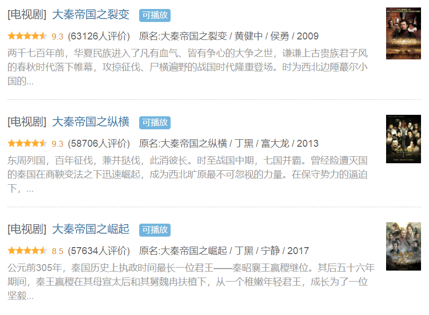
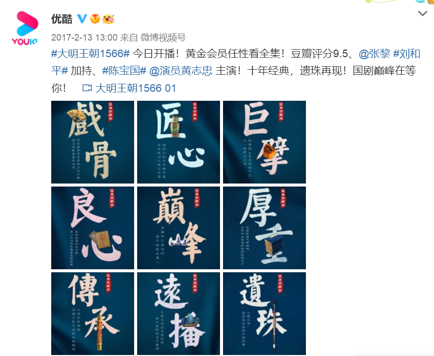

[toc]

# 问题

提问者：**<a href="https://www.zhihu.com/people/guo-bang-zhu-14">龍龍</a>**
提问时间: 2026-7-23 11:49:11
总回答数: 8
总访问量: 57423

[@知乎直答](https://www.zhihu.com/people/f3bce7aa022240e25f12aec9a9b70363)  **回首新世纪前后，历史正剧是最受追捧的类型剧之一** 。1999年的《雍正王朝》、2001年的《康熙王朝》、2003年的《乾隆王朝》、2004年的《成吉思汗》、2005年的《汉武大帝》等都叫好叫座。

2007年的《大明王朝1566》收视惨败，历史正剧进入低谷期。

此后，历史正剧主要靠《大秦帝国系列》支撑，包括2009年的《大秦帝国之裂变》、2013年的《大秦帝国之纵横》、2017年的《大秦帝国之崛起》。

 **2017年是历史正剧的一个小阳春** ，央视1套一口气播出了《于成龙》《大秦帝国之崛起》《天下粮田》；《大明王朝1566》也重新在视频网站播出，并引发广泛的关注和讨论。

当时不少观众以为此后历史正剧会复兴，怎料最近几年，历史正剧大萧条，数量稀少，审核坎坷，哪怕播出了也境遇凄冷。

一个国家不能没有历史，我们的电视剧也不能没有历史剧。

# 回答

回答者： **<a href="https://www.zhihu.com/people/xiao-ma-kuai-pao-0307-12">白风</a>**
回答时间: 2026-8-8 23:13:48
点赞总数: 210
评论总数: 65
收藏总数: 71
喜欢总数：8

2007年。湖南卫视。黄金档。

播了一部剧。《大明王朝1566》。编剧刘和平。主演陈宝国。

第一集开场：廷杖打死一个谏官，然后是内阁的年度财政会议，满朝文武吵成一团。镜头切过去——没有动作戏，没有感情线，没有"进度条撑不住了来段BGM"。全是一群人在朝堂上算账、博弈、揣摩圣意。

那一集播完，收视率低得让湖南卫视差点把剩下的集数砍掉。

后来的事情大家都知道了。这部剧在电视台播完就沉了。沉了十年。然后被网友挖出来。豆瓣评分从八点几涨到九点八。成了中国电视剧的最高峰。不是之一。是最高。

但湖南卫视再也没播过这种剧。不是不想播。是没了。

___

从2007年到现在，将近二十年，能跟《大明王朝》掰手腕的历史正剧：一个也没有。

注意，我说的是正剧。不是古装戏。不是古偶。不是披着历史外衣谈恋爱的架空剧。

《大秦赋》——大秦系列的收官之作，张鲁一演嬴政，开分八点九。观众等的是横扫六合、赳赳老秦，但剧情重心被嫪毐造反挤占了大量篇幅，秦始皇统一天下的戏份反而潦草收尾。口碑一路雪崩，最终停在豆瓣五点四。

《山河月明》——朱棣在战场上跟蒙古公主眉来眼去，积压了四年才播，从八十集砍到四十五集，剧情碎成了渣，豆瓣五点五。

罗晋、黄志忠主演的《天下长河》算是一次体面的尝试。康熙年间靳辅、陈潢治河，服化道精良，人物也不脸谱化，豆瓣八点三。但它的讨论度和当年的《雍正王朝》比，不是一个量级的东西。

以真实历史人物和事件为核心、不魔改、不架空、严肃叙事的头部历史正剧——绝种了。

你仔细想想这件事有多离谱。

中国五千年历史。任何一个朝代的任何一段都能拍出好东西。春秋战国。秦汉。三国。南北朝。五代十国。宋。明。清。随便一个时间切片都是顶级剧本。但没人拍。不是不能拍。是不敢拍。也不想拍了。

先说不敢。

历史正剧的灵魂是什么。不是服化道。不是战争场面。是复杂。是敢把一个历史人物当成人来写。不是脸谱化的好人坏人。是一个会犹豫、会恐惧、会贪、会软弱、会在利益和道义之间挣扎的人。

《大明王朝1566》里没有纯粹的好人。海瑞是清官，但他偏执到什么程度——为了心中那杆秤，母亲和妻子跟着他过苦日子。他去兴国替百姓争水源，半个月没回家，回来才知道女儿掉进门前河里淹死了。海瑞一生以天下为己任，连自己的家都护不住。

嘉靖呢。你不能用昏君形容他。二十年不上朝，大权从未旁落。聪明绝顶。用修道的方式控制整个朝廷。说他是昏君，太小看这个人了。

严嵩呢。奸臣。但他倒台之后去酱菜铺送匾，老板都不敢要。曾经多少人为求他一字散尽千金，现在连一块匾都送不出去。那一刻你居然感到了一丝怜悯。

这就是历史正剧。它不告诉你该恨谁、该爱谁。它把所有人的人性深渊挖开让你看。刘和平敢这么写，因为他知道观众不傻。观众从来就不傻。《大明王朝》的收视率低，不是因为观众看不懂。是因为那时候的观众还没准备好。后来他们在豆瓣上证明了——他们太看得懂了。

___

现在呢。一个编剧如果把嘉靖写成"聪明但变态的昏君"，剧本送审会有麻烦。如果他把海瑞写成"清官但由于过度理想主义无意中拖累了更多人"，更麻烦。这个人物有历史定评——清官。海瑞是清官。你写出清官的复杂性，是不是在否定清官。是不是历史虚无主义。

"历史虚无主义"五个字，就是悬在每一个历史剧编剧头顶上的剑。不知道什么时候掉下来。所以干脆不写了。不写就不会错。不写就不会被扣帽子。

刘和平自己就是活证据。他写了《雍正王朝》《大明王朝1566》《北平无战事》。中国最好的历史剧编剧，没有之一。他2015年左右开始筹备《北斗南箕之歌》，以北魏孝文帝改革为背景，孔笙导演。写了十年。还在写。2026年接受采访说自己"每天都在写，不敢休息"。一个年过古稀的编剧还在磨同一部剧本。

这已经不是一个编剧的困境了。这是一个行业在告诉你——我们不生产这种产品了。因为这种产品的原材料（复杂的人性）、生产工具（独立判断的权利）、目标用户（愿意慢慢思考的观众），这条产线上的每一个环节都在萎缩。

___

再说不想拍。

跟资本有关。一部历史正剧要花多少钱。服化道。置景。群演。《雍正王朝》的朝服按品级区分——补子、顶戴、朝珠，一个远景镜头里跪在最后一排的群演穿的衣服，和站在第一排的主演，品级不能错。这不是精益求精。这是底线。

但这样一部剧的制作周期是两到三年。写剧本一年。拍摄八个月到一年。后期半年。三年时间，一部古偶可以拍好几部——可能有一部火。火了就赚。历史正剧呢？拍出来能不能播都不知道。《山河月明》积压了四年，播出时砍掉三十五集，剧情碎成渣。没有资本会等。资本只问一件事——回报率。

还有观众。这话可能难听。但短视频已经把很多人的注意力切成碎末了。十五秒内没有爆点就划走。让一个习惯了十五秒节奏的人坐下来，看一群人用半文言的台词在朝堂上博弈四十分钟。他坐不住。不是他的错。感官已经被训练成了另一种模式。这种模式需要反转、冲突、颜值、CP。这些东西历史正剧不是不能给——是给了就变了。嘉靖和严嵩的君臣斗，没办法拍成"霸总和他的腹黑下属"。海瑞上《治安疏》，没办法配上煽情BGM加慢镜头。这些戏的力量来自克制。越克制越有力。越有力越没人看。

但这些都是表面原因。

审查。资本。观众。每一层都可以讨论。最深的那一层是另外一件事。

历史正剧的本质，是一个民族用戏剧的形式跟自己对话。

《雍正王朝》拍雍正清查亏空、整顿吏治、摊丁入亩。放在1990年代末播出。那时中国正在经历分税制改革、国企改革、反腐。雍正做的事和当时中国正在做的事，像一个镜像。不是巧合。是历史正剧从来不是关于过去的。是关于现在的。借过去的酒杯，浇今天的块垒。

《走向共和》2003年4月在央视一套首播。拍清末民初。核心问题只有一个——中国该走哪条路。这条路怎么选。选错一次，代价是什么。这部剧播出的时候，这个问题还被允许拿出来讨论。允许有不同的声音。

《大明王朝1566》拍嘉靖朝。核心矛盾——权力和制度的博弈、改革和保守的拉锯——在任何时代都在发生。

这些剧能拍出来，不是因为当时审查比现在宽松。是因为当时这个社会还相信，一个民族需要跟自己的历史对话。对话需要空间。需要有犯错的权利。需要有"这个人可能是复杂的"的解释权。当这个空间被关上，当一切历史叙述都必须服从于某种单一的、不容置疑的正确答案，历史正剧就死了。不是慢慢死的。是从根上断的。

历史正剧不生产正确答案。它生产问题。它问你——嘉靖是对是错。海瑞是清官还是偏执狂。雍正是暴君还是明君。

每一个人都可以有自己的判断。这些判断加起来，就是一个民族对"我们今天该怎么活"的集体思考。

当这种思考不再被需要的时候，剧就不用拍了。不是拍不出来。是不需要拍。

 **历史从来没有沉默过。沉默的是人。**

  

原文地址：[(白风)历史正剧为什么越拍越少？](https://www.zhihu.com/question/2063591493500134492/answer/2069561986451498794) 

# 评论

1. <a href="https://www.zhihu.com/people/liang-jie-ke-29">两节课</a> (<small title="江苏">2026-8-11 19:59:49</small>): 9.6～9.8 分（国产剧第一梯队）  
 
1.大明王朝 1566（2007）｜9.8  
 
历史权谋天花板，嘉靖朝官场群像，台词、人物深度至今难以超越。  
 
2. 86 版西游记（1986）｜9.7  
 
国民经典，重播神话，几代人的童年记忆。  
 
3. 87 版红楼梦（1987）｜9.7  
 
四大名著改编巅峰，服化道、表演高度贴合原著。  
 
4. 毛骗 终结篇（2015）｜9.7  
 
草根悬疑神剧，骗局设计精妙，小成本网剧传奇。  
 
5. 走向共和（2003）｜9.6  
 
晚清史诗，对近代历史人物多元化刻画，思想尺度极大。  
 
6. 武林外传（2006）｜9.6  
 
下饭情景喜剧，嬉笑背后藏人生哲理，常看常新。  
 
7. 94 版三国演义（1994）｜9.6  
 
史诗历史剧，恢弘大气，文戏武戏水准均衡。  
 
8. 我的团长我的团（2009）｜9.6  
 
反套路战争剧，聚焦滇缅溃兵，探讨战争、人性与家国。
   - <a href="https://www.zhihu.com/people/shui-run-77">水润</a> (<small title="辽宁">2026-8-12 17:10:8</small>): 武林外传 那么多人喜欢，我就看不进去，不喜欢这类剧。
   - <a href="https://www.zhihu.com/people/nei-han-duan-zi-shou-22">内涵段子手</a> (<small title="北京">2026-8-12 17:37:15</small>): 毛骗真的可以
   - <a href="https://www.zhihu.com/people/yu-yi-50-14">中年人</a> (<small title="回复于 2026-8-12 18:21:21/日本"> ✉️:内涵段子手</small>): 毛骗主要是太穷了，前面的服化道劝退了太多人了［笑哭］
2. <a href="https://www.zhihu.com/people/shui-bi-zi-35-37">水笔仔</a> (<small title="福建">2026-8-10 10:23:9</small>): 去年的《太平年》还可以啊，但是政治谋略方面还是《大明王朝1566》天花板
   - **白风** (<small title="山东">2026-8-10 14:58:42</small>): 现在高质量的正剧越来越少了
   - <a href="https://www.zhihu.com/people/sheng-huo-da-bao-zha-96-46">生活大爆炸</a> (<small title="山东">2026-8-10 16:41:10</small>): 太平年我觉得非常好。。。
   - <a href="https://www.zhihu.com/people/sun-li-63-42">假太阳</a> (<small title="浙江">2026-8-11 9:50:8</small>): 对对对，太平年是一部逼着我看的时候去查资料的剧。
   - <a href="https://www.zhihu.com/people/du-du-81-9">嘟嘟</a> (<small title="山西">2026-8-11 10:59:18</small>): 太平年爆改的吴越的戏份太多了，不能因为谁出钱就多拍谁，偏于一偶的割据政权为什么要当主角占那么多剧情，感觉全删了都不影响
   - <a href="https://www.zhihu.com/people/li-xiao-xiao-40-17">李笑笑</a> (<small title="回复于 2026-8-12 9:33:33/山西"> ✉️:嘟嘟</small>): 因为北边打生打死的时候，吴越那边还算个太平年，不然为什么不叫赵匡胤传。［捂脸］
   - <a href="https://www.zhihu.com/people/78-53-46-66-57">东临碣石</a> (<small title="湖北">2026-8-12 11:52:39</small>): 太平年有目的的。  
 
它借钱塘暗示湾湾，所以还是统战剧。
   - <a href="https://www.zhihu.com/people/53-43-31-35-48">陈敏</a> (<small title="四川">2026-8-12 14:45:5</small>): 太平年我觉得很晦涩。总体看下来的感觉就是那个朝廷中央失控，吴越钱家在那个年底地方大员就自己发展。后面朝廷自己拨乱反正走上正轨了，又跟朝廷有利益冲突了［捂脸］［捂脸］感觉也挺浙江电视台也牛逼
   - <a href="https://www.zhihu.com/people/49-65-88-86">黑白相间的熊猫</a> (<small title="河南">2026-8-12 16:33:29</small>): 没有谈恋爱，没有帅哥美女，国人不看。
   - <a href="https://www.zhihu.com/people/dong-jin-yu-98">小金鱼</a> (<small title="回复于 2026-8-12 17:55:8/四川"> ✉️:嘟嘟</small>): 太平年就是东南吴越视角拍的啊，男主是白宇而不是朱亚文，讲的核心是纳土归宋，暗示对岸和平统一避免战乱珍惜太平年，全删了这剧就该叫赵宋发家史算了
   - <a href="https://www.zhihu.com/people/ye-xue-liu-guang">夜雪流光</a> (<small title="回复于 2026-8-12 18:29:30/四川"> ✉️:东临碣石</small>): 如果不是统战这瓶醋，连这点半熟的饺子都没得吃。
3. <a href="https://www.zhihu.com/people/qiao-shan-xi">樵禅溪</a> (<small title="湖北">2026-8-12 12:3:1</small>): 写的真好，评论真实，透彻。
4. <a href="https://www.zhihu.com/people/zhibvuxyob">孤鸿之谔</a> (<small title="广东">2026-8-11 0:54:21</small>): 说到湖南台，个人对这些年来湖南台的行为是有比较大看法的，过度商业化，过度娱乐化，对年轻人没看到什么积极的作用，对社会来没起到应有正确引导的作用，反而领头做坏榜样。一个传媒主体还是要讲讲社会责任而不是利字当头。
   - <a href="https://www.zhihu.com/people/ai-meng-da-lao-87">赛博工具侠</a> (<small title="北京">2026-8-12 11:20:4</small>): ［捂脸］湖南台又不是没放过正剧，奈何观众不爱看，收视率下降，就拉不到广告，人家也是要吃饭的呀，借用《大明王朝1566》里的一句话，只有架起锅子煮白米，没有架起锅子煮道理
   - <a href="https://www.zhihu.com/people/nullking">nullking</a> (<small title="回复于 2026-8-12 12:49:9/江苏"> ✉️:赛博工具侠</small>): 娱乐可以市场化，但是舆论不能市场化。
   - <a href="https://www.zhihu.com/people/jim9308">日出清济</a> (<small title="回复于 2026-8-12 16:19:15/广东"> ✉️:nullking</small>): 舆论市场化的主要责任难道不是央视吗？
 
各种带广告、掺私货、毒草。
   - <a href="https://www.zhihu.com/people/ai-meng-da-lao-87">赛博工具侠</a> (<small title="回复于 2026-8-12 16:52:56/北京"> ✉️:nullking</small>): 央视也搞娱乐综艺啊［捂脸］总不能天天24小时新闻联播吧
5. <a href="https://www.zhihu.com/people/li-ying-zheng-27">李大瘦</a> (<small title="河南">2026-8-10 14:42:9</small>): 这也是我几乎不咋看国产剧的原因，虽说美剧也有烂的，但是相对还是精彩些
6. <a href="https://www.zhihu.com/people/hua-fu-mei-3">江清月近人</a> (<small title="辽宁">2026-8-10 11:59:30</small>): 短视频害人不浅，连孩子都着了道。
   - **白风** (<small title="山东">2026-8-10 14:58:51</small>): 有理
   - <a href="https://www.zhihu.com/people/mo-lei-87-62">墨泪</a> (<small title="浙江">2026-8-10 16:50:26</small>): 这样更好，好管理
   - <a href="https://www.zhihu.com/people/nian-qing-wu-ji-xian-84-28">知乎用户</a> (<small title="重庆">2026-8-12 11:52:24</small>): ［调皮］那我只能说电子鸦片就应该禁绝
7. <a href="https://www.zhihu.com/people/dong-mu-yi-14">没头脑和不高兴</a> (<small title="广西">2026-8-10 16:4:19</small>): 对于 男人来说，历史剧还是有一定的市场的。但是一定要制作精良，符合逻辑。制作精良不是说服装道具精美，而是贴合史实。这就好比日本的大河剧，收视率一般都不错。所谓的大河剧，大河剧经常改编自小说，但不同于我们的古装剧。其多有严密的历史考证，可以当做教科书来看。大河剧的编剧在历史问题的通常采取审慎与前沿并重的态度，对历史问题的表现既要有充实的依据，又广泛采用近年来学界研究的成果。而演员也会因为出演大河剧而感到光荣，那是对演技的一种无上的肯定。
 
当下的影视制作都是为了迎合最大基数的观众，所以选角为流量明星，剧情都是戏说，越狗血，越毁三观的越有争议，越有流量。最后拿着四不象的假历史剧说历史剧没市场。
8. <a href="https://www.zhihu.com/people/11-21-10-25-87">盟里11</a> (<small title="广东">2026-8-10 12:50:44</small>): ［思考］生老病死 插混打屁 谈恋爱
9. <a href="https://www.zhihu.com/people/bu-xiang-28-22">不相</a> (<small title="江苏">2026-8-9 21:34:5</small>): 以后古装戏甚至长剧都难了
10. <a href="https://www.zhihu.com/people/69-69-71-96">苏诺饿了</a> (<small title="浙江">2026-8-10 7:41:32</small>): 因为看电视剧的大部分都是妇女，她们看不懂，
    - <a href="https://www.zhihu.com/people/azure5040">resolve</a> (<small title="北京">2026-8-10 10:19:30</small>): 是的，为了迎合她们
    - <a href="https://www.zhihu.com/people/ananzaici">ananzaici</a> (<small title="上海">2026-8-11 9:57:32</small>): 你说说，这个剧你看懂了什么？不要找AI哦。
    - <a href="https://www.zhihu.com/people/69-69-71-96">苏诺饿了</a> (<small title="回复于 2026-8-11 18:32:17/浙江"> ✉️:ananzaici</small>): 不要拿个例说事
    - <a href="https://www.zhihu.com/people/yue-ming-feng-qing-53-33">月明风轻</a> (<small title="浙江">2026-8-11 20:47:36</small>): 刷短剧不好吗？什么年代了
    - <a href="https://www.zhihu.com/people/ji-hao-78-92">胖子的冰阔落</a> (<small title="回复于 2026-8-12 4:40:50/山东"> ✉️:月明风轻</small>): 短剧除了打发时间屁用没有
    - <a href="https://www.zhihu.com/people/yue-ming-feng-qing-53-33">月明风轻</a> (<small title="回复于 2026-8-12 11:27:17/浙江"> ✉️:胖子的冰阔落</small>): 不然呢
    - <a href="https://www.zhihu.com/people/tu-dou-74-81">土豆</a> (<small title="回复于 2026-8-12 15:31:45/浙江"> ✉️:胖子的冰阔落</small>): 浪费时间，而不是打发时间，精神鸦片一样的存在！
11. <a href="https://www.zhihu.com/people/c1vq5">Dearseed</a> (<small title="上海">2026-8-12 14:20:47</small>): 在家做饭或者干活的时候，背景电视剧翻来覆去就是：大明王朝1566、地下交通站、水浒传
12. <a href="https://www.zhihu.com/people/nan-de-qing-xing-51-39">难得清醒</a> (<small title="湖南">2026-8-12 13:50:51</small>): 时代不同了——现在是新时期
13. <a href="https://www.zhihu.com/people/5ocean">欧辰</a> (<small title="天津">2026-8-12 16:54:41</small>): 上豆瓣点评的人和坐电视前看电视的是一拨人吗？
14. <a href="https://www.zhihu.com/people/bei-yuan-he-sha-80">北原和纱</a> (<small title="福建">2026-8-12 13:30:12</small>): 挑个刺，1566远在优酷买版权之前就9.8了
15. <a href="https://www.zhihu.com/people/huang-li-39-6">呼噜小妹</a> (<small title="湖北">2026-8-12 16:37:45</small>): 一个文艺作品要表达一个历史人物，既需要立场，又不能太有立场，这个分寸要怎么把握；就算把握好分寸了，最终审核时能否通过呢？
16. <a href="https://www.zhihu.com/people/li-qi-gui-23">DyingInTheSun</a> (<small title="广东">2026-8-12 14:10:1</small>): 现实就是这么魔幻，只有搞点爱情才有人看
17. <a href="https://www.zhihu.com/people/ji-feng-73-24">吉风</a> (<small title="山东">2026-8-12 10:11:58</small>): 哪个清宫剧不是历史虚无主义？？？
18. <a href="https://www.zhihu.com/people/yan-jiang-xin-26">晏蒋鑫</a> (<small title="江苏">2026-8-12 13:53:43</small>): 以真实历史人物和事件为核心、不魔改、不架空、严肃叙事的头部历史正剧——绝种了。
 
大明王朝1566完全符合这些标准的前面大部分：不以真实历史人物和事件为核心、魔改、简直就是平行世界发生的算架空了吧。唯一差异在严肃叙事，得到史学界南开派的刘泽华文字认可
19. <a href="https://www.zhihu.com/people/guyu-86-88">Guyu</a> (<small title="上海">2026-8-12 8:44:15</small>): 私货多多［思考］
20. <a href="https://www.zhihu.com/people/ai-xi-9-11">Ezzzzzz美腻</a> (<small title="浙江">2026-8-12 7:14:18</small>): 每次在地铁上看到周围一群人拿着手机刷短视频，叹息大于哀默，感觉都变成了头脑空空的木偶人，牵线木偶那种，大家在逐步进化为碎片信息吸收着，失去了独立思考，探究真实的潜在能力，这很可怕。
21. <a href="https://www.zhihu.com/people/niu-ahe-niu-cjian-pai-huai">最爱吃碳水</a> (<small title="河北">2026-8-11 19:40:17</small>): 这个剧没有火很大原因就是首播在湖南台
22. <a href="https://www.zhihu.com/people/yue-ming-feng-qing-53-33">月明风轻</a> (<small title="浙江">2026-8-11 20:48:20</small>): 曲高和寡本来就很无聊，何况也挺没意思的
23. <a href="https://www.zhihu.com/people/wang-zhao-bei-fang-de-hui">小北的灰</a> (<small title="江苏">2026-8-12 9:56:36</small>): 80集砍到了45集，实在是........
24. <a href="https://www.zhihu.com/people/ma-guo-hua-2">马国华</a> (<small title="陕西">2026-8-11 22:57:20</small>): 走向共和，怎么评价？正版全没了。
25. <a href="https://www.zhihu.com/people/Cindy-60-72-30">曼莫汗·辛迪</a> (<small title="内蒙古">2026-8-12 11:28:20</small>): 《太平年》勉强算一个，但也落后一个身位
26. <a href="https://www.zhihu.com/people/long-xiao-88-76">龙啸</a> (<small title="浙江">2026-8-12 9:6:23</small>): 拍正剧多累啊，要查资料，服装道具又烧钱，哪有仙偶剧轻松啊，还省钱［吃瓜］
27. <a href="https://www.zhihu.com/people/dan-chang-xu">海罗罗</a> (<small title="江苏">2026-8-11 11:55:22</small>): 现在剧就要节奏快，简单明了，所有斗争要清晰，拿到排面上来，
 
一集一个爽点。
 
你怎么拍。  
 
都是些女性在看，你不找小鲜肉，不制造猪脚和反派谈恋爱，
 
一集亲个嘴，两集上个床，三集生个娃，
 
集美们也不看啊
28. <a href="https://www.zhihu.com/people/zhang-wan-jie-26">银色的黎明</a> (<small title="重庆">2026-8-11 16:31:15</small>): 请不要把正剧当真，比如你说嘉靖帝聪明，不是昏君，没错，但那是电视剧的形象。。。。真实历史是，整个嘉靖朝，国家各个方面都被搞得乌烟瘴气，他作为皇帝就该负责，也就是标准的昏君（昏君都不笨，只是不当人），连教员都批判过他，你要是老百姓，你也骂他。。。所谓的权力制衡，无非是自己的一些小聪明，算不得大智慧。。。我个人的评价是不如年轻时候的广神，广神好歹是打了高句丽之后摆烂，嘉靖是登基没多久就摆烂，他哥留给他的底子不说国泰民强，好歹也是没内忧和外患，他自己死的时候，除了留下几个能力还不错的内阁，别的方面全是一团糟
29. <a href="https://www.zhihu.com/people/mo-chen-79-88">墨尘</a> (<small title="安徽">2026-8-11 16:30:8</small>): 历史虚无主义是六个字
30. <a href="https://www.zhihu.com/people/ananzaici">ananzaici</a> (<small title="上海">2026-8-11 9:56:59</small>): 他的剧情也是编的，这种也是正剧吗？
31. <a href="https://www.zhihu.com/people/mo-chen-79-88">墨尘</a> (<small title="安徽">2026-8-11 16:30:11</small>): ［酷］
32. <a href="https://www.zhihu.com/people/li-rui-5-61">李睿</a> (<small title="江西">2026-8-11 6:17:39</small>): 一般只看欧美、日韩、港台新剧［捂脸］
33. <a href="https://www.zhihu.com/people/38-22-47-23">听雨</a> (<small title="河南">2026-8-10 10:17:26</small>): 雍正王朝，改编的二月河小说，改的不多
    - **白风** (<small title="山东">2026-8-10 14:58:18</small>): 好看的
34. <a href="https://www.zhihu.com/people/fu-yu-chen">傅昱宸</a> (<small title="北京">2026-8-12 14:2:42</small>): 看湖南台的都是什么人他们自己没点b数吗？历史正剧就该在中央台播

=[评论](./attachments/comments.json)

