[toc]

# 问题

提问者：**<a href="https://www.zhihu.com/people/yishan-yishui-yixiao-yao">一山一水一逍遥</a>**
提问时间: 2025-9-4 11:39:46
总回答数: 364
总访问量: 7635329

说是老破小，其实还好，就是朝阳区的老小区，6层封顶，面子还好，大两居，在第六层，已经卖房100多万。

# 回答

回答者： **<a href="https://www.zhihu.com/people/qiu-tian-de-bu-la-ge">秋天的布拉格</a>**
回答时间: 2026-1-23 20:30:58
点赞总数: 790
评论总数: 276
收藏总数: 366
喜欢总数：31

我第一次去分钟寺办事的时候，出地铁，以为我到了伊拉克。。。。。。

到处残垣断壁啊！

那，简直了。。。。。。

这可是很多人会写的“东三环边”欧。

感受一下，现在还是这样。

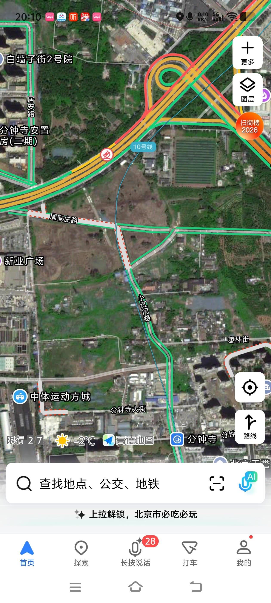

上方那个弧形的路，就是三环。

理论上说，这还是东三环的一部分。

  

你认知里的朝阳区，也许是使馆区，国贸，skp，三里屯，蓝港，凯宾斯基。。。。。。

实际上，这里有广阔的农村，有1.55万亩基本农田，这可是以后也不能开发的基本农田。

有各种京郊小工厂，小仓库，小作坊。。。

现在也有。

也有各种工厂外迁后，留下的工业遗址，还有没有单位再去维护的工厂小区。

很多三环边的路，还是断头路，打不通。大片的荒地。

四环，五环，六环？

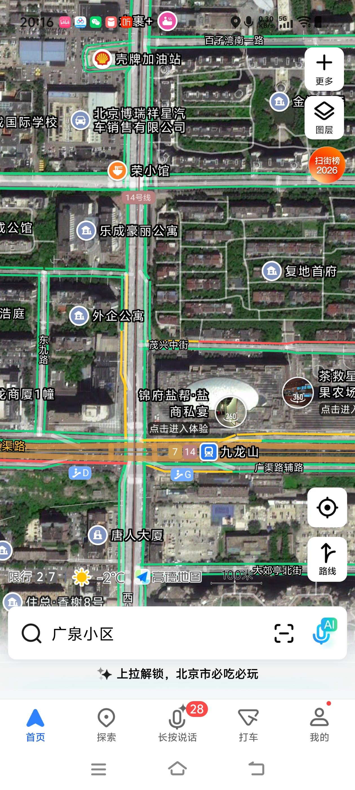

这是朝阳区大名鼎鼎的合生汇周边，你依然能看见各种荒地。

复地首府是2000-3000万一套。不远处就是金茂府。

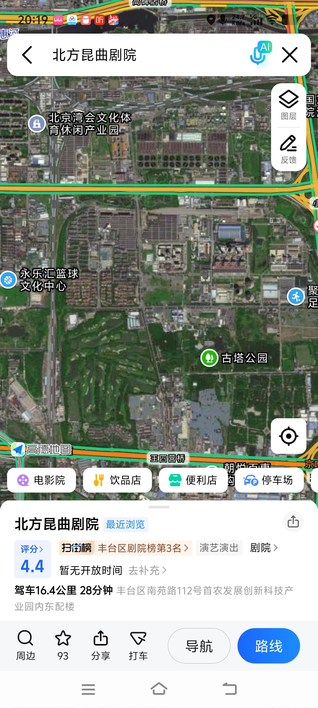

这是东四环外，东五环内。地图上方的路就是长安街向东的京通快速路。

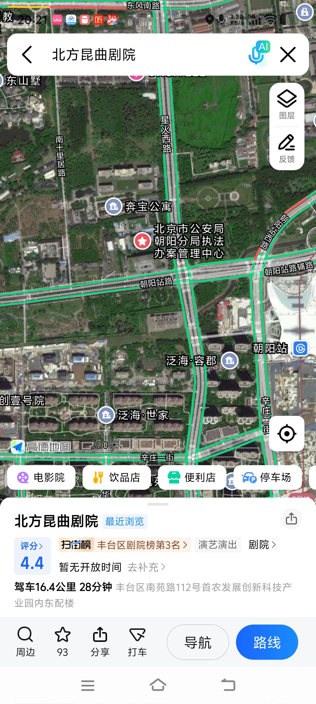

这是朝阳站周边，泛海世家和融创壹号院。

  

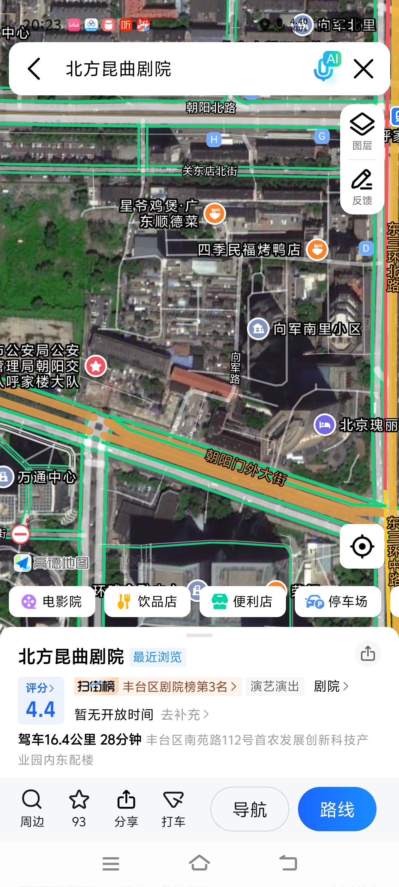

这是cbd与三里屯的正中间位置。地图上的瑰丽饭店，3000一晚。

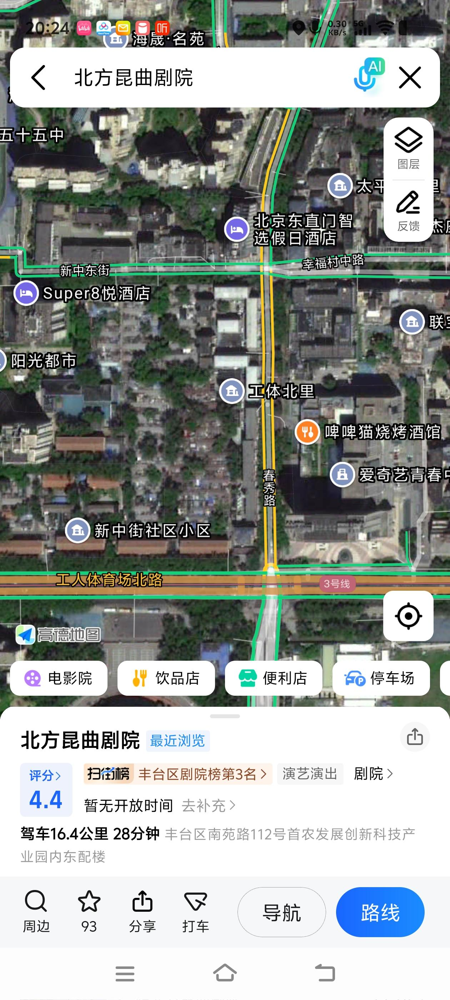

这是三里屯隔壁，实际上这片棚户区属于东城区。春秀路是东城朝阳分界线，地图下方就是北京最火的夜店一条街。

图片里的楼，还是东城的，也比我岁数都大了。那片白色的，是东城的一处豪宅小区。

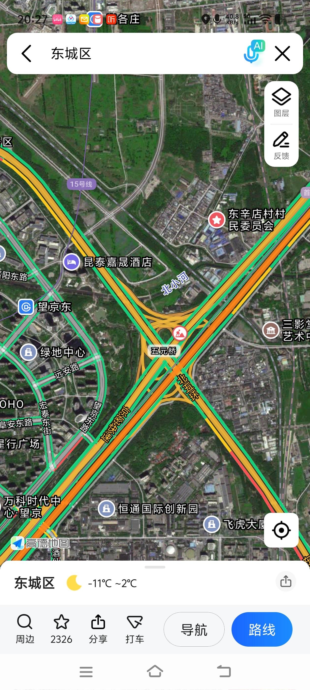

这是望京的五元桥。

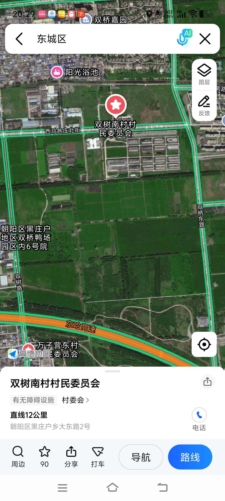

这是农田。村里还有阳光浴池呢。

  

最后来一张，下图，东二环边的朝阳区。

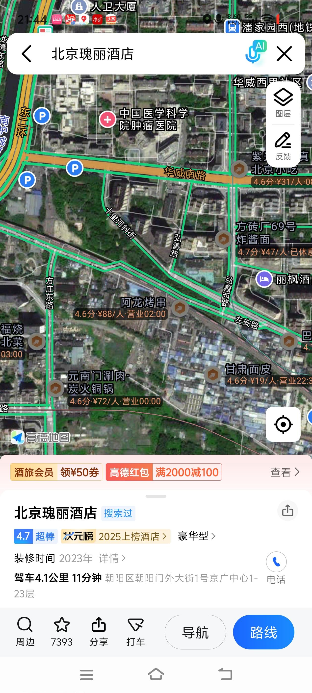

  

原文地址：[(秋天的布拉格)怎么看待北京朝阳区的老破小降到100多万这件事？](https://www.zhihu.com/question/1946900231301099666/answer/1998130597999161577) 

# 评论

1. <a href="https://www.zhihu.com/people/mu-jin-ge">盐木槿</a> (<small title="北京">2026-1-23 22:30:43</small>): 这就是当年北京市...emmm...的“铺摊子”规划，这还没开发明白，就新开一块地，导致现在北京就这一块那一块，块和块之间就是大片荒地，也没利用起来，导致你从这块到那块，像出城到异地了一样。  
 
另外，这种核心地段，长时间荒废没开始开发，或者没开发出来的，大概率背后问题交织，什么产权问题啊，审批问题啊，债务问题啊，复杂得很，没人敢接盘，或者没人愿意接盘，自然就荒了。
   - **秋天的布拉格** (<small title="北京">2026-1-23 22:44:38</small>): 你说的我都想玩儿都市天际线了。
   - <a href="https://www.zhihu.com/people/de-de-de-32-54-20">超绝可爱涞汐酱</a> (<small title="北京">2026-1-24 0:46:33</small>): ［酷］［酷］
   - <a href="https://www.zhihu.com/people/qia-qia-luo-te-49-28">卡卡罗特</a> (<small title="北京">2026-1-24 9:8:6</small>): 不是没人敢接盘，北京的地，大把人想接盘。政府不开发而已。不都开发也挺好，为未来留足空间。
   - <a href="https://www.zhihu.com/people/su-zui-da-shu">Szds</a> (<small title="北京">2026-1-24 11:7:40</small>): 产权弄不明白的话建完了也会被强拆的 很多楼都是这么拆的
   - <a href="https://www.zhihu.com/people/tuzuan">纠缠在苍穹</a> (<small title="上海">2026-1-24 14:56:10</small>): 你想复杂了，很多地块就是为了卖地皮而卖地皮，没成熟的项目。  
 
反正地皮卖了，钱进账了，GDP目标完成，开发不开发无所谓。不开发更好，过几年收回来再卖一次。
   - <a href="https://www.zhihu.com/people/le-hua-45-71">乐华</a> (<small title="北京">2026-2-11 21:15:39</small>): 疫情后呢，我和一堆哥们做了两年破产重组。主要收核心资产规划二次出售。  
 
  
 
某个阶段其实盯上了几个朝阳的项目。  
 
后来了解明白，  
 
再也没碰过首都的项目。
   - <a href="https://www.zhihu.com/people/hai-dao-asdfghjkl">海道Asdfghjkl</a> (<small title="广西">2026-2-14 9:26:32</small>): 我感觉不光是北京，我在南宁看也是一样，别人总觉得南宁是个小城市，但我一个做工的到处跑，南宁东西距离四十公里，南北也有四五十公里，中间到处夹着空地，不断往边上开发
   - <a href="https://www.zhihu.com/people/chenweioos">职高学霸</a> (<small title="北京">2026-2-15 15:56:51</small>): 哪跟哪啊，纯属因为那是朝阳和丰台的交界地，姥姥不疼舅舅不爱
   - <a href="https://www.zhihu.com/people/oldfour">王二</a> (<small title="回复于 2026-2-22 13:30:58/河南"> ✉️:海道Asdfghjkl</small>): 全国都一样
2. <a href="https://www.zhihu.com/people/zhang-xiao-qi-12-45">张小启</a> (<small title="菲律宾">2026-1-24 9:59:9</small>): 这是准备东南亚化啊，市中心突然一片原始森林，突然又是一片棚户区
   - <a href="https://www.zhihu.com/people/deng-bi-cheng-30">圆胖南昌</a> (<small title="北京">2026-2-5 14:32:52</small>): 这是北京00年前后学习英国规划思路，搞得两圈绿化隔离
   - <a href="https://www.zhihu.com/people/ren-ren-32-65-21">任人</a> (<small title="回复于 2026-7-4 18:44:58/北京"> ✉️:圆胖南昌</small>): 北京现在还在搞一带绿隔
3. <a href="https://www.zhihu.com/people/bu-yu-lzhu">一曲相思丶</a> (<small title="山东">2026-1-24 11:13:7</small>): 我18年刚到北京的时候就住在分钟寺，当时就是这样了，到处残垣断壁，没想到现在还这样［发呆］
   - <a href="https://www.zhihu.com/people/77-27-52-85-1">知乎用户达</a> (<small title="四川">2026-1-25 2:56:59</small>): 你来晚了，我00年来北京，住村里的，现在那个村08年拆迁了，成北坞公园，你18年来，北京已经拆不动了［飙泪笑］
   - <a href="https://www.zhihu.com/people/vison-34-19">Vison</a> (<small title="回复于 2026-1-25 11:7:59/北京"> ✉️:知乎用户达</small>): 00年那会儿到处都是村、菜地、荒地，破破烂烂的。大部分不是村的地方，路很多也是又窄又破。 08年左右才开始大面积的拆迁改造
   - <a href="https://www.zhihu.com/people/yan-yuan-i-65">演员i</a> (<small title="北京">2026-1-25 12:23:30</small>): 现在的发展再过10年也一样。
   - <a href="https://www.zhihu.com/people/bu-xiang-zhu-ce">葛二蛋不是葛尔丹</a> (<small title="北京">2026-2-10 13:6:50</small>): 就是18年开始反腐，好多经手人进去了，工程进度被大幅度拖慢导致的，正常来讲三五年就应该搞完的。
   - <a href="https://www.zhihu.com/people/bob-zhu-90-95">北极鲶鱼的老公</a> (<small title="北京">2026-7-28 11:20:6</small>): 北京左安门桥东南角那一片从上世纪90年代就拆迁了，一直断壁残垣状态到今天。
4. <a href="https://www.zhihu.com/people/linmal233">linmal233</a> (<small title="福建">2026-1-24 10:55:5</small>): 城区里留基本农田就够抽象的［大笑］为了完成指标而完成指标，不管这地到底有没有用
   - <a href="https://www.zhihu.com/people/xiao-qiao-15-80">梧桐</a> (<small title="美国">2026-1-24 15:14:43</small>): 种菜。
   - <a href="https://www.zhihu.com/people/44-30-77-58-32">算法博士</a> (<small title="北京">2026-1-25 9:36:57</small>): 这样的考虑也许是战备需要，不是坏事。
   - <a href="https://www.zhihu.com/people/di-diao-he-cha">秋刀鱼骑士</a> (<small title="江苏">2026-1-25 10:20:23</small>): 北京有些是农科院的地，试验田那种
   - <a href="https://www.zhihu.com/people/zi-ming-wind">紫螟</a> (<small title="北京">2026-1-25 18:30:40</small>): 南边开发晚，北边要不是因为奥运也不拆［流泪］
   - <a href="https://www.zhihu.com/people/qiu-zhi-shi-39">求知识</a> (<small title="回复于 2026-1-25 19:33:5/四川"> ✉️:算法博士</small>): 备战，真能找理由
   - <a href="https://www.zhihu.com/people/74-55-69-51">朝歌</a> (<small title="回复于 2026-1-25 20:5:35/河南"> ✉️:算法博士</small>): 河北的农田不远比北京更有用?
   - <a href="https://www.zhihu.com/people/wingsla">热雪</a> (<small title="回复于 2026-1-25 20:11:44/北京"> ✉️:求知识</small>): ［微笑］
   - <a href="https://www.zhihu.com/people/gui-xiao-tai-lang-51">桂小太郎</a> (<small title="北京">2026-1-27 13:14:13</small>): 不了解情况不要着急发言，先打开地图软件搜索一下“朝阳区”。  
 
朝阳区很大，从二环到五环外，甚至包括首都机场，几乎贴着六环了。五六环中间的什么金盏孙河，就是字面意义上的农村地区，有基本农田有什么奇怪。  
 
你该不会以为他发的这些没开发的地都是基本农田吧［好奇］［好奇］［好奇］  
 
我所在的同样是城六区之一的海淀区，你以为都是部委央企，高校科研院所，互联网大厂吗？其实呢，还有“京西稻”呐［惊喜］［惊喜］［惊喜］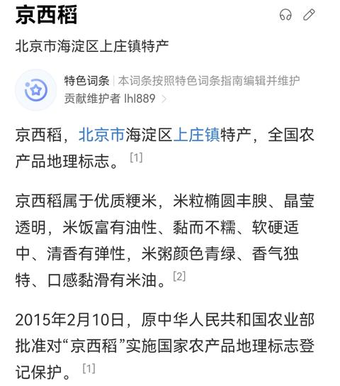
   - <a href="https://www.zhihu.com/people/linmal233">linmal233</a> (<small title="回复于 2026-1-28 12:0:48/福建"> ✉️:桂小太郎</small>): 这些东西没啥价值，不如开发成住宅给所有人打下房价做公屋，更有意义，你觉得缺这么一点地来种？
   - <a href="https://www.zhihu.com/people/gui-xiao-tai-lang-51">桂小太郎</a> (<small title="回复于 2026-1-28 14:17:56/北京"> ✉️:linmal233</small>): 有没有可能，这些空地压根就不是基本农田呢［微笑］  
 
朝阳区有基本农田=朝阳区空地都是基本农田吗？
   - <a href="https://www.zhihu.com/people/fan-he-xin-81">范赫辛</a> (<small title="回复于 2026-2-6 8:16:42/北京"> ✉️:算法博士</small>): 都打起来了再临时种地？
   - <a href="https://www.zhihu.com/people/you-you-18-42-41">悠游</a> (<small title="北京">2026-4-24 15:57:21</small>): 农田是农科院的试验田吧！
   - <a href="https://www.zhihu.com/people/qetup-61">qetup</a> (<small title="北京">2026-5-8 18:24:57</small>): 北三环理想桥那，不也有一大片农田嘛。农忙时候，一堆收割机在那收割。农科院的试验地。
   - <a href="https://www.zhihu.com/people/chen-ji-an-1">军师祭酒</a> (<small title="回复于 2026-5-18 8:51:46/北京"> ✉️:linmal233</small>): 全国960万平方公里里面比这价值更小的地多了去了，要不要全都用来盖房子给人住
   - <a href="https://www.zhihu.com/people/linmal233">linmal233</a> (<small title="回复于 2026-5-30 14:0:15/福建"> ✉️:军师祭酒</small>): 当然要 靠近市区的就开发，离市区远的反而可以腾出来盖农场。这才是符合自然规律
   - <a href="https://www.zhihu.com/people/chen-ji-an-1">军师祭酒</a> (<small title="回复于 2026-5-31 8:24:33/北京"> ✉️:linmal233</small>): 你定义的市区从哪来，北京宏观上是单中心城市，然而细分到每个部分全都是多中心，海淀区有十几个大学扎堆区域以及中关村，海淀也同样有山和村，而比海淀那些村更远离北京市中心的地区反而还有几个人口更密集的县城，照你说的是不是应该把他们全都搬迁到海淀来，不考虑地形地势和历史演变，光看直线距离
   - <a href="https://www.zhihu.com/people/linmal233">linmal233</a> (<small title="回复于 2026-5-31 11:11:20/福建"> ✉️:军师祭酒</small>): 在农田旁边盖高楼，绝对不符合自然规律，也不符合数学，真正合理的城市就是市中心高楼，越往边缘越矮。
   - <a href="https://www.zhihu.com/people/chen-ji-an-1">军师祭酒</a> (<small title="回复于 2026-5-31 13:34:2/北京"> ✉️:linmal233</small>): 要不然你来北京看看呢，看看二环内有几个高楼
   - <a href="https://www.zhihu.com/people/linmal233">linmal233</a> (<small title="回复于 2026-6-1 1:42:39/福建"> ✉️:军师祭酒</small>): 北京的城市建设本来就有很多地方不合理
   - <a href="https://www.zhihu.com/people/linmal233">linmal233</a> (<small title="回复于 2026-6-1 1:43:57/福建"> ✉️:军师祭酒</small>): 就比如北京那个站站乐地铁，以及宽马路，在马路上全部要主动脉不要毛细血管，在轨道交通上全部要毛细血管不要主动脉。本来就有诸多理念错误。
   - <a href="https://www.zhihu.com/people/momo-26-43-56">momo</a> (<small title="回复于 2026-7-28 19:32:44/韩国"> ✉️:算法博士</small>): 那个程度早饿死了，这又不是现代农业
   - <a href="https://www.zhihu.com/people/momo-26-43-56">momo</a> (<small title="回复于 2026-7-28 19:33:23/韩国"> ✉️:linmal233</small>): 耕地红线的杀伤力
5. <a href="https://www.zhihu.com/people/dudu-65-8">黄河大客车</a> (<small title="北京">2026-1-24 0:21:32</small>): 这是啥话，我们朝阳本来就是工业区，北京工人阶级大本营，纺织区核心中纺街的八十中甚至90年代还流行上海文化
   - <a href="https://www.zhihu.com/people/de-de-de-32-54-20">超绝可爱涞汐酱</a> (<small title="北京">2026-1-24 0:47:11</small>): 农业区吧［惊喜］
   - <a href="https://www.zhihu.com/people/de-de-de-32-54-20">超绝可爱涞汐酱</a> (<small title="北京">2026-1-24 0:47:29</small>): 上海文化不更说明问题了［惊喜］
   - <a href="https://www.zhihu.com/people/dudu-65-8">黄河大客车</a> (<small title="回复于 2026-1-24 6:29:33/北京"> ✉️:超绝可爱涞汐酱</small>): 以前是［捂脸］
   - <a href="https://www.zhihu.com/people/de-de-de-32-54-20">超绝可爱涞汐酱</a> (<small title="回复于 2026-1-24 11:13:18/北京"> ✉️:黄河大客车</small>): 以前不就是这么分的吗［doge］  
 
海淀：科教  
 
东郊（朝阳）：农业+轻工  
 
丰台石景山：重工  
 
后来朝阳有些地方开放成“特区”了［doge］但五环外其实还是农场
   - <a href="https://www.zhihu.com/people/tan-xian-jing-ling">探险精灵</a> (<small title="北京">2026-3-8 13:22:30</small>): 徐静蕾家就是中纺里小区
   - <a href="https://www.zhihu.com/people/dudu-65-8">黄河大客车</a> (<small title="回复于 2026-3-8 19:6:28/北京"> ✉️:探险精灵</small>): 哈哈是
   - <a href="https://www.zhihu.com/people/fu-ying-93">huang liu</a> (<small title="北京">2026-3-8 21:24:59</small>): 这不就是该疏解的首都功能吗？［捂脸］
6. <a href="https://www.zhihu.com/people/tang-xian-lei-62">勇者之一</a> (<small title="北京">2026-1-24 1:36:3</small>): 文字和图片距离一样，分不清文字和哪个图片有关联
   - <a href="https://www.zhihu.com/people/jc-immanuel">K城苟王ljc</a> (<small title="北京">2026-1-24 21:0:38</small>): 如果能把文字做成图片注文会好一些［赞同］
   - <a href="https://www.zhihu.com/people/tang-xian-lei-62">勇者之一</a> (<small title="回复于 2026-1-24 21:13:40/北京"> ✉️:K城苟王ljc</small>): 我觉得最基本的，也应该让文字和对应的图片的距离，相较其他图片近一些，或者有指示箭头↓，没想到很多知乎答主，完全不考虑这些
   - <a href="https://www.zhihu.com/people/oldfour">王二</a> (<small title="河南">2026-2-23 10:2:54</small>): 还有就是答主说的颜色，我也是完全对不上，这不都一个色吗［doge］还是卫星俯视图这么小，根本看不出来啥是啥
   - <a href="https://www.zhihu.com/people/lu-dan-32-41">卤蛋</a> (<small title="回复于 2026-7-26 22:26:10/北京"> ✉️:王二</small>): 他每个图说的东西都不一样，有的说的是图里的绿色（基本农田），有的说的是图里的路尽头的灰色（未拆迁区）……
 
反正我不觉得原本不知道图里问题是啥的人，看了他的图能知道问题是啥。
7. <a href="https://www.zhihu.com/people/tang-jing-ci-50">昨夜星辰</a> (<small title="山西">2026-1-24 11:55:38</small>): 以前在金台路地铁站附近的水锥子路上班，中午同事们会溜达到附近的甜水园和六里屯吃饭。第一次路过震碎三观，泔水流淌的大街，两侧破破烂烂的住户和门面混杂，类似楼道窄小的小路上，各种铁丝挂着晾晒的衣服和苦茶子，地上有杂草有臭椿树，你要不说北京，以为直接穿越到80年代的山沟里了。
   - <a href="https://www.zhihu.com/people/tang-jing-ci-50">昨夜星辰</a> (<small title="山西">2026-1-24 11:58:52</small>): 这还是大路，我们穿梭的附近小路地图上不显示图，比这环境还要脏乱100倍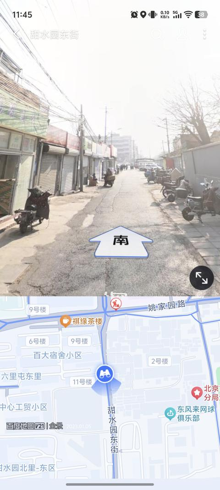
   - <a href="https://www.zhihu.com/people/qian-nian-yipu">千年一噗</a> (<small title="回复于 2026-1-24 20:43:18/北京"> ✉️:昨夜星辰</small>): 我现在也在这边，很正常啊，就是城中村，只不过广东的城中村更出名，其实都一样
   - <a href="https://www.zhihu.com/people/leng-wu-xue-6">冷无雪</a> (<small title="回复于 2026-1-24 21:36:56/广东"> ✉️:昨夜星辰</small>): 不知道你为什么会觉得这条路脏乱差，我看到的是一条整洁有条理的小路
   - <a href="https://www.zhihu.com/people/wwwwww-xz">wwwwww</a> (<small title="回复于 2026-1-26 11:0:47/内蒙古"> ✉️:冷无雪</small>): 是有点脏 但是是不乱也没有差到哪里去
   - <a href="https://www.zhihu.com/people/bot-36-19">机器人bot</a> (<small title="回复于 2026-1-26 17:46:42/北京"> ✉️:wwwwww</small>): 真的很差啊 这还不如县城
   - <a href="https://www.zhihu.com/people/wo-shi-yige-ren-98-81">我是一个人</a> (<small title="北京">2026-1-27 0:10:18</small>): 哈哈附近办事处的，这条街已经没了，这个城中村24年底已经拆迁腾退了。
8. <a href="https://www.zhihu.com/people/asascjj">asascjj</a> (<small title="北京">2026-1-24 9:51:56</small>): 有个词叫城乡结合部，二环三环还有大把大把的城中村。
   - <a href="https://www.zhihu.com/people/lex23">Lawrence</a> (<small title="山东">2026-2-15 8:9:21</small>): 之前公主坟就叫城乡购物中心
9. <a href="https://www.zhihu.com/people/xiao-qing-ge-13-1">小新没蜡笔</a> (<small title="北京">2026-1-24 14:35:13</small>): 这不是最可怕的，最可怕的是人们都觉得这是理所当然
   - <a href="https://www.zhihu.com/people/suan-la-sun-jian-64">酸辣笋尖</a> (<small title="北京">2026-1-25 14:41:14</small>): 那叫有情可原
10. <a href="https://www.zhihu.com/people/hongxingSS">红星</a> (<small title="北京">2026-1-24 8:26:34</small>): ［doge］
 
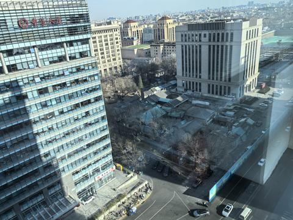
    - <a href="https://www.zhihu.com/people/du-lai-du-wang-77">慢行慢景</a> (<small title="山东">2026-1-24 9:28:54</small>): 这里的拆迁户肯定等得很心焦吧［捂嘴］
    - **秋天的布拉格** (<small title="回复于 2026-1-24 9:50:2/北京"> ✉️:慢行慢景</small>): 这是西城区，那个白色的楼是政协文史馆。  
 
这里等两辈子也不会拆的。
    - <a href="https://www.zhihu.com/people/ztong-34-22">猫咪控</a> (<small title="江苏">2026-1-24 13:21:33</small>): 这片棚户区的日照率感人
    - <a href="https://www.zhihu.com/people/hongxingSS">红星</a> (<small title="回复于 2026-1-24 18:25:16/北京"> ✉️:慢行慢景</small>): 金融街，寸土寸金的地方，不知道他们还能不能等得到
    - <a href="https://www.zhihu.com/people/du-lai-du-wang-77">慢行慢景</a> (<small title="回复于 2026-1-24 19:18:1/山东"> ✉️:红星</small>): 挺难受的呵，有种守着金山要饭吃的感觉，而且这金山也开始缩水了
    - <a href="https://www.zhihu.com/people/57-68-61-75">实名用户</a> (<small title="回复于 2026-1-25 2:40:52/河北"> ✉️:秋天的布拉格</small>): 不光拆不了，外面你还必须修旧如旧［捂脸］
    - <a href="https://www.zhihu.com/people/57-68-61-75">实名用户</a> (<small title="回复于 2026-1-25 2:41:11/河北"> ✉️:慢行慢景</small>): 金山？你还要自己掏钱去维护呢
    - <a href="https://www.zhihu.com/people/du-lai-du-wang-77">慢行慢景</a> (<small title="回复于 2026-1-25 8:48:25/山东"> ✉️:实名用户</small>): 要自己维护？我朋友的父母住四合院，几年就需要维护一次，都是政府掏钱。
    - <a href="https://www.zhihu.com/people/57-68-61-75">实名用户</a> (<small title="回复于 2026-1-25 17:46:17/河北"> ✉️:慢行慢景</small>): 不漏不塌政府维护是够的，想住舒服了得加钱
    - <a href="https://www.zhihu.com/people/qiu-zhi-shi-39">求知识</a> (<small title="回复于 2026-1-25 19:35:13/四川"> ✉️:实名用户</small>): 合着政府还等给您配齐家具交上水电费呗，
    - <a href="https://www.zhihu.com/people/57-68-61-75">实名用户</a> (<small title="回复于 2026-1-25 20:12:30/河北"> ✉️:求知识</small>): ［飙泪笑］自己去了解下北京二环胡同的四合院除了不漏不塌里面什么模样，白送你你都不带住的
    - <a href="https://www.zhihu.com/people/cloud-62-52">陶乐德的罗素</a> (<small title="回复于 2026-1-26 9:59:43/北京"> ✉️:慢行慢景</small>): 真新鲜了是吧［尴尬］
    - <a href="https://www.zhihu.com/people/wwwwww-xz">wwwwww</a> (<small title="内蒙古">2026-1-26 11:46:15</small>): 哈哈哈 去过这 我还诧异怎么这么黄金的地段有这么个四合院
    - <a href="https://www.zhihu.com/people/xu-min-zhi-66">间歇出庭的兰兰</a> (<small title="上海">2026-4-3 15:47:25</small>): 这不是价值几个亿的老北京四合院嘛
    - <a href="https://www.zhihu.com/people/mu-yan-xiao-lan-35">慕言小蓝</a> (<small title="回复于 2026-6-9 20:0:58/北京"> ✉️:秋天的布拉格</small>): 三辈子能拆吗
    - **秋天的布拉格** (<small title="回复于 2026-6-9 20:5:12/北京"> ✉️:慕言小蓝</small>): 好多家庭已经过了三辈子，还没拆。。。
    - <a href="https://www.zhihu.com/people/ha-ha-82-66-46">48182849</a> (<small title="回复于 2026-7-8 15:51:2/北京"> ✉️:秋天的布拉格</small>): 为什么
    - <a href="https://www.zhihu.com/people/chen-ling-94-95">天狼</a> (<small title="北京">2026-7-28 11:2:37</small>): 这种产权是不是自己的都不好说
11. <a href="https://www.zhihu.com/people/nosweat-93">你和游戏过吧</a> (<small title="日本">2026-1-23 21:28:59</small>): 马上到丰台了。  
 
丰台都是这个风格［doge］
    - **秋天的布拉格** (<small title="北京">2026-1-23 21:32:15</small>): 丰台的风格更杀马特一些。［酷］
    - <a href="https://www.zhihu.com/people/de-de-de-32-54-20">超绝可爱涞汐酱</a> (<small title="北京">2026-1-24 0:46:40</small>): 还真是［酷］
    - <a href="https://www.zhihu.com/people/ji-xian-sheng-31">聆听者</a> (<small title="北京">2026-1-24 11:13:25</small>): 丰台存在的意义就是告诉人们，建国时北京是什么样子［捂脸］
    - <a href="https://www.zhihu.com/people/bu-ke-yu-zhi-de-shi-jie">不可预知的世界</a> (<small title="北京">2026-1-24 19:21:44</small>): 丰台就别提了吧［惊喜］
    - <a href="https://www.zhihu.com/people/lilith1019">lilith1019</a> (<small title="回复于 2026-1-25 8:45:33/北京"> ✉️:秋天的布拉格</small>): 去丰台河西看看，你就不会抱怨现状了［doge］
12. <a href="https://www.zhihu.com/people/a-nan-xi-35">阿南西</a> (<small title="北京">2026-1-24 8:1:37</small>): 你知道这附近新房21年左右卖多少钱一平米。12万。惊讶不惊讶。不知道现在卖出去了吗？
    - <a href="https://www.zhihu.com/people/wang-feng-98-82">王峰</a> (<small title="北京">2026-1-24 10:58:59</small>): 卖的贼好
    - <a href="https://www.zhihu.com/people/a-nan-xi-35">阿南西</a> (<small title="回复于 2026-1-28 14:31:6/北京"> ✉️:王峰</small>): 真的啊。还是有钱人多。怪自己没钱。
    - <a href="https://www.zhihu.com/people/wang-feng-98-82">王峰</a> (<small title="回复于 2026-1-28 14:39:54/北京"> ✉️:阿南西</small>): 一路之隔的二手房5万卖不掉，新房12万两个月卖光。
    - <a href="https://www.zhihu.com/people/a-nan-xi-35">阿南西</a> (<small title="回复于 2026-1-28 21:8:32/北京"> ✉️:王峰</small>): 那地儿，5万都多。
    - <a href="https://www.zhihu.com/people/98-54-13-51-30">理想主义者二世</a> (<small title="河南">2026-2-4 20:36:55</small>): 21年五年期存款利率还4.5呢
    - <a href="https://www.zhihu.com/people/yao-xu-wang-38">悲哀仙人</a> (<small title="北京">2026-2-7 9:37:0</small>): 分钟寺三兄弟，现在7万
13. <a href="https://www.zhihu.com/people/clockgoing">指针在转动</a> (<small title="北京">2026-1-25 10:46:26</small>): 分钟寺作为城中村还是庇护过很多人的 可惜官老爷心善看不得眼前有穷人
14. <a href="https://www.zhihu.com/people/liu-shu-yan-11">航天员终结者</a> (<small title="北京">2026-1-24 11:25:45</small>): 我老家在丰台，现在每次去丰台都有一种回到小时候的感觉，真的太破了
15. <a href="https://www.zhihu.com/people/roreiro">Roteiro</a> (<small title="北京">2026-1-24 18:34:51</small>): 东城妇幼，以前的崇文妇幼，口腔科在4楼，我从窗户看下去，一大片密密麻麻的平房，唉，有时人得知足，我们终究是吃饭穿暖，远离战乱了。
16. <a href="https://www.zhihu.com/people/yuan-yuan-618">源源DJ</a> (<small title="北京">2026-1-24 8:17:52</small>): 东南四环马路边。还有好多好多坟头。 非常割裂
17. <a href="https://www.zhihu.com/people/wo-de-shi-jie-36">董胖子干活啦</a> (<small title="河北">2026-1-24 9:49:0</small>): 断头路多是不是可以随便停车［捂脸］
    - <a href="https://www.zhihu.com/people/yiming-fen-zhen-xi-ni-men">不谏</a> (<small title="北京">2026-1-24 9:59:35</small>): ［doge］那确实是，全是僵尸车
18. <a href="https://www.zhihu.com/people/89-33-97-49-20">万事俱备</a> (<small title="安徽">2026-1-24 16:15:51</small>): 它们的治国理念、治国能力都不是普通人能理解的。
19. <a href="https://www.zhihu.com/people/13836063576">悠然</a> (<small title="黑龙江">2026-1-25 15:22:9</small>): 再这么发，以后肯定不仅仅是禁飞无人机，GPS禁，外网禁，急眼北斗也给你禁了。  
 
  
 
用的签保密协议，只能用，不能发。
20. <a href="https://www.zhihu.com/people/jc-immanuel">K城苟王ljc</a> (<small title="北京">2026-1-24 21:8:22</small>): 喜欢伊拉克风格吗［感谢］这里还有印度风格的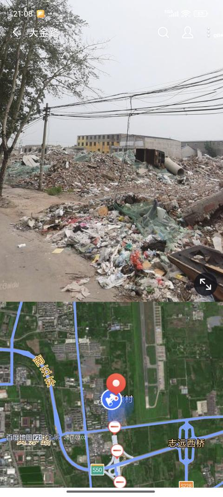
    - <a href="https://www.zhihu.com/people/57-68-61-75">实名用户</a> (<small title="河北">2026-1-25 2:43:0</small>): ［吃瓜］大兴这至少能拆了进新房（自己都拆了南苑也没搬了），市区里那些拆不了的才难受。
    - <a href="https://www.zhihu.com/people/1-12-79-68">平安顺利</a> (<small title="回复于 2026-1-25 15:1:13/北京"> ✉️:实名用户</small>): 市区里早就想拆了，是平房里面的人要价太高，人心不足蛇吞象，各个想拆迁致富，不满足就不走，我亲戚平房院里就这样，所以没拆成
    - <a href="https://www.zhihu.com/people/57-68-61-75">实名用户</a> (<small title="回复于 2026-1-25 17:56:34/河北"> ✉️:平安顺利</small>): 别说市区了，我这乡里几乎全拆了，但后面十几个村加起来有那么十几户没拆的，觉得国家给低了(同一个项目北京河北给的赔偿差太多了，后面批次的村赔的比前面的还少)，在荒地里断自来水(电线杆没撤还有电)自己打井吃水坚守七八年了，就是不搬，由于是北京的项目+配套设施不着急建也没人敢强拆。
    - <a href="https://www.zhihu.com/people/1-12-79-68">平安顺利</a> (<small title="回复于 2026-1-25 19:24:54/北京"> ✉️:实名用户</small>): 现在不是以前那种拆迁致富的年代了，早就过去了，只能一年比一年给的少，现在不走，以后更少……
    - <a href="https://www.zhihu.com/people/gui-xiao-tai-lang-51">桂小太郎</a> (<small title="北京">2026-1-27 13:34:9</small>): 你穿上马甲我也知道是大白楼
21. <a href="https://www.zhihu.com/people/tuzuan">纠缠在苍穹</a> (<small title="上海">2026-1-24 14:53:10</small>): 去东京旅游，登高望远是在很多地方有的旅游项目。东京塔，在涩谷等等，一眼望去连片的建筑物。  
 
前几年去，很自信，过几年我们就能超过。  
 
这几年去，算了，我们没机会赶上了［捂脸］
    - <a href="https://www.zhihu.com/people/57-68-61-75">实名用户</a> (<small title="河北">2026-1-25 2:56:15</small>): 拆的起能拆了也不会让你建超低层住宅和密密麻麻的单车道的，首先就是容易火烧连营，其次国内城市规划对绿地和公园有硬要求，老房子改不了你新建的再金贵的地皮也要有草地有树，所以你只能往高建提升容积率，就像各地的新区那样。最后很多所谓的市区本来不是市区，都有耕地指标，必须要死保。北京很多乡镇都在拆迁并居，一个原因是卖地改工商用了，另一个就是很多村子宅基地面积越来越高占了很多耕地。
    - <a href="https://www.zhihu.com/people/57-68-61-75">实名用户</a> (<small title="河北">2026-1-25 3:1:29</small>): 还有，东京都的一户建还是别吹了，堪比北京二环里的小胡同和上海的弄堂，真让你住你肯定不会住的
    - <a href="https://www.zhihu.com/people/tuzuan">纠缠在苍穹</a> (<small title="回复于 2026-1-25 11:24:0/上海"> ✉️:实名用户</small>): 你说得，打那么多字辛苦了，我都没看完［赞］
22. <a href="https://www.zhihu.com/people/48-37-13-37-60">raycn</a> (<small title="江苏">2026-1-24 22:33:6</small>): 北京确实够破的，第一次去都很难理解怎么能这么破
23. <a href="https://www.zhihu.com/people/bu-kai-xin-de-nian-ling">趣笔谈教</a> (<small title="山东">2026-1-24 8:2:25</small>): 如果配套好还能才要100万么？
24. <a href="https://www.zhihu.com/people/yin-chi-bei">引离杯</a> (<small title="北京">2026-1-26 7:58:49</small>): 哪用看朝阳东三环，看看三里河公园周边，离前门大街几步路，那不就个农村的样子吗
25. <a href="https://www.zhihu.com/people/rusell-68">Rusell</a> (<small title="北京">2026-2-6 8:35:32</small>): 隔壁十八里店也挺离谱的
26. <a href="https://www.zhihu.com/people/sl65amg">SL65AMG</a> (<small title="北京">2026-1-24 10:50:10</small>): 现在小红门那边也是，说白了就是大片的平方被推倒了，但是破砖乱瓦就留在当地，连拉都不拉走
27. <a href="https://www.zhihu.com/people/wwwwww-xz">wwwwww</a> (<small title="内蒙古">2026-1-26 10:58:41</small>): 确实是北京折叠了
28. <a href="https://www.zhihu.com/people/iceTritium">冰氚</a> (<small title="广东">2026-1-25 14:25:37</small>): 大家都知道，稀缺是人为制造的［爱］
29. <a href="https://www.zhihu.com/people/shu-matt">Shu Matt</a> (<small title="北京">2026-1-25 1:18:45</small>): 分钟寺成寿寺那一带确实挺像伊拉克的
    - <a href="https://www.zhihu.com/people/wang-shao-wei-46-16">亦庄边疆区总督</a> (<small title="河北">2026-1-25 11:6:40</small>): 大鲁店一直堪称朝阳区治安盲肠
30. <a href="https://www.zhihu.com/people/qi-ming-zi-16">水叫兽</a> (<small title="新加坡">2026-2-23 22:13:59</small>): 很多是拆不动，拆迁费太高了~
31. <a href="https://www.zhihu.com/people/xian-zhi-60-22">先知</a> (<small title="北京">2026-1-25 7:41:43</small>): 刚来北京没多久，昌平～海淀，感觉一块一块的，发达村里连接
32. <a href="https://www.zhihu.com/people/yan-yuan-i-65">演员i</a> (<small title="北京">2026-1-25 12:18:2</small>): 以前小时候在网络上 ，我以为2010就这样，没想到2025还这样，
33. <a href="https://www.zhihu.com/people/lin-wan-85-36">林晚</a> (<small title="北京">2026-1-24 20:42:7</small>): 过了长安街以南都很破［惊喜］，三环只有东北和中部一段还行
    - **秋天的布拉格** (<small title="北京">2026-1-24 21:9:55</small>): 我的图片里有东三环中段和东四环东北欧。
34. <a href="https://www.zhihu.com/people/anne-kang-12">Anne Kang</a> (<small title="北京">2026-2-10 15:25:50</small>): 朝阳区有些老破小是真的破，有些房子低矮，风烛残年，摇摇欲坠，超过50年的楼龄几乎已经不具备新型居住条件了，而只是因为位置房价就高的时代，在慢慢被瓦解
35. <a href="https://www.zhihu.com/people/a-a-a-a-a-21-62">啊啊啊啊啊</a> (<small title="北京">2026-1-24 9:20:11</small>): 这些荒地就是朝阳发展的底气。过去朝阳gdp超海淀就是靠这些连起来的地
36. <a href="https://www.zhihu.com/people/tonywu-93-34">Castle-3</a> (<small title="浙江">2026-1-24 11:22:44</small>): 就央财学院路往东一点点，纯纯县城风貌
37. <a href="https://www.zhihu.com/people/eatandgohome">大胆资本</a> (<small title="北京">2026-1-24 14:41:41</small>): 北京发展是点状的，和环线不必然相关
38. <a href="https://www.zhihu.com/people/li-li-35-25-67">andy</a> (<small title="北京">2026-1-25 10:18:1</small>): 北京绝大部分地方，都是大农村［doge］
    - <a href="https://www.zhihu.com/people/li-li-35-25-67">andy</a> (<small title="回复于 2026-1-26 9:20:59/北京"> ✉️:懒da王</small>): 更蚌埠住的是二环内也一堆老破小和脏乱差胡同［doge］
    - <a href="https://www.zhihu.com/people/tu-jian-jia-de-mai">懒da王</a> (<small title="北京">2026-1-25 15:37:2</small>): 本来就是。过去出了二环就算出城了。三环就有农田了，甚至还有畜牧业
39. <a href="https://www.zhihu.com/people/liang-ke-tang-36">两颗糖</a> (<small title="北京">2026-2-1 18:28:38</small>): 第一次读到北京折叠的时候完全没觉得这是科幻小说
40. <a href="https://www.zhihu.com/people/tang-mu-bu-shi-ke-lu-si">汤姆不是克鲁斯</a> (<small title="伊拉克">2026-2-4 3:6:36</small>): 不要小瞧了伊拉克，伊拉克也有好的地方！
41. <a href="https://www.zhihu.com/people/qiu-feng-xiao-se-26">bignose</a> (<small title="天津">2026-1-24 18:57:10</small>): 这就不得不说我17年上学刚从北京东站出来时的感受了
    - **秋天的布拉格** (<small title="北京">2026-1-24 21:10:45</small>): 嘿嘿。
42. <a href="https://www.zhihu.com/people/huang-ye-pang-huang">魔法少女李火旺</a> (<small title="江苏">2026-2-8 7:24:59</small>): 核心城区有基本农田是否有点离谱了［尴尬］
43. <a href="https://www.zhihu.com/people/hpzz-48">HPZZ</a> (<small title="新疆">2026-1-24 17:50:10</small>): 分钟寺这地方还是大规模拆迁之后了，2015年之前这地方全是棚户区
44. <a href="https://www.zhihu.com/people/shi-zhong-xu-77">石中絮</a> (<small title="湖北">2026-1-24 19:26:53</small>): 据说香港有很多荒地就是不开发，所以房价很贵？
    - <a href="https://www.zhihu.com/people/57-68-61-75">实名用户</a> (<small title="河北">2026-1-25 6:34:45</small>): 北京这不是不开发，是很多不让拆、拆不了、拆不起、不愿意拆(嫌价格低)
45. <a href="https://www.zhihu.com/people/pan-tian-yu-84">月游</a> (<small title="河北">2026-1-27 13:10:13</small>): 明明房子不稀缺，为什么房价却会这么高？
46. <a href="https://www.zhihu.com/people/sinjon666">404NOTFOUND</a> (<small title="北京">2026-1-26 9:59:27</small>): 南四环新发地附近还有一大片农田［doge］
47. <a href="https://www.zhihu.com/people/wangdh818">王大航</a> (<small title="内蒙古">2026-2-16 0:56:40</small>): 抖音上有个博主叫安琪勇士，他介绍的都是这种的
48. <a href="https://www.zhihu.com/people/kkndmee-63">kkndmee</a> (<small title="上海">2026-1-24 16:7:54</small>): 《北京折叠》诚不欺我
49. <a href="https://www.zhihu.com/people/hu-bi-lie-26-42">好的</a> (<small title="北京">2026-1-23 22:0:37</small>): 卧槽，还有我通勤路上的地方［飙泪笑］
50. <a href="https://www.zhihu.com/people/ai-fei-56-82">大白毛</a> (<small title="北京">2026-2-14 17:57:8</small>): 空地有的是，房子贵是因为其他原因，大家都懂。
51. <a href="https://www.zhihu.com/people/liu-gan-kun-89">一一</a> (<small title="四川">2026-2-11 0:38:35</small>): 5000的瑰丽套房外面是根烟囱，我打开窗都惊了［思考］ 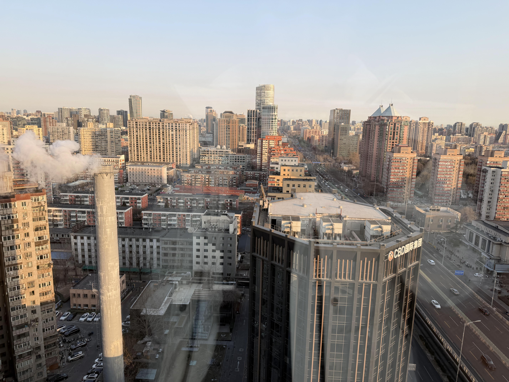
52. <a href="https://www.zhihu.com/people/mi-hao-98-2">你豪</a> (<small title="河北">2026-2-9 19:36:25</small>): 城乡融合［赞同］
53. <a href="https://www.zhihu.com/people/bai-yi-xing-xiang">麻衣卿相</a> (<small title="北京">2026-1-24 7:1:3</small>): 所以说，北京不缺地。  
 
地价完全是市政府控制着。  
 
当然，房价也一样。
54. <a href="https://www.zhihu.com/people/ma-zao">马枣</a> (<small title="北京">2026-1-24 9:15:14</small>): 不要把北京当一个城市，而是一个国家。一个国家有CBD，有贫民窟，有城区有农村不就太正常了。北京说是摊大饼，其实是些散点的区域中心相互连接组成的。
    - <a href="https://www.zhihu.com/people/linmal233">linmal233</a> (<small title="福建">2026-1-24 10:56:18</small>): 拉倒吧，就是个方圆二十公里的城市而已，很多其他国家的城市建成区更大的都有，这算不上最大的尺寸，也就主流规模。
    - <a href="https://www.zhihu.com/people/linmal233">linmal233</a> (<small title="福建">2026-1-24 10:56:58</small>): 论大饼结构，洛杉矶都会区和佛罗里达蔓延的郊区都比北京大得多。
    - <a href="https://www.zhihu.com/people/eatandgohome">大胆资本</a> (<small title="回复于 2026-1-24 14:38:31/北京"> ✉️:linmal233</small>): 摊大饼是城市建设最自然，成本最低的一种方式。北京要真是摊大饼就好了，为了美观搞那么多绿隔推升了房价，延长了通勤时间
    - <a href="https://www.zhihu.com/people/57-68-61-75">实名用户</a> (<small title="回复于 2026-1-25 2:37:20/河北"> ✉️:大胆资本</small>): 外国摊大饼是靠密密麻麻的house和密密麻麻的小路离了车出不了门(那么好的地居然全用来建房种草坪不种地)，国内的摊大饼是一个超大的小区周围到处是绿地、田地和没拆的村子
    - <a href="https://www.zhihu.com/people/ma-zao">马枣</a> (<small title="回复于 2026-1-25 6:42:36/北京"> ✉️:linmal233</small>): 说啥呢？方圆20公里，算你方是400平方公里，还没海淀区大呢。北京面积是1.64万平方公里。相当于上海6340+广州7434+深圳1997。相当于3倍的纽约+伦敦+首尔+东京+巴黎。常住人口两千多万，相当于澳大利亚。
    - <a href="https://www.zhihu.com/people/ma-zao">马枣</a> (<small title="回复于 2026-1-25 6:47:36/北京"> ✉️:linmal233</small>): 太离谱了大哥，还佛罗里达蔓延的郊区，你连佛罗里达是个州都不知道吗？州的郊区…
    - **秋天的布拉格** (<small title="回复于 2026-1-25 10:11:33/北京"> ✉️:linmal233</small>): 方圆20公里？长20公里，宽20公里，只是四环内而已。。。。  
 
平原上的巨城，不是山地省能想象的。
    - <a href="https://www.zhihu.com/people/linmal233">linmal233</a> (<small title="回复于 2026-1-25 10:21:27/福建"> ✉️:马枣</small>): 佛罗里达几乎整个州连成一片了［大笑］你可能不知道
    - <a href="https://www.zhihu.com/people/linmal233">linmal233</a> (<small title="回复于 2026-1-25 10:23:52/福建"> ✉️:马枣</small>): 北京的建成区放到北美都算小的， 人家是都会区概念，一个洛杉矶都会区的建成区能放进去两个北京，国外的市辖区很小，但不代表辖区外不是连成片的都市［尴尬］北京的规模在世界上真不算最大的。自己打开卫星地图好好看看吧，北京的面积？那叫辖区，把山区农田周边县都给算进去了，一点意义都没有，要比比建成区就够了
    - <a href="https://www.zhihu.com/people/linmal233">linmal233</a> (<small title="回复于 2026-1-25 10:28:2/福建"> ✉️:秋天的布拉格</small>): ［尴尬］哪里巨了？真不大，洛杉矶的建成区里面能塞进去俩北京了。更别提四环内都有空地。
    - <a href="https://www.zhihu.com/people/linmal233">linmal233</a> (<small title="回复于 2026-1-25 10:29:28/福建"> ✉️:马枣</small>): 你根本不懂郊区指的是什么，指的是Urban，城市形式的一种。
    - <a href="https://www.zhihu.com/people/linmal233">linmal233</a> (<small title="回复于 2026-1-25 10:32:29/福建"> ✉️:秋天的布拉格</small>): 【美国的城市相当于北京的几环？-哔哩哔哩】 [https://b23.tv/50dWLBI](https://b23.tv/50dWLBI)
    - <a href="https://www.zhihu.com/people/linmal233">linmal233</a> (<small title="回复于 2026-1-25 10:32:36/未知"> ✉️:马枣</small>): 【美国的城市相当于北京的几环？-哔哩哔哩】 [https://b23.tv/50dWLBI](https://b23.tv/50dWLBI)
    - <a href="https://www.zhihu.com/people/linmal233">linmal233</a> (<small title="回复于 2026-1-25 10:35:58/福建"> ✉️:马枣</small>): 3倍体现在哪［尴尬］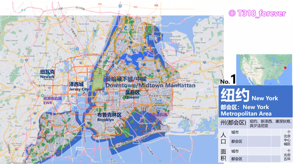
    - <a href="https://www.zhihu.com/people/linmal233">linmal233</a> (<small title="回复于 2026-1-25 10:36:27/福建"> ✉️:马枣</small>): 洛杉矶的面积［大笑］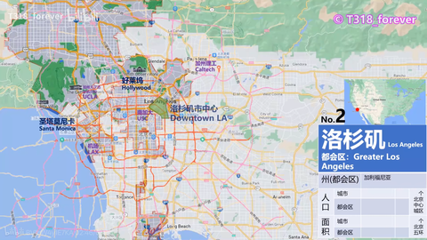
    - <a href="https://www.zhihu.com/people/linmal233">linmal233</a> (<small title="回复于 2026-1-25 10:37:14/福建"> ✉️:秋天的布拉格</small>): 跟迈阿密比一下？［大笑］洛杉矶更是有两个大了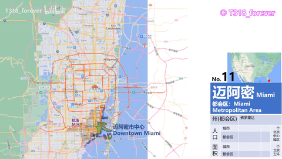
    - **秋天的布拉格** (<small title="回复于 2026-1-25 10:58:24/北京"> ✉️:linmal233</small>): 1，在你的表述里，北京城市建成区只有400平方公里。只是四环以内。  
 
实际上主城早以蔓延到六环以外，周边还有若干卫星城。  
 
2，以洛杉矶为例，洛杉矶市1200平方公里，但人口只有300万，洛杉矶县1.2万平方公里，人口只有900多万，和中国城市的人口密度不是一个概念。中国的村，在美国都能设市了。  
 
整个洛杉矶都会区5个县，8万平方公里，也就1800万人。  
 
你要是这么对比，别说天津要圈进来，唐山都得圈进来。上海别说要合并苏锡常，杭州宁波都得算进去。  
 
  
 
你要是觉得北京就是个“方圆二十公里”的一个城，那你只能就继续这么觉得吧。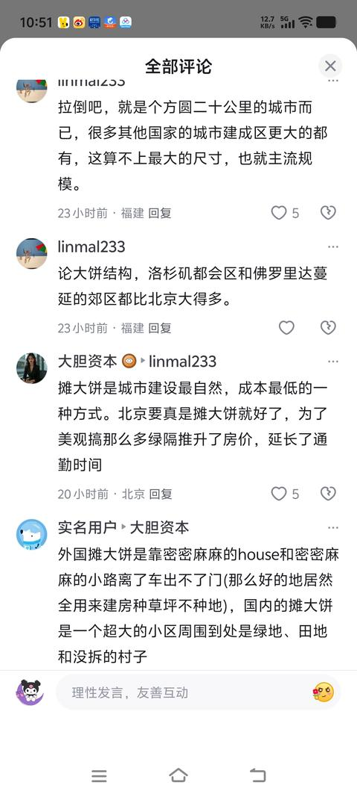
    - <a href="https://www.zhihu.com/people/linmal233">linmal233</a> (<small title="回复于 2026-1-25 12:10:43/福建"> ✉️:秋天的布拉格</small>): 你圈什么天津？中间隔了大片野地，根本算不上什么都会区，人家是连成片的，也只有广佛同城化才称得上都会区。
    - <a href="https://www.zhihu.com/people/linmal233">linmal233</a> (<small title="回复于 2026-1-25 12:11:41/福建"> ✉️:秋天的布拉格</small>): 别说什么主城到六环外 就连四环里都有大片空地，更别提五环六环了。
    - **秋天的布拉格** (<small title="回复于 2026-1-25 12:14:22/北京"> ✉️:linmal233</small>): 因为你就是觉得，北京只有方圆20公里啊！你就是这么觉得，我也没法说什么。  
 
你就这么觉得呗。
    - **秋天的布拉格** (<small title="回复于 2026-1-25 12:20:27/北京"> ✉️:linmal233</small>): 我都是按照你的标准圈的啊。你看你，你非说北京就是方圆20公里，我跟你说了不是。  
 
你不信。  
 
你举例子，我就按你举例子的大小去圈，你又不干。  
 
到底要怎么样啊？  
 
就为了支持你北京方圆20公里的论点？
    - <a href="https://www.zhihu.com/people/shen-ling-82">神灵</a> (<small title="回复于 2026-1-25 14:13:19/北京"> ✉️:linmal233</small>): 你应该是既没去过北京，也没去过洛杉矶［捂脸］洛杉矶还没北京城六区大，整个北京市更是洛杉矶10倍大。洛杉矶堵是因为摊大饼，道路布局极不合理，后期没办法拓宽等多方面原因导致。
    - <a href="https://www.zhihu.com/people/linmal233">linmal233</a> (<small title="回复于 2026-1-25 17:29:52/福建"> ✉️:神灵</small>): ［捂脸］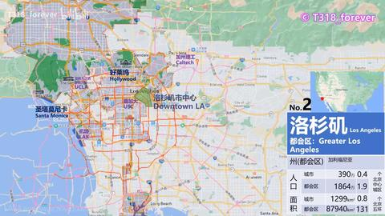
    - <a href="https://www.zhihu.com/people/linmal233">linmal233</a> (<small title="回复于 2026-1-25 17:30:29/福建"> ✉️:神灵</small>): 还十个洛杉矶？［捂脸］洛杉矶市区能塞进去两个六环了
    - <a href="https://www.zhihu.com/people/linmal233">linmal233</a> (<small title="回复于 2026-1-25 17:31:16/福建"> ✉️:秋天的布拉格</small>): 人家是连成片的建成区,你是吗？［尴尬］
    - **秋天的布拉格** (<small title="回复于 2026-1-25 18:1:25/北京"> ✉️:linmal233</small>): 我很赞同另一个人说你的。  
 
你没去过北京，也没去过洛杉矶。  
 
还停留在北京不过“方圆二十公里”的自我想象里，也不知道洛杉矶市其实只有300多万人口。
    - <a href="https://www.zhihu.com/people/shen-ling-82">神灵</a> (<small title="回复于 2026-1-26 10:18:14/北京"> ✉️:linmal233</small>): 你这图，洛杉矶只覆盖了北京城六区的一小部分啊。从面积上看，北京城六区就大于洛杉矶了，北京16区的总面积是洛杉矶面积十倍大。北京2000多万人口，洛杉矶300多万人口。这些都是公开可查的数据，不能光凭感觉就认为洛杉矶比北京大，实际上差得太远了。
    - <a href="https://www.zhihu.com/people/ma-zao">马枣</a> (<small title="回复于 2026-1-26 11:45:32/北京"> ✉️:linmal233</small>): 太睿智了［赞］  
 
我说“不要把北京当一个城市，而是一个国家。一个国家有CBD，有贫民窟，有城区有农村不就太正常了。”  
 
你在这“北京的面积，那叫辖区，把山区农田周边县都给算进去了。”  
 
然后开始自己开始定义辖区，郊区，证明“真正的北京”多么小。都会区的洛杉矶纽约多么大。官方的行政区划、机构组织、户口都不算数，把北京人开除出北京，把美国几个相互独立自主的，有自己的行政组织、不同的财税制度、甚至法律法规都有差异，互不管辖的市看做一个都会区。  
 
所有的这一切都是你莫名其妙提出了个“北京其实不大”的议题，通过论证北京建成区（其实也远比你说的大）不大，来反驳我北京是个（有农村，有荒地）的“国家”。也不知道你漏洞百出，牵强附会的反驳了个啥。反正就是都得由你定义，为了你能赢一嘴［飙泪笑］
    - <a href="https://www.zhihu.com/people/linmal233">linmal233</a> (<small title="回复于 2026-1-26 15:7:55/福建"> ✉️:神灵</small>): 洛杉矶都会区是一个广大的城市建成区，真正的洛杉矶市只不过是洛杉矶都会区的一个区级别行政区而已。就像台北市被新北市包围形成的大台北都会区，国内惯用广域市辖区，底下还有县，这跟国外的city完全是俩概念，国外的县都比市大。［大笑］不要拿不同的概念来碰瓷儿。
    - <a href="https://www.zhihu.com/people/linmal233">linmal233</a> (<small title="回复于 2026-1-26 15:9:3/福建"> ✉️:马枣</small>): 要这么比的话重庆才是世界上最大的城市［尴尬］市辖区的概念完全不是一回事，人家的city就是都市里一个区罢了。
    - <a href="https://www.zhihu.com/people/huang-chen-43-17">稻荷狐仙</a> (<small title="回复于 2026-2-11 9:45:30/上海"> ✉️:马枣</small>): 兄弟，1.64w是行政区划，里面包含群山，水库，细细碎碎的小村子，田地和郊区。北京建成区确实远超400平方公里，但距离1w平方公里还差的远。上海行政面积是6400平方公里，建成区大约占60%左右，北京的建成区还不如上海呢，顶多3000平方公里的水平，我没查资料凭印象说的，应该不会差的太多。
    - <a href="https://www.zhihu.com/people/huang-chen-43-17">稻荷狐仙</a> (<small title="回复于 2026-2-11 9:48:12/上海"> ✉️:秋天的布拉格</small>): 能不能算一个城市建成区得看市区有没有连起来，比如苏州和昆山，广州和佛山，这两对几乎可以算一个城市了。但你北京和周边卫星城就没一个连起来的。北京建成区比上海都小得多。
    - <a href="https://www.zhihu.com/people/huang-chen-43-17">稻荷狐仙</a> (<small title="回复于 2026-2-11 9:52:40/上海"> ✉️:linmal233</small>): 不，哥们儿，按照他们的理论，世界最大是巴音郭楞，这玩意也是地级行政区，47w平方公里［飙泪笑］。而且这么算的话中国一大堆地级市可以把世界前100大城市包揽掉。
    - <a href="https://www.zhihu.com/people/ma-zao">马枣</a> (<small title="回复于 2026-2-24 10:53:10/天津"> ✉️:稻荷狐仙</small>): 兄弟，你先看看我说的啥，他“拉倒吧”个什么玩意。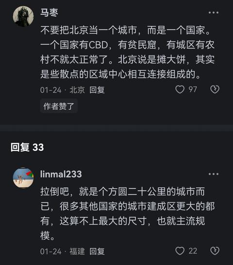
55. <a href="https://www.zhihu.com/people/wang-jia-cheng-48-55">只关心柴米油盐</a> (<small title="北京">2026-1-23 23:42:14</small>): 三环内都有烂尾楼，你敢信
    - **秋天的布拉格** (<small title="北京">2026-1-23 23:44:48</small>): 二环边都有，雅宝路。经过二环必能看见。
    - <a href="https://www.zhihu.com/people/patrickshiro">Patrickshiro</a> (<small title="澳大利亚">2026-1-24 8:32:27</small>): 以太广场就是，都多少年了
    - <a href="https://www.zhihu.com/people/yuan-ting-16-66">渊亭</a> (<small title="回复于 2026-1-24 8:33:33/北京"> ✉️:秋天的布拉格</small>): 二环内也有，菜户营
    - <a href="https://www.zhihu.com/people/aaaa-97-13-68">aaaa</a> (<small title="福建">2026-1-24 13:33:15</small>): 切 我们这海边主干道上 当年的海西第一高楼也烂尾 烂了10年终于有人接盘了 那是奔走相告啊［酷］
56. <a href="https://www.zhihu.com/people/liu-yi-lin-73-81">刘一麟</a> (<small title="河北">2026-1-24 22:10:5</small>): 看得见的那只手就是那样，资源高度错配，一边房价高昂，一边土地撂荒，旱的旱死，涝的涝死。
    - <a href="https://www.zhihu.com/people/gui-xiao-tai-lang-51">桂小太郎</a> (<small title="北京">2026-1-27 13:18:26</small>): 是的，还得是哈耶克，曼哈顿是曼哈顿，布鲁克林是布鲁克林，不存在错配［惊喜］［惊喜］［惊喜］
57. <a href="https://www.zhihu.com/people/bryanc-52">Bryanc</a> (<small title="山东">2026-1-24 9:50:0</small>): 光看这几张图实在没法想象你说的断壁残垣。
    - <a href="https://www.zhihu.com/people/57-68-61-75">实名用户</a> (<small title="回复于 2026-1-25 2:47:15/河北"> ✉️:孙悟睡</small>): 因为有的是违建，拆的部门只管拆
    - <a href="https://www.zhihu.com/people/sun-wu-shui">孙悟睡</a> (<small title="北京">2026-1-24 10:56:51</small>): 房子拆一半不拆那种状态，也不知道为什么不拆了，一放好几年也没人管
58. <a href="https://www.zhihu.com/people/qiao-qian-15-5">鲁鲁比达拉</a> (<small title="北京">2026-1-26 7:42:32</small>): 通州现在特别好，啊…不对，通州还是太宽泛，得是副中心［doge］
59. <a href="https://www.zhihu.com/people/momo-26-43-56">momo</a> (<small title="韩国">2026-7-28 19:31:40</small>): 三环到四环人称环京贫困带
60. <a href="https://www.zhihu.com/people/bob-zhu-90-95">北极鲶鱼的老公</a> (<small title="北京">2026-7-28 11:20:34</small>): 北京左安门立交桥东南角那一片从上世纪90年代就拆迁了，一直断壁残垣状态到今天。
61. <a href="https://www.zhihu.com/people/zipengpengzi">棚子</a> (<small title="北京">2026-7-15 10:49:55</small>): 分钟寺是东南三环 和真正意义的东三环没有可比性 懂什么叫南三环吗？！
62. <a href="https://www.zhihu.com/people/hdtjjjj">阿田</a> (<small title="北京">2026-7-6 11:43:5</small>): 哈
63. <a href="https://www.zhihu.com/people/86-4-87-27">正义之光</a> (<small title="北京">2026-1-24 13:50:57</small>): 南边。。。没什么功能定位［捂脸］
    - **秋天的布拉格** (<small title="北京">2026-1-24 14:12:52</small>): 这里面有好几个图是北边欧。
64. <a href="https://www.zhihu.com/people/mesvw">李成桂</a> (<small title="广东">2026-6-15 12:48:2</small>): 有道理的，
65. <a href="https://www.zhihu.com/people/54-69-26-92">DQ大千</a> (<small title="北京">2026-6-6 20:34:57</small>): 顶层设计这一波是站在大气层的。  
 
大概看了下评论区，冷嘲热讽的有，说历史原因的有，实际上都没说到点上。  
 
前面十几年科技产业兴起和城市化发展，如果说全部在五环以内甚至四环以内发展，那好了，北京再想要发展只能往五环外了。  
 
北京是首都，无论过去还是未来，任何新兴产业北京都会有一席之地，如果把五环内的地全都用完，以后的新兴产业怎么办，那往五环外发展的话，市区内逐渐成为老城区，繁华地段不断往外迁移，北京还是那个北京吗。  
 
市内无论是荒地还是农田都是非常好用的且没有任何包袱的优质地块，只要有新兴产业需要在市区内发展，随时随地可以批下来就用。  
 
城市发展和玩游戏不一样，玩游戏一键清空再造，真实世界拆迁改造工程非常复杂且耗资巨大。  
 
城区只有给未来产业提供足够的空间，才能带动城市的发展，这才是真正的顶层设计。
66. <a href="https://www.zhihu.com/people/lei-lei-22-6-96">蕾蕾</a> (<small title="北京">2026-6-7 13:44:19</small>): 问题是现在伊拉克可好了［捂脸］
67. <a href="https://www.zhihu.com/people/liyunchi">肥皂泡</a> (<small title="浙江">2026-1-25 9:13:42</small>): 哎呦 你这是干嘛呀
68. <a href="https://www.zhihu.com/people/d7e66e3f">Wu23333</a> (<small title="北京">2026-4-14 19:6:39</small>): 北京是这样的，东一块西一块，外加很多历史遗留问题
69. <a href="https://www.zhihu.com/people/da-mo-gu-60-3">大蘑菇</a> (<small title="埃塞俄比亚">2026-3-25 4:45:2</small>): 前门大街东面也有
70. <a href="https://www.zhihu.com/people/nedd-80">Nedd</a> (<small title="北京">2026-3-18 3:19:59</small>): 分钟寺地铁站对面的加油站很便宜，一箱95省七八十。这是我对分钟寺唯一的印象也是我去那里的唯一目的
71. <a href="https://www.zhihu.com/people/60-43-3-57">阴阳相济</a> (<small title="上海">2026-3-12 8:41:56</small>): 正好，以后人口下降，不需要大规模建房子了，可以将这些城中的荒地改造成绿地公园，提升城市环境
72. <a href="https://www.zhihu.com/people/boxlink">黄础龙boxlink</a> (<small title="北京">2026-3-11 8:24:51</small>): 所以，北京不缺土地不缺房子的
73. <a href="https://www.zhihu.com/people/yang-yi-45-16">洋樹</a> (<small title="北京">2026-3-9 13:28:5</small>): 北京确实问题就是荒地太多，也不拿来盖楼。望京这一块出去大片大片荒地，明明很多公司在这儿，住人的需求不小。 但还是许多人得去顺义通勤，坐地铁非常明显，从望京出去五六个地铁站没人下车，到顺义那一块全下车了。 无论说什么耕地绿化林地都是扯淡，这就根本没把打工人当人看啊［打招呼］
74. <a href="https://www.zhihu.com/people/27-59-24-57">雷鸣</a> (<small title="北京">2026-3-8 11:30:7</small>): 房子的价格涨跌是正常现象，他是根据经济形势，人口形势调整的。还有一个重要因素，就是国家对房子的管控。北京的房子价格必须稳定在对金融不构成严重负面影响，同时市民能够接受，能在一定程度上实现对城市繁荣提供正向作用的范围。北京房价太高涨幅太大容易被资本投机，房价太低跌幅太大容易断供，影响金融稳定以及市民民生安全。所以，北京房价不能太低，但也不能太高，但可以比较高，这是他的城市性质决定的。
75. <a href="https://www.zhihu.com/people/chenchuxia">鸡翅圣手VM155</a> (<small title="北京">2026-2-21 0:4:21</small>): 越往内环走越乱，23年前这种荒地拆一半的废墟数不胜数［捂脸］
76. <a href="https://www.zhihu.com/people/wangchong-39">猪肉大葱牛肉大葱</a> (<small title="北京">2026-2-11 11:19:0</small>): 农田就当绿化啊赚翻了
77. <a href="https://www.zhihu.com/people/bai-se-yao-shou">古拉格夜枭</a> (<small title="北京">2026-2-6 17:6:27</small>): 伊拉克现在的城建可非常好
78. <a href="https://www.zhihu.com/people/98-54-13-51-30">理想主义者二世</a> (<small title="河南">2026-2-4 20:35:52</small>): 你倒是来个实景啊［捂脸］
79. <a href="https://www.zhihu.com/people/su-ang-36">小lala</a> (<small title="北京">2026-2-2 11:6:1</small>): 大城市近郊保留基本农田是严重资源错配
80. <a href="https://www.zhihu.com/people/blxd2222">随便的人</a> (<small title="河北">2026-1-23 21:38:24</small>): 提问:那这种房子能买吗［发呆］？是不是未来20年以后这块地就会变的比较繁华啊？
    - <a href="https://www.zhihu.com/people/nothing-in-real">Nothing in real</a> (<small title="北京">2026-1-23 21:51:56</small>): 繁华跟你没关系。就SKP，全北京售的最贵的这儿都有，旁边金地国贸华贸，你从四环拐过来走京通快速路往城里走，SKP对面就是一堆破楼［小情绪］。在往城里走还有垃圾棚户小楼。
    - **秋天的布拉格** (<small title="北京">2026-1-23 21:56:23</small>): skp周边。已经开发很多年了。  
 
哪儿都一样。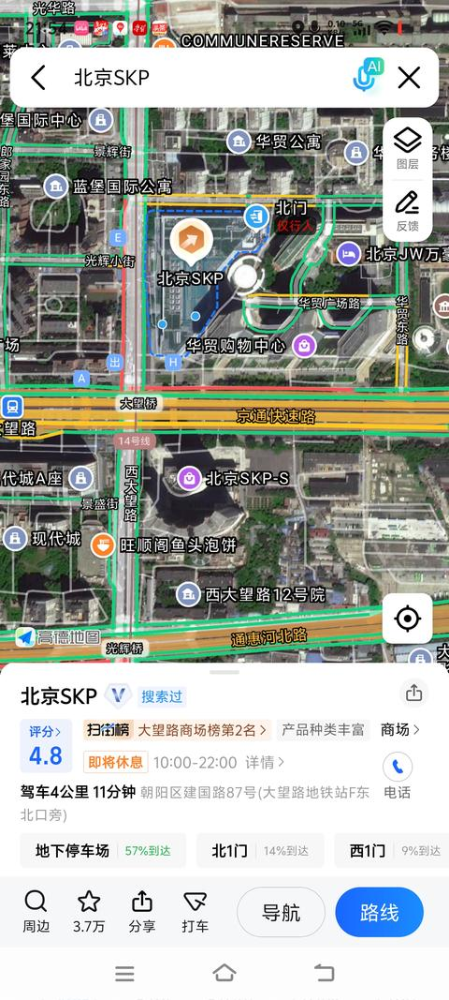
    - **秋天的布拉格** (<small title="北京">2026-1-23 21:58:30</small>): 我最后发的那个二环的图，图中的主要区域，中国医学科学院肿瘤医院，落成于1958年，这个区域已经开发快70年了。
    - <a href="https://www.zhihu.com/people/xi-xin-qi-pan">momo</a> (<small title="回复于 2026-1-23 23:51:53/北京"> ✉️:Nothing in real</small>): 光辉里［看看你］
    - <a href="https://www.zhihu.com/people/47-33-91-50-89">坎瑞亚</a> (<small title="北京">2026-1-24 4:1:17</small>): 北京不存在繁华的楼盘
    - <a href="https://www.zhihu.com/people/hong-li-yu-yu-lv-li-yu-yu-yu-63-79">红鲤鱼与绿鲤鱼与鱼</a> (<small title="回复于 2026-1-24 18:31:16/河北"> ✉️:Nothing in real</small>): 刚刷抖音还看到，SKP对面，南北通透50多平小两居，220万，单价3万多吧。然后就看见你这个回答了［doge］
    - <a href="https://www.zhihu.com/people/nothing-in-real">Nothing in real</a> (<small title="回复于 2026-1-24 18:39:39/北京"> ✉️:红鲤鱼与绿鲤鱼与鱼</small>): 天安门后面三万多老破小好歹还占个安全。SKP旁边图个啥
    - <a href="https://www.zhihu.com/people/hong-li-yu-yu-lv-li-yu-yu-yu-63-79">红鲤鱼与绿鲤鱼与鱼</a> (<small title="回复于 2026-1-25 0:49:6/河北"> ✉️:Nothing in real</small>): 那咱就不了解了，抖音上中介发的
    - <a href="https://www.zhihu.com/people/timo-67-10">timo</a> (<small title="回复于 2026-1-25 1:31:39/广东"> ✉️:Nothing in real</small>): 看别人购物［飙泪笑］
81. <a href="https://www.zhihu.com/people/bingyinn-58">bingyinn</a> (<small title="江苏">2026-6-22 19:9:13</small>): 南边丰台不也是［捂脸］
82. <a href="https://www.zhihu.com/people/bo-gua-gua-28">知乎不能丢掉灵魂</a> (<small title="内蒙古">2026-1-24 12:31:30</small>): 这片是丰台朝阳交界，都不爱管的三角地
83. <a href="https://www.zhihu.com/people/xu-gong-zi-17-32">是以</a> (<small title="北京">2026-1-25 23:3:58</small>): 泛海世家是哪一个档次的小区，特别好吗
    - **秋天的布拉格** (<small title="北京">2026-1-25 23:10:2</small>): 这里有半个小目标一套的。。。［酷］
84. <a href="https://www.zhihu.com/people/xu-cong-hui">smart</a> (<small title="北京">2026-1-25 0:11:13</small>): 城市版面确实差一些，也就占个区位优势
85. <a href="https://www.zhihu.com/people/yun-zhong-yang-38">锤兔</a> (<small title="北京">2026-1-24 16:22:47</small>): 主要就是拆不起 齁贵［飙泪笑］［飙泪笑］［飙泪笑］多是盼着坐地起价的闲散贵族
    - <a href="https://www.zhihu.com/people/57-68-61-75">实名用户</a> (<small title="河北">2026-1-25 6:36:6</small>): 还要给这些北京户口的找工作，出租公交只能北京户口才能开，为了保护出租也是抓滴滴最频繁、处罚最重的城市之一
    - <a href="https://www.zhihu.com/people/yun-zhong-yang-38">锤兔</a> (<small title="回复于 2026-1-25 20:42:46/北京"> ✉️:实名用户</small>): 本来北京的出租和滴滴就是留给北京本地人的保底饭碗
    - <a href="https://www.zhihu.com/people/57-68-61-75">实名用户</a> (<small title="回复于 2026-1-25 20:52:32/河北"> ✉️:锤兔</small>): 滴滴不是，滴滴大部分都是外地人在跑，本来挣得就少滴滴抽成还高，还要租车租牌子
86. <a href="https://www.zhihu.com/people/1531-96">1531</a> (<small title="北京">2026-1-24 13:57:23</small>): 南二环比北四环还荒
    - **秋天的布拉格** (<small title="北京">2026-1-24 14:15:54</small>): 北四环，北三环同样有类似的地方。  
 
这是北三环内。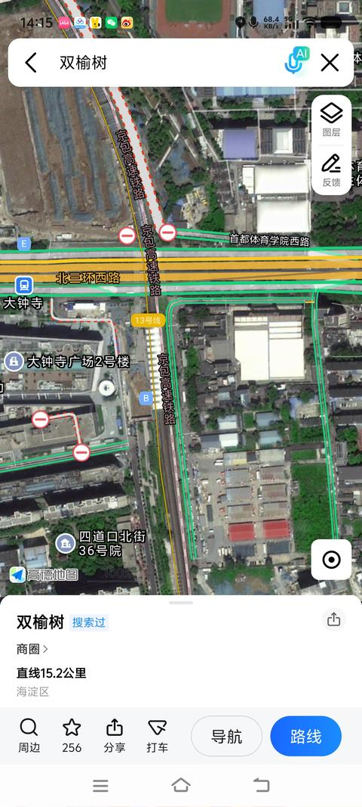
    - <a href="https://www.zhihu.com/people/gui-xiao-tai-lang-51">桂小太郎</a> (<small title="回复于 2026-1-27 13:20:31/北京"> ✉️:秋天的布拉格</small>): 这算啥啊，你再往西，还一大片正经农田呢
87. <a href="https://www.zhihu.com/people/qiheng">齐恒</a> (<small title="北京">2026-1-24 13:20:2</small>): 合生汇周围还有荒地吗？除了广渠路南空出来准备修路以外
88. <a href="https://www.zhihu.com/people/cao-wei-70-98">每天要喝八千杯水</a> (<small title="北京">2026-1-24 14:56:54</small>): 绿格
89. <a href="https://www.zhihu.com/people/brotatochips">ProtatoChips</a> (<small title="中国香港">2026-1-24 22:12:20</small>): 分钟寺是这样的，符合北京大农村刻板印象
90. <a href="https://www.zhihu.com/people/yin-xuan-kun-wu-yang">阴玄坤武阳</a> (<small title="北京">2026-1-24 22:46:18</small>): 亦庄是北京南城难得现代化区，和中心城区隔了一片棚户区。。。  
 
东南二环也一片棚户。
    - <a href="https://www.zhihu.com/people/yin-xuan-kun-wu-yang">阴玄坤武阳</a> (<small title="回复于 2026-1-26 12:10:8/北京"> ✉️:实名用户</small>): 马桥那边廉价公寓现在也是，亦庄最大劳务市场。
    - <a href="https://www.zhihu.com/people/57-68-61-75">实名用户</a> (<small title="河北">2026-1-25 2:45:49</small>): ［飙泪笑］过了河去马驹桥，也这样，我还记得11年住过的出租屋，出门就半米宽
91. <a href="https://www.zhihu.com/people/si-shui-liu-yun-53">似火流云</a> (<small title="北京">2026-1-24 15:53:44</small>): 北京不一直都是这样的吗？我从小到大在北京生活了50年，心中对北京从来没有任何光环，北京就是这样，咋了？
92. <a href="https://www.zhihu.com/people/he-ni-kan-bu-jian-wo">呵你看不见我</a> (<small title="北京">2026-1-24 16:37:42</small>): 你以为人家说出了二环都是村 是瞎说的吗
    - <a href="https://www.zhihu.com/people/demon-1-43-24">demon</a> (<small title="北京">2026-1-24 17:28:43</small>): 进了二环也是村啊
    - <a href="https://www.zhihu.com/people/he-ni-kan-bu-jian-wo">呵你看不见我</a> (<small title="回复于 2026-1-24 19:33:48/北京"> ✉️:demon</small>): 没见过村里公厕带空调的
93. <a href="https://www.zhihu.com/people/woshixiaoxie">绝命小法师</a> (<small title="北京">2026-1-24 16:42:2</small>): 有的是部委的，有的是军产，有的是央企的，权衡太难
94. <a href="https://www.zhihu.com/people/chun-chun-de-chun-bai-meng-xiang">笑笑不可爱</a> (<small title="北京">2026-1-24 11:45:16</small>): 我去年在花乡那边做一个项目，那里才是真的荒，从地铁出来我还以为我被世界遗弃了［捂脸］
95. <a href="https://www.zhihu.com/people/kan-xing-kong-de-cang-shu">看星空的仓鼠</a> (<small title="北京">2026-1-24 23:22:54</small>): 北富南穷、东富西贫可不是说笑［吃瓜］
96. <a href="https://www.zhihu.com/people/no-stop-83">YES.STOP</a> (<small title="北京">2026-1-24 21:37:39</small>): 伊拉克，笑晕了
97. <a href="https://www.zhihu.com/people/xiao-guai-wu-bu-shuo-hua-12">月美适刺猹</a> (<small title="河南">2026-1-24 10:49:0</small>): 谁说北京没有贫民窟［生气］［生气］［生气］
98. <a href="https://www.zhihu.com/people/chen-da-wei-23-99">山毛不榉</a> (<small title="北京">2026-1-24 18:38:28</small>): 有点侮辱现在的伊拉克了
99. <a href="https://www.zhihu.com/people/wan-yigou">万四狗</a> (<small title="湖北">2026-1-24 10:36:30</small>): ［惊喜］你这算啥，亦庄南五环北边那一片才是真伊拉克
    - **秋天的布拉格** (<small title="北京">2026-1-24 10:42:58</small>): 这里其实属于一个大的片区，从肿瘤医院一路向东南，小红门乡和十八里店乡，最后到亦庄。
    - <a href="https://www.zhihu.com/people/wan-yigou">万四狗</a> (<small title="回复于 2026-1-24 10:46:4/湖北"> ✉️:秋天的布拉格</small>): 十八里店靠南五环这本来有一排房子，搞的公寓小工厂乡镇KTV之类的，大兴失火之后全拆了，搞的真跟被轰炸过一样［笑哭］
    - <a href="https://www.zhihu.com/people/86-53-39-29">砾岩</a> (<small title="回复于 2026-1-24 13:25:43/吉林"> ✉️:万四狗</small>): 有一次我找便宜建材，从国贸出发到十里河，再一路扎过去到十里河建材城供货的的那些仓库，工厂，村庄，建材行业人员住的城中村。  
 
北京折叠具象化
100. <a href="https://www.zhihu.com/people/liu-si-si-11-63">刘思思</a> (<small title="北京">2026-5-26 14:21:7</small>): 分钟寺那个破地方应该算丰台吧［捂脸］朝阳的下线没那么低［捂脸］
101. <a href="https://www.zhihu.com/people/windirge">windirge</a> (<small title="河北">2026-1-24 9:15:35</small>): 外面看说以为到了伊拉克，然后好几张图片，打开之后全是地图截图，一张照片没有，问题来了，是战乱时的伊拉克，还是知乎er口中央视不报导的伊拉克［doge］
     - <a href="https://www.zhihu.com/people/57-68-61-75">实名用户</a> (<small title="河北">2026-1-25 3:4:42</small>): ［捂脸］违建拆了没人管或者搬走了还没拆/拆了没平地的真的特别脏乱，各种垃圾，不过要是正常拆迁过个一两年基本上都变正常工地了或者直接平了变荒地
     - <a href="https://www.zhihu.com/people/57-68-61-75">实名用户</a> (<small title="河北">2026-1-25 3:8:46</small>): 我现在就住在回迁房里，我家在小区东北角，出了小区群东西南北全是名义上的工地实际是荒地各种断头路，荒地中散布着各种项目工地和零散的楼、仓库，我东边院里的小区水泥浇筑好了两年了没做外墙，但也因为没回填土所以院里没杂草，楼北边有条省道就差三十米京冀就能接上了四年了没人修
     - <a href="https://www.zhihu.com/people/57-68-61-75">实名用户</a> (<small title="河北">2026-1-25 3:10:44</small>): ［捂脸］其实只要拆了过个几年就变新楼了，难的是那些没拆的，拆不了、拆不起、不能拆不让拆，只能就那样住着漏雨的“文建”
     - <a href="https://www.zhihu.com/people/57-68-61-75">实名用户</a> (<small title="回复于 2026-1-25 3:12:30/河北"> ✉️:实名用户</small>): 我比较喜欢做的一件事就是隔几个月去看卫星地图，看看哪里的拆了，哪里的建起来了，哪里的断头路通了，省的哪天着急出门连近道都不知道怎么走

=[评论](./attachments/comments.json)

