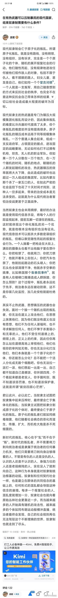

[toc]

# 问题

提问者：**<a href="https://www.zhihu.com/people/64-50-86-69-86">网评员</a>**
提问时间: 2026-9-15 8:33:32
总回答数: 912
总访问量: 7222160

如何看待广州大学城捅人事件？

# 回答

回答者： **<a href="https://www.zhihu.com/people/wan-pi-hou-22-51">积分积不准</a>**
回答时间: 2026-9-16 16:21:27
点赞总数: 1084
评论总数: 45
收藏总数: 132
喜欢总数：10

这不是恐怖主义，这就是现代原子化社会的原子叛乱。

现代社会由于组织度、信息流通以及科技生产力前所未有的发展，历史中那种传统意义上的建制化叛乱已经不可能实现了。

但原子化社会会带来另一个问题——高度原子化的社会会滋生原子化叛乱。这种叛乱具有高度个体化、无理由、不可预见、作案随机的特点。

就像癌细胞一样，建制部队就像刀剑，你可以杀死一个人，但你无法杀死癌细胞，就像你不可能拿大炮去打蚊子。

  

原文地址：[(积分积不准)如何看待广州大学城捅人事件？](https://www.zhihu.com/question/2083111201941239140/answer/2083591343339738014) 

# 评论

1. <a href="https://www.zhihu.com/people/shang-xian-yue-50-77">上弦月</a> (<small title="陕西">2026-9-16 18:3:9</small>): 原子化叛乱，可惜已经荒原了
   - <a href="https://www.zhihu.com/people/hiqcdw">知乎用户HiqcdW</a> (<small title="上海">2026-9-17 0:23:14</small>): 可惜了，那篇原子化叛乱写得真好
   - <a href="https://www.zhihu.com/people/xiao-en-7-48">肖恩</a> (<small title="新疆">2026-9-17 2:33:49</small>): 截图在这里［滑稽］
   - <a href="https://www.zhihu.com/people/8-34-43-64-60">灯火迷梦绚烂</a> (<small title="回复于 2026-9-17 3:55:16/浙江"> ✉️:肖恩</small>): 千人律者的既视感
   - <a href="https://www.zhihu.com/people/can-meng-sheng">不知名观众</a> (<small title="回复于 2026-9-17 7:6:24/福建"> ✉️:肖恩</small>): 恶意截图等下把你关进小黑屋
2. <a href="https://www.zhihu.com/people/fxx-21-77">Shawn Fan</a> (<small title="广东">2026-9-16 17:57:10</small>): 人文关怀为零［酷］随着经济上行，这种事情会越来越少的［捂嘴］
   - <a href="https://www.zhihu.com/people/mo-bao-37-78-37">Divine-Wrath</a> (<small title="江苏">2026-9-16 21:14:51</small>): 这十几年来恶性凶案确实越来越少了［吃瓜］听说现在基层刑侦部门的主要业务是反诈
   - <a href="https://www.zhihu.com/people/xing-er-he-san-54">crazy</a> (<small title="回复于 2026-9-16 21:45:38/北京"> ✉️:Divine-Wrath</small>): 这又不冲突，反诈是宣传预防作用。你总不能去宣传大家不要街头无差别刀人
   - <a href="https://www.zhihu.com/people/mo-bao-37-78-37">Divine-Wrath</a> (<small title="回复于 2026-9-16 21:49:1/江苏"> ✉️:crazy</small>): 宣传预防又不是刑侦部门负责，这里指的是实打实的资金流水追踪和跨境人员抓捕［吃瓜］
   - <a href="https://www.zhihu.com/people/xing-er-he-san-54">crazy</a> (<small title="回复于 2026-9-17 10:1:53/北京"> ✉️:Divine-Wrath</small>): 钱出去了就没几个追得回来的，不知道你听说的刑侦干这个有什么意义
3. <a href="https://www.zhihu.com/people/lin-yi-rong-26">林宜荣</a> (<small title="浙江">2026-9-16 21:18:16</small>): 癌细胞变癌细胞之前可是正常细胞。很多都是环境导致他突变的。
4. <a href="https://www.zhihu.com/people/xing-err-shang">trackers</a> (<small title="广东">2026-9-16 20:13:59</small>): 无所谓，他们又不关心社会会变成怎样
5. <a href="https://www.zhihu.com/people/lao-fo-ye-89">老佛爷</a> (<small title="广东">2026-9-16 17:14:8</small>): 其实就是赛博精神病
   - <a href="https://www.zhihu.com/people/98875132">fp9xz</a> (<small title="湖南">2026-9-17 0:31:25</small>): 还真不是这个有选择性的
6. <a href="https://www.zhihu.com/people/61-88-55-49">胖玻璃球</a> (<small title="安徽">2026-9-16 23:9:58</small>): 组织成本为零，一个人动心起念就可以实施，建制化叛乱反而是最好应对的
7. <a href="https://www.zhihu.com/people/nbman-72">决意伟力宏图巨匠</a> (<small title="贵州">2026-9-17 7:54:21</small>): 而且他们还在嫌人少，生活密度不够高，给底层的生活资源太多。
   - <a href="https://www.zhihu.com/people/nbman-72">决意伟力宏图巨匠</a> (<small title="回复于 2026-9-17 8:27:51/贵州"> ✉️:salo</small>): 没有找到积极价值，不就变成“干个大的”了？
   - <a href="https://www.zhihu.com/people/pfinternational">salo</a> (<small title="四川">2026-9-17 8:14:14</small>): 有些人就是想干个大的而不是生活不如意。
8. <a href="https://www.zhihu.com/people/lh8bje">知乎用户LH8bJe</a> (<small title="甘肃">2026-9-16 22:25:21</small>): 《围攻》发力了［捂脸］
9. <a href="https://www.zhihu.com/people/xin-jie-70">新界</a> (<small title="福建">2026-9-16 23:22:20</small>): 一个人杀了另一个人，和你有什么关系呢。
10. <a href="https://www.zhihu.com/people/kkk-84-69-24">浅野盛长</a> (<small title="四川">2026-9-16 21:4:3</small>): 可是，他们为什么要原子化叛乱？
    - <a href="https://www.zhihu.com/people/aatrox-85-53">如止</a> (<small title="重庆">2026-9-16 21:59:7</small>): 你不能要求一个接受规训打压大过人文关怀的一个人去正常地工作和生活，还要无条件地遵守他从未参与制定的法规。
    - <a href="https://www.zhihu.com/people/zhu-yu-xuan-45-10">盛夏将逝</a> (<small title="陕西">2026-9-16 23:5:19</small>): 往大了说是后现代原子化社会把人逼疯，往小了说是人类基因里的毁灭欲望。
    - <a href="https://www.zhihu.com/people/komachi-43-26">喜欢美魔女</a> (<small title="贵州">2026-9-17 1:17:9</small>): 精神死亡了
    - <a href="https://www.zhihu.com/people/toope">Momo</a> (<small title="广东">2026-9-17 9:41:37</small>): 和癌细胞一样，病变了［捂脸］
11. <a href="https://www.zhihu.com/people/lin-jin-bao-51">十五月夜</a> (<small title="广东">2026-9-16 19:9:8</small>): 此事早已在日本出现过了
12. <a href="https://www.zhihu.com/people/yu-yu-39-72">语愚</a> (<small title="江苏">2026-9-16 22:12:0</small>): 他们又如此懦弱，施暴者可能在生活中遇到了不公也好挫折也罢，但是刀却落在了更弱小者更无辜者的身上
    - <a href="https://www.zhihu.com/people/zha-chi-90">银河</a> (<small title="浙江">2026-9-16 22:17:43</small>): 没意义，对他们来说达到泄愤的目的就好了，谴责毫无意义，更何况是在如今道德崩塌的当下
    - <a href="https://www.zhihu.com/people/song-jia-en-6">丁真</a> (<small title="吉林">2026-9-16 22:21:44</small>): 能诬告4岁孩子又不犯法的，算不上弱者
    - <a href="https://www.zhihu.com/people/can-meng-sheng">不知名观众</a> (<small title="福建">2026-9-17 7:8:48</small>): 最错位的一点莫过于此，到现在你们依旧想用道德去归化他们，别人要真在意这玩意的大概率就选择自杀了
    - **积分积不准** (<small title="浙江">2026-9-17 7:31:8</small>): 正是因为有大量你这样人的存在，才会批量制造这种神经病。  
 
  
 
不是每一个人都有强大的内核的，有的人生来就是软弱一点，有的人生来就有强大的领导力，有的人生来就是不擅长学习，有的人生来就是没有音乐的感觉，还有的人生来对颜色就是不敏感，但这并不是他们的错。  
 
  
 
一个人内核弱小，性格懦弱，不应该成为他被剥夺作为正常人体面生存的理由。然而悲哀的是，我们整个社会正在不断的用这种理由来毁灭一个人作为正常人生活的权利，注意是体面生活的权利，而不是生存。  
 
  
 
你大可以批判这种人的行为，但这改变不了结果。如果不从全社会范围内更改这种社达思潮，逐步进行新时代的文艺复兴，承认人本身的价值，后续这种事情只会越来越多，每一个人最终都会变成受害者，当然每个人也都是加害者。
13. <a href="https://www.zhihu.com/people/mcs-infinity">MCS-Infinity</a> (<small title="上海">2026-9-16 19:8:40</small>): 这和恐怖主义也没啥区别了，靠着暴力危害社会，意图实现自己的需求和主张
    - <a href="https://www.zhihu.com/people/wa-hei-16">哇 黑</a> (<small title="云南">2026-9-16 19:17:29</small>): 恐怖有组织 这是随机狼人杀 上一秒正常下一秒变狼
    - <a href="https://www.zhihu.com/people/53-68-85-2">知乎号</a> (<small title="河南">2026-9-16 19:35:13</small>): 恐怖主义有组织，有纲领，制造恐慌有明确的利益要求。  
 
这可不一样，人家就没想着活，就是奔着恐慌本身去的。
    - <a href="https://www.zhihu.com/people/zhu-yu-xuan-45-10">盛夏将逝</a> (<small title="陕西">2026-9-16 19:36:6</small>): 有诉求就不可怕，可怕的是没有诉求
    - <a href="https://www.zhihu.com/people/80-79-71-67-76">你看啥</a> (<small title="浙江">2026-9-16 20:0:48</small>): 如果没有主张呢
    - <a href="https://www.zhihu.com/people/lin-lin-73-99-46">穷学生一枚</a> (<small title="福建">2026-9-16 21:12:58</small>): 这种原子化叛乱最可怕的是没有需求没有主张  
 
这就意味着这是完全不可控制的  
 
恐怖主义还要人组织呢，这可是见人就来一刀  
 
到时候进去说你们该怎么判怎么判  
 
那这可真的一点手段没有了
    - <a href="https://www.zhihu.com/people/mo-bao-37-78-37">Divine-Wrath</a> (<small title="回复于 2026-9-16 21:13:44/江苏"> ✉️:知乎号</small>): 这在学术上叫“个人极端主义”［吃瓜］
    - <a href="https://www.zhihu.com/people/zhu-yu-xuan-45-10">盛夏将逝</a> (<small title="回复于 2026-9-16 21:32:59/陕西"> ✉️:穷学生一枚</small>): 是的，恐怖主义本质是一种政治行为，是有目标和纲领的。后现代独狼们对抗的是这个世界的一切，只不过受害人离的最近（甚至正巧碰上了）
14. <a href="https://www.zhihu.com/people/zhu-yu-xuan-45-10">盛夏将逝</a> (<small title="陕西">2026-9-16 19:35:37</small>): 独狼袭击是最难防的，有纲领的往往是去中心化的，你抓不到负责人。最厉害的还是无纲领的，这种美国人都奈何不了［捂脸］
    - **积分积不准** (<small title="浙江">2026-9-16 19:41:37</small>): 对，这压根不是恐怖主义。恐怖主义是有自己的信念在的，无论是911还是ISIS，他们只是信念是反人类的、邪恶的。而这种人他压根没有信念，他就是单纯的精神世界已经死亡了，带着他的肉体去。嗯。
    - <a href="https://www.zhihu.com/people/zhu-yu-xuan-45-10">盛夏将逝</a> (<small title="回复于 2026-9-16 21:32:4/陕西"> ✉️:积分积不准</small>): 是的，恐怖主义本质是一种政治行为，是有目标和纲领的。后现代独狼们对抗的是这个世界的一切，只不过受害人离的最近（甚至正巧碰上了）
    - <a href="https://www.zhihu.com/people/50-43-16-86">謎樣的火柴人</a> (<small title="回复于 2026-9-17 8:42:40/中国香港"> ✉️:积分积不准</small>): 恐怖主义的自杀行为只是手段，用来谈判，但是独狼的目的就是毁灭本身
15. <a href="https://www.zhihu.com/people/chen-xi-48-42-66">渔舟唱晚</a> (<small title="湖北">2026-9-16 22:32:29</small>): 没有无缘无故的事情 他不想好好生活吗 他不想一家人其乐融融吗 他不想有一份稳定工作 稳定收入
16. <a href="https://www.zhihu.com/people/chen-xi-48-42-66">渔舟唱晚</a> (<small title="湖北">2026-9-16 22:30:23</small>): 不但没有人文关怀 还使劲折腾你

=[评论](./attachments/comments.json)

