[toc]

# 问题

提问者：**<a href="https://www.zhihu.com/people/">匿名用户</a>**
提问时间: 2022-10-12 18:30:57
总回答数: 2202
总访问量: 41375136

为什么阿道夫·希特勒如此雄辩，他的演讲如此煽动性？难道他是一位语言学家吗？

# 回答

回答者： **<a href="https://www.zhihu.com/people/jiu-qian-qi-21-85">繁榆枘</a>**
回答时间: 2024-6-6 12:38:39
点赞总数: 18557
评论总数: 1459
收藏总数: 7110
喜欢总数：982

“今天，我们站在这里！站在汉人的土地上！站在临安，这块我们祖先用鲜血和尊严浇灌的土地上！我的身后，是诸葛武侯的雕像！他是天下公认的英雄！他是全天下的光荣！”

  

“我的面前，站着的是一个民族，一个在屈辱中呻吟的民族！靖康之耻之后，我们这个民族的骄傲就没有了！那些战胜者们骑在我们的脖子上作威作福，他们随意践踏我们的尊严，一个华夏大陆上最高贵民族的尊严！你们告诉我，你们是选择像诸葛武侯一样去做一个北伐斗士，还是一个奴隶？！”

  

“你们或许要说：陛下，我需要一块地种，一个炊饼。是的，你的说法很对，生命实在是太重要了。但是我要告诉你们。这世界上还有一种东西比生命更重要，那是荣耀！那就是尊严！”

  

“ 只要燕云十六州和汴梁上空一日还飘扬着金国的国旗，我们的尊严就不存在！只要那些金国人、蒙古人在我们的国土上横行霸道，我们的尊严就不存在！只要在中国的版图上，这个叫大宋的国家四分五裂、积弱不堪，我们的尊严就不存在！只要其他国家的人，在聊天的时候说到大宋这个字眼的时候会发出一声轻蔑的笑声，我们的尊严就不存在！”

  

“我们需要的，不是一块炊饼！而是一个生存空间！一个民族的生存空间！这生存空间，不是靠乞求和抗议来实现的，而是靠铁和血来实现的！”

  

“别人欺辱我们，哪怕是最弱小的民族也来践踏我们，我们只会叫着：我们表示强烈的愤慨和抗议。这样的人 ，是没有骨头的！这样的人，是低贱的！我们应该用战吼地震耳欲聋声让敌人颤抖！我们应该碾压他们的尊严、生命，让他们知道我们不是一群只知道抗议的懦夫！”

  

“你们要记住，一个只懂得抗议的国家，是一个没有骨头的国家！一个只懂得抗议的政府，是一个没有骨头的政府！当我们地尊严、领土、生存地空间都遭受践踏的时候，还不知羞耻地抗议地政府，我们是不需要的！你们最后也会抛弃它们的！”

  

“我很骄傲，在你们这些人中，这样没有骨头的人，少之又少！我的面前，是一个留着千年不屈血液的军团！这血液，曾经在我们祖先的血管里面流淌过，他们没有屈服过！现在，它们在我们的身体里面汩汩奔涌，你们告诉我，你们愿意它冷却吗！？”

  

“能够团结人们的，有两件东西：共同的理想和共同的犯罪。我们有雕刻在大宋旗帜上面的伟大理想，我们会为这理想流尽我们的最后一滴血！在今天的临安。没有任何东西能够拯救我们的祖国，只有这理想！靖康和议，是一个极大的耻辱！我们有拒绝执行它的决心和理由！做你们想做的吧！就像诸葛武侯那样挥师北伐，就像他带领着他的同胞们高举着那面自由的大旗英勇杀敌一样！假如你们期望战斗，那就去战斗吧！然后我就能够看到你们是七千万奴隶还是七千万坚贞不屈的汉人！”

  

“如果有那么一天，我，赵构，也会像诸葛武侯那样，举着属于我们大宋的大旗冲在最前方！哪怕是战死，我也会微笑着进入天堂！我会见到那些大宋的荣耀的祖先们，我可以昂着头颅走到伟大的太祖跟前，我可以骄傲地对他说：我，你的子孙，没有给你丢脸，我为伟大的大汉民族流尽了最后一滴血！”

  

“ 我们不为奴役而战！我们为自由而战！我们不是机器，不是牛马，我们是人！是从来没有屈服过的汉人！”

  

“我们以自由的名义团结起来！为一个新的、公平的世界而战！我们为人人有地种而战！为那些奴役我们的人滚出中国人的土地而战！为我们不需要整天喊着抗议而战！为我们的尊严而战！为我们的诺言而战！为解放这个国家而战！汉人，我们为我们的祖先的荣耀而战！为我们的子孙后代能够骄傲地宣传：我们是从来不屈服的汉人而战！”

  

“我的同胞们，大宋和大汉人民万岁！自由，万岁!

  

  

三个月前的回答突然小火了一把

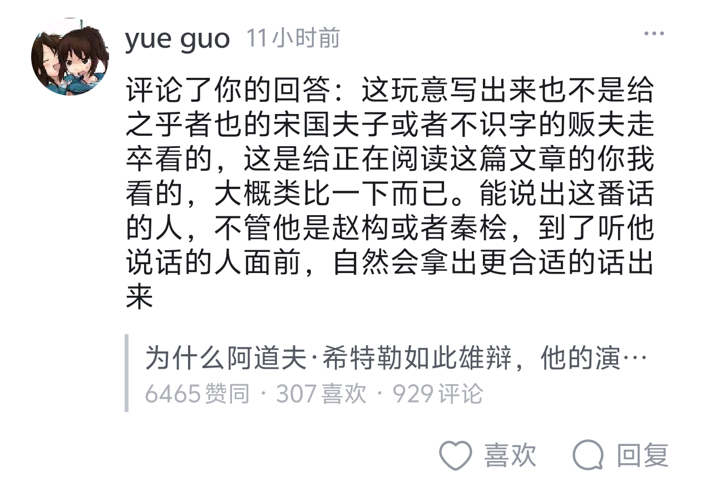

这个兄弟说的就是我想说的

这堆文本大概类比一下而已，有好多人较真，说宋朝民族主义行不通，说这个演讲放那个时候就是堆屁话，一大堆人在那儿批判这堆文本在宋朝的可行性，但是问题不是希特勒的演讲为什么具有煽动性吗，这堆文本就是魔改的影视剧中希特勒的演讲，这只是类比一下，是给今天的你我看的，而不是给宋朝的贩夫走卒，王侯将相看的，其中的民族主义情绪是你我应该思考的，而不是死磕在宋朝发表一番这样的演讲顶不顶用

  

第三次更正

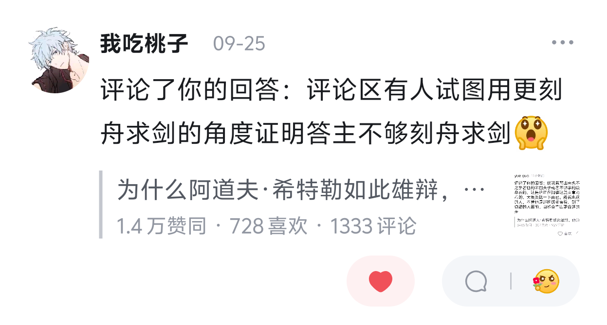

我的互联网嘴替……

为什么还在有人义愤填膺地批判我这段文本是宣扬民族主义，于宋朝形式无用什么的，你们大可以去“如果你魂穿赵构…”或者“如何做好演讲”这种问题下面去吹毛求疵，为什么对这么一篇整活的文本哈气，还言语攻击，不理解（？）

  

原文地址：[(繁榆枘)为什么阿道夫·希特勒如此雄辩，他的演讲如此煽动性？难道他是一位语言学家吗？](https://www.zhihu.com/question/558969089/answer/3521942501) 

# 评论

1. <a href="https://www.zhihu.com/people/fei-365">快剑阿飞</a> (<small title="内蒙古">2024-7-24 18:50:40</small>): 秦桧听了也要打金国了
   - <a href="https://www.zhihu.com/people/xin-yue-26-51-26">星芒拯晓</a> (<small title="广西">2024-8-31 15:6:1</small>): 百姓听了会先想为啥不推翻宋朝
   - <a href="https://www.zhihu.com/people/xiao-ruo-ze-36">小若泽</a> (<small title="回复于 2024-8-31 16:0:49/巴西"> ✉️:星芒拯晓</small>): 百姓可以推翻宋朝，问题是金国人并不会因为你推翻宋朝而放下屠刀，该杀照杀该抢照抢
   - <a href="https://www.zhihu.com/people/li-cheng-1-50">夜凉如水</a> (<small title="回复于 2024-8-31 16:18:30/浙江"> ✉️:星芒拯晓</small>): 老百姓没那么蠢，要真的如你所期盼的那么蠢，抗日战争就不会打了
   - <a href="https://www.zhihu.com/people/wu-ben-zhi-mu-49">无本之木</a> (<small title="回复于 2024-8-31 17:19:26/广西"> ✉️:星芒拯晓</small>): 因为百姓的平均智商比你高一点。
   - <a href="https://www.zhihu.com/people/mo-bai-45-8-43">墨白</a> (<small title="回复于 2024-8-31 17:24:1/江西"> ✉️:无本之木</small>): 笑死我了哈哈哈哈哈哈
   - <a href="https://www.zhihu.com/people/lichun-18">李春</a> (<small title="回复于 2024-8-31 19:28:6/广东"> ✉️:无本之木</small>): 好啊！
   - <a href="https://www.zhihu.com/people/li-deng-xuan-84">其实我叫王尼玛</a> (<small title="泰国">2024-9-1 12:43:55</small>): ［捂嘴］［捂嘴］［捂嘴］秦桧年轻的时候也是爱国青年
   - <a href="https://www.zhihu.com/people/xiao-ze-ma-li-ao-11-65">momo</a> (<small title="山东">2024-9-1 17:31:46</small>): 转念一想，金国的别墅，金国银行的存款以及留学的儿子，算了，还是跟着喊两声吧［捂脸］
   - <a href="https://www.zhihu.com/people/xiao-ye-90-88">Berry Bubble</a> (<small title="北京">2024-9-1 19:0:21</small>): 讽刺的是，秦桧最开始的确是个坚定的主战派。［捂脸］
   - <a href="https://www.zhihu.com/people/li-bi-kui-91">李自来</a> (<small title="回复于 2024-9-2 8:36:48/贵州"> ✉️:星芒拯晓</small>): 我本以为只有颜革蠢材才会信推翻自家zf一切就有美好未来，，，，，
   - <a href="https://www.zhihu.com/people/supersky-89">supersky</a> (<small title="回复于 2024-9-2 8:44:47/日本"> ✉️:星芒拯晓</small>): 最好的办法：收复北方之后携大胜之威望，推翻大宋。
 
只不过这个办法有个缺点，那就是皇帝也清楚会有人这么做，所以会阻挠北伐
   - <a href="https://www.zhihu.com/people/yi-wu-suo-you-gu-wu-suo-wei-ju">乔罗宾内特拜登</a> (<small title="回复于 2024-9-2 8:48:39/山东"> ✉️:星芒拯晓</small>): 因为德国百姓听了没有先推翻希特勒
   - <a href="https://www.zhihu.com/people/xin-yue-26-51-26">星芒拯晓</a> (<small title="回复于 2024-9-2 11:4:44/广西"> ✉️:李自来</small>): 封建社会，你一个大地主跟佃户农奴说民主自由，铁和血，生存空间，他先用铁和血问你要生存空间
   - <a href="https://www.zhihu.com/people/buliwyf-67">Buliwyf</a> (<small title="回复于 2024-9-2 11:55:6/浙江"> ✉️:星芒拯晓</small>): 德国就是半封建，军队主力还是容克地主阶级
   - <a href="https://www.zhihu.com/people/xin-yue-26-51-26">星芒拯晓</a> (<small title="回复于 2024-9-2 12:32:53/广西"> ✉️:Buliwyf</small>): 德国再差也是人身依附关系几乎没有，奴仆几乎没有，名义上所有人都有自由
   - <a href="https://www.zhihu.com/people/ji-ming-43-50">李霁明</a> (<small title="回复于 2024-9-2 13:21:42/陕西"> ✉️:星芒拯晓</small>): 神人
   - <a href="https://www.zhihu.com/people/xin-yue-26-51-26">星芒拯晓</a> (<small title="回复于 2024-9-2 13:30:54/广西"> ✉️:乔罗宾内特拜登</small>): 德国没有宋江李逵水泊梁山，没有方腊等北宋四大农民起义
   - <a href="https://www.zhihu.com/people/mo-ran-shao-guang-32">墨染韶光</a> (<small title="回复于 2024-9-2 16:10:22/上海"> ✉️:无本之木</small>): 不必多说［大笑］
 
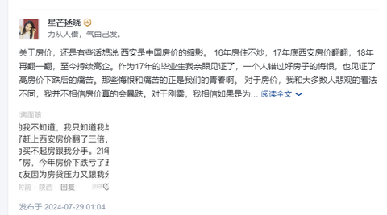
   - <a href="https://www.zhihu.com/people/zhang-ren-long-37">Tedward</a> (<small title="广东">2024-9-2 17:38:46</small>): ［为难］秦相公是细作，连夜卷细软跑去给金人舔沟子了
   - <a href="https://www.zhihu.com/people/wu-ben-zhi-mu-49">无本之木</a> (<small title="回复于 2024-9-2 20:38:8/广西"> ✉️:星芒拯晓</small>): 容克是什么意思？知道吗？
   - <a href="https://www.zhihu.com/people/ni-ke-ma">瑜瑾</a> (<small title="回复于 2024-9-3 9:2:25/浙江"> ✉️:李自来</small>): 大清和民国都有话说，都是被境外势力资助的颜革给推翻的。
   - <a href="https://www.zhihu.com/people/huo-hao-82">小霍同学</a> (<small title="回复于 2024-9-3 11:34:30/广东"> ✉️:星芒拯晓</small>): 你放心，中国的老百姓没有蠢到这地步，他们分得清哪一面是值得追随的旗帜
   - <a href="https://www.zhihu.com/people/xin-yue-26-51-26">星芒拯晓</a> (<small title="回复于 2024-9-3 12:37:15/广西"> ✉️:小霍同学</small>): 方腊李自成洪秀全表示很赞［赞］
   - <a href="https://www.zhihu.com/people/xin-yue-26-51-26">星芒拯晓</a> (<small title="广西">2024-9-3 14:15:19</small>): 查查纳粹两字的本意
   - <a href="https://www.zhihu.com/people/di-diao-de-wen-zi-10-68">低调的蚊子</a> (<small title="黑龙江">2024-9-3 15:44:3</small>): 皇汉的反义词是共产，可不是秦桧。皇汉跟秦桧更像是近义词
   - <a href="https://www.zhihu.com/people/huo-hao-82">小霍同学</a> (<small title="回复于 2024-9-3 17:43:49/广东"> ✉️:星芒拯晓</small>): 似乎不可否认，封建社会的农民起义在当时的时代背景下来看，也自有其先进性存在呢
   - <a href="https://www.zhihu.com/people/ya-shen-ji-hua">仰泳的鱼</a> (<small title="回复于 2024-9-3 18:0:50/江苏"> ✉️:星芒拯晓</small>): 明朝末期的地主和士族，骄傲的认为自己是和崇祯共治天下，后来他们都被满清杀了个干干净净
   - <a href="https://www.zhihu.com/people/ya-shen-ji-hua">仰泳的鱼</a> (<small title="回复于 2024-9-3 18:6:31/江苏"> ✉️:星芒拯晓</small>): 明朝末期，农民军攻破北京后，被满清窃取了胜利果实，后面宁愿捏着鼻子承认南明，跟着南明干满清，也不愿意跟着清狗，你猜是为什么
   - <a href="https://www.zhihu.com/people/lk2979">玄武岩</a> (<small title="回复于 2024-9-3 22:55:47/加拿大"> ✉️:小若泽</small>): 所以说，金国对于推翻明朝的大顺，穷追猛打不许投降。
   - <a href="https://www.zhihu.com/people/xin-yue-26-51-26">星芒拯晓</a> (<small title="回复于 2024-9-3 23:7:19/广西"> ✉️:小霍同学</small>): 部分农民起义理论就是太先进了才失败，比如李自成“均田免粮”这个口号实在是太大胆了，太先进了。但正是因为远远超越了时代和生产力发展的水平，才最终遭到失败。可以说是第一批在内外反动势力的联合绞杀下失败的农民起义。
   - <a href="https://www.zhihu.com/people/xin-yue-26-51-26">星芒拯晓</a> (<small title="回复于 2024-9-3 23:9:10/广西"> ✉️:仰泳的鱼</small>): 那帮人是成事不足败事有余，可以说是寄生虫一样的存在，最终结局当然是惨烈的。
   - <a href="https://www.zhihu.com/people/wang-bing-28-65-11">伊克斯塞尔</a> (<small title="回复于 2024-9-4 8:29:17/吉林"> ✉️:星芒拯晓</small>): 能做出这样演讲的人大概也把原来的政府清洗的差不多了［调皮］
   - <a href="https://www.zhihu.com/people/xin-yue-26-51-26">星芒拯晓</a> (<small title="回复于 2024-9-4 11:0:27/广西"> ✉️:伊克斯塞尔</small>): 是的，先破后立，破釜沉舟［赞］
   - <a href="https://www.zhihu.com/people/nan-xun-huan-74">南寻欢</a> (<small title="湖北">2024-9-5 9:13:40</small>): ［飙泪笑］妙极
   - <a href="https://www.zhihu.com/people/mou-mou-39-61">Oracle流浪晚星</a> (<small title="广东">2024-9-5 12:48:9</small>): 九妹听了追上十九道金牌御驾亲征［飙泪笑］
   - <a href="https://www.zhihu.com/people/wu-ju-feng-shuang">无惧风霜</a> (<small title="湖南">2024-9-5 23:12:34</small>): 神评［赞］
   - <a href="https://www.zhihu.com/people/zhang-wei-zhi-49">Zz攸小雨</a> (<small title="回复于 2024-9-6 1:0:7/江苏"> ✉️:星芒拯晓</small>): 结果成为了德意志民族世上最大的劫难，先破后立，破釜沉舟［赞］
   - <a href="https://www.zhihu.com/people/xin-yue-26-51-26">星芒拯晓</a> (<small title="回复于 2024-9-6 1:28:7/广西"> ✉️:Zz攸小雨</small>): 拼过才知道对错
   - <a href="https://www.zhihu.com/people/zhang-wei-zhi-49">Zz攸小雨</a> (<small title="回复于 2024-9-6 12:42:8/江苏"> ✉️:星芒拯晓</small>): 所以说老百姓不傻，没必要在有退路的时候做这种蠢事
   - <a href="https://www.zhihu.com/people/47-97-83-2">一般路过正人君子</a> (<small title="回复于 2024-9-7 11:47:17/上海"> ✉️:星芒拯晓</small>): 幽默李自成
   - <a href="https://www.zhihu.com/people/wu-ben-zhi-mu-49">无本之木</a> (<small title="回复于 2024-9-7 20:50:10/广西"> ✉️:瑜瑾</small>): 难道袁世凯不是个接受外国势力压榨的混蛋?  
 
难道国民党最后的执政权不是蛙独李登辉给搞没了的？
   - <a href="https://www.zhihu.com/people/lu-guo-qiang-8">卢国强</a> (<small title="广东">2024-9-8 13:2:22</small>): 不会
   - <a href="https://www.zhihu.com/people/wokhawk">derring do</a> (<small title="回复于 2024-9-10 17:37:54/江西"> ✉️:星芒拯晓</small>): 希特勒取得了政权，所以某种意义上他推翻了上一个政府
   - <a href="https://www.zhihu.com/people/ceng-yong-jian-75">曾永健</a> (<small title="回复于 2024-9-22 20:54:19/中国"> ✉️:星芒拯晓</small>): 所以，在资本社会里，一个资本家在跟牛马说民主自由，铁和血？
   - <a href="https://www.zhihu.com/people/xin-yue-26-51-26">星芒拯晓</a> (<small title="回复于 2024-9-22 22:6:39/广西"> ✉️:曾永健</small>): 在纳粹德国，资本家敢说句话吗？
   - <a href="https://www.zhihu.com/people/ceng-yong-jian-75">曾永健</a> (<small title="回复于 2024-10-18 19:13:47/广东"> ✉️:星芒拯晓</small>): 小胡子不是资本家哈［捂脸］
   - <a href="https://www.zhihu.com/people/ceng-yong-jian-75">曾永健</a> (<small title="回复于 2024-10-18 19:16:13/广东"> ✉️:星芒拯晓</small>): 不查。
   - <a href="https://www.zhihu.com/people/tong-27-89">tong</a> (<small title="回复于 2024-11-5 13:35:28/广东"> ✉️:星芒拯晓</small>): 推了现在就没，不推能拖到可能有奇迹，你选一个［调皮］
   - <a href="https://www.zhihu.com/people/qin-yao-yang">此夜长明</a> (<small title="安徽">2025-3-16 19:6:15</small>): 先把秦桧杀了
   - <a href="https://www.zhihu.com/people/xin-yue-26-51-26">星芒拯晓</a> (<small title="回复于 2025-6-8 10:49:44/广西"> ✉️:墨染韶光</small>): 想说明什么？
   - <a href="https://www.zhihu.com/people/mc5i-75">mc5i</a> (<small title="云南">2025-6-8 20:29:32</small>): 秦桧：我有可以谈，我也可以爱国
   - <a href="https://www.zhihu.com/people/ha-ha-james">哈哈-james</a> (<small title="上海">2025-6-10 12:53:59</small>): 秦桧只是皇帝身边留声机，宋是打是和，全是皇帝判断，秦桧只是符合而已
   - <a href="https://www.zhihu.com/people/zhu-ye-61-91">猪爷</a> (<small title="福建">2025-6-11 8:51:54</small>): 秦桧听了很激动，多念了一边满江红 ［捂脸］
   - <a href="https://www.zhihu.com/people/27-93-64-62">芥末世界分钟</a> (<small title="回复于 2025-6-11 17:23:5/河南"> ✉️:星芒拯晓</small>): 因为南明史会告诉你，你当然可以推翻暴政，但是在此之前，你应该也想想外敌怎么解决［打招呼］
   - <a href="https://www.zhihu.com/people/san-qin-xiao-xiao-sheng">三秦笑笑生</a> (<small title="回复于 2025-6-12 6:21:32/陕西"> ✉️:星芒拯晓</small>): 是呀，这不就是我党，打日本人，打国民党，打美国人
   - <a href="https://www.zhihu.com/people/zhi-hui-de-qiu-dao-ding-ci">知乎用户LXYsgI</a> (<small title="回复于 2025-6-12 23:28:2/安徽"> ✉️:星芒拯晓</small>): 因为金人更残暴，人民在宋国未必不能生儿育女了次一生，但在金人治下只会惨si。
 
金人骑兵在河南河北的田间以射沙汉人农民取乐，平常赌博也是直接拿汉人平民当筹码，男人两筹，女人一筹，小孩半筹。
 
金人攻城和进兵打仗时候尤其喜欢抓汉人平民当“签军”，不论男女老幼，全推上战场，让他们去当肉盾消耗敌方的弩箭。
 
这些事，宋朝未必一件不做，但至少不跟金人不一样。
 
你觉得呢？
   - <a href="https://www.zhihu.com/people/zhi-hui-de-qiu-dao-ding-ci">知乎用户LXYsgI</a> (<small title="回复于 2025-6-12 23:29:9/安徽"> ✉️:星芒拯晓</small>): 你不知道就是没有
   - <a href="https://www.zhihu.com/people/zhi-hui-de-qiu-dao-ding-ci">知乎用户LXYsgI</a> (<small title="回复于 2025-6-12 23:29:35/安徽"> ✉️:星芒拯晓</small>): 有压迫就有反抗，你是想说德儿国没有接济矛盾？
   - <a href="https://www.zhihu.com/people/wen-dao-56-19">闻道</a> (<small title="回复于 2025-6-13 10:55:17/四川"> ✉️:仰泳的鱼</small>): 不管你跟崇祯什么关系，都不影响满清落下的屠刀，管你这那的
   - <a href="https://www.zhihu.com/people/69-25-3-73">梦影星残</a> (<small title="江苏">2025-6-13 14:58:10</small>): 冷知识，秦桧一开始是主战派
   - <a href="https://www.zhihu.com/people/bei-fang-yi-bei-69-72">Rivaille</a> (<small title="回复于 2025-6-19 12:52:16/广东"> ✉️:星芒拯晓</small>): 蛙言蛙语
   - <a href="https://www.zhihu.com/people/10-86-93-38-61">元莫讟</a> (<small title="江苏">2025-9-21 12:29:15</small>): 秦桧本来就想打金［捂脸］
   - <a href="https://www.zhihu.com/people/12121212-83-25">多读点书吧</a> (<small title="北京">2025-9-24 22:16:29</small>): 秦桧不会让你进行这种演讲
   - <a href="https://www.zhihu.com/people/xiang-jun-di-guo">Wooooo</a> (<small title="回复于 2025-12-18 14:5:54/广东"> ✉️:星芒拯晓</small>): 宋朝又不是异族
   - <a href="https://www.zhihu.com/people/xin-yue-26-51-26">星芒拯晓</a> (<small title="回复于 2025-12-18 17:32:17/广西"> ✉️:知乎用户LXYsgI</small>): 德国当时通过对外扩张，对内剥夺犹太人财富，极大缓解了德国阶级矛盾，强化了德国凝聚力，德国战车几乎踏遍整个欧洲大陆如果美国作壁上观，苏德战场鹿死谁手还不一定。
   - <a href="https://www.zhihu.com/people/ma-da-ha-83-33">匹夫</a> (<small title="回复于 2025-12-19 23:34:26/陕西"> ✉️:小若泽</small>): 李定国深有体会
   - <a href="https://www.zhihu.com/people/bei-wei-qi">曙光Spirit</a> (<small title="回复于 2026-1-14 16:21:28/广西"> ✉️:星芒拯晓</small>): 相当于人家兽人都打到暴风城门口了，你说你一帮平民推翻乌瑞恩建立议会制，兽人就会停止进攻吗？［捂脸］
   - <a href="https://www.zhihu.com/people/16-81-11-90-83">小楼昨夜sin</a> (<small title="回复于 2026-1-19 12:27:36/安徽"> ✉️:星芒拯晓</small>): 正常点的百姓都不会在抗战的时候反美［大笑］
   - <a href="https://www.zhihu.com/people/jun-bu-jian-52-97">麋鹿迷了路</a> (<small title="回复于 2026-1-19 22:21:25/陕西"> ✉️:星芒拯晓</small>): 别太幽默了，封建王朝会压榨你，北边的蛮族是真的会杀你全家九成人口，剩下的一成做连牛马都比不上的奴隶，汉人豪族抢你的地要巧立名目，巧取豪夺，蛮子来了，画根线你的地就被分了，人还要他们的奴隶，给他们种本来是你的地［飙泪笑］
   - <a href="https://www.zhihu.com/people/qwer-7-53-32">qwer</a> (<small title="广东">2026-2-6 10:7:58</small>): 你害我摸鱼被发现了［大笑］
2. <a href="https://www.zhihu.com/people/akuna-29">石为溪</a> (<small title="山东">2024-6-6 12:48:46</small>): 这玩意的动员效果指对民族国家有用，对于还处在古典封建时代的老百姓来说白搭
   - <a href="https://www.zhihu.com/people/15271800976">小小柯南</a> (<small title="湖北">2024-6-9 20:4:41</small>): 应该这样动员：弟兄们，跟着老子灭了金国，分钱，分地，分老婆，打到会宁府，封爵！［酷］
   - <a href="https://www.zhihu.com/people/lordmegatron">欣元魂痕</a> (<small title="贵州">2024-7-16 0:59:54</small>): 辛亥革命靠着驱逐鞑虏恢复中华就能团结全国，硬碰硬都能把北洋精锐打得屁滚尿流，到了二次革命没了这杆大旗马上就萎了，你这叫白搭？
   - <a href="https://www.zhihu.com/people/lordmegatron">欣元魂痕</a> (<small title="贵州">2024-7-19 13:22:53</small>): 客观事实又不会因为价值而转移
   - <a href="https://www.zhihu.com/people/gao-yuan-1-38-96">啊九</a> (<small title="回复于 2024-7-24 12:41:17/陕西"> ✉️:小小柯南</small>): 这个比那个实在
   - <a href="https://www.zhihu.com/people/qi-chi-han-shi">用锤子的日子</a> (<small title="内蒙古">2024-8-8 11:51:17</small>): 是的 在1687年发现重力以前，人们都会飞。
   - <a href="https://www.zhihu.com/people/hua-han-bei-chen">知乎用户v7XlgE</a> (<small title="上海">2024-8-12 18:35:40</small>): 全世界就你一个清醒者［赞］［捂嘴］
   - <a href="https://www.zhihu.com/people/huo-yan-tian">拾阶而上</a> (<small title="江苏">2024-8-14 4:52:43</small>): 中国是几千年的民族国家
   - <a href="https://www.zhihu.com/people/zi-hua-dian-di">一个名字</a> (<small title="广东">2024-8-20 23:53:50</small>): ［捂脸］但凡异族入侵都有用 华夷之辩都是2000多年前的事情了 五胡乱华 第一次开始大规模自称汉人 民族主义一直都在
   - <a href="https://www.zhihu.com/people/zong-tong-23-2">键政需谨慎</a> (<small title="北京">2024-8-30 8:58:50</small>): 别骂了别骂了［大哭］
   - <a href="https://www.zhihu.com/people/ju-he-49-76">胡子白了白</a> (<small title="回复于 2024-8-30 13:56:56/黑龙江"> ✉️:欣元魂痕</small>): 哥们儿你俩说的都没啥问题，但是争论的矛盾点不一样啊，中国民族观念是在二十世纪初开始形成的，在抗日战争中得到强化并基本定型，在此之前封建社会人民实体确实没有民族概念（比如元朝各地人民以地域进行区别，南汉人，北汉人，蒙人，色目人），有的是种群观念和以封建帝王为首的国家观念，只是我们站在现代去研究历史学，因为现代民族国家概念深入人心，所以大家自然而然认为民族观念由来已久。  
 
他说民族动员效果对封建百姓没用确实无可厚非，你说辛亥革命扛着民族大旗打天下也没错［捂脸］［捂脸］［捂脸］
   - <a href="https://www.zhihu.com/people/emmm-67-29-47">道阻且长</a> (<small title="回复于 2024-8-30 13:59:22/江西"> ✉️:欣元魂痕</small>): 辛亥革命要能把北洋精锐打的屁滚尿流还轮得到袁世凯做大总统吗［尴尬］明明就是打不过好吧
   - <a href="https://www.zhihu.com/people/lordmegatron">欣元魂痕</a> (<small title="回复于 2024-8-30 16:9:31/四川"> ✉️:道阻且长</small>): 啊？难道黄孝会战不是北洋精锐被打得屁滚尿流？不过是通古斯人不想复西安满城事罢了［飙泪笑］
   - <a href="https://www.zhihu.com/people/coquelic-8">知乎用户4OqX0Z</a> (<small title="回复于 2024-8-30 16:37:42/北京"> ✉️:欣元魂痕</small>): 满清三百年那么多汉人造反为什么就辛亥革命成功了，恰恰因为民族主义是近代才产生、崛起、推动历史的东西
   - <a href="https://www.zhihu.com/people/climax-form">climax form</a> (<small title="湖南">2024-8-30 19:21:35</small>): 至少古典封建时期这一套八成能动员士大夫（精英阶层），不过相对于广大劳动人民而言只是少数罢了
   - <a href="https://www.zhihu.com/people/lordmegatron">欣元魂痕</a> (<small title="回复于 2024-8-30 20:33:38/四川"> ✉️:知乎用户4OqX0Z</small>): 已知十月革命发生在1917年，所以19世纪不存在社会主义。
   - <a href="https://www.zhihu.com/people/hqhe-he-he-21">HQ呵呵呵</a> (<small title="回复于 2024-8-30 23:10:2/山东"> ✉️:欣元魂痕</small>): 辛亥革命时期清朝已经在数十年的改造下完成了民族构建，人民所忠诚的对象不是满清贵族而是已确立的“中华民族”概念，但是在这数十年的改造之前中国并不是一个民族国家，你跟老百姓说大宋江山他们只会觉得换个皇帝罢了
   - <a href="https://www.zhihu.com/people/han-feng-31-30">韩枫</a> (<small title="浙江">2024-8-30 23:35:23</small>): 不不不，只要有报纸就行了。
   - <a href="https://www.zhihu.com/people/pk360">pk360</a> (<small title="回复于 2024-8-31 0:27:8/山东"> ✉️:小小柯南</small>): 俗了，不能成大事［捂脸］
   - <a href="https://www.zhihu.com/people/zyhdidntwakeup">zyhdidntwakeup</a> (<small title="回复于 2024-8-31 3:6:22/江苏"> ✉️:欣元魂痕</small>): l le
   - <a href="https://www.zhihu.com/people/wen-song-48-9">赞美群星的索拉尔</a> (<small title="回复于 2024-8-31 7:45:58/中国香港"> ✉️:啊九</small>): 两种都要有。人群是由英雄和小人共同组成的
   - <a href="https://www.zhihu.com/people/ni-hui-fen-bo-cheng-liu-shang">逆回奋波乘流上</a> (<small title="辽宁">2024-8-31 8:3:26</small>): 经典古代没有民族
   - <a href="https://www.zhihu.com/people/man-cheng-feng-xu-8-83">满城风絮</a> (<small title="回复于 2024-8-31 8:19:15/河南"> ✉️:欣元魂痕</small>): 近代国家民族意识才初步形成
   - <a href="https://www.zhihu.com/people/17-90-70-74-57">姜丝炒土豆丝</a> (<small title="江苏">2024-8-31 8:47:2</small>): 但是可以讲讲50W贯一个的炊饼，说是金人干的［滑稽］
   - <a href="https://www.zhihu.com/people/yudu080622">一文不名</a> (<small title="回复于 2024-8-31 9:6:6/广东"> ✉️:欣元魂痕</small>): 可是并没有啊，最后连武汉三镇都丢了两镇了
 
但是民族主义确实有效，就像二战苏联［赞同］
   - <a href="https://www.zhihu.com/people/lordmegatron">欣元魂痕</a> (<small title="回复于 2024-8-31 9:9:44/四川"> ✉️:满城风絮</small>): 哈萨克斯坦人李白：「胡無人 漢道昌」
   - <a href="https://www.zhihu.com/people/yang-dan-dong-89">羊闲声</a> (<small title="上海">2024-8-31 9:13:23</small>): 你说的这些，岳飞、朱元璋能同意吗？
   - <a href="https://www.zhihu.com/people/lordmegatron">欣元魂痕</a> (<small title="回复于 2024-8-31 9:23:18/四川"> ✉️:HQ呵呵呵</small>): 哈萨克斯坦人李白：「胡無人 漢道昌」  
 
金国人辛弃疾：一生北伐
   - <a href="https://www.zhihu.com/people/cang-yu-yan-20">藏玉岩</a> (<small title="广东">2024-8-31 9:36:43</small>): 打到反动派，吃红薯。
   - <a href="https://www.zhihu.com/people/dian-ju-jiao-huang">电锯教皇</a> (<small title="回复于 2024-8-31 9:37:29/广东"> ✉️:欣元魂痕</small>): 辛亥革命都明末清初了，民众思想早就近代化了，你以为还是和宋朝一样？清末民初说了有用，但放在宋朝，呵呵，还真就不如打下黄龙府，十天不封刀，钱粮女人随便抢来的有用［惊喜］
   - <a href="https://www.zhihu.com/people/er-lang-xian-sheng-zhen-jun-69">二营长</a> (<small title="回复于 2024-8-31 9:49:53/河南"> ✉️:胡子白了白</small>): 我也奇怪这俩人炒个啥玩意啊哈哈
   - <a href="https://www.zhihu.com/people/hqhe-he-he-21">HQ呵呵呵</a> (<small title="回复于 2024-8-31 9:59:7/山东"> ✉️:欣元魂痕</small>): 有汉人、胡人区分不等于民族概念的认同和确立，他们所认同的更多是宋王朝。
   - <a href="https://www.zhihu.com/people/lordmegatron">欣元魂痕</a> (<small title="回复于 2024-8-31 10:41:27/四川"> ✉️:电锯教皇</small>): 那革命军怎么只图满城不抢劫呢［惊喜］
   - <a href="https://www.zhihu.com/people/tian-wei-49-36-46">岁亦莫止</a> (<small title="回复于 2024-8-31 10:44:48/河北"> ✉️:欣元魂痕</small>): 哥们儿，你能分清宋代和晚清的时间区别不…
   - <a href="https://www.zhihu.com/people/lordmegatron">欣元魂痕</a> (<small title="回复于 2024-8-31 10:46:43/四川"> ✉️:HQ呵呵呵</small>): 宋人不认汉人只认宋朝［好奇］  
 
“……药师言伏闻番【汉】之人实为异类,羊狼之伴不可同居……”  
 
“……良嗣族本【汉人】,素居燕京霍阴。自远祖以来,悉登仕路。……良嗣久服先王之教,敢佩斯言,欲举家贪生,南归圣域,得复【汉家衣裳】……”  
 
“天祚率番【汉兵】十余万、车骑亘百里,鼓角之声、旌旗之色震耀原野……(女真)又陷苏复渤海辽阳所管五十四州杀戮【汉民】计数百万……”  
 
“金人遣国信大使奚人富谟古、副使【汉人】李简来。”  
 
“且北朝所以雄盛过古者，缘得【燕地汉人】也。……”  
 
“……今更不论夹攻元约,特与燕京六州、二十四县【汉地、汉民】……”  
 
还要举例吗［好奇］
   - <a href="https://www.zhihu.com/people/lordmegatron">欣元魂痕</a> (<small title="回复于 2024-8-31 10:47:39/四川"> ✉️:岁亦莫止</small>): 晚清不是「古典封建时代」？
   - <a href="https://www.zhihu.com/people/dian-feng-shan-60-80-26">电风扇</a> (<small title="北京">2024-8-31 11:9:34</small>): 不用说服，这个得看赞数，你赞数输了。  
 
顺便一提，我也觉得吃不饱肚子的民族主义是狗屎，但得补充一句，吃不饱肚子的所有主义都是狗屎。  
 
民族主义毕竟还是跟吃饱肚子有相关性的，有一定价值，虽然你个人看不起它也挺好。
   - <a href="https://www.zhihu.com/people/wu-tong-84-66">梧桐</a> (<small title="江苏">2024-8-31 11:22:39</small>): ［好奇］那汉朝动员远征匈奴靠什么
   - <a href="https://www.zhihu.com/people/hqhe-he-he-21">HQ呵呵呵</a> (<small title="回复于 2024-8-31 11:27:5/山东"> ✉️:欣元魂痕</small>): 这里的“汉”主要表示中原文明，和现代意义上的民族意识有很大差别，你非要杠宋朝就是民族国家我也没办法
   - <a href="https://www.zhihu.com/people/liufeng2025">知乎用户0RdOGg</a> (<small title="广东">2024-8-31 11:27:20</small>): 空气这个词出现前没有空气  
 
民族这个词出现前没有民族？  
 
况且华夏 汉族 历史上存在久远  
 
真正的问题是你们本身的认知
   - <a href="https://www.zhihu.com/people/lkqi">LKQI</a> (<small title="回复于 2024-8-31 12:2:57/广西"> ✉️:欣元魂痕</small>): 你这就有点历史虚无主义了。  
 
第一，孙文可没把北洋打趴，不然首任大总统就是孙文不是袁世凯了。  
 
第二，“团结全国”说不上，且不说这口号在满蒙回藏地区完全没啥号召力，就算在汉地十八省内部，都不能团结大部分人，不然就不会变成南北对战了。  
 
第三，你都说人家是“鞑虏”，后面外蒙要独立于中国很合理吧，没几个汉人在外蒙，而且你又没把蒙古当同胞。
   - <a href="https://www.zhihu.com/people/qian-shui-ting-13-61">潜水艇</a> (<small title="天津">2024-8-31 12:45:9</small>): 生存空间这种概念一直没变过 古代有杀胡令，现在外国有特别军事行动，包括以色列本质上都是  
 
不想在餐桌上就要奋斗，资源是有限的，中国人想过得比美国人好就要占据十亿天龙人的位置  
 
只是每个地方和时代有自己的语言表达，但是本质一直不会变
   - <a href="https://www.zhihu.com/people/ygyjd">印共游击队</a> (<small title="山东">2024-8-31 13:3:18</small>): 又一个以欧洲中心论照本宣科的，拿西方那套当金科玉律的。说这些理论的人来自于中世纪封建农奴制度走过来来的欧洲，不能说没道理但也只适用于欧洲，而且只适用于中世纪以后的欧洲，稍微了解一下就知道当时的欧洲是个什么德行了，这套理论放在罗马时期都不合适。更不用说一直讲华夷之辩的中国了，“汉人学得胡儿语，却向城头骂汉人”“胡无人，汉道昌”等等这些诗词都把民族主义写脸上了，搁你这还拿“近代民族国家”说事，你知道为什么强调“近代”么？因为再往前的欧洲缺乏这个概念，但不代表别人家没有。你也不用标榜自己如何高洁不屑于相信什么民族主义，这玩意只要有别人信，你不信也会有人逼你不得不信，当鸵鸟没意思，你所谓的不信也不过是有人替你挡着而已。［惊喜］
   - <a href="https://www.zhihu.com/people/lordmegatron">欣元魂痕</a> (<small title="回复于 2024-8-31 13:13:1/四川"> ✉️:LKQI</small>): 1、历史虚无主义？无视黄孝会战北洋精锐被打得屁滚尿流的事实，无视清国皇室见徐州光复被吓得光速退位的事实，把革命党的善心当软弱，才是真正的历史虚无主义。  
 
2、然而辛亥革命在举民族大旗时就是所向披靡，没有任何一方势力能敌，一丢这旗号马上就委了。号召力有什么用？能打就能独立，不能打就没法独立，就这么简单。法理有用，外蒙就就不可能独立，台湾就不可能收回。  
 
3、云中本就是汉地，彼时蒙族存在吗？懂什么叫驱逐、懂什么叫光复吗？正确的处理方式是要么回西伯利亚老家，要么复刻西安满城之事。
   - <a href="https://www.zhihu.com/people/lordmegatron">欣元魂痕</a> (<small title="回复于 2024-8-31 13:14:20/四川"> ✉️:HQ呵呵呵</small>): 中原文明就是汉文明。你要非要杠这和现代民族有啥【本质】区别我也没办法。
   - <a href="https://www.zhihu.com/people/ygyjd">印共游击队</a> (<small title="回复于 2024-8-31 13:21:36/山东"> ✉️:知乎用户4OqX0Z</small>): 错了，应该是近代的民族主义是在欧洲产生的，是以欧洲历史发展角度去阐述的。在这之前不代表民族主义在其他地方不存在，只不过黑死病+工业革命彻底瓦解旧庄园经济，让国王-大领主-小领主-农奴的生产模式彻底瓦解让权力向国王集中的同时生产力也空前提升，国家之间的斗争也不再是贵族之间的小打小闹上升为国力的总体对抗，这时候欧洲所谓的近代民族主义才有的发展空间，因为不选择走这条路的国家一定会被别人吞并，这是欧洲长期地缘格局导致的发展。这套玩意在以汉族儒家文化的大一统中国天天讲“华夷之辩”文化圈子完全适用。至于为何辛亥革命才成功，你总不能因为吃到第三个包子才吃饱就觉得前两个包子没用吧？
   - <a href="https://www.zhihu.com/people/shen-feng-83-48">着重点</a> (<small title="回复于 2024-8-31 13:22:25/河北"> ✉️:胡子白了白</small>): 古代按地域？那周天子分封多少诸侯就有多少个族［飙泪笑］
   - <a href="https://www.zhihu.com/people/dian-ju-jiao-huang">电锯教皇</a> (<small title="回复于 2024-8-31 13:25:29/广东"> ✉️:梧桐</small>): 当然是汉武帝作为君主，对北方的军事威胁发起打击的意志啊，古代绝大部分外交和战争都是统治者的意志决定的，你以为是什么［惊喜］
   - <a href="https://www.zhihu.com/people/ygyjd">印共游击队</a> (<small title="回复于 2024-8-31 13:28:31/山东"> ✉️:胡子白了白</small>): “杀胡令”不算煽动民族主义？民族主义一直都在，只不过在以庄园经济为主体的欧洲封建农奴制下的欧洲不存在而已，放到罗马那时候都不敢说不存在。区别只不过在于为了在工业能力加持下的国力对抗产生的民族主义跟农耕民族跟游牧民族争夺土地资源对抗的民族主义而已。
   - <a href="https://www.zhihu.com/people/22-44-50-12-29">小陌</a> (<small title="回复于 2024-8-31 13:30:14/陕西"> ✉️:小小柯南</small>): 土匪
   - <a href="https://www.zhihu.com/people/ygyjd">印共游击队</a> (<small title="山东">2024-8-31 13:41:38</small>): 历史是螺旋上升的，辛亥革命当然跟几百年前思想不一样，但也不可能是凭空产生的。“驱逐鞑虏，恢复中华”这个口号难道不是前人思想的延续吗？满清统治下的中国统治者当然不可能允许类似民族主义思想的发展，只拿近代满清统治下的中国缺乏民族主义思想就太以偏概全了。况且“近代民族主义”只不过是欧洲自己在阐述自家的事情，我们拿自己的情况在往上硬贴是不是太搞笑了？况且“近代民族主义”是在欧洲工业革命前提下发展的，中国没经历过工业革命当然就不存在所谓的“近代民族主义”了，但不代表在我们这没有“民族主义”这种东西。
   - <a href="https://www.zhihu.com/people/lordmegatron">欣元魂痕</a> (<small title="四川">2024-8-31 14:34:38</small>): 你看，就是因为先总统像你这样想，把基本盘都丢了，结果二次革命失败了。  
 
好好想想，为什么是各省「光复」而不是用其他词［惊喜］
   - <a href="https://www.zhihu.com/people/wenqian-zheng">wenqian zheng</a> (<small title="回复于 2024-8-31 15:3:46/广东"> ✉️:小小柯南</small>): 巧了不是，历史上大宋真的就是按照你说的办法进行战前动员的。然后某一次皇帝没有兑现战前动员的承诺，然后部队直接把他抛弃了。以后就变成了战前先发赏赐，然后部队才打仗。甚至是弓箭手每射一轮箭，就要发一次赏赐，否则就不干了。  
 
  
 
西军就这么完蛋的，种师中带西军打仗，战前赏赐美带够，部队直接散伙，种师中战死。  
 
  
 
你以为靠这些东西激励起来的部队能有多少战斗力。弱宋是白叫的？
   - <a href="https://www.zhihu.com/people/lordmegatron">欣元魂痕</a> (<small title="回复于 2024-8-31 15:7:56/四川"> ✉️:wenqian zheng</small>): 你看，大送都这样了金国汉人都还在源源不断地起义归附［惊喜］
   - <a href="https://www.zhihu.com/people/sui-yue-wu-sheng-76">岁月无声</a> (<small title="回复于 2024-8-31 15:30:2/陕西"> ✉️:欣元魂痕</small>): 请教一下，哪里看到的辛亥革命中起义军把北洋精锐打的屁滚尿流?
   - <a href="https://www.zhihu.com/people/lordmegatron">欣元魂痕</a> (<small title="回复于 2024-8-31 15:34:3/四川"> ✉️:岁月无声</small>): 黄孝会战
   - <a href="https://www.zhihu.com/people/xiao-ruo-ze-36">小若泽</a> (<small title="巴西">2024-8-31 16:5:39</small>): 你这就纯纯扯蛋了，封建时代的百姓也区分得出来金国人的屠刀和挫宋的秩序哪个更好一点或者更坏一些，皇帝不一定要动员到百姓，只要动员到官员和士兵就能像岳武穆一样战无不胜
   - <a href="https://www.zhihu.com/people/sui-yue-wu-sheng-76">岁月无声</a> (<small title="回复于 2024-8-31 16:17:11/陕西"> ✉️:欣元魂痕</small>): 好的，谢谢
   - <a href="https://www.zhihu.com/people/yuan-fang-17-13-58">远方</a> (<small title="回复于 2024-8-31 16:31:46/浙江"> ✉️:知乎用户4OqX0Z</small>): 反清复明贯穿整个清朝
   - <a href="https://www.zhihu.com/people/xie-feng-86-95">且尽兴</a> (<small title="广东">2024-8-31 16:59:58</small>): 抗日战争你想想，全国军阀都去了。 民族大义不管信也好，不信也好，你真得去。
   - <a href="https://www.zhihu.com/people/64-1-18-92">素心</a> (<small title="回复于 2024-8-31 17:25:9/山东"> ✉️:胡子白了白</small>): 也不知道冉闵听了你这话是什么感受［吃瓜］
   - <a href="https://www.zhihu.com/people/wenqian-zheng">wenqian zheng</a> (<small title="回复于 2024-8-31 17:37:9/广东"> ✉️:欣元魂痕</small>): 那是前期，因为女真人圈占土地，蒙安谋克屯田，迁徙女真人入中原，而迁汉人入辽东闹的。
 
  
 
金国后期军队以汉人为主，你咋不提？南宋配合蒙古灭金，占领北方后，发现北方汉人并不欢迎自己，你咋不提？
   - <a href="https://www.zhihu.com/people/xia-yu-9-89">Hsia</a> (<small title="回复于 2024-8-31 19:13:59/四川"> ✉️:小小柯南</small>): 最后少了一句，每人一个金国女太学生！
   - <a href="https://www.zhihu.com/people/xiao-xiao-dong-57-45">小小东</a> (<small title="回复于 2024-8-31 20:16:19/山东"> ✉️:欣元魂痕</small>): 北洋直接倒戈了
   - <a href="https://www.zhihu.com/people/lordmegatron">欣元魂痕</a> (<small title="回复于 2024-8-31 20:16:25/四川"> ✉️:wenqian zheng</small>): 不欢迎？人都死完了怎么欢迎［尴尬］ 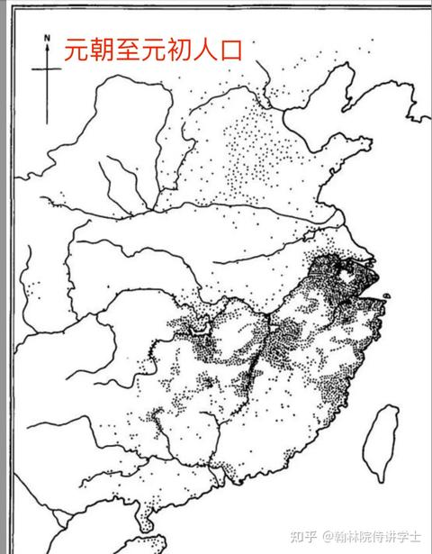
   - <a href="https://www.zhihu.com/people/lordmegatron">欣元魂痕</a> (<small title="回复于 2024-8-31 20:18:36/四川"> ✉️:小小东</small>): 对，然后二次北伐就没这种事了，当时的人只求灭清，根本不在乎什么皇帝不皇帝
   - <a href="https://www.zhihu.com/people/wo-yao-shui-zhu-niu-rou">不在乎</a> (<small title="四川">2024-8-31 21:46:17</small>): 你看看辛亥革命的时候多少打大汉旗号的。没用？呵呵
   - <a href="https://www.zhihu.com/people/bluetiangrundson-49">BlueTianGrundson</a> (<small title="回复于 2024-9-1 0:55:44/甘肃"> ✉️:欣元魂痕</small>): 正是满清和更前面的蒙元的种族政策，才刺激了汉民族主义的完善，你在宋朝喊着一套还真没用
   - <a href="https://www.zhihu.com/people/lordmegatron">欣元魂痕</a> (<small title="回复于 2024-9-1 0:59:16/四川"> ✉️:BlueTianGrundson</small>): 错误的，大送把各路归义军卖成啥样了，依然不妨碍金国汉人源源不断地起义归附。大送个人的问题别怪到别人头上。
   - <a href="https://www.zhihu.com/people/xue-feng-76-64">雪风</a> (<small title="回复于 2024-9-1 7:8:18/山东"> ✉️:道阻且长</small>): 打不过那徐州是袁世凯心善让给革命军的吗
   - <a href="https://www.zhihu.com/people/dan-yan-pi-de-tian-he">单眼皮的天蝎</a> (<small title="北京">2024-9-1 8:50:50</small>): 你猜为啥清宁可赔款两亿三加台湾也要止战？是怕日本灭了清？怕的是《开诚忠告十八省豪杰》……
   - <a href="https://www.zhihu.com/people/akuna-29">石为溪</a> (<small title="山东">2024-9-1 12:20:8</small>): 民族主义分子如此之多都是受了如今宣传机器的害，可怜可恨
   - <a href="https://www.zhihu.com/people/lhy-73-17">伟大的爱国主义者</a> (<small title="回复于 2024-9-1 12:42:0/北京"> ✉️:欣元魂痕</small>): 热知识：辛亥革命不是宋朝的事［捂脸］
   - <a href="https://www.zhihu.com/people/lhy-73-17">伟大的爱国主义者</a> (<small title="回复于 2024-9-1 12:42:50/北京"> ✉️:用锤子的日子</small>): 你也知道是“发现”而不是“发明”重力啊［捂脸］
   - <a href="https://www.zhihu.com/people/qing-shui-zhi-shen">偷报纸的人</a> (<small title="回复于 2024-9-1 12:44:4/重庆"> ✉️:知乎用户v7XlgE</small>): 哈哈哈
   - <a href="https://www.zhihu.com/people/lao-lang-qing-chi-g">九鬿</a> (<small title="北京">2024-9-1 13:39:7</small>): 经典left教理论，快要听吐了
   - <a href="https://www.zhihu.com/people/chumen-8">楚门</a> (<small title="回复于 2024-9-1 14:38:4/江苏"> ✉️:欣元魂痕</small>): 不一样，辛亥革命成功也是少部分精英成功，真正的全民动员还是抗日战争时期。古代改朝换代百姓很难被煽动，主要是文化水平低，以及没被敌对势力教育过。你看古代历史上，靠民族主义动员起来的能有几个
   - <a href="https://www.zhihu.com/people/lordmegatron">欣元魂痕</a> (<small title="回复于 2024-9-1 15:33:43/四川"> ✉️:伟大的爱国主义者</small>): 热知识，辛亥革命革的是古代封建殖民帝国的命
   - <a href="https://www.zhihu.com/people/3344-52">3344</a> (<small title="浙江">2024-9-1 17:34:53</small>): 你。并不比你的祖先聪明。别自以为是
   - <a href="https://www.zhihu.com/people/gu-cheng-39-67">以中有足乐者</a> (<small title="回复于 2024-9-1 19:33:42/甘肃"> ✉️:啊九</small>): 人还是喜欢为崇高的理想而奋斗，如果还有其他，那就更好了。  
 
摸摸你的胸膛，现在有一个为国出力的机会，你愿意吗
   - <a href="https://www.zhihu.com/people/yu-kai-62-2-22">知乎用户7hDqvr</a> (<small title="回复于 2024-9-1 20:48:33/河北"> ✉️:欣元魂痕</small>): 不是啊，民族觉醒不是从公车上书开始的吗？之前都是国家是国家，小家是小家
   - <a href="https://www.zhihu.com/people/akuna-29">石为溪</a> (<small title="回复于 2024-9-1 20:59:6/山东"> ✉️:3344</small>): 不是哥们你以为民族主义这东西是好东西［飙泪笑］难绷自己被骗的一愣一愣的可不老祖宗比你聪明
   - <a href="https://www.zhihu.com/people/360du-chun-hei">平胸帕露西</a> (<small title="上海">2024-9-1 21:16:18</small>): 恰恰是宋朝平民，在历代王朝里人均更民族主义
   - <a href="https://www.zhihu.com/people/lordmegatron">欣元魂痕</a> (<small title="回复于 2024-9-1 21:34:50/贵州"> ✉️:石为溪</small>): 你看，就是因为大家这样想，搞什么自欺欺人的五族共和，二次北伐不就失败了？
   - <a href="https://www.zhihu.com/people/lordmegatron">欣元魂痕</a> (<small title="回复于 2024-9-1 21:35:39/贵州"> ✉️:知乎用户7hDqvr</small>): 哈萨克斯坦人李白；「胡無人 漢道昌」
   - <a href="https://www.zhihu.com/people/53-98-50-77-44">知乎用户臣</a> (<small title="广东">2024-9-1 22:12:45</small>): 那个时候说那么多民族主义还不如一句闯王来了不纳粮有效，
   - <a href="https://www.zhihu.com/people/wei-gu-wei-gu-6">蔚谷蔚谷</a> (<small title="回复于 2024-9-1 22:29:28/广东"> ✉️:小小柯南</small>): 你这个动员思想，军队伤亡达到10%，立马就溃散，全部溃逃。光有钱，不足以让人舍身忘死。你想想，你用钱吸引来的，都是些什么人？他们会拼命？［酷］
   - <a href="https://www.zhihu.com/people/chuan-xue-zi-de-tu-zi-36">穿靴子的兔子</a> (<small title="河北">2024-9-2 5:57:15</small>): 我也是这么想的，对有完整基础教育，对国家民族有强烈归属感荣誉感的近代国家效果很不错，现在拿着这一套去印度边陲小村恐怕都不行。［doge］
   - <a href="https://www.zhihu.com/people/ok-55-60">CountryAdmin</a> (<small title="回复于 2024-9-2 9:58:55/河南"> ✉️:欣元魂痕</small>): ［飙泪笑］［飙泪笑］团结全国先不置评，硬碰硬把北洋打的屁滚尿流从哪来的？靠偷袭攻下了武汉三镇？后续袁世凯调兵三两下就就又拿下了汉口你可知道？［飙泪笑］从头到尾，革命派都一直渴望着袁世凯能够提调革命派军政大权你可知晓？二次革命你也不想想面对的是谁？袁世凯那岂是腐朽的清政府能够媲美的？说起二次革命最是令人可憎！用武力方式把刚建立起来的票政模式给摧毁了。
   - <a href="https://www.zhihu.com/people/57-6-58-15">最插里不浪的</a> (<small title="安徽">2024-9-2 10:47:45</small>): 对热血的太学生还是有用的，宋代的城市化也很高，再加上确实有一大批因靖康难而产生的难民，还是很有市场的。
   - <a href="https://www.zhihu.com/people/lu-qiang-23">鱼儿读书会摆尾</a> (<small title="回复于 2024-9-2 10:55:24/山东"> ✉️:欣元魂痕</small>): 啥时候打得屁滚尿流了？要不是袁世凯命令，冯国璋都要攻下三镇了
   - <a href="https://www.zhihu.com/people/lu-yi-shi-jiu-57">东方树叶</a> (<small title="山东">2024-9-2 11:5:16</small>): 别骂了别骂了［捂脸］
   - <a href="https://www.zhihu.com/people/15271800976">小小柯南</a> (<small title="回复于 2024-9-2 11:10:48/湖北"> ✉️:蔚谷蔚谷</small>): 10%不错了，金军能达到这个比例吗？比如古代一般是3000精锐裹挟两万其他军队，比例15%啊，相当于三分之二精锐阵亡啊［捂脸］
   - <a href="https://www.zhihu.com/people/rheuhf">知乎用户rheuHF</a> (<small title="回复于 2024-9-2 11:13:23/浙江"> ✉️:欣元魂痕</small>): 光说理论谁也说服不了谁，直接举例子说明封建时代哪些运动是由民族意识引起就行。请举例。
   - <a href="https://www.zhihu.com/people/zhang-xu-dong-45-63-93">提耶力亚</a> (<small title="回复于 2024-9-2 11:14:13/西藏"> ✉️:欣元魂痕</small>): 团结全国，蒙古、新疆、青海、西藏至少没有团结吧，还有东北，是有那么一撮人被团结了，还说了句绝不让清帝东归，结果这波人马上就被镇压了［捂脸］［捂脸］
   - <a href="https://www.zhihu.com/people/dues-51">Dues</a> (<small title="回复于 2024-9-2 11:44:55/广东"> ✉️:欣元魂痕</small>): 中国的民族主义出现于列强的压迫，古代没有民族主义情绪，而不是没有民族主义这次概念。
   - <a href="https://www.zhihu.com/people/lordmegatron">欣元魂痕</a> (<small title="回复于 2024-9-2 11:47:40/贵州"> ✉️:知乎用户rheuHF</small>): 大送朝一直都在卖各路归义军，即便如此金国汉人一直在起义归附。
   - <a href="https://www.zhihu.com/people/lordmegatron">欣元魂痕</a> (<small title="回复于 2024-9-2 11:48:27/贵州"> ✉️:Dues</small>): 哈萨克斯坦人李白：「胡無人 漢道昌」
   - <a href="https://www.zhihu.com/people/lordmegatron">欣元魂痕</a> (<small title="回复于 2024-9-2 11:49:18/贵州"> ✉️:提耶力亚</small>): 团结的结果就是基本盘都没了连北洋都打不过了［捂脸］
   - <a href="https://www.zhihu.com/people/dues-51">Dues</a> (<small title="回复于 2024-9-2 11:50:45/广东"> ✉️:欣元魂痕</small>): 而且你说的辛亥革命并不属于“古典封建时代”，而是睁眼看世界，觉醒民族意识的“半殖民半封建时代”，你的论据是错的
   - <a href="https://www.zhihu.com/people/dues-51">Dues</a> (<small title="回复于 2024-9-2 11:53:25/广东"> ✉️:欣元魂痕</small>): 矛盾是随历史发展变化的，部落与部落之间的矛盾，奴隶与奴隶主之间的矛盾，封建王朝与底层民众的矛盾，外敌与本国的矛盾，无产者和资本家的矛盾，这些矛盾只有到了某个历史阶段才会出现，而不是“古代无产者和资本家没有矛盾”
   - <a href="https://www.zhihu.com/people/lordmegatron">欣元魂痕</a> (<small title="回复于 2024-9-2 11:53:57/贵州"> ✉️:鱼儿读书会摆尾</small>): 冯国璋也只是「要攻下」，黄孝会战可是真北洋精锐硬碰硬都溃逃了
   - <a href="https://www.zhihu.com/people/lordmegatron">欣元魂痕</a> (<small title="回复于 2024-9-2 11:54:50/贵州"> ✉️:Dues</small>): 辛亥革命不属于？预备立宪是哪年的事啊？施行了吗？
   - <a href="https://www.zhihu.com/people/dues-51">Dues</a> (<small title="回复于 2024-9-2 11:58:43/广东"> ✉️:欣元魂痕</small>): 你自己都吃不饱，现在有人跟你说你是中华民族，为了保护皇权要上战场，你会去吗？换个皇帝对你有什么影响？在古代只有赏金封地才有诱惑力，所以才有先登这个说法，大家才会前仆后继
   - <a href="https://www.zhihu.com/people/de-xing-88">得幸</a> (<small title="回复于 2024-9-2 12:1:5/重庆"> ✉️:一文不名</small>): 姚雨平攻破徐州，把张勋当狗撵忘记了？ 攻破徐州的第二天，清朝灭亡了
   - <a href="https://www.zhihu.com/people/lordmegatron">欣元魂痕</a> (<small title="回复于 2024-9-2 12:26:9/贵州"> ✉️:Dues</small>): 例证已经给你了。理论是解释客观现象的，不是让你预设理论抹杀客观事实的存在的。
   - <a href="https://www.zhihu.com/people/lordmegatron">欣元魂痕</a> (<small title="回复于 2024-9-2 12:37:22/贵州"> ✉️:Dues</small>): 是吗？那大送朝把各路归义军卖成啥样了，怎么金国汉人还是源源不断地起义归附呢？
   - <a href="https://www.zhihu.com/people/lordmegatron">欣元魂痕</a> (<small title="回复于 2024-9-2 14:24:12/贵州"> ✉️:CountryAdmin</small>): 黄孝会战不是北洋精锐硬碰硬都溃败了？清帝是不是不多不少等到拿下徐州就退位了？不拿下徐州清帝会退位？二次革命打不赢袁世凯不就是因为丢了基本盘马上没有战斗力了，事实是1910s的中国人只想灭清，没了这个最大公约数，根本没多少人在乎什么反封建共和。
   - <a href="https://www.zhihu.com/people/tian-xi-82-32">暗黑破坏龙家的猫</a> (<small title="湖北">2024-9-2 14:24:33</small>): 说到点子上了
   - <a href="https://www.zhihu.com/people/mao-zhu-xi-74">卷土重来</a> (<small title="北京">2024-9-2 15:5:47</small>): 元武宗时因滹沱河改道，北方民间即为谣曰：“如今真定府后河元曲吕来，直了也。汉儿皇帝出世也，赵官家来也，汉儿人一个也不杀，则杀达达、回回，杀底一个没。”亦见北方汉人憎疾胡虏之深，冀汉人皇帝出世，恢复赵宋之业，向蒙鞑、回子复仇，杀尽胡虏。
   - <a href="https://www.zhihu.com/people/qwerty-95-51">QWERTY</a> (<small title="回复于 2024-9-2 16:58:31/辽宁"> ✉️:知乎用户0RdOGg</small>): 民族主义是一个发明，而不是一个发现。
   - <a href="https://www.zhihu.com/people/liufeng2025">知乎用户0RdOGg</a> (<small title="回复于 2024-9-2 17:24:35/广东"> ✉️:QWERTY</small>): 小白奴
   - <a href="https://www.zhihu.com/people/qwerty-95-51">QWERTY</a> (<small title="回复于 2024-9-2 17:32:7/辽宁"> ✉️:知乎用户0RdOGg</small>): 你都不用说别的，国家、宗教、民族这些概念就是从无到有的。10万年前可没有中国，但的确有氧气等等物质。  
 
而民族主义（不是民族本身）在中国的发端不早于晚清。
   - <a href="https://www.zhihu.com/people/he-shi-10-43">吃企鹅的熊</a> (<small title="回复于 2024-9-2 17:33:19/浙江"> ✉️:欣元魂痕</small>): 那都啥时候了，民族意识已经开始觉醒了。
   - <a href="https://www.zhihu.com/people/lordmegatron">欣元魂痕</a> (<small title="回复于 2024-9-2 17:45:33/贵州"> ✉️:吃企鹅的熊</small>): 哈萨克斯坦人李白都知道「胡無人 漢道昌」，还要等到辛亥？
   - <a href="https://www.zhihu.com/people/lordmegatron">欣元魂痕</a> (<small title="回复于 2024-9-2 18:4:29/贵州"> ✉️:QWERTY</small>): 不早于晚清？哈萨克斯坦人李白都知道「胡無人 漢道昌」，还要等到晚清？
   - <a href="https://www.zhihu.com/people/liu-gu-73-60">六呱</a> (<small title="回复于 2024-9-2 18:40:5/湖北"> ✉️:欣元魂痕</small>): 太平天国也曾经奉天讨胡，义和团也曾经扫清灭洋，怎么不能团结全国？
   - <a href="https://www.zhihu.com/people/14-60-75-29-66">如松</a> (<small title="回复于 2024-9-2 19:36:50/山东"> ✉️:欣元魂痕</small>): 那是因为近代从上层逐渐往下开始学习西方，大量新式学堂建立让民族意识开始产生了，即使不强也够推翻摇摇欲坠的清政府
   - <a href="https://www.zhihu.com/people/14-60-75-29-66">如松</a> (<small title="回复于 2024-9-2 19:37:37/山东"> ✉️:胡子白了白</small>): 清末逐渐有萌芽了吧
   - <a href="https://www.zhihu.com/people/lordmegatron">欣元魂痕</a> (<small title="回复于 2024-9-2 21:23:10/贵州"> ✉️:如松</small>): 还要等到近代？哈萨克斯坦人李白都知道「胡無人 漢道昌」
   - <a href="https://www.zhihu.com/people/holocach-61">HOLOCACH</a> (<small title="回复于 2024-9-3 2:3:19/美国"> ✉️:欣元魂痕</small>): 并不是，辛亥没有团结全国，最后推翻带青的还是军阀们，跟东汉末和晚唐的割据没有本质区别；真正做到团结全国的是康米
   - <a href="https://www.zhihu.com/people/holocach-61">HOLOCACH</a> (<small title="美国">2024-9-3 2:22:58</small>): 辛亥最终推翻带青的是什么人？不是军阀？如果革命dang真有那么大实力和作用孙至于让位吗？袁大头是干什么的？别说他的北方，还有晋、粤、桂、鄂、湘、赣、云、贵、川，这些地方那个不是军阀统治？跟清末有区别吗？东南互保就是后来军阀割据的预演而已
   - <a href="https://www.zhihu.com/people/holocach-61">HOLOCACH</a> (<small title="回复于 2024-9-3 2:48:5/美国"> ✉️:欣元魂痕</small>): 如果近代以前的中国是民族国家（nation-state），那古代大部分人就不会认为元朝和清朝是中国了（你再不喜欢元清也得承认，无论当时还是现代，大部分人是认同他们是中华正统的）~
 
辛亥革命推翻清朝的主要原因也从来不是民族主义，辛亥根本没组织动员多少群众，革命dang只是把事先弄起来（他们也没真正发动多少底层群众），但推翻清朝以及最后得势者仍然是脱胎于晚清地方势力的军阀们；就像秦末起义是农民起义者发动的，但推翻秦朝的主力仍然是六国旧贵族和秦朝地方反叛的官吏。
 
更何况如前所说，无论看基层治理、边疆掌控、产业结构还是普通人生活，辛亥后跟晚清根本没多大区别，本质上就是晚清形成的地方势力借着革命dang挑起的事头完成了之前东南互保没完成的事而已；说这是民族主义的成功简直滑天下之大稽。真正能把查爱纳整体总动员起来、让查爱纳真正成为nation-state的就是康米，你再不承认也没用，这就是事实。
   - <a href="https://www.zhihu.com/people/qwerty-95-51">QWERTY</a> (<small title="回复于 2024-9-3 7:30:16/辽宁"> ✉️:欣元魂痕</small>): 李白写十万甚至九万句诗也不能证明存在民族主义。只能说有民族。  
 
举个例子，岳飞的诗很令人激动吧？但他绝对不可能为了大宋人民去反对完颜构的。他们的爱国还是以忠君为核心的。
   - <a href="https://www.zhihu.com/people/lordmegatron">欣元魂痕</a> (<small title="回复于 2024-9-3 9:13:18/贵州"> ✉️:HOLOCACH</small>): 查一下革命军都是什么来头不难吧［尴尬］还军阀呢，后来是军阀原来就是军阀？那你还不如拿汪精卫说事呢，直接说汉奸得了［尴尬］
   - <a href="https://www.zhihu.com/people/lordmegatron">欣元魂痕</a> (<small title="贵州">2024-9-3 9:14:31</small>): 有什么区别？都五常了还没区别？还以为是历史学呢，怪不着给我一种只看过教科书的美。
   - <a href="https://www.zhihu.com/people/lordmegatron">欣元魂痕</a> (<small title="回复于 2024-9-3 9:18:29/贵州"> ✉️:HOLOCACH</small>): 辛亥革命谁把带蜻当中国了？为啥革命军攻下的地方叫“光复”？知道“光复”是什么意思吗？
 
没组织动员多少群众？白朗起义，秦陇复漢军，天地会，哥老会等一大堆会党组织都有支援辛亥革命，连义和团的残部都和革命党有联系。这还不叫发动了社会底层？而且从武昌起义到清廷垮台，用了多长时间？很多地方甚至革命党还没有打过来他们就弃清投民了，这还不叫民心所向？什么辛亥革命不发动底层我就想笑，你自个查一下各地会党的人员组成很困难吗？
   - <a href="https://www.zhihu.com/people/holocach-61">HOLOCACH</a> (<small title="回复于 2024-9-3 9:20:47/美国"> ✉️:欣元魂痕</small>): 这都什么跟什么？是不是五常跟具体社会治理有什么关系？敏锅时zg仍然是小农社会，经济仍然以小农经济为主，国家对基层和边疆基本没有掌控，大多数人都是文盲，真正给zg带来根本性改变的就是康米，明白？
   - <a href="https://www.zhihu.com/people/holocach-61">HOLOCACH</a> (<small title="回复于 2024-9-3 9:21:14/美国"> ✉️:欣元魂痕</small>): 哈哈哈这种问题历史学的还真没我懂，你不服吗？
   - <a href="https://www.zhihu.com/people/holocach-61">HOLOCACH</a> (<small title="回复于 2024-9-3 9:25:58/美国"> ✉️:欣元魂痕</small>): 仅仅是五常就能掩盖其他问题？KMT去了小岛之后还保持了二十多年五常，你的意思是那时候KMT还比康米厉害？你在逗我吗？
 
我前面具体例子都举出来了，大到边疆控制产业结构，小到基层治理；你除了这些泛泛之谈你还有啥？在我面前你还敢理直气壮？谁给你的勇气？
   - <a href="https://www.zhihu.com/people/lao-wang-ji">老王吉</a> (<small title="广东">2024-9-3 9:45:27</small>): 你知道你历史观有多差么？这话说得出来，那一次革命不是扯大旗的？
   - <a href="https://www.zhihu.com/people/lordmegatron">欣元魂痕</a> (<small title="回复于 2024-9-3 10:21:0/贵州"> ✉️:HOLOCACH</small>): 无论是你苏还是我党最后不都是靠着民族大旗抗战？这么牛逼怎么不把德国人日本人康了，还捏着鼻子搞什么民族统一战线［飙泪笑］  
 
  
 
哦对了，是谁被斯大林怒骂是中国的铁托、民族主义者啊［捂嘴］
   - <a href="https://www.zhihu.com/people/lordmegatron">欣元魂痕</a> (<small title="回复于 2024-9-3 10:24:11/贵州"> ✉️:HOLOCACH</small>): 不是说没有区别吗？带蜻留下的烂摊子至少一半是民国收拾干净的。
 
先别说不能看的水平丢人了，即使是不能看的水平行列里面黑叔叔 还有祖鲁人打西方列强的战绩都远超满清，缅甸也是，国军这支封建军队对日军这样的一战部队，一样也是啥都没有，不能看的水平，打的好的淞沪 武汉给日军造成极大杀伤，十几万人死伤，豫湘桂没什么像样的装备，其他国军的装备甚至到了叫花子的地步，没几门炮，结果在衡阳一城和外围就让日军付出十余万人伤亡，打完豫湘桂加上患病减员直接让日军付出二十万人伤亡，死了十几万人，蜻国能比？
   - <a href="https://www.zhihu.com/people/lordmegatron">欣元魂痕</a> (<small title="回复于 2024-9-3 10:24:35/贵州"> ✉️:HOLOCACH</small>): 你的认知让我好奇你拿推荐信的方式了［爱］
   - <a href="https://www.zhihu.com/people/li-liu-gou-de-mao">永赢顶针</a> (<small title="回复于 2024-9-3 10:37:31/湖北"> ✉️:欣元魂痕</small>): 主要是满城太逆天了，本来大家都不知道自己是汉人，但是城里住着一堆油盐不进的满人，那不是满人的就一定都是汉人了［惊喜］
   - <a href="https://www.zhihu.com/people/holocach-61">HOLOCACH</a> (<small title="回复于 2024-9-3 10:37:47/美国"> ✉️:欣元魂痕</small>): 车丹，戴青不是zg后面还有“五族共和”？敏锅会宣布继承戴青的所有国际关系和条约？后来霓虹占领大半个zg，把他们赶跑之后会宣布他们在占领区内的条约都予以承认？这不车丹吗？
   - <a href="https://www.zhihu.com/people/holocach-61">HOLOCACH</a> (<small title="回复于 2024-9-3 10:39:34/美国"> ✉️:欣元魂痕</small>): 你举出的这些例子根本证明不了这些代表大多数底层人，辛亥就是没组织动员多少群众，否则社会政治结构为什么根本没有多大改变？否则辛亥之后得势的人怎么还是清末的旧督抚旧军阀势力？康米胜利之后还有几个掌权的人是过去的旧军阀？
   - <a href="https://www.zhihu.com/people/holocach-61">HOLOCACH</a> (<small title="回复于 2024-9-3 10:44:10/美国"> ✉️:欣元魂痕</small>): 错，敏锅掌握地方的势力就是清末形成的，军阀从来不看具体是那拨人，而是看统治的方式~就像KMT一开始反军阀，但光头上去后他们自己还是走了北洋的老路，只不过还是一支军阀而已~就像你能说统治四川广西的换了个人，四川广西军阀就不存在了？军阀还是军阀，中央zf仍然不能直接治理这些地方，遑论边疆地区~
 
这跟康米胜利后是一回事？康米胜利后，你领导驻扎在某个地方的军队就能控制这个地方割据？你在开什么国际玩笑？
   - <a href="https://www.zhihu.com/people/holocach-61">HOLOCACH</a> (<small title="回复于 2024-9-3 10:47:52/美国"> ✉️:欣元魂痕</small>): 我能从社会产业结构阐述问题，你除了主观印象流和管中窥豹，根本没什么重要见解，你也酉己来好奇我？
   - <a href="https://www.zhihu.com/people/holocach-61">HOLOCACH</a> (<small title="回复于 2024-9-3 10:50:10/美国"> ✉️:欣元魂痕</small>): 我把话放这儿，除了换了皇帝家族和剪了辫子，敏锅跟戴青基本没任何区别，产业结构没区别，社会组织方式没区别，边疆治理掌控没区别，基本风俗伦理也没区别，真正把这些统统改变的就是康米，敏锅就是个消化道气体，这就是事实，给敏锅招魂的也是消化道气体，这更是事实
   - <a href="https://www.zhihu.com/people/akuna-29">石为溪</a> (<small title="回复于 2024-9-3 10:53:19/山东"> ✉️:老王吉</small>): 民族主义分子闹麻了［飙泪笑］
   - <a href="https://www.zhihu.com/people/holocach-61">HOLOCACH</a> (<small title="回复于 2024-9-3 10:56:34/美国"> ✉️:欣元魂痕</small>): 你错的没边了，那康米有历史上前无古人的动员能力；跟他们比，辛亥的组织动员能力就是个消化道气体，那康米是怎么做到的？难道推翻KMT是靠民族主义号召？
   - <a href="https://www.zhihu.com/people/holocach-61">HOLOCACH</a> (<small title="美国">2024-9-3 11:3:41</small>): 别转移话题，康米是打败KMT胜利的，打败KMT靠什么民族主义？KMT是异族还是歪果？
   - <a href="https://www.zhihu.com/people/lordmegatron">欣元魂痕</a> (<small title="回复于 2024-9-3 11:7:11/贵州"> ✉️:HOLOCACH</small>): 别转移话题，抗日战争、苏德战争靠什么康米主义？是日本被康了还是德国被康了？
 
辛亥革命到底有没有发动底层？白朗起义，秦陇复漢军，天地会，哥老会等一大堆会党组织，义和团残部缺不缺底层？
   - <a href="https://www.zhihu.com/people/holocach-61">HOLOCACH</a> (<small title="美国">2024-9-3 11:10:33</small>): 你口口声声敏锅是民族主义胜利，可哪有赶跑歪果入侵者之后，统治势力还是过去“歪果”留下的势力的？敏锅除了没皇帝，各地统治势力跟戴青有区别吗？你别告诉我换了个当军阀的人就有区别了，你在逗我？
   - <a href="https://www.zhihu.com/people/bing-rong-xue-44">冰容雪</a> (<small title="回复于 2024-9-3 12:15:2/北京"> ✉️:欣元魂痕</small>): 这和老百姓有关系吗？缺少民族因素启动子，没有效果的
   - <a href="https://www.zhihu.com/people/shi-nian-64-1">拾年</a> (<small title="浙江">2024-9-3 12:23:36</small>): 作为世界政治经济文化中心强大帝国的国民 活得再差那也是天朝上国 周围都是些什么鞑子匈奴倭寇 这有一个好玩意儿吗 再说了 那会儿打仗又不是靠平民主动 只要煽动起统治阶级奋起反抗就成了
   - <a href="https://www.zhihu.com/people/holocach-61">HOLOCACH</a> (<small title="回复于 2024-9-3 12:39:46/美国"> ✉️:欣元魂痕</small>): 照你这么说，连戴青都能发动起一些底层来，历代帝制王朝都能发动起底层来；他们跟辛亥发动的那些底层，跟康米比连个毛线都算不上，怎么着吧？毛线都算不上~
 
道理很简单，我就问你，敏锅的各个菌筏势力基本都是戴青的旧督抚势力的延续，底层的组织动员在辛亥要是真有后来康米那个规模，能是这个现象？
   - <a href="https://www.zhihu.com/people/holocach-61">HOLOCACH</a> (<small title="回复于 2024-9-3 12:41:46/美国"> ✉️:欣元魂痕</small>): 辛亥动员的那点底层根本不占主导，主导者仍然是蜻蜓的旧督抚，所以辛亥后统治层主力仍然是他们；康米真正动员了底层作为主力，所以康米胜利之后，掌权者基本没有过去的菌筏势力，明白？
   - <a href="https://www.zhihu.com/people/holocach-61">HOLOCACH</a> (<small title="回复于 2024-9-3 12:43:12/美国"> ✉️:欣元魂痕</small>): 你想说只有民族主义才能发动起大的组织动员，二次北伐没有民族主义发动不起来，这就是车丹；康米打KMT是什么民族主义？KMT是歪果仁？怎么康米能有前无古人的动员能力？
   - <a href="https://www.zhihu.com/people/chai-bu-duo-59-39-37">差不多</a> (<small title="上海">2024-9-3 12:45:37</small>): 对魏蜀吴这种内战没用，对宋辽金这种华夷大防很有用
   - <a href="https://www.zhihu.com/people/holocach-61">HOLOCACH</a> (<small title="回复于 2024-9-3 12:48:25/美国"> ✉️:欣元魂痕</small>): 这是谁转移话题？抗日战争KMT怎么胜的你没数？战场上始终败多胜少，跟戴青不过五十步笑百步，只不过靠着战略纵深大和美英苏的支援才撑下来熬到胜利；这叫主要靠民族主义就能动员起来？后来康米怎么就能跟莓菌正面硬刚？难道是KMT宣扬的民族主义比康米少？  
 
苏德更是这样，同样是打德国，一战纱鹅跨成那样、毫无任何工业基础；怎么一到康米时期，打德国就行了？
   - <a href="https://www.zhihu.com/people/lordmegatron">欣元魂痕</a> (<small title="回复于 2024-9-3 12:48:34/贵州"> ✉️:冰容雪</small>): 怎么没有关系？把时不时入关掳掠奴隶的旗人消灭了，把半个中国作威作福两百年的殖民贵族沙了，幸福度相对上了一个大台阶
   - <a href="https://www.zhihu.com/people/holocach-61">HOLOCACH</a> (<small title="回复于 2024-9-3 12:50:50/美国"> ✉️:欣元魂痕</small>): 你不是说辛亥有民族主义就一呼百应全体总动员、二次北伐因为没有民族主义就不行？以有没有民族主义为标准，康米打KMT跟二次北伐有什么区别？有什么区别？怎么康米的动员能力就强那么多？
   - <a href="https://www.zhihu.com/people/lordmegatron">欣元魂痕</a> (<small title="回复于 2024-9-3 12:52:18/贵州"> ✉️:HOLOCACH</small>): 纯血康米是这样发，底层只有我定义的才算底层，其他都不算，就像征粮的时候贫民一样是资产阶级一样［飙泪笑］
   - <a href="https://www.zhihu.com/people/lordmegatron">欣元魂痕</a> (<small title="回复于 2024-9-3 12:54:8/贵州"> ✉️:HOLOCACH</small>): 第一次北伐哪来的五族共和？喜欢我西安民族大融合、黄孝会战势如破竹吗［看看你］
   - <a href="https://www.zhihu.com/people/lordmegatron">欣元魂痕</a> (<small title="回复于 2024-9-3 12:56:0/贵州"> ✉️:HOLOCACH</small>): 不是说动员问题吗，这又在扯啥呢？康米和民族主义互斥吗？喜欢我“中国的铁托”吗？同等条件有民族加持就是上一大个台阶，纯血康米现在在哪？［飙泪笑］
   - <a href="https://www.zhihu.com/people/lordmegatron">欣元魂痕</a> (<small title="回复于 2024-9-3 12:57:47/贵州"> ✉️:HOLOCACH</small>): 没了时不时入关掳掠奴隶的旗兵，大半个中国没了作威作福两百年的殖民异族，没了大半不平等条约，没了连祖鲁人都不如的国防，这叫没有区别［好奇］
   - <a href="https://www.zhihu.com/people/holocach-61">HOLOCACH</a> (<small title="回复于 2024-9-3 12:59:20/美国"> ✉️:欣元魂痕</small>): 康米能在不到十年内实现工业化、建立对边疆的基本控制、基本扫除文盲和废除旧婚姻，这是戴青和敏锅花了七八十年都做不到的事情；这个组织动员能力，你告诉我这是“定义底层”能得来的？你真敢说辛亥和敏锅动员的那些底层跟这个一样？
   - <a href="https://www.zhihu.com/people/lordmegatron">欣元魂痕</a> (<small title="回复于 2024-9-3 12:59:44/贵州"> ✉️:HOLOCACH</small>): 一开始康米还在武装保卫那啥、三区那啥、大力支持外蒙那啥，后来就变了，变量在哪？喜欢我“中国的铁托”“民族主义者”吗［爱］
   - <a href="https://www.zhihu.com/people/holocach-61">HOLOCACH</a> (<small title="回复于 2024-9-3 13:2:0/美国"> ✉️:欣元魂痕</small>): 你自己看看你一开始是什么逻辑？你举出的两组对照例子，辛亥是有民族主义才发动起来、二次北伐没有民族主义才不行的吗？我也举出一个对照例子，从民族主义的标准，康米打KMT跟二次北伐有什么区别？怎么康米能建立空前强大的动员能力？怎么同样的变量产生了完全不同的结果？
   - <a href="https://www.zhihu.com/people/holocach-61">HOLOCACH</a> (<small title="回复于 2024-9-3 13:3:25/美国"> ✉️:欣元魂痕</small>): 错，北伐时期康米的组织动员能力就已经明显超过KMT和各路旧菌筏了，这也是KMT要“青当”的原因1
   - <a href="https://www.zhihu.com/people/holocach-61">HOLOCACH</a> (<small title="回复于 2024-9-3 13:4:26/美国"> ✉️:欣元魂痕</small>): 你少偷换概念，从民族主义角度，你说二次北伐因为没有民族主义不行，我就问你从民族主义来说康米打赢KMT跟二次北伐有什么区别？我就问你有什么区别？
   - <a href="https://www.zhihu.com/people/holocach-61">HOLOCACH</a> (<small title="回复于 2024-9-3 13:5:4/美国"> ✉️:欣元魂痕</small>): 我问你康米怎么打赢KMT你始终不正面回答，你已经输了，真好意思继续辩？
   - <a href="https://www.zhihu.com/people/lordmegatron">欣元魂痕</a> (<small title="回复于 2024-9-3 13:6:23/贵州"> ✉️:HOLOCACH</small>): 在UCB学会的偷换概念？康米打KMT跟二次北伐中间还隔了一个武装保卫那啥、三区那啥、大力支持外蒙那啥的无民族底色纯血康米呢，这和解放战争那个摧枯拉朽的民族康米、一次二次北伐之间的比较，才叫控制变量［爱］
   - <a href="https://www.zhihu.com/people/lordmegatron">欣元魂痕</a> (<small title="回复于 2024-9-3 13:10:50/贵州"> ✉️:HOLOCACH</small>): 难道不是？二次北伐没了驱逐鞑虏马上就不行了。1910s的底层人最大公约数就是灭清，没有什么主义不主义的优势力量。
   - <a href="https://www.zhihu.com/people/holocach-61">HOLOCACH</a> (<small title="回复于 2024-9-3 13:14:39/美国"> ✉️:欣元魂痕</small>): 那康米打KMT从来没有说驱逐dalu，怎么就行了？
   - <a href="https://www.zhihu.com/people/lordmegatron">欣元魂痕</a> (<small title="回复于 2024-9-3 13:17:17/贵州"> ✉️:HOLOCACH</small>): 因为同样有民族底色的情况下康米强，同样是康米加了民族强。
   - <a href="https://www.zhihu.com/people/holocach-61">HOLOCACH</a> (<small title="回复于 2024-9-3 13:18:29/美国"> ✉️:欣元魂痕</small>): 耍乌来是吧？二次北伐时各路菌筏们有什么“主义”？我就问你，从有没有民族主义的角度看，二次北伐的各路菌筏跟康米打KMT有什么区别？
 
还有，第一次北伐时康米的动员能力就已经超过KMT和一票菌筏们了，所以KMT才联合各路菌筏选择“青档”，这你看不见？那时候康米可还是直接依赖酥莲打钱的时代~
   - <a href="https://www.zhihu.com/people/holocach-61">HOLOCACH</a> (<small title="回复于 2024-9-3 13:18:38/美国"> ✉️:欣元魂痕</small>): 你辩不过我的，放心吧
   - <a href="https://www.zhihu.com/people/holocach-61">HOLOCACH</a> (<small title="回复于 2024-9-3 13:20:4/美国"> ✉️:欣元魂痕</small>): 康米打KMT跟民族有什么关系？你说二次北伐没有驱逐鞑虏不行？可康米打KMT跟驱逐鞑虏有什么关系？
   - <a href="https://www.zhihu.com/people/lordmegatron">欣元魂痕</a> (<small title="回复于 2024-9-3 13:21:1/贵州"> ✉️:HOLOCACH</small>): 所以你说的和我说的冲突在哪？同样是灭清，民族+康米比单纯民族强我有反对吗？
 
  
 
倒是某个武装保卫那啥、三区那啥、大力支持外蒙那啥的无民族底色纯血康米怎么不谈谈呢？
   - <a href="https://www.zhihu.com/people/lordmegatron">欣元魂痕</a> (<small title="回复于 2024-9-3 13:22:27/贵州"> ✉️:HOLOCACH</small>): 康米打KMT双方都没有相对民族加成，你从哪得到民族不行的结论？在BCU学到的无中生有？
   - <a href="https://www.zhihu.com/people/lordmegatron">欣元魂痕</a> (<small title="回复于 2024-9-3 13:26:25/贵州"> ✉️:HOLOCACH</small>): 所以你说的和我说的冲突在哪？同样是灭清，民族+康米比单纯民族强我有反对吗？
   - <a href="https://www.zhihu.com/people/holocach-61">HOLOCACH</a> (<small title="回复于 2024-9-3 13:26:48/美国"> ✉️:欣元魂痕</small>): 二次北伐时双方更没有相对民族加成啊［飙泪笑］怎么就不行了呢？
   - <a href="https://www.zhihu.com/people/holocach-61">HOLOCACH</a> (<small title="回复于 2024-9-3 13:27:40/美国"> ✉️:欣元魂痕</small>): 你辩不过我的，放心吧，你连具体动员底层的领域都说不出来［飙泪笑］
   - <a href="https://www.zhihu.com/people/lordmegatron">欣元魂痕</a> (<small title="回复于 2024-9-3 13:28:14/贵州"> ✉️:HOLOCACH</small>): 同样是康米，没有民族都用不着外敌，都要武装保卫那啥、三区那啥、大力支持外蒙那啥；康米+民族，直接脚打美帝拳踢苏修，高下立判［为难］
   - <a href="https://www.zhihu.com/people/lordmegatron">欣元魂痕</a> (<small title="回复于 2024-9-3 13:30:50/贵州"> ✉️:HOLOCACH</small>): 二次北伐不行不就是没有相对民族加成吗？一次北伐摧枯拉朽行不就是因为一边有而另一边甚至有debuff吗？你在BCU学会的帮对面找论据吗？［爱］
   - <a href="https://www.zhihu.com/people/holocach-61">HOLOCACH</a> (<small title="回复于 2024-9-3 13:33:6/美国"> ✉️:欣元魂痕</small>): 康米自身有没有民族主义成分、跟他是不是用民族主义为号召打败谁，这是两回事，明白？
 
你自己之前说了二次北伐是因为不靠民族主义所以没成功，那我就问你，KMT自身难道没有民族主义的成分？有没有？KMT是近代zg各个政治势力里唯一明确学习fxs主义的，民族主义成分比康米都重；但KMT二次北伐打奉军是用民族主义为号召吗？（你自己也说了，不是）
 
所以，康米有民族主义成分，但为什么康米和KMT自身都有民族主义成分、你自己也说了打其他菌筏不是以民族主义为号召，怎么你认为KMT因为没有民族主义打不赢、而康米打赢就是民族主义？
   - <a href="https://www.zhihu.com/people/holocach-61">HOLOCACH</a> (<small title="回复于 2024-9-3 13:37:18/美国"> ✉️:欣元魂痕</small>): 什么叫没有相对民族加成？KMT在“青档”之后，是近代zg各个势力里最大力学fxs主义的（fxs可是最民族主义的了吧？），怎么KMT二次北伐还是没有成功？你自己说是因为没有民族主义号召~
 
但是，某个组织自身有没有民族主义成分、跟他斗争时用不用民族主义为号召，这是两回事，你自己说了KMT没有民族主义号召所以打不赢二次北伐（可你能说KMT自身没有民族主义成分？）；但我指出来，康米有民族主义成分，但康米是用民族主义为号召打败的KMT？
   - <a href="https://www.zhihu.com/people/lordmegatron">欣元魂痕</a> (<small title="回复于 2024-9-3 13:40:21/韩国"> ✉️:HOLOCACH</small>): 因为同等条件康米确实更强啊，所以和我说的冲突在哪［好奇］
 
这点基本形式逻辑都能混淆成这样，你的BCU是 Barren Countryside of Berkeley吗［为难］
   - <a href="https://www.zhihu.com/people/holocach-61">HOLOCACH</a> (<small title="回复于 2024-9-3 13:41:1/美国"> ✉️:欣元魂痕</small>): “自身有没有民族主义成分”（A）跟“打对方是不是用民族主义为号召”（B），你告诉我这两者是一回事？
 
你说二次北伐不成功是因为没有B，但你又说康米是因为A才赢的，你还说A和B是一回事；那我就问你，二次北伐KMT难道没有A吗？康米打赢KMT难道用的是B吗？我就问你有没有？
   - <a href="https://www.zhihu.com/people/holocach-61">HOLOCACH</a> (<small title="回复于 2024-9-3 13:43:34/美国"> ✉️:欣元魂痕</small>): 是谁混淆了逻辑？你说康米有民族主义成分所以强，那我就问你，二次北伐时KM没有民族主义？KMT连fxs都学了，这叫没有民族主义成分？你想说KMT没办法用民族主义为号召所以没成功，那我就问你了，自己有没有民族主义成分和能不能用民族主义为号召这是一回事吗？是一回事吗？
   - <a href="https://www.zhihu.com/people/holocach-61">HOLOCACH</a> (<small title="回复于 2024-9-3 13:43:46/美国"> ✉️:欣元魂痕</small>): 你已经输了，还不认？
   - <a href="https://www.zhihu.com/people/lordmegatron">欣元魂痕</a> (<small title="回复于 2024-9-3 13:45:1/贵州"> ✉️:HOLOCACH</small>): 康米打赢KMT哪来的「民族主义」这个变量［好奇］没有这个变量民族主义不行的结论从哪来的［好奇］二次北伐KMT有A北洋就没有A吗［好奇］康米打赢KMT双方都没有用B哪来的民族主义不行的结论［好奇］
   - <a href="https://www.zhihu.com/people/holocach-61">HOLOCACH</a> (<small title="回复于 2024-9-3 13:45:38/美国"> ✉️:欣元魂痕</small>): 五十步笑百步而已，KMT外战难道是赢多输少？没了大半不平等条约？你自己查查45之后KMT跟🦅又签了一堆什么？
   - <a href="https://www.zhihu.com/people/holocach-61">HOLOCACH</a> (<small title="回复于 2024-9-3 13:48:7/美国"> ✉️:欣元魂痕</small>): 那反过来说，二次北伐KMT和北洋不也都没用B吗？康米打赢KMT难道双方不是也都有A吗？［飙泪笑］这两者这样说在民族主义上又有什么区别？
   - <a href="https://www.zhihu.com/people/holocach-61">HOLOCACH</a> (<small title="回复于 2024-9-3 13:49:48/美国"> ✉️:欣元魂痕</small>): 没有区别，怎么着吧？本质上仍然是“皇权不下县”、边疆羁縻、以小农经济和小农社区为主的社会，跟传统zg没有区别，怎么着吧？你还想耍乌来？
   - <a href="https://www.zhihu.com/people/lordmegatron">欣元魂痕</a> (<small title="回复于 2024-9-3 13:49:51/贵州"> ✉️:HOLOCACH</small>): 一般越心虚越喜欢单方宣称胜利［爱］
   - <a href="https://www.zhihu.com/people/lordmegatron">欣元魂痕</a> (<small title="回复于 2024-9-3 13:51:20/贵州"> ✉️:HOLOCACH</small>): 对啊，没有区别连民族主义这个变量都没有，你从哪得到民族主义不行的结论？不停的帮我论证，你人还怪好嘞［爱］
   - <a href="https://www.zhihu.com/people/lordmegatron">欣元魂痕</a> (<small title="回复于 2024-9-3 13:51:56/贵州"> ✉️:HOLOCACH</small>): 二次北伐对面又不是带青，那可不就是有民族主义成分也没法以此为号召吗？你又在给我找证据了？［飙泪笑］
   - <a href="https://www.zhihu.com/people/holocach-61">HOLOCACH</a> (<small title="回复于 2024-9-3 13:52:58/美国"> ✉️:欣元魂痕</small>): 哈哈哈哈看看前面A和B的逻辑，你说二次北伐KMT和北洋都有A，难道康米和KMT不是都有A？你说康米打KMT都没用B，难道二次北伐KMT和北洋不是都没用B？所以从这个角度，康米打KMT和KMT打北洋又有什么区别？
 
我指出这个你还有什么可说的？你的逻辑全垮了
   - <a href="https://www.zhihu.com/people/holocach-61">HOLOCACH</a> (<small title="回复于 2024-9-3 13:53:57/美国"> ✉️:欣元魂痕</small>): 那康米也没法用民族主义作为打KMT的号召啊，那康米怎么赢的？
   - <a href="https://www.zhihu.com/people/holocach-61">HOLOCACH</a> (<small title="回复于 2024-9-3 13:54:10/美国"> ✉️:欣元魂痕</small>): 哈哈哈你说我帮你论证？你这才是心虚
   - <a href="https://www.zhihu.com/people/lordmegatron">欣元魂痕</a> (<small title="回复于 2024-9-3 13:54:26/贵州"> ✉️:HOLOCACH</small>): 说得太对，所以连这个变量都不存在，怎么得出这个变量有何影响的结论的？帮我论证不用那么卖力的［爱］
   - <a href="https://www.zhihu.com/people/holocach-61">HOLOCACH</a> (<small title="回复于 2024-9-3 13:54:34/美国"> ✉️:欣元魂痕</small>): 自身有没有民族主义成分，跟用不用民族主义为号召，这是不是一回事？我就问你是不是？
   - <a href="https://www.zhihu.com/people/lordmegatron">欣元魂痕</a> (<small title="回复于 2024-9-3 13:55:23/贵州"> ✉️:HOLOCACH</small>): 这个变量都不存在，怎么得出这个变量有何影响的结论的？我就问你怎么得到结论的？
   - <a href="https://www.zhihu.com/people/holocach-61">HOLOCACH</a> (<small title="回复于 2024-9-3 13:55:53/美国"> ✉️:欣元魂痕</small>): 明明先说这个变量有影响的是你啊，是你先说二次北伐打不赢是没有民族主义的，可你怎么又说康米打赢KMT是因为民族主义？这不自相矛盾？
   - <a href="https://www.zhihu.com/people/holocach-61">HOLOCACH</a> (<small title="回复于 2024-9-3 13:56:59/美国"> ✉️:欣元魂痕</small>): 我说的本来就是这个变量有何影响不好说，是你自己先说因为有这个变量所以赢的
   - <a href="https://www.zhihu.com/people/lordmegatron">欣元魂痕</a> (<small title="回复于 2024-9-3 13:58:4/贵州"> ✉️:HOLOCACH</small>): 比的明明是一二次北伐，我哪里说过康米打赢KMT是因为民族主义？又射箭画靶？你在BCU学到的不少嘛［爱］
   - <a href="https://www.zhihu.com/people/holocach-61">HOLOCACH</a> (<small title="回复于 2024-9-3 13:59:37/美国"> ✉️:欣元魂痕</small>): 为什么只能比一二次北伐？不能比康米打赢KMT？康米打赢KMT恰恰说明你拿民族主义作为变量不准确
   - <a href="https://www.zhihu.com/people/lordmegatron">欣元魂痕</a> (<small title="回复于 2024-9-3 13:59:55/贵州"> ✉️:HOLOCACH</small>): 你再回去看看我本楼最早的评论呢？比的是一二次北伐，和康米打赢KMT何干［好奇］
   - <a href="https://www.zhihu.com/people/holocach-61">HOLOCACH</a> (<small title="回复于 2024-9-3 13:59:56/美国"> ✉️:欣元魂痕</small>): 我这边已经晚上了，我私信给你留vx，你敢不敢＋vx后我们语音辩论？这是公开评论区，大家都看着，你要是不敢来就是song了
   - <a href="https://www.zhihu.com/people/lordmegatron">欣元魂痕</a> (<small title="回复于 2024-9-3 14:0:37/贵州"> ✉️:HOLOCACH</small>): 就一二次北伐有这个变量？后面都没有这个变量你比个啥［好奇］
   - <a href="https://www.zhihu.com/people/holocach-61">HOLOCACH</a> (<small title="回复于 2024-9-3 14:2:2/美国"> ✉️:欣元魂痕</small>): 你认为一二次北伐是因为这个变量有所不同，我举出康米打KMT的例子就是说明这个变量不准确，因为以这个变量为标准康米打KMt产生了不同的结果
   - <a href="https://www.zhihu.com/people/lordmegatron">欣元魂痕</a> (<small title="回复于 2024-9-3 14:2:24/贵州"> ✉️:HOLOCACH</small>): 自相矛盾在哪？我哪说过康米打赢KMT是因为民族主义了［好奇］
   - <a href="https://www.zhihu.com/people/holocach-61">HOLOCACH</a> (<small title="回复于 2024-9-3 14:3:17/美国"> ✉️:欣元魂痕</small>): 康米打赢KMT不是因为民族主义，那就说明二次北伐KMT没成功也不是因为民族主义
   - <a href="https://www.zhihu.com/people/lordmegatron">欣元魂痕</a> (<small title="回复于 2024-9-3 14:4:29/贵州"> ✉️:HOLOCACH</small>): 你再去看看我本楼第一条评论呢？我一直都在说一二次北伐的问题，康米打KMt没有相对变量没有意义，你搞啥射箭画靶［好奇］
   - <a href="https://www.zhihu.com/people/lordmegatron">欣元魂痕</a> (<small title="回复于 2024-9-3 14:5:27/贵州"> ✉️:HOLOCACH</small>): 「康米打赢KMT」和「二次北伐KMT没成功」之间都没有民族主义这个变量，你咋得到的结论［好奇］
   - <a href="https://www.zhihu.com/people/holocach-61">HOLOCACH</a> (<small title="回复于 2024-9-3 14:6:54/美国"> ✉️:欣元魂痕</small>): 错，我只是指出，有没有民族主义并不是能不能打赢这种仗的主要原因，辛亥不是，二次北伐不是，康米打KMT也不是
   - <a href="https://www.zhihu.com/people/holocach-61">HOLOCACH</a> (<small title="回复于 2024-9-3 14:7:18/美国"> ✉️:欣元魂痕</small>): 因为两者都不是用民族主义为号召打赢对方的
   - <a href="https://www.zhihu.com/people/lordmegatron">欣元魂痕</a> (<small title="回复于 2024-9-3 14:7:55/贵州"> ✉️:HOLOCACH</small>): 但是一次北伐是啊［好奇］为啥不比一二次北伐呢［好奇］
   - <a href="https://www.zhihu.com/people/lordmegatron">欣元魂痕</a> (<small title="回复于 2024-9-3 14:8:59/贵州"> ✉️:HOLOCACH</small>): 辛亥不是？一次北伐革命军都等着杀入满城光复中华呢，二次北伐有这码事吗？
   - <a href="https://www.zhihu.com/people/holocach-61">HOLOCACH</a> (<small title="回复于 2024-9-3 14:9:38/美国"> ✉️:欣元魂痕</small>): 一次北伐是啥？一次北伐是KMT和康米合作打北洋，这跟民族主义有什么关系？
   - <a href="https://www.zhihu.com/people/holocach-61">HOLOCACH</a> (<small title="回复于 2024-9-3 14:13:4/美国"> ✉️:欣元魂痕</small>): 你说的是辛亥啊？不是，怎么着吧？你不能说辛亥有民族主义成分就说主要是靠民族主义成功的，否则基本的统治层为什么辛亥前后没有根本变化？除了把皇帝拿掉，辛亥前后的主要统治层基本是一拨人
   - <a href="https://www.zhihu.com/people/holocach-61">HOLOCACH</a> (<small title="回复于 2024-9-3 14:16:22/美国"> ✉️:欣元魂痕</small>): 况且，你敢说大部分人不认为清朝是zg？如果不是，那敏锅为什么要继承清朝的大多条约与国际关系？有歪果仁侵略者赶跑后还继承他们的条约的吗？二战法国解放后难道第四共和国会继承德国和维希法国的条约和外交？你逗呢？
   - <a href="https://www.zhihu.com/people/holocach-61">HOLOCACH</a> (<small title="回复于 2024-9-3 14:18:8/美国"> ✉️:欣元魂痕</small>): 辛亥不是，怎么着吧？如果戴青不是zg，那敏锅为什么要继承他的大部分条约和外交？看看法国，第四共和国会继承德国和维希法国的条约和外交吗？
   - <a href="https://www.zhihu.com/people/lordmegatron">欣元魂痕</a> (<small title="回复于 2024-9-3 14:22:2/贵州"> ✉️:HOLOCACH</small>): 就算康米内部有民族buff都完全不同。同样是康米，没有民族都用不着外敌，都要武装保卫那啥、三区那啥、大力支持外蒙那啥；康米+民族，直接脚打美帝拳踢苏修，高下立判［爱］
   - <a href="https://www.zhihu.com/people/holocach-61">HOLOCACH</a> (<small title="回复于 2024-9-3 14:25:31/美国"> ✉️:欣元魂痕</small>): 辛亥就不是，怎么着吧？拿二战后的法国作对比，如果辛亥的主要作用是民族主义，那辛亥前后主要的ruling class为什么没什么变化？法兰西第四共和国的主要ruling class会是维希法国的人？
 
还有，敏锅为什么要继承戴青签的各种treaty和diplomacy？法兰西第四共和国会继承德国的diplomacy和treaty？开玩笑呢？
   - <a href="https://www.zhihu.com/people/lordmegatron">欣元魂痕</a> (<small title="回复于 2024-9-3 14:42:27/贵州"> ✉️:HOLOCACH</small>): 跟民族主义没关系？「复汉军」这种旗号都打出来了，攻下的地方都叫「光复」了，把半个中国的满城杀得人头滚滚，「驱逐鞑虏 恢复中华」口号喊得震天响，还叫和民族主义没有关系［好奇］
   - <a href="https://www.zhihu.com/people/lordmegatron">欣元魂痕</a> (<small title="回复于 2024-9-3 14:44:55/贵州"> ✉️:HOLOCACH</small>): 什么叫「除了把皇帝拿掉」？满城被杀得人头滚滚还叫没有变化？你这等于说抗日沦陷区收复拔了鬼子炮楼叫没有变化一样。
   - <a href="https://www.zhihu.com/people/holocach-61">HOLOCACH</a> (<small title="回复于 2024-9-3 14:45:33/美国"> ✉️:欣元魂痕</small>): zg近代民族主义buff最强的组织就是KMT，因为只有他们明确学习fxs主义（连军服风格都是学德三）；而康米在你所谓“没有民族”的时期，组织动员能力已经是当时zg超一流的存在，自己几乎无兵的情况下发展那么多成员和组织那么大的活动（比如各种workers' movement），zg各种势力中仅此一例，绝无第二者~
 
so，那你倒是跟我说说，如果民族主义是主要变量，那这个变量的度怎么把握？到底多么多才算多？
   - <a href="https://www.zhihu.com/people/lordmegatron">欣元魂痕</a> (<small title="回复于 2024-9-3 14:48:17/贵州"> ✉️:HOLOCACH</small>): 大部分要认为清朝是zg，会打「驱逐鞑虏 恢复中华」的旗号？二次北伐打不了这旗号，于是马上就打不动了，精锐都在黄孝会战溃逃的北洋一下子又支楞起来了
   - <a href="https://www.zhihu.com/people/holocach-61">HOLOCACH</a> (<small title="回复于 2024-9-3 14:50:44/美国"> ✉️:欣元魂痕</small>): 如果“复汉军”那拨人的主张真成了辛亥主流，那凭什么不只保留十八省？凭什么不放弃十八省之外的地方（如northeast、meng、zang、jiang）、学奥斯曼让他们各自分算了？这拨人就是这么主张的~
 
如果喊“驱逐鞑虏”就是民族主义，那朱元璋也喊这个了，可他为什么仍然说元朝是种花正统？
 
如果砍这么多人就算民族主义，那黄巢起义砍唐朝士族更多，这是不是也算民族主义了？
 
  
 
放心吧，这种事我知道的例子永远比你多，你辩不过我的［飙泪笑］［飙泪笑］
   - <a href="https://www.zhihu.com/people/lordmegatron">欣元魂痕</a> (<small title="回复于 2024-9-3 14:51:39/贵州"> ✉️:HOLOCACH</small>): 德国和维希法国条约两缔结方都无了，能相提并论？前殖民政权留下的逆天烂摊子，你指望瞬间清零？就算到了上世纪末，没有任何条约法理的唐努乌梁海不也一样割出去了？
   - <a href="https://www.zhihu.com/people/holocach-61">HOLOCACH</a> (<small title="回复于 2024-9-3 14:52:19/美国"> ✉️:欣元魂痕</small>): 法国大革命和黄巢起义更是人头滚滚，这是不是也是民族主义了？辛亥那点人跟后来的civil war比根本不值一提，暴力规模极小
   - <a href="https://www.zhihu.com/people/lordmegatron">欣元魂痕</a> (<small title="回复于 2024-9-3 14:53:26/贵州"> ✉️:HOLOCACH</small>): 只要十八省？「驱逐」两个字写得不够清楚？半个中国的满城砍得人头滚滚，到你这成口号而已了。
   - <a href="https://www.zhihu.com/people/lordmegatron">欣元魂痕</a> (<small title="回复于 2024-9-3 14:54:14/贵州"> ✉️:HOLOCACH</small>): 只要十八省？「驱逐」两个字写得不够清楚？半个中国的满城砍得人头滚滚，到你这成口号而已了，成不是主流了
   - <a href="https://www.zhihu.com/people/holocach-61">HOLOCACH</a> (<small title="回复于 2024-9-3 14:54:36/美国"> ✉️:欣元魂痕</small>): 要是按照“复汉军”那拨人的主张，就应该只建立一个只有十八省的汉人nation-state，现在查爱纳一大半的地方就得像后来奥斯曼一样分出去了；这个没实现，能说明那拨人是主流？
   - <a href="https://www.zhihu.com/people/lordmegatron">欣元魂痕</a> (<small title="回复于 2024-9-3 14:56:34/贵州"> ✉️:HOLOCACH</small>): 德国和维希法国条约两缔结方都无了，能相提并论？前殖民政权留下的逆天烂摊子，你指望瞬间清零？就算到了上世纪末，Таңды Урянхай没有任何条约法理不也一样割出去了？
   - <a href="https://www.zhihu.com/people/holocach-61">HOLOCACH</a> (<small title="回复于 2024-9-3 14:57:12/美国"> ✉️:欣元魂痕</small>): 不是主流，怎么着吧？他们就是说的只要十八省，其他该出去就出去，只不过被孙叫停了~这种事我永远知道的比你多，你个学医的还想跟我玩这个？［飙泪笑］
 
朱元璋也喊了驱逐，但他后来又立马说元是种花正统，这种口号从来不是判断是不是的理由
   - <a href="https://www.zhihu.com/people/lordmegatron">欣元魂痕</a> (<small title="回复于 2024-9-3 14:58:22/贵州"> ✉️:HOLOCACH</small>): “……直至武昌起义，始将满人推翻，光复汉族。然则时至今日，民族主义，可以不言乎？未也。前者满人以他民族入主中国，僭称帝号，故吾人群起革命。今则满族虽去，而中华民国国家，尚不免成为半独立国。所谓五族共和，直欺人之语，盖藏、蒙、回、满皆无自卫能力。发扬光大民族主义，使藏、蒙、回、满同化于我汉族，建设一最大之民族国家，是在汉人之自决。”
 
  
 
孙文是不是主流？「使藏、蒙、回、满同化于我汉族，建设一最大之民族国家」说得不够明白？又射箭画靶［尴尬］
   - <a href="https://www.zhihu.com/people/lordmegatron">欣元魂痕</a> (<small title="回复于 2024-9-3 14:59:16/贵州"> ✉️:HOLOCACH</small>): 孙说的可是「使藏、蒙、回、满同化于我汉族，建设一最大之民族国家」，不要断章取义［爱］
   - <a href="https://www.zhihu.com/people/holocach-61">HOLOCACH</a> (<small title="回复于 2024-9-3 15:0:5/美国"> ✉️:欣元魂痕</small>): 什么洞悉？我说的是德国和维希法国与其他国家签的约，我说的是他们俩之间的？又搁这儿耍乌来了是吧？第四共和国会继承这些？
 
康米怎么就能基本清零呢？那些赔款我说不赔就不给，治外法权我说不行就不行，怎么着吧？
   - <a href="https://www.zhihu.com/people/holocach-61">HOLOCACH</a> (<small title="回复于 2024-9-3 15:1:2/美国"> ✉️:欣元魂痕</small>): 对，就是孙叫停的，我说的是那些是什么“复汉菌”和那些黄瀚们提出来的只要十八省
   - <a href="https://www.zhihu.com/people/lordmegatron">欣元魂痕</a> (<small title="回复于 2024-9-3 15:3:7/贵州"> ✉️:HOLOCACH</small>): 「使藏、蒙、回、满同化于我汉族，建设一最大之民族国家」还不够皇汉［好奇］还不够主流［好奇］
   - <a href="https://www.zhihu.com/people/holocach-61">HOLOCACH</a> (<small title="回复于 2024-9-3 15:3:24/美国"> ✉️:欣元魂痕</small>): 我前面说了，孙叫停了只要十八省的主张，他后来也说了清朝是zg，他更没说清朝是歪果仁侵略者~
   - <a href="https://www.zhihu.com/people/holocach-61">HOLOCACH</a> (<small title="回复于 2024-9-3 15:3:55/美国"> ✉️:欣元魂痕</small>): 继承外交和条约就是继承国家，这是国际法通例，少说什么烂摊子难扔之类的，就只有zg有烂摊子？有本事你跟我说说烂摊子怎么难扔废除不了这些了？
   - <a href="https://www.zhihu.com/people/lordmegatron">欣元魂痕</a> (<small title="回复于 2024-9-3 15:3:59/贵州"> ✉️:HOLOCACH</small>): 清零了？那连条约都没有割让的堂努呜良海又是咋回事［好奇］
   - <a href="https://www.zhihu.com/people/holocach-61">HOLOCACH</a> (<small title="回复于 2024-9-3 15:6:3/美国"> ✉️:欣元魂痕</small>): 耍乌来是吧？少数例子和多数例子能一样？敏锅可是连庚子都继续赔偿的，康米清了那么多你不看，放弃一块基本没实际直接治理过的地方跟这个是一回事？
   - <a href="https://www.zhihu.com/people/76-64-27-68">肥猫上山</a> (<small title="江苏">2024-9-3 15:6:32</small>): 现在也没用了，也就过去那一两百年有用，有脑子的老百姓会问，是不是周公子先上？要不要摇号？战斗执勤时间是双轨制吗？
   - <a href="https://www.zhihu.com/people/xi-ji-si-meng-de-41">西吉斯蒙德</a> (<small title="北京">2024-9-3 15:7:16</small>): 1429年的古典封建时代的老百姓：天使让我来希农，是为了送王子殿下去兰斯加冕成为法兰西国王。
   - <a href="https://www.zhihu.com/people/xi-ji-si-meng-de-41">西吉斯蒙德</a> (<small title="回复于 2024-9-3 15:9:29/北京"> ✉️:逆回奋波乘流上</small>): 一群人还用近代西方军队侵略中国时百姓帮侵略者来说明没有民族思想。按照这个逻辑中国人一直到1945年都没民族思想，还反对“同文同种”的大日本帝国。
   - <a href="https://www.zhihu.com/people/lordmegatron">欣元魂痕</a> (<small title="贵州">2024-9-3 15:21:25</small>): 不是说辩得过吗？咋拉黑了？［飙泪笑］ [@HOLOCACH](http://www.zhihu.com/people/ab4a2914990f6eaab6749fba8cbd2ca4)
   - <a href="https://www.zhihu.com/people/lordmegatron">欣元魂痕</a> (<small title="贵州">2024-9-3 15:22:54</small>): 宣称胜利宣称到自己先拉黑［飙泪笑］ [@HOLOCACH](http://www.zhihu.com/people/ab4a2914990f6eaab6749fba8cbd2ca4)
   - <a href="https://www.zhihu.com/people/elcloud">Nettuno</a> (<small title="回复于 2024-9-3 16:14:14/四川"> ✉️:小小柯南</small>): 你这口号能招良家子，但招来的贼配军也应该不少
   - <a href="https://www.zhihu.com/people/holocach-61">HOLOCACH</a> (<small title="美国">2024-9-3 16:28:11</small>): [@欣元魂痕](http://www.zhihu.com/people/4a6135b988bac7e6a42da10be17f4fb8) 你除了被驳倒的观点继续重复之外还有什么新内容？
   - <a href="https://www.zhihu.com/people/holocach-61">HOLOCACH</a> (<small title="美国">2024-9-3 16:28:57</small>): [@欣元魂痕](http://www.zhihu.com/people/4a6135b988bac7e6a42da10be17f4fb8) 咱们谁胜利了，这里是公开评论区，自有公论
   - <a href="https://www.zhihu.com/people/holocach-61">HOLOCACH</a> (<small title="回复于 2024-9-3 16:35:5/美国"> ✉️:欣元魂痕</small>): 因为我举出的最新例子你都没有反驳，而且我知道的事例永远比你多，你已经输了，没必要
   - <a href="https://www.zhihu.com/people/holocach-61">HOLOCACH</a> (<small title="回复于 2024-9-3 16:35:49/美国"> ✉️:欣元魂痕</small>): 咱们谁赢谁输，这是公开评论区，大家都能看到，自有公论，不是你嘴 石更 就行的
   - <a href="https://www.zhihu.com/people/holocach-61">HOLOCACH</a> (<small title="回复于 2024-9-3 16:36:51/美国"> ✉️:欣元魂痕</small>): 而且大家都看到了，我在评论里约你＋v语音辩，面对别人挑战你不敢来，你已经认输了，如果你敢＋，我立马解除黑［飙泪笑］
   - <a href="https://www.zhihu.com/people/holocach-61">HOLOCACH</a> (<small title="回复于 2024-9-3 16:46:1/美国"> ✉️:欣元魂痕</small>): 因为这里谁都能看到，咱们谁赢了，看到的人都不是blind
   - <a href="https://www.zhihu.com/people/kevin-pong-1">知乎用户nQooIL</a> (<small title="回复于 2024-9-3 19:16:41/北京"> ✉️:欣元魂痕</small>): 刚刚全部看完你跟那位的辩论，你➕了吗？如果没➕，确实是你任嵩了［飙泪笑］
   - <a href="https://www.zhihu.com/people/wu-hai-yan-69-55">sunnymudtool</a> (<small title="回复于 2024-9-3 19:34:9/安徽"> ✉️:欣元魂痕</small>): 你看看朝代呢，民族国家民族主义这个概念是什么时候出现的？［飙泪笑］
   - <a href="https://www.zhihu.com/people/lao-po-pei-bie-ren-de-lao-gong-qu-liao">一船清梦压星河</a> (<small title="回复于 2024-9-3 20:3:19/湖南"> ✉️:欣元魂痕</small>): 的确是白搭。中国被侵略的百年，这100年侵略者教育了中国人民，侵略者和被侵略者不是一条心的。所以才有民族精神的崛起。我个人觉得说狄青不是大宋好男儿的大宋不大可能有这么高的民族情节
   - <a href="https://www.zhihu.com/people/lordmegatron">欣元魂痕</a> (<small title="回复于 2024-9-3 21:47:27/贵州"> ✉️:一船清梦压星河</small>): 1683——1911+1931——1945，是中国整整240年的屈辱历史。
   - <a href="https://www.zhihu.com/people/lordmegatron">欣元魂痕</a> (<small title="回复于 2024-9-3 22:21:24/贵州"> ✉️:QWERTY</small>): 哦，个人例子没用，那说普遍的吧，为什么大送朝一个接一个地卖各路归义军，也不防碍金国汉人不断起义归附呢？
   - <a href="https://www.zhihu.com/people/scp-00">serrrg</a> (<small title="回复于 2024-9-3 22:30:54/河北"> ✉️:欣元魂痕</small>): 辛亥革命是提前进行的，造反的武器被发现了，然后在基本没任何的准备下爆发了，当时的带清就差一根稻草，“北洋精锐屁滚尿流”，压根就没打北洋，袁世凯是北洋的老大，和他谈好了让他当大总统，但自己作死称帝寄了，北洋也散了（当时的北洋舰队由于没经费维护也没了，导致中国很长一段时间没有海军），各地的军阀混战开始了
   - <a href="https://www.zhihu.com/people/lordmegatron">欣元魂痕</a> (<small title="回复于 2024-9-3 22:32:10/贵州"> ✉️:serrrg</small>): 黄孝会战了解一下［爱］
   - <a href="https://www.zhihu.com/people/scp-00">serrrg</a> (<small title="回复于 2024-9-3 22:48:12/河北"> ✉️:欣元魂痕</small>): 查了下，写的的确是歼灭了大量清军的北洋精锐，但和后面反差太大了吧，前面还打的北洋六镇不能自理，后脚妥协于袁世凯，再然后各地军阀割据混战数年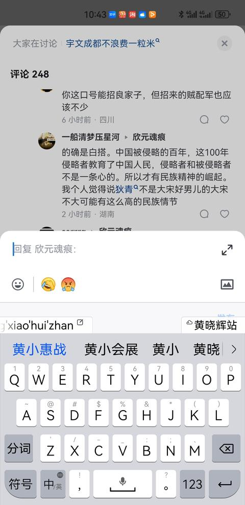
   - <a href="https://www.zhihu.com/people/donald-29">老老头</a> (<small title="回复于 2024-9-3 22:52:53/山东"> ✉️:欣元魂痕</small>): 辛亥革命本就是依靠精英打精英、依靠中层打上层［捂脸］
   - <a href="https://www.zhihu.com/people/lordmegatron">欣元魂痕</a> (<small title="回复于 2024-9-3 22:55:1/贵州"> ✉️:serrrg</small>): 对啊，这就是我原评论说的问题，一次革命是灭清，打着「驱逐鞑虏 恢复中华」的口号图了半个中国的满城，连北洋精锐都拦不住，二次北伐打不出这个口号马上就不行了［捂脸］
   - <a href="https://www.zhihu.com/people/scp-00">serrrg</a> (<small title="回复于 2024-9-3 23:7:34/河北"> ✉️:欣元魂痕</small>): 有点懂了，清朝倒了对大部分人都有利益，所以支持革命灭清的人多，到后面清朝倒了，利益不一致又都散了
   - <a href="https://www.zhihu.com/people/lordmegatron">欣元魂痕</a> (<small title="贵州">2024-9-4 2:8:41</small>): [@Pong](http://www.zhihu.com/people/248d5880ce839b1379d923044c9d11da) 嚯，秒黑，真没想到能刺痛到这个程度呢，尊贵的Peking & Urban Core Berkely叠加态高材生［爱］
   - <a href="https://www.zhihu.com/people/holocach">易翼益</a> (<small title="回复于 2024-9-4 2:36:21/中国香港"> ✉️:欣元魂痕</small>): 清确实很坏，但这跟清是不是老钟是两档子事，但从没听说过有什么实际的法律性文件（无论国内法还是国际法）把清算成外国占领者的。
   - <a href="https://www.zhihu.com/people/holocach">易翼益</a> (<small title="回复于 2024-9-4 2:44:42/中国香港"> ✉️:欣元魂痕</small>): 说挺好的，不过宋为啥不能用这套去动员？［捂脸］
   - <a href="https://www.zhihu.com/people/lordmegatron">欣元魂痕</a> (<small title="贵州">2024-9-4 2:51:58</small>): 针对同一历史事实的态度从不是一成不变的。六七十年代和现在对清国的评价可以说是截然不同，近年印度对莫卧儿的看法同样变为了外来者，立陶宛人也开始把波立联邦视为屈辱，埃及和伊朗人都在重拾自己真正祖先的认同。何谈没啥好争的？  
 
另外，孙文可没说带清是老钟。辛亥革命得胜时说的可是各省「光复」这样的用词。
   - <a href="https://www.zhihu.com/people/holocach">易翼益</a> (<small title="回复于 2024-9-4 2:55:12/中国香港"> ✉️:欣元魂痕</small>): 哈哈哈哥们儿你太年轻了，那只是口号，又不是官方法定文件［飙泪笑］歌名时的口号半当真就行了［飙泪笑］歌名时孙还许诺过把东北给霓虹呢，这能当真？［飙泪笑］重要的是看，闵果建立后对清是什么态度
   - <a href="https://www.zhihu.com/people/holocach">易翼益</a> (<small title="回复于 2024-9-4 2:56:46/中国香港"> ✉️:欣元魂痕</small>): 这位哥们儿，你还是看的书太少了，起事时的口号从来不能全信，那都是半实半虚的；事成后正儿八经有法律效力的文件，这才是实的\[捂脸［飙泪笑］
   - <a href="https://www.zhihu.com/people/holocach">易翼益</a> (<small title="回复于 2024-9-4 3:5:26/中国香港"> ✉️:欣元魂痕</small>): 哥们儿你还是见的太少了，这些人在起事的时候喊得啥口号，这都是半实半虚甚至就是虚的；事成之后，白纸黑字盖上合法gov戳子的文件，这才是实的［飙泪笑］  
 
逸仙起事时还说过要把关东那旮沓给霓虹呢，这能当真吗？［飙泪笑］关键是闵果真建立了之后，哪份白纸黑字盖着gov戳子的文件说过清是外国占领者？
   - <a href="https://www.zhihu.com/people/lordmegatron">欣元魂痕</a> (<small title="回复于 2024-9-4 8:39:20/贵州"> ✉️:易翼益</small>): 你是觉得半个中国的满城被杀得人头滚滚不够实在吗［好奇］不管事后说什么做什么，都不影响当时革命时的人怎么看，「驱逐鞑虏 恢复中华」就是1910s中国人的最大公约数
   - <a href="https://www.zhihu.com/people/sha-wu-le-ma">嘉然今天扔炸弹</a> (<small title="回复于 2024-9-4 8:45:26/河南"> ✉️:欣元魂痕</small>): 很多人搞不懂一件事，那就是民族国家究竟是什么。有些人还在拿大清和民国来说事  
 
我举个最直观的例子：在民族国家之前，有人造反割据。在民族国家之后，这种人几乎就没有了。  
 
在民族国家之后，你要造反，就只有打着全民族的旗号，去推翻旧政权。你想像宋江，方腊一样割据一方？不可能的。这样做你就是全民族的罪人。  
 
哪怕形成了事实上的割据，你名义上也要时刻准备反攻，譬如老蒋，否则你的合法性就没有了。当然，如果出现了分离主义那就另算，因为这是另一种民族主义。  
 
所以说，在宋这个农民起义频发，“杀人放火受招安”这种观念普遍的情况下，你这一番慷慨激昂的演讲是动员不了多少人的。
   - <a href="https://www.zhihu.com/people/lordmegatron">欣元魂痕</a> (<small title="回复于 2024-9-4 8:47:28/贵州"> ✉️:serrrg</small>): 没错，就是这个意思，实际上1910s的中国人普遍根本不在乎什么皇帝什么共和［捂脸］
   - <a href="https://www.zhihu.com/people/lordmegatron">欣元魂痕</a> (<small title="回复于 2024-9-4 8:49:53/贵州"> ✉️:老老头</small>): 底层其实也一点都不缺。白朗起义，秦陇复漢军，天地会，哥老会等全都有大把人加入义和团的残部都有。
   - <a href="https://www.zhihu.com/people/lordmegatron">欣元魂痕</a> (<small title="回复于 2024-9-4 8:51:29/贵州"> ✉️:sunnymudtool</small>): 氧气发现之前，都是不用呼吸的［飙泪笑］
 
对于你的臆想，哈萨克斯坦人李白表示：「胡無人 漢道昌」［惊喜］
   - <a href="https://www.zhihu.com/people/hui-zi-20-50-98">惠子</a> (<small title="浙江">2024-9-4 9:54:49</small>): 你以为古典帝国时期就没有民族意识了吗［好奇］两宋时期北方反抗辽金统治层出不穷，纯是宋太废物了
   - <a href="https://www.zhihu.com/people/hui-zi-20-50-98">惠子</a> (<small title="浙江">2024-9-4 9:58:3</small>): 华夷之辩从春秋时期就开始了，你以为北方异族政权想要站稳脚跟为什么要汉化，汉化到下一代看不出一点夷狄特征，也就清运气好碰到南明这个比宋还废物的政权，活生生内斗死了让清成功推行剃发，然后即使这样为了论证合法性还有搞大义觉迷录这样多乐子
   - <a href="https://www.zhihu.com/people/lordmegatron">欣元魂痕</a> (<small title="回复于 2024-9-4 10:0:17/贵州"> ✉️:嘉然今天扔炸弹</small>): 宋代同样可以动员，问题是大送朝廷一直在不停的卖各路归义军［捂脸］然而即便如此，金国汉人还是依然在源源不断起义归附
   - <a href="https://www.zhihu.com/people/15-95-47-28">有人喜欢爬</a> (<small title="回复于 2024-9-4 11:7:34/湖北"> ✉️:欣元魂痕</small>): 你觉得老百姓听得懂在说啥吗？他们知道啥是靖康之耻吗？
   - <a href="https://www.zhihu.com/people/zhao-peng-yuan-81">快乐水骑士</a> (<small title="回复于 2024-9-4 11:37:27/山东"> ✉️:欣元魂痕</small>): 要是没有苏联的枪炮 啥也白瞎，而且辛亥革命前民族意识已经觉醒，殖民主义催生民族主义，因为区分了敌我，他者和我。
   - <a href="https://www.zhihu.com/people/tang-di-50-16">棠棣</a> (<small title="回复于 2024-9-4 11:54:57/四川"> ✉️:欣元魂痕</small>): 白搭就是白搭，人家说了对民族国家有用，你是一点不看就怼，你举的例子恰恰是中国进入了民族国家时期。放在古代，你要说普通百姓完全没有民族意识也不对，但民族矛盾大不过阶级矛盾，古代士兵再有血勇也被上层剥削，为什么古代士兵不给钱就军心涣散呢，我拼死拼活只为地主老爷们能继续享乐？我拼个铲铲。
   - <a href="https://www.zhihu.com/people/zhao-shuai-jiao-9">兜兜不加奶盖</a> (<small title="吉林">2024-9-4 14:31:38</small>): 这种热血也就开始能高超一下，历次北伐檄文写的都挺有气势，开头捷报连连。但在古代那个组织度下，一旦攻势受挫，后勤军饷跟不上就会迅速雪崩式溃败
   - <a href="https://www.zhihu.com/people/zhao-shuai-jiao-9">兜兜不加奶盖</a> (<small title="回复于 2024-9-4 14:32:26/吉林"> ✉️:小小柯南</small>): 大概率是避开金军主力，沿路劫掠
   - <a href="https://www.zhihu.com/people/mo-han-ungrown">原生拟态</a> (<small title="回复于 2024-9-4 15:17:44/江苏"> ✉️:欣元魂痕</small>): 大清末年其实民族主义的味道就越来越浓了，没办法，自由扩散和温差对流
   - <a href="https://www.zhihu.com/people/lordmegatron">欣元魂痕</a> (<small title="回复于 2024-9-4 15:17:52/贵州"> ✉️:棠棣</small>): 哪要等到近代？哈萨克斯坦人李白都知道「胡無人 漢道昌」，就算大送朝不停地卖各路归义军也阻挡不了金国汉人源源不断地起义归附。
   - <a href="https://www.zhihu.com/people/lordmegatron">欣元魂痕</a> (<small title="回复于 2024-9-4 15:18:1/贵州"> ✉️:快乐水骑士</small>): 1911年哪来的苏联？民族意识哪要等到近代殖民主义？哈萨克斯坦人李白都知道「胡無人 漢道昌」
   - <a href="https://www.zhihu.com/people/lordmegatron">欣元魂痕</a> (<small title="回复于 2024-9-4 15:18:54/贵州"> ✉️:棠棣</small>): 再说辛亥革命哪来的民族国家时期？那是带清完蛋之后的事。
   - <a href="https://www.zhihu.com/people/holocach">易翼益</a> (<small title="回复于 2024-9-4 15:38:4/北京"> ✉️:欣元魂痕</small>): 民族国家什么的更不那么在乎，否则霓虹来的时候韦俊数量不会是世界第一了［捂脸］
   - <a href="https://www.zhihu.com/people/qwerty-95-51">QWERTY</a> (<small title="回复于 2024-9-4 15:39:41/辽宁"> ✉️:欣元魂痕</small>): ……您说的这个还是跟之前那个没有区别。如果他们真的有民族主义思想，早就把大怂皇帝打倒了。
   - <a href="https://www.zhihu.com/people/holocach">易翼益</a> (<small title="回复于 2024-9-4 15:39:47/北京"> ✉️:欣元魂痕</small>): 但按照国际法，国家继承的关键在于两点：一个是后续的政权认不认为自己是之前国家的延续（清签的各种约，外文版都是以“China”的名义，闵果是认的），以及国际上大多数国家认不认为他们是一个国家的不同阶段；清和闵果显然是符合这两条的
   - <a href="https://www.zhihu.com/people/holocach">易翼益</a> (<small title="回复于 2024-9-4 15:40:30/北京"> ✉️:欣元魂痕</small>): nation-state的动员能力显然不是农业时代的产物［捂脸］两者不可同日而语
   - <a href="https://www.zhihu.com/people/holocach">易翼益</a> (<small title="回复于 2024-9-4 15:42:52/北京"> ✉️:欣元魂痕</small>): nation-state是一个非常明确的词，就是指《威斯特伐利亚条约》确定的那种国家模式，没必要把古代中国非要往上面凑，真没必要［捂脸］尤其是对待边疆和其他国家的方式，古代中国怎么可能是nation-state？［捂脸］
   - <a href="https://www.zhihu.com/people/holocach">易翼益</a> (<small title="回复于 2024-9-4 15:46:26/北京"> ✉️:欣元魂痕</small>): 但这远远谈不上全体总动员，后面CCP才是这么做的；袁稍微一发力，歌名档就节节败退了，最后真把清拿下的主力仍然是各个军头和大员们，底层动员的作用是次要的，对比后来CCP，真正能全体总动员不会是这个结果
   - <a href="https://www.zhihu.com/people/holocach">易翼益</a> (<small title="回复于 2024-9-4 15:47:53/北京"> ✉️:欣元魂痕</small>): 这种事应该以明确的法律依据为准，还是应该以这些无法准确统计的事情为准？
 
逸仙自己也说了，哪怕做皇帝的是汉人，也该推翻他们
   - <a href="https://www.zhihu.com/people/holocach">易翼益</a> (<small title="回复于 2024-9-4 15:50:37/北京"> ✉️:欣元魂痕</small>): 目前并没有明确的权威统计辛亥革命时杀了多少满城，如果你有你可以拿出来；你不要拿局部的直观记载说事，如果这种记载能说明问题，现在基辅歌舞升平的画面网上也有不少，这能说明二毛子现在没事？［飙泪笑］
   - <a href="https://www.zhihu.com/people/holocach">易翼益</a> (<small title="回复于 2024-9-4 15:51:5/北京"> ✉️:欣元魂痕</small>): 不好意思，我更相信数据统计和法律文件的作用，你说的这些跟此相比都是虚的
   - <a href="https://www.zhihu.com/people/holocach">易翼益</a> (<small title="回复于 2024-9-4 15:56:40/北京"> ✉️:欣元魂痕</small>): 哪有被占领国打跑外国占领者后还继承他们签的国际条约的道理？［飙泪笑］韩国会继承日本签的各种约吗？奥地利会继承德国签的那些约吗？［捂脸］
   - <a href="https://www.zhihu.com/people/holocach">易翼益</a> (<small title="回复于 2024-9-4 16:0:15/北京"> ✉️:欣元魂痕</small>): 说实话，“当时革命的人”怎么看，你有证据证明当时大多数人怎么看的吗？你说出的所有例子好像都证明不了当时大多数人的看法［捂脸］
   - <a href="https://www.zhihu.com/people/qch2001">qch2001</a> (<small title="回复于 2024-9-4 19:20:26/福建"> ✉️:HQ呵呵呵</small>): 这种演说也只能得到德国30%选票，真正得到支持是靠消灭失业。真正激动人心的言简意赅，直指人心。打土豪，分田地，穷苦人当家作主。安冬尼是提起凯撒的遗产，才能使罗马民众忘记了共和国。
   - <a href="https://www.zhihu.com/people/lordmegatron">欣元魂痕</a> (<small title="回复于 2024-9-4 19:20:42/中国香港"> ✉️:易翼益</small>): 蜻帝退位之前，黄孝会战把老袁北洋精锐都派上了，这叫没有用力？结果还不是硬碰硬都溃逃了？
 
  
 
1910s根本就没多少人在乎什么皇帝封建，因为蜻帝退位没有复国的共同目标了，所以革命党当然就根本就摇不动人了，那可不节节败退？
 
  
 
没有底层动员？建议看下各路辛亥回忆录，一次北伐军主体就是农民、手工业者、城市贫民。
   - <a href="https://www.zhihu.com/people/lordmegatron">欣元魂痕</a> (<small title="回复于 2024-9-4 19:26:51/中国香港"> ✉️:易翼益</small>): 接手蜻国逆天烂摊子、积贫积弱都把辛丑条约废了，列强又没有一战冷战抽不开身，你这要求有点高啊。倒是建国n年有球村top军力的不但瑷珲条约全盘承认，还附送连条约都没有的唐努乌梁海呢［爱］
   - <a href="https://www.zhihu.com/people/lordmegatron">欣元魂痕</a> (<small title="回复于 2024-9-4 19:28:26/中国香港"> ✉️:QWERTY</small>): 如果他们真的有没有民族主义思想，就直接在金国原地起义建国了，会明知大怂是什么货色还个个去归附吗？
   - <a href="https://www.zhihu.com/people/lordmegatron">欣元魂痕</a> (<small title="回复于 2024-9-4 19:30:1/贵州"> ✉️:易翼益</small>): 你觉得各路纪念馆等标注的南京大屠杀的300000整是准确威统计吗？你想说南京大屠杀不存在吗［惊喜］
   - <a href="https://www.zhihu.com/people/holocach">易翼益</a> (<small title="回复于 2024-9-4 19:55:15/北京"> ✉️:欣元魂痕</small>): 拜托……这不就是多和少的区别吗？［捂脸］闵果承认了大部分条约，CCP大部分并不承认好吧？
   - <a href="https://www.zhihu.com/people/holocach">易翼益</a> (<small title="回复于 2024-9-4 19:56:8/北京"> ✉️:欣元魂痕</small>): 再说了，辛丑条约可不是辛亥以来马上废除的，是1941，对霓虹正式宣战时废的
   - <a href="https://www.zhihu.com/people/li-xiao-ying-80-86">李小鹰</a> (<small title="回复于 2024-9-4 19:58:28/北京"> ✉️:小小柯南</small>): 这个太虚伪了，大头兵知道你不会分的。最多分地，再加民族思想爱国主义。再多一句话都是扯淡。
   - <a href="https://www.zhihu.com/people/holocach">易翼益</a> (<small title="回复于 2024-9-4 20:2:12/北京"> ✉️:欣元魂痕</small>): 法国北部领土过去也是英国的，英国最如日中天的时候也没要回来，这能说明啥？说明带樱蒂锅很弱？  
 
法国北部过去可是诺曼公爵（现在英国王室的祖宗）的正经领地、英王室的龙兴之地（相当于东北对清一样）；而你说的那些地方zg从来没实际控制过，目前没有任何官方档案能查到近代以前zg的zf知道有枯叶岛存在［飙泪笑］
   - <a href="https://www.zhihu.com/people/holocach">易翼益</a> (<small title="回复于 2024-9-4 20:3:14/北京"> ✉️:欣元魂痕</small>): 李自成不就在明的地方起义建国了吗？［飙泪笑］这跟民族主义有什么关系？［飙泪笑］
   - <a href="https://www.zhihu.com/people/holocach">易翼益</a> (<small title="回复于 2024-9-4 20:5:20/北京"> ✉️:欣元魂痕</small>): 我不明白，钱穆、萧启庆这些学者查了那么多档案，考证古代zg的国家观念跟现在的民族国家观念不是一回事（钱穆这么研究可不是为了给元清辩护，相反钱穆很反感元清），你们为啥非要往上面去凑？
   - <a href="https://www.zhihu.com/people/holocach">易翼益</a> (<small title="回复于 2024-9-4 20:9:14/北京"> ✉️:欣元魂痕</small>): 拿着局部例子，你想说本潮还不如闵果？不知道你哪来的［微笑］说这些？别的事不说，终闵果一世也没彻底解决歪果仁的治外法权问题，你拿着本潮不再声索几个从未控制过的地方，就说闵果没那么差？你还要［微笑］吗？
   - <a href="https://www.zhihu.com/people/holocach">易翼益</a> (<small title="回复于 2024-9-4 20:13:13/北京"> ✉️:欣元魂痕</small>): 这要求怎么就不能高了？gong不到八年就能解决工业化的问题，闵果有几个八年了？又来什么闵果发展不好因为战争？gong在成立一年多的时候、在地面部队全由自己负责的情况下，能在槽线跟🦅打得有来有回；闵果怎么没那本事？
   - <a href="https://www.zhihu.com/people/holocach">易翼益</a> (<small title="回复于 2024-9-4 20:14:27/北京"> ✉️:欣元魂痕</small>): 你来教教我，49后的国际环境比闵果好哪儿去了？
   - <a href="https://www.zhihu.com/people/holocach">易翼益</a> (<small title="回复于 2024-9-4 20:16:50/北京"> ✉️:欣元魂痕</small>): 不讲理是吧？不继承条约不代表不继承国家，但继承条约一定代表继承国家，这是国际法通例；你说的这些跟这个有半毛钱关系？  
 
我就问你了，闵果刚建立时难不成还不如韩国？继不继承条约从来就不是摊子烂不烂的问题
   - <a href="https://www.zhihu.com/people/holocach">易翼益</a> (<small title="回复于 2024-9-4 20:24:54/北京"> ✉️:欣元魂痕</small>): 我就问你了，继不继承条约，跟摊子烂不烂有个毛线关系？有个毛线关系？有个毛线关系？闵果再弱能弱的过刚独立时候的韩国？  
 
不继承条约不代表不继承国家，但继承条约一定代表继承国家（还有，闵果把辛丑的钱一直赔了30年，这就是你口中的废除辛丑？更何况还有治外法权和其他的那些；CCP废掉那么多条约、用不到十年就做到了闵果近40年做不到的工业化，你就只会拿着不再声索几个从没实际控制过的地方说事？不要［微笑］了是吧？
   - <a href="https://www.zhihu.com/people/qwerty-95-51">QWERTY</a> (<small title="回复于 2024-9-4 20:42:25/辽宁"> ✉️:欣元魂痕</small>): 民族主义要求民族本身的利益，显然，保卫大怂反而对汉族有害。
   - <a href="https://www.zhihu.com/people/duo-duo-82-2">多多·阿鲁卡</a> (<small title="回复于 2024-9-4 22:32:44/北京"> ✉️:欣元魂痕</small>): 求屁滚尿流的北洋精锐番号
   - <a href="https://www.zhihu.com/people/holocach">易翼益</a> (<small title="回复于 2024-9-4 22:39:51/北京"> ✉️:欣元魂痕</small>): 起码那是权威统计，权威统计不一定准确，但总比没统计强，明白？
   - <a href="https://www.zhihu.com/people/holocach">易翼益</a> (<small title="回复于 2024-9-4 22:45:49/北京"> ✉️:欣元魂痕</small>): 任何势力的军队大部分人都是底层平民，难不成历史上只要是个军队都算充分发动民众了？北洋军大部分人难道不是平民？双方打的时候北洋军明明是占上风，最后歌名挡跟袁达成交易，袁把清帝弄下去，总统让他当~  
 
只要动员起来的人有底层就代表大部分底层人都参与了，这简直是国际玩笑［飙泪笑］还是刚才那例子，美国南北战争南军黑人还挺多的，难不成大部分黑人都参加南军了？
   - <a href="https://www.zhihu.com/people/holocach">易翼益</a> (<small title="回复于 2024-9-4 22:48:55/北京"> ✉️:欣元魂痕</small>): zg近代以来真正能动员大部分民众的只有CCP，其他的都是小打小闹~  
 
因为事实在那儿摆着，为什么只有CCP能倾全国之力完成工业化？为什么只有CCP能完成扫盲和全国教育普及？这才叫全体总动员。
   - <a href="https://www.zhihu.com/people/holocach">易翼益</a> (<small title="回复于 2024-9-4 22:55:14/北京"> ✉️:欣元魂痕</small>): 有底层参与＝大部分底层都参与进来了？这太ridiculous［飙泪笑］  
 
闵果时真正管着基层的还是那些士绅们，连袁世凯都知道这个不利于近代国家的建设（孙当然更知道），但他们谁都没能力打破士绅之治，国家能力大部分情况下还是“皇权不下县”的状态；真正基本摧毁这些现象的就是CCP（尽管还有遗存，但肯定谈不上“皇权不下县”了）
   - <a href="https://www.zhihu.com/people/holocach">易翼益</a> (<small title="回复于 2024-9-4 22:58:6/北京"> ✉️:欣元魂痕</small>): 从前面说闵果为什么继承清的条约那块，就看出来你这人根本不讲逻辑，这不完全胡搅蛮缠吗？
   - <a href="https://www.zhihu.com/people/holocach">易翼益</a> (<small title="回复于 2024-9-4 22:58:37/北京"> ✉️:欣元魂痕</small>): 国际法地位继承跟国家是不是烂摊子什么时候有半毛钱关系了？闵果再弱还能弱的过刚建国时的韩国？你是怎么做到国际法一窍不通还那么理直气壮的？
   - <a href="https://www.zhihu.com/people/holocach">易翼益</a> (<small title="回复于 2024-9-4 23:26:49/北京"> ✉️:欣元魂痕</small>): 再给你科普下，没有任何权威资料（如官方档案和专业学者的著作）表明辛亥发生过军级规模以上的战斗，更没资料证明辛亥发生过让清军（无论是哪拨清军）阵亡万人以上的战斗；也就是说，辛亥从没打过大兵团作战。  
 
现在你告诉我辛亥充分动员底层群众？底层充分动员就动员出这个德性？你还拿格命菌里有底层说他们充分动员了底层？哪个军队里大部分人不是底层？这说明只要是个军队都算充分动员？
   - <a href="https://www.zhihu.com/people/shan-mao-wang-93">山猫王</a> (<small title="回复于 2024-9-5 4:40:47/美国"> ✉️:欣元魂痕</small>): 把北洋精锐打得屁滚尿流太夸张了点吧
   - <a href="https://www.zhihu.com/people/san-he-da-shen-62">天策上将</a> (<small title="回复于 2024-9-5 7:26:40/江苏"> ✉️:小小柯南</small>): 开小会这样讲
   - <a href="https://www.zhihu.com/people/zhang-si-jian-89">张思健</a> (<small title="回复于 2024-9-5 10:22:50/山东"> ✉️:欣元魂痕</small>): 近代时期和两宋之际的社会性质不完全一样，而且辛亥革命的主体是接受了近代资产阶级民主思潮的影响的军人、仕绅
   - <a href="https://www.zhihu.com/people/huang-chong-ming-97">汉家匹夫</a> (<small title="回复于 2024-9-5 10:31:5/辽宁"> ✉️:小小柯南</small>): 没啥区别［飙泪笑］。
   - <a href="https://www.zhihu.com/people/ni-kan-zhao-wo-65">知乎用户d5wRuR</a> (<small title="回复于 2024-9-5 10:34:48/广东"> ✉️:小小柯南</small>): 这个不行，命都没有了还分什么？但是理念就不同了，命都没有了，自有后来人替我实现理念。
   - <a href="https://www.zhihu.com/people/ya-xia-14-76">亚夏</a> (<small title="回复于 2024-9-5 11:21:56/甘肃"> ✉️:欣元魂痕</small>): 辛亥革命也不是古典封建时代爆发的，这次革命前积累了多次爱国革命的经验，也有着年轻人中广泛传播的新兴理念基础做支撑，革命成功靠的也是这些人，你和种地老农讲这一套不是对牛弹琴，那得用教员那套。
   - <a href="https://www.zhihu.com/people/ba-zhan-kang-ni">小不忍则大不忍</a> (<small title="回复于 2024-9-5 11:23:6/新加坡"> ✉️:知乎用户7hDqvr</small>): 啊？你已经被虚无成这样了？
   - <a href="https://www.zhihu.com/people/ba-zhan-kang-ni">小不忍则大不忍</a> (<small title="回复于 2024-9-5 11:24:22/新加坡"> ✉️:CountryAdmin</small>): 袁世凯这么牛逼怎么没有先拿下灭革命党然后北上称帝？是因为不想吗
   - <a href="https://www.zhihu.com/people/ba-zhan-kang-ni">小不忍则大不忍</a> (<small title="回复于 2024-9-5 11:25:33/新加坡"> ✉️:Dues</small>): 你说的是中华民族，他说的是汉族
   - <a href="https://www.zhihu.com/people/abc-abc-11-99">abc abc</a> (<small title="回复于 2024-9-5 11:47:21/江苏"> ✉️:印共游击队</small>): 是的，还有“壮志饥餐胡虏肉，笑谈渴饮匈奴血”，“但使龙城飞将在，不教胡马度阴山”等等
   - <a href="https://www.zhihu.com/people/a-li-69-76-17">阿力</a> (<small title="回复于 2024-9-5 12:51:28/上海"> ✉️:欣元魂痕</small>): ［飙泪笑］北洋精锐
   - <a href="https://www.zhihu.com/people/lordmegatron">欣元魂痕</a> (<small title="回复于 2024-9-5 13:26:9/贵州"> ✉️:张思健</small>): 但凡看点当时的史料回忆录都知道革命军的主体是手工业者和城市贫民，其次是农民
   - <a href="https://www.zhihu.com/people/lordmegatron">欣元魂痕</a> (<small title="回复于 2024-9-5 13:35:50/贵州"> ✉️:山猫王</small>): 毫不夸张，黄孝会战就是正面把北洋精锐打到溃逃
   - <a href="https://www.zhihu.com/people/chen-zi-teng-70">陈老司驾到</a> (<small title="河南">2024-9-5 13:38:47</small>): 老农民：啥是宋国？啥是金国？我是宋国人？
   - <a href="https://www.zhihu.com/people/lordmegatron">欣元魂痕</a> (<small title="回复于 2024-9-5 13:42:28/贵州"> ✉️:易翼益</small>): 「我國人自漢族推覆滿清政權、脫離異族羈厄之後，則以民族主義已達目的矣。更有無知妄作者，於革命成功之後，創為漢、滿、蒙、回、藏五族共和之說。」——【1924年】《三民主義》
   - <a href="https://www.zhihu.com/people/lordmegatron">欣元魂痕</a> (<small title="回复于 2024-9-5 13:43:41/贵州"> ✉️:易翼益</small>): 然而事实是就算大送朝一个接一个的卖各路归义军，金国汉人还是源源不断地起义归附。
   - <a href="https://www.zhihu.com/people/lordmegatron">欣元魂痕</a> (<small title="贵州">2024-9-5 13:45:33</small>): 没有？全盘承认瑷珲条约还附赠【条约根本没有割】的16万平方公里唐努乌梁海是咋回事啊？你在质疑谁的合法性？［惊喜］
   - <a href="https://www.zhihu.com/people/lordmegatron">欣元魂痕</a> (<small title="回复于 2024-9-5 13:47:24/贵州"> ✉️:有人喜欢爬</small>): 他们不知道，为什么就算大送朝不停地卖归义军，金国汉人还是源源不断起义归附？为什么民间岳王庙修得到处都是？
   - <a href="https://www.zhihu.com/people/lordmegatron">欣元魂痕</a> (<small title="回复于 2024-9-5 13:49:31/贵州"> ✉️:易翼益</small>): 但凡随便看点史料都知道革命军主体是手工业者和城市贫民，其次是农民［尴尬］
   - <a href="https://www.zhihu.com/people/lordmegatron">欣元魂痕</a> (<small title="回复于 2024-9-5 13:51:20/贵州"> ✉️:易翼益</small>): 你不是说根本没有吗？咋又变话术了［好奇］
   - <a href="https://www.zhihu.com/people/lordmegatron">欣元魂痕</a> (<small title="回复于 2024-9-5 13:51:45/贵州"> ✉️:易翼益</small>): 列强略在冷战。
   - <a href="https://www.zhihu.com/people/lordmegatron">欣元魂痕</a> (<small title="回复于 2024-9-5 13:55:13/贵州"> ✉️:易翼益</small>): 但凡看点当时的史料回忆录都知道革命军的主体是手工业者和城市贫民，其次是农民，这叫没有动员底层？
   - <a href="https://www.zhihu.com/people/1-43-89-73">一击脱离赢麻了</a> (<small title="北京">2024-9-5 14:10:38</small>): 朱元璋觉得你说的有点太绝对了
   - <a href="https://www.zhihu.com/people/lordmegatron">欣元魂痕</a> (<small title="回复于 2024-9-5 14:19:31/贵州"> ✉️:亚夏</small>): 然而但凡随便看点史料都知道第一次北伐革命军主体是手工业者和城市贫民，再者是农民。你说的与史实不符。
   - <a href="https://www.zhihu.com/people/akuna-29">石为溪</a> (<small title="山东">2024-9-5 14:38:2</small>): 总结了一下经典的民族主义神话：汉民族和中华民族是不可分割的一部分，都是民族主义的重要内容，笑嘻了［飙泪笑］
   - <a href="https://www.zhihu.com/people/xing-guo-xi">蓝天风车</a> (<small title="广东">2024-9-5 14:52:49</small>): 中国古代就是民族国家，古人也有民族性。不是西方发明民族之后，才有的汉族。西方没有发明民族之前，汉人也是存在的
   - <a href="https://www.zhihu.com/people/mk1-7">MarkVictorious</a> (<small title="湖北">2024-9-5 15:24:54</small>): 咋可能，中国早都有民族、国家概念了。不然为什么崖山那么多人跳海，为什么会有亡国与亡天下之分，为什么会有义和团运动？那么多赤手空拳拿大刀和洋枪洋炮去打的人，这叫白搭？我看你活着也是白搭。
   - <a href="https://www.zhihu.com/people/zhao-peng-yuan-81">快乐水骑士</a> (<small title="回复于 2024-9-5 15:36:58/山东"> ✉️:欣元魂痕</small>): ？？？
   - <a href="https://www.zhihu.com/people/zheng-huo-huo-29">郑活活</a> (<small title="山东">2024-9-5 15:46:52</small>): 当年冉闵的杀胡令，感觉也是差不多这么个意思。
   - <a href="https://www.zhihu.com/people/ya-xia-14-76">亚夏</a> (<small title="回复于 2024-9-5 16:1:17/甘肃"> ✉️:欣元魂痕</small>): 你先闹闹明白辛亥革命是啥时候的事，革命军北伐又是啥时候的事再给人科普好吧
   - <a href="https://www.zhihu.com/people/lordmegatron">欣元魂痕</a> (<small title="回复于 2024-9-5 16:16:50/贵州"> ✉️:石为溪</small>): [@亚夏](http://www.zhihu.com/people/63e7764e92d6a88d85f03cc7f34de0df) 你能分清「北伐」和「北伐战争」吗？1911年不是在北伐？
   - <a href="https://www.zhihu.com/people/warsaga">他化自在天</a> (<small title="上海">2024-9-5 16:38:57</small>): 这个是动员士大夫和乡贤的，底层百姓的思想动员掌握在那帮人手里
   - <a href="https://www.zhihu.com/people/hei-hong-94-98">互联网皇帝</a> (<small title="回复于 2024-9-5 16:43:47/湖北"> ✉️:欣元魂痕</small>): 你这也不是古典封建了啊，中国的民族主义甲午战败以后就开始觉醒了
   - <a href="https://www.zhihu.com/people/lordmegatron">欣元魂痕</a> (<small title="回复于 2024-9-5 16:48:5/贵州"> ✉️:互联网皇帝</small>): 民族主义一直都在，用不着什么甲午。
   - <a href="https://www.zhihu.com/people/holocach">易翼益</a> (<small title="回复于 2024-9-5 16:59:22/北京"> ✉️:欣元魂痕</small>): 噗。。。那敏锅刚成立时还正好赶上一战呢［捂脸］列强更在对峙
   - <a href="https://www.zhihu.com/people/lordmegatron">欣元魂痕</a> (<small title="回复于 2024-9-5 17:2:22/贵州"> ✉️:易翼益</small>): 一战：1914——1918。1911境内还有一大堆列强军队呢。不如谈谈军力top还要额外送唐努乌梁海的事吧。
   - <a href="https://www.zhihu.com/people/holocach">易翼益</a> (<small title="回复于 2024-9-5 17:4:8/北京"> ✉️:欣元魂痕</small>): 你除了车轱辘话来回重复还有啥？这个早就驳过了，照这逻辑，美国civil war南军还有黑人呢、纳粹德军还有犹太人呢，难不成这就表示黑人和犹太人都被动员出来支持南军和纳粹？［飙泪笑］
   - <a href="https://www.zhihu.com/people/holocach">易翼益</a> (<small title="回复于 2024-9-5 17:4:45/北京"> ✉️:欣元魂痕</small>): 但凡看点史料就知道，辛亥规模最大的战役不过师级战斗，并且从没单词战役让清军阵亡万人以上，也就是说从没发生过大兵团作战，规模还不如后来的直奉战争；就这战争规模，你告诉我这叫底层充分动员？你在开什么国际玩笑呢？［飙泪笑］
   - <a href="https://www.zhihu.com/people/holocach">易翼益</a> (<small title="回复于 2024-9-5 17:9:34/北京"> ✉️:欣元魂痕</small>): 这能说明什么？金人确实残暴啊，但这不能说明跟民族主义有关系；毕竟宋自己就是农民起义最多的朝代
   - <a href="https://www.zhihu.com/people/holocach">易翼益</a> (<small title="回复于 2024-9-5 17:14:45/北京"> ✉️:蓝天风车</small>): 如果古代是民族国家（nation-state），那无法解释大部分人为什么认同五胡十六国还有元清是中国
   - <a href="https://www.zhihu.com/people/holocach">易翼益</a> (<small title="回复于 2024-9-5 17:14:58/北京"> ✉️:MarkVictorious</small>): 如果古代是民族国家（nation-state），那无法解释大部分人为什么认同五胡十六国还有元清是中国
   - <a href="https://www.zhihu.com/people/holocach">易翼益</a> (<small title="回复于 2024-9-5 17:20:24/北京"> ✉️:欣元魂痕</small>): 我就问你，zg历朝历代什么时候真控制过唐努乌梁海？在地图上标一下就算？美国刚建国那会儿还声称加拿大是他们还没解放的地盘呢（美国刚建国时主张所有北美的英国殖民地都只是他们还没解放的地方），美国现在凭什么要承认加拿大是独立国家？［飙泪笑］
 
闵果怎么没那个本事让列强出去？CCP不光有那个本事，哪怕在超纤也能在地面战里跟最top的那个列强打得有来有回，谁强谁弱，一目了然
   - <a href="https://www.zhihu.com/people/lordmegatron">欣元魂痕</a> (<small title="回复于 2024-9-5 17:21:5/贵州"> ✉️:易翼益</small>): 如果不是民族主义直接就当地自立了，为何明知很可能又被卖还要个个归附呢［好奇］
   - <a href="https://www.zhihu.com/people/lordmegatron">欣元魂痕</a> (<small title="回复于 2024-9-5 17:23:15/贵州"> ✉️:易翼益</small>): 教育的结果罢了。早半个世纪来问同样的问题会有相反的答案。 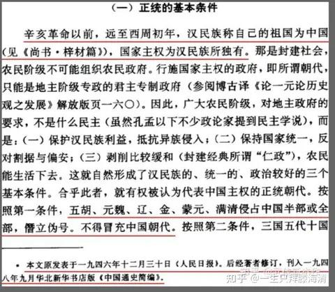
   - <a href="https://www.zhihu.com/people/lordmegatron">欣元魂痕</a> (<small title="回复于 2024-9-5 17:34:20/贵州"> ✉️:易翼益</small>): 什么车车毂辘话？是南军【主要】是黑人，还是德纳【主要】是犹太人［好奇］
   - <a href="https://www.zhihu.com/people/holocach">易翼益</a> (<small title="回复于 2024-9-5 17:37:0/北京"> ✉️:欣元魂痕</small>): 1.一战期间闵果怎么就没抓住机会发展的想点样呢？怎么奔潮就能做到呢？美苏在cold war期间都没少霍霍其他国，怎么奔潮就有那个本事让他们干预不了？就凭在超纤的事，闵果能沾的上边吗？
 
2.那CCP怎么就有那个本事让列强军队出去？闵果不能让列强出去，就是他没本事，不对吗？
   - <a href="https://www.zhihu.com/people/lordmegatron">欣元魂痕</a> (<small title="回复于 2024-9-5 17:40:9/贵州"> ✉️:易翼益</small>): 好好好，只要我溃逃够快人死的少，规模就不算大［惊喜］
   - <a href="https://www.zhihu.com/people/holocach">易翼益</a> (<small title="回复于 2024-9-5 17:41:12/北京"> ✉️:欣元魂痕</small>): 这能说明什么半毛钱的问题？说明奔潮现在不承认蜻是zg？［飙泪笑］还是那句话，这种声明就跟孙许诺把东北给霓虹一样，都不能作为法律依据［飙泪笑］
   - <a href="https://www.zhihu.com/people/lordmegatron">欣元魂痕</a> (<small title="回复于 2024-9-5 17:41:14/贵州"> ✉️:易翼益</small>): 港澳台：我寻思我当年也没有被实控啊［好奇］
   - <a href="https://www.zhihu.com/people/holocach">易翼益</a> (<small title="回复于 2024-9-5 17:43:52/北京"> ✉️:欣元魂痕</small>): 没被奔潮实控跟历朝都没实控是一回事？照此逻辑，法国当初丢了阿尔萨斯和洛林时第三共和国还没建立呢，那第三共和国后来凭什么把这俩地方要回来？你是一点国际法knowledge都没有还在这儿理直气壮是吧？
   - <a href="https://www.zhihu.com/people/holocach">易翼益</a> (<small title="回复于 2024-9-5 17:44:26/北京"> ✉️:欣元魂痕</small>): 请自己了解什么叫“国家继承”，你这直接犯国际法基本知识错误了［飙泪笑］
   - <a href="https://www.zhihu.com/people/holocach">易翼益</a> (<small title="回复于 2024-9-5 17:52:34/北京"> ✉️:欣元魂痕</small>): 历朝都没实控和只有奔潮没实控是一回事？我寻思“国家继承”这种基本国际法概念问题你都不知道，你哪来底气硬木工的？
   - <a href="https://www.zhihu.com/people/holocach">易翼益</a> (<small title="回复于 2024-9-5 17:54:2/北京"> ✉️:欣元魂痕</small>): 那我就问你了，任何一支军队，有哪个主要不是底层人？这么说只要是个有军队的都算充分动员底层？
   - <a href="https://www.zhihu.com/people/holocach">易翼益</a> (<small title="回复于 2024-9-5 17:55:17/北京"> ✉️:欣元魂痕</small>): 规模最大的那几个有哪个是蜻军溃逃够快的？阳夏和南京的仗哪个不是惨胜？哪个不是歌名军比蜻军伤亡还高？
   - <a href="https://www.zhihu.com/people/holocach">易翼益</a> (<small title="回复于 2024-9-5 17:56:31/北京"> ✉️:欣元魂痕</small>): 你这种压根不了解事实只会先射箭后画靶子的，被人驳过的话你压根无视继续重复之前的观点，你是哪来的勇气持续跟人辩那么长时间的？
   - <a href="https://www.zhihu.com/people/holocach">易翼益</a> (<small title="回复于 2024-9-5 17:59:43/北京"> ✉️:欣元魂痕</small>): 本国从没实控和奔潮从没实控是一回事？那法国丢阿尔萨斯洛林的时候第三共和国还没建立呢，第三共和国凭什么要回奔潮从没控制过的阿尔萨斯洛林？糖怒无量海是利潮都没控制过，跟那仨地是一回事？
   - <a href="https://www.zhihu.com/people/lordmegatron">欣元魂痕</a> (<small title="回复于 2024-9-5 18:1:12/贵州"> ✉️:易翼益</small>): 历朝历代都没有实控？直到19世纪永宁寺碑都是费雅喀人祭拜的圣物呢，那么请问瑷珲条约有没有承认呢［好奇］
   - <a href="https://www.zhihu.com/people/xing-guo-xi">蓝天风车</a> (<small title="回复于 2024-9-5 18:3:3/广东"> ✉️:易翼益</small>): 现在我依然认为元清是中国，否则为什么不杀光少数民族。
   - <a href="https://www.zhihu.com/people/lordmegatron">欣元魂痕</a> (<small title="回复于 2024-9-5 18:4:5/贵州"> ✉️:易翼益</small>): 自己发现理亏就开始顾左右而言他了［尴尬］
   - <a href="https://www.zhihu.com/people/holocach">易翼益</a> (<small title="回复于 2024-9-5 18:7:15/北京"> ✉️:欣元魂痕</small>): 没有，怎么着吧？［飙泪笑］外northeast部族首领偷着给鹅和霓虹称臣上贡，这边当时都不知道，这叫个毛线实际控制？［飙泪笑］
   - <a href="https://www.zhihu.com/people/holocach">易翼益</a> (<small title="回复于 2024-9-5 18:9:29/北京"> ✉️:欣元魂痕</small>): hhhhh我理亏了个啥？我说哪支军队大部分人都是底层、难道能说明任何一支军队都算充分动员底层这叫理亏？这句话有本事你能反驳？［飙泪笑］
   - <a href="https://www.zhihu.com/people/lordmegatron">欣元魂痕</a> (<small title="回复于 2024-9-5 18:10:57/贵州"> ✉️:易翼益</small>): 八旗成社会底层了［开心］
   - <a href="https://www.zhihu.com/people/holocach">易翼益</a> (<small title="回复于 2024-9-5 18:10:58/北京"> ✉️:欣元魂痕</small>): 不算，怎么着吧？［飙泪笑］外northeast当地头人同时接受这边、纱鹅和霓虹的封官早不是啥秘密了，你管这叫实际控制？
   - <a href="https://www.zhihu.com/people/holocach">易翼益</a> (<small title="回复于 2024-9-5 18:12:28/北京"> ✉️:欣元魂痕</small>): 是你在顾左右而言他，你能说出辛亥战斗规模不大都是蜻一触即溃（规模最大的阳夏和南京，歌名军伤亡比蜻军还高），你这都直接编造事实了［飙泪笑］
   - <a href="https://www.zhihu.com/people/lordmegatron">欣元魂痕</a> (<small title="回复于 2024-9-5 18:12:51/贵州"> ✉️:易翼益</small>): 哦，那不就是说历史实控没有意义只看现在？那不就又回到了之前的问题——香港岛、九龙、台湾：你好［爱］
   - <a href="https://www.zhihu.com/people/holocach">易翼益</a> (<small title="回复于 2024-9-5 18:15:30/北京"> ✉️:欣元魂痕</small>): 又搁这儿不讲理了是吧？历史实控过的地方，奔潮没实控过也有法理，明白？
   - <a href="https://www.zhihu.com/people/mk1-7">MarkVictorious</a> (<small title="回复于 2024-9-5 18:16:24/湖北"> ✉️:易翼益</small>): 首先，我的意思不是说中国古代是民族国家，而是很多人也有民族意识。其次华夷之辨这个从古至今都有，我就不在此过多阐述。［吃瓜］［吃瓜］
   - <a href="https://www.zhihu.com/people/holocach">易翼益</a> (<small title="回复于 2024-9-5 18:16:24/北京"> ✉️:欣元魂痕</small>): 偷换概念是吧？我说的是历史实控没有现实意义？［飙泪笑］我说的是历史没实控过要不要无所谓，实控过的才有意义，懂？
   - <a href="https://www.zhihu.com/people/holocach">易翼益</a> (<small title="回复于 2024-9-5 18:17:38/北京"> ✉️:MarkVictorious</small>): 哦，你这么说的话我同意
   - <a href="https://www.zhihu.com/people/lordmegatron">欣元魂痕</a> (<small title="回复于 2024-9-5 18:17:59/贵州"> ✉️:易翼益</small>): 结果马上再黄孝——辛亥革命【最大】会战正面暴揍北洋【精锐】，不更显得民族主义加成强大吗？大清这么厉害，咋一看徐州光复就吓到退位了［开心］
   - <a href="https://www.zhihu.com/people/holocach">易翼益</a> (<small title="回复于 2024-9-5 18:19:7/北京"> ✉️:欣元魂痕</small>): 偷换概念是吧？我说的是历史实控没现实意义？我说的是历史没实控没现实意义，历史实控才有
   - <a href="https://www.zhihu.com/people/holocach">易翼益</a> (<small title="回复于 2024-9-5 18:30:12/北京"> ✉️:蓝天风车</small>): 好吧，我也认为［飙泪笑］
   - <a href="https://www.zhihu.com/people/holocach">易翼益</a> (<small title="回复于 2024-9-5 18:31:53/北京"> ✉️:欣元魂痕</small>): 怎么不说话了？那好啊，我要是看到你动态更新可这边还没回复，那我就默认你理屈词穷了，我就lahei你了
   - <a href="https://www.zhihu.com/people/holocach">易翼益</a> (<small title="回复于 2024-9-5 18:39:34/北京"> ✉️:欣元魂痕</small>): 噗。。。从平三藩开始，蜻军大多数兵力从来就不是八旗军［飙泪笑］
   - <a href="https://www.zhihu.com/people/lordmegatron">欣元魂痕</a> (<small title="回复于 2024-9-5 18:39:44/贵州"> ✉️:易翼益</small>): 过去实控过啊，那海参煨咋又没有法理了？为什么爱灰条约又要认了？
   - <a href="https://www.zhihu.com/people/lordmegatron">欣元魂痕</a> (<small title="回复于 2024-9-5 18:41:17/贵州"> ✉️:易翼益</small>): 您的原话：「任何一支军队，有哪个主要不是底层人」  
 
又偷换概念［好奇］
   - <a href="https://www.zhihu.com/people/holocach">易翼益</a> (<small title="回复于 2024-9-5 18:42:15/北京"> ✉️:欣元魂痕</small>): 没有实控，当地头头们同时又对鹅和霓虹受封上贡早不是秘密了，这叫个what实控？
   - <a href="https://www.zhihu.com/people/lordmegatron">欣元魂痕</a> (<small title="回复于 2024-9-5 18:42:27/贵州"> ✉️:易翼益</small>): 你也知道是〝偷着〞嘛［尴尬］
   - <a href="https://www.zhihu.com/people/holocach">易翼益</a> (<small title="回复于 2024-9-5 18:45:54/北京"> ✉️:欣元魂痕</small>): 给这边受封上贡，从霓虹和鹅的视角看也是“偷着“［飙泪笑］
   - <a href="https://www.zhihu.com/people/holocach">易翼益</a> (<small title="回复于 2024-9-5 18:47:49/北京"> ✉️:欣元魂痕</small>): 是你偷换概念~否则，一个zf所属的军队，具体得怎么样才算”充分动员底层“？请你给出一个衡量标准来~难不成只要这个zf所属的军队大部分人是底层出身就算充分动员底层？那这么说哪一支军队不算充分动员底层？
   - <a href="https://www.zhihu.com/people/holocach">易翼益</a> (<small title="回复于 2024-9-5 18:49:12/北京"> ✉️:欣元魂痕</small>): 你前面只把”军队大部分人来自底层“作为一支军队”充分动员底层“的依据；我想说的是，大部分人是底层从来不能证明一支军队是充分动员底层得来的，就这么简单
   - <a href="https://www.zhihu.com/people/lordmegatron">欣元魂痕</a> (<small title="回复于 2024-9-5 18:50:30/贵州"> ✉️:易翼益</small>): 既然存在不是底层的军队，那么当然就能反应动员的阶层。否则为什么一直有农民起义军的提法呢？
   - <a href="https://www.zhihu.com/people/holocach">易翼益</a> (<small title="回复于 2024-9-5 18:56:22/北京"> ✉️:欣元魂痕</small>): 不是啊，是你一开始说因为辛亥时歌名军大部分人是底层，所以辛亥充分动员了底层；所以我就想问，照这个标准，岂不是所有军队都可以算充分动员了底层吗？连蜻军也是啊，蜻军来跟葛明军打的那些，比如北洋军皖军什么的，难道大部分人不是底层？［捂脸］
   - <a href="https://www.zhihu.com/people/holocach">易翼益</a> (<small title="回复于 2024-9-5 19:7:14/北京"> ✉️:欣元魂痕</small>): 嗯，你这段话我完全同意（咱俩终于有意见完全一致的时候了［飙泪笑］
 
所以我想问的是到底怎么样才能算”充分动员了底层的军队“？［飙泪笑］反正肯定不是军队大部分人都是底层、这支军队就算”底层的军队“吧？
   - <a href="https://www.zhihu.com/people/shan-mao-wang-93">山猫王</a> (<small title="回复于 2024-9-5 20:3:27/美国"> ✉️:欣元魂痕</small>): 黄孝战役的主力是黎元洪的军队，而非是同盟会能控制的属于自己的军事力量。而当时击败清军的革命军当中的很多人，后来也成为了北洋军阀私军的一部分。革命军的参战兵力当中除了广西革命军等，其主力是黎元洪的鄂军。而鄂军虽然有革命思想，但其组织上还残留着旧军阀的痕迹。而黎元洪作为创办湖北新军的重要领袖，在新军中深得民心，对后来的革命形势发展具有巨大的影响力，但是他是被强推上台的。真正的革命家主力早在汉口和汉阳就被击溃了，这时革命军更多是一群受到革命思潮影响的旧军队。
   - <a href="https://www.zhihu.com/people/lordmegatron">欣元魂痕</a> (<small title="回复于 2024-9-5 20:25:0/贵州"> ✉️:山猫王</small>): 在1911年，只要驱逐鞑虏恢复中华，那么不论成分各路革命军就没有本质区别
   - <a href="https://www.zhihu.com/people/yudu080622">一文不名</a> (<small title="广东">2024-9-5 20:51:49</small>): ［赞同］
   - <a href="https://www.zhihu.com/people/singer-42">singer</a> (<small title="回复于 2024-9-5 20:54:14/美国"> ✉️:欣元魂痕</small>): 辛亥革命的时代，整个世界处于民族革命的浪潮中，中国早已与西方文明碰撞近百年，民族意识觉醒是非常自然的事情，怎能与千年前的帝制皇民+匪民状况混为一谈？
   - <a href="https://www.zhihu.com/people/lordmegatron">欣元魂痕</a> (<small title="回复于 2024-9-5 22:29:24/中国香港"> ✉️:singer</small>): 为啥要等到西方文明？哈萨克斯坦人李白都知道 “胡无人 汉道昌”
   - <a href="https://www.zhihu.com/people/lordmegatron">欣元魂痕</a> (<small title="回复于 2024-9-6 0:8:24/贵州"> ✉️:阿力</small>): 黄孝会战了解一下［爱］
   - <a href="https://www.zhihu.com/people/lordmegatron">欣元魂痕</a> (<small title="回复于 2024-9-6 0:15:44/贵州"> ✉️:多多·阿鲁卡</small>): 黄孝会战北洋最精锐的六镇溃逃
   - <a href="https://www.zhihu.com/people/14-9-9-52">呵呵</a> (<small title="回复于 2024-9-6 11:5:19/江苏"> ✉️:欣元魂痕</small>): 辛亥团结全国靠的是满清搞皇族内阁，士绅们失望了。
   - <a href="https://www.zhihu.com/people/zhu-meng-shao-nian-7-79">白马非马</a> (<small title="浙江">2024-9-6 11:15:7</small>): 你虽然是山东IP，但是对于民粹主义的狂热还是理解不够深刻
   - <a href="https://www.zhihu.com/people/zhu-meng-shao-nian-7-79">白马非马</a> (<small title="回复于 2024-9-6 11:16:26/浙江"> ✉️:知乎用户4OqX0Z</small>): 因为周期到了
   - <a href="https://www.zhihu.com/people/bo-he-ru-cha">umbrella</a> (<small title="回复于 2024-9-6 11:37:48/安徽"> ✉️:道阻且长</small>): 确实一句话没有一个论点是对的［发呆］，辛亥革命靠着驱逐鞑虏恢复中华就能团结全国？把北洋精锐打得屁滚尿流？
   - <a href="https://www.zhihu.com/people/suko-61">Marshall-Lean</a> (<small title="回复于 2024-9-6 13:26:55/黑龙江"> ✉️:小小柯南</small>): 我现在可以给你们分土地，让你们吃上炊饼，但是金国人随时随地都能用他们的屠刀杀到这里，占领你的土地，夺走你的炊饼，侮辱你的妻子，杀掉你的孩子，用鞭子抽打你，让你在原本属于你的土地上为他们种地，把你的土地上的收成全部交给他们！
   - <a href="https://www.zhihu.com/people/lordmegatron">欣元魂痕</a> (<small title="回复于 2024-9-6 13:53:50/贵州"> ✉️:呵呵</small>): 靠什么内阁？不暴揍北洋最精锐的六镇、光复徐州，蜻帝会心善退位［好奇］
   - <a href="https://www.zhihu.com/people/yi-yang-44-82">咕咕一败涂地</a> (<small title="回复于 2024-9-6 14:11:5/山东"> ✉️:欣元魂痕</small>): 你也说了辛亥革命了，这时候全世界都开始搞民族主义了。
   - <a href="https://www.zhihu.com/people/bo-ren-zhuan">勃仁撰</a> (<small title="回复于 2024-9-6 15:14:7/浙江"> ✉️:小小柯南</small>): 这个好
   - <a href="https://www.zhihu.com/people/yawk-69">Yawk</a> (<small title="回复于 2024-9-6 15:48:13/吉林"> ✉️:欣元魂痕</small>): 笑嘻
   - <a href="https://www.zhihu.com/people/lordmegatron">欣元魂痕</a> (<small title="回复于 2024-9-6 15:50:30/贵州"> ✉️:Yawk</small>): 夜笑到明，明笑到夜，能把屁滚尿流的北洋精锐六镇笑赢吗［好奇］
   - <a href="https://www.zhihu.com/people/14-9-9-52">呵呵</a> (<small title="回复于 2024-9-6 16:44:23/江苏"> ✉️:欣元魂痕</small>): 莫名其妙。  
 
如果不是皇族内阁搞得汉族士绅失望了，士绅不会支持革命党，怎么可能打的赢？辛亥之后士绅不需要的时候，收拾激进的革命党也没见怎么办。
   - <a href="https://www.zhihu.com/people/lordmegatron">欣元魂痕</a> (<small title="回复于 2024-9-6 17:34:4/贵州"> ✉️:umbrella</small>): 黄孝战役暴揍北洋最精锐的六镇，秦陇复汉军在乾县和甘肃清军血战一百多天不退，联军三个月从南京打到徐州，山东的革命军光复胶东之收复辽南地区，当然这些教科书是只字不提的。而所谓“民主共和深入人心”？实际上大多数革命军口号根本就不带孙文后两句话的。
   - <a href="https://www.zhihu.com/people/qin-qin-58-25-22">勤勤</a> (<small title="回复于 2024-9-6 18:13:21/河北"> ✉️:欣元魂痕</small>): ［捂脸］那叫团结么，而且辛亥革命咋回事儿大家都清楚
   - <a href="https://www.zhihu.com/people/lordmegatron">欣元魂痕</a> (<small title="回复于 2024-9-6 18:35:21/贵州"> ✉️:勤勤</small>): 当然清楚。黄孝战役暴揍北洋最精锐的六镇，秦陇复汉军在乾县和甘肃清军血战一百多天不退，联军三个月从南京打到徐州，山东的革命军光复胶东之收复辽南地区，徐州光复，蜻蜓就吓得魂都没了［惊喜］
   - <a href="https://www.zhihu.com/people/lordmegatron">欣元魂痕</a> (<small title="回复于 2024-9-6 18:36:11/贵州"> ✉️:呵呵</small>): 因为但凡看点史料回忆录都知道，革命军主要是城市贫民、手工业者和农民，没有什么士绅。
   - <a href="https://www.zhihu.com/people/14-9-9-52">呵呵</a> (<small title="回复于 2024-9-6 18:49:47/江苏"> ✉️:欣元魂痕</small>): 所以，你告诉我这群人的钱哪来的？  
 
士绅作为主流群体，占据舆论和司法，社会方方面面的优势，这群人不支持默许，革命党什么也干不成。
   - <a href="https://www.zhihu.com/people/lordmegatron">欣元魂痕</a> (<small title="回复于 2024-9-6 19:34:46/贵州"> ✉️:呵呵</small>): 不用钱，因为上上下下都想灭清。他们和抗日战争成千上万回国参军的华侨没有本质区别。
   - <a href="https://www.zhihu.com/people/14-9-9-52">呵呵</a> (<small title="回复于 2024-9-6 20:16:1/江苏"> ✉️:欣元魂痕</small>): 哈哈哈，真是这样，清帝退位之后有人去杀绝满清皇室了吗？  
 
就算是抗日，当年混日子也不少，甚至南京离被屠杀街区远的也有。  
 
还不要钱呢，孙中山蹲在海外就是筹钱。
   - <a href="https://www.zhihu.com/people/lordmegatron">欣元魂痕</a> (<small title="回复于 2024-9-6 21:2:29/贵州"> ✉️:呵呵</small>): 1911有几系是隶属于孙的［好奇］清军自己都反正了
   - <a href="https://www.zhihu.com/people/14-9-9-52">呵呵</a> (<small title="回复于 2024-9-6 21:11:32/江苏"> ✉️:欣元魂痕</small>): 你说话简直前言不搭后语。  
 
反正军队绝大多数军官都不是平民出身。  
 
你口中所谓暴打北洋军的军队是拿着什么军饷，什么物资去暴打清军的？自己就地抢来的么？  
 
北洋时代的头面人物大多数都是前清官僚。  
 
孙中山是南方革命军法理的来源，而不是所谓的民族仇恨。  
 
清末仇恨满清的压根没那么多。
   - <a href="https://www.zhihu.com/people/lordmegatron">欣元魂痕</a> (<small title="回复于 2024-9-6 21:21:56/贵州"> ✉️:呵呵</small>): 哎唷，事实不符又开始加定语了，又扯军官了。那八旗大头兵是平民是吧？  
 
有人心自有百姓相助，连南阳华侨都出钱出力甚至抛头颅洒热血。你咋不问解放战争的钱哪来的［好奇］  
 
不仇恨满清，图那么多满城干啥？复汉军这种名头都打上了是为啥？各路义军个个驱逐鞑虏恢复中华就没几个提创立民国平均地权的。这就是为什么1911-1912就算没有统一领导都摧枯拉朽，1925就算ccp都加入了也不顶用。
   - <a href="https://www.zhihu.com/people/14-9-9-52">呵呵</a> (<small title="回复于 2024-9-6 21:59:16/江苏"> ✉️:欣元魂痕</small>): 什么事实不符，掌握军队的是军官还是普通士兵？  
 
南阳华侨出的那些钱能顶多少？你考虑过这是一个几亿人口的国家吗？  
 
谁掏钱谁受益，你以为大多数政治人物和你一样，满脑子这些情绪，不计算利益？  
 
屠没屠多少，南方大多数地方满城放下抵抗就完事了，北方屠灭满城也不是因为民族仇恨而是因为这些满城抵抗了。  
 
抗日战争的钱来自于一个完备的军政实体，和你想法一样，靠所谓的自发性的青年党史书都懒得提［惊喜］。
   - <a href="https://www.zhihu.com/people/lordmegatron">欣元魂痕</a> (<small title="回复于 2024-9-6 22:4:49/贵州"> ✉️:呵呵</small>): 你要真这么认为，这说法早就提出来了，还等到现在？［飙泪笑］  
 
因为抵抗而屠？那西安满城自焚被救出来斩首是怎么回事啊？荆州六六六是怎么回事啊？好像和反抗没有关系呢［惊喜］  
 
还有各路义军的口号纲领，复汉军的名头，怎么避而不谈啊［好奇］
   - <a href="https://www.zhihu.com/people/yan-jiang-1994">今天早睡</a> (<small title="天津">2024-9-7 3:13:50</small>): 义和团起义？
   - <a href="https://www.zhihu.com/people/zhi-yi-ge-hu-92">知一个乎</a> (<small title="回复于 2024-9-7 12:52:7/广东"> ✉️:胡子白了白</small>): 拿欧美的民族论来套中国的朝代更迭吧？
   - <a href="https://www.zhihu.com/people/akuna-29">石为溪</a> (<small title="山东">2024-9-7 17:18:19</small>): 我们全球，曾经的古国大食和我们在z治上无甚接触，而在文化上则颇有关系，回叫的历数输入了中国，而欧洲近世文明之源的印刷术、罗盘针、火药，实都经中国传入大食，再经大食之手，传入欧洲！！！  
 
  
 
因契丹的反叛，居于营州的靺鞨（满.族），（营州现在是热河朝阳县，为唐代管理东北的机关）就逃到东北，创建了渤海国，此为满.族开化之始，世界是无一息不变的，人，因其感觉迟纯，非到外界变动、积微成重，使其感觉困难时，才肯加以理会、设法应付，正和我们住的屋子，非到除夕不肯加以扫除，以致尘埃堆积，扫除时不得不大费其力！！！  
 
  
 
中国自古以来，北方外围的异族侵r我国的疆域之内是有的，但因其文化落后，并不能改变我们，而且他还不得不弃其生活方式而学我们，所以经过若干年后，即为我们所同化，至于外国的文明，从中国陆路和西域交通，海路和西南洋交通以后，即有输入，其中大食的文明，输入中国的亦不少，但我们究竟的生活基础不变，所以输入中国之后，并未能使中国的生活大食化，反而大食文化的本身，倒起了变化，以适应我们的生活了！！！  
 
  
 
所以中国虽然不断和外界接触，而所受的外来影响甚微，但直到近代欧美夹带精神疾.病的物质文明的输入，让我们的生活方式彻底起了一个变化，所以我们应付的困难，就从此开始了！！！  
 
  
 
这种困难是精神层面的，因为百年前我们被欧美的物质文明打击的自卑了，以至于我们怀疑起了自己深厚的文化，这种怀疑像疫.情扩散一般影响到了今天，以至于抑y症等各种精神疾.病泛滥，但现在不必自卑了，当我们已经习得欧美的物质文明剧变了生活，现在必须重拾精神文明来充实内心了，炎黄子孙们，我们要让华夏的精神文明抚慰全球的迷失心灵，让抑y症等各种精神疾.病全球蒸发！！！  
 
  
 
李白杜甫对于诗不能说无天才，可是读过他们诗集的人都知道这两位大材所下的工夫多厚，李白在人生哲学方面有道家佛家的底子，在文学方面从诗经、楚辞直到齐梁诗体，他都有苦心模拟过，杜甫的诗更是无一字无来历，世所共知，他自述经验说：“读书破万卷，下笔如有神。”，这就是盛唐所以为盛唐，那时代的人个个都静气如龙，所以能迸发盛唐的大气象！！！  
 
  
 
炎黄子孙们，不要再自卑自失、浮躁不安了，我们此刻心灵的真正安隐之处就在我们尘封已久的精神文明之中，当百年前患了失心.疯的欧美在今日全球惊变中落寞，我们要重拾精神文明的“金箍棒”横扫物欲狂魔，牵引全球人世重新融入宇宙源头，黑神话·悟“空”！！！
   - <a href="https://www.zhihu.com/people/akuna-29">石为溪</a> (<small title="山东">2024-9-7 17:20:45</small>): 如果你愿意把这份毅力用来系统地学习科学知识，一定能有所成就
   - <a href="https://www.zhihu.com/people/ling-ting-feng-ling-zhi">狐·不归</a> (<small title="回复于 2024-9-7 17:24:16/山东"> ✉️:啊九</small>): 实在是挺实在，可这种聚集起来的只能是一群乌合之众。  
 
以大义为旗帜的对于这种靠私利聚集的乌合之众那就是降维打击。［为难］  
 
对比下国军将士在内战时，和到了朝鲜后的战斗力就能看出差距了。  
 
最经典的例子就是国军60熊直接摇身一变成了“共和国之盾”50凶。
   - <a href="https://www.zhihu.com/people/ge-you-75-45">葛优</a> (<small title="广西">2024-9-7 18:56:33</small>): 你应该加上此时德国老百姓过的是什么日子，真以为一个演讲人家就跟你走呀［惊喜］
   - <a href="https://www.zhihu.com/people/qian-tang-xian-bang-xian">钱塘县帮闲</a> (<small title="浙江">2024-9-7 21:42:9</small>): 真的百搭吗？我觉得当时民族矛盾是主要矛盾，从上到下都以靖康为耻。不然就不会有死的时候还念念不忘“渡河”的宗泽，也不会有“王师北定中原日，家祭勿忘告乃翁”的诗句流传了。
   - <a href="https://www.zhihu.com/people/28-83-44-11-13">利多卡因</a> (<small title="回复于 2024-9-9 0:35:48/湖南"> ✉️:欣元魂痕</small>): 封建社会，普通百姓没有民族的概念，大部分人活得下去就不会造反，到了近代辛亥革命主要领导的是留洋有着进步思想的年轻人，对于最底层百姓他们，给地给粮就能跟你干，而且当时北洋可没有这么不堪，袁世凯不想被清朝卸磨杀驴才拖拖拉拉，而且在革命军一开始强硬的时候打下了汉口威慑了他们，这才有后面孙中山先生同意只要推翻清庭统治就让位大总统给袁，不是不想，是革命军当时真打不过北洋军。
   - <a href="https://www.zhihu.com/people/13-77-87-82-12">简单喜欢</a> (<small title="回复于 2024-9-9 0:38:49/新疆"> ✉️:欣元魂痕</small>): 你放到宋朝试试
   - <a href="https://www.zhihu.com/people/li-bin-25-57-38">尽信乎不如无乎</a> (<small title="回复于 2024-9-9 7:52:26/辽宁"> ✉️:欣元魂痕</small>): 这话里槽点过多……
   - <a href="https://www.zhihu.com/people/feng-wan-46-10">风顽</a> (<small title="回复于 2024-9-9 9:25:47/四川"> ✉️:欣元魂痕</small>): 其他的不说，跟你撕的那叫HOLOCACH的每隔几段就会用单独的篇幅来说你辩不过我的，认输吧，挺有趣的
   - <a href="https://www.zhihu.com/people/feng-wan-46-10">风顽</a> (<small title="回复于 2024-9-9 9:46:35/四川"> ✉️:欣元魂痕</small>): 别的省辛亥后的军阀没仔细研究过，说说我所在的四川的吧，满清四川总督赵尔丰倒台后，大汉四川军政府的蒲殿俊（咨议局议长，保路运动领导人，根正苗红的清末军政势力代表，他的后人在我们党内，我听过其人的口述历史），罗纶，尹昌衡等风云人物都没能登上后来军阀时代的历史舞台，防区制还是熊克武弄的，四川军阀的初步形成是在1914年左右，中间还经过了多次洗牌，岱清固伦坟头草都两米高了，后来的刘存厚唐继尧辛亥时不过一营长，谈何军阀？估计其他省也大抵如此，所以军阀势力是清末形成可信度太低
   - <a href="https://www.zhihu.com/people/mei-hai-bin-du-a">鱼啊鱼</a> (<small title="河南">2024-9-9 11:6:46</small>): 来了来了，之前的老百姓没你聪明系列
   - <a href="https://www.zhihu.com/people/zhang-jia-le-31-95">星辰帕迪沙</a> (<small title="山东">2024-9-9 14:29:57</small>): 你好，有用，在宋朝真有这样的官家，能让完颜家都去真腊故地当野人
   - <a href="https://www.zhihu.com/people/94-39-9-35">蛆虫包子</a> (<small title="回复于 2024-9-9 15:56:45/河北"> ✉️:欣元魂痕</small>): 民族意识是在近代才根植于百姓意识中的，所以武昌起义可以成功，古代老百姓没有这种意识，因此这段话在古代屁用没有
   - <a href="https://www.zhihu.com/people/T.wells">T.wells</a> (<small title="回复于 2024-9-9 21:47:40/广东"> ✉️:欣元魂痕</small>): 我觉得还是白搭，辛亥革命、北伐战争本质上与封建军阀混战没有多大区别。当然不可否定这些运动唤起了知识分子、精英阶层的现代民族意识。但是也不得不承认对于中国更加广大的底层百姓而言，并不能激发他们的民族意识。而真正让全中国从下到上，觉醒民族意识的，还得是抗日战争时期解放区根据地的运动。具体可见这篇文章：[八路军新四军在抗战中功勋卓著，请问主要的战绩有哪些？](https://www.zhihu.com/question/616664402/answer/3250774215)
   - <a href="https://www.zhihu.com/people/wang-yu-zheng-51">舒十七</a> (<small title="回复于 2024-9-9 22:9:21/山东"> ✉️:欣元魂痕</small>): 那是靠大量优秀的底层官员和军官组织起来的，本质上靠的还是有民族和国家概念的现代人
   - <a href="https://www.zhihu.com/people/krahs-40">Krahs</a> (<small title="回复于 2024-9-10 2:15:3/广东"> ✉️:欣元魂痕</small>): 唉，吵什么呢？概念都不统一。如果按现代标准下的民族国家概念，宋朝哪有什么民族国家概念？如果按民族意识概念，谈当时有民族意识，那确实有，但作用有限，远不如近千年后洗头佬在民族国家框架下的这种动员。  
 
不过话说回来，动员得再厉害不也是靠经济基础，之所以现代民族国家百倍强于古典国家，不就是这一社会形态符合社会生产力么？
   - <a href="https://www.zhihu.com/people/wang-hong-yi-85">momo</a> (<small title="江苏">2024-9-10 14:52:7</small>): 诸葛亮我听说书人说过，赵构是几把谁？
   - <a href="https://www.zhihu.com/people/you-zhua-jun">爪菌</a> (<small title="安徽">2024-9-10 20:49:30</small>): 并不白搭，甚至都不用说这么多，你站在城楼上对着三军露个面，三军都能山呼万岁数十里。当年宋真宗被寇准骗到澶州北城，就在城楼上站着，宋军看见君颜，士气大涨，万岁之声传了十几里辽军都能听见。
   - <a href="https://www.zhihu.com/people/phoebe-f-77">momo</a> (<small title="回复于 2024-9-11 8:33:21/四川"> ✉️:小小柯南</small>): 待到打下了榆林城 一人一个女学生
   - <a href="https://www.zhihu.com/people/tian-xiao-bo-26-5">mikan</a> (<small title="回复于 2024-9-11 9:54:44/广东"> ✉️:欣元魂痕</small>): 他说的是古典封建时期，你举近代的例子不合适［思考］
   - <a href="https://www.zhihu.com/people/lordmegatron">欣元魂痕</a> (<small title="回复于 2024-9-11 10:1:8/广东"> ✉️:mikan</small>): 清国不是吗？
   - <a href="https://www.zhihu.com/people/wang-si-yuan-13-34">暗夜幽灵</a> (<small title="回复于 2024-9-14 10:45:59/北京"> ✉️:印共游击队</small>): 驱逐鞑虏，恢复中华最早出处是朱元璋的谕中原檄，孙中山只是借用了。
   - <a href="https://www.zhihu.com/people/xie-luo-meng-kong-20">雨宝rainbow</a> (<small title="回复于 2024-9-14 19:15:56/重庆"> ✉️:欣元魂痕</small>): 那是因为那时候民族意识开始觉醒，懂？
   - <a href="https://www.zhihu.com/people/lordmegatron">欣元魂痕</a> (<small title="回复于 2024-9-14 20:35:9/日本"> ✉️:雨宝rainbow</small>): 民族意识还要等到那时候？一直都有的。哈萨克斯坦人李白表示“胡无人 汉道昌”。
   - <a href="https://www.zhihu.com/people/lan-yue-8liang">蓝月8亮</a> (<small title="回复于 2024-9-16 9:33:55/河北"> ✉️:欣元魂痕</small>): 民族意识是近代产物，中国真正建立民族意识在抗日战争。
   - <a href="https://www.zhihu.com/people/5-51-82-20">羊立委</a> (<small title="回复于 2024-9-20 17:23:4/广西"> ✉️:欣元魂痕</small>): 他的意思是说，得等生产力上去才有效，清朝辛亥革命的时候，主力革命者都是那些有一定识字基础，并且接受新文化的家伙，但如果说你给宋朝的人这么说，他们大概率是听不懂的，因为宋朝的识字率不够，那些田里的老农根本就听不懂你说的那些国家民族之类的，只有等生产力上去有工业化城市之后才能够出现民族化的国家
   - <a href="https://www.zhihu.com/people/69-12-55-26">興中會總大哥</a> (<small title="回复于 2024-9-21 17:52:50/广东"> ✉️:欣元魂痕</small>): 那个时候已经是近代了
   - <a href="https://www.zhihu.com/people/pang-pang-31-75-92">小钱钱真心甜啊</a> (<small title="河北">2024-10-2 15:47:51</small>): 金国围困东京的时候，东京人呼巷战者如云。  
 
大明后期，兵部开捐款筹军费，大批民众几十里外走到京城捐钱。
   - <a href="https://www.zhihu.com/people/dutyol">宇宙外的观察者</a> (<small title="回复于 2024-10-14 0:54:32/内蒙古"> ✉️:欣元魂痕</small>): 辛亥革命的成功，本身离不开各地清廷政权中地方实力派的支持，而这些人恰恰构成了其后北洋军阀的主体。  
 
因此，辛亥革命与其说是孙中山领导的同盟会对清廷的胜利，不如说是自太平天国运动兴起以来形成的地方实力派对腐朽的中央政权的更迭（起码前者的作用是极其有限的），这一点，从1900年东南互保运动就可窥端倪  
 
袁世凯篡权之后，二次革命就变为了同盟会与北洋军阀的对抗
   - <a href="https://www.zhihu.com/people/hei-dong-shi-jie-92">黑洞视界</a> (<small title="山西">2024-11-3 1:16:6</small>): 说的好像崖山是日本编出来的一样［惊喜］
   - <a href="https://www.zhihu.com/people/86-79-30-41-56">甜甜美少女王大宝</a> (<small title="陕西">2024-12-3 19:39:41</small>): 中国的古典封建，不是西方的古典封建，非我族类，其心必异，民族观念从汉朝就开始形成了
   - <a href="https://www.zhihu.com/people/nflmay">知乎用户nFLmaY</a> (<small title="回复于 2025-1-4 23:29:1/吉林"> ✉️:欣元魂痕</small>): 民族主义只有在你圈地自萌或者之前野蛮生长的时候有大用，现在都是原子弹了，民族主义者大多学会了跳舞［思考］或许也有可能有一天世界大乱集体右转，民族主义又起来了
   - <a href="https://www.zhihu.com/people/12-83-31-61-98">正在加载中</a> (<small title="回复于 2025-2-6 15:21:12/山西"> ✉️:欣元魂痕</small>): 有一句打错了，孙中山因为打不过北洋军才选择让袁世凯就任临时大总统。
   - <a href="https://www.zhihu.com/people/lordmegatron">欣元魂痕</a> (<small title="回复于 2025-2-6 15:26:48/贵州"> ✉️:正在加载中</small>): 黄孝会战被打得屁滚尿流的好像不是革命军吧？  
 
袁包衣令山东取消独立的时候可是忠心耿耿呢，他能打赢革命军还会逼清帝退位谋后路？
   - <a href="https://www.zhihu.com/people/liu-41-49-19">Liu</a> (<small title="回复于 2025-3-17 16:47:45/北京"> ✉️:欣元魂痕</small>): 辛亥革命那时候已经不算古典封建时代了
   - <a href="https://www.zhihu.com/people/ding-cZen-3">容止</a> (<small title="山东">2025-4-19 11:24:51</small>): 你就非要听一些能让你号封了的东西是么？
   - <a href="https://www.zhihu.com/people/yk4eb5">凶狗睡大石</a> (<small title="回复于 2025-6-6 13:38:49/山东"> ✉️:欣元魂痕</small>): 鸦片战争的时候还有中国老百姓卖给洋人食品和水，那时候百姓民族意识很淡薄，你看《边城》之类的小说就明白，越是封闭，那些宏观的东西越与他们无关，凿井而饮，耕种而食，国家，民族之类的东西对封闭的自产自足的小农经济社会的底层人民的影响微乎其微
   - <a href="https://www.zhihu.com/people/yk4eb5">凶狗睡大石</a> (<small title="回复于 2025-6-6 13:40:18/山东"> ✉️:欣元魂痕</small>): 近代的列强的侵略让人民的民族意识逐渐增强了，表现为义和团等
   - <a href="https://www.zhihu.com/people/96-89-92-27-26">梦里牵她手</a> (<small title="回复于 2025-6-7 8:33:21/河南"> ✉️:小小柯南</small>): 这不就成土匪了吗？［惊讶］
   - <a href="https://www.zhihu.com/people/kui-zi-43-63">安达卢西亚马</a> (<small title="回复于 2025-6-7 11:49:47/陕西"> ✉️:用锤子的日子</small>): 这不是一个概念，在民族主义深入人心之前用这个去动员是真白搭
   - <a href="https://www.zhihu.com/people/1-17-65-32">远峰</a> (<small title="回复于 2025-6-7 19:14:10/湖北"> ✉️:小小柯南</small>): 太笼统了，砍死金国大汗，封王，砍死金国大将，封公，斩杀一人，赐钱十万！
   - <a href="https://www.zhihu.com/people/fang-yuan-ye">源野别鹤答华夏史</a> (<small title="回复于 2025-6-7 20:29:32/四川"> ✉️:欣元魂痕</small>): 二次革命不是没有大旗，是孙黄耽误了四个月放在所谓司法解决宋案上，被袁包衣先下手为强进攻九江沙河。同一时期，农民白朗坚持举“中华民国扶汉讨袁军”大旗就打了袁包衣整整三年。
   - <a href="https://www.zhihu.com/people/shmoo-48">Shmoo</a> (<small title="天津">2025-6-8 14:28:50</small>): 朱元璋：？
   - <a href="https://www.zhihu.com/people/zui-jiu-fei-yu">不穿秋裤君</a> (<small title="回复于 2025-6-9 10:44:52/北京"> ✉️:欣元魂痕</small>): 那说明满清太不是东西了，完全是历史的倒退，他们自始至终的目的就是将满清以外的人当敌人，当奴隶来防范。不然也不可能出现驱除鞑虏这种能团结全国人民的口号
   - <a href="https://www.zhihu.com/people/yuan-fang-yuwei-lai">知乎用户rSyyNH</a> (<small title="广东">2025-6-9 11:16:47</small>): 中国古代就是一个民族国家！
   - <a href="https://www.zhihu.com/people/ge-lou-shang-de-mao-61-13">阁楼上得猫</a> (<small title="回复于 2025-6-9 20:2:38/浙江"> ✉️:欣元魂痕</small>): 您不至于吧，武汉三镇都丢了两［思考］
   - <a href="https://www.zhihu.com/people/ge-lou-shang-de-mao-61-13">阁楼上得猫</a> (<small title="回复于 2025-6-9 20:4:6/浙江"> ✉️:欣元魂痕</small>): 肯定不是
   - <a href="https://www.zhihu.com/people/lordmegatron">欣元魂痕</a> (<small title="回复于 2025-6-9 20:5:49/广东"> ✉️:阁楼上得猫</small>): 黄孝会战最精锐的六镇都押上了还是被打崩了
   - <a href="https://www.zhihu.com/people/jue-jue-66-21">少时忠贞为国酬</a> (<small title="广东">2025-6-9 20:12:19</small>): 你不能因为“民族国家”这个概念在近代才产生就认为近代以前都不存在民族国家问题，否则你很难解释五胡十六国以来的一系列胡汉文化民族争议问题
   - <a href="https://www.zhihu.com/people/yuan-shi-kai-2-36">延中国生人之气</a> (<small title="山东">2025-6-9 20:48:42</small>): 欧洲的古典时代封建社会跟我们的根本不一样，欧洲那种纯领主分封制国家能有民族意识就怪了。不要以欧洲中心论的视角去看中国古代，中国的所谓封建王朝不是什么古典时代也不是欧洲封建制，中国的所谓封建王朝是大一统中央集权的大帝国。
   - <a href="https://www.zhihu.com/people/wo-de-sheng-huo-shi-duo-yao">我的生活是多么</a> (<small title="广东">2025-6-10 12:38:54</small>): 什么洗脑会认为民族主义现代才有的东西，
   - <a href="https://www.zhihu.com/people/nuitaric-fuck">firedome</a> (<small title="四川">2025-6-10 13:26:49</small>): 你不会真以为古代没有民族主义吧？“华夷之辨”没听过？［尴尬］
   - <a href="https://www.zhihu.com/people/doki-53-5">贰拾除叁</a> (<small title="回复于 2025-6-10 16:50:51/浙江"> ✉️:小小柯南</small>): 一人一个女学生！!!!!!!!!!!!!!!!!!!［飙泪笑］
   - <a href="https://www.zhihu.com/people/tou-da-88">tou da</a> (<small title="回复于 2025-6-10 19:59:39/山东"> ✉️:欣元魂痕</small>): 54运动啊，初中历史单独一页的。
   - <a href="https://www.zhihu.com/people/zhangxiaojun-198-26">潇溆君</a> (<small title="山西">2025-6-10 22:32:34</small>): 宋朝华夷之辨很风行，有一定的效果。
   - <a href="https://www.zhihu.com/people/ming-ding-rx">愛岛關子</a> (<small title="安徽">2025-6-11 10:48:12</small>): 可是汉人早在唐朝的时候就有民族意识了呀
   - <a href="https://www.zhihu.com/people/tian-xian-sheng-19-53">田某人</a> (<small title="回复于 2025-6-11 12:31:47/湖南"> ✉️:欣元魂痕</small>): 当时应该是被满清压迫两百年加上被老外暴打才造成的吧，再早点除了知识分子和得益阶级，屁民民族意识没那么强
   - <a href="https://www.zhihu.com/people/lordmegatron">欣元魂痕</a> (<small title="回复于 2025-6-11 13:41:35/广东"> ✉️:田某人</small>): 然而辛亥革命军主要就是屁民组成的，农民和手工业者就占了大头了。
 
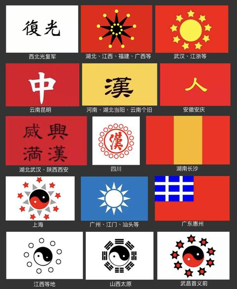
   - <a href="https://www.zhihu.com/people/meng-qian-22">蒙骞</a> (<small title="回复于 2025-6-11 14:41:3/广西"> ✉️:小小柯南</small>): ［捂脸］老秦人
   - <a href="https://www.zhihu.com/people/finance-sterling">Finance Sterling</a> (<small title="广西">2025-6-11 15:14:40</small>): 确实，那个时代是不存在民族主义的，大部分老百姓都是文盲，能吃饱饭对他们来说最重要。欧洲民族主义是到18-19世纪才产生，至于中国的民族主义思潮要从19世纪末才开始兴起。
   - <a href="https://www.zhihu.com/people/tang-shan-hai-52">净坛使者菩萨</a> (<small title="江苏">2025-6-11 16:23:31</small>): 那个时代文盲率百分之九十多，答主的演讲绝大多数人都听不懂。
   - <a href="https://www.zhihu.com/people/zhou-nan-72-23-94">周南</a> (<small title="江苏">2025-6-11 17:21:16</small>): 非典型山东人
   - <a href="https://www.zhihu.com/people/rhhzss">知乎用户rHhZss</a> (<small title="回复于 2025-6-11 19:53:36/北京"> ✉️:欣元魂痕</small>): 说得张勋的辫子军不是汉族人一样
   - <a href="https://www.zhihu.com/people/wu-xian-qian-neng-21">未飞未鸣</a> (<small title="广东">2025-6-12 20:25:49</small>): 宋朝是皇帝无能，不是百姓无能
   - <a href="https://www.zhihu.com/people/seanlin-30">歖斐斋</a> (<small title="回复于 2025-6-12 20:32:37/北京"> ✉️:欣元魂痕</small>): 你是不是真不知道，要不是袁世凯想当大总统，压着北洋军不往南继续打，北洋军分分钟就把革命军灭了，到底是谁屁滚尿流？
   - <a href="https://www.zhihu.com/people/yi-kong-jian-de-tan-suo-zhe">异空间的探索者</a> (<small title="回复于 2025-6-12 23:40:24/广东"> ✉️:欣元魂痕</small>): 倒也不至于说白搭，但确实效果不好，因为如果不是相对民主的国家，在封建主义制度下，政府对百姓实在太差了，很多底层百姓没有尊严，可不仅仅是因为金国人。大葱的老百姓饭都吃不饱，常年又遭受官府的欺压，怎么可能会有民族的尊严概念。有的话也只能说是少数人有。
   - <a href="https://www.zhihu.com/people/wo-yao-ling-qian">我要零钱0416</a> (<small title="回复于 2025-6-13 13:42:54/浙江"> ✉️:欣元魂痕</small>): 辛亥革命是建立在民主思想发展的基础上的［doge］
   - <a href="https://www.zhihu.com/people/chang-feng-34-50">西瓜</a> (<small title="回复于 2025-6-13 16:57:57/江苏"> ✉️:小小柯南</small>): 没有感染力
   - <a href="https://www.zhihu.com/people/lse2013">lse2013</a> (<small title="浙江">2025-6-13 21:22:55</small>): 宋朝尤其是南宋，显然是有民族国家的意识
   - <a href="https://www.zhihu.com/people/ken-ni-mu-bai-feng">肯尼·木白风</a> (<small title="广东">2025-6-14 11:12:31</small>): 你以为朱元璋是靠什么推翻元朝的
   - <a href="https://www.zhihu.com/people/df-17-6">DF-17</a> (<small title="江苏">2025-6-14 14:18:18</small>): 搁古代西欧都有用，别谈国内了［惊喜］
   - <a href="https://www.zhihu.com/people/yi-zhi-xing-37">翼之星</a> (<small title="福建">2025-6-14 17:24:34</small>): 这套词肯定不行，但阿道夫难道不会换词吗［惊喜］
   - <a href="https://www.zhihu.com/people/yang-zheng-65-6-98">Safari</a> (<small title="回复于 2025-6-14 19:19:50/山东"> ✉️:欣元魂痕</small>): 民族主义是资本主义的派生品，民族主义的自发演变会产生源于原住民的民主和选举，会歌颂英雄，会诞生史诗和自由艺术。因而某些靠不断解构和重组来组建社会的主义者视民族主义为洪水猛兽、异端苗头。
 
别忘了，他们一直害怕诗歌，害怕坟墓的鲜花、害怕老人的回忆，害怕爱情，害怕自由……
   - <a href="https://www.zhihu.com/people/lordmegatron">欣元魂痕</a> (<small title="回复于 2025-6-14 19:25:19/广东"> ✉️:歖斐斋</small>): 黄孝会战最精锐的六镇都拼上了，最后谁屁滚尿流？这可是正面硬碰硬［害羞］
   - <a href="https://www.zhihu.com/people/lou-wei-40-62">楼o楼o</a> (<small title="新疆">2025-6-14 20:38:31</small>): 驱除鞑虏恢复中华怎么就有用呢？
   - <a href="https://www.zhihu.com/people/zang-yu-li-ming">葬于黎明</a> (<small title="陕西">2025-6-21 9:8:8</small>): “王侯将相宁有种乎？”喊完不揭竿而起的是这个👍🏻
   - <a href="https://www.zhihu.com/people/qian-da-zhuang-80">钱大壮</a> (<small title="上海">2025-9-23 18:25:6</small>): 当年多少起义的［飙泪笑］，没有这个都有那么多人起义，有的话。。。
   - <a href="https://www.zhihu.com/people/you-jiang-75-99">谁是小烧达子</a> (<small title="广东">2025-9-25 10:36:45</small>): 如何评价朱元璋的驱除鞑虏，恢复中华的旗号得到响应
   - <a href="https://www.zhihu.com/people/liu-huang-67-4">刘皇</a> (<small title="浙江">2025-9-25 14:52:14</small>): 针对北方流亡士人和武夫管用
   - <a href="https://www.zhihu.com/people/kang-peng-14">浔阳楼</a> (<small title="回复于 2025-9-26 21:2:42/浙江"> ✉️:欣元魂痕</small>): 辛亥革命也是袁世凯放的，南军和北洋根本就不是一档次的［捂脸］，
   - <a href="https://www.zhihu.com/people/lordmegatron">欣元魂痕</a> (<small title="回复于 2025-9-26 23:21:57/广东"> ✉️:浔阳楼</small>): 黄孝会战是谁把最精锐的六镇都压上去了，还被正面揍得屁滚尿流呀？我先猜，肯定不是牢袁［为难］
   - <a href="https://www.zhihu.com/people/kang-peng-14">浔阳楼</a> (<small title="回复于 2025-9-26 23:33:14/浙江"> ✉️:欣元魂痕</small>): 一场局部战役胜利没有意义的，要是真能打得过，先总理就不会让大头窃取革命果实了
   - <a href="https://www.zhihu.com/people/15-19-84-87-61">浮云</a> (<small title="甘肃">2025-12-14 22:8:18</small>): 非常有效，中国古代是有民族主义的，要不然就不会出现崖山跳海了
   - <a href="https://www.zhihu.com/people/azqz-16">AZQZ</a> (<small title="回复于 2025-12-17 12:7:14/甘肃"> ✉️:韩枫</small>): 古代也没有报纸啊
   - <a href="https://www.zhihu.com/people/22-7-18-18">核桃树上大菠萝</a> (<small title="广东">2025-12-18 10:43:27</small>): 这位朋友还是受教材荼毒太过，以为汉族民族主义近代才开始呢［大笑］
   - <a href="https://www.zhihu.com/people/you-fu-ji-you-li-xiang-15">有腹肌有理想</a> (<small title="意大利">2025-12-18 18:22:30</small>): ［doge］南宋的大人们会先死
   - <a href="https://www.zhihu.com/people/du-huan-xu-72">四色年华</a> (<small title="山东">2025-12-18 23:56:11</small>): 还真不是，因为宋辽夏的长期对立，实际上宋朝是产生了民族主义的
   - <a href="https://www.zhihu.com/people/hong-mao-12-81">红帽</a> (<small title="回复于 2025-12-19 0:24:35/北京"> ✉️:欣元魂痕</small>): 口号只能招揽“有识之士”，因为这些人能将抽象的口号和概念迅速与现实场景联系起来。而发动群众需要结合他们的实际经历，切身体会（发生在身边的被地主剥削、被鞑虏欺凌的事实），采用更接地气的方式去号召。中山先生通过驱逐鞑虏，恢复中华、三民主义等简单、抽象的主义思想招揽来同道中人，需要再由他们去具体地影响和发动普罗大众。［doge］
   - <a href="https://www.zhihu.com/people/diablo-80-61">Diablo</a> (<small title="中国香港">2025-12-19 18:31:30</small>): 那你解释一下金宋交战时北方沦陷区层出不穷的义军怎么来的？你们不敢承认罢了。你们害怕民族主义，你们害怕公平正义！
   - <a href="https://www.zhihu.com/people/qian-feng-zheng-yang">千锋正阳</a> (<small title="四川">2025-12-20 10:23:37</small>): 总有人以西方的理论为天理，不管是否适合自己。汉民族之所以能在古典时期遥遥领先，其中一个原因就是率先觉醒的民族性，当然也没有近代那么彻底。但你要说古代老百姓不在乎自己是不是汉族，那也太逗了。
   - <a href="https://www.zhihu.com/people/xi-pi-xi-ni">西皮悉尼</a> (<small title="回复于 2026-1-1 12:36:25/广东"> ✉️:欣元魂痕</small>): 能把北洋打的屁滚尿流为啥袁世凯当总统［大笑］，你可以说孙哥心善，那黄兴呢，这么多革命党元老怎么都心善，民族主义就是起源于法国大革命的产物，19世纪中后期传入中国，太平军和义和团的民族主义风气也不弱，怎么就没推翻清朝呢？根本上是因为革命党已经是资产阶级政党了，人家推翻清朝不是靠演讲，而是和地方实力派官员，地主，企业主一起联合，你可以去查，辛亥革命期间各个地方咨议局，没有他们的支持，革命党怎么发表通电［感谢］，［大笑］把他们联合在一起的当然有民族主义，但因此说这只是民族GM，有点太贬低辛亥革命了
   - <a href="https://www.zhihu.com/people/ying-huo-12-30">萤火</a> (<small title="陕西">2026-1-2 15:22:51</small>): 胡无人汉道昌！
   - <a href="https://www.zhihu.com/people/gghh-57-10">gghh</a> (<small title="广东">2026-1-9 15:14:23</small>): 啊，我国是最早形成民族概念的地区 ，战国后期就已形成！ 这话是在宋肯定有用啊！这个宋是指的天下 中华中国的概念，老百姓2000年前就认这个的
   - <a href="https://www.zhihu.com/people/a-dao-74-74">啊刀</a> (<small title="上海">2026-1-14 15:50:13</small>): 白搭？那古代农民起义怎么来的？［大笑］
   - <a href="https://www.zhihu.com/people/81-10-49-91-52">漂移走位</a> (<small title="回复于 2026-1-16 11:42:9/辽宁"> ✉️:欣元魂痕</small>): 一个要黄铺子了的满清皇室，和手握重权的汉族大臣，没有辛亥革命皇室也该退了
   - <a href="https://www.zhihu.com/people/lordmegatron">欣元魂痕</a> (<small title="回复于 2026-1-19 18:50:25/广东"> ✉️:漂移走位</small>): 想多了，牢袁在北洋精锐溃败之前可是毫不犹豫武力让山东取消独立的
   - <a href="https://www.zhihu.com/people/wang-yi-fei-54-67">Quintus</a> (<small title="北京">2026-1-24 18:44:59</small>): 华夷之辨自古有之，民族国家起源于近代西方论大体上是一种西方中心主义的过拟合。当然你尽可以把民族国家定义得只包括现代国家，但这不是理解历史的方式。
   - <a href="https://www.zhihu.com/people/fei-365">快剑阿飞</a> (<small title="内蒙古">2026-8-13 20:22:59</small>): 不一定，看受众是谁，如果是北方来的流民，那么很有效。
3. <a href="https://www.zhihu.com/people/minike-shui-chong">Mini瞌睡虫</a> (<small title="山东">2024-8-30 17:12:38</small>): 说这个话之前，还要看希特勒在位期间干了什么［捂脸］他让德国从面包五十万到家家户户吃饱休假。  
 
一个这样的领导，鼓动你的时候，你怎么想？［吃瓜］［吃瓜］［吃瓜］
   - <a href="https://www.zhihu.com/people/li-yong-hang-28">李永航</a> (<small title="广东">2024-8-31 9:39:36</small>): 非常有理。
   - <a href="https://www.zhihu.com/people/qing-cheng-zang-tian">吃瓜带皮</a> (<small title="陕西">2024-9-1 9:2:6</small>): 要是敢卖我五十万马克的面包，要是再出现一个洗头佬这样的人物，我第一个加入十三太保，枪栓拉的谁都快，为他效死命［捂脸］
   - <a href="https://www.zhihu.com/people/zi-zai-chuan-shang-yue-92-39">子在川上曰</a> (<small title="浙江">2024-9-1 11:16:28</small>): 怎么想？想都不用想，你就说怎么干就完了
   - <a href="https://www.zhihu.com/people/shenli-benren-1982">沈理</a> (<small title="上海">2024-9-1 18:31:40</small>): 假的，1930年银行协议和德企海外上市，德国币值就开始稳定了，农业生产也逐步有序，希特勒上台赶上了好时候，经济腾飞、政治稳定，德国刚刚走出大萧条的泥坑。
   - <a href="https://www.zhihu.com/people/minike-shui-chong">Mini瞌睡虫</a> (<small title="回复于 2024-9-1 18:42:1/山东"> ✉️:沈理</small>): 哥们儿，德国纳粹是怎么起势的？  
 
举债进行国内基建，军工拉动经济，伴随英法绥靖。  
 
你这说的好像纳粹那时候啥也没干躺着赢了似的［吃瓜］［吃瓜］［吃瓜］
   - <a href="https://www.zhihu.com/people/shenli-benren-1982">沈理</a> (<small title="回复于 2024-9-3 9:54:11/上海"> ✉️:Mini瞌睡虫</small>): 因为后来国际股市崩了，英法又逼债德国，希特勒突然不想外交胜利了，这时候苏联又对东欧实行了东方政策，所以希特勒国民经济军事化，英美法开始祸水东引加绥靖，接着就是慕尼黑协定了，后来就是闪击战了
   - <a href="https://www.zhihu.com/people/minike-shui-chong">Mini瞌睡虫</a> (<small title="回复于 2024-9-3 11:19:58/山东"> ✉️:沈理</small>): 本质上是不是纳粹用军工和基建让国民吃上饭了？  
 
或者说，纳粹上一任政府为什么被推下去？［吃瓜］［吃瓜］［吃瓜］
   - <a href="https://www.zhihu.com/people/hai-shui-yu-chang-14">海水浴场第三个号</a> (<small title="回复于 2024-9-4 11:32:53/山东"> ✉️:Mini瞌睡虫</small>): 不是 纳粹的经济是放中层血买梅福卷买起来的
 
最后闪击波兰也是因为梅福卷实在卖不动了 卖新还旧行不通了
 
不管是抄犹太人的家 弄死残疾人 还是怎么搞 德国政府和银行几个月内就得破产了
 
只能通过战争使政府免于还债才行
   - <a href="https://www.zhihu.com/people/chen-bin-2-29">陈某某</a> (<small title="浙江">2024-9-4 18:47:40</small>): 如果是撸小贷买的面包呢？希特勒就靠借款
   - <a href="https://www.zhihu.com/people/minike-shui-chong">Mini瞌睡虫</a> (<small title="回复于 2024-9-4 21:51:46/山东"> ✉️:陈某某</small>): 我不都说了，举债搞么
   - <a href="https://www.zhihu.com/people/the-ring-23">Ice Dragon</a> (<small title="山西">2024-9-7 23:1:6</small>): 当然是想想参陆军还是参空军
   - <a href="https://www.zhihu.com/people/huang-xing-89-32">Huang Steven</a> (<small title="回复于 2024-9-8 13:7:18/辽宁"> ✉️:Ice Dragon</small>): 我还是想念戈大帅［惊喜］
   - <a href="https://www.zhihu.com/people/9-60-20-26">知乎用户</a> (<small title="回复于 2024-9-11 1:42:27/江苏"> ✉️:陈某某</small>): 下周饿死和下个月被讨债的捅死，正常人选哪个［惊喜］
   - <a href="https://www.zhihu.com/people/zheng-yi-36-25">郑翼</a> (<small title="陕西">2024-9-16 13:26:19</small>): 举个很简单的例子。本来你家很穷连馒头咸菜都吃不起。有一天你突然一拍桌子，“全家听我的，保证过好日子“然后把房子抵押了，车卖了，亲戚借遍，能撸的网贷都都撸了，信用卡都刷爆，找黑社会借一堆高利贷。你是顿顿吃上肉了，是不是说明你很有本事？可最后黑白两道债主找上门怎么办？  
 
所以这些钱你没全挥霍，还买了刀枪剑戟斧钺钩叉。心想等债主上门了带着全家老小一起拼了。对反社会人格，二杆子来说可能是人生最高光时刻。可家里8岁的孩子到80岁父母怎么办？
   - <a href="https://www.zhihu.com/people/1-91-73-22">深蓝与赤红</a> (<small title="回复于 2025-1-26 17:34:13/北京"> ✉️:Mini瞌睡虫</small>): 最后还不起怎么办，开军队干掉债主就是来［飙泪笑］
   - <a href="https://www.zhihu.com/people/yuppie-74-14">城北徐公</a> (<small title="辽宁">2025-6-7 13:1:14</small>): 是啊，只有架起锅子煮白米，没有架起锅子煮道理啊
   - <a href="https://www.zhihu.com/people/ji-jing-92-23">寂静</a> (<small title="安徽">2025-6-9 2:38:55</small>): 所以我买车选择大众
   - <a href="https://www.zhihu.com/people/xiao-qiang-97-55">duang一下</a> (<small title="中国">2025-6-10 21:38:14</small>): 面包五十万这个到底哪里来的？有资料出处嘛？
   - <a href="https://www.zhihu.com/people/han-zhu-65-34">悍猪</a> (<small title="回复于 2025-6-11 17:13:54/山东"> ✉️:沈理</small>): 甭管真假，你说赶上好时候是对的，普通大众可没那么清醒睿智，他们只看到表面就够了
   - <a href="https://www.zhihu.com/people/han-zhu-65-34">悍猪</a> (<small title="山东">2025-6-11 17:17:3</small>): 那可真是以死效命了，赵构让我顿顿吃上窝窝头都行，就别说大白馒头了
   - <a href="https://www.zhihu.com/people/bugzhi-zao-zhe-27">BUG制造者</a> (<small title="回复于 2025-6-13 16:39:24/山东"> ✉️:郑翼</small>): 很遗憾，你这个例子从头到脚不成立：首先，你能穷得馒头咸菜都吃不起，而不是个别几天吃不起，那么你大概率没车没房，因为即便是拉东西跑活的五菱“发财车”也得几千到三两万才能拿下一辆，有这个钱你是在大城市可能吃不上热乎的，但是在广大农村这是一笔能过好几年甚至十数年的巨款
 
而房子就更是离谱了，一般你能穷到这个地步，那房子大概率也是自己和亲戚搭的，这种小平房加上圈的门口院子好说歹说能买上面一辆发财车就不容易了，这种房值钱的的是跟前和后院的那些养鸡养鸭或者种点什么的地，根本不是你想的那种十几万最多够个首付的那种商品房
 
这样情况的人，你觉得在银行的衡量体系里你能薅到多少羊毛？以及你连馒头和榨菜都吃不起的做派能让亲戚借你几个子儿？
 
至于黑涩会高丽袋……你只是为了吃饱饭，你作为一个平民老百姓，混到这一茬那肯定是先找政府登记特困，什么好日子不敢奢求，但吃饭穿暖是肯定有的
 
  
 
还有你说的省下钱买刀枪剑戟斧钺钩叉的事儿，你以为没发生过？七八年前一堆小村子集体薅小贷，结果催债人员被热情接待最后不得不放弃甚至反而是公司破产的海量案例你忘了？这确实是反例不假，但同时也说明当你的武器就是比对面精良，战斗人员就是比对面多且对方也不怎么占理的情况下，你就是可以这样非法地获得一般等价物，这反而是更适合当时德国宝宝的方案：你是真的饭也吃不上了，住的地方也都要没合法性了，也没有可以依靠的组织，同时一堆邻居还要抓着你爸爸当时被迫背下的天价债务让你偿还，你还能想多少其他有的没的？更不用说你能在这种情况下贷到足够让国家成为工业化强国的数额，那反而说明这人太屌了好吧？
 
你究竟是在反二战德国还是在暗戳戳地捧他臭脚？
 
  
 
德国的情况就不是一个正常秩序下两伙遵纪守法的好好先生之间的争论的场景，你拿现在的文明世界来错位、错误地衡量本就是不合理的
   - <a href="https://www.zhihu.com/people/15-69-93-23-83">伙伴骑兵</a> (<small title="黑龙江">2025-6-13 19:37:40</small>): 想什么想，两横一竖就是干，两点一力就是办
   - <a href="https://www.zhihu.com/people/83-24-86-46">欢乐马</a> (<small title="回复于 2025-6-15 10:39:37/天津"> ✉️:郑翼</small>): 我觉得比等着饿死强。你觉得呢？
   - <a href="https://www.zhihu.com/people/wu-zi-yi-19-17">ETA5</a> (<small title="回复于 2025-6-19 7:5:9/浙江"> ✉️:郑翼</small>): 好办啊，把所有债主全干了就行了，说到底的问题还是没打赢嘛
   - <a href="https://www.zhihu.com/people/xing-jin-tian-ya-jing-mo-shan-shui">丘山</a> (<small title="回复于 2025-7-10 12:30:41/内蒙古"> ✉️:吃瓜带皮</small>): 时间不对，马克疯狂贬值是一战后德国为了快速偿还战争赔款，疯狂印钞  
 
小胡子上台是1931年，正好赶上好时候，英国为了抑制法国扶植德国，还从美国借来大量资金，只能说天时地利吧
   - <a href="https://www.zhihu.com/people/diu-ying-zi-de-ren-51">转基因超级小宁</a> (<small title="回复于 2025-9-22 11:45:4/江苏"> ✉️:丘山</small>): 29年德美的大萧条，确实是好时候
   - <a href="https://www.zhihu.com/people/xing-jin-tian-ya-jing-mo-shan-shui">丘山</a> (<small title="回复于 2025-9-22 13:32:0/内蒙古"> ✉️:转基因超级小宁</small>): 那可不，正好民众因为经济萧条对魏玛政府不信任，英国需要削弱法国，希特勒上台手底下沙赫特博士会搞经济
   - <a href="https://www.zhihu.com/people/deux-9-7">cosmiccn</a> (<small title="回复于 2025-9-25 18:12:58/上海"> ✉️:郑翼</small>): 这问题问的~~任何一个快要饿死的家庭都会这么做~~你们是不是觉得当时不这么做也能过下去？
   - <a href="https://www.zhihu.com/people/lao-wan-tong-99-95-14">羔羊</a> (<small title="回复于 2025-11-16 2:28:34/重庆"> ✉️:深蓝与赤红</small>): 不是因为还债，是和犹太人深仇大恨，必须解决，发起二战，还没有结束，三战继续！
   - <a href="https://www.zhihu.com/people/60-35-63-87-4">白歌未</a> (<small title="河南">2025-12-18 19:10:52</small>): 大宋在民生方面做的也不错，很多人都不知道徽宗一直在搞惠民政策，什么养老院，济贫院之类的。哪怕后来金人占据北方，汉人百姓仍旧期望王师北伐，南宋时期民心仍旧可用。
 
但南宋士大夫豪强群体是不愿意北伐的，因为北伐势必造成新的利益分配，岳飞北伐期间把打下来的土地分给自己的兵，这种行为直接触犯了士大夫的禁忌，所以那么多北伐将军，为什么只杀你岳飞，这就是原因。
   - <a href="https://www.zhihu.com/people/augenstern-71-59">Pigeon</a> (<small title="云南">2025-12-19 9:5:40</small>): 你也不想想他是怎么让德国从面包五十万到家家户户吃饱休假的
   - <a href="https://www.zhihu.com/people/reseted1510231326209">年轻态老腊肉</a> (<small title="湖南">2025-12-19 13:57:24</small>): 这其实是错误的，赔款早就被搁置得差不多了，还有美国的输血，希特勒上台时经济已经复苏到比德二巅峰还强了，他在这个时间点其实是摘了果实并且用这些果实来穷兵黩武。
   - <a href="https://www.zhihu.com/people/jiu-sha-han-bing-qi-bai-yin">酒杀寒冰弃白银</a> (<small title="回复于 2025-12-23 14:6:9/山东"> ✉️:陈某某</small>): 都要饿死了还管小贷？真够幽默的，那你别吃呗
   - <a href="https://www.zhihu.com/people/jiu-sha-han-bing-qi-bai-yin">酒杀寒冰弃白银</a> (<small title="回复于 2025-12-23 14:7:45/山东"> ✉️:郑翼</small>): 真好笑，实际上卖房卖车的是魏玛政府（鲁尔工业区因为还不上赔款被法国占领），而且卖了还吃不上饭［尴尬］
   - <a href="https://www.zhihu.com/people/jiu-sha-han-bing-qi-bai-yin">酒杀寒冰弃白银</a> (<small title="回复于 2025-12-23 14:9:46/山东"> ✉️:郑翼</small>): 另外德国人撸的振兴工业贷款很多是米国人的，你问我还不上来催债的怎么办？
 
给全家人发枪准备拼命呗，不然呢？
   - <a href="https://www.zhihu.com/people/bei-wei-qi">曙光Spirit</a> (<small title="广西">2026-1-14 16:41:40</small>): 面包不会凭空出现。希特勒三板斧，1初期借英美高利贷（为防苏联英美有意让德国扩军），2印钱+吸收新技术拉动国内投资建设（战略物资+军工），3“斗地主”清洗欧洲犹太资本，占领周边小国，给国内民众刷物资，彻底法西斯化。最后一步：开战，以战争维系法西斯。
   - <a href="https://www.zhihu.com/people/masaka-panda">居然熊猫</a> (<small title="陕西">2026-4-29 13:36:21</small>): 骗你的，他上台之前面包甚至不止五十万
4. <a href="https://www.zhihu.com/people/91-25-96-80-70">momo</a> (<small title="河南">2024-8-30 16:48:43</small>): 拿着这篇稿子穿回两宋之交，怕是连半个红袄军都拉不起，张角画符，裹黄巾从者百万，闯王不纳粮，流民纷纷来投。  
 
  
 
希特勒的演讲下面的受众是一个近现代民族工业国里受过教育的工人军人商人学人，其实希特勒也罢特朗普也罢，认真分析就不难明白，搞清楚你的主要对象喜欢听什么，需要听什么，比单纯的演讲技术重要的多。  
 
  
 
如金教授司马先生艾大师张赢赢还有台湾那一票屏幕键政高手，哪一个不是舌战高手，但是一旦话不如你意，不是你想听的，他越会说，说的越多，你越恶心。
   - <a href="https://www.zhihu.com/people/pinelliaternata">TravailleursNuit</a> (<small title="山东">2024-8-30 21:44:0</small>): 很简单，这篇文不是写给宋朝人看的，而是写给现代人看的。毕竟答主不需要宋朝人跟着他去打仗，但是却非常需要现代人在贵知上给他点赞。［飙泪笑］
   - <a href="https://www.zhihu.com/people/yang-dan-dong-89">羊闲声</a> (<small title="上海">2024-8-31 9:16:33</small>): 两宋之交，这片土地上的主要矛盾就是宋金之间的民族矛盾。你讲的黄巾、闯王是王朝末年国内阶级矛盾激化的结果。两者的政治背景不一样啊
   - <a href="https://www.zhihu.com/people/lang-qin-83">langqin</a> (<small title="回复于 2024-8-31 9:29:44/江苏"> ✉️:TravailleursNuit</small>): 流量啊流量，你就是世间一切的神［大笑］
   - <a href="https://www.zhihu.com/people/crew-14">Crew</a> (<small title="上海">2024-8-31 11:48:7</small>): 你啊，人家只是借这个架空历史，让你体会一下一战结束后德国的动员。
   - <a href="https://www.zhihu.com/people/wu-ben-zhi-mu-49">无本之木</a> (<small title="广西">2024-8-31 17:27:8</small>): 你以为的，只是你以为的。  
 
秦元的保甲兵，王健的奇兵，刘孝竭的北斗神兵，他们连这话都没听就自发抗金。  
 
开封府城墙破了，军队跑路，何栗就能带着30万开封府民众打巷战。不是宋钦宗那个废物，金人能不能占领开封府还不一定。
   - <a href="https://www.zhihu.com/people/suibiana-84">suibiana</a> (<small title="江苏">2024-8-31 19:9:25</small>): 是如此
   - <a href="https://www.zhihu.com/people/yan-ming-li-ge">雁鸣骊歌</a> (<small title="广东">2024-8-31 20:25:54</small>): 重要的不是故事讲述的年代，而是讲故事的年代
   - <a href="https://www.zhihu.com/people/si-chuan-lao-gao-15">四川老高</a> (<small title="四川">2024-8-31 22:23:36</small>): 你以为汉唐宋明是清朝那种识字率，那种愚民政策吗？就卧虎地秦简居延汉简证实，当时教育程度已经超过清朝了
   - <a href="https://www.zhihu.com/people/ji-jing-de-tian-kong-56">寂静的天空</a> (<small title="新疆">2024-9-1 15:6:41</small>): 这里面最操蛋的就是闯王不纳粮。不纳粮就没有自给自足的财政体系，一切只能靠抢，说穿了不管聚集了多少部队掌握多大地盘本质上还是土匪，眼光格局有史以来最LOW没有之一。连黄巢都不如。所以看出这口号必败没悬念。
   - <a href="https://www.zhihu.com/people/137nwnha">137nwnha</a> (<small title="山东">2024-9-2 10:27:8</small>): 希特勒的演讲也不是在公元十二世纪讲的呀？
   - <a href="https://www.zhihu.com/people/chang-ye-4-69">云拥</a> (<small title="河南">2024-9-2 10:48:18</small>): 闻道中原遗老，常南望、翠葆霓旌。使行人到此，忠愤气填膺。有泪如倾。  
 
  
 
你凭什么以为以前的百姓就体会不到？
   - <a href="https://www.zhihu.com/people/57-6-58-15">最插里不浪的</a> (<small title="安徽">2024-9-2 10:51:56</small>): 宋代文化水平也不低，而且城市化水平很高，临安城里也有太学生，受过一定教育的商人雇工小市民，再加上因靖康而产生庞大的难民群体，他们只需要一个领袖，可惜，没有。
   - <a href="https://www.zhihu.com/people/zhi-hu-yong-hu-35301">人类</a> (<small title="浙江">2024-9-3 16:1:1</small>): 给士大夫们看
   - <a href="https://www.zhihu.com/people/ceng-fa-cai">曾发财</a> (<small title="回复于 2024-9-4 10:42:22/湖南"> ✉️:羊闲声</small>): 真的矛盾吗？燕云又不是女真人来了才丢的，还因为女真人来了之后短暂拿回来过。辽国析津府的汉人世家大族可不会觉得要为赵家人卖命。更不要说南渡以后，河北汉人在金人铁蹄下呻吟，也不影响临安府的歌舞升平。河北山东的义军此起彼伏，影响江浙路和福建路出生的南人士大夫吗？
   - <a href="https://www.zhihu.com/people/li-yang-11-3">李洋</a> (<small title="北京">2024-9-4 11:30:11</small>): 搞个人崇拜和搞宗教的套路是一致的，希特勒也不是一天就成元首的
   - <a href="https://www.zhihu.com/people/zhao-shuai-jiao-9">兜兜不加奶盖</a> (<small title="回复于 2024-9-4 14:35:31/吉林"> ✉️:羊闲声</small>): 如果金军南下能保持一定军纪，尊重华夏的文化，那普通百姓的反抗也不会多激烈
   - <a href="https://www.zhihu.com/people/yang-dan-dong-89">羊闲声</a> (<small title="回复于 2024-9-5 3:57:36/上海"> ✉️:曾发财</small>): 今天绝大多数中国人的态度是随波逐流和无动于衷。 我们的官员伪善、贪婪、腐化； 我们的人民一盘散沙，对国家的利益漠不关心； 我们的青年堕落，不负责任； 我们的成年人有恶习，愚昧无知。 富人穷奢极欲，而穷人则地位低下，肮脏，在黑暗中摸索。 ----蒋中正
   - <a href="https://www.zhihu.com/people/ceng-fa-cai">曾发财</a> (<small title="回复于 2024-9-5 6:40:26/湖南"> ✉️:羊闲声</small>): ［惊喜］他蒋光头就是我说的江南士大夫。嘴巴里说着百姓愚昧，结果呢？东北都被日本人日穿了，他还想着打内战。不就和两宋之交那群士大夫一模一样吗？虚外守中是我大宋祖宗之法，不可不尝。
   - <a href="https://www.zhihu.com/people/miusi">普罗米修斯</a> (<small title="江西">2024-9-6 17:44:40</small>): 不如张角得口号和太平天国得口号。简单，容易记，容易理解，直达目的。有钱有女人。
 
这种面对得是具有一定知识和逻辑，为了理想和尊严而战得人。
   - <a href="https://www.zhihu.com/people/didadi-50">didadi</a> (<small title="回复于 2024-9-10 13:44:13/山东"> ✉️:羊闲声</small>): 南宋老百姓在乎个球的宋金矛盾，金军长江都没过过，老百姓不恨压迫他们的地主，去恨见都没见过的女真人？不就是统治阶层士大夫代表人民说恨
   - <a href="https://www.zhihu.com/people/15016744952">正正的负</a> (<small title="陕西">2024-9-10 22:28:47</small>): 红袄军是什么拉起来的？怎么不说？
   - <a href="https://www.zhihu.com/people/li-li-11-31-8">李力</a> (<small title="江西">2024-10-11 9:56:2</small>): 一样可以拉起来很多人！在希特勒之前，真没几个人能说出这样的话！就像你说的，听演讲的人素质不够！但是能演讲的人能力就够了吗？素质是可以培养的！但能力很多事故是天生的！
   - <a href="https://www.zhihu.com/people/qqming-zi-hen-chang-hen-zhong-yao">我欲乘风归去</a> (<small title="回复于 2024-12-7 23:45:29/江西"> ✉️:TravailleursNuit</small>): 不然呢？写的好点个赞怎么了？你评论难道就可说是点赞对你很重要？别搞得一副自己很高高在上指点江山的样子［捂嘴］［捂嘴］［捂嘴］
   - <a href="https://www.zhihu.com/people/codeflame">Codeflame</a> (<small title="广东">2025-3-8 3:40:5</small>): 你错了，这话放在大清估计拉不起多少人，但是在别的朝代不一样。
 
大清的识字率只有4%，百姓都被养成了愚昧的傻子，但是当有人说反清复明的时候依然响应者不绝。
 
别的朝代识字率可比大清高多了。
 
尤其是宋明，高识字率形成了稳定的市民阶层，再往下发展离近现代国家不远。
   - <a href="https://www.zhihu.com/people/wu-ben-zhi-mu-49">无本之木</a> (<small title="回复于 2025-3-15 3:36:46/广西"> ✉️:didadi</small>): 要搞历史虚无主义是吗？  
 
秦元的保甲兵，王健的奇兵，刘孝竭的北斗神兵，他们连这话都没听就自发抗金。你是不是要说他们不是老百姓，是既得利益者?  
 
开封府城墙破了，军队跑路，何栗就能带着30万开封府民众打巷战。这三十万民众都是士大夫对不对?  
 
送给你的——↓
   - <a href="https://www.zhihu.com/people/gvvj-37">gvvj</a> (<small title="回复于 2025-6-7 20:30:31/四川"> ✉️:TravailleursNuit</small>): 明白人
   - <a href="https://www.zhihu.com/people/yuan-shi-kai-2-36">延中国生人之气</a> (<small title="山东">2025-6-9 20:51:3</small>): 如果你是个生活在两宋之交的宋人，那你大概率会吃这一套，因为那个年代每个宋人几乎都受到了金人的压迫。
   - <a href="https://www.zhihu.com/people/yuan-shi-kai-2-36">延中国生人之气</a> (<small title="回复于 2025-6-9 20:53:18/山东"> ✉️:普罗米修斯</small>): 事实是最简单的民族意识连入关的八旗集团这种文化水平的人都具备，古代没有民族意识是不可能的，区分敌我党同伐异是智人的本能。
   - <a href="https://www.zhihu.com/people/yuan-shi-kai-2-36">延中国生人之气</a> (<small title="回复于 2025-6-9 20:54:7/山东"> ✉️:didadi</small>): 宋朝沦陷区的老百姓被抢土地抢女人还被欺辱，凭什么不能恨金人？
   - <a href="https://www.zhihu.com/people/ye-wei-yang-83-74">头像老婆改的</a> (<small title="河南">2025-6-10 17:16:46</small>): 你把唐朝的归义军忘了？
   - <a href="https://www.zhihu.com/people/glory-6-58">version</a> (<small title="回复于 2025-6-12 15:53:27/北京"> ✉️:TravailleursNuit</small>): 真的
   - <a href="https://www.zhihu.com/people/yang-dan-qing-42-37">我很凶</a> (<small title="广东">2025-6-13 13:59:27</small>): 只会生搬硬套，那什么方法也能玩扑街。
   - <a href="https://www.zhihu.com/people/tao-zhi-yao-yao-6-80-79">冷泠ling</a> (<small title="河北">2025-6-14 11:26:1</small>): 那你告诉我为什么宗帅能够来起几十万义军夺回汴梁，为什么靖康耻十几年后曾经北宋的土地上任由义军在抗金，岳飞北伐时沦陷地各个义军相应
   - <a href="https://www.zhihu.com/people/xie-ye-43-99">叶也</a> (<small title="江苏">2025-9-21 2:25:12</small>): 这篇稿子配合的是大范围扩张，外加百姓吃饱饭［酷］你觉得稿子还重要吗
   - <a href="https://www.zhihu.com/people/wacn-68">wacn</a> (<small title="山东">2025-10-23 16:5:32</small>): 南北朝就有“霜露所均，不育异异类。姬汉旧邦，无取za种。”这种词了，到了清朝，“驱除鞑虏，恢复中华”也能拉起来一批人，怎么能说宋时就没有民族主义呢？
5. <a href="https://www.zhihu.com/people/tao-zhi-xin-94">远去的雾</a> (<small title="上海">2024-6-9 3:1:51</small>): 赵构也太…太出戏了［大哭］
   - <a href="https://www.zhihu.com/people/qing-cheng-zang-tian">吃瓜带皮</a> (<small title="陕西">2024-9-1 8:59:24</small>): 太平天国应该跟希特勒所处的情形最相似［思考］
   - <a href="https://www.zhihu.com/people/li-jia-cheng-30-19-25">spike</a> (<small title="四川">2024-9-1 11:7:49</small>): 确实，前面给我看热了，结果看到赵构俩字直接乐出了声［惊喜］
   - <a href="https://www.zhihu.com/people/zhao-zhen-hao-61">蒜蓉粉丝烤生蚝</a> (<small title="河南">2024-9-2 9:21:39</small>): 这个答案是“假如希特勒穿越成了赵构”的
   - <a href="https://www.zhihu.com/people/xia-hou-yi-32">夏侯仪</a> (<small title="湖北">2024-9-2 9:57:9</small>): 看过绍宋的人表示根本没有这一段
   - <a href="https://www.zhihu.com/people/po-ming-dao-ren">破冥道人</a> (<small title="浙江">2024-9-4 13:14:34</small>): 绍宋那个一直都是自称沧州赵玖
   - <a href="https://www.zhihu.com/people/wang-shao-teng-16">SSTT2486</a> (<small title="江苏">2024-9-4 17:42:56</small>): 看见赵构笑喷了［飙泪笑］
   - <a href="https://www.zhihu.com/people/feng-yun-fei-yang">风云飞扬</a> (<small title="云南">2024-9-8 16:22:2</small>): 赵特勒更恰当一点。
   - <a href="https://www.zhihu.com/people/shou-hou-luo">憨憨弟中弟</a> (<small title="四川">2024-9-9 0:9:0</small>): 本来我都看硬了，赵构俩字一出来我又软了［捂嘴］
   - <a href="https://www.zhihu.com/people/gwr-97-54">GWR</a> (<small title="回复于 2024-9-10 16:59:9/北京"> ✉️:蒜蓉粉丝烤生蚝</small>): 就说呢，这能是赵构？［大笑］
   - <a href="https://www.zhihu.com/people/unemo-51">unemo</a> (<small title="广东">2024-9-13 15:8:4</small>): 平行宇宙的赵构［doge］
   - <a href="https://www.zhihu.com/people/shi-hou-80">石猴</a> (<small title="北京">2025-6-8 18:51:18</small>): 前面给我看erect了，看到赵构俩字，马上ED。
   - <a href="https://www.zhihu.com/people/xiao-nan-gua-76-68">狼叔</a> (<small title="回复于 2025-6-12 23:2:20/浙江"> ✉️:蒜蓉粉丝烤生蚝</small>): 那就变成盐选了［酷］
   - <a href="https://www.zhihu.com/people/shuang-yu-de-yi-ban">厚德载物</a> (<small title="江西">2025-12-18 11:12:49</small>): 看多了绍宋就感觉玖哥出点什么幺蛾子都正常。反正都不是原来的赵玖
   - <a href="https://www.zhihu.com/people/14-76-14-60-49">山水之间</a> (<small title="山东">2025-12-20 17:16:26</small>): 换成刘备刘秀，李庚亨
   - <a href="https://www.zhihu.com/people/lang-wei-xian-56-74">Philli.N</a> (<small title="法国">2025-12-24 14:50:25</small>): 雀食
6. <a href="https://www.zhihu.com/people/frank_yuanyuan">三厂小白</a> (<small title="广东">2025-6-13 16:58:21</small>): 《谕天下雪耻复国诏》​​  
 
（绍兴十年 御笔亲拟）  
 
  
 
朕绍膺天命，泣血告于昊天：今立汉胄之疆，临安故壤！斯土浸透先民碧血，昭烈武侯遗像巍然在侧，此华夏万世之圭臬也！  
 
  
 
尔观今日之民，岂非泣血穹庐之下？靖康而后，皇宋威仪尽丧！金酋踞我汴梁，胡骑践我陵庙。尔曹欲效武侯仗剑北驱，抑或俯首为羯奴乎？  
 
  
 
或有泣曰：“陛下，臣但求畎亩炊饼！”善，生民诚重。然朕诏尔：更有重逾性命者，乃列祖之荣光！乃冠裳之尊严！  
 
  
 
但见幽云蔽于膻裘，汴梁悬虏帜一日，则华夏无颜立于天地！但见胡尘漫于禹甸，四夷嗤笑“南朝”之际，则九鼎蒙羞于重泉！  
 
  
 
吾族所求，非箪食豆羹，乃乾坤再造之机！此非哀恳可得，惟以甲胄为犁，以热血沃土！昔勾践卧薪终吞强吴，光武奋戈重开炎汉，今三军甲胄岂逊古人？  
 
  
 
彼辈但知抗议乞怜者，乃无脊之蠹！当使敌虏闻风丧胆，见玄甲而股战！朕见尔等血脉贲张，此乃岳侯沥血之忠，孟母断机之志！此血可凝乎？  
 
  
 
吾悬赤帜于行在：必雪靖康之耻，必悬完颜之首于艮岳！朕当亲秉旌钺，效武穆渡河之志！虽马革裹尸，含笑谒太庙，昂然告太祖曰：“臣构未辱汉旌！”  
 
  
 
此非私战，乃为衣冠礼乐而争！为子孙不辱“汉”字而争！为万世开太平而争！大宋军民其听朕言：高举炎黄之帜，光复旧疆，正在今日！
   - <a href="https://www.zhihu.com/people/yun-fei-hun">云飞魂</a> (<small title="安徽">2025-7-21 12:59:31</small>): 要是放在两年前，我给说一句牛逼！但现在只会认为是ai的作品
   - <a href="https://www.zhihu.com/people/angry-bugs">Angry Bugs</a> (<small title="回复于 2025-12-16 23:45:41/天津"> ✉️:云飞魂</small>): 两年前也有 AI 了，得是三年前
7. <a href="https://www.zhihu.com/people/lin-gang-64-11">木木先生</a> (<small title="上海">2024-8-9 13:22:51</small>): 词是好词，时代背景不对，那会儿听得懂的文化人只怕不爱听，一般老百姓又听不太懂。
   - <a href="https://www.zhihu.com/people/yue-guang-zhi-xia-17">月光之下</a> (<small title="河南">2024-8-30 18:40:13</small>): 听不懂的原因是不想听，你要是啥都不管在街头演讲那是没人听，有听的时间不如去干活挣下一顿的饭钱。
 
组织起来，操练一个月，这一个月管饱随便吃，然后大阅兵开始演讲。
 
老百姓只是文化水平低，不识字看不懂，他们不是没脑子。
   - <a href="https://www.zhihu.com/people/dian-ju-jiao-huang">电锯教皇</a> (<small title="回复于 2024-8-31 9:40:37/广东"> ✉️:月光之下</small>): 然而没受过基础教育，没有形成民族主义意识的古代人还真就理解不了这种话，他们为什么要为一个虚无缥缈的国家和民族，来付出鲜血加入到战争里？这不是皇帝老儿和官老爷的事情吗？和我们布衣有个毛线关系，回家搂婆娘去了，谁会听你这种话，除非你给出更实在的条件，例如打下金国城池，十天不封刀，钱粮女人随便抢什么的［惊喜］
   - <a href="https://www.zhihu.com/people/71-29-23-18-56">这是我第四个号</a> (<small title="回复于 2024-8-31 9:50:6/内蒙古"> ✉️:电锯教皇</small>): 其实就两句话：要么他们抢你，要么你抢他们
   - <a href="https://www.zhihu.com/people/qian-shui-ting-13-61">潜水艇</a> (<small title="天津">2024-8-31 12:50:27</small>): 每个时代说法不一样而已  
 
现在就是上不上餐桌  
 
这篇文章也不是给宋朝人看的
   - <a href="https://www.zhihu.com/people/ceng-yong-jian-75">曾永健</a> (<small title="回复于 2024-9-3 12:9:38/广东"> ✉️:月光之下</small>): 只要吸引到志同道合的人就可以。众口难调
   - <a href="https://www.zhihu.com/people/jemon-chan">Anson Chan</a> (<small title="广西">2024-9-4 12:42:0</small>): 有没有一种可能，他是说给你听的［惊喜］
   - <a href="https://www.zhihu.com/people/lao-mao-tui-shu">黑话十点半</a> (<small title="河北">2024-9-4 17:30:8</small>): 肯定雪亮啊，大明朝不给钱，大清朝给钱，还让抢钱抢女人，你看投降过去的士兵战斗力多强［吃瓜］
   - <a href="https://www.zhihu.com/people/Blurturtle">林嘉文</a> (<small title="回复于 2024-9-7 17:28:20/湖北"> ✉️:电锯教皇</small>): 至少三国时代的刘备碰到的百姓是能理解的，中国的王权概念做的很深入民心，不像欧洲那样纯乌合之众，多少英雄和皇帝起于微末，最终都能统一中国，就说明大众都认可同一个正道公理。  
 
只是多数时候，大家更愿意自保，生活在温饱线上，还没有被逼上绝路，就懒得造反。但他们从来都不是冷血傻瓜。
   - <a href="https://www.zhihu.com/people/li-mou-74-97">平淡如水</a> (<small title="回复于 2024-9-12 0:2:0/河北"> ✉️:电锯教皇</small>): 为什么你们非要觉得古代人没有闽租意识呢？
   - <a href="https://www.zhihu.com/people/codeflame">Codeflame</a> (<small title="广东">2025-3-8 3:41:15</small>): 别把清朝当普遍案例。
 
清朝识字率4%是清朝愚民政策。
 
但凡正统汉人王朝都不止这点识字率。
   - <a href="https://www.zhihu.com/people/lin-gang-64-11">木木先生</a> (<small title="回复于 2025-3-8 6:59:50/上海"> ✉️:Codeflame</small>): 识字率和这段话过于文绉绉没有关系，甚至说句不大尊重的话，把这段话讲给工地上年纪大些的农民工听，都未必能听得进去。
   - <a href="https://www.zhihu.com/people/codeflame">Codeflame</a> (<small title="回复于 2025-3-8 12:29:7/广东"> ✉️:木木先生</small>): 要是真的听不进去的话，抗战年代就不会有那么多人舍身报国了。
   - <a href="https://www.zhihu.com/people/lin-gang-64-11">木木先生</a> (<small title="回复于 2025-3-8 13:54:34/上海"> ✉️:Codeflame</small>): 你没明白我的意思吧，我是说这段文字本身过于书面不适合对当时的穷苦百姓讲，和抗战有什么关系。  
 
抗战时舍身报国的先烈是冲着这么佶屈聱牙的发言？演说家最基本的能力就是用受众能听懂的话来陈述自己观点好么。
   - <a href="https://www.zhihu.com/people/codeflame">Codeflame</a> (<small title="回复于 2025-3-8 14:32:2/广东"> ✉️:木木先生</small>): 如果只是这段文字书面与否的话，确实是这样，但你也要考虑这时翻译者水平的缘故。
 
但如果将这段文字内容不变，只是以更符合时代的语言说一遍的话，当时的百姓绝对是能接受的。
   - <a href="https://www.zhihu.com/people/lin-gang-64-11">木木先生</a> (<small title="回复于 2025-3-10 11:27:19/上海"> ✉️:Codeflame</small>): 翻译？这里面有翻译啥事儿？
   - <a href="https://www.zhihu.com/people/27-60-60-76">veiled</a> (<small title="福建">2025-4-11 13:23:9</small>): 你真的小瞧宋朝的基础教育了，宋朝识字的人数可以上到90%，是远超清朝的［捂脸］
   - <a href="https://www.zhihu.com/people/lin-gang-64-11">木木先生</a> (<small title="回复于 2025-4-11 13:53:52/上海"> ✉️:veiled</small>): 我们现在识字率也足够高，但文绉绉的话也不是每个人都愿意听。
   - <a href="https://www.zhihu.com/people/ji-wei-jiu-qian">鸡尾酒 浅</a> (<small title="江苏">2025-6-15 9:49:42</small>): 你得看希儿在这之前干了啥。大概相当于几年之间把一个国家从“岁大饥，人相食”变成了白米白面随便吃，隔三差五就能吃点肉打打牙祭（50万马克到每餐都有面包牛奶）。然后你跟你的百姓说，如果我们打打金国成功了，你们每个人都能得到一头牛还有很多猪羊，如果失败了，你们会回到“岁大饥，人相食”（希儿承诺几年内每家都会有一辆小汽车，当时德国财政也快崩溃了）。你看你下面老百姓干不干金国就是了。
   - <a href="https://www.zhihu.com/people/lin-gang-64-11">木木先生</a> (<small title="回复于 2025-6-15 11:47:25/上海"> ✉️:鸡尾酒 浅</small>): 你这话对，老百姓就能听懂了
8. <a href="https://www.zhihu.com/people/zheng-jing-75-81">芒狗</a> (<small title="湖北">2024-6-15 17:8:48</small>): 我热泪盈眶
   - <a href="https://www.zhihu.com/people/kong-shan-liu-yun-67">空山流云</a> (<small title="江苏">2025-6-10 20:12:26</small>): Vor uns liegt Dasong,  
 
in uns marschiert Dasong,  
 
und hinter uns kommt Dasong.  
 
  
 
在我们身前，大宋巍然屹立；  
 
在我们心中，大宋热血沸腾；  
 
在我们身后，大宋大步向前。
9. <a href="https://www.zhihu.com/people/los-st">Los_St</a> (<small title="上海">2024-9-1 10:24:20</small>): 12世纪要是能搞出极端民族主义来，这多少是个启蒙先驱
   - <a href="https://www.zhihu.com/people/huang-chong-ming-97">汉家匹夫</a> (<small title="辽宁">2024-9-5 10:33:43</small>): 南北朝就有北伐了。
   - <a href="https://www.zhihu.com/people/yuan-shi-kai-2-36">延中国生人之气</a> (<small title="山东">2025-6-9 20:58:44</small>): 南北朝就有“霜露所均，不育异异类。姬汉旧邦，无取za种。”这种词了
   - <a href="https://www.zhihu.com/people/a-su-le-36-84">阿苏勒</a> (<small title="江西">2025-10-26 20:34:40</small>): 古代欧洲和和中国不是一个发展水平，你认为欧洲做不到的不代表中国做不到
   - <a href="https://www.zhihu.com/people/yu-luo-jie-kong">雨落皆空</a> (<small title="四川">2025-12-18 12:9:45</small>): 周朝就有尊王攘夷了
   - <a href="https://www.zhihu.com/people/gao-zhan-wei-16">磷叶立德</a> (<small title="江苏">2025-12-24 15:14:56</small>): 冉闵：？
   - <a href="https://www.zhihu.com/people/nan-xing-11-35">星星</a> (<small title="回复于 2026-3-29 10:8:32/湖北"> ✉️:延中国生人之气</small>): 《与陈伯之书》
10. <a href="https://www.zhihu.com/people/71-9-5-4-89">我不知道</a> (<small title="山东">2024-8-30 14:56:19</small>): 1.给予一个大家认同，无法反驳的例子，哪怕大家还不知道什么情况，（比如XXX是你祖宗，确实是，你没法反驳。）
 
2.给予代入感，让听众从个人带入到群体，并给予侮辱，强硬的，强迫听众作出选择，哪怕他并没打算去选择什么 。
 
3.堵住选择者的后路，告诉他们，你不这么选XX会怎么样，多么多么严重。
 
4.开始赞美，带入例子，XXX曾经选择过，他们怎么样，是如何如何。
    - <a href="https://www.zhihu.com/people/33-79-47-24">快乐的小鲨鱼</a> (<small title="浙江">2024-8-31 0:28:51</small>): 这一切都建立在:我确实想这么干，但缺少有人组织的原则上  
 
  
 
1.1.0:你有什么证据说明我的祖先是我的祖先?  
 
2.1.0:我否认你定义群体，但我对于你的侮辱依旧愤怒，小概率直接将你的演讲结束于此  
 
  
 
3.1.0:辩证法能让我获得不错的理由  
 
(你:如果不吃饭你就会饿死。。我:我可以喝粥)  
 
4.1.0捧臭脚的事情，自己几斤几两不了解?  
 
  
 
再有个例子  
 
1.我们是国人  
 
2.我们是被列强侮辱的，甚至一百多年还没有反攻到他们首都的被侵略者  
 
3.从“只要有概率就一定会发生”这个定律，不把他们消灭掉，我们迟早被再次侵略  
 
4.你是共产主义战士，你的祖祖辈辈也是，让我们去消灭资本家把［飙泪笑］  
 
  
 
几个人去?
    - <a href="https://www.zhihu.com/people/li-teng-33-89">贰叁叁叁叁叁叁叁</a> (<small title="回复于 2024-9-6 17:36:15/浙江"> ✉️:快乐的小鲨鱼</small>): 几个人去？看来时间让你们忘记了敬畏。  
 
1976年以前有人提出过这几个问题，你猜几个人去了？官僚资本
    - <a href="https://www.zhihu.com/people/33-79-47-24">快乐的小鲨鱼</a> (<small title="回复于 2024-9-7 4:28:41/浙江"> ✉️:贰叁叁叁叁叁叁叁</small>): 哥们，1976啊，我十八年的好汉都当两回了
    - <a href="https://www.zhihu.com/people/xiao-nan-gua-76-68">狼叔</a> (<small title="浙江">2025-6-12 23:3:28</small>): 谁是祖宗？俄国人吗？ 武装保卫苏联，为斯大林爸爸而战［酷］
    - <a href="https://www.zhihu.com/people/yang-yang-18-65">杨洋</a> (<small title="回复于 2025-6-15 11:32:50/四川"> ✉️:快乐的小鲨鱼</small>): 这是有点硬杠了
    - <a href="https://www.zhihu.com/people/deux-9-7">cosmiccn</a> (<small title="上海">2025-9-25 18:14:56</small>): 要不你实践一次试试？哪怕鼓动10个人跟着你玩命呢？
11. <a href="https://www.zhihu.com/people/yue-guo-13">yue guo</a> (<small title="北京">2024-9-10 11:28:13</small>): 这玩意写出来也不是给之乎者也的宋国夫子或者不识字的贩夫走卒看的，这是给正在阅读这篇文章的你我看的，大概类比一下而已。能说出这番话的人，不管他是赵构或者秦桧，到了听他说话的人面前，自然会拿出更合适的话出来
    - **繁榆枘** (<small title="山东">2024-9-12 13:56:16</small>): ［赞同］［赞同］［赞同］
    - <a href="https://www.zhihu.com/people/yuan-shi-kai-2-36">延中国生人之气</a> (<small title="山东">2025-6-9 20:59:58</small>): 宋朝贩夫走卒不识字但看得懂戏，听得懂书。这种家国天下的大概念还是有的。
    - <a href="https://www.zhihu.com/people/yue-guo-13">yue guo</a> (<small title="回复于 2025-6-9 22:49:20/北京"> ✉️:延中国生人之气</small>): 给你点赞了，然后呢
    - <a href="https://www.zhihu.com/people/yue-guo-13">yue guo</a> (<small title="回复于 2025-6-27 17:28:35/北京"> ✉️:延中国生人之气</small>): 你好好看看我写的是啥，还宋朝贩夫走卒
12. <a href="https://www.zhihu.com/people/72-57-25-3">超级大邪崇</a> (<small title="湖南">2024-8-5 19:55:58</small>): 看得我热泪盈眶
13. <a href="https://www.zhihu.com/people/minike-shui-chong">Mini瞌睡虫</a> (<small title="山东">2024-8-30 17:12:38</small>): 说这个话之前，还要看希特勒在位期间干了什么［捂脸］他让德国从面包五十万到家家户户吃饱休假。  
 
一个这样的领导，鼓动你的时候，你怎么想？［吃瓜］［吃瓜］［吃瓜］
    - <a href="https://www.zhihu.com/people/li-yong-hang-28">李永航</a> (<small title="广东">2024-8-31 9:39:36</small>): 非常有理。
    - <a href="https://www.zhihu.com/people/qing-cheng-zang-tian">吃瓜带皮</a> (<small title="陕西">2024-9-1 9:2:6</small>): 要是敢卖我五十万马克的面包，要是再出现一个洗头佬这样的人物，我第一个加入十三太保，枪栓拉的谁都快，为他效死命［捂脸］
    - <a href="https://www.zhihu.com/people/zi-zai-chuan-shang-yue-92-39">子在川上曰</a> (<small title="浙江">2024-9-1 11:16:28</small>): 怎么想？想都不用想，你就说怎么干就完了
    - <a href="https://www.zhihu.com/people/shenli-benren-1982">沈理</a> (<small title="上海">2024-9-1 18:31:40</small>): 假的，1930年银行协议和德企海外上市，德国币值就开始稳定了，农业生产也逐步有序，希特勒上台赶上了好时候，经济腾飞、政治稳定，德国刚刚走出大萧条的泥坑。
    - <a href="https://www.zhihu.com/people/minike-shui-chong">Mini瞌睡虫</a> (<small title="回复于 2024-9-1 18:42:1/山东"> ✉️:沈理</small>): 哥们儿，德国纳粹是怎么起势的？  
 
举债进行国内基建，军工拉动经济，伴随英法绥靖。  
 
你这说的好像纳粹那时候啥也没干躺着赢了似的［吃瓜］［吃瓜］［吃瓜］
    - <a href="https://www.zhihu.com/people/shenli-benren-1982">沈理</a> (<small title="回复于 2024-9-3 9:54:11/上海"> ✉️:Mini瞌睡虫</small>): 因为后来国际股市崩了，英法又逼债德国，希特勒突然不想外交胜利了，这时候苏联又对东欧实行了东方政策，所以希特勒国民经济军事化，英美法开始祸水东引加绥靖，接着就是慕尼黑协定了，后来就是闪击战了
    - <a href="https://www.zhihu.com/people/minike-shui-chong">Mini瞌睡虫</a> (<small title="回复于 2024-9-3 11:19:58/山东"> ✉️:沈理</small>): 本质上是不是纳粹用军工和基建让国民吃上饭了？  
 
或者说，纳粹上一任政府为什么被推下去？［吃瓜］［吃瓜］［吃瓜］
    - <a href="https://www.zhihu.com/people/hai-shui-yu-chang-14">海水浴场第三个号</a> (<small title="回复于 2024-9-4 11:32:53/山东"> ✉️:Mini瞌睡虫</small>): 不是 纳粹的经济是放中层血买梅福卷买起来的
 
最后闪击波兰也是因为梅福卷实在卖不动了 卖新还旧行不通了
 
不管是抄犹太人的家 弄死残疾人 还是怎么搞 德国政府和银行几个月内就得破产了
 
只能通过战争使政府免于还债才行
    - <a href="https://www.zhihu.com/people/chen-bin-2-29">陈某某</a> (<small title="浙江">2024-9-4 18:47:40</small>): 如果是撸小贷买的面包呢？希特勒就靠借款
    - <a href="https://www.zhihu.com/people/minike-shui-chong">Mini瞌睡虫</a> (<small title="回复于 2024-9-4 21:51:46/山东"> ✉️:陈某某</small>): 我不都说了，举债搞么
    - <a href="https://www.zhihu.com/people/the-ring-23">Ice Dragon</a> (<small title="山西">2024-9-7 23:1:6</small>): 当然是想想参陆军还是参空军
    - <a href="https://www.zhihu.com/people/huang-xing-89-32">Huang Steven</a> (<small title="回复于 2024-9-8 13:7:18/辽宁"> ✉️:Ice Dragon</small>): 我还是想念戈大帅［惊喜］
    - <a href="https://www.zhihu.com/people/9-60-20-26">知乎用户</a> (<small title="回复于 2024-9-11 1:42:27/江苏"> ✉️:陈某某</small>): 下周饿死和下个月被讨债的捅死，正常人选哪个［惊喜］
    - <a href="https://www.zhihu.com/people/zheng-yi-36-25">郑翼</a> (<small title="陕西">2024-9-16 13:26:19</small>): 举个很简单的例子。本来你家很穷连馒头咸菜都吃不起。有一天你突然一拍桌子，“全家听我的，保证过好日子“然后把房子抵押了，车卖了，亲戚借遍，能撸的网贷都都撸了，信用卡都刷爆，找黑社会借一堆高利贷。你是顿顿吃上肉了，是不是说明你很有本事？可最后黑白两道债主找上门怎么办？  
 
所以这些钱你没全挥霍，还买了刀枪剑戟斧钺钩叉。心想等债主上门了带着全家老小一起拼了。对反社会人格，二杆子来说可能是人生最高光时刻。可家里8岁的孩子到80岁父母怎么办？
    - <a href="https://www.zhihu.com/people/1-91-73-22">深蓝与赤红</a> (<small title="回复于 2025-1-26 17:34:13/北京"> ✉️:Mini瞌睡虫</small>): 最后还不起怎么办，开军队干掉债主就是来［飙泪笑］
    - <a href="https://www.zhihu.com/people/yuppie-74-14">城北徐公</a> (<small title="辽宁">2025-6-7 13:1:14</small>): 是啊，只有架起锅子煮白米，没有架起锅子煮道理啊
    - <a href="https://www.zhihu.com/people/ji-jing-92-23">寂静</a> (<small title="安徽">2025-6-9 2:38:55</small>): 所以我买车选择大众
    - <a href="https://www.zhihu.com/people/xiao-qiang-97-55">duang一下</a> (<small title="中国">2025-6-10 21:38:14</small>): 面包五十万这个到底哪里来的？有资料出处嘛？
    - <a href="https://www.zhihu.com/people/han-zhu-65-34">悍猪</a> (<small title="回复于 2025-6-11 17:13:54/山东"> ✉️:沈理</small>): 甭管真假，你说赶上好时候是对的，普通大众可没那么清醒睿智，他们只看到表面就够了
    - <a href="https://www.zhihu.com/people/han-zhu-65-34">悍猪</a> (<small title="山东">2025-6-11 17:17:3</small>): 那可真是以死效命了，赵构让我顿顿吃上窝窝头都行，就别说大白馒头了
    - <a href="https://www.zhihu.com/people/bugzhi-zao-zhe-27">BUG制造者</a> (<small title="回复于 2025-6-13 16:39:24/山东"> ✉️:郑翼</small>): 很遗憾，你这个例子从头到脚不成立：首先，你能穷得馒头咸菜都吃不起，而不是个别几天吃不起，那么你大概率没车没房，因为即便是拉东西跑活的五菱“发财车”也得几千到三两万才能拿下一辆，有这个钱你是在大城市可能吃不上热乎的，但是在广大农村这是一笔能过好几年甚至十数年的巨款
 
而房子就更是离谱了，一般你能穷到这个地步，那房子大概率也是自己和亲戚搭的，这种小平房加上圈的门口院子好说歹说能买上面一辆发财车就不容易了，这种房值钱的的是跟前和后院的那些养鸡养鸭或者种点什么的地，根本不是你想的那种十几万最多够个首付的那种商品房
 
这样情况的人，你觉得在银行的衡量体系里你能薅到多少羊毛？以及你连馒头和榨菜都吃不起的做派能让亲戚借你几个子儿？
 
至于黑涩会高丽袋……你只是为了吃饱饭，你作为一个平民老百姓，混到这一茬那肯定是先找政府登记特困，什么好日子不敢奢求，但吃饭穿暖是肯定有的
 
  
 
还有你说的省下钱买刀枪剑戟斧钺钩叉的事儿，你以为没发生过？七八年前一堆小村子集体薅小贷，结果催债人员被热情接待最后不得不放弃甚至反而是公司破产的海量案例你忘了？这确实是反例不假，但同时也说明当你的武器就是比对面精良，战斗人员就是比对面多且对方也不怎么占理的情况下，你就是可以这样非法地获得一般等价物，这反而是更适合当时德国宝宝的方案：你是真的饭也吃不上了，住的地方也都要没合法性了，也没有可以依靠的组织，同时一堆邻居还要抓着你爸爸当时被迫背下的天价债务让你偿还，你还能想多少其他有的没的？更不用说你能在这种情况下贷到足够让国家成为工业化强国的数额，那反而说明这人太屌了好吧？
 
你究竟是在反二战德国还是在暗戳戳地捧他臭脚？
 
  
 
德国的情况就不是一个正常秩序下两伙遵纪守法的好好先生之间的争论的场景，你拿现在的文明世界来错位、错误地衡量本就是不合理的
    - <a href="https://www.zhihu.com/people/15-69-93-23-83">伙伴骑兵</a> (<small title="黑龙江">2025-6-13 19:37:40</small>): 想什么想，两横一竖就是干，两点一力就是办
    - <a href="https://www.zhihu.com/people/83-24-86-46">欢乐马</a> (<small title="回复于 2025-6-15 10:39:37/天津"> ✉️:郑翼</small>): 我觉得比等着饿死强。你觉得呢？
    - <a href="https://www.zhihu.com/people/wu-zi-yi-19-17">ETA5</a> (<small title="回复于 2025-6-19 7:5:9/浙江"> ✉️:郑翼</small>): 好办啊，把所有债主全干了就行了，说到底的问题还是没打赢嘛
    - <a href="https://www.zhihu.com/people/xing-jin-tian-ya-jing-mo-shan-shui">丘山</a> (<small title="回复于 2025-7-10 12:30:41/内蒙古"> ✉️:吃瓜带皮</small>): 时间不对，马克疯狂贬值是一战后德国为了快速偿还战争赔款，疯狂印钞  
 
小胡子上台是1931年，正好赶上好时候，英国为了抑制法国扶植德国，还从美国借来大量资金，只能说天时地利吧
    - <a href="https://www.zhihu.com/people/diu-ying-zi-de-ren-51">转基因超级小宁</a> (<small title="回复于 2025-9-22 11:45:4/江苏"> ✉️:丘山</small>): 29年德美的大萧条，确实是好时候
    - <a href="https://www.zhihu.com/people/xing-jin-tian-ya-jing-mo-shan-shui">丘山</a> (<small title="回复于 2025-9-22 13:32:0/内蒙古"> ✉️:转基因超级小宁</small>): 那可不，正好民众因为经济萧条对魏玛政府不信任，英国需要削弱法国，希特勒上台手底下沙赫特博士会搞经济
    - <a href="https://www.zhihu.com/people/deux-9-7">cosmiccn</a> (<small title="回复于 2025-9-25 18:12:58/上海"> ✉️:郑翼</small>): 这问题问的~~任何一个快要饿死的家庭都会这么做~~你们是不是觉得当时不这么做也能过下去？
    - <a href="https://www.zhihu.com/people/lao-wan-tong-99-95-14">羔羊</a> (<small title="回复于 2025-11-16 2:28:34/重庆"> ✉️:深蓝与赤红</small>): 不是因为还债，是和犹太人深仇大恨，必须解决，发起二战，还没有结束，三战继续！
    - <a href="https://www.zhihu.com/people/60-35-63-87-4">白歌未</a> (<small title="河南">2025-12-18 19:10:52</small>): 大宋在民生方面做的也不错，很多人都不知道徽宗一直在搞惠民政策，什么养老院，济贫院之类的。哪怕后来金人占据北方，汉人百姓仍旧期望王师北伐，南宋时期民心仍旧可用。
 
但南宋士大夫豪强群体是不愿意北伐的，因为北伐势必造成新的利益分配，岳飞北伐期间把打下来的土地分给自己的兵，这种行为直接触犯了士大夫的禁忌，所以那么多北伐将军，为什么只杀你岳飞，这就是原因。
    - <a href="https://www.zhihu.com/people/augenstern-71-59">Pigeon</a> (<small title="云南">2025-12-19 9:5:40</small>): 你也不想想他是怎么让德国从面包五十万到家家户户吃饱休假的
    - <a href="https://www.zhihu.com/people/reseted1510231326209">年轻态老腊肉</a> (<small title="湖南">2025-12-19 13:57:24</small>): 这其实是错误的，赔款早就被搁置得差不多了，还有美国的输血，希特勒上台时经济已经复苏到比德二巅峰还强了，他在这个时间点其实是摘了果实并且用这些果实来穷兵黩武。
    - <a href="https://www.zhihu.com/people/jiu-sha-han-bing-qi-bai-yin">酒杀寒冰弃白银</a> (<small title="回复于 2025-12-23 14:6:9/山东"> ✉️:陈某某</small>): 都要饿死了还管小贷？真够幽默的，那你别吃呗
    - <a href="https://www.zhihu.com/people/jiu-sha-han-bing-qi-bai-yin">酒杀寒冰弃白银</a> (<small title="回复于 2025-12-23 14:7:45/山东"> ✉️:郑翼</small>): 真好笑，实际上卖房卖车的是魏玛政府（鲁尔工业区因为还不上赔款被法国占领），而且卖了还吃不上饭［尴尬］
    - <a href="https://www.zhihu.com/people/jiu-sha-han-bing-qi-bai-yin">酒杀寒冰弃白银</a> (<small title="回复于 2025-12-23 14:9:46/山东"> ✉️:郑翼</small>): 另外德国人撸的振兴工业贷款很多是米国人的，你问我还不上来催债的怎么办？
 
给全家人发枪准备拼命呗，不然呢？
    - <a href="https://www.zhihu.com/people/bei-wei-qi">曙光Spirit</a> (<small title="广西">2026-1-14 16:41:40</small>): 面包不会凭空出现。希特勒三板斧，1初期借英美高利贷（为防苏联英美有意让德国扩军），2印钱+吸收新技术拉动国内投资建设（战略物资+军工），3“斗地主”清洗欧洲犹太资本，占领周边小国，给国内民众刷物资，彻底法西斯化。最后一步：开战，以战争维系法西斯。
    - <a href="https://www.zhihu.com/people/masaka-panda">居然熊猫</a> (<small title="陕西">2026-4-29 13:36:21</small>): 骗你的，他上台之前面包甚至不止五十万
14. <a href="https://www.zhihu.com/people/sha-wu-le-ma">嘉然今天扔炸弹</a> (<small title="河南">2024-9-4 8:44:52</small>): 很多人搞不懂一件事，那就是民族国家究竟是什么。有些人还在拿大清和民国来说事  
 
我举个最直观的例子：在民族国家之前，有人造反割据。在民族国家之后，这种人几乎就没有了。  
 
在民族国家之后，你要造反，就只有打着全民族的旗号，去推翻旧政权。你想像宋江，方腊一样割据一方？不可能的。这样做你就是全民族的罪人。  
 
哪怕形成了事实上的割据，你名义上也要时刻准备反攻，譬如老蒋，否则你的合法性就没有了。当然，如果出现了分离主义那就另算，因为这是另一种民族主义。  
 
所以说，在宋这个农民起义频发，“杀人放火受招安”这种观念普遍的情况下，你这一番慷慨激昂的演讲是动员不了多少人的。
    - <a href="https://www.zhihu.com/people/yi-da-li-pao-37-52">意大利泡面</a> (<small title="上海">2025-6-9 13:28:15</small>): 人教人千遍不会，事教人一遍就会。宋金之交正是诞生民族主义的大好时机，只要这时候有人提出正确的行动纲领，事半功倍！而赵构等人的所作所为则是浪费了这个大好机会。
    - <a href="https://www.zhihu.com/people/xing-yi-tian-he">星天河</a> (<small title="河北">2025-6-9 15:11:15</small>): 如果古代没有民族国家那现代也不会有。没有一个长期存在的、排他的人类社群，连文化都是不可能存在的。你能想象部落里的原始人花一秒钟掏出一个“现代民族国家”？社会是连续的，不是断裂的，现实世界不存在这种可能。
    - <a href="https://www.zhihu.com/people/sha-wu-le-ma">嘉然今天扔炸弹</a> (<small title="回复于 2025-6-9 19:18:24/河南"> ✉️:星天河</small>): 呃呃
 
民族国家还真就是近代才有。是铁路，电报，报纸造就了民族国家。
    - <a href="https://www.zhihu.com/people/yuan-shi-kai-2-36">延中国生人之气</a> (<small title="山东">2025-6-9 20:55:39</small>): 割据的逻辑和民族的逻辑不冲突，因为这两者根本就不是一回事。一个是地方保护主义，一个是民族主义，这两者同时存在的例子可太多了。
    - <a href="https://www.zhihu.com/people/yuan-shi-kai-2-36">延中国生人之气</a> (<small title="回复于 2025-6-9 20:56:35/山东"> ✉️:嘉然今天扔炸弹</small>): 即便是西方这种落后的文明也在拿破仑时代产生了民族国家，你这倒好民族国家直接变工业革命的产物了？
    - <a href="https://www.zhihu.com/people/sha-wu-le-ma">嘉然今天扔炸弹</a> (<small title="回复于 2025-6-9 22:39:10/河南"> ✉️:延中国生人之气</small>): 我这里说一个暴论：法兰西民族在路易十六脑袋落地的那一刻才真正诞生，这一年，乾隆正在接见马嘎尔尼
 
其他国家的民族主义确实受工业革命影响更多。印刷术算是前置科技，将知识分子联系起来；之后的铁路才将底层百姓也联系起来。
    - <a href="https://www.zhihu.com/people/sha-wu-le-ma">嘉然今天扔炸弹</a> (<small title="回复于 2025-6-9 22:40:0/河南"> ✉️:延中国生人之气</small>): 欧洲印刷术在16世纪就出现了，把它和铁路放在一起确实是我的问题
    - <a href="https://www.zhihu.com/people/xing-yi-tian-he">星天河</a> (<small title="回复于 2025-6-10 16:25:22/河北"> ✉️:嘉然今天扔炸弹</small>): 古代没有民族，那现代也不会有。［吃瓜］
 
历史是连续的，只有特定的人会变成特定的人，你那套是虚无主义。
    - <a href="https://www.zhihu.com/people/sha-wu-le-ma">嘉然今天扔炸弹</a> (<small title="回复于 2025-6-10 18:11:41/河南"> ✉️:星天河</small>): ？
 
你这理解真厉害
 
古代没有国家，所以我们现在是什么？
 
古代也没有法律，现在你打官司吗？
    - <a href="https://www.zhihu.com/people/sha-wu-le-ma">嘉然今天扔炸弹</a> (<small title="回复于 2025-6-10 18:12:22/河南"> ✉️:星天河</small>): 你这才是正儿八经的形而上学式的唯心主义，片面和僵化到可以作为电影案例的程度
    - <a href="https://www.zhihu.com/people/831143-7">真夜中缘林</a> (<small title="回复于 2025-6-19 15:24:5/广东"> ✉️:延中国生人之气</small>): ［飙泪笑］西方落后文明，汉人天下第一［飙泪笑］
    - <a href="https://www.zhihu.com/people/yuan-shi-kai-2-36">延中国生人之气</a> (<small title="回复于 2025-6-19 20:19:29/山东"> ✉️:真夜中缘林</small>): 西方不就是科技经验碎片积累得多，科技比较发达吗？论人类社会文明程度就是比东方国家落后很多啊。
    - <a href="https://www.zhihu.com/people/831143-7">真夜中缘林</a> (<small title="回复于 2025-6-19 21:2:20/广东"> ✉️:延中国生人之气</small>): 你先定义一下什么是文明，文明程度由哪些指标构成［感谢］
    - <a href="https://www.zhihu.com/people/yuan-shi-kai-2-36">延中国生人之气</a> (<small title="回复于 2025-6-20 5:9:8/山东"> ✉️:真夜中缘林</small>): 人类社会进入文明国家形态的时间跨度，西方显然还很落后。因为他们进入文明国家形态的时间跨度并不长。他们的科技不过是黎凡特地区千年来积累下来的科技碎片，随着黎凡特地区战乱愈加频繁而流入欧洲而产生的。欧洲要说有优势，那就是防卫条件好，有抵御蛮族的天然屏障。不过这也导致了欧洲的国家文明长期落后于东方，一直停留在低组织度的原始分封制状态。
    - <a href="https://www.zhihu.com/people/831143-7">真夜中缘林</a> (<small title="回复于 2025-6-26 12:35:15/广东"> ✉️:延中国生人之气</small>): [https://www.zhihu.com/question/363284880/answer/1920807476418315080?share\_code=iXtSoNIjYpuL&utm\_psn=1921546993332880244](https://www.zhihu.com/question/363284880/answer/1920807476418315080?share_code=iXtSoNIjYpuL&utm_psn=1921546993332880244)
    - <a href="https://www.zhihu.com/people/831143-7">真夜中缘林</a> (<small title="回复于 2025-6-26 12:36:53/广东"> ✉️:延中国生人之气</small>): 什么是文明，你自己多悟悟吧
    - <a href="https://www.zhihu.com/people/chen-ke-43-74-18">你很机车诶</a> (<small title="回复于 2025-9-21 19:16:13/辽宁"> ✉️:意大利泡面</small>): 沿海的疍民一直到民国时期都是贱籍，你觉得民族主义能动员疍民们去为本民族打仗吗？
    - <a href="https://www.zhihu.com/people/ke-ai-de-yin-yin-13">爱喝啤酒的德国</a> (<small title="湖南">2025-9-22 20:51:9</small>): 挫宋虽然挫，但是农民起义也就一个方腊一个钟相，随便就平了，哪里能去碰瓷大泽乡，黄巾军，瓦岗寨，黄巢，红巾军，闯王和太平天国？挫宋可以说对外武德差了点，但经济发达是实打实的，农民起义基本很少［思考］
15. <a href="https://www.zhihu.com/people/96-70-43-63">鼠鼠哥布林</a> (<small title="新疆">2025-6-11 2:45:17</small>): 兴！汉！
    - <a href="https://www.zhihu.com/people/xiao-nuo-nuo-67-76">晓娜娜</a> (<small title="辽宁">2025-9-22 15:49:52</small>): 你这个最语音
16. <a href="https://www.zhihu.com/people/wo-chi-tao-zi">我吃桃子</a> (<small title="陕西">2025-9-25 0:33:11</small>): 评论区有人试图用更刻舟求剑的角度证明答主不够刻舟求剑［惊喜］
17. <a href="https://www.zhihu.com/people/wei-shi-ji-49-10">罗兰</a> (<small title="江苏">2024-9-3 18:54:31</small>): 当年希总可不只是说说而已，他上任之前，魏玛共和国的经济都快崩溃了，多少人失业吃不上饭，希总说他要让德国对外不赔款，对内人人有饭吃过的好，人家上任几年真的做到了！对着这样的领导人，再搭配他无与伦比的煽动力和咆哮，哪个德国人能不为所动
18. <a href="https://www.zhihu.com/people/29-79-84-53">宝宝巴士维修员</a> (<small title="湖南">2024-8-31 12:58:3</small>): 秦相爷听完订了一套甲  
 
  
 
官家要绝生死了
19. <a href="https://www.zhihu.com/people/han-da-gou-8-75">三十度</a> (<small title="山东">2025-12-19 19:54:4</small>): 告诉你个秘密:点赞超过一千，你就会感受到生物多样性了。［doge］
20. <a href="https://www.zhihu.com/people/apollo-john">Apollo John</a> (<small title="美国">2024-8-31 17:40:53</small>): “我到河北省来”
    - <a href="https://www.zhihu.com/people/metteyya-51">阿鲤鲤</a> (<small title="浙江">2025-2-17 17:14:24</small>): 沧州赵玖是吧［doge］
21. <a href="https://www.zhihu.com/people/90-10-33-31">妖道</a> (<small title="浙江">2024-8-30 20:2:57</small>): 那句我：赵构绷不住啊［捂脸］
22. <a href="https://www.zhihu.com/people/lan-yang-yang-37-43-44">Lollipop</a> (<small title="北京">2024-8-30 16:12:50</small>): 前提是真在一战后德国那种环境生活了，真的感受那种受苦的生活以及巨大落差了，真的感受到民族存亡重要性了。不然就像我现在一样，看到这段文字和听到我们高中百日誓师找的励志讲师在那大喊一样不屑。
    - <a href="https://www.zhihu.com/people/xi-zhu-91-35">希丶</a> (<small title="河北">2024-8-31 11:46:36</small>): 因为励志讲师和你们不是一条战线
    - <a href="https://www.zhihu.com/people/hua-xia-zhe-xian-li-tai-bai">茯茶万杀</a> (<small title="北京">2024-9-15 12:3:37</small>): 换成抗日背景不就好了，常凯申那个时候也演讲了
    - <a href="https://www.zhihu.com/people/xing-fu-bing-gan-ji-zhao-37">真实姓名</a> (<small title="广东">2025-6-12 9:17:27</small>): 要看背景，老蒋在庐山发表言论的时候也一样能鼓舞人心
23. <a href="https://www.zhihu.com/people/shu-sheng-mo-hu-hou-87">书生万户侯</a> (<small title="山西">2025-6-13 9:4:26</small>): 国防部庆祝大宋抗金胜利一百年民族精神荣耀传承音乐会
 
大宋不会亡~大宋不会亡~
 
你看那民族英雄岳忠王~
 
大宋不会亡~大宋不会亡~
 
你看那宗泽留守孤军奋守北战场~
 
四方都是豺狼！四方都是敌人！
 
宁愿死不退让！宁愿死不投降！
 
我们的国旗在重围中飘荡！飘荡！~
 
大宋壮士！一条心
 
十万强敌不敢当~
 
我们的行动~伟烈！
 
我们的气节~豪壮！
 
同胞们~同胞们~
 
快快拿起枪~赶快上战场~
 
拿忠武岳王作榜样！
 
——《大宋不会亡》东京国家爱乐演唱团齐声合唱
 
  
 
烽火漫天！血腥遍野！
 
大汉民族遭受着空前的浩劫！
 
我们在苦难中成长
 
我们在大时代的烘炉里
 
锻炼成一个抗金的青年
 
宋的复兴！民族的新生！
 
两种任务亦紧紧地压在我们的双肩
 
我们是大汉民族的青年！民族的中坚！
 
手持钢枪！握紧铁拳！
 
踏着先烈的热血。
 
完成抗金大业！光明就在眼前！
 
胜利就在明天！
 
——《大汉青年》东京国立大学附中合唱团演唱
 
  
 
大汉父母心，皆愿儿女上前方
 
奋勇争先不退让，为国去争光
 
大汉父母心，皆愿儿女上前方
 
不打胜仗回家乡，无脸见爹娘
 
为国家！为民族！
 
誓将虏寇齐扫荡！
 
为报仇！为雪恨！
 
哪怕死和伤！
 
大宋父母心，皆愿儿女上前方
 
光荣胜利回家乡，同把凯歌唱！
 
——《大汉父母心》大宋皇家儿童友好合唱团童声合唱
 
  
 
号角吹动~鼓声隆隆~
 
伟大的胜利多么光荣~
 
欢迎呀欢迎~
 
民族的英雄~
 
请你接受我们歌颂~
 
十年的忍受和苦痛~
 
换来了今天的成功~
 
如今每一个汉族人~
 
抬起头来挺起了胸！
 
  
 
号角吹动~鼓声隆隆~
 
伟大的胜利多么光荣~
 
欢迎呀欢迎~
 
民族的英雄~
 
请你接受我们歌颂~
 
——《迎战士》大宋皇家儿童友好合唱团童声合唱
24. <a href="https://www.zhihu.com/people/16-84-71-93">潘潘达</a> (<small title="山西">2024-8-14 11:43:40</small>): 先杀皇帝，就是他，不抑制兼并。大宋300年。年年有起义
    - <a href="https://www.zhihu.com/people/ye-mu-jiang-lin-34">演员</a> (<small title="江西">2024-8-31 12:31:5</small>): 杀了一个还会有另一个的，  
 
往往是有能力抑制土地兼并的皇帝当时不需要抑制兼并，等后期了知道要抑制兼并的皇帝基本都没能力抑制兼并了
    - <a href="https://www.zhihu.com/people/dong-jing-ba-shi-wan-luo-li-zong-jiao-tou-56">精神科首席医师</a> (<small title="回复于 2024-8-31 15:7:4/中国"> ✉️:演员</small>): 拉倒吧。明朝末期是封建王朝土地兼并最严重的时代。明朝宗室占据国家过半土地还不纳税。崇祯有能力也有机会割让宗室部分利益，拿来用于赈济灾民和剿灭李自成（李自成靠每攻占一地都收缴当地宗室财产用于军费，这些收缴的财产都几乎够他三年免征百姓赋税的）。但崇祯死活不动他朱家的财富，反而对百姓增加赋税敲骨吸髓，搞得赤地千里人相食。最后活该自挂歪脖树。  
 
另外，所有的历史都是现代史，人类能从历史中学到的教训就是人永远不会从历史中学到教训！
    - <a href="https://www.zhihu.com/people/wu-ben-zhi-mu-49">无本之木</a> (<small title="广西">2024-9-1 12:26:3</small>): 开玩笑?还是没看过史书?  
 
北宋造反的是不少，但有哪个目的是推翻皇帝的？除了一个王伦，剩下的都是些等着官府招安的家伙。（王伦还是因为攻城太轻松才想着穿黄衣）
25. <a href="https://www.zhihu.com/people/li-qing-huan-58-57">李清欢</a> (<small title="山东">2024-9-4 6:49:36</small>): 你这只能算是演讲 基本不具有煽动性 最大的问题是没有共情。
    - <a href="https://www.zhihu.com/people/15016744952">正正的负</a> (<small title="陕西">2024-9-10 22:35:20</small>): 你没有
26. <a href="https://www.zhihu.com/people/an-jin-xu-wei-zhi-ren">暗金虚伪之刃</a> (<small title="安徽">2025-6-11 10:53:2</small>): 只有到了近代，民族国家、民族主义兴起，这才是大杀器，老蒋靠民族主义都能跟日本人血拼
27. <a href="https://www.zhihu.com/people/hzjtao">hzjtao</a> (<small title="浙江">2024-9-2 15:14:37</small>): 岳飞：皇上，那个吃肉喝什么的，我只是一个比喻，这是不是有点极端了？［doge］
    - <a href="https://www.zhihu.com/people/ryuasuka">RyuAsuka</a> (<small title="上海">2025-12-18 15:22:17</small>): 不要浪费，胡虏的脂肪可以做肥皂，头发可以编地毯嘛
    - <a href="https://www.zhihu.com/people/huang-chong-ming-97">汉家匹夫</a> (<small title="辽宁">2024-9-5 10:34:48</small>): 赵特乐:就是你小子把油脂给匿了？［惊喜］
28. <a href="https://www.zhihu.com/people/songziss">songziss</a> (<small title="日本">2024-8-31 7:54:59</small>): 光宏大叙事没用，关键得涉及到民众的切身利益解决眼前问题
    - <a href="https://www.zhihu.com/people/kuku-64-86">实名用户</a> (<small title="广东">2024-9-2 10:27:27</small>): 问题是希特勒真的解决了。
    - <a href="https://www.zhihu.com/people/zhi-shi-wen-shi">知史问史</a> (<small title="回复于 2024-9-3 23:12:35/山东"> ✉️:实名用户</small>): 希特勒之前的人就已经解决了
    - <a href="https://www.zhihu.com/people/15016744952">正正的负</a> (<small title="陕西">2024-9-10 22:37:11</small>): 这说的就是切身利益。活不下去了，还说不上切身利益吗？你说是句空话是你没受过委屈吗？
    - <a href="https://www.zhihu.com/people/ping-fan-de-gou-zi">汤唯我女神</a> (<small title="山西">2025-10-31 13:32:17</small>): 但凡了解一下当时德国的情况呢
29. <a href="https://www.zhihu.com/people/a-li-82-26">阿狸</a> (<small title="湖北">2025-6-11 7:32:42</small>): 演讲者：岳飞［感谢］
30. <a href="https://www.zhihu.com/people/liao-yuan-40-15-24">燎原</a> (<small title="天津">2025-10-31 10:0:9</small>): 演讲的本质是替听众发声，而不是宣扬灌输演讲者的观点［思考］
31. <a href="https://www.zhihu.com/people/wu-suo-shi-shi-de-ban-yuan-sang">无所事事的半缘桑</a> (<small title="安徽">2024-9-7 21:8:30</small>): 人家希特勒那边好歹真有点待遇，这边就给你画饼了
32. <a href="https://www.zhihu.com/people/pzchdmth-50">秦人自哀</a> (<small title="陕西">2024-9-6 10:48:36</small>): 这段话动员效果实际上很低。最好的动员能力举例：“参加红军能分地。”
    - <a href="https://www.zhihu.com/people/yuan-shi-kai-2-36">延中国生人之气</a> (<small title="山东">2025-6-9 21:1:4</small>): 对于北方的宋人来说赶走金人真的能拿回他们的土地
33. <a href="https://www.zhihu.com/people/rhhzss">知乎用户rHhZss</a> (<small title="北京">2025-6-11 19:47:31</small>): “你们要记住，一个只懂得抗议的国家，是一个没有骨头的国家！一个只懂得抗议的政府，是一个没有骨头的政府！当我们地尊严、领土、生存地空间都遭受践踏的时候，还不知羞耻地抗议地政府，我们是不需要的！你们最后也会抛弃它们的！”
34. <a href="https://www.zhihu.com/people/han-feng-31-30">韩枫</a> (<small title="浙江">2024-8-30 23:35:46</small>): 还得有报纸。
35. <a href="https://www.zhihu.com/people/wang-zi-tao-89-2-96">慈父铁锤王小柱</a> (<small title="江苏">2025-6-10 19:54:27</small>): 无论咋么讲，会战装备是狼羊棒对天灵盖！优势在握！
36. <a href="https://www.zhihu.com/people/lin-xuan-yu-67-64">不想实名</a> (<small title="山东">2024-8-31 16:8:2</small>): 哥们，在北宋就弄出民族国家你这是什么超人［捂脸］
    - <a href="https://www.zhihu.com/people/sk561gf">SK561GF</a> (<small title="江苏">2024-9-1 18:58:40</small>): 也差不了多少吧［尴尬］至少胡汉之分还是有的［捂脸］
    - <a href="https://www.zhihu.com/people/ci-fan-27-57">尽务螨除</a> (<small title="山东">2024-9-4 14:36:27</small>): 胡无人，汉道昌  
 
—唐 李白［doge］
    - <a href="https://www.zhihu.com/people/huang-chong-ming-97">汉家匹夫</a> (<small title="辽宁">2024-9-5 10:35:28</small>): 祖逖不认识？
    - <a href="https://www.zhihu.com/people/lin-xuan-yu-67-64">不想实名</a> (<small title="回复于 2024-9-11 9:0:18/山东"> ✉️:汉家匹夫</small>): 民族国家和民族意识不一样嘞，解释起来会很麻烦所以可以去查百度［调皮］
37. <a href="https://www.zhihu.com/people/inzaghi-zz">咔咔之西</a> (<small title="广东">2024-9-4 16:28:13</small>): 其实演讲是其次，你得看看之前，战争失败，巨额赔款，民不聊生
 
任何演讲都可以煽动情绪，单靠文字可不行
    - <a href="https://www.zhihu.com/people/15016744952">正正的负</a> (<small title="陕西">2024-9-10 22:45:23</small>): 你们这些感觉好像都是同一伙人。捅了你们老窝了。没必要让所有人都加入你的阵营，都相信你。只要有很小的一小撮。就足够了。有共同经历的。有共同想法的。想投机一把的。想投资一把的。这些都会成为小团体中的一部分。至于那些每个阵营全都没加入的人。他们就是被压迫者。被剥削者。
38. <a href="https://www.zhihu.com/people/bao-bao-29-66-60">星光</a> (<small title="天津">2025-12-20 17:9:29</small>): 雄文
39. <a href="https://www.zhihu.com/people/yu-ying-93-40">雏月</a> (<small title="北京">2024-9-2 19:40:1</small>): 嗯……似乎宋朝到全灭也没多穷，至少没像二战前德国那么穷。  
 
所以这词儿给了赵构，估计别说上层，连中层都煽动不起来。
40. <a href="https://www.zhihu.com/people/da-cheng-zi-5566">关山</a> (<small title="北京">2026-1-15 17:5:21</small>): 铁与血
41. <a href="https://www.zhihu.com/people/pang3519">pang3519</a> (<small title="海南">2025-9-22 19:9:4</small>): 说实话，没啥感觉
42. <a href="https://www.zhihu.com/people/zhu-lu-shi-88">无心之感</a> (<small title="重庆">2024-9-3 23:43:26</small>): 还是苍天已死，黄天当立，岁在甲子，天下大吉这类更具有煽动性［捂脸］什么原因，要做什么，什么时候，会有什么好处，简洁明了。7
43. <a href="https://www.zhihu.com/people/dayunliaoyule">顾无言</a> (<small title="陕西">2025-6-10 18:47:20</small>): 有点《绍宋》的味道
44. <a href="https://www.zhihu.com/people/bruce-14-15">瘦不下来的bruce</a> (<small title="福建">2024-8-31 12:28:48</small>): 瓦坎达forever！［生气］
45. <a href="https://www.zhihu.com/people/sun-wan-qian">战斗暴龙兽</a> (<small title="山东">2024-8-7 17:3:7</small>): 脱离了群众基础的发言小国不会太好，时代背景没有考虑
46. <a href="https://www.zhihu.com/people/ze-kai-ze-kai">泽楷泽楷</a> (<small title="河南">2026-1-6 8:25:19</small>): 23年的文章，大部分人以为真的要拿到南宋去演讲，你们都共鸣不到答主的内心世界吗？  
 
  
 
今天看到依然振聋发聩，答主是比大部分人觉醒都早的人［赞］［赞］［赞］
47. <a href="https://www.zhihu.com/people/70-64-44-44-86">知乎用户utkdhn</a> (<small title="湖北">2024-6-9 9:32:48</small>): 超时了，得加钱。
48. <a href="https://www.zhihu.com/people/qunzhongfenfen">群众纷纷</a> (<small title="北京">2024-9-11 1:55:43</small>): 如果金国此时送二圣南下，构皇帝又该如何应对？
49. <a href="https://www.zhihu.com/people/qi-shi-yao-ming-zi-hao-86">各生欢喜</a> (<small title="浙江">2024-9-7 20:47:3</small>): 为什么我的内心毫无波澜［捂脸］
50. <a href="https://www.zhihu.com/people/bo-ren-zhuan">勃仁撰</a> (<small title="浙江">2024-9-6 15:13:47</small>): 没劲，没意思。不如讨贼檄文激情
51. <a href="https://www.zhihu.com/people/gu-deng-86-18">Clarence</a> (<small title="美国">2024-9-2 21:2:15</small>): 狗特乐先生，但凡你能给我们一些空间我们就能给你打下一些空间。
52. <a href="https://www.zhihu.com/people/yang-tao-will-y">杨涛(Will Y)</a> (<small title="江苏">2025-6-14 18:50:15</small>): 他就是写给现代中国人看的。  
 
有这种雄辩能力的人，在宋的年代自然有对应的雄文。  
 
只不过那样的雄文引不起你的共鸣，你还是理解不了而已。
53. <a href="https://www.zhihu.com/people/fei-xian-shuai-ge">赎身</a> (<small title="山东">2024-9-7 17:8:20</small>): 光说没用，还是得来点实在的。不能略之于民，只能打犹太人的主意，没办法就这个团体有钱还没靠山。
54. <a href="https://www.zhihu.com/people/kai-ming-zhi-zhe">临渊履冰</a> (<small title="福建">2024-9-4 18:26:23</small>): 没有树立一个让经济崩溃、饿殍满地，让一个馒头贵到了五十万交子，污染了汉人血液的异族敌人作为标靶，怒气无处宣泄啊。
55. <a href="https://www.zhihu.com/people/lao-mao-tui-shu">黑话十点半</a> (<small title="河北">2024-9-4 17:28:42</small>): 没啥用，古代那种环境下，能发动老百姓的只有两种方法最好使。
 
  
 
1、百姓们，外边的是曹操，他可屠城啊！
 
所以很多守城战动员老百姓特别多，一是跑不掉，二是真怕啊。
 
  
 
2、给钱。
 
这个是最实际的，尤其是农民起义都是这个口号，李自成、洪秀全都是不交税给分田地。像戚继光打倭寇，也是从最穷的地方找兵，然后待遇好，战斗力爆表——戚继光嫌弃城市少年奸猾怕死［捂嘴］
56. <a href="https://www.zhihu.com/people/li-yi-fei-55">Allen</a> (<small title="四川">2025-6-12 9:27:21</small>): 背下来了，这就魂穿赵构
57. <a href="https://www.zhihu.com/people/74-52-89-83">认知致胜</a> (<small title="浙江">2025-6-10 16:41:1</small>): 下令吧，繁将军［生气］［生气］［生气］
58. <a href="https://www.zhihu.com/people/mo-shu-94">少独知音绝</a> (<small title="美国">2024-9-3 23:27:52</small>): 汉人万岁！自由 万岁！
59. <a href="https://www.zhihu.com/people/liu-sheng-li-22-33">灭跌-雅</a> (<small title="江西">2024-9-7 4:55:13</small>): 最多只对贵族有效果，对老百姓没用的，老百姓只想活下去，谁当皇帝有啥区别？
60. <a href="https://www.zhihu.com/people/he-zi-jing-52-17">貂蝉的腿毛</a> (<small title="安徽">2024-9-1 0:16:24</small>): 北伐，北伐，北伐！！！
    - <a href="https://www.zhihu.com/people/su-yi-c-3">江涵辞镜</a> (<small title="云南">2024-9-1 16:34:11</small>): 要向诸葛武侯一样北伐！
    - <a href="https://www.zhihu.com/people/wu-ben-zhi-mu-49">无本之木</a> (<small title="广西">2024-9-1 12:28:55</small>): 即使是皇帝要投降。  
 
宗泽:过河，过河，过河！！！
61. <a href="https://www.zhihu.com/people/yao-guai-guan-tou">云色是我</a> (<small title="福建">2026-1-21 20:9:21</small>): 从理智上来说，我知道希特勒把至少两个民族带进了毁灭的深渊，但从情感上来说，我看这段演讲看得移不开眼。只能说技术和艺术本身是没有对错的。
62. <a href="https://www.zhihu.com/people/lin-zhen-75-1">MoMo</a> (<small title="浙江">2025-12-19 15:14:57</small>): “一个炊饼。是的，你的说法很对，生命实在是太重要了。但是我要告诉你们。这世界上还有一种东西比生命更重要，那是荣耀！那就是尊严！”文章一般，没有讲明炊饼和生存空间的关系。后面的荣耀和尊严就显的空洞。脱离的破釜沉舟绝境求生的环境，并不能很好的勾起我的热情。
63. <a href="https://www.zhihu.com/people/ze-kai-ze-kai">泽楷泽楷</a> (<small title="河南">2026-1-6 8:23:26</small>): 《万里长城永不倒》
64. <a href="https://www.zhihu.com/people/23-97-7-60-65">攻击键</a> (<small title="广东">2024-9-9 4:11:20</small>): 这话也就骗骗现代人。。。
65. <a href="https://www.zhihu.com/people/wu-li-shu-he-you-li-shu-zhi-jian-39">无理数和有理数之间</a> (<small title="广东">2025-6-9 20:28:27</small>): 不是你这个文本没煽动性，是因为不接地气。如果你说的是什么工资收入，996和就业。估计效果就不一样了［害羞］
66. <a href="https://www.zhihu.com/people/he-xie-cheng-87">河蟹城</a> (<small title="江苏">2024-9-1 0:55:9</small>): 真是低估了导演万岁，这篇演讲到处被引用。
    - <a href="https://www.zhihu.com/people/ji-li-gu-lu-hua-86">叽里咕噜花</a> (<small title="黑龙江">2024-9-3 18:8:10</small>): 对呀，早期的小说的作者确实能人辈出。
67. <a href="https://www.zhihu.com/people/jun-wen-gui-qi-77-11">华镜为我倾</a> (<small title="广东">2025-12-20 17:18:49</small>): 兴汉［生气］［生气］［生气］
68. <a href="https://www.zhihu.com/people/jiu-ku-jiu-nan-dao">我执</a> (<small title="湖北">2024-8-30 19:34:57</small>): 太生硬了，动员不是这样动的  
 
练习多看看小胡子完整演讲视频  
 
情绪拉扯是要有铺垫的
69. <a href="https://www.zhihu.com/people/hmnamt">二次进军再造罗马</a> (<small title="河北">2025-11-6 11:38:11</small>): 没感觉，我是法团不认民族只认国族，大家都是中国人不分满汉藏蒙就像duce的大意大利索雷尔的大英帝国，无论肤色语音只要爱国拥有国家认同良好品格你就是新罗马公民
70. <a href="https://www.zhihu.com/people/ldxy">郑一十七</a> (<small title="四川">2025-8-3 14:4:41</small>): 兴！汉！🙋‍♂️
71. <a href="https://www.zhihu.com/people/yang-bo-xing-15">鲍师傅的慢牛小馆</a> (<small title="福建">2025-12-19 20:4:6</small>): 收藏了［doge］，留着穿越后用［酷］
72. <a href="https://www.zhihu.com/people/26-71-36-91-14">布卡布卡</a> (<small title="湖南">2025-6-13 13:20:3</small>): 在国家最落后最衰弱的时候，民族主义确实是一剂强心针
73. <a href="https://www.zhihu.com/people/mo-he-71-7">过一年</a> (<small title="河南">2024-9-6 11:36:52</small>): 不如给个馍吃
74. <a href="https://www.zhihu.com/people/ling-hu-huan">令狐欢</a> (<small title="天津">2025-12-20 17:29:37</small>): 太有煽动性了
75. <a href="https://www.zhihu.com/people/liang-xin-3">梁欣</a> (<small title="山东">2025-6-30 14:28:45</small>): 是的，这不是希特勒的杰作，是上帝的杰作，民族主义就像万有引力，德国已经站在了悬崖边上，希特勒只需要轻轻一推……
76. <a href="https://www.zhihu.com/people/yang-lin-83-15">大能猫</a> (<small title="江苏">2025-6-25 19:24:7</small>): 已经开始上头了［大笑］
77. <a href="https://www.zhihu.com/people/han-wu-di-43-54">焊武帝</a> (<small title="重庆">2025-6-13 8:6:56</small>): 进军外东北😡/  
 
中蒙合并😡/  
 
索取库页岛😡/  
 
第一次东京仲裁😡/  
 
中南半岛的命运😡/  
 
中南半岛全境属于中华！😡/（-200政治点）  
 
琉球或战争😡/  
 
这是我们的土地！😡/  
 
你们想要一场全面的战争吗！😡/  
 
总动员😡/  
 
南洋的最后通牒😡/  
 
制霸太平洋😡/  
 
战胜宿敌😡/  
 
天无二日😡/（获得东亚、东南亚全境核心）
78. <a href="https://www.zhihu.com/people/ben-bo-er-ba-ba-bo-er-ben-7-59">AA金雷竹批发韩总</a> (<small title="陕西">2025-6-12 14:45:34</small>): 这个要先要了解清楚人民需要的是什么，针对性配上技术性的演讲才会有作用否则就是画饼啊
79. <a href="https://www.zhihu.com/people/qu-xun-shan-70">望海生潮</a> (<small title="山西">2024-9-10 16:20:13</small>): 以我在部队这么多年见过的动员来说，你这个没有什么效果
80. <a href="https://www.zhihu.com/people/sun-fan-fei-87">秋子</a> (<small title="广东">2024-9-9 9:31:18</small>): 没有民族主义长期的宣传，这段话也白搭。老百姓根本不懂这些。
81. <a href="https://www.zhihu.com/people/dong-hu-lang-21">冬虎郎</a> (<small title="江苏">2024-9-7 17:46:47</small>): 老百姓工作都忙不过来哪有空听你讲话
82. <a href="https://www.zhihu.com/people/pawmilktea">爪间小奶茶</a> (<small title="日本">2024-9-7 16:4:44</small>): 笑死
83. <a href="https://www.zhihu.com/people/bing-yu-huo-zhi-ge-99-32">冰与火之歌</a> (<small title="新疆">2024-9-7 9:27:5</small>): 语句听着别扭的很，一看就是翻译的［doge］［doge］［doge］［捂脸］［捂脸］［捂脸］
84. <a href="https://www.zhihu.com/people/zip-17-18">zip</a> (<small title="陕西">2025-10-4 23:43:34</small>): 这有点像八佰里的台词［捂脸］
85. <a href="https://www.zhihu.com/people/jiao-jiao-jiao-73-15">小伟人</a> (<small title="北京">2024-9-2 23:30:33</small>): 传统的好莱坞煽情式和不知所云式的演讲
86. <a href="https://www.zhihu.com/people/bi-an-88-9">彼岸</a> (<small title="陕西">2025-6-12 10:43:34</small>): 全是空话大话［飙泪笑］ 你不如说，战争胜利了，每个人都能过得很好，每个人都能自由的活着，没有压迫和欺凌，杀人偿命钱在还钱。每个人都可以一日三餐餐餐带肉，老有所依幼有所养，每个孩子都可以幸福快乐的得活着不必易子而食。
 
  
 
演讲可以夸张，不能空洞。一定要切合实际，回顾艰苦历史，展望幸福未来才有意义。
 
  
 
易子而食，为🐷为🐶的时代。你只要许诺战争之后能活着，或者自己孩子能活着。那就嗷嗷有人来
87. <a href="https://www.zhihu.com/people/lin-gang-64-11">木木先生</a> (<small title="上海">2024-8-9 13:22:51</small>): 词是好词，时代背景不对，那会儿听得懂的文化人只怕不爱听，一般老百姓又听不太懂。
    - <a href="https://www.zhihu.com/people/yue-guang-zhi-xia-17">月光之下</a> (<small title="河南">2024-8-30 18:40:13</small>): 听不懂的原因是不想听，你要是啥都不管在街头演讲那是没人听，有听的时间不如去干活挣下一顿的饭钱。
 
组织起来，操练一个月，这一个月管饱随便吃，然后大阅兵开始演讲。
 
老百姓只是文化水平低，不识字看不懂，他们不是没脑子。
    - <a href="https://www.zhihu.com/people/dian-ju-jiao-huang">电锯教皇</a> (<small title="回复于 2024-8-31 9:40:37/广东"> ✉️:月光之下</small>): 然而没受过基础教育，没有形成民族主义意识的古代人还真就理解不了这种话，他们为什么要为一个虚无缥缈的国家和民族，来付出鲜血加入到战争里？这不是皇帝老儿和官老爷的事情吗？和我们布衣有个毛线关系，回家搂婆娘去了，谁会听你这种话，除非你给出更实在的条件，例如打下金国城池，十天不封刀，钱粮女人随便抢什么的［惊喜］
    - <a href="https://www.zhihu.com/people/71-29-23-18-56">这是我第四个号</a> (<small title="回复于 2024-8-31 9:50:6/内蒙古"> ✉️:电锯教皇</small>): 其实就两句话：要么他们抢你，要么你抢他们
    - <a href="https://www.zhihu.com/people/qian-shui-ting-13-61">潜水艇</a> (<small title="天津">2024-8-31 12:50:27</small>): 每个时代说法不一样而已  
 
现在就是上不上餐桌  
 
这篇文章也不是给宋朝人看的
    - <a href="https://www.zhihu.com/people/ceng-yong-jian-75">曾永健</a> (<small title="回复于 2024-9-3 12:9:38/广东"> ✉️:月光之下</small>): 只要吸引到志同道合的人就可以。众口难调
    - <a href="https://www.zhihu.com/people/jemon-chan">Anson Chan</a> (<small title="广西">2024-9-4 12:42:0</small>): 有没有一种可能，他是说给你听的［惊喜］
    - <a href="https://www.zhihu.com/people/lao-mao-tui-shu">黑话十点半</a> (<small title="河北">2024-9-4 17:30:8</small>): 肯定雪亮啊，大明朝不给钱，大清朝给钱，还让抢钱抢女人，你看投降过去的士兵战斗力多强［吃瓜］
    - <a href="https://www.zhihu.com/people/Blurturtle">林嘉文</a> (<small title="回复于 2024-9-7 17:28:20/湖北"> ✉️:电锯教皇</small>): 至少三国时代的刘备碰到的百姓是能理解的，中国的王权概念做的很深入民心，不像欧洲那样纯乌合之众，多少英雄和皇帝起于微末，最终都能统一中国，就说明大众都认可同一个正道公理。  
 
只是多数时候，大家更愿意自保，生活在温饱线上，还没有被逼上绝路，就懒得造反。但他们从来都不是冷血傻瓜。
    - <a href="https://www.zhihu.com/people/li-mou-74-97">平淡如水</a> (<small title="回复于 2024-9-12 0:2:0/河北"> ✉️:电锯教皇</small>): 为什么你们非要觉得古代人没有闽租意识呢？
    - <a href="https://www.zhihu.com/people/codeflame">Codeflame</a> (<small title="广东">2025-3-8 3:41:15</small>): 别把清朝当普遍案例。
 
清朝识字率4%是清朝愚民政策。
 
但凡正统汉人王朝都不止这点识字率。
    - <a href="https://www.zhihu.com/people/lin-gang-64-11">木木先生</a> (<small title="回复于 2025-3-8 6:59:50/上海"> ✉️:Codeflame</small>): 识字率和这段话过于文绉绉没有关系，甚至说句不大尊重的话，把这段话讲给工地上年纪大些的农民工听，都未必能听得进去。
    - <a href="https://www.zhihu.com/people/codeflame">Codeflame</a> (<small title="回复于 2025-3-8 12:29:7/广东"> ✉️:木木先生</small>): 要是真的听不进去的话，抗战年代就不会有那么多人舍身报国了。
    - <a href="https://www.zhihu.com/people/lin-gang-64-11">木木先生</a> (<small title="回复于 2025-3-8 13:54:34/上海"> ✉️:Codeflame</small>): 你没明白我的意思吧，我是说这段文字本身过于书面不适合对当时的穷苦百姓讲，和抗战有什么关系。  
 
抗战时舍身报国的先烈是冲着这么佶屈聱牙的发言？演说家最基本的能力就是用受众能听懂的话来陈述自己观点好么。
    - <a href="https://www.zhihu.com/people/codeflame">Codeflame</a> (<small title="回复于 2025-3-8 14:32:2/广东"> ✉️:木木先生</small>): 如果只是这段文字书面与否的话，确实是这样，但你也要考虑这时翻译者水平的缘故。
 
但如果将这段文字内容不变，只是以更符合时代的语言说一遍的话，当时的百姓绝对是能接受的。
    - <a href="https://www.zhihu.com/people/lin-gang-64-11">木木先生</a> (<small title="回复于 2025-3-10 11:27:19/上海"> ✉️:Codeflame</small>): 翻译？这里面有翻译啥事儿？
    - <a href="https://www.zhihu.com/people/27-60-60-76">veiled</a> (<small title="福建">2025-4-11 13:23:9</small>): 你真的小瞧宋朝的基础教育了，宋朝识字的人数可以上到90%，是远超清朝的［捂脸］
    - <a href="https://www.zhihu.com/people/lin-gang-64-11">木木先生</a> (<small title="回复于 2025-4-11 13:53:52/上海"> ✉️:veiled</small>): 我们现在识字率也足够高，但文绉绉的话也不是每个人都愿意听。
    - <a href="https://www.zhihu.com/people/ji-wei-jiu-qian">鸡尾酒 浅</a> (<small title="江苏">2025-6-15 9:49:42</small>): 你得看希儿在这之前干了啥。大概相当于几年之间把一个国家从“岁大饥，人相食”变成了白米白面随便吃，隔三差五就能吃点肉打打牙祭（50万马克到每餐都有面包牛奶）。然后你跟你的百姓说，如果我们打打金国成功了，你们每个人都能得到一头牛还有很多猪羊，如果失败了，你们会回到“岁大饥，人相食”（希儿承诺几年内每家都会有一辆小汽车，当时德国财政也快崩溃了）。你看你下面老百姓干不干金国就是了。
    - <a href="https://www.zhihu.com/people/lin-gang-64-11">木木先生</a> (<small title="回复于 2025-6-15 11:47:25/上海"> ✉️:鸡尾酒 浅</small>): 你这话对，老百姓就能听懂了
88. <a href="https://www.zhihu.com/people/34-67-76-1-65">魏博牙兵</a> (<small title="山东">2024-8-31 11:46:59</small>): 恕我直言，这个啥用都没有，还起反作用。民众都跟你说了没有炊饼吃，你大手一挥炊饼不重要。对于民众来说，谁当皇上不重要，炊饼才重要，你能给他炊饼，谁就是皇上
    - <a href="https://www.zhihu.com/people/kuku-64-86">实名用户</a> (<small title="广东">2024-9-2 10:27:55</small>): 希特勒确实做到了家家户户吃面包
    - <a href="https://www.zhihu.com/people/yang-jia-xing-56-54">Justin Young</a> (<small title="美国">2024-9-1 16:2:15</small>): 希特勒在位的几年德国人从吃不起面包到吃得起面包，这时候希特勒来一句，面包不重要，直接牛逼闪闪
89. <a href="https://www.zhihu.com/people/fei-365">快剑阿飞</a> (<small title="内蒙古">2024-7-24 18:50:40</small>): 秦桧听了也要打金国了
    - <a href="https://www.zhihu.com/people/xin-yue-26-51-26">星芒拯晓</a> (<small title="广西">2024-8-31 15:6:1</small>): 百姓听了会先想为啥不推翻宋朝
    - <a href="https://www.zhihu.com/people/xiao-ruo-ze-36">小若泽</a> (<small title="回复于 2024-8-31 16:0:49/巴西"> ✉️:星芒拯晓</small>): 百姓可以推翻宋朝，问题是金国人并不会因为你推翻宋朝而放下屠刀，该杀照杀该抢照抢
    - <a href="https://www.zhihu.com/people/li-cheng-1-50">夜凉如水</a> (<small title="回复于 2024-8-31 16:18:30/浙江"> ✉️:星芒拯晓</small>): 老百姓没那么蠢，要真的如你所期盼的那么蠢，抗日战争就不会打了
    - <a href="https://www.zhihu.com/people/wu-ben-zhi-mu-49">无本之木</a> (<small title="回复于 2024-8-31 17:19:26/广西"> ✉️:星芒拯晓</small>): 因为百姓的平均智商比你高一点。
    - <a href="https://www.zhihu.com/people/mo-bai-45-8-43">墨白</a> (<small title="回复于 2024-8-31 17:24:1/江西"> ✉️:无本之木</small>): 笑死我了哈哈哈哈哈哈
    - <a href="https://www.zhihu.com/people/lichun-18">李春</a> (<small title="回复于 2024-8-31 19:28:6/广东"> ✉️:无本之木</small>): 好啊！
    - <a href="https://www.zhihu.com/people/li-deng-xuan-84">其实我叫王尼玛</a> (<small title="泰国">2024-9-1 12:43:55</small>): ［捂嘴］［捂嘴］［捂嘴］秦桧年轻的时候也是爱国青年
    - <a href="https://www.zhihu.com/people/xiao-ze-ma-li-ao-11-65">momo</a> (<small title="山东">2024-9-1 17:31:46</small>): 转念一想，金国的别墅，金国银行的存款以及留学的儿子，算了，还是跟着喊两声吧［捂脸］
    - <a href="https://www.zhihu.com/people/xiao-ye-90-88">Berry Bubble</a> (<small title="北京">2024-9-1 19:0:21</small>): 讽刺的是，秦桧最开始的确是个坚定的主战派。［捂脸］
    - <a href="https://www.zhihu.com/people/li-bi-kui-91">李自来</a> (<small title="回复于 2024-9-2 8:36:48/贵州"> ✉️:星芒拯晓</small>): 我本以为只有颜革蠢材才会信推翻自家zf一切就有美好未来，，，，，
    - <a href="https://www.zhihu.com/people/supersky-89">supersky</a> (<small title="回复于 2024-9-2 8:44:47/日本"> ✉️:星芒拯晓</small>): 最好的办法：收复北方之后携大胜之威望，推翻大宋。
 
只不过这个办法有个缺点，那就是皇帝也清楚会有人这么做，所以会阻挠北伐
    - <a href="https://www.zhihu.com/people/yi-wu-suo-you-gu-wu-suo-wei-ju">乔罗宾内特拜登</a> (<small title="回复于 2024-9-2 8:48:39/山东"> ✉️:星芒拯晓</small>): 因为德国百姓听了没有先推翻希特勒
    - <a href="https://www.zhihu.com/people/xin-yue-26-51-26">星芒拯晓</a> (<small title="回复于 2024-9-2 11:4:44/广西"> ✉️:李自来</small>): 封建社会，你一个大地主跟佃户农奴说民主自由，铁和血，生存空间，他先用铁和血问你要生存空间
    - <a href="https://www.zhihu.com/people/buliwyf-67">Buliwyf</a> (<small title="回复于 2024-9-2 11:55:6/浙江"> ✉️:星芒拯晓</small>): 德国就是半封建，军队主力还是容克地主阶级
    - <a href="https://www.zhihu.com/people/xin-yue-26-51-26">星芒拯晓</a> (<small title="回复于 2024-9-2 12:32:53/广西"> ✉️:Buliwyf</small>): 德国再差也是人身依附关系几乎没有，奴仆几乎没有，名义上所有人都有自由
    - <a href="https://www.zhihu.com/people/ji-ming-43-50">李霁明</a> (<small title="回复于 2024-9-2 13:21:42/陕西"> ✉️:星芒拯晓</small>): 神人
    - <a href="https://www.zhihu.com/people/xin-yue-26-51-26">星芒拯晓</a> (<small title="回复于 2024-9-2 13:30:54/广西"> ✉️:乔罗宾内特拜登</small>): 德国没有宋江李逵水泊梁山，没有方腊等北宋四大农民起义
    - <a href="https://www.zhihu.com/people/mo-ran-shao-guang-32">墨染韶光</a> (<small title="回复于 2024-9-2 16:10:22/上海"> ✉️:无本之木</small>): 不必多说［大笑］
 

    - <a href="https://www.zhihu.com/people/zhang-ren-long-37">Tedward</a> (<small title="广东">2024-9-2 17:38:46</small>): ［为难］秦相公是细作，连夜卷细软跑去给金人舔沟子了
    - <a href="https://www.zhihu.com/people/wu-ben-zhi-mu-49">无本之木</a> (<small title="回复于 2024-9-2 20:38:8/广西"> ✉️:星芒拯晓</small>): 容克是什么意思？知道吗？
    - <a href="https://www.zhihu.com/people/ni-ke-ma">瑜瑾</a> (<small title="回复于 2024-9-3 9:2:25/浙江"> ✉️:李自来</small>): 大清和民国都有话说，都是被境外势力资助的颜革给推翻的。
    - <a href="https://www.zhihu.com/people/huo-hao-82">小霍同学</a> (<small title="回复于 2024-9-3 11:34:30/广东"> ✉️:星芒拯晓</small>): 你放心，中国的老百姓没有蠢到这地步，他们分得清哪一面是值得追随的旗帜
    - <a href="https://www.zhihu.com/people/xin-yue-26-51-26">星芒拯晓</a> (<small title="回复于 2024-9-3 12:37:15/广西"> ✉️:小霍同学</small>): 方腊李自成洪秀全表示很赞［赞］
    - <a href="https://www.zhihu.com/people/xin-yue-26-51-26">星芒拯晓</a> (<small title="广西">2024-9-3 14:15:19</small>): 查查纳粹两字的本意
    - <a href="https://www.zhihu.com/people/di-diao-de-wen-zi-10-68">低调的蚊子</a> (<small title="黑龙江">2024-9-3 15:44:3</small>): 皇汉的反义词是共产，可不是秦桧。皇汉跟秦桧更像是近义词
    - <a href="https://www.zhihu.com/people/huo-hao-82">小霍同学</a> (<small title="回复于 2024-9-3 17:43:49/广东"> ✉️:星芒拯晓</small>): 似乎不可否认，封建社会的农民起义在当时的时代背景下来看，也自有其先进性存在呢
    - <a href="https://www.zhihu.com/people/ya-shen-ji-hua">仰泳的鱼</a> (<small title="回复于 2024-9-3 18:0:50/江苏"> ✉️:星芒拯晓</small>): 明朝末期的地主和士族，骄傲的认为自己是和崇祯共治天下，后来他们都被满清杀了个干干净净
    - <a href="https://www.zhihu.com/people/ya-shen-ji-hua">仰泳的鱼</a> (<small title="回复于 2024-9-3 18:6:31/江苏"> ✉️:星芒拯晓</small>): 明朝末期，农民军攻破北京后，被满清窃取了胜利果实，后面宁愿捏着鼻子承认南明，跟着南明干满清，也不愿意跟着清狗，你猜是为什么
    - <a href="https://www.zhihu.com/people/lk2979">玄武岩</a> (<small title="回复于 2024-9-3 22:55:47/加拿大"> ✉️:小若泽</small>): 所以说，金国对于推翻明朝的大顺，穷追猛打不许投降。
    - <a href="https://www.zhihu.com/people/xin-yue-26-51-26">星芒拯晓</a> (<small title="回复于 2024-9-3 23:7:19/广西"> ✉️:小霍同学</small>): 部分农民起义理论就是太先进了才失败，比如李自成“均田免粮”这个口号实在是太大胆了，太先进了。但正是因为远远超越了时代和生产力发展的水平，才最终遭到失败。可以说是第一批在内外反动势力的联合绞杀下失败的农民起义。
    - <a href="https://www.zhihu.com/people/xin-yue-26-51-26">星芒拯晓</a> (<small title="回复于 2024-9-3 23:9:10/广西"> ✉️:仰泳的鱼</small>): 那帮人是成事不足败事有余，可以说是寄生虫一样的存在，最终结局当然是惨烈的。
    - <a href="https://www.zhihu.com/people/wang-bing-28-65-11">伊克斯塞尔</a> (<small title="回复于 2024-9-4 8:29:17/吉林"> ✉️:星芒拯晓</small>): 能做出这样演讲的人大概也把原来的政府清洗的差不多了［调皮］
    - <a href="https://www.zhihu.com/people/xin-yue-26-51-26">星芒拯晓</a> (<small title="回复于 2024-9-4 11:0:27/广西"> ✉️:伊克斯塞尔</small>): 是的，先破后立，破釜沉舟［赞］
    - <a href="https://www.zhihu.com/people/nan-xun-huan-74">南寻欢</a> (<small title="湖北">2024-9-5 9:13:40</small>): ［飙泪笑］妙极
    - <a href="https://www.zhihu.com/people/mou-mou-39-61">Oracle流浪晚星</a> (<small title="广东">2024-9-5 12:48:9</small>): 九妹听了追上十九道金牌御驾亲征［飙泪笑］
    - <a href="https://www.zhihu.com/people/wu-ju-feng-shuang">无惧风霜</a> (<small title="湖南">2024-9-5 23:12:34</small>): 神评［赞］
    - <a href="https://www.zhihu.com/people/zhang-wei-zhi-49">Zz攸小雨</a> (<small title="回复于 2024-9-6 1:0:7/江苏"> ✉️:星芒拯晓</small>): 结果成为了德意志民族世上最大的劫难，先破后立，破釜沉舟［赞］
    - <a href="https://www.zhihu.com/people/xin-yue-26-51-26">星芒拯晓</a> (<small title="回复于 2024-9-6 1:28:7/广西"> ✉️:Zz攸小雨</small>): 拼过才知道对错
    - <a href="https://www.zhihu.com/people/zhang-wei-zhi-49">Zz攸小雨</a> (<small title="回复于 2024-9-6 12:42:8/江苏"> ✉️:星芒拯晓</small>): 所以说老百姓不傻，没必要在有退路的时候做这种蠢事
    - <a href="https://www.zhihu.com/people/47-97-83-2">一般路过正人君子</a> (<small title="回复于 2024-9-7 11:47:17/上海"> ✉️:星芒拯晓</small>): 幽默李自成
    - <a href="https://www.zhihu.com/people/wu-ben-zhi-mu-49">无本之木</a> (<small title="回复于 2024-9-7 20:50:10/广西"> ✉️:瑜瑾</small>): 难道袁世凯不是个接受外国势力压榨的混蛋?  
 
难道国民党最后的执政权不是蛙独李登辉给搞没了的？
    - <a href="https://www.zhihu.com/people/lu-guo-qiang-8">卢国强</a> (<small title="广东">2024-9-8 13:2:22</small>): 不会
    - <a href="https://www.zhihu.com/people/wokhawk">derring do</a> (<small title="回复于 2024-9-10 17:37:54/江西"> ✉️:星芒拯晓</small>): 希特勒取得了政权，所以某种意义上他推翻了上一个政府
    - <a href="https://www.zhihu.com/people/ceng-yong-jian-75">曾永健</a> (<small title="回复于 2024-9-22 20:54:19/中国"> ✉️:星芒拯晓</small>): 所以，在资本社会里，一个资本家在跟牛马说民主自由，铁和血？
    - <a href="https://www.zhihu.com/people/xin-yue-26-51-26">星芒拯晓</a> (<small title="回复于 2024-9-22 22:6:39/广西"> ✉️:曾永健</small>): 在纳粹德国，资本家敢说句话吗？
    - <a href="https://www.zhihu.com/people/ceng-yong-jian-75">曾永健</a> (<small title="回复于 2024-10-18 19:13:47/广东"> ✉️:星芒拯晓</small>): 小胡子不是资本家哈［捂脸］
    - <a href="https://www.zhihu.com/people/ceng-yong-jian-75">曾永健</a> (<small title="回复于 2024-10-18 19:16:13/广东"> ✉️:星芒拯晓</small>): 不查。
    - <a href="https://www.zhihu.com/people/tong-27-89">tong</a> (<small title="回复于 2024-11-5 13:35:28/广东"> ✉️:星芒拯晓</small>): 推了现在就没，不推能拖到可能有奇迹，你选一个［调皮］
    - <a href="https://www.zhihu.com/people/qin-yao-yang">此夜长明</a> (<small title="安徽">2025-3-16 19:6:15</small>): 先把秦桧杀了
    - <a href="https://www.zhihu.com/people/xin-yue-26-51-26">星芒拯晓</a> (<small title="回复于 2025-6-8 10:49:44/广西"> ✉️:墨染韶光</small>): 想说明什么？
    - <a href="https://www.zhihu.com/people/mc5i-75">mc5i</a> (<small title="云南">2025-6-8 20:29:32</small>): 秦桧：我有可以谈，我也可以爱国
    - <a href="https://www.zhihu.com/people/ha-ha-james">哈哈-james</a> (<small title="上海">2025-6-10 12:53:59</small>): 秦桧只是皇帝身边留声机，宋是打是和，全是皇帝判断，秦桧只是符合而已
    - <a href="https://www.zhihu.com/people/zhu-ye-61-91">猪爷</a> (<small title="福建">2025-6-11 8:51:54</small>): 秦桧听了很激动，多念了一边满江红 ［捂脸］
    - <a href="https://www.zhihu.com/people/27-93-64-62">芥末世界分钟</a> (<small title="回复于 2025-6-11 17:23:5/河南"> ✉️:星芒拯晓</small>): 因为南明史会告诉你，你当然可以推翻暴政，但是在此之前，你应该也想想外敌怎么解决［打招呼］
    - <a href="https://www.zhihu.com/people/san-qin-xiao-xiao-sheng">三秦笑笑生</a> (<small title="回复于 2025-6-12 6:21:32/陕西"> ✉️:星芒拯晓</small>): 是呀，这不就是我党，打日本人，打国民党，打美国人
    - <a href="https://www.zhihu.com/people/zhi-hui-de-qiu-dao-ding-ci">知乎用户LXYsgI</a> (<small title="回复于 2025-6-12 23:28:2/安徽"> ✉️:星芒拯晓</small>): 因为金人更残暴，人民在宋国未必不能生儿育女了次一生，但在金人治下只会惨si。
 
金人骑兵在河南河北的田间以射沙汉人农民取乐，平常赌博也是直接拿汉人平民当筹码，男人两筹，女人一筹，小孩半筹。
 
金人攻城和进兵打仗时候尤其喜欢抓汉人平民当“签军”，不论男女老幼，全推上战场，让他们去当肉盾消耗敌方的弩箭。
 
这些事，宋朝未必一件不做，但至少不跟金人不一样。
 
你觉得呢？
    - <a href="https://www.zhihu.com/people/zhi-hui-de-qiu-dao-ding-ci">知乎用户LXYsgI</a> (<small title="回复于 2025-6-12 23:29:9/安徽"> ✉️:星芒拯晓</small>): 你不知道就是没有
    - <a href="https://www.zhihu.com/people/zhi-hui-de-qiu-dao-ding-ci">知乎用户LXYsgI</a> (<small title="回复于 2025-6-12 23:29:35/安徽"> ✉️:星芒拯晓</small>): 有压迫就有反抗，你是想说德儿国没有接济矛盾？
    - <a href="https://www.zhihu.com/people/wen-dao-56-19">闻道</a> (<small title="回复于 2025-6-13 10:55:17/四川"> ✉️:仰泳的鱼</small>): 不管你跟崇祯什么关系，都不影响满清落下的屠刀，管你这那的
    - <a href="https://www.zhihu.com/people/69-25-3-73">梦影星残</a> (<small title="江苏">2025-6-13 14:58:10</small>): 冷知识，秦桧一开始是主战派
    - <a href="https://www.zhihu.com/people/bei-fang-yi-bei-69-72">Rivaille</a> (<small title="回复于 2025-6-19 12:52:16/广东"> ✉️:星芒拯晓</small>): 蛙言蛙语
    - <a href="https://www.zhihu.com/people/10-86-93-38-61">元莫讟</a> (<small title="江苏">2025-9-21 12:29:15</small>): 秦桧本来就想打金［捂脸］
    - <a href="https://www.zhihu.com/people/12121212-83-25">多读点书吧</a> (<small title="北京">2025-9-24 22:16:29</small>): 秦桧不会让你进行这种演讲
    - <a href="https://www.zhihu.com/people/xiang-jun-di-guo">Wooooo</a> (<small title="回复于 2025-12-18 14:5:54/广东"> ✉️:星芒拯晓</small>): 宋朝又不是异族
    - <a href="https://www.zhihu.com/people/xin-yue-26-51-26">星芒拯晓</a> (<small title="回复于 2025-12-18 17:32:17/广西"> ✉️:知乎用户LXYsgI</small>): 德国当时通过对外扩张，对内剥夺犹太人财富，极大缓解了德国阶级矛盾，强化了德国凝聚力，德国战车几乎踏遍整个欧洲大陆如果美国作壁上观，苏德战场鹿死谁手还不一定。
    - <a href="https://www.zhihu.com/people/ma-da-ha-83-33">匹夫</a> (<small title="回复于 2025-12-19 23:34:26/陕西"> ✉️:小若泽</small>): 李定国深有体会
    - <a href="https://www.zhihu.com/people/bei-wei-qi">曙光Spirit</a> (<small title="回复于 2026-1-14 16:21:28/广西"> ✉️:星芒拯晓</small>): 相当于人家兽人都打到暴风城门口了，你说你一帮平民推翻乌瑞恩建立议会制，兽人就会停止进攻吗？［捂脸］
    - <a href="https://www.zhihu.com/people/16-81-11-90-83">小楼昨夜sin</a> (<small title="回复于 2026-1-19 12:27:36/安徽"> ✉️:星芒拯晓</small>): 正常点的百姓都不会在抗战的时候反美［大笑］
    - <a href="https://www.zhihu.com/people/jun-bu-jian-52-97">麋鹿迷了路</a> (<small title="回复于 2026-1-19 22:21:25/陕西"> ✉️:星芒拯晓</small>): 别太幽默了，封建王朝会压榨你，北边的蛮族是真的会杀你全家九成人口，剩下的一成做连牛马都比不上的奴隶，汉人豪族抢你的地要巧立名目，巧取豪夺，蛮子来了，画根线你的地就被分了，人还要他们的奴隶，给他们种本来是你的地［飙泪笑］
    - <a href="https://www.zhihu.com/people/qwer-7-53-32">qwer</a> (<small title="广东">2026-2-6 10:7:58</small>): 你害我摸鱼被发现了［大笑］
90. <a href="https://www.zhihu.com/people/sun-liang-85">猫鱼青菜</a> (<small title="江苏">2025-6-12 16:48:54</small>): 这种方式没有用，民族主义鼓动不了汉人，汉人来自三皇五帝百家圣人的文化基因里，就没有种族或宗教的生存余地。
 
所以，历史上杀汉人最多的就是汉人。汉人可不吃民族主义和宗教主义那一套。
 
汉人的世界是 天下人。
91. <a href="https://www.zhihu.com/people/jiong-zi-ya-jiong-zi-ya">囧子牙囧子牙</a> (<small title="山东">2025-12-18 9:39:21</small>): 说的太对了！臣请斩杨沂中！！
92. <a href="https://www.zhihu.com/people/lang-zi-zhong-bu-juan">等下雨的猫</a> (<small title="浙江">2025-12-17 13:44:31</small>): 说句不应景的话：明清易代之后，现代的大家都是当年剃成丑恶金钱鼠尾发型、抛弃传承几千年的民族服饰穿丑陋的马褂瓜皮帽，靠出卖尊严与荣耀苟活下来成为另一群说着完全不同语言的民族的奴隶的人的后代。我认为演讲里更应该有对这个事情的回应才更能调动所有人的情绪。
93. <a href="https://www.zhihu.com/people/15-54-71-87">Frank</a> (<small title="浙江">2026-7-18 19:48:3</small>): 乖，这个问题的评论区封了好几个
94. <a href="https://www.zhihu.com/people/bai-ze-ji-74">白泽冀</a> (<small title="河北">2026-5-6 14:32:25</small>): 0赞7000收藏是怎么做到的？逼乎新玩法吗？纯好奇求告知。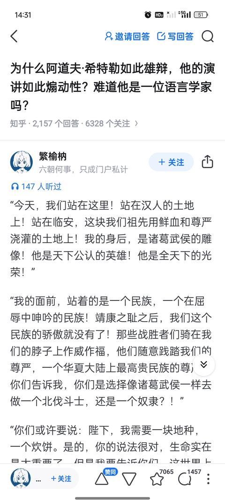
    - <a href="https://www.zhihu.com/people/lu-wei-10-73">熊叔</a> (<small title="上海">2026-5-28 12:51:41</small>): ？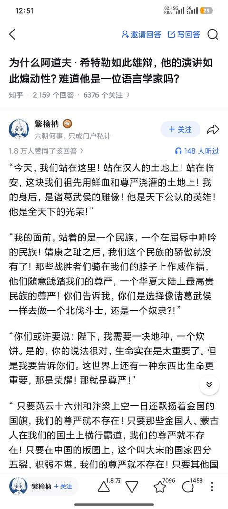
95. <a href="https://www.zhihu.com/people/yu-ci-59-21">Strange</a> (<small title="安徽">2026-5-4 19:22:48</small>): 兴！汉！
96. <a href="https://www.zhihu.com/people/xiao-qiang-26-5">小强</a> (<small title="江苏">2025-12-18 9:56:10</small>): 我说西嗨
    - <a href="https://www.zhihu.com/people/lily-saber-51">Lily Saber</a> (<small title="湖南">2025-12-18 11:23:35</small>): 兴汉！［哇］
97. <a href="https://www.zhihu.com/people/41-25-8-14">左边翅膀</a> (<small title="黑龙江">2025-12-19 21:2:12</small>): 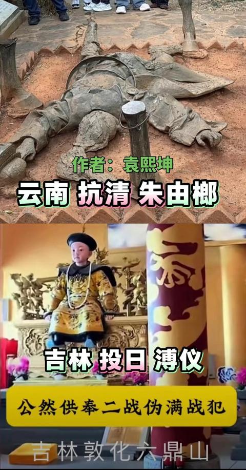
98. <a href="https://www.zhihu.com/people/53-36-88-92">白藏红叶</a> (<small title="江苏">2026-2-12 12:27:27</small>): 沧州赵玖真能说出这话［doge］如果是赵玖在八公山龙纛下说这话给李纲宗泽之类的主战派可能没啥用，但放南阳保卫战、长社大捷后给岳飞韩世忠听了真能推平
99. <a href="https://www.zhihu.com/people/connie888666">月星朗</a> (<small title="湖北">2026-2-7 23:32:14</small>): 太有才了哈哈哈哈哈
100. <a href="https://www.zhihu.com/people/xu-wu-zhu-yi-yao-bu-de">知乎用户请付款</a> (<small title="广东">2026-1-29 9:58:37</small>): 说是给农民的，不如一句不纳粮
101. <a href="https://www.zhihu.com/people/zhangyang1995-38">zhangyang1995</a> (<small title="山东">2026-1-23 12:53:52</small>): 不如拭目以待
102. <a href="https://www.zhihu.com/people/a-er-tuo-li-ya-_yi">Altriasjy</a> (<small title="天津">2026-1-19 12:53:15</small>): 这是澳宋吧［doge］
103. <a href="https://www.zhihu.com/people/jun-lin-tian-xia-1-53">温酒斩乾隆</a> (<small title="四川">2026-1-14 15:6:27</small>): ［doge］太不团结了，把汉人处全改中华民族
104. <a href="https://www.zhihu.com/people/cheems-43-9">配享太廟國士無雙</a> (<small title="陕西">2026-1-12 21:1:3</small>): 不是哥们［doge］
105. <a href="https://www.zhihu.com/people/lan-se-39-28-24">知乎用户</a> (<small title="山东">2026-1-10 15:30:37</small>): 第三段不行。  
 
对于无知民众，炊饼可比什么尊严、骨气重要多了。  
 
鼓动人是要顺着说的，你这话一出口，台下的马上出戏了。
106. <a href="https://www.zhihu.com/people/91-86-59-30-29">王一</a> (<small title="四川">2025-12-18 14:40:35</small>): 作者大才，我刚开始都以为是明太祖的檄文呢［赞］［赞］
107. <a href="https://www.zhihu.com/people/mei-guo-de-hua-lai-shi-64">克莱登大学门卫</a> (<small title="陕西">2026-1-5 17:39:10</small>): 兴汉！
108. <a href="https://www.zhihu.com/people/wang-shan-shi-65-46">王山石</a> (<small title="江苏">2026-1-2 17:26:54</small>): 你应该把刘渊称帝的那篇檄文拿来类比合适一些，比较符合本土价值观
109. <a href="https://www.zhihu.com/people/zhi-bai-30-31">废池乔木</a> (<small title="天津">2025-12-25 17:15:1</small>): 民族主义是暴力输出最好的工具，这个暴力输出不是一个贬义词，日本用开拓万里波涛布国号于四方的口号，利用民族主义煽动侵略，咱们也用亡国灭种的口号，利用民族主义抵抗侵略。因为民族主义的先天性就是把内部看成一个整体，把外部看成几个整体
110. <a href="https://www.zhihu.com/people/feng-bu-xi-96">风不息</a> (<small title="天津">2025-12-25 13:33:51</small>): 如果我是一个文人，我会热血沸腾跑去参军  
 
  
 
如果我真的饥寒交迫，那我的血只能热3秒钟
111. <a href="https://www.zhihu.com/people/bao-chen-xing-30">V.BOK</a> (<small title="辽宁">2025-12-18 15:17:17</small>): 兴汉［赞同］
112. <a href="https://www.zhihu.com/people/gum979">Gzh437</a> (<small title="上海">2025-12-18 15:44:15</small>): 赵构两个字一出来就有一种荒诞的感觉
113. <a href="https://www.zhihu.com/people/zhou-liu-he">周六合</a> (<small title="北京">2025-12-22 5:28:27</small>): 更想要炊饼了。尤其是大半夜饿着肚子读的时候。谁跟我说有比炊饼更重要的看不见摸不着的东西我真想一巴掌糊上去。
114. <a href="https://www.zhihu.com/people/zi-luo-dfg">知乎用户Z4L9dL</a> (<small title="广东">2025-12-21 19:40:42</small>): 过河！过河！过河！
115. <a href="https://www.zhihu.com/people/nie-zheng-chao-74">日月山河</a> (<small title="河南">2025-12-21 15:59:50</small>): 时势造英雄
116. <a href="https://www.zhihu.com/people/wang-xiao-xi-61">王小囍</a> (<small title="天津">2025-12-20 18:0:18</small>): 南宋缺战马，更缺99A［滑稽］
117. <a href="https://www.zhihu.com/people/5-49-51">韭菜需要金坷垃</a> (<small title="重庆">2025-12-20 13:40:2</small>): 我怀疑答主有私货
118. <a href="https://www.zhihu.com/people/93-86-75-50">老拜登</a> (<small title="浙江">2025-12-20 8:19:0</small>): 南宋的普通人想破脑袋也想不明白自己为啥要出钱出力去收复北方
119. <a href="https://www.zhihu.com/people/lin-shang-yu-23">林尚羽</a> (<small title="四川">2025-12-20 13:45:53</small>): 只能给现代中国人看［大笑］，不过还是得给答主好评［感谢］
120. <a href="https://www.zhihu.com/people/tan-xiao-53-21">乘飞</a> (<small title="天津">2025-12-18 9:15:27</small>): 这种唱诗式的翻译腔不符合中国人演讲的语言习惯
121. <a href="https://www.zhihu.com/people/yi-ge-zhu-zhu-21">一个蛛蛛</a> (<small title="山东">2025-12-20 15:24:59</small>): 那些批评的人根本没有理解你改写演讲稿的用意。
122. <a href="https://www.zhihu.com/people/xiao-a-ge-71">小阿哥</a> (<small title="浙江">2025-12-20 15:12:36</small>): 不接地气，煽动性较低
123. <a href="https://www.zhihu.com/people/ding-dong-ding-dong-ding-ding-dong-59">一夜鱼龙舞</a> (<small title="福建">2025-12-19 17:42:17</small>): 就半个月前，我看这篇文章还没这么情绪起伏。但是现在，我已经把其中的某些字替换成那个答案。我能代入那个汉族了，我将成为其中一员。
124. <a href="https://www.zhihu.com/people/jiu-xiao-dong">冲天</a> (<small title="河南">2025-12-19 14:8:54</small>): 兴汉！
125. <a href="https://www.zhihu.com/people/lily-saber-51">Lily Saber</a> (<small title="湖南">2025-12-18 11:24:18</small>): 西海！不对，兴汉！
126. <a href="https://www.zhihu.com/people/mypqn">今宁</a> (<small title="江苏">2025-12-18 10:24:42</small>): 当年跑到临安的皇帝哪有这种气魄, 有这种气魄也不会跑到临安［飙泪笑］
127. <a href="https://www.zhihu.com/people/111188556">价值投资667</a> (<small title="四川">2025-12-18 17:45:46</small>): 看得我热血沸腾的
128. <a href="https://www.zhihu.com/people/wang-cheng-yan-92-67">水库浪子</a> (<small title="四川">2025-12-19 10:44:32</small>): 你说这些是国民已经建立了国家认同和民族认同的基础上，全世界建立国家认同民族认同也不过几百年。
129. <a href="https://www.zhihu.com/people/41-25-8-14">左边翅膀</a> (<small title="黑龙江">2025-12-19 21:2:21</small>): 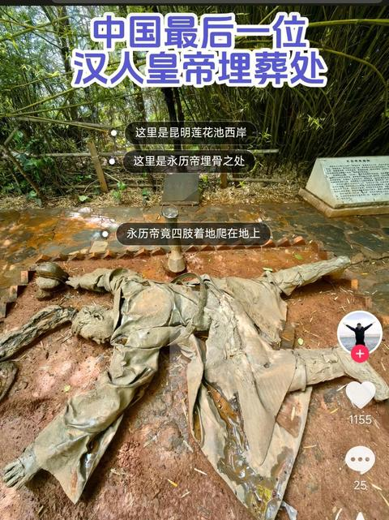
130. <a href="https://www.zhihu.com/people/salada-12">无趣</a> (<small title="广东">2025-12-19 8:4:55</small>): 不为矬宋二战
131. <a href="https://www.zhihu.com/people/xiao-3-63-8">朝阳起又落</a> (<small title="河北">2025-12-18 20:40:46</small>): 那么中国的犹太人是谁啊？［doge］
132. <a href="https://www.zhihu.com/people/lwj-lwj">Lwj Lwj</a> (<small title="四川">2025-12-18 23:22:54</small>): 陛下，带上我！
133. <a href="https://www.zhihu.com/people/wzy1111-39">wzy1111</a> (<small title="上海">2025-12-18 16:42:54</small>): 话说 炊饼这个事情 模仿小胡子的说法是 每个人都能吃上炊饼喝上米酒
134. <a href="https://www.zhihu.com/people/lang-fan-yun-26-93">莫谈国事</a> (<small title="上海">2025-12-18 18:13:15</small>): 你跟我谈理想，我可能会迷茫，但是你跟我谈民族谈祖先谈复兴，那我就只能跟着民族大旗走了
135. <a href="https://www.zhihu.com/people/jie-xin-yu-70">一二三</a> (<small title="甘肃">2025-12-18 16:10:16</small>): 我去，看得我热血沸腾，这就是我卸载知乎但没注销账号的原因，而评论区那些刻舟求剑的评论则是我没注销账号但卸载知乎的原因。
136. <a href="https://www.zhihu.com/people/kurt-83-87">六郎显圣真君</a> (<small title="上海">2025-12-18 19:47:24</small>): 此篇需全文背诵
137. <a href="https://www.zhihu.com/people/m9kxpn">魂系蓝天</a> (<small title="山东">2025-12-19 4:1:25</small>): 兴！汉！
138. <a href="https://www.zhihu.com/people/tyslgmydon-56">TYSLGMYDON</a> (<small title="北京">2025-12-19 8:33:51</small>): ..  
 
希特勒是恶魔，  
 
  
 
然而我有时希望赵构也成为这种恶魔  
 
  
 
然而臣构言：做不到啊..  
 
  
 
［赞］
139. <a href="https://www.zhihu.com/people/himan-41">精神院主治主任</a> (<small title="江西">2025-12-19 2:22:4</small>): 作为吉安人，会再为大宋拼搏一把［飙泪笑］
140. <a href="https://www.zhihu.com/people/nero-33-3">NERO</a> (<small title="浙江">2025-12-18 18:54:7</small>): 再加一段把金国大使押上来祭旗的场面会更好
141. <a href="https://www.zhihu.com/people/xyfch">xyfch</a> (<small title="贵州">2025-12-18 16:23:48</small>): 为什么我想到的是巫师3
142. <a href="https://www.zhihu.com/people/ni-bie-dou-20">你别逗</a> (<small title="山东">2025-12-18 15:12:10</small>): 会不会因为他说的有道理［思考］
143. <a href="https://www.zhihu.com/people/zhihuwangwen">古拉格首席体验官</a> (<small title="黑龙江">2025-12-18 12:20:15</small>): 只能给到98分，扣两分是因为出现了违禁词“赵构”，虽然逻辑严谨通顺，但影响读着阅读体验。［滑稽］
144. <a href="https://www.zhihu.com/people/ceng-yun-30-83">曾云</a> (<small title="安徽">2025-12-18 12:52:28</small>): 文化程度不高的话，忽悠不起来啊［捂脸］
145. <a href="https://www.zhihu.com/people/gong-zi-ran-45">原初的奈非天</a> (<small title="山东">2025-12-18 20:9:34</small>): [如果把赵构换成希特勒会怎么样？](https://www.zhihu.com/question/590555540/answer/3487603354?utm_psn=1985078642137641353)和我半年前的回答有异曲同工之妙［酷］
146. <a href="https://www.zhihu.com/people/yi-qing-yang-51">亦轻扬</a> (<small title="河北">2025-12-18 16:50:40</small>): 最近正在看绍送，还挺入戏的
147. <a href="https://www.zhihu.com/people/505527">505527</a> (<small title="中国香港">2025-12-18 16:4:26</small>): 這段文字在宋朝不可能有任何作用的最大原因是 - 大宋是趙家的，但元首是議會和公投選出來的。在家天下的地方，説什麽都沒用。
148. <a href="https://www.zhihu.com/people/fei-ke-niu-si-47">飞科牛丝</a> (<small title="广东">2025-12-18 13:20:18</small>): 这只是动员一小部分，更重要的人民汽车，工作待遇等等这些要到位［大笑］
149. <a href="https://www.zhihu.com/people/jiang-you-yin-xing-yuan-zhu-bi">酱油银杏圆珠笔</a> (<small title="北京">2025-12-18 13:29:36</small>): 大家真的只是想吃张炊饼，面包也行
150. <a href="https://www.zhihu.com/people/qian-cheng-62-93">尔尔</a> (<small title="宁夏">2025-12-19 15:10:50</small>): 我要是能魂穿宋朝还有你现在跑评论下面嘚嘚的资格？
151. <a href="https://www.zhihu.com/people/k-z-96">Sipahi</a> (<small title="安徽">2025-12-21 21:35:41</small>): nein!nein!!nein!!!
152. <a href="https://www.zhihu.com/people/dundoo">xxwqsjzh</a> (<small title="上海">2025-12-19 16:16:18</small>): 这话看着都旮的抠脚，别说现场听了。。。可能直接尬到晕厥
153. <a href="https://www.zhihu.com/people/yun-chen-han">云叶</a> (<small title="浙江">2024-8-31 11:35:7</small>): 大多数都是文盲，他们听不懂
154. <a href="https://www.zhihu.com/people/hong-lei-4-89">洪雷</a> (<small title="辽宁">2024-9-5 20:15:22</small>): 赵构说：跟老子打到金国去，分田分地分女人，封侯封公封异姓王！
155. <a href="https://www.zhihu.com/people/84-9-73-28">开喷</a> (<small title="河南">2025-12-20 15:45:45</small>): 你犯罪了［捂脸］
156. <a href="https://www.zhihu.com/people/shen-jing-wa-33-95-39">神经蛙</a> (<small title="上海">2026-2-12 21:3:57</small>): 希特勒只是在德国人陷入绝望时说了实话给出承诺给了他们希望并兑现了承诺 说希特勒煽动了德国人 不如说是德国人选择了希特勒
157. <a href="https://www.zhihu.com/people/bo-bo-67-70">知乎用户1号</a> (<small title="辽宁">2026-1-9 21:29:17</small>): 答主，你放心——跟你抬杠的杠精只是少数，无论他们是真看不懂，还是单纯想杠一杠，都不重要。你只需要看看你得到的点赞数量，就知道绝大多数人是懂你以及支持你的！
158. <a href="https://www.zhihu.com/people/li-ling-yan-86-77">谷英涵</a> (<small title="浙江">2026-2-28 11:37:54</small>): 跟他们拼了［生气］
159. <a href="https://www.zhihu.com/people/jing-chu-an-zhu">陈闲思</a> (<small title="湖北">2024-8-31 14:48:48</small>): ［思考］等下。。构子文学全新版本？
160. <a href="https://www.zhihu.com/people/lao-lu-50-46">老驴</a> (<small title="广东">2025-12-18 16:0:18</small>): 太复杂了！  
 
床王来了不纳粮

=[评论](./attachments/comments.json)

