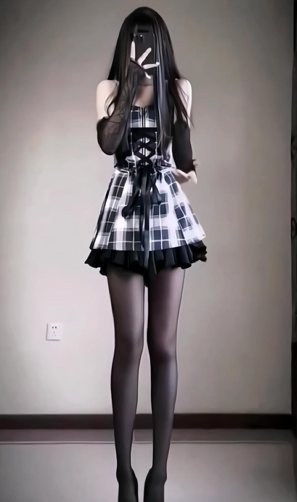
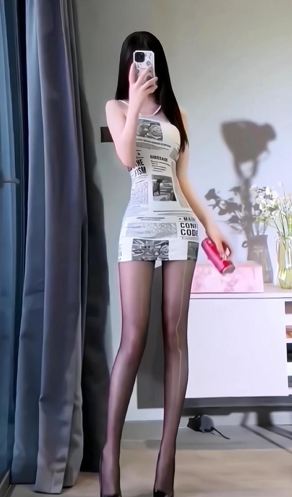
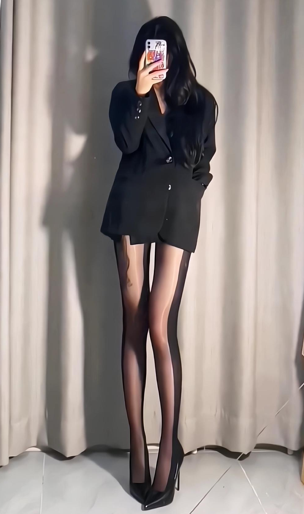
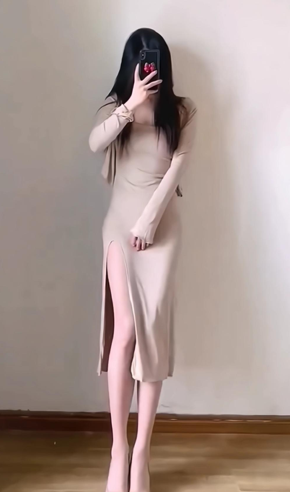
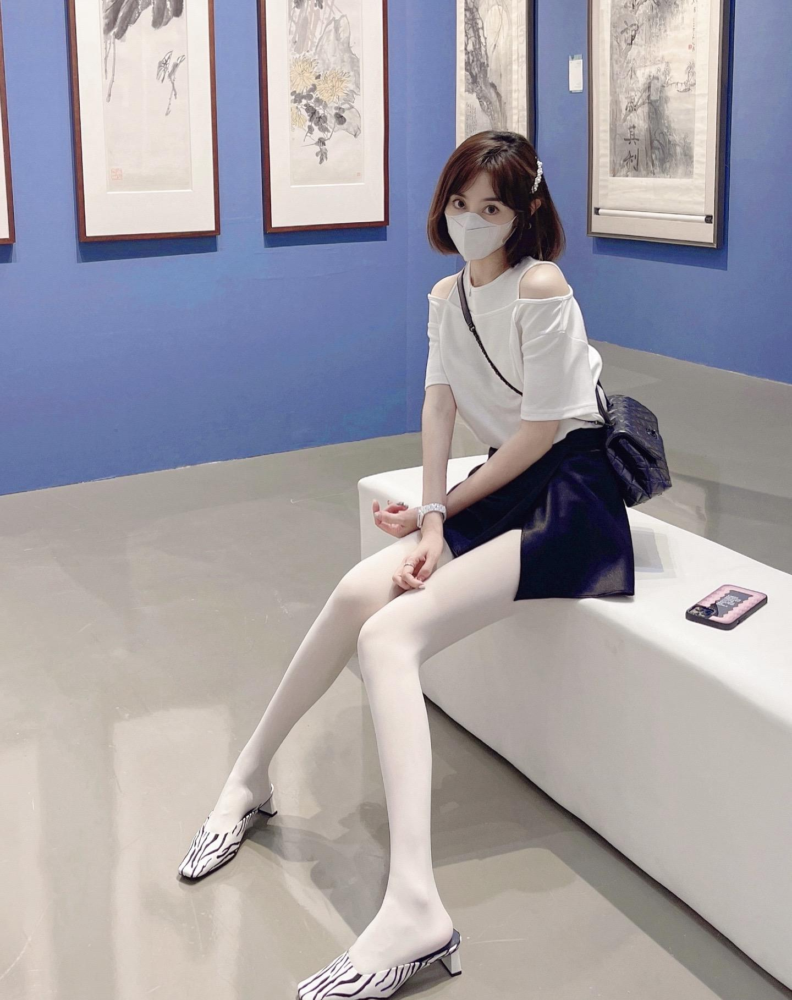

[toc]

# 问题

提问者：**<a href="https://www.zhihu.com/people/dan-shen-bai-nian-lsp">知乎用户TvsbNB</a>**
提问时间: 2022-11-20 14:26:7
总回答数: 305
总访问量: 1312269

求推荐

# 回答

回答者： **<a href="https://www.zhihu.com/people/21-71-44-64">红绿灯的黄</a>**
回答时间: 2023-5-15 8:19:56
点赞总数: 55
评论总数: 5
收藏总数: 200
喜欢总数：50

女生在穿厚裤袜时，如何搭配肉色丝袜或者黑色丝袜，很多时候取决于她们自己的个人喜好和搭配风格。这两种颜色的丝袜都有各自的优缺点，所以需要根据不同的情况来选择。

  

  

  

  

肉色丝袜适合和裙装搭配，能够让整体造型看起来更加自然和流畅。如果你想在冬季穿裙子或短裙，那么可以选择肉色丝袜来完善自己的搭配。肉色丝袜还可以起到修饰腿部肌肉线条的作用，让女性感到更加自信和舒适。

黑色丝袜则更加适合与短裤或紧身裤搭配，凸显女性长腿的线条，能够让整个人看起来更加瘦长和修长。黑丝更加的性感迷人，更能凸显女人魅力。黑色丝袜也可以让女性看起来更加有气质和成熟感，适合商务、正式场合。

  

原文地址：[(红绿灯的黄)大家厚裤袜都喜欢肉色还是黑色啊？](https://www.zhihu.com/question/567786856/answer/3028195523) 

# 评论

1. <a href="https://www.zhihu.com/people/xing-yi-xi-liu-ye-wei-yang-63">已下线</a> (<small title="陕西">2023-5-17 20:42:51</small>): 这墙面插座形状看着有些离谱
2. <a href="https://www.zhihu.com/people/--7-7-90-7">翻篇.</a> (<small title="广东">2025-6-5 14:57:36</small>): 友
3. <a href="https://www.zhihu.com/people/zkbdj">ZKBDJ</a> (<small title="浙江">2023-8-13 18:32:50</small>): 混进去了一个白丝［滑稽］［滑稽］
4. <a href="https://www.zhihu.com/people/xihaian-83">xihaian</a> (<small title="山东">2023-5-16 23:37:55</small>): 报纸也可当短裙穿？
5. <a href="https://www.zhihu.com/people/264838">264838</a> (<small title="陕西">2023-5-17 12:6:59</small>): 你这腿看着就动心

=[评论](./attachments/comments.json)

