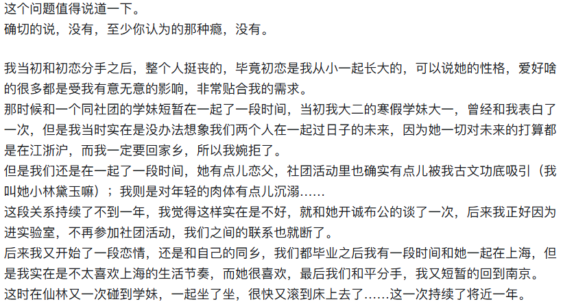
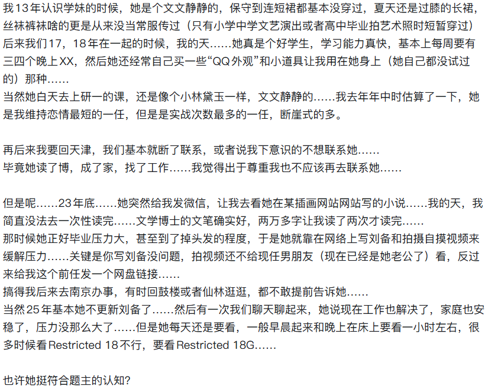

[toc]

# 问题

提问者：**<a href="https://www.zhihu.com/people/wo-de-tuan-83">妙哉</a>**
提问时间: 2025-12-27 1:31:53
总回答数: 1064
总访问量: 32200852

所谓“性瘾”，原是欲望在规矩社会里被贴的罚单。

人这东西怪。饿了吃饭是常理，渴了喝水是天经。偏到了情欲这事，就爱给自己画格子。格子外头的，慌慌张张贴个“病”字——仿佛那点热气腾腾的念想，不关在诊断书里，就要烧了谁家的屋似的。

我认得个写字的朋友，他说年轻时总疑心自己是台漏油的机器。后来去了西北，见着戈壁上那些不管不顾开花的红柳，才明白：生命原是要这般泼辣辣地往外长的。哪有什么“该”与“不该”，只有“是”与“不是”。真到了七八十岁，夜里有场好梦，清晨还要摸出本子记下颜色，那才是活出了人味儿。

医院我是去过的。白得晃眼的地方，医生按着表格打钩：一周几次？可影响工作？旁边排队的老先生插嘴：“我们年轻时插秧，晌午歇在田埂上，讲些浑话，唱些野调子，哪来这些讲究？”满屋子消毒水味儿里，忽然就透进来一股子稻花香。

现下倒好，什么都能做成生意。戒断营里念经似的背诵“清规”，电子锁锁住手机，仿佛把魂儿也一并锁进了充电柜。可夜里翻墙的少年，翻的不是墙，是心里那道被标了价的坎儿。

月色好的晚上，我常泡杯浓茶坐在窗前。看野猫在屋顶追逐，影子叠着影子，叫声滚烫烫地落在瓦片上。它们不懂什么叫“过度”，只知道春天来了，身体里有什么东西醒了，那便醒了。

说到底，欲望不过是身体里的节气。惊蛰要打雷，白露要降霜。你非要把惊蛰的雷声录下来，拿到实验室分析分贝，说这是病，得治——治来治去，倒把清明时节的杏花雨给错过了。

真正活明白的人，都懂得与自己的身体讲和。像老农熟悉他的地，哪片该浇水，哪片该晒晒；也像好厨子知道火候，文火武火，都是为了让食材唱它该唱的歌。

那些被称作“瘾”的，许是生命本身最诚实的律动。它在规矩之外，在诊断书的反面，在夜深时心脏敲击肋骨的声音里——咚咚，咚咚，像遥远的战鼓，也像母亲怀胎时最早听见的胎心。

窗外的栀子又开了。香得蛮横，不管不顾的。你说它太浓了？它才不理，明早还要再开出三百朵。

# 回答

回答者： **<a href="https://www.zhihu.com/people/he-guang-zi">能静斋主</a>**
回答时间: 2026-1-3 15:42:3
点赞总数: 131
评论总数: 25
收藏总数: 102
喜欢总数：22

  

原文地址：[(能静斋主)真的有“性瘾”一说吗？](https://www.zhihu.com/question/1988059467368137943/answer/1990810135472386971) 

# 评论

1. <a href="https://www.zhihu.com/people/95-60-1-75-59">太阳薄荷</a> (<small title="山东">2026-1-6 0:18:11</small>): 你年轻时候爽到了啊
2. <a href="https://www.zhihu.com/people/rtx3070">大明太祖朱洪武</a> (<small title="马来西亚">2026-1-4 20:6:10</small>): 这种主要还是缓解压力为主吧，我个人不认为是太大的私德问题
   - **能静斋主** (<small title="天津">2026-1-4 20:8:36</small>): 唉…谈不上私德…但是她现在成家了，还时不时和我联系，当然我也不对，没有下决心和她断联。
   - <a href="https://www.zhihu.com/people/rtx3070">大明太祖朱洪武</a> (<small title="回复于 2026-1-4 20:22:44/马来西亚"> ✉️:能静斋主</small>): 只能说人都有复杂的一面吧，很多三四十的女人确实会对年轻时的男友念念不忘的，只要守住不越界的底线就没啥问题
   - <a href="https://www.zhihu.com/people/ruo-mu-yu">姜神哥</a> (<small title="回复于 2026-1-15 16:18:0/福建"> ✉️:能静斋主</small>): 反差很爽的，就像小米辣，刺激［看看你］但是看得出来楼主有基本道德，也许不找你也会找其他人
   - **能静斋主** (<small title="回复于 2026-1-17 18:38:18/天津"> ✉️:姜神哥</small>): 嗨……主要是我是她一切玩法的引路人，拿走了她各种第一次，然后现在还能通过人脉帮助她……我个人觉得其实我比起丈夫或者情人，更符合她对于“父亲”的期待，她对自己的老古板生父其实挺无感的。
   - <a href="https://www.zhihu.com/people/ruo-mu-yu">姜神哥</a> (<small title="回复于 2026-1-18 8:54:50/福建"> ✉️:能静斋主</small>): 嗨，这就是恋父情结的具象化，每个女人都梦想着要有一个“父亲”和一个“儿子”，同龄伴侣反而不那么重要了。反过来男的其实也一样［看看你］人终究是情感动物。老哥守住底线，助人助己罢了
   - **能静斋主** (<small title="回复于 2026-1-18 9:38:37/天津"> ✉️:姜神哥</small>): 嗨，我是觉得你在床上不把对方当人，只要你情我愿，就没问题。但是下了床，还是要互相尊重人格的。
   - **能静斋主** (<small title="天津">2026-1-18 17:35:48</small>): 很正常啊，男女之间怎么过，是你情我愿的事情。
   - <a href="https://www.zhihu.com/people/xiao-gui-zhu-er-50">就要吃兔兔</a> (<small title="回复于 2026-1-19 13:30:18/贵州"> ✉️:能静斋主</small>): 无限同意
3. <a href="https://www.zhihu.com/people/fu-sheng-yi-meng-10-7">浮生一梦</a> (<small title="比利时">2026-1-6 5:25:34</small>): 鼓楼和仙林怕不是校友？🤣
   - **能静斋主** (<small title="天津">2026-1-6 13:31:15</small>): 应该吧，南哪的朋友遍天下嘛
   - <a href="https://www.zhihu.com/people/cube-70">本卜拉</a> (<small title="回复于 2026-1-7 2:7:45/天津"> ✉️:能静斋主</small>): 南大?
   - **能静斋主** (<small title="回复于 2026-1-7 16:2:26/天津"> ✉️:本卜拉</small>): 对
4. <a href="https://www.zhihu.com/people/zhu-hong-huai-23">Purusa</a> (<small title="北京">2026-3-31 16:39:29</small>): 某插画网站的文能指个路嘛（）
   - **能静斋主** (<small title="天津">2026-3-31 16:49:57</small>): 没梯子你登的上？
5. <a href="https://www.zhihu.com/people/pi-pi-pi-qiu-41">皮皮皮球</a> (<small title="天津">2026-1-7 14:43:9</small>): 刘备是什么
   - **能静斋主** (<small title="天津">2026-1-7 16:2:21</small>): 汉献帝怎么称呼刘备？
   - <a href="https://www.zhihu.com/people/zhang-jing-tian-96-3">人或为鱼鳖</a> (<small title="回复于 2026-1-10 19:41:10/山东"> ✉️:能静斋主</small>): 叔叔？
   - **能静斋主** (<small title="回复于 2026-1-10 19:51:21/天津"> ✉️:人或为鱼鳖</small>): 皇叔
   - <a href="https://www.zhihu.com/people/di-yi-ren-jun">告辞</a> (<small title="回复于 2026-1-13 23:10:7/江苏"> ✉️:能静斋主</small>): 好好好，又学会了一个新词
   - <a href="https://www.zhihu.com/people/zhu-yi-kou-ju">丶一口句</a> (<small title="回复于 2026-2-26 14:48:31/安徽"> ✉️:能静斋主</small>): 嘿，你他娘的还真是个文化人［赞］
   - <a href="https://www.zhihu.com/people/ma-hua-long-44">马化龙</a> (<small title="回复于 2026-2-26 16:59:31/上海"> ✉️:能静斋主</small>): 这拐了两道弯，确实反应不过来
   - **能静斋主** (<small title="回复于 2026-2-26 19:39:5/天津"> ✉️:马化龙</small>): 你这名字是不是一种治痔疮的药啊？
   - <a href="https://www.zhihu.com/people/zhang-zi-hao-72-23">怜希</a> (<small title="回复于 2026-2-28 12:48:2/北京"> ✉️:能静斋主</small>): 那个叫马应龙
   - **能静斋主** (<small title="回复于 2026-2-28 23:12:55/天津"> ✉️:怜希</small>): 哦哦，我说耳熟呢

=[评论](./attachments/comments.json)

