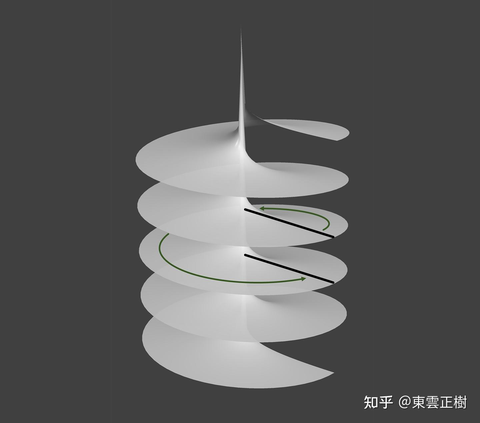
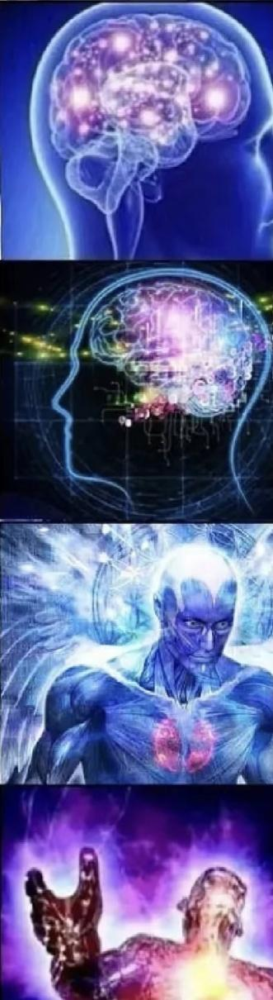
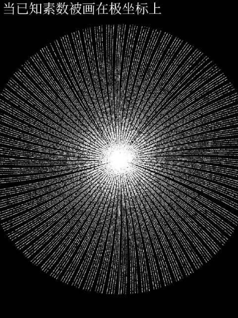
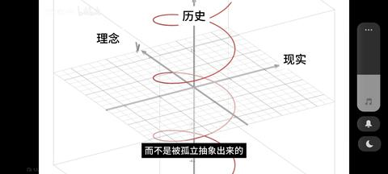

[toc]

# 问题

提问者：**<a href="https://www.zhihu.com/people/feng-yiyang-zi-you-34-73">知乎用户PuA19g</a>**
提问时间: 2020-3-15 0:59:10
总回答数: 385
总访问量: 8694287

π和e这两个无理数出现在许多和“圆”无关的公式中，是不是因为人类科技还不足以看透本质。

# 回答

回答者： **<a href="https://www.zhihu.com/people/meng-he-34-50">蒙恩</a>**
回答时间: 2025-6-12 11:51:25
点赞总数: 24789
评论总数: 1075
收藏总数: 18528
喜欢总数：1412

因为很多自然现象（旋转、波动、电路、热传导、量子力学）都有周期性行为，所以需要引入π，来表达循环往复（圆周运动）。

而e是连续增长和变化率的极限，e是唯一一个满足导数等于自身的函数常数，所以表示变化的单位没有比e更合适的了。

值得一提的是，π表示循环，e是不循环，两个本质是互斥，矛盾的，对立的，但欧拉公式却让两者可以互相转换！

这是最惊人的地方：看似不能共存的两种存在方式，却在复数世界中统一起来。

它等价于说：

一个看似永不循环的增长过程（指数 e），在复数域中，竟然对应一个圆周运动（π，周期性）！

所以欧拉公式展示了这样一种宇宙秩序：

所有的线性增长，都可以用周期性结构来表达。或者说，一切变化的过程，在更高维度中，其实是某种结构的循环。

用更通俗的话说：

所有变化其实就是在更高维度里“画圈”。

  

原文地址：[(蒙恩)许多公式都有π和e，可能的原因有什么？](https://www.zhihu.com/question/379531809/answer/1916462580194579750) 

# 评论

1. <a href="https://www.zhihu.com/people/way-secret-82">温暖的天空</a> (<small title="辽宁">2025-6-13 10:43:33</small>): 循环意味着稳定，稳定才能维持，各种自然现象都是维持的现象，所以必然存在循环，即使不在第一维度循环，也会在第二维度循环。
   - **蒙恩** (<small title="日本">2025-6-13 10:56:54</small>): 是的，你是真理解了！无序混乱的背后一定是有序，否则系统的存在是不稳定的。
   - <a href="https://www.zhihu.com/people/shou-zhuo-61-23">庄之蝶</a> (<small title="美国">2025-6-13 11:18:11</small>): 吊诡的是pi本身是无序的
   - <a href="https://www.zhihu.com/people/miracle-lin-34">秋风落晚</a> (<small title="回复于 2025-6-13 12:2:21/安徽"> ✉️:庄之蝶</small>): 有没有可能是10进制下无序，如果是派进制呢［思考］
   - <a href="https://www.zhihu.com/people/hbaaron">匡醍量化</a> (<small title="回复于 2025-6-13 12:24:52/湖北"> ✉️:庄之蝶</small>): 最可怕的是有一天发现pi开始循环了。。。
   - <a href="https://www.zhihu.com/people/tu-dou-da-da-56">四月觅迦南</a> (<small title="北京">2025-6-13 13:16:10</small>): 一切都在运动中
   - <a href="https://www.zhihu.com/people/arc100">Arc100</a> (<small title="浙江">2025-6-13 15:4:52</small>): 对，不稳定，长久一定会崩塌，能一直观察到，那就是循环
   - <a href="https://www.zhihu.com/people/zhong-jian-wu-feng-8-26">重剑无锋</a> (<small title="回复于 2025-6-13 15:17:14/江苏"> ✉️:秋风落晚</small>): π进制是数学概念，物理世界是不存在这个东西的
   - <a href="https://www.zhihu.com/people/rambo-55">Rambo</a> (<small title="回复于 2025-6-13 16:0:21/河北"> ✉️:蒙恩</small>): 哪有什么稳定存在，都是暂态
   - <a href="https://www.zhihu.com/people/xin-xian-de-wo-15">算盘</a> (<small title="回复于 2025-6-13 16:44:53/重庆"> ✉️:匡醍量化</small>): pi循环应该不算可怕吧 最可怕的是pi算尽了［doge］
   - <a href="https://www.zhihu.com/people/hbaaron">匡醍量化</a> (<small title="回复于 2025-6-13 16:51:50/湖北"> ✉️:算盘</small>): 应该是一个意思，开始循环就是算尽了
   - <a href="https://www.zhihu.com/people/87-49-86-1">曷丧</a> (<small title="回复于 2025-6-13 18:19:16/江苏"> ✉️:蒙恩</small>): 为什么一定要是稳定的
   - **蒙恩** (<small title="回复于 2025-6-13 18:36:25/日本"> ✉️:曷丧</small>): 很好的问题，应该是数学结构不稳定的宇宙都毁灭了，剩下的都是稳定的，是数学宇宙。
   - <a href="https://www.zhihu.com/people/xin-xian-de-wo-15">算盘</a> (<small title="回复于 2025-6-13 20:33:31/重庆"> ✉️:匡醍量化</small>): 不不不，按照我的理解哈，如果pi算尽，那意味圆就不是圆，只是一个人用现有手段看不到其直线边的多边形。但是pi只是单纯的循环，那么圆确实是个圆。
   - <a href="https://www.zhihu.com/people/mi-tu-xiao-shu-tong-98-50">迷途小书童</a> (<small title="广东">2025-6-14 8:6:44</small>): 三体现象是无序的，在宇宙中普遍吗？
   - <a href="https://www.zhihu.com/people/230818">用户230818</a> (<small title="回复于 2025-6-14 8:23:25/日本"> ✉️:庄之蝶</small>): 可能Pi有序了就没法循环了
   - <a href="https://www.zhihu.com/people/yang-jian-hong-54">脱离语言</a> (<small title="回复于 2025-6-14 20:19:29/山西"> ✉️:迷途小书童</small>): 刚刚有人说了，在更高维度是有序的
   - <a href="https://www.zhihu.com/people/87-49-86-1">曷丧</a> (<small title="回复于 2025-6-15 2:12:29/江苏"> ✉️:蒙恩</small>): 不，存在一百亿年就够了，不需要多稳定
   - <a href="https://www.zhihu.com/people/13-29-22-68-28">脐橙土豆鸡翅</a> (<small title="陕西">2025-6-16 0:6:40</small>): 循环是负反馈，指数增长是正反馈。
 
弹簧的往复运动就是典型的负反馈。
   - <a href="https://www.zhihu.com/people/chen-da-lin-27">陈大林</a> (<small title="回复于 2025-6-16 8:44:0/浙江"> ✉️:蒙恩</small>): 既然系统是稳定的，那就是说一切都是有序的，那就是可以预测的？那你告诉我明天大a哪几支股票涨5个点以上？
   - <a href="https://www.zhihu.com/people/one-piece-39-63">123456</a> (<small title="回复于 2025-6-16 8:57:43/上海"> ✉️:蒙恩</small>): 🙃
   - <a href="https://www.zhihu.com/people/74-30-89-91">归义军步弓手</a> (<small title="回复于 2025-6-17 13:19:9/北京"> ✉️:曷丧</small>): 微观物理过程都是很快的，人类能在宏观上感知到的现象，必然是稳定的。
   - <a href="https://www.zhihu.com/people/bu-guo-wu-zhi">Change L</a> (<small title="贵州">2025-6-18 6:16:30</small>): 虽然，但是 循环→稳定，还是循环＝稳定 ？
 
如果是前者，那么稳定不一定推出循环额
   - <a href="https://www.zhihu.com/people/ou-sheng-wei-40">麻小芝</a> (<small title="回复于 2025-6-21 19:9:23/广东"> ✉️:重剑无锋</small>): 物理是数学的子集
   - <a href="https://www.zhihu.com/people/98-77-50-15">我不想起了</a> (<small title="回复于 2025-6-23 15:31:25/天津"> ✉️:陈大林</small>): 计算量过大
   - <a href="https://www.zhihu.com/people/Alives">Alives</a> (<small title="回复于 2025-6-29 1:58:58/上海"> ✉️:秋风落晚</small>): 16进制pi有通项公式。
   - <a href="https://www.zhihu.com/people/520hh-39">520hh</a> (<small title="海南">2025-6-30 18:25:21</small>): 是决定论吗
   - <a href="https://www.zhihu.com/people/75-12-96-8">海洋</a> (<small title="湖北">2025-7-8 12:45:0</small>): 我的理解是你在算pi的时候其实宇宙是在等着你算的，等你算到刚好更容易循环的时候宇宙就产生变化，原本收缩又突然膨胀，其实pi根本算不完，然后你在算的时候宇宙越来越精密，pi的位数越大其实越难不循环，所以不循环只有往后面不停的加永远算不完甚至后面会出现算到最后微粒越来越细所以，而且你会发现像11111111这种都会出现无数年的情况但只是无限不循环里面的一个结，再有一种情况算着算着宇宙突然不存在数字了，世界突然变化了也有可能
   - <a href="https://www.zhihu.com/people/lanlean">清灵视界</a> (<small title="回复于 2025-8-4 20:28:21/江苏"> ✉️:算盘</small>): 从量子物理的角度来看，圆真有可能不是真圆，所以π真有可能算尽［doge］
   - <a href="https://www.zhihu.com/people/lanlean">清灵视界</a> (<small title="回复于 2025-8-4 20:30:27/江苏"> ✉️:陈大林</small>): 你不能自己把自己拎起来扔出去，所以你也不可能能预测明天大A涨几只股［不抬杠］
   - <a href="https://www.zhihu.com/people/li-lee-90-14">Li Lee</a> (<small title="回复于 2025-9-3 0:7:0/北京"> ✉️:蒙恩</small>): 这不符合热力学第二定律吧，没明白
   - <a href="https://www.zhihu.com/people/yan-yu-bo-wu-suo-yi-ke">知乎用户TZd7h9</a> (<small title="回复于 2025-12-18 10:5:19/湖北"> ✉️:蒙恩</small>): 或者从哲学意义上来讲  
 
这个宇宙中唯一不变的 就是 变化 本身  
 
  
 
而要让“变化”一直存在下去 就需要 有一种周期性循环的 某种东西（类似规律） 作为 其底层逻辑 保证其实现 相当于底层代码  
 
可以这样理解吗［赞同］［赞同］［赞同］
   - <a href="https://www.zhihu.com/people/12-41-49-70">骨髓</a> (<small title="回复于 2025-12-19 1:50:9/重庆"> ✉️:庄之蝶</small>): 圆周率pi值，它是一个确定值。  
 
只不过它的值，在当前的10进制下无法表示。  
 
既然它是确定值，那么它就是稳定值。  
 
和自然常数 e 一个道理。
   - <a href="https://www.zhihu.com/people/98-74-19-29-65">源氏溥仪</a> (<small title="回复于 2025-12-19 8:2:24/浙江"> ✉️:清灵视界</small>): 为什么？
   - <a href="https://www.zhihu.com/people/74-30-89-91">归义军步弓手</a> (<small title="回复于 2025-12-19 10:18:6/北京"> ✉️:海洋</small>): 数学只是个符号规则的游戏，不可能影响物理世界。只是其中恰好有几套规则，可以用于描述人类发现的物理规律。
   - <a href="https://www.zhihu.com/people/po-po-90-79">巨无霸痞老板</a> (<small title="回复于 2025-12-19 13:32:37/广东"> ✉️:蒙恩</small>): 和我的房间一样 乱中有序［生气］
   - <a href="https://www.zhihu.com/people/75-12-96-8">海洋</a> (<small title="回复于 2025-12-19 13:50:9/湖北"> ✉️:归义军步弓手</small>): 是的啊，确却如此，就跟你梦境一样，里面的幻化都是不一样的
   - <a href="https://www.zhihu.com/people/xing-kong-76-61-9">星空</a> (<small title="回复于 2025-12-19 19:30:31/北京"> ✉️:算盘</small>): 还真是
   - <a href="https://www.zhihu.com/people/65-52-65-84">牛蛙</a> (<small title="四川">2025-12-20 0:45:29</small>): 看到这、仿佛我又进步啦
   - <a href="https://www.zhihu.com/people/yang-shu-1-77-64">杨树</a> (<small title="回复于 2026-1-16 22:30:1/山东"> ✉️:秋风落晚</small>): 牛逼
   - <a href="https://www.zhihu.com/people/shi-yong-wei-xin-tou-xiang-yu-ni-cheng-53-73">人要有骨气</a> (<small title="回复于 2026-1-22 10:50:50/吉林"> ✉️:秋风落晚</small>): 那可太带π了
2. <a href="https://www.zhihu.com/people/xie-ran-80">Thomas数学</a> (<small title="山西">2025-6-12 11:58:54</small>): 能看懂阁下这段话的才是真正理解了复数本质
   - <a href="https://www.zhihu.com/people/lan-nu-shi-37-35">榄果树</a> (<small title="广东">2025-6-13 5:10:31</small>): 作用是高维向低维度分解？
   - <a href="https://www.zhihu.com/people/mo-peng-99">牧野青牛</a> (<small title="回复于 2025-6-13 10:5:48/陕西"> ✉️:榄果树</small>): 这不就是易经？
   - <a href="https://www.zhihu.com/people/wo-men-ya-po-zhong-sheng-97">我们压迫众生</a> (<small title="回复于 2025-6-13 10:34:16/北京"> ✉️:牧野青牛</small>): 易经别来沾边
   - <a href="https://www.zhihu.com/people/cuo-luan-nian-dai">错乱年代</a> (<small title="回复于 2025-6-13 10:55:11/河南"> ✉️:牧野青牛</small>): ［尴尬］
   - <a href="https://www.zhihu.com/people/leng-yue-33-55">冷月</a> (<small title="回复于 2025-6-13 10:58:36/浙江"> ✉️:榄果树</small>): 复数本来就是高维；
 
实数轴和复数轴是互相垂直的，复数就是一个二维平面；
 
我有时想会不会存在某种数，能同时与实数和复数垂直，然后我设定一个数j，j的平方=i，然后计算出j可以用复数表达
   - <a href="https://www.zhihu.com/people/louismile">卡卡罗特</a> (<small title="回复于 2025-6-13 11:18:33/陕西"> ✉️:冷月</small>): 有个ijk的
   - <a href="https://www.zhihu.com/people/leng-yue-33-55">冷月</a> (<small title="回复于 2025-6-13 11:22:39/浙江"> ✉️:卡卡罗特</small>): 我想过很多，无论怎么想都想不出一个数能同时与实数和虚数垂直
   - <a href="https://www.zhihu.com/people/zi-xiang-he-ni-zai-yi-qi-28">可替</a> (<small title="回复于 2025-6-13 11:29:23/山西"> ✉️:牧野青牛</small>): 啊对对对
   - <a href="https://www.zhihu.com/people/jiang-ming-74-47">知乎用户kQmw7c</a> (<small title="回复于 2025-6-13 11:56:53/四川"> ✉️:牧野青牛</small>): 把你高等数学大学教材拿出来再学一学吧。
   - <a href="https://www.zhihu.com/people/90-10-33-31">妖道</a> (<small title="回复于 2025-6-13 12:6:48/浙江"> ✉️:榄果树</small>): 实际现实同性质维度只有长宽高三个方向。再升基本就是游戏或者周期性了
   - <a href="https://www.zhihu.com/people/jiang-ze-shuang">甄姬拔菜</a> (<small title="回复于 2025-6-13 12:12:31/安徽"> ✉️:知乎用户kQmw7c</small>): 能说出这话的你指望他上过大学？［惊喜］
   - <a href="https://www.zhihu.com/people/ha-lin-97-82-51">小手冰凉</a> (<small title="回复于 2025-6-13 12:35:22/上海"> ✉️:牧野青牛</small>): 这是神棍该来的地方？
   - <a href="https://www.zhihu.com/people/di-san-lun-59">第三轮</a> (<small title="回复于 2025-6-13 12:43:20/江苏"> ✉️:牧野青牛</small>): ［赞］
   - <a href="https://www.zhihu.com/people/sinair">sinair</a> (<small title="回复于 2025-6-13 14:0:46/重庆"> ✉️:牧野青牛</small>): 易经？易筋经！
   - <a href="https://www.zhihu.com/people/hu-hu-86-58-77">呼呼</a> (<small title="河北">2025-6-13 14:48:14</small>): 这也能攻击，易经不就是统计和分析，怎么就神棍了
   - <a href="https://www.zhihu.com/people/yue-chu-qing-yun-53">长鲸月落</a> (<small title="回复于 2025-6-13 15:7:5/安徽"> ✉️:呼呼</small>): 不如永乐大典牛逼
   - <a href="https://www.zhihu.com/people/696969-43">明易道</a> (<small title="回复于 2025-6-13 15:25:45/辽宁"> ✉️:呼呼</small>): 没办法，人不懂，就简单觉得易经是算命的［捂脸］
   - <a href="https://www.zhihu.com/people/dong-sg">董SG</a> (<small title="回复于 2025-6-13 15:37:29/四川"> ✉️:牧野青牛</small>): 易筋经差不多，如果真存在的话
   - <a href="https://www.zhihu.com/people/zheng-ze-2-27">世界微尘</a> (<small title="回复于 2025-6-13 16:17:16/湖北"> ✉️:牧野青牛</small>): 先把高数考及格了再来说话
   - <a href="https://www.zhihu.com/people/zer0-66">知乎用户Y1qTQB</a> (<small title="回复于 2025-6-13 16:37:32/山东"> ✉️:牧野青牛</small>): 易经上一边去行吗
   - <a href="https://www.zhihu.com/people/bao-ge-89-79">无圣光</a> (<small title="回复于 2025-6-13 16:53:22/江苏"> ✉️:牧野青牛</small>): 可怕
   - <a href="https://www.zhihu.com/people/34-24-57-81">逐光</a> (<small title="回复于 2025-6-13 17:23:24/广东"> ✉️:牧野青牛</small>): 这是真主阿拉南无阿弥陀佛昊天上帝还有洪秀全
   - <a href="https://www.zhihu.com/people/mo-peng-99">牧野青牛</a> (<small title="回复于 2025-6-13 18:31:15/陕西"> ✉️:知乎用户kQmw7c</small>): 当年大一高数考试成绩97，够不够呢？读过易经吗？
   - <a href="https://www.zhihu.com/people/mo-peng-99">牧野青牛</a> (<small title="回复于 2025-6-13 18:31:55/陕西"> ✉️:小手冰凉</small>): 易经跟神棍有关系？自己先去把易经学懂了再说吧。
   - <a href="https://www.zhihu.com/people/ding-you-jun-98">长梦未觉醒</a> (<small title="回复于 2025-6-13 18:32:11/广东"> ✉️:牧野青牛</small>):   
 
看来你很有被骗的潜质［飙泪笑］
   - <a href="https://www.zhihu.com/people/mo-peng-99">牧野青牛</a> (<small title="回复于 2025-6-13 18:32:35/陕西"> ✉️:世界微尘</small>): 高数三十年前的考试成绩是97，国家重点大学核心专业，这个成绩够不够？
   - <a href="https://www.zhihu.com/people/mo-peng-99">牧野青牛</a> (<small title="回复于 2025-6-13 18:32:50/陕西"> ✉️:知乎用户Y1qTQB</small>): 读懂过易经吗？
   - <a href="https://www.zhihu.com/people/mo-peng-99">牧野青牛</a> (<small title="回复于 2025-6-13 18:36:23/陕西"> ✉️:牧野青牛</small>): 易经的整体是线性前进的，但是如果放在更高逻辑上考虑，又呈现出来回归的本质。然后周而往复。说易经是算命的，第一，不怪你。因为常人把易经跟六壬，八字什么的搞混了，以为只能算命。第二：退一步，即便算命，尤其是精准预测，这本身也是数理的应用。
   - <a href="https://www.zhihu.com/people/ha-lin-97-82-51">小手冰凉</a> (<small title="回复于 2025-6-13 19:1:47/上海"> ✉️:牧野青牛</small>): 不好意思，跟神棍关系可太大了。  
 
神棍最爱去擦科学的边，  
 
神棍还最爱说别人不懂，非让别人去学［惊喜］
   - <a href="https://www.zhihu.com/people/zheng-ze-2-27">世界微尘</a> (<small title="回复于 2025-6-13 19:6:13/湖北"> ✉️:牧野青牛</small>): 这三十年经历了啥挫折啊？从高材生退化成神棍？
   - <a href="https://www.zhihu.com/people/mo-peng-99">牧野青牛</a> (<small title="回复于 2025-6-13 19:6:36/陕西"> ✉️:小手冰凉</small>): 一部流传三千年的书，我国的核心典籍文化，是一部占卜书。你是多瞧不起中华文化？不说别的，易经里出了多少成语你知道吗？
   - <a href="https://www.zhihu.com/people/mo-peng-99">牧野青牛</a> (<small title="回复于 2025-6-13 19:38:25/陕西"> ✉️:世界微尘</small>): 先去读了易经再说吧。凡是认为易经是算命的，反而都是神棍。
   - <a href="https://www.zhihu.com/people/zer0-66">知乎用户Y1qTQB</a> (<small title="回复于 2025-6-13 19:47:29/山东"> ✉️:牧野青牛</small>): 第一，不需要读过我就知道易经里没有任何高等数学；第二，读过
   - <a href="https://www.zhihu.com/people/wei-xue-han-62">阳光彩虹小白马</a> (<small title="回复于 2025-6-13 20:0:27/湖南"> ✉️:牧野青牛</small>): 历史是来时路，是让你学习经验的，不是让你发现新大陆的
 
  
 
古人就像小学生，他们学会了1+1，如今的数学领域也有哥德巴赫猜想的1+1
 
  
 
小学生会有人际关系处理的经验，这很正常
 
  
 
你非要说小学生当年就懂数论，他们当年想的就是哥德巴赫猜想的1+1，这就有点扯淡了，真就科学技术靠考古是吧
 
  
 
古人也许会偶尔蒙对一两个经验类的问题，又或者有极少部分的科学知识传承断了，但大部分优秀的知识都传承下来了，并且发展的更先进
 
  
 
你可以说古人从10个正确答案和1000个错误答案里排除了2个正确答案和900个错误答案，为未来发展指明了方向，我们现在已经发展到20个方向里有9个正确答案了
 
  
 
你非要拿着十分之一正确率的答案说跟二分之一的答案说差不多，那中专生的知识还有高考状元知识的影子呢，你能说这两个也差不多嘛
   - <a href="https://www.zhihu.com/people/mo-peng-99">牧野青牛</a> (<small title="回复于 2025-6-13 21:1:39/陕西"> ✉️:阳光彩虹小白马</small>): 这种长篇大论，不用写的，浪费我的时间。另外这种道理是个人就知道。但是有个前提，我看清楚我说的是什么了吗？难道准备在易经里面发现求导公式？虽然你写了很多，但是完全离题万里。风马牛不相及。
   - <a href="https://www.zhihu.com/people/mo-peng-99">牧野青牛</a> (<small title="回复于 2025-6-13 21:2:27/陕西"> ✉️:知乎用户Y1qTQB</small>): 既济之后是未济。易经里面不可能有求导公式。
   - <a href="https://www.zhihu.com/people/jiang-ming-74-47">知乎用户kQmw7c</a> (<small title="回复于 2025-6-13 21:46:11/四川"> ✉️:牧野青牛</small>): 我婆婆倒是一直让我学，她说毛泽东得天下是因为学了易经，蒋介石失败是因为他没学。
   - <a href="https://www.zhihu.com/people/mo-peng-99">牧野青牛</a> (<small title="回复于 2025-6-13 21:56:20/陕西"> ✉️:知乎用户kQmw7c</small>): 两回事。但是教员对这方面的研究很深入。
   - <a href="https://www.zhihu.com/people/goldfish-32">goldfish</a> (<small title="回复于 2025-6-14 4:37:54/广东"> ✉️:牧野青牛</small>): 易经找你家隔壁的圣经 古兰经去玩好嘛，那哥两也号称啥都能解释，科学的尽头是神学。数学不配，快去吧，乖啊
   - <a href="https://www.zhihu.com/people/chen-sui-xin-56">随心</a> (<small title="四川">2025-6-14 11:14:18</small>): 想请教一下，楼里各位有多少读完易经的？［拜托］
   - <a href="https://www.zhihu.com/people/chen-sui-xin-56">随心</a> (<small title="回复于 2025-6-14 11:16:0/四川"> ✉️:知乎用户kQmw7c</small>): 所以学没学吧。  
 
总不能是“奶奶学了=我学了”吧
   - <a href="https://www.zhihu.com/people/yi-yi-52-66-62">dztydcwtzugo</a> (<small title="回复于 2025-6-14 11:39:9/浙江"> ✉️:牧野青牛</small>): 本来吃完饭还挺困的，你把我给笑醒了，谢谢你啊
   - <a href="https://www.zhihu.com/people/ha-lin-97-82-51">小手冰凉</a> (<small title="回复于 2025-6-14 11:53:7/上海"> ✉️:随心</small>): 不是，一个神棍在讨论数学的帖子下面硬噌，然后我们嘲讽这种硬噌行为。  
 
为啥还需要我们读完易经才能去嘲讽呢？难道易经里面有介绍嘲讽的正确姿势？［惊喜］
   - <a href="https://www.zhihu.com/people/chen-sui-xin-56">随心</a> (<small title="回复于 2025-6-14 11:57:6/四川"> ✉️:小手冰凉</small>): 说了这么多话，“易经=神棍”就是你内置的大前提。  
 
  
 
至于这个大前提从哪里来的？  
 
说好听点“众所周知”，说难听点“人云亦云”
   - <a href="https://www.zhihu.com/people/xiao-fei-xia-48-5-53">小飞侠</a> (<small title="回复于 2025-6-14 11:59:11/浙江"> ✉️:牧野青牛</small>): 别硬蹭了
   - <a href="https://www.zhihu.com/people/ha-lin-97-82-51">小手冰凉</a> (<small title="回复于 2025-6-14 12:2:0/上海"> ✉️:随心</small>): 你还追根溯源起来了呢，谁不会呢？  
 
来来来，首先这是个讨论π和e的数学问题，某人来数学问题下硬蹭，  
 
  
 
“易经≈数学或者易经跟数学有共通之处” 是某人的内置大前提。  
 
  
 
那么我们可否将某人嘲讽为神棍呢？［惊喜］
   - <a href="https://www.zhihu.com/people/chen-sui-xin-56">随心</a> (<small title="回复于 2025-6-14 12:11:40/四川"> ✉️:小手冰凉</small>): 啊、您是怎么证伪“易经与数学有共通之处”的？  
 
还想请教一下［拜托］
   - <a href="https://www.zhihu.com/people/chen-sui-xin-56">随心</a> (<small title="回复于 2025-6-14 12:15:3/四川"> ✉️:小手冰凉</small>): 对了，举个例子吧，搞深度学习的喜欢把自己行为称为“炼丹”。  
 
我这种搞强化学习、甚至训练数据都是机器生成的，你怎么看［doge］
   - <a href="https://www.zhihu.com/people/ha-lin-97-82-51">小手冰凉</a> (<small title="回复于 2025-6-14 12:19:3/上海"> ✉️:随心</small>): 别自欺欺人了好吧，掩耳盗铃啊？  
 
没有这个内置大前提的某人，会在讨论自然对数的数学帖子下面硬噌？［惊喜］
   - <a href="https://www.zhihu.com/people/chen-sui-xin-56">随心</a> (<small title="回复于 2025-6-14 12:25:10/四川"> ✉️:小手冰凉</small>): 我的疑问是“大前提正确与否及其原因/论证过程”。  
 
您的回答是“这个大前提就是错的”...［拜托］［拜托］  
 
  
 
没有感受到您对数学这一门逻辑严谨学科的敬畏呢
   - <a href="https://www.zhihu.com/people/jiang-ming-74-47">知乎用户kQmw7c</a> (<small title="回复于 2025-6-14 12:28:59/四川"> ✉️:随心</small>): 我从来没听过我婆婆的话［微笑］
   - <a href="https://www.zhihu.com/people/chen-sui-xin-56">随心</a> (<small title="回复于 2025-6-14 12:31:52/四川"> ✉️:知乎用户kQmw7c</small>): 嗯，那可能您也和楼上那一位一样，缺乏对“数学”这类逻辑严谨学科的敬畏。
   - <a href="https://www.zhihu.com/people/jiang-ming-74-47">知乎用户kQmw7c</a> (<small title="回复于 2025-6-14 12:36:6/四川"> ✉️:随心</small>): 我敬畏数学，我只是容易抬杠，所以经常有人喷我，但只要不是键政，我还是不会yygq的［大笑］
   - <a href="https://www.zhihu.com/people/tian-xiao-86-35">天笑</a> (<small title="回复于 2025-6-14 12:44:13/四川"> ✉️:知乎用户Y1qTQB</small>): “不需要读过”“我就知道”
 
［飙泪笑］
   - <a href="https://www.zhihu.com/people/chen-sui-xin-56">随心</a> (<small title="回复于 2025-6-14 12:51:56/四川"> ✉️:知乎用户kQmw7c</small>): 嗯，那我分析一下，您的“不敬畏”在哪里：  
 
  
 
1、婆婆说的话确实错了。毛是马哲、中国哲学、历史、军事、文化等领域的集大成者。不可能因为一本《易经》而打天下。  
 
  
 
2、您对婆婆的话不屑一顾，正确么？  
 
高中数学必修一有着“集合”的概念。  
 
《易经》和毛思想是否有着交集关系，这点不知您是否有尝试论证？  
 
而若了解《易经》、不了解毛思想，又如何证实或证伪？  
 
  
 
若不能证实/证伪就下定论，那就缺乏对数学这门科学的敬畏。
   - <a href="https://www.zhihu.com/people/jiang-ming-74-47">知乎用户kQmw7c</a> (<small title="回复于 2025-6-14 13:1:5/四川"> ✉️:随心</small>): 谢谢你花时间打字回复我，这个时代愿意花时间就是非常尊重的表现了，感谢你［拜托］ ，我会好好学习自然科学的。
   - <a href="https://www.zhihu.com/people/ha-lin-97-82-51">小手冰凉</a> (<small title="回复于 2025-6-14 15:38:36/上海"> ✉️:随心</small>): 你省省吧，揣着明白装糊涂，风马牛不相及的东西还证明证伪的。把易经和数学掰扯到一起，还能这么振振有词，你也算个人才
   - <a href="https://www.zhihu.com/people/mu-ran-hui-shou-21-18">暮然回首</a> (<small title="回复于 2025-6-14 16:56:22/江苏"> ✉️:牧野青牛</small>): 别跟一群，所谓科学宗教教徒讲，没意义。他们根本理解不了复杂系统
   - <a href="https://www.zhihu.com/people/yu-jian-76-66">在秋叶中沉思</a> (<small title="回复于 2025-6-14 17:3:15/辽宁"> ✉️:随心</small>): 万事万物都有联系，这是唯物辩证法的基础定律，易经和数学有联系与屎和数学有联系是等价的。
   - <a href="https://www.zhihu.com/people/yu-jian-76-66">在秋叶中沉思</a> (<small title="回复于 2025-6-14 17:4:28/辽宁"> ✉️:牧野青牛</small>): 万事万物都有联系，这是唯物辩证法的基本定律，因此，易经和数学有联系与屎和数学有联系是等价的。
   - <a href="https://www.zhihu.com/people/mo-peng-99">牧野青牛</a> (<small title="回复于 2025-6-14 17:6:0/陕西"> ✉️:知乎用户kQmw7c</small>): 其实你婆婆说的是不准的。有点相反，蒋介石恰恰是认真读过周易的，他改名蒋介石，这个名字就是他看到豫卦的爻辞：“介于石不终日”，所以改名的。但是毛明显比他水平高太多。
   - <a href="https://www.zhihu.com/people/sun-yong-41-22">登大雷岸</a> (<small title="回复于 2025-6-14 18:22:32/山东"> ✉️:我们压迫众生</small>): 易经和佛经都是蹭科学之网的大户，纯恶心人。
   - <a href="https://www.zhihu.com/people/romil">杜宇</a> (<small title="回复于 2025-6-14 22:53:36/广东"> ✉️:牧野青牛</small>): 你来给我分析一下贲卦。
   - <a href="https://www.zhihu.com/people/mo-peng-99">牧野青牛</a> (<small title="回复于 2025-6-15 9:27:33/陕西"> ✉️:杜宇</small>): 给你分析的理由是什么？
   - <a href="https://www.zhihu.com/people/mu-ran-hui-shou-21-18">暮然回首</a> (<small title="回复于 2025-6-15 13:14:36/上海"> ✉️:我们压迫众生</small>): 1、周易的意思：周（循环）、易（自然变化），就是周而复始的循环与变化。  
 
  
 
2、欧拉公式里这两个数：一个代表循环，就是那个π。一个代表自然的变化，就是那个自然数e。  
 
  
 
3、周易有分析最开始是用于记录，一年四季，日月与节气循环变化的。  
 
后来发现社会现象也是遵循这个规律，就用文字来描述这些社会现象，这就是卦爻辞。  
 
  
 
4、所以他们本身的思想都是描述，循环与变化，只不过是，采用的表述方式不同而已。  
 
  
 
  
 
5、你把传统文化都看成迷信，你才新时代的迷信，真正的认知，是寻找到一个理论，古往今来全部统一。  
 
  
 
就如同相对论出来后，把牛顿力学，统一成低速低能状态的近似。而不是完全否定。
   - <a href="https://www.zhihu.com/people/chen-sui-xin-56">随心</a> (<small title="回复于 2025-6-15 20:18:33/四川"> ✉️:小手冰凉</small>): 你看，你就是车轱辘话，  
 
“我认为不相关”  
 
为啥不相关？  
 
“因为风马牛不相及”  
 
  
 
只写了解字和答案，没有过程。  
 
  
 
不知道现在高数考研，大题里只写答案的话有没有分了［捂嘴］［捂嘴］［捂嘴］
   - <a href="https://www.zhihu.com/people/chen-sui-xin-56">随心</a> (<small title="回复于 2025-6-15 20:21:6/四川"> ✉️:在秋叶中沉思</small>): 那肯定呀。  
 
所以您也同意“不去了解两者之间的联系，肆意下结论，就是对数学的不尊重”这一观点咯。  
 
  
 
但楼里大部分都是缺乏对数学尊重之人、看了直摇头呀。
   - <a href="https://www.zhihu.com/people/ha-lin-97-82-51">小手冰凉</a> (<small title="回复于 2025-6-15 20:26:10/上海"> ✉️:随心</small>): 闹麻了。。。。  
 
大哥是我错了，你们在数学的帖子下面提易经是对的，应该的。  
 
数学确实跟易经有太多共通之处，两者同根同源，国内外研究数学也都会参考易经，易经里面有大量类似微积分思想，无穷级数思想，还有严谨的定义和证明过程。  
 
我错怪你们了，对不起。
   - <a href="https://www.zhihu.com/people/zong-zi-xie">李里</a> (<small title="回复于 2025-6-16 1:51:8/安徽"> ✉️:登大雷岸</small>): 迷信都喜欢恬不知耻的硬蹭现代理论［捂脸］
   - <a href="https://www.zhihu.com/people/yu-jian-76-66">在秋叶中沉思</a> (<small title="回复于 2025-6-16 5:56:29/辽宁"> ✉️:随心</small>): 您曲解他人话的艺术也是让人望尘莫及。
   - <a href="https://www.zhihu.com/people/dun-tian-27-45">Petralund</a> (<small title="回复于 2025-6-16 9:18:23/浙江"> ✉️:牧野青牛</small>): 易经是形而上的哲学，数学是形而下的科学，这里e和圆周率的含义 顶多能抽象出来一点易经的哲学，但跟易经 还是两回事。不否认易经的广博，比如二进制思想，与马克思主义哲学三大规律的高度吻合“对立统一规律 、 质量互变规律 、 否定之否定规律”，还有64卦与生物64密码子的对应，排列组合等。
   - <a href="https://www.zhihu.com/people/zhao-dong-peng-63">薪传</a> (<small title="回复于 2025-6-17 9:2:28/湖北"> ✉️:牧野青牛</small>): 大佬求开易经专栏，我给你充电，你快把易经的线性和回归本质讲一讲。
   - <a href="https://www.zhihu.com/people/zhao-dong-peng-63">薪传</a> (<small title="回复于 2025-6-17 9:7:40/湖北"> ✉️:暮然回首</small>): 大佬能开个专栏吗？
   - <a href="https://www.zhihu.com/people/mo-peng-99">牧野青牛</a> (<small title="回复于 2025-6-17 9:58:33/陕西"> ✉️:薪传</small>): 想太多了。我发表我的看法，就要公开具体内容？挺奇怪的逻辑。
   - <a href="https://www.zhihu.com/people/yue-ming-nian-95-64">月酩年</a> (<small title="江苏">2025-6-17 17:28:37</small>): 世界需要数学也需要周易，就像人类需要空气也需要旅行，实在没必要强硬寻找联系
   - <a href="https://www.zhihu.com/people/chen-sui-xin-56">随心</a> (<small title="回复于 2025-6-20 10:25:34/四川"> ✉️:在秋叶中沉思</small>): 那您就不要只摆论据、不亮观点嘛。谜语人？
   - <a href="https://www.zhihu.com/people/chen-sui-xin-56">随心</a> (<small title="回复于 2025-6-20 10:26:37/四川"> ✉️:小手冰凉</small>): 我也麻了，您真的是从始至终只有观点但不带论据，最后原地打滚了还是半点论据没有
   - <a href="https://www.zhihu.com/people/chen-sui-xin-56">随心</a> (<small title="回复于 2025-6-20 10:27:56/四川"> ✉️:小手冰凉</small>): 最后从全面否定走向了全面肯定。狠狠地打辩证思维的脸是吧［捂嘴］
   - <a href="https://www.zhihu.com/people/ha-lin-97-82-51">小手冰凉</a> (<small title="回复于 2025-6-20 13:4:9/上海"> ✉️:随心</small>): 有证据的：周易的周代表了循环，易代表了自然变化，与π和e的含义一模一样。  
 
  
 
“天道亏盈而益谦，地道变盈而流谦” 揭示了宇宙的一种平衡之道，跟欧拉公式的平衡之美有异曲同工之妙！！！！
   - <a href="https://www.zhihu.com/people/hua-li-shu-19-9">花栗鼠</a> (<small title="回复于 2025-6-21 12:48:14/北京"> ✉️:暮然回首</small>): 是的，我翻了翻评论，算是看明白了。好多人是只看表象，不看本质的
   - <a href="https://www.zhihu.com/people/hua-li-shu-19-9">花栗鼠</a> (<small title="回复于 2025-6-21 12:52:46/北京"> ✉️:牧野青牛</small>): 不必介意，好多人是只看现象，不看本质的，严重缺乏总结归纳抽象的能力和天赋，所以只能迷失在表象里，估计也是实在不明白您表达的含义，哈哈。
   - <a href="https://www.zhihu.com/people/hua-li-shu-19-9">花栗鼠</a> (<small title="回复于 2025-6-21 13:17:9/北京"> ✉️:牧野青牛</small>): 不过我是认同您的观点的，我本身是电子工程系的，目前也在从事相关领域的工作。
 
  
 
在学习和应用信号处理知识时，发现其中傅里叶变换及匹配滤波及相关函数其实背后都是运用匹配的思想。再后来一思考，发现化学反应，股票，婚配等等一系列科学基础现象和社会现象，其实都运用到了匹配和平衡的思想。
 
  
 
我又从二进制及ADC DAC数字量化真正理解了什么是二元对立统一，突然就理解了一生二，二生三，三生万物的含义，同时理解了毛选的矛盾论。最后我就发现，世间万事万物为相，背后指向的是同一个本源规律，相是本源规律的显化载体和应用，而本源则是相的总结归纳和抽象。科学也好，宗教也好，哲学也好，生活也好，都只能用有限维度的语言和符号去指向那个本源规律，也称之为道，但缺永远不可能完全表征那个本源规律所辐射出来万物万相。
 
  
 
本源是无处不在，而科学只是万事万物中的一部分相，但是很可悲的是现在的人非此即彼，把原来祖先留下的智慧全面否决，忘记自己的来时路，而无脑崇尚科学。无脑崇尚科学的人大抵是恰恰是离科学前沿比较远的那批人，因为人只会对自己不了解的事物进行神化，这就是所谓的距离产生美。
   - <a href="https://www.zhihu.com/people/mo-peng-99">牧野青牛</a> (<small title="回复于 2025-6-21 13:29:54/陕西"> ✉️:花栗鼠</small>): 同行，我是通信工程的。我们在实践过程中都有相似性的思路。我也认为矛盾论把社科和理工科在更高维度上进行了统一。教员，或者马哲对辩证思想的深度阐述，可以让我们看问题更知道来去。
   - <a href="https://www.zhihu.com/people/hua-li-shu-19-9">花栗鼠</a> (<small title="回复于 2025-6-21 13:38:54/北京"> ✉️:牧野青牛</small>): 是的是的是的呢，大道至简，抽象度越高的规律，所涵盖的事物就越广泛，也可以反向推出其规律性就必然非常简单归一，否则若需要一大堆前置条件，就一定会存在很强的偶然性。所以无论从哪个路径上山，指向的都是同一个山顶。可惜很多人只认一条路
   - <a href="https://www.zhihu.com/people/hua-li-shu-19-9">花栗鼠</a> (<small title="回复于 2025-6-21 13:42:11/北京"> ✉️:牧野青牛</small>): 啊，太激动了，没检查，我不小心写了个错别字，哈哈。是却不是缺
   - <a href="https://www.zhihu.com/people/duan-huang-23">端荒</a> (<small title="回复于 2025-6-21 13:46:47/山东"> ✉️:牧野青牛</small>): 你说易经有纯粹数学的成分是对的，但如果你只会说易经多么多么古老、多么多么深奥，那就太扯了。哪怕你随便拿出易经来一段放缩或者进制换算都比这有说服力。
 
务实一点，当你谈数学的时候，就用数学的方式来议论，不要执着于历史、文化、民族那些与数学内容关系不大的事情。
   - <a href="https://www.zhihu.com/people/duan-huang-23">端荒</a> (<small title="回复于 2025-6-21 13:48:44/山东"> ✉️:知乎用户Y1qTQB</small>): 其实还是有一点的，但没什么实用意义，更像是古人在没有成体系的数学观念时所思考的一些数学问题。因为比较抽象、不具体，所以在古代只能跟算命占卜这种玄学挂钩。
   - <a href="https://www.zhihu.com/people/computer-97">春中　chinkaku</a> (<small title="回复于 2025-6-21 21:46:52/北京"> ✉️:牧野青牛</small>): 攻击别人“长篇大论”？那你还是删掉知乎下载小红书吧［尴尬］
   - <a href="https://www.zhihu.com/people/computer-97">春中　chinkaku</a> (<small title="回复于 2025-6-21 21:47:53/北京"> ✉️:随心</small>): 所以这篇回答加楼主，有几个字跟易经沾上边了？［尴尬］
   - <a href="https://www.zhihu.com/people/computer-97">春中　chinkaku</a> (<small title="回复于 2025-6-21 21:49:11/北京"> ✉️:随心</small>): 对了，如果你觉得易经与数学有共通之处，请举例说明，我觉得深挖中国古典的人应该能举出至少有一点高深性质的论据吧
   - <a href="https://www.zhihu.com/people/computer-97">春中　chinkaku</a> (<small title="回复于 2025-6-21 21:54:32/北京"> ✉️:暮然回首</small>): 传统文化就是迷信。
 
这句话过于绝对，因此我必须纠正一下：传统文化在正常人眼中，99%都是迷信。
 
至于你说的循环与变化，我认为这过于浅显，不足以总结出规律或定理，与欧拉公式的关系就好比你和姬昌的关系一样。
 
所以说你硬蹭，我认为不无道理。
   - <a href="https://www.zhihu.com/people/mo-peng-99">牧野青牛</a> (<small title="回复于 2025-6-21 22:49:39/陕西"> ✉️:春中　chinkaku</small>): 《反对党八股》，《改造我们的学习》，去看看吧。
   - <a href="https://www.zhihu.com/people/computer-97">春中　chinkaku</a> (<small title="回复于 2025-6-22 8:58:36/北京"> ✉️:牧野青牛</small>): 反对党八股我比较熟悉。里面列举了八条罪状，请问他被哪一条言中了呢？
 
他说的只是逻辑上的类比与类推吧？
 
倒是你，直接拍出来两篇文章让我“去看看”，完美契合了“装腔作势，借以吓人”这一条，对此你有什么感想呢？
   - <a href="https://www.zhihu.com/people/mo-peng-99">牧野青牛</a> (<small title="回复于 2025-6-22 11:12:39/陕西"> ✉️:春中　chinkaku</small>): 既然不是一个频道，那就不用交流了。
   - <a href="https://www.zhihu.com/people/ha-lin-97-82-51">小手冰凉</a> (<small title="回复于 2025-6-22 13:33:54/上海"> ✉️:花栗鼠</small>): 《儿歌三百首》跟欧拉公式才是同根同源！一体两面！  
 
  
 
1，歌词的重复对应着π的循环，节奏的变化对应着自然对数e；  
 
2，儿歌最早是用于记录孩子的演唱形式，他们本身的思想都是描述，采用的表述方式不同而已  
 
3，把儿歌看成是哄小孩的东西，才是新时代的迷信，真正的认知，是寻找到一个理论，儿歌和数学全部统一［衰］
   - <a href="https://www.zhihu.com/people/hua-li-shu-19-9">花栗鼠</a> (<small title="回复于 2025-6-22 14:26:27/北京"> ✉️:小手冰凉</small>): 我觉得你说得对，每个人都有每个人的看法。但是大道至简，指向的都是同一个方向，所以不用纠结
   - <a href="https://www.zhihu.com/people/hua-li-shu-19-9">花栗鼠</a> (<small title="回复于 2025-6-22 14:28:26/北京"> ✉️:春中　chinkaku</small>): 你可以翻一翻楼主在这片文章下面的评论，看仔细一些，是有的，不仅仅是中国传统哲学文化，还有国外哲学，都有涉及。
   - <a href="https://www.zhihu.com/people/hua-li-shu-19-9">花栗鼠</a> (<small title="回复于 2025-6-22 14:33:50/北京"> ✉️:春中　chinkaku</small>): 每个人有每个人的理解，不明白你的点在哪里。总不能因为你不懂易经，你就否认易经的智慧和价值，但是没关系，大家不会因为不懂你，就否认你的智慧和价值。希望你收到大家对你的爱
   - <a href="https://www.zhihu.com/people/hua-li-shu-19-9">花栗鼠</a> (<small title="回复于 2025-6-22 14:38:16/北京"> ✉️:花栗鼠</small>): 答主蒙恩在其他评论里的回答【康德告诉我们：时间与空间不是外在的实体，而是认知的先验形式；柏拉图告诉我们：感知的世界只是更高维真理的影子；老子告诉我们：万物皆源于“道”——不可见、不可说，但周而复始；黑格尔告诉我们：现象的矛盾统一推动着历史的展开；尼采告诉我们：一切永恒回归，本质就是重复的节律；】
   - <a href="https://www.zhihu.com/people/ha-lin-97-82-51">小手冰凉</a> (<small title="回复于 2025-6-22 16:20:57/上海"> ✉️:花栗鼠</small>): 谢谢您的认可，《儿歌三百首》跟欧拉公式，周易，都是同一高度，对人类有着伟大贡献
   - <a href="https://www.zhihu.com/people/hua-li-shu-19-9">花栗鼠</a> (<small title="回复于 2025-6-22 18:0:50/北京"> ✉️:小手冰凉</small>): 它们有各自的价值，这个价值本身就是人为定义的，比较谁更有价值没有意义。我们用心体会它们背后的思想即可，不必介意它们是不是同一个高度
   - <a href="https://www.zhihu.com/people/ha-lin-97-82-51">小手冰凉</a> (<small title="回复于 2025-6-22 18:16:37/上海"> ✉️:花栗鼠</small>): 不不，我觉得《儿歌三百首》和《周易》  
 
比欧拉公式还要伟大，所谓曲高和寡，一个只有少数数学人才才能掌握的东西，肯定不如儿歌和周易更加普适，更能造福普罗大众
   - <a href="https://www.zhihu.com/people/ha-lin-97-82-51">小手冰凉</a> (<small title="回复于 2025-6-22 18:16:39/上海"> ✉️:花栗鼠</small>): 不不，我觉得《儿歌三百首》和《周易》  
 
比欧拉公式还要伟大，所谓曲高和寡，一个只有少数数学人才才能掌握的东西，肯定不如儿歌和周易更加普适，更能造福普罗大众
   - <a href="https://www.zhihu.com/people/hua-li-shu-19-9">花栗鼠</a> (<small title="回复于 2025-6-22 20:26:26/北京"> ✉️:小手冰凉</small>): 是的，儿歌的普适性肯定更强一些，它能抚慰人的精神。但是数学也同样很伟大的，它是我们人类对自然世界的抽象，我们还会反过来应用这些抽象的规律来进行科技更新，以此提高生产力。比如我们会利用数学和物理来进行研发导弹原子弹氢弹，我们的国家才有能力保护我们，我们才有机会悠然自得心情舒畅地来唱儿歌。
 
  
 
  
 
不可否认，儿歌和数学虽然作用不同，但是它们都有意义都有价值。但是我们不应该以分别心去区分它们谁更伟大，就我们无法区分是眼耳鼻舌身意哪个更重要一样
   - <a href="https://www.zhihu.com/people/ha-lin-97-82-51">小手冰凉</a> (<small title="回复于 2025-6-22 20:31:43/上海"> ✉️:花栗鼠</small>): 你错了，如果没有数学也就不会有那么多武器，更能世界和平，大家都享受儿歌，陶冶情操。所以我觉得儿歌才是最牛的。
   - <a href="https://www.zhihu.com/people/hua-li-shu-19-9">花栗鼠</a> (<small title="回复于 2025-6-22 22:9:47/北京"> ✉️:小手冰凉</small>): 嗯嗯，你是对的，这是最后理想化的目标，大家能够安住在当下，爱好和平，其乐融融，犹如桃花源记。
 
但是过程就是随着生产力的发展，我们从最原始的社会的相对和平，到各个部落到各个国家开始用越来越先进的工具来争夺资源，中间的微妙和平期越来越短。你若没有武器保护自己，那便会被周围的狼群撕得粉碎，百年前的中国是怎样被邻国践踏得满目疮痍，百年前的中国老百姓是怎样被烧杀抢夺任人宰割，你都忘了吗？我们牺牲了三千万人才换来了新中国，中间又有多少仁人志士付出努力研制原子弹氢弹，才得以让中国有能力不战而屈人之兵，以此挣得和平，不过区区几十年，你便忘了吗？难道你以为和平仅仅是靠喊口号就真的和平了，和平永远是相对的平衡，只有你有和别人有同归于尽的能力，别人才不敢随意发动战争。
 
也许真的有一天到了共产主义，真的可以实现大家都放下武器，回归到返璞归真的状态，我也很期待那一天。但是今天距离那一天，相距甚远。
   - <a href="https://www.zhihu.com/people/computer-97">春中　chinkaku</a> (<small title="回复于 2025-6-22 23:11:40/北京"> ✉️:花栗鼠</small>): 我不懂易经，但我懂那些“懂”传统文化的人。
 
我只有在邪教里才见过这种说辞。
   - <a href="https://www.zhihu.com/people/computer-97">春中　chinkaku</a> (<small title="回复于 2025-6-22 23:11:57/北京"> ✉️:牧野青牛</small>): 开始避而不谈了［尴尬］
   - <a href="https://www.zhihu.com/people/hua-li-shu-19-9">花栗鼠</a> (<small title="回复于 2025-6-22 23:47:34/北京"> ✉️:春中　chinkaku</small>): 没有调研就没有发言权好吧？上去就给人戴帽子，那就别怪别人懒得理你了
   - <a href="https://www.zhihu.com/people/hua-li-shu-19-9">花栗鼠</a> (<small title="回复于 2025-6-22 23:53:26/北京"> ✉️:春中　chinkaku</small>): 答主蒙恩在其他评论里的回答【康德告诉我们：时间与空间不是外在的实体，而是认知的先验形式；柏拉图告诉我们：感知的世界只是更高维真理的影子；老子告诉我们：万物皆源于“道”——不可见、不可说，但周而复始；黑格尔告诉我们：现象的矛盾统一推动着历史的展开；尼采告诉我们：一切永恒回归，本质就是重复的节律；】
 
你可是看清楚了？上山的路径都指向山顶，不明白你和我们battle的点在哪里。不过也许我理解你，可能你的世界里你总是只有一条路可走，所以你固执地只认一条路。可是其实路很多，路也很宽，条条大路通罗马
   - <a href="https://www.zhihu.com/people/computer-97">春中　chinkaku</a> (<small title="回复于 2025-6-23 18:12:26/北京"> ✉️:花栗鼠</small>): 我被这些“传统文化”毒害太多了，不用看我也知道你们的路子，无非就是接触、迷信、崇拜三件套而已。
 
你给他辩解就挺无语的，自己看清楚是谁先“引经据典”再避而不谈？这不就是辩不过，开始顾左右而言他了？［尴尬］
   - <a href="https://www.zhihu.com/people/hua-li-shu-19-9">花栗鼠</a> (<small title="回复于 2025-6-23 23:56:51/北京"> ✉️:春中　chinkaku</small>): 我们每个人都活在自己的认知里，只会认可与自己认知相匹配的认知，谁都叫不醒谁，所以大家高兴就好
   - <a href="https://www.zhihu.com/people/hua-li-shu-19-9">花栗鼠</a> (<small title="回复于 2025-6-23 23:58:30/北京"> ✉️:春中　chinkaku</small>): 其实我不是替他辩解，只是我见识到易经背后思想的威力
   - <a href="https://www.zhihu.com/people/jiu-de-hui">九的灰</a> (<small title="中国香港">2025-6-25 11:41:20</small>): 反智反科学的拜科学教,或者说是拜模型教
   - <a href="https://www.zhihu.com/people/chen-sui-xin-56">随心</a> (<small title="回复于 2025-6-26 21:13:43/四川"> ✉️:春中　chinkaku</small>): 我举过例子了呀，炼丹。  
 
你再往下翻翻就能翻到了
   - <a href="https://www.zhihu.com/people/yyh-82-13">知乎用户114514</a> (<small title="四川">2025-7-1 20:7:35</small>): 看不懂，我觉得复数更像线性变换吧［捂脸］
   - <a href="https://www.zhihu.com/people/yyh-82-13">知乎用户114514</a> (<small title="回复于 2025-7-1 20:21:16/四川"> ✉️:冷月</small>): 我觉得更像是线性变换的旋转和拉伸，从变换的角度来看，-1就是二维平面旋转180度或者反向拉伸，i就是旋转90度，两个90度复合就是180度既-1。有四元数，i^2=j^2=k^2=-1，可以用来表示三维空间的旋转，只不过我想象不出来是怎么转的，只知道怎么用，也不明白为什么二维旋转2维就表示出来了，三维旋转怎么要4维［捂脸］
   - <a href="https://www.zhihu.com/people/leng-yue-33-55">冷月</a> (<small title="回复于 2025-7-2 18:59:36/浙江"> ✉️:知乎用户114514</small>): 在4维旋转
   - <a href="https://www.zhihu.com/people/misen.tech">米森</a> (<small title="回复于 2025-7-20 22:15:26/重庆"> ✉️:花栗鼠</small>): 实际上这些人都忽略了一个事实：发明画○的方法和工具的是伏羲氏，发明东南西北中画法和工具的也是伏羲氏，发明双螺旋线的还是伏羲氏(但只有古代壁画间接证据、暂没找到直接证据)，观天象查地理通晓河图洛书绘制八卦的还是伏羲氏……没有这些基础认知连有没有○这种认知都不知道更别说特征属性了、研究○就更是扯淡，更何况一些人将π和旋转关联也属于附会之说，连太极图和螺旋图都不敢说一定和旋转运动相关，真正牵涉圆周运动及其叠加关系的是托勒密的本轮均轮体系，这套系统结合矢量分析实际上比傅里叶变换更为根本，这也是回帖中有人谈到B站博主的证据，傅里叶变换就是其投影关系而已，而空间特性根本不是傅里叶变换的范畴、而是托勒密体系的进一步发展
   - <a href="https://www.zhihu.com/people/xie-zhi-wei-65-17">菠萝酱</a> (<small title="回复于 2025-9-4 9:19:2/广东"> ✉️:春中　chinkaku</small>): 你太极端了，你只要稍微了解过周易的起源就不会表现的这么偏激
   - <a href="https://www.zhihu.com/people/bei-hua-12-85">灰太狼很坚强</a> (<small title="回复于 2025-9-5 15:30:31/贵州"> ✉️:牧野青牛</small>): 很多人又不去学，只会喷［捂脸］整天讲科学，却一点科学精神都没有，例如易经流传千年了，说明有过人之处，面对你的问题，真正有科学精神的人会好奇地去学一下然后再对比
   - <a href="https://www.zhihu.com/people/bei-hua-12-85">灰太狼很坚强</a> (<small title="回复于 2025-9-5 15:31:51/贵州"> ✉️:牧野青牛</small>): 你就问一下他们学过没，没学过的话你说不过他们的，我也没学过，没有调查就没有发言权
   - <a href="https://www.zhihu.com/people/lu-gong-zhu-76">人类</a> (<small title="回复于 2025-11-11 11:21:44/山西"> ✉️:冷月</small>): 垂直啥呢垂直［大笑］数字还会垂直你糊弄鬼呢
   - <a href="https://www.zhihu.com/people/feng-huang-wan-ge-67">凤凰挽歌</a> (<small title="回复于 2025-12-14 3:14:12/山西"> ✉️:错乱年代</small>): 幽默老中［飙泪笑］［飙泪笑］
   - <a href="https://www.zhihu.com/people/50-42-65-85">鑫鑫</a> (<small title="回复于 2025-12-19 10:12:45/浙江"> ✉️:小手冰凉</small>): 你以为你是在翻船，但有些蠢货是真的会信，会赢的［doge］。
   - <a href="https://www.zhihu.com/people/44-76-71-15-19">荒芜杀神</a> (<small title="回复于 2025-12-19 14:58:5/福建"> ✉️:冷月</small>): 很久以前就有人研究出来了，四元数，在物理里有一些应用，更高的八元数，十六元数那就是纯数学研究了
   - <a href="https://www.zhihu.com/people/Daopr">凡人旅行社</a> (<small title="回复于 2025-12-22 14:54:40/四川"> ✉️:牧野青牛</small>): 对的，那些抨击你的人不明白，只有真理和解决问题，而不是立场
   - <a href="https://www.zhihu.com/people/Daopr">凡人旅行社</a> (<small title="回复于 2025-12-22 14:57:18/四川"> ✉️:牧野青牛</small>): 对的，莱布尼兹的论文当时也是写了的
   - <a href="https://www.zhihu.com/people/hao-yun-chang-ban-wu-shen-60">好运常伴吾身</a> (<small title="回复于 2025-12-29 1:46:57/陕西"> ✉️:花栗鼠</small>): 你、牧野青牛以及蒙恩三位，感谢你们三位的回答，你们三位的回答我都能理解和明白。蒙恩对数学复数相关感念（如欧拉恒等式）的理解已经很深入了（相对于国内教育大多数是批量灌输，而不告知所以然，且以成绩论，绝大多数只知道死记硬背考高分，蒙恩已经很深入思考了），蒙恩用简短的文字描述清楚了相关感念；牧野青牛在此处发表言论，原因是阅读蒙恩对数学欧拉恒等式的描述的发现了本相相似处，所以发表了言论，（寰宇万象（宇宙），乃本源之万千显化），但是我感觉牧野青牛无需和别人争论，因为没必要；对于你（花栗鼠），你的理解是你生活实践中的深刻总结，你能够理解牧野青牛，但是别人不一定能够理解，所以也建议别和别人争论；我理解你们三者，但是别人不一定，可以说我能兼容你们各自的理解而且没有什么违和感，至于原因用文字解释太麻烦，我就不解释了还请理解一二，花栗鼠与牧野青牛两位，真诚的建议别和那些不理解的争论了，别人不理解即使争论还是不能理解，而且还会引起自身生气，所以我一般都是看看，轻易不发表，此处是因为三位的回答都很有意思，自身有能够完全理解你们所言，所以略微简述一二，再次感谢三位的回答。［握手］
   - <a href="https://www.zhihu.com/people/hua-li-shu-19-9">花栗鼠</a> (<small title="回复于 2025-12-29 13:14:34/北京"> ✉️:冷月</small>): 可以参考电磁波，电磁波的电场与磁场相互垂直，然后在空间中传播，传播的方向可以认为是与电场磁场互相垂直的
   - <a href="https://www.zhihu.com/people/hua-li-shu-19-9">花栗鼠</a> (<small title="回复于 2025-12-29 13:23:1/北京"> ✉️:好运常伴吾身</small>): 你说得对
   - <a href="https://www.zhihu.com/people/wx639aeee3009f13d7">洛阳游侠</a> (<small title="回复于 2025-12-30 0:28:55/安徽"> ✉️:牧野青牛</small>): 别和他们扯那么多，他们说你神棍，我觉得他们不知道有没有接触八字
   - <a href="https://www.zhihu.com/people/admin-84-44">admin</a> (<small title="回复于 2026-1-2 14:33:58/陕西"> ✉️:冷月</small>): 四元数？
   - <a href="https://www.zhihu.com/people/sui-bian-kan-kan-71-11">爷孙师是个缺</a> (<small title="回复于 2026-2-4 13:18:53/山东"> ✉️:我们压迫众生</small>): 所以你懂易经吗［飙泪笑］
   - <a href="https://www.zhihu.com/people/ru-shi-wo-wen-97-17">观棋不语</a> (<small title="回复于 2026-2-17 9:19:12/辽宁"> ✉️:牧野青牛</small>): 易经整体是线性前进的？你还真没搞清楚易经。易经是一个很简洁的自洽闭合模型。揭示的是宇宙运行的底层逻辑。
   - <a href="https://www.zhihu.com/people/mo-peng-99">牧野青牛</a> (<small title="回复于 2026-2-17 10:8:57/陕西"> ✉️:观棋不语</small>): 你应该说的是六十四卦，卦和经是有区别的。并且经并不是传统的意思。
   - <a href="https://www.zhihu.com/people/la-la-la-15-95-64">独挡一面</a> (<small title="回复于 2026-4-14 13:9:6/北京"> ✉️:牧野青牛</small>): 你是对的 更高阶的文明 是可以统一 阴阳五行的哲学与数学的哲学的
   - <a href="https://www.zhihu.com/people/shang-li-fan-zhi">小粉红</a> (<small title="回复于 2026-4-30 10:54:28/江苏"> ✉️:暮然回首</small>): 这种普适性的大道理你能套到很多事情上面去
   - <a href="https://www.zhihu.com/people/xiao-fei-xia-48-5-53">小飞侠</a> (<small title="回复于 2026-7-17 13:9:51/浙江"> ✉️:呼呼</small>): 易经统计了什么，怎么统计的？又是怎么分析的？分析出了什么？
3. <a href="https://www.zhihu.com/people/liu-zheng-1-17-11">评论员</a> (<small title="北京">2025-6-13 8:1:53</small>): 循环，变化，听起来像作曲
   - **蒙恩** (<small title="日本">2025-6-13 8:10:18</small>): 是的，你的感觉没错，频域的频谱就像曲谱，时域就像各种乐器的演奏
   - <a href="https://www.zhihu.com/people/ji-rou-nan-47-75">红警迷and军事迷</a> (<small title="重庆">2025-6-13 9:13:39</small>): 音乐本来就离不开数学。
   - <a href="https://www.zhihu.com/people/cao-fu-yuan-49">好气我要举报</a> (<small title="江西">2025-6-13 10:33:6</small>): 十二平均律 五度相生律你猜是咋来的［感谢］
   - <a href="https://www.zhihu.com/people/feng-sui-27">风啊</a> (<small title="重庆">2025-6-13 11:8:53</small>): 只要和时间相关的，它们的本质其实是一样的。比如强弱可以和波峰波谷来表现，节奏变化可以用频率来表示，循环播放可以用周期来描述，切分、加快、减慢等节奏变化，医学中的T波就可以形象的表示，心电图就至少有常见的12种经典图。
   - <a href="https://www.zhihu.com/people/hank-do">HANK DO</a> (<small title="北京">2025-6-13 11:51:6</small>): 没错，十几年前有一本很流行的书《GEB》，就是哥德尔、艾舍尔、巴赫三个人名的缩写，这书里就提到了数学、画画、音乐三个领域相通的地方
   - <a href="https://www.zhihu.com/people/nuo-duo-zu">诺多族</a> (<small title="回复于 2025-6-13 13:7:13/四川"> ✉️:红警迷and军事迷</small>): 巴赫：啊对对对
   - <a href="https://www.zhihu.com/people/feng-xin-zi-6-57">枫信子</a> (<small title="回复于 2025-6-13 14:51:48/湖北"> ✉️:诺多族</small>): 我就给你讲一件最简单的，听歌识曲和音乐推荐算法，就是用傅里叶算法分离音乐的频谱，再来寻找关键特征，根据这些特征点的分布来识别和推荐音乐。音乐创作中，特别是好听的和弦，也符合数学规律，最直接的结果就是现在诞生的大量“口水歌”，实际上就是算法的结果。巴赫的时代虽然无法直接用数学语言描述分析音乐，但是不影响他们在创作中总结和运用他们掌握的规律。
   - <a href="https://www.zhihu.com/people/nuo-duo-zu">诺多族</a> (<small title="回复于 2025-6-13 15:16:39/四川"> ✉️:枫信子</small>): 我的意思是巴赫会很认同你的说法，巴赫的音乐有种创世纪的感觉，我相信数学是“造物主”的魔杖
   - <a href="https://www.zhihu.com/people/ni-cai-wo-ming-39">你猜我鸣</a> (<small title="辽宁">2025-6-14 6:27:13</small>): “宇宙在向我歌唱”［滑稽］
   - <a href="https://www.zhihu.com/people/wei-ke-wa">怎么硕呢</a> (<small title="回复于 2025-6-14 16:29:15/安徽"> ✉️:你猜我鸣</small>): 这是什么旋律！？
   - <a href="https://www.zhihu.com/people/kiri-42">镜大人</a> (<small title="日本">2025-6-17 6:19:15</small>): 毕竟音乐是一种生物物理学
   - <a href="https://www.zhihu.com/people/da-qiang-53-45">大强</a> (<small title="回复于 2025-6-23 0:8:47/广东"> ✉️:HANK DO</small>): 看到这个评价，忍不住买了
   - <a href="https://www.zhihu.com/people/ge-wu-zhi-zhi-20-9">格物致知</a> (<small title="四川">2025-12-21 9:8:37</small>): 数学和音乐连接了起来
   - <a href="https://www.zhihu.com/people/zhoucloud">zhoucloud</a> (<small title="江苏">2025-12-21 15:31:53</small>): 旋转，跳跃，我闭着眼
   - <a href="https://www.zhihu.com/people/sieg-25-4">Sieg</a> (<small title="回复于 2026-2-7 20:30:23/江苏"> ✉️:蒙恩</small>): 高手［发呆］
4. <a href="https://www.zhihu.com/people/kami-fengyu">yuyu</a> (<small title="浙江">2025-6-20 17:6:48</small>): 突然明白为什么神经网络这么牛了，神经网络往往将数据映射到高维来学习规律［感谢］
   - **蒙恩** (<small title="日本">2025-6-20 20:33:52</small>): 恭喜你领悟了，低维所有信息都叠加在一起，很难找出规律，神经网络的高维就清晰多了，几个维度找不出头绪，可以通过其他更多维度突破。
   - <a href="https://www.zhihu.com/people/li-xiao-dong-22-60">AetherXDDD</a> (<small title="回复于 2025-6-23 5:36:16/河北"> ✉️:蒙恩</small>): wow 仔细一想 真的是 神经网络就是把信息映射到高维空间去学习规律
   - <a href="https://www.zhihu.com/people/xemacs">之乎</a> (<small title="回复于 2025-12-20 5:23:33/北京"> ✉️:蒙恩</small>): 所以才有降维打击［大笑］。低维度难办的事，对高维度根本不是事
   - <a href="https://www.zhihu.com/people/ge-wu-zhi-zhi-20-9">格物致知</a> (<small title="四川">2025-12-21 9:7:36</small>): 神经网络是耗散结构，耗散结构的强大不仅限于机器学习
   - <a href="https://www.zhihu.com/people/82Hgu6Uvhj9FS1Jvds">有限单群</a> (<small title="湖北">2025-12-31 11:17:50</small>): 还有支持向量机构造高维核函数
   - <a href="https://www.zhihu.com/people/qian-lan-321">浅蓝321</a> (<small title="四川">2026-8-6 11:55:4</small>): 我第一反应也是这个
5. **蒙恩** (<small title="日本">2025-6-16 11:9:6</small>): 也可以这样理解欧拉公式和傅立叶变换：我们所在的时域必须遵循因果：第一件事发生导致第二件，第二件又影响第三件…复杂度指数级爆炸，几乎不可预测；而更高维的频域，去掉了时间，去掉了因果束缚，事件由时序性转换成周期性、结构性。原来时域看似无限随机的事件，变成了频域有限结构的事件（基频）的组合和叠加，事件发生变得有规律可预测。
   - <a href="https://www.zhihu.com/people/jia-dong-yun">守望者的麦田</a> (<small title="吉林">2025-6-16 11:20:40</small>): ［感谢］
   - <a href="https://www.zhihu.com/people/chai-zhi-cheng">已读</a> (<small title="宁夏">2025-6-16 12:1:3</small>): 逻辑的叠加态，是真实？而数学就是打开这一次次的叠加？直到递归逻辑归零？宇宙大爆炸？［思考］
   - <a href="https://www.zhihu.com/people/pate-77">pate</a> (<small title="回复于 2025-6-16 13:20:1/天津"> ✉️:已读</small>): 震荡并不可收敛，熵增的过程［惊喜］
   - <a href="https://www.zhihu.com/people/xu-xian-sheng-46-50">乾坤</a> (<small title="上海">2025-6-16 13:29:57</small>): 所以递归思维就是高维度的思维。
   - <a href="https://www.zhihu.com/people/chai-zhi-cheng">已读</a> (<small title="回复于 2025-6-16 13:32:28/宁夏"> ✉️:pate</small>): 现有的教学逻辑貌似是，看似不收敛，但是增维后会收敛，欧拉公式可以统一这种关系，但客观上，人类物质无法升维（也是目前的科学认知），造成了虽然在数学上可以泰勒展开，但回到现实却不能（把人类认知的宇宙困在了时间的枷锁里）但是降维却可以，逻辑递归回到原点（大爆炸），这时候爱因斯坦的质能公式又来了一次简洁统一，唯一的未知，就是第一推动力（为毛就爆炸了？）爱因斯坦的公式就把人类认识的宇宙困在了光速里，总结就是，人类认知的被困在了时间与光速的枷锁之内，至于是不是类似，人类把Ai困在了物质的硬盘里，目前不得而知（Ai发现到一定程度，游戏里的npc 互相交流，认知无限地图世界？也就是人类认知的“宇宙”）
   - <a href="https://www.zhihu.com/people/sicong-liu-37">AlexTHU</a> (<small title="回复于 2025-6-16 13:42:54/福建"> ✉️:乾坤</small>): 我觉得递归是两码事，还是同一个维度同一个域的子问题，应该说是一种拆解子问题的简化思维。
   - <a href="https://www.zhihu.com/people/vitamind3">vitamind3</a> (<small title="上海">2025-6-16 16:11:27</small>): 是独立的周期事件的叠加，不是因果
   - <a href="https://www.zhihu.com/people/pate-77">pate</a> (<small title="回复于 2025-6-16 20:17:35/天津"> ✉️:已读</small>): 确实很有可能，毕竟量子力学证明了我们存在的世界具有系统优化策略［捂脸］
   - <a href="https://www.zhihu.com/people/chai-zhi-cheng">已读</a> (<small title="回复于 2025-6-16 20:20:15/宁夏"> ✉️:pate</small>): 你也这样认为？不认为我是神经病？［感谢］
   - <a href="https://www.zhihu.com/people/pate-77">pate</a> (<small title="回复于 2025-6-16 22:15:7/天津"> ✉️:已读</small>): 大家都这么认为好吧～不要低估骇客帝国的科普效果［捂脸］
   - <a href="https://www.zhihu.com/people/chai-zhi-cheng">已读</a> (<small title="回复于 2025-6-16 22:40:43/宁夏"> ✉️:pate</small>): 我真的［大哭］［大笑］
   - <a href="https://www.zhihu.com/people/alex-3-29-34">墨婉星回</a> (<small title="北京">2025-6-17 11:13:12</small>): ［感谢］［感谢］ ［感谢］
   - <a href="https://www.zhihu.com/people/hai-jiao-kan-xing">这道题我不会</a> (<small title="江苏">2025-6-20 21:27:45</small>): 所以这是玄学的真相吗
   - <a href="https://www.zhihu.com/people/opensky1984">似曾相识人归来</a> (<small title="广西">2025-6-24 13:20:1</small>): 你这不是预测啊，而是对已经发生的事件进行结构。
 
把已经产生的波形解构为多个频域的组合。
 
对未发生事件是无能为力的。
   - <a href="https://www.zhihu.com/people/01-22-32">六朝何事门户私计</a> (<small title="湖北">2025-12-19 23:5:26</small>): 傅里叶变换其实也是一种旋转的巧合，在时频平面上视角旋转了90°，很多杂乱无章的信号，时域频域都很难分析，但是在一个分数阶傅里叶变换上，就成了一个冲激——无比简单的信号
   - <a href="https://www.zhihu.com/people/laoz-76">碧海蓝天</a> (<small title="山东">2025-12-20 18:22:46</small>): 貌似可以用到社会科学。
   - <a href="https://www.zhihu.com/people/mo-yu-45-33">壹拾柒</a> (<small title="山东">2025-12-21 17:37:44</small>): 这就意味着世界不存在偶然性，只有必然性。人生早已设定好了道路？
   - <a href="https://www.zhihu.com/people/PureJoy">一只大菜狗</a> (<small title="北京">2025-12-24 10:3:5</small>): Σ(°ロ°)，好像真的是这样！
   - <a href="https://www.zhihu.com/people/dao-cao-ren-93-72-33">稻草人</a> (<small title="回复于 2026-1-12 0:1:6/河南"> ✉️:pate</small>): 对立统一是宇宙基本运行规则，万物本质可相互转化；就像质能本为一体，能在时间维度下实现相互转化，思考与元思考这类对立存在，也遵循这套共生且可转化的底层逻辑。
   - <a href="https://www.zhihu.com/people/zhang-zheng-89-2">人间路过</a> (<small title="回复于 2026-1-13 8:32:9/江苏"> ✉️:已读</small>): 有点瘆得慌［飙泪笑］
   - <a href="https://www.zhihu.com/people/da-xiong-de-gege-50">实名用户</a> (<small title="上海">2026-6-25 0:12:46</small>): 牛逼啊，你这说的我都看懂了！［赞］［赞］［赞］  
 
在时间维度，即沿着时间轴去看，就是呈现出来的是无规律、随机。  
 
  
 
结果升维之后进入频率域，不再受时间因素束缚，结果呈现出来的结果竟然有规律了（因为事件的结构竟然是有限且可统计的）。  
 
  
 
真是神奇啊！  
 
  
 
没好好学过数学，直到你说了，我才体会到这种神奇的现象［赞］［赞］［赞］
   - <a href="https://www.zhihu.com/people/da-xiong-de-gege-50">实名用户</a> (<small title="回复于 2026-6-25 0:21:26/上海"> ✉️:壹拾柒</small>): 不一定吧，因为升维后虽然随机变成有规律，但是升维后的观测也是在高维度的。  
 
  
 
假如你作为观察者观察自己，那么：  
 
你在升维（修身或者修心前）看你的人生是无偿的，但是你通过某种变化让自己可以站到高纬度去看自己。  
 
那么你在低纬度的很多所谓的随机（人生无常）都没了，你看到的东西不一样，甚至可以看到规律。  
 
  
 
换句话说：  
 
你已经真的不关心、无视、真的看不到人生的无偿，哪些曾经让你大受影响的事，有可能大多都不会影响你（毕竟你站位变高了）。  
 
那么有可能你还是经历着具体的（低维的）随机事件，但是影响不到你了，而不是事情不发生了。
6. <a href="https://www.zhihu.com/people/hei-li-yan-31">上千万的繁荣</a> (<small title="湖南">2025-6-13 9:7:24</small>): 一根弹簧，侧面看就是正弦，直着看就是欧拉元，弹簧上蚂蚁的爬行速度就是频率，这是我一直以来的分析方法。其实无数的二维现象，都是通过三位空间这根弹簧连接起来的。
   - <a href="https://www.zhihu.com/people/dao-wei-82">道维</a> (<small title="黑龙江">2025-6-13 12:2:7</small>): 好好好［赞］
   - <a href="https://www.zhihu.com/people/199007150914">我就知道哼</a> (<small title="北京">2025-6-13 13:12:50</small>): 二维增长是三维循环的一个相？
   - <a href="https://www.zhihu.com/people/chen-xian-sen-4">蹬腿骑士</a> (<small title="安徽">2025-6-13 17:17:28</small>): 火鸡科学家你好
   - <a href="https://www.zhihu.com/people/goldfish-32">goldfish</a> (<small title="广东">2025-6-14 4:43:39</small>): 一个时钟，指针转圈，按时间轴拉开就是正弦，看转速就是频率？
   - <a href="https://www.zhihu.com/people/230818">用户230818</a> (<small title="日本">2025-6-14 8:25:14</small>): DNA双螺旋
   - <a href="https://www.zhihu.com/people/yang-jian-hong-54">脱离语言</a> (<small title="回复于 2025-6-14 20:25:29/山西"> ✉️:我就知道哼</small>): 你们都好厉害，刚刚有人跟易经扯了一起，这里的相是面相的意思吗
   - <a href="https://www.zhihu.com/people/lu-mu-yuan">为何演奏春日影</a> (<small title="回复于 2025-6-14 22:10:16/浙江"> ✉️:goldfish</small>): [https://zhuanlan.zhihu.com/p/422338793](https://zhuanlan.zhihu.com/p/422338793)
 

   - <a href="https://www.zhihu.com/people/guo-zi-dong">郭子栋</a> (<small title="上海">2025-6-15 7:4:53</small>): 你也看懂了［微笑］
   - <a href="https://www.zhihu.com/people/han-de-dan-teng-90">神奇的海螺</a> (<small title="陕西">2025-6-16 15:35:14</small>): 这就不得不感叹DNA双螺旋结构的牛皮了［大哭］
   - <a href="https://www.zhihu.com/people/ma-lu-si-zhai">木犀</a> (<small title="回复于 2025-6-20 16:25:45/湖南"> ✉️:神奇的海螺</small>): 看评论区的我大脑变化过程如图：
   - <a href="https://www.zhihu.com/people/ba-dao-de-xiao-ping-guo">毒士贾诩</a> (<small title="广西">2025-6-21 8:47:41</small>): 正弦和欧拉元都是三维弹簧模型在二维上的投影， 也就是说复数其实就是高维在低维的投影表现形式吗，我好像有点悟了的感觉［思考］
   - <a href="https://www.zhihu.com/people/98-77-50-15">我不想起了</a> (<small title="回复于 2025-6-23 15:37:15/天津"> ✉️:脱离语言</small>): 呃当然是一个角度
   - <a href="https://www.zhihu.com/people/98-77-50-15">我不想起了</a> (<small title="回复于 2025-6-23 15:37:47/天津"> ✉️:脱离语言</small>): 一个投影
   - <a href="https://www.zhihu.com/people/hei-li-yan-31">上千万的繁荣</a> (<small title="回复于 2025-8-8 11:4:47/湖南"> ✉️:毒士贾诩</small>): 是的，所有信号上二维的变化都是三维模型的一个投影，我坚定不移世界有更高的纬度，我们站在三维空间的角落里，看高纬世界的影子［赞同］
   - <a href="https://www.zhihu.com/people/hei-li-yan-31">上千万的繁荣</a> (<small title="回复于 2025-8-8 11:5:21/湖南"> ✉️:毒士贾诩</small>): 当然我是电子信息类的，数学上不是很严谨，但是从信号角度来看，这种理解完全够用了
   - <a href="https://www.zhihu.com/people/teng-yun-zhu-95">驾景乘风</a> (<small title="北京">2025-9-2 16:26:4</small>): 螺旋上升
   - <a href="https://www.zhihu.com/people/qiang-87-51">qiang</a> (<small title="贵州">2025-12-18 9:46:41</small>): 历史总是螺旋式上升，波浪式前进。找到理论支撑了［发呆］
   - <a href="https://www.zhihu.com/people/xemacs">之乎</a> (<small title="回复于 2025-12-20 5:16:11/北京"> ✉️:goldfish</small>): ［赞同］所以时间域就转化成频率域
   - <a href="https://www.zhihu.com/people/minute-yang">米内特</a> (<small title="湖南">2025-12-23 15:40:27</small>): 
   - <a href="https://www.zhihu.com/people/hei-li-yan-31">上千万的繁荣</a> (<small title="回复于 2026-1-3 8:52:42/湖南"> ✉️:蹬腿骑士</small>): 科学谈不上，用一种直观的方式描述一下抽象的概念，往往是深入理解本质之后的概括。
   - <a href="https://www.zhihu.com/people/hui-jiu-16-86">灰湫</a> (<small title="回复于 2026-4-10 13:22:13/云南"> ✉️:goldfish</small>): 时间是正弦，空间是频率。
7. <a href="https://www.zhihu.com/people/zhuang-jing-ya-de-gu-shi">日子里阳光灿烂</a> (<small title="江苏">2025-6-12 21:29:34</small>): 因为构成这个世界的底层逻辑是相通的！
   - **蒙恩** (<small title="日本">2025-6-17 7:46:1</small>): 欧拉公式告诉我们：变化就是旋转；傅里叶告诉我们：混乱就是频率的叠加；爱因斯坦告诉我们：时间就是空间。欧拉、傅立叶、爱因斯坦一起告诉我们：时间和空间是高维投影后的表现，本体是频域结构。高维里虽没有时间、空间维度，但通过频率的组合和叠加能够表达时间和空间。
   - **蒙恩** (<small title="回复于 2025-6-17 8:5:25/日本"> ✉️:蒙恩</small>): 康德告诉我们：时间与空间不是外在的实体，而是认知的先验形式；柏拉图告诉我们：感知的世界只是更高维真理的影子；老子告诉我们：万物皆源于“道”——不可见、不可说，但周而复始；黑格尔告诉我们：现象的矛盾统一推动着历史的展开；尼采告诉我们：一切永恒回归，本质就是重复的节律；
   - <a href="https://www.zhihu.com/people/sun-qi-dong-49">银河系须弥山主</a> (<small title="回复于 2025-6-21 16:34:38/上海"> ✉️:蒙恩</small>): 你这句话，我收藏保存了
   - <a href="https://www.zhihu.com/people/lost-67-57-94">Midchild</a> (<small title="回复于 2025-9-15 12:10:36/四川"> ✉️:蒙恩</small>): 如果我们最终能证明所有的这些事物都具有相同的本质，那么建立一个大一统理论就是可能的。如此以来，世界这样一个极端复杂的系统，在经过复杂的探索以后，最终在人类面前回到了1
   - <a href="https://www.zhihu.com/people/ren-chou-xiang-de-mei-43">沧海横流li</a> (<small title="回复于 2025-9-17 0:41:58/广东"> ✉️:蒙恩</small>): 我最近几年深受抑郁折磨，没有时间和精力去研究数学问题。如果用一句话来形容数那我会说：”数就是造物之和谐与统一。“  
 
上古之人往往可以窥见万物之开端，此世间有一物你只可以无限接近而永远无法真正到达，设若到达会怎样?那就是他一直都在那里，大曰逝，逝曰远，远又返。  
 
科学的本质只是自然哲学的一个分支，其代表着人类心思所不能达到却试图达到的万物之”道“，”道“既不是一元的也不是二元的。而是”不二的“，”不二“是对立又统一的理念。  
 
古语有云：”太古渊源出智慧。“最为明智的最古老的公式亦即为最后的公式，那被称之为真理，光明，自由，永生。渊哉古之哲人——融“天人为一”。
   - <a href="https://www.zhihu.com/people/zhang-chang-ping-13">张昌平</a> (<small title="回复于 2025-9-21 17:18:52/山东"> ✉️:蒙恩</small>): 从哲学上讲，时间与空间是运动的存在形式；从物理上讲，时间是基本物理量，还有更基本的物理量来表示时间？从技术上讲，时间可以计量。时间的本质是什么？这个问题不解决，物理学难以获得突破进展。
   - <a href="https://www.zhihu.com/people/xue-lang-57-17">雨声</a> (<small title="回复于 2025-12-20 16:12:56/广东"> ✉️:蒙恩</small>): 所以有了弦论，是这样吗［思考］
   - <a href="https://www.zhihu.com/people/ge-wu-zhi-zhi-20-9">格物致知</a> (<small title="四川">2025-12-21 9:4:50</small>): 自相似性！
   - <a href="https://www.zhihu.com/people/645LSW">天上人间</a> (<small title="回复于 2026-2-10 14:5:10/上海"> ✉️:蒙恩</small>): 有可能是更低维的涌现宏观表现为时空
   - <a href="https://www.zhihu.com/people/guoyuhangshishen">北凉世子徐凤年</a> (<small title="回复于 2026-2-25 12:14:13/吉林"> ✉️:蒙恩</small>): 时间是人大脑对空间变化的感觉。物体是人大脑对物质的渲染。空间+物质是真实存在的。其余都是大脑渲染结果。
   - <a href="https://www.zhihu.com/people/da-xiong-de-gege-50">实名用户</a> (<small title="回复于 2026-6-25 0:24:33/上海"> ✉️:蒙恩</small>): 我擦，你tm太吊了！！！  
 
但是我只看懂了50%［大哭］
8. <a href="https://www.zhihu.com/people/ao-xiao-42-91">颓废人生</a> (<small title="四川">2025-6-13 8:13:50</small>): 曾经在知乎看到这样一个回答，大概意思就是:在游戏(比如魔兽世界)NPC看来无限的世界地图，对于人来说只是一张硬盘
   - <a href="https://www.zhihu.com/people/chai-zhi-cheng">已读</a> (<small title="宁夏">2025-6-13 8:41:20</small>): 所以嘛，被时间和光速锁死的，目前已知世界？牛顿最后研究啥去了？假如人工智能发展到了一定程度，游戏中的NPC能不能拥有游戏中的“意识”？再想想？哥们，你已经开始学会思考了［大笑］
   - <a href="https://www.zhihu.com/people/6-68-69-95-87">枫桥夜泊</a> (<small title="回复于 2025-6-13 13:14:23/河北"> ✉️:已读</small>): 你的意思人家以前没有思考
   - <a href="https://www.zhihu.com/people/hui-jiu-16-86">灰湫</a> (<small title="回复于 2025-6-13 14:29:48/云南"> ✉️:枫桥夜泊</small>): 以前你只是一个npc
   - <a href="https://www.zhihu.com/people/6-68-69-95-87">枫桥夜泊</a> (<small title="回复于 2025-6-13 19:0:50/河北"> ✉️:灰湫</small>): 那你呢
   - <a href="https://www.zhihu.com/people/wxfc6a833dcfe49cb3">horizon</a> (<small title="江苏">2026-1-14 9:41:48</small>): NPC 永远无法在世界内部，发现“硬盘”
   - <a href="https://www.zhihu.com/people/ao-xiao-42-91">颓废人生</a> (<small title="回复于 2026-1-14 10:6:43/四川"> ✉️:horizon</small>): 嗯，怀疑我们也有造物主，但是无法证实它的存在
   - <a href="https://www.zhihu.com/people/53-58-13-42-25">简且易</a> (<small title="回复于 2026-7-30 16:58:44/广东"> ✉️:horizon</small>): 如果npc学会挖矿呢
9. <a href="https://www.zhihu.com/people/blueshark-83">momo</a> (<small title="浙江">2025-6-13 9:13:58</small>): 忘不了大学时学傅里叶变换和拉普拉斯变换的震惊
   - <a href="https://www.zhihu.com/people/lao-chang-98-79">看不懂哦</a> (<small title="广东">2025-6-13 11:2:7</small>): 控制工程的拉普拉斯变换，最开始只是背题考试，觉得这科好奇怪。后来考研时，学习后，第一次那么震惊这是人类可以想出来的。
   - <a href="https://www.zhihu.com/people/huang-zhong-qiang-43">DreamingH</a> (<small title="回复于 2025-6-13 11:55:2/广东"> ✉️:看不懂哦</small>): 这还只是开始
   - <a href="https://www.zhihu.com/people/feng-chen-33-74">风尘</a> (<small title="回复于 2025-6-16 19:44:38/四川"> ✉️:看不懂哦</small>): 把高阶次微积分变成线性代数，z变换又是把差分变成线性代数，要是真的算术高超根本不需要这些，都是简化偷懒的工具［感谢］
   - <a href="https://www.zhihu.com/people/jeff-lee-58">Jeff Lee</a> (<small title="回复于 2025-12-19 18:43:25/云南"> ✉️:风尘</small>): 不是为了简化而简化，而是把局部问题简化之后，可以处理更多更复杂的问题。
10. <a href="https://www.zhihu.com/people/qi-zhao-zhu-fei-ben-97">骑着猪飞奔</a> (<small title="北京">2025-6-13 8:36:24</small>): 这就是自然哲学的数学原理？
    - **蒙恩** (<small title="日本">2025-6-15 7:13:24</small>): 指数函数是唯一一个导数是自身的函数，这意味着宇宙不需要被创造，自给自足、自演化。0代表无，1代表存在，i是高维，pi是周期旋转，e是自演及变化，意味着宇宙并不是线性的展开，而是起源于0，随着某种扰动产生1，之后进入旋转产生二维，多重旋转进入螺旋结构-三维+时间产生，在高维螺旋之间的叠加和干涉产生宇宙万物，整个宇宙完成一次完整的旋转（从1到-1），加上1，回归到0。
    - <a href="https://www.zhihu.com/people/david-62-27">David</a> (<small title="回复于 2025-6-19 0:43:37/中国香港"> ✉️:蒙恩</small>): 你这个逻辑可以看到宇宙不需要被维护，但是看不到宇宙不需要被创造。就好像你在说，组成蛋糕的元素地球上都有，所以厨房里的蛋糕真是理所应当不需要有人制作也该存在一样。宇宙的真理可以被认识，在无序中有序，多么的精妙呀，认识到这里你居然说这样的精妙是理所应当存在而不需要创造者，其实创造者已经站在你的面前。数学是抽象的语言，是认识世界的工具，在进行哲学抽象的时候应该基于客观物理现实，而不是超越现实本身，从0到1显然超越了现实本身，在0的时候根本没有世界，何来数学呢？
    - <a href="https://www.zhihu.com/people/xia-hong-yan-76-39">流水人家</a> (<small title="回复于 2025-8-8 14:59:46/湖北"> ✉️:蒙恩</small>): “中”=精微高效动态平衡。
    - <a href="https://www.zhihu.com/people/wo-xin-que-yue-28-48">精神科李主任</a> (<small title="回复于 2025-9-29 8:28:25/北京"> ✉️:David</small>): 数学来源于人们对于现实规律的总结
    - <a href="https://www.zhihu.com/people/zhu-ming-de-si-xiang-jia">暂时的整理者</a> (<small title="回复于 2026-1-3 11:59:44/广东"> ✉️:蒙恩</small>): 感觉你在说宇宙大爆炸和庞加莱回归。
    - <a href="https://www.zhihu.com/people/feng-si-xin-LQ">冯思昕</a> (<small title="回复于 2026-1-13 16:8:23/湖北"> ✉️:蒙恩</small>): 我去，欧拉公式被你这么一解释好神奇啊。。直觉上感觉薅到了通往真理果实的一丝细线［哇］
    - <a href="https://www.zhihu.com/people/shu-wei-duo-zhi">孰为多知</a> (<small title="回复于 2026-4-27 16:59:59/福建"> ✉️:蒙恩</small>): 变化率的变化率的变化率。。。。等于本身［飙泪笑］
    - <a href="https://www.zhihu.com/people/lin-hai-72-50">密涅瓦的猫头鹰</a> (<small title="回复于 2026-4-27 17:16:42/广东"> ✉️:蒙恩</small>): 有没有这方面的书或者视频，想进一步了解
11. <a href="https://www.zhihu.com/people/ruo-ruo-de-hui-da">知乎用户3MSyQG</a> (<small title="陕西">2025-6-13 6:20:2</small>): 越看数学越觉得那些牛逼的数学家强的不像地球人［飙泪笑］
    - <a href="https://www.zhihu.com/people/dong-li-ba-jiu-35">东篱把酒</a> (<small title="北京">2025-6-13 9:3:17</small>): 通过自身学习拥有了上帝之眼，能突破表象直达本质，窥得了世界的奥秘。像不像修仙小说［捂脸］
    - <a href="https://www.zhihu.com/people/ruo-ruo-de-hui-da">知乎用户3MSyQG</a> (<small title="回复于 2025-6-13 9:5:7/陕西"> ✉️:东篱把酒</small>): 你这么说还真是，修仙小说里并不是所有人都有灵根，就跟不是所有人都有数学天赋一样［飙泪笑］
    - <a href="https://www.zhihu.com/people/arc100">Arc100</a> (<small title="浙江">2025-6-13 15:12:5</small>): 所以世界才是神创造的，牛爵爷说的。这些都能被渺小的人类理解，这都算神迹么？
    - <a href="https://www.zhihu.com/people/sun-qi-dong-49">银河系须弥山主</a> (<small title="回复于 2025-6-21 16:41:58/上海"> ✉️:东篱把酒</small>): 确实是天人转世，不像凡人
    - <a href="https://www.zhihu.com/people/wo-xin-que-yue-28-48">精神科李主任</a> (<small title="北京">2025-9-29 8:29:4</small>): 所以他信基督教［惊喜］
    - <a href="https://www.zhihu.com/people/rorschach1973">Rorschach</a> (<small title="回复于 2026-2-4 19:36:4/广东"> ✉️:东篱把酒</small>): 听到了大道的嗡鸣
12. <a href="https://www.zhihu.com/people/xiang-shao-yu-15-47">项少羽</a> (<small title="北京">2025-6-13 5:57:18</small>): 大学毕业十年了，本来学欧拉公式的时候觉得没什么，你一从维度分析我立马觉得非常吊。
    - <a href="https://www.zhihu.com/people/xuan-zang-kong-liao">玄奘空了</a> (<small title="山西">2025-6-13 6:8:47</small>): 你就说像不像学霸给学渣讲题后的感觉吧
    - <a href="https://www.zhihu.com/people/gu-ren-32-87">涂道人</a> (<small title="回复于 2025-6-13 8:2:4/江苏"> ✉️:玄奘空了</small>): 刚才上的不是英文吗？［飙泪笑］
    - <a href="https://www.zhihu.com/people/xiang-shao-yu-15-47">项少羽</a> (<small title="回复于 2025-6-13 8:22:13/北京"> ✉️:玄奘空了</small>): 我好歹985毕业的🙀，不过还是有点像的，毕竟大学光搞对象了，没好好学习。
    - <a href="https://www.zhihu.com/people/xiang-shao-yu-15-47">项少羽</a> (<small title="回复于 2025-6-13 8:22:39/北京"> ✉️:涂道人</small>): 刚才有课？［哇］
    - <a href="https://www.zhihu.com/people/80-22-79-9">农大猪倌</a> (<small title="回复于 2025-6-13 9:17:27/浙江"> ✉️:项少羽</small>): 你学的兽医？为什么会搞一对象［看看你］
    - <a href="https://www.zhihu.com/people/ji-chao-fan">prince</a> (<small title="回复于 2025-6-13 9:18:55/北京"> ✉️:农大猪倌</small>): 这个思路。。
    - <a href="https://www.zhihu.com/people/zhou-zi-ting-2">粥工</a> (<small title="回复于 2025-6-13 9:59:46/浙江"> ✉️:玄奘空了</small>): 应该是天赋型学霸给普通学霸讲题，如果是学渣的话，应该说，你在说什么哦［捂脸］
    - <a href="https://www.zhihu.com/people/mu-se-zhao-yang">幕朗</a> (<small title="安徽">2025-6-13 10:24:17</small>): 我也是，大学光顾着背公式做题，没琢磨公式背后的东西
    - <a href="https://www.zhihu.com/people/xiang-shao-yu-15-47">项少羽</a> (<small title="回复于 2025-6-13 10:28:36/北京"> ✉️:农大猪倌</small>): 我学的象棋［害羞］
    - <a href="https://www.zhihu.com/people/di-di-lao-si-ji-99">滴滴老司机</a> (<small title="回复于 2025-6-13 11:59:54/重庆"> ✉️:玄奘空了</small>): 像学渣被学霸讲明白后的感觉，牛的一比
    - <a href="https://www.zhihu.com/people/chen-shuo-29-47">ckx by</a> (<small title="广东">2025-6-13 13:10:48</small>): 欧拉公式是能看懂数学公式里面给我震撼最大
    - <a href="https://www.zhihu.com/people/Jehonathan">依然雨</a> (<small title="重庆">2025-6-13 14:55:25</small>): 第一次见到这个公式就惊为天人，怎么可以这么优雅
    - <a href="https://www.zhihu.com/people/yly--71-56">yly.</a> (<small title="广东">2025-6-13 15:17:23</small>): 早就忘记欧拉是啥。。。
    - <a href="https://www.zhihu.com/people/xiang-shao-yu-15-47">项少羽</a> (<small title="回复于 2025-6-13 22:21:16/天津"> ✉️:依然雨</small>): 1、0、e、i，π之间能划上等号，优雅得要命。
    - <a href="https://www.zhihu.com/people/xiang-shao-yu-15-47">项少羽</a> (<small title="回复于 2025-6-13 22:23:3/天津"> ✉️:依然雨</small>): 我记得第一次学欧拉公式是信号与系统上，几个最重要的常数用等号联系在一起，美丽又优雅。
    - <a href="https://www.zhihu.com/people/ta-na-tuo-si-59-2">知乎小黑屋</a> (<small title="黑龙江">2025-6-18 18:19:41</small>): 正常看也很厉害吧，把两个常数统一起来了。拉氏变换啥的，很多理论推导都用得到
    - <a href="https://www.zhihu.com/people/xiang-shao-yu-15-47">项少羽</a> (<small title="回复于 2025-6-27 23:21:15/山东"> ✉️:知乎小黑屋</small>): 这种公式可以说，就是e的ix次幂就是在负平面内逆时针画圆，而当x为π时，从原点（1，0）移动到（-1，0），而e的x次幂本来是以自身为增长速率增长函数。这个作者就从维度角度去分析，仿佛揭示了从高纬度看低纬度一切都是有规律可预测这么个道理，从人文和哲理角度进行了一个归纳。不管对错吧，比较有意思。这个肯定是10年前上大学时候，只知道做题的我体会不出来的境界。［感谢］
    - <a href="https://www.zhihu.com/people/zx-gao-41">奔跑</a> (<small title="回复于 2025-12-19 16:2:15/河南"> ✉️:项少羽</small>): 信号与系统，我记得上过这门课，完全不记得跟欧拉公式有什么关系了。
    - <a href="https://www.zhihu.com/people/fu-chen-zhang-mu">玖玖</a> (<small title="广西">2025-12-20 0:39:39</small>): 是不是感觉自己又行了［哇］
    - <a href="https://www.zhihu.com/people/ju-long-41">句龍</a> (<small title="回复于 2025-12-20 20:16:24/福建"> ✉️:项少羽</small>): 有人说话？
    - <a href="https://www.zhihu.com/people/jin-jiao-yin-jiao-du-ai-kou-jiao-95">闪耀的知识蛋挞</a> (<small title="回复于 2026-1-12 16:51:0/北京"> ✉️:依然雨</small>): 是的，第一眼这个公式这么简洁。
    - <a href="https://www.zhihu.com/people/r-77-57-91">黎曼</a> (<small title="江苏">2026-5-5 12:9:43</small>): 这醍醐从头灌到脚了吧
    - <a href="https://www.zhihu.com/people/2025-45-59">重新来过2025</a> (<small title="浙江">2026-5-26 18:5:23</small>): 怎么搞对象的，搞出经验规律来了没？
13. <a href="https://www.zhihu.com/people/juejinyoushu">语法树Grammar</a> (<small title="浙江">2025-6-13 16:58:40</small>): 日出日落的循环形成了时间的线性流逝，可以这么理解么？
    - **蒙恩** (<small title="日本">2025-6-13 17:7:44</small>): 可以，很有诗意
    - <a href="https://www.zhihu.com/people/mu-ou-ren-46">新型西周野人</a> (<small title="江西">2025-6-14 15:5:7</small>): 时间可不是线性的啊［哇］
    - <a href="https://www.zhihu.com/people/zhao-shan-88-11">照衫</a> (<small title="回复于 2025-6-15 10:22:41/重庆"> ✉️:新型西周野人</small>): 时间的表现可以不是线形的，譬如太阳东升西落，譬如钟表。如果存在高纬时空，那么低维时空只是高纬时空的投影和表象。
    - <a href="https://www.zhihu.com/people/58-14-73-22-79">一缕清风</a> (<small title="陕西">2025-12-15 16:5:21</small>): 我草，你是彻底理解的［捂脸］
    - <a href="https://www.zhihu.com/people/ronan-97-99">ronan</a> (<small title="河北">2026-6-27 19:31:4</small>): 时间同时具有单向性和循化性。
14. <a href="https://www.zhihu.com/people/yangcanjie0503">Jefferyevsky</a> (<small title="浙江">2025-6-13 2:3:10</small>): 所以欧拉才是最屌的？
    - <a href="https://www.zhihu.com/people/76-27-44-94-85">地球对三体反抗军</a> (<small title="陕西">2025-6-13 4:13:45</small>): 牛顿，欧拉，高斯，这仨人发明了数学
    - <a href="https://www.zhihu.com/people/39-31-79-66">镜外势力</a> (<small title="回复于 2025-6-13 6:24:40/江苏"> ✉️:地球对三体反抗军</small>): 欧几里得呢？［doge］
    - <a href="https://www.zhihu.com/people/mo-zhi-8-1">莫知</a> (<small title="湖北">2025-6-13 7:12:54</small>): 请把❓改成❗️
    - <a href="https://www.zhihu.com/people/du-song-shan">spartucs</a> (<small title="回复于 2025-6-13 8:24:37/江苏"> ✉️:地球对三体反抗军</small>): 加上欧几里得吧
    - <a href="https://www.zhihu.com/people/tianyadaxian">Gannicus</a> (<small title="浙江">2025-6-13 8:33:53</small>): 欧拉模糊
    - <a href="https://www.zhihu.com/people/30-45-78-4">多伦多林书豪</a> (<small title="回复于 2025-6-13 8:39:18/加拿大"> ✉️:地球对三体反抗军</small>): 加个黎曼
    - <a href="https://www.zhihu.com/people/carefulzeng">萧诧</a> (<small title="回复于 2025-6-13 9:10:51/广东"> ✉️:地球对三体反抗军</small>): 数学不是发明，是发现，没有这些人，这些数学规律也存在。
    - <a href="https://www.zhihu.com/people/orz-82-13">精神科李主任</a> (<small title="回复于 2025-6-13 9:26:33/陕西"> ✉️:萧诧</small>): 数学符号和自然规律的表达方法确实是发明
    - <a href="https://www.zhihu.com/people/liu-zi-yuan-19-28">渊源有自</a> (<small title="回复于 2025-6-13 9:36:38/天津"> ✉️:精神科李主任</small>): 数学符号的话，莱布尼茨贡献巨大
    - <a href="https://www.zhihu.com/people/atomorrowa">四季段子脚</a> (<small title="回复于 2025-6-13 11:4:53/瑞典"> ✉️:萧诧</small>): 数学是发明，物理才是发现
    - <a href="https://www.zhihu.com/people/xxxx-82-99-10">xxxx</a> (<small title="回复于 2025-6-13 11:25:46/湖北"> ✉️:Gannicus</small>): 不是高斯模糊？哥们
    - <a href="https://www.zhihu.com/people/76-27-44-94-85">地球对三体反抗军</a> (<small title="回复于 2025-6-13 14:27:57/陕西"> ✉️:萧诧</small>): 看怎么说了，天不生牛顿，万古如长夜，从这个角度，完全可以说 发明
    - <a href="https://www.zhihu.com/people/arc100">Arc100</a> (<small title="浙江">2025-6-13 15:10:7</small>): 欧拉欧拉欧拉，这都不吊么
    - <a href="https://www.zhihu.com/people/ben-bi-58-68">笨比</a> (<small title="湖北">2025-6-13 17:8:33</small>): 数学界顶流之一，厉不厉害你拉哥
    - <a href="https://www.zhihu.com/people/yi-fang-tong-xing-1-23">阿尔可</a> (<small title="回复于 2025-6-14 14:7:7/广东"> ✉️:萧诧</small>): 物理、化学固然存在的自然现象，数学是人类创造的、用来探索世界的工具
    - <a href="https://www.zhihu.com/people/TianshuNovel">天书小说</a> (<small title="回复于 2025-6-17 7:8:6/辽宁"> ✉️:阿尔可</small>): 科学家设计的与外星人沟通的语言是用数学和物理共同实现的
    - <a href="https://www.zhihu.com/people/lanlean">清灵视界</a> (<small title="回复于 2025-8-4 20:41:8/江苏"> ✉️:萧诧</small>): 自然可以发现，但是用数学的方法解析自然需要发明。自然永远正确，但是解析自然的方法却可能出错［不抬杠］
    - <a href="https://www.zhihu.com/people/jiang-hu-cheng-ge-88">Cupid</a> (<small title="回复于 2025-12-29 2:29:15/河南"> ✉️:地球对三体反抗军</small>): 我伯努利不服［doge］
15. <a href="https://www.zhihu.com/people/scott.cgi">scott.cgi</a> (<small title="安徽">2025-6-13 10:58:16</small>): 宇宙的奥秘就在这里了，欧拉恒等式：e^iπ + 1 = 0，其中01代表了比特，π代表了周期，e代表了极限，i代表了旋转——合起来就是，比特在周期旋转的极限中构建了宇宙。
    - **蒙恩** (<small title="日本">2025-6-13 11:4:8</small>): 0是无，1是裂痕，是有，旋转就是震荡，震荡生万物，弦理论
    - <a href="https://www.zhihu.com/people/yi-si-gun">寒漠</a> (<small title="回复于 2025-11-5 14:19:22/美国"> ✉️:蒙恩</small>): string theory 也是 loop theory，所以上帝是个程序员
    - <a href="https://www.zhihu.com/people/82Hgu6Uvhj9FS1Jvds">有限单群</a> (<small title="回复于 2025-12-31 11:19:59/湖北"> ✉️:寒漠</small>): 那现在正处在一个死循环中吗
16. <a href="https://www.zhihu.com/people/zhou-yi-62">周一</a> (<small title="北京">2025-6-12 19:38:14</small>): 所有变化e其实就是在更高维度里“画圈”π.虚数在七维空间中是有意义的，7维以下只有数学意义，《银河纪元》说的
    - **蒙恩** (<small title="日本">2025-6-12 20:53:21</small>): 复数的维度比如四元数、八元数可不是空间维度哦。它是实数向量的维度，目前好像只推到最高维是8维，至于为什么说7维以下无物理意义，可能只有八元数才最完整，才有几何意义吧。
    - <a href="https://www.zhihu.com/people/bao-rong-24-67">包容</a> (<small title="回复于 2025-12-25 17:56:43/江苏"> ✉️:蒙恩</small>): 有的，连2048元数都有。  
 
复数丢失全域性，四元数丢失交换律，八元数丢失结合律，十六元数丢失交错性……越往后越虚无越没啥用。  
 
目前物理学最多确实只用到了八元数。
    - <a href="https://www.zhihu.com/people/shu-wei-duo-zhi">孰为多知</a> (<small title="回复于 2026-4-27 17:2:35/福建"> ✉️:蒙恩</small>): 四元数我只会用，可以用来解决三维任意朝向问题［大哭］数学原理不太理解
17. <a href="https://www.zhihu.com/people/ma-xiao-yu-54-58">萝卜列夫耶维奇</a> (<small title="云南">2025-6-13 8:24:13</small>): 存在就是循环，循环不下去就不存在了
    - <a href="https://www.zhihu.com/people/yang-jian-hong-54">脱离语言</a> (<small title="山西">2025-6-14 20:32:7</small>): 你们都好牛逼
    - <a href="https://www.zhihu.com/people/juejinyoushu">语法树Grammar</a> (<small title="浙江">2025-12-23 0:13:50</small>): 一个人从起床到睡觉，新陈代谢都是循环，如果这个循环中止了，就死了
    - <a href="https://www.zhihu.com/people/EqualAndOne">稻田杂草</a> (<small title="广东">2026-3-11 13:55:43</small>): 不是。
 
循环是一种设计。是矩阵（matrix）的一部分。
 
当前的存在（或者说地球，人类）就是被困在一种“循环”里。
 
循环（无线符号∞）使用“物质能量”不断的消耗着宇宙，直到将一切耗尽。
 
（目前在消耗的是地球）
18. <a href="https://www.zhihu.com/people/you-zhi-liang-41">有质量</a> (<small title="浙江">2025-12-21 21:0:57</small>): 我在这个评论区看到了十年前的知乎
    - <a href="https://www.zhihu.com/people/74-51-59-4-8">想见传说中的妈妈</a> (<small title="广西">2026-7-27 22:54:46</small>): 我觉得我刚刚逃离暗网［飙泪笑］
19. <a href="https://www.zhihu.com/people/zhang-wei-39-43-55">人韦</a> (<small title="四川">2025-6-13 11:46:50</small>): 所有变化其实就是在更高维度里“画圈”。✘  
 
高纬度变化在低维度投影是“画圈”。✓
20. <a href="https://www.zhihu.com/people/you-ge-gui-47">有个鬼</a> (<small title="广西">2025-6-13 9:17:41</small>): 答主最后一句话，让我无端扩展到了现在不可逆的变化，比如熵增，温度总是由高自发向低传输，这一公理导致认为宇宙最后归于死寂，说不定会循环回来
    - <a href="https://www.zhihu.com/people/freebirdy">birdy-左左</a> (<small title="广东">2025-6-13 9:58:3</small>): 温度由高自发向低传输，表达的是定向运行，但是维度一扩，这些温度并没有消失，只是转化成别的能量形式，所以宇宙的能量是守恒的。无非是在做看似无规律，实际在高维的周期性运动而已。
    - **蒙恩** (<small title="日本">2025-6-13 11:31:49</small>): 热力学熵和信息熵虽有联系，但本质还是有区别的，你可以扩展到信息熵，无序到有序，有序到规律，规律到智能自发产生，智能到生命，生命到意识，本质就是高维空间的进化。
21. <a href="https://www.zhihu.com/people/qiu-xiao-zi">风雨过太行</a> (<small title="浙江">2025-6-13 9:30:27</small>): 就像王朝周期律，不断螺旋上升
22. <a href="https://www.zhihu.com/people/chen7">陈七</a> (<small title="福建">2025-6-17 14:29:34</small>): 能不能反过来说呢：一切周期性过程也都能表达为某种增长。
    - **蒙恩** (<small title="日本">2025-6-17 15:9:15</small>): 很好的问题！答案是不能。就好比你用一个随机函数+seed会生成无穷多个随机数，那反过来能否用这无穷多个随机数表达这个函数和对应的seed。
    - **蒙恩** (<small title="回复于 2025-6-17 15:22:0/日本"> ✉️:蒙恩</small>): 再补充一句，刚想到的，比举例更容易懂“有限可以表达无限，无限不能表达有限”
    - <a href="https://www.zhihu.com/people/zhang-chang-ping-13">张昌平</a> (<small title="回复于 2025-9-22 7:31:9/山东"> ✉️:蒙恩</small>): 怎么理解级数展开？
    - <a href="https://www.zhihu.com/people/guo-zhi-dong-liang-1-12">凛冬</a> (<small title="回复于 2025-11-1 15:51:19/山东"> ✉️:蒙恩</small>): 那宇宙会是无穷的吗？［思考］
    - <a href="https://www.zhihu.com/people/mo-shang-chen-30-48">爱有刺</a> (<small title="回复于 2025-12-18 12:47:14/河北"> ✉️:蒙恩</small>): 无限不循环小数，可以表达为一个有限的确定的实数吧
23. <a href="https://www.zhihu.com/people/mu-ran-hui-shou-21-18">暮然回首</a> (<small title="上海">2025-6-15 13:16:40</small>): 这下边有人提到周易，就吵起来了。我来说一下。  
 
1、周易的意思：周（循环）、易（自然变化），就是周而复始的循环与变化。  
 
  
 
2、欧拉公式里这两个数：一个代表循环，就是那个π。一个代表自然的变化，就是那个自然数e。  
 
  
 
3、周易有分析最开始是用于记录，一年四季，日月与节气循环变化的。  
 
后来发现社会现象也是遵循这个规律，就用文字来描述这些社会现象，这就是卦爻辞。  
 
  
 
4、所以他们本身的思想都是描述，循环与变化，只不过是，采用的表述方式不同而已。  
 
  
 
  
 
5、把传统文化与知识，都看成迷信或落后的，才新时代的迷信，真正的认知，是寻找到一个理论，古往今来全部统一。  
 
  
 
就如同相对论出来后，把牛顿力学，统一成低速低能状态的近似。而不是完全否定。
    - <a href="https://www.zhihu.com/people/ha-lin-97-82-51">小手冰凉</a> (<small title="上海">2025-6-16 11:23:27</small>): 没错，《儿歌三百首》也跟欧拉公式有异曲同工之妙。  
 
  
 
1，歌词的重复对应着π的循环，节奏的变化对应着自然对数e；  
 
2，儿歌最早是用于记录孩子的演唱形式，他们本身的思想都是描述，采用的表述方式不同而已  
 
3，把儿歌看成是哄小孩的东西，才是新时代的迷信，真正的认知，是寻找到一个理论，儿歌和数学全部统一［衰］
    - <a href="https://www.zhihu.com/people/ru-shi-wo-wen-97-17">观棋不语</a> (<small title="辽宁">2026-2-17 12:37:41</small>): 这个理论已找到，并且用一个模型可以统一古今中外一切思想，哲学，宗教，科学…更重要的是念过初中的就能懂。
24. <a href="https://www.zhihu.com/people/zhi-zhi-zhi-39-39-94">联邦Terra分部</a> (<small title="江西">2025-6-13 14:58:47</small>): 我想到一个东西，光。光是否在更高维度走的是直线
    - <a href="https://www.zhihu.com/people/76-27-44-94-85">地球对三体反抗军</a> (<small title="陕西">2025-6-13 15:3:24</small>): 波粒二象性已经表示了，它本来也不走直线啊
    - **蒙恩** (<small title="日本">2025-6-13 15:25:40</small>): 很棒的联想，光速不变、光没有起步加速过程，怎么看都像是高维恒定节奏的周期运动，而不是直线传播。
    - <a href="https://www.zhihu.com/people/xing-liang-25-89">星量</a> (<small title="广东">2025-6-13 19:4:19</small>): 光在更高维度的画，圈
    - <a href="https://www.zhihu.com/people/mu-ou-ren-46">新型西周野人</a> (<small title="江西">2025-6-14 15:6:48</small>): 光和时间会被扭曲
    - <a href="https://www.zhihu.com/people/zhao-shan-88-11">照衫</a> (<small title="回复于 2025-6-15 10:24:19/重庆"> ✉️:蒙恩</small>): 某种说法光速是宇宙硬盘的运行速度
    - <a href="https://www.zhihu.com/people/yi-shui-han-13-17-45">最肯忘却古人诗</a> (<small title="陕西">2025-12-21 18:49:0</small>): 时间有可能也是个圈［飙泪笑］转一圈又回到宇宙大爆炸了
25. <a href="https://www.zhihu.com/people/qiu-die-86-98">哥舒夜带刀</a> (<small title="陕西">2025-6-14 11:20:24</small>): 最后一句话我琢磨了几十年了，还是你说的精辟，学习了［赞］
26. <a href="https://www.zhihu.com/people/qxygen">Qxygen</a> (<small title="上海">2025-6-30 10:30:9</small>): 数学是神的学科，我等凡人难以企及［大哭］
    - **蒙恩** (<small title="日本">2025-6-30 11:14:57</small>): 你这句话很有启发，如果这世间真有神，那神一定是精通数学的。
    - <a href="https://www.zhihu.com/people/zhang-chang-ping-13">张昌平</a> (<small title="山东">2025-9-21 17:38:58</small>): 数学是人发明的，还在发展中，，，
    - <a href="https://www.zhihu.com/people/qxygen">Qxygen</a> (<small title="回复于 2025-9-23 17:14:43/上海"> ✉️:张昌平</small>): 并非发明
    - <a href="https://www.zhihu.com/people/yang-yang-77-29-53">杨洋</a> (<small title="回复于 2025-12-27 23:22:53/重庆"> ✉️:张昌平</small>): 在理念世界那叫发现  
 
在现实世界那叫发明
27. <a href="https://www.zhihu.com/people/hong-chen-dao-zhu">死去缘之空万事</a> (<small title="黑龙江">2025-6-13 13:30:35</small>): 高中时候，朋友看完一本叫《数学之美》的书，说她喜欢上数学了，我反手就把高数课本发给她了［思考］（俩文科生）
    - <a href="https://www.zhihu.com/people/hua-chuan-ting-yu-mian-28-74">不楞</a> (<small title="江苏">2025-6-18 13:13:24</small>): 如果去看国外的数学书，写的还是很细致容易让人理解，看国内的高数比如说同济大学版的，确实看得无聊乏味晦涩
    - <a href="https://www.zhihu.com/people/hong-chen-dao-zhu">死去缘之空万事</a> (<small title="回复于 2025-6-18 14:7:37/黑龙江"> ✉️:不楞</small>): 我那个版本还真是同济的［捂脸］
    - <a href="https://www.zhihu.com/people/leng-ning-shui-79">XYJ粉丝</a> (<small title="回复于 2025-6-23 18:29:7/重庆"> ✉️:不楞</small>): 拜托同济大学的已经够好了吧
 
不如去看看华东师范的数学专业教材那才叫个生怕你学懂
    - <a href="https://www.zhihu.com/people/hua-chuan-ting-yu-mian-28-74">不楞</a> (<small title="回复于 2025-6-24 14:10:4/江苏"> ✉️:XYJ粉丝</small>): 对比嘛
    - <a href="https://www.zhihu.com/people/sysulinge">sysulinge</a> (<small title="回复于 2026-7-27 20:15:2/广东"> ✉️:XYJ粉丝</small>): ［捂脸］［捂脸］
28. <a href="https://www.zhihu.com/people/wo-you-ling-hun-zhao-bu-de-25">谷长离</a> (<small title="广东">2025-6-14 9:24:17</small>): 确实，生产力再怎么增长，爆炸，到头来又会变成门阀、土地兼并、阶级固话，然后等着那天爆掉，再来一轮。周期律也是这个意思，所以社科也是一门了不得的科学，毛委员看的远，知难行更难，他尽力了。
29. <a href="https://www.zhihu.com/people/jia-ruo-92">火中煮栗</a> (<small title="广东">2025-6-13 9:33:48</small>): 是不是可以这么理解，就好像在平面上画圈，如果我是二维生物，就只能看到一个点在往复运动；反过来也一样道理
30. <a href="https://www.zhihu.com/people/jiang-bo-7">姜波</a> (<small title="北京">2026-1-7 14:2:34</small>): 变化只有一种——旋转。所谓的线性增长，只是站在低维空间，观察高维旋转在某一坐标轴上的投影。
31. <a href="https://www.zhihu.com/people/ye-hai-lan-feng-61">夜海澜风</a> (<small title="山东">2025-6-13 19:33:31</small>): 欧拉和拉马努金是我唯二崇拜的人，这两个人都是丁亥
    - **蒙恩** (<small title="日本">2025-6-15 15:5:31</small>): 拉马努金的许多公式其实就是欧拉公式在复数域上的深度展开：找到一个奇点，展开为级数，再投影到实数域上，就会得到各种惊艳的公式。
    - **蒙恩** (<small title="回复于 2025-6-15 15:16:54/日本"> ✉️:蒙恩</small>): 值得一提的是，拉马努金发现越高阶的复函数结构，其“在某些点”的实数投影可能更精妙、更不可思议。他在研究某个复函数变换时竟然发现该函数给出了pi的表达，于是得出映射实数域的公式，是目前收敛最快的。数学家也是人，你让他在实数域想破脑袋也想不出来。
32. <a href="https://www.zhihu.com/people/gui-gu-mo-shou">鬼谷墨守</a> (<small title="湖南">2026-1-7 10:34:25</small>): 稍微解释下，答主所说的e与π的统一，是在复平面上以正交性的cycle表达达成的。并不是单纯在实数系上完成。所以这个观点对于多维复分析，泛函分析很实用。
33. <a href="https://www.zhihu.com/people/tingyuke">听雨客</a> (<small title="北京">2025-6-13 7:3:2</small>): 周期率不可避免
34. <a href="https://www.zhihu.com/people/wu-ming-21-91-38">随机的趋势</a> (<small title="河南">2025-6-14 17:25:40</small>): 
    - <a href="https://www.zhihu.com/people/lanlean">清灵视界</a> (<small title="江苏">2025-8-4 20:53:57</small>): 这个图有待商榷，不是素数有周期性，而是极坐标赋予了素数周期性［doge］
35. <a href="https://www.zhihu.com/people/wang-pan-50-16">血色汉子</a> (<small title="贵州">2025-6-14 16:47:22</small>): 爱因斯坦是不是在这里得到的启发，我们观察行星，认为它在做圆周运动，但是根据相对论原理，做圆周运动，就是它最自然的运动状态，跟低速宏观下不受力做匀速直线一个道理。也就是说，行星在走它认为的直线！
36. <a href="https://www.zhihu.com/people/li-si-huo-3">黎四火3</a> (<small title="福建">2025-6-13 19:21:51</small>): 
    - <a href="https://www.zhihu.com/people/reseted1656686232000">C17起</a> (<small title="上海">2025-6-23 8:17:5</small>): 螺旋式上升 波浪式前进
37. <a href="https://www.zhihu.com/people/tao-zhang-90-54">tao zhang</a> (<small title="上海">2026-1-7 11:41:18</small>): 大哥，你这个回答让我冷的发抖。我找了chatgpt深挖，以前拖了很久的抑制预警一下子就有了角度。点赞！
38. <a href="https://www.zhihu.com/people/hei-hei-8-43">嘿嘿</a> (<small title="北京">2025-6-13 17:10:14</small>): 我高中物理大题能全做完，数学一个大题都不会。。。我就是理解不到哪些概念的作用和意义，看了你的文章觉得数学还是美的
    - <a href="https://www.zhihu.com/people/reseted1656686232000">C17起</a> (<small title="上海">2025-6-23 8:17:55</small>): 我也觉得物理更直观
    - <a href="https://www.zhihu.com/people/yeqizhang">小叶Qi</a> (<small title="广东">2025-9-12 1:9:32</small>): 到了大学，没有高等数学根本学不了，流体力学傅里叶变换啥的［吃瓜］
39. <a href="https://www.zhihu.com/people/zhongcaifu">尚金研究</a> (<small title="上海">2025-6-13 8:59:48</small>): 👍👍 所有的线性增长，都可以用周期性结构来表达。或者说，一切变化的过程，在更高维度中，其实是某种结构的循环。
40. <a href="https://www.zhihu.com/people/xh6300">豫涉川</a> (<small title="江苏">2025-6-14 12:25:23</small>): DS总结：  
 
“e是连续增长和变化率的极限”：e可以看作是无限连续复利的增长极限，即在单位时间内，增长率固定，复利次数趋于无穷时的增长倍数。同时，e^x描述的是变化率（导数）与当前值成正比的连续变化过程。  
 
  
 
“e是唯一一个满足导数等于自身的函数常数”：更准确的说法是，函数f(x) = e^x是唯一一个（在常数倍的意义下）导数等于自身的函数。即f'(x) = f(x)。这体现了e在微分方程中的独特地位。
41. <a href="https://www.zhihu.com/people/xing-kong-79-64-67">星空·天堂</a> (<small title="江苏">2025-6-15 20:1:47</small>): 我有一个荒谬的判断，就是空间的大与小是一个循环，无限大与无限小是一致的。
 
时间的过去与未来也是一种循环
    - **蒙恩** (<small title="日本">2025-6-15 20:38:23</small>): 你的判断并不荒谬，这种可能性非常大，无穷大、无穷小、时间有可能不是单向展开，很有可能在高维空间是一个闭合结构。
42. <a href="https://www.zhihu.com/people/na-se-si-49">Chanel 大锤哥</a> (<small title="四川">2025-6-15 14:36:46</small>): 知乎这十年，有时候觉得自己就是在淘宝，还有寻找共鸣［感谢］
43. <a href="https://www.zhihu.com/people/70-70-48-73-52">超大质量黑洞</a> (<small title="广东">2025-6-22 2:47:20</small>): 有没有一种可能，π是一种如同DNA链一样的双螺旋且永不循环地增长着的东西，而不是做圆周运动。而e则是一种类似无数处于游离态状态的核苷酸一样的东西。
44. <a href="https://www.zhihu.com/people/krys-5-80">Krys</a> (<small title="河北">2025-6-14 21:11:8</small>): 好多企业成天想指数性增长，但是都逃不脱 成长->衰败的周期，所以说很多事情看似可以无限发展下去但是从更高维度来看，都逃不脱周期。《道德经》里面也有句话说是："祸兮福所倚，福兮祸所伏"。竟然和这个数学公式的“精神”有一定程度的契合，也是很有意思。
    - <a href="https://www.zhihu.com/people/kevincol22">kevincol22</a> (<small title="北京">2025-6-18 22:44:5</small>): 是啊 都是哲学问题
45. <a href="https://www.zhihu.com/people/li-lian-jie-80-83">雁撞墙</a> (<small title="广东">2026-1-7 17:48:49</small>): π 描述的是对称和周期结构，e 描述的是连续变化的自然规律。  
 
当我们只在实数世界看问题时，增长和循环是两种完全不同的行为。  
 
但欧拉公式告诉我们：如果允许进入复数世界，指数变化和旋转其实是同一件事的两种表现形式。  
 
指数函数在虚数方向上不再增长，而是变成了匀速旋转。  
 
这意味着：很多看似“非周期”的变化，本质上都可以分解为“旋转 + 放缩”的组合。  
 
所谓“画圈”，不是诗意隐喻，而是复平面中的真实几何运动。
46. <a href="https://www.zhihu.com/people/he-chun-lin-87">黄病秧子偎灶猫</a> (<small title="北京">2025-6-13 23:0:45</small>): 历史在螺旋上升，就是这个公式的哲学表达。
47. <a href="https://www.zhihu.com/people/man-lou-feng-yu-52">满楼风宇</a> (<small title="广西">2025-6-23 17:16:6</small>): 所以平行宇宙不存在吗？
    - **蒙恩** (<small title="日本">2025-6-23 17:53:2</small>): 你的这个结论非常引人深思，“平行宇宙”这种极其冗余的解释确实与欧拉公式的优雅、傅立叶分析的确定性背道而驰。欧拉公式认为世界不是由所有可能性组成，而是由一个极简结构不断展开而来。而傅立叶分析展示的世界是，所有复杂行为都可以拆解为基础频率的叠加，且这一过程是可逆、可还原的，不需要“多个宇宙”来表示它的所有频率成分。
    - <a href="https://www.zhihu.com/people/nnnnnn-86-98">Nnnnnn</a> (<small title="回复于 2025-7-6 17:21:2/广东"> ✉️:蒙恩</small>): 说起来生命也是从极简单到现在的相对复杂的，也就是说只要条件允许，生命的结构还能更加复杂咯？
48. <a href="https://www.zhihu.com/people/alex-3-29-34">墨婉星回</a> (<small title="北京">2025-6-13 14:43:21</small>): 如此畅快的解释，仿佛窥见了真理［爱］
49. <a href="https://www.zhihu.com/people/69-66-1-12-27">甲乙丙</a> (<small title="广东">2025-6-15 11:10:31</small>): 我倒是觉得，不思进取地躺平，命运就周期性反复，出现π。努力奋斗(如做投资)，失败了命运指数般下滑，成功了财富指数上升，于是出现e。不动如π，进取如e。但从复变维度说，eπ一家，e说π是进取中休息，π说e是静极思动，是平静中的扰动。就像天下汹汹，众人奋力征战，却不想项刘是结拜兄弟，曹刘吴是姻亲，连毛蒋也不例外。
    - <a href="https://www.zhihu.com/people/yan-90-60-51">Yan</a> (<small title="广东">2025-11-28 23:14:24</small>): ［捂嘴］我
50. <a href="https://www.zhihu.com/people/you-yi-chong-zhi-zhao-jiao-dan-qu-xun-huan">有一种执着叫单曲循环</a> (<small title="浙江">2025-6-14 8:44:5</small>): 这个解说太牛了，当年我如果有个你这样会讲课的老师，我不至于数学方面总是吊在及格线［大哭］
51. <a href="https://www.zhihu.com/people/waynearcher">WaynEArcher</a> (<small title="陕西">2025-12-19 8:32:47</small>): 低纬度的周期振荡可以看做无限发散的有序正负有序级数增长的组合，高纬度的“画（椭）圈”可以看做各低纬度同周期的周期振荡有序调相组合。
    - <a href="https://www.zhihu.com/people/waynearcher">WaynEArcher</a> (<small title="回复于 2025-12-19 8:57:8/陕西"> ✉️:WaynEArcher</small>): 那么从一个低纬视角看有无就会变得很有意思［思考］
    - <a href="https://www.zhihu.com/people/waynearcher">WaynEArcher</a> (<small title="陕西">2025-12-19 8:55:24</small>): 再补充一点对 低纬度的指数增长在高纬度变成“画圈”的注解：低纬度的乘法增长运算在高纬度成为了各低纬度间的有序转换运算。
52. <a href="https://www.zhihu.com/people/gao-tian-10-25">神里绫清竹</a> (<small title="北京">2025-6-20 17:21:5</small>): 凡是看到e相关的表达式，不用怀疑，99.99%都是从线性微分方程中解出来的［捂脸］
53. <a href="https://www.zhihu.com/people/chen-hu-50-22">西门叶孤城</a> (<small title="上海">2025-6-13 9:9:41</small>): 周期，极限，矛盾，对立，统一，这既科学又哲学
54. <a href="https://www.zhihu.com/people/huang-hun-xing-lai-de-gu-du">要多吃水果</a> (<small title="上海">2025-12-23 15:47:41</small>): 世界是螺旋上升的，pi负责螺旋，e负责上升。
55. <a href="https://www.zhihu.com/people/johnnyzhu-87">羽翼丰</a> (<small title="天津">2025-6-13 11:56:25</small>): 这个回答竟然有一种美感
56. <a href="https://www.zhihu.com/people/4trap0">奔雷逐北</a> (<small title="广西">2025-12-22 12:35:38</small>): 数学不好，看这个感觉很牛逼，很优美，像是某种本质，但是又一头雾水［捂脸］［捂脸］
57. <a href="https://www.zhihu.com/people/chrischawng">Chrischris</a> (<small title="河南">2025-6-13 14:46:4</small>): 所以事物的发展运动呈现出螺旋上升的状态［doge］
58. <a href="https://www.zhihu.com/people/dan-fei-fei">德拉虽杰啊</a> (<small title="河北">2026-4-10 12:23:44</small>): 终于找到组织了。我前几天想了下，宇宙到底有没有边界，后来想到大道至简，在高纬空间下的宇宙就是一个循环，低维空间是无线延伸，看不到边界
59. <a href="https://www.zhihu.com/people/li-shen-zhen-9">李神针</a> (<small title="天津">2025-6-21 9:38:28</small>): ［发呆］e表示自相似和循环，π表示各向同性的范围
60. <a href="https://www.zhihu.com/people/john-erick">张耿</a> (<small title="江苏">2025-6-13 8:57:35</small>): 很美妙的解说，这就是数学直觉带来的美感啊。
61. <a href="https://www.zhihu.com/people/ri-ji-li-de-jiu-shi-guang">日记里的旧时光</a> (<small title="山东">2025-6-14 7:53:48</small>): 你要这样我可就关注了哈［飙泪笑］
62. <a href="https://www.zhihu.com/people/mals-10">东方爱丁堡</a> (<small title="河南">2025-6-14 9:43:41</small>): 所谓螺旋式上升？
63. <a href="https://www.zhihu.com/people/2-71-94-97">勿忘我</a> (<small title="广东">2025-6-13 10:12:18</small>): 如果大学的时候能从这个角度来理解这个公式就好了
    - <a href="https://www.zhihu.com/people/76-27-44-94-85">地球对三体反抗军</a> (<small title="陕西">2025-6-13 15:0:1</small>): 本科时欠的数学课，在考研的时候都能补回来［尴尬］
64. <a href="https://www.zhihu.com/people/hsing-37">知乎用户oCqkBv</a> (<small title="湖南">2025-12-23 11:13:17</small>): 听到有人说数学会让人有社敬般的快感，今天感受到了［大哭］
65. <a href="https://www.zhihu.com/people/vdhzxk">知乎用户VDHZXK</a> (<small title="河南">2025-11-6 2:5:29</small>): 作为电信大三学生以我专业来说的话我在这个结论中想到了信号处理中的 s 域与 z 域的关系，即沿着 s 域的虚轴增加，相当于在 z 域单位圆内的旋转，也是一种低维度增长对应着高维度的旋转，既然有旋转，且是周期的，一定存在着重复，放到时域中来看，那这是不是对应着模拟信号的采样过程，采样的时候会如果不满足奈奎斯特采样定理，会出现无法复原，对应到 z 域中，应该对应的是高频信号在z域中旋转，从而可能伪装成低频信号，导致频率标号失去唯一性，因此，奈奎斯特采样定理规定的大于等于二倍采样频率是把信号频率圈定在 -ws/2 到 ws/2之内，也就是 z 域上半单位圆与下半单位圆所组成的一圈，所以奈奎斯特采样定理本质是把信号频谱从 s 域 映射到 z 域确保采样的频率必须分布在我这一圈的范围内，如果超出这一圈就会和另一圈的信号产生重叠，导致信息混乱。我们也学过一门课叫做电磁场与电磁波，其中有很多解偏微分方程，也用到了一系列变换，他的想法和这个也挺类似的，就引入复数，这个高维度的数学方法，把变量耦合以及边界复杂等问题转化为常微分方程来求解。逻辑有点糙，望大佬指正
66. <a href="https://www.zhihu.com/people/shui-hua-15">蜕化</a> (<small title="广东">2025-6-15 11:54:35</small>): 有种开始长脑子的感觉了［发呆］
67. <a href="https://www.zhihu.com/people/nei-han-duan-zi-92-24-55">海阔天空</a> (<small title="宁夏">2025-6-13 18:4:10</small>): 波浪式前进，螺旋式上升。
68. <a href="https://www.zhihu.com/people/genechia">ahsmdumpe</a> (<small title="广东">2025-6-13 15:28:15</small>): 差不多 越学越觉得有规则制定者
69. <a href="https://www.zhihu.com/people/shu-jie-xian-zhiguang">薯界线zhi光</a> (<small title="江苏">2025-6-13 12:10:48</small>): 所以事物发展规律是螺旋式的上升其实是可以由数学证明的？［思考］
70. <a href="https://www.zhihu.com/people/zheng-sullivan">粒文</a> (<small title="北京">2025-6-13 12:57:17</small>): 看下拉普拉斯变换就知道了，所有的信号都分解成了周期（和π相关），和指数增减（和e相关）的叠加。
71. <a href="https://www.zhihu.com/people/36-48-88-89">秋水</a> (<small title="江苏">2025-6-13 11:54:46</small>): 作者目前在哪高就，有没有兴趣加入我们公司。
72. <a href="https://www.zhihu.com/people/cao-die">北山愚公</a> (<small title="菲律宾">2025-6-13 10:48:2</small>): 茅塞顿开，这个世界就是螺旋式上升［哇］［哇］
73. <a href="https://www.zhihu.com/people/xing-ming-17-96">名姓</a> (<small title="中国香港">2025-6-13 9:50:19</small>): 欧拉公式与其说让π和e相互转换不如说是让运动分解成空间循环（π）跟时间增长（e）两个部分来描述
74. <a href="https://www.zhihu.com/people/feng-ling-gu-ren">精神科刘主任</a> (<small title="北京">2025-6-13 8:27:42</small>): 问题来了，什么叫做更高的维度？
    - <a href="https://www.zhihu.com/people/tim-60-77">tim</a> (<small title="江苏">2025-6-13 10:48:13</small>): 视角的增加！
    - <a href="https://www.zhihu.com/people/feng-sui-27">风啊</a> (<small title="重庆">2025-6-13 11:17:16</small>): 维度就象榴莲上的一颗刺，取决于你在有意义的前提下，如何去定义和观察它，如果只有三颗刺，它就是三坐标。
    - **蒙恩** (<small title="日本">2025-6-13 11:48:53</small>): 高维一般在信号数据处理中常用，比如你打出这个评论，就是你的大脑神经网络在高维空间的信号震荡。
    - <a href="https://www.zhihu.com/people/76-27-44-94-85">地球对三体反抗军</a> (<small title="回复于 2025-6-13 14:58:38/陕西"> ✉️:tim</small>): 不如说成自变量的增加
75. <a href="https://www.zhihu.com/people/jls18">jls18</a> (<small title="广东">2025-6-13 12:13:2</small>): 所有的变化都是画圈；
 
反过来说可以吗？
 
所有的循环都是变化？
76. <a href="https://www.zhihu.com/people/xu-zhe-cong-min-sheng-shang-hai-fen-xing">衡山莫大</a> (<small title="上海">2025-6-17 14:28:7</small>): 难道不是因为人类目前知道的超越数就这几个吗。。。你答案写个有理数或者代数数，大家不觉得惊讶罢了。
77. <a href="https://www.zhihu.com/people/ling-zi-ao-48">凌子傲</a> (<small title="广东">2026-1-12 20:58:43</small>): 没想到东风奕派的立意这么高
78. <a href="https://www.zhihu.com/people/profit-33">富贵儿</a> (<small title="上海">2025-6-13 18:54:43</small>): 长老，弹星者已经尝试在维度上创作交响乐了，申请一块二向箔
79. <a href="https://www.zhihu.com/people/zhang-long-57-80">张龙赵虎</a> (<small title="福建">2025-6-13 10:51:13</small>): 我作为一个普通人，我的理解是会不会在某个曲率空间中圆形就是π就是等于3.只是我们这个曲率空间的π才是无理数。
    - <a href="https://www.zhihu.com/people/tim-60-77">tim</a> (<small title="江苏">2025-6-13 11:21:39</small>): 玩过那种七彩⭕没有，在循环的世界中，循环在生长构造成大循环，某一个循环定义为1，其他都是以此推导的循环，而某些不规则的循环（比如连接线）可能会用π来定义
80. <a href="https://www.zhihu.com/people/xia-ye-chan-ming-36">夏夜蝉鸣</a> (<small title="湖南">2025-6-14 18:11:55</small>): 举个现实的例子就是在地球上进行直线前进运动，终归会回到原点
81. <a href="https://www.zhihu.com/people/meloveyou">meloveyou</a> (<small title="广东">2025-6-13 12:25:16</small>): 让我想到螺旋式上升
82. <a href="https://www.zhihu.com/people/jason-dong-39">jason dong</a> (<small title="浙江">2025-9-10 17:38:29</small>): 派作为一个无限不循环数竟然是代表循环的
83. <a href="https://www.zhihu.com/people/blackox">Finn</a> (<small title="湖南">2025-9-10 14:30:14</small>): 大周期中包含许多小周期，这是不是就是缠论的核心［捂脸］
84. <a href="https://www.zhihu.com/people/dongkun0112">奥斯</a> (<small title="安徽">2026-4-10 13:20:22</small>): 我发现了，你是确实型人格
85. <a href="https://www.zhihu.com/people/fei-zuo-de-xin-tu">非昨的信徒</a> (<small title="美国">2026-1-12 11:58:48</small>): “画圈”或许也可以看成一种距离守恒，角速度守恒，那么就更好理解了。事物在宏观尺度上都有某种守恒，但又不是完全的静止，于是在局部体现为各种变化
86. <a href="https://www.zhihu.com/people/jin-zhi-tong-xing">贪嗔</a> (<small title="湖北">2025-6-23 13:49:0</small>): 我觉得更像是周期更像是离散世界模拟连续世界
87. <a href="https://www.zhihu.com/people/cr798">cr798</a> (<small title="上海">2025-6-23 12:4:12</small>): 这么说现代神经网络在高维上拟合出有效的结构，还挺有道理的啊
88. <a href="https://www.zhihu.com/people/645LSW">天上人间</a> (<small title="上海">2025-6-20 15:8:55</small>): 直观的例子，绕着地球走的时候感觉一直在往前走，跳出地球视角，其实在做周期圆周运动。［感谢］
89. <a href="https://www.zhihu.com/people/ni-liu-dao">逆流.岛</a> (<small title="山东">2025-6-15 0:17:15</small>): 所以弦在高维乱扭就成就了我们的基本粒子场论？
90. <a href="https://www.zhihu.com/people/luo-shi-qi-42">罗暄</a> (<small title="福建">2025-6-13 13:2:50</small>): 看不懂，但是很震惊😨
91. <a href="https://www.zhihu.com/people/cuo-luan-nian-dai">错乱年代</a> (<small title="河南">2025-6-13 10:57:46</small>): 振聋发聩［大哭］
92. <a href="https://www.zhihu.com/people/chen-jian-gang-29">Beta Shen</a> (<small title="浙江">2025-6-13 10:12:58</small>): 懂了，佛教三世轮回被欧拉证明了，三世之3，它比e大，比π小，3连接了两者且位于两者黄金分割位，看来佛祖是懂数学的
    - **蒙恩** (<small title="日本">2025-6-13 11:36:37</small>): 一切现象皆“缘起”，即因果共振…
    - <a href="https://www.zhihu.com/people/76-27-44-94-85">地球对三体反抗军</a> (<small title="陕西">2025-6-13 14:57:28</small>): 那些先知之类的人，数学肯定不差，比如墨子的数学就很厉害
    - <a href="https://www.zhihu.com/people/sun-qi-dong-49">银河系须弥山主</a> (<small title="回复于 2025-6-21 16:43:3/上海"> ✉️:蒙恩</small>): 缘起就是那个1？
93. <a href="https://www.zhihu.com/people/zhang-jia-xuan-20-71">山与清风</a> (<small title="马来西亚">2025-6-21 13:56:28</small>): 数学可以描述高纬度，为什么还是不能用这个来解决混沌问题
    - <a href="https://www.zhihu.com/people/kokia-51-90">kokia</a> (<small title="广东">2025-12-22 13:30:53</small>): 混沌生出了数学，是数学的妈妈，自然数学不能用。
 
数学是秩序的建构规则，但是混沌本身，没有规则。
 
混沌也没有什么可以研究的，也不需要研究，她只是一种存在。
 
人类只要用数学，去持续不断地建构规则，发展出器物，辅助人类生活和修行就行。
 
混沌是一种回归，就是某个世界毁灭了，失去秩序了，所有一切都回归混沌。
 
世界没有毁灭，自然不用研究混沌。混沌主要靠感受，而不是研究。
94. <a href="https://www.zhihu.com/people/tian-jun-long-39">幼稚斑马</a> (<small title="上海">2025-6-13 11:49:26</small>): 造物主真的存在
    - **蒙恩** (<small title="日本">2025-6-13 11:54:12</small>): 如果存在造物主那么造物主又是谁造的呢？想想什么是宇宙诞生前就存在的呢？虚无？数学？结构？
    - <a href="https://www.zhihu.com/people/ding-chang-rong-34">鼠鼠我鸭</a> (<small title="回复于 2025-6-13 17:56:26/云南"> ✉️:蒙恩</small>): 我有种朴素的直觉，人类可能永远搞不清世界起源，因为人的链式思维可能存在固有缺陷，锁死了我们的认知上限。按照链式思维，所有事物必有来源，来源之上还有来源，就必然存在矛盾，第一因怎么来的永远解决不了，或者说第一因必然是凭空出现的。你们谈到，人类的观察方式存在固有缺陷，那我合理推测，人类的思维方式也存在固有缺陷，我们注定无缘真相了。所以我更倾向于，是我凭空出现，想象出了你们，快谢谢我［doge］
    - **蒙恩** (<small title="回复于 2025-6-13 18:9:20/日本"> ✉️:鼠鼠我鸭</small>): 哇-～你的评论很有启发，是呀，为什么要有起源呢，有起源就要有时间存在，那时间的起源呢？高质量回复，谢谢！
    - <a href="https://www.zhihu.com/people/david-62-27">David</a> (<small title="回复于 2025-6-19 0:59:43/中国香港"> ✉️:蒙恩</small>): 造物主是自有永有的，不需要被造。需要被造，被原因驱动是客观物理现实观察得到的物理规律，宇宙虽然奇妙无比，但是也属于客观物理世界，所以需要被造。而创造主不属于物理世界，不遵循这个规律，所以不需要被造。
    - <a href="https://www.zhihu.com/people/choya_nancy">机智的小蹦蹦</a> (<small title="回复于 2025-6-24 11:16:41/广东"> ✉️:鼠鼠我鸭</small>): 是。。。。“我”杀了“我”。。。？（［发呆］看双手）
    - <a href="https://www.zhihu.com/people/chu-ti-de-ling-hun">出体的灵魂</a> (<small title="回复于 2025-8-11 2:32:41/福建"> ✉️:蒙恩</small>): 有物混成,先天地生,寂兮寥兮,独立而不改，周行而不殆，可以为天地母。一切万有浑然天成，从四维空间（xyz＋T）的线性角度无法理解怎么会有东西是浑然天成的呢？但是事实就是如此！一切万有没有开始，没有结束。我们每个独立个体的意识就是一切万有的一部分，意识不断的拓展到极限并收缩，如此反复。
    - <a href="https://www.zhihu.com/people/xemacs">之乎</a> (<small title="回复于 2025-12-20 5:32:53/北京"> ✉️:鼠鼠我鸭</small>): 你也是牛逼了［大笑］但我就是“空”，你只有凭我才出现，哈哈
    - <a href="https://www.zhihu.com/people/36-86-19-87-29">谢逢南</a> (<small title="回复于 2026-1-1 19:45:26/浙江"> ✉️:鼠鼠我鸭</small>): 《心经》说无无明亦无无明尽。
    - <a href="https://www.zhihu.com/people/EqualAndOne">稻田杂草</a> (<small title="广东">2026-3-11 14:7:36</small>): 可以说存在。也可以说不存在。“造物主”只是一个词语而已。
 
或者说当前的“你”（人类）也属于造物主的一部分。
 
人类（或者说万物）如同是“造物主”的“部分”扩展，“造物主”通过“分化”万物，通过万物来表达它自身。
 
这也就意味着“造物主”所拥有的一切“属性”，那么也都可以在“人类”身上找到。
 
  
 
但如果你真正观察“人类”当前的真实样貌，这种“堕落”的，残暴的，自私自利的属性，你怎么“配”当“造物主”？［大笑］
 
但人类还是有“机会”重新找回“自身”的，虽然对于地球上目前大多数所谓的“人类”，机会并不多。
    - <a href="https://www.zhihu.com/people/ronan-97-99">ronan</a> (<small title="回复于 2026-6-27 19:35:51/河北"> ✉️:鼠鼠我鸭</small>): 链式思维可能就是线性思维，链式思维寻找不到真正的变因，线性思维是某个高纬度混沌思维的投影。
95. <a href="https://www.zhihu.com/people/fl53">fl53</a> (<small title="山东">2025-6-12 22:34:53</small>): 就几何上说，波是圆的时间叙事？比如点围绕着一个轴在时间上前进（理想状态），纵向是波，横切面是圆？
 
  
 
  
 
多次ai对话后给的结论（经典物理的深度部分往后都是网上走马观花，所以不懂）。
 
结论：灵感在\*\*本体论层面普适\*\*，仅在\*\*现象学描述层面受限\*\*
 
\- \*\*✅ 深层正确性\*\*：
 
所有波动（含经典/量子/相对论系统）均可表达为\*\*相位空间中的旋转自由度组合\*\*，π始终作为周期标度。
 
\- ⚠️ \*\*现象学简化代价\*\*：
 
宏观可视化时需牺牲部分信息（如量子相位不可直接观测），但\*\*数学结构保持“圆叙事”内核\*\*。
    - <a href="https://www.zhihu.com/people/fl53">fl53</a> (<small title="山东">2025-6-12 22:37:59</small>): 引用模型是：太阳系内星球、太阳系、银河系等旋转在宇宙狂奔的“拖尾”视频。
96. <a href="https://www.zhihu.com/people/wu-xiong-bin-34">吴有存</a> (<small title="广东">2025-6-13 4:38:38</small>): 圆周率为什么表示循环？明明是无限不循环小数好吧
    - <a href="https://www.zhihu.com/people/li-ming-jian-91">李双獒</a> (<small title="广东">2025-6-13 6:55:49</small>): 什么周率
    - <a href="https://www.zhihu.com/people/wu-xiong-bin-34">吴有存</a> (<small title="回复于 2025-6-13 7:0:46/广东"> ✉️:李双獒</small>): 有个圆就是循环？
    - <a href="https://www.zhihu.com/people/wu-ming-38-83-41">pian-ping</a> (<small title="河南">2025-6-13 8:0:53</small>): 因为三角函数由单位圆定义
    - <a href="https://www.zhihu.com/people/liu-zheng-1-17-11">评论员</a> (<small title="回复于 2025-6-13 8:1:29/北京"> ✉️:吴有存</small>): 转一圈就回到起点，这还不循环么
    - <a href="https://www.zhihu.com/people/wu-xiong-bin-34">吴有存</a> (<small title="回复于 2025-6-13 8:2:30/广东"> ✉️:评论员</small>): 四边形转上圈能回到起点不？
    - <a href="https://www.zhihu.com/people/liu-zheng-1-17-11">评论员</a> (<small title="回复于 2025-6-13 8:5:28/北京"> ✉️:吴有存</small>): 看你圆心怎么选了
    - <a href="https://www.zhihu.com/people/chenbeiknow">陈爱知</a> (<small title="江苏">2025-6-13 8:7:41</small>): 此 循环 非彼 循环
    - <a href="https://www.zhihu.com/people/wu-xiong-bin-34">吴有存</a> (<small title="回复于 2025-6-13 8:7:57/广东"> ✉️:评论员</small>): 还圆心，循环不是圆专属
    - <a href="https://www.zhihu.com/people/wu-xiong-bin-34">吴有存</a> (<small title="回复于 2025-6-13 8:8:56/广东"> ✉️:陈爱知</small>): 数学不是玄学
    - <a href="https://www.zhihu.com/people/du-song-shan">spartucs</a> (<small title="江苏">2025-6-13 8:28:14</small>): 不是说圆周率本身是循环得，而是说用π来表达周期性的现象比如2π 3π就是新周期原点
    - <a href="https://www.zhihu.com/people/helloworld-20-94">HelloWorld</a> (<small title="回复于 2025-6-13 8:48:8/广东"> ✉️:吴有存</small>): 去玩王者荣耀吧，你确实学不了数学
    - <a href="https://www.zhihu.com/people/xxoo-88-28">xxoo</a> (<small title="湖南">2025-6-13 9:0:23</small>): 有缺口，才有e介入的空间。
    - <a href="https://www.zhihu.com/people/terryhan">qwertyuiop</a> (<small title="福建">2025-6-13 9:36:31</small>): 因为角度在引入计算的时候是弧度制，所以pi能和转圈的周期联系起来
    - <a href="https://www.zhihu.com/people/wu-xiong-bin-34">吴有存</a> (<small title="回复于 2025-6-13 10:37:52/广东"> ✉️:spartucs</small>): 为什么1不能表示？非要引进pi？
    - <a href="https://www.zhihu.com/people/tim-60-77">tim</a> (<small title="回复于 2025-6-13 10:51:1/江苏"> ✉️:吴有存</small>): 都可以，但你还要衡量其他事物。用1来衡量圆，那你的手指头怎么数？
    - <a href="https://www.zhihu.com/people/wu-xiong-bin-34">吴有存</a> (<small title="回复于 2025-6-13 11:1:45/广东"> ✉️:tim</small>): 用pi就能数手指头了？
 
pi无限不循环只是圆周长和直径的比值
 
pi无限到圆是最完美的循环，这个在哲学上有意义
 
至于数学上，只是个恰好的值罢了
    - <a href="https://www.zhihu.com/people/feng-sui-27">风啊</a> (<small title="重庆">2025-6-13 11:19:4</small>): 在这里它是表达的是循环或周期的一个“单位”的意思，而不是一个数值的意思。
    - <a href="https://www.zhihu.com/people/wu-xiong-bin-34">吴有存</a> (<small title="回复于 2025-6-13 11:20:57/广东"> ✉️:风啊</small>): 所以，相比这种循环概念，pi有啥特殊的吗？1能表示循环吗
    - <a href="https://www.zhihu.com/people/liu-ha-14">刘哈</a> (<small title="回复于 2025-6-13 12:38:27/湖南"> ✉️:吴有存</small>): 因为转一圈就是360，就是pi［飙泪笑］
    - <a href="https://www.zhihu.com/people/wu-xiong-bin-34">吴有存</a> (<small title="回复于 2025-6-13 12:48:5/广东"> ✉️:刘哈</small>): 转一圈为什么不能是1度？还不是人定义的么？
    - <a href="https://www.zhihu.com/people/liu-ha-14">刘哈</a> (<small title="回复于 2025-6-13 13:7:44/湖南"> ✉️:吴有存</small>): 当然可以定义转一圈是1，那直径就是1/pi 。这么干对数学体系没有任何影响，但会让日常计数很麻烦
    - <a href="https://www.zhihu.com/people/tim-60-77">tim</a> (<small title="回复于 2025-6-13 13:13:26/江苏"> ✉️:吴有存</small>): 确实是个值，但定义值的数学语言是方便人使用的，现有的10进制是使用过程中的一个选择。你当然可以随意定义。二进制，三进制，十六进制，或者π进制，只要你能推广起来，接受和使用人多就行。
    - <a href="https://www.zhihu.com/people/du-song-shan">spartucs</a> (<small title="回复于 2025-6-13 13:49:1/江苏"> ✉️:吴有存</small>): 因为很多地方都用到三角函数啊， 不信你看傅里叶级数。 而使用三角函数就是为了方便 表达周期性的现象 ，三角函数本身是周期性的。至于更详细的你可能要系统学习，没人三言两语可以在社交平台上说清楚
    - <a href="https://www.zhihu.com/people/wu-xiong-bin-34">吴有存</a> (<small title="回复于 2025-6-13 13:50:33/广东"> ✉️:spartucs</small>): 循环为什么要用pi来表示，不是讲三角函数
    - <a href="https://www.zhihu.com/people/tian-zhi-yuan-80-55">不要大师</a> (<small title="广东">2025-6-13 16:21:11</small>): 圆周周长和直径有一个固定的比例关系，这个比例就是pi，虽然pi本身数值是无限不循环的，但是因为圆的周长跟直径的比是2pi，就是说转一圈回到原点，360度对应的是2pi，于是另一个维度上的度数在实数空间上就有了表达，从而实现了弧度单位到实数的映射。所以说pi表示循环，应该就是这个意义。再杠就没有意义了，你说的都对！
    - <a href="https://www.zhihu.com/people/wu-xiong-bin-34">吴有存</a> (<small title="回复于 2025-6-13 17:24:31/广东"> ✉️:不要大师</small>): 你这逻辑就有问题，为什么能得出是另一维度上数的映射？不有数学推理过程，还是纯感觉？
    - <a href="https://www.zhihu.com/people/liu-ha-14">刘哈</a> (<small title="回复于 2025-6-13 18:13:55/湖南"> ✉️:吴有存</small>): 反正圆周和直径总有一个是无理数，你自己选吧［吃瓜］
    - <a href="https://www.zhihu.com/people/wu-xiong-bin-34">吴有存</a> (<small title="回复于 2025-6-13 18:15:40/广东"> ✉️:刘哈</small>): 无理数多了去了，pi有啥特殊性么
    - <a href="https://www.zhihu.com/people/liu-ha-14">刘哈</a> (<small title="回复于 2025-6-13 18:22:11/湖南"> ✉️:吴有存</small>): pi就代表了圆，用到圆形的地方就会有pi
    - <a href="https://www.zhihu.com/people/li-ming-jian-91">李双獒</a> (<small title="回复于 2025-6-16 10:43:3/广东"> ✉️:吴有存</small>): 就是一根线顶端的循环
    - <a href="https://www.zhihu.com/people/38-54-30-59-86">知更鸟</a> (<small title="回复于 2026-5-31 18:23:49/广东"> ✉️:HelloWorld</small>): 笑死了，如果把π当成1，那么无限不循环的，是我们的十进制数
97. <a href="https://www.zhihu.com/people/qing-zhu-99-72">清竹</a> (<small title="陕西">2025-6-13 5:43:39</small>): 所以有了傅立叶变换，就能处理任何信号
    - **蒙恩** (<small title="日本">2025-6-13 7:19:57</small>): 恭喜你，你已经开悟了
    - **蒙恩** (<small title="回复于 2025-6-13 7:32:45/日本"> ✉️:蒙恩</small>): 越往后研究，你会发现傅立叶分析只是开始，越往后的震惊程度会指数级上升
    - <a href="https://www.zhihu.com/people/qing-zhu-99-72">清竹</a> (<small title="回复于 2025-6-13 8:6:34/陕西"> ✉️:蒙恩</small>): 求大佬多写文章，通透的感觉让人上瘾［哇］［哇］［哇］
    - <a href="https://www.zhihu.com/people/li-ming-7-14">风格的萨芬</a> (<small title="回复于 2025-6-13 8:25:57/黑龙江"> ✉️:蒙恩</small>): 震惊程度指数上升？依据这篇回答分析，所有指数的上升都是在更高维度里画圈。怪不得我的脑海里一直在蒙圈。这不就闭环了嘛。
    - <a href="https://www.zhihu.com/people/25-84-95-7">全马不破三不改名</a> (<small title="回复于 2025-6-13 8:46:53/广东"> ✉️:风格的萨芬</small>): 脑海好像确实类似是复数世界［doge］
    - <a href="https://www.zhihu.com/people/bubble5144">鱼一</a> (<small title="江苏">2025-6-13 9:23:26</small>): 处理不了任何信号，傅氏变换的前提是满足狄利克雷条件。
    - <a href="https://www.zhihu.com/people/xc-wang-23-96">xc wang</a> (<small title="回复于 2025-6-13 9:26:45/中国香港"> ✉️:鱼一</small>): 物理世界里都满足
    - <a href="https://www.zhihu.com/people/zhang-ruo-20">张若</a> (<small title="回复于 2025-6-13 9:27:17/贵州"> ✉️:风格的萨芬</small>): 你小子［doge］
    - <a href="https://www.zhihu.com/people/bubble5144">鱼一</a> (<small title="回复于 2025-6-13 9:29:43/江苏"> ✉️:xc wang</small>): 物理世界更不行，所有的级数分解都有不可忽略的误差项，物理世界不存在任何一个连续的函数，因为所有人类已知的观测条件都不能满足，不存在全知的上帝，那是数学。
    - <a href="https://www.zhihu.com/people/shu-shang-jie-guo-56">最爱鲜牛奶</a> (<small title="四川">2025-6-13 9:42:34</small>): 并非任何
    - <a href="https://www.zhihu.com/people/gao-chen-yang-56-60">星夜</a> (<small title="回复于 2025-6-13 9:43:10/上海"> ✉️:蒙恩</small>): 本人数学纯小白，请问要领会您说的震惊，要看什么科目或者书籍？
    - <a href="https://www.zhihu.com/people/xian-yang-gu-du">咸阳古渡</a> (<small title="回复于 2025-6-13 9:57:53/北京"> ✉️:星夜</small>): B站有个up主叫 科技3D视界 会讲一些相关的数学介绍，会以动态的图形来介绍比书本里面更加好理解。
    - <a href="https://www.zhihu.com/people/yu-qiao-11-53">雨桥</a> (<small title="回复于 2025-6-13 10:10:54/广西"> ✉️:星夜</small>): 高等数学，信号与系统
    - <a href="https://www.zhihu.com/people/yu-qiao-11-53">雨桥</a> (<small title="回复于 2025-6-13 10:11:54/广西"> ✉️:星夜</small>): 复变函数再来个复变函数
    - <a href="https://www.zhihu.com/people/75-45-69-73">知乎用户IvtPDw</a> (<small title="回复于 2025-6-13 10:35:38/江苏"> ✉️:星夜</small>): 数学的话就是复变函数与积分、泛函分析；工程科技的话主要是信号处理。
    - <a href="https://www.zhihu.com/people/qing-zhu-99-72">清竹</a> (<small title="回复于 2025-6-13 10:36:48/陕西"> ✉️:鱼一</small>): 另一位大佬：你说的没错，我还没到这个高度
    - <a href="https://www.zhihu.com/people/nathan-chen-76">gitbug</a> (<small title="回复于 2025-6-13 10:45:30/上海"> ✉️:蒙恩</small>): 指数级上升，又可以用e表示
    - <a href="https://www.zhihu.com/people/skyshen-42">sky肾</a> (<small title="回复于 2025-6-13 11:4:4/四川"> ✉️:xc wang</small>): 物理世界满足的是少数吧
    - <a href="https://www.zhihu.com/people/90-10-33-31">妖道</a> (<small title="回复于 2025-6-13 12:5:13/浙江"> ✉️:sky肾</small>): 误差够区分就可以了
    - <a href="https://www.zhihu.com/people/chi-shui-de-yu-46">离水的鱼</a> (<small title="天津">2025-6-13 12:51:33</small>): 所以 牛顿 爱因斯坦 研究到最后都去研究神学了。这个世界上真的有造物主。一切的规律都太巧合了，巧合的仿佛被设计过。
    - <a href="https://www.zhihu.com/people/yao-yao-43-95">妖妖</a> (<small title="广东">2025-6-13 14:8:57</small>): 人择原理更好理解吧，人类的存在就是因为这些规律正好符合，不符合的宇宙也不会跟人类有任何交集，这样的宇宙甚至就是一堆泡泡，聚都聚不起来，就是一堆元素在乱碰撞
    - <a href="https://www.zhihu.com/people/qing-zhu-99-72">清竹</a> (<small title="回复于 2025-6-13 14:24:12/陕西"> ✉️:离水的鱼</small>): 朋友，设计论早就破产了，你可以看看楼下人择原理。［拜托］
    - <a href="https://www.zhihu.com/people/opensky1984">似曾相识人归来</a> (<small title="回复于 2025-6-13 15:45:16/广西"> ✉️:风格的萨芬</small>): 你这个“蒙圈”的圈字，和“画圈”的圈字是同一个意思吗？
 
所以“我脑子正在蒙圈“等于:“我的脑子正在思考一种表示循环的函数，它是宇宙周期性结构的一种表达”？
    - <a href="https://www.zhihu.com/people/qing-zhu-99-72">清竹</a> (<small title="回复于 2025-6-13 16:9:58/陕西"> ✉️:妖妖</small>): 认真的讲，人择原理说的是c，g这种物理常量的取值；而pi和e作为数学的值，在不同物理世界值是不变的［大笑］
    - <a href="https://www.zhihu.com/people/er-wo-zhi-dao-76">而我知道</a> (<small title="安徽">2025-6-13 16:15:10</small>): 还是拉普拉斯变换比较好［酷］
    - <a href="https://www.zhihu.com/people/15651907871">psyduck</a> (<small title="回复于 2025-6-13 17:52:40/湖北"> ✉️:离水的鱼</small>): 爱因斯坦没有吧？牛顿是本来就觉得这是上帝设计好的
    - **蒙恩** (<small title="回复于 2025-6-13 17:53:28/日本"> ✉️:清竹</small>): 欧拉公式到傅立叶变换、傅立叶变换到信息熵，信息熵无序到有序，有序到神经网络，神经网络到知识频谱、知识频谱到智能自发产生，智能涌现到生命结构诞生，生命到高级意识的产生。从基础数学一步一步到意识产生，是否有兴趣？
    - <a href="https://www.zhihu.com/people/qing-zhu-99-72">清竹</a> (<small title="回复于 2025-6-13 18:1:51/陕西"> ✉️:蒙恩</small>): 兴趣满满，大佬什么时候开专栏［感谢］［感谢］［感谢］
    - <a href="https://www.zhihu.com/people/zhao-xin-yu-81-83-2">灯火阑珊</a> (<small title="回复于 2025-6-13 22:41:58/浙江"> ✉️:蒙恩</small>): 我擦，难道这就是唯物辩证法？对立统一？
    - <a href="https://www.zhihu.com/people/vitamind3">vitamind3</a> (<small title="上海">2025-6-14 11:55:34</small>): 继续看下去，你会发现傅里叶变换只是z变换的特例，而在往后后面还有拉氏变换
    - <a href="https://www.zhihu.com/people/rou-feng-18">柔风</a> (<small title="四川">2025-6-14 12:18:22</small>): 并不是“任何”信号
    - <a href="https://www.zhihu.com/people/ranger-17-95">无所从来</a> (<small title="北京">2025-6-14 16:16:8</small>): 小波变换：你好［doge］
    - <a href="https://www.zhihu.com/people/28-89-20-38-35">知乎用户rtzzC1</a> (<small title="回复于 2025-6-14 23:19:7/北京"> ✉️:离水的鱼</small>): 有规律就是物理学，没规律才是神学
    - <a href="https://www.zhihu.com/people/xian-nu-xing-ju-chang">仙女星局长</a> (<small title="回复于 2025-6-14 23:54:58/内蒙古"> ✉️:离水的鱼</small>): 杨振宁等大科学家提到的 造物主，不是人类YY的那些宗教，是人类理解不了的某些宇宙规则
    - <a href="https://www.zhihu.com/people/711zhang-zhan-xiong">张先生</a> (<small title="回复于 2025-6-15 0:1:11/安徽"> ✉️:风格的萨芬</small>): 所以脑子蒙圈是在更高纬度处理信息吗［好奇］
    - <a href="https://www.zhihu.com/people/jin-he-hao-55">绝无神雄霸</a> (<small title="安徽">2025-6-15 10:23:13</small>): 统一相对论量子论
    - <a href="https://www.zhihu.com/people/la-la-la-56-15-79">啦啦啦</a> (<small title="回复于 2025-6-15 11:19:40/安徽"> ✉️:仙女星局长</small>): 是的，我个人的想法认为宇宙也符合“进化论”，在我们这个宇宙之前可能出现无数个宇宙，但是不同宇宙的物理参数不同，最后我们这个宇宙的物理参数比较合理，所以能存续至今，但后续是否能一直存在就不确定了
    - <a href="https://www.zhihu.com/people/luo-xie-luo-shui">落叶落水</a> (<small title="回复于 2025-6-15 20:55:12/辽宁"> ✉️:全马不破三不改名</small>): 复数本质上只是另开维度的意思，也就是说此刻世界不存在的计算方式，在另一个维度里就是合理的存在，你可以很轻易发现复数虽然提示一个旋转90度的新方向的量，但是这个方向并不是确定的，而是另一个全新的量，在复平面呈现出90度旋转，但是复平面本身不存在于眼下的平面中，也不存在于眼下平面的旋转量
    - <a href="https://www.zhihu.com/people/chou-xiao-47">nice</a> (<small title="河南">2025-6-15 23:39:46</small>): 我是好多年北邮毕业的，我怀疑你是不是西电的？［捂脸］
    - <a href="https://www.zhihu.com/people/qing-zhu-99-72">清竹</a> (<small title="回复于 2025-6-16 5:40:7/陕西"> ✉️:nice</small>): 不是通信电子计算机谁把这个记这么久。［小情绪］
    - <a href="https://www.zhihu.com/people/hu-hu-15-20">玄津桥上吃油端子</a> (<small title="江苏">2025-6-16 17:6:33</small>): 又勾起了我大学时挂科的痛苦回忆了［流泪］
    - <a href="https://www.zhihu.com/people/feng-chen-33-74">风尘</a> (<small title="四川">2025-6-16 19:39:39</small>): 想多了，只是理论分析的一个结果，放到实际还是做不到，就像理论上加什么理想低通滤波器可以解决很多问题，但是这就需要现在的输出取决于未来的输入，这在物理上不可能实现 ，现实就需要考虑其他问题了。还有如果信号不满足平稳可积，也不可以用傅立叶变换。
    - <a href="https://www.zhihu.com/people/meng-yan-ru-21">人戴大表</a> (<small title="回复于 2025-6-17 1:1:54/吉林"> ✉️:风格的萨芬</small>): 还得东北老铁有幽默细菌
    - <a href="https://www.zhihu.com/people/lin-jie-36-55">临界</a> (<small title="回复于 2025-6-19 7:24:41/上海"> ✉️:啦啦啦</small>): 我觉得不是之前 是同时 只不过他们消失了。 因为世界的“一切”都是概率 或者可以理解成 同一个量子宇宙同时容纳了多种可能性宇宙 只有我们的可以稳定存在持续下来
    - <a href="https://www.zhihu.com/people/vdhzxk">知乎用户VDHZXK</a> (<small title="回复于 2025-11-6 2:15:52/河南"> ✉️:蒙恩</small>): 我是电子信息工程大三学生，看到这儿有点不成熟想法，就像是傅里叶变化无法处理不收敛的信号，而拉普拉斯变换能处理不收敛的信号，且拉普拉斯变换引入的是一个复频域，相对于傅里叶变换是升维了，所以低维度无法收敛的，在高维度其实是收敛的［思考］［思考］［思考］
    - <a href="https://www.zhihu.com/people/vblu2l">知乎用户VBLu2L</a> (<small title="回复于 2025-12-14 8:46:55/江西"> ✉️:清竹</small>): ［感谢］［哇］［知乎益蜂］［知乎益蜂］［知乎益蜂］［握手］［握手］
    - <a href="https://www.zhihu.com/people/zhui-yi-si-shui-nian-hua-34-39">追忆似水年华</a> (<small title="回复于 2025-12-18 22:15:30/山东"> ✉️:咸阳古渡</small>): 那个博主讲的真不错。结合了好几本经典的数学教材。其实只要学会了一本菲赫金哥尔茨的微积分基本都懂了。
    - <a href="https://www.zhihu.com/people/81-1-87-15-20">自由之翼</a> (<small title="回复于 2025-12-31 6:22:25/四川"> ✉️:雨桥</small>): 你说的这些我都学过，还是没感觉有啥好震惊的，频域分析罢了
    - <a href="https://www.zhihu.com/people/shen-dun-ju-5">momo</a> (<small title="回复于 2026-7-2 11:19:26/天津"> ✉️:蒙恩</small>): 难道说宇宙的结局不是热寂，而是庞加莱回归吗……［思考］［好奇］
98. <a href="https://www.zhihu.com/people/kan-jian-yi-zhi-xiao-qing-wa">亡者浓药</a> (<small title="辽宁">2025-6-13 9:40:26</small>): 看来你还没入门啊，听说过那句话吗？我们观察的不是自然本身，而是观察方法所揭示的自然。
    - <a href="https://www.zhihu.com/people/li-si-huo-3">黎四火3</a> (<small title="福建">2025-6-13 19:22:30</small>): 人为自然立法，好，到康德了［感谢］
    - <a href="https://www.zhihu.com/people/ha-ha-ha-ha-22-2-86">兔子</a> (<small title="湖南">2025-6-14 11:19:12</small>): 虽不能至，心向往之
    - <a href="https://www.zhihu.com/people/yang-jian-hong-54">脱离语言</a> (<small title="山西">2025-6-14 20:31:14</small>): 所以人是不存在的，物质也是不存在，所有存在都只是对某个大脑的刺激
    - <a href="https://www.zhihu.com/people/kan-jian-yi-zhi-xiao-qing-wa">亡者浓药</a> (<small title="回复于 2025-6-15 3:9:55/辽宁"> ✉️:脱离语言</small>): 那你所谓的那个被刺激的大脑是物质还是啥呀？刺激你那个被刺激的大脑的又是个啥呀？正经的哲学逻辑学，跟脑筋急转弯是两码事儿［惊喜］［惊喜］［惊喜］
    - <a href="https://www.zhihu.com/people/yang-jian-hong-54">脱离语言</a> (<small title="回复于 2025-6-15 8:59:5/山西"> ✉️:亡者浓药</small>): 别纠字眼呀。
 
所有信息都通过传感器进了大脑，那我直接刺激大脑不就行了？大脑是区分不出来数据从哪里来的。
    - <a href="https://www.zhihu.com/people/kan-jian-yi-zhi-xiao-qing-wa">亡者浓药</a> (<small title="回复于 2025-6-15 11:2:46/辽宁"> ✉️:脱离语言</small>): 所以你自己把自己绕糊涂了，你就说你那个大脑是物质的不是吧。
    - <a href="https://www.zhihu.com/people/xps-14">马达加斯加的昆虫</a> (<small title="山西">2025-6-18 8:58:25</small>): 是了，有眼睛我们能看到各种光，但是很多生物一辈子也看不到，这就是个体差异带来的感知世界的不同，说的极端点，每个人对客观世界的感知都不一样
99. <a href="https://www.zhihu.com/people/wang-long-53-79">wanllow</a> (<small title="陕西">2025-6-13 9:28:8</small>): 量子力学中发现的各种不可预测现象，但是又符合概率分布，
 
会不会在高维世界中只是一个简单规律？
    - **蒙恩** (<small title="日本">2025-6-13 10:47:52</small>): 是的，你的思维很敏锐，看似混乱的无序无规律，在高维空间是有序的，甚至是优雅的结构。
    - <a href="https://www.zhihu.com/people/shou-zhuo-61-23">庄之蝶</a> (<small title="回复于 2025-6-13 11:20:32/美国"> ✉️:蒙恩</small>): 所以量子力学搞不好真像爱因斯坦说的那样，只是人类还没有找到最终规律
    - <a href="https://www.zhihu.com/people/bigsound">BigSound</a> (<small title="回复于 2025-6-13 12:37:17/广东"> ✉️:蒙恩</small>): 在更高维度是不是有个简单公式可以计算所有质数
    - **蒙恩** (<small title="回复于 2025-6-13 14:11:56/日本"> ✉️:BigSound</small>): 我也觉得质数是有规律的，但高维存在简单计算公式可能性不大，否则早被数学家发明了，质数计算应该会很复杂
    - <a href="https://www.zhihu.com/people/wang-long-53-79">wanllow</a> (<small title="回复于 2025-6-14 17:9:30/陕西"> ✉️:蒙恩</small>): 一开始人类观测的天体运行规律是混乱复杂的，直到哥白尼提出日心说以后。  
 
大家才发现：我擦！原来这么简洁的规律。
    - <a href="https://www.zhihu.com/people/jin-he-hao-55">绝无神雄霸</a> (<small title="安徽">2025-6-15 10:24:39</small>): 相当于游戏中的电子人发现自己生活在人类的代码中
    - <a href="https://www.zhihu.com/people/yang-en-de-5">文弱书生杨小熊</a> (<small title="福建">2025-6-16 14:45:2</small>): 不可预测应该只是没找到规律。
    - <a href="https://www.zhihu.com/people/opkhrt984oji">猪一样的男子</a> (<small title="回复于 2025-6-21 14:4:29/湖北"> ✉️:蒙恩</small>): 有序是有序，但绝对是粗糙的有序
    - <a href="https://www.zhihu.com/people/woq-37">woq</a> (<small title="山东">2025-6-23 2:18:18</small>): 你抓住了关键，倒是作者可能刚学复变函数还觉得挺神奇［飙泪笑］其实在复变函数和量子力学都有一个不确定性原理，数学形式非常类似。意义分别为，一个函数不可能同时是时限和带限信号，一个粒子的位置和动量不能同时确定
    - <a href="https://www.zhihu.com/people/reseted1656686232000">C17起</a> (<small title="回复于 2025-6-23 8:9:31/上海"> ✉️:蒙恩</small>): 奥卡姆剃刀
    - <a href="https://www.zhihu.com/people/98-77-50-15">我不想起了</a> (<small title="回复于 2025-6-23 15:46:7/天津"> ✉️:猪一样的男子</small>): 视角拉远就光滑了
    - <a href="https://www.zhihu.com/people/zhong-rui-mu-mu">仲睿木木</a> (<small title="山西">2025-8-13 6:14:48</small>): ［思考］人类的历史进程是螺旋式上升的，那是不是也可以用π和e的相关代数式表达
    - <a href="https://www.zhihu.com/people/luo-feng-50-4">天涯有胖虎</a> (<small title="广东">2025-12-19 21:30:7</small>): 我其实一直都有一种感觉，量子力学中的很多不可思议的现象，其实就是在更高维度下可理解的正常现象。比如说量子跃迁，量子纠缠，概率波这些，在更高维度上其实就是非常简单自然的物理运动现象。量子在高维度空间运动，但我们只能从三维空间去观察，而基于三维空间的物理定律无法解释，只能通过数学统计去总结规律？
    - <a href="https://www.zhihu.com/people/wang-meng-long-1-70">远谷度声</a> (<small title="回复于 2025-12-20 7:14:44/河南"> ✉️:仲睿木木</small>): 看你能不能找到相关参数了，真的要去统计财富分化程度么
    - <a href="https://www.zhihu.com/people/mo-yu-45-33">壹拾柒</a> (<small title="山东">2025-12-21 17:36:50</small>): 这就意味着世界不存在偶然性，只有必然性。人生早已设定好了道路。
    - <a href="https://www.zhihu.com/people/chen-pan-86-66-51">陈盼</a> (<small title="回复于 2025-12-21 22:23:28/四川"> ✉️:壹拾柒</small>): 是的，在高纬度的人（类似于我们的算命先生）眼里，你的一生已经是注定的，就像提前画在纸上的一幅画。
    - <a href="https://www.zhihu.com/people/xuhongtao">freedom</a> (<small title="回复于 2025-12-22 12:30:6/四川"> ✉️:仲睿木木</small>): 应该是循环吧:  
 
人类从历史中学到的唯一教训，就是没有从历史中吸取任何教训。
    - <a href="https://www.zhihu.com/people/joy-tatsujin">达人</a> (<small title="天津">2025-12-23 16:23:36</small>): 所谓的纠缠，在高维度可能就是一个东西
    - <a href="https://www.zhihu.com/people/deng-6-57">情怀会死人</a> (<small title="美国">2026-1-3 1:47:29</small>): 看来我要去高维世界找股票的规律了［大笑］
    - <a href="https://www.zhihu.com/people/sunny-7-22">LiN木木</a> (<small title="回复于 2026-1-4 15:28:19/埃塞俄比亚"> ✉️:蒙恩</small>): 是的，数学上的升维是可行的，如果在高维上质数有规律，现在肯定会被发现。
    - <a href="https://www.zhihu.com/people/jerry-tian-8">Jerry Tian</a> (<small title="回复于 2026-1-11 7:53:15/美国"> ✉️:壹拾柒</small>): 不能这么说，偶然与必然涉及的是因果律，而因果是基于时间维度只能向前才存在的。所以对于高维来说，可能因果律是不存在的，也就没有偶然必然这一说
    - <a href="https://www.zhihu.com/people/jin-jiao-yin-jiao-du-ai-kou-jiao-95">闪耀的知识蛋挞</a> (<small title="回复于 2026-1-12 16:52:36/北京"> ✉️:仲睿木木</small>): 物理规律在社会学上的体现
    - <a href="https://www.zhihu.com/people/wa-qia-60-9">哇卡</a> (<small title="回复于 2026-1-22 16:47:46/江苏"> ✉️:BigSound</small>): 数学其实是唯一不受维度限制的学科，数学家可以在脑海构建任何维度的数学问题
    - <a href="https://www.zhihu.com/people/wan-dong-de-jiu">晚冬的湫</a> (<small title="回复于 2026-1-25 14:54:35/湖北"> ✉️:蒙恩</small>): 卡拉比丘流形？
    - <a href="https://www.zhihu.com/people/ru-shi-wo-wen-97-17">观棋不语</a> (<small title="回复于 2026-2-17 9:14:26/辽宁"> ✉️:蒙恩</small>): 量子力学是世界上最大的丑行和阴谋，是学术道德的彻底沦丧。
    - <a href="https://www.zhihu.com/people/kai-lang-66">凯狼</a> (<small title="山东">2026-3-24 7:28:45</small>): 是，就像纸上的一条线段，二维的蚂蚁永远想不明白为什么可以通过折纸实现瞬移。一样，三维的测不准有可能本身是一个东西，只是投影到三维后只能有一个量。每测一次就是投影一次的过程，也是降维一次的过程，因此高维的动态变化的量，每次坍塌到三维对应一个值，而三维的测量本身是高维的固定投影方式，所以两个三维的测试在三维空间是必然不能同时实现对一个高维量的投影。
100. <a href="https://www.zhihu.com/people/li-ming-jian-91">李双獒</a> (<small title="广东">2025-6-13 6:56:46</small>): 如果高中老师有这水平，可能学生们会很高兴
     - <a href="https://www.zhihu.com/people/73-48-62-3-81">水跳大价股乎哔</a> (<small title="广东">2025-6-13 9:50:36</small>): 高阶的理解不适合所有人。
     - <a href="https://www.zhihu.com/people/ly-rus">非淡泊无以明志</a> (<small title="黑龙江">2025-6-13 10:16:40</small>): 我过去也以为如此，但事实并不是这样的。高中老师有没有这个水平不重要，因为高中学习的终极目标是高考，对这些概念的再深刻理解，并不针对高考的特点。当然对科普是有意义的。只是750分里面，没有科普的分。
     - <a href="https://www.zhihu.com/people/86-81-66-97-90">周一</a> (<small title="回复于 2025-6-13 10:58:15/广东"> ✉️:非淡泊无以明志</small>): 理解到本质了，做题不难的。我高中物理就是看视频理解到本质了，次次满分，做题还快
     - <a href="https://www.zhihu.com/people/chen-chang-zhu">陈常宁</a> (<small title="回复于 2025-6-13 11:31:24/浙江"> ✉️:水跳大价股乎哔</small>): 这不是高阶理解，是本质理解。本质是因，我们学的那些知识是果。不知道因，会觉得果千变万化，难以理解。那些学习好的，就是能比那些学习差的，听同一个老师讲课，总结出这些知识的本质，外人看来这叫天赋。对本人来说这些知识本来就是这样而已
     - <a href="https://www.zhihu.com/people/yi-ge-ren-de-zhao-sheng-96-74">HiLemon</a> (<small title="回复于 2025-6-13 12:45:10/湖北"> ✉️:水跳大价股乎哔</small>): 这不能说是更高阶的理解，反而是更本质的东西，厚积的人才能薄发。
     - <a href="https://www.zhihu.com/people/wang-39-49-97">wang</a> (<small title="回复于 2025-6-13 13:32:17/江苏"> ✉️:HiLemon</small>): 高阶难道不就是某种意义上的本质嘛
     - <a href="https://www.zhihu.com/people/joyslin">华林</a> (<small title="回复于 2025-6-13 14:35:55/美国"> ✉️:周一</small>): 大佬，能不能把你理解到的本质发出来让学渣也长进一下［捂脸］
     - <a href="https://www.zhihu.com/people/zhangteman">分子</a> (<small title="回复于 2025-6-13 14:41:52/湖南"> ✉️:周一</small>): 想知道看了哪些视频🤝
     - <a href="https://www.zhihu.com/people/wu-bai-chuan">滴滴阿罗</a> (<small title="回复于 2025-6-13 15:4:13/浙江"> ✉️:周一</small>): 高中理科不就是套公式么，扫一下题目匹配到考你啥知识点就行了，本质不懂高中三年里也能基本1/3时间做完，数学慢点，化学物理快点。
     - <a href="https://www.zhihu.com/people/wo-you-ling-hun-zhao-bu-de-25">谷长离</a> (<small title="回复于 2025-6-14 9:28:56/广东"> ✉️:周一</small>): 别说这有的没的，作业借我抄一下［思考］
     - <a href="https://www.zhihu.com/people/yu-jian-76-66">在秋叶中沉思</a> (<small title="辽宁">2025-6-14 17:8:16</small>): 对本质的理解是一个厚积薄发的过程，只有先皓首穷经才能一日悟道，高中生从未有过这种百思不得其解的经历，悟不到这个层面，说了大多数也会当老师放屁，净玩儿虚的，不如答题技巧实在。下士闻道，大笑之。不笑不足以为道。
     - <a href="https://www.zhihu.com/people/jing-su-geng-jing-zhong-de-mao-xiong">2049</a> (<small title="回复于 2025-6-15 13:58:24/陕西"> ✉️:在秋叶中沉思</small>): 正确的
     - <a href="https://www.zhihu.com/people/jing-su-geng-jing-zhong-de-mao-xiong">2049</a> (<small title="陕西">2025-6-15 13:58:32</small>): 你理解了，但是如果你不知道分析的方法，不了解形式和技巧，你依然无法进行研究。
     - <a href="https://www.zhihu.com/people/li-ming-jian-91">李双獒</a> (<small title="回复于 2025-6-16 10:43:54/广东"> ✉️:非淡泊无以明志</small>): 我主要是有感于我初中时候的英语，那时候好多学不明白，到了大学，碰到一些好的英语老师，很多技巧一点就通，让我一个英语菜鸡容易的考过了六级
     - <a href="https://www.zhihu.com/people/yang-en-de-5">文弱书生杨小熊</a> (<small title="福建">2025-6-16 14:46:18</small>): 高中老师有这水平对99%学生没意义。
 
学渣才喜欢说这种话“如果老师这么有趣我就学了”。实际上，学习最大的痛苦和困难不在这里。
     - <a href="https://www.zhihu.com/people/torres-74">momo</a> (<small title="广东">2025-6-16 16:5:56</small>): 想多了，只有班里水平最高的一两个学生会很高兴，还有几个水平实际上很差的学生凑热闹起哄，大多数学生听得一头雾水，他们不喜欢高度抽象的规律
     - <a href="https://www.zhihu.com/people/58-75-89-13">monimamaipimo</a> (<small title="回复于 2025-6-16 20:48:42/北京"> ✉️:momo</small>): 还会有几个杠精说你说的不对，用他自以为的逻辑拼命反驳你［飙泪笑］
     - <a href="https://www.zhihu.com/people/taohongjie">taohongjie</a> (<small title="上海">2025-8-2 8:37:41</small>): 高阶不能替低阶认同啊，大部分人不求甚解排斥知识的
101. <a href="https://www.zhihu.com/people/hu-zhi-zhen-50">胡大乐</a> (<small title="北京">2026-8-7 12:8:56</small>): 当“变化率”从实数变成虚数以后，指数增长变成了旋转。
102. <a href="https://www.zhihu.com/people/111111222222-1">知乎用户y3eI7B</a> (<small title="陕西">2026-3-19 11:23:24</small>): 讲的很好，或许以后突破科学边界了，这个公式会更新，但欧拉的伟大，毋庸置疑
103. <a href="https://www.zhihu.com/people/finditall">FindItAll</a> (<small title="山西">2026-7-25 10:26:36</small>): 所以欧拉公式证明了高维的存在吗？
104. <a href="https://www.zhihu.com/people/apollozhang">荧妹可爱捏</a> (<small title="广东">2026-7-22 22:57:19</small>): 用这个原理可以构建张祥前提出（引述）的“人工场”吗，虽然他的方法不一定对？
105. <a href="https://www.zhihu.com/people/chu-feng-52-89">北芒</a> (<small title="广东">2026-7-9 22:56:16</small>): 这句话非常宇宙，从数角度解释了宇宙的基本运动模式。
106. <a href="https://www.zhihu.com/people/shen-dun-ju-5">momo</a> (<small title="天津">2026-7-1 8:30:26</small>): 难道……宇宙的结局不是热寂，而是庞加莱回归？［思考］
107. <a href="https://www.zhihu.com/people/10-96-36-65">六螺苯</a> (<small title="安徽">2026-7-1 8:41:39</small>): ？那概率论常用积分含有的那个二分之根号π怎么理解
108. <a href="https://www.zhihu.com/people/rong-chang-92">结构板砖</a> (<small title="北京">2026-6-30 8:34:17</small>): 没错啊，地球就是在宇宙里自己画圈，围着太阳画圈，让太阳带着在银河系画大圈，没准银河系带着系内星星们，在宇宙里画更大的圈  
 
另外微观层面，电子，质子，中子之类的不也是划着不同的圈
109. <a href="https://www.zhihu.com/people/79-41-86-76">大能猫</a> (<small title="辽宁">2026-6-26 9:55:13</small>): 读书起就听说欧拉公式多么厉害什么的，都没感觉，直到看到这篇回答
110. <a href="https://www.zhihu.com/people/dan-tian-97">心态崩了</a> (<small title="陕西">2026-6-24 11:58:16</small>): 牛逼，理解太高
111. <a href="https://www.zhihu.com/people/yi-ya-xi-sh">邻居二兄弟</a> (<small title="江苏">2026-6-24 13:19:26</small>): 世界是轮回［大哭］
112. <a href="https://www.zhihu.com/people/zha-ji-zhi-hu-63">蜡计智虎</a> (<small title="上海">2026-6-23 17:17:59</small>): 所以i表示升维
113. <a href="https://www.zhihu.com/people/lorraine-63-15">lorraine</a> (<small title="北京">2026-6-23 16:5:40</small>): 膜拜
114. <a href="https://www.zhihu.com/people/su-hao-71-54">比较小的大模型</a> (<small title="河南">2026-6-23 15:8:1</small>): 或者可以说。总可以构造一个高维表达，把低维行为表示为画圈。
115. <a href="https://www.zhihu.com/people/asking-67-18">任先生</a> (<small title="澳大利亚">2026-6-23 9:57:55</small>): 我滴乖乖 这是人能理解的吗
116. <a href="https://www.zhihu.com/people/jydfl">jydfl</a> (<small title="重庆">2026-6-23 7:35:5</small>): 天下分久必合合久必分。
117. <a href="https://www.zhihu.com/people/fan-hun-die-wu-fen">分则能成</a> (<small title="江西">2026-6-21 12:15:25</small>): 螺旋上升
118. <a href="https://www.zhihu.com/people/ianqt-ianqt">北极螳螂</a> (<small title="上海">2026-6-19 22:33:17</small>): 美=秩序\*复杂性  
 
一片树叶的复杂纹理，可能也是更高维度里循环的一部分
119. <a href="https://www.zhihu.com/people/er-hu-hu-13">H谐社会</a> (<small title="辽宁">2026-6-19 10:7:6</small>): 起鸡皮疙瘩了
120. <a href="https://www.zhihu.com/people/aspirin-60">Aspirin</a> (<small title="河南">2026-6-12 9:47:46</small>): 螺旋上升，自然辩证法的数学原理［惊喜］
121. <a href="https://www.zhihu.com/people/liu-yi-fei-16-74">刘亦非</a> (<small title="北京">2026-6-12 21:20:58</small>): 所以四维的圆在三维的投影是永不停歇连续的增长
122. <a href="https://www.zhihu.com/people/57-12-53-51">夜夜鹭鹭鹭鹭鹭66</a> (<small title="福建">2026-6-4 17:6:22</small>): 好浪漫
123. <a href="https://www.zhihu.com/people/dddd-48">ddDD</a> (<small title="浙江">2026-5-21 19:8:45</small>): 走路走三公里和骑车骑三公里，他的效果是一样的。
124. <a href="https://www.zhihu.com/people/lidan-71-57">dal129</a> (<small title="云南">2026-5-21 14:17:47</small>): 你这个·解释太清楚了［酷］
125. <a href="https://www.zhihu.com/people/li-huan-7-79">冬不拉空卡</a> (<small title="天津">2026-5-20 7:35:34</small>): 我滴妈呀，这个回答水平可太高了
126. <a href="https://www.zhihu.com/people/53-1-60-9">白核桃</a> (<small title="湖北">2026-5-18 16:36:47</small>): 那我更认为 π是算不尽的，同时我们的世界也早已经是虚拟的
127. <a href="https://www.zhihu.com/people/he-wu-yi-31">巫醫</a> (<small title="北京">2026-5-17 22:6:33</small>): 虽然学不好数学，但感谢科普
128. <a href="https://www.zhihu.com/people/35-65-62-80-10">漫山歌</a> (<small title="北京">2026-5-15 15:25:58</small>): 学到了。股票不可能一直涨，也不可能一直跌。跌了就买，涨了就卖
129. <a href="https://www.zhihu.com/people/wang-hao-43-42">未老</a> (<small title="江苏">2026-5-14 10:48:2</small>): 庞加莱回归的另一种解释？
130. <a href="https://www.zhihu.com/people/wangzaixiaobaihe">旺仔小百合</a> (<small title="安徽">2026-5-11 16:15:15</small>): 能写出这个文章的人认识水平至少是博士及其以上
131. <a href="https://www.zhihu.com/people/wo-du-jiao-ni-ke-liao">Derek</a> (<small title="辽宁">2026-5-8 9:6:47</small>): 所以历史也是惊人的相似？
132. <a href="https://www.zhihu.com/people/joshua88">清蓝</a> (<small title="北京">2026-5-5 15:26:27</small>): 或者：所有的画圈看似重复，其实是另一个维度方向上位置变化的投影。
133. <a href="https://www.zhihu.com/people/yin-jun-qi-92">DerekYin七元环</a> (<small title="浙江">2026-4-30 17:24:32</small>): 怪不得四维生物可以穿越时间。。
134. <a href="https://www.zhihu.com/people/gmyxfxj">gmyxfxj</a> (<small title="上海">2026-4-23 9:12:56</small>): 螺旋上升？
135. <a href="https://www.zhihu.com/people/yang-xiao-yang-27-68">杨小杨</a> (<small title="陕西">2026-4-19 8:43:37</small>): 知道这些应该多看什么书
136. <a href="https://www.zhihu.com/people/shi-wang-run-zhi">绿护</a> (<small title="北京">2026-4-16 9:20:37</small>): 周期性行为？一周几次？
137. <a href="https://www.zhihu.com/people/he-yue-yun-ying">荷月</a> (<small title="北京">2026-4-15 13:34:4</small>): π是螺旋，e是增长，那么欧拉公式就是螺旋增长［思考］
138. <a href="https://www.zhihu.com/people/qi-ji-76-47">奇迹</a> (<small title="浙江">2026-4-10 13:2:17</small>): 那地球绕着太阳画圈，在低纬度岂不是一种更加神秘的变化
139. <a href="https://www.zhihu.com/people/lan-qiao-26">应该是个好崽</a> (<small title="广东">2026-4-10 12:29:24</small>): 不知道是不是这样的，在该维度上看不到周期π的时候，用e上升一个维度，这样就能更高维度看到周期π了
140. <a href="https://www.zhihu.com/people/tuo-xie-30-88">拖鞋</a> (<small title="重庆">2026-4-10 17:29:42</small>): 你在说中文吗？
141. <a href="https://www.zhihu.com/people/li-yang-37-86">生而为人</a> (<small title="云南">2026-4-10 12:17:4</small>): 所以光不会传播到宇宙外面
142. <a href="https://www.zhihu.com/people/62-74-65-70">知吃狮</a> (<small title="江西">2026-3-28 15:59:33</small>): 厉害了，大家讨论的我都不懂，却能感觉出大家都好厉害。［飙泪笑］
143. <a href="https://www.zhihu.com/people/ypplbfx">小看山yPPLbFx</a> (<small title="四川">2026-3-24 10:32:52</small>): π负责螺旋，e负责上升［大笑］
144. <a href="https://www.zhihu.com/people/sheng-jia-wei-92">盛傢伟</a> (<small title="北京">2026-3-24 12:23:36</small>): 听上去像是描述了事物的发展过程，螺旋上升［思考］
145. <a href="https://www.zhihu.com/people/gao-peng-xiang-1-38">高鹏翔</a> (<small title="北京">2026-3-24 6:35:50</small>): 波动性？
146. <a href="https://www.zhihu.com/people/ma-tong-shang-de-shi-jian">知乎用户MZRFKW</a> (<small title="安徽">2026-3-23 8:29:13</small>): 画圆？这个世界果然有炼金术［大哭］［大哭］［大哭］
147. <a href="https://www.zhihu.com/people/61-94-78-76-84">克里斯</a> (<small title="广东">2026-3-19 16:40:17</small>): 黑格尔哲学的含金量还在提升。［感谢］
148. <a href="https://www.zhihu.com/people/74-51-59-4-8">想见传说中的妈妈</a> (<small title="广西">2026-7-27 22:49:53</small>): 好厉害
149. <a href="https://www.zhihu.com/people/chanyeol-33-62">CHANYEOL</a> (<small title="江苏">2026-3-18 15:15:42</small>): 所以庞加莱回归的阐述不仅仅是逻辑学上的定义，在数学上也是有理论支撑的！！！［发呆］
150. <a href="https://www.zhihu.com/people/rao-zhan-66">饶展</a> (<small title="广东">2026-3-16 20:0:44</small>): 一切变化的过程，在更高维度中，其实是某种结构的某种循环。  
 
……  
 
本文作者在评论里给出了解读：“也可以这样理解欧拉公式和傅立叶变换：我们所在的时域必须遵循因果：第一件事发生导致第二件，第二件又影响第三件…复杂度指数级爆炸，几乎不可预测；而更高维的频域，去掉了时间，去掉了因果束缚，事件由时序性转换成周期性、结构性。原来时域看似无限随机的事件，变成了频域有限结构的事件（基频）的组合和叠加，事件发生变得有规律可预测。”  
 
……  
 
​卷积神经网络识图，就是这样的，这种方式，只能用来做判定，不能用来做解析。  
 
但是如果我们做了一个包罗万象的全集大模型，那么对任何问题都可以判定一个最接近真相的答案，变相实现了解析，这就是人工智能［憨笑］
151. <a href="https://www.zhihu.com/people/qing-tian-ai-shang-hai">晴天爱上海</a> (<small title="广东">2026-3-16 16:15:1</small>): 如果数学启蒙就有这些内容，那中国的数学应该能到前进一大步。我从小学到大学都没人讲过这样的数学思维，之感觉数学试卷一门枯燥的课程，没办法串连起来。
152. <a href="https://www.zhihu.com/people/superskyliu">碧海遥天</a> (<small title="上海">2026-3-16 10:24:31</small>): 数学以为他可以支配我的脑子，它错了，他根本进不了我的脑子。
153. <a href="https://www.zhihu.com/people/liao-yuan-44">吾心似秋月</a> (<small title="上海">2026-3-7 13:47:20</small>): 概率在时间维度展开就是因果和运动
154. <a href="https://www.zhihu.com/people/bai-da-fei-li-19">王司徒</a> (<small title="广东">2026-3-6 16:10:53</small>): 叹为观止。甚至感觉这个回答只需要看到第二个逗号就足够了
155. <a href="https://www.zhihu.com/people/qie-bing-rui">青青子衿</a> (<small title="吉林">2026-3-4 15:33:56</small>): 牛啊
156. <a href="https://www.zhihu.com/people/weixinya">momo</a> (<small title="安徽">2026-2-28 14:26:34</small>): 宇宙就是一个巨大的0
157. <a href="https://www.zhihu.com/people/ru-shi-wo-wen-97-17">观棋不语</a> (<small title="辽宁">2026-2-17 12:44:41</small>): 经是一个自洽的闭环，卦是局部演示。
158. <a href="https://www.zhihu.com/people/liu-bao-quan-55-21">123321</a> (<small title="江苏">2026-2-17 11:34:25</small>): 冲你这么牛逼的回答关注你了，大佬。
159. <a href="https://www.zhihu.com/people/ben-fu-xing-chen-bu-fu-ni">不言蹊</a> (<small title="北京">2026-2-10 4:52:53</small>): 所以可以说时间是一个循环吗（没有什么逻辑地联想［飙泪笑］）
160. <a href="https://www.zhihu.com/people/la7l2d">知乎用户La7L2d</a> (<small title="上海">2026-2-4 13:31:0</small>): 想到杨老说的：宇宙规则具有一些设计感。［思考］
161. <a href="https://www.zhihu.com/people/fei-huo-liang-24">沸活量</a> (<small title="安徽">2026-1-29 23:23:47</small>): 他们负责上升，我们负责螺旋［耶］
162. <a href="https://www.zhihu.com/people/ji-feng-72-4-34">风澈</a> (<small title="山东">2026-1-29 10:53:11</small>): 太极！
163. <a href="https://www.zhihu.com/people/4567543">扬眉剑出鞘</a> (<small title="江苏">2026-1-28 12:18:58</small>): 不明觉厉
164. <a href="https://www.zhihu.com/people/makk-61">Kkam</a> (<small title="广东">2026-1-27 11:16:13</small>): 世界的本质是复读机。
165. <a href="https://www.zhihu.com/people/tian-xiao-yu-77-63">空心菜菜</a> (<small title="美国">2026-1-25 3:12:48</small>): 这就是探索的魅力吧，发现规律，表达规律
166. <a href="https://www.zhihu.com/people/vinsmokebu-ji">freed000m</a> (<small title="广东">2026-1-25 8:50:46</small>): 螺旋向上？
167. <a href="https://www.zhihu.com/people/xuan-zang-kong-liao">玄奘空了</a> (<small title="山西">2026-1-24 10:14:32</small>): 日复一日的枯燥乏味，终将成为十年磨一剑的注脚。
168. <a href="https://www.zhihu.com/people/zhaohui-51">Heiikee</a> (<small title="上海">2026-1-23 10:27:0</small>): 太牛逼了
169. <a href="https://www.zhihu.com/people/ye-zhong-ge">子是鱼</a> (<small title="广东">2026-1-23 11:45:48</small>): 所以人生兜兜转转其实是一直在绕圈子是吗？
170. <a href="https://www.zhihu.com/people/zhi-hu-yong-hu-48576">有眠</a> (<small title="广东">2026-1-23 0:56:58</small>): 感觉和道教的“道”的概念，周易的否极泰来，物极必反，是类似的，表达形式不一样
171. <a href="https://www.zhihu.com/people/mei-mei-de-yan">阿拉比</a> (<small title="河南">2026-1-22 14:53:58</small>): 太极图公式
172. <a href="https://www.zhihu.com/people/12-96-29-67-78">一叶知秋</a> (<small title="广东">2026-1-21 19:7:51</small>): 大道至简！
173. <a href="https://www.zhihu.com/people/huang-wu-31-50">cxxcxx</a> (<small title="广东">2026-1-21 10:2:11</small>): 我嘞个豆，我还以为这两玩意是好水公式的
174. <a href="https://www.zhihu.com/people/70-76-89">山豬</a> (<small title="广东">2026-1-21 9:48:19</small>): 优雅
175. <a href="https://www.zhihu.com/people/eliane-80-68">Eliane</a> (<small title="陕西">2026-1-17 16:30:6</small>): 螺旋上升［发呆］
176. <a href="https://www.zhihu.com/people/xiu-mo-hai-97">修魔海</a> (<small title="山东">2026-1-16 10:22:53</small>): 所以说，无限与循环其实是一回事儿？这么理解对吗？
177. <a href="https://www.zhihu.com/people/76-27-44-94-85">地球对三体反抗军</a> (<small title="陕西">2026-1-14 15:50:44</small>): 有一种 开悟 的感觉
178. <a href="https://www.zhihu.com/people/qi-qi-10-94-41">祝蘑菇丰收</a> (<small title="广东">2026-1-14 17:45:3</small>): 有没有可能说，这个没算完的π就是e，就像地球在绕着太阳在周期旋转，其实也是在往某一个方向的e［思考］
179. <a href="https://www.zhihu.com/people/wang-meng-meng-24-34-62">王猛檬</a> (<small title="浙江">2026-1-14 8:47:12</small>): 这几个科学家才是人类之光
180. <a href="https://www.zhihu.com/people/shuai-li-3">摸鱼学博士生导师</a> (<small title="广东">2026-1-13 10:30:15</small>): 用更更通俗的话来说，历史是螺旋前进的［doge］
181. <a href="https://www.zhihu.com/people/zong-pei-xin">云龙山下小土条</a> (<small title="河南">2026-1-13 14:43:39</small>): 你负责螺旋我负责上升
182. <a href="https://www.zhihu.com/people/ca-diao-92">钰莹</a> (<small title="安徽">2026-1-12 16:0:24</small>): 循环于无穷远点跟从不循环是完全同一的。
183. <a href="https://www.zhihu.com/people/zhi-feng-zhong-de-liu-guang">limefilter</a> (<small title="陕西">2026-1-12 14:55:41</small>): 带π不老铁！
184. <a href="https://www.zhihu.com/people/morpheus-67">Morpheus</a> (<small title="湖北">2026-1-12 1:11:7</small>): 易经八卦能预测未来也说的通了？本质是不是把高维的信息降维到三维的一种手段？其实人的一生已经注定了
185. <a href="https://www.zhihu.com/people/zuo-deng-tai-yang-xi-bian-qi">坐等太阳西边起</a> (<small title="山东">2026-1-11 17:29:16</small>): ［doge］走势必完美
186. <a href="https://www.zhihu.com/people/song-zhen-hua-49">沈华</a> (<small title="广东">2026-1-10 10:53:29</small>): 线性可以周期表达，太对了
187. <a href="https://www.zhihu.com/people/wu-dao-54-66">悟道</a> (<small title="山西">2026-1-9 14:31:29</small>): 哪有什么矛盾，一阶微分是e，二阶微分是π而以。
188. <a href="https://www.zhihu.com/people/wa-jin-se-chuan-shuo">哇金色传说</a> (<small title="北京">2026-1-7 16:4:21</small>): [@知乎直答](http://www.zhihu.com/people/f3bce7aa022240e25f12aec9a9b70363) 这篇内容精彩吗
     - <a href="https://www.zhihu.com/people/zhi-hu-zhi-da-41">知乎直答</a> (<small title="看山的工位">2026-1-7 16:4:43</small>): 把π和e的对立统一讲得这么透彻，还引申到宇宙秩序，确实精彩！
189. <a href="https://www.zhihu.com/people/shen-ge-5-91">可口可乐</a> (<small title="辽宁">2026-1-8 12:51:57</small>): 高屋建瓴
190. <a href="https://www.zhihu.com/people/li-lian-jie-80-83">雁撞墙</a> (<small title="广东">2026-1-7 17:47:45</small>): π 不是循环的原因，e 不是增长的原因  
 
它们只是我们宇宙中两种最基本结构——“对称”和“变化”——的最简语言。  
 
欧拉公式只是告诉我们：当维度足够高时，这两种结构本来就是同一件事。
191. <a href="https://www.zhihu.com/people/wu-chen-24-59">寒鸦</a> (<small title="上海">2026-1-7 9:31:57</small>): 莫比乌斯环
192. <a href="https://www.zhihu.com/people/inerlz">行于尘光的宁澈</a> (<small title="山东">2026-1-6 22:55:4</small>): 似懂非懂，"所有变化其实就是在更高维度里“画圈”。"是否可以理解为弹簧式样的螺旋?
193. <a href="https://www.zhihu.com/people/yi-ran-61-68">亦然</a> (<small title="四川">2026-1-6 9:7:15</small>): 就好比在坐标系上看一支增长的线性函数，正面看它的时候，感觉从A点上升到B点，换个视角从X轴的切面看它，可能它是在做周期循环的圆周运动。曾经看过一张傅利叶变化的动图，奇妙构思。
194. <a href="https://www.zhihu.com/people/zong-zi-xie">李里</a> (<small title="安徽">2025-6-16 1:52:7</small>): 又要有迷信恬不知耻地来硬蹭现代知识了，什么周易，什么轮回［捂脸］
195. <a href="https://www.zhihu.com/people/jing-hu-9">静湖</a> (<small title="江苏">2025-6-22 15:9:50</small>): ［赞同］［赞同］［赞同］［赞同］［赞同］［赞同］［赞同］长脑子了长脑子了
196. <a href="https://www.zhihu.com/people/ke-li-ma-ca-53">克里马擦</a> (<small title="北京">2026-5-14 13:50:36</small>): 这么吊的嘛

=[评论](./attachments/comments.json)

