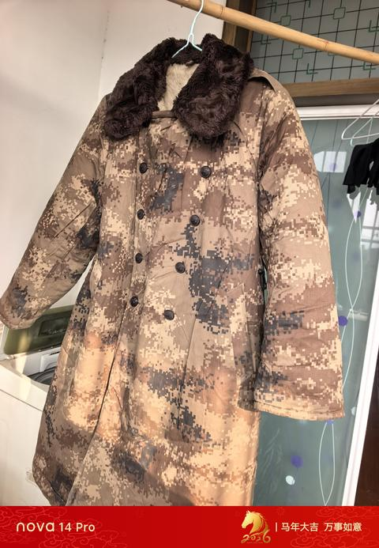

[toc]

# 问题

提问者：**<a href="https://www.zhihu.com/people/gu-long-yu-30">Groza</a>**
提问时间: 2017-1-10 0:55:3
总回答数: 2571
总访问量: 94398794

“大炮一响，黄金万两”，是一句著名的谚语。可是战争对于一个国家经济的影响到底有多大？有没有知友可以提供一些具体的数据？  
不限于古今中外，直接作战的单位或支持单位。  
\----------------------------------------  
谢谢大家的回答！还有，真的，别跑偏啊...

# 回答

回答者： **<a href="https://www.zhihu.com/people/zhuang-zuo-hen-wei-suo">装作很猥琐</a>**
回答时间: 2026-9-2 16:38:40
点赞总数: 303
评论总数: 47
收藏总数: 127
喜欢总数：11

打仗有多烧钱我不知道，不过我是军工厂子弟，从小就知道军工用的都是好东西，都是不计成本的，或者，你压根就说不清它成本到底是多少。

1

七十年代，因生产事故有人双腿粉碎性骨折，送到全国知名的骨科医院，医院一摊手：就这个严重程度来看，我们应该能处理，但是要好几次手术，每次都要用好几张X光胶片，而这东西紧缺，搞不到。送人过去的职工赶紧给厂里报告，厂里突然想起，军工生产上给薄壁件探伤用的就是X射线探伤，比方说一个油桶那么大的零件，几乎要用X光片贴满，所以这东西厂里有的是。厂里把型号告诉医院，医院确认能用，厂里大喜：这东西咱们有的是啊！于是让几个车间的检验科都来签字领用，然后给医院送去几大箱，医院院长激动坏了，说以后只要是我们厂里送来的优先安排（谁她妈没事天天骨折玩儿，还得骨折到非来你们这里不可的程度……）。

2

还是七十年代，产品里有各种弯来弯去的管路，管子折弯可是个麻烦事，特别是薄壁的管子，一弯就扁了。传统工艺是灌满沙子再折弯，如果要求再高，就灌满蜡再折弯，但是生产效率很低。国外有专用的弯管机，干的又快又好，也不知上升到哪一级批准的，进口一台，据说价格能占到我国当年外汇储备的百分之几，结果在国内转运时不幸损毁，没几个月，又买了一台！

3

某些精密零件检验前要擦的干干净净，用什么擦呢？当年我国纺织工业还不发达，织物擦拭容易留下纤维，所以用的是麂皮，也就是过去的高档眼镜布，纯天然的。关键是，麂皮擦零件，稍微脏一点直接就扔了。我初中时配眼镜，取眼镜时眼镜店推销说有更好的眼镜布，要加12块钱，我妈拿起来一看，这不就是麂皮吗？还这么小一块！“妈回去给你拿几张。” 没几天我妈拿回来好几张，比A4纸小一点，边缘也不齐，但是很好用。我印象麂皮一直用到九十年代，大约九十年代末，开始用专门的手套擦零件（麂皮擦完还有可能用手抓，所以后面直接戴手套，就用这个手套擦，织物掉纤维的问题可能是解决了），麂皮逐渐就不用了。

4

新产品试制，发现材料性能达不到要求，层层传递后，最初把任务给到了钢铁厂，钢铁厂攻关数年，总算解决了问题，但是随后有更多需求提了出来，然后钢铁厂就不干了，他们那里还有别的生产任务，要是全力给我们试制新材料，别的生产任务就完成不了。而且他们炉子太大，上次搞新材料试制的东西还有一大堆没处理完呢。于是乎领导大笔一挥，自建冶金厂，特种材料自己冶炼，请钢厂的专家们来指导，这个冶金厂仅用于生产一些特种材料，显然养不活自己，一直亏损了三十多年，直到本世纪，随着民营经济起飞，冶金厂总算扭亏为盈。因为省里给批了个省级计量检测机构的资质，可以出各种金属材料的检测报告，现在全厂就指着检验科活着。

5

产品出来了，要试车，一次试车烧掉多少油我也不知道，消息比较乱，有说几吨的，有说十几吨的。厂子后面有个专用的油库，经常要从专用铁路线往厂里运油。市里多次因为城市改造想要拆除专用铁路线，但是又解决不了运油的问题（因为油料是危化品，公路运输每次都要申请，审批下来才能运。审批不是问题，问题是很难保密，人家一统计你用了多少油，大致就能推算出你的产量了。铁路运输是怎么保密的我也不知道。），只好作罢，直到几年前，将油库和整个试车环节转移到了远离市区的地方，专用铁路才拆除。紧接着就听说洗零件的油也很麻烦，一打听才知道，每天洗零件用的油（好像是180号汽油）比烧掉的燃料油也没少多少。

————

看评论区挺热列哈。

大家都说什么指令经济，什么效率低下，什么浪费严重……

当然这是早年的问题，新世纪已经好多了哈。

但这并不是公有制/计划经济造成的。我也曾经以为，如果不搞计划经济，生产效率会更高，现在上了点年纪，了解到我国那时的情况，现在觉得当时能做到那样的程度已经很不容易了。

当时是个啥情况呢？

改开和恢复高考前，是工农兵大学生，那个水平实在是没法说，现在捏着鼻子都给他们算大专。截止1965年入学的学生，新中国也就培养了两百来万大学生，理工科大约是一半（早期非理工科的比例很高，参考目前越南的状态），这一百万理工科，大部分集中在大城市，大项目上。要知道我国可是在1964年爆了核弹的，就这一个项目没大几千大学生搞不定吧？所以老一辈人为啥对考大学如此看重，因为它们是亲眼见过三十年老师傅的待遇比不上刚毕业的大学生的。

所以在那时，不要说普通老百姓，就是县委书记，局长市长，接受过正经理工科高等教育的也没几个人。

在这种条件下，你还扯什么效率？！我国实际上是靠着大型工程和军工生产强行把重工业给拉动起来的，要是不搞大型工程和军工生产，民间压根用不了那么多的钢铁，用不了那么多的石油，甚至也用不了那么多棉布。所以当时要解决的首要问题是让工业化运转起来，至于浪费，效率低，那都不是主要问题，原本就是靠工农业剪刀差强行给工业输血啊！

大家都知道“上山下乡”，“老三届”，感觉他们都是被时代坑了。殊不知当时从城里去农村的初中、高中生们是确实改善了农村的生产力水平的。我现在看到有人说印度人奇葩，非洲人奇葩，不知道怎么干活，就想起我一个老三届的长辈说过的话：当时农村的农民，除了抡锄头我们比不过他们，其他所有的活儿，农民的效率都不如学生娃。“妈的长个脑子不知道用，蠢得跟猪一样。”

在这么个背景下，效率低下，浪费严重是整个社会普遍存在的现象。而大型国企的生产效率相对于整个社会来说，已经是高效率啦！！

————

现在啥情况：天天加班，周周考核，进出打卡，到处监控，想从厂里顺店啥东西没那么容易了。

现在效率确实高多了，浪费也少多了，但是作为军工生产，有个严重的问题，就是弹性不足。

要知道现在是和平时期，如果和平时期，工人都不能做到过年放满七天假，那打起仗来怎么办？要知道军工生产依赖很多经验丰富的老工人、老技术员，那不像深圳电子厂随便弄几千人进来就能干活的。现在预留的弹性太小了。

  

原文地址：[(装作很猥琐)战争有多烧钱？](https://www.zhihu.com/question/54594605/answer/2078522246402938073) 

# 评论

1. <a href="https://www.zhihu.com/people/yun-shang-ting">云上听</a> (<small title="广东">2026-9-2 23:32:21</small>): 苏联大哥就是这么玩垮台的，你的成本让别人承担，显然不可持续。
   - <a href="https://www.zhihu.com/people/7-83-24-89">你的我</a> (<small title="四川">2026-9-3 7:29:57</small>): 不是自己的钱花起来就是不心疼
   - <a href="https://www.zhihu.com/people/palaford">茂陵文渊</a> (<small title="回复于 2026-9-3 11:52:12/湖北"> ✉️:你的我</small>): 这是一方面，主要还是没有市场机制确定成本收益，根本不知道成本多少，反正没了就要指标，那可不随便造嘛。有人说别处缺，我一个小兵又管不着，我省下来别人又用不着，万一还给我缩减指标，让我工作难做，那我图啥？一旦引入效益机制，这些问题自然就消失了，浪费的每一分一毫，最终都体现在营收上，如果激励制度合格，还体现在每个人的工资上，各种防浪费制度、心态也就自然建立起来了
2. <a href="https://www.zhihu.com/people/di-guo-zhi-zi-6">吾乃阿尔法瑞斯</a> (<small title="上海">2026-9-3 12:49:55</small>): 军工生产至少30-40%成本是浪费掉，但是但又不能一刀切控制成本，就像擦屁股每次要用两三张，但粘着屎草纸拼起来也不过半张，不能因此得出结论控制成本每次只能用半张草纸擦屁股
   - <a href="https://www.zhihu.com/people/jack-73-35">JACK</a> (<small title="河北">2026-9-3 13:3:50</small>): 精辟［赞］
3. <a href="https://www.zhihu.com/people/da-bai-sha-50-80">大白鲨</a> (<small title="江苏">2026-9-3 10:49:3</small>): 仗打败了花的钱更多；
 
亡国了就不光是花钱的问题了。
4. <a href="https://www.zhihu.com/people/victor680">victor680</a> (<small title="广东">2026-9-2 21:0:12</small>): 没法产生规模效益，有时候跟丢钱进去差不多。
   - <a href="https://www.zhihu.com/people/six-18-84">你大哥我six</a> (<small title="河北">2026-9-2 22:23:24</small>): 主要还是国企思维，因为花的钱不是自己的，随心所欲惯了。举例就是军工历史上著名的酸性推进剂腐蚀弹体，最终三千万枚火箭弹销毁。实际上从七十年代建厂的时候（七二年）就有质检员发现推进剂腐蚀问题，但是一方面是稳稳十年，质检员发现问题都不知道向哪提交问题，军代表只管一个劲催生产进度。最终到国防科工委发现问题的时候，都已经生产7-8年了，全国当时应该不少于8家军工厂在生产，因为我们那会是小三线军工厂，年产量才40万枚。连续生产了7-8年也就300万枚的水平。
   - <a href="https://www.zhihu.com/people/84-65-62-71-62">老单</a> (<small title="回复于 2026-9-2 22:57:13/山西"> ✉️:你大哥我six</small>): 不是国企思维的事，是初次干，没有石头可摸［吃瓜］再说这都是性命攸关的事，成了花多少钱都不算多，不成花再少的钱也是浪费
   - <a href="https://www.zhihu.com/people/six-18-84">你大哥我six</a> (<small title="回复于 2026-9-3 11:51:40/河北"> ✉️:老单</small>): 还真不是头次，69式40火箭弹技术来源于苏联的rpg-7，弹体本来使用的就是tnt，我朝1970年定型的时候自己创新的好不好。
   - <a href="https://www.zhihu.com/people/84-65-62-71-62">老单</a> (<small title="回复于 2026-9-3 11:56:37/山西"> ✉️:你大哥我six</small>): 这就是第一次呀，第一次改装药，有啥问题么？
   - <a href="https://www.zhihu.com/people/fcfdff">fcfdff</a> (<small title="回复于 2026-9-3 12:3:52/安徽"> ✉️:你大哥我six</small>): 我不要成本，我要塔山。jg企业凝视深渊太久了
   - <a href="https://www.zhihu.com/people/six-18-84">你大哥我six</a> (<small title="回复于 2026-9-3 13:17:5/河北"> ✉️:老单</small>): rpg-7用的是tnt，我国技术人员创新使用的是苦味酸炸药。
   - <a href="https://www.zhihu.com/people/84-65-62-71-62">老单</a> (<small title="回复于 2026-9-3 13:46:27/山西"> ✉️:你大哥我six</small>): 创新就是第一次呀
   - <a href="https://www.zhihu.com/people/six-18-84">你大哥我six</a> (<small title="回复于 2026-9-3 13:53:53/河北"> ✉️:老单</small>): 苦味酸和硝化棉不做钝化会腐蚀药桶是常识［思考］［思考］［思考］［赞同］
   - <a href="https://www.zhihu.com/people/84-65-62-71-62">老单</a> (<small title="回复于 2026-9-3 14:20:41/山西"> ✉️:你大哥我six</small>): 你现在是常识，但当时的军工不造呀
   - <a href="https://www.zhihu.com/people/six-18-84">你大哥我six</a> (<small title="回复于 2026-9-3 14:24:8/河北"> ✉️:老单</small>): 您是说江南机械厂研制并改进连这点基本常识都不知道［思考］［思考］［思考］［赞同］
   - <a href="https://www.zhihu.com/people/dong-feng-dao-dan-48">东风捣蛋</a> (<small title="回复于 2026-9-3 14:43:42/北京"> ✉️:你大哥我six</small>): 多少？三千万？
   - <a href="https://www.zhihu.com/people/84-65-62-71-62">老单</a> (<small title="回复于 2026-9-3 17:4:52/山西"> ✉️:你大哥我six</small>): 你知道军工厂的基础么？那时工人文化程度普遍都不高，技术人员大多也是野鸭子上架，那个全家造手榴弹的教逢春是鞭炮世家出身，石成玉是炉匠出身，吴运铎是煤矿工人后车间学徒，李空谷是教员出身
   - <a href="https://www.zhihu.com/people/six-18-84">你大哥我six</a> (<small title="回复于 2026-9-3 17:57:29/河北"> ✉️:老单</small>): 江南机械厂不是啊，282厂的前身是柳州三十兵工厂，留苏军官李刚川拿回rpg-7全部资料之后，江南机械厂进行的研制和改进，就是我们原来那个三线厂，带过去的资料工程师最差也是个高中生，苦味酸在弹药的副作用已经流行100多年了。
   - <a href="https://www.zhihu.com/people/84-65-62-71-62">老单</a> (<small title="回复于 2026-9-3 19:25:14/山西"> ✉️:你大哥我six</small>): 曹［吃瓜］是军人不是工程师，虽然弹药流行100多年，可我们的工厂基本上是156工程才起步，以前都是小炉匠修修补补，电影《第二个春天》是造军舰《螺旋》是实验飞机新装备
   - <a href="https://www.zhihu.com/people/six-18-84">你大哥我six</a> (<small title="回复于 2026-9-3 20:42:8/河北"> ✉️:东风捣蛋</small>): 三千万都算少了，光69式40火箭弹就至少千万发，69式40-1大概是73年的，也生产了四五百万发，还有经典的107-122mm火箭弹，一样的用的苦味酸炸药，还有大口径炮弹……！上述用回tnt和后续双基药已经是上世纪八十年代了。
5. <a href="https://www.zhihu.com/people/palaford">茂陵文渊</a> (<small title="湖北">2026-9-3 11:43:52</small>): 果然，同样的东西，有的地方紧缺，有的地方可以随便浪费，这就是计划经济的典型特点。因为没有市场机制矫正价格，所以谁能拿到指标，谁就可以随便浪费
   - <a href="https://www.zhihu.com/people/li-kui-19-10">可能比较笨</a> (<small title="江苏">2026-9-3 12:0:56</small>): 也不是浪费的问题，主要是没有民营企业家去解决又快又方便又省钱的替代方案。
   - <a href="https://www.zhihu.com/people/palaford">茂陵文渊</a> (<small title="回复于 2026-9-3 13:33:37/湖北"> ✉️:可能比较笨</small>): 就是浪费的问题，无论是苏联还是计划经济时期中国，浪费问题都是触目惊心的，有大量文献支撑，知乎都能搜到不少。这是指标超出人类的计划能力与监管永远不够的核心缺陷造成，没有市场经济的成本收益约束，靠人力强行维持的计划经济就是这样的
   - <a href="https://www.zhihu.com/people/yu-sheng-19-12">炸平荒坂塔</a> (<small title="回复于 2026-9-3 13:40:58/海南"> ✉️:可能比较笨</small>): 啊，又慢又麻烦又费钱，那就是浪费嘛
   - <a href="https://www.zhihu.com/people/li-kui-19-10">可能比较笨</a> (<small title="回复于 2026-9-3 15:8:31/江苏"> ✉️:炸平荒坂塔</small>): 两酸两碱得制造工艺不是在迭代么，还有生产化肥得工艺不也是在演进么。
   - <a href="https://www.zhihu.com/people/li-kui-19-10">可能比较笨</a> (<small title="回复于 2026-9-3 16:6:40/江苏"> ✉️:炸平荒坂塔</small>): 国企缺乏这个演进得动力。［尴尬］［尴尬］
   - <a href="https://www.zhihu.com/people/wu-li-yun-zhong-64">雾里云中</a> (<small title="上海">2026-9-3 16:17:11</small>): 军工不靠市场会浪费，但只靠市场会完蛋，资本没法负担政策风险
   - <a href="https://www.zhihu.com/people/palaford">茂陵文渊</a> (<small title="回复于 2026-9-3 17:0:33/湖北"> ✉️:雾里云中</small>): 军工客户唯一、竞争有限比较特殊，但是现在的军工也融入市场经济大框架里，绝大部分材料都是要买的，要核算成本的，审计机构深度参与，有些军工企业还上市了，有营收要求。有了这些硬指标纠偏，至少浪费问题得到了很有效的解决。我说的主要是物资浪费，钱不那么重要。以前的浪费称得上触目惊心，以前看过一篇文章的形容是打4个鸡蛋才能煎出一个荷包蛋。
   - <a href="https://www.zhihu.com/people/mi-ha-yi-qia-la">米哈伊卡拉</a> (<small title="山东">2026-9-3 18:29:30</small>): 计划经济，应该是指令经济
6. <a href="https://www.zhihu.com/people/chi-yan-92-1">赤琰</a> (<small title="内蒙古">2026-9-4 10:27:40</small>): 最后一个如何保密的其中一环我知道一乃乃。
 
这东西的保密是系统性工作。其中最大不可控对象是“人”。
 
而人的筛选是系统（体制）在不知不觉中进行的，比如能接触到这部分信息的人员只有在岗位上待了25年及以上的家口全在国内并且祖孙三代无任何外接史的人。
 
我说的这个是最外围的一环。
 
至于我知道这个是因为我同事他爸爸每次新型军舰检修或者新舰建造突击赶工需要的专业技术人员突然增加的时候他爸爸因为临退休了被厂里指派去配合工作。工作内容有打扫卫生（不限制区域--这很牛逼），监护，出入厂人员的证书信息核对（门卫）。
 
而他爸爸并不是造船厂的就是国央企的一线工人在厂里兢兢业业的在基层待了几十年。简单地说就是工龄够、社交面单一、经过了组织多年的教育、经过了组织考验。
 
为什么说经过了考验呢，我同事这么多年问他爸军舰里啥样，他爸说就是铁疙瘩零件很多。在问得多了就来脾气了，没事好好上学考里面上班就啥都知道了，瞎问啥。再说我一个初中毕业生靠着分配工作获得的职位，我哪懂那些玩意。
7. <a href="https://www.zhihu.com/people/wang-bao-yun-94">钛如沐春风</a> (<small title="陕西">2026-9-3 12:32:1</small>): 本质是生产消费链条是全封闭的，没有竞争，技术提高全靠模仿或者仿制
8. <a href="https://www.zhihu.com/people/feng-qing-yue-ming-52-95">春和景明</a> (<small title="陕西">2026-9-3 17:42:30</small>): 那个年代的领导是有良心的，现在这种事，就怕你报工伤，影响单位业绩，怎么还会冒领单位的材料送给医院，按什么名义送？
9. <a href="https://www.zhihu.com/people/martin-feng-34">不喜欢喝啤酒的人</a> (<small title="上海">2026-9-3 16:44:18</small>): 你说这就是占用了70%资金成本，只产出30%的原因？
   - <a href="https://www.zhihu.com/people/xin-yi-73-29-62">凌志君说</a> (<small title="河北">2026-9-4 15:6:24</small>): 不是。军工厂的最大成本在这里：和平时期没有产量，还要维护生产线，保留最低配置的工人。
10. <a href="https://www.zhihu.com/people/zhiutlkzd">巧克力星人</a> (<small title="浙江">2026-9-3 18:0:29</small>): 现在大家知道《高山下的花环》里面打不响的炮弹是怎么生产出来的吧？［大笑］
11. <a href="https://www.zhihu.com/people/zhi9srqklci">MOBIUS</a> (<small title="陕西">2026-9-4 10:10:25</small>): 计划经济的优越性
12. <a href="https://www.zhihu.com/people/wu-li-yun-zhong-64">雾里云中</a> (<small title="上海">2026-9-3 16:11:22</small>): 坏消息是严格保密会大大降低效率，好消息是降完的效率也能接受，不碍事
13. <a href="https://www.zhihu.com/people/1385998">猪屁登</a> (<small title="福建">2026-9-3 13:14:5</small>): 以前我听军工厂的人聊天过，军代表真安逸
14. <a href="https://www.zhihu.com/people/xyzwwwwwwww">TripleZ</a> (<small title="上海">2026-9-3 16:56:10</small>): 国企以厂为家啊
15. <a href="https://www.zhihu.com/people/afsfsfsdfsaf">afsfsfsdfsaf</a> (<small title="浙江">2026-9-3 13:36:29</small>): 做航发的
16. <a href="https://www.zhihu.com/people/25-38-48-78">我爱游泳</a> (<small title="湖北">2026-9-3 21:9:54</small>): 这么浪费，不可能长久
17. <a href="https://www.zhihu.com/people/li-si-77-7">李四</a> (<small title="广东">2026-9-3 12:15:23</small>): 抗美援朝期间最典型的“奸商”案件是‌上海大康药房经理王康年案‌，他因向志愿军提供假药被判处死刑 。此外，武汉、天津等地也查处了多名贩卖劣质军需物资的不法商人 。
 
所以第一段里“军工用的都是好东西”不成立
18. <a href="https://www.zhihu.com/people/80-7-41-48">东方时空</a> (<small title="湖北">2026-9-3 13:59:53</small>): 我对军用品的固执印象也来源于此，总觉得军用品是同价位里性价比最高的最耐用的，所以头脑一热买了很多基本上穿不上的衣服，比如这件［doge］
 

19. <a href="https://www.zhihu.com/people/mage1109">mage1109</a> (<small title="山东">2026-9-3 8:39:19</small>): 做航发的吧。
    - <a href="https://www.zhihu.com/people/ji-jie-xiao-xiang">机械小象</a> (<small title="四川">2026-9-4 3:52:41</small>): 还得是主机厂

=[评论](./attachments/comments.json)

