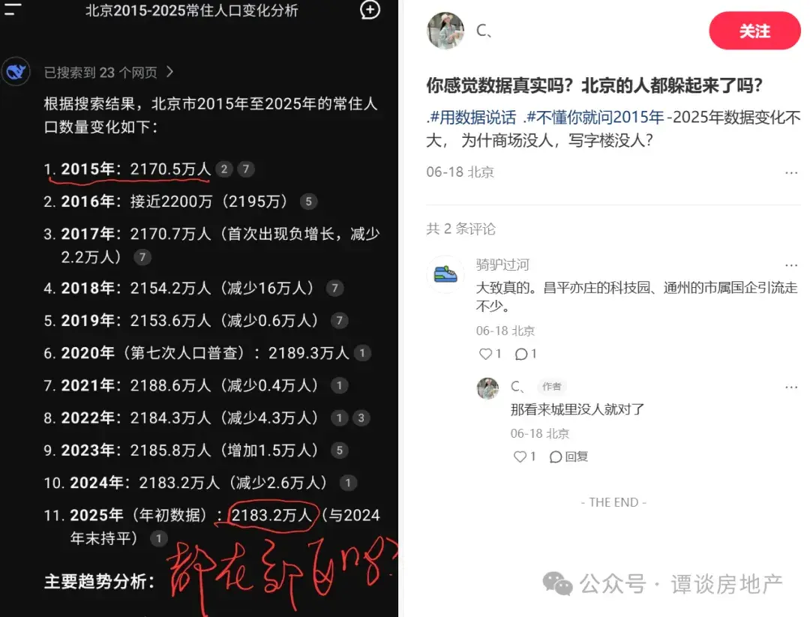
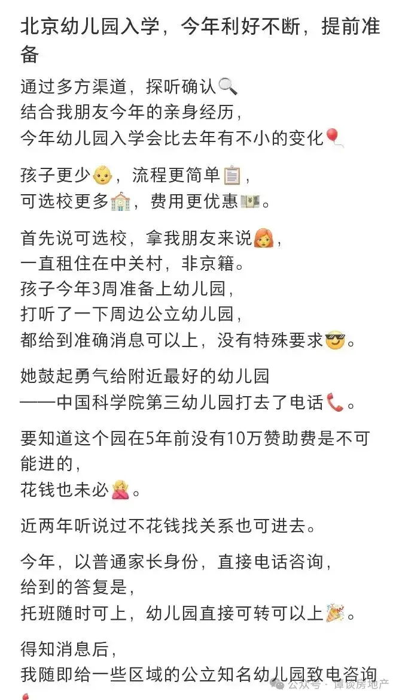
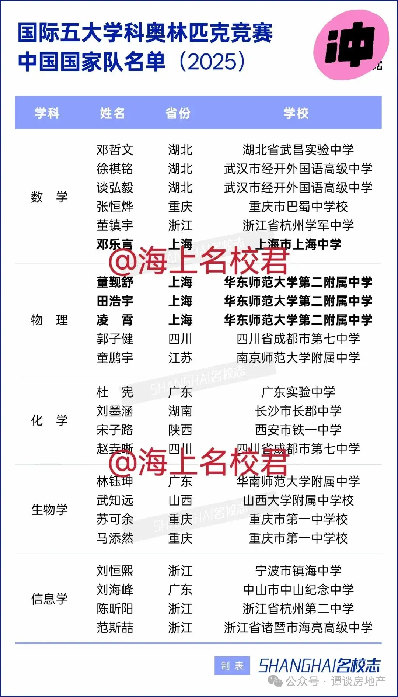
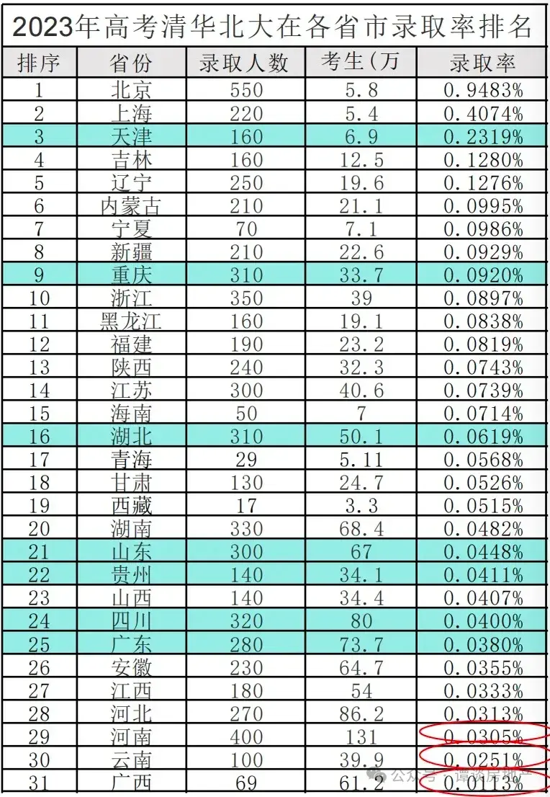
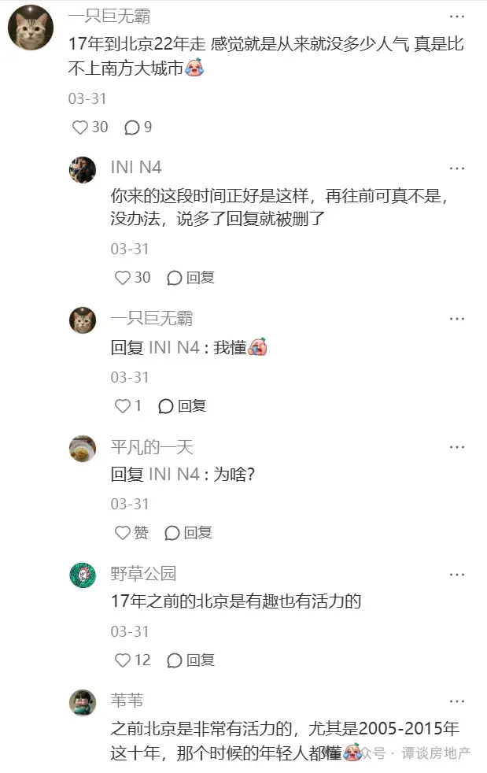

[toc]

# 问题

提问者：**<a href="https://www.zhihu.com/people/ray-83-57">ZERO</a>**
提问时间: 2023-9-15 17:57:7
总回答数: 453
总访问量: 3351320

如果一线城市房价都跌一半，会发生什么？

# 回答

回答者： **<a href="https://www.zhihu.com/people/wo-de-58-29-23">谭谈投研</a>**
回答时间: 2026-7-22 19:43:30
点赞总数: 144
评论总数: 27
收藏总数: 46
喜欢总数：5

北京去年常住人口减少2.6万人，这是官方公布的数据，但实际减少的规模可能远不止于此。这些年，北京的确在慢慢“变老”——高昂的生活成本、激烈的竞争压力，让这座城市逐渐成为一座“幸存者的城市”。能从容留下的，大多是早已扎根、享受过时代红利的那一代；而对如今的年轻人来说，单凭自己的努力，想在这里站稳脚跟，已经越来越难了。

  

  

  

网上看到几个案例，可能能够描述当下北京的困境。

一位40岁的老哥，这些年一直在拼积分落户，原本指望今年能多放点名额，结果还是卡在6000个。他盘算了一下，照这进度，45岁前基本没戏，过了45岁更是彻底凉凉。为了孩子上学，索性收拾包袱，转战其他城市了。

另一位老哥，算是吃到了互联网黄金十年的红利，早年买了房，也算赶上了好时候。可惜2021年头脑一热，在望京高点接盘了个大户型。那会儿事业正顺，房产增值，难免有点飘。结果现在这套房从巅峰的2000多万，直接缩水到1500-1600万。更倒霉的是，去年初被公司优化后，工作一直没着落。最后心一横，卖房还贷，揣着剩下的钱，直接转战二线城市躺平了。

他最大的情绪并不是失业的焦虑或者对未来的迷茫，而是一种愤懑。按他的话说，作为一个90后，又是重点大学毕业，勤勤恳恳工作加班，按部就班的结婚买房生子，而且是二胎，算是非常努力上进的人，完全没有躺平，堪称时代标兵。

可他的回报在哪呢？长期失业的焦虑，房价断崖式下跌的打击，让他彻底失去了成就感，甚至开始怀疑自己就是个彻彻底底的输家。以前刷到网上年轻人“不婚不房”的言论，他还觉得是自暴自弃，如今才恍然大悟——原来小丑竟是他自己。

也不能怪他负能量太多，社会就如此对待他，要让他以德报怨也太强人所难了。

现在离开北京的青壮年不是少数，为什么是青壮年离开呢，因为他们没钱。北京已经不是全国人民的北京了，而是有钱人的北京。

青壮年的出走，正在加速北京的衰老。如今的北京，满街是精神矍铄的老年人，疲于奔命的中年人，和丧失朝气的年轻人。这座城市像一个非常有钱，但是垂垂老矣的富豪。不知道这样的北京，是否是你喜欢的北京？

  

  

  

  

很多人说为了下一代，还是要留在北京。怎么说呢，首先我还是觉得大家先管好自己吧，自己都过不好就别想超过自己能力的事情了。

其次，北京的教育真的好吗？

看看今年国际奥赛五大学科国家队名单，23人榜单上北京颗粒无收，长江以北仅占2席，其余几乎被湖北、上海、浙江、广东包揽。北京家长总把“内卷”挂嘴边，尤其海淀家长更是闻风丧胆。可放到全国擂台上一比，才发现所谓的“卷王”不过如此。

  

  

  

北京的教育资源确实优质，但远谈不上"一骑绝尘"——与上海、重庆、成都、武汉、西安、南京等城市相比，其优势并不明显。北京真正的"杀手锏"在于政策红利：比如清北录取率断层领先。但这真是北京考生实力超群吗？恐怕未必，至少山东考生第一个表示不服。

  

  

  

最近看到一个帖子说，2017年是北京的转折点。但仔细想想，那一年又何止是北京的拐点？对大多数人来说，2017年更像是一道分水岭，自此之后，很多事情的轨迹都变了。时代洪流中，某些关键年份会悄然改变个人和城市的命运走向，只是当时未必能察觉。

  

  

  

 **星球（谭谈财经）成员突破 200 人，感恩每一份相遇。为了更好地服务星球朋友，还是决定要限制下星球人数，所以打算把定价从 199 元上调至 258 元。** 

 **为回馈老粉，特设三天原价缓冲期，三日后正式执行新价。初心不变，持续输出优质内容。** 

  

  

原文地址：[(谭谈投研)如果一线城市房价都跌一半，会发生什么？](https://www.zhihu.com/question/622222729/answer/2063348468400256768) 

# 评论

1. <a href="https://www.zhihu.com/people/xia-wu-cha-6-32">小龙女倒拔垂杨柳</a> (<small title="上海">2026-7-23 8:27:47</small>): 没什么，6万多买的，现在小区最低的挂牌3.5，该上班上班，该休息休息，阻止不了决定不了的事情，去考虑也是多余。
2. <a href="https://www.zhihu.com/people/92-41-80-52">焚琴煮鹤</a> (<small title="陕西">2026-7-23 7:52:5</small>): 你还指望能卖1500万［捂嘴］
   - <a href="https://www.zhihu.com/people/li-zhe-hua-93">李泽华Julian</a> (<small title="江苏">2026-7-23 10:19:53</small>): 两千万的房子跌到一千五六百万，这根本是洒洒水。
3. <a href="https://www.zhihu.com/people/wei-xue-zhong-79">魏雪钟</a> (<small title="广东">2026-7-23 5:59:57</small>): 计较吧，这个的，本身算投机，反市场，咋不言，本身值价呢？
4. <a href="https://www.zhihu.com/people/li-bai-liu-33-41">礼拜六</a> (<small title="北京">2026-7-23 9:37:26</small>): 很遗憾没能留住大家，但我们这些土著也无能为力，我也时常感觉北京的在规划上的不近人情，烟火气，活力一点点的流逝，越来越像养老院、只能说：对不住各位了
5. <a href="https://www.zhihu.com/people/wang-xing-64-1">吃咸萝卜不操心</a> (<small title="北京">2026-7-22 20:37:39</small>): 北京常住人口减少2.6万人影响房价，就是胡说。疏通到雄安新区的，大多数周末回北京［捂脸］ 另外离开北京回老家的就更不用提了，因为这群人留下也很难买京房，根本不是客户群体
   - <a href="https://www.zhihu.com/people/lu-ren-90-91">吕忍</a> (<small title="河北">2026-7-22 21:23:58</small>): 不尽然［思考］
   - <a href="https://www.zhihu.com/people/79-58-94-34-37">远方</a> (<small title="北京">2026-7-23 5:34:23</small>): 租房的都少了
   - <a href="https://www.zhihu.com/people/newsoul-82">twkkkkk</a> (<small title="湖北">2026-7-23 8:44:56</small>): 以前最牛逼的城市都不行了，反而三四线城市又行了
   - <a href="https://www.zhihu.com/people/xiao-xing-xing-84-70-42-47">小星星</a> (<small title="北京">2026-7-23 8:51:52</small>): 有两个很多年前就离开北京回老家的同学，如果一直待在北京的话，以北京现在的房价，我相信他们能买得起房子。
6. <a href="https://www.zhihu.com/people/wei-xue-zhong-79">魏雪钟</a> (<small title="广东">2026-7-23 6:9:6</small>): 牵啥房价者，可言！
7. <a href="https://www.zhihu.com/people/wei-xue-zhong-79">魏雪钟</a> (<small title="广东">2026-7-23 6:8:11</small>): 听说有：一个伟大，一个大韦波斯往年！一一二者孰是？
8. <a href="https://www.zhihu.com/people/lian-gang-73">练刚</a> (<small title="广东">2026-7-23 9:12:37</small>): 有房子不等于就衣食无忧了，还要为了一日三餐而奔波的
9. <a href="https://www.zhihu.com/people/wei-xue-zhong-79">魏雪钟</a> (<small title="广东">2026-7-23 6:2:25</small>): 反马克思呢？挑战者，厉害！
10. <a href="https://www.zhihu.com/people/wei-xue-zhong-79">魏雪钟</a> (<small title="广东">2026-7-23 6:1:10</small>): 言此何意？让人很难，明白哦！……
11. <a href="https://www.zhihu.com/people/wei-xue-zhong-79">魏雪钟</a> (<small title="广东">2026-7-23 6:2:55</small>): 某种话，厉害……
12. <a href="https://www.zhihu.com/people/zhong-jun-yan-35">Mark Zhong</a> (<small title="新西兰">2026-7-23 8:44:41</small>): 北京这么多高校，衰老不到哪里去
13. <a href="https://www.zhihu.com/people/wei-xue-zhong-79">魏雪钟</a> (<small title="广东">2026-7-23 6:5:13</small>): 这部分人，一般逆伊朗！可查问！
14. <a href="https://www.zhihu.com/people/han-han-21">handsome Bol</a> (<small title="北京">2026-7-23 8:26:8</small>): 房价直接腰斩会引爆连锁债务危机，大量房贷购房者资产缩水却依然要足额还贷，断供潮出现，银行坏账飙升收紧信贷。土地收入锐减，地方财政承压，基建和公共开支被迫缩减，建材、装修等上下游行业大批失业。大家资产缩水引发消费收缩，经济下行压力加大，同时持币观望情绪蔓延，楼市会长期陷入低迷，短期看似利好刚需，整体社会经济代价会非常沉重。
15. <a href="https://www.zhihu.com/people/wei-xue-zhong-79">魏雪钟</a> (<small title="广东">2026-7-23 6:6:19</small>): 这部分人，一般逆伊朗！（主要）（可查问！）倒是！
16. <a href="https://www.zhihu.com/people/wei-xue-zhong-79">魏雪钟</a> (<small title="广东">2026-7-23 6:14:39</small>): 文者押Money ？超马克思可押！
17. <a href="https://www.zhihu.com/people/zhang-ying-51-36">小哈</a> (<small title="河南">2026-7-23 10:1:8</small>): 说明工具箱里面工具多啊，随便拿回来一个，房价就稳了
18. <a href="https://www.zhihu.com/people/lishinian">Timer</a> (<small title="北京">2026-7-22 21:50:37</small>): 咱聊房价就聊房价
 
非要一个财经UP主聊教育……
 
估计五大联赛咋回事都没有弄清楚呢…… 当然也可能是揣着明白装糊涂
    - <a href="https://www.zhihu.com/people/voice-93-31">Voice</a> (<small title="北京">2026-7-23 10:34:8</small>): 可以看看浙大和复旦本省招生比例
19. <a href="https://www.zhihu.com/people/okama-62">Nagisa Kaworu</a> (<small title="重庆">2026-7-23 6:36:45</small>): 看到我大重庆了，不愧是从小学三四年级就开始选苗子的地方［doge］。
20. <a href="https://www.zhihu.com/people/wei-xue-zhong-79">魏雪钟</a> (<small title="广东">2026-7-23 5:57:36</small>): 某种话：够福幸，有人换！
21. <a href="https://www.zhihu.com/people/an-xiao-shi-79">叨叨叨叨</a> (<small title="浙江">2026-7-23 7:51:47</small>): 北京就应该是有钱人的北京啊，首都嘛，必须有钱人的地盘

=[评论](./attachments/comments.json)

