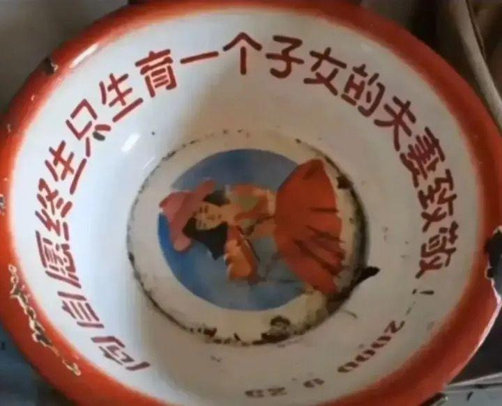
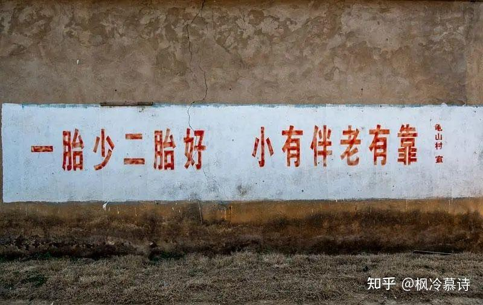
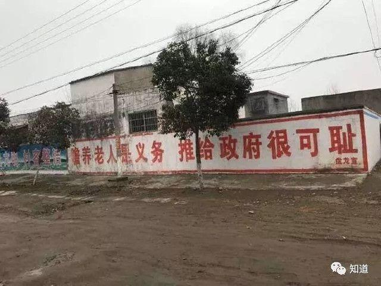
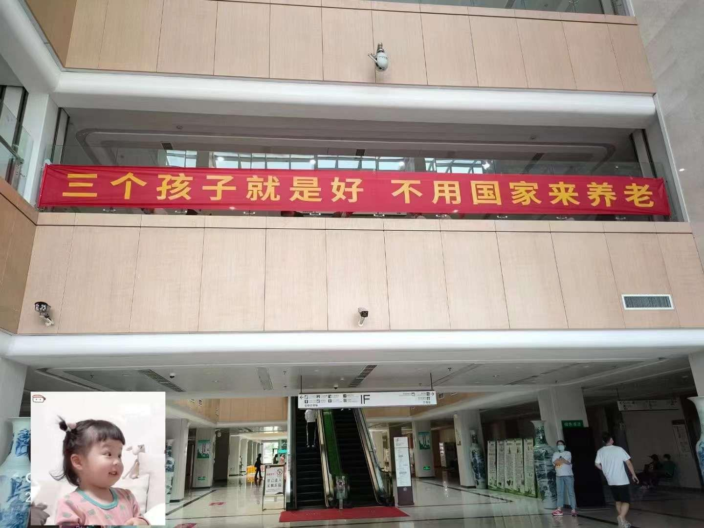
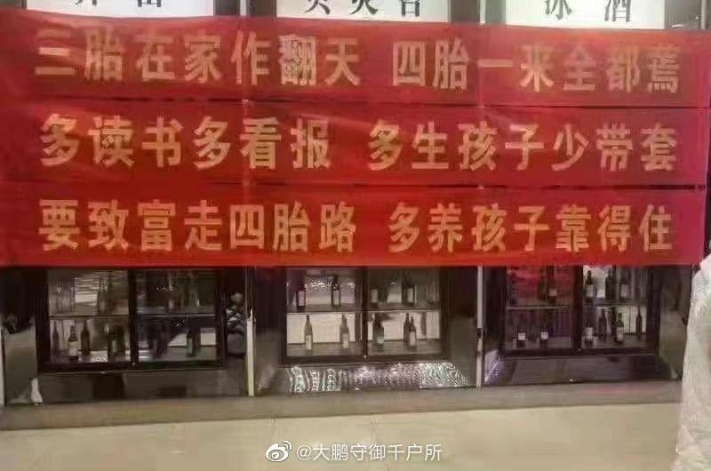
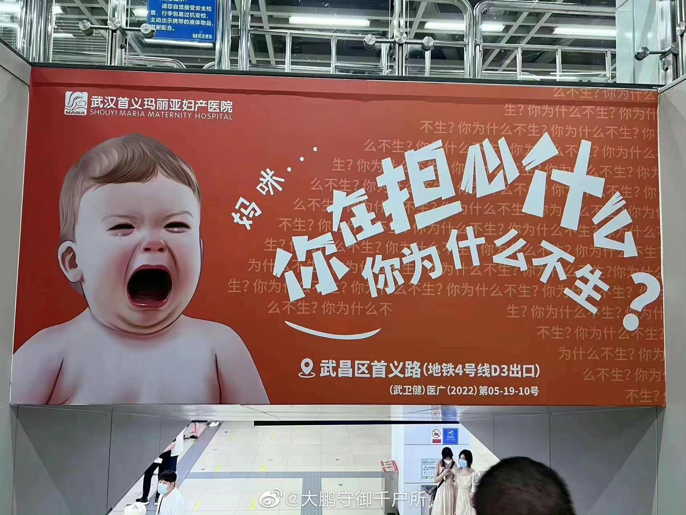
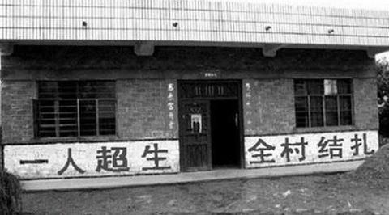

[toc]

# 问题

提问者：**<a href="https://www.zhihu.com/people/zhong-guo-wang-25">中国网</a>**
提问时间: 2022-7-28 16:32:22
总回答数: 285
总访问量: 1481483

来源：海外网

据韩联社报道，韩国统计厅7月28日发布的一份数据显示，韩国2021年包括外国人在内的总人口数为5173.8万人，较一年前减少9.1万人。这是韩国成立70多年以来，总人口首次出现负增长。

对于人口负增长的原因，韩国统计厅解释称，一是人口出现自然减少，二是受疫情影响，临时回国的旅外侨民再次外流，另外外国人人口也有所减少。

统计结果还显示，目前韩国女性人口多于男性；65岁以上老龄人口增至871万，占总人口的六分之一；85岁以上超高龄人口比重也在上升；15~64岁劳动年龄段和儿童人口继续减少，平均4.2个劳动人口就要抚养一名老人；韩国一半人口居住在首都圈。​​​​

# 回答

回答者： **<a href="https://www.zhihu.com/people/44-47-40-36">路子墨的小墨</a>**
回答时间: 2022-7-30 21:6:41
点赞总数: 338
评论总数: 17
收藏总数: 83
喜欢总数：38

  

  

  

  

  

  

  

  

  

原文地址：[(路子墨的小墨)韩国人口建国以来首次负增长，老年人接近 900 万占六分之一，将给社会带来哪些影响？](https://www.zhihu.com/question/545784853/answer/2600852889) 

# 评论

1. <a href="https://www.zhihu.com/people/zui-yan-ran-70">知乎用户VP7FpD</a> (<small title="广东">2022-7-31 9:40:55</small>): 看着标语真觉得好恶心啊［大哭］，谁说这个我估计忍不住不说“滚”
2. <a href="https://www.zhihu.com/people/cityu-macau">U235</a> (<small title="北京">2022-8-1 11:43:43</small>): 恶意合订
3. <a href="https://www.zhihu.com/people/junyw">junyw</a> (<small title="浙江">2022-7-31 8:10:13</small>): 媒体：养老不能靠政府
4. <a href="https://www.zhihu.com/people/yi-liang-jiu-15">一量酒</a> (<small title="上海">2022-8-1 14:49:30</small>): 多生孩子少带套，收藏了［赞］［赞］［赞］
5. <a href="https://www.zhihu.com/people/tory4-0">彻底失败</a> (<small title="广东">2022-8-7 10:28:0</small>): 这些标语隔着手机屏幕都能感觉到一股浓浓的恶臭［尴尬］
6. <a href="https://www.zhihu.com/people/5-64-40-28">心画</a> (<small title="吉林">2022-7-31 9:38:54</small>): 气死我了［大哭］［大哭］别发了别发了
7. <a href="https://www.zhihu.com/people/fu-cha-73-88">知乎用户C0yiH7</a> (<small title="河南">2022-8-3 14:45:28</small>): 吐了［尴尬］
8. <a href="https://www.zhihu.com/people/qing-yin-zhan-yu">知乎用户I5QRo4</a> (<small title="北京">2022-8-1 21:26:3</small>): 什么好开［飙泪笑］［飙泪笑］［飙泪笑］［飙泪笑］［飙泪笑］［飙泪笑］
9. <a href="https://www.zhihu.com/people/neko-46-49-5">Neko</a> (<small title="陕西">2022-8-20 8:51:55</small>): 用自己的错误惩罚别人［飙泪笑］
10. <a href="https://www.zhihu.com/people/fish-82-67-32">fish</a> (<small title="重庆">2022-8-4 12:25:56</small>): 人格分裂吧
11. <a href="https://www.zhihu.com/people/zhou-liang-61-8">MKF1998</a> (<small title="广西">2022-8-4 23:40:25</small>): 已举办［生气］［生气］［生气］
12. <a href="https://www.zhihu.com/people/upup-81-16">宁静致远</a> (<small title="湖北">2022-8-4 11:18:21</small>): 倒数第二个是妇产医院的广告
13. <a href="https://www.zhihu.com/people/luo-zheng-chang-95">CM jggjugh</a> (<small title="重庆">2022-8-10 22:17:2</small>): 合订本［赞同］［赞同］
14. <a href="https://www.zhihu.com/people/2-87-12-32">狐狸</a> (<small title="内蒙古">2022-8-9 9:57:25</small>): 最后一个精辟
15. <a href="https://www.zhihu.com/people/zhangwew3">nihao</a> (<small title="重庆">2022-8-11 21:5:28</small>): 计划生育，利国利民。
16. <a href="https://www.zhihu.com/people/zhao-hang-85-23-88">不可申诉</a> (<small title="广东">2022-8-14 4:4:39</small>): 奶奶滴，为什么不生，生，生！
17. <a href="https://www.zhihu.com/people/wang-jian-75-83">王健</a> (<small title="山东">2022-8-29 12:35:18</small>): 最后这🐔好🔥

=[评论](./attachments/comments.json)

