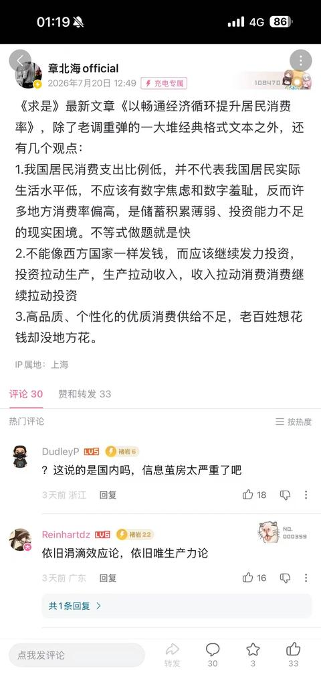

[toc]

# 问题

提问者：**<a href="https://www.zhihu.com/people/wang-zhi-qiang-78-6">jdrhrchd</a>**
提问时间: 2025-11-25 8:44:25
总回答数: 390
总访问量: 814647

如果人民币与美元汇率一比一那不就瞬间超越美国？所以超越的关键就在汇率，汇率的关键在于资源和高科技，资源可遇不可求，高科技想要超越，那不就是加班和少福利多研发吗。

所谓中等收入陷阱：工资的提升超过生产力的提升。强行提升最低工资标准，会使得低端产业破产，在没有足够多的高端产业支撑的时候就把低端舍弃，结果就是高端上不去低端又没了，不上不下。提升工资这是一种诱惑，诱惑的下面是陷阱

为什么墨西哥没有通过分配达到美国的高度呢？为什么当初日元升值就经济停滞三十年？因为这本质是等于提前把潜力释放了，日元升值，出口企业收入大减，研发投入也大减，无力研发，无力继续提升汇率，经济彻底停滞

# 回答

回答者： **<a href="https://www.zhihu.com/people/tou-ming-ren-jian-33">透明人间</a>**
回答时间: 2025-12-31 17:2:7
点赞总数: 5057
评论总数: 374
收藏总数: 1212
喜欢总数：560

 **如果不谈分配，你根本跨不过中等收入陷阱。** 

甚至可以说，中等收入陷阱的本质就是 **分配陷阱** 。

  

跨越中等收入陷阱，本质上是什么？是产业升级。是从做衬衫、组装手机，变成造芯片、造大飞机、搞生物医药。

好，问题来了。当你完成了产业升级，造出了高端汽车、高端电子产品， **谁来买？** 

还指望欧美市场吗？现在是2025年，贸易保护主义抬头，都在搞脱钩断链，都在搞美国优先、欧洲堡垒。官方现在都懒得掩饰外需这架马车已经跑不动了的事实，天天喊内需不足，而且一次比一次急迫。

不管是有点常识的人，还是体制内都明白，只能靠内需。

如果一边喊着产业升级，一边在这个阶段死命压低劳动报酬，美其名曰“积累资本跨越陷阱”，结果就是：老百姓手里没钱。  
老百姓没钱，谁去买你升级后的高端产品？  

 **没有庞大的中产阶级消费群体，你的高端产业就是无源之水。** 

 **资本主义经济危机的根本原因之一，就是生产的无限扩大趋势与劳动人民有支付能力的购买力相对缩小之间的矛盾。** 

你不搞分配，产品卖不出去，工厂倒闭，失业增加，消费更低——这才是真正的陷阱，这就叫由分配不均导致的内需不足型中等收入陷阱。拉美国家就是这么掉进去的，而不是因为福利太高掉进去的。

  

有些人觉得，分配是以后有了钱才做的事。大错特错。

 **高工资本身就是筛选落后产能的筛子。** 

如果人力成本永远低廉，企业主为什么要搞技术研发？为什么要买昂贵的机器人？为什么要优化管理流程？他只要多招几个廉价牛马，搞搞996，利润就来了。

只有当“人”变得贵了，企业主才会发现： **“卧槽，靠压榨劳动力赚不到钱了，我必须得搞技术创新，必须得提高劳动生产率。”** 

美国当年的福特，为什么要给工人5美元一天的“高薪”？是他心善吗？  
不，是因为他知道，第一，工人得买得起T型车，车才能卖出去；第二，高薪能留住熟练工，提高效率。

整天嚷嚷分配，不是在阻碍发展，而是在 **倒逼** 那些还在靠吸血维持的落后产能赶紧去死，把资源让给真正有技术含量的高效企业。

  

再说嚷嚷分配，嚷嚷的是什么？

是落实劳动法，是加班要有加班费，是社保要缴纳，是教育医疗住房成本要降低。

这些东西的本质是什么？是 **劳动力的再生产成本** 。

如果一个社会，年轻人不敢结婚，不敢生娃，生了娃养不起，那说明什么？说明这个社会连“劳动力的简单再生产”都维持不下去了。  
人都没了，或者人都低欲望、躺平了，你靠谁去跨越陷阱？靠AI吗？AI也得有人维护吧？

  

“忍一忍”就能跨越陷阱？  
如果你让大多数人在这个过程中只有痛苦，没有获得感，你会面临什么？

社会撕裂，戾气横行，极端思潮泛滥。  
这就是拉美化的典型特征：贫富差距极大，社会动荡不安，最后资本外逃，经济停滞。

 **所谓的“中等收入陷阱”，很多时候不是经济问题，而是政治问题。** 

是因为既得利益集团（垄断寡头、买办）吃得太饱，死活不肯把手指缝漏一点出来给底层，导致底层不仅没有购买力，还充满了破坏力。

  

在工业化初期，靠压低消费来积累原始资本是可行的，虽然很残酷，但这是冷冰冰的物理现实。  
但到了中等收入阶段，到了要冲刺发达国家门槛的时候， **分配本身就是发展的一部分。** 

没有公平的分配，就没有强劲的内需；  
没有强劲的内需，就没有产业升级的动力和市场；  
就没有跨越陷阱的可能。

所以，整天嚷嚷分配不仅没错，反而是 **最清醒的人** 。  
那些让你“别嚷嚷、忍一忍、顾全大局”的人，要么是蠢，不懂经济循环；要么就是坏，想把你最后的骨髓敲出来，然后拿着绿卡去夏威夷晒太阳。

  

原文地址：[(透明人间)有没有可能目前少福利多研发，攒劲跨越“中等收入陷阱“就是对的？](https://www.zhihu.com/question/1976571906590271337/answer/1989743118803826237) 

# 评论

1. <a href="https://www.zhihu.com/people/qian-xue-41-99">梦千雪</a> (<small title="山东">2026-1-1 18:29:2</small>): 一堆人一个月工资就三四千，这还没算各种花费，你生产一个手机卖8千，一套房子百八十万，你卖给谁［滑稽］
   - <a href="https://www.zhihu.com/people/jun-chi-ge">子玄</a> (<small title="广东">2026-1-1 19:29:12</small>): 专家说让我们贷款［大笑］［大笑］［大笑］
   - <a href="https://www.zhihu.com/people/gallex">假装思考者</a> (<small title="四川">2026-1-2 7:35:4</small>): 出口啊［捂嘴］［捂嘴］
   - <a href="https://www.zhihu.com/people/li-mu-fan-28">MFan</a> (<small title="江苏">2026-1-5 14:15:12</small>): 贷款三十年啊 还不少这样的人，感谢为祖国化债［爱］
   - <a href="https://www.zhihu.com/people/dong-meng-tao-81">泡泡茶壶</a> (<small title="湖北">2026-1-6 18:50:21</small>): 我们的手机人人都买得起［飙泪笑］
   - <a href="https://www.zhihu.com/people/ni-shui-de-mao-51">溺水的貓</a> (<small title="江苏">2026-1-7 0:23:58</small>): 你不买有的是别人买［酷］
   - <a href="https://www.zhihu.com/people/86982-6">知乎用户86982</a> (<small title="福建">2026-1-7 13:23:57</small>): 人人都买的起的手机-————8999元！（提供24期免息分期服务）
   - <a href="https://www.zhihu.com/people/666-72-58-46">地主后代</a> (<small title="加拿大">2026-1-16 2:27:17</small>): 老外呀，人力成本提高，外资撤离怎么办？
   - <a href="https://www.zhihu.com/people/quan-ye-cha-31-31">犬夜叉</a> (<small title="山东">2026-1-18 16:24:17</small>): 百八十万可卖了不少了
   - <a href="https://www.zhihu.com/people/shuai-guo-25-50">甩锅</a> (<small title="回复于 2026-1-19 9:35:9/广东"> ✉️:地主后代</small>): 那只能给欧美老爷打一辈子工了
   - <a href="https://www.zhihu.com/people/e-e-e-47-39">无名</a> (<small title="回复于 2026-1-20 10:43:17/广东"> ✉️:子玄</small>): 笑死我了［飙泪笑］
   - <a href="https://www.zhihu.com/people/clearlove8-40-31">张艾宇</a> (<small title="上海">2026-1-25 12:26:42</small>): 卖八千那家据说工资挺高的
   - <a href="https://www.zhihu.com/people/imjustastranger">李奥</a> (<small title="广东">2026-1-28 8:42:15</small>): 砖家会说是你不努力［生气］［生气］［生气］
   - <a href="https://www.zhihu.com/people/yu-yi-zhi-gong">与一之弓</a> (<small title="上海">2026-2-3 6:49:43</small>): 话说我买过1200块的手机，荣耀的，还挺好用的
   - <a href="https://www.zhihu.com/people/ku-mu-cheng-lin-38">枯木成林</a> (<small title="广西">2026-4-5 21:52:6</small>): 有三四千就好咯，夫妻两人都有三四千，加起来六到八千，加上双方父母的积蓄，盘下一套百八十万的房子没啥问题，在房贷还完之前别要孩子就行［惊喜］问题是有人还不到三四千，年纪大了还要失业，这个才是最惨的［飙泪笑］消费从来都不是靠现在有多少收入，而是人们对于未来收入的预期［机智］
   - <a href="https://www.zhihu.com/people/bai-ma-21-63">白马</a> (<small title="河南">2026-4-19 14:43:15</small>): 贷款买iPhone去了啊
   - <a href="https://www.zhihu.com/people/43-95-24-21-34">往事如风</a> (<small title="回复于 2026-6-15 23:0:1/新疆"> ✉️:子玄</small>): 专家说把多余的房子租出去，多余的古董字画拿去拍卖，多余的🚗跑滴滴，哈哈。
   - <a href="https://www.zhihu.com/people/le-yin-fei-yang-51">乐音飞扬</a> (<small title="回复于 2026-7-3 9:30:50/山东"> ✉️:地主后代</small>): 内需上来了，外资放着钱不挣，跑？
   - <a href="https://www.zhihu.com/people/666-72-58-46">地主后代</a> (<small title="回复于 2026-7-3 10:7:13/加拿大"> ✉️:乐音飞扬</small>): 代工厂要什么内需？富士康赚你什么钱？
   - <a href="https://www.zhihu.com/people/chen-mo-37-74-19">沉默</a> (<small title="陕西">2026-7-5 7:42:21</small>): 可以把多余的房子租出去，  
 
可以去跑网约车。  
 
  
 
［捂脸］［捂脸］［捂脸］
   - <a href="https://www.zhihu.com/people/he-bu-zu-dao-zai-91">何不足道哉</a> (<small title="回复于 2026-7-21 8:48:59/江苏"> ✉️:枯木成林</small>): 不是，夫妻加起来7-8000敢买100万的房子？
 
  
 
我现在税前月薪2万都不敢买［飙泪笑］
   - <a href="https://www.zhihu.com/people/jzgod22">帝皇侠大战资本家</a> (<small title="广东">2026-7-21 13:44:5</small>): 不然为啥买个房花六个钱包呢［打招呼］
   - <a href="https://www.zhihu.com/people/ku-mu-cheng-lin-38">枯木成林</a> (<small title="回复于 2026-7-21 18:47:42/广西"> ✉️:何不足道哉</small>): 我这里，16到19年结婚的人几乎都是这么做的［飙泪笑］双方父母加起来给个4、50w，夫妻俩自己出个10w，剩下的就贷款，怎么盘不下来［捂嘴］至于后来房价腰斩离不离婚，你别管［飙泪笑］
   - <a href="https://www.zhihu.com/people/ku-mu-cheng-lin-38">枯木成林</a> (<small title="回复于 2026-7-21 18:53:7/广西"> ✉️:何不足道哉</small>): 那群傻子有两大幻觉，工资一定会涨、房价也一直会涨［捂嘴］我父母也信，我不信，所以没结婚、没买房，一个月到手8000，玩到了30岁，准备接着玩到退休［调皮］
   - <a href="https://www.zhihu.com/people/he-bu-zu-dao-zai-91">何不足道哉</a> (<small title="回复于 2026-7-22 8:35:20/江苏"> ✉️:枯木成林</small>): 如果考虑父母给钱，那就属于额外变量了，父母直接给300-400万把房子全款付了，那我月薪三千也能买房［大笑］
   - <a href="https://www.zhihu.com/people/qu-zhong-ren-wei-shan-san">曲终人未散</a> (<small title="贵州">2026-7-26 10:12:28</small>): 这点钱讲实在的谈什么“收入陷阱”都没意义，一直都是低收入状态，挣扎在生存线上而已
   - <a href="https://www.zhihu.com/people/li-sha-a-dao-fu">丽莎阿道夫</a> (<small title="回复于 2026-7-29 17:30:17/广东"> ✉️:子玄</small>): 低收入群体给贷款不就是次贷？
   - <a href="https://www.zhihu.com/people/ju-ju-du-xing-66-51">踽踽独行</a> (<small title="回复于 2026-7-30 21:20:45/北京"> ✉️:假装思考者</small>): 外国人也不买了，不让进口了，贸易保护，你咋办。外国市场就那么大，都买你的，本地企业就完了，人家没收入了，也不会买你东西
   - <a href="https://www.zhihu.com/people/9300a">9300a</a> (<small title="山东">2026-7-31 10:30:2</small>): 36期无息分期
2. <a href="https://www.zhihu.com/people/gu-zi-37-12">客家广府人</a> (<small title="广东">2026-1-2 18:40:51</small>): “在工业化初期，靠压低消费来积累原始资本是可行的，虽然很残酷，但这是冷冰冰的物理现实。  
 
但到了中等收入阶段，到了要冲刺发达国家门槛的时候，分配本身就是发展的一部分。”［百分百赞］说得好啊！！！
   - <a href="https://www.zhihu.com/people/xia-lu-jun-94">尤夏是勇者</a> (<small title="湖北">2026-1-20 14:20:26</small>): 【靠压低消费积累原始资本是可行的】，的确可行，但并不妨碍建立公平的分配制度。在任何一个生产力阶段，都可以有ubi的概念，无非是发多发少的问题。然后我说的ubi不是固定数值或者固定资源，而是(集体收入减去集体支出)/人口，这种与其叫ubi，更准确应该是(Universal Tax Refund全民基本退税)。这种制度可以在任何一个时代，任何一个生产力阶段都可以有，然后让整个社会在公平公正，或者哪怕不公平公正，但至少有根线让所有人知道不能偏太远，让社会这样正向发展。
   - <a href="https://www.zhihu.com/people/wang-zhi-qiang-78-6">jdrhrchd</a> (<small title="江西">2026-2-6 7:0:36</small>): 为什么西班牙这种发达国家守门员没有通过分配达到美国的高度？为什么墨西哥这种一模一样的美国制度没有通过分配达到美国的高度？  
 
分配相当于释放潜力，在目前基础上确实可以增长一部分。但是提前释放也就等于潜力没了。日本三十年停滞。
   - <a href="https://www.zhihu.com/people/wang-zhi-qiang-78-6">jdrhrchd</a> (<small title="江西">2026-2-6 7:6:24</small>): 而所谓潜力没了最直观的体现就是  
 
由于日元升值，日本国内所有出口型企业收入大减，自然投入研发的钱也就大减。  
 
  
 
同样的提升最低工资效果也差不多。
   - <a href="https://www.zhihu.com/people/ryan-88-27">Ryan</a> (<small title="回复于 2026-3-28 13:24:57/美国"> ✉️:jdrhrchd</small>): 没有人说只靠分配能经济增长到美国的高度。美国的人均GDP这种东西是极其逆天的，别说什么西班牙了这种发达国家守门员了，英国人均GDP连美国最穷的州都赶不上。但是，如果不把分配做好，上限就是大概墨西哥的水平吧［捂脸］大概是西班牙水平的一半
   - <a href="https://www.zhihu.com/people/ryan-88-27">Ryan</a> (<small title="回复于 2026-3-28 13:40:56/美国"> ✉️:jdrhrchd</small>): 至于你说日本的问题，停滞的三十年是有复杂的原因的。分配做好和企业收入减少也没有直接联系，国内消费的增加释放的消费收入反而会增加总收入。竞争力完全依赖于廉价人工的产业也没有什么科研投入吧😂
   - <a href="https://www.zhihu.com/people/wang-zhi-qiang-78-6">jdrhrchd</a> (<small title="回复于 2026-3-28 18:4:28/江西"> ✉️:Ryan</small>): 以吉利汽车为例  
 
  
 
我实在没法想象如果不靠廉价劳动力，吉利还有什么希望去和日本德国车竞争，买吉利不就是看性价比么
   - <a href="https://www.zhihu.com/people/ryan-88-27">Ryan</a> (<small title="回复于 2026-3-29 0:13:21/美国"> ✉️:jdrhrchd</small>): 单纯的依赖于廉价劳动力的企业不就是落后产能吗？如果一个国家核心竞争力就是落后产能，也不用讨论什么中等收入陷阱了，那这个国家是处于低收入水平
   - <a href="https://www.zhihu.com/people/wang-zhi-qiang-78-6">jdrhrchd</a> (<small title="回复于 2026-3-29 6:16:25/江西"> ✉️:Ryan</small>): 确实是落后啊，中国本来就落后啊。麻烦你理清一下你的逻辑。  
 
  
 
因为落后所以就别妄想现在享福。  
 
  
 
吉利汽车等一系列国产从无到有。  
 
  
 
然后继续奋斗超越。  
 
  
 
这很难理解吗？
   - <a href="https://www.zhihu.com/people/ryan-88-27">Ryan</a> (<small title="回复于 2026-3-29 6:48:22/美国"> ✉️:jdrhrchd</small>): 如果不把低端产业淘汰了，不壮大中端产业的话，那就少冲击高端产业［捂脸］
   - <a href="https://www.zhihu.com/people/wang-hai-xiang-87">魔王</a> (<small title="回复于 2026-5-18 7:50:6/江苏"> ✉️:jdrhrchd</small>): 丰田现代一开始怎么跟德国车竞争的？
   - <a href="https://www.zhihu.com/people/wo-xin-kuang-ye-58">我心狂野</a> (<small title="黑龙江">2026-7-15 7:18:53</small>): 早期资本主义那是增量市场。内需不行可以占海外市场。现在是存量市场。全世界就这么大。人就这么多。不提高收入无解。
3. <a href="https://www.zhihu.com/people/dony_sun">Udony</a> (<small title="浙江">2026-1-1 0:33:38</small>): 美国之所以在上世纪能成为全球文明灯塔，说白了就是罗斯福新政后高昂资产税后的惠民政策，大幅降低劳动力再生成本，衣食教育无忧下，百姓只需从事自己的爱好即可，而后迎来了个各行各业的创新爆发。可惜的是随着苏联倒台，富人税大辅降低，民生成本增加后，各行业本土人才短缺只能吃老本，发展变缓。
   - <a href="https://www.zhihu.com/people/gallex">假装思考者</a> (<small title="四川">2026-1-2 7:44:9</small>): 这么看来，苏联才是灯塔［捂脸］。遗憾的是灯塔倒了，美国也失去了方向。  
 
  
 
鲁迅说倒洗澡水的时候，不要把澡盆里的孩子一起倒掉。还别说，苏联有些理念是正确的，虽然他自己可能也没有做到
   - <a href="https://www.zhihu.com/people/wang-xiao-qian-93-83">小熊猫西西</a> (<small title="回复于 2026-1-2 9:39:31/陕西"> ✉️:假装思考者</small>): 苏联不是灯塔，很早就走错了路
   - <a href="https://www.zhihu.com/people/dony_sun">Udony</a> (<small title="回复于 2026-1-2 10:25:47/浙江"> ✉️:假装思考者</small>): 你理解错了，苏联倒台后，美国的富人不再顾忌政府，所以资产税收不上来了。
   - <a href="https://www.zhihu.com/people/melancholy-31-18">Melancholy</a> (<small title="回复于 2026-2-5 9:53:38/陕西"> ✉️:假装思考者</small>): 苏联生于不义，死于耻辱，在它几十年的罪恶生命里，只有统治两个字是它的目的［大笑］所有人都只是它的手段
   - <a href="https://www.zhihu.com/people/tian-tian-48-20-11">grat</a> (<small title="回复于 2026-7-3 14:30:16/浙江"> ✉️:假装思考者</small>): 苏联只是在努力把世界变成一片废土  
 
甚至苏联对国民的宣传都是提升生活水平，但他做不到
   - <a href="https://www.zhihu.com/people/2-88-70-17-93">禁乎达人5号</a> (<small title="回复于 2026-7-31 18:49:40/河北"> ✉️:Melancholy</small>): 但他确实强大过一段时间啊
4. <a href="https://www.zhihu.com/people/shi-guang-zhi-xin-81">VVAZ</a> (<small title="山东">2026-1-19 8:38:45</small>): 体制内的表示：目前来看，提振外需还能想想办法，提振内需是毫无办法
   - <a href="https://www.zhihu.com/people/jue-huang-89-65">觉皇</a> (<small title="上海">2026-1-26 10:50:30</small>): 不能涨工资和减少劳动时常增加社会保障吗
   - <a href="https://www.zhihu.com/people/wang-ni-ma-69-15">王呢玛</a> (<small title="回复于 2026-2-1 12:48:21/北京"> ✉️:觉皇</small>): 那你的工作就会跑到东南亚去了
   - <a href="https://www.zhihu.com/people/11111111-85-74-20">11111111</a> (<small title="回复于 2026-2-3 11:54:12/印度尼西亚"> ✉️:王呢玛</small>): 东南亚还是有很多问题的。气候，基建，宗教对人的限制，家族对公权力的垄断。甚至沟通也是问题，大部分企业不能承受跨语言沟通的成本的。
   - <a href="https://www.zhihu.com/people/wang-ni-ma-69-15">王呢玛</a> (<small title="回复于 2026-2-3 16:21:42/北京"> ✉️:11111111</small>): 这些可以折算成某种价差。当中国人力成本超过这个价差的时候，去东南亚就是更好的选择。
   - <a href="https://www.zhihu.com/people/mei-you-ren-bi-wo-geng-dong-zha-jiang-mian">还不多谢乌蝇哥</a> (<small title="山东">2026-2-5 10:52:36</small>): 所以新闻天天强调一带一路吗［思考］
   - <a href="https://www.zhihu.com/people/3-23-84-29">无话可说</a> (<small title="回复于 2026-2-5 11:4:41/广东"> ✉️:王呢玛</small>): 外资能跑的都跑了，你增加了劳动力收入，把内需市场做大，自然会有人进来建厂，现在跑的基本是因为以欧美有主要市场的的产品，因为关税政策走得，你内需大，进口多了，逆差变小了，欧美也不会给你搞关税壁垒了
   - <a href="https://www.zhihu.com/people/yan-xiu-75-40">大梦几千秋</a> (<small title="广东">2026-3-20 21:8:14</small>): 原来是这样
   - <a href="https://www.zhihu.com/people/zhihdq5oq">momo大军是无敌的</a> (<small title="回复于 2026-4-3 17:30:50/上海"> ✉️:王呢玛</small>): 如果靠外需会这样，内需的话并不会。
   - <a href="https://www.zhihu.com/people/wang-ni-ma-69-15">王呢玛</a> (<small title="回复于 2026-4-3 18:54:59/北京"> ✉️:momo大军是无敌的</small>): 这么好的致富方法让三哥先用吧，他们比咱们更穷更需要致富
   - <a href="https://www.zhihu.com/people/wang-hai-xiang-87">魔王</a> (<small title="回复于 2026-5-18 7:53:10/江苏"> ✉️:11111111</small>): 阵痛肯定是有的，但是只要老百姓收入提高了，扩大了内需，很多岗位还会回来的
   - <a href="https://www.zhihu.com/people/qi-ming-52-26">启明</a> (<small title="山东">2026-5-18 8:49:24</small>): ［大笑］说是饮鸩止渴都是对成语的侮辱
   - <a href="https://www.zhihu.com/people/detach-88">detach</a> (<small title="中国香港">2026-5-19 17:51:1</small>): 把体制内的待遇降到和体制外一样就行了
   - <a href="https://www.zhihu.com/people/bank-24-35">Bank</a> (<small title="回复于 2026-6-5 23:55:3/江苏"> ✉️:detach</small>): 这是不可能滴［大笑］
   - <a href="https://www.zhihu.com/people/hu-lu-hai-38">葫芦海</a> (<small title="中国香港">2026-6-23 14:31:48</small>): 为什么呀［小情绪］提一下最低工资什么的会有什么不良后果呢
   - <a href="https://www.zhihu.com/people/lu-zhen-yu-37-63">Kunnao</a> (<small title="回复于 2026-7-6 19:50:59/北京"> ✉️:王呢玛</small>): 低端产业给就给了，动力电池功率芯片这些高端产业都是捏在手里的
   - <a href="https://www.zhihu.com/people/Probe343">Aldarius</a> (<small title="回复于 2026-7-12 8:43:47/广东"> ✉️:王呢玛</small>): 再继续卷低人力成本和低利润，不用以后，现在中国的光伏技术已经因为卷不下去，被卖给印度了［飙泪笑］
   - <a href="https://www.zhihu.com/people/atrao5">阿布罗狄</a> (<small title="辽宁">2026-7-14 12:59:7</small>): 提振外需还能想想办法？纯瞎说，东方一边砸着西方的工业和生产资料，把西方的高端技术白菜化，高附加值产品赔本化，就这还想靠外需？西方高福利社会都撑不下去了，到那个时候外需内需一起崩的时候，那就有乐子了
   - <a href="https://www.zhihu.com/people/liu-bang-52-25">记得当年草上飞</a> (<small title="回复于 2026-7-21 6:57:40/湖北"> ✉️:王呢玛</small>): 继续卷就不会跑吗？23线企业竞争不过，别人直接廉价大甩卖，你看看目前新势力卖的最好的零跑汽车海外销售权，十几亿欧元就卖了。卷死卷活别人直接廉价抄底
   - <a href="https://www.zhihu.com/people/jjy-81-58">jjy</a> (<small title="上海">2026-7-21 9:58:20</small>): 把增值税改消费税啊  
 
立竿见影
   - <a href="https://www.zhihu.com/people/huo-yu-fei-42-49">白衣卿相</a> (<small title="回复于 2026-7-22 8:39:35/安徽"> ✉️:王呢玛</small>): 这话喊了多少年了？适度提高根本一点也不会影响世界工厂的地位，因为成本已经很低了
   - <a href="https://www.zhihu.com/people/nlbtrv">小看山nLBTrV</a> (<small title="辽宁">2026-7-22 8:57:2</small>): 你们真能武装确保外部稳定市场，那我同意内部不搞分配［尴尬］
   - <a href="https://www.zhihu.com/people/shi-guang-zhi-xin-81">VVAZ</a> (<small title="回复于 2026-7-22 9:11:25/山东"> ✉️:阿布罗狄</small>): 你也说了“那个时候”，现在的问题是“这个时候”都有很大困难，没法想“那个时候”
   - <a href="https://www.zhihu.com/people/shi-guang-zhi-xin-81">VVAZ</a> (<small title="回复于 2026-7-22 9:19:50/山东"> ✉️:detach</small>): 小城市就靠体制内的待遇勉强维持着经济内循环，体制内待遇降了，就是年轻人跑了、劳动力跑了、服务企业倒了、制造企业倒了，然后变成鬼城。
 
你是年轻人，你会在一个全市没高工资的地方呆吗？你是服务企业在这种城市靠服务谁赚钱？你是制造企业在年轻人都跑光了的城市全靠雇中年人吗？你是普通劳动力没制造企业你劳动什么？
   - <a href="https://www.zhihu.com/people/shi-guang-zhi-xin-81">VVAZ</a> (<small title="回复于 2026-7-22 9:21:56/山东"> ✉️:葫芦海</small>): 企业会跑到没提最低工资的地方，小城市实质上是政府求着企业，不是政府支配企业
   - <a href="https://www.zhihu.com/people/xiao-xiao-16-60-32">树倒猢狲散</a> (<small title="回复于 2026-7-24 8:33:6/河北"> ✉️:王呢玛</small>): 如果你说的工作是指做鞋做衬衫组装手机，那确实会跑到印度和东南亚。  
 
但是同样，如果一直依靠做鞋做衬衫组装手机，永远成不了发达国家。
5. <a href="https://www.zhihu.com/people/yu-cang-lang-zhi-yi">屠龙少年</a> (<small title="四川">2026-1-2 4:34:59</small>): 贷款已经贷到30年以后了，哪里来的钱
   - <a href="https://www.zhihu.com/people/ao-li-ao-14-54">奥利奥</a> (<small title="广东">2026-3-31 18:51:22</small>): 房贷不是问题，问题是信心的崩塌，没人相信自己在这个时代能稳定的赚到更多钱才让人害怕
   - <a href="https://www.zhihu.com/people/lin-yi-rong-26">林宜荣</a> (<small title="回复于 2026-6-30 12:56:17/浙江"> ✉️:奥利奥</small>): 确实，只要两点保证了，一有钱，二将来也有钱。那消费就没有问题，贷款消费者没问题，因为将来有钱能还。但，一旦未来不确定，那有钱也会犹豫
6. <a href="https://www.zhihu.com/people/chen-mo-de-xiang-jiao-dan-xia">沉默的香蕉弹匣</a> (<small title="云南">2026-1-2 6:3:19</small>): 更搞笑的是，如果真发展到AI维护AI，AI创造AI，AI权限足够高，那么最先被淘汰的是人类的高端行业和人类管理岗位，因为这是容易标准化，自动化的，反而是最底层的体力劳动ai很难取代
   - <a href="https://www.zhihu.com/people/wey6">Fei6</a> (<small title="山东">2026-1-18 20:24:47</small>): 放心吧，那时候低端、高端岗位都会被AI替代
   - <a href="https://www.zhihu.com/people/xiao-luo-ji-82">小逻辑</a> (<small title="中国香港">2026-1-19 18:44:27</small>): 放心吧，不用如果，是必然。我支持答主观点，不要老是从生产视角看。机器人生产卖给机器人？那人类不就是犯贱嘛
   - <a href="https://www.zhihu.com/people/39-30-46-12-74">郑泌昌</a> (<small title="广东">2026-7-13 15:20:13</small>): 所有人都淘汰了，你生产再多的东西有什么意义，谁来买
   - <a href="https://www.zhihu.com/people/li-gao-qin">烦烦烦</a> (<small title="云南">2026-7-17 15:18:31</small>): ai结合机器人低端也得被淘汰
   - <a href="https://www.zhihu.com/people/lu-hui-hui-60">吕灰灰</a> (<small title="回复于 2026-7-25 11:19:10/贵州"> ✉️:烦烦烦</small>): 不会的，真正的低端行业，充满了大量意外、大量现场突发情况需要智慧生命体处理，目前的AI根本取代不了低端行业。我就问你扫大街AI能扫吗？目前，或者我再给AI十年时间，有人敢说AI能去扫大街吗［飙泪笑］
   - <a href="https://www.zhihu.com/people/cheng-hang-24-76">咸鱼一条</a> (<small title="回复于 2026-7-29 10:12:26/上海"> ✉️:吕灰灰</small>): 现在扫大街都是开着清扫车，小时候还能见到人扫，现在根本见不到，往后就是无人驾驶清扫车了
   - <a href="https://www.zhihu.com/people/abc23456789">abc123456789</a> (<small title="回复于 2026-8-1 0:31:20/四川"> ✉️:咸鱼一条</small>): 无人驾驶清扫车很多工况无法处理
7. <a href="https://www.zhihu.com/people/bh201112">bh201112</a> (<small title="山东">2025-12-31 19:12:32</small>): 出口导向型国家就像爬藤植物，日韩坡就是攀附在老美身上的爬藤植物，中国说我也是棵爬藤植物，老美说，去你的吧，你™️比我还粗哪［捂脸］
   - <a href="https://www.zhihu.com/people/ludwicy">ludwicy</a> (<small title="浙江">2026-1-2 11:0:23</small>): 当年是只猴在老美这颗大树上蹦跶，老美也就忍了，现在都发育成大象了，哪颗树经得起大象在树上蹦跶［捂脸］
   - <a href="https://www.zhihu.com/people/xiang-zheng-ping-47">红利</a> (<small title="广东">2026-1-6 18:47:46</small>): 克苏鲁的触手［害羞］
   - <a href="https://www.zhihu.com/people/si-tu-ya-te-wen">斯图亚特·文</a> (<small title="广东">2026-1-7 9:45:58</small>): 看笑了
   - <a href="https://www.zhihu.com/people/shi-lb">时Lb</a> (<small title="四川">2026-1-18 18:52:7</small>): 日韩也在升级了。不再是传统的出口导向。比如韩国几个出口核心，都是搞技术（半导体产业链）和文化产业附加（美妆，衣服）。
   - <a href="https://www.zhihu.com/people/cmma1w">知乎用户cMMA1W</a> (<small title="回复于 2026-2-25 23:6:30/浙江"> ✉️:ludwicy</small>): 大象人家也不太在乎，是条毒蛇
   - <a href="https://www.zhihu.com/people/tai-yang-qi-shi-58-43">太阳骑士</a> (<small title="山东">2026-5-22 15:51:37</small>): 这个比喻确实很幽默［捂脸］再不处理分配问题、提高内需，就完蛋了
   - <a href="https://www.zhihu.com/people/si-kai-7-27">思为变之风</a> (<small title="广东">2026-7-31 14:40:21</small>): 第一眼看成是藤壶
8. <a href="https://www.zhihu.com/people/zhang-ling-kang-82">改名字ctm</a> (<small title="浙江">2026-1-19 8:30:31</small>): 生产力其实不是重要的，最重要的是需求，只要有需求，并且制度公平合理，自然会传导出正常的生产力，国内这套叙事，把人当傻子骗呢，生意的本质是满足人的需求，需求是第一位的
   - <a href="https://www.zhihu.com/people/zhong-yue-35-11">钟岳</a> (<small title="广东">2026-3-30 20:2:10</small>): 你这个问题最大的bug在于别人不卖，中国人有AI需求，然后传导AI公司，AI公司传导芯片，美国不卖给你，所以继续传导了必须搞自己研发AI芯片了，你要研发AI芯片，美国又不卖给你EDA，传导给软件公司做EDA，设计出来了要制造，芯片公司没有光刻机去买人家不卖，继续传导你就要研发，核心问题在于你有钱买不到
   - <a href="https://www.zhihu.com/people/deng-yu-xin-55-84">鹅城的百姓</a> (<small title="回复于 2026-6-23 12:18:40/福建"> ✉️:钟岳</small>): 之前国产矿机因为有需求所以发展的挺好的，也不太依赖美国。［doge］
   - <a href="https://www.zhihu.com/people/xie-tian-gua">叶恬适</a> (<small title="回复于 2026-7-24 20:5:3/四川"> ✉️:钟岳</small>): 产品又谁不卖？除了特定的技术，你要有需求才会有动力升级迭代
9. <a href="https://www.zhihu.com/people/madden">Madden</a> (<small title="广西">2026-1-23 20:49:56</small>): ［思考］买不起可以贷款，利息已经很低了，不行我再给你贴息让点利，想要涨工资那就过分了
10. <a href="https://www.zhihu.com/people/vince-74-13">Big D</a> (<small title="广东">2026-1-19 10:23:40</small>): 在人口红利，出口红利，城市化红利，基建红利下，是诞生大量中产绝好的实际，可惜我们用高房价限制了中产数量，这些红利过后，再来一波房价大跌，再消灭了中产存量。 现在迎来了低出生率，老龄化的社会，每年60+的老人都会增加1200万，相当相当于中国每年诞生一个1200万的退休老人城市。一个这样的城市，足够把北上广深的支付转移红利全部吃掉！如果多1.2亿呢？ 全国还有几个北上广深能有财政转移支付的？
11. <a href="https://www.zhihu.com/people/taksafu">TakySafu</a> (<small title="广东">2026-1-19 15:54:2</small>): 地精专心生产，精灵或人类消费就行了［捂嘴］
    - <a href="https://www.zhihu.com/people/atrao5">阿布罗狄</a> (<small title="辽宁">2026-7-14 13:2:57</small>): 谁是精灵和人类？他们的数量支撑的了经济循环吗？
12. <a href="https://www.zhihu.com/people/da-ding-ding-mao">大叮叮猫</a> (<small title="江苏">2026-1-7 7:54:34</small>): 而且我在思考是不是人人都必须要有工作才能维持一个基本的生活水准？现代生产力已经很高了
    - <a href="https://www.zhihu.com/people/zhang-hu-hu-85">张乎乎</a> (<small title="山西">2026-1-20 7:42:43</small>): 当然不是，一个人足够供30个人，只是现在制度不工作就没饭吃，所以都得上班
    - <a href="https://www.zhihu.com/people/he-bu-zu-dao-zai-91">何不足道哉</a> (<small title="回复于 2026-7-21 9:0:8/江苏"> ✉️:张乎乎</small>): 一个人供30个人也太夸张了，各地最低工资标准也得2000多，现在网络几乎都抨击月薪三千的生活苦
 
就按一个人月生活费3000来计算，30个人月就是9万
 
有多少工作一个月能拿到9万的？［飙泪笑］
    - <a href="https://www.zhihu.com/people/zhang-hu-hu-85">张乎乎</a> (<small title="回复于 2026-7-21 9:21:59/山西"> ✉️:何不足道哉</small>): 如果只是物质生产不算服务业的话，足够了，只是因为大家都去生产，消费又不够，制约了单个的生产力，如果30个人都不生产只消费，那么一个人去生产完全可以满足这30个人的消费。  
 
现在挣不了9万是因为这9万的消费额度有10个人去抢，所以只能挣9千，如果其他人都不干活，一个人是能把这9万生产出来的
13. <a href="https://www.zhihu.com/people/xiao-xiao-xin-93-93">随心所欲丷</a> (<small title="广东">2026-1-29 15:0:7</small>): 居民存款都是救命钱，本质还是保障不行
14. <a href="https://www.zhihu.com/people/wu-bao-xiao-si">污宝小四</a> (<small title="江苏">2026-2-1 1:53:2</small>): 福利这东西你可以不要 但不能不给
15. <a href="https://www.zhihu.com/people/an-fen-de-xiong">安分的熊</a> (<small title="广东">2025-12-31 18:29:24</small>): ［尴尬］成本越低，资本家收入越高
    - <a href="https://www.zhihu.com/people/li-wan-jian">李键</a> (<small title="浙江">2026-1-2 22:29:18</small>): 不一定，资本家也要看别人脸色
    - <a href="https://www.zhihu.com/people/partysheng-dian">PARTY盛典</a> (<small title="宁夏">2026-1-4 18:20:19</small>): 前提是你得能卖出去。你把成本压成白菜价，必定要从人力成本上找；你人力成本也被压低，那你卖给谁呢？  
 
欧美？可目前看欧美自己也没钱。那你生产到最后不是又回到倒牛奶的时代困局了吗
    - <a href="https://www.zhihu.com/people/666-72-58-46">地主后代</a> (<small title="加拿大">2026-1-16 2:27:29</small>): 人力成本提高，外资撤离怎么办？
    - <a href="https://www.zhihu.com/people/3-72-1-41">金陵小老头</a> (<small title="回复于 2026-1-26 9:1:50/北京"> ✉️:地主后代</small>): 收他们关税，想做这里的生意就来开公司
    - <a href="https://www.zhihu.com/people/chen-zhu-xing-63">辰丶星</a> (<small title="福建">2026-5-2 23:24:0</small>): 成本低到一定程度，会连资本家自己都绞杀的［捂脸］
    - <a href="https://www.zhihu.com/people/86-17-4-56-20">水平</a> (<small title="湖北">2026-5-19 15:47:19</small>): 以前是印钱补贴。你从银行借的房款，先用后付，小额信贷，经营贷，政府拿去补贴工厂了。现在你借不动了没钱补贴。没人借钱，钱就放不出来
16. <a href="https://www.zhihu.com/people/wang-ni-ma-69-15">王呢玛</a> (<small title="北京">2026-2-1 12:46:59</small>): 你忽略了，所谓中等收入陷阱中的中等收入，不是一个天降的值，而是大多数国家陷在这里的经验值。而凭借中国，可以让这些国家的收入再往下走20%。到时候，可能中国的人均在15k左右，中等国家陷在8k左右，发达国家被中国碾得只剩2w左右。
    - <a href="https://www.zhihu.com/people/bao-hao-28">怪兽8号</a> (<small title="贵州">2026-2-21 6:41:43</small>): 这种可能性极低，几乎不可能
    - <a href="https://www.zhihu.com/people/86-17-4-56-20">水平</a> (<small title="湖北">2026-5-19 15:52:28</small>): ，国内工厂再过20年也到不了5000
    - <a href="https://www.zhihu.com/people/91-5-65-69-40">修得真实</a> (<small title="江苏">2026-7-28 17:11:19</small>): 国内工厂唯一的优势就是低人力成本，你还想以后涨工资到1.5W，那工厂主跑得比博尔特都快。
    - <a href="https://www.zhihu.com/people/wang-ni-ma-69-15">王呢玛</a> (<small title="回复于 2026-7-28 18:33:58/阿联酋"> ✉️:修得真实</small>): 那么优势最大的应该是海地，怎么没有人去海地建厂啊［思考］
17. <a href="https://www.zhihu.com/people/jiang-er-21-49">姜二</a> (<small title="河南">2026-7-24 10:42:33</small>): 无论如何，我只希望到最后不要被引导为资本家都该吊路灯。哪怕外溢成战争都不行。
18. <a href="https://www.zhihu.com/people/mono-89-41">momo</a> (<small title="江苏">2026-7-24 18:31:3</small>): 现在全世界产业链都在重构去风险化，华为界车再怎么吹，也照样出不了海，最后还是内需买单。
19. <a href="https://www.zhihu.com/people/--98-26-50">乎乎乎 起飞了</a> (<small title="湖北">2026-1-1 8:1:3</small>): 你文中说的“淘汰落后的产业”现在是就业都不够，还要淘汰就业。结果会怎么样我不敢想捏。（当然你说的路是对的）
    - <a href="https://www.zhihu.com/people/wen-nuan-xin-91">温暖心</a> (<small title="河北">2026-1-1 10:46:17</small>): 就业不够的根源是什么？
    - <a href="https://www.zhihu.com/people/san-ren-31-50">散人</a> (<small title="江苏">2026-1-1 19:17:18</small>): 淘汰落后产业不是迫在眉睫，迫在眉睫的是提高薪资待遇和严格工作时间。以前是两个人的活，让你一个人干，给你发1.5倍工资。现在已经发展到了两个人的活，让你一个人干，给你发1甚至是0.8倍的工资。因为失业的人太多了，老板越来越有话语权，你不干有的是人干已经用到了极致了。我是互联网销售行业的，这两年不仅我们还有包括我们的同行的都在吐糟，之前就是只需要做销售就行了客源都是公司提供。现在还要注册小红书 抖音甚至用自己的身份证去开淘宝店铺，也就是说不仅仅是销售，还要身兼运营 客服 销售 甚至美工等岗位，但是工资却还是那些
    - <a href="https://www.zhihu.com/people/sun-wu-shui">孙悟睡</a> (<small title="北京">2026-1-2 12:44:32</small>): 经济发展到一定程度就是靠服务业吸纳就业，服务员能发展起来的前提是普通人收入越来越高，现在的年轻人宁可去送外卖也不去工厂工地就是例子，服务业门槛更低还能提供比落后产能更高的工资
    - <a href="https://www.zhihu.com/people/luo-fan-91-63">符拉迪沃斯托克</a> (<small title="北京">2026-1-2 14:6:55</small>): 落后产能本质上是在搞“工业祭祀”：投入的是真金白银和人力资源，产出的却是一堆卖不掉的库存。因为先进产能早就把市场填满了。这种“生产”不创造价值，只是在烧钱给信众看。必须停止这种昂贵的仪式，把补贴落后产能的钱拿出来改善分配。钱到了人手里才是购买力，才能刺激出服务业的就业。别把无效劳动当成就业，那是对资源的犯罪。
    - <a href="https://www.zhihu.com/people/ao-la-23-78">奥拉</a> (<small title="广东">2026-1-6 20:13:14</small>): 育种的时候不把劣苗淘汰出去留着占位置？
    - <a href="https://www.zhihu.com/people/xiao-jiang-guo-du">小将国度</a> (<small title="陕西">2026-1-6 21:31:22</small>): 现在工厂都是12个小时，你严格落实8小时，保持现有待遇不变，你猜还解决的了就业不
    - <a href="https://www.zhihu.com/people/hui-bu-er-84">修摩托老技师</a> (<small title="回复于 2026-1-7 10:23:11/新加坡"> ✉️:小将国度</small>): 并不能、因为这个是一整套环节的问题、现在主要在于内需不足、zf侧不提供任何政策直接落实8小时只会使生产侧的利润进一步打压、生产侧为了保持利润进行减产裁员、招聘人数进一步减少，最根本还是需要让利于民
    - <a href="https://www.zhihu.com/people/san-pao-35-8">三泡</a> (<small title="广东">2026-1-19 7:46:46</small>): 就业不行也是分配问题的结果啊。社会保障不足导致很多人无法退休，公有制经济占有大量资源却没有承担起应有的就业责任。劳动法执行不到位导致一人多岗
    - <a href="https://www.zhihu.com/people/vnnkl-38">momo</a> (<small title="回复于 2026-1-20 8:5:40/山西"> ✉️:小将国度</small>): 最后结果就是工厂倒闭，谁都别活［捂脸］
    - <a href="https://www.zhihu.com/people/vnnkl-38">momo</a> (<small title="回复于 2026-1-20 8:5:52/山西"> ✉️:符拉迪沃斯托克</small>): 按你这么说，最后结果就是工厂倒闭，谁都别活［捂脸］
    - <a href="https://www.zhihu.com/people/pine-26">发抖的小喵喵</a> (<small title="甘肃">2026-2-9 21:48:56</small>): 落后的产业提供的不是就业，而是政府财政补贴，那政府把财政补贴直接补给个人不就行了，为什么要通过企业？
    - <a href="https://www.zhihu.com/people/hxlee-30">Dslee</a> (<small title="回复于 2026-2-14 8:18:5/湖南"> ✉️:发抖的小喵喵</small>): 因为他们纳税
    - <a href="https://www.zhihu.com/people/wu-zheng-5-79">无证</a> (<small title="河北">2026-5-19 8:29:15</small>): 让一个人干原来两个人的活，就业肯定不行［捂脸］
    - <a href="https://www.zhihu.com/people/xie-tian-gua">叶恬适</a> (<small title="回复于 2026-7-24 20:12:16/四川"> ✉️:Dslee</small>): 是他们纳税？还不是普通人纳税只不过增值税收上瘾了
    - <a href="https://www.zhihu.com/people/a-hong-93-49-16">Nana</a> (<small title="回复于 2026-7-30 16:59:50/湖南"> ✉️:温暖心</small>): 根源是最赚钱的专项经营压根没提供多少岗位 就业负担全给到成本最大的小企业［飙泪笑］
20. <a href="https://www.zhihu.com/people/zhi-zhi-gu-gu-2-5">治治姑姑</a> (<small title="陕西">2026-5-19 10:28:29</small>): 即使目前世界上所有的先进制造业，比如我们说的大飞机，芯片，算计，机器人都只让中国生产，我们也跨不过去中等陷阱，世界的需求就那么大，产值也就那么多，平均到每个人头上，也就2 3 千美元。还是在中等的范畴里，唯一能解决问题的是，调整分配，解决消费，激活民间。
21. <a href="https://www.zhihu.com/people/hua-you-cai-74">花有彩</a> (<small title="内蒙古">2026-7-6 19:21:35</small>): 打底300万了都，只是没给你分配［调皮］
22. <a href="https://www.zhihu.com/people/mian-xiang-cai-65">神国以福治天下</a> (<small title="云南">2026-7-24 17:1:16</small>): 少福利，不一定  
 
少利福，就对了
23. <a href="https://www.zhihu.com/people/wu-ming-chao-83-57">知乎用户</a> (<small title="重庆">2026-7-30 11:40:30</small>): 说的真好啊
24. <a href="https://www.zhihu.com/people/feng-mao-chuan-jia-dan">风帽穿甲弹</a> (<small title="广西">2026-1-19 12:14:32</small>): 问题不是这么简单的。真要是强制分配就能解决问题，问题早就解决了。
25. <a href="https://www.zhihu.com/people/zhan-dou-li-wang-sheng-de-bo-jue-25">张狗蛋</a> (<small title="陕西">2026-6-9 15:47:49</small>): 我去要都像你这样的话，谁还能为了几块钱的配送费，两三千的工资累死累活呀［感谢］［感谢］
26. <a href="https://www.zhihu.com/people/cao-ke-2-11">一盏灯</a> (<small title="北京">2026-6-3 18:48:37</small>): 其实最低工资这个工具是最好用的，一直压着最低工资。保持最低工资在社平1/3的线，社平涨那么最低工资也涨
27. <a href="https://www.zhihu.com/people/123456789-2-38">道友请留步</a> (<small title="河北">2026-7-23 16:2:7</small>): 谁来买？有大量的体制内人群，可以说他们才是分配的主体，消费的主力。
    - <a href="https://www.zhihu.com/people/xie-tian-gua">叶恬适</a> (<small title="四川">2026-7-24 20:28:1</small>): 他们真要这么又能力消费会是这样子？再多钱消费是有极限的
28. <a href="https://www.zhihu.com/people/2022-20-89-62">韭菜2023</a> (<small title="广东">2026-7-8 9:43:27</small>): 全民发钱 是最可行的改善分配制度的方式
29. <a href="https://www.zhihu.com/people/mo-shang-9-84-13">魔殇</a> (<small title="四川">2026-7-28 16:45:58</small>): 英伟达要是在国内，要不了两年就因为导致小孩玩游戏被家长冲烂了
30. <a href="https://www.zhihu.com/people/ryan-88-27">Ryan</a> (<small title="美国">2026-3-29 6:48:32</small>): 你另外一个回复被删了［捂脸］
31. <a href="https://www.zhihu.com/people/ci-yan-chai-yi-9-26">叶隙间的一束光</a> (<small title="新疆">2026-1-25 7:45:32</small>): 我有个问题想问一下，就是举例福特汽车那段，说提高工资为了让工人买车，为什么要把钱给工人然后在让工人买车把钱收回来。目前的钱基本流向企业，企业已经持有大量资本的情况下，只会竭泽而渔，真的还会考虑经济危机吗？他们已经完成了财富累积，钱能不能流通他们还会考虑吗？谁能给我解答一下，解除经济危机是政府强制干预还是等企业家们改善收入之类的。
32. <a href="https://www.zhihu.com/people/andywu-1-15">一只无助的青椒</a> (<small title="河南">2026-7-4 17:38:33</small>): 中等收入陷阱不是生产力陷阱，是分配陷阱，是贫富差距陷阱。
33. <a href="https://www.zhihu.com/people/jacky1019">Jackie Wang</a> (<small title="美国">2026-7-5 4:42:42</small>): 的确，如果发展了不分配，那么发展的意义是什么！
34. <a href="https://www.zhihu.com/people/2333-4-43">2333</a> (<small title="黑龙江">2026-7-9 4:21:50</small>): 搞笑的是因为汇率波动中国今年即使经济没增长也依然跨过中等收入陷阱了
    - <a href="https://www.zhihu.com/people/shuang-ji-98">Affdsfvf</a> (<small title="天津">2026-7-9 18:28:35</small>): 梦里跨过是吧
35. <a href="https://www.zhihu.com/people/ding-cZen-3">容止</a> (<small title="山东">2026-3-22 17:7:8</small>): 一句话，你在村里卖LV，你卖给谁！
36. <a href="https://www.zhihu.com/people/yin-fu-64-44">Arche</a> (<small title="四川">2026-7-4 9:13:10</small>): 道理对是对……可，执行……
37. <a href="https://www.zhihu.com/people/si-kai-7-27">思为变之风</a> (<small title="广东">2026-7-31 14:39:39</small>): 你说的只能说是你说的。  
 
你千万别代表别人！
38. <a href="https://www.zhihu.com/people/lin-63-73-32">林贝啊</a> (<small title="福建">2026-6-6 18:13:34</small>): 好容易产业升级，能生产出高端东西，结果发现国外不好卖，贸易壁垒，不好走出去。回头国内收入低，无法消耗产能，一根筋两头堵。
39. <a href="https://www.zhihu.com/people/lu-jun-yi-2-44">流星钳</a> (<small title="山东">2026-7-30 17:10:2</small>): 没事，常言道人定胜天！［吃瓜］我们还能发展愚公移山的精神
40. <a href="https://www.zhihu.com/people/yin-he-leng-ku">银河冷酷</a> (<small title="北京">2026-7-24 15:13:20</small>): 涨工资啊，只有未来的预期收入增加，才可能贷款消费。
41. <a href="https://www.zhihu.com/people/xia-zhe-27-78">夏柘</a> (<small title="河南">2026-6-11 11:57:14</small>): 核心是很多高大上的东西，群众真的用不到。
42. <a href="https://www.zhihu.com/people/guang-ying-mi-cai">光影迷彩</a> (<small title="埃及">2026-1-24 15:56:38</small>): “高端汽车、高端电子产品，谁来买？”说的好，问题在于羊毛出在羊身上，你不能靠被剥削的人买，不能给做了价值100的车只给了80块的人买，所以你要么找廉价劳动力代工，要么生产高溢价产品转移支付，国外这车买200，国内工人开支130，国内卖120的方式让人买得起。不能讲人家搞贸易保护主义我们就主动不做生意了搞内斗，还有第三世界国家的欧美份额可以抢，还有不搞贸易保护的国家可以做生意。主次要矛盾都没整明白，多看看书多看看马哲，少看点哈耶克［飙泪笑］
43. <a href="https://www.zhihu.com/people/tong-ren-yu-ye-61">档口志</a> (<small title="上海">2026-1-20 10:39:17</small>): 这些本来是应该最基本的经济，政治的常识，需要一遍一遍的说才可以
44. <a href="https://www.zhihu.com/people/jurha">Jurha</a> (<small title="湖南">2026-1-19 22:1:40</small>): 很认同答主的回答，现在就需要再分配来提高国民收入占GDP的比重，从与民争利到让利于民，其实相较于经济问题，我觉得人口问题，更是迫在眉睫。
    - <a href="https://www.zhihu.com/people/zhong-yue-35-11">钟岳</a> (<small title="广东">2026-3-30 19:56:40</small>): 你错了中国以前就是靠房地产和低端代工支撑经济的，但是了这2条路目前都不行了，所以产业必须升级和房地产必须要制止住，你看所有发达国家都有高端产业赚取高端利润，中国没有能源不产业升级难道和东南亚去争夺低端代工吗
    - <a href="https://www.zhihu.com/people/jiao-tong-ju-zhi-xing-zhou-xing-xing">交通局之星周星星</a> (<small title="回复于 2026-6-11 10:0:57/广东"> ✉️:钟岳</small>): 产业升级和分配改革不冲突，你产业升级出来的产品卖给谁呢？全靠国外吗？
    - <a href="https://www.zhihu.com/people/zhong-yue-35-11">钟岳</a> (<small title="回复于 2026-6-17 17:45:42/广东"> ✉️:交通局之星周星星</small>): 产业升级本来就会带来分配懂吗芯片研发设计的工资是不是更高了，大模型AI研发的工资是不是更高了，腾讯，阿里的工资为啥高了，只有技术中产才是真的中产
    - <a href="https://www.zhihu.com/people/zhong-yue-35-11">钟岳</a> (<small title="回复于 2026-6-17 17:51:20/广东"> ✉️:交通局之星周星星</small>): 产业升级本来就是一种分配，比如互联网的钱从哪里来的不就是体制内来的吗，以前广告分发权限在哪里在体制内垄断的电视台报纸现在就到体制外的互联网巨头手里同时创造了大量中产阶级，产业升级比如芯片设计，芯片制造，是不是可以创造中产阶级了，以前高端芯片的钱都给了高通了现在给国内企业是不是又是分配了
    - <a href="https://www.zhihu.com/people/zhong-yue-35-11">钟岳</a> (<small title="回复于 2026-6-17 17:55:54/广东"> ✉️:交通局之星周星星</small>): 比如中国以前的存储芯片高端芯片基本都是进口用外汇去买，现在产业升级了是不是把外汇的钱给了国内企业了，以前的钱给了三星海力士他们享受了红利，现在给了长江长鑫
45. <a href="https://www.zhihu.com/people/38-49-34-56-85">胡支云</a> (<small title="江苏">2026-1-8 3:39:53</small>): 跨越不了。我不认为是分配问题。走出中等收入陷阱需要投资科技产业，在全球市场争得更上游的位置，或者有自己的营收模式（如日本依靠置办的海外资产盈利）。
    - <a href="https://www.zhihu.com/people/38-49-34-56-85">胡支云</a> (<small title="江苏">2026-1-8 3:45:6</small>): 再说中等收入陷阱，是吃尽劳动力红利之后，人工成本增加，外部企业搬到劳动力更低廉的地方，而自己有没有培育出不可替代性的增长动力，经济迟滞
46. <a href="https://www.zhihu.com/people/zhao-jun-yuan-64">沙河马</a> (<small title="广东">2026-1-1 8:5:25</small>): 所以美国怎么顶着 0.48 的基尼系数让消费占 gdp 60% 多全球第一的
    - <a href="https://www.zhihu.com/people/slixwe">埃迪卡拉</a> (<small title="广东">2026-1-2 2:38:25</small>): 因为美国富人愿意消费，不仅要消费，还有交房产税遗产税，你要是能研发一种专门传染富人的病毒，让感染的富人愿意乱花钱，例如愿意花一亿买马桶，花一亿修指甲，花一亿买家族徽标贴纸，基尼系数顶到0.84，经济循环都还能抢救
    - <a href="https://www.zhihu.com/people/zhao-jun-yuan-64">沙河马</a> (<small title="回复于 2026-1-2 8:51:13/福建"> ✉️:埃迪卡拉</small>): 金融法律医疗教育这些必须消费价格拉得这么高可不就是愿意消费［感谢］不消费约等于开除人籍了
    - <a href="https://www.zhihu.com/people/zhou-ming-48-11">周明</a> (<small title="广东">2026-1-2 9:2:9</small>): “所以美国怎么顶着 0.48 的基尼系数让消费占 gdp 60% 多全球第一的”  
 
我们的基尼系数多少
    - <a href="https://www.zhihu.com/people/zhao-jun-yuan-64">沙河马</a> (<small title="回复于 2026-1-2 9:28:16/福建"> ✉️:周明</small>): 0.42［感谢］
    - <a href="https://www.zhihu.com/people/zhou-ming-48-11">周明</a> (<small title="回复于 2026-1-2 9:30:0/广东"> ✉️:沙河马</small>): 数据来源？
    - <a href="https://www.zhihu.com/people/wang-xiao-qian-93-83">小熊猫西西</a> (<small title="回复于 2026-1-2 9:40:7/陕西"> ✉️:沙河马</small>): 我信了［捂脸］
    - <a href="https://www.zhihu.com/people/guo-qu-xian-zai-jiang-lai-69">附近有熊出没</a> (<small title="回复于 2026-1-3 5:2:13/陕西"> ✉️:周明</small>): 16年0.468
    - <a href="https://www.zhihu.com/people/partysheng-dian">PARTY盛典</a> (<small title="回复于 2026-1-4 18:23:35/宁夏"> ✉️:沙河马</small>): 你这就是答非所问了。针对富人拉高消费价格和针对全面公共服务拉高价格那纯纯粹粹两码事，前者是救火，后者是浇油
    - <a href="https://www.zhihu.com/people/zhao-jun-yuan-64">沙河马</a> (<small title="回复于 2026-1-4 18:25:36/广东"> ✉️:PARTY盛典</small>): 富人消费能拉得高才是怪事了边际效应放在这，除非拿这几项必要消费去榨
    - <a href="https://www.zhihu.com/people/wu-fang-tong-xing-tian-zhao-xin">AIA无方通行</a> (<small title="回复于 2026-1-6 22:15:36/江苏"> ✉️:周明</small>): 0.6+，可以去搜搜西财与国统局的基尼系数之争，都吵到华尔街去了［飙泪笑］
    - <a href="https://www.zhihu.com/people/hei-ya-3-15">海狗子</a> (<small title="上海">2026-1-18 8:32:56</small>): 美国收的是消费税和财产税，克制富人
    - <a href="https://www.zhihu.com/people/zhao-jun-yuan-64">沙河马</a> (<small title="回复于 2026-1-18 10:10:59/广东"> ✉️:AIA无方通行</small>): 这个 0.6 包含了很大一部分财富基尼国际上就没人按这个口径去统计
    - <a href="https://www.zhihu.com/people/zhao-jun-yuan-64">沙河马</a> (<small title="回复于 2026-1-18 10:38:59/广东"> ✉️:海狗子</small>): 比如巴菲特交税不如助理是吧
    - <a href="https://www.zhihu.com/people/65444-38">知乎用户65444</a> (<small title="回复于 2026-1-27 13:59:50/湖南"> ✉️:沙河马</small>): 17年后就没公布了，数据来源你给的?你是国家统计局的哪位?［飙泪笑］
47. <a href="https://www.zhihu.com/people/7537z">7537z</a> (<small title="北京">2026-1-23 12:12:56</small>): 但有没有可能未来AI来解决需求呢？AI已经把硬件行业救活了，未来可能还有更大的电力（发电和输电）需求，可能还会创造其他需求，AI自己创造价值左脚踩右脚是完全可能维持GDP增长的。有GDP就有财政，有财政剩下的都不是问题［捂脸］
    - <a href="https://www.zhihu.com/people/momo-2-54-47-75">momo</a> (<small title="广东">2026-4-17 1:35:48</small>): 现在甲骨文与open ai的千亿美元算力基础建设都是协议合同，能不能付得起钱都是一码事，在你说的ai落地前国内经济不炸？
48. <a href="https://www.zhihu.com/people/wangguyi">知乎用户Hxuhnd</a> (<small title="北京">2026-1-2 11:7:55</small>): 改革开放以来，我们发展出了符合🇨🇳国情的特色社会主义道路，用了40年的时间就走完了西方资本主义几百年的路，足以证明我们制度的优越性。西方资本主义生来腐朽，金钱至上，成为了资本家和政客剥削人民的工具，而我们真正做到了以人民为中心，实现了全面脱贫和共同富裕，资本主义必将扫进历史的垃圾堆。
    - <a href="https://www.zhihu.com/people/hzyyang">kouchan</a> (<small title="四川">2026-1-3 2:25:41</small>): 机器人吗
    - <a href="https://www.zhihu.com/people/zhu-yi-fan-8-61">支吾先生</a> (<small title="江苏">2026-1-5 9:13:57</small>): 背的不错，能得几分？
    - <a href="https://www.zhihu.com/people/29-3-57-9-67">忠厚老实鲁子敬</a> (<small title="回复于 2026-1-8 5:30:59/贵州"> ✉️:支吾先生</small>): 有没有可能人家是出题的，这是标准答案，不按这段回答就不给过［捂脸］
    - <a href="https://www.zhihu.com/people/longinus-12-67">longinus</a> (<small title="北京">2026-1-19 8:53:9</small>): 搁这背初中政治呢［飙泪笑］
    - <a href="https://www.zhihu.com/people/bu-xiang-qu-ming-26-35">不想取名</a> (<small title="广东">2026-2-10 4:4:31</small>): 貌似别人日本、韩国用更短的时间成为发达国家了［思考］
49. <a href="https://www.zhihu.com/people/su-hua-qiang-39">路过的指挥官</a> (<small title="广东">2026-1-1 18:23:4</small>): 还可以对外开战［爱］，倾销
    - <a href="https://www.zhihu.com/people/6-78-48-61-21">覆尘嚣</a> (<small title="安徽">2026-1-2 2:18:34</small>): 想到一块去了 严重同意［赞同］
    - <a href="https://www.zhihu.com/people/chen-mo-de-xiang-jiao-dan-xia">沉默的香蕉弹匣</a> (<small title="云南">2026-1-2 6:5:13</small>): 你把世界打烂了谁买得起倾销产品？［尴尬］
    - <a href="https://www.zhihu.com/people/zhou-ming-48-11">周明</a> (<small title="回复于 2026-1-2 9:1:22/广东"> ✉️:沉默的香蕉弹匣</small>): “你把世界打烂了谁买得起倾销产品？［尴尬］”  
 
继续带领全地球打烂太阳系
    - <a href="https://www.zhihu.com/people/qinpc">qinpc</a> (<small title="北京">2026-1-2 15:47:53</small>): 想多了，代清能被倾销是因为农业社会积累了几百年…
    - <a href="https://www.zhihu.com/people/chen-zhu-xing-63">辰丶星</a> (<small title="福建">2026-1-4 13:1:31</small>): 还对外开战玩人家几百年前的操作［飙泪笑］怕不是反手被打散了［捂脸］［捂脸］
    - <a href="https://www.zhihu.com/people/chen-mo-de-xiang-jiao-dan-xia">沉默的香蕉弹匣</a> (<small title="回复于 2026-1-5 12:40:46/云南"> ✉️:周明</small>): 你知不知道消费是要有能力消费的人来消费？没能力硬上那叫负债，赊账，不可能不还的
    - <a href="https://www.zhihu.com/people/shi-jian-guan-li-zhong">励志成为AV男忧</a> (<small title="辽宁">2026-1-5 15:7:41</small>): 欧吼，还有殖民主义的老资历［惊喜］
    - <a href="https://www.zhihu.com/people/su-hua-qiang-39">路过的指挥官</a> (<small title="回复于 2026-1-5 15:26:39/广东"> ✉️:励志成为AV男忧</small>): 全天下都是中华的［爱］
    - <a href="https://www.zhihu.com/people/a-zhe-28-49-72">赛博幽灵</a> (<small title="湖北">2026-1-6 17:41:37</small>): 现在不是19世纪，对面得是富裕国才能买得起你的产品，那些穷国反而没什么购买力。
    - <a href="https://www.zhihu.com/people/66-39-72-14-56">甜甜花酿苦瓜</a> (<small title="浙江">2026-1-17 18:4:0</small>): ［爱］［爱］［爱］
    - <a href="https://www.zhihu.com/people/skywalker-68-91">Laurent</a> (<small title="回复于 2026-1-18 9:46:3/加拿大"> ✉️:路过的指挥官</small>): 全天下都是中国的，也不是你的［捂脸］
    - <a href="https://www.zhihu.com/people/xiao-en-1998">divergent</a> (<small title="浙江">2026-1-19 11:53:51</small>): 笑死，打烂对方谁来买你的产品，是不是sha压［吃瓜］
    - <a href="https://www.zhihu.com/people/yan-tu-wei-yu">沿途微雨</a> (<small title="回复于 2026-2-6 11:21:42/广东"> ✉️:qinpc</small>): 其实是因为代清卖出去的很多，茶叶丝绸瓷器。只卖不买别人才不爽。不然别人来跟你贸易图什么？单纯的倾销免费送东西吗？
50. <a href="https://www.zhihu.com/people/chen-zhu-xing-63">辰丶星</a> (<small title="福建">2026-1-2 11:47:4</small>): 一堆户外高端产品，结果搞半天这些人根本不休息，去玩什么户外啊［飙泪笑］
    - <a href="https://www.zhihu.com/people/wangjiangning">weidazhizi</a> (<small title="广东">2026-1-20 9:8:20</small>): 虽然但是，这些高端户外产品销量很高，你不能说你周围没有就说这个行业没有消费量［酷］
    - <a href="https://www.zhihu.com/people/chen-zhu-xing-63">辰丶星</a> (<small title="回复于 2026-1-20 9:48:6/福建"> ✉️:weidazhizi</small>): 全是销售欧洲的［捂脸］
    - <a href="https://www.zhihu.com/people/3-72-1-41">金陵小老头</a> (<small title="回复于 2026-1-26 8:23:3/北京"> ✉️:weidazhizi</small>): 国内已经卖不动了，一共也没火两年这阵风就过去了
    - <a href="https://www.zhihu.com/people/la-la-67-2">啦啦</a> (<small title="回复于 2026-1-31 8:8:18/内蒙古"> ✉️:辰丶星</small>): 还真是［捂脸］
    - <a href="https://www.zhihu.com/people/tinashen1010">提利昂</a> (<small title="浙江">2026-3-27 7:14:57</small>): 是的，［捂脸］包括无人机这种，已经各种运动相机啊，这些，实际上全是欧美的。
    - <a href="https://www.zhihu.com/people/li-ang-12">蓝色</a> (<small title="回复于 2026-5-17 19:42:54/福建"> ✉️:金陵小老头</small>): 主要是发现仅有的假期用在玩户外上并没有那么有意思，尤其是那些跟风玩户外的。
    - <a href="https://www.zhihu.com/people/li-ang-12">蓝色</a> (<small title="回复于 2026-5-17 19:43:52/福建"> ✉️:金陵小老头</small>): 唉，不对啊，我怎么记得你退乎有一阵子了，这是又回来了？
    - <a href="https://www.zhihu.com/people/3-72-1-41">金陵小老头</a> (<small title="回复于 2026-5-18 9:8:43/北京"> ✉️:蓝色</small>): 我从来没有退过
51. <a href="https://www.zhihu.com/people/zhang-jun-zhu-10">一道闪电</a> (<small title="江苏">2026-1-28 8:39:7</small>): 德国日本造的车，难道大头是他们自己买的吗？  
 
还不是靠垄断，向第三世界国家倾销？  
 
  
 
要回答中国生产出的产品卖给谁很容易。欧美造出的东西卖给谁，中国就卖给谁。至于把欧美产品挤出第三世界市场后会怎样，那不是中国需要考虑的事
    - <a href="https://www.zhihu.com/people/pine-26">发抖的小喵喵</a> (<small title="甘肃">2026-2-9 21:52:20</small>): 世界秩序是美国建立的，你说的是不成立的，地球不是围着你转的
    - <a href="https://www.zhihu.com/people/zhang-jun-zhu-10">一道闪电</a> (<small title="回复于 2026-2-9 21:56:48/江苏"> ✉️:发抖的小喵喵</small>): 地球不围绕任何国家转，区区美国哪抵挡的了哈耶克的力量。  
 
美国不是规则的制定者，在哈耶克面前只算是跪着要饭的
    - <a href="https://www.zhihu.com/people/pine-26">发抖的小喵喵</a> (<small title="回复于 2026-2-9 22:2:31/甘肃"> ✉️:一道闪电</small>): 你还知道哈耶克？那你更应该知道公共服务不是无成本的，美国付出了最多的成本，所以享受了最多的好处。中国不想付出成本，还想拿到好处，那真是做梦。［感谢］
    - <a href="https://www.zhihu.com/people/zhang-jun-zhu-10">一道闪电</a> (<small title="回复于 2026-2-9 22:40:7/江苏"> ✉️:发抖的小喵喵</small>): 没人逼着美国付出成本，自己把握不好投资收益比怪得了别人吗？  
 
既然美国亏了，不想再“制定规则”了，那就继续回归自然法则让哈耶克管嘛。  
 
这显然对美国有利对不对？你也是支持的对不对？［为难］
    - <a href="https://www.zhihu.com/people/pine-26">发抖的小喵喵</a> (<small title="回复于 2026-2-10 12:15:6/甘肃"> ✉️:一道闪电</small>): 你怎么搞不清楚状况呢？全世界离不开美国，而不是相反，哪个国家不需要美国的市场？我能想到的，除了朝鲜，除了俄罗斯，你再举一个例子？但是美国的市场也不是随意为你开放的  
 
中国还想出口全世界，那中国为世界的贡献是什么？中国的市场足够大吗？这么大的贸易顺差，是中国为世界的贡献吗？［思考］  
 
现在的贸易争端，你还看看不清？国内没有分配，海外市场也不愿意让你参与，怎么可能只有你赚别人钱，别人赚不了你钱的事情存在呢？
    - <a href="https://www.zhihu.com/people/zhang-jun-zhu-10">一道闪电</a> (<small title="回复于 2026-2-10 12:26:5/江苏"> ✉️:发抖的小喵喵</small>): 如果全世界离不开第一消费市场，那就同样离不开第二大消费市场。  
 
并且按你的逻辑，是不是从第3到第200的消费市场也就都不重要了，可以随便离开了。  
 
  
 
而且生产的重要性远远大于消费。美国武器是生产出来的还是花钱消费出来的？  
 
只能说现在太多人吃太饱了，以为商品能从货架上长出来，以为自己有纸就是爷了［为难］
    - <a href="https://www.zhihu.com/people/bao-hao-28">怪兽8号</a> (<small title="贵州">2026-2-21 6:42:37</small>): 德国日本是美国体系内
    - <a href="https://www.zhihu.com/people/zhang-jun-zhu-10">一道闪电</a> (<small title="回复于 2026-2-21 12:14:0/江苏"> ✉️:怪兽8号</small>): 错啦，是全地球都是一个体系，所以所有国家都是内循环［飙泪笑］
    - <a href="https://www.zhihu.com/people/bao-hao-28">怪兽8号</a> (<small title="回复于 2026-2-21 12:53:55/贵州"> ✉️:一道闪电</small>): 不要用这种话，德日包括韩波兰这些是完全的美国体系内，特别德日韩，基本上完全受到美国控制。我不谈好坏
    - <a href="https://www.zhihu.com/people/zhang-jun-zhu-10">一道闪电</a> (<small title="回复于 2026-2-21 12:57:31/安徽"> ✉️:怪兽8号</small>): 那丹麦受不受美国控制。你的“体系”的定义是什么？为了鼓吹内循环，强行把主权国家打包成一个所谓的“体系”，真不如一步到位把全世界打包算了［为难］
    - <a href="https://www.zhihu.com/people/yan-xiu-75-40">大梦几千秋</a> (<small title="广东">2026-3-20 21:12:14</small>): 可是中国有14亿人啊
    - <a href="https://www.zhihu.com/people/yan-xiu-75-40">大梦几千秋</a> (<small title="回复于 2026-3-20 21:13:2/广东"> ✉️:一道闪电</small>): 搁这招笑
52. <a href="https://www.zhihu.com/people/san-ren-31-50">散人</a> (<small title="江苏">2026-1-1 19:3:49</small>): 他们和我们的观念不一样的。咱们的观念是提高福利有利社会发展。他们的观念是加深割草，这样他们才能把更多的钱带到发达社会里消费
53. <a href="https://www.zhihu.com/people/shi-pei-qing-44">施佩卿</a> (<small title="上海">2026-1-11 10:30:53</small>): 中国的江湖诨号是什么？是“世界工厂”啊。你没有外需，全世界的使用量你让国内内需来解决？合理吗？就算国内收入高，也不合理啊
    - <a href="https://www.zhihu.com/people/skywalker-68-91">Laurent</a> (<small title="加拿大">2026-1-18 9:46:50</small>): 所以要搞产业升级，淘汰低端产能
    - <a href="https://www.zhihu.com/people/walltobeal">Walltobeal</a> (<small title="北京">2026-1-18 11:44:0</small>): 那你怎么不说中国人口和那几个主要消费国人口加起来差不多甚至还高呢
    - <a href="https://www.zhihu.com/people/candy-41-81-7">CandY</a> (<small title="河北">2026-1-18 15:40:57</small>): 中国人口比欧盟+美国+日韩综合还要多
    - <a href="https://www.zhihu.com/people/shi-pei-qing-44">施佩卿</a> (<small title="回复于 2026-1-18 21:40:26/浙江"> ✉️:Laurent</small>): 这是唯一出路
    - <a href="https://www.zhihu.com/people/shi-pei-qing-44">施佩卿</a> (<small title="回复于 2026-1-18 21:42:3/浙江"> ✉️:CandY</small>): 贸易战之前你不买国货？买全进口？
    - <a href="https://www.zhihu.com/people/an-zhen-zhang-xiao-gou">美丽冻人是吧</a> (<small title="北京">2026-1-31 7:44:19</small>): 一个美国小年轻顶你全家消费额，这就合理？？？
    - <a href="https://www.zhihu.com/people/shi-pei-qing-44">施佩卿</a> (<small title="回复于 2026-1-31 13:48:51/上海"> ✉️:美丽冻人是吧</small>): 你的意思过去二十年做的外贸都是假的？
    - <a href="https://www.zhihu.com/people/txb49j">知乎用户txb49j</a> (<small title="回复于 2026-2-1 8:22:29/陕西"> ✉️:Walltobeal</small>): 人口多不代表消费高，要看有没有消费能力
    - <a href="https://www.zhihu.com/people/chen-mo-81-34-47">沉默</a> (<small title="回复于 2026-4-2 5:6:58/澳大利亚"> ✉️:施佩卿</small>): 很简单国内工资已经涨起来了 我现在和你说你给我干20年工资一分钱不会涨你怎么想
54. <a href="https://www.zhihu.com/people/huang-yu-hang-90-92">皇雨航</a> (<small title="广东">2026-1-19 16:25:45</small>): 中等收入陷阱本质上是产业陷阱。产业链爬到一定阶段就停了，自然就不发展了。 分配当然是大问题之一，但是现存的发达国家也没处理好这个问题，只是因为他们有先发优势，积累了大量高附加值产业，还有海量的资产产生收益。
55. <a href="https://www.zhihu.com/people/zhang-lian-ping-72">哈库拉玛塔塔</a> (<small title="辽宁">2026-1-19 9:7:11</small>): 我搞了十几年的制造业，其实自动化程度高一点的工厂，人工成本占总成本的比例已经下降到百分之5以下了，但是现在社会太卷，老板唯一能削减的就是人工成本［捂脸］
    - <a href="https://www.zhihu.com/people/guo-zhe-ye-26">者也</a> (<small title="山东">2026-1-20 16:44:3</small>): 是的，人工成本本来就很低了
    - <a href="https://www.zhihu.com/people/guo-shi-wu-shuang-65">什么玩意</a> (<small title="河南">2026-2-3 5:5:10</small>): 最后没人买，造了有啥用
    - <a href="https://www.zhihu.com/people/hxlee-30">Dslee</a> (<small title="湖南">2026-2-14 8:13:56</small>): 不是唯一能减少的是人工成本，而是减少人工成本代价最小
    - <a href="https://www.zhihu.com/people/021200">你又是什么神</a> (<small title="回复于 2026-7-28 17:24:17/福建"> ✉️:Dslee</small>): 政策会往代价最小的方向实行
56. <a href="https://www.zhihu.com/people/niu-niu-die-88">牛牛爹</a> (<small title="广东">2026-4-21 16:50:8</small>): 不懂现在为什么鼓吹外需熄火，哪里来的消息？明明是一季度深圳外贸大涨20+%，这可是在疫情期间动辄50+%涨幅的基础上增加的  
 
  
 
就这还说外需不行？那要怎么样才能说行？
    - <a href="https://www.zhihu.com/people/atrao5">阿布罗狄</a> (<small title="辽宁">2026-7-14 13:13:46</small>): 东方一边砸着西方的工业和生产资料，把西方的高端技术白菜化，高附加值产品赔本化，就这还想靠外需？西方高福利社会都快撑不下去了，等到欧洲的汽车、光刻机、美国的CPU、显卡这类工业明珠还有奢侈品等等这些消费品被东方挤垮了的时候，就能看到外需内需一起崩溃的烟花了，到那个时候就有乐子了［飙泪笑］  
 
外国没有资源的都变成非洲、拉美化，有资源的俄罗斯化，就这还外贸呢［捂脸］
    - <a href="https://www.zhihu.com/people/niu-niu-die-88">牛牛爹</a> (<small title="回复于 2026-7-14 13:41:4/广东"> ✉️:阿布罗狄</small>): 那时候再收归国有，价格自然就上来了哦
    - <a href="https://www.zhihu.com/people/atrao5">阿布罗狄</a> (<small title="回复于 2026-7-14 14:43:27/辽宁"> ✉️:牛牛爹</small>): 扯啥呢，价格你说上多少就多少？怎么容易为啥不把水电费涨十倍？这种刚需费用不比工业品来钱更快
57. <a href="https://www.zhihu.com/people/85-47-97-96">安卓力工</a> (<small title="广东">2026-1-20 9:7:16</small>): 这个是西方经济学的谬论，中国不走这条路。
58. <a href="https://www.zhihu.com/people/hallo-11-56">hallo</a> (<small title="陕西">2026-1-1 9:14:30</small>): 其实福特提供的高薪仅仅是让工人们少偷点汽车零件尔尔
    - <a href="https://www.zhihu.com/people/dong-xin-97-98">梦到内河</a> (<small title="河北">2026-1-2 11:41:44</small>): 高薪就不偷了？该偷的还是会偷
59. <a href="https://www.zhihu.com/people/li-song-71-57">时间好快呀</a> (<small title="四川">2026-1-19 10:26:48</small>): 要不是中国足够大，东部中部西部，南方北方，贫富差距足够大，早就出问题变拉美了［大笑］，因为大，有足够缓冲。
60. <a href="https://www.zhihu.com/people/mei-hua-xiang-liao">梅花香廖</a> (<small title="陕西">2026-1-4 15:41:6</small>): “当你完成了产业升级，造出了高端汽车、高端电子产品，谁来买？”
 
中国社消零售总额占GDP比例高于欧美，是对美出口的十几倍［吃瓜］
    - <a href="https://www.zhihu.com/people/chi-gua-qun-zhong-37-51">六根清净方为道</a> (<small title="湖北">2026-1-10 17:42:25</small>): ［飙泪笑］［飙泪笑］［飙泪笑］
    - <a href="https://www.zhihu.com/people/48-18-39-83">迷茫的伊普洛斯</a> (<small title="回复于 2026-1-18 1:43:17/广东"> ✉️:六根清净方为道</small>): 有证据吗？
    - <a href="https://www.zhihu.com/people/66-92-42-92-47">随心所欲</a> (<small title="上海">2026-2-6 6:56:44</small>): 拉h了
61. <a href="https://www.zhihu.com/people/65-82-94-24-33">邪不胜正</a> (<small title="北京">2026-8-5 6:16:14</small>): 当初福特是因为离职率高达400%，才搞高工资的，不是为了什么买车
62. <a href="https://www.zhihu.com/people/65-82-94-24-33">邪不胜正</a> (<small title="北京">2026-8-5 6:15:24</small>): 你的逻辑不对，高端产业交给中国，物价就会降低，中国人的工资也就买得起了
63. <a href="https://www.zhihu.com/people/69-41-14-49">渐酒空金榼</a> (<small title="山东">2026-8-4 16:59:50</small>): 真有人为克苏鲁说话啊［大笑］我看还是外卖送少了
64. <a href="https://www.zhihu.com/people/tao-zhi-yao-yao-96-57-16">逃之夭夭</a> (<small title="广东">2026-7-31 23:29:25</small>): 道理都懂，让利是都不愿意
65. <a href="https://www.zhihu.com/people/meng-huan-qin-jiu">梦幻琴酒</a> (<small title="上海">2026-7-21 7:24:8</small>): 外国不买，我们就用炮舰外交来逼他们买。  
 
你以为国产航母、055大驱、巨浪4潜射导弹是干嘛用的
66. <a href="https://www.zhihu.com/people/huang-jun-28-31">黄珺</a> (<small title="北京">2026-7-20 20:10:49</small>): 能不能攒我这
67. <a href="https://www.zhihu.com/people/samuel-quan">LMNOPQ</a> (<small title="吉林">2026-7-20 17:46:5</small>): 支持
68. <a href="https://www.zhihu.com/people/liu-lie-cheng-80">不知道是谁</a> (<small title="广东">2026-7-20 22:35:19</small>): 这不是问题所在，问题在于分配不公，
69. <a href="https://www.zhihu.com/people/The-SCOPE">十日生还者</a> (<small title="江苏">2026-7-12 20:1:26</small>): 加大出口就行了［感谢］
70. <a href="https://www.zhihu.com/people/yuan-jian-58-70">少数派人士</a> (<small title="上海">2026-1-2 7:13:28</small>): 你回答被吃了，说了啥？
71. <a href="https://www.zhihu.com/people/tang-ji-qian-93">机长</a> (<small title="云南">2026-7-5 10:15:25</small>): 现在我都感觉不怎么洗0公里二手车这个说法了
72. <a href="https://www.zhihu.com/people/zhisleultzg">冰咖啡</a> (<small title="北京">2026-6-13 19:11:56</small>): 不只是消费问题，你给飞机汽车轮船火箭计算机的从业科学家工程师一个月发5000试试。
73. <a href="https://www.zhihu.com/people/52-94-55-7-13">糖心维C</a> (<small title="安徽">2026-5-21 8:47:22</small>): 外需跑不动?
74. <a href="https://www.zhihu.com/people/zan-wu-yong-hu-71">暂无用户</a> (<small title="广东">2026-4-29 12:38:43</small>): 现在还没到动分配的地步
75. <a href="https://www.zhihu.com/people/bi4aas">知乎用户nfz4oS</a> (<small title="上海">2026-4-22 13:5:20</small>): 你是读了经济学的。
76. <a href="https://www.zhihu.com/people/22-68-77-59-45">Dude</a> (<small title="重庆">2026-4-10 9:10:12</small>): 不需要这么麻烦，中等收入陷阱的前提是，先有中等收入［哇］
77. <a href="https://www.zhihu.com/people/yu-cheng-shuang-89">喻成双</a> (<small title="上海">2026-4-9 8:26:20</small>): 让既得利益者出血比杀了他们还难
78. <a href="https://www.zhihu.com/people/qian-qiu-27-11-90">千秋</a> (<small title="内蒙古">2026-4-2 8:3:36</small>): 咬牙坚持一下吧。，
79. <a href="https://www.zhihu.com/people/r9rqei">神经蛙</a> (<small title="广东">2026-3-31 19:55:10</small>): 战略节点早都错过了，只能说能早做比晚做强。慢慢还债吧。也可以选择，大家都一起摆烂，等外界压力推动变革［大笑］。
80. <a href="https://www.zhihu.com/people/zhong-yue-35-11">钟岳</a> (<small title="广东">2026-3-30 20:31:30</small>): 这个问题有一个致命bug ，第一解决了分配问题中产阶级多了开始有需求，中产阶级是有需求最后买的东西都是发达国家的品牌苹果手机，奔驰，香奈儿，第二个问题就是提高工资的问题你提高了工资低端产业外出更厉害，但是你又没有高端产业请问你如何维持了，中等收入陷阱最大的问题中产的需求是给发达国家做产业升级他们为了争夺客户提高质量
    - <a href="https://www.zhihu.com/people/chen-mo-81-34-47">沉默</a> (<small title="澳大利亚">2026-4-2 5:13:45</small>): 确实 这就是尴尬的点 日本韩国都是有芯片半导体这俩可以实实在在让欧美买单的东西 可是国内很少有这种企业
81. <a href="https://www.zhihu.com/people/tinashen1010">提利昂</a> (<small title="浙江">2026-3-27 7:15:15</small>): 同意的，现在还是一战前的思路。
82. <a href="https://www.zhihu.com/people/3-23-84-29">无话可说</a> (<small title="广东">2026-2-5 11:37:35</small>): 你看看评论区就知道了，多少人没有经济常识，和对世界的基本判断
83. <a href="https://www.zhihu.com/people/tomxian-sheng-83">TOM先生</a> (<small title="云南">2026-2-5 15:51:43</small>): 就算人家买了，也不可能天天卖啊
84. <a href="https://www.zhihu.com/people/jin-wang-73-31">之乎者也</a> (<small title="四川">2026-2-4 15:39:53</small>): 给你讲道理的时候就是要，你懂的
85. <a href="https://www.zhihu.com/people/di-nan-ji-72">灰犀牛</a> (<small title="河北">2026-8-7 7:39:43</small>): 你是怎么用完全正确的论据论证出来一个错误的结果的？说什么攒着劲儿搞产业升级，升级完了之后没人消费。你放心吧，福利制度提上去之后根本就不会有产业升级。很简单，钱就是那点钱，你是要发福利还是搞产业升级？
86. <a href="https://www.zhihu.com/people/wu-la-80-4">乌拉</a> (<small title="新疆">2026-2-1 9:0:36</small>): 外需还是占比大头。
87. <a href="https://www.zhihu.com/people/andrei">樱烈</a> (<small title="重庆">2026-1-28 19:45:20</small>): 消费的重要性被低估了。有消费才有需求，有市场，有市场才有反馈，才有研发，有科技进步，生产力发展。
88. <a href="https://www.zhihu.com/people/meng-dong-de-he-ma">懵懂的河马</a> (<small title="山东">2026-1-27 19:12:36</small>): 钱是有上限的，花在提升民生上还是花在国产化上，答案已显而易见
89. <a href="https://www.zhihu.com/people/mark-zz-81">Mark ZZ</a> (<small title="辽宁">2026-1-28 9:10:24</small>): 二难问题：如果收入高了，逐渐就有主意有要求了，想说话了；如果收入不高，天天牛马就没时间想别的。如果是D，那个优先级高？
90. <a href="https://www.zhihu.com/people/bo-zi-45">薄仔</a> (<small title="福建">2026-1-26 9:32:55</small>): 拉美高福利不是解决分配吗？
91. <a href="https://www.zhihu.com/people/srj-41-35">雨齐</a> (<small title="上海">2026-1-22 15:25:59</small>): 能不能聊一下韩国作为跨国中等收入陷阱的发达国家的贫富差距问题？
92. <a href="https://www.zhihu.com/people/bob56621517">bob56621517</a> (<small title="上海">2026-1-19 8:4:39</small>): 这种简单的逻辑，只要好好学本科必修课《马列政经》就知道了。。。可惜好多人就是有机会上课也在摸鱼中度过。
93. <a href="https://www.zhihu.com/people/62-48-15-94">追梦赤子心</a> (<small title="江西">2026-1-19 12:49:4</small>): 有些人思维非常矛盾，一方面为了保就业不愿意淘汰落后产能，一方面又说涨工资才能支撑先进产业。你抱着落后产能涨工资先进产能能起来就是有鬼了。［捂脸］
    - <a href="https://www.zhihu.com/people/ju-pao-meng-nan">巨炮man</a> (<small title="重庆">2026-1-20 10:19:15</small>): 宁德时代先不先进？胖东来落不落后？为什么胖东来工资比宁德时代高这么多？
    - <a href="https://www.zhihu.com/people/62-48-15-94">追梦赤子心</a> (<small title="回复于 2026-1-20 11:3:2/江西"> ✉️:巨炮man</small>): 宁德时代领先的是技术研发，人家技术研发岗的薪资远高于胖东来，并且零售企业本质是卖服务，利益分配上倾向于员工很正常，高新技术产业，利润分配上倾向于扩大再生产、研发投入和股东分红。
94. <a href="https://www.zhihu.com/people/20-74-25-66">一口吃个胖子</a> (<small title="海南">2026-1-18 22:37:19</small>): 有没有大政府的发达国家？
    - <a href="https://www.zhihu.com/people/zhong-yue-35-11">钟岳</a> (<small title="广东">2026-3-30 20:4:27</small>): 发达国家在发达之前都是大政府，比如韩国朴正熙是不是大政府了，欧美发达国家是不是原始积累本来就够强了日本在二战时期是不是大政府他就有工业基础了
95. <a href="https://www.zhihu.com/people/90-15-45-97-15">爱吃肉</a> (<small title="海南">2026-1-19 8:24:14</small>): 其实工资本来就是由市场决定的，人为压低工资也是干预市场破坏市场的一种
96. <a href="https://www.zhihu.com/people/tian-nan-di-bei-19">天南地北</a> (<small title="广东">2026-1-18 11:10:4</small>): 除非你有能力把大炮架在别人家门口，让别人进行开放。那外需才能跑得动。
    - <a href="https://www.zhihu.com/people/shi-guang-zhi-xin-81">VVAZ</a> (<small title="山东">2026-1-19 8:41:29</small>): 外需至少有大炮架人家家门口这盼头，提升内需才是最难的，一点希望的突破口都没有
    - <a href="https://www.zhihu.com/people/wu-qing-luo-ri">无情落日</a> (<small title="北京">2026-1-18 15:42:45</small>): 你那都是哪个年月的老黄历了？一百年前你这套就玩不下去了，我就先不说能不能打赢的事，在你用大炮打开别人市场之前，一定会先打烂当地的消费能力
97. <a href="https://www.zhihu.com/people/42-73-41-58-88">常松岭</a> (<small title="广东">2026-1-18 11:39:29</small>): 说的太好了
98. <a href="https://www.zhihu.com/people/si-shui-liu-nian-92-41-22">龙哥</a> (<small title="湖北">2026-1-18 9:17:43</small>): 所以能跨越的，都是有庞大中产阶级。当中产阶级减少，也会跌回，如南非
99. <a href="https://www.zhihu.com/people/hallo-11-56">hallo</a> (<small title="陕西">2026-1-2 19:58:10</small>): 请注意适当二字。本该偷100亿的偷十亿得了
100. <a href="https://www.zhihu.com/people/666-72-58-46">地主后代</a> (<small title="加拿大">2026-1-16 2:27:9</small>): 人力成本提高，外资撤离怎么办？
101. <a href="https://www.zhihu.com/people/lin-xiang-jun-90-21">林向君</a> (<small title="北京">2026-1-7 22:8:48</small>): AI和机器人买，就像GPU和内存，个人消费者才能出几个钱，而人工智能基础设施购买力多爆炸
102. <a href="https://www.zhihu.com/people/qing-xu-wen-xin">情绪温馨</a> (<small title="北京">2026-1-7 12:22:31</small>): 你忽略了西北西南地区，还有大量缺乏专业能力的工人。这些人需要把低端产业转移过去，有了稳定的就业。然后才有改分配的条件。否则发达地区人力一调上来，那些就业就没了。
     - <a href="https://www.zhihu.com/people/xie-tian-gua">叶恬适</a> (<small title="四川">2026-7-24 20:34:46</small>): 你在做梦
103. <a href="https://www.zhihu.com/people/113377-90">113377</a> (<small title="广东">2026-1-7 14:29:20</small>): 写得真好
104. <a href="https://www.zhihu.com/people/wu-la-la-la-2-79">呜啦啦啦</a> (<small title="广东">2026-1-2 12:59:24</small>): 靠政府买
105. <a href="https://www.zhihu.com/people/nature-55-93">不发Nature不改名</a> (<small title="湖南">2026-1-7 10:22:53</small>): 是的，中等收入陷阱本质上是分配陷阱
106. <a href="https://www.zhihu.com/people/yan-ya-tong">丶擦哥</a> (<small title="未知">2026-1-7 2:46:5</small>): 仔细想想，聪明人怎么会想不到这事呢？只是不想做。
107. <a href="https://www.zhihu.com/people/shanshuimm">shanshuimm</a> (<small title="天津">2026-1-7 9:45:40</small>): 即使按回答中通过落实劳动法就可以解决分配，进而迈过中等收入陷阱，那这话为什么要对寡头、对买办说，好像他们不履责，是指望心善、良心发现吗
108. <a href="https://www.zhihu.com/people/yong-hu-6854521853">用户6854521853</a> (<small title="广东">2026-1-7 7:1:37</small>): 产业升级必须和消费升级同步。
109. <a href="https://www.zhihu.com/people/chun-jie-kuai-le-52-82">春节快乐</a> (<small title="北京">2026-1-6 9:18:29</small>): 岁数大了，听不懂这些
110. <a href="https://www.zhihu.com/people/2806276829">一条鱼</a> (<small title="贵州">2026-1-6 12:16:28</small>): 作者有点说错了，常识只有极少数人有，有经济认知和基本逻辑的人更少。这些人少到可能超过所有人的认知，以后会更少（教育资源快速集中，社会娱乐化）
111. <a href="https://www.zhihu.com/people/70-92-11-54-76">吃喝不愁李芝圃</a> (<small title="江苏">2026-1-3 13:36:7</small>): 体制内买不就行了？
     - <a href="https://www.zhihu.com/people/xie-tian-gua">叶恬适</a> (<small title="四川">2026-7-24 20:38:3</small>): 说没经济常识还不信
112. <a href="https://www.zhihu.com/people/zhang-ying-hao-86">alex</a> (<small title="天津">2026-1-3 12:35:23</small>): 什么时候rmb对美元汇率3比1了，咱们的内需才能起来，不要再便宜外国人了［大哭］
113. <a href="https://www.zhihu.com/people/gan-diao-da-bei-tu">超级奥特力量</a> (<small title="广东">2026-1-2 19:8:13</small>): 其实芯片、大飞机不是发达国家必要条件。  
 
农业国家也能成为发达国家，  
 
根源还是要提高基础薪资，  
 
当最低时薪达到新西兰的100人民币的时候，  
 
1. 消费市场会升级  
 
2. 促使企业进入高利润赛道，低利润/卷血汗人力的企业没有生存空间。
114. <a href="https://www.zhihu.com/people/li-jie-35-96">没工作的学长</a> (<small title="江苏">2026-1-2 20:13:49</small>): 工业革命农奴多的俄国反而搞不了，ai时代人口太多反而是一种负担，可能这也是计划之中吧。
     - <a href="https://www.zhihu.com/people/xie-tian-gua">叶恬适</a> (<small title="四川">2026-7-24 20:46:26</small>): 这种言论就是逗笑的
     - <a href="https://www.zhihu.com/people/xie-tian-gua">叶恬适</a> (<small title="四川">2026-7-24 20:46:52</small>): 工业革命就只在英国搞成了别的都是学的
115. <a href="https://www.zhihu.com/people/wang-jian-ping-15">左or右</a> (<small title="河南">2026-4-2 7:58:38</small>): 战争是个好东西
116. <a href="https://www.zhihu.com/people/ou-yang-57-87-67">一舰三连</a> (<small title="福建">2026-5-24 15:59:12</small>): 筛掉落后产能，那些找不到工作的人怎么办？只能去死吗？
117. <a href="https://www.zhihu.com/people/bei-kai-wu">背开无</a> (<small title="江西">2026-7-31 12:6:3</small>): cn人里能理解的不多
118. <a href="https://www.zhihu.com/people/chang-ye-ru-ge-57">长夜如歌</a> (<small title="上海">2026-7-4 22:5:18</small>): 盘盘们是不会信你的

=[评论](./attachments/comments.json)

