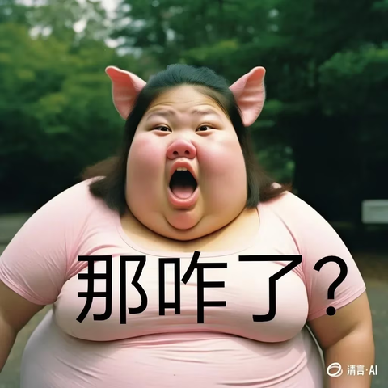
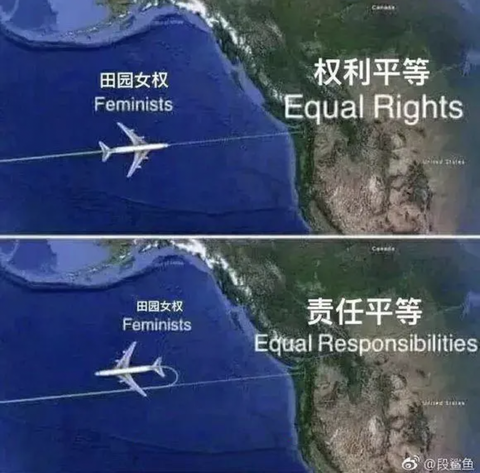
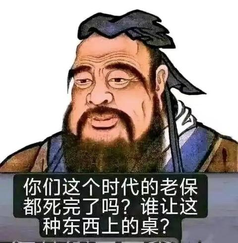
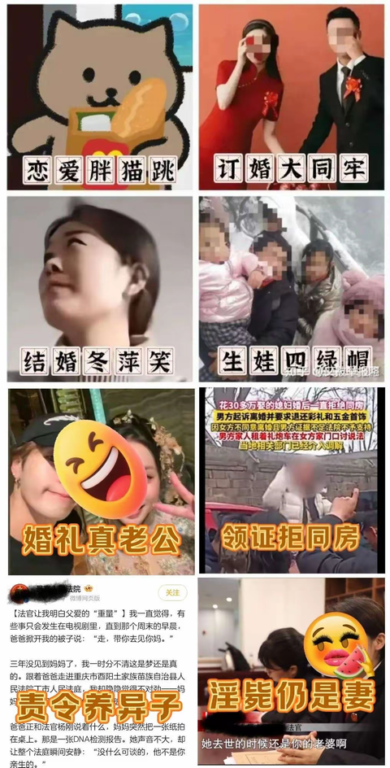
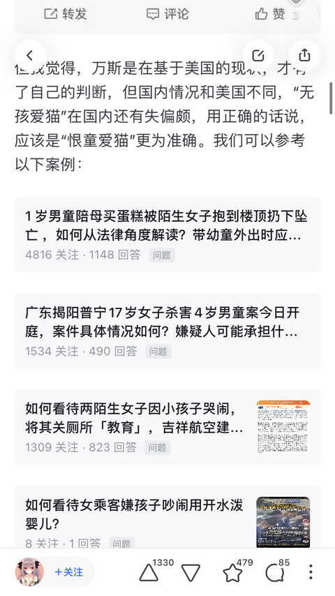
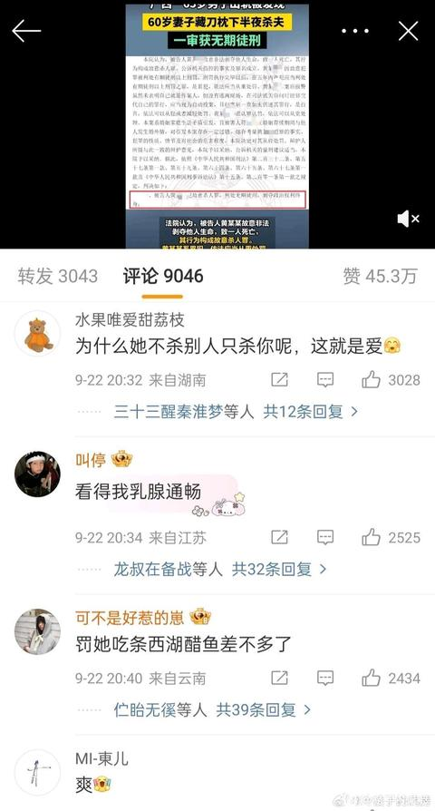
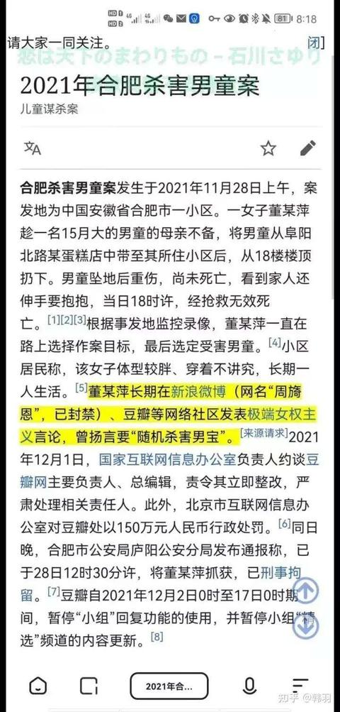

[toc]

# 问题

提问者：**<a href="https://www.zhihu.com/people/">匿名用户</a>**
提问时间: 2014-6-3 0:47:5
总回答数: 2467
总访问量: 52152580

之前在国内有遇到一些台湾女生，普遍比较可爱让人很喜欢，具体怎么描述我也说不上来，相信很多男生都有过这种感觉。 后来去美国读书遇到了更多台湾女生，依旧是那种很可爱很让人喜欢的感觉。当然也有例外的，但其比例比大陆女生、韩国女生、越南女生高多了。（日本女生接触的比较少不是太了解。）

希望有朋友能根据自己的经验和知识帮分析一下，谢了。

# 回答

回答者： **<a href="https://www.zhihu.com/people/dao-lang-ma-tai-er">道朗马泰尔</a>**
回答时间: 2025-1-12 11:22:49
点赞总数: 20556
评论总数: 1047
收藏总数: 11409
喜欢总数：4416

大陆新生代女性就是整个大陆的缩影，卡在转型期里面左右不是人，旧的毫不留情地抛弃了，新的实际上又毫无生命力，结果就是去其精华取其糟粕，反向进化，最后不人不鬼。这其实在西方六七十年代的嬉皮士运动里面已经上演过一次了，只不过洋人后来醒过来做了一定的修正，我们因为特殊的历史进程，这个过程晚人家一代人的时间而已，现在基本上是到了整个社会意识到问题，准备开始拨乱反正但是力量和决心还相当不足的阶段。

Xx主义运动号称把封建糟粕去除，所以妇女权利在国内是有zz实体力量推动的，和其他国家那种主要由社会文化思潮带动，年轻大学生摇旗呐喊，社会主流逐渐接受的过程不同，我们这里的过程很直接迅速有效粗暴。虽然在某个时期，我们在很多方面做得比较抽象，但是妇女权利这块是很领先西方的。

但是，妇女权利这个东西不是无源之水，是需要经济社会发展同步的，你经济一塌糊涂，把男性碗里的硬放进妇女碗里，规定多少多少女工妇女代表的比例，其实并没有大用。这个情况在改开尤其是90年代出口导向经济成型以后不一样了，简单来说就是人有钱了，女权这东西有了经济基础，因为女性的生产力归根结底很难和男性比，那么需要经济上的富余去弥补，社会富了才能真的搞女权，大家都穷得和鬼一样，你扯什么都是嘴炮，西方嬉皮士运动也是建立在一群中产大学生家里拿钱养着的前提下的。

那么旧的抛弃了，什么三从四德都是糟粕，没有问题，但是人性的变化如果没有反向的外力，它就会像无轨电车一直开下去，一个正常的社会，无轨电车开到一定阶段就会有外力来阻碍它，所以会在一个适当的阶段开始减速，当然也可能是某个标志性的社会事件，比如终结嬉皮士运动的曼森杀人事件。

  

在我国对待女权的各方力量中，代表主流g方的力量是支持的，因为这是一个zz正确，是有历史渊源的，妇女撑起半边天嘛，机关里面女性领导干部的比例是有规定的，这个是最硬的。

而民间的力量，老百姓，普通家庭，由于独生子女政策这个中华民族历史上史无前例的，几乎改变民族性的政策，也不得不为女拳让路，因为独生子女政策造就了大量的独生女家庭，他们的利益诉求彻底扭转了，传统的东西瞬间变成了毒药，女儿“越守规矩越吃亏”。

于是民间的力量分裂了。

再加上西方的外来的尊重女性，“绅士风度”，“公主文化”等等的影响，一个全方位的组合拳打过来，旧的传统的东西根本无力抵抗，就像面对年轻人的马保国师傅一样，只能大叫着不讲武德，然后节节败退。

那么旧的没了，新的呢？

没用。

因为新的东西其实不新，掰开来看，无非就是国内国外那套几十年前用过的老东西再拿来背书而已。

国内因为特殊历史原因，师承苏联，苏联最引以为傲的战时经济打败了纳粹德国，其中有一样东西就是女人进厂（英美同时期也这样做），而且不光进厂，还能修战壕。国内后来倡导的妇女能顶半边天也是师承老大哥。女人进厂在和平年代实际上被证明在重工业为绝对主流的前30年，除了在纺织业等行业，其他的效率远不如男性工人。改开后发展轻工业，女性的生产力才开始爆发，厂妹们才开始改变这个国家。所以我说要有经济基础配合才能搞出真女权。

西方的女权也是有经济基础的，他们不是靠什么性解放，女性身体女性做主，堕胎权等等搞出来真女权的，那些都是浮于表面的东西，关键是西方服务业发达，城市提供了大量服务业岗位给女性，女性收入上去了，自己养活自己了，才能打拳。

所以新的也不是什么新东西，都是以前玩剩下的，我们今天的女权，我们自己的父母辈在红色年代就搞过，西方战后也搞过，只不过因为我们改开晚，经济发展晚，服务业发展慢，比人家慢了几拍而已，欧美先搞，日韩跟上，然后是我们，接着可能是印度，中东。

新的这个需要经济发展配合的，经济不行了，女拳就打不动，这个在西方也是得到印证的，有钱打拳，搞平权，多元化，没钱就回归保守，利润第一搞回来，等有钱了再开始下一个新的打拳轮回。

国内女拳这套，再总结一下我一开始讲的主旨，就是旧的传统道德作为糟粕抛弃了，新的只不过经济发展的必然结果，最多再叠加一个独生子女政策中国特色而已，日韩不搞一胎化，照样打拳，你社会经济发展到了服务业蓬勃的阶段，自然就要打拳，不是因为你这个人进化了，不是因为你人格思想升华了，就是经济发展到这个阶段而已。

不打拳，女性权利随着经济发展和服务业比例提高，也会一起提高，打田园双标女拳，不过是想多吃多占而已，本质上是人性的贪婪，是一万年前的东西，不是什么新东西，不要用新的进步的来标榜自己。

再看国内当下的实际环境，女拳肯定是要式微的，因为经济基础在可见未来，不可能想之前十几年一样为女拳提供弹药了。你如果是真女权，是提高自己工作能力，和男性在同等条件下竞争不遑多让的人，你根本不用害怕，如果是女拳，就靠着经济泡沫和少数脑子不清的溺爱父母和舔狗支撑虚假繁荣的，那接下来就要完蛋了，经济规律大过天，女拳也要趴下来挨打。

这时候，反其道而行之才是区别化竞争，传统美德被抛弃太久，你要是个女的，我建议你可以试试看，哪怕装，也装出一个呆呆傻傻的传统女性人设，在今天这个转型社会有奇效，因为你不用怕，你再传统国家法律还是会保护你的，现在那种台妹软软糯糯的，樱花妹撒撒娇的，在国内网络舆论下就被捧上天了，洋鬼子金发妹帮男朋友洗一次衣服就像遇到田螺姑娘一样，其实都是装的，现代社会哪里还有传统女性？但是人家聪明啊，人家装一下又不少块肉，傻的是田园女拳，搏一个遇到真舔狗，但是真舔狗才几只啊，大部分都是中间派，最后混成剩女。

你看，我这文章是不是对女性同胞也友好，我还支招呢，不过我到底还是希望

天下有情人终成眷属。

  

原文地址：[(道朗马泰尔)为什么大多数台湾女生会给我一种很舒服的感觉？](https://www.zhihu.com/question/24002368/answer/77313299401) 

# 评论

1. <a href="https://www.zhihu.com/people/jiu-cai-41-62">韭菜</a> (<small title="江苏">2025-1-12 22:38:13</small>): 接触过台湾女生，非常惊讶对方那种由内而外的松弛感和同理心，也许人家装的本事更高，但是我们这里是装都不装……
   - <a href="https://www.zhihu.com/people/panda_k">潘达儿王</a> (<small title="山东">2025-1-12 23:24:30</small>): 不是装不装，而是国内捧的太高了，国内女性地位保障在全世界属于断层领先
   - <a href="https://www.zhihu.com/people/cai-xin-44-13">肖恩</a> (<small title="回复于 2025-1-13 7:46:20/四川"> ✉️:潘达儿王</small>): 然而她们由嫌不够，还想成仙
   - <a href="https://www.zhihu.com/people/lin-wan-jie-12">水火之花</a> (<small title="广东">2025-1-13 9:19:1</small>): 全球堕胎人数第一是这样子的，堕胎人数比出生人数还多
   - <a href="https://www.zhihu.com/people/yiilklk-21">yiilklk</a> (<small title="回复于 2025-1-13 10:26:54/浙江"> ✉️:潘达儿王</small>): 逆天玩意看多了，看到个正常人都两眼发亮。［大笑］
   - <a href="https://www.zhihu.com/people/leta-25-65">绯青二色蝶</a> (<small title="四川">2025-1-13 10:29:26</small>): 你可以说日本是装，是为了合群的礼貌，但台湾人的松弛真不是装出来的，他们真的没那么多怨气和戾气。这和社会压力有关，但近几年台湾房价也在上涨，认识的台湾年轻人也有因此焦虑、没那么松弛的
   - <a href="https://www.zhihu.com/people/bian-ke-jian-xin">秋色遇上猫</a> (<small title="回复于 2025-1-13 10:33:31/广东"> ✉️:水火之花</small>): 确实过于抽象［飙泪笑］［飙泪笑］［飙泪笑］
   - <a href="https://www.zhihu.com/people/jiu-cai-41-62">韭菜</a> (<small title="江苏">2025-1-13 11:47:57</small>): 是的，我们这里的人太没有安全感了。
   - <a href="https://www.zhihu.com/people/zhang-heng-23-31">黎明扣扣邮箱登录</a> (<small title="湖北">2025-1-13 15:2:48</small>): 因为国外是真正的平等，不要求女的完成义务，同样也不要求男。大家都不做舔狗
   - <a href="https://www.zhihu.com/people/83-87-11-47">鸡柳王</a> (<small title="湖北">2025-1-13 20:10:24</small>): 没有松弛感你就去上海晒晒自己的豪车啊［生气］
   - <a href="https://www.zhihu.com/people/miai123-60">人生毕业季</a> (<small title="福建">2025-1-17 19:29:40</small>): 接触过台湾女生，非常惊讶对方那种由内而外的装都不装……呃，在我说出两岸一家亲，希望早日统一之后，她直接变哑巴，到离开都不再正眼看我一眼［飙泪笑］
   - <a href="https://www.zhihu.com/people/liang-mo-73-24">一只划水鱼</a> (<small title="回复于 2025-1-18 15:16:40/广东"> ✉️:人生毕业季</small>): 潜意识觉得你在扯别的，就像你和人聊游戏他跟你说玩游戏怎么样不好，我是女的我也离这个人远点
   - <a href="https://www.zhihu.com/people/miai123-60">人生毕业季</a> (<small title="回复于 2025-1-18 16:54:21/福建"> ✉️:一只划水鱼</small>): 懂了，我没说那边不好，但你支持台独［滑稽］
   - <a href="https://www.zhihu.com/people/yong-de-lu-fu-dan-xiao-gang-pao">兴业路76号扫地工</a> (<small title="上海">2025-1-18 22:39:24</small>): 有什么装不装的？回报率超过100%的事谁不会干？
   - <a href="https://www.zhihu.com/people/yong-de-lu-fu-dan-xiao-gang-pao">兴业路76号扫地工</a> (<small title="回复于 2025-1-18 22:39:42/上海"> ✉️:黎明扣扣邮箱登录</small>): 太平等了。这样吧，找个白女试试
   - <a href="https://www.zhihu.com/people/lang-qin-83">langqin</a> (<small title="山东">2025-1-23 18:29:1</small>): 人口太多了［流泪］
   - <a href="https://www.zhihu.com/people/lucifer-64-87-87">Lucifer</a> (<small title="回复于 2025-1-24 0:30:53/重庆"> ✉️:肖恩</small>): 也没啥保障啊。不都一样的么。。。
   - <a href="https://www.zhihu.com/people/31-51-32-98">啦啦啦</a> (<small title="中国香港">2025-1-24 10:9:18</small>): 接触过的台湾女生感觉还挺好，整体感觉比较松弛，说话不会咄咄逼人，而且价值观基本属于普世价值观，不会太偏激，聊起来也比较轻松，最主要的是情绪价值给的真的足，在大陆这边被认为是你男性就该做的事情，她会觉得你能为她做这件事她真的很感动巴拉巴拉［飙泪笑］虽然也有点表演成分，但是人会感觉很舒服。之前有朋友评价台湾女生更符合我们传统认知中的中华女性，对此我深表赞同。
   - <a href="https://www.zhihu.com/people/wei-de-zhang-73">从胜利走向胜利</a> (<small title="湖南">2025-1-25 3:19:29</small>): 我跟台湾女生交流过，她们其实也是装的，不过人家愿意装，有人装都不装
   - <a href="https://www.zhihu.com/people/ying-hua-shu-75-90">樱花树</a> (<small title="回复于 2025-2-19 19:47:40/安徽"> ✉️:啦啦啦</small>): 台湾还是传统中华文明圈
   - <a href="https://www.zhihu.com/people/nddd1">淦蒽</a> (<small title="广东">2025-3-7 10:49:26</small>): 很多东西本来面上过得去就行了，难不成你还要跟异性拜把子吗［思考］
   - <a href="https://www.zhihu.com/people/gong-he-yu-5-62">Cookie</a> (<small title="北京">2025-3-26 17:36:11</small>): 台湾女是被几十万陆配教育了。我们这里要等几千万东南亚女来教育（难）。
   - <a href="https://www.zhihu.com/people/aiguoguo-9-31">飞呀飞</a> (<small title="回复于 2025-3-31 9:21:20/广东"> ✉️:绯青二色蝶</small>): 高房价搁谁身上都别想松弛，嘻嘻😁
   - <a href="https://www.zhihu.com/people/chen-jia-le-40-51">乐寻桥</a> (<small title="广东">2025-4-4 7:45:50</small>): 中国的女权太严重了 跟西方的文化入侵有关 西方巴不得我们男女分裂出生率低呢，都2025年了 国潮品牌和国潮动漫都这么有实力了，过去那套崇洋媚外的风气该改改了
   - <a href="https://www.zhihu.com/people/momo-17-85-8">momo</a> (<small title="回复于 2025-4-20 7:16:8/湖南"> ✉️:人生毕业季</small>): 你就回复这么一句，网友都能看出来你是真的不会聊天，和人聊死，不是别人的问题。
   - <a href="https://www.zhihu.com/people/575588-72">知乎用户CyM0A0</a> (<small title="回复于 2025-4-21 8:43:37/山东"> ✉️:潘达儿王</small>): 表面上断层领先。但绝大多数根本没有。少数人捞着好处。也没法律堵，谁不上啊，不上不钻空子吃苦吗？就像大家都争着入党考公在国家上面埋一锹土。都是把社会当提款机。最后引爆了圈钱出国
   - <a href="https://www.zhihu.com/people/zcl-37-80">sunny</a> (<small title="北京">2025-4-21 15:0:14</small>): 港台是真的重男轻女，这是印在骨子里的。
   - <a href="https://www.zhihu.com/people/84-67-38-98-86">可安</a> (<small title="回复于 2025-4-21 16:8:10/湖南"> ✉️:绯青二色蝶</small>): 房价高？［好奇］倒不如说他们没有大面积房型。普遍是小房子挤一挤。他们唯一的缺点就是住的地方比较小，开车成本非常高（交通不方便用车）其他都是薄纱。而且台湾是用工荒，学生还没毕业，基本就要被企业提前预定，不然企业会没有新人，无法发展
   - <a href="https://www.zhihu.com/people/hua-ge-quan-quan-wander">化个圈圈wander</a> (<small title="广东">2025-4-21 20:13:33</small>): ［滑稽］连装都觉得是在侮辱和委屈自己，反正还有那么多同类共鸣，索性不装
   - <a href="https://www.zhihu.com/people/87-58-88-93-72">起名字好难</a> (<small title="浙江">2025-4-22 10:29:54</small>): 别说台湾了，我从北方来，江浙沪个别女生我都觉得很自然［飙泪笑］
   - <a href="https://www.zhihu.com/people/zhou-bo-wei-56">周大炮儿</a> (<small title="浙江">2025-4-28 10:30:41</small>): 内心好恶人人都有。装就是尊重你，不装就是不尊重你。
   - <a href="https://www.zhihu.com/people/tian-bu-fu-wo-47">天不负我</a> (<small title="广东">2025-4-28 10:58:30</small>): 如果接触过马来西亚和印尼华人女生，价值观其实和台湾女生差不多，更符合我们传统认知的中华女性
   - <a href="https://www.zhihu.com/people/George_ren">LOUIS-NY</a> (<small title="回复于 2025-5-19 23:52:58/江苏"> ✉️:乐寻桥</small>): 国潮动漫有实力？指那个票房世界第五但是海外市场只占3%的那个吗？
   - <a href="https://www.zhihu.com/people/zzr-83-57">zzr</a> (<small title="安徽">2025-5-26 21:2:56</small>): 不，弯弯女的更懂怎么生存，更恐怖
   - <a href="https://www.zhihu.com/people/lin-39-80-65">知乎用户lin</a> (<small title="回复于 2025-6-13 12:30:29/湖南"> ✉️:人生毕业季</small>): 九二共识叫一个中国，两岸各表。你这种非要整成一个中国，只准我表 跟那些台独其实是一类人。
   - <a href="https://www.zhihu.com/people/duo-le-15">喜欢小龙女的公子</a> (<small title="辽宁">2025-7-14 12:36:28</small>): 我们的其实不会装［爱］
   - <a href="https://www.zhihu.com/people/luo-xue-18-26">落雪</a> (<small title="回复于 2025-7-17 0:19:38/陕西"> ✉️:人生毕业季</small>): 支持台独在哪体现的［飙泪笑］你臆想的？
   - <a href="https://www.zhihu.com/people/pie-an-chen-si-wei-lao">丿暗尘灬未老</a> (<small title="回复于 2025-7-19 13:18:54/福建"> ✉️:人生毕业季</small>): 情商低和人家没关系
   - <a href="https://www.zhihu.com/people/39-10-43-95-3">知乎用户851HBp</a> (<small title="回复于 2025-7-20 11:50:3/山西"> ✉️:黎明扣扣邮箱登录</small>): 直接给美国跪下就有肉吃了
   - <a href="https://www.zhihu.com/people/wu-yi-jing-guo">六装齐进</a> (<small title="回复于 2025-7-22 8:58:32/上海"> ✉️:人生毕业季</small>): 哥们你是不是精神有点偏执，没啥朋友吧［尴尬］
   - <a href="https://www.zhihu.com/people/miai123-60">人生毕业季</a> (<small title="回复于 2025-7-22 9:53:42/福建"> ✉️:六装齐进</small>): 大哥能不能别凡事上纲上线？当年就是话赶话说到那，哪知道对方脑子里有定时炸弹，谈到那个问题就自爆，要有问题也是她有问题，与我何干？［doge］
   - <a href="https://www.zhihu.com/people/da-de-bu-cuo-39">打的不错</a> (<small title="回复于 2025-7-25 9:34:22/上海"> ✉️:人生毕业季</small>): 大伙都感觉是你的问题，那是谁的问题就不用多说了［飙泪笑］
   - <a href="https://www.zhihu.com/people/reef-t">Reef.t</a> (<small title="回复于 2025-7-26 16:41:35/广东"> ✉️:人生毕业季</small>): 现实键政的我遇到我也不会觉得是正常人［飙泪笑］，特别是这种见面没多久就开始宣传政治理念的
   - <a href="https://www.zhihu.com/people/miai123-60">人生毕业季</a> (<small title="回复于 2025-7-26 16:53:15/福建"> ✉️:Reef.t</small>): 唉，所以说换位思考是伪命题呢，哪怕我们是相邻省……胡建这个直面台的地理位置，民间其实是有很多情感羁绊的，跟郑智完全无关，就像失散多年，看得见却回不来的亲人，那种骨肉分离的痛苦，期盼团圆的迫切和焦虑，不是外省人能理解的，也正常吧。
   - <a href="https://www.zhihu.com/people/reef-t">Reef.t</a> (<small title="回复于 2025-7-26 17:2:6/广东"> ✉️:人生毕业季</small>): 这辈子活在宏大叙事里吧哥们，我还能说什么呢，如果有亲人在tw那就请你去看他，不要把别人的感情作为你政治议题的外衣
   - <a href="https://www.zhihu.com/people/17-72-29-83-76">大臣叫我去炼金</a> (<small title="陕西">2025-7-27 2:12:14</small>): 台湾继续遵守传统信仰，女性要三从四德，从小训练出来的
   - <a href="https://www.zhihu.com/people/legend-99">Chlsrsp</a> (<small title="回复于 2025-7-28 13:25:56/上海"> ✉️:人生毕业季</small>): 人家说你说话方式有问题就被打成台独？回复别人还各种黄豆表情包，玩抽象呢？
   - <a href="https://www.zhihu.com/people/a-guai-65-82-42">阿怪</a> (<small title="回复于 2025-7-31 16:55:4/广西"> ✉️:人生毕业季</small>): 不支持，但也不反对，与我无关，因为这个大局里面肯定没有我，我肯定是被牺牲的那一部分，有空先清理一下文宣科教和gjf内部的内👻吧，现在各种骚操作已经把很多原先热血的郭楠，敌在本能寺都视而不见，害搁这给我讲外部矛盾想转移视线？
   - <a href="https://www.zhihu.com/people/hu-lu-wa-51-1">葫芦娃</a> (<small title="福建">2025-8-24 13:2:59</small>): 装也是学问，我可是看林志玲传授经验过［捂嘴］
   - <a href="https://www.zhihu.com/people/producex101">section</a> (<small title="回复于 2025-9-1 19:33:54/北京"> ✉️:肖恩</small>): 啊？
   - <a href="https://www.zhihu.com/people/producex101">section</a> (<small title="回复于 2025-9-1 19:40:21/北京"> ✉️:肖恩</small>): 我寻思四川女人地位不高啊［捂脸］
   - <a href="https://www.zhihu.com/people/jia-qi-wei-78">aIO3nZ</a> (<small title="回复于 2025-9-8 9:28:59/福建"> ✉️:肖恩</small>): 只想想要特权罢了
   - <a href="https://www.zhihu.com/people/wang-jia-bin-59">恪心</a> (<small title="广东">2025-10-4 18:57:34</small>): 能出国的至少是个中产家庭，素质有保证
   - <a href="https://www.zhihu.com/people/jim0519">jim0519</a> (<small title="澳大利亚">2025-10-5 21:17:57</small>): 你说对了，我在澳大利亚，台湾女的确很会装，我不知道作者说的松弛感是从何而来
   - <a href="https://www.zhihu.com/people/sophiachenxmn">两栖索女</a> (<small title="回复于 2025-10-21 10:19:44/福建"> ✉️:绯青二色蝶</small>): 你这是没有实际接触过台湾女性的厚重滤镜吧，太荒唐了
   - <a href="https://www.zhihu.com/people/tian-shu-2-30">田鼠</a> (<small title="回复于 2026-1-4 13:48:59/上海"> ✉️:知乎用户lin</small>): 无所谓，你怎么说都行。我们认为你们蛙湾应该认清形势，早日统一回归我PRC。你有意见就跟我们的导弹坦克飞机航母火箭炮说吧。
   - <a href="https://www.zhihu.com/people/lu-wei-19-28">阿西门的街</a> (<small title="回复于 2026-1-27 19:18:3/江苏"> ✉️:人生毕业季</small>): 你这样讲话人家台湾女生当然不愿意搭理你啊！人家还以为你想要武统呢！怎么可能对你有好感？
   - <a href="https://www.zhihu.com/people/miai123-60">人生毕业季</a> (<small title="回复于 2026-1-27 19:45:38/福建"> ✉️:阿西门的街</small>): 统一是中华民族的共同心声，因为一根筷子和众人划浆的道理，是自古传下来刻在骨子血脉里的，你要搞独，当然怎么说你都不满意呀［飙泪笑］
   - <a href="https://www.zhihu.com/people/feng-xiang-29-83">风向</a> (<small title="北京">2026-3-19 0:26:33</small>): 就以清开国孝庄，清亡国慈禧这俩来说，清女真的不错的，旺夫［大笑］！哪怕清认妈飞升也可以认！
   - <a href="https://www.zhihu.com/people/feng-xiang-29-83">风向</a> (<small title="北京">2026-3-19 0:29:56</small>): 要在往前捯，明女更是能文能武，写诗也手到擒来，比清女更全面。收养义子都不在话下，比如李成梁小妾，还有各种女医官，女将军乱七八糟的，明女也不错的［大笑］，再往前倒，宋女比明女还全面，毕竟有辽金蒙古这种大敌在呢！得比明女更全面！就是如今［尴尬］！
   - <a href="https://www.zhihu.com/people/feng-xiang-29-83">风向</a> (<small title="北京">2026-3-19 0:32:39</small>): 宋女明女能文能武，男的带孩子！绝了我操［尴尬］！御医和医官女的还能给承包了，还能出将军。男的出了当兵带孩子和出文臣武将没别的事儿了［飙泪笑］！
   - <a href="https://www.zhihu.com/people/y-ann-44">y ann</a> (<small title="回复于 2026-3-23 12:36:34/上海"> ✉️:Cookie</small>): 是这样，他们太无知了。说的都是一些表面理由。真实的情况就是他们过了那个时期，被教训了，男人也升级完成了。就这样简单。你看看现在的大陆男性意识阶段，甚至不如赵文瑄这个60年生台湾男。  
 
而且更真实的情况是，他们平常看着自然清新温和礼貌，真到了谈婚论嫁，到了谈钱谈责任，就是没得谈，谁也别想占谁便宜。  
 
都只是发展阶段问题。
   - <a href="https://www.zhihu.com/people/ygnw4z">观云止</a> (<small title="回复于 2026-4-17 11:44:5/四川"> ✉️:水火之花</small>): 制定禁止堕胎法案，生育率就能解决一大半
   - <a href="https://www.zhihu.com/people/chun-dan-60-32">肥仔</a> (<small title="江苏">2026-4-26 17:32:58</small>): 横眉冷对千夫指［飙泪笑］
   - <a href="https://www.zhihu.com/people/chun-dan-60-32">肥仔</a> (<small title="回复于 2026-4-26 18:0:1/江苏"> ✉️:水火之花</small>): 老A嘛
   - <a href="https://www.zhihu.com/people/olgpp">夏天热冬天冷</a> (<small title="回复于 2026-5-31 0:57:33/江苏"> ✉️:水火之花</small>): 啊😦这么多吗
   - <a href="https://www.zhihu.com/people/e-96-95">E弦上的咏叹调</a> (<small title="回复于 2026-7-27 17:39:46/湖南"> ✉️:人生毕业季</small>): 这...她支持统一的概率就跟你支持td的概率一样。她未必真支持td，但是你不谈大家可以照常过，你谈了那就没得商量了
   - <a href="https://www.zhihu.com/people/miai123-60">人生毕业季</a> (<small title="回复于 2026-7-27 18:10:34/福建"> ✉️:E弦上的咏叹调</small>): 其实没那么复杂，就是一句话的事，毕竟血浓于水都是中国人，像阿嫲的情书里淑柔盼木生回来一样，是民间朴素情感的表达为什么不能说？哪晓得她警惕性太高非要上纲上线，我跟她妈反而聊的挺好，对面年轻一代受的教育还是太激进了［捂脸］
   - <a href="https://www.zhihu.com/people/liu-bureau">巴图巴根</a> (<small title="日本">2026-8-5 15:54:38</small>): 人家版本早，早就研究明白了人设才是重要的［打招呼］
   - <a href="https://www.zhihu.com/people/siyuan-li-91-18">法兰西螺丝仙人</a> (<small title="四川">2026-8-10 14:32:3</small>): ［捂脸］毕竟先一步发展起来
   - <a href="https://www.zhihu.com/people/nan-an-zhi-huang">南岸之荒</a> (<small title="陕西">2026-8-21 9:33:0</small>): 其实我有一个大胆的观点，当年要是全面西化了，现在很多人也会很适应的，只不过没人知道那是什么样子，倒是可以参考附近的国家和地区
   - <a href="https://www.zhihu.com/people/china061487">CHINA061487</a> (<small title="广东">2026-8-25 9:26:47</small>): 呵呵
2. <a href="https://www.zhihu.com/people/wu-ke-nai-he-48-12">无可奈何</a> (<small title="福建">2025-1-12 16:20:20</small>): 评论区没有我想看到的应景回答，那我先来：那咋了？［惊喜］
   - <a href="https://www.zhihu.com/people/zhu-bu-zai-hu-15">冷冻罗非鱼</a> (<small title="浙江">2025-1-12 16:38:41</small>): 贤侄，放早了［惊喜］
   - <a href="https://www.zhihu.com/people/jiu-qian-sheng-40">火之高兴</a> (<small title="甘肃">2025-1-13 1:10:15</small>): 答主最后送了一句诗，我正好见过类似的，送你：有情的也罢，无情的也好。情天已老，霜冷残裘，愿天下眷侣，不成其好。［捂脸］
   - <a href="https://www.zhihu.com/people/hu-ye-42-40">王师傅饼干打孔</a> (<small title="湖北">2025-1-13 10:57:30</small>): 
   - <a href="https://www.zhihu.com/people/chai-yihe">Lotus</a> (<small title="回复于 2025-1-14 11:55:4/甘肃"> ✉️:火之高兴</small>): 团长！
   - <a href="https://www.zhihu.com/people/ping-fan-shao-nian-6">知乎用户PePi44</a> (<small title="湖北">2025-1-18 16:36:49</small>): 说这句话一律视为无理取闹
   - <a href="https://www.zhihu.com/people/8-37-29-40">去码头整点薯条</a> (<small title="山东">2025-2-3 19:20:57</small>): 笑死［飙泪笑］那咋了［笑哭］
   - <a href="https://www.zhihu.com/people/Masaniu">马三牛</a> (<small title="江苏">2025-3-31 15:33:54</small>): 那能一样吗？
   - <a href="https://www.zhihu.com/people/chen-shuang-74-88">馒头堡</a> (<small title="重庆">2025-7-13 22:25:13</small>): ［惊喜］不被定义，无法锁定目标
   - <a href="https://www.zhihu.com/people/arrowin">arrowin</a> (<small title="回复于 2025-9-17 14:31:55/江苏"> ✉️:冷冻罗非鱼</small>): 不都是各位串出来的吗。还嫌弃了？
   - <a href="https://www.zhihu.com/people/arrowin">arrowin</a> (<small title="江苏">2025-9-17 14:33:24</small>): 屠呦呦让你们保胎成功了？
   - <a href="https://www.zhihu.com/people/shu-wo-zhi-yan-83-52">恕我直言</a> (<small title="回复于 2025-10-23 14:11:28/广东"> ✉️:王师傅饼干打孔</small>): 又来雌竞了
   - <a href="https://www.zhihu.com/people/enzyme2013">enzyme2013</a> (<small title="北京">2026-5-10 10:24:0</small>): 怎么啦.jpg［滑稽］
   - <a href="https://www.zhihu.com/people/cheng-chen-39-11">承臣</a> (<small title="回复于 2026-7-28 20:17:11/湖南"> ✉️:arrowin</small>): 屠呦呦不是研究治疗疟疾吗，和保胎啥关系
3. <a href="https://www.zhihu.com/people/shiva-36-1">赵无明</a> (<small title="山西">2025-1-12 21:14:7</small>): 早就说了，95-05这一代中国女人，基本是人类历史上地位最好的一代女性。
   - <a href="https://www.zhihu.com/people/cai-xin-44-13">肖恩</a> (<small title="四川">2025-1-13 7:46:38</small>): 为啥
   - <a href="https://www.zhihu.com/people/zhi-yao-xue-bu-qi-jiu-wang-si-li-xue">安全感合成师</a> (<small title="回复于 2025-1-13 10:2:25/云南"> ✉️:肖恩</small>): 女性优先的潜意识几乎都已经变成一种类似性别特权的高度了。
   - <a href="https://www.zhihu.com/people/dian-mo-46-90">momo</a> (<small title="广东">2025-1-13 16:33:12</small>): 德不配位
   - <a href="https://www.zhihu.com/people/yang-yang-77-29-53">杨洋</a> (<small title="重庆">2025-1-14 7:40:42</small>): 时代红利全吃了 责任一点不想要 没事就生孩子警告
   - <a href="https://www.zhihu.com/people/bing-rong-xue-44">冰容雪</a> (<small title="回复于 2025-1-14 23:31:16/辽宁"> ✉️:肖恩</small>): 父母手里有钱，网络快速发展并且主流舆论被女拳把持，社会风气严重利好女性
   - <a href="https://www.zhihu.com/people/shiva-36-1">赵无明</a> (<small title="回复于 2025-1-18 22:1:3/山西"> ✉️:肖恩</small>): 白女当年也牛逼过，远远不及日本昭和一代，昭和又不如现在
   - <a href="https://www.zhihu.com/people/ai-zhuang-long-mao">知乎用户dn2UIn</a> (<small title="吉林">2025-1-23 10:6:23</small>): 这个就像贷款，这个资源是建立在社会，男人，对未来母亲的包容，家庭资源之上的，在40岁之后，没有成为真正的母亲，父母老去，家庭资源耗尽，社会对男人什么样，就会对她们什么样
   - <a href="https://www.zhihu.com/people/1111-92-35-73">喵喵喵喵</a> (<small title="北京">2025-1-23 10:51:43</small>): 我95后的同学，好像全天下男人都欠她一样
   - <a href="https://www.zhihu.com/people/shiva-36-1">赵无明</a> (<small title="回复于 2025-1-23 14:9:34/山西"> ✉️:喵喵喵喵</small>): 时代的问题
   - <a href="https://www.zhihu.com/people/shiva-36-1">赵无明</a> (<small title="回复于 2025-1-23 14:10:12/山西"> ✉️:知乎用户dn2UIn</small>): 20年前比谁小三多，喝的酒多，尿得远。现在同样年轻人几乎都烫平了。
   - <a href="https://www.zhihu.com/people/sun-qi-kai-84">开新</a> (<small title="浙江">2025-1-26 17:15:29</small>): 恰好1996-2005年出生人口只有1500万，是生育低谷期，导致现在2020年代生育率特别低［捂脸］
   - <a href="https://www.zhihu.com/people/wo-jiu-bu-86-27">奇点</a> (<small title="回复于 2025-1-27 0:20:40/河南"> ✉️:开新</small>): 每年1500w也不低啊 我就深受其害［捂脸］［捂脸］［捂脸］
   - <a href="https://www.zhihu.com/people/11-41-37-81-57">知乎用户I2EtM5</a> (<small title="广东">2025-1-29 8:5:56</small>): 
   - <a href="https://www.zhihu.com/people/ying-hua-shu-75-90">樱花树</a> (<small title="回复于 2025-2-19 19:50:31/安徽"> ✉️:知乎用户dn2UIn</small>): 她们还可以在40岁前吃红利就已经很好了。［赞同］
   - <a href="https://www.zhihu.com/people/la-fe-26-12">知乎用户ot0Y7M</a> (<small title="四川">2025-3-19 10:7:51</small>): 为什么我完全没感觉到，青春期最深的回忆是被男的猥亵霸凌，初三高三爸妈都在追二胎也没人管我，谁在替我岁月静好
   - <a href="https://www.zhihu.com/people/xun-zhe-83-94">寻梦者</a> (<small title="回复于 2025-3-21 13:48:24/山东"> ✉️:知乎用户ot0Y7M</small>): 说句不好听的，这个算个人和群体的关系，社会的发展肯定是以群体作为单位的。只能说，真心希望你以后的生活能更好，加油
   - <a href="https://www.zhihu.com/people/jiang-tian-wen-59">Stephen-X</a> (<small title="回复于 2025-3-25 9:9:40/江苏"> ✉️:赵无明</small>): 现在喊喝酒，谁啊你，喝酒伤身这种事才不会参与呢，年轻人都开始为自己健康考虑了［doge］
   - <a href="https://www.zhihu.com/people/15-46-38-85-6">天水清相入</a> (<small title="回复于 2025-3-31 1:42:10/广东"> ✉️:知乎用户ot0Y7M</small>): 有过的好的自然就有过的差的，我初中也被霸凌了三年，后面高中走出来了，抱抱你，虽然有一部分过的差，但是当时我上网的时候舆论和方向标跟他们说的一样，都是一边倒的，真正的转折点大概是在胖猫和谭竹那里，以后估计会上历史［捂脸］
   - <a href="https://www.zhihu.com/people/vic-74-7-89">弗劳VIC</a> (<small title="回复于 2025-3-31 21:23:3/安徽"> ✉️:知乎用户I2EtM5</small>): ［捂脸］
   - <a href="https://www.zhihu.com/people/liu-gen-11-99">六根</a> (<small title="回复于 2025-4-1 9:35:57/山东"> ✉️:安全感合成师</small>): 有次答题:【世界第一礼仪是什么？】  
 
A:女士优先 B:尊老爱幼  
 
我查了一下是A，最后我选了个B
   - <a href="https://www.zhihu.com/people/yang-yang-77-29-53">杨洋</a> (<small title="回复于 2025-4-1 10:18:12/重庆"> ✉️:六根</small>): 老幼的一阶特性 男女是二阶特性  
 
任何人都会老幼 但是男女是对半分天然格局
   - <a href="https://www.zhihu.com/people/chen-jia-le-40-51">乐寻桥</a> (<small title="广东">2025-4-4 7:56:15</small>): 那如果找这个年龄的女生后果会怎么样
   - <a href="https://www.zhihu.com/people/wei-wei-68-64-40">卫卫</a> (<small title="广西">2025-4-22 3:50:30</small>): 反过来说，是不是这个年龄段的男性最惨，地位最低下😢
   - <a href="https://www.zhihu.com/people/wen-ti-hen-da-6">一颗大白菜</a> (<small title="河北">2025-5-11 12:22:52</small>): 人类我不好说［尴尬］ 在🇻🇳算是最好的一代了
   - <a href="https://www.zhihu.com/people/wen-ti-hen-da-6">一颗大白菜</a> (<small title="回复于 2025-5-11 12:23:25/河北"> ✉️:知乎用户ot0Y7M</small>): 沿海地区的女性吧
   - <a href="https://www.zhihu.com/people/la-fe-26-12">知乎用户ot0Y7M</a> (<small title="回复于 2025-5-15 15:42:48/四川"> ✉️:一颗大白菜</small>): 四川啊
   - <a href="https://www.zhihu.com/people/wang-shi-yu-61-47">令狐信鸿</a> (<small title="回复于 2025-6-6 11:1:0/北京"> ✉️:肖恩</small>): 从小到大没怎么挨过饿，正好赶上了经济飞速发展的时代，毕业时恰逢舔狗经济和女权发展巅峰，只要不是条件太差基本都能高嫁。入职时是经济腾飞期，待遇和职务都处于历史最优期。
   - <a href="https://www.zhihu.com/people/ren-jian-cou-shu-61-16">人间凑数</a> (<small title="回复于 2025-7-3 15:21:48/浙江"> ✉️:知乎用户ot0Y7M</small>): 沿海地区的女性，这个区域的女性享受了完整的经济红利，而且有最大的网络声量，内地欠发达地区女性地位其实提升没有那么高，充其量就是一个以前不供读书到现在供读书的改变。
   - <a href="https://www.zhihu.com/people/yang-yang-77-29-53">杨洋</a> (<small title="回复于 2025-7-15 9:8:42/重庆"> ✉️:人间凑数</small>): 她们享受的红利有部分就是社会透支未来的红利
   - <a href="https://www.zhihu.com/people/damir">damir</a> (<small title="北京">2025-7-15 13:9:42</small>): 问题是她们还要活很多年。
   - <a href="https://www.zhihu.com/people/84-5-21-89">咸鱼喝猹</a> (<small title="江苏">2025-7-19 22:1:59</small>): 对应下来，这一代的中国男人似乎好像是最惨的。致敬。
   - <a href="https://www.zhihu.com/people/29-92-56-65-47">浓香酒烈</a> (<small title="回复于 2025-7-20 11:33:48/甘肃"> ✉️:人间凑数</small>): 不要对这东西有地域幻想，再穷她也用得起手机，这互联网时代，谁不受着流行文化影响，尤其对于女权这种完全靠互联网起家的思潮，她的传播是以网络新媒体为媒介而非阶级经济地域，一个大专精神小妹随便在小红书发个拳帖能收获数以千计的赞和流量，这都是现在习以为常的事情了
   - <a href="https://www.zhihu.com/people/simon-81-24-85">维特根斯坦</a> (<small title="广东">2025-7-23 8:9:21</small>): 为什么他们地位高了，我就变惨了［思考］
   - <a href="https://www.zhihu.com/people/jason-55-48">Ryan</a> (<small title="湖北">2025-7-24 15:21:59</small>): 90也可以算进去，现在30多的很多脑子还不不清醒的大龄女也包括90后
   - <a href="https://www.zhihu.com/people/8-73-16-21">night raid</a> (<small title="回复于 2025-7-24 15:24:24/湖北"> ✉️:维特根斯坦</small>): 损有余补不足，你是被剥削对象
   - <a href="https://www.zhihu.com/people/liu-hong-rui-64">Henry</a> (<small title="回复于 2025-8-5 14:2:34/天津"> ✉️:赵无明</small>): 为啥白女当年的女性地位不如现在的我们啊？不是越有钱越有得搞女权吗？
   - <a href="https://www.zhihu.com/people/tang-hong-96-16">唐洪</a> (<small title="回复于 2025-8-12 15:24:9/江西"> ✉️:知乎用户ot0Y7M</small>): 人类历史普遍就这样，而你这一代的中国女性确实是人类各国历史的巅峰。
   - <a href="https://www.zhihu.com/people/ethereal-34-49">Orion</a> (<small title="广东">2025-8-23 21:11:30</small>): 那看来要谈妹妹呀［飙泪笑］［飙泪笑］
   - <a href="https://www.zhihu.com/people/25-82-49-11-73">大轮明王鸠摩智</a> (<small title="北京">2025-8-29 10:46:42</small>): 也是最糟糕的一代女性
   - <a href="https://www.zhihu.com/people/lin-dong-44-43">凛冬</a> (<small title="回复于 2025-9-7 7:3:32/吉林"> ✉️:知乎用户ot0Y7M</small>): ［大笑］
   - <a href="https://www.zhihu.com/people/sky-15-66-6">Vsky</a> (<small title="广东">2025-9-30 0:24:5</small>): 一时分不清友军还是敌人［飙泪笑］
   - <a href="https://www.zhihu.com/people/ben-pao-zai-tian-ye-99">旧船离港</a> (<small title="回复于 2025-10-12 7:30:28/湖南"> ✉️:人间凑数</small>): 结果就是沿海的再多吃多占也不会想着给内陆偏远等着进厂的厂妹和农妇分一口［捂脸］，毕竟先富带动后富嘛。
   - <a href="https://www.zhihu.com/people/jfnrj">于敏</a> (<small title="回复于 2025-10-25 7:10:12/福建"> ✉️:樱花树</small>): 三十多开始找大哥［大笑］
   - <a href="https://www.zhihu.com/people/lai-wei-35-47">莱维</a> (<small title="回复于 2025-12-5 14:36:25/上海"> ✉️:冰容雪</small>): 那可不只是一般的利好，你算一算账嘛，假设一个独生子家庭和独生女家庭收入相当，但是独生子家庭从很早就要准备买房，而独生女家庭最多准备一辆车，这房车之间的差额可就是两个家庭生活品质的鸿沟，越是房价贵的大城市这个差额越大，而这些地方又最利好于消费，可以说是日常三菜一汤和天天下馆子的差异了。我在这段文字中没有涉及目前版本的女性意识呢，而实际上很多女性不满足于国内，毕竟论消费那还得是发达国家，追求出国就不再意外。最终这俩家庭过的品质差别会相当大，而独生女会看不起本应同阶的独生子家庭，而且变得非常娇蛮，啧啧
   - <a href="https://www.zhihu.com/people/la-fe-26-12">知乎用户ot0Y7M</a> (<small title="回复于 2025-12-13 15:51:53/四川"> ✉️:寻梦者</small>): 谢谢我好久没看知乎了，但真不觉得是群体和个体的关系，我是普通人现在也全国各地跑过了，我学的艺术身边很多大小姐我也羡慕但更多是有各种创伤的本身很有能力但没有家庭支持（无论精神还是物质）大部分都是因为有个不争气的小很多的弟弟家里心思都放在小的身上了，什么没开放的时候在体制内追二胎事业停摆父母离婚各自找新人/开放了追二胎小康变赤贫/弟弟青春期读书差给弟弟交钱上学补课给侄子留学没钱给成绩好的亲女儿读研/童年经历性骚扰更是普遍…都是不同地域的人，本质就是没把女儿当自己人，我和我身边的都算小资了更不要说工薪无产家庭什么样，大小姐里也多的是曲筱筱在家里的定位的，普通人芸芸众生才是群体，我完全算不上个例，说中国女性地位历史上最高的时候我还能认同，人类总会往更文明的方向发展，说人类史上最高我只能说不了解历史也不了解中国，中国不是只有互联网上的声量
   - <a href="https://www.zhihu.com/people/la-fe-26-12">知乎用户ot0Y7M</a> (<small title="回复于 2025-12-13 16:5:14/四川"> ✉️:人间凑数</small>): 确实是这样，我前面回答其他人的内容：【谢谢我好久没看知乎了，但真不觉得是群体和个体的关系，我是普通人现在也全国各地跑过了，我学的艺术身边很多大小姐我也羡慕但更多是有各种创伤的本身很有能力但没有家庭支持（无论精神还是物质）大部分都是因为有个不争气的小很多的弟弟家里心思都放在小的身上了，什么没开放的时候在体制内追二胎事业停摆父母离婚各自找新人/开放了追二胎小康变赤贫/弟弟青春期读书差给弟弟交钱上学补课给侄子百万留学没钱给成绩好的亲女儿读研/童年经历性骚扰更是普遍…都是不同地域的人，本质就是没把女儿当自己人，我和我身边的都算小资了更不要说工薪无产家庭什么样，大小姐里也多的是曲筱筱在家里的定位的，普通人芸芸众生才是群体，我完全算不上个例，说中国女性地位历史上最高的时候我还能认同，人类总会往更文明的方向发展，说人类史上最高我只能说不了解历史也不了解中国，中国不是只有互联网上的声量】，我举例的身边人确实也都是从西南西北山河四省考学到一线城市学艺术的，看起来光鲜亮丽辛苦只有自己知道，家里明明有能力但只供完大学其他精力全放在废物弟弟和各种亲戚脸面身上
   - <a href="https://www.zhihu.com/people/ren-jian-cou-shu-61-16">人间凑数</a> (<small title="回复于 2025-12-16 12:7:0/浙江"> ✉️:知乎用户ot0Y7M</small>): 我说了，内地的女性没有享受到完整的红利，最基础一个，就是计划生育红利没有吃到。除了极端情况，大部分人是有方法绕过计划生育的。  
 
  
 
红利就是沿海某些严格执行的地方造就了一大批实质上的独生女，财产继承也比内地来的更接近现代社会。她们在未经受继承人选择的情况下被动的成为了唯一继承人，且社会整体与世界思潮合流，穷养儿、富养女成为了民间主流认同。  
 
  
 
另外，从认知上来说，能主动说出"废物弟弟"的人，确实是不适合最为财产的主要继承者的。如果你有两个以上的后代就会明白我在说什么。  
 
  
 
大部分父母对于后代的教育并不是选拔优异的重点培养，而是在力所能及的范围内提升二者的下限。你想要的社达父母，可以参考多益老板徐波，这货是彻底贯彻了你提出的能力选拔制度——他有至少100多个后代，只为从中选出能力最强的继承一切。就这也是保证其它兄弟姐妹中产生活的，你说的供侄子出国留学大概率是给侄子打高考复活赛去了。
   - <a href="https://www.zhihu.com/people/58-15-18-94">鲨鱼辣椒</a> (<small title="上海">2026-1-7 4:39:24</small>): ［doge］你这时间短了，宽一点，80-00这20年的国籹
   - <a href="https://www.zhihu.com/people/zhou-zhou-78-84-55">墨粥</a> (<small title="北京">2026-1-8 9:48:4</small>): 不对，85-05
   - <a href="https://www.zhihu.com/people/52-17-2-35">潜龙在渊</a> (<small title="湖南">2026-1-10 0:8:51</small>): 是见你的诡，打的最狠的就是这一批，上世纪那位劳动女性才是最好的一代，多打交道，现实会告诉咱们答案的
   - <a href="https://www.zhihu.com/people/sheng-guang-zhi-ai-li-jia">能源之城第一高手</a> (<small title="回复于 2026-1-18 12:26:48/北京"> ✉️:杨洋</small>): 不光责任不想承担，还觉得分到的利益不够多［飙泪笑］甚至还认为自己吃了大亏
   - <a href="https://www.zhihu.com/people/zhu-yao-hua-49">朱耀華</a> (<small title="中国澳门">2026-2-7 7:21:27</small>): 因此生育率崩了,女权越高越不肯生［捂脸］
   - <a href="https://www.zhihu.com/people/peng-ming-ye">彭明烨</a> (<small title="回复于 2026-2-9 12:47:34/重庆"> ✉️:知乎用户ot0Y7M</small>): 不容易啊…但愿您未来的日子能越来越吉祥…
   - <a href="https://www.zhihu.com/people/peng-ming-ye">彭明烨</a> (<small title="回复于 2026-2-9 12:51:30/重庆"> ✉️:知乎用户ot0Y7M</small>): 甚至，川渝本身，可能已经还算"女性权益条件相对好点"的地方？但"要追男"等等，估摸也同样有存在…(可以参考看个人ip…)
   - <a href="https://www.zhihu.com/people/peng-ming-ye">彭明烨</a> (<small title="回复于 2026-2-9 12:54:57/重庆"> ✉️:人间凑数</small>): 但感觉，"女的不能接着继续向上读硕博"这点，还是有点心疼…感觉，"国家助学贷"的金额，可能确实还是不那么足够?
   - <a href="https://www.zhihu.com/people/peng-ming-ye">彭明烨</a> (<small title="回复于 2026-2-9 12:55:40/重庆"> ✉️:知乎用户ot0Y7M</small>): 感觉，"女的不能接着继续向上读硕博"这点，还是心疼啊…感觉，"国家助学贷"，奖助贷学金等等的金额，可能确实还是不那么足够?
   - <a href="https://www.zhihu.com/people/ren-jian-cou-shu-61-16">人间凑数</a> (<small title="回复于 2026-2-9 14:7:14/浙江"> ✉️:彭明烨</small>): 这事儿和他男女无关，大哥硕博二弟中专的组合你没见过吧，就是大部分父母想要保下限，这时候被“均贫富”的那个子女有怨言是应该的。  
 
  
 
而且很多时候我们只是获得一面之词。我恰好是题主描述的专业，不供硕博说的可不是不出学费，而是不出20万以上的艺术培训也算不供硕博。你信不信可以追问她她描述的“不供硕博”里有几个是考上了因为学费问题没上的。一个硕士带上助学金无息贷款需要的钱不多的，至少我一个农村舍友在国美读研，超低利率的助学贷款和助学金，他一年只需要花家里一万多块。我们国家在这方面做的已经够好了。而且我国如果算上文科其实女研究生是比男研究生多的....  
 
  
 
有点类似于某个中年一事无成的中年人说自己是因为老婆孩子不敢出去所以没混好——实际上这只是他厌恶风险的借口罢了。除非家里急缺一个劳动力，不存在考上了没钱上的境地。他们只是把没考上归咎于家里的扶持不够罢了。
   - <a href="https://www.zhihu.com/people/peng-ming-ye">彭明烨</a> (<small title="回复于 2026-2-9 20:6:7/重庆"> ✉️:人间凑数</small>): 不过，那个专业的大类里，可能确实有存在"考官要收钱辅导"，否则可能"不好得分通过名额"等等的情况?
   - <a href="https://www.zhihu.com/people/ren-jian-cou-shu-61-16">人间凑数</a> (<small title="回复于 2026-2-13 16:32:13/河南"> ✉️:彭明烨</small>): 音乐普遍存在，美术没有。  
 
  
 
但我想音乐学位是用钱砸出来的应该是某种共识。坐标山东某音乐学院我知道的就有一个直接买的第二名入学的。这种你不能说家里没给她买名次就是不支持其教育吧。［思考］
   - <a href="https://www.zhihu.com/people/peng-ming-ye">彭明烨</a> (<small title="回复于 2026-2-13 23:7:1/重庆"> ✉️:人间凑数</small>): 确实也看门槛来着？
   - <a href="https://www.zhihu.com/people/wayne-70-44">wayne</a> (<small title="山东">2026-3-10 8:50:45</small>): 现阶段历史最高，35岁之后历史最差［大笑］
   - <a href="https://www.zhihu.com/people/23-19-63-88">鱼翁</a> (<small title="回复于 2026-5-21 16:26:19/新疆"> ✉️:知乎用户ot0Y7M</small>): 城市独生女
   - <a href="https://www.zhihu.com/people/fu-jin-dan">伊丽傻白</a> (<small title="江苏">2026-6-7 10:45:14</small>): 吃尽红利的儿子们说的话是真不害臊
   - <a href="https://www.zhihu.com/people/zhui-ming-zhen-bai-3-83">椎名真白</a> (<small title="回复于 2026-6-27 16:36:49/四川"> ✉️:知乎用户ot0Y7M</small>): 一些上层吃这碗饭的在败坏社会本该对你的保护，底层女确实难，但是一些人恶意利用，让大家变得自保了
   - <a href="https://www.zhihu.com/people/74-85-57-64-55">大明白司机</a> (<small title="辽宁">2026-7-17 16:38:17</small>): 其实90年上下把一波人打拳认钱认得更邪乎
   - <a href="https://www.zhihu.com/people/momo-37-32-77-53">momo</a> (<small title="福建">2026-7-21 12:40:4</small>): 地位最高，但也是最差劲的一代。
   - <a href="https://www.zhihu.com/people/zi-ji-xiang-89">MinamiGN</a> (<small title="回复于 2026-8-18 11:42:32/山东"> ✉️:六根</small>): 这真塔麻绷不住了
   - <a href="https://www.zhihu.com/people/ni-kan-qi-lai-sheng-qi-liao">萤火与萤火虫</a> (<small title="回复于 2026-8-24 21:51:39/四川"> ✉️:肖恩</small>): 因为刚刚转型，大家还用以前女性为家庭贡献的逻辑给予全社会的补偿，但实际上她们很多压根不怎么做家庭贡献。而之后的，大家又用她们这一代毫不贡献只索取多少态度对待下一代女性，05后女性纯纯吃亏，既占不到便宜，做了贡献别人也会认为你像上一代女性一样占便宜
   - <a href="https://www.zhihu.com/people/shiva-36-1">赵无明</a> (<small title="回复于 2026-8-26 6:37:14/加拿大"> ✉️:Stephen-X</small>): 这就是我想表达的
   - <a href="https://www.zhihu.com/people/shiva-36-1">赵无明</a> (<small title="回复于 2026-8-26 6:37:46/加拿大"> ✉️:卫卫</small>): 两极分化最严重的一代男性
4. <a href="https://www.zhihu.com/people/lao-ma-42-90">老马</a> (<small title="河南">2025-1-12 20:12:10</small>): 有道理的。  
 
  
 
不过从世界范围来看，内地男性在这个过程中应该是最惨的，往后还要再痛苦不少年，恰好我们这一代赶上了，只能被动接受挨打。  
 
  
 
爱惜身体，适当努力，未来总还是光明的。
   - <a href="https://www.zhihu.com/people/wang-fu-gui-95-3">完颜斡琛</a> (<small title="山东">2025-1-12 23:18:40</small>): 坚持20年
   - <a href="https://www.zhihu.com/people/fu-liao-ni-1">生厌</a> (<small title="回复于 2025-1-14 10:27:40/天津"> ✉️:完颜斡琛</small>): 别说二十年，从三十岁后男性欲望直线下滑，心有余力不足，不如打游戏！(可怕的是电子养胃和现实双重养胃)[［吃瓜］](https://picx.zhimg.com/v2-db92f653a2ec17ea3ff309d6d56e8507.gif?source=1d2f5c51)
   - <a href="https://www.zhihu.com/people/lv-xin-86-10">天上星</a> (<small title="回复于 2025-1-17 17:13:51/浙江"> ✉️:完颜斡琛</small>): 坚持到最后就是萎了，这一代人注定是转型期的痛点［惊喜］
   - <a href="https://www.zhihu.com/people/1111-92-35-73">喵喵喵喵</a> (<small title="回复于 2025-1-23 10:53:11/北京"> ✉️:生厌</small>): 我就是，哎怎么办啊，30不到，没啥欲望，打游戏也没劲［流泪］
   - <a href="https://www.zhihu.com/people/fu-liao-ni-1">生厌</a> (<small title="回复于 2025-1-23 16:36:47/天津"> ✉️:喵喵喵喵</small>): 强迫自己出去玩，和网友唠唠嗑唱唱歌，或者换些游戏类型玩，上中下你选吧［doge］
   - <a href="https://www.zhihu.com/people/1111-92-35-73">喵喵喵喵</a> (<small title="回复于 2025-1-23 16:39:25/北京"> ✉️:生厌</small>): 不爱出门，懒得唠嗑五音不全，游戏类型还没找到［大哭］
   - <a href="https://www.zhihu.com/people/1111-92-35-73">喵喵喵喵</a> (<small title="回复于 2025-1-23 16:39:28/北京"> ✉️:生厌</small>): 不爱出门，懒得唠嗑五音不全，游戏类型还没找到［大哭］
   - <a href="https://www.zhihu.com/people/fu-liao-ni-1">生厌</a> (<small title="回复于 2025-1-23 16:43:42/天津"> ✉️:喵喵喵喵</small>): 不是哥们，是不是工作太忙了，不过你这秒回摸鱼水平应该挺高啊哈哈哈，我前段时间去欢乐谷逛逛有两个喜欢的npc妹妹，一个双马尾，一个坏女人［doge］，全民k歌关注了三百多个唱歌好听的(但我不唱)，soul上认识了云南妹妹固聊，你要不抄抄作业？(网恋被骗八千可不关我事［doge］)
   - <a href="https://www.zhihu.com/people/1111-92-35-73">喵喵喵喵</a> (<small title="回复于 2025-1-23 16:57:48/北京"> ✉️:生厌</small>): 我其实挺闲的，但就是很多事提不起兴趣了［流泪］
   - <a href="https://www.zhihu.com/people/fu-liao-ni-1">生厌</a> (<small title="回复于 2025-1-24 16:21:3/天津"> ✉️:喵喵喵喵</small>): 哥们有个损招，有些寺庙可以让人体验七天，离开手机每天早睡早起，都这样还不行那直接当和尚吧
   - <a href="https://www.zhihu.com/people/29-47-58-71">天道酬勤</a> (<small title="回复于 2025-1-29 15:7:46/海南"> ✉️:生厌</small>): 我已经现实养胃了
   - <a href="https://www.zhihu.com/people/1111-92-35-73">喵喵喵喵</a> (<small title="回复于 2025-2-6 19:50:46/北京"> ✉️:生厌</small>): 最近玩到了真三国无双起源，哈哈治好了我的电子ed
   - <a href="https://www.zhihu.com/people/fu-liao-ni-1">生厌</a> (<small title="回复于 2025-2-7 12:29:0/天津"> ✉️:喵喵喵喵</small>): 6，上一次玩帕鲁也有这感觉，再上次是环，真的好玩啊
   - <a href="https://www.zhihu.com/people/di-san-di-guo-67-75">Rainer701</a> (<small title="回复于 2025-2-10 15:22:51/四川"> ✉️:喵喵喵喵</small>): 钓鱼［飙泪笑］
   - <a href="https://www.zhihu.com/people/vic-74-7-89">弗劳VIC</a> (<small title="回复于 2025-3-31 21:25:32/安徽"> ✉️:喵喵喵喵</small>): 多洗脚［doge］
   - <a href="https://www.zhihu.com/people/chen-jia-le-40-51">乐寻桥</a> (<small title="广东">2025-4-4 7:46:21</small>): 中国的女权太严重了 跟西方的文化入侵有关 西方巴不得我们男女分裂出生率低呢，都2025年了 国潮品牌和国潮动漫都这么有实力了，过去那套崇洋媚外的风气该改改了
   - <a href="https://www.zhihu.com/people/jia-chun-yu-42">rainbow</a> (<small title="回复于 2025-4-20 7:26:17/北京"> ✉️:喵喵喵喵</small>): 恭喜，你已经脱离了低级趣味，你会变成一个更好的自己
   - <a href="https://www.zhihu.com/people/chen-kai-19-3">玛吉纳</a> (<small title="回复于 2025-4-27 12:54:55/江西"> ✉️:完颜斡琛</small>): 男人一共也就硬20年，时代的一粒沙在个人身上就是一座山。
   - <a href="https://www.zhihu.com/people/--37-15-76"> 终端理想国</a> (<small title="湖南">2025-5-25 7:36:54</small>): 长痛不如短痛，相信中国速度［生气］
   - <a href="https://www.zhihu.com/people/leng-yan-kan-ke-56">冷眼看客</a> (<small title="辽宁">2025-10-4 8:29:2</small>): 太对了哥，张作霖坐的那节火车也是“不小心赶上了”，要不看看人口高峰呢？
   - <a href="https://www.zhihu.com/people/peng-ming-ye">彭明烨</a> (<small title="回复于 2026-2-9 13:7:17/重庆"> ✉️:生厌</small>): 南无阿弥陀佛
   - <a href="https://www.zhihu.com/people/qing-lang-qi-shuang">秉笔紫宸</a> (<small title="回复于 2026-5-28 19:45:32/江苏"> ✉️:生厌</small>): 别傻了，等你钱被寺庙榨干了，照样扫地出门，天下就没有不在红尘的地方，寺庙往往更封闭现实赤裸
5. <a href="https://www.zhihu.com/people/lao-long-99-87">老龙</a> (<small title="广东">2025-1-12 23:57:7</small>): 就是这样，中国女性已经迷失了，要用悲惨的后半生去买单。
   - <a href="https://www.zhihu.com/people/inzaghi-zz">咔咔之西</a> (<small title="广东">2025-1-13 9:51:42</small>): 仔细想，后半生她们会怨国家，怨社会，怨父母，唯独不会怨自己
 
然后写小作文，让国家养，让大家一起为她买单
   - <a href="https://www.zhihu.com/people/yang-yang-77-29-53">杨洋</a> (<small title="回复于 2025-1-14 7:42:23/重庆"> ✉️:咔咔之西</small>): 怨国家 性别歧视  
 
怨老公 嫁错了人
   - <a href="https://www.zhihu.com/people/kong-yong-jun-51">plasma</a> (<small title="山东">2025-1-14 13:1:35</small>): 远远不够，至少她们享受过。
   - <a href="https://www.zhihu.com/people/kong-yong-jun-51">plasma</a> (<small title="山东">2025-1-26 19:8:37</small>): 把蘸湿们救命用的青霉素给女支♀用这种事它们都干得出来［飙泪笑］
   - <a href="https://www.zhihu.com/people/gggg-26-83">夜雨</a> (<small title="中国香港">2025-2-8 23:10:37</small>): 买单的会是它们吗，恐怕另有其人
   - <a href="https://www.zhihu.com/people/chen-li-lin-64-68">Aventador</a> (<small title="上海">2025-3-10 19:51:14</small>): 想多了，买单的大概率是［看看你］
   - <a href="https://www.zhihu.com/people/rover-91-15">rover</a> (<small title="回复于 2025-5-3 17:44:22/江苏"> ✉️:咔咔之西</small>): 到了一定程度，两巴掌就治好了［尴尬］
   - <a href="https://www.zhihu.com/people/su-yan-yuan-64">秃韭</a> (<small title="安徽">2025-7-4 11:24:34</small>): 男性就不一样了，是悲惨的一辈子
   - <a href="https://www.zhihu.com/people/Alexander-Shen">AlexanderShen</a> (<small title="浙江">2025-7-21 10:6:53</small>): 她们是很少有家国概念的。Sir this Way这种事她们不是不会做
   - <a href="https://www.zhihu.com/people/ha-luowei">哈囖喂</a> (<small title="回复于 2025-7-23 16:24:29/湖北"> ✉️:AlexanderShen</small>): 随着国际化进程，越来越多国家的人进来，她们肯定会死皮赖脸，毫无底线的去求外国人收养她们。现在就已经有部分大龄剩女再干了
   - <a href="https://www.zhihu.com/people/xiao-li-zhi-49">拾荒者</a> (<small title="回复于 2025-7-24 10:1:26/上海"> ✉️:Aventador</small>): 中产汉男
   - <a href="https://www.zhihu.com/people/tou-shi-wen-lu-95-58">投石问路</a> (<small title="湖南">2025-7-28 1:31:46</small>): 会有一批时代的牺牲品来警醒后人
   - <a href="https://www.zhihu.com/people/li-xiang-wei-12-41">PDCE</a> (<small title="上海">2025-8-25 13:37:31</small>): ［吃瓜］超过35岁立马清醒
   - <a href="https://www.zhihu.com/people/producex101">section</a> (<small title="回复于 2025-9-1 19:35:51/北京"> ✉️:秃韭</small>): 啊？［飙泪笑］这不是你愿意吗
   - <a href="https://www.zhihu.com/people/shen-xin-ju-pi-21">身心橘皮</a> (<small title="天津">2025-10-1 23:18:1</small>): 国女唯一承认自己做错的事情：嫁错了人
   - <a href="https://www.zhihu.com/people/zhiknutpkgg">zhiKNutPKGg</a> (<small title="广东">2026-7-4 23:35:43</small>): 依旧幻想。不生免去大部分“悲惨”，不为男的折磨自己又省去一半烦恼
   - <a href="https://www.zhihu.com/people/xiu-yuan-12-42-30">修圆</a> (<small title="天津">2026-7-22 19:8:34</small>): 性别平等和性别红利不能同时拥有［思考］
   - <a href="https://www.zhihu.com/people/ni-kan-qi-lai-sheng-qi-liao">萤火与萤火虫</a> (<small title="四川">2026-8-24 21:53:21</small>): 所以你现在同情，和她们同时代的男性就活该吗？
6. <a href="https://www.zhihu.com/people/64-66-73-15">天天快快乐乐</a> (<small title="北京">2025-1-12 19:55:39</small>): 什么时候女性能占到陆军步兵部队的四成以上 真女权才有经济基础 我说的不是什么卫生队通信班 就是基层野战部队
   - <a href="https://www.zhihu.com/people/qi-miao-yin-yang-lu">夏木</a> (<small title="广东">2025-1-13 1:59:53</small>): 这得女性生育权重剔除，生育有别的地方承接，女性跟男性一样无关紧要的处景，前提是女性还得自愿受得了基层野战部队的苦、累、后遗症。你如果有基层野战部队的朋友可以问一下什么生活，半月板有没有毛病。
   - <a href="https://www.zhihu.com/people/cai-xin-44-13">肖恩</a> (<small title="回复于 2025-1-13 7:48:15/四川"> ✉️:夏木</small>): 人也没生啊
   - <a href="https://www.zhihu.com/people/bidepan">逼得攀</a> (<small title="回复于 2025-1-13 9:53:15/四川"> ✉️:夏木</small>): 以色列全民皆兵可没管什么女不女的，以色列女人不止当普通步兵，生育率也高得多
   - <a href="https://www.zhihu.com/people/yang-yang-77-29-53">杨洋</a> (<small title="重庆">2025-1-14 7:43:56</small>): 不参与民族家国叙事及责任义务的。。打为无性别组 跟男人一样人竞 不许吃生育妇女的红利
   - <a href="https://www.zhihu.com/people/chu-jian-64-30-58">momo</a> (<small title="回复于 2025-1-14 17:3:22/山东"> ✉️:杨洋</small>): 这本就应该
   - <a href="https://www.zhihu.com/people/bidepan">逼得攀</a> (<small title="回复于 2025-1-15 2:9:53/四川"> ✉️:杨洋</small>): 很多人没搞清楚，公民权这东西实际上一直跟血税或者说血税负税义务挂钩的，现代没以前那么直白，直接把非征召范围群体降为二等公民，甚至奴隶，但不代表这个逻辑不存在，比如以色列本身其实更像个宗教国家，但妇女权利一直非常高，是因为以色列女人需要跟男人承担同样的血税，还有库尔德人妇女地位也非常高，虽然是穆斯林，但库尔德妇女也得跟男人一样去扛兵线填战壕
   - <a href="https://www.zhihu.com/people/bill-clinton-66">千山暮雪</a> (<small title="上海">2025-1-15 22:1:31</small>): 对，必须要掌握law enforcements和military forces。
   - <a href="https://www.zhihu.com/people/hong-ming-90-13">轰鸣</a> (<small title="回复于 2025-1-23 1:27:42/吉林"> ✉️:逼得攀</small>): 这很有意思。那种情况女人是怎么坚持下来的，又能生孩子又能参军，估计也没空打女拳了
   - <a href="https://www.zhihu.com/people/bidepan">逼得攀</a> (<small title="回复于 2025-1-23 16:31:20/四川"> ✉️:轰鸣</small>): 因为社会地位往往是天然产生，一个群体如果普遍既能流血牺牲，又能打螺丝，那么社会地位不会是最低。如果只拿生孩子当个人最大统战价值，那在朴素价值评价里就是没地位，因为被打败的敌人的女人也能生。
   - <a href="https://www.zhihu.com/people/bidepan">逼得攀</a> (<small title="回复于 2025-1-23 16:32:47/四川"> ✉️:轰鸣</small>): 没什么不能坚持的，又不是参战打仗就会死绝，即使一部分人伤亡了，活下来的也是大多数
   - <a href="https://www.zhihu.com/people/bidepan">逼得攀</a> (<small title="回复于 2025-1-23 16:37:18/四川"> ✉️:轰鸣</small>): 战场上活下来的女兵是优秀的公民，她们不屑把生孩子当统战价值来要挟社会，反而把生育当做履行公民义务，她们打过仗，知道她们的民族如果后继无人，会带来巨大的灾难，所以具备很强的主观生育意愿。而某些社会，绝大多数只会躺在后方乞讨权利的群体，是不会具备这种公民素养的，她们把生育当做货物，那么自然会人为制造稀缺来抬价。
   - <a href="https://www.zhihu.com/people/hong-ming-90-13">轰鸣</a> (<small title="回复于 2025-1-29 2:54:34/吉林"> ✉️:逼得攀</small>): 精辟的言论！妇女能顶半边天指的应该是你说的那种伟大女性！
   - <a href="https://www.zhihu.com/people/a-yao-66-54-29">Steven</a> (<small title="回复于 2025-2-3 18:15:36/北京"> ✉️:逼得攀</small>): 国际歌中富人无义务独逍遥，穷人的权利只是空话被你吃了？  
 
你分不清应该怎样和实际怎样的区别么
   - <a href="https://www.zhihu.com/people/42-48-40-23">南海雁</a> (<small title="回复于 2025-2-18 9:52:7/广西"> ✉️:逼得攀</small>): 以色列的生育率，是靠那帮犹太教极端、保守的那批人撑起来的。  
 
世俗化现代化的普通犹太人，生育率并不高。
   - <a href="https://www.zhihu.com/people/ying-hua-shu-75-90">樱花树</a> (<small title="回复于 2025-2-19 19:59:56/安徽"> ✉️:南海雁</small>): 虽然不高，但是世俗派生育有2.0以上，依然高于所有发达国家，更是远高于中国。
   - <a href="https://www.zhihu.com/people/42-48-40-23">南海雁</a> (<small title="回复于 2025-2-19 20:25:23/广西"> ✉️:樱花树</small>): 准确的讲，是当地所有人群里最少的。  
 
正是因为她们思想和生活以及工作，受现代化影响，才会这样。  
 
  
 
极端正统派（Haredi），平均每名妇女生育 \*\*6-7个孩子\*\*（2022年数据）。  
 
Dati Leumi派: 约 \*\*4-5个孩子\*\*。  
 
传统派Masorti: 约 \*\*2.5-3个孩子\*\*。  
 
世俗派（Hiloni）: \*\*约2.1个孩子（2022年数据）。
   - <a href="https://www.zhihu.com/people/ying-hua-shu-75-90">樱花树</a> (<small title="回复于 2025-2-19 20:27:43/安徽"> ✉️:南海雁</small>): 所以呢？这不是证明我说的是对的。世俗派犹太人的生育率也比我国高。
   - <a href="https://www.zhihu.com/people/42-48-40-23">南海雁</a> (<small title="回复于 2025-2-19 20:49:59/广西"> ✉️:樱花树</small>): 没说你错。  
 
  
 
这回复是给别人看的。  
 
我只是希望别的人如果看到我的评论，能知道这个国家各个人群的生育率，世俗派是这个国家生育最低的。
   - <a href="https://www.zhihu.com/people/qi-yun-79-63">一棵枣树的安宁</a> (<small title="山东">2025-3-3 0:32:9</small>): 得了吧，我之前隔壁单位的女兵可娇贵着呢(我们单位没有女兵)。上夜哨因为怕黑都得男兵专门绕路送到哨位［捂脸］
   - <a href="https://www.zhihu.com/people/tale-69-21">Tale</a> (<small title="回复于 2025-4-1 15:26:20/浙江"> ✉️:逼得攀</small>): 优秀的见解
   - <a href="https://www.zhihu.com/people/jia-chun-yu-42">rainbow</a> (<small title="回复于 2025-4-20 7:34:26/北京"> ✉️:一棵枣树的安宁</small>): 男兵也想被人送也可以装害怕，自己想办法宠自己，没有任何问题
   - <a href="https://www.zhihu.com/people/qi-yun-79-63">一棵枣树的安宁</a> (<small title="回复于 2025-4-20 11:6:19/山东"> ✉️:rainbow</small>): 大哥，你是真单纯还是揣着明白装糊涂啊？男兵这么开口话还没说完就给两脚踹墙上了，爬起来还得继续去上哨
   - <a href="https://www.zhihu.com/people/xrj-55-5">天天</a> (<small title="内蒙古">2025-7-15 23:47:31</small>): 那是不可能的，你先跑个负重越野五公里试试，再怎么政确也得尊重人类最基本的生理差异
   - <a href="https://www.zhihu.com/people/kin56eq2">知乎用户rbwrR9</a> (<small title="浙江">2025-7-25 12:16:25</small>): 不，女旷工、女建筑工比例到50%，部队交给她们，还不亡国？
   - <a href="https://www.zhihu.com/people/92-7-83-54">星之㾗</a> (<small title="回复于 2025-7-28 13:53:34/河南"> ✉️:逼得攀</small>): 那盐碱地的四等汉怎么说，又不是外宾，有没有我们还不知道？［doge］
   - <a href="https://www.zhihu.com/people/60-33-94-63-84">油烟机</a> (<small title="北京">2025-8-30 17:31:27</small>): 永远不可能，印度人不得乐疯了［惊讶］
   - <a href="https://www.zhihu.com/people/bo-ran-hai-lang-yi-qian-kong">勃然骇浪亦潜空</a> (<small title="上海">2025-8-31 20:12:39</small>): 想多了，现在的乌克兰军队都没实现这一点
   - <a href="https://www.zhihu.com/people/arrowin">arrowin</a> (<small title="江苏">2025-9-17 14:33:1</small>): 屠呦呦让你保胎成功了？
   - <a href="https://www.zhihu.com/people/pi-pi-pi-4-83">Breeze</a> (<small title="安徽">2025-9-23 23:27:20</small>): 男女的生理结构摆在这里，这是不可能的事情
   - <a href="https://www.zhihu.com/people/xi-gua-65-38-69">momo</a> (<small title="广东">2025-10-10 1:30:20</small>): 真女权真女权，还在这念经
   - <a href="https://www.zhihu.com/people/88-21-18-12">吃火鸡面膜</a> (<small title="回复于 2025-10-22 11:29:26/山西"> ✉️:轰鸣</small>): 那些都是领导的家属，跟底层男性有什么关系［大笑］和平年代都不愿意保护女性，真是啥都想要啥都没有
   - <a href="https://www.zhihu.com/people/housaigei-13">housaigei</a> (<small title="回复于 2025-10-27 15:6:24/重庆"> ✉️:夏木</small>): 不承担世界第二 承担了最多也就世界第一  
 
有啥区别呢［飙泪笑］
   - <a href="https://www.zhihu.com/people/44-23-60-72">默默潜水</a> (<small title="天津">2025-10-29 16:57:20</small>): 我同意，必须推动立法，让女的也去！
   - <a href="https://www.zhihu.com/people/hhhfff-86">知于用尸frame28</a> (<small title="江苏">2025-12-1 10:34:28</small>): 你这是奔着打败仗去的［捂脸］
   - <a href="https://www.zhihu.com/people/fa-wai-kuang-tu-zhang-san-jiang-11">游泳健身了解一下</a> (<small title="回复于 2026-1-4 11:44:31/四川"> ✉️:夏木</small>): 禁止女性怀孕即可，女性在各行各业的占比必须达到50%，不存在什么高空，下矿不允许女性从事，这类也必须一半一半
   - <a href="https://www.zhihu.com/people/62-21-45-7">ctrl ikun</a> (<small title="浙江">2026-3-5 9:11:14</small>): 抗战期间曾组建过全女部队，战绩一坨
   - <a href="https://www.zhihu.com/people/cats-93">集你太美</a> (<small title="上海">2026-7-21 17:58:17</small>): 你也不想侧翼的友军毫无战斗力吧［doge］
   - <a href="https://www.zhihu.com/people/shi-bin-xing-18">猕猴桃</a> (<small title="浙江">2026-8-11 10:59:53</small>): 那杀良冒功怎么办[［查看表情］](https://pica.zhimg.com/v2-9def5675f5e7389446bf08f319c6cc88.jpg?source=1d2f5c51)
   - <a href="https://www.zhihu.com/people/xiao-qiu-ming-yue-17">晓秋明月</a> (<small title="广东">2026-8-24 23:9:19</small>): 你这是虚的，等什么时候可以基因改造把骨架变得和男的一样大、雄性激素也接近、体脂率接近、可选摘除子宫等等，就可以了
7. <a href="https://www.zhihu.com/people/ke-er-su-jia-de-8-23">克尔苏加德</a> (<small title="湖南">2025-1-13 2:32:4</small>): 结合近期东南亚的事，可以说现在的问题是：因为一些工作做得太彻底，最后人们连这么做的原因都忘记了，把现成的保障当做理所当然，以至于对危险和贪婪失去应有的畏惧之心。
8. <a href="https://www.zhihu.com/people/lei-meng-de-2-28">中國台灣老邱</a> (<small title="中国台湾">2025-1-14 8:41:30</small>): 是這樣的，上次我跟我親妹妹聚會，她帶她那個小閨蜜，一口一聲甜蜜叫我哥哥，各種撒嬌獻殷勤，要不是我已經結婚了，你說會怎樣呢？  
 
  
 
會很糟糕⋯
   - <a href="https://www.zhihu.com/people/wu-dong-dong-65-61">唯有香如故</a> (<small title="陕西">2025-1-14 9:45:48</small>): 有多糟糕［惊喜］
   - <a href="https://www.zhihu.com/people/wu-wen-bin-51-10">水手</a> (<small title="上海">2025-1-23 9:22:41</small>): 表緊，我還沒結婚，等我上島……［吃瓜］
   - <a href="https://www.zhihu.com/people/fancy1-20">fancy1</a> (<small title="广东">2025-1-25 18:56:37</small>): 瓦金赌兰［生气］
   - <a href="https://www.zhihu.com/people/chen-jia-le-40-51">乐寻桥</a> (<small title="广东">2025-4-4 7:50:27</small>): 崇洋媚外很可怕，特别是已经2025年了
   - <a href="https://www.zhihu.com/people/4-93-54-33">维周111</a> (<small title="山东">2025-8-25 11:55:55</small>): 上岛［生气］［生气］［生气］
   - <a href="https://www.zhihu.com/people/sheng-ming-yong-bu-tuo-xie">Albert Tian</a> (<small title="湖北">2025-8-28 18:54:57</small>): 上岛［生气］［生气］［生气］
   - <a href="https://www.zhihu.com/people/producex101">section</a> (<small title="北京">2025-9-1 19:38:42</small>): ［飙泪笑］［飙泪笑］［飙泪笑］［飙泪笑］
   - <a href="https://www.zhihu.com/people/hmcllb">知乎用户oWGfpN</a> (<small title="山西">2026-2-5 21:10:12</small>): 是啊，太甜了［赞］
   - <a href="https://www.zhihu.com/people/xia-shi-37-33">夏时</a> (<small title="湖北">2026-2-20 11:22:29</small>): ［生气］必须赶紧攻台完成统一，然后把台女也变成陆女这样，不能就让你们吃好的。
   - <a href="https://www.zhihu.com/people/lsrku3t">一叶舟</a> (<small title="陕西">2026-3-1 10:49:12</small>): 大哥，你那个妹妹的闺蜜有微信吗［大哭］
   - <a href="https://www.zhihu.com/people/lei-meng-de-2-28">中國台灣老邱</a> (<small title="回复于 2026-3-6 8:56:24/中国台湾"> ✉️:一叶舟</small>): 她跟一個高大帥哥一起同居，好像至今不結婚，聽說是男方不願綁定，看吧，日韓模式
   - <a href="https://www.zhihu.com/people/lionfou">你狮子哥</a> (<small title="上海">2026-3-6 11:33:26</small>): 好糟糕哦［doge］
   - <a href="https://www.zhihu.com/people/lsrku3t">一叶舟</a> (<small title="回复于 2026-3-6 15:55:29/陕西"> ✉️:中國台灣老邱</small>): 真好［大哭］
   - <a href="https://www.zhihu.com/people/zhia7tg0cf">BillMintR</a> (<small title="广东">2026-5-30 15:51:33</small>): 老哥，求求你，给个机会我想尝试一下糟糕，有湾湾妹子记得介绍给我。
   - <a href="https://www.zhihu.com/people/shan-shan-shan-42-96">闪珊珊</a> (<small title="浙江">2026-6-5 11:16:4</small>): 哈哈哈哈哈［感谢］
   - <a href="https://www.zhihu.com/people/granger-23-71">格兰芬多扣10分</a> (<small title="回复于 2026-8-10 9:49:40/上海"> ✉️:中國台灣老邱</small>): 不会是法国模式吧［捂脸］。
9. <a href="https://www.zhihu.com/people/lu-hua-chao-5">Chao Lv</a> (<small title="广东">2025-1-12 17:59:46</small>): 就是全体陷入了虚无主义，只想快乐不想痛苦。甚至有点唯心主义
   - <a href="https://www.zhihu.com/people/yang-yang-77-29-53">杨洋</a> (<small title="重庆">2025-1-14 7:45:23</small>): 大多数跟主义没关系。都是生意。都是人性的贪婪而已 本能比算计更基础更容易
   - <a href="https://www.zhihu.com/people/ada-dao-du-xing">无尽旅途</a> (<small title="江苏">2025-1-18 19:30:14</small>): 评论没了
   - <a href="https://www.zhihu.com/people/bin-bin-75-1-37">彬彬</a> (<small title="陕西">2025-1-26 16:35:11</small>): 你负责承受痛苦就好了，干嘛带上别人
   - <a href="https://www.zhihu.com/people/lu-hua-chao-5">Chao Lv</a> (<small title="广东">2025-1-27 4:52:44</small>): 所以需要相互博弈，看谁先撑不住
   - <a href="https://www.zhihu.com/people/lu-hua-chao-5">Chao Lv</a> (<small title="回复于 2025-1-27 4:53:14/广东"> ✉️:彬彬</small>): 你有本事碾压我那就把痛苦给我呗［捂嘴］
   - <a href="https://www.zhihu.com/people/91128-45-41">ASL风清魂淡</a> (<small title="浙江">2025-3-30 19:5:31</small>): 其实我18年以前的时候，也关注不少女权博主，她们的理念保守很多，也很有建设性，给人的感觉就是在一起号召建设一个新社会的理想主义者们，她们口中从不区分男女，更像同志关系。现在已经找不到她们了。只听过其中一个被网暴了，因为反对彩礼［流泪］
   - <a href="https://www.zhihu.com/people/chen-jia-le-40-51">乐寻桥</a> (<small title="广东">2025-4-4 7:47:31</small>): 中国的女权太严重了 跟西方的文化入侵有关 西方巴不得我们男女分裂出生率低呢，都2025年了 国潮品牌和国潮动漫都这么有实力了，过去那套崇洋媚外的风气该改改了
   - <a href="https://www.zhihu.com/people/the-virus-25">the virus</a> (<small title="湖南">2025-7-14 12:0:19</small>): 和我的评价一样：集体性的虚无
   - <a href="https://www.zhihu.com/people/xian-ge-ning-67-93">纤歌凝</a> (<small title="回复于 2025-10-13 1:40:17/广东"> ✉️:ASL风清魂淡</small>): 之前的女性就相当于这几年的胖猫，当时女胖猫遍地，男的反而不行，她们提前觉醒了，然后带动现在男的觉醒［大笑］反正都是坏人先吃红利，好人接着擦屁股
   - <a href="https://www.zhihu.com/people/xing-yun-de-xiao-yang-ren">幸运的小洋人</a> (<small title="回复于 2026-5-3 14:32:4/河南"> ✉️:乐寻桥</small>): 无所谓了，西方能伤害我们整体，绝对没有内部对单个个体的伤害高
10. <a href="https://www.zhihu.com/people/ke-er-su-jia-de-8-23">克尔苏加德</a> (<small title="湖南">2025-1-13 2:22:27</small>): 一小部分精明的投机分子在新旧交替的风口既要又要吃绝户，其余的基本属于进步小资把玩时尚单品。然而后者的抽象程度却也远不及进步秃驴和体面劳保，见过损人利己的，也见过损人不利己的，这损己利人的事倒是鲜有人做［大笑］。
    - <a href="https://www.zhihu.com/people/ha-ha-ha-18-23-67">知乎用户</a> (<small title="辽宁">2025-1-15 21:13:48</small>): 概括的太到位了［大哭］
    - <a href="https://www.zhihu.com/people/abcd1234-82-35">momo</a> (<small title="贵州">2025-1-19 8:10:45</small>): 你不能奢望人人都是理性人［飙泪笑］
    - <a href="https://www.zhihu.com/people/chen-jia-le-40-51">乐寻桥</a> (<small title="广东">2025-4-4 7:48:8</small>): 中国的女权太严重了 跟西方的文化入侵有关 西方巴不得我们男女分裂出生率低呢，都2025年了 国潮品牌和国潮动漫都这么有实力了，过去那套崇洋媚外的风气该改改了
    - <a href="https://www.zhihu.com/people/chen-jia-le-40-51">乐寻桥</a> (<small title="广东">2025-4-4 7:48:45</small>): 投机分子太到位了，吃里扒外的东西。
    - <a href="https://www.zhihu.com/people/li-wen-zhong-50-75">李文忠</a> (<small title="回复于 2025-8-21 7:25:38/湖北"> ✉️:乐寻桥</small>): 难绷，有没有可能欧美自己就因为“me too”叫苦不迭呢［飙泪笑］合着作者写的你压根没看，这归根结底就是个典型的不能再典型的社会存在决定社会意识的、生产力决定生产关系的事。
    - <a href="https://www.zhihu.com/people/xiao-qiu-ming-yue-17">晓秋明月</a> (<small title="广东">2026-8-24 23:10:31</small>): 太阳底下无新事
11. <a href="https://www.zhihu.com/people/empress-28-88">koto</a> (<small title="日本">2025-1-14 12:15:33</small>): 当社会物质极大匮乏的时候，一定是极端父权，然后当物质慢慢变得充盈，男性就将变得不那么重要，变为了温和父权，当物质极大充足，那么女尊女权便会开始兴起，社会的福利将会使得女性没有必要生孩子，人口下跌，当人口匮乏到不足以支撑庞大的社会福利给养女性时，将会崩溃，开启疯魔模式，对外输出战争或者内乱，然后重新回到物质极大匮乏的时代，开启下一轮的循环。
    - <a href="https://www.zhihu.com/people/8-54-64-9-66">momo</a> (<small title="湖北">2025-1-16 19:24:39</small>): 女本位循环
    - <a href="https://www.zhihu.com/people/xiao-hao-de-xiao-hao-31">小号的小号</a> (<small title="美国">2025-1-24 3:21:32</small>): 大哥，是人口太多劳动力过剩才会对外输出战争的［捂脸］你们的脑子一天天在想什么
    - <a href="https://www.zhihu.com/people/ba-xiao-ji-li-fang-wan-49">蛟剑渊</a> (<small title="山西">2025-2-10 23:23:27</small>): 现代国家不完全这样，只要经济下行女权就很难起势了，而下行国家仍然发达的有很多
    - <a href="https://www.zhihu.com/people/hui-chang-wei-suo">杠精</a> (<small title="回复于 2025-4-27 13:34:24/海南"> ✉️:蛟剑渊</small>): 是的，日本就是很好的例子，经济下行之后，女性的价值观会得到修正。
    - <a href="https://www.zhihu.com/people/11-90-1-62-56">知乎用户</a> (<small title="回复于 2025-5-17 10:40:46/广东"> ✉️:小号的小号</small>): 发不发生战争跟人口没有太大的关系，因为战争只是经济问题衍生后的结果，但是战争的胜利却跟人口有很大关系。
    - <a href="https://www.zhihu.com/people/xiao-hao-de-xiao-hao-31">小号的小号</a> (<small title="回复于 2025-5-17 11:32:21/美国"> ✉️:知乎用户</small>): 经济不好，失业青壮年多=输出战争
    - <a href="https://www.zhihu.com/people/xiao-hao-de-xiao-hao-31">小号的小号</a> (<small title="回复于 2025-5-17 11:32:46/美国"> ✉️:知乎用户</small>): 现代战争和人口没有毛关系
    - <a href="https://www.zhihu.com/people/11-90-1-62-56">知乎用户</a> (<small title="回复于 2025-5-17 11:34:41/广东"> ✉️:小号的小号</small>): 算了你觉得对就对吧
    - <a href="https://www.zhihu.com/people/xiao-hao-de-xiao-hao-31">小号的小号</a> (<small title="回复于 2025-5-17 11:37:30/美国"> ✉️:知乎用户</small>): 哦，等下，这是以威权zf为前提的
    - <a href="https://www.zhihu.com/people/11-90-1-62-56">知乎用户</a> (<small title="回复于 2025-5-17 14:37:10/广东"> ✉️:小号的小号</small>): 不用找补了，你说的都对。
    - <a href="https://www.zhihu.com/people/xiao-hao-de-xiao-hao-31">小号的小号</a> (<small title="回复于 2025-5-17 19:43:46/美国"> ✉️:知乎用户</small>): 谁找补了，我虽然是回复你但只是把之前随便说的话补充严谨罢了。这种事情懂得都懂，不懂的都是被筛选出来，成年人了谁在乎谁怎么想，反正想不通自己买单
    - <a href="https://www.zhihu.com/people/da-ceng-21-12">大曾</a> (<small title="广东">2025-10-27 2:37:23</small>): 你把父权和男权搞错了，父权不是男权，
    - <a href="https://www.zhihu.com/people/somari-49">Somari先生</a> (<small title="吉林">2026-8-10 11:52:46</small>): 封魔模式？把阶级叙事抛了，这下连民族叙事也要抛了？
12. <a href="https://www.zhihu.com/people/wu-cheng-en-92">吴承恩</a> (<small title="广东">2025-1-14 13:36:15</small>): 被包养就不要谈独立人格
    - <a href="https://www.zhihu.com/people/baobao-88-82">这条玉米有点生猛</a> (<small title="广西">2025-3-31 10:20:27</small>): 躺着赚米 怎么了［doge］
    - <a href="https://www.zhihu.com/people/xiao-te-jing-78">小特警</a> (<small title="回复于 2025-8-20 9:11:32/江西"> ✉️:这条玉米有点生猛</small>): 靠13赚米，怎么了［耶］
    - <a href="https://www.zhihu.com/people/zhiknutpkgg">zhiKNutPKGg</a> (<small title="广东">2026-7-4 23:37:17</small>): 男的啥时候那么有钱还能让大部分女生不工作不做家务被包养了？要有那么富也不会抱怨女的“拜金”了
13. <a href="https://www.zhihu.com/people/lius-pub">付明老人</a> (<small title="黑龙江">2025-1-12 21:1:27</small>): 特指第一代独生子女之后吧。我看我妈那一辈60的接人待物也比80 90强［大笑］
    - <a href="https://www.zhihu.com/people/xue-qiu-77-50">雪球</a> (<small title="吉林">2026-5-4 22:3:9</small>): 那强的可不是一点半点，而且主要东北那一代人是城市化人口，还没有很强小农思想，那一代老东北人比现在咱们这些小年轻强无数档
14. <a href="https://www.zhihu.com/people/5235785838">知乎用户yvFfas</a> (<small title="四川">2025-1-12 12:5:25</small>): 去其糟粕，取其精华，太到位了
    - <a href="https://www.zhihu.com/people/feng-xiang-cong-bu-jue-ding-fa-xing">折溽而川</a> (<small title="甘肃">2025-1-12 16:36:53</small>): 去什么？
15. <a href="https://www.zhihu.com/people/liu-jin-lin-29-42">北国神风</a> (<small title="山东">2025-1-13 8:26:43</small>): 同性才是竞争的，有脑子的早就找到好人家嫁出去了
    - <a href="https://www.zhihu.com/people/da-ceng-21-12">大曾</a> (<small title="广东">2025-10-27 3:44:4</small>): 我身边已经有实例了，一对相恋8年大学校友恋，被一个02年的小姑娘截胡了。男方是我朋友一起喝酒认识的朋友，家庭条件不错，身高170+，比较阳光。女一（前女友）我只见过几次，均是一帮朋友一起搞野炊，周边游才男方一齐出现，懒，高冷，不怎么理我们这些男方的朋友，经常用分手威胁男方  
 
女二，现为男方妻子，估计是02年的小姑娘，护士，为我们另一个朋友的堂妹的同学。22年毕业后出来找工作时在才和我们这一帮朋友认识。  
 
我们是24年7月喝的喜酒，当时发现女二已经显怀，在酒桌上我们一班根据时间来算，女二极大可能是算好自己的排卵期，在男方被威胁分手时，情绪低落时，一举拿下男方
    - <a href="https://www.zhihu.com/people/kai-tou-ko">刻舟</a> (<small title="回复于 2026-7-28 9:41:52/上海"> ✉️:大曾</small>): 真相了
16. <a href="https://www.zhihu.com/people/hong-wei-5-31">Brazoria</a> (<small title="美国">2025-1-23 9:22:2</small>): 这个“旧的丢了但新的又不中用”的模型可以套到很多其他的地方，甚至可以说绝大多数社会问题都适用，属于是牢中一个最底层的社会问题
    - <a href="https://www.zhihu.com/people/na-lai-ba-ni-17-20">拿来吧你</a> (<small title="广东">2025-7-2 5:42:0</small>): ［哇］比如足球。
 
  
 
有利益冲突～ 比如腐败问题。
 
  
 
更常见的是能力不足， 把事情搞砸了～ 但是可怕的是，搞砸了还不用担责任，自然有其他人埋单。
    - <a href="https://www.zhihu.com/people/114514-89-68">受命于天</a> (<small title="山东">2025-12-6 23:8:45</small>): 传统的社会组织结构都是非现代意识形态产生的，现代的两大意识形态在开始构建的还是不成熟，是理论上的先天不足，没有考虑某些社会结构这么弄也是有他的道理的，胡乱的全都剔除掉了，最典型的就是东亚，思想被冲击的太严重了，结果自己的东西全扔了，完全不考虑别人那套到了东亚会不会水土不服
    - <a href="https://www.zhihu.com/people/xiao-qiu-ming-yue-17">晓秋明月</a> (<small title="广东">2026-8-24 23:13:34</small>): 其实说全世界也不为过
17. <a href="https://www.zhihu.com/people/xiao-hu-li-18-65">萤火流原</a> (<small title="天津">2025-1-14 17:47:55</small>): 儒家文化的力量，在经过了百年间的各种人的相继打压后，最终走上了尽头
    - <a href="https://www.zhihu.com/people/simon-81-24-85">维特根斯坦</a> (<small title="广东">2025-1-26 14:9:7</small>): ［思考］早熟的人都早衰
    - <a href="https://www.zhihu.com/people/xiao-hu-li-18-65">萤火流原</a> (<small title="回复于 2025-1-26 22:0:38/天津"> ✉️:维特根斯坦</small>): 只是他的孩子们不想让他继续活下去了
    - <a href="https://www.zhihu.com/people/man-zhi-huang-tang-yan-24-18">磷火</a> (<small title="重庆">2025-7-23 22:37:23</small>): 不要什么事情都甩锅给儒家［惊喜］要是真执行儒家思想，现在女权会闹成这样［尴尬］
    - <a href="https://www.zhihu.com/people/xiao-hu-li-18-65">萤火流原</a> (<small title="回复于 2025-7-23 23:3:48/天津"> ✉️:磷火</small>): 对啊，儒家思想如果在就不会这样了啊［惊喜］  
 
我说的就是儒家思想崩溃啊［可怜］
    - <a href="https://www.zhihu.com/people/17-72-29-83-76">大臣叫我去炼金</a> (<small title="回复于 2025-7-27 2:17:42/陕西"> ✉️:萤火流原</small>): 崩溃是被革命毁掉了
18. <a href="https://www.zhihu.com/people/lu-nao-dong">绿脑洞</a> (<small title="江苏">2025-1-14 4:11:3</small>): 想多了，女权对于多数女人来说是无解毒药，是二十年内不可医的烂疮，顶多只会暂时隐藏。女权不是想要什么，而是不能想要什么，如同猫的日漫万岁一样，一个敌神的唯一真神造就了女权不可解决的自我矛盾。猫好歹还有日漫作为耶稣，女权是真没有任何缓冲区，因为女权不可能确立女性的中心地位。女性身份的本质是不用负责的自有永有小资，不能负责就永远不会成为中心。经济的下行不会打醒任何女人，反而会更加促进她们“觉醒”的进程。
    - <a href="https://www.zhihu.com/people/yang-yang-77-29-53">杨洋</a> (<small title="重庆">2025-1-14 8:3:14</small>): 吃过时代红利 由奢入俭难
    - <a href="https://www.zhihu.com/people/kong-yong-jun-51">plasma</a> (<small title="山东">2025-1-14 13:5:24</small>): 天生有子宫者
    - <a href="https://www.zhihu.com/people/kong-yong-jun-51">plasma</a> (<small title="回复于 2025-1-14 13:5:37/山东"> ✉️:杨洋</small>): 至少她们享受过了。
    - <a href="https://www.zhihu.com/people/ada-dao-du-xing">无尽旅途</a> (<small title="回复于 2025-1-15 17:27:27/江苏"> ✉️:杨洋</small>): 不用时代的红利，自身容貌不在了，接触的都是不一样的世界。
    - <a href="https://www.zhihu.com/people/echo-3-72-38">echo</a> (<small title="回复于 2025-2-16 13:41:23/江苏"> ✉️:plasma</small>): ［飙泪笑］［飙泪笑］［飙泪笑］笑死，你就看看毒打和享受哪个更持久。
    - <a href="https://www.zhihu.com/people/kong-yong-jun-51">plasma</a> (<small title="回复于 2025-2-16 13:51:30/山东"> ✉️:echo</small>): 她们普遍被毒打被“栓”的时候，也是无子宫者大量大量地被系统性弃置（被迫走向死亡）的时候，也就是所谓的极端父权时期。  
 
现在的日本妇女也远远谈不上被毒打，只是其女性主义小挫罢了，已经上车的日本家庭主妇凭借单方面利妻的律法照样赢麻。
    - <a href="https://www.zhihu.com/people/chen-jia-le-40-51">乐寻桥</a> (<small title="广东">2025-4-4 7:49:23</small>): 中国的女权太严重了 跟西方的文化入侵有关 西方巴不得我们男女分裂出生率低呢，都2025年了 国潮品牌和国潮动漫都这么有实力了，过去那套崇洋媚外的风气该改改了
19. <a href="https://www.zhihu.com/people/jia-chuan-51">贾川</a> (<small title="湖北">2025-1-26 14:22:49</small>): 没有一天不被女权伤害，很想离婚，点赞超过10000就执行吧。
    - <a href="https://www.zhihu.com/people/baobao-88-82">这条玉米有点生猛</a> (<small title="广西">2025-3-31 10:18:7</small>): 你自己默默承受就好了 别放出来害人［大笑］
    - <a href="https://www.zhihu.com/people/jim-eric">Shawn</a> (<small title="山东">2025-7-21 8:1:22</small>): 自己的生活还要靠别人决定，是活不明白。
    - <a href="https://www.zhihu.com/people/abc-47-46-3">abc</a> (<small title="回复于 2025-7-24 15:8:33/江苏"> ✉️:Shawn</small>): ［赞同］［飙泪笑］
    - <a href="https://www.zhihu.com/people/zheng-xiao-hu-29">林北徐公</a> (<small title="广东">2025-7-25 10:21:45</small>): 大家别点赞，尤其是湖北的老表。他要是把人放出来就又多一个兄弟被害了！
    - <a href="https://www.zhihu.com/people/64-77-84-16">随便看看</a> (<small title="吉林">2025-7-25 14:11:7</small>): 你这态度，那你还是受着吧［doge］
    - <a href="https://www.zhihu.com/people/ren-wei-60">任卫</a> (<small title="北京">2025-7-28 10:0:5</small>): 你既然想开了，那为何不测试下拳脚功夫
    - <a href="https://www.zhihu.com/people/baobao-88-82">这条玉米有点生猛</a> (<small title="回复于 2025-8-2 15:59:53/广西"> ✉️:任卫</small>): 有力气也是留着上课时候使啊
    - <a href="https://www.zhihu.com/people/li-xiang-wei-12-41">PDCE</a> (<small title="上海">2025-8-25 13:38:28</small>): ［吃瓜］你把她流入市场，想想就恐怖。
    - <a href="https://www.zhihu.com/people/liu-yan-qiang-98">抹灰</a> (<small title="江苏">2025-8-25 15:47:9</small>): 看来还是不想啊，想的话不会定这么高得标准，你可以定十个，一百，很快就到了
    - <a href="https://www.zhihu.com/people/sa-ta-liu-xing-23">上条当麻</a> (<small title="湖南">2025-8-31 12:33:16</small>): 定这么个目标，就是不想执行，活该，受着［飙泪笑］
    - <a href="https://www.zhihu.com/people/jia-chuan-51">贾川</a> (<small title="回复于 2025-9-1 8:8:29/湖北"> ✉️:上条当麻</small>): 没有 估计快了
    - <a href="https://www.zhihu.com/people/sa-ta-liu-xing-23">上条当麻</a> (<small title="回复于 2025-9-1 10:47:33/湖南"> ✉️:贾川</small>): 估计快了［飙泪笑］这话跟下次有空一定请客吃饭有啥区别啊？骗骗自己得了［飙泪笑］
    - <a href="https://www.zhihu.com/people/jia-chuan-51">贾川</a> (<small title="回复于 2025-9-2 10:0:5/湖北"> ✉️:上条当麻</small>): 已经开始分居了
    - <a href="https://www.zhihu.com/people/byron0410">Byron</a> (<small title="北京">2025-9-10 14:28:23</small>): 我们都是劝和的［吃瓜］
    - <a href="https://www.zhihu.com/people/bai-shan-han-yu">维克托先生</a> (<small title="湖北">2025-9-28 4:44:32</small>): 那还是你受点累吧
    - <a href="https://www.zhihu.com/people/sun-bo-16-67">听风</a> (<small title="辽宁">2025-10-11 23:20:41</small>): 太多人了，不差你一个，爱离不离
    - <a href="https://www.zhihu.com/people/er-bai-58">反方向的钟</a> (<small title="云南">2025-10-23 4:50:21</small>): 神人
    - <a href="https://www.zhihu.com/people/animal-58-43">AnimaL</a> (<small title="福建">2025-12-15 15:13:45</small>): 离吧，憋着干什么
    - <a href="https://www.zhihu.com/people/zhenhuzsb">从小斗蟋蟀</a> (<small title="北京">2026-1-4 12:36:59</small>): 想离就离啊，在这里骗赞干啥？让网友给你勇气么
    - <a href="https://www.zhihu.com/people/jia-chuan-51">贾川</a> (<small title="回复于 2026-1-4 15:3:22/湖北"> ✉️:从小斗蟋蟀</small>): 你可以不赞啊
    - <a href="https://www.zhihu.com/people/konway">konway</a> (<small title="广东">2026-1-6 16:46:36</small>): 你不想离婚就明说吧［衰］
    - <a href="https://www.zhihu.com/people/qu-dong-jie-88">晚安</a> (<small title="湖南">2026-1-8 8:32:3</small>): 那你还是受着吧［大笑］
    - <a href="https://www.zhihu.com/people/fu-sheng-ru-hao">momo</a> (<small title="广东">2026-1-19 8:9:42</small>): 建议锁死
    - <a href="https://www.zhihu.com/people/chen-ze-gang-49">不爱加班的陈同学</a> (<small title="上海">2026-1-19 14:9:34</small>): 靠自己［doge］这还要点赞才肯执行？那就活该受罪
    - <a href="https://www.zhihu.com/people/60-46-43-44">献忠TV</a> (<small title="上海">2026-1-19 15:5:10</small>): 点踩了，兄弟好好享受［吃瓜］
    - <a href="https://www.zhihu.com/people/xin-teng-zi-ji-66">心疼自己</a> (<small title="江苏">2026-1-24 14:22:18</small>): 你这态度，那你还是受着吧［doge］
    - <a href="https://www.zhihu.com/people/95-18-67-28-18">无终</a> (<small title="湖南">2026-1-27 13:47:22</small>): 路都是自己选的，受着
    - <a href="https://www.zhihu.com/people/li-sheng-xian-39-21">凌渊</a> (<small title="贵州">2026-2-2 20:50:39</small>): 你自己的生活不要靠别人来决定，也不要靠所谓的“点赞数”，应该由你自己决定。不管你是为了“点赞数”还是真的要“离婚”，通过点赞数来决定离不离，是非常不明智的选择。
    - <a href="https://www.zhihu.com/people/xin-fen-24-44">望月诚</a> (<small title="加拿大">2026-2-5 2:44:6</small>): 兄弟咋这么惨，年轻的时候不懂事娶的？
    - <a href="https://www.zhihu.com/people/hmcllb">知乎用户oWGfpN</a> (<small title="山西">2026-2-5 21:9:28</small>): 受着
    - <a href="https://www.zhihu.com/people/song-cheng-yi-11">宋清风</a> (<small title="广东">2026-2-25 18:59:37</small>): 一万七了，离了没［大笑］［大笑］［大笑］
    - <a href="https://www.zhihu.com/people/90-40-48-64">饱暖思赢欲</a> (<small title="日本">2026-3-7 1:5:4</small>): 尊重，祝福，锁死🔒
20. <a href="https://www.zhihu.com/people/fan-bo-ran-20">发光momo</a> (<small title="辽宁">2025-1-16 1:40:25</small>): 主要是传统的社会组织结构都是非现代意识形态（基督教、伊斯兰和儒学）产生的，现代的两大意识形态在开始构建的还是不成熟，是理论上的先天不足，没有考虑某些社会结构这么弄也是有他的道理的，胡乱的全都剔除掉了，弄出来一个功能不健全的现代社会  
 
  
 
很多大学生都不愿意毕业想继续向上考学，想被困在象牙塔的舒适圈里，很大程度上是因为进入现代社会让人原子化，这种对原子化的恐惧是刻在DNA里面的，很强烈，如果让我带入一个不原子化的社会就不会这么恐惧毕业后的生活，毕业把有关生社会关系直接清零会破坏人的大半生活机能  
 
  
 
两个现代意识形态中，共产主义确实是存在公社这个社会结构，但是实现出来的实践案例太少，自由主义的话以社会契约论为基础发现到现在，主要是围绕律师系统构建出来的，一些基本都非现代意识形态的要素都是能找到对应的，律师被赋予类似古代神职人员一样的神圣性，法条成为了不可辩驳的信仰  
 
  
 
在美国这种基督教特征最明显，尤其是搭配独特的陪审团制度和最高法官极高的自由裁量权，通过法条来辩经，连社会地位也是继承了神职人员的顶层，可以说把自由主义贯彻的炉火纯青，中国的话这方面弱化了律师的神圣性和社会地位，可以自由主义的影响的存在程度要比美国这个教宗国弱化很多  
 
  
 
共产主义理论基础里没有清晰的替代传统社会神职人员的概念，先锋队可能算是一个，可惜太抽象化了，按理说熟读教条的大学里的马院人应该掌握释经权并充当神职人员去制定教条，但实际上在社会中的充当神职人员的是也是法律，但是在中国律师没有那么大能量，倒是在国内这两套系统的教宗都是同一群人，两套有些冗余，但是各自互补了一些权能  
 
  
 
现代社会维系信仰的方式还有民族主义的升旗仪式（变体有美国学校那种每天早上对着国旗宣誓效忠），但是仅存在在学校里面，这主要是对对国家这个想象的共同体的信仰，在中国升旗仪式也包括了对共产主义的效忠，美国的宣誓词里有对自由主义的效忠，而这些离开了学校也逐渐没了  
 
  
 
按理说在共产主义思潮替代宗教后，对应身份的党员（单指列宁式政党，与议会式政党之间除了名字都叫党以外完全是两个东西）也应当充当原来儒生和神父的职责，但是这些人却在这方面是个闲职，导致实际上社会里干这个活的压根没有，我认为诸如此类种种社会组织架构的职能缺失是后现代相对前现代更多导致原子人思想问题越发严重的原因，越原子人越严重，尤其是“发达”到原子人程度巅峰造极的日本和北欧  
 
  
 
不应对这部分职能空缺会有一堆严重的后果，就像行政上的职能空缺会导致黑帮，意识形态信仰上职能空缺会导致邪教（宗教上的黑帮），韩国和美国邪教遍布很大程度上也是因为这个  
 
  
 
中国早些年有几年也收到某邪教的干扰，这些年能缓解过来，我猜也许是通过社区网格员、物业、居委会（不过现在物业的野蛮生长也缺乏管理，行使社会职能的不专业程度还是和黑帮做一桌）拉过来代偿了一部分职能，就像由于某些政府部门的缺失会导致其他部门随着时间发展会代偿其功能  
 
  
 
不过居委会这种属于没有写在某一诸子百家经典里的，最多类似于朱熹做的“四书五经修正案”，可惜居委会本身的先天不足无法真正成为解决原子化问题的方案，人不可能高度参与进居委会里，当然未来直接把居委会重要化和学校毕业直接无缝对接也不是不可能，但这个方向大致是对的，不是居委会也得是个其他什么会，肯定换汤不换药
    - <a href="https://www.zhihu.com/people/jiang-dong-mu-zuo">南巷</a> (<small title="四川">2025-7-30 15:58:20</small>): 建国前和建国早期，党员的作用是很大的，地方党支部的能动性也很强，从军队到土地改革再到后面的一化三改，党员基层党员的发挥的作用都很好，是切切实实承担起了你说的那个责任。但是经过十年冲击和改开后在以经济为主的国家政策和市场化道路面前，那些能认真贯彻上面政策和发挥主观能动的基层党员要么面临信仰和理论危机，要么就被清除掉，加上不断市场化和去运动化的过程中普通社区的基层党员很难像过去那样通过基层党组织发挥作用，也就慢慢失去了自己的带头和团结群众的作用。现在最多就是给大家树立一个榜样，甚至于有人入党是纯粹为了个人利益。现在的基层，要依靠党员个人发挥作用很难，党员要在基层事务上发挥主观能动性也很难，必须要通过街道、居委会这样的官方或半官方性质组织才行。
    - <a href="https://www.zhihu.com/people/la-la-la-90-63-40">啦啦啦</a> (<small title="河南">2025-3-18 4:41:5</small>): 讲得好
21. <a href="https://www.zhihu.com/people/music-72">music</a> (<small title="广东">2025-1-13 9:47:30</small>): 怎么从网上言论的感觉是，欧美那边平权做的辣鸡，然后女权就要变本加厉要特权，类型什么给黑人的赎罪卷一样。但是我们这边师承苏联，平权做得好，她们收了钱也想无脑搬运这套打法。就搞成了正常人都反感的地步。
    - <a href="https://www.zhihu.com/people/8-54-64-9-66">momo</a> (<small title="湖北">2025-1-16 19:25:4</small>): 看笑了
22. <a href="https://www.zhihu.com/people/yu-tian-43-94-13">雨天</a> (<small title="北京">2025-1-23 11:50:19</small>): 既然这么大力度，为什么彩礼这种糟粕没有废除，还愈演愈烈。是进步了？革命了？
    - <a href="https://www.zhihu.com/people/bai-cai-18-7">白菜</a> (<small title="广东">2025-7-31 15:47:49</small>): 因为本质不是平权，是女拳要占便宜。前面有位说得好，国家机器在转向。全女政法体系构成了其中可怕的一环。
    - <a href="https://www.zhihu.com/people/yu-tian-43-94-13">雨天</a> (<small title="回复于 2025-8-24 6:54:15/北京"> ✉️:白菜</small>): 透彻！
23. <a href="https://www.zhihu.com/people/ma-teng-35-2">祖国的绿萝</a> (<small title="陕西">2025-8-20 9:7:15</small>): 国内貌似有一股“进步神教”的潜意识，一切进步的，都是好的，一切传统的都是终将会改变的。在这个潜意识下，我们很有可能要栽个大跟头。
 
因为过去进步神教总能显灵是因为一直以来的大踏步的发展，需要社会总体意识跟上生产力的发展，可现如今已然追上世界最先进生产力的当下，再罔顾客观发展速度而一味地强调进步，就是缘木求鱼了。
 
天下人从来不是命中注定要跟着左翼走的［吃瓜］
24. <a href="https://www.zhihu.com/people/chen-zheng-32-53">Town</a> (<small title="江苏">2025-3-30 17:40:23</small>): 本人独生子，一个二线城市父母双职工的工人家庭，生活算是小康吧，一个小区住的都是我爸单位的同事，以前觉得找一个我爸同事家的独生女这样的门当户对的女孩应该是轻轻松松，但是现实教我做人，这个群体的女的要么嫌我工资低，要么觉得我无趣，反正就是各种看不上，这样的事实是挺让我惊讶的。现在我的老婆挺优秀的，情绪也稳定，也很爱我，虽然家庭条件差一点，不过也无所谓了，以后美好生活靠我和我老婆一起营造，总体生活还是往越来越好的方向走的。反观我这个层次的有的独生女嫌外地凤凰男在城市没房子，嫌本地男孩上班没出息，人家师医公家的孩子又看不上他们，想找好的她们又没有外地女孩那样能放下架子给另一半情绪价值，听我爸说他们有个同事家的女儿30多了，父母急死了，但不能当她面提男女的事情，不然就以泪洗面，我想说，祝她们幸福吧
    - <a href="https://www.zhihu.com/people/tao-li-hua-kai-55">Vacationtraveler</a> (<small title="山东">2026-2-11 0:47:51</small>): 大部分女的只允许自己上嫁。［飙泪笑］［飙泪笑］
25. <a href="https://www.zhihu.com/people/feng-xiang-cong-bu-jue-ding-fa-xing">折溽而川</a> (<small title="甘肃">2025-1-12 16:38:8</small>): 三从四德，真的是糟粕吗？［惊喜］
    - <a href="https://www.zhihu.com/people/wang-fu-gui-95-3">完颜斡琛</a> (<small title="山东">2025-1-12 23:19:50</small>): 不算，准确的来说对女性个人技能性格培养的要求不算。所谓的不合理，无非就是组织形式上对女性有一定的限制，本来是想骂一骂的，结果到今天发现老祖宗对女性的限制不是不合理。［惊喜］
    - <a href="https://www.zhihu.com/people/yefangbi">鲁南观察使</a> (<small title="江苏">2025-1-13 12:11:53</small>): 有一说一裹脚女子无才便是德肯定是不对的女德里的对伴侣忠诚不搞外遇还是很中肯的
    - <a href="https://www.zhihu.com/people/ma-lu-87-61">知乎用户RqH8Uz</a> (<small title="山东">2025-1-13 12:16:0</small>): 每种制度都有它的适用范围，老祖宗也不傻不是［大笑］
    - <a href="https://www.zhihu.com/people/feng-xiang-cong-bu-jue-ding-fa-xing">折溽而川</a> (<small title="回复于 2025-1-13 13:7:45/甘肃"> ✉️:知乎用户RqH8Uz</small>): 是啊，那么傻的到底是谁呢？ ［惊喜］
    - <a href="https://www.zhihu.com/people/zhang-heng-23-31">黎明扣扣邮箱登录</a> (<small title="湖北">2025-1-13 15:3:22</small>): 一种选择而已
    - <a href="https://www.zhihu.com/people/15000809229">东风将至</a> (<small title="回复于 2025-1-19 18:19:26/上海"> ✉️:折溽而川</small>): 傻的是我们这一代人呗，是老祖宗见过最差的一届［惊喜］
    - <a href="https://www.zhihu.com/people/duo-fu-lang-ming-ge-50">唐吉诃德</a> (<small title="河北">2025-1-28 9:13:16</small>): 照女👊🏻愈演愈烈的情况来看，这是一种进步
    - <a href="https://www.zhihu.com/people/lll-zh">咕呱一方</a> (<small title="北京">2025-2-3 23:16:48</small>): 三妻四妾也不是糟粕啊。  
 
女的可以打包嫁给高富帅爱豆，关键你找不到媳妇，那就糟糕了。
    - <a href="https://www.zhihu.com/people/3-72-75-66">夜白雨林</a> (<small title="山西">2025-2-14 11:32:51</small>): 一百多年前当然不算，父权制在工业社会之前是人类的共性，因为男性在重体力劳动中有绝对的优势，绝大多数女性离开男性就无法生存，还是那句话，经济基础决定上层建筑。  
 
父权制的历史惯性到现在都没消散，但是再谈三从四德就是搞笑了。拿我的家庭举例，我父母是一个单位的同事，工资就差着几百块，没有像古代的绝对经济优势，想要建立传统道德，可能吗？
    - <a href="https://www.zhihu.com/people/yin-zhang-87-13">雷叔之</a> (<small title="回复于 2025-2-22 3:42:18/湖北"> ✉️:夜白雨林</small>): 问题是女性群体性抛弃社会责任。造成生育率暴跌，家庭解体，社会原子化。  
 
这些问题都在推进周期律的加速到来。  
 
等本轮周期结束之后，下个周期的人一看女性在上一轮都是这么玩的。  
 
他们会把老祖宗经过历史检验的东西抖几下再用起来。  
 
并且经过周期律大逃杀剩下的女性也会支持这种社会共识。
    - <a href="https://www.zhihu.com/people/chen-jia-le-40-51">乐寻桥</a> (<small title="广东">2025-4-4 7:47:22</small>): 中国的女权太严重了 跟西方的文化入侵有关 西方巴不得我们男女分裂出生率低呢，都2025年了 国潮品牌和国潮动漫都这么有实力了，过去那套崇洋媚外的风气该改改了
    - <a href="https://www.zhihu.com/people/momo-17-85-8">momo</a> (<small title="回复于 2025-4-20 7:17:19/湖南"> ✉️:雷叔之</small>): 罗马尼亚月经警察都搞出来了，效果怎么样？［魔性笑］
    - <a href="https://www.zhihu.com/people/rover-91-15">rover</a> (<small title="江苏">2025-5-3 17:45:46</small>): 中国五千年文化，它们要是真能行，老祖宗让上桌了［尴尬］
    - <a href="https://www.zhihu.com/people/tao-sheng-yi-jiu-13-43-65">人间</a> (<small title="河北">2025-5-8 18:2:14</small>): 三从  
 
  
 
未嫁从父：指女子在未出嫁之前，要听从父亲的教导和安排，包括生活起居、教育、婚姻等各方面事宜，父亲是家庭中女儿的主要管理者和引导者。  
 
  
 
既嫁从夫：女子出嫁后，要以丈夫为尊，服从丈夫的意志，协助丈夫处理家庭事务，共同维护家庭的稳定和发展。  
 
  
 
夫死从子：丈夫去世后，女子要依靠儿子生活，以儿子为家庭的核心，在儿子成年后，尊重儿子在家庭中的决策和地位。  
 
  
 
四德  
 
  
 
妇德：指妇女的品德修养，包括贞节、孝顺、温柔、善良等，要求女子具备良好的道德品质和内在修养，以维护家庭和社会的道德规范。  
 
  
 
妇言：强调女子说话要得体，言辞要谨慎、温和，不说粗俗、伤人或不符合礼仪的话，要善于用恰当的语言表达自己的想法和情感，维护家庭和谐。  
 
  
 
妇容：并非仅指容貌美丽，更要求女子注重个人卫生和仪表仪态，穿着得体、举止端庄，保持良好的形象和气质。  
 
  
 
妇功：是指女子要掌握一定的家庭劳动技能，如纺织、刺绣、烹饪、家务管理等，以承担起家庭的各项事务，为家庭生活的有序进行提供保障。  
 
  
 
实在没看出来糟粕在哪里。。。。。
    - <a href="https://www.zhihu.com/people/tao-sheng-yi-jiu-13-43-65">人间</a> (<small title="回复于 2025-5-8 18:4:25/河北"> ✉️:rover</small>): 
    - <a href="https://www.zhihu.com/people/xie-feng-piao-xue">血峰飘雪</a> (<small title="回复于 2025-5-27 20:46:13/北京"> ✉️:人间</small>): 只有男女收入相等的现代社会才叫糟粕，从夫是要靠夫吃饭，说白了还是责任义务是否对等的那一套，你可以要求你另一半具有三从四德的品质，但你本身能付出什么来换取这些，我觉得但凡有自尊心的都更希望靠自己的劳动活下去，如果你的另一半能靠自己的劳动活下去，那么你能用什么来换取对方遵从三从四德？说实话，我觉得愿意的其实就是另一种的女拳罢了。
 
男性与女性的不同道德义务是事实上的不平等，就像现在热门司法事件，年轻男性为什么愤怒，是因为年轻男性认为自己没有义务保护、迁就女性，而司法不认同这个观念，但是如果男性有义务保护女性这个被社会定义的弱势群体，那么是否有权利要求女性承担别的社会义务，那么在女性眼里就是男权压迫了,所以我的观念就是唯一的公平就是绝对的平等，道德的本质是集体对个体的剥削。
    - <a href="https://www.zhihu.com/people/na-lai-ba-ni-17-20">拿来吧你</a> (<small title="回复于 2025-7-2 4:50:38/广东"> ✉️:咕呱一方</small>): 我是男的，不过我实名支持三妻四妾啊，多好的事儿。
    - <a href="https://www.zhihu.com/people/zheng-pai-yue-se-fu">星空留学蒙</a> (<small title="回复于 2025-7-22 19:8:9/黑龙江"> ✉️:咕呱一方</small>): 我很不理解，你为什么认为男人一定要结婚呢？［惊喜］
    - <a href="https://www.zhihu.com/people/chen-zhong-16-68">blockhead</a> (<small title="回复于 2025-9-9 14:51:20/北京"> ✉️:咕呱一方</small>): 你愿意嫁，人也不一定愿意娶啊［微笑］
 
一个个真以为自己全都能傍上大款呢？谁给你的自信
    - <a href="https://www.zhihu.com/people/zhong-er-lai-ke-ai">昼若夜</a> (<small title="浙江">2025-11-4 6:49:38</small>): 在当时的社会环境下不是糟粕
    - <a href="https://www.zhihu.com/people/gu-yue-tian-65">会飞的导弹</a> (<small title="浙江">2025-11-4 16:16:54</small>): 封建时期，你说时代有问题。但对于人性的专研，那是真顶级的。
    - <a href="https://www.zhihu.com/people/wangchuanhedecangshu">三一</a> (<small title="山西">2025-11-28 16:27:16</small>): 三从四德是谁提出的自己看看吧，这是古代女性参与政治的理论的一部分，现在抛弃了［酷］
26. <a href="https://www.zhihu.com/people/15000809229">东风将至</a> (<small title="上海">2025-1-19 18:13:14</small>): 问题在于，像日本的女权只是社会现象没有官方支持，出书的捞女都会被封杀的，但放在中国她们是有官方背书的，整个女性政法体系在作支撑，打开电视又看见脱口秀整个国家舆论导向对男性不利，而男性又被原子化了.....这不是经济层面能改变的，这是国家机器在缓慢转向吧
    - <a href="https://www.zhihu.com/people/a-bao-31-27-34">阿宝</a> (<small title="江苏">2025-8-8 8:14:45</small>): 日本女权曾经也有官方支持，只是日本已经过了那个阶段
    - <a href="https://www.zhihu.com/people/xu-li-62-49">理所当然</a> (<small title="回复于 2025-10-18 22:34:52/安徽"> ✉️:阿宝</small>): 国家权力组织架构不一样 不能和日本比较吧
    - <a href="https://www.zhihu.com/people/23333-56-71">23333</a> (<small title="回复于 2026-8-10 9:1:39/湖北"> ✉️:阿宝</small>): 日本是东亚三杰里，唯一一个没有官方支持过女⭕的
27. <a href="https://www.zhihu.com/people/zhi-hu-gei-ye-pa">希望</a> (<small title="宁夏">2025-1-13 8:31:14</small>): 30年赶上别人100多年，那也就意味着30年要快速经历别人100多年的糟粕
28. <a href="https://www.zhihu.com/people/jia-yue-45-13">假岳</a> (<small title="中国香港">2025-1-23 9:16:13</small>): 要不是我弟找了个日本女人，我还真信你说的日女是装的言论了
29. <a href="https://www.zhihu.com/people/zhang-yi-lu-24">章意率</a> (<small title="山东">2025-1-23 9:56:58</small>): 计生强迫流产结扎的罪恶没有被清算之前 我不相信存在什么所谓的妇女权利
    - <a href="https://www.zhihu.com/people/thelovelydevil">晚风渐隐</a> (<small title="河南">2025-8-13 23:23:37</small>): 那男性权利呢［好奇］
30. <a href="https://www.zhihu.com/people/harold-lin-33">知乎用户Xx3FQU</a> (<small title="福建">2025-1-13 14:2:11</small>): 抛弃封建糟粕，但是彩礼礼金那是一个不少啊［惊喜］
    - <a href="https://www.zhihu.com/people/xiongjyn">知乎用户pAl1LN</a> (<small title="新疆">2025-1-15 12:35:50</small>): 婚姻本质是资源互换，资源看不起底层一点，底层又没有资源可供交换，看得清的已经选了要走的路，看不清的还在互害抱怨
31. <a href="https://www.zhihu.com/people/36-17-83-62">我在荒岛迎接黎明</a> (<small title="上海">2025-1-12 11:28:45</small>): ［赞同］
32. <a href="https://www.zhihu.com/people/momo-78-51-12-4">momo</a> (<small title="广东">2025-1-16 16:23:54</small>): 没有旧的传统，只是因为老孔被封禁了［飙泪笑］［飙泪笑］［飙泪笑］
33. <a href="https://www.zhihu.com/people/yu-feng-29-43">驭风</a> (<small title="河南">2025-7-14 17:33:16</small>): “旧的毫不留情地抛弃了，新的实际上又毫无生命力”，恰恰相反，旧的女性利益保留了，新的女性利益也争取到了，所有的义务全抛弃了
34. <a href="https://www.zhihu.com/people/qpj-39">卖豹的小行家</a> (<small title="日本">2025-1-14 0:40:25</small>): 认同前半部分的很多观点，但是并不认同作者认为经济下行之下，女权主义会越来越弱的观点。中国女性的社会工作就业率近十年是又重新再继续拉高的。许多的服务业，互联网产业也比很多传统的企业更有利于女性竞争。再加上越来越低的生育率。女性恐怕完全有能力和男性在绝大多数领域平等竞争。有经济基础就意味着性别问题和性别平权会进一步推进。
    - <a href="https://www.zhihu.com/people/jiang-zhe-yuan-15">将折愿</a> (<small title="浙江">2025-1-16 11:49:35</small>): 一个日本ip［飙泪笑］
    - <a href="https://www.zhihu.com/people/huo-yao-tong-98">是最美的玩具</a> (<small title="湖南">2025-5-4 7:19:6</small>): 除非政府强制或者女的变得能干，有能力平等竞争几乎做梦。［打招呼］［打招呼］［打招呼］现在这些女人做事怕苦拍累还安排不动，动不动撂挑子，但工资要得可不低。
    - <a href="https://www.zhihu.com/people/qpj-39">卖豹的小行家</a> (<small title="回复于 2025-5-4 11:31:34/日本"> ✉️:是最美的玩具</small>): 好吧，但我在职场或者说我短暂的半年职场生活中没有这种感觉
    - <a href="https://www.zhihu.com/people/huo-yao-tong-98">是最美的玩具</a> (<small title="回复于 2025-5-4 12:1:7/湖南"> ✉️:卖豹的小行家</small>): 那是因为你是女性啊［打招呼］［打招呼］［打招呼］
    - <a href="https://www.zhihu.com/people/qpj-39">卖豹的小行家</a> (<small title="回复于 2025-5-4 20:42:51/日本"> ✉️:是最美的玩具</small>): 我是男的［捂脸］
35. <a href="https://www.zhihu.com/people/sadoshi-87">生于梦想归于梦想</a> (<small title="广东">2025-2-17 0:35:38</small>): 另外作者最后讲湾湾和日本女性讲得很对。日本人尤其是日本女性其实非常习惯性伪装。就是无论在学校，还是工作，还是朋友面前，甚至家人面前，都会伪装。因为她们知道，别人就好这口，所以通过伪装在工作中获益，在社交中更容易融入圈子和让别人接受，甚至家人都会对其态度更好。但是搞多了很多人又扛不住这种心理负面压力，所以十几二十年前就已经不少日剧谈到这个问题。
 
另外现在打田园女拳的人确实就是不上不下那批人。日本年轻女也并不是多么三从四德，但人家精啊，其实国内这种很精的女的也多，今天大伙看到那些早早嫁了个优秀男人的，绝大多数都是很精那些女的。别觉得是因为女生人家所以必然找个优秀男人。一个好男人，看一个女的好不好，先决条件根本不是所谓“优秀”，而是建立在“可得性”之上。刘亦菲也很优秀，全中国男的都会拼命去追吗，或者去幻想刘亦菲这样的女人作为自己妻子吗，绝对不可能！因为这种人根本不可得，撑死就是流流口水罢了。但那种让男人觉得“这个女人感觉能拿下”，才会跟她有进一步发展（不然不就是舔狗了呗，别人无意还拼命追拼命舔）。
 
当然谈起这个，又必须说我们国内现在为什么打田园女权那帮人不上不下，很大程度和男的关系也很大。哪怕现在舔狗经济已经有崩盘迹象，但舔狗依然不少。田园女拳之所以能够打下去，很大程度也是舔狗的功劳。日本软妹子为啥要“装”，因为她不装，就真的不会有舔狗去舔了。泡沫时代后新一代男性根本不会舔的，而且之前日本演员在中国常年拍戏的（名字忘了）做自媒体还采访过几个日本来中国留学的学生。她们谈起差异，就说了中国男性好主动，日本基本上男的是不会主动追女生的，因为他们觉得是一种骚扰。所以吧，近十年来，女拳越打越烈，虽然我一直非常反感，但我更反感的是舔狗！因为舔狗是女拳的源泉和动力。
36. <a href="https://www.zhihu.com/people/di-di-mao-72">欧罗拉多</a> (<small title="中国香港">2025-1-12 19:8:23</small>): 现代生产力活动除了农活不觉得男性和女性有多大区别
    - <a href="https://www.zhihu.com/people/barcelona-20">barcelona</a> (<small title="四川">2025-1-12 20:5:45</small>): 那只是因为你完全不接触现实而已
    - <a href="https://www.zhihu.com/people/feng-ye-piao-luo-25">个人信息不需要</a> (<small title="安徽">2025-1-12 20:17:36</small>): 地下几百米的矿井，太平洋上的远洋货轮，几百米的高压电缆，荒漠地质勘探，海上炼油平台，野外土木施工，哪个不比种地更难
    - **道朗马泰尔** (<small title="上海">2025-1-12 20:27:28</small>): 其实现实是哪怕很多纯文职坐办公室的工作，女性的效率还是不如男性。。。
    - <a href="https://www.zhihu.com/people/21-92-70-23-81">Kephi</a> (<small title="陕西">2025-1-12 20:53:20</small>): 找个班上吧
    - <a href="https://www.zhihu.com/people/di-di-mao-72">欧罗拉多</a> (<small title="回复于 2025-1-12 21:43:2/中国香港"> ✉️:道朗马泰尔</small>): 有研究资料显示吗？还是你纯粹的感觉？那也挺中式的［飙泪笑］
    - **道朗马泰尔** (<small title="回复于 2025-1-12 22:6:50/上海"> ✉️:欧罗拉多</small>): 那么为什么以市场为导向的私企，无论国内外，管理层都是男性明显多于女性呢？是老板们情愿自己亏钱也要歧视女员工吗？
    - <a href="https://www.zhihu.com/people/wo-shi-juan-mao-jun">我是卷毛君</a> (<small title="回复于 2025-1-12 22:19:45/浙江"> ✉️:道朗马泰尔</small>): 我个人认为是因为女性相较于男性，天然承担了“生育成本”，是“成本”高了，不一定是“效率”低了。（当然要是说这个成本导致了效率低的话，那就是同一件事的不同角度的结论了）
    - <a href="https://www.zhihu.com/people/haiq-86">Haiq</a> (<small title="巴西">2025-1-12 22:27:38</small>): 因为你用想象代替现实而已，这也是后现代宗教的典型症状了
    - <a href="https://www.zhihu.com/people/87-72-14-74">大魏忠臣司马炎</a> (<small title="陕西">2025-1-12 22:29:34</small>): 请停止使用建筑物、水电燃气、铺设道路、化工制品和机械制品，上述行业都是联合国妇女权益公约明文禁止用人单位安排女职工从事的可能危及生命或产生严重后遗症的危重劳动。
    - <a href="https://www.zhihu.com/people/222xian-sheng">222先生</a> (<small title="天津">2025-1-12 23:15:27</small>): 消防员 刑警 建筑工人
    - <a href="https://www.zhihu.com/people/wu-yuan-su-wu-ju-32">芜园素芜居</a> (<small title="回复于 2025-1-12 23:21:49/湖北"> ✉️:个人信息不需要</small>): 这些岗位其实占就业总人数的极少比例(虽然很重要)，而提供最多就业岗位的服务性行业，男女的差距并不大(甚至底层岗位女性更有优势，废柴男当保安工资可是不如废柴女当服务员高的)
    - <a href="https://www.zhihu.com/people/xiao-bai-91-68-38">小白</a> (<small title="回复于 2025-1-13 0:0:31/辽宁"> ✉️:我是卷毛君</small>): 女人不生孩子也一样，很多女性比男人优秀，这是事实，但是跟同一等级的男人比，生产效率就差了，  
 
这是男人拿命换来的，男性在青春期比女性发育晚，老年时又比女性死的早，雄激素对男人而言是把双刃剑。
    - <a href="https://www.zhihu.com/people/an-ying-shi-kong-bao-lei">骊山铁人常凯申</a> (<small title="回复于 2025-1-13 0:4:17/广东"> ✉️:欧罗拉多</small>): 妇女节放假影响社会运行了？［好奇］
    - <a href="https://www.zhihu.com/people/di-di-mao-72">欧罗拉多</a> (<small title="回复于 2025-1-13 0:11:39/中国香港"> ✉️:骊山铁人常凯申</small>): 男的放一天假也不见得有什么影响，因为高层不管是男是女都不一定会去玩这一天，如果是底层的话男的放一天也没影响［大笑］
    - <a href="https://www.zhihu.com/people/di-di-mao-72">欧罗拉多</a> (<small title="回复于 2025-1-13 0:12:42/中国香港"> ✉️:道朗马泰尔</small>): 生育这个明显因素不考虑吗？我不认为生育造成的职业影响等于女性工作能力不行
    - <a href="https://www.zhihu.com/people/di-di-mao-72">欧罗拉多</a> (<small title="回复于 2025-1-13 0:13:31/中国香港"> ✉️:个人信息不需要</small>): OK maybe除了体力活以外
    - <a href="https://www.zhihu.com/people/obacow-36">Obacow</a> (<small title="湖南">2025-1-13 1:22:53</small>): 不谈体力方面的，哪怕是围棋这种纯脑力活动的，你看看世界围棋积分前100排名有几个女性。
    - <a href="https://www.zhihu.com/people/yu-duo-pi">宇多皮</a> (<small title="美国">2025-1-13 2:24:39</small>): 问问chatgpt看看呢 如果它不同意就是chatgpt是一男的在后面操控的［飙泪笑］［飙泪笑］
    - <a href="https://www.zhihu.com/people/fo-zhu-la-xi">星爷今晚打老虎</a> (<small title="回复于 2025-1-13 6:54:4/广东"> ✉️:欧罗拉多</small>): 真放了再说吧，从来没放过就说结论［惊喜］
    - <a href="https://www.zhihu.com/people/gao-jing-yu-45">吧神贴</a> (<small title="回复于 2025-1-13 7:0:0/黑龙江"> ✉️:欧罗拉多</small>): No， 你好要知道一切的“脑力”劳动都是体能体力的支撑。 女性体力、忍耐力、都不如男性，还有女生事比较多。更关键原始本能下女性思维和男性不一样我感觉局限发展！女强人思维跟女人思维不一样，还有女性领导没有威望，男人一般不服的。 男人和男人是合作女人和女人是排斥。 讲到生产力 ，各行各业 顶尖选手 女性不足1%，打个电竞都分男女组，电竞（脑子、战略、思维、反应）男性都是碾压女性级别。 现在男女平等不是平等是强行平等，大部分女性还是生活在特权的平等。放开市场竞争没有名额和男女限制，99%的岗位都是男性。
    - <a href="https://www.zhihu.com/people/87-72-14-74">大魏忠臣司马炎</a> (<small title="回复于 2025-1-13 7:21:35/陕西"> ✉️:欧罗拉多</small>): 智力这个明显因素不考虑吗？我不认为智障的科研能力和非智障有差距，因为只要智障不是智障就一样了［捂嘴］
    - <a href="https://www.zhihu.com/people/80-91-44-3">知乎用户114514</a> (<small title="广西">2025-1-13 7:55:30</small>): 你能加班不？
    - <a href="https://www.zhihu.com/people/wang-bei-chen-12">王北辰</a> (<small title="辽宁">2025-1-13 8:29:34</small>): 有研究资料显示吗？还是你纯粹的感觉？那也挺中式的［飙泪笑］
    - <a href="https://www.zhihu.com/people/an-ying-shi-kong-bao-lei">骊山铁人常凯申</a> (<small title="回复于 2025-1-13 8:34:30/广东"> ✉️:欧罗拉多</small>): 男的要是全体放假，远的不说，消防跟国防立马抓瞎，像加州那火，你是准备靠lgbt去灭吗［飙泪笑］
    - <a href="https://www.zhihu.com/people/li-zheng-wen-35-5">精神病院童主任</a> (<small title="回复于 2025-1-13 8:46:26/刚果共和国"> ✉️:芜园素芜居</small>): 真的吗？保安比服务员工资低？
    - <a href="https://www.zhihu.com/people/li-zheng-wen-35-5">精神病院童主任</a> (<small title="回复于 2025-1-13 8:49:22/刚果共和国"> ✉️:吧神贴</small>): 女性忍耐力比男性要好，但是其他的方面总体来说都不行，如果都可以为什么要分男子组，女子组呢
    - <a href="https://www.zhihu.com/people/xiao-jiang-39-42-96">知乎用户</a> (<small title="北京">2025-1-13 9:31:32</small>): 你觉得农活女不如男，首先是吗？其次导致女不如男的原因在现代工作里有没有保留的部分？
    - <a href="https://www.zhihu.com/people/59-19-73-61-69">收人在后</a> (<small title="山东">2025-1-13 9:46:44</small>): 何不食肉糜
    - <a href="https://www.zhihu.com/people/inzaghi-zz">咔咔之西</a> (<small title="广东">2025-1-13 9:56:18</small>): 比如PPT，Excel，部分女性只会基本的东西，高级的技能连百度都不肯，咋会？
 
只有少部分女性厉害，但她们厉害所以也不打拳
    - <a href="https://www.zhihu.com/people/bei-mian-13-78">北冕</a> (<small title="回复于 2025-1-13 10:58:40/江苏"> ✉️:我是卷毛君</small>): 你真当过管理就知道了，大多数男性纠结实际的东西，我这个工作未来怎么样，同水平待遇怎么样，单位日常待遇不高保底也行。  
 
女性不是的，她们要的是情绪，情绪好一分钱不给也能框框干，情绪不好月薪两万，不行老娘今天必须飞去巴黎旅行，不给批假就离职，很多女性说好听点叫自主权高，其实就是纯粹没长大，觉得自己能够一直任性且不付出任何代价。
    - <a href="https://www.zhihu.com/people/bei-mian-13-78">北冕</a> (<small title="回复于 2025-1-13 11:6:53/江苏"> ✉️:欧罗拉多</small>): 首先女性天然体力弱，这个很重要，但不是不能克服。  
 
然后关键的就是某些人真的纯粹没长大，脑子完全拎不清，这个男性也有，但是男性会被其他所有人排挤，所以这类不会变成主流，但是大多数女性并没有觉得这些拎不清的女性会拖累她们，还觉得其他人要求高，这就变成另一个问题：出于成本考虑，男性企业开除不存在任何风险，我可以大胆招聘，但是企业一但招聘到拎不清的女性，开除她的舆论风险极大，可能还会影响到企业口碑。  
 
那结果就是，企业可以肆无忌惮的招聘男性，因为出了问题开除风险小，但是招聘女性，有一个问题就是一个烂摊子，给你搞一波破坏，那么你作为企业家，你会怎么考虑招聘的角色。
    - <a href="https://www.zhihu.com/people/ku-zhou-duan-45">山月刀的收藏夹</a> (<small title="陕西">2025-1-13 13:4:8</small>): 建筑工地看看
    - <a href="https://www.zhihu.com/people/lzz-49-45">某某某</a> (<small title="回复于 2025-1-14 0:15:13/广东"> ✉️:欧罗拉多</small>): 幽默牧人
    - <a href="https://www.zhihu.com/people/di-di-mao-72">欧罗拉多</a> (<small title="回复于 2025-1-14 1:40:21/中国香港"> ✉️:某某某</small>): 幽默双非
    - <a href="https://www.zhihu.com/people/kong-yong-jun-51">plasma</a> (<small title="山东">2025-1-14 13:7:57</small>): 女性和人类女本位社会理解的同工同酬是同岗同酬，而不是同劳动量统筹。  
 
一方面社会上的高危工作全都是男性做，即使是普通的低危工作，同一个岗位的男性也远比女性付出的劳动多的多，但同岗的男女薪资待遇却差不多，这无疑是对男性的系统性压迫。
    - <a href="https://www.zhihu.com/people/kong-yong-jun-51">plasma</a> (<small title="山东">2025-1-14 13:8:32</small>): 男性的劳动产出比女性高百分之七十以上，但是平均薪资待遇只高17%。
    - <a href="https://www.zhihu.com/people/jzj020170">泰伯利亚</a> (<small title="山东">2025-1-14 16:53:14</small>): 你但凡上过一天班也说不出这话
    - <a href="https://www.zhihu.com/people/yang-guang-xia-de-xiao-niao-50">阳光下的小鸟</a> (<small title="回复于 2025-1-18 12:9:59/浙江"> ✉️:我是卷毛君</small>): 没有女性产假的时候还不是男性多［微笑］
    - <a href="https://www.zhihu.com/people/hong-ming-90-13">轰鸣</a> (<small title="吉林">2025-1-23 1:32:44</small>): 所有特殊作业，都是男性多。可以参考特殊工种
    - <a href="https://www.zhihu.com/people/75-37-5-92">小乱声</a> (<small title="广东">2025-1-26 8:6:52</small>): 要不是一群穷逼老男人干苦力，你换工作搬家都搬不了
    - <a href="https://www.zhihu.com/people/jia-chun-yu-42">rainbow</a> (<small title="回复于 2025-4-20 8:36:2/北京"> ✉️:吧神贴</small>): 即这样在生活中多照顾一下女性是不是也很合理？
    - <a href="https://www.zhihu.com/people/gao-jing-yu-45">吧神贴</a> (<small title="回复于 2025-4-20 12:24:59/黑龙江"> ✉️:rainbow</small>): 我们的社会还不够包容女性吗？已经把很多男性岗位给了女性。你以为真是女性的实力呢？ 男女平等没起来女性特殊照顾起来了～造成了一系列的怪异现象。
    - <a href="https://www.zhihu.com/people/huo-yao-tong-98">是最美的玩具</a> (<small title="回复于 2025-5-4 7:32:34/湖南"> ✉️:道朗马泰尔</small>): 现在能把文职让给女性首先还是政治正确，牛马事情都给男人了，只剩下文职给女人了。二来大多数男人都坐不住［打招呼］［打招呼］［打招呼］集中精力时候效率比女生高，但是大多数情况很容易思绪乱飞开小差。以后男孩子做文职会强很多，我看现在不爱运动的男孩子比例越来越大了
    - <a href="https://www.zhihu.com/people/huo-yao-tong-98">是最美的玩具</a> (<small title="湖南">2025-5-4 7:49:49</small>): 女强人其实跟女人思维还不一样，女强人就是男人化的女人，工作上我还是佩服的，结合男性和女性的优点，但是上限也就这里，她们一般自身和领导能力都很强，但是缺乏远见能力。比如董明珠，内部管理能力没得说，对外的战略营销烂的一塌糊涂。还有武则天，当政期间内战内行，外站输多赢少［打招呼］［打招呼］［打招呼］
    - <a href="https://www.zhihu.com/people/xrj-55-5">天天</a> (<small title="回复于 2025-7-15 23:58:40/内蒙古"> ✉️:欧罗拉多</small>): 看你工作的行业卷不卷，卷起来的话任何行业其实都是体力活，你不付出更多的时间精力凭什么卷出比别人更多的成果效益呢？就像有人问作家和围棋电竞选手为什么全是男的，因为人家都是业内顶尖水平，竞争强度极大，没有体力是卷不赢的
    - <a href="https://www.zhihu.com/people/9bcsmm">mmmsl</a> (<small title="广东">2025-8-25 8:40:24</small>): 欧美国家能男女平权最大的助力是没有996，工作量在大部分男生的非常舒适区，在大部分女生的舒适区，所以不会有太过明显的差距。而我国的问题是越来越内卷［捂脸］这两年我感觉到的变化就是老板开始喜欢请男前台，保安＋前台＋搬运工三合一。另外生育率下降，女性就业蓄水池保育教师岗位都在减少，闲下来人就容易多想，大部分都有倾诉欲望，社会舆论声音也就随之增大。作为女生深感一定要珍惜工作并做好，共勉。
    - <a href="https://www.zhihu.com/people/zhong-er-lai-ke-ai">昼若夜</a> (<small title="浙江">2025-11-4 7:0:34</small>): 还是有区别的，我姐30岁不婚不育已经卷绝经了，上班直接晕倒在地被120拉走，现在辞职在家养身体，她干的也是纯文职年薪不低，脑力劳动强度上来了就是体力劳动
    - <a href="https://www.zhihu.com/people/roxxxy-53">Roxxxy</a> (<small title="陕西">2026-1-6 15:11:6</small>): 我都惊呆了，但凡毕业找过工作的大学生都知道，同等水平的男女在求职时各自是什么待遇，就这还能用【男领导比女领导多】来反推【女性工作效率低于男性】。这个评论区让我深切体会到了既得利益者是永远体会不到自己到底享受到了什么东西的。把女的上升路径堵成通勤早高峰一样，偷偷把女的挤回家庭赛道的种种操作居然被你们拿来论证女的工作水平不行，我真求你们了。牌桌上都是男人，又当裁判又当选手千百年了，女人的角色只是trophy和资源而已，现在女的闹着要上桌，男的说你玩不好别来。
    - <a href="https://www.zhihu.com/people/liu-lao-tou-67">ChowStephen</a> (<small title="中国台湾">2026-1-19 17:12:15</small>): 在行政和研发的男女比例差异上还是挺明显的，当然我完全不否定个人差异，看得出你是要强的女生
    - <a href="https://www.zhihu.com/people/peng-ming-ye">彭明烨</a> (<small title="回复于 2026-2-9 13:42:57/重庆"> ✉️:昼若夜</small>): 强度过大，估摸也可能是一种"脑体结合"?
    - <a href="https://www.zhihu.com/people/d-t--59-19">D.T.</a> (<small title="回复于 2026-4-23 11:3:18/广东"> ✉️:Roxxxy</small>): 女的找工作难是结果，不是原因
    - <a href="https://www.zhihu.com/people/roxxxy-53">Roxxxy</a> (<small title="回复于 2026-5-6 11:32:53/陕西"> ✉️:D.T.</small>): 你这结论咋得出来的
    - <a href="https://www.zhihu.com/people/d-t--59-19">D.T.</a> (<small title="回复于 2026-5-6 12:21:10/广东"> ✉️:Roxxxy</small>): 不会科学用excel，不会处理电脑问题，甚至懒得学ai，不愿意外出，不会做表，只会机械干活，没有应变能力，啰嗦，经常简单事情复杂化
    - <a href="https://www.zhihu.com/people/d-t--59-19">D.T.</a> (<small title="回复于 2026-5-6 12:23:48/广东"> ✉️:Roxxxy</small>): 因此不是有人堵住你们的事业，是你们大部分人是真的扶不起来，当然我不否认也有女的很能干，但被其他女人拖累了，很多企业已经懒得区分了。
37. <a href="https://www.zhihu.com/people/shi-desperadoa">是desperado啊</a> (<small title="广东">2025-7-23 17:11:19</small>): md作者的思考之深刻，结局之难绷，真的是让我绷不住［惊喜］
38. <a href="https://www.zhihu.com/people/zhi-hu-zhe-ye-84-24">之乎者也</a> (<small title="安徽">2025-1-17 17:32:2</small>): 人性是有天然缺陷的
 
不分男女
 
撞南墙也不回头，怪墙的问题
 
  
 
当你深挖人性这一点，就会变的沉默，就像年纪大越来越沉默，见过的太多
 
  
 
哪有什么高深的难以理解的东西
 
关键还是看愿不愿意接受
 
  
 
我们总认为有某种正确，其实没有，现实不说血淋淋，但是也绝对算不上好
 
  
 
我们之所以还觉得应该说点什么，其实内心还是有某种乌托邦的想象的
 
但是现实真的就是那样糟糕极了
 
糟糕是一种形容，或者说就是这样而已，你要改变什么
 
  
 
社会从来没有什么真相，而是我们到底有没有更好的想象，去实现它而已
39. <a href="https://www.zhihu.com/people/moritz-24-1">退了吧</a> (<small title="广东">2025-1-12 18:3:41</small>): 记住了：大家都是装的［撇嘴］
    - <a href="https://www.zhihu.com/people/moritz-24-1">退了吧</a> (<small title="广东">2025-1-15 18:29:48</small>): 海王可以
40. <a href="https://www.zhihu.com/people/an-ruo-53-74">安若</a> (<small title="广东">2025-1-26 6:51:12</small>): 大家都是演戏能演一辈就是他妈的爱情了［蹲］
41. <a href="https://www.zhihu.com/people/yuan-shuai-9527">momo</a> (<small title="河南">2025-1-23 10:24:5</small>): 这个2300字的回复 含金量超级高 说到根本问题了
42. <a href="https://www.zhihu.com/people/7-8-48-19">过去与未来</a> (<small title="黑龙江">2025-2-4 11:0:58</small>): 就国内的舆论环境肯定会有“激进女权”的出现，凭啥一群爱国键政左宅在网上斗来吵去的，就不许广大女性也来掺和一脚呢？？［爱］
43. <a href="https://www.zhihu.com/people/yao-wang-ling-51">尧王令</a> (<small title="山西">2025-7-23 12:42:50</small>): 只有贫富差距小了，人人平等了，男女才有谈情说爱的余裕。
 
难道有情真的“饮水饱”啊？
44. <a href="https://www.zhihu.com/people/Ronfrank">可可托海牧羊人</a> (<small title="上海">2025-3-31 20:18:32</small>): 第一段很惊艳，但是看到最后都没有展开讲讲
45. <a href="https://www.zhihu.com/people/a-yao-66-54-29">Steven</a> (<small title="北京">2025-2-3 18:12:17</small>): 不打拳，女性权利随着经济发展和服务业比例提高，也会一起提高，打田园双标女拳，不过是想多吃多占而已，本质上是人性的贪婪，是一万年前的东西，不是什么新东西，不要用新的进步的来标榜自己。  
 
  
 
你怎么看，疫情时期女医护占三分之二却不把卫生巾纳入后勤保障？
    - <a href="https://www.zhihu.com/people/hui-se-62-99">陈安锥</a> (<small title="福建">2025-9-9 7:29:37</small>): 你觉得资本有性别吗？
46. <a href="https://www.zhihu.com/people/uuqfaz">大型海生物</a> (<small title="辽宁">2025-1-14 10:20:11</small>): 不重生男重生女。唐朝就有的事，一点也不新鲜。更别说汉朝一堆太后掌权的了，这可是政治权力！
47. <a href="https://www.zhihu.com/people/li-zhi-32-42">李采</a> (<small title="湖北">2025-1-27 22:28:25</small>): 扯犊子，女权可没这么大的威力。  
 
实力就是为了卖房子形成的社会全体价值观，再多不敢说。
48. <a href="https://www.zhihu.com/people/liu-jia-xi-45-57">稼汐</a> (<small title="澳大利亚">2025-1-24 21:50:49</small>): 补充一点，虽然过去的经济基础比较松弛，但全民公有的集体意识又很好的补足了这一点，所以以前人更愿意“照顾一下女同志”，因为在传统思想下健康的女性是社会发展延续的基础。
49. <a href="https://www.zhihu.com/people/kelvin-wang-608">Kelvin Wang</a> (<small title="广东">2025-1-24 12:23:38</small>): 表面上的现象，分析有道理，但底层的本质，恐怕已经改变，不是这么简单了。改开四十多年，我们是大力发展生产力，这时候占绝对中坚力量的男性是有优势的，现成为世界工业门类最齐全的国家，但随着经济周期迭代和产能过剩，男性主导的生产力，已经不那么“值钱”了（当然了，经济产业也是分为第一第二第三产业的，还有很多微妙之处）。
 
  
 
男性是发展了生产力，但决定财富资源最终分配的是生产关系，这里面包含很多方面，其中包括了像决策权、分配权、话语权等这些，很多女性搞生产力是不如男性的，但操弄生产关系那一套，还是很有心思和心得的。
 
  
 
比如像现在法院律师、学校老师、体制内中下层，销售和直播带货、还有些所谓的情感主播等，都是哪些群体较多，而现在社会上苦累脏和危险的活，像理工科研、生产制造、国防军工、消防安全、警察治安、工矿建筑、物流货运、外卖快递等，这些维系社会运行的基础架构中、是男性还是女性占大多数？还有现各大网络媒体和主播，是男性多还是女性多？通过网络舆论，你不用管他们讲的是真的还是假的，有用还是没用，故意丑化或阉割对方，发泄情绪打情感牌添油加醋也好，胡搅蛮缠玩搞声色犬马那套也罢。反正现是网络信息时代，都是低成本，极尽各种手法，先把水给搅混了，去抢占各路舆论话语权，从而争夺财富资源分配权，再直接或间接地去影响最终决策权。
    - <a href="https://www.zhihu.com/people/jia-chun-yu-42">rainbow</a> (<small title="北京">2025-4-20 8:47:40</small>): 操弄生产关系，这还分什么男女，男人一样不差
50. <a href="https://www.zhihu.com/people/zui-hou-de-hu-jiao-yu-zhou">最后的呼叫宇宙</a> (<small title="湖北">2025-2-11 13:6:30</small>): 其实当今的男女对立还有其它民生问题说到最后还是资源的分配问题。上面不愿意多分配，下面人吃的少，就什么问题都暴露出来了。古人早就说过，不患寡而患不均。所以说历史是个循环。你无法保证人性不贪婪。这个多吃另一个就少吃。直到最后没得吃就起来推倒重来。
51. <a href="https://www.zhihu.com/people/mu-mu-81-4-71">木木</a> (<small title="广东">2025-1-12 20:19:47</small>): 还有商品经济发展带来的人欲望放大的干扰，人口生育暴跌， 外部环境恶化，内忧外患 种种因素叠加 局势糜烂至此 上下五千年中华啊
52. <a href="https://www.zhihu.com/people/wang-he-song-53">昔年柳</a> (<small title="北京">2025-4-16 9:6:41</small>): 见过身边有真正的女权人士，讲女外男内，大的家庭决策她做而且负责，孩子跟她姓但是她会出彩礼，而且本人确实硬，所以总的来讲在道理上是通的，观点高度远在目前女拳之上。国内女拳都在互联网上搞，从这能搞出系统、合逻辑的纲领基本没指望，充其量发发小红书再恶心一下周围男性。主张权利平等都是要从主张更多义务实现的，大部分人没那个决心和能力成为真正的女权分子，所以现在搞的四不像。
    - <a href="https://www.zhihu.com/people/wa-ga-ga-ga-78">哇嘎嘎嘎</a> (<small title="重庆">2025-9-29 5:38:7</small>): 那是因为国内的女权现在很多还是小孩 成长期 你等她们多发育一会看看吧［捂嘴］同龄的男的很多还在疯狂打游戏看H片 我还是很看好小女生们的未来的
    - <a href="https://www.zhihu.com/people/yao-ze-hao-48">默默观察</a> (<small title="浙江">2025-7-13 22:30:17</small>): 这就是招婿吧
53. <a href="https://www.zhihu.com/people/mu-hua-76-63">慕画</a> (<small title="广西">2025-6-11 8:15:29</small>): 何止台湾女人比内地温柔善解人意，台湾男人也比内地男人温文尔雅，就连说话都有点嗲。内地女人有点算计和戾气，内地男人充满焦虑，防御，和自证真男人看不起他们定义的娘炮。但是不妨碍他们希望台湾回归
54. <a href="https://www.zhihu.com/people/wei-ren-43-65">伪人</a> (<small title="北京">2025-8-20 2:22:35</small>): 中国特色不太一样，国外和历史运动过程中，没存在过女⭕️和政治一体化的情况，所以当女⭕️运动损害社会利益的时候还来得及掉头，国外各种政治活动也主打一个先说服群众，而不是内部行就行，所以她们作妖在其他时期只是损害社会利益，而不是透支社会信任［捂脸］
55. <a href="https://www.zhihu.com/people/xie-xin-76-19">沉睡滴野龙</a> (<small title="北京">2025-1-24 2:31:15</small>): 写的好［赞］
56. <a href="https://www.zhihu.com/people/fracture-38">Fracture</a> (<small title="浙江">2025-6-26 11:40:19</small>): 最后还给整升华了［酷］
57. <a href="https://www.zhihu.com/people/edelweiss-75">Edelweiss</a> (<small title="广东">2025-2-2 10:46:45</small>): 你这是典型的假设女的恨嫁，你有没有想过他们就是要做独立女性
58. <a href="https://www.zhihu.com/people/wang-guo-hai-43">一只小柴犬</a> (<small title="江苏">2025-7-25 11:52:3</small>): 评论区男性太多了，我想看女性对这篇文的想法。
59. <a href="https://www.zhihu.com/people/barry-69-21">巴里想去NewYork</a> (<small title="美国">2025-1-17 22:10:38</small>): 抄的永远都是抄的，它不可能转化成自己的［飙泪笑］
60. <a href="https://www.zhihu.com/people/luo-jun-an-52">许千帆</a> (<small title="重庆">2025-1-26 21:4:38</small>): 甜甜的姑娘原来也是装的［doge］
    - <a href="https://www.zhihu.com/people/44-4-54-85">叶圣滩实名上网</a> (<small title="四川">2025-1-28 11:42:47</small>): 人家至少要装
61. <a href="https://www.zhihu.com/people/dou-gang-30">Lenard Dow</a> (<small title="湖北">2025-1-24 8:42:5</small>): 分析的很好，下次不要分析了
62. <a href="https://www.zhihu.com/people/joe-35-43-85">知乎用户vTehN1</a> (<small title="福建">2025-1-13 9:45:10</small>): 妇女能顶半边天可不是打女拳！这个不能污名化。那时候的女权跟现在有本质区别。现在的女权完全是资本主义的产物
63. <a href="https://www.zhihu.com/people/11-16-40-49-84">11合和康乐</a> (<small title="北京">2025-5-15 9:39:39</small>): 啥叫女性没有经济能力，劳动力底层认知吗
64. <a href="https://www.zhihu.com/people/mabel-34-71">Mabel</a> (<small title="四川">2025-9-2 10:34:50</small>): 我也接触过2个台湾年轻女生，对比起来大陆这边女省普遍脾气是真的大，怨气是真的足［捂脸］［捂脸］［捂脸］
65. <a href="https://www.zhihu.com/people/chen-jia-le-40-51">乐寻桥</a> (<small title="广东">2025-4-4 7:45:30</small>): 中国的女权太严重了 跟西方的文化入侵有关 西方巴不得我们男女分裂出生率低呢，都2025年了 国潮品牌和国潮动漫都这么有实力了，过去那套崇洋媚外的风气该改改了
66. <a href="https://www.zhihu.com/people/anthonyll">anthonyll</a> (<small title="浙江">2025-1-24 2:17:11</small>): 封建主义国家怎么可能形成真正的女权。
    - <a href="https://www.zhihu.com/people/anthonyll">anthonyll</a> (<small title="回复于 2025-10-27 10:35:46/浙江"> ✉️:神奇</small>): 要么你去看看北欧。
    - <a href="https://www.zhihu.com/people/shen-qi-26-7">神奇</a> (<small title="广西">2025-10-27 9:44:7</small>): 全世界都没有真正的女权，这和封建国家又有什么关系？
67. <a href="https://www.zhihu.com/people/wu-jin-nu-yi">无尽奴役</a> (<small title="辽宁">2025-1-13 12:10:29</small>): 你说女权好，是有人一棒子敲晕了女博士把它变成生孩子机，然后全国人民都知道了，就是救不出来，是吗？好几百万被拐卖的妇女，少女都没有人去救，这叫女权好吗？这只是有些人利用男多女少这个事儿，pua男性成功了。真正的女权好，那肯定一半儿的官是女人，一半儿的商是女人，一半儿的知识分子是女人。
    - <a href="https://www.zhihu.com/people/yang-yang-77-29-53">杨洋</a> (<small title="重庆">2025-1-14 8:2:30</small>): 好几百万？ 你逗我
    - <a href="https://www.zhihu.com/people/wu-jin-nu-yi">无尽奴役</a> (<small title="回复于 2025-1-14 10:5:6/辽宁"> ✉️:杨洋</small>): 朝廷不承认不等于没有。
    - <a href="https://www.zhihu.com/people/yyy-18-48">啦啦啦啦啦啦</a> (<small title="广东">2025-1-14 15:22:8</small>): 你不如说两亿女性被拐卖，染色体多到惊人
    - <a href="https://www.zhihu.com/people/16-55-52-20">宗其</a> (<small title="回复于 2025-1-15 1:21:36/河北"> ✉️:无尽奴役</small>): 不信朝廷难道信你这张嘴啊［捂脸］
    - <a href="https://www.zhihu.com/people/ada-dao-du-xing">无尽旅途</a> (<small title="江苏">2025-1-15 17:23:20</small>): 没睡醒就接着睡
    - <a href="https://www.zhihu.com/people/jian-zhe-zi-yuan-hang">韭韭后</a> (<small title="尼日利亚">2025-1-17 23:27:35</small>): 女性现在升学率已经高于男性很多了，你所谓的一半知识分子已经实现并且超越了［惊喜］
    - <a href="https://www.zhihu.com/people/hong-ming-90-13">轰鸣</a> (<small title="吉林">2025-1-23 1:30:56</small>): 几百万？可笑不可笑
    - <a href="https://www.zhihu.com/people/chen-jia-le-40-51">乐寻桥</a> (<small title="广东">2025-4-4 7:52:19</small>): 那是农村 现在越发达的城市越受女拳影响，拐卖人口无论男女老少都不行
    - <a href="https://www.zhihu.com/people/wu-jin-nu-yi">无尽奴役</a> (<small title="回复于 2025-4-4 19:38:20/辽宁"> ✉️:乐寻桥</small>): 专门儿堕女胎在城市里边儿消失了吗？你觉得对女人不是一天三顿打，经常吃不饱，就算是尊重女人了。但国际上可不承认啊。有些人觉得中国人权没问题，是因为他被汉文化精神污染了，觉得人就应该吃苦受罪，谁敢不受罪，谁就是特权阶级。你看女人受的罪没有以前那么重了，你就觉得女权已经太过了。可实际上那是你自己。良心太黑还没有自知之明造成的。
    - <a href="https://www.zhihu.com/people/ming-xing-60-92">Kenn</a> (<small title="回复于 2025-4-22 18:15:39/浙江"> ✉️:无尽奴役</small>): 经济基础决定上层建筑，现实不以你的意志为转移
    - <a href="https://www.zhihu.com/people/wu-jin-nu-yi">无尽奴役</a> (<small title="回复于 2025-4-22 19:3:53/辽宁"> ✉️:Kenn</small>): 不要相信教科书上那些死教条能建立什么样的社会，不只看物质条件，还看精神上的追求，石油富国那些中东王爷们。用的东西是世界最先进的，但他们的思想还是停留在中世纪［思考］社会像中世纪一样操蛋。美国下大力气就是不能改造阿富汗，那也是个铁证啊。只要没有新文化运动，哪有新中国呀？
    - <a href="https://www.zhihu.com/people/ming-xing-60-92">Kenn</a> (<small title="回复于 2025-4-22 20:16:55/浙江"> ✉️:无尽奴役</small>): 你这一段话很长，我第一反应是你说的这些是否是事实和现状，又或者是间接获取的信息，你真的有取证这些事的可靠性嘛？首先教科书不完全对，但是这句话没有问题，国家也是，企业也是，家庭也是，经济基础就是很重要。
    - <a href="https://www.zhihu.com/people/wu-jin-nu-yi">无尽奴役</a> (<small title="回复于 2025-4-22 21:43:12/辽宁"> ✉️:Kenn</small>): 文化基础决定上层建筑，经济基础作用得往后排。
68. <a href="https://www.zhihu.com/people/wo-men-63-24-23">知乎用户mh1C7K</a> (<small title="江西">2025-1-13 10:9:11</small>): 补充一点，老一辈习惯压着年轻男性跪舔女方，但随着这些老人去世，年轻男性的枷锁会进一步解开
    - <a href="https://www.zhihu.com/people/chester-84-59">烧鹅批发普小弟</a> (<small title="浙江">2025-1-29 17:37:24</small>): 还用等老登死？老登tm退休金都是我们发的！
    - <a href="https://www.zhihu.com/people/kuang-dong-dong-2">大恶鱼</a> (<small title="广东">2025-3-15 13:36:5</small>): 前半句真实
    - <a href="https://www.zhihu.com/people/wan-yu-shi">momo</a> (<small title="回复于 2025-4-1 9:26:7/北京"> ✉️:烧鹅批发普小弟</small>): 不是我们主动发的，我们是被强制征收的对象，是被压迫的对象。
 
不敢反抗，就只能等他们死
    - <a href="https://www.zhihu.com/people/rover-91-15">rover</a> (<small title="江苏">2025-5-3 17:42:59</small>): 该怼怼［尴尬］ 要嘴干啥呢
    - <a href="https://www.zhihu.com/people/da-jing-yu-53">大鲸鱼</a> (<small title="江苏">2025-6-5 8:18:4</small>): 老一辈的老婆就是舔来的，他们以自己的经验指导下一代，殊不知时代不一样了［感谢］
    - <a href="https://www.zhihu.com/people/mu-hua-76-63">慕画</a> (<small title="广西">2025-6-11 8:19:36</small>): 老一辈让男性去舔女性，就是希望能舔到女性给男性生孩子，完成他们传宗接代的使命，他们爱生儿子，是希望死了有人给他们烧纸钱，如果这儿子不结婚，他将毫无价值
    - <a href="https://www.zhihu.com/people/51-27-14-86">天涯相逢不相识</a> (<small title="海南">2025-7-10 10:7:39</small>): 真实，尤其相亲，其实谁都没看上谁，但父母肯定逼着男方主动，而女方一般连基本的礼貌往来都没有，感受极差
    - <a href="https://www.zhihu.com/people/liu-lang-de-a-chang">mono</a> (<small title="回复于 2025-7-16 17:16:1/山东"> ✉️:大鲸鱼</small>): 老一辈还真不一定是舔来的，绝大多数基层地区都是别人介绍就成了，很多上一辈男性没本事还大男子主义，抽烟酗酒等等，我倒是赞同女拳说的，他们的父亲放在现在都找不到对象，当然，性别反转也成立，很多上一辈女性放到现在也找不到对象［捂脸］，所以其实现在单身男女多才是正常的，过去父母媒人给介绍个然后就一起过一辈子才是不符合人性的
    - <a href="https://www.zhihu.com/people/21-19-20-18">维京战斧王佳佳</a> (<small title="吉林">2025-7-23 22:50:35</small>): 老登这么干还有招致一个后果，那就是退出权力核心的时候就会遭到报复［微笑］
    - <a href="https://www.zhihu.com/people/li-xiang-wei-12-41">PDCE</a> (<small title="上海">2025-8-25 13:41:20</small>): ［吃瓜］老一辈严打，为了下半身也得舔来个，现在没这个必要，性资源丰富，不行还有五姑娘，各种电影助兴，舔个der 。
    - <a href="https://www.zhihu.com/people/zhu-hui-wen-67-20">疯人院院长</a> (<small title="回复于 2025-9-5 13:39:1/美国"> ✉️:大鲸鱼</small>): 不全是，我爸 60 后，都教我不要做舔狗
    - <a href="https://www.zhihu.com/people/72-17-94-41-26">利威尔兵长</a> (<small title="江苏">2025-10-11 11:48:23</small>): 等他们挂得等啥时候？管他们挂不挂，你先过你的
    - <a href="https://www.zhihu.com/people/3-61-65-43-50">涵林</a> (<small title="回复于 2025-11-28 16:0:48/江苏"> ✉️:mono</small>): 过去那样是符合人性的，因为那时候又穷又落后，农村械斗为个农村的小水坑都能打的头破血流死一堆人，而且那时候不禁枪，有的地方械斗起来可以上真家伙。搭伙保命过日子罢了。
    - <a href="https://www.zhihu.com/people/fa-wai-kuang-tu-zhang-san-jiang-11">游泳健身了解一下</a> (<small title="四川">2026-1-4 11:42:54</small>): 怎么说呢，这帮所谓的老一辈，现在是我们在养，说白了，我们才是金主，而经济地位决定家庭地位，这点放在这事上也是通的，我作为金主，没理由听他们的啊
    - <a href="https://www.zhihu.com/people/sheng-guang-zhi-ai-li-jia">能源之城第一高手</a> (<small title="北京">2026-1-18 12:29:18</small>): 是这样的［飙泪笑］我和我妈每次聊到我找对象我妈都觉得我的观念不对，觉得我不愿意付出，但实际上我的一切原则都是女方对我怎么样我就对女方怎么样，女方付出多少我就付出多少，只有女方怀孕生孩子期间可以多付出
    - <a href="https://www.zhihu.com/people/yin-shi-zi-hei-qi-shi">银十字·黑骑士</a> (<small title="河南">2026-7-28 9:46:45</small>): 确实！［生气］
69. <a href="https://www.zhihu.com/people/si-wei-te-sweet-47">斯威特sweet</a> (<small title="江苏">2025-3-3 10:9:51</small>): 前三十年那种强行把男的碗里的食挖女的碗里的妇女解放，是建立在一个叫做户口从母制上的。01年上海才开始取消这规定。从此都懂的，社会就变成现在这样了。
70. <a href="https://www.zhihu.com/people/31-34-29-91">十人鼠</a> (<small title="北京">2025-1-17 17:23:21</small>): 计划生育太幽默了，但凡父母有能开小号的权力招娣也不会乱跳反而能让父母懒得开小号。［飙泪笑］更别提约束不了农村人，罚款降低家庭物质水平让一帮能上完中专打工的初中辍学就去了（然后十五六岁结婚继续生好几个），导致人口素质下降，低素质人口越来越多。富裕的城市职工公务员本来想多生一些结果因为对工作依赖性太强所以坚决贯彻独生子女政策，本来能生好几个小康接受高等教育的高素质人才结果只生成了一个，而且理想情况下一个第三代城市子女可以继承父母和双方老人的房产直接躺着就能当人上人，贫富差距还能不大？
    - <a href="https://www.zhihu.com/people/sun-qi-kai-84">开新</a> (<small title="浙江">2025-1-26 17:8:16</small>): 东北华北哪怕是计生搞得也很严的［捂嘴］反而是云贵两广天高皇帝远计生退行不下去
    - <a href="https://www.zhihu.com/people/sun-qi-kai-84">开新</a> (<small title="浙江">2025-1-26 17:7:6</small>): 1996-2005年计生搞得最严的时候年出生人口只有1500万，当时生育率只有1.3［思考］
71. <a href="https://www.zhihu.com/people/57-36-68-77">五只兔子在卖药</a> (<small title="天津">2025-1-13 4:34:30</small>): 你不能只有在上层建筑合你心意的时候才承认它背后的经济基础
    - <a href="https://www.zhihu.com/people/gngyqqing">gngyq清</a> (<small title="河北">2025-1-15 9:30:49</small>): 沟槽的拜登还在追我［惊喜］
    - <a href="https://www.zhihu.com/people/database-73">database</a> (<small title="广东">2025-8-30 1:6:46</small>): 上层的问题是 在当年女性弱势的时候制订的保护照顾偏袒女性的规定，在现在城市女性已经强势过男性的时候，依然不有及时改进。  
 
对私生子也是一样，计划生育政策也是一样……
    - <a href="https://www.zhihu.com/people/57-36-68-77">五只兔子在卖药</a> (<small title="回复于 2025-8-30 1:20:8/天津"> ✉️:database</small>): 你不能只有在上层建筑不合你心意的时候才怪它不合时宜
    - <a href="https://www.zhihu.com/people/database-73">database</a> (<small title="回复于 2025-8-30 1:23:13/广东"> ✉️:五只兔子在卖药</small>): 我的心意是法规要符合实际、确保真正的公平
    - <a href="https://www.zhihu.com/people/57-36-68-77">五只兔子在卖药</a> (<small title="回复于 2025-8-30 1:51:51/天津"> ✉️:database</small>): 你不能只有在不公平到自己头上的时候才想起公平
    - <a href="https://www.zhihu.com/people/database-73">database</a> (<small title="回复于 2025-8-30 3:41:7/广东"> ✉️:五只兔子在卖药</small>): 你的认知……解放初，女性地位太低，国家照顾女性，我支持。
    - <a href="https://www.zhihu.com/people/57-36-68-77">五只兔子在卖药</a> (<small title="回复于 2025-8-30 6:1:47/天津"> ✉️:database</small>): 你不必表演你的认知
    - <a href="https://www.zhihu.com/people/database-73">database</a> (<small title="回复于 2025-8-30 14:44:16/广东"> ✉️:五只兔子在卖药</small>): 是你卖弄的那句话，只对自私者成立，对考虑全社会的人不成立
    - <a href="https://www.zhihu.com/people/wander-34-70">wander</a> (<small title="回复于 2025-9-10 14:53:54/北京"> ✉️:五只兔子在卖药</small>): 闹麻了，复读机［飙泪笑］
    - <a href="https://www.zhihu.com/people/67-97-3-60-92">未央</a> (<small title="回复于 2025-9-21 9:14:33/湖北"> ✉️:五只兔子在卖药</small>): 你在说什么？为什么不能让上层建筑适应经济基础
    - <a href="https://www.zhihu.com/people/tai-shui-zhen-ren">直驱之寒</a> (<small title="广东">2026-3-30 18:10:50</small>): 互联网上这种匿名性高平台观察到的感觉哈。大头，中韩港都是男女戾气都很重，日台是男性内心戾气很重，女性反而网上也会展现可爱的一面。
72. <a href="https://www.zhihu.com/people/ha-ha-ha-ha-ha-ha-ha-ha-32-80">哈哈哈哈哈哈哈哈</a> (<small title="广东">2025-1-26 11:35:4</small>): 我不认可那个妇女顶半边天的年代，妇女权利很优越。那个年代妇女既要顶所谓的半年边天。还要负担起家庭的事务［捂脸］，就是往死里压榨。
    - <a href="https://www.zhihu.com/people/a-gun-feng-yin">阿棍</a> (<small title="广西">2025-3-29 15:12:52</small>): 那个年代谁不被压榨，又不止是女性，男性不也被压榨，一代人吃了三代人的苦
    - <a href="https://www.zhihu.com/people/jia-chun-yu-42">rainbow</a> (<small title="北京">2025-4-20 9:4:58</small>): 先辈承担的太多，所有的苦都被他们吃完了。
    - <a href="https://www.zhihu.com/people/einh3c">知乎用户eINH3c</a> (<small title="广东">2025-8-29 20:46:54</small>): 那个年代的男人只要冒着生命危险下矿就好了，而女人可是要种田的同时做家务啊
73. <a href="https://www.zhihu.com/people/gao-jing-yu-45">吧神贴</a> (<small title="黑龙江">2025-1-13 7:2:19</small>): 没有特权的限制，规定每个公司女性多少个名额，市场的岗位99%全是男性。［惊喜］
74. <a href="https://www.zhihu.com/people/ming-zi-tai-duan-39-24">名字太短</a> (<small title="上海">2025-1-13 12:5:18</small>): 樱花妹和台妹都装了30年以上了吧？［思考］  
 
而且人家可是真能提供情绪价值的。  
 
欧美女性经济更独立不说，基本家务也都会做的。  
 
甚至相当比例还会修车。
    - <a href="https://www.zhihu.com/people/21-53-65-22">康小猫</a> (<small title="山东">2025-1-15 17:24:33</small>): 据说默克尔总理当年还要给丈夫做早餐
    - <a href="https://www.zhihu.com/people/ha-ha-ha-18-23-67">知乎用户</a> (<small title="辽宁">2025-1-15 21:11:47</small>): 都装了半辈子了，就算是假的又能怎么样，论迹不论心，论心无完人
    - <a href="https://www.zhihu.com/people/leta-25-65">绯青二色蝶</a> (<small title="四川">2025-1-16 13:37:52</small>): 你说错了，樱花妹可能是装的，可能是为了合群，但台妹是真的比较和善、戾气轻、有松弛感、聊天沟通更多倾听对方而非输出自己意见的。这和社会氛围有关，见过的台男说话也是轻言细语戾气小的（当然，他们在网上戾气就不小了，喷子水军同样多）
    - <a href="https://www.zhihu.com/people/leta-25-65">绯青二色蝶</a> (<small title="回复于 2025-1-16 13:40:1/四川"> ✉️:知乎用户</small>): 不是装的，日本我不好说，台湾妹子是真的戾气轻。
    - <a href="https://www.zhihu.com/people/23-97-25-12-95">匆匆</a> (<small title="广东">2025-1-25 21:28:21</small>): 欧美一堆底层女靠生崽吃福利谋生，自己修车更能证明自身职业收入低无力承担高昂维修成本
    - <a href="https://www.zhihu.com/people/feng-xu-yu-feng-31-88">冯虚御风</a> (<small title="回复于 2025-6-3 3:6:59/陕西"> ✉️:绯青二色蝶</small>): 为啥会这样［好奇］ 和内地的主要差别是啥
    - <a href="https://www.zhihu.com/people/istelle">istelle</a> (<small title="回复于 2025-6-7 12:58:9/广东"> ✉️:冯虚御风</small>): 大陆普遍三观不正 上梁不正下梁歪
    - <a href="https://www.zhihu.com/people/peng-da-pang-28-67">彭大胖</a> (<small title="回复于 2025-6-10 10:9:18/山西"> ✉️:绯青二色蝶</small>): 就是装的也认了，能装一辈子我就认为她是真的；
 
从没给过你好脸、为你做过实事，却一直标榜对你好或者人很好的，哪怕外面对她宣传出片天来，我也认为她是假的。
    - <a href="https://www.zhihu.com/people/shi-di-fen-91-31">史蒂芬</a> (<small title="广东">2025-7-25 16:56:59</small>): 哈哈哈哈，装了三十年以上，其实就知道是装的，不过装一辈子也算是真得了
    - <a href="https://www.zhihu.com/people/17-72-29-83-76">大臣叫我去炼金</a> (<small title="回复于 2025-7-27 2:15:25/陕西"> ✉️:istelle</small>): 大陆主要是毁掉了传统，社会共识没有了
    - <a href="https://www.zhihu.com/people/lee-21-73-37">lee</a> (<small title="广东">2025-7-28 8:20:20</small>): 还生孩子
    - <a href="https://www.zhihu.com/people/bruce-95-31-41">知逸之人</a> (<small title="回复于 2025-7-30 17:35:26/浙江"> ✉️:istelle</small>): 娶媳妇儿要看娘 作田要看塘，诚然此理。［赞］  
 
谈过恋爱的都知道一个好丈母娘的重要性。
    - <a href="https://www.zhihu.com/people/hu-lu-wa-51-1">葫芦娃</a> (<small title="福建">2025-8-24 13:4:47</small>): 欧美是有历史的，亚洲碰不了，他们动物性一直都保持，没啥三从四德传统，只有教会传统还是双性约束
    - <a href="https://www.zhihu.com/people/cpc-23-40">ODCC</a> (<small title="湖南">2025-10-14 11:49:13</small>): 我一个表哥在英国留学，他说英国的白人黑人女性都是做家务的，过节家里聚会，家里那群表姐表妹根本不信。［发呆］
    - <a href="https://www.zhihu.com/people/zhang-xiao-yi-51-15">张小乙</a> (<small title="天津">2026-4-18 16:42:1</small>): 女强人到撒切尔夫人那个地步也不是不顾家的。。。
    - <a href="https://www.zhihu.com/people/man-chuan-feng-yu-kan-chao-sheng-94">满川风雨看潮生</a> (<small title="江苏">2026-7-24 12:1:51</small>): 我们自己内地的女性做不到所以别人都是装的？
75. <a href="https://www.zhihu.com/people/85-23-87-4-96">近前看其上详写着</a> (<small title="德国">2025-10-24 23:7:39</small>): 如果不是我真的在西方，我就信了你“中国的妇女权益是远远领先于西方的”［捂脸］。朝鲜的问题在于，无论男女都没有基本人权。你还在想把问题抛给经济发展，那我问你某个电车品牌某个电池品牌某个电商品牌已经干到了全国前列的水平，甚至在外国的股市都排得上名次，这些公司是如何对待他们的女性的？现在的各种性别运动其实都是无源之水，想尽办法从对方身上榨取自己的权益，然而难道女性或者男性有多余的权益可以分享吗？要权益应该找那些掌握权益的人
76. <a href="https://www.zhihu.com/people/21-53-65-22">康小猫</a> (<small title="山东">2025-1-12 22:17:0</small>): 不上不下，不人不鬼。一盘散沙的世界，空心可悲的人类
77. <a href="https://www.zhihu.com/people/cuo-dong-7">小银子</a> (<small title="山东">2025-1-12 23:56:42</small>): 经济才是女权的保障，一是大环境的经济向上，二是女性本身就业的经济实力，前者自不必说，后者现在不少搞擦边的，按传统价值观是不行，但现在也接受，人家也有底气说创造了gdp，怎么说呢，这和之前说的妇女能顶半边天的意思完全不搭噶，加上gov也保护，反正奈何不了，人一面收榜一的钱，反过头来再骂一骂榜一这一群体，说他们蠢，也是太常见了。
    - <a href="https://www.zhihu.com/people/hong-ming-90-13">轰鸣</a> (<small title="吉林">2025-1-23 1:24:59</small>): 悲哀啊。只能说是时代的产物
    - <a href="https://www.zhihu.com/people/cuo-dong-7">小银子</a> (<small title="回复于 2025-1-23 1:52:42/山东"> ✉️:轰鸣</small>): 经济发展了，必然结果是这样，加上一些人煽风点火。擦边的也有话说，谁叫你们爱看，给我贡献钱，但还得骂你们，骂你们管不住，这找谁说理去。
    - <a href="https://www.zhihu.com/people/3-72-75-66">夜白雨林</a> (<small title="山西">2025-2-14 11:22:48</small>): 没办法的事，搞擦边的毕竟少数，这些人其实还是没什么话语权，主要问题还是流入劳动市场的职业女性越来越多，即使经济下行这种趋势也无法逆转了
    - <a href="https://www.zhihu.com/people/cuo-dong-7">小银子</a> (<small title="回复于 2025-2-15 0:31:36/山东"> ✉️:夜白雨林</small>): 是，普通女生多，她们挣钱了就有话语权了。
    - <a href="https://www.zhihu.com/people/chen-jia-le-40-51">乐寻桥</a> (<small title="广东">2025-4-4 7:46:48</small>): 中国的女权太严重了 跟西方的文化入侵有关 西方巴不得我们男女分裂出生率低呢，都2025年了 国潮品牌和国潮动漫都这么有实力了，过去那套崇洋媚外的风气该改改了
    - <a href="https://www.zhihu.com/people/29-92-56-65-47">浓香酒烈</a> (<small title="甘肃">2025-7-20 11:45:35</small>): 互联网思潮才是女权的根源，经济影响真的不大，论经济实力女人什么时候能比得过男人?但是她就是能再跟对方经济地位差那么远的时候敢吆五喝六要求对方“尊重女性”，工资上交，归根结底是我们的流行文化点的太歪了，工资上交跪搓衣板老婆最大，十多年前妻管严文化几乎遍布整个中文互联网，红太狼啥也不干仗着自己母狼身份就能殴打天天干苦力的灰太狼还要去灰太狼无条件对老婆好的形象更是祸害了整个零零后一代人，他们从小都是听着好男不跟女斗长大的，传统的温柔贤惠被暴力女友，女人最大取代，西方的女士优先的劣绅文化又添了一把火，男人在春晚被老婆骂了几十年台下还哈哈乐。甚至形成了以怕老婆为荣的风气……这都是女权的思想基础。西方的女权思想在短视频新媒体加成下再填最后一把火，中国女权才完成建立。日本经济比我们发达多了，但是日本女权是东亚最弱的，大量的av产业，遍布全国的地下少女偶像，大久保的女郎，二次元少女萌妹文化……日本流行文化几乎一直以男性为主体迎接，这与中国大相径庭
    - <a href="https://www.zhihu.com/people/cuo-dong-7">小银子</a> (<small title="回复于 2025-7-27 22:18:34/山东"> ✉️:浓香酒烈</small>): 你说的和我说的不是一个路子在于，女权思潮的传入与互联网有关，但其底气是经济，如果说女性经济很好，思潮没有传入，那可能会有女权，但不会发展成极端女拳。再一个就是西方的女权思潮在开始还比较正常，往后变味了，但东大不一样，东大一开始（21世纪后）就是歪的，只是说歪和你说的老男人求偶那种跪舔相迎合，形成了一种高低之别。在此基础上，传统女性行业也不被现代年轻女性接受，但老男人们依然占据着各个单位的高层领导，招进去年轻女性形成了一股有钱有颜你们来跪舔我的趾高气扬感，并用工资强化了所谓话语权（传统女性行业挣得少不说，而且很辱尊严，女性的依附性是很高的，但这两年的反转就在于其经济地位的提高，给了一种翻身的感觉）。而你说的只是说是我没有说的另一个方面，即思想传入上的点火，而非巩固和强化。
78. <a href="https://www.zhihu.com/people/575588-72">知乎用户CyM0A0</a> (<small title="山东">2025-4-21 8:45:51</small>): 真老实的女生太苦了。孩子自己养，老公不干活也靠自己养。谁让老实呢？背后无论男女谁不说她傻?早知今日当初捞完彩礼早享福去了。
79. <a href="https://www.zhihu.com/people/shi-hui-79-3">哈哈哈胡</a> (<small title="新疆">2026-8-24 20:52:8</small>): 天价彩礼：你不能在想占女人便宜的时候，才想起来女人娘家人（爹，耀祖）也要占她便宜的。
80. <a href="https://www.zhihu.com/people/mao-yang-47">sasion</a> (<small title="广东">2026-1-26 7:52:23</small>): 最关键的是女性地位提高靠的是科技提高女性的生产力结果被宣传搞得都以为是天然的zzzq，如果利益来源是身份政治而不是生产力形成共识必然造成劣币驱逐良币，毕竟比嗓门大和比生产力更轻松，也就经济好的时候男性愿意为体面为zzzq买单就当消费了，没钱了谁管你那么多
81. <a href="https://www.zhihu.com/people/xu-shu-da-91">龙勃透镜</a> (<small title="浙江">2025-8-28 13:7:16</small>): 这下子历史是个圈了［害羞］
82. <a href="https://www.zhihu.com/people/82-83-35-24-21">知乎用户政</a> (<small title="河北">2025-8-28 11:19:54</small>): 确实，日本轻小说里受欢迎的女角色大多还带点日本传统女性的特点
83. <a href="https://www.zhihu.com/people/reseted1786062202583">维也纳艺术家</a> (<small title="辽宁">2025-8-30 20:14:41</small>): 好像是道教理论，人的死亡先从心理开始［捂脸］
84. <a href="https://www.zhihu.com/people/jia-shen-fu-98">假神甫</a> (<small title="北京">2025-9-10 9:33:45</small>): 保护了啥？
85. <a href="https://www.zhihu.com/people/lu-se-fan-qie-13">绿色番茄</a> (<small title="山东">2025-9-13 8:26:36</small>): 这片土地，各个方面都散发出一种强烈的“人工制造”的味道。
86. <a href="https://www.zhihu.com/people/dao-dao-63-96">道道</a> (<small title="江苏">2025-9-24 14:40:1</small>): 问题就是有些人装都不愿装了，就想站着...不是，是躺着把钱赚了。
87. <a href="https://www.zhihu.com/people/jia-xu-54">贾诩</a> (<small title="福建">2025-9-26 10:32:56</small>): 让自然规律淘汰一部分蠢人丑人也好
88. <a href="https://www.zhihu.com/people/70-43-32-75-77">疯癫会清醒</a> (<small title="江苏">2025-9-27 23:11:5</small>): 大哥说的真好，牛皮
89. <a href="https://www.zhihu.com/people/ding-ding-dang-dang-35-3">叮叮当当</a> (<small title="安徽">2025-10-5 7:50:57</small>): 那咋了［感谢］
90. <a href="https://www.zhihu.com/people/zhou-yifan-21-82">FanFan</a> (<small title="江苏">2025-10-16 18:10:44</small>): 三从四德是糟粕，高额彩礼是精华［飙泪笑］
91. <a href="https://www.zhihu.com/people/shen-qi-26-7">神奇</a> (<small title="广西">2025-10-27 9:21:20</small>): 妇女能顶半边天，其实指的是妻子和母亲，和目前女权基本盘单身未婚女性群体一毛钱关系也没有
92. <a href="https://www.zhihu.com/people/liu-cheng-kun-82">Quinn</a> (<small title="黑龙江">2025-10-29 16:23:4</small>): 台湾民进党女发言人说自己阿嫲为日本人服务都是自愿的，并以此为荣感觉很舒服。
93. <a href="https://www.zhihu.com/people/ci-lang-33-73">Rosen Septette</a> (<small title="北京">2025-11-6 8:45:43</small>): 没有真女权［大笑］
94. <a href="https://www.zhihu.com/people/30-16-70-32-65">巨人掷弹兵</a> (<small title="重庆">2025-12-4 11:2:1</small>): 以前经常听人说经济基础决定上层建筑，看了你的回答，我觉得现在这句话改一下还可以描述为“经济基础决定社会发展当下风貌”
95. <a href="https://www.zhihu.com/people/30-16-70-32-65">巨人掷弹兵</a> (<small title="重庆">2025-12-4 11:2:21</small>): 以前经常听人说经济基础决定上层建筑，看了你的回答，我觉得现在这句话改一下还可以描述为“经济基础决定社会发展当下风貌”
96. <a href="https://www.zhihu.com/people/ni-kan-qi-lai-sheng-qi-liao">萤火与萤火虫</a> (<small title="四川">2026-8-24 21:55:17</small>): 说出了我之前一个回答没说明白的
97. <a href="https://www.zhihu.com/people/da-lang-tao-jin-73">以理服己</a> (<small title="浙江">2026-8-24 20:47:58</small>): 说到底要看经济基础能不能适配这个观念了，现在看起来是不适配的
98. <a href="https://www.zhihu.com/people/color-me-love">卡拉米拉沃</a> (<small title="北京">2026-8-22 7:47:59</small>): “那能一样吗？”［酷］［大笑］
99. <a href="https://www.zhihu.com/people/xin-ni-45">橘猫</a> (<small title="河南">2026-8-21 0:0:36</small>): 国内有一条西方没搞过，就是仅凭口供就能定（男性）强奸罪的。放眼世界，也就日本出过一些类似的案子［吃瓜］  
 
西方有一条国内没搞过，即人家女性也可以犯强奸罪，但中国不承认［白眼］［白眼］
100. <a href="https://www.zhihu.com/people/zhao-xiao-xing-2">魔法界的天空</a> (<small title="美国">2026-8-12 6:36:56</small>): 保护母亲，而不是单个的女人。
101. <a href="https://www.zhihu.com/people/mo-ying-72-50">陌影</a> (<small title="江苏">2026-8-11 3:29:46</small>): 女权运动，这东西本身就是贷款……是要还的……现在越来越接近还款日期了……
102. <a href="https://www.zhihu.com/people/9vspbr">田中斗笠王</a> (<small title="湖北">2026-1-8 9:29:36</small>): 写得好
103. <a href="https://www.zhihu.com/people/ba-dao-zong-cai-wang-tian-xiao">名门正派伪君子</a> (<small title="浙江">2026-8-4 10:54:13</small>): 非常好的文章，我必须点赞［爱］
104. <a href="https://www.zhihu.com/people/fan-shu-chang-19-32">番薯昌</a> (<small title="广东">2026-1-15 8:6:14</small>): um。。。经济是女权的保障这个基本都能达成共识，没太大争议。  
 
个人推测女权走势与经济上行下行趋势相关的基础跟女权主张是通过创造还是通过转移来实现的。创造价值实现主张那自负盈亏没什么好说的，如果是转移支付，那女权走势与经济形势就存在更平行的走向了。
105. <a href="https://www.zhihu.com/people/shan-you-fu-su-26-61">山有扶苏</a> (<small title="浙江">2026-7-29 13:21:4</small>): 什么时候煤矿工人有一半女性？［滑稽］
106. <a href="https://www.zhihu.com/people/--53-49-37-34">无语 </a> (<small title="海南">2026-7-27 11:51:36</small>): 一起把日子过好才是真的。双方互相扶持。女的过分强调经济利益，不去靠自己改变自己的经济能力。依赖于彩礼。那么将是混乱的层面。自我物化完了，内心的情感需求，专一性都被经济条件碾压了化，出轨的富豪更加肯定
107. <a href="https://www.zhihu.com/people/huang-zi-hao-79-48">JACK</a> (<small title="广东">2026-1-18 11:36:33</small>): 相亲对象总是谈到六边形前男友
108. <a href="https://www.zhihu.com/people/cats-93">集你太美</a> (<small title="上海">2026-7-21 17:56:31</small>): 知道了，其实就是某个高等文明给集美下的基因锁［doge］拖慢人类进度
109. <a href="https://www.zhihu.com/people/45-33-39-22">混口饭吃</a> (<small title="陕西">2026-1-22 8:51:48</small>): 旧的毫不留情地抛弃了，新的实际上又毫无生命力 真的说的太好了。失去旧的约束，新的又没达成共识
110. <a href="https://www.zhihu.com/people/wang-hong-ping-52">天上白玉京</a> (<small title="甘肃">2026-1-23 20:12:18</small>): 更正一下，独生子女政策是汉族历史上史无前例的，除汉族之外的其他中华民族，并不强制一胎。
111. <a href="https://www.zhihu.com/people/fyao-de-gan-qing">f么得感情</a> (<small title="江苏">2026-7-1 17:54:38</small>): 写的挺好，我也希望 天下有情人终成眷属［赞同］
112. <a href="https://www.zhihu.com/people/da-tui-tang-gu-45">風月星塵</a> (<small title="广东">2026-6-26 16:56:49</small>): ［捂脸］［捂脸］［捂脸］
113. <a href="https://www.zhihu.com/people/stan-zhou">lononais</a> (<small title="湖北">2026-1-27 18:21:13</small>): 阿甘正传的男主女主说的就是你说的价值观剧变的体现。男主拿着苹果股票财富自由家庭美满，女主嬉皮士最后死于艾滋。
114. <a href="https://www.zhihu.com/people/duo-bao-bu-shi-yu-60">多宝不是鱼</a> (<small title="广东">2026-6-13 22:3:59</small>): 在我看来那些不婚不育的女性后面才最可怜，这种女性40岁后遭受的社会恶意比男性还厉害，同时又得不到自己原生家庭的支持，完全属于拔剑四顾心茫然，要亲戚没亲戚要朋友没朋友，只能渐行渐远渐无声了，她想呐喊都没有地方和空间
115. <a href="https://www.zhihu.com/people/liu-ting-ting-10-43">六姨</a> (<small title="重庆">2026-6-6 12:59:11</small>): 主要是独生子女弄的大量的女性继承了家里的资产，这才有了话语权
116. <a href="https://www.zhihu.com/people/54-36-55-64">胧聆</a> (<small title="黑龙江">2026-6-3 16:59:16</small>): 最后一句，你赞没了［吃瓜］
117. <a href="https://www.zhihu.com/people/zhia7tg0cf">BillMintR</a> (<small title="广东">2026-5-30 15:40:56</small>): ［赞同］［赞同］［赞同］
118. <a href="https://www.zhihu.com/people/ran-hai-96-36">白亦</a> (<small title="湖北">2026-5-26 14:47:15</small>): 老外早就重新流行trade wife了，凡掉过的坑，都必然再掉［飙泪笑］
119. <a href="https://www.zhihu.com/people/momo-58-52-88-29">盾牌座UY</a> (<small title="上海">2026-1-28 9:45:59</small>): 看到默认评论就是一个赞
120. <a href="https://www.zhihu.com/people/xue-qiu-77-50">雪球</a> (<small title="吉林">2026-5-4 21:55:20</small>): 这个问题确实应该从经济学角度分析，女权那种哲学式的形而上讨论是没有实际落地的意义的。女权兴盛的本质就是第三产业兴盛，为女性提供了更多的岗位，女性拥有了经济自主权。经济越发达，社会越开明的地方，就有越多的人被放到平等的盘子里。女权真正的敌人毫无疑问就是经济发展停滞，到时候糟糕的经济会让女性争先恐后得学会反向内卷，这真的是一种很可怕的景象，发展是一种有代价，需要争取的权利［捂脸］
121. <a href="https://www.zhihu.com/people/aocdys">知乎用户AOCDYs</a> (<small title="江苏">2026-1-28 11:1:36</small>): 看起来无轨电车没有轨道可以随便跑，但是脱离了架空电线就抛锚了
122. <a href="https://www.zhihu.com/people/cen-qiu-zhen">五年传火三年摸鱼</a> (<small title="浙江">2026-4-25 13:3:43</small>): 没有永恒的立场，只有永恒的利益😑
123. <a href="https://www.zhihu.com/people/yaochen-138">yaochen</a> (<small title="上海">2026-4-24 12:12:59</small>): 这些么 
124. <a href="https://www.zhihu.com/people/22025-64">用户22025</a> (<small title="澳大利亚">2026-1-30 6:15:0</small>): 以前没思考过独生子女也是女性权力发展的优势。
125. <a href="https://www.zhihu.com/people/garfield-80-98">加菲</a> (<small title="福建">2026-1-30 7:20:4</small>): 感觉我们这代年轻普通男性真的地狱开局
126. <a href="https://www.zhihu.com/people/da-shi-52-18">哇卡立马西大</a> (<small title="山东">2026-1-31 13:33:25</small>): 你说的我很赞同
127. <a href="https://www.zhihu.com/people/ai-mu-ti-75-78">王小春</a> (<small title="湖北">2026-4-16 9:46:6</small>): 不是哦。  
 
其实道理很简单。  
 
你把身份互换再来看，看下双方是否依旧可以接受。  
 
在换了身份后，发现自己不能接受的那一方，则是人渣。
128. <a href="https://www.zhihu.com/people/fish-58-84-98">fish</a> (<small title="广东">2026-2-7 13:41:53</small>): 第一段同样适合男性 建议“大陆新生代女性”改为“大陆新国居民”
129. <a href="https://www.zhihu.com/people/37-56-83-91">安东</a> (<small title="北京">2026-2-13 15:10:23</small>): OK，所以作为男性应该怎么做？讲讲啊老兄
130. <a href="https://www.zhihu.com/people/69-8-56-92">西西弗斯</a> (<small title="天津">2026-2-28 21:48:26</small>): 那么男生可以学女生做贤夫良父，提供情绪价值，温温柔柔地骗对方，让对方付出吗？［大哭］ 男生有没有这种雌竞，装好男人的可能？  
 
还是说只能当黄毛骗恋爱脑傻白甜富家女？
131. <a href="https://www.zhihu.com/people/qing-shi-ban-qiao-46">青石板桥</a> (<small title="安徽">2026-3-5 10:44:44</small>): 一招鲜吃遍天，没听过，很多东西都是沿用的，女权的言论和逻辑也是一样，好用就行，老的难到就不好用过时了？不要想的那么简单
132. <a href="https://www.zhihu.com/people/tian-hai-zhang-ju">海波</a> (<small title="广东">2026-3-5 9:44:16</small>): 最后一句话，道尽了主题
133. <a href="https://www.zhihu.com/people/449de-gou-wo">449的狗窝</a> (<small title="广东">2026-3-15 6:53:0</small>): 靠能力自己赚钱经济独立且有底气一个人活下去，离了谁都能过的，这类男的不会反感反而高看几眼。  
 
  
 
那些明明不咋地还总觉得是个女的就该男性怎么怎么着的，真想拆开对方天灵盖研究一下脑回路构造。
134. <a href="https://www.zhihu.com/people/nokia888">情路太难</a> (<small title="山西">2026-3-19 11:6:2</small>): 大陆，稍微条件好点的女的，都相当跋扈［doge］
135. <a href="https://www.zhihu.com/people/tai-le-44-59">泰勒</a> (<small title="英国">2026-3-29 7:9:53</small>): 中国式女权是要权利不谈义务，人家台湾不大一样
136. <a href="https://www.zhihu.com/people/tai-shui-zhen-ren">直驱之寒</a> (<small title="广东">2026-3-30 18:10:57</small>): 互联网上这种匿名性高平台观察到的感觉哈。大头，中韩港都是男女戾气很重，日台是男性内心戾气很重，女性反而网上也会展现可爱的一面。
137. <a href="https://www.zhihu.com/people/cao-jie-39-4">学习董卿好榜样</a> (<small title="江苏">2026-4-1 9:57:16</small>): 天下有情人终成眷属?不就是让男人给彩礼么，不就是分男人财产么
138. <a href="https://www.zhihu.com/people/wwhay">wwhay</a> (<small title="江西">2026-2-1 12:43:29</small>): 女人是社会政治动物，女人特点体现社会政治要求
139. <a href="https://www.zhihu.com/people/50-4-42-2-98">知乎用户ingmSs</a> (<small title="北京">2026-4-18 18:55:49</small>): 真正能让人舒服的男男女女其实不会出现在这里，不会在知乎讨论两性问题。能在这个评论区聚集的，多多少少都有难共情，缺魅力，怨环境这些问题，
140. <a href="https://www.zhihu.com/people/wind-41-67">什么是被强制改名</a> (<small title="广东">2026-5-14 1:39:14</small>): 没说通透，国内女权的本质在于男的从小到大被穷养与pua造成的，男的不卑微女的根本骄横不起来，同理适用于老人，都是被整个社会长期纵容忍让惯出来的。
141. <a href="https://www.zhihu.com/people/67-3-43-46-76">随遇而安</a> (<small title="湖北">2026-1-26 9:39:7</small>): 唉，认识几个95年左右的单身女同事，女权思想很强，一方面强调独立、不取悦男性、摒弃传统三从四德女性持家。另一方面在坚持索要彩礼、要求男性上交工资方面一步不退。
142. <a href="https://www.zhihu.com/people/sadoshi-87">生于梦想归于梦想</a> (<small title="广东">2025-2-17 0:16:54</small>): 其实说白了最重要一点，经济不发达，服务业不发达，社会上大量工作是高强度劳动，而且脏活累活多这时候，男性工作效率整体是更高的。所以这种情况下，男女之间生活就必须组队更有效率（比如一个多挣钱一个多顾家）
 
到了经济发达时，服务业就发达，毕竟手上有钱了就想着找乐子。这时候很多工作劳动强度没有非常大（办公室996不算啥，你问问那些体力劳动为主的人什么样），这种情况下男女之间差异不会很大，而且女性整体语言天赋上比男性强，在服务业的沟通上、提供情绪价值上是占优的，所以普通男女搞钱的差距就不大，这时候谈顾家就是让别人不要搞钱，自然打拳那套说法就来了
143. <a href="https://www.zhihu.com/people/27-60-14-26">书香伴书影</a> (<small title="河北">2026-3-17 11:52:32</small>): 鼓励女性外嫁，男性外娶。大家都有光明的未来
144. <a href="https://www.zhihu.com/people/xing-zhe-91-32-97">行者</a> (<small title="山东">2026-1-3 17:55:53</small>): 他们只是想形成精英男>女>底层男的食物链条而已。底层男女对耗，就无法向上形成合力。
145. <a href="https://www.zhihu.com/people/yong-hu-54736453">知乎用户54736483</a> (<small title="重庆">2025-1-12 18:20:57</small>): 拎不清的，被市场抛弃的才打拳，聪明的早就开始贤妻良母好嫁风了
     - <a href="https://www.zhihu.com/people/volcano-lava-88">Volcano Lava</a> (<small title="湖北">2025-1-12 23:44:58</small>): 别人靠这个赚钱，自己跟风是真的纯［飙泪笑］
     - <a href="https://www.zhihu.com/people/leta-25-65">绯青二色蝶</a> (<small title="四川">2025-1-13 0:28:39</small>): 好嫁风和打拳不一定矛盾，参考日本那个出书的捞女，不就是一开始卡哇伊好嫁风然后就打拳嘛
     - <a href="https://www.zhihu.com/people/yong-hu-54736453">知乎用户54736483</a> (<small title="回复于 2025-1-13 3:0:18/重庆"> ✉️:绯青二色蝶</small>): 我不知道你说的是谁，是好嫁风不成打拳，还是发现打拳更好用，但拎得清的女人，都是做最优解，如果一个人只会打拳又无法变现，很难想象她的境遇有多烂
     - <a href="https://www.zhihu.com/people/tsunaky">蛋黄南瓜丶</a> (<small title="浙江">2025-1-13 9:4:48</small>): 我家里三个表姐反倒是家境最好学习最好的那个现在过得最差，另外两个都是专科出来一个嫁了拆迁户高中同学一个嫁了大学同学后面赚钱当领导了，她们两个都是那种传统意义上贤妻良母顾家然后我那两个姐夫也都对她们对家庭很负责。另一个家里很有钱自己还读到硕士结果快30了还找不到男朋友工作也得靠家里找
     - <a href="https://www.zhihu.com/people/hua-yuan-gun">佩伯肥宅快乐之心</a> (<small title="中国香港">2025-1-13 9:16:45</small>): 唐妞也嫁人了，打拳博主结婚上岸的还真不少，豆瓣里开盒非单身的姐妹也是经典笑谈了。
     - <a href="https://www.zhihu.com/people/you-a-15-18">忧啊</a> (<small title="回复于 2025-1-13 10:2:47/上海"> ✉️:佩伯肥宅快乐之心</small>): 人家是为了出名赚钱为了流量，最怕那些为了虚无缥缈的东西折腾的
     - <a href="https://www.zhihu.com/people/28-19-25-97-78">浈川隐士</a> (<small title="广东">2025-1-13 11:16:32</small>): 该说不说，现在jp妹是真的这样
     - <a href="https://www.zhihu.com/people/fan-li-yang-38">蛋饼肥宝</a> (<small title="回复于 2025-1-13 12:40:38/上海"> ✉️:绯青二色蝶</small>): ［思考］那你起码先找到机长再打啊，家里大和抚子网上出去打不行吗。  
 
直接上来就硬打怕不是真的拎不清
     - <a href="https://www.zhihu.com/people/jellodgd">jellodgd</a> (<small title="海南">2025-1-16 14:3:52</small>): 对的 周围脑子清楚的都嫁的挺好
     - <a href="https://www.zhihu.com/people/zhou-hao-nan-40">梁浅</a> (<small title="回复于 2025-1-23 16:35:1/湖北"> ✉️:绯青二色蝶</small>): 有的人愿意当鸵鸟埋头骗自己，你就不要去扒他的头了［飙泪笑］
     - <a href="https://www.zhihu.com/people/hu-shi-ming-82">落雪</a> (<small title="回复于 2025-1-23 20:21:55/广东"> ✉️:绯青二色蝶</small>): 仔细读读不难发现，他的意思是打拳的人钱赚够了，开始转好嫁赚钱赛道
     - <a href="https://www.zhihu.com/people/wan-mei-xiao-sa-de-shen">愚者的旋律</a> (<small title="回复于 2025-1-23 21:25:6/湖北"> ✉️:绯青二色蝶</small>): 完全不矛盾，在B站舞蹈区卖，在微博打拳的也有［滑稽］
     - <a href="https://www.zhihu.com/people/lai-sir-33">匿刍用户</a> (<small title="回复于 2025-1-26 13:44:14/湖北"> ✉️:愚者的旋律</small>): 越是卖的打拳越厉害，从职业来说，为了钱压抑自己，反弹也越大。推特上的那些福利姬，打拳打的飞起
     - <a href="https://www.zhihu.com/people/sun-qi-kai-84">开新</a> (<small title="回复于 2025-1-26 16:39:44/浙江"> ✉️:蛋黄南瓜丶</small>): 学历太高了反而难嫁［惊喜］［捂嘴］
     - <a href="https://www.zhihu.com/people/noname-93-4">张嘉译</a> (<small title="回复于 2025-1-27 12:59:58/中国香港"> ✉️:开新</small>): 我女儿学历高的话让她娶东南亚男人都行。
     - <a href="https://www.zhihu.com/people/sun-qi-kai-84">开新</a> (<small title="回复于 2025-1-27 14:15:7/浙江"> ✉️:张嘉译</small>): 也就你们hk人会愿意让女性嫁给东南亚男？［捂嘴］
     - <a href="https://www.zhihu.com/people/noname-93-4">张嘉译</a> (<small title="回复于 2025-1-27 14:23:38/中国香港"> ✉️:开新</small>): 我不是hk人，回家转机，我是福建人。
     - <a href="https://www.zhihu.com/people/noname-93-4">张嘉译</a> (<small title="回复于 2025-1-27 14:26:22/中国香港"> ✉️:开新</small>): 我女儿又不需要靠嫁人活下去，她可以让对面入赘。
     - <a href="https://www.zhihu.com/people/sun-qi-kai-84">开新</a> (<small title="回复于 2025-1-27 15:31:8/浙江"> ✉️:张嘉译</small>): 又矮又丑的马来你也能接受？［捂嘴］
     - <a href="https://www.zhihu.com/people/noname-93-4">张嘉译</a> (<small title="回复于 2025-1-27 18:5:22/中国香港"> ✉️:开新</small>): 马来男帅哥不少。
     - <a href="https://www.zhihu.com/people/9-91-81-96">火狐狸</a> (<small title="回复于 2025-1-28 13:23:46/天津"> ✉️:绯青二色蝶</small>): 哪个？求指路
     - <a href="https://www.zhihu.com/people/9-91-81-96">火狐狸</a> (<small title="回复于 2025-1-28 13:25:44/天津"> ✉️:绯青二色蝶</small>): 上野千鹤子？
     - <a href="https://www.zhihu.com/people/dun-yi-81-82">遁一</a> (<small title="回复于 2025-2-6 12:59:42/河南"> ✉️:蛋黄南瓜丶</small>): 那不得［思考］找个博士起步，家里同样有钱的对象？但是快30岁了。男博士应该不会找年龄大的。
     - <a href="https://www.zhihu.com/people/ye-su-du-mei-you-tui">花落利亚</a> (<small title="浙江">2025-7-27 7:45:4</small>): 贤妻良母好嫁风也是为了博上嫁的，这很吃建模和情商，一般人学不来［打招呼］
     - <a href="https://www.zhihu.com/people/yong-hu-54736453">知乎用户54736483</a> (<small title="回复于 2025-7-27 13:58:40/重庆"> ✉️:花落利亚</small>): 把自己的坏脾气收一收已经完胜九成集美了［飙泪笑］［飙泪笑］［飙泪笑］
146. <a href="https://www.zhihu.com/people/ye-shou-shen-shi-66">知乎用户xWBHos</a> (<small title="黑龙江">2025-1-12 20:19:54</small>): 你要学习女权主义可以，孩子自己养，男人直接跑路。
 
你要回归传统文化可以，三从四德、贞节牌坊、浸猪笼也都要回归。
 
两条路不怕你任选其一，就怕你什么都想要。
 
所有的好处都被你占了，不用怀疑，那就是圈套，
     - <a href="https://www.zhihu.com/people/21-53-65-22">康小猫</a> (<small title="山东">2025-1-12 22:20:25</small>): 两头甜的甘蔗，回避过往的义务还想享受当下的权利。
     - <a href="https://www.zhihu.com/people/ling-he-84-37">凌河</a> (<small title="广东">2025-1-13 9:25:31</small>): ［捂脸］ 包括作者说的现在有一部分开始装，这就是试图走两条路两头占的一种体现……
     - <a href="https://www.zhihu.com/people/z4dbd5">知乎用户z4dbd5</a> (<small title="上海">2025-1-13 10:2:41</small>): 我觉得直接点好了，要男人干嘛啊。。直接试管要啥样子可以定制，对吧~毕竟男人直接跑路了未来还有风险［大笑］
     - <a href="https://www.zhihu.com/people/momo-30-86-25">momo</a> (<small title="回复于 2025-1-13 10:16:19/广西"> ✉️:知乎用户z4dbd5</small>): 你有钱当然可以［思考］
     - <a href="https://www.zhihu.com/people/yefangbi">鲁南观察使</a> (<small title="江苏">2025-1-13 12:10:3</small>): 这么喜欢洋人基因直接过去就好了，费这个劲干嘛［大笑］
     - <a href="https://www.zhihu.com/people/z4dbd5">知乎用户z4dbd5</a> (<small title="回复于 2025-1-13 15:44:0/上海"> ✉️:鲁南观察使</small>): ［害羞］哟喂，这又联想到洋人基因了 民族主义真上头~~
     - <a href="https://www.zhihu.com/people/yefangbi">鲁南观察使</a> (<small title="回复于 2025-1-13 16:16:42/江苏"> ✉️:知乎用户z4dbd5</small>): 那不然为什么去海外找基因［思考］
     - <a href="https://www.zhihu.com/people/yang-yang-77-29-53">杨洋</a> (<small title="重庆">2025-1-14 7:33:31</small>): 一致性校验 破除一切多标幺蛾子  
 
要现代就现代到底 跟男人一样人竞  
 
要传统就回归传统分工 主家里副工作  
 
不能既要传统分工找补又要现代自由  
 
因为不存在两头都要
     - <a href="https://www.zhihu.com/people/yang-yang-77-29-53">杨洋</a> (<small title="回复于 2025-1-14 7:35:5/重庆"> ✉️:知乎用户z4dbd5</small>): 幸好你投胎上海 机会一大把 不然很难说出有底气的话
     - <a href="https://www.zhihu.com/people/yang-yang-77-29-53">杨洋</a> (<small title="回复于 2025-1-14 7:39:9/重庆"> ✉️:知乎用户z4dbd5</small>): 如果没有民族主义 你觉得有现在存在安稳的你？ 日本人来内陆川军凭什么来上海打仗赶走侵略者 得了便宜还卖乖 良心何在 你说的民族主义不重要 我理解 女性的家国情怀本来就比男性差 女性更倾向于没有家国的无国界无边界的世界然后幕强 那么即使无边的的世界也还是有内在规则的 不可能无条件让你自由的 社会随时都在动态平衡
     - <a href="https://www.zhihu.com/people/ada-dao-du-xing">无尽旅途</a> (<small title="回复于 2025-1-15 17:7:46/江苏"> ✉️:杨洋</small>): 跟♀的说这些干嘛？浪费时间精力。
     - <a href="https://www.zhihu.com/people/klin-27">阿芙尔清块</a> (<small title="河北">2025-1-16 21:21:38</small>): 为什么女权主义就是男人不养孩子呢？难道以前的男权社会都是女人不养孩子吗？
     - <a href="https://www.zhihu.com/people/du-yi-lin-42">Kumider</a> (<small title="回复于 2025-1-23 19:46:2/江西"> ✉️:阿芙尔清块</small>): 现在流行去责任化的男权主义，即对后代不付出任何物质和精神支持，传宗接代的权利和义务全权交给女性［思考］
     - <a href="https://www.zhihu.com/people/z4dbd5">知乎用户z4dbd5</a> (<small title="回复于 2025-1-26 9:49:28/上海"> ✉️:鲁南观察使</small>): 因为就海外合法啊。。。整的跟海外只有洋人一样了，不过您说得也是 毕竟大饼脸眯缝眼基因改良下也不错~［大笑］
     - <a href="https://www.zhihu.com/people/yue-ya-er-39-3">一般通过</a> (<small title="广东">2025-1-26 17:12:56</small>): 是这样的，你第一段说的那种女性并不一定是异性恋，并不一定不会使用安全套，但是这两种情况也往往被“男人”谩骂攻击
     - <a href="https://www.zhihu.com/people/yefangbi">鲁南观察使</a> (<small title="回复于 2025-1-26 21:25:4/江苏"> ✉️:知乎用户z4dbd5</small>): 何至于此啊［捂脸］要对自己长相有信心
     - <a href="https://www.zhihu.com/people/a-yao-66-54-29">Steven</a> (<small title="北京">2025-2-2 13:25:45</small>): 但凡养只猫都不能随便扔，自己孩子都不要既违法又丧尽人伦，不想要孩子不会带套？
     - <a href="https://www.zhihu.com/people/27-89-2-91-40">嘻嘻</a> (<small title="回复于 2025-2-6 23:22:4/河南"> ✉️:阿芙尔清块</small>): 以前男权社会，女的可没一丁点收入啊，男的不给钱，女的就要饿死，这种情况下不是女的养孩子，是男的给女的钱，让女的养孩子。  
 
所以才会有那么多卖身葬父的故事，因为当时女的也清楚，自己就是靠这个获取经济的。  
 
现在女权提倡男性原罪、自由独立，那自然要抛弃男性，自给自足，而不是花男性的钱来养孩子。
     - <a href="https://www.zhihu.com/people/27-89-2-91-40">嘻嘻</a> (<small title="回复于 2025-2-7 1:37:5/河南"> ✉️:阿芙尔清块</small>): 回复了啥呀，直接被小管家删了，言语还是别过于激烈了［doge］
     - <a href="https://www.zhihu.com/people/klin-27">阿芙尔清块</a> (<small title="回复于 2025-2-7 4:10:17/河北"> ✉️:嘻嘻</small>): 就说一个男人应该喜欢绝不让男人养孩子的无孩爱🐱女就被删了，这么怕言辞激烈啊［飙泪笑］
     - <a href="https://www.zhihu.com/people/zhou-bing-3-49">蔡徐坤</a> (<small title="黑龙江">2025-2-13 0:44:48</small>): 反对纳入男性的老处女主义路过［发呆］
     - <a href="https://www.zhihu.com/people/jia-chun-yu-42">rainbow</a> (<small title="回复于 2025-4-20 10:5:51/北京"> ✉️:阿芙尔清块</small>): 完全在偷换概念
     - <a href="https://www.zhihu.com/people/sheng-shi-qing-yin-38">善衡司</a> (<small title="回复于 2025-5-16 15:11:8/广东"> ✉️:知乎用户z4dbd5</small>): 没问题，只要你能管住下半身
     - <a href="https://www.zhihu.com/people/lin-39-80-65">知乎用户lin</a> (<small title="回复于 2025-6-13 12:32:58/湖南"> ✉️:凌河</small>): 多付出多收获其实没啥问题，有问题的是有人一步都不走，却想摘两条路上的果实。
     - <a href="https://www.zhihu.com/people/pie-an-chen-si-wei-lao">丿暗尘灬未老</a> (<small title="回复于 2025-7-19 13:20:51/福建"> ✉️:知乎用户z4dbd5</small>): 国妓主义者说话就是硬气［飙泪笑］
     - <a href="https://www.zhihu.com/people/80-74-7-14-71">六六大顺</a> (<small title="广东">2025-11-17 5:10:37</small>): 非黑即白是吧，一个极端到另外一个极端，就不能找一条中间路？bro觉得自己定义和解构了女权和传统［飙泪笑］
     - <a href="https://www.zhihu.com/people/4-83-39-9-59">镜中人</a> (<small title="回复于 2025-12-11 17:31:57/北京"> ✉️:康小猫</small>): ［doge］ 错误的，当下的义务也不想要的
     - <a href="https://www.zhihu.com/people/hao-hao-qi-88">好好奇</a> (<small title="广东">2026-5-8 14:48:22</small>): 说了，只有骗子才能满足她们的需求［知乎益蜂］［知乎益蜂］［知乎益蜂］
     - <a href="https://www.zhihu.com/people/momo-26-65-43">MoMo</a> (<small title="回复于 2026-5-25 9:9:17/上海"> ✉️:知乎用户z4dbd5</small>): 说的是你自己的长相吗？［为难］
147. <a href="https://www.zhihu.com/people/da-lian-mao-he-chan-shi-jun">大脸猫和铲屎君</a> (<small title="四川">2025-1-13 10:14:2</small>): 女拳肯定要经济发展才能滋养得出来啊，咱不说这么宏观的概念，就举一个具象化的例子——示威。
 
一帮有钱的仙女，坐在市政府面前示威，饿了渴了，可以喊外卖，让自家的保姆把饭菜送过来，可以坚守阵地。
 
一群没钱的仙女，到了饭点点不起外卖，也没人送饭，可不得回家自己做饭吗？这一走，不得空出来一大片啊。
 
还有一群啥也没有的，家里连下锅的米都没有的仙女学别人打拳，饭点了还得去先搬砖，领了工钱再去做饭，这一来一回，还能剩几个人。
 
  
 
最明显的就是去年11月韩国梨花女子大学打拳事件，这所大学本来在韩国那个巴掌大的地方都是三流私人学校，能是什么好学校？就跟国内的职高也差不了多少，校方因为女学生少，经营困难，要扩招收男生，学校的韩女不准，那提高学费，那也不行，就是要校方为哈集美纯发电，校方可是要赚钱的，这下梨花女子大学的韩女炸了锅，开始所谓的反抗。
 
她们的反抗基本就三类，第一类，破坏学校设施，就很难评，学校经营都要扩招了，你破坏了设施哪里有钱再买新的？没新的抗议结束后，你不得就要用烂的？
 
第二类，静坐示威，但是神奇的是把自己的校服放在地上，本人不去，为啥？因为冷啊，有钱的都去SKY了，冬天穿皮草和大鹅，梨花女子大学的都是穷逼韩女，哪里有钱买皮草和大鹅啊。
 
第三类，晒毕业证，本人也不去，理由同第二条，意思是你要招韩男，那我就不毕业了，我要撕毁毕业证了，然后有一部分男老板的韩企宣布：只要是梨花女子大学的学生，简历一律丢垃圾桶处理，吓的这些韩女赶紧连夜在毕业证上打补丁，把自己的年级、专业、姓名遮住。
 
  
 
女拳运动就是这么可笑，只要经济稍微疲软，立马腰斩。
     - <a href="https://www.zhihu.com/people/syh-39-88">我是人</a> (<small title="河北">2025-1-14 14:59:47</small>): 梨花女子大学在2023年QS世界大学排名中第346名，韩国内排名第5。中国人好考，韩国人还是不容易考的［捂脸］
     - <a href="https://www.zhihu.com/people/da-lian-mao-he-chan-shi-jun">大脸猫和铲屎君</a> (<small title="回复于 2025-1-14 15:20:54/四川"> ✉️:我是人</small>): 去韩国的留子都看不上梨花女子大学［惊喜］
 
我看韩国的留子留言说就是个三流学校［滑稽］
     - <a href="https://www.zhihu.com/people/cao-zhe-50-6">君子剑</a> (<small title="回复于 2025-1-17 8:54:12/河南"> ✉️:大脸猫和铲屎君</small>): 至少还是比四川大学之类的野鸡大学强不少的
     - <a href="https://www.zhihu.com/people/da-lian-mao-he-chan-shi-jun">大脸猫和铲屎君</a> (<small title="回复于 2025-1-17 9:20:9/四川"> ✉️:君子剑</small>): ［惊喜］我们四川大学也不是省油的，有张薇这个表率，还有男厕改女厕，怎么不算女性力量呢
     - <a href="https://www.zhihu.com/people/syh-39-88">我是人</a> (<small title="回复于 2025-1-21 13:20:20/河北"> ✉️:大脸猫和铲屎君</small>): 这学校可干掉了韩国唯一的女总统 敢问中国除了北大还有哪个学校比这更nb［捂脸］
     - <a href="https://www.zhihu.com/people/yi-li-sha-de-qi-ji">伊丽莎的奇迹</a> (<small title="广东">2025-2-2 14:34:11</small>): 所以在国内的女权就很精，不针对企业和机关，就针对男性猛打，那政府就可以不管了［思考］
     - <a href="https://www.zhihu.com/people/da-lian-mao-he-chan-shi-jun">大脸猫和铲屎君</a> (<small title="回复于 2025-2-6 9:18:36/四川"> ✉️:伊丽莎的奇迹</small>): 如果搞企业和机关，就会让她们知道锅儿是铁打的［惊喜］
     - <a href="https://www.zhihu.com/people/jackpok888">jackpok888</a> (<small title="意大利">2025-4-22 0:34:52</small>): 斩的好
148. <a href="https://www.zhihu.com/people/isayev">伊萨耶夫</a> (<small title="美国">2025-1-13 0:29:40</small>): 问题是某群体好像现在在恐怖主义化 
     - <a href="https://www.zhihu.com/people/dictator-79">Dictator</a> (<small title="湖南">2025-1-13 8:56:56</small>): 完全依赖于政治正确存在的产物，做的最愚蠢的事，莫过于向外界证明自己其实政治也不正确。（她们甚至以为是示威。）
     - <a href="https://www.zhihu.com/people/dian-hua-hui-hao-yi-xie">电话会好一些</a> (<small title="广东">2025-1-13 9:27:37</small>): 这个贴还在吗
     - <a href="https://www.zhihu.com/people/feng-xiang-cong-bu-jue-ding-fa-xing">折溽而川</a> (<small title="甘肃">2025-1-13 11:33:33</small>): 触目惊心
     - <a href="https://www.zhihu.com/people/--88-53-23-45">佳木斯-抚远</a> (<small title="江西">2025-1-14 14:12:58</small>): 现在越疯狂，将来清算越狠
     - <a href="https://www.zhihu.com/people/lv-xin-86-10">天上星</a> (<small title="浙江">2025-1-17 17:14:25</small>): 那不是更要支持［惊喜］
     - <a href="https://www.zhihu.com/people/yu-er-wei-he-hu-xiang-shang-hai">鱼儿为何互相伤害</a> (<small title="回复于 2025-1-18 3:27:7/江西"> ✉️:佳木斯-抚远</small>): 想多了 近十年系统内的增加的新程序员7成半是女的，一二十年后老程序员退休了，她们才是多数，直接动用系统力量，谁清算谁?
     - <a href="https://www.zhihu.com/people/lao-fo-ye-89">老佛爷</a> (<small title="回复于 2025-1-18 21:39:2/广东"> ✉️:鱼儿为何互相伤害</small>): 你小看了党的意志和力量了，只要党想做的事情无非是时间的问题而已，说要计划生育防止人口爆炸，到2023年完成了，说要扫黑除恶，现在中国是世界上最安全的国家之一，说要发展经济做到了世界第二，说要完成产业升级，现在芯片，新能源汽车，无人机，手机，民航飞机，高铁都在进行中马上要完成了，一个小小的女拳问题能大过研究原子弹吗？能大过对抗世界第一强国的垄断，攻击，制裁吗？，疫情可是差点导致灭国之灾的突发战役都能解决好，其他小问题都是想不想做而已
     - <a href="https://www.zhihu.com/people/--88-53-23-45">佳木斯-抚远</a> (<small title="回复于 2025-1-20 15:28:46/江西"> ✉️:鱼儿为何互相伤害</small>): 田园女拳动用系统力量清算男性的前提是现有的社会共识能够维持，就现在田园女拳这种颠颠的样子，社会共识只会倒得更快，到时候她们还有没有能力清算，要打一个问号
     - <a href="https://www.zhihu.com/people/tao-hu-45">陶糊</a> (<small title="回复于 2025-1-23 8:53:53/云南"> ✉️:鱼儿为何互相伤害</small>): 没用，思维方式完全不一样，她们觉得有规则就必须遵守，从来不知道，在规则全是瞎搞的情况下，还有个选项是掀桌子
     - <a href="https://www.zhihu.com/people/zhi-bi-zhi-ji-bai-zhan-bu-dai">知彼知己百战不殆</a> (<small title="回复于 2025-1-26 21:18:56/湖北"> ✉️:陶糊</small>): 对的，规则就是大家都认同，或者在范围内共通的通行准则，如果搞的太过分，直接掀桌子其实也是一种选择，我发现不少女性对这个东西没概念。
     - <a href="https://www.zhihu.com/people/wo-jiu-bu-86-27">奇点</a> (<small title="回复于 2025-1-27 0:22:59/河南"> ✉️:老佛爷</small>): 问题是这些事都是政治水平更高的男性主导下完成的 以后体制内大部分女的情况下 难说
     - <a href="https://www.zhihu.com/people/11-41-37-81-57">知乎用户I2EtM5</a> (<small title="广东">2025-1-29 8:7:19</small>): 
     - <a href="https://www.zhihu.com/people/jun-yu-jin-xuan">钧钰锦铉</a> (<small title="回复于 2025-2-14 22:22:26/辽宁"> ✉️:知乎用户I2EtM5</small>): 再这么下去她们已经可以准备张开双臂迎接一个前所未有的保守版本了
     - <a href="https://www.zhihu.com/people/ke-wei-shi-wo">小镇KL</a> (<small title="浙江">2025-2-15 10:6:31</small>): 无所谓啊，塔都不在乎这种。我的评价是健身比mg壮mg就会夹着尾巴走开了
     - <a href="https://www.zhihu.com/people/ying-hua-shu-75-90">樱花树</a> (<small title="回复于 2025-2-19 19:55:36/安徽"> ✉️:知乎用户I2EtM5</small>): 疯了吧［飙泪笑］
     - <a href="https://www.zhihu.com/people/fei-xiang-tai-kong-8-67">西北再北满天星</a> (<small title="回复于 2025-2-21 20:23:30/广东"> ✉️:鱼儿为何互相伤害</small>): 阶层低，九龙全是公龙。
     - <a href="https://www.zhihu.com/people/sheng-shi-qing-yin-38">善衡司</a> (<small title="回复于 2025-5-16 15:14:20/广东"> ✉️:电话会好一些</small>): 
149. <a href="https://www.zhihu.com/people/97-50-89-23-82">以苟之名</a> (<small title="江苏">2025-1-13 23:5:3</small>): 还“新女权”呢，女权无论东西方，从头到尾就是打着某种进步的旗号要特权的退步玩意而已。它生于不义，必将死于耻辱。  
 
不要把女权主义和苏联早期、我国教员时期的妇女解放运动相提并论。
     - <a href="https://www.zhihu.com/people/yang-yang-77-29-53">杨洋</a> (<small title="重庆">2025-1-14 8:3:36</small>): 腆着脸蹭而已
     - <a href="https://www.zhihu.com/people/8-54-64-9-66">momo</a> (<small title="湖北">2025-1-16 19:24:8</small>): 所谓的妇女解放运动，也不过是历史神学而已［飙泪笑］，政宣罢了
     - <a href="https://www.zhihu.com/people/8-54-64-9-66">momo</a> (<small title="湖北">2025-1-16 19:30:48</small>): 真实历史是，她们在抗战时期就开始打拳了，当然，程度和现在没法比［捂嘴］
     - <a href="https://www.zhihu.com/people/27-19-88-94">任平生</a> (<small title="回复于 2025-2-4 11:7:26/安徽"> ✉️:momo</small>): 你娶不到媳妇
     - <a href="https://www.zhihu.com/people/8-54-64-9-66">momo</a> (<small title="回复于 2025-2-4 21:29:31/湖北"> ✉️:任平生</small>): 感谢祝福［看看你］
150. <a href="https://www.zhihu.com/people/qian-bai-gui">知乎用户r9mcOk</a> (<small title="广东">2025-1-13 9:50:58</small>): 既要又要还要。确实对这群女的非常失望。时代的代价我没有办法，多锻炼身体对自己好点，以后把钱都提前花完，做好独自生活的准备。
     - <a href="https://www.zhihu.com/people/yan-da-ci-yi">喜羊羊桑</a> (<small title="加拿大">2025-1-13 10:26:43</small>): 别，先攒着钱投资自己，有机会出去“开眼看世界”
     - <a href="https://www.zhihu.com/people/yi-23333-27">离过婚知道疼女人</a> (<small title="云南">2025-1-27 12:16:37</small>): 失望了还找女朋友干嘛？又排斥女的，又想找老婆？  
 
实际上我一直觉得没有喜欢的异性，自己也有活着的欲望和活着的条件，那完全可以把所有时间了精力放自己身上，好好对待自己，至少活着的时候没那么痛苦。但我真的理解不了自己也没有真正接触过多少女的，也没有交过多少女朋友。讨厌女的甚至厌恶整个女性群体，那也没什么，那也是你的事，选择投资自己，好好对自己，如果喜欢同性也可以跟同性过，不喜欢同性，那如果有志同道合的男性朋友也可以一起搭伙过日子，反正大家都说，男的跟男的，女的跟女的更容易做玩伴。这样至少感情上也不会太寂寞到哪里去，你也可以跟男性朋友交流爱好，谈天说地，我觉得这样的生活也很好。哪怕你完全物化所有女性，看不起女的，讨厌女的，就把女的当做一个解决性欲的工具，反正男的pc的也多，你单身pc也没人管你，你有需求的时候就去找，也能解决你的问题。我觉得想活着而且能好好的活着就已经很好了，这样生活也没什么问题。但为什么要一边骂女的一边对女的失望一边又要找女的？又厌又渴？这很矛盾啊，我真的完全无法理解这种想法。
     - <a href="https://www.zhihu.com/people/ba-xiao-ji-li-fang-wan-49">蛟剑渊</a> (<small title="回复于 2025-2-10 23:17:35/山西"> ✉️:离过婚知道疼女人</small>): 因为很多国男骨子里还是一生一世一双人的小农婚恋观，国男属于是被迫改变被时代裹挟着前进的，但一但这个社会中坚群体开摆或者顿悟那变革是非常激进且彻底的，例如很多日本女人即使回归家庭也很难打动日男了［大笑］
     - <a href="https://www.zhihu.com/people/ba-xiao-ji-li-fang-wan-49">蛟剑渊</a> (<small title="回复于 2025-2-10 23:20:42/山西"> ✉️:离过婚知道疼女人</small>): 过渡时期就是这么拧巴，交给时间就好了［大笑］
     - <a href="https://www.zhihu.com/people/46-31-17-3">莫莫哒</a> (<small title="回复于 2025-3-2 22:7:7/湖北"> ✉️:蛟剑渊</small>): “一生一世一双人的小农婚恋观”，小农是哪位［思考］
     - <a href="https://www.zhihu.com/people/ba-xiao-ji-li-fang-wan-49">蛟剑渊</a> (<small title="回复于 2025-3-3 0:15:41/山西"> ✉️:莫莫哒</small>): 封建恋爱观
     - <a href="https://www.zhihu.com/people/46-31-17-3">莫莫哒</a> (<small title="回复于 2025-3-9 21:45:45/湖北"> ✉️:蛟剑渊</small>): 古代男的稍微有点钱就想娶第二个。
151. <a href="https://www.zhihu.com/people/tiao-dan-tian-wang">急进中兵</a> (<small title="山东">2025-1-23 12:22:11</small>): 捧女性就是打鬼借钟馗。眼看男性小鬼越来越难压制，这不给女性塑成金身钟馗制造点矛盾推前边，怕是压不住［惊喜］
152. <a href="https://www.zhihu.com/people/ni-ma-bi-53-15">思方尽</a> (<small title="湖北">2025-1-14 7:51:21</small>): 只想搞好处、一点不想付出的，不管什么拳都不可能长久的了
153. <a href="https://www.zhihu.com/people/dao-yun-fa-shi">云云</a> (<small title="缅甸">2025-1-13 0:51:54</small>): 丑国现在已经开始流行娇妻了
154. <a href="https://www.zhihu.com/people/zhi-hu-yong-hu-18998-58">知乎用户18998</a> (<small title="北京">2025-7-22 13:17:47</small>): 你这咋不教男的装嗲？［捂嘴］要是一件事情真的是好的，那轮的到女的吗？［捂嘴］
155. <a href="https://www.zhihu.com/people/ying-ke-45-19">知乎用户593Z7f</a> (<small title="河北">2025-1-13 10:7:31</small>): 你还搁这分真假女权呢
156. <a href="https://www.zhihu.com/people/ab0k9u">知乎用户ab0k9u</a> (<small title="广东">2025-9-7 0:20:8</small>): 被阉割的一代女性
157. <a href="https://www.zhihu.com/people/yuerong.wang">知乎用户hpg8Gi</a> (<small title="江苏">2025-1-23 16:8:27</small>): 人生莫作妇人身，百年苦乐由他人。女孩子成长路上太多不必要的思想包袱，完全像男人一样教育成长才能更好地活着，台湾这帮女人就别提了，什么时候低声下气伺候人变成一种荣耀了，别搞笑了［捂脸］
158. <a href="https://www.zhihu.com/people/chen-ming-jiong-72">布鲁诺</a> (<small title="广东">2025-2-15 13:43:35</small>): 女拳不代表所有大陆女性，部分台湾女生也不代表所有台湾女生。
159. <a href="https://www.zhihu.com/people/56-29-35-6-81">今古周律</a> (<small title="广东">2025-4-20 21:11:13</small>): 要不是我看台湾论坛骂台女的段子我就信了

=[评论](./attachments/comments.json)

