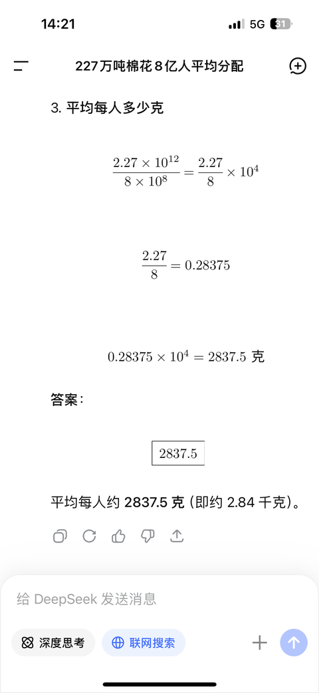

[toc]

# 问题

提问者：**<a href="https://www.zhihu.com/people/33-96-91-72-39">江山如画</a>**
提问时间: 2025-1-2 6:4:3
总回答数: 0
总访问量: 0

70 年代伙食生活水平是怎样的？

# 回答

回答者： **<a href="https://www.zhihu.com/people/a-lun-dai-er-liu-xiao-qi">阿伦戴尔柳小七</a>**
回答时间: 2025-11-3 18:24:52
点赞总数: 4370
评论总数: 124
收藏总数: 1507
喜欢总数：324

1970年，时任兰州军区司令员的皮定均将军视察甘肃张掖。在路边看到一个女孩儿衣不蔽体。就问随行的张掖专区书记，这是怎么回事。书记说：“此乃傻女。”

皮将军下车，到村中走到，发现村中无论女童女子，老幼均无遮蔽。书记答曰：“此乃本地风俗。”

将军大怒：“你家的老婆孩子也没有穿裤子吗？作为专区书记，你怎么会说出这样的话！”

衣食住行。衣尚在食之前。衣尚如此，伙食怎么样，就可想而知了。

著名记者，时任新华社山东分社副社长，李锦，1978年春节前后在山东临沂蒙阴县农村采访。正月初一，他走访一个姓鲍的现役军人的家。一间十二三平方的小屋，四壁空空，屋角支着一张锅，因为烟熏火燎，墙壁黑得发亮。靠墙是石头垒起来的床，一家3口人挤在这张床上，床对面拴着山羊。实在因为太穷了，只好人畜同居。

随后，走访一位姓王的大爷家。据李锦自己描述：

「这是一座斜依在半山坡上的低矮草房，墙是碎石片堆起来的，里面用泥巴糊着。老人在过年前两天没面吃了，嫁到山下的女儿送来一碗用豆腐白菜包的水饺。老伴90岁了，已病了很久，瘫在床上，听说闺女送水饺来了，嘴里直嚷嚷“水饺、水饺”，要起来吃。王大爷掀开被子，老伴竟一丝不挂，原来老人没有衣服穿，成天躺在这破被子里。只见大娘灰暗的皮包着骨头，肋骨清晰可辨，两条腿像是铁锨把一样细瘦。裹在她身上的棉被也已40多年了，硬邦邦的。带我来的干部说：“没衣服穿，躺在床上两年了，也没好吃的，可老妈妈命硬，今年90岁，就是不肯走。”

屋里有种说不清的味道，像是霉味，又像是臭味，干部赶快把我拉到门外。干部向王大爷介绍我是记者，北京来的。老人伸出双臂抱住我，双眼紧瞅住，连声喊“领导，领导”。我打量一下，大爷脸上已布满老年斑，鼻涕流到胡须上也不擦，一根麻绳扎着黑棉袄，里面没有衬衣。乡干部一把把他拉开，说把领导衣服弄脏了。大爷很不好意思，忙伸出手想替我掸，可又不敢，抬起手顺便擦了一下自己的鼻涕。

干部说，领导来看你日子过得咋样？大爷说：“好啊，有吃有穿，托共产党的福。”

明明已经断粮，连过年也不能吃上一顿饱饭，老伴衣服也没有，还在掩饰贫穷生活。大爷听干部介绍我是北京的记者，大着胆问：“刘司令还好吧”。我感到诧异。老人说，他与儿子一起参加过打孟良崮，打双堆集，又打过长江。儿子当兵，他是支前的民工。到南京他就回来了，儿子为刘伯承司令站岗，当了警卫员。辞行时，还与刘司令一起拍了照片。」

而据官方统计，1978年，全国农村人口为8.032亿，全国农民年人均纯收入仅有133元，其中90％以上为实物，货币收入不足10％。

这一年，全国有4000万户农民的粮食只能吃半年，还有几百万户农家，地净场光就是断粮之时，从冬到春全靠政府救济，靠借粮或外出讨饭度日。同是这一年，约有2亿人每天挣的现金不超过2角，有2.716亿人每天挣1.64角，有1.9亿人每天挣约0.14角，有1.2亿人每人每天挣0.11角，山西省平鲁县每人每天大约挣6分钱。

每天1角钱的收入，是包括粮食、柴草、棉花等等全部收入折算出来的。实际上，大多数农民除了口粮外，再没有1分钱现金分配。

所以，生活水平怎么样？想也能想的到了吧。

  

原文地址：[(阿伦戴尔柳小七)70 年代伙食生活水平是怎样的？](https://www.zhihu.com/question/8482449344/answer/1968745449398698730) 

# 评论

1. <a href="https://www.zhihu.com/people/lao-wang-58-63">对酒当歌</a> (<small title="湖南">2025-11-6 4:31:38</small>): 邓公一代伟人也
2. <a href="https://www.zhihu.com/people/roy-wang-57">天涯老此翁</a> (<small title="新加坡">2025-11-6 13:1:17</small>): 我爷爷是饿的不行了，约了几个邻居，准备闯关东。  
 
他们几个走出去一两天就饿的走不动了，在路边等死。  
 
恰好等到了村里来抓他们回去的追寻小队，结果意外得救了。追寻小队也是强弩之末了。
   - <a href="https://www.zhihu.com/people/roy-wang-57">天涯老此翁</a> (<small title="新加坡">2025-11-7 19:40:13</small>): 是的。因为回程中互相照应，回去之后也没怎么处罚。
   - <a href="https://www.zhihu.com/people/dai-wo-gong-cheng-ming-jiu-62">丁椿宸</a> (<small title="天津">2026-5-12 11:37:39</small>): 为什么没吃的了出去想办法，还要追回去？追回去等死么
   - <a href="https://www.zhihu.com/people/qiao-zhi-58-83">白首从来一梦中</a> (<small title="回复于 2026-5-15 9:50:47/中国香港"> ✉️:丁椿宸</small>): 还有村口武力把守出去就打掉的。。。
   - <a href="https://www.zhihu.com/people/syc5le">知乎用户SYc5LE</a> (<small title="江苏">2026-6-30 19:1:15</small>): 70年代，我老家青岛即墨，在农村生活的亲大爷大娘，盖着用破麻袋烂棉絮“糊弄”缝成的被子，我大娘和我母亲聊天，说他们每年每人只给3寸布票，那时农村的那个穷现在再想起来，不是亲眼所见，真感觉是在胡说八道！点煤油灯的煤油、火柴、针头线脑，小学生写字的本子铅笔、唯一的调味品——咸盐，都是靠养只鸡下个蛋换的。过年串亲戚买上1斤肉，蒸几个白馒头，带两包青岛特产的饼干，走了东家串西家，一直能把正月串完——因为到谁家都知道不能把这些“贵重”品留下，如果留下，过年期间来回走动拜年的“路子”就断了……在那个年代，这是共同遵守的“风俗”。唉，等我们这辈人过去，那就更成了再也没人提起的“鬼话”了。
   - <a href="https://www.zhihu.com/people/48-78-86-14">九宫山传奇老农</a> (<small title="回复于 2026-7-24 16:37:31/山东"> ✉️:知乎用户SYc5LE</small>): 串门不把东西留下这事我听我老师也说过，不过他说的只有掺了东西的“白面馒头”，谁要是把馒头真留下了那就有大仇了
   - <a href="https://www.zhihu.com/people/dai-wo-gong-cheng-ming-jiu-62">丁椿宸</a> (<small title="回复于 2026-7-26 6:23:9/河南"> ✉️:白首从来一梦中</small>): 他们有饭吃吗
   - <a href="https://www.zhihu.com/people/roy-wang-57">天涯老此翁</a> (<small title="回复于 2026-7-27 7:25:57/新加坡"> ✉️:知乎用户SYc5LE</small>): 直到80年代末，上厕所都是用石块儿刮，90年代开始用报纸，作业本。卫生纸自由，是到了2000年。  
 
现在提及女人不上桌儿，都被追着骂。
3. <a href="https://www.zhihu.com/people/ha-deng-de-xiao-gen-ban">大王叫我来巡山</a> (<small title="安徽">2025-11-5 11:38:23</small>): 能让老百姓吃饱饭真是功在千秋
   - <a href="https://www.zhihu.com/people/zhao-yi-85-4">战神之翼</a> (<small title="吉林">2026-5-24 14:45:23</small>): 可惜，很多人的最终梦想就停留在吃饱饭了。
   - <a href="https://www.zhihu.com/people/li-xiao-feng-78-70">陕地冷娃</a> (<small title="回复于 2026-6-19 15:48:2/陕西"> ✉️:战神之翼</small>): 可惜那一批没吃饱饭就去世了的，终极梦想吃饱饭都做不到。
   - <a href="https://www.zhihu.com/people/5-76-20-72-85">kitty</a> (<small title="回复于 2026-7-13 12:15:16/湖北"> ✉️:战神之翼</small>): 你父母吃不饱饭会有你吗？
   - <a href="https://www.zhihu.com/people/zhao-yi-85-4">战神之翼</a> (<small title="回复于 2026-7-27 11:38:23/吉林"> ✉️:kitty</small>): 我还真问过父母了，他们小时候真的吃不饱，吃不饱，只要不饿死，不耽误生孩子
4. <a href="https://www.zhihu.com/people/slashaxl">slashaxl</a> (<small title="重庆">2025-11-5 18:51:55</small>): 别急，正在吃第三个馒头［感谢］
5. <a href="https://www.zhihu.com/people/ji-niao-nian-jiu-lin">乌鸦五颜六色</a> (<small title="重庆">2026-5-11 20:43:22</small>): 这才是该勿忘国耻的
6. <a href="https://www.zhihu.com/people/being-5-50">being</a> (<small title="四川">2026-5-11 18:48:56</small>): 很快这些真实的曾经的存在就会被彻底的忘记。哎，人类的健忘啊
7. <a href="https://www.zhihu.com/people/nong-min-gong-72-32">农民工</a> (<small title="山东">2025-11-4 22:57:39</small>): 1998年我去烟台蓬莱辖某村的同学家，三间房子，两间属于人的区域，一间住的猪，贫富不议，满家猪臭味是真的
   - <a href="https://www.zhihu.com/people/bing-he-74-37">冰河</a> (<small title="湖北">2026-7-27 20:1:23</small>): 正常
8. <a href="https://www.zhihu.com/people/feng-xiang-nan-chui-4">风向南吹</a> (<small title="辽宁">2025-11-30 10:44:16</small>): 看了好多贴子和评论，真心讲，对比下，辽宁好多了，我在乡村，平时也缺油水，但饿不着。五月份角瓜等鲜菜下来，炒肉很香。一年能做1/2套衣服，过年肯定有新衣服的。过年杀年猪，普通200斤以上，肥膘很厚，㸆油可以对头吃一年。荤油饭，酱油炒饭也吃过，腊肉炖豆角很好吃。80年代末，高中时候，一个月老爸给我50元，吃饭加零花，已经是常态化了 。
   - <a href="https://www.zhihu.com/people/xing-zuo-wu-yu-xi-lie">星座物语系列</a> (<small title="江苏">2025-12-21 13:5:11</small>): 真有钱，80年代末一个月就有50块钱的零花，那个时候我爸还没有工作，还在走街串巷卖冰棍没有其他原因啊，因为家里没有关系，然后也不让你出去找工作，工业也不发达。
   - <a href="https://www.zhihu.com/people/wang-bu-liu-xing-41">吉天相</a> (<small title="江苏">2025-12-21 16:43:50</small>): 我在2010年家里都没有给我一个月50的零花［大笑］
   - <a href="https://www.zhihu.com/people/hu-yi-zhong-74-5">梅花三弄</a> (<small title="湖南">2025-12-23 21:25:25</small>): 80年代末读高中每月50？你那是什么家庭？长沙市89年中学老师每月45元，呵呵，你厉害
   - <a href="https://www.zhihu.com/people/57-68-9-58">小灰辉</a> (<small title="广东">2025-12-25 14:57:52</small>): 东三省依靠重工业，又是黑土地。这里都没得吃，全国都得饿死
   - <a href="https://www.zhihu.com/people/54-42-65-13">曼波·哈集美</a> (<small title="新疆">2025-12-29 20:52:6</small>): 什么工贵
   - <a href="https://www.zhihu.com/people/momo-19-60-80-47">momo</a> (<small title="江西">2026-5-10 13:1:31</small>): 你这是真有钱［捂脸］2006年我五年级，那时候住校。一周带差不多6斤米，五元菜钱。有时候还得省下点米来换包子吃……
   - <a href="https://www.zhihu.com/people/zheng-xiang-qian-61">明月有心</a> (<small title="回复于 2026-5-10 15:26:26/北京"> ✉️:梅花三弄</small>): 八九年长沙市中学老师月薪45元，是不是太低了一点。我八九年大学毕业，同学大多是去当中学老师，安徽，月薪基本一百出头。我到北京读研，第一年安排到工厂劳动，每月拿104元。第二年回来继续读书，每月生活补贴七十多元，自己做点校对之类的事，勉强度日。宿舍有个大龄同学，爱人就在长沙当老师，没问过工资多少，但好像不是很穷的样子。
   - <a href="https://www.zhihu.com/people/flying-cao">flying cao</a> (<small title="回复于 2026-5-11 18:26:30/海南"> ✉️:梅花三弄</small>): 我父母都是大学老师，在89年左右工资都是100左右，那个时代辽宁还属于国内经济不错的地区，粮食不够吃的情况比较少了，不过农村还是没钱。
   - <a href="https://www.zhihu.com/people/fu-hua-cang-sang-65">入画</a> (<small title="回复于 2026-5-12 17:42:33/北京"> ✉️:梅花三弄</small>): 苏南，我爸92-95读高中，50一个月住校，92后的物价可比80年代末高多了
   - <a href="https://www.zhihu.com/people/fu-hua-cang-sang-65">入画</a> (<small title="回复于 2026-5-12 17:42:48/北京"> ✉️:梅花三弄</small>): 他这八十年代末50是真不少
   - <a href="https://www.zhihu.com/people/yang-jun-99-79-67">杨军</a> (<small title="回复于 2026-5-13 9:20:56/辽宁"> ✉️:梅花三弄</small>): 辽宁城镇化高，工矿企业多，双职工一个孩子的家庭，八十年代末，每个月给孩子50元真不是吹牛B。
 
我是八十年代末读高中，当时分四档：一档是三线企业家庭，二档是城镇中疗养院家庭（我们这是疗养区，很多国家部委在当地设疗养院。）三是城镇中小企业及周边家庭，四是农村乡镇家庭。但只是相对，没有绝对。
 
一档不但家庭条件好，而且父母受教育程度也比其它三个高，一档中的父母很多都是重点大学毕业，甚至还有清北的。你如果不明白什么是三线，就别说下去了。
 
双职工那时是教师的，只能往后排，甚至都比不过当时农村的。
   - <a href="https://www.zhihu.com/people/qiao-zhi-58-83">白首从来一梦中</a> (<small title="回复于 2026-5-15 9:51:44/中国香港"> ✉️:梅花三弄</small>): 东北是计划经济的受益者。。。80-90年代东北还是很自豪的。。到了90年代末才下去：国家养不起了。
   - <a href="https://www.zhihu.com/people/tang-tang-tang-tang-yu-dong">wzwcy</a> (<small title="回复于 2026-5-20 11:58:39/江苏"> ✉️:入画</small>): 同苏南，老家房子当时八十年代末建的时候拢共也就千把块，还是靠台湾回来探亲的给的美金凑的
   - <a href="https://www.zhihu.com/people/cai1224">cai955</a> (<small title="回复于 2026-7-13 16:40:7/浙江"> ✉️:梅花三弄</small>): 80年代末上大学，家里给100，上大学那个市里面好像有个啥补贴15，平均每月奖学金15。还有点其他外快。
 
在同学里算很富的了。
   - <a href="https://www.zhihu.com/people/biao-ge-25-56">彪哥</a> (<small title="江西">2026-7-14 15:55:13</small>): 胡乱说些什么呢？我92年上大学，每月生活费也就50元，我父母还是在政府部门工作的。我妈妈工资都没超过100，我爸爸好一点，超过100了。
   - <a href="https://www.zhihu.com/people/biao-ge-25-56">彪哥</a> (<small title="回复于 2026-7-14 16:4:38/江西"> ✉️:明月有心</small>): 你可能记错了，92年前，刚参加工作，工资不可能超过100，93年工资改革后，像我爸爸，挂了个县政协常委，也就300多一点。
9. <a href="https://www.zhihu.com/people/fei-bing-zhu-bu-qian-xing">非秉烛不前行</a> (<small title="江苏">2026-5-10 16:28:4</small>): 只有过来人，才能体会当年的艰辛！
10. <a href="https://www.zhihu.com/people/man-you-zhe-87-75">漫游者</a> (<small title="陕西">2025-11-5 17:48:29</small>): 实话实说，苦口良药［赞］［赞］［赞］
11. <a href="https://www.zhihu.com/people/yu-du-bai-98-83">鱼肚白</a> (<small title="广东">2026-5-10 17:43:5</small>): 太穷了，收入都没有，能吃饱就行了
12. <a href="https://www.zhihu.com/people/sheng-daniel-1">fastcutback</a> (<small title="上海">2026-5-10 17:49:54</small>): 就事论事，比旧社会还是强。
    - <a href="https://www.zhihu.com/people/xie-shui-zhi-ping-di-97">泻水置平地</a> (<small title="河南">2026-5-11 22:24:50</small>): ［飙泪笑］［赞］
    - <a href="https://www.zhihu.com/people/mu-da-bao-bao">Momo</a> (<small title="河北">2026-5-13 13:32:32</small>): 看地区
    - <a href="https://www.zhihu.com/people/shui-zai-yun-shang-40">水在云上</a> (<small title="浙江">2026-7-29 21:18:34</small>): 旧社会，上海是亚洲金融中心
13. <a href="https://www.zhihu.com/people/li-xiu-jian-32">李修</a> (<small title="江苏">2025-11-6 10:9:24</small>): 太夸张了吧
    - <a href="https://www.zhihu.com/people/zhang-qing-53-83">莫忘今朝</a> (<small title="上海">2026-5-13 1:9:39</small>): 改革开放的先声，万里安徽行，那是安徽，离你们江苏不远
    - <a href="https://www.zhihu.com/people/11-77-32-50">薄荷巧克力</a> (<small title="北京">2026-6-22 16:24:44</small>): 你查查尿素袋就明白了
14. <a href="https://www.zhihu.com/people/ao-mi-ya-3">奥秘牙</a> (<small title="上海">2025-11-4 1:58:38</small>): ［飙泪笑］皮将军还用发脾气，他不知道自己的家底吗？1970年全国棉花产量227万吨，全国8。3亿人，平均每人24。73克棉花，差不多可以织手掌这么大的毛巾。去年棉花产量616万吨，这产量放当年也不不够给全国人民加一幅手套的。彻底解决穿衣问题是化纤。制造设备也是70年代开始引进的
    - <a href="https://www.zhihu.com/people/xiao-xin-xiao-dian-gong">小昕小电工</a> (<small title="江苏">2025-11-4 9:13:5</small>): 人均2473g 您再算算
    - <a href="https://www.zhihu.com/people/lan-tian-wei-shi-26">蓝天卫士</a> (<small title="新疆">2025-11-4 12:39:29</small>): 1984年全国棉花产量达到626万吨。
    - <a href="https://www.zhihu.com/people/pan-pan-19-8-77">嘉然今天吃老饱了</a> (<small title="回复于 2025-11-4 13:24:16/广东"> ✉️:小昕小电工</small>): 他应该是手机打字不好打，顺手把句号当小数点用，然后可能顺手打错了，因为除一下除出来是27.34g。不过不影响结论，这怎么也不够一张手帕啊［小情绪］［小情绪］
    - <a href="https://www.zhihu.com/people/magicfire-58">magicfire</a> (<small title="广东">2025-11-4 16:25:55</small>): 这事说来也怪哦，家里衣服大都纯棉的，哪怕是混纺，化纤的占比也不高，但是实际上谁家每年不买几件衣服呢？衣物消费肯定是比70年代扩大几十倍不止的。
 
  
 
我不是在说怪话，就是觉得3倍的棉花产量支持不了几十倍的衣物消耗，按这么算数字有些对不上，会不会这些衣服上的纯棉和化纤比例有些虚标？
    - <a href="https://www.zhihu.com/people/ao-mi-ya-3">奥秘牙</a> (<small title="回复于 2025-11-4 19:11:25/上海"> ✉️:magicfire</small>): 有进口，棉花去年进口了261万吨。还有真纯棉制品穿在身上并不舒服，现在很多都是混纺，比如棉麻，棉丝等等［思考］
    - <a href="https://www.zhihu.com/people/wei-ni-zhong-qing-72">士之耽兮</a> (<small title="重庆">2025-11-4 20:56:46</small>): 那民国时候一定全街裸奔
    - <a href="https://www.zhihu.com/people/li-san-wu-75">李中克</a> (<small title="湖北">2025-11-4 20:57:49</small>): 彻底解决问题的是制度。同样是工业革命，英国1760年就在搞，法德美1860年才开始搞，俄日1880年才开始搞，你1980年才开始搞，这就是差距。
    - <a href="https://www.zhihu.com/people/ao-mi-ya-3">奥秘牙</a> (<small title="回复于 2025-11-4 22:7:6/上海"> ✉️:李中克</small>): 在1941年英国人Whinfield 和Dickson 发明PET，美国人在1950年完善和改进合成纤维工业前，全世界穿衣服都不容易，衣服在那国都不是便宜货。现实世界这些才是推动穿衣自由的节点。
    - <a href="https://www.zhihu.com/people/55-27-45-39">沈幼楚</a> (<small title="回复于 2025-11-4 22:58:34/上海"> ✉️:小昕小电工</small>): 24点73克
    - <a href="https://www.zhihu.com/people/dong-hai-zhi-hu">东海之虎</a> (<small title="回复于 2025-11-5 11:23:48/上海"> ✉️:嘉然今天吃老饱了</small>): 227万吨，就是22.7亿公斤，对8.3亿人口，麻烦你再算算
    - <a href="https://www.zhihu.com/people/dong-hai-zhi-hu">东海之虎</a> (<small title="回复于 2025-11-5 11:24:0/上海"> ✉️:沈幼楚</small>): 227万吨，就是22.7亿公斤，对8.3亿人口，麻烦你再算算
    - <a href="https://www.zhihu.com/people/98-70-52-82">著名思饷家</a> (<small title="江西">2025-11-5 12:59:3</small>): 616万吨棉花除以14亿，等于每个人4.4公斤！
    - <a href="https://www.zhihu.com/people/pan-pan-19-8-77">嘉然今天吃老饱了</a> (<small title="回复于 2025-11-5 13:58:5/广东"> ✉️:东海之虎</small>): 2734g，蚌埠住了，这一层楼里连带我没几个算对的
    - <a href="https://www.zhihu.com/people/magicfire-58">magicfire</a> (<small title="回复于 2025-11-5 14:0:48/广东"> ✉️:奥秘牙</small>): 我们确实有进口棉花，但是我们也有出口大量纺织品啊。
    - <a href="https://www.zhihu.com/people/you-tai-du-de-hei-jin-gang">有态度的黑金刚</a> (<small title="回复于 2025-11-5 15:25:5/江苏"> ✉️:著名思饷家</small>): 我用计算器算了一下，您是对的。
    - <a href="https://www.zhihu.com/people/you-tai-du-de-hei-jin-gang">有态度的黑金刚</a> (<small title="回复于 2025-11-5 15:29:48/江苏"> ✉️:小昕小电工</small>): 我算了三遍，人均2734.94克，你们怎么算出2473的？
    - <a href="https://www.zhihu.com/people/97-80-2-78">人民万岁</a> (<small title="山东">2025-11-5 19:38:17</small>): 1952~1978年，我国棉花产量从130万吨增至217万吨，年均增长2%；  
 
1978~2008年，我国棉花产量从217万吨增至749万吨，年间增长4.3%
    - <a href="https://www.zhihu.com/people/97-80-2-78">人民万岁</a> (<small title="回复于 2025-11-5 19:38:31/山东"> ✉️:有态度的黑金刚</small>): 1952~1978年，我国棉花产量从130万吨增至217万吨，年均增长2%；  
 
1978~2008年，我国棉花产量从217万吨增至749万吨，年间增长4.3%
    - <a href="https://www.zhihu.com/people/59-81-92-60">老山城</a> (<small title="重庆">2025-11-5 21:58:40</small>): 算数不愧是那个年代的水平［酷］
    - <a href="https://www.zhihu.com/people/ao-mi-ya-3">奥秘牙</a> (<small title="回复于 2025-11-5 23:13:55/上海"> ✉️:老山城</small>): 哈哈，点赞
    - <a href="https://www.zhihu.com/people/a-guai-11-27-59">阿乖</a> (<small title="浙江">2025-11-6 7:0:20</small>): 除了棉花还有各类麻，衣服麻布才是大头
    - <a href="https://www.zhihu.com/people/san-re-34">散热</a> (<small title="回复于 2025-11-26 10:59:18/上海"> ✉️:士之耽兮</small>): 民国衣不遮体还真遍地都是，并且造成这个问题一大半都是人祸，民国的人口没有70年代多，土地资源还能勉强支撑，但是蒋在窃取果实后为了稳定勾结利益集团，几乎是放任军阀、资本家、地主阶级无底线的剥削，后面又是连年战乱连军队服装都难保证
    - <a href="https://www.zhihu.com/people/70-41-91-51-6">采花炼金师</a> (<small title="浙江">2025-11-26 15:58:38</small>): 他怎么知道这个数据的
    - <a href="https://www.zhihu.com/people/bai-bian-xiao-hao-72">酸奶</a> (<small title="江苏">2025-11-28 14:24:6</small>): 227万吨，8亿人平均每人2.8kg棉花。这层楼里都是手算的？智障AI虽然不怎么好用，但是用来基础计算还是可以的啊［捂脸］。 
    - <a href="https://www.zhihu.com/people/qu-wu-fei">曲舞飞</a> (<small title="山东">2025-12-3 6:4:58</small>): 四三项目，解决穿衣吃饭
    - <a href="https://www.zhihu.com/people/kjjugf">普莱斯</a> (<small title="回复于 2025-12-11 6:23:14/湖南"> ✉️:小昕小电工</small>): 那也不够啊
    - <a href="https://www.zhihu.com/people/kjjugf">普莱斯</a> (<small title="回复于 2025-12-11 6:25:14/湖南"> ✉️:东海之虎</small>): 也不够吧
    - <a href="https://www.zhihu.com/people/20-24-54-21">神之若风</a> (<small title="回复于 2025-12-17 9:24:42/山东"> ✉️:散热</small>): 那不是因为控制不到吗？
    - <a href="https://www.zhihu.com/people/zi-jin-93">子衿</a> (<small title="回复于 2025-12-19 23:16:29/湖南"> ✉️:酸奶</small>): 千问不行，算的是28公斤……
    - <a href="https://www.zhihu.com/people/dummeskind">dummeskind</a> (<small title="回复于 2025-12-24 18:1:49/北京"> ✉️:嘉然今天吃老饱了</small>): ［好奇］［尴尬］［捂脸］［赞］
    - <a href="https://www.zhihu.com/people/he-lei-62-44">陌生人</a> (<small title="重庆">2026-5-7 8:12:27</small>): 仅仅是一个棉花产量的问题？就是贫穷，连饭都吃不饱，即便有布也没钱买。
    - <a href="https://www.zhihu.com/people/bu-hui-kai-che-de-wang-shi-fu">不会开车的王师傅</a> (<small title="浙江">2026-5-16 0:37:17</small>): 你算错了227万吨平均分给8.3亿人的话每人有2.74kg，可以搞件棉袄
    - <a href="https://www.zhihu.com/people/25-91-1-52">雪山素女</a> (<small title="云南">2026-7-6 17:25:2</small>): 棉纱产量：1949年，美国171万吨，苏联61万吨，英国37万吨，中国33万吨，法国23万吨，  
 
  
 
西德23万吨，日本16万吨。1978年，中国238万吨，苏联161万吨，美国112万吨，日本45万吨，法国22万吨，西德16万吨，英国9万吨。  
 
  
 
棉布产量：1949年，美国76.8亿米，苏联36.0亿米，中国18.9亿米，英国18.3亿米，法国10.9亿米，西德8.7亿米，日本8.2亿米。1978年，中国110.3亿米，苏联69.7亿米，美国36.4亿米，日本23.2亿米，法国10.1亿米，西德9.6亿米，英国3.8亿米。  
 
你用其他方面黑可能我没话说，偏要用棉花产量［飙泪笑］
    - <a href="https://www.zhihu.com/people/bai-hao-ke-55">远景轩若</a> (<small title="上海">2026-7-26 18:8:25</small>): 呃呃，有没有可能人并不需要年年做新衣(当时)，棉产量绝对够的［飙泪笑］旧棉花也能用，只是有人有不止一件
15. <a href="https://www.zhihu.com/people/gujq-18">随缘博爱</a> (<small title="北京">2025-11-6 10:1:22</small>): 那个时候很奢侈，每天吃大黄鱼。
16. <a href="https://www.zhihu.com/people/guo-xiang-dong-68">郭向东</a> (<small title="四川">2025-11-5 0:54:28</small>): 感念邓公。
17. <a href="https://www.zhihu.com/people/jiu-yue-yuan-fei">九月鸢飞</a> (<small title="福建">2025-12-22 18:46:43</small>): 1、甘肃，衣不蔽体。抗冻能力超强，佩服。  
 
2、没得吃，90岁。  
 
为什么都是选择边远地区造谣，就是让你没得求证  
 
［捂脸］［捂脸］还一大群人在这边……
    - <a href="https://www.zhihu.com/people/shi-guang-bo-liang-24">在下小唐</a> (<small title="浙江">2026-5-16 19:8:20</small>): 应该是真的我爸爸90年末去西安乡下 那边很穷的
    - <a href="https://www.zhihu.com/people/cai1224">cai955</a> (<small title="浙江">2026-7-13 16:45:34</small>): 80年代初，上初中。我们同学家里有平均每人收入几块钱一个月的（就是父亲三十来块钱工资，养一大家子）。早晨参加体育训练后，不吃早饭，因为买不起。这是条件较好的城市。
 
边远农村啥样不知道。但我父母单位有两家小儿麻痹症的残废男孩，都找了农村大姑娘，还不是边远地区的。可想而知，那时候农村的条件吧。
18. <a href="https://www.zhihu.com/people/89-21-26-82">欧阳官人</a> (<small title="广西">2026-5-10 11:30:31</small>): 不用造谣，当时南方比北方好一些，在沿海地区就不会有饿死人的现象，自然资源丰富啊
    - <a href="https://www.zhihu.com/people/50-75-25-29">简单就好</a> (<small title="广东">2026-5-18 23:33:2</small>): 广西的事更残忍 写出来你会吓的睡不着 这里写的是山东山西 粮食主产区 如果不能打工你觉得你广西就按现在行不别说那时化肥农药牲畜紧缺
    - <a href="https://www.zhihu.com/people/50-75-25-29">简单就好</a> (<small title="广东">2026-5-18 23:34:41</small>): 现在富裕的东莞 珠海 潮汕广州 深圳 那些人去香港也只是想活而已
19. <a href="https://www.zhihu.com/people/yu-chui-xue-70">羽吹雪</a> (<small title="上海">2026-7-29 17:59:33</small>): 皖南也还行，至少吃得饱穿的暖，但我小时候也确实还有讨饭的，八十年代初
20. <a href="https://www.zhihu.com/people/wen-zhong-dai-xiu-52">南非小飞侠的迷弟</a> (<small title="河北">2026-7-29 10:50:17</small>): 触目惊心
21. <a href="https://www.zhihu.com/people/zhang-jian-27-40">momo</a> (<small title="山东">2026-7-27 14:46:12</small>): 感恩邓公！
22. <a href="https://www.zhihu.com/people/nuo-nuo-96-79">海边卡夫卡</a> (<small title="河南">2026-7-6 18:28:25</small>): 我小学时候，大概90年左右，上门要饭的还很多！
23. <a href="https://www.zhihu.com/people/liu-yi-si-ba-da">叫我小刘</a> (<small title="广东">2026-6-28 20:59:6</small>): 哎，现在是血糖高，血脂高，烦恼。
24. <a href="https://www.zhihu.com/people/nicolas-46-56">nicolas</a> (<small title="北京">2026-6-17 9:49:50</small>): [https://www.zhihu.com/question/749789437/answer/1982132725654763246?share\_code=TWyOpKhnvVNJ&utm\_psn=2050515429475496548](https://www.zhihu.com/question/749789437/answer/1982132725654763246?share_code=TWyOpKhnvVNJ&utm_psn=2050515429475496548)
25. <a href="https://www.zhihu.com/people/xi-fen-77">从容淡定</a> (<small title="浙江">2026-5-18 17:48:46</small>): 短暂到达的未来。
26. <a href="https://www.zhihu.com/people/chen-yu-chu-ting-35-8">一剑霜寒十四州</a> (<small title="河南">2026-5-14 23:27:59</small>): 刘司令那个明显是编的，山东那是陈老总、粟司令，多做点功课吧
    - <a href="https://www.zhihu.com/people/yun-shan-cang-cang-2">长恨此身非我有</a> (<small title="山东">2026-6-18 9:40:48</small>): 到后期中野华野交流部队人员并不算出奇，补充兵员也有混着来的。
27. <a href="https://www.zhihu.com/people/mu-da-bao-bao">Momo</a> (<small title="河北">2026-5-13 13:32:16</small>): 1960年我姥姥的爸爸早逝，因为我家没男孩。他生前的御寒的皮袄赠送给了他之前的同事好哥们，这个大爷超级感谢，一直穿到80年代。他有一顶皮帽子还卖了二手。他生前的被子，连袜子都有人要，枕巾小毛巾。最后只烧了一个枕头芯糠皮。换现在能想象吗？大家都知道是去世的人的衣物。吉林长春市区，东北在那些年应该还算条件底子好的。然后我姥姥没挨到饿是因为她爸之前卧床生病了三年，吃不下去东西，等于变相攒了一口人的粮食供应量。否则即使是东北那种粗粮产量也不够吃。我姥爷家就不行了，他最小的妹妹是60年正好赶上长身体，吃不饱饭，饿的嗷嗷哭，为了节约能量，每天都不下地，每天在炕上待着。我姥爷家人个子都可高了。他家男孩都最矮182，女孩174，49年之前都有这么高，结果我姥爷这个妹妹成年只有156，纯饿的。
28. <a href="https://www.zhihu.com/people/general-16-54">明月清风</a> (<small title="河南">2026-5-13 7:8:40</small>): 现在我们吃得饱穿的暖，那是我们没有生在那个贫穷的年代有很多的苦是我们无法想象的
29. <a href="https://www.zhihu.com/people/moldirrr">moldirrr</a> (<small title="上海">2026-5-12 13:6:11</small>): 那又怎样 ？
30. <a href="https://www.zhihu.com/people/lao-yang-shi-tu-31">老羊识途</a> (<small title="湖北">2026-5-11 19:7:27</small>): 70年代初期应该说处于只求吃饱肚子阶段

=[评论](./attachments/comments.json)

