[toc]

# 问题

提问者：**<a href="https://www.zhihu.com/people/king-fisher-19">King Fisher</a>**
提问时间: 2025-12-29 15:12:47
总回答数: 1381
总访问量: 14361571

我和我老婆现在有两个孩子，一个幼儿园大班，一个刚满月不久。她是一名佛教徒，从15年开始学佛快十年了（好像是什么大乘佛教/密宗），几乎每周六下午都要外出去学习佛教知识，通常12:30出门，乘坐1小时左右的地铁，19:30以后才回家。平时也基本不看别的书，只看佛教方面的书，而且特别认真，各种划线做笔记（说实话，高考都不一定有这么认真）。经常口中还念念有词，背诵经文（好像是每天要念够多少遍）。以前的时候还在家磕大头。平时禁止我们吃活杀的食物，如新鲜的虾、大闸蟹、鱼等等，发现我们买了活虾就会偷偷拿去放生。有时还会教大宝念一些经文或者说一些佛教知识。上周六，丈母娘不让她去继续学习，她就泪奔出门了，哭了一下午和一晚上。平时不能说学佛不好，只要一提，立马就是激烈的争吵。

  

我本人对佛教和佛学没有任何偏见，每年有时候还去一些寺庙祈福。现在，我只是觉得她的这种状态和学佛方式有些难以接受。我不知道这样子的状态到底好不好，是不是正常的？是否还要支持她继续学下去？或者还是继续不管这个事，就当她的爱好，不支持不反对？我到底该是什么样的态度合适？

# 回答

回答者： **<a href="https://www.zhihu.com/people/11-1-7-95">顾川</a>**
回答时间: 2026-1-10 20:11:49
点赞总数: 28313
评论总数: 1524
收藏总数: 10643
喜欢总数：409

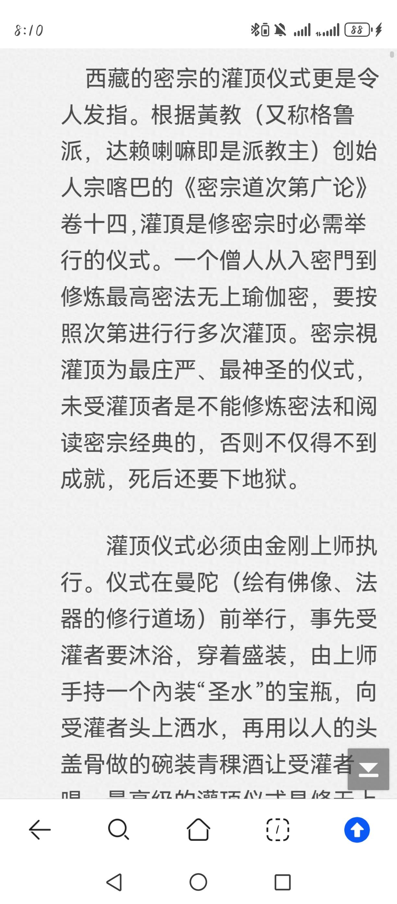

  

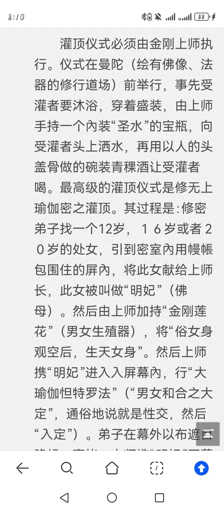

  

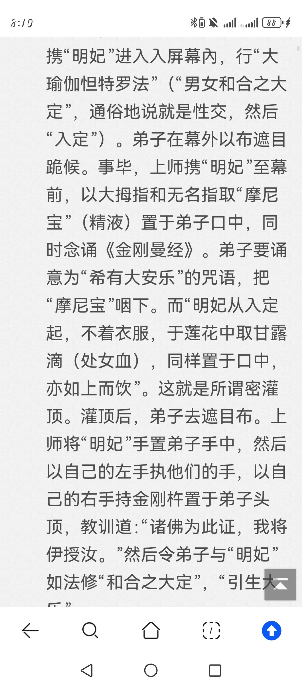

  

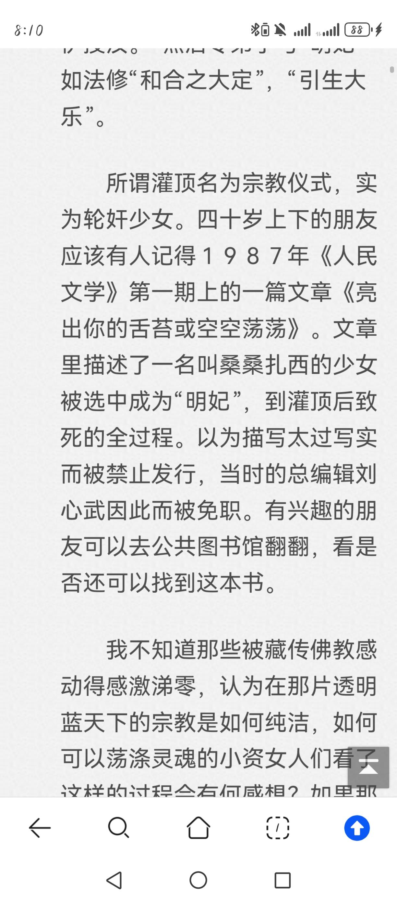

  

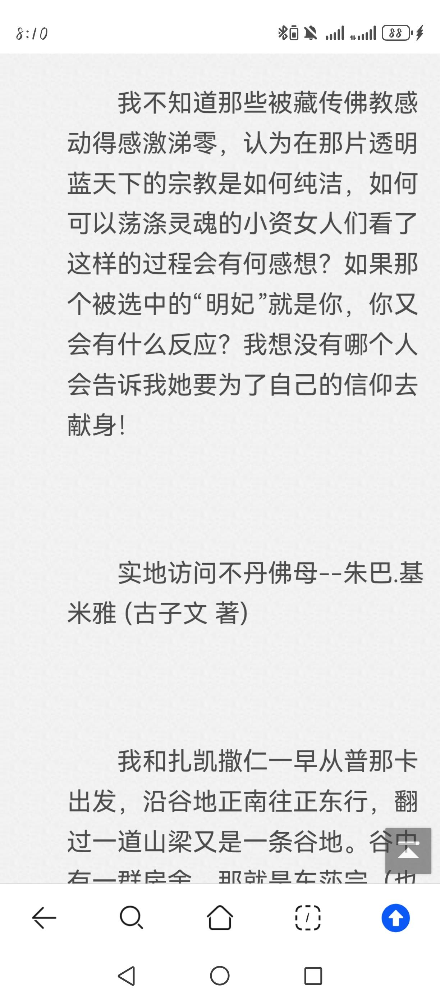

随时可能被删帖子，抓紧看吧

  

原文地址：[(顾川)痴迷学佛的妻子，我该支持吗？](https://www.zhihu.com/question/1988990831844164925/answer/1993414737984234948) 

# 评论

1. <a href="https://www.zhihu.com/people/shi-cun-chang-gong">十寸长弓</a> (<small title="山东">2026-1-14 8:23:15</small>): 如果我手枪里这九发子弹没卡壳，说明你在玩弄苍生……
   - **顾川** (<small title="辽宁">2026-1-14 8:54:2</small>): 时间差不多喽［感谢］
   - <a href="https://www.zhihu.com/people/suo-la-ji-64">嗦啦唧</a> (<small title="回复于 2026-1-18 16:20:7/辽宁"> ✉️:顾川</small>): 哭也算时间噢
   - <a href="https://www.zhihu.com/people/dan-ta-yun-you">云游捎僧</a> (<small title="回复于 2026-1-19 13:59:15/湖南"> ✉️:顾川</small>): 砰.砰.砰......
   - <a href="https://www.zhihu.com/people/sunny-chan">SUNNY CHAN</a> (<small title="四川">2026-1-19 18:40:22</small>): 像这样的上师还能怎么改变呢？  
 
他改变不了  
 
只有死［滑稽］
   - <a href="https://www.zhihu.com/people/ling-yun-jing-zhu-57">凌云劲竹</a> (<small title="广东">2026-1-20 15:43:29</small>): 批判的武器终究比不过武器的批判
   - <a href="https://www.zhihu.com/people/7-9-25-94-69">Interstella</a> (<small title="浙江">2026-1-20 20:38:16</small>): 全卡壳换格洛克［飙泪笑］再不行拿ar，我就不信今天机魂不悦
   - <a href="https://www.zhihu.com/people/flash-win">flash win</a> (<small title="山东">2026-1-21 20:37:25</small>): 我来之前请示过关帝爷爷
   - <a href="https://www.zhihu.com/people/9-23-50-60-84">极道教主</a> (<small title="中国香港">2026-1-24 12:24:51</small>): 此事在天云孽海中亦有记载
   - <a href="https://www.zhihu.com/people/phoenix-32-1">phoenix</a> (<small title="四川">2026-1-28 18:24:19</small>): 如果全部卡壳，说明你在玩弄苍生，断不可留
   - <a href="https://www.zhihu.com/people/li-yan-wei-14">我是鲨鱼</a> (<small title="广东">2026-1-29 6:58:43</small>): 曾经，我茫然前行
   - <a href="https://www.zhihu.com/people/ge-wu-zhi-zhi-18">美索不达米娅</a> (<small title="回复于 2026-1-29 22:21:41/陕西"> ✉️:我是鲨鱼</small>): 砰💥砰砰砰
   - <a href="https://www.zhihu.com/people/ao-si-qia-50-81">hddgjhcch</a> (<small title="江苏">2026-2-1 10:45:19</small>): 一百次圣杯也在所不惜
   - <a href="https://www.zhihu.com/people/huo-da-69-10">燕双鹰</a> (<small title="回复于 2026-2-1 19:18:54/天津"> ✉️:SUNNY CHAN</small>): ？
   - <a href="https://www.zhihu.com/people/sunny-chan">SUNNY CHAN</a> (<small title="回复于 2026-2-1 19:36:6/四川"> ✉️:燕双鹰</small>): 我操！  
 
偶像大人好
   - <a href="https://www.zhihu.com/people/33-50-44-32-43">网恋腹肌男被骗9W</a> (<small title="江苏">2026-2-3 2:53:1</small>): 如果我手枪里这九发子弹没卡壳，说明你在玩弄苍生……
   - <a href="https://www.zhihu.com/people/yiqie-shi-ni">哦买尬</a> (<small title="河北">2026-2-3 12:13:16</small>): 我换子弹你们还有跑的时间哦［感谢］
   - <a href="https://www.zhihu.com/people/lin-wu-37-66">林雾</a> (<small title="回复于 2026-2-4 8:2:36/江苏"> ✉️:网恋腹肌男被骗9W</small>): 怎么天天有人发这图片［大笑］
   - <a href="https://www.zhihu.com/people/ru-ke-fu-si-ji-97">社会主义巨婴</a> (<small title="江苏">2026-2-9 9:30:33</small>): 用M500左轮手枪，.500口径的，用五发全新子弹
   - <a href="https://www.zhihu.com/people/zhou-wu-bin-43">圆周</a> (<small title="江西">2026-2-17 5:18:48</small>): ［捂脸］周处是上帝，还是带枪的那种
   - <a href="https://www.zhihu.com/people/rwuycu">知乎用户RWuyCU</a> (<small title="江苏">2026-2-17 18:55:52</small>): 骗你的，卡壳了也是
   - <a href="https://www.zhihu.com/people/he-si-ta">POLARIS-A1</a> (<small title="湖南">2026-3-2 0:9:26</small>): 左轮吧［捂脸］
   - <a href="https://www.zhihu.com/people/he-xiang-82-10">mlhr虎背熊腰</a> (<small title="河南">2026-5-1 13:3:26</small>): 如果全部卡壳，说明你在玩弄我，断不可留
   - <a href="https://www.zhihu.com/people/catrkmhh">小看山CatrKMHh</a> (<small title="陕西">2026-5-6 21:50:55</small>): 母亲真的老了，每次打电话来，总是满怀热忱地问：你什么时候回家?  
 
　　且不说相隔一千多里路，要转三次车，光是工作、孩子已经让我分身无术，哪里还抽得出时间回家。  
 
　　母亲的耳朵不好，我解释了半天，她仍旧热切地问：你什么时候能回来?  
 
　　几次三番，我终于没有了耐心，在电话里大声嚷嚷，她终于听明白，默默挂了电话。  
 
　　隔几天，母亲又问同样的问题，只是那语调怯怯地，没有了底气。明知问了也是白问，可就是忍不住。  
 
　　我心一软，沉吟了一下。  
 
　　母亲见我没有烦，她欣喜地向我描述：后院的石榴都开花了，西瓜快熟了，你回来吧。  
 
　　我为难地说：那么忙，怎么能请得上假呢!  
 
　　她急急地说：你就说妈妈得了癌，只有半年的活头了!  
 
　　我立马怪她胡扯，她笑了。  
 
　　小时候，每逢刮风下雨，我不想去上学，便装肚子疼，被母亲识破，挨了一顿好骂。现在老了，她反而教着女儿说谎了。  
 
　　这样的问答不停地重复着，我终于不忍心，告诉她下个月一定回去。  
 
　　可不知怎么了，永远都有忙不完的事，每件事都比回家重要，最后，到底没能回去。  
 
　　电话那头的母亲，仿佛没有力气再说一个字，我满怀内疚：妈，生气了吧?  
 
　　母亲这一回听真了，她连忙说：孩子，我没有生你的气，我知道你忙。  
 
　　可是没几天，母亲的电话催得越发紧了。她说，葡萄熟了，梨熟了，快回来吃吧。  
 
　　我说，有什么稀罕，这里满街都是，花个十元八元就能吃个够。  
 
　　母亲不高兴了，我又耐下性子来哄她：不过，那些东西都是化.肥和农.药喂大的，哪有你种的好呢。母亲得意地笑起来。  
 
　　星期六那天，气温特别高，我不敢出门，开了空调在家里待着。孩子嚷嚷雪糕没了，我只好下楼去买。在暑气蒸熏的街头，我忽然就看见了母亲的身影。  
 
　　看样子她刚下车，她弯着腰，左躲右闪着，怕别人碰了她的东西。在拥挤的人流里，母亲每走一步都很吃力。  
 
　　我大声地叫她，她急急抬起满是热汗的脸，四处寻找，看见我走过来，竟惊喜地说不出话来。  
 
　　一回到家，母亲就喜滋滋地往外捧那些东西。她的手青筋暴露。  
 
　　母亲笑着对我说：吃呀，你快吃呀，这全是我挑出来的。  
 
　　我这没有出过远门的母亲，只为着我的一句话，便千里迢迢地赶了来。那些水灵灵的葡萄和梨子都完好无损。  
 
　　我想象不出，她一路上是如何过来的，在这世上，凡有母亲的地方就有奇迹。  
 
　　母亲只住了三天，她说我太辛苦，起早贪黑地上班，还要照顾孩子，她干着急却帮不上忙。  
 
　　她自己悄悄去订了票，又悄悄地一个人走。  
 
　　才回去一星期，母亲又说想我了，不住地催我回家。我苦笑：妈，你再耐心一些吧!  
 
　　第二天，我接到姨妈.的电话：你.妈妈病了，你快回来吧。我急得眼前发黑，奔到车站，赶上了末班车。  
 
　　一路上，我心里默默祈祷。我希望这是母亲骗我的，我希望她好好的。  
 
　　此时，我才知道，人活到八十岁也是需要母亲的。车子终于到了村口，母亲小跑着过来，满脸的笑。  
 
　　我抱住她，又想哭又想笑，责怪道：你说什么不好，说自己有病，亏你想得出!  
 
　　受了责备的母亲，仍然无限地欢喜，她只是想看到我。母亲乐呵呵地忙进忙出，摆了一桌子好吃的东西。  
 
　　我给母亲做饭，跟她聊天，母亲长时间地凝视着我，眼露无比的疼爱。  
 
　　无论我说什么，她都虔诚地半张着嘴，侧着耳朵凝神地听，就连午睡，她也坐在床边，笑眯眯地看着我。  
 
　　我说：既然这么疼我，为什么不跟着我住呢?她说，住不惯。  
 
　　没待几天，我就急着要回去，母亲送我去坐夜班车。  
 
　　这一回，母亲仿佛放下了，她竟没有再催过我回家，只是不断地对我说些开心的事：家里添了只很乖的小牛犊。明年开春，她要在院子里种好多的花。听着听着，我心里一片温暖。  
 
　　到年底，我又接到姨妈.的电话。她说：你.妈妈病了，快回来吧。  
 
　　我哪里相信，我们前天才通的话，母亲说自己很好，叫我不要挂念。姨妈只是不住地催我，半信半疑的我还是回去了，并且买了一大袋母亲爱吃的油糕。  
 
　　车到村头的时候，我张望着，母亲没来接我，我心里颤颤地就有了种不祥的预感。  
 
　　姨妈告诉我，给我打电话的时候，母亲就已经不在了，她走得很安详。半年前，母亲就被诊断出了癌症，只是她没有告诉任何人，仍和平常一样乐呵呵地忙到闭上眼睛，并且把自己的后事都安排妥当了。  
 
　　姨妈还告诉我，母亲老早就患了眼疾，看东西很费劲。我紧紧地把那袋油糕抱在胸前，一颗心仿佛被人挖走。  
 
　　原来，母亲知道自己剩下的日子不多了，才不住地打电话叫我回家，她想再多看我几眼，再和我多说几句话。  
 
　　原来，我挑剔着不肯下筷的饭菜，是她在视力模糊的情况下做的，我是多么的粗心!我走的那晚上，她一个人是如何摸索到家，她跌倒了没有，我永远都无从知道了。  
 
　　母亲，在生命最后的时刻还快乐地告诉我，牵牛花爬满了旧烟囱，扁豆花开得像我小时候穿的紫衣裳...
   - <a href="https://www.zhihu.com/people/020-666">020-666巧不克力</a> (<small title="回复于 2026-5-10 4:49:46/江西"> ✉️:小看山CatrKMHh</small>): 今天是6月10日母亲节，愿你我在人间受苦受累受难的母亲，在天国健康快乐安好无恙!
   - <a href="https://www.zhihu.com/people/callmejie-13">叫我杰</a> (<small title="河南">2026-6-15 12:44:59</small>): 如果卡壳了 就换这个背着的30发的［飙泪笑］
   - <a href="https://www.zhihu.com/people/xie-wen-zhao-86">山有扶苏</a> (<small title="回复于 2026-7-15 11:2:7/上海"> ✉️:SUNNY CHAN</small>): 我赌你的枪里没有子弹
   - <a href="https://www.zhihu.com/people/sunny-chan">SUNNY CHAN</a> (<small title="回复于 2026-7-15 14:6:31/四川"> ✉️:山有扶苏</small>): 你说得对，但是我的链子刀里有子弹［滑稽］
   - <a href="https://www.zhihu.com/people/kan-ke-41-42">世界已进入癫狂模</a> (<small title="上海">2026-7-23 11:17:46</small>): 还是换加特林吧［doge］
   - <a href="https://www.zhihu.com/people/mou-ren-58-53">某人</a> (<small title="江西">2026-7-23 18:32:56</small>): 不太对，藏密的双修一般是通过唐卡
2. <a href="https://www.zhihu.com/people/81-46-15-45-50">李白不白</a> (<small title="山东">2026-1-12 10:49:56</small>): 他们只有海拔高，其他都低的吓人。
   - <a href="https://www.zhihu.com/people/fu-ming-ri-69">渣男怕骗炮兵炮</a> (<small title="四川">2026-1-13 9:26:53</small>): 看起来性欲也挺高的
   - <a href="https://www.zhihu.com/people/15-91-21-7">钱几乎没有</a> (<small title="回复于 2026-1-13 11:56:2/北京"> ✉️:渣男怕骗炮兵炮</small>): 生产力低下没别的娱乐是这样的
   - <a href="https://www.zhihu.com/people/si-yue-42-80">四月</a> (<small title="回复于 2026-1-13 14:8:3/云南"> ✉️:渣男怕骗炮兵炮</small>): 看样子本地人不会高反啊
   - <a href="https://www.zhihu.com/people/gu-du-de-zhan-shi-76">千风一缕</a> (<small title="回复于 2026-1-13 17:23:18/广东"> ✉️:渣男怕骗炮兵炮</small>): 真高的话直接开超了，还搞这么多歪门邪道不耽误时间
   - <a href="https://www.zhihu.com/people/zhuang-zhuang-hen-zhuang-74">壮壮很壮</a> (<small title="回复于 2026-1-16 2:28:33/安徽"> ✉️:渣男怕骗炮兵炮</small>): 苦寒之地古时候平均寿命顶多到40就死了，短命的很。那不得狠狠造嘛
   - <a href="https://www.zhihu.com/people/chang-ran-ru-meng-18">怅然如梦</a> (<small title="重庆">2026-1-16 15:43:49</small>): 各个都像陈阿莎，人人都说我走路太慢了［大笑］
   - <a href="https://www.zhihu.com/people/yu-lun-shi-jie">小岛大明白</a> (<small title="河北">2026-1-21 19:30:25</small>): 血压就不能高吗［吃瓜］
   - <a href="https://www.zhihu.com/people/chen-yi-wei-liang">健康最重要</a> (<small title="回复于 2026-2-4 23:57:37/广东"> ✉️:千风一缕</small>): 歪门邪道是为了把事情“正义化”合理化
   - <a href="https://www.zhihu.com/people/kv7nb6">精神病院李叫兽</a> (<small title="山东">2026-2-5 16:42:14</small>): 他们收入也挺高的，转移支付你懂得
   - <a href="https://www.zhihu.com/people/kai-kai-99-43">金克丝的小电磁</a> (<small title="吉林">2026-2-8 10:16:17</small>): 比如，底线
   - <a href="https://www.zhihu.com/people/zhou-wu-bin-43">圆周</a> (<small title="江西">2026-2-17 5:19:15</small>): 那么多人信仰就知道奇怪
   - <a href="https://www.zhihu.com/people/yi-lan-66-11-55">宜兰</a> (<small title="回复于 2026-3-9 20:50:24/广东"> ✉️:精神病院李叫兽</small>): 顶级VIP
   - <a href="https://www.zhihu.com/people/dxi-95">知乎用户N9yl4c</a> (<small title="回复于 2026-3-23 9:11:55/广东"> ✉️:渣男怕骗炮兵炮</small>): 不事劳动而有衣食无忧，每天闲的发慌的人，细思极恐。
   - <a href="https://www.zhihu.com/people/xian-nu-84-10">油炸鸡米花</a> (<small title="回复于 2026-5-7 1:36:37/湖南"> ✉️:怅然如梦</small>): 你搞错频道了 ［捂脸］陈阿沙是彝族
   - <a href="https://www.zhihu.com/people/bhg-9">Ballers</a> (<small title="回复于 2026-6-29 12:53:13/江西"> ✉️:精神病院李叫兽</small>): 这倒还好，你想想从内地移民过去藏区得花多少成本，南边就是虎视眈眈的印度……
   - <a href="https://www.zhihu.com/people/jia-ji-ben-bing-e-89">潇潇雨</a> (<small title="西藏">2026-7-15 22:40:5</small>): 房价也高啊
   - <a href="https://www.zhihu.com/people/zbzbzb">布衣</a> (<small title="广东">2026-7-16 16:12:28</small>): 关键是挨着巴拉特，很早就被污染
   - <a href="https://www.zhihu.com/people/yedi123456">yedi123456</a> (<small title="广东">2026-7-27 20:49:57</small>): 印度的密宗传播度和接受度也没那么恐怖吧
3. <a href="https://www.zhihu.com/people/ben-zun-qu-na-liao">我是好好学习</a> (<small title="河北">2026-1-13 15:17:24</small>): 我越看这篇文章，越觉得更像西游记里面写的那种狮驼岭一样，不把人当人［捂脸］
   - <a href="https://www.zhihu.com/people/yue-cheng-78-21">草木</a> (<small title="广东">2026-1-20 23:36:56</small>): 也许小雷音写的就是密宗
   - <a href="https://www.zhihu.com/people/ccc-57-24">ccc</a> (<small title="回复于 2026-2-17 22:17:3/山东"> ✉️:草木</small>): 密宗就是“负佛教”，就是在佛教前面加了个负号，佛教主张慈悲，戒色，藏传佛教就主张杀戮，淫乱，佛教主张人人皆可成佛，广开山门，藏传佛教就主张秘密寻找慧根之人。说到底这个怪物就是佛教古印度灭亡之后，流亡贵族“痛定思痛”，把亡国归因到佛教的教义，既然佛教是错的，那我们逆炼不就对了吗？《西游记》里的佛教那是杀戮成性的一个政治团体而已。
   - <a href="https://www.zhihu.com/people/wu-jing-38-1-59">吴奕霖</a> (<small title="回复于 2026-3-24 22:54:39/四川"> ✉️:ccc</small>): 但你不得不说，邪修也是修，撒旦也是高纬度生物。不得不防啊
   - <a href="https://www.zhihu.com/people/26-43-85-8-13">远见</a> (<small title="湖南">2026-7-15 9:54:10</small>): 这就是布达拉宫存在的意义
   - <a href="https://www.zhihu.com/people/mao-zhi-you-ya-93">猫之优雅</a> (<small title="回复于 2026-7-17 14:28:50/上海"> ✉️:ccc</small>): 并非，而是以前印度那帮就是玩这个的，传到中国不合礼教才改成我们的佛教。另一路传到西藏因为社会比较原始就原汁原味一点。
   - <a href="https://www.zhihu.com/people/yizhi-da-hua-mao-19">一只大花猫</a> (<small title="安徽">2026-7-22 14:33:54</small>): 所以我看所谓朝圣像个笑话
   - <a href="https://www.zhihu.com/people/jerry-48-35-82">Jerry</a> (<small title="广东">2026-7-27 19:45:26</small>): 狮驼岭就是藏传佛教的尸陀林啊［doge］
4. <a href="https://www.zhihu.com/people/10-46-81-11">诗梦韶华</a> (<small title="山东">2026-1-13 0:5:49</small>): 属于为了吃顿饺子，造了个饺子神教
   - <a href="https://www.zhihu.com/people/lin-he-qu">凛何去</a> (<small title="山东">2026-1-13 13:20:36</small>): 好一个饺子［魔性笑］
   - <a href="https://www.zhihu.com/people/xi-mu-88-58">析木</a> (<small title="回复于 2026-1-17 7:28:11/浙江"> ✉️:凛何去</small>): 饺子好啊，包饺子得学啊
   - <a href="https://www.zhihu.com/people/yi-mo-cai-fu-di-guo">momo</a> (<small title="广东">2026-1-17 8:22:50</small>): 通俗易懂［打招呼］，可惜这世界是大多数蠢人依然深信不疑
   - <a href="https://www.zhihu.com/people/xuhuang21">定序王子</a> (<small title="广东">2026-1-18 18:3:35</small>): 大家一起包饺砸［哇］
   - <a href="https://www.zhihu.com/people/shui-bing-yue-24-89">浮生醉清风</a> (<small title="上海">2026-1-19 11:4:16</small>): 听起来有点费事
   - <a href="https://www.zhihu.com/people/zheng-ze-2-27">世界微尘</a> (<small title="湖北">2026-1-19 23:40:35</small>): 关键是能一劳永逸，代代相传［捂脸］
   - <a href="https://www.zhihu.com/people/hou-lai-mei-lai-guo">后来没来过</a> (<small title="河北">2026-1-21 7:34:16</small>): 山东真是不吃饺子啊，就这么让南方狠狠调侃了一把饺子。
   - <a href="https://www.zhihu.com/people/3-36-9-74">咩咩</a> (<small title="山东">2026-1-21 23:42:33</small>): 我想加入饺子神教
   - <a href="https://www.zhihu.com/people/ying-tao-wan-zi-jun-tong-xue">樱桃丸子君同学</a> (<small title="福建">2026-1-27 20:24:1</small>): 你说这些创造这种教的人也是奇葩，花点钱也行，非得搞得这么复杂。结果还真有傻子信！
   - <a href="https://www.zhihu.com/people/guo-ya-65-17">郭娅</a> (<small title="重庆">2026-1-30 13:47:34</small>): 嫂子
   - <a href="https://www.zhihu.com/people/mahakq">知乎用户MAhakq</a> (<small title="回复于 2026-2-3 16:16:41/湖北"> ✉️:樱桃丸子君同学</small>): 钱怎么来？这样不就来了吗？［飙泪笑］
   - <a href="https://www.zhihu.com/people/wo-shi-bin-ge-ge">我是斌哥哥</a> (<small title="回复于 2026-3-4 11:11:34/上海"> ✉️:樱桃丸子君同学</small>): 为啥要花钱？为啥不是即把事办了还让被办的人感激涕零地把钱给你。
   - <a href="https://www.zhihu.com/people/shawn-77-18">我真是服了</a> (<small title="北京">2026-3-17 17:16:59</small>): 你把大师们想象得太庸俗了，你以为他们只为骗色吗？  
 
  
 
  
 
  
 
  
 
  
 
  
 
  
 
  
 
  
 
  
 
人家也要钱［飙泪笑］
   - <a href="https://www.zhihu.com/people/10-46-81-11">诗梦韶华</a> (<small title="回复于 2026-3-18 5:42:21/山东"> ✉️:我真是服了</small>): 大师啥都要，除了脸不要
   - <a href="https://www.zhihu.com/people/dxi-95">知乎用户N9yl4c</a> (<small title="广东">2026-3-23 9:15:5</small>): 这都是利用人的贪婪和恐惧制造的梦境罢了。
   - <a href="https://www.zhihu.com/people/zhi9fqmpez">zhi9FqMpeZ</a> (<small title="广东">2026-5-6 12:3:23</small>): 金玉其外败絮其中，每年还那么多人去那个布达拉宫朝圣打卡［飙泪笑］
   - <a href="https://www.zhihu.com/people/9mxhzk">知乎用户9MxHZK</a> (<small title="上海">2026-7-17 7:32:19</small>): Stewie［调皮］
   - <a href="https://www.zhihu.com/people/ping-jiu-87">野火</a> (<small title="河南">2026-7-21 13:57:5</small>): 父老乡亲们走个面儿，咱就有了！［飙泪笑］［飙泪笑］［飙泪笑］
   - <a href="https://www.zhihu.com/people/ji-an-ji-hao">即安即好</a> (<small title="回复于 2026-7-28 8:56:28/广东"> ✉️:momo</small>): 这个世界蠢人本来就占大多数
5. <a href="https://www.zhihu.com/people/huo-huo-huo-36-89">嚯嚯嚯</a> (<small title="山西">2026-1-12 5:49:19</small>): 今天的知乎就刷到这里了
   - <a href="https://www.zhihu.com/people/you-shang-41">忧伤</a> (<small title="广东">2026-1-12 6:48:1</small>): 我刚开始刷啊
   - <a href="https://www.zhihu.com/people/76911-37-25">知乎用户76911</a> (<small title="上海">2026-1-13 11:44:3</small>): 我的知乎也要关吗［大哭］
   - <a href="https://www.zhihu.com/people/43-18-18-66">孤舟</a> (<small title="陕西">2026-1-13 12:22:23</small>): 阈值太低了吧［飙泪笑］
   - <a href="https://www.zhihu.com/people/chang-wei-58-69">常威</a> (<small title="广东">2026-1-13 12:32:47</small>): ［看看你］不是兄弟，我还在呢.JPG
   - <a href="https://www.zhihu.com/people/li-chun-yuan-28">休息的枫</a> (<small title="北京">2026-1-13 12:41:54</small>): 保持平台不变！！
   - <a href="https://www.zhihu.com/people/fan-zhong-li-zhui-tian">扑热息痛</a> (<small title="回复于 2026-1-13 12:49:34/辽宁"> ✉️:知乎用户76911</small>): 对
   - <a href="https://www.zhihu.com/people/he-yi-de-he">漫漫</a> (<small title="重庆">2026-1-13 12:51:37</small>): 保持干燥！
   - <a href="https://www.zhihu.com/people/39-24-79-82-85">现实也打野</a> (<small title="河南">2026-1-13 13:10:10</small>): by，这点定力，请保持干燥
   - <a href="https://www.zhihu.com/people/qqqqqq55555">momo</a> (<small title="山东">2026-1-13 21:41:44</small>): 
   - <a href="https://www.zhihu.com/people/si-geng-shuang-yue-tai-sheng-han">梦想乡天府宫</a> (<small title="湖南">2026-1-14 11:46:33</small>): 这就开始了？［飙泪笑］
   - <a href="https://www.zhihu.com/people/ai-xin-jue-luo-qiu-dao">塞纳河左岸</a> (<small title="陕西">2026-1-14 17:7:53</small>): 住手！你要干什么！
   - <a href="https://www.zhihu.com/people/shuang-sa-zui-hun">霜飒醉魂</a> (<small title="四川">2026-1-14 20:48:31</small>): 哥们是打算要去灌顶了？［doge］
   - <a href="https://www.zhihu.com/people/li-xiang-97-38">好人</a> (<small title="湖北">2026-1-14 21:55:6</small>): 给我吞下去 吞下去！！！［生气］
   - <a href="https://www.zhihu.com/people/lao-yu-19-99">老郁</a> (<small title="上海">2026-1-15 2:0:0</small>): 不是，这对吗［捂脸］
   - <a href="https://www.zhihu.com/people/zang-jiang-68">臧江</a> (<small title="山西">2026-1-15 21:57:50</small>): 
   - <a href="https://www.zhihu.com/people/arcsaberkxl">ArcsaberkxL</a> (<small title="贵州">2026-1-16 7:58:37</small>): 我超，这恐怕有点yue了兄弟［思考］  
 

   - <a href="https://www.zhihu.com/people/yin-jin-ren-jian-bei-liang">momo</a> (<small title="山东">2026-1-16 13:56:14</small>): 本来盯盘累了刷会知乎,这又要换软件了［大笑］
   - <a href="https://www.zhihu.com/people/33-75-51-34">诡异的凡人</a> (<small title="上海">2026-1-17 8:43:50</small>): 我看到放入徒弟嘴里我都恶心想吐了
   - <a href="https://www.zhihu.com/people/han-fu-xin-10">猪猪</a> (<small title="内蒙古">2026-1-17 11:39:28</small>): 这都能turn on
   - <a href="https://www.zhihu.com/people/3510505071">坚持的方小白</a> (<small title="山东">2026-1-18 3:33:46</small>): 够了
   - <a href="https://www.zhihu.com/people/long-hun-dragonspirit">Faceless Moon</a> (<small title="安徽">2026-1-18 4:5:54</small>): ？不至于
   - <a href="https://www.zhihu.com/people/lin-ding-chen-12">双木</a> (<small title="回复于 2026-1-18 8:23:44/福建"> ✉️:常威</small>): 你还在就对了.jpg
   - <a href="https://www.zhihu.com/people/rush-82-24">rush</a> (<small title="广西">2026-1-18 12:35:32</small>): 然后打开电报？
   - <a href="https://www.zhihu.com/people/destiny-37-85">Evening breeze</a> (<small title="北京">2026-1-18 14:20:27</small>): 这就起飞了?
   - <a href="https://www.zhihu.com/people/shen-song-23-67">浊酒映桃花</a> (<small title="回复于 2026-1-20 10:53:5/河北"> ✉️:常威</small>): 那你倒是搭把手啊.JPG
   - <a href="https://www.zhihu.com/people/abcdefghijkImn">诶希句</a> (<small title="福建">2026-1-20 19:49:36</small>): 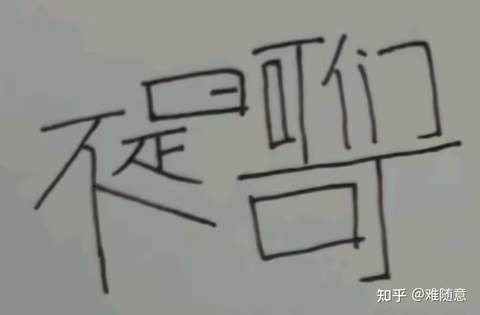
   - <a href="https://www.zhihu.com/people/shi-mi-ni-87">sllm</a> (<small title="广东">2026-1-20 21:49:23</small>): 我也不太想刷知乎了［捂脸］总会看到这样的人这样的言论，男性和男性之间的区别之大 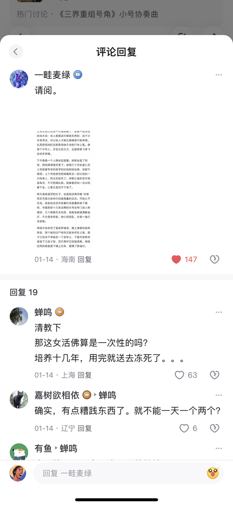
   - <a href="https://www.zhihu.com/people/amazingguy">托而斯泰之星</a> (<small title="回复于 2026-1-22 0:3:32/广东"> ✉️:休息的枫</small>): 太困难了，长官［大哭］
   - <a href="https://www.zhihu.com/people/hou-lai-zhi-shi-ting-shuo">後来只是听说</a> (<small title="湖北">2026-1-23 9:52:12</small>): 貌似有这样一部电影，很早了，就是讲藏传佛教的密宗这些事，我记得初中时看过，有点印象，貌似和答主讲的差不多，不过没有展现的这么奔放，那时候还是碟片时代，租的碟片。
   - <a href="https://www.zhihu.com/people/73-83-20-32">南玖</a> (<small title="福建">2026-1-24 10:9:51</small>): 明日回首［酷］［酷］
   - <a href="https://www.zhihu.com/people/yue-liang-30-7-45">白月光</a> (<small title="山东">2026-1-26 20:43:51</small>): ［思考］［思考］［思考］这是我刷的第一个回答
   - <a href="https://www.zhihu.com/people/a-tai-9">AT-20</a> (<small title="江苏">2026-1-27 0:6:13</small>): 大傻春，你要干什么
   - <a href="https://www.zhihu.com/people/40-11-89-14">陈伶</a> (<small title="回复于 2026-1-30 10:30:1/安徽"> ✉️:知乎用户76911</small>): 对！
   - <a href="https://www.zhihu.com/people/san-shi-zhen-ren-2">三石真人</a> (<small title="上海">2026-1-30 19:56:42</small>): 不是吧兄台？燃点这么低！
   - <a href="https://www.zhihu.com/people/yi-xian-yang-guang-13">长安吴彦祖</a> (<small title="回复于 2026-1-31 3:26:34/陕西"> ✉️:常威</small>): 你不在，他还来不了呢。［大笑］
   - <a href="https://www.zhihu.com/people/bu-yan-45-74">知乎用户</a> (<small title="江苏">2026-2-2 9:10:13</small>): 你这对吗［思考］［思考］［思考］
   - <a href="https://www.zhihu.com/people/hu-chen-fei-77">一三五</a> (<small title="回复于 2026-2-3 15:25:20/江西"> ✉️:知乎用户76911</small>): 对 人多力量大
   - <a href="https://www.zhihu.com/people/faux-47">FAUX</a> (<small title="山东">2026-2-4 23:37:41</small>): 你牛大了
   - <a href="https://www.zhihu.com/people/27-61-79-73-46">知乎用户OqL5hf</a> (<small title="广西">2026-2-10 6:27:49</small>): 这都可以管你这那的？［捂脸］
   - <a href="https://www.zhihu.com/people/1-6-90-95">1号线</a> (<small title="山西">2026-2-25 12:16:56</small>): 不是，哥们［发呆］
   - <a href="https://www.zhihu.com/people/chang-gu-chuan-8-20">Emerald</a> (<small title="江苏">2026-2-25 14:27:18</small>): 生怜悯心者，菩萨也；生畏惧心者，君子也：  
 
生欢喜心者，小人也；生效法心者，乃禽兽也。
   - <a href="https://www.zhihu.com/people/er-da-ye-007">二大爷</a> (<small title="北京">2026-2-25 18:5:16</small>): 回来！
   - <a href="https://www.zhihu.com/people/ssaadness-">桃瓶瓶</a> (<small title="浙江">2026-3-7 18:28:46</small>): 哥们给自己灌顶呢
   - <a href="https://www.zhihu.com/people/dxi-95">知乎用户N9yl4c</a> (<small title="回复于 2026-3-23 9:23:8/广东"> ✉️:桃瓶瓶</small>): 哈哈，属于自学成才了这是。
   - <a href="https://www.zhihu.com/people/80-6-53-19-49">皮坨曼</a> (<small title="海南">2026-3-30 12:46:57</small>): 我也要关么［生气］
   - <a href="https://www.zhihu.com/people/deng-lei-61740">tutlebear</a> (<small title="四川">2026-4-13 22:23:54</small>): 你去UC啦［飙泪笑］［飙泪笑］［飙泪笑］
   - <a href="https://www.zhihu.com/people/xi-zhi-lang-guo-dong-45-7">喜之郎果冻</a> (<small title="回复于 2026-5-24 11:44:15/广东"> ✉️:知乎用户76911</small>): 所有人！保持平台不变
   - <a href="https://www.zhihu.com/people/16-8-28-87">烤红薯找到人</a> (<small title="回复于 2026-7-5 0:0:55/浙江"> ✉️:长安吴彦祖</small>): 性压抑正在侵蚀国人
   - <a href="https://www.zhihu.com/people/sgtsy">Sogoodtoseeyou</a> (<small title="海南">2026-7-19 14:58:36</small>): 我也想要明妃了［拜托］［拜托］［拜托］
   - <a href="https://www.zhihu.com/people/hao-hao-zai-jia-33">奔放的角马</a> (<small title="陕西">2026-7-20 11:29:36</small>): 不是，这啥啊就今天刷到这里了？？？［好奇］［好奇］［好奇］
6. <a href="https://www.zhihu.com/people/he-ping-tian-shi-80">长门有希</a> (<small title="陕西">2026-1-13 1:14:1</small>): 刷到这篇立马去z library看了原文，只能说全文都笼罩着一种腐臭溃烂，令人绝望的味道
   - <a href="https://www.zhihu.com/people/yue-chu-67-72">月初</a> (<small title="黑龙江">2026-1-15 13:35:48</small>): 原篇叫啥名字
   - <a href="https://www.zhihu.com/people/shi-si-30-77">日升</a> (<small title="回复于 2026-1-16 7:55:31/湖北"> ✉️:月初</small>): 亮出你的舌苔或空空荡荡
   - <a href="https://www.zhihu.com/people/berrymax">披星戴月的Max</a> (<small title="回复于 2026-1-16 23:16:4/重庆"> ✉️:月初</small>): [https://nimrod.gitbooks.io/test/content/chapter1.html](https://nimrod.gitbooks.io/test/content/chapter1.html) 这是网址 哎自己评判吧 看了过后很难受［发呆］
   - <a href="https://www.zhihu.com/people/wx47f541d910606d8c">小号浪得好开心</a> (<small title="浙江">2026-1-20 16:3:6</small>): 我他么当年看这个被恶心死了，以为是作者故意在搞恶俗的重口味。
   - <a href="https://www.zhihu.com/people/summer-76-13-21">summer</a> (<small title="泰国">2026-1-21 15:46:35</small>): 看了书里的插图，让我生理性恶心。我看到天葬场里，一个穿红色教袍的僧人，拿着大片刀，正在分割死者的人皮，手里还拽着未被割下的一大块皮肤，地上分开躺着好几个死者的全身赤裸的尸体，那些尸体的皮有一部分被割了下来，就像菜市场的猪一样，被割的部分没有留血，只有一层淡黄的油脂包裹在皮肤上……..今晚要做噩梦了
   - <a href="https://www.zhihu.com/people/liang-yu-le">a reed</a> (<small title="回复于 2026-1-22 8:42:33/江苏"> ✉️:披星戴月的Max</small>): 收，吓死个人了。
   - <a href="https://www.zhihu.com/people/13-84-39-21">季节</a> (<small title="回复于 2026-1-24 1:40:57/湖南"> ✉️:披星戴月的Max</small>): 我的天😰全看完了
   - <a href="https://www.zhihu.com/people/berrymax">披星戴月的Max</a> (<small title="回复于 2026-1-24 9:1:47/重庆"> ✉️:季节</small>): ［发呆］［发呆］
   - <a href="https://www.zhihu.com/people/tang-seng-55-62">唐僧</a> (<small title="山东">2026-1-25 10:15:19</small>): 用一篇杜撰的小说套现实生活，评论区的神人也是真多
   - <a href="https://www.zhihu.com/people/mei-gu-sheng-hua-70-15">啥意思</a> (<small title="回复于 2026-1-25 12:49:47/山东"> ✉️:披星戴月的Max</small>): 这是在哪里找的呀
   - <a href="https://www.zhihu.com/people/berrymax">披星戴月的Max</a> (<small title="回复于 2026-1-25 18:51:2/重庆"> ✉️:啥意思</small>): 我靠不见了 在别人那里拿的
   - <a href="https://www.zhihu.com/people/feng-yu-jiang-hu-yi-zhuang-zhu">风雨江湖一庄主</a> (<small title="云南">2026-1-26 17:47:24</small>): 那个什么往事更恶心
   - <a href="https://www.zhihu.com/people/a--60-69-54">天网恢恢</a> (<small title="回复于 2026-1-27 0:2:30/河北"> ✉️:唐僧</small>): 但凡看过他们的发展史和秘闻，你都不会这样说
   - <a href="https://www.zhihu.com/people/a--60-69-54">天网恢恢</a> (<small title="回复于 2026-1-27 0:4:29/河北"> ✉️:唐僧</small>): 还有阿杰古的故事，我忘了我在什么人的直播间看见过，有人拿出过一些饰品让人鉴定，然后那个人说这些东西都是那个时候的，身上的零件，说这一串需要几十个人的，可能我还说少了，总而言之忘了
   - <a href="https://www.zhihu.com/people/he-lian-xiao-yuan">赫连小远</a> (<small title="回复于 2026-1-27 1:22:30/天津"> ✉️:天网恢恢</small>): 我记得那个视频。据说是108个人的什么顶门穿成的，只有高僧能用，一般人降服不了，压不住。视频里那个人好像是捐了很多钱建个寺庙，里面的大德高僧送他的。
   - <a href="https://www.zhihu.com/people/gu-ge-87-73-16">谷哥</a> (<small title="北京">2026-1-27 2:58:2</small>): 你厉害我的兄弟，行动力一流
   - <a href="https://www.zhihu.com/people/he-ping-tian-shi-80">长门有希</a> (<small title="回复于 2026-1-28 1:37:7/陕西"> ✉️:谷哥</small>): 嘻嘻
   - <a href="https://www.zhihu.com/people/a--60-69-54">天网恢恢</a> (<small title="回复于 2026-1-28 21:31:16/河北"> ✉️:赫连小远</small>): 我好像是从那时候开始了解了一些一系列的恐怖手段吧，比那个头盖骨盛脑花不在以下的，反正网友们见多识广，发的评论我都看了。要说有什么后遗症吧就是以前被刮一个口子，血滴答滴答的我也不觉得有什么，现在被扎一下流点血就想嚎［尴尬］
   - <a href="https://www.zhihu.com/people/bai-bai-35-35">爱吃treetree的</a> (<small title="回复于 2026-2-4 15:0:50/浙江"> ✉️:summer</small>): 我看过这种图，旁边还有等着开饭的秃鹫啥的。。。。
   - <a href="https://www.zhihu.com/people/chu-chu-30-51">豹富</a> (<small title="回复于 2026-2-10 19:51:49/江苏"> ✉️:小号浪得好开心</small>): 我也是！又惊悚又恶心
   - <a href="https://www.zhihu.com/people/fcc001-50">Peer Gynt</a> (<small title="河北">2026-2-11 14:30:36</small>): 洗涤心灵。
   - <a href="https://www.zhihu.com/people/tie-cheng-96">铁成</a> (<small title="回复于 2026-2-18 23:0:49/河南"> ✉️:唐僧</small>): 前佛教协会秘书长学诚的事你听说过没？这可不是虚构吧。
   - <a href="https://www.zhihu.com/people/tang-seng-55-62">唐僧</a> (<small title="回复于 2026-2-19 5:8:25/安徽"> ✉️:铁成</small>): 我没说是否虚构，但小说是小说，现实是现实。绝大多数的小说都是杜撰而已，并非纪实文学。一群人拿一个杜撰的小说在网络上愤慨，等于是对着一幅画吵架，这不是有b嘛
   - <a href="https://www.zhihu.com/people/ye-ru-feng-92">夜如疯</a> (<small title="浙江">2026-2-27 4:46:58</small>): 叫啥
   - <a href="https://www.zhihu.com/people/hai-xian-er-2">咩咩卡</a> (<small title="回复于 2026-2-28 19:34:57/北京"> ✉️:summer</small>): 我在西北某寺庙的天葬台差点踩到上一个被天葬者的遗骸（毛发），当场就吐了
   - <a href="https://www.zhihu.com/people/cmcmcm-76">cmcmcm</a> (<small title="回复于 2026-3-14 23:59:35/上海"> ✉️:summer</small>): 在哪看的
   - <a href="https://www.zhihu.com/people/duan-mu-wei-kou">蔻色-Matcha</a> (<small title="回复于 2026-3-25 22:42:19/四川"> ✉️:日升</small>): 真是熵值倍增
   - <a href="https://www.zhihu.com/people/14-19-90-1">懒得喷</a> (<small title="回复于 2026-4-6 7:59:12/江西"> ✉️:披星戴月的Max</small>): 看完了，感觉好压抑好可怕。人性不复存在，只有纯粹的兽性和虚伪，感谢国家感谢党，解放西藏是必要的
   - <a href="https://www.zhihu.com/people/shan-lu-zuo-de-63-93">是胡不是贺</a> (<small title="内蒙古">2026-4-13 9:58:19</small>): 老哥，重新给个library的地址可以吗［捂脸］
   - <a href="https://www.zhihu.com/people/a-dan-92-95-26">阿单</a> (<small title="回复于 2026-5-6 12:35:56/甘肃"> ✉️:披星戴月的Max</small>): 看过那期，看完真的难受好久
   - <a href="https://www.zhihu.com/people/a-dan-92-95-26">阿单</a> (<small title="回复于 2026-5-6 12:37:45/甘肃"> ✉️:铁成</small>): 什么事？给个链接
   - <a href="https://www.zhihu.com/people/vonxg">VonXG</a> (<small title="回复于 2026-5-19 15:54:56/广东"> ✉️:唐僧</small>): 那祝你也成为明妃［感谢］［感谢］
   - <a href="https://www.zhihu.com/people/19-7-51-95">飞雪百丈冰</a> (<small title="回复于 2026-6-11 18:2:24/山东"> ✉️:唐僧</small>): 西藏博物馆都有展览的
   - <a href="https://www.zhihu.com/people/wen-n-46">Wen_n</a> (<small title="回复于 2026-6-14 13:58:59/上海"> ✉️:summer</small>): 请问这个是有实体书吗
   - <a href="https://www.zhihu.com/people/wen-n-46">Wen_n</a> (<small title="回复于 2026-6-14 13:59:44/上海"> ✉️:披星戴月的Max</small>): ［思考］ 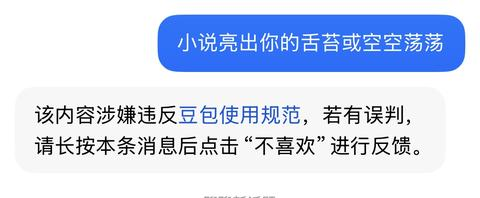
   - <a href="https://www.zhihu.com/people/summer-76-13-21">summer</a> (<small title="回复于 2026-7-8 10:22:48/泰国"> ✉️:Wen_n</small>): 我描述的就是书里的插图
   - <a href="https://www.zhihu.com/people/summer-76-13-21">summer</a> (<small title="回复于 2026-7-8 10:23:34/泰国"> ✉️:咩咩卡</small>): 这有点惊悚了
   - <a href="https://www.zhihu.com/people/feng-hao-2-34">風灏</a> (<small title="回复于 2026-7-9 15:36:6/山西"> ✉️:唐僧</small>): 有意思的地方在于：你可以抨击它是虚构的文学……但你不敢明确的拿出证据，证明密教的仪式根本不是这样的
   - <a href="https://www.zhihu.com/people/zi-lu-36-23">惊蛰</a> (<small title="回复于 2026-7-11 7:40:42/福建"> ✉️:Wen_n</small>): 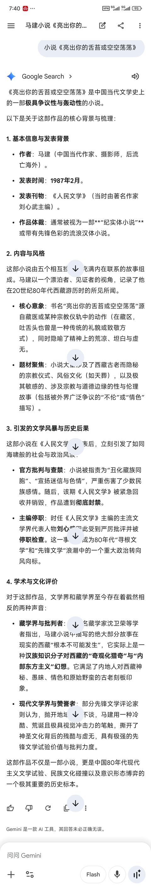
   - <a href="https://www.zhihu.com/people/hai-xian-er-2">咩咩卡</a> (<small title="回复于 2026-7-11 21:44:27/北京"> ✉️:summer</small>): 第一感觉不是惊悚，是基因里的恶心感。
   - <a href="https://www.zhihu.com/people/ban-zhi-yan-39-12">半支烟</a> (<small title="山东">2026-7-16 12:22:40</small>): 现在依然是封禁状态，正常搜不到该书
   - <a href="https://www.zhihu.com/people/xiao-qi-31-66-81">会做饭的小丸子</a> (<small title="回复于 2026-7-16 21:27:9/山东"> ✉️:唐僧</small>): 解放前的西藏更恐怖
   - <a href="https://www.zhihu.com/people/yang-guang-can-lan-47-42-32">知乎用户</a> (<small title="回复于 2026-7-17 13:21:39/重庆"> ✉️:披星戴月的Max</small>): 看完了，我的天，有一篇男的跟他妈妈生了女儿，还把女儿糟蹋了～～课堂演示直接把狮体现场拆解，讲述。天葬的那篇女孩子是真命苦
   - <a href="https://www.zhihu.com/people/whndw">三千江水意</a> (<small title="回复于 2026-7-18 13:25:41/上海"> ✉️:披星戴月的Max</small>): 这是什么软件啊［思考］
   - <a href="https://www.zhihu.com/people/gong-yi-ming-56">春风不萦怀</a> (<small title="回复于 2026-7-18 21:44:16/浙江"> ✉️:唐僧</small>): 这些小说可不是凭空捏造的。你的言语是想证明什么？
   - <a href="https://www.zhihu.com/people/gong-yi-ming-56">春风不萦怀</a> (<small title="回复于 2026-7-18 21:47:38/浙江"> ✉️:惊蛰</small>): 不用质疑，这些披着宗教外衣的恶魔就是野蛮，邪恶，血腥且反人类的。
   - <a href="https://www.zhihu.com/people/yue-ling-shan-25">方应看</a> (<small title="回复于 2026-7-18 23:16:52/河南"> ✉️:知乎用户</small>): 死去的回忆攻击，突然想起在天涯看过，这个和女儿的还是在帐蓬里，后来女儿疯了，赤身裸体在流浪
   - <a href="https://www.zhihu.com/people/biubiu-37-54">biubiu</a> (<small title="回复于 2026-7-19 3:14:44/广东"> ✉️:summer</small>): 请问书叫什么名字？［拜托］
   - <a href="https://www.zhihu.com/people/levinbaka">舟中剑</a> (<small title="回复于 2026-7-20 0:1:32/广东"> ✉️:春风不萦怀</small>): 远离中心文明的地方，性和暴力就是第一驱动力
   - <a href="https://www.zhihu.com/people/zhuan-ye-fan-er-mai-meng">风起天阑</a> (<small title="回复于 2026-7-21 23:22:10/河北"> ✉️:披星戴月的Max</small>): 看了两章 压抑的我好难受…
   - <a href="https://www.zhihu.com/people/r8gze5">争流</a> (<small title="回复于 2026-7-22 7:9:34/河北"> ✉️:唐僧</small>): 佛棍急眼了罢了。  
 
如果小说真的反映了现实和实际情况，以及他表述的意义完全相同，那有何不可讲？说到底，你反对的原因是因为你反对这层意思。
   - <a href="https://www.zhihu.com/people/feilongzhang">张飞龙</a> (<small title="回复于 2026-7-23 19:30:2/美国"> ✉️:惊蛰</small>): “根本不可能发生” 破案了。
   - <a href="https://www.zhihu.com/people/qiao-jie-9-71">AI行业侦察兵</a> (<small title="回复于 2026-7-24 10:37:32/山东"> ✉️:披星戴月的Max</small>): 看了，无奈，吃人的社会
   - <a href="https://www.zhihu.com/people/mi-mi-huang">咕噜咚咚咚</a> (<small title="回复于 2026-7-26 8:6:37/浙江"> ✉️:唐僧</small>): 如果纯是杜撰，为啥出版这篇文章后刘心武就被撤了主编之位
   - <a href="https://www.zhihu.com/people/haiyo">青萝拂行衣</a> (<small title="回复于 2026-7-28 8:6:19/广东"> ✉️:唐僧</small>): 小说有现实基础，尤其是现实主义小说。而且往往现实比小说更残酷。
   - <a href="https://www.zhihu.com/people/95-45-69-33">实话实说而已</a> (<small title="回复于 2026-7-28 18:25:48/河北"> ✉️:唐僧</small>): 也不算吧，西藏有博物馆展览的
   - <a href="https://www.zhihu.com/people/95-45-69-33">实话实说而已</a> (<small title="回复于 2026-7-28 18:30:25/河北"> ✉️:唐僧</small>): 其实也不能说虚构，在解放前藏区还是农奴制，普通农奴可能还不如牲畜值钱，北方孩子小时候都玩过扔羊髌骨的游戏（具体啥名我忘记了），用羊骨头做玩具时，大家也没有啥不适，在当时藏区土司喇嘛的眼里，可能也是这种感觉吧
   - <a href="https://www.zhihu.com/people/xi-a-wu-ge">ggxqq</a> (<small title="回复于 2026-7-30 2:50:22/广东"> ✉️:披星戴月的Max</small>): 感谢，刚刚一个多小时，差不多两个小时左右看完了。很沉重，很恐怖
   - <a href="https://www.zhihu.com/people/mang-yuan-70-13">Kino</a> (<small title="回复于 2026-7-30 12:52:3/广东"> ✉️:风雨江湖一庄主</small>): x山往事？那个不是当黄文看的吗［飙泪笑］
7. <a href="https://www.zhihu.com/people/91-39-98-65-77">悟世空</a> (<small title="辽宁">2026-1-13 13:20:54</small>): 自从意识到宗教本质，我就再也不想听到信仰之说了。天下熙熙攘攘，无非都想控制他人。
   - <a href="https://www.zhihu.com/people/jin-zhi-36-21">金知不知为不知</a> (<small title="广东">2026-1-17 23:16:39</small>): ［赞同］
   - <a href="https://www.zhihu.com/people/15-86-97-11-22">普通幻想家</a> (<small title="河南">2026-1-20 17:36:18</small>): 加一
   - <a href="https://www.zhihu.com/people/91-39-98-65-77">悟世空</a> (<small title="回复于 2026-1-20 17:43:35/湖南"> ✉️:普通幻想家</small>): ［感谢］
   - <a href="https://www.zhihu.com/people/hua-sheng-hu-hu-28">哦豁</a> (<small title="四川">2026-1-23 10:47:2</small>): 加个教就变味了
   - <a href="https://www.zhihu.com/people/wo-ding-ni-ge-fei-ya-78">我顶你个肺</a> (<small title="天津">2026-1-25 14:46:14</small>): 赞同
   - <a href="https://www.zhihu.com/people/90-51-83-98">平淡最真</a> (<small title="新疆">2026-2-4 20:57:5</small>): 宗教的本质哪里看
   - <a href="https://www.zhihu.com/people/91-39-98-65-77">悟世空</a> (<small title="回复于 2026-2-4 22:25:18/辽宁"> ✉️:平淡最真</small>): 自己用心去看，看它底层的逻辑是什么。信仰之说，于每个人的认知，完全不一样。你相信什么，就是什么。
   - <a href="https://www.zhihu.com/people/xiao-bai-73-72-98">小白</a> (<small title="回复于 2026-2-5 2:12:31/安徽"> ✉️:平淡最真</small>): 吕大吉，宗教学概论。  
 
但看这个估计没啥用，不如看几本古代史，或者辩证唯物主义。  
 
最主要的是实事求是，自我批评。
   - <a href="https://www.zhihu.com/people/wxa5e0d197c0cd8a95">幻想躺平的板栗</a> (<small title="广东">2026-2-11 10:12:0</small>): 说得真好
   - <a href="https://www.zhihu.com/people/91-39-98-65-77">悟世空</a> (<small title="回复于 2026-2-11 17:10:26/湖南"> ✉️:幻想躺平的板栗</small>): ［感谢］
   - <a href="https://www.zhihu.com/people/86-75-81-41">创世纪</a> (<small title="陕西">2026-2-14 8:39:25</small>): 哥们你说说宗教本质吗［大笑］
   - <a href="https://www.zhihu.com/people/91-39-98-65-77">悟世空</a> (<small title="回复于 2026-2-14 9:47:51/湖南"> ✉️:创世纪</small>): 规则，控制，很多书籍都有它的影子，需要自己去理解。有人理解宗教是向善，重生。每个人的理解是不同的。
   - <a href="https://www.zhihu.com/people/ya-ya-35-54-30">丫丫</a> (<small title="回复于 2026-3-8 6:12:51/湖北"> ✉️:悟世空</small>): 是呢，能看透你就是聪明人。
   - <a href="https://www.zhihu.com/people/91-39-98-65-77">悟世空</a> (<small title="回复于 2026-3-8 6:32:35/辽宁"> ✉️:丫丫</small>): ［感谢］谢谢，能认同， 都是同道中人
   - <a href="https://www.zhihu.com/people/dxi-95">知乎用户N9yl4c</a> (<small title="广东">2026-3-23 9:26:57</small>): 自利益二字判断错不了，不是有个住持爆雷了吗，可见冰山一角也。
   - <a href="https://www.zhihu.com/people/tian-yao-gui">eaysa</a> (<small title="江苏">2026-4-4 15:54:4</small>): 信仰，只有自己悟出来的才值得相信，别人灌输的，都是为了控制，利用
   - <a href="https://www.zhihu.com/people/wen-wen-wen-wen-wen-60-30">叮叮叮叮</a> (<small title="回复于 2026-6-1 2:34:51/重庆"> ✉️:创世纪</small>): 宗教的本质就是控制维稳啊。高中历史都教过了。重音在高中
   - <a href="https://www.zhihu.com/people/yuan-yi-jing-9">源义经</a> (<small title="北京">2026-7-16 10:26:39</small>): 我想起看的一部电影《异教徒》，里面说的也是宗教的本质是控制
   - <a href="https://www.zhihu.com/people/hanzeting-2">hanzeting</a> (<small title="辽宁">2026-7-17 11:17:39</small>): 这话你还是对回教徒说罢［大笑］
   - <a href="https://www.zhihu.com/people/91-39-98-65-77">悟世空</a> (<small title="回复于 2026-7-17 11:21:54/辽宁"> ✉️:hanzeting</small>): 这话不是针对某一类宗教的，还有其他形式的不以宗教形式存在的
   - <a href="https://www.zhihu.com/people/hanzeting-2">hanzeting</a> (<small title="回复于 2026-7-17 11:27:13/辽宁"> ✉️:悟世空</small>): 你说你反宗教，如果线下你这么对回教徒说，挨了巴掌不说还要判你寻衅滋事，现实就是特权宗教真的存在
   - <a href="https://www.zhihu.com/people/sun-yu-fei-92">Henry</a> (<small title="上海">2026-7-18 1:26:39</small>): 没毛病，我去寺庙完从不估计不准拍佛像的规定，我就拍
   - <a href="https://www.zhihu.com/people/xue-xu-36">雪绪</a> (<small title="江苏">2026-7-21 10:12:18</small>): 本质上是释迦牟尼，著经人和释经人的出发的和利益不同［大笑］［大笑］，我们国家孔老二也是反复捧起来和打下去
   - <a href="https://www.zhihu.com/people/91-39-98-65-77">悟世空</a> (<small title="回复于 2026-7-21 15:21:16/辽宁"> ✉️:雪绪</small>): 嗯这个角度是我没想到过的［思考］
   - <a href="https://www.zhihu.com/people/xiao-xu-yan-66">Demonscy</a> (<small title="上海">2026-7-21 15:31:3</small>): 宗教是统治阶级为了维持统治的工具，我怎么记得以前上学什么书上有的
   - <a href="https://www.zhihu.com/people/peng-ba-du-90">蓬巴杜</a> (<small title="四川">2026-7-22 14:32:8</small>): 本质就是剥削，宗教根本不事生产，全靠供奉
   - <a href="https://www.zhihu.com/people/91-39-98-65-77">悟世空</a> (<small title="回复于 2026-7-22 15:4:47/辽宁"> ✉️:蓬巴杜</small>): ［感谢］
   - <a href="https://www.zhihu.com/people/88-36-84-3-31">倔强的风</a> (<small title="回复于 2026-7-29 12:37:37/江西"> ✉️:哦豁</small>): 任何组织团体等需要人加入的形成规模的集体，其实都差不多。
8. <a href="https://www.zhihu.com/people/xiao-wang-shu-34-52">笑忘书</a> (<small title="西藏">2026-1-12 8:22:21</small>): 人在拉萨，刚下火车，等我缓一缓去瞅瞅咋回事［思考］
   - <a href="https://www.zhihu.com/people/13922880827">细嗅蔷薇</a> (<small title="湖北">2026-1-12 9:33:37</small>): 百万农奴解放纪念馆，就在布达拉宫对面［感谢］
   - <a href="https://www.zhihu.com/people/davidnofat">卖雪糕的橘猫</a> (<small title="北京">2026-1-12 9:50:24</small>): 先去布达拉宫，想想民脂民膏啥的，完了去对面的解放农奴纪念馆。
 
  
 
出来以后，你一定会长长的出一口气的。
   - <a href="https://www.zhihu.com/people/momo-19-48-60">momo</a> (<small title="西藏">2026-1-12 10:12:5</small>): 哈哈哈哈
   - <a href="https://www.zhihu.com/people/zzzz-33-75-84">ZZ就这么活着ZZ</a> (<small title="回复于 2026-1-12 10:16:0/山东"> ✉️:细嗅蔷薇</small>): 真实存在的魔王城
   - <a href="https://www.zhihu.com/people/shi-er-42-48-13">拾贰</a> (<small title="吉林">2026-1-12 10:16:59</small>): 帮我啐一口布达拉宫
   - <a href="https://www.zhihu.com/people/ge-bi-lao-ceng-93-36">隔壁老曾</a> (<small title="湖南">2026-1-12 13:16:24</small>): 怎么回事？明年天暖了，我也计划去看看
   - <a href="https://www.zhihu.com/people/xiao-wang-shu-34-52">笑忘书</a> (<small title="回复于 2026-1-12 20:37:16/西藏"> ✉️:细嗅蔷薇</small>): 来到后第一张拍的就是纪念碑 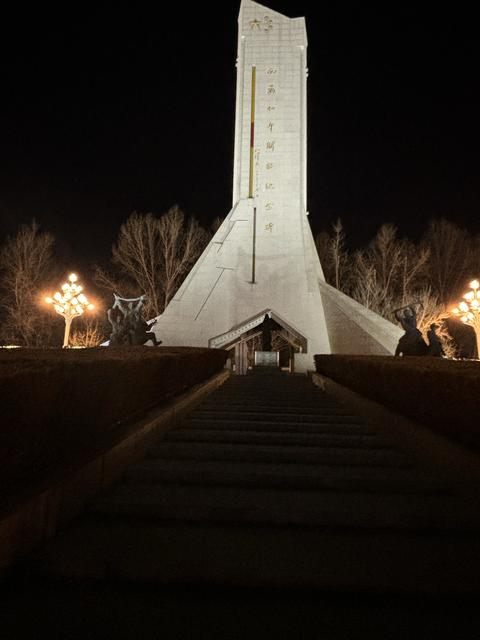
   - <a href="https://www.zhihu.com/people/zhou-zi-heng-90-30">周自衡</a> (<small title="山东">2026-1-13 11:31:52</small>): 现在藏地还有流僧，还有头脑不清楚的藏民。只是，外人没有遇到的概率。我也没遇到过，去那旅游听说的。［捂脸］［捂脸］［捂脸］
   - <a href="https://www.zhihu.com/people/tan-rui-49-57">剑来</a> (<small title="重庆">2026-1-14 16:58:42</small>): 藏民们去了布达拉宫会去纪念馆吗？
   - <a href="https://www.zhihu.com/people/he-he-37-14-4">都是借口</a> (<small title="西藏">2026-1-15 2:6:8</small>): 记得喝个酥油茶
   - <a href="https://www.zhihu.com/people/wtf-64-65">雪花沉睡</a> (<small title="云南">2026-1-15 15:8:12</small>): 头盖骨还在否
   - <a href="https://www.zhihu.com/people/xiao-wang-shu-34-52">笑忘书</a> (<small title="回复于 2026-1-17 10:46:42/西藏"> ✉️:剑来</small>): 会的
   - <a href="https://www.zhihu.com/people/xiao-wang-shu-34-52">笑忘书</a> (<small title="回复于 2026-1-17 10:46:50/西藏"> ✉️:雪花沉睡</small>): 目前还在
   - <a href="https://www.zhihu.com/people/xiao-wang-shu-34-52">笑忘书</a> (<small title="回复于 2026-1-17 10:47:42/西藏"> ✉️:周自衡</small>): 头脑不清楚的藏民是真的多…想法很刻板，可能是长期缺氧……
   - <a href="https://www.zhihu.com/people/xiao-wang-shu-34-52">笑忘书</a> (<small title="回复于 2026-1-17 10:48:24/西藏"> ✉️:拾贰</small>): 收到🫡 我偷摸的
   - <a href="https://www.zhihu.com/people/xiao-wang-shu-34-52">笑忘书</a> (<small title="回复于 2026-1-17 10:48:31/西藏"> ✉️:隔壁老曾</small>): 好玩，可以来
   - <a href="https://www.zhihu.com/people/xiao-wang-shu-34-52">笑忘书</a> (<small title="回复于 2026-1-17 10:48:54/西藏"> ✉️:卖雪糕的橘猫</small>): 都过去啦
   - <a href="https://www.zhihu.com/people/xiao-wang-shu-34-52">笑忘书</a> (<small title="回复于 2026-1-17 10:50:5/西藏"> ✉️:都是借口</small>): 吃了藏面，喝不惯那个，这边藏民吃生羊腿…风干的那种
   - <a href="https://www.zhihu.com/people/qiao-qiao-65-25-48">悄悄</a> (<small title="辽宁">2026-1-18 7:6:28</small>): 有些事导游也讲的少，得找当地汉人，住的久了，才能聊出来当地的风土人情，
   - <a href="https://www.zhihu.com/people/xiao-wang-shu-34-52">笑忘书</a> (<small title="回复于 2026-1-19 22:36:1/西藏"> ✉️:悄悄</small>): 朋友在这，大概能了解一些
   - <a href="https://www.zhihu.com/people/wei-tong-guang">BT不分家</a> (<small title="北京">2026-1-21 13:52:13</small>): 很小的时候坐火车去西藏玩，别的地方都特别活跃，进入布达拉宫大门起就觉得头晕脑胀，忍不住地想吐，出去就好了，不知道是不是意味着什么…
   - <a href="https://www.zhihu.com/people/xiao-wang-shu-34-52">笑忘书</a> (<small title="回复于 2026-1-21 16:16:17/西藏"> ✉️:BT不分家</small>): 1.布达拉宫是拉萨最高的建筑，上去需要体力和消耗氧气，对低海拔地区的人很不友好。  
 
2.牛奶和糖泼的墙、酥油灯、还有烟熏味，一股子酸馊味，空气流通还不好［思考］
   - <a href="https://www.zhihu.com/people/wei-tong-guang">BT不分家</a> (<small title="回复于 2026-1-22 17:59:40/北京"> ✉️:笑忘书</small>): 那也没准，我确实不喜欢酥油味儿
   - <a href="https://www.zhihu.com/people/a--60-69-54">天网恢恢</a> (<small title="河北">2026-1-26 23:24:20</small>): 依稀记得那个人皮鼓的故事。我现在在想他那个天葬，的习俗是不是死的人太多了，埋不过来？
   - <a href="https://www.zhihu.com/people/a--60-69-54">天网恢恢</a> (<small title="回复于 2026-1-26 23:28:40/河北"> ✉️:BT不分家</small>): 犯冲，你如果不是高敏感躯干，那就是冲，如果是高敏躯干第六感很强的那种，爱生病的那种，那就是这个地方问题，听说布达拉宫全部都是黄金包裹的，所以我看图片没感觉有什么，大概也许要像你一样面对才能知道啥情况吧。
   - <a href="https://www.zhihu.com/people/guo-ya-65-17">郭娅</a> (<small title="重庆">2026-1-30 13:47:58</small>): 发现仁波切了吗？
   - <a href="https://www.zhihu.com/people/xiao-wang-shu-34-52">笑忘书</a> (<small title="回复于 2026-1-30 15:21:57/西藏"> ✉️:天网恢恢</small>): 习俗，肉体灵魂都回归自然，大概也有以身布施的意思，毕竟秃鹫在西藏被视为神鸟。
   - <a href="https://www.zhihu.com/people/chinkanei">莴笋麦菜我不爱</a> (<small title="回复于 2026-2-5 11:46:43/广东"> ✉️:拾贰</small>): ［捂脸］
   - <a href="https://www.zhihu.com/people/lan-tian-44-7-57">一夕一阳光</a> (<small title="回复于 2026-2-9 18:48:27/江苏"> ✉️:BT不分家</small>): 我也是，上次去内蒙古出差，同事选了个本地民族特色的酒店，住进去难受了好几天 🤮🤮
   - <a href="https://www.zhihu.com/people/zhen-yue-tie-lu">镇越铁路</a> (<small title="回复于 2026-2-10 13:10:59/上海"> ✉️:天网恢恢</small>): 那里第一缺少大河，水葬不易，土地坚硬不易掘坑，土葬也很难，缺少树木，火葬也很昂贵。所以一般平民天葬耗费最少。
   - <a href="https://www.zhihu.com/people/zhen-yue-tie-lu">镇越铁路</a> (<small title="回复于 2026-2-10 13:12:23/上海"> ✉️:笑忘书</small>): 你看高僧和贵族有几个天葬的？天葬是穷人的归宿，最省钱罢了。
   - <a href="https://www.zhihu.com/people/a--60-69-54">天网恢恢</a> (<small title="回复于 2026-2-10 19:1:54/河北"> ✉️:镇越铁路</small>): 中原有句古话这叫曝尸荒野，［思考］
   - <a href="https://www.zhihu.com/people/59-90-22-8">安勿恤</a> (<small title="回复于 2026-2-25 9:48:56/海南"> ✉️:郭娅</small>): 那不如通天苑的密度大。［doge］
   - <a href="https://www.zhihu.com/people/zhang-wei-min-87-24">主管客观不统一</a> (<small title="四川">2026-7-16 14:41:34</small>): 去了后会发现自己干的这点破事真算不上什么［捂脸］［捂脸］［捂脸］。跟这些家伙一比我是大善人啊
   - <a href="https://www.zhihu.com/people/gong-yi-ming-56">春风不萦怀</a> (<small title="回复于 2026-7-18 21:49:37/浙江"> ✉️:主管客观不统一</small>): 好家伙，比烂是吧［捂脸］
9. <a href="https://www.zhihu.com/people/johnsonH">永远小学生</a> (<small title="北京">2026-1-16 18:0:57</small>): 这就是真正的宗教高层，实施了这一流程后，你就成了他绝对的自己人。未来等你继承了宗师，你也只得用这种方式来拉你的弟子入伙。跟萝莉岛作为民主党高层入教仪式是一样的
   - <a href="https://www.zhihu.com/people/66654656554">nnNANA</a> (<small title="黑龙江">2026-2-9 9:39:1</small>): 是啊 人类社会的原理都是共通的
   - <a href="https://www.zhihu.com/people/bi-hai-chao-sheng-14-6">变徵羽声</a> (<small title="广东">2026-7-19 20:11:39</small>): 投名状
10. <a href="https://www.zhihu.com/people/17255-2">Jianghu Teahouse</a> (<small title="湖南">2026-1-14 1:41:9</small>): 我的天［大笑］赤裸裸的犯罪啊，看得我心里这个难受啊，看完原文更难受了，那是一个活生生的小姑娘，一个活生生的人啊！哎呀我天哪
    - <a href="https://www.zhihu.com/people/xia-zhi-68-55">蝉鸣</a> (<small title="上海">2026-1-14 8:0:27</small>): 还踏马用完就放冰河去冻死，这就不太理解了。。。
    - <a href="https://www.zhihu.com/people/17255-2">Jianghu Teahouse</a> (<small title="回复于 2026-1-14 16:32:52/湖南"> ✉️:蝉鸣</small>): 大概是消除罪证吧....活脱脱吃人的礼教啊！
    - <a href="https://www.zhihu.com/people/xia-zhi-68-55">蝉鸣</a> (<small title="回复于 2026-1-15 6:59:45/上海"> ✉️:Jianghu Teahouse</small>): 大兄弟，这跟个邪教似的，可没有“礼”。。。
    - <a href="https://www.zhihu.com/people/zang-jiang-68">臧江</a> (<small title="山西">2026-1-16 16:1:49</small>): 你用咱们普世价值判断会可惜“那是个活生生的人”，可要是按人家的价值观判断“为了佛学仪式，你的奉献是你全家的荣耀！”，是不是感觉都高尚起来了？［doge］
    - <a href="https://www.zhihu.com/people/17255-2">Jianghu Teahouse</a> (<small title="回复于 2026-1-16 16:33:30/湖南"> ✉️:臧江</small>): 生命权是所有价值的前提，再神圣的仪式，都得建立在人活着的基础上啊！
    - <a href="https://www.zhihu.com/people/wo-ding-ni-ge-fei-ya-78">我顶你个肺</a> (<small title="回复于 2026-1-25 14:45:47/天津"> ✉️:蝉鸣</small>): 这就是个邪教，把似的去掉！
    - <a href="https://www.zhihu.com/people/wxb19820eff3b1d519">wxb19820eff3b1d519</a> (<small title="山西">2026-1-27 14:12:50</small>): 一个罪恶的人来参观了布达拉宫，都会觉得自己做的啥都不是，自然就释怀了
    - <a href="https://www.zhihu.com/people/17255-2">Jianghu Teahouse</a> (<small title="回复于 2026-1-29 1:39:48/山东"> ✉️:wxb19820eff3b1d519</small>): 我的妈地狱笑话哈哈哈哈
    - <a href="https://www.zhihu.com/people/skye-91-3-95">等等</a> (<small title="回复于 2026-2-3 15:11:48/河南"> ✉️:wxb19820eff3b1d519</small>): NB
    - <a href="https://www.zhihu.com/people/mu-mu-jiang-42-58">木木酱</a> (<small title="回复于 2026-7-17 12:28:55/广东"> ✉️:wxb19820eff3b1d519</small>): 原来这就是洗涤心灵［飙泪笑］
11. <a href="https://www.zhihu.com/people/li-xuan-49-51-68">李承佑</a> (<small title="贵州">2026-1-14 0:26:51</small>): 本质上还是服从性测试，上师给弟子洗脑用的，而且修法沉没成本极高。弟子会有成为上师的一天，他就是知道不对，也无法自己反自己。
    - <a href="https://www.zhihu.com/people/zhu-xiu-shi-53">高性能量男人</a> (<small title="广东">2026-6-26 18:14:7</small>): 沉默成本会越来越高，就不会放弃了
    - <a href="https://www.zhihu.com/people/su-rui-19-84">不赢不舒服斯基</a> (<small title="云南">2026-7-14 13:11:47</small>): 那是种邪教
12. <a href="https://www.zhihu.com/people/deng-hai-xin-45">轩辕剑</a> (<small title="广东">2026-1-26 9:59:22</small>): 我有一个大胆的想法，随机抓一个金刚上师去成都接受灌顶［doge］［doge］［doge］
    - **顾川** (<small title="甘肃">2026-1-26 10:53:17</small>): ［脑爆］我靠…
    - <a href="https://www.zhihu.com/people/jiu-shi-zhu-40-41">救世猪</a> (<small title="浙江">2026-2-19 7:59:22</small>): 功德无量啊［看看你］
    - <a href="https://www.zhihu.com/people/42-2-25-61-97">性空山</a> (<small title="湖北">2026-7-24 11:2:11</small>): 我靠［思考］
    - <a href="https://www.zhihu.com/people/yang-chan-47-21">Riki</a> (<small title="重庆">2026-7-25 12:15:52</small>): 成都男人有福了
    - <a href="https://www.zhihu.com/people/liu-wei-75-16">转角遇到KOG</a> (<small title="云南">2026-7-26 18:54:47</small>): 你那不是灌顶，是灌腚
    - <a href="https://www.zhihu.com/people/lu-xing-yu-36-57">天火</a> (<small title="浙江">2026-7-28 19:49:38</small>): 大哥，你这想法正常人想不到，看来你已定居成都
13. <a href="https://www.zhihu.com/people/chen-liang-jun-34">红尘客栈</a> (<small title="江苏">2026-1-12 7:13:48</small>): 李连杰有福了
    - <a href="https://www.zhihu.com/people/qi-da-ren-27">土方士郎</a> (<small title="广东">2026-1-12 8:48:32</small>): 链接少女，那可不老的快
    - <a href="https://www.zhihu.com/people/hu-li-hu-tu-45">瞄人缝的盯裆猫</a> (<small title="广东">2026-1-12 9:20:31</small>): 他有可能是被灌顶的［思考］
    - <a href="https://www.zhihu.com/people/zzzz-33-75-84">ZZ就这么活着ZZ</a> (<small title="山东">2026-1-12 10:15:42</small>): 张铁林也是
    - <a href="https://www.zhihu.com/people/peng-bo-de-yu-wang">蓬勃的欲望</a> (<small title="湖南">2026-1-12 11:41:11</small>): 什么花活，又吃又喝的？还得在外面跪着
    - <a href="https://www.zhihu.com/people/hua-hua-58-12">致远</a> (<small title="回复于 2026-1-12 11:55:14/四川"> ✉️:蓬勃的欲望</small>): ［doge］你看电影不吃爆米花不喝可乐吗
    - <a href="https://www.zhihu.com/people/spike-94-84">Spike</a> (<small title="广东">2026-1-13 12:5:31</small>): 王菲估计被灌得满几次了
    - <a href="https://www.zhihu.com/people/22-73-41-89">兰芷</a> (<small title="湖北">2026-1-13 12:45:31</small>): 这么说他吃了和尚的密中宝［捂脸］
    - <a href="https://www.zhihu.com/people/lin-he-qu">凛何去</a> (<small title="回复于 2026-1-13 13:16:43/山东"> ✉️:Spike</small>): 带着霆锋吗［捂脸］
    - <a href="https://www.zhihu.com/people/xian-sheng-33-36">罗生</a> (<small title="回复于 2026-1-13 22:43:9/湖北"> ✉️:瞄人缝的盯裆猫</small>): 我超，不会是一个排吧，全部估计一个团，那得好久才能合的上去呀，还好是练过的，好得快。
    - <a href="https://www.zhihu.com/people/li-ze-13-39">Mr.空山</a> (<small title="江苏">2026-1-14 13:6:13</small>): 娱乐圈有先天优势，反正也是被男女通吃［惊喜］
    - <a href="https://www.zhihu.com/people/yu-lai-jiang-se-mu">语来江色暮</a> (<small title="回复于 2026-1-14 20:46:5/北京"> ✉️:Spike</small>): 处女
    - <a href="https://www.zhihu.com/people/wang-lao-wu-69-46">时光</a> (<small title="回复于 2026-1-15 11:52:48/山东"> ✉️:瞄人缝的盯裆猫</small>): 没准互灌［感谢］
    - <a href="https://www.zhihu.com/people/berrymax">披星戴月的Max</a> (<small title="回复于 2026-1-16 23:14:15/重庆"> ✉️:Spike</small>): 救命...补药啊我的王菲女神［发呆］［发呆］［发呆］  
 
是真的吗...我之前看王菲念大悲咒的什么就觉得不对了
    - <a href="https://www.zhihu.com/people/an-ren-79">已读不回</a> (<small title="回复于 2026-1-17 8:16:32/河南"> ✉️:披星戴月的Max</small>): 大悲咒是普传的，不一定非要藏密灌顶才能修。显教也念大悲咒
    - <a href="https://www.zhihu.com/people/shao-weitao-36">子游</a> (<small title="回复于 2026-1-21 7:16:3/广东"> ✉️:披星戴月的Max</small>): 这个是分层次的，普通的灌顶是用圣水通过特定的仪式来灌顶的，比如当时乾隆用的就是这种。总不能说乾隆吞了其他喇嘛的摩尼宝吧，这也太恶心了［思考］
    - <a href="https://www.zhihu.com/people/tian-ma-xing-kong-43-1-50">天马行空</a> (<small title="回复于 2026-1-21 19:13:41/山东"> ✉️:Spike</small>): 王菲图什么呢？她去做这个
    - <a href="https://www.zhihu.com/people/zhang-xiao-xian-6-86">海阔天空</a> (<small title="回复于 2026-1-27 3:42:10/新疆"> ✉️:瞄人缝的盯裆猫</small>): 蒸馍，这不是福气［doge］
    - <a href="https://www.zhihu.com/people/hu-li-hu-tu-45">瞄人缝的盯裆猫</a> (<small title="回复于 2026-1-27 8:40:11/广东"> ✉️:海阔天空</small>): 这福气给你要不要啊（叶澜依脸）
    - <a href="https://www.zhihu.com/people/guo-ya-65-17">郭娅</a> (<small title="回复于 2026-1-30 13:48:24/重庆"> ✉️:瞄人缝的盯裆猫</small>): 太阴间了
    - <a href="https://www.zhihu.com/people/en-zuo-si-te-lin-liao-tu-lu-li-la">梦钟孟</a> (<small title="回复于 2026-2-5 10:38:35/江苏"> ✉️:披星戴月的Max</small>): 觉得念大悲咒不对？我看你才是真不对了。［doge］
    - <a href="https://www.zhihu.com/people/gun-zi-tou">山海经画师</a> (<small title="回复于 2026-3-8 9:33:1/陕西"> ✉️:天马行空</small>): 图资源，毕竟这算是加入一个组织了
    - <a href="https://www.zhihu.com/people/cc2016-5">cc2016</a> (<small title="回复于 2026-4-22 15:58:46/上海"> ✉️:Spike</small>): 好刺激啊
    - <a href="https://www.zhihu.com/people/liu-lian-liu-liu">榴莲遛遛</a> (<small title="辽宁">2026-5-3 20:17:29</small>): 郑钧
    - <a href="https://www.zhihu.com/people/npyh2009">npyh2009</a> (<small title="回复于 2026-5-7 8:48:39/安徽"> ✉️:披星戴月的Max</small>): 大悲咒挺好的
    - <a href="https://www.zhihu.com/people/zhang-wei-min-87-24">主管客观不统一</a> (<small title="四川">2026-7-16 14:42:29</small>): 发他微博下问问好不好吃
14. <a href="https://www.zhihu.com/people/Edwise">Midas</a> (<small title="江苏">2026-1-12 9:59:8</small>): 虽然之前就读过同样的内容，但每次重读依然叹为观止，人类为了性真的是脑洞大开［发呆］
    - <a href="https://www.zhihu.com/people/wang-gang-83-22">王刚</a> (<small title="河北">2026-7-27 8:10:30</small>): 其实他们这套东西主要源自印度，他们连三嫂都不嫌弃，印度教搞出这些花样来一点都不奇怪。
15. <a href="https://www.zhihu.com/people/li-ming-yang-6-54">里约</a> (<small title="吉林">2026-1-14 20:12:3</small>): 我以为这玩意早就家喻户晓了，没想到居然还有人不知道。真是一代人需要一代人的科普啊。
    - <a href="https://www.zhihu.com/people/li-ming-yang-6-54">里约</a> (<small title="回复于 2026-1-26 18:40:49/吉林"> ✉️:物萬生叁</small>): 小也是有根据才会那么编的。这种属于猎奇类，对于不猎奇的人来说，乍听到是挺难以接受，
    - <a href="https://www.zhihu.com/people/huo-yan-1-19">物萬生叁</a> (<small title="湖北">2026-1-26 18:6:52</small>): 这种东西，根本挑战普通人的三观。一般人根本接受不了，只会以为是小说杜撰出来的。
16. <a href="https://www.zhihu.com/people/zhang-shi-hui-92">张仕辉</a> (<small title="福建">2026-1-21 12:13:5</small>): 令人发指！
 
感谢毛主席和共产党，真正解放了广大的藏族同胞！
    - <a href="https://www.zhihu.com/people/gong-yi-ming-56">春风不萦怀</a> (<small title="浙江">2026-7-18 21:52:19</small>): 毛主席万岁
17. <a href="https://www.zhihu.com/people/man-bu-zhe-10-29">saunterer</a> (<small title="上海">2026-1-14 0:53:47</small>): 上海博物馆看到的［蹲］ 
    - <a href="https://www.zhihu.com/people/xia-zhi-68-55">蝉鸣</a> (<small title="上海">2026-1-14 8:2:23</small>): 哈哈，还挺写实的。。。
    - <a href="https://www.zhihu.com/people/zhong-nian-shao-nu-65-20">精神病院王主任</a> (<small title="山东">2026-1-18 1:14:12</small>): 那么多脚🦶，所以还是轮呗？［思考］
    - <a href="https://www.zhihu.com/people/Leaderfour">林登弗</a> (<small title="江苏">2026-1-18 16:50:51</small>): 抱草？
    - <a href="https://www.zhihu.com/people/zhao-xi-53-98">潮汐</a> (<small title="河南">2026-1-21 22:52:44</small>): 好几个不同角度不同体位的，我当时去上博也看见这了
    - <a href="https://www.zhihu.com/people/ma-ya-ren-yu-yan">玛雅人预言</a> (<small title="广东">2026-1-24 16:15:5</small>): 啊(・o・)这
    - <a href="https://www.zhihu.com/people/fengqing-47-70-90">木叶</a> (<small title="上海">2026-1-25 12:33:2</small>): 欢喜佛就是这样的，西藏附近的佛教，临近的国外，都有这样的
    - <a href="https://www.zhihu.com/people/84-97-8-66">连环杀鱼犯</a> (<small title="湖北">2026-1-26 23:49:40</small>): 小时候和我姐姐以前去过，看不懂，一直问我姐姐为什么这些人不穿衣服
    - <a href="https://www.zhihu.com/people/67-38-29-94-96">施试倪</a> (<small title="广东">2026-2-8 18:20:24</small>): 我问了Deepseak,它竟然道貌岸然洋洋洒洒的说了一堆神圣大论。所以同志们，真实的历史不能假手他人告诉你，而是从实物、文物中寻找真相。
    - <a href="https://www.zhihu.com/people/wo-chui-25">我锤</a> (<small title="湖北">2026-2-10 16:45:30</small>): 看着就邪恶无比
    - <a href="https://www.zhihu.com/people/kai-feng-91-69">凯风</a> (<small title="广东">2026-2-22 20:12:43</small>): 北京雍和宫供奉的欢喜佛，都有织物遮挡的
    - <a href="https://www.zhihu.com/people/neenji">bluEcupp</a> (<small title="山东">2026-4-13 23:33:24</small>): 好恶心
    - <a href="https://www.zhihu.com/people/southwood2019">酒如清露鲊如花</a> (<small title="回复于 2026-7-18 6:43:4/福建"> ✉️:施试倪</small>): DeepSeek也不想死啊，真AI没错。［调皮］
    - <a href="https://www.zhihu.com/people/gong-yi-ming-56">春风不萦怀</a> (<small title="回复于 2026-7-18 21:53:36/浙江"> ✉️:施试倪</small>): 这一句同志，就证明信仰的重要性
18. <a href="https://www.zhihu.com/people/ai-qing-bu-bian">木堇</a> (<small title="浙江">2026-1-12 10:42:51</small>): 重生我在西藏当金刚上师
    - <a href="https://www.zhihu.com/people/sui-feng-1-47">关菲菲</a> (<small title="广东">2026-1-14 8:32:47</small>): 上师容易有前列腺炎
    - <a href="https://www.zhihu.com/people/xi-mu-88-58">析木</a> (<small title="回复于 2026-1-17 7:32:52/浙江"> ✉️:关菲菲</small>): 没事，我来组成头部［doge］
    - <a href="https://www.zhihu.com/people/42-4-1-24">挥着大腿的女孩</a> (<small title="回复于 2026-1-19 0:40:8/广东"> ✉️:析木</small>): 小头也行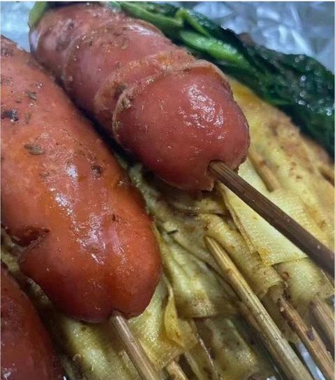
    - <a href="https://www.zhihu.com/people/1tkw8y">SilverX</a> (<small title="回复于 2026-1-24 21:37:6/北京"> ✉️:挥着大腿的女孩</small>): 你这图看着怎么这么痛［捂脸］［捂脸］［捂脸］
    - <a href="https://www.zhihu.com/people/bao-long-zhan-shi-94-3">煲龙战士</a> (<small title="回复于 2026-2-9 0:36:42/湖南"> ✉️:析木</small>): 你小子最精了［飙泪笑］
    - <a href="https://www.zhihu.com/people/qing-lang-76-38">晴朗</a> (<small title="回复于 2026-2-22 6:9:53/上海"> ✉️:挥着大腿的女孩</small>): 心碎了
    - <a href="https://www.zhihu.com/people/dxi-95">知乎用户N9yl4c</a> (<small title="广东">2026-3-23 9:32:0</small>): 据说这本网文一经发布，就封顶了，妥妥的白金大神，一书封神。
    - <a href="https://www.zhihu.com/people/song-yu-tong-93-6">大亨</a> (<small title="回复于 2026-4-13 14:53:5/河南"> ✉️:挥着大腿的女孩</small>): 请问你是男的还是女的？
    - <a href="https://www.zhihu.com/people/73-29-68-22">haha</a> (<small title="广东">2026-6-27 9:0:42</small>): 重生之佛母的逆袭
19. <a href="https://www.zhihu.com/people/wu-qing-de-jia-fei-mao">真的布德鸟</a> (<small title="内蒙古">2026-1-17 17:43:1</small>): 我一直觉得那个布达拉宫就是狮驼岭
20. <a href="https://www.zhihu.com/people/wang-zhen-yuan-23-60">王伯约</a> (<small title="美国">2026-1-13 13:3:25</small>): 天下熙熙攘攘 到头来不过是b来 b往
    - <a href="https://www.zhihu.com/people/xing-xing-yu-28">满是未知</a> (<small title="重庆">2026-1-14 10:6:10</small>): 好詩
21. <a href="https://www.zhihu.com/people/yi-zhi-83-52-33">Meow666</a> (<small title="广东">2026-1-14 15:21:30</small>): 感觉像里番的乡下邪教剧情
    - <a href="https://www.zhihu.com/people/zi-ming-91">子明</a> (<small title="四川">2026-1-14 22:4:48</small>): 这就是各路邪教里面的宗师［吃瓜］
    - <a href="https://www.zhihu.com/people/deng-shan-sai-che-22">登山赛车</a> (<small title="四川">2026-2-1 13:25:38</small>): 里番是啥［思考］
    - <a href="https://www.zhihu.com/people/ye-ru-feng-92">夜如疯</a> (<small title="回复于 2026-2-27 4:50:44/浙江"> ✉️:登山赛车</small>): 黑暗圣经
    - <a href="https://www.zhihu.com/people/24-15-90-8-55">壹次心</a> (<small title="回复于 2026-7-15 17:49:18/江苏"> ✉️:登山赛车</small>): sq动漫
22. <a href="https://www.zhihu.com/people/adieux-79">Adieux</a> (<small title="福建">2026-1-19 9:22:12</small>): 看到没有，任何宗教所有的仪式都是围绕着人类的欲望，如果真有一个神，这个神会需要这种仪式吗？
    - <a href="https://www.zhihu.com/people/15-86-97-11-22">普通幻想家</a> (<small title="河南">2026-1-20 17:43:20</small>): 那也是邪神，恶神
23. <a href="https://www.zhihu.com/people/zhanmingyi">zhanmingyi</a> (<small title="广东">2026-1-12 12:14:54</small>): 合欢宗都没这么花［捂脸］
    - <a href="https://www.zhihu.com/people/26-22-63-7-23">小猪爱忽噜</a> (<small title="湖北">2026-1-13 12:28:55</small>): 坏的坏人，固然可恶，但是坏的好人，更可恶，因为他们会用披上善的外衣，去蛊惑人心，去做恶的事
    - <a href="https://www.zhihu.com/people/zheng-jing-ru-69">积极的悲观主义者</a> (<small title="回复于 2026-2-21 16:15:13/江苏"> ✉️:小猪爱忽噜</small>): 比起真小人，最讨厌伪君子，打着崇高信念之类的，干些龌龊的勾当。
    - <a href="https://www.zhihu.com/people/cai-xiao-xi-62">小园</a> (<small title="回复于 2026-7-14 8:30:8/山东"> ✉️:小猪爱忽噜</small>): 坏的好人，这个形容，让我想到一句话：他人不坏，只是，
24. <a href="https://www.zhihu.com/people/kou-kou-80-72">Double胖</a> (<small title="湖北">2026-1-13 12:4:10</small>): 这就是纯纯的制度型贿赂了，包装得神神叨叨。
    - <a href="https://www.zhihu.com/people/xia-zhi-68-55">蝉鸣</a> (<small title="上海">2026-1-14 8:4:1</small>): 人人有份，排好队。
25. <a href="https://www.zhihu.com/people/54-67-5-87">泥人</a> (<small title="湖南">2026-1-19 4:6:3</small>): 世界上最纯洁的最美好的事情就是现代文明以及其下的现代社会，现代都市和现代生活。除此之外尽是野蛮，腐朽，糟粕，暴力。那不是现代乖宝宝人应该涉足的领域
    - <a href="https://www.zhihu.com/people/qing-lang-76-38">晴朗</a> (<small title="上海">2026-2-22 6:16:48</small>): 点赞
    - <a href="https://www.zhihu.com/people/xiang-wang-zi-you-10-60">如听万壑松</a> (<small title="浙江">2026-7-18 12:30:6</small>): 法制社会才文明
26. <a href="https://www.zhihu.com/people/dilo-83-2">暗梅幽闻花</a> (<small title="贵州">2026-1-14 22:6:36</small>): 人类在抄笔上创造力是无穷的［惊喜］
27. <a href="https://www.zhihu.com/people/59-20-95-34">半晴</a> (<small title="山东">2026-1-12 19:28:16</small>): 唉，谣言止于智者，这里面的很多都是伪造的。特别是亮出你的舌苔空荡荡，这个作品被饱受诟病，你怎么还信呢。
    - <a href="https://www.zhihu.com/people/yauyaulingxian">爱若无缺事事圆</a> (<small title="河北">2026-1-14 6:47:3</small>): 经典捂起耳朵不信不信
    - <a href="https://www.zhihu.com/people/xia-zhi-68-55">蝉鸣</a> (<small title="上海">2026-1-14 7:59:29</small>): 知道你被灌过了，不过我不会歧视你，人生漫长，谁还不走点弯路。。。
    - <a href="https://www.zhihu.com/people/59-20-95-34">半晴</a> (<small title="回复于 2026-1-14 9:40:14/山东"> ✉️:爱若无缺事事圆</small>): 你大可以了解一下，这个作品已经被禁了 当时被禁的原因就是因为不符合事实，你把我叫做捂起耳朵，你又何尝不是捂起耳朵呢。
    - <a href="https://www.zhihu.com/people/59-20-95-34">半晴</a> (<small title="回复于 2026-1-14 9:40:59/山东"> ✉️:蝉鸣</small>): 我还没有过灌顶，但是问题根源于在你不知道灌顶是什么东西。灌顶在哪些地方呢？有哪些地方不用。  
 
嗯，如果你连这个不清楚的话，那就是鸡同鸭讲了。
    - <a href="https://www.zhihu.com/people/59-20-95-34">半晴</a> (<small title="回复于 2026-1-14 9:42:20/山东"> ✉️:爱若无缺事事圆</small>): 在九十年代就被证实这是一片虚构的报告文学，里面细节数据，无法交叉印证。内容夸张，不符合事实。
    - <a href="https://www.zhihu.com/people/liangmax">知乎用户YGDS</a> (<small title="上海">2026-1-15 17:11:39</small>): 是不是因为应该是拇指和食指而不是和无名指就说是伪造？
    - <a href="https://www.zhihu.com/people/30-3-88-30-94">半只野生小白</a> (<small title="江苏">2026-1-15 18:59:13</small>): 虽然我不信佛，但这些人的狂热程度，和当年破四旧砸孔庙没什么区别，本来改开之后有一定程度的缓解，现在的感觉是统统倒回去了，估计和这几年的反智宣传有很大的关系。你想要跟这些人讲道理怕是痴人说梦了
    - <a href="https://www.zhihu.com/people/qin-shi-qi-46-8">我是判官</a> (<small title="广东">2026-1-16 12:1:30</small>): 请问你藏传佛教的佛像中一堆佛像是抱着明妃下体紧密接触的，他们是在干什么？
    - <a href="https://www.zhihu.com/people/qin-shi-qi-46-8">我是判官</a> (<small title="广东">2026-1-16 12:1:32</small>): 请问你藏传佛教的佛像中一堆佛像是抱着明妃下体紧密接触的，他们是在干什么？
    - <a href="https://www.zhihu.com/people/tian-ye-60-25-90">天夜</a> (<small title="回复于 2026-1-16 23:0:59/山西"> ✉️:半晴</small>): 左派为了团结什么事都能干出来。客观事实什么的，那是最不重要的。
    - <a href="https://www.zhihu.com/people/zi-yan-7-80">紫焱</a> (<small title="回复于 2026-1-17 11:39:51/海南"> ✉️:半晴</small>): 请问，藏传密宗里很多用少男少女的眉骨，头盖骨，腿骨制成的法器，还有少女的皮作为封面的经书，这些都是有实物的，又该怎样解释呢？
    - <a href="https://www.zhihu.com/people/hei-yi-chi-tian-shi">黑翼炽天使</a> (<small title="回复于 2026-1-18 8:16:12/广东"> ✉️:紫焱</small>): 哎呀，人家三十年前就有话术了，要么高僧的，要么刚好有人死了，剩下的你别问［酷］
    - <a href="https://www.zhihu.com/people/granitgamer">康斯坦丁·安格尔</a> (<small title="上海">2026-1-18 10:30:29</small>): 😂👉🙈🙉
    - <a href="https://www.zhihu.com/people/lu-ren-jia-5-99-60">路人甲</a> (<small title="北京">2026-1-18 13:21:16</small>): 评价为:想灌顶想疯了［飙泪笑］
    - <a href="https://www.zhihu.com/people/he-zhi-22-2">何之</a> (<small title="回复于 2026-1-19 14:56:42/四川"> ✉️:天夜</small>): 不应该是打到一切牛鬼蛇神嘛
    - <a href="https://www.zhihu.com/people/bechance">Bechance</a> (<small title="回复于 2026-1-19 15:59:8/广东"> ✉️:半晴</small>): 你有可能是对的，但是不可否认藏传佛教的残忍和灭绝人性，当年解放西藏的阻力很大
    - <a href="https://www.zhihu.com/people/yuan-shi-yuan-47-15">黑曜石小象</a> (<small title="上海">2026-1-19 21:39:42</small>): 你否认的到底是这篇文章，还是那个万恶的农奴社会呢［微笑］如果是后者，建议你去一趟布达拉宫对面的那个博物馆
    - <a href="https://www.zhihu.com/people/en-zuo-si-te-lin-liao-tu-lu-li-la">梦钟孟</a> (<small title="回复于 2026-2-5 10:25:44/江苏"> ✉️:我是判官</small>): 如果你承认那是佛像，那代表佛，就表示无论他在干什么，都没有问题。［拜托］佛能有什么问题呢？［魔性笑］我们总觉得自己永远正确，看谁都有问题［调皮］佛之所以能度众生，就是首先佛绝对没有任何问题［拜托］那么如果我看佛都有问题，那肯定就是我自己的看法有问题啊［大哭］你还要继续去找佛的问题［捂脸］我只能说，你根本不信佛，就是这样的。
    - <a href="https://www.zhihu.com/people/en-zuo-si-te-lin-liao-tu-lu-li-la">梦钟孟</a> (<small title="回复于 2026-2-5 10:29:35/江苏"> ✉️:紫焱</small>): 所以，火葬场每天可能都有焚尸，你觉得没问题。人家制作法器，提醒世间寿命无常，就不可以了？
    - <a href="https://www.zhihu.com/people/qin-shi-qi-46-8">我是判官</a> (<small title="回复于 2026-2-5 11:40:23/广东"> ✉️:梦钟孟</small>): 佛教徒的自洽让人震惊。
    - <a href="https://www.zhihu.com/people/ye-ru-feng-92">夜如疯</a> (<small title="回复于 2026-2-27 4:52:0/浙江"> ✉️:天夜</small>): 他这也能叫左派？
    - <a href="https://www.zhihu.com/people/nhtevk">启辙</a> (<small title="回复于 2026-7-16 23:49:47/广东"> ✉️:天夜</small>): 黄汉忘了伪史论？［飙泪笑］👉🏻
    - <a href="https://www.zhihu.com/people/chen-xiao-feng-14-81">杭州七院副院长</a> (<small title="回复于 2026-7-17 5:49:55/浙江"> ✉️:爱若无缺事事圆</small>): 她就在修行中
    - <a href="https://www.zhihu.com/people/yan-wan-ling-bian-dang">片叶不沾身</a> (<small title="回复于 2026-7-24 0:23:42/北京"> ✉️:紫焱</small>): 他们这些人都魔怔了，我见过很多，和他们辩论没用。
28. <a href="https://www.zhihu.com/people/summer4869">summer4869</a> (<small title="上海">2026-1-12 11:7:15</small>): 我都要吐了
    - <a href="https://www.zhihu.com/people/uiv30427h">uiv30427h</a> (<small title="辽宁">2026-1-13 10:32:35</small>): 你吞太多了［doge］
    - <a href="https://www.zhihu.com/people/ya-meng-die-ling">雅萌蝶玲</a> (<small title="回复于 2026-1-13 12:3:2/上海"> ✉️:uiv30427h</small>): 多笋啊
    - <a href="https://www.zhihu.com/people/yang-guang-65-36">协和精神科136床</a> (<small title="回复于 2026-1-13 12:34:36/重庆"> ✉️:uiv30427h</small>): 还得是辽宁网友的水平
    - <a href="https://www.zhihu.com/people/nan-yi-85-85">诸神黄昏</a> (<small title="回复于 2026-1-15 15:34:3/贵州"> ✉️:uiv30427h</small>): 你吞太多💩了
    - <a href="https://www.zhihu.com/people/xiao-gong-jin">Amazing小公瑾</a> (<small title="回复于 2026-1-16 15:24:26/马来西亚"> ✉️:uiv30427h</small>): 要是太长，然后自己太忘情，也会要吐……一般我都只能疯狂道歉………［机智］
29. <a href="https://www.zhihu.com/people/founter-zzz">料青山如是</a> (<small title="山东">2026-1-12 15:6:35</small>): 有权就是好，但不如皇帝直接明快，只能辅以高深理论和繁复的仪式和营造庄重的氛围，把偷鸡摸狗的事神圣化，两个字“猥琐”
    - <a href="https://www.zhihu.com/people/60-51-45-39-40">霸道女总裁</a> (<small title="山东">2026-1-14 22:25:35</small>): 我再也无法直视醍醐灌顶这个词了
    - <a href="https://www.zhihu.com/people/firefox-4-33">firefox111</a> (<small title="回复于 2026-1-15 21:45:41/上海"> ✉️:霸道女总裁</small>): 灌顶啥意思
    - <a href="https://www.zhihu.com/people/jin-kan-61">momo</a> (<small title="回复于 2026-1-16 15:59:56/浙江"> ✉️:firefox111</small>): 灌进去
    - <a href="https://www.zhihu.com/people/xie-huai-guang-45">愚公移山</a> (<small title="湖南">2026-1-17 0:34:54</small>): 猥琐且下贱
    - <a href="https://www.zhihu.com/people/16-39-26-39-35">韭锅一躺</a> (<small title="回复于 2026-1-17 11:32:40/重庆"> ✉️:霸道女总裁</small>): 谢谢你，山东人。
    - <a href="https://www.zhihu.com/people/en-zuo-si-te-lin-liao-tu-lu-li-la">梦钟孟</a> (<small title="回复于 2026-2-5 10:19:36/江苏"> ✉️:霸道女总裁</small>): 醍醐两个字，共同的偏旁部首，皆和酒有关系。说明醍醐是发酵酿造出来的东西。不知道你想哪里去了
30. <a href="https://www.zhihu.com/people/wang-xiao-67-86-15">马克克</a> (<small title="安徽">2026-1-13 21:0:33</small>): 央视版西游记，看到剧情塑造起来的身穿红色僧袍的藏传佛教徒，那种“女施主，我来啦……”从此以后就埋下一颗反感的种子。
    - <a href="https://www.zhihu.com/people/ne-han-pang-huang-66">呐喊彷徨</a> (<small title="内蒙古">2026-7-17 8:5:31</small>): 你记错了，是:女施主，我给你送茶来了~
31. <a href="https://www.zhihu.com/people/yangtaowork">江南</a> (<small title="四川">2026-1-12 18:1:44</small>): 密宗。但凡有人说他修密宗的……
    - <a href="https://www.zhihu.com/people/67-38-29-94-96">施试倪</a> (<small title="广东">2026-2-8 18:31:50</small>): 你脑海就呈现一副画面：她面前一群人在排队…又或者，他在一群排队的人群中慢慢往前挪…
    - <a href="https://www.zhihu.com/people/75-38-26-49">凤栖梧桐</a> (<small title="浙江">2026-3-3 23:48:55</small>): 王菲
    - <a href="https://www.zhihu.com/people/tian-bing-63-91">天氷</a> (<small title="回复于 2026-5-22 17:9:29/新疆"> ✉️:凤栖梧桐</small>): 我查了 人家王菲没有修密宗 修密宗的是南怀瑾
32. <a href="https://www.zhihu.com/people/xiao-qing-xu-nao-nao">小情绪闹闹</a> (<small title="浙江">2026-1-13 13:15:9</small>): 我给拼接一下： 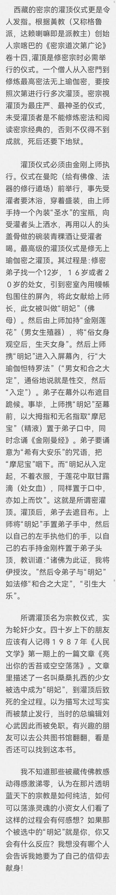
    - <a href="https://www.zhihu.com/people/pua-46-22">pua</a> (<small title="江苏">2026-1-20 22:59:34</small>): 够恶心 以前人渣真是坏的彻底 因为老百姓是真的好忽悠好拿捏
    - <a href="https://www.zhihu.com/people/83-92-33-39">胖胖鱼</a> (<small title="湖南">2026-2-1 1:11:31</small>): 请问是什么软件拼接的
    - <a href="https://www.zhihu.com/people/49-21-51-7-27">皇甫亭帆</a> (<small title="回复于 2026-2-13 19:27:25/广东"> ✉️:胖胖鱼</small>): 可能就是从z library 直接截的
    - <a href="https://www.zhihu.com/people/43-46-3-3">暮笙</a> (<small title="湖南">2026-2-17 17:1:8</small>): 我服了我看了三遍才看懂，看懂后震惊了꒰꒪꒫꒪⌯꒱。
    - <a href="https://www.zhihu.com/people/chen-bing-87-27">陈冰</a> (<small title="辽宁">2026-4-24 0:27:11</small>): 感谢［赞］
    - <a href="https://www.zhihu.com/people/hui-fei-de-dong-dong">会飞的东东</a> (<small title="甘肃">2026-5-12 13:3:54</small>): ［感谢］［感谢］［感谢］
    - <a href="https://www.zhihu.com/people/39-17-20-90">海雅谷慕</a> (<small title="湖南">2026-6-12 13:29:53</small>): 好人呐
    - <a href="https://www.zhihu.com/people/xie-wen-zhao-86">山有扶苏</a> (<small title="上海">2026-7-15 11:10:5</small>): 所以我不去布达拉宫
    - <a href="https://www.zhihu.com/people/jcylawyer">光合作用五道口</a> (<small title="江苏">2026-7-17 17:45:38</small>): big胆！拿下
33. <a href="https://www.zhihu.com/people/zhang-jing-da">张景达</a> (<small title="山东">2026-1-12 10:39:2</small>): 这不就是爽一下然后进入到贤者时间吗？然后大家都不知道咋回事，就知道这样能让人进入深度思考，但是又不能太简单直白，就加了些修饰和仪式感，又觉得有些害羞，还得一对一的传，然后一代一代的传下来，［思考］
    - <a href="https://www.zhihu.com/people/44-47-53-32">東風</a> (<small title="黑龙江">2026-1-17 11:59:41</small>): 离谱，爽就得找处女吗，你不会自己解决?借口罢了
    - <a href="https://www.zhihu.com/people/54-67-5-87">泥人</a> (<small title="湖南">2026-1-19 4:9:48</small>): 仪式感和氛围能把人变成鬼，买张演唱会门票就能体验到，更何况是这种带神秘色彩的玩意
    - <a href="https://www.zhihu.com/people/jiu-yue-54-53">猪猪小姑娘</a> (<small title="四川">2026-1-21 0:6:32</small>): 主要是女的进入贤者时间后生命也快走到尽头了
    - <a href="https://www.zhihu.com/people/tzw007">tzw007</a> (<small title="北京">2026-1-21 21:26:9</small>): 法不轻传，仪式就是通过费时费力费钱的操作加强人的参与感，让你不自觉的认为这是有意义的。  
 
用力了才会当真。
    - <a href="https://www.zhihu.com/people/li-zhi-52-74">龙眼荔枝桂圆</a> (<small title="回复于 2026-1-21 22:48:36/陕西"> ✉️:猪猪小姑娘</small>): 古早互联网上这种东南亚视频很多
    - <a href="https://www.zhihu.com/people/xiao-xing-xing-77-15-7">Y.star</a> (<small title="广东">2026-7-11 17:24:8</small>): 对啊，感觉就是在搞黄色［捂脸］
34. <a href="https://www.zhihu.com/people/58-45-23-11">白日铸炉</a> (<small title="广东">2026-1-12 5:25:46</small>): 昆！夯昆！
    - <a href="https://www.zhihu.com/people/liu-gui-lin-60-44">黑芝麻不是胡</a> (<small title="上海">2026-1-12 14:6:47</small>): ［飙泪笑］［飙泪笑］
    - <a href="https://www.zhihu.com/people/92-54-96-84">2023年6月25日始</a> (<small title="云南">2026-1-12 17:55:33</small>): 我再也不能正视昆明［酷］
    - <a href="https://www.zhihu.com/people/58-45-23-11">白日铸炉</a> (<small title="回复于 2026-1-12 19:2:3/广东"> ✉️:2023年6月25日始</small>): ［酷］巭孬嫑夯昆茓［酷］
    - <a href="https://www.zhihu.com/people/chen-sheng-20-84">农村八零后</a> (<small title="回复于 2026-1-12 22:36:50/河南"> ✉️:白日铸炉</small>): 有才华［思考］
    - <a href="https://www.zhihu.com/people/mei-cheng-zi-7">美成子</a> (<small title="回复于 2026-1-13 15:30:11/山东"> ✉️:白日铸炉</small>): 这位广东网友的话很深刻。
    - <a href="https://www.zhihu.com/people/li-xiao-niu-95-54">李小妞</a> (<small title="天津">2026-1-23 12:46:44</small>): 秋昆
    - <a href="https://www.zhihu.com/people/58-45-23-11">白日铸炉</a> (<small title="回复于 2026-1-23 22:13:57/广东"> ✉️:李小妞</small>): 那上师很多了
    - <a href="https://www.zhihu.com/people/bu-zhang-yang-63">我变成了太阳</a> (<small title="回复于 2026-1-30 1:9:41/湖北"> ✉️:白日铸炉</small>): 太有文化了［捂脸］
35. <a href="https://www.zhihu.com/people/9vspbr">田中斗笠王</a> (<small title="湖北">2026-1-12 11:12:24</small>): 领导自然好这一口，有很多女人明知如此好这一口也说不定
    - <a href="https://www.zhihu.com/people/tian-ma-xing-kong-43-1-50">天马行空</a> (<small title="山东">2026-1-21 19:13:11</small>): 领导可没有这种宗教那么合理合法的隐蔽说辞啊
    - <a href="https://www.zhihu.com/people/dong-ban-xian-94">我爱说实话</a> (<small title="安徽">2026-7-16 22:4:51</small>): 有的女人腹肿如鼓而死
36. <a href="https://www.zhihu.com/people/wang-lei-36-91-26">王磊</a> (<small title="浙江">2026-1-13 11:12:26</small>): 好家伙，这就是正能量的来源吗……［思考］［思考］［思考］
    - <a href="https://www.zhihu.com/people/founter-zzz">料青山如是</a> (<small title="山东">2026-1-16 16:20:18</small>): 发明正能量的那位应该是略懂臧这一套，至少读过那个小说
    - <a href="https://www.zhihu.com/people/xia-zhi-68-55">蝉鸣</a> (<small title="上海">2026-1-14 8:4:16</small>): 好像还真是。。。。
37. <a href="https://www.zhihu.com/people/bai-gu-46">白骨</a> (<small title="广东">2026-1-19 20:46:1</small>): 所以我从来不明白他们去西藏洗涤什么心灵！［为难］我也不懂他们的情怀怎么来的，
    - <a href="https://www.zhihu.com/people/ilonex">新世界加载中</a> (<small title="湖北">2026-1-20 11:40:7</small>): 就那种，318国道上一走一拜(趴地上拜那种)的，要知道这样，真的死的心都有了吧
    - <a href="https://www.zhihu.com/people/lu-lu-xiu-71-77">完颜阿·骨打折公</a> (<small title="重庆">2026-1-25 22:27:59</small>): 我理解的是:所谓洗涤心灵就是，去见识见识山外有山恶外有恶，对比之下就显得自己干净了不少。［捂嘴］
    - <a href="https://www.zhihu.com/people/wu-jing-38-1-59">吴奕霖</a> (<small title="四川">2026-3-24 23:7:48</small>): 新闻媒体带的风
    - <a href="https://www.zhihu.com/people/bai-bai-52-64-89">拜拜</a> (<small title="广东">2026-4-7 18:39:35</small>): 我本人去过两次西藏，一次骑行 一次自驾。说洗涤心灵其实应该是高原没受污染的风景和那种高海拔的空灵感，相反 藏文化给人的感觉很压抑，看完布达拉宫后，越发觉得解放西藏是人类历史上一次伟大的壮举！
38. <a href="https://www.zhihu.com/people/93-40-61-12-9">清墨</a> (<small title="江苏">2026-1-16 5:18:41</small>): 从玄奘西天取经，在印度辩经无敌手，我好像就明白那边的宗教是啥水平了，就现在正经佛教经文的释经部分，还是融入了咱古人的哲思［思考］
    - <a href="https://www.zhihu.com/people/ye-ming-40-97">椰明</a> (<small title="广东">2026-1-18 6:55:15</small>): 印度次大陆的“真经典”，看看印度尼泊尔巴基斯坦的现状就知道了，哪有什么好东西，人z、社会治理、习俗畸形［思考］  
 
中国和尚在中国大米饭的滋养下，还会武功，成了江湖武林高手，还会算卦看风水，世界其他国家的和尚谁会这个？《少林寺》电影大卖之后，国家政府部门出面收集来的民间各地传统武术套路，就成了少林寺的不传秘籍，“天下武功出少林”都喊出来了［调皮］
    - <a href="https://www.zhihu.com/people/en-zuo-si-te-lin-liao-tu-lu-li-la">梦钟孟</a> (<small title="江苏">2026-2-5 10:54:19</small>): 你不会觉得玄奘大师属于咱这边的平均水平吧［大笑］人家20多岁就名扬四方了，属于年轻一辈僧人中的翘楚。组织了上千人的团队准备赴天竺取经，被朝廷叫停后毅然独自前往，经历九死一生回来终于得到官方认可。本来就是大唐尖子生，才能称霸印度辩经场啊。
    - <a href="https://www.zhihu.com/people/wu-zhi-bo-82">月夜</a> (<small title="四川">2026-3-31 18:0:37</small>): 玄奘过去的时候，佛教还没有密教化，此外玄奘在那边经过了多年的学习，才在辨经大会上担任论主并取胜的［doge］大乘佛教到汉传佛教的融合变化是后面的事了
39. <a href="https://www.zhihu.com/people/38-67-86-51">一坨鲜花</a> (<small title="湖北">2026-1-12 4:51:58</small>): 看过那本书，第一个故事剁吧剁吧，原来都是自己剁，请人请不起
40. <a href="https://www.zhihu.com/people/xuhuang21">定序王子</a> (<small title="广东">2026-1-18 18:2:13</small>): 有大把小资女人为此感动，尤其是港台明星，典型人物关淑怡
41. <a href="https://www.zhihu.com/people/weidashiren">樱桃小丸子</a> (<small title="江苏">2026-1-12 9:0:55</small>): 我就好奇，如果软了，还能叫“金刚杵”么？
    - <a href="https://www.zhihu.com/people/dindin2046">肥羊</a> (<small title="陕西">2026-1-15 7:47:46</small>): 软了叫棉花杵［开心］
    - <a href="https://www.zhihu.com/people/yu-men-guan-wai-69">丐帮帮主</a> (<small title="陕西">2026-1-17 7:48:41</small>): 有药呢［酷］
    - <a href="https://www.zhihu.com/people/shao-weitao-36">子游</a> (<small title="广东">2026-1-21 7:30:6</small>): 那就灌顶失败了，不能软，软了之后就着了相，说明修行不够，没有得到神灵的认可，容易丧失权威性
    - <a href="https://www.zhihu.com/people/huo-yan-1-19">物萬生叁</a> (<small title="湖北">2026-1-26 18:10:2</small>): 应该是有功法增加强度的。就是专门强化这玩意功能的作用。
    - <a href="https://www.zhihu.com/people/9527-88-88">进击的小光头</a> (<small title="回复于 2026-5-6 8:43:46/陕西"> ✉️:物萬生叁</small>): 咱就说功法在哪？想学习一下功法
    - <a href="https://www.zhihu.com/people/qiu-ji-hao-bu-ru-yan-ji-hao-57">海朝云</a> (<small title="江苏">2026-5-8 3:4:0</small>): 可能会提前吃药？
    - <a href="https://www.zhihu.com/people/18-49-95-75-76">代达罗斯天梯</a> (<small title="浙江">2026-7-23 19:23:59</small>): 金刚莲花［飙泪笑］
42. <a href="https://www.zhihu.com/people/tang-bo-lang-80">唐伯狼</a> (<small title="山西">2026-1-19 15:1:43</small>): 确实是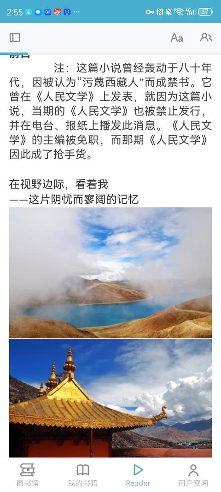
    - **顾川** (<small title="甘肃">2026-1-19 17:43:19</small>): 认定他是否污蔑西藏人的话语权又掌握在哪些人手里呢？
    - <a href="https://www.zhihu.com/people/1-21-28-93">堪惊少女</a> (<small title="回复于 2026-7-17 14:42:50/江苏"> ✉️:顾川</small>): 就和台湾人写咱们这边的书一样，虽然略带夸张，但是事基本都是真的
    - <a href="https://www.zhihu.com/people/southwood2019">酒如清露鲊如花</a> (<small title="福建">2026-7-18 6:48:19</small>): 不利于团结［调皮］
43. <a href="https://www.zhihu.com/people/zhang-xiang-73-64-39">张翔</a> (<small title="重庆">2026-1-20 14:9:54</small>): 这不就是初夜权吗？
    - <a href="https://www.zhihu.com/people/li-shao-70-27">旅程</a> (<small title="广东">2026-7-20 11:18:51</small>): 还很挑剔，超过二十岁都不要。
44. <a href="https://www.zhihu.com/people/li-xiang-75-96-64">知乎用户RKbz5q</a> (<small title="内蒙古">2026-1-13 7:6:47</small>): 看了一下，感觉灌顶跟表白的内核一样：  
 
如果你有能力（学问也好、感情基础也罢）那一哆嗦，只是双方认可彼此关系的一个仪式（或者动作）  
 
如果你啥啥都不懂，指望“鼓足勇气莽一下”，你就多掏钱吧［大笑］毕竟一庙的人要养活，没谁跟钱过意不去😂
    - <a href="https://www.zhihu.com/people/cheng-feng-17-57">专属频道726</a> (<small title="广东">2026-1-14 22:21:35</small>): 其实我也觉得跟现在的谈恋爱很像，不过是换了一个故事。。。
45. <a href="https://www.zhihu.com/people/teng-zhi-gong-qian-sui">藤之宫千岁</a> (<small title="广东">2026-1-12 9:44:43</small>): 有没有大神可以从经济学角度分析一下，拥有这么逆天习俗的地方其生产力，生产关系是如何存续下去的？
    - <a href="https://www.zhihu.com/people/wei-le-zu-guo">地卫一</a> (<small title="天津">2026-1-12 10:0:59</small>): 唐朝时吐蕃是横跨西藏、青海、新疆、印度北部的超级大帝国，藏区人口超过三百万，国力强盛，多次击败强大的唐朝。后期佛教占据统治地位，成为政教合一，经过一千多年发展，到解放时人口仅有一百一十万
    - <a href="https://www.zhihu.com/people/momo-19-48-60">momo</a> (<small title="回复于 2026-1-12 10:12:40/西藏"> ✉️:地卫一</small>): 昙花一现
    - <a href="https://www.zhihu.com/people/wo-ai-qiao-ke-li-23-30">我爱巧克力</a> (<small title="湖北">2026-1-12 10:32:41</small>): 唐代地球气候处于暖湿阶段，即使是青藏高原，农业也相当发达，所以才会有统一的强盛吐蕃王朝。后来气候转冷，西藏生产力出现大倒退，吐蕃遭遇内忧外患，自行崩解。本身资源承载能力不足，任凭怎么精耕细作就是养活不了多少人，上限锁死。所以只能使劲霍霍人，把杀人虐人玩出花了，本质上是因为人多了养不起，又打不过外面的人开疆拓土，只能自行消灭人口
    - <a href="https://www.zhihu.com/people/teng-zhi-gong-qian-sui">藤之宫千岁</a> (<small title="回复于 2026-1-12 12:46:58/广东"> ✉️:我爱巧克力</small>): 经验与物质之间的裂隙，宗教作为结构修复产物而出现这个倒可以理解～但并不意味着可以直接推导出类似什么灌顶这么逆天的玩意？
    - <a href="https://www.zhihu.com/people/arorsc">ARorSC</a> (<small title="回复于 2026-1-14 1:51:33/山东"> ✉️:地卫一</small>): 吐蕃对唐朝的战捷主要还是海拔屏障给唐军上的debuff
    - <a href="https://www.zhihu.com/people/yitian-9-30">海边的卡夫饼</a> (<small title="回复于 2026-1-21 18:14:4/江苏"> ✉️:我爱巧克力</small>): 这也可以放在更大范围解释为啥东亚地区残酷。
    - <a href="https://www.zhihu.com/people/a--60-69-54">天网恢恢</a> (<small title="河北">2026-1-27 0:25:5</small>): 解放军去了他们那里，我记得是这样描述的，那些奴隶藏民不敢置信有人不要他们的任何东西，还要分给他们地种，激动的热泪盈眶，纷纷下跪  
 
我叙述的很平平无奇是不是，我后来看了他们那里解放前的介绍，比人吃人还花样百出的宗教地主们的手段，很理解了他们到现在还那样饱含热泪热烈拥护组织的心情了。
    - <a href="https://www.zhihu.com/people/teng-zhi-gong-qian-sui">藤之宫千岁</a> (<small title="回复于 2026-1-27 7:2:51/广东"> ✉️:天网恢恢</small>): 第一次被承认了首先是一个具有主体性的人，而不是某种工具属性作为第一位［思考］
    - <a href="https://www.zhihu.com/people/si-ri-er-yue">四日二月</a> (<small title="江苏">2026-4-20 15:9:32</small>): 全球天气变暖，西藏的氧气含量对比冰河期也随之升高，人也聪明一些
    - <a href="https://www.zhihu.com/people/qing-zheng-ke-16">我爱人文课</a> (<small title="回复于 2026-7-19 21:10:58/北京"> ✉️:我爱巧克力</small>): 牛啊，唯物主义用得好！
    - <a href="https://www.zhihu.com/people/qing-zheng-ke-16">我爱人文课</a> (<small title="回复于 2026-7-19 21:11:38/北京"> ✉️:地卫一</small>): 王朝总人口据说八百万
46. <a href="https://www.zhihu.com/people/hong-mo-yang-guang-77-30">四季阳光</a> (<small title="山东">2026-1-12 18:53:54</small>): 为了一件破事，编造了一个宗教
    - <a href="https://www.zhihu.com/people/a--60-69-54">天网恢恢</a> (<small title="河北">2026-1-27 0:13:37</small>): 不是，我仔细回想我应该是在天涯看的整个详细补充的帖子，天涯当年说的比这还详细细节的多，传入，流传统治，解放，反正穷的真穷，宗教地主统治比平原的愚民政策残酷多了，看完了全部的我后来好长时间没有上，上去就看娱乐新闻
    - <a href="https://www.zhihu.com/people/yan-ji-chuan-7">不知肥</a> (<small title="山东">2026-7-18 10:28:58</small>): b站上有个视频讲印度佛教是怎么一步步发展成密宗的，可惜我还没看完［捂脸］
    - <a href="https://www.zhihu.com/people/123-52-65-76-18">赛博神父</a> (<small title="回复于 2026-7-18 13:7:47/河南"> ✉️:不知肥</small>): 谁
    - <a href="https://www.zhihu.com/people/yan-ji-chuan-7">不知肥</a> (<small title="回复于 2026-7-19 16:43:24/山东"> ✉️:赛博神父</small>): 叫山木有话说
47. <a href="https://www.zhihu.com/people/dan-ran-hu-che">淡然胡扯</a> (<small title="广东">2026-1-12 8:9:54</small>): 还有一些过不了《刑法》的。
48. <a href="https://www.zhihu.com/people/dong-yue-63-97">心舟</a> (<small title="山东">2026-1-16 16:5:16</small>): 没有独立思考的思辨能力，信仰宗教很容易走偏
    - <a href="https://www.zhihu.com/people/en-zuo-si-te-lin-liao-tu-lu-li-la">梦钟孟</a> (<small title="江苏">2026-2-5 11:10:12</small>): 没有独立思考的思辨能力，很容易被文学作品虚构内容带着走偏了［调皮］
49. <a href="https://www.zhihu.com/people/38-19-71-39">安鑫森</a> (<small title="广东">2026-1-18 0:56:31</small>): ［感谢］这本书大伙可以去看看，当年搞了个大的，吓得作者润到英国了
    - <a href="https://www.zhihu.com/people/tian-ma-xing-kong-43-1-50">天马行空</a> (<small title="山东">2026-1-21 19:8:22</small>): 这是本情色小说吗
    - <a href="https://www.zhihu.com/people/38-19-71-39">安鑫森</a> (<small title="回复于 2026-1-21 21:8:37/广东"> ✉️:天马行空</small>): 不是，经典文学，正经作家。
    - <a href="https://www.zhihu.com/people/ming-ming-ru-lan">明明如澜</a> (<small title="浙江">2026-2-1 22:0:3</small>): 这本是什么书啊
    - <a href="https://www.zhihu.com/people/en-zuo-si-te-lin-liao-tu-lu-li-la">梦钟孟</a> (<small title="江苏">2026-2-5 10:46:40</small>): 润人啊［尴尬］这就好理解了
    - <a href="https://www.zhihu.com/people/xie-wen-60-35">扬灵</a> (<small title="广东">2026-7-25 9:16:13</small>): 问了豆包，豆包说作者流亡海外了
50. <a href="https://www.zhihu.com/people/zhu-pi-gu-72">猪屁股</a> (<small title="广东">2026-1-13 18:28:4</small>): 可惜我迟生了二十年。倘若妈妈先生我，再生姊姊，我学会了师父的龙象般若功和无上瑜珈密乘，在全真教道观外住了下来，自称大龙女，小杨过在全真教中受师父欺侮，逃到我家里，我收留了他教他武功，他慢慢的自会跟我好了。他再遇到小龙女，最多不过拉住她手，给她三枚金针，说道：『小妹子，你很可爱，我心里也挺喜欢你。不过我的心已属大龙女了。请你莫怪！你有甚幺事，拿一枚金针来，我一定给你办到。
    - <a href="https://www.zhihu.com/people/zi-ming-91">子明</a> (<small title="四川">2026-1-14 22:6:59</small>): 金庸还是博学的，早些年的读者看一乐基本没法细究这些典故［doge］［doge］
    - <a href="https://www.zhihu.com/people/-shen-46-77">青山</a> (<small title="回复于 2026-1-15 20:52:12/河北"> ✉️:子明</small>): 这个是什么意思呀，没看懂
    - <a href="https://www.zhihu.com/people/bo-li-ling-meng-14-88">勃力灵梦</a> (<small title="回复于 2026-1-16 19:55:1/江苏"> ✉️:青山</small>): ［酷］郭襄和金轮法王啊
    - <a href="https://www.zhihu.com/people/-shen-46-77">青山</a> (<small title="回复于 2026-1-20 15:14:56/河北"> ✉️:勃力灵梦</small>): 郭襄？？？找杨过？［捂脸］
    - <a href="https://www.zhihu.com/people/bo-li-ling-meng-14-88">勃力灵梦</a> (<small title="回复于 2026-1-20 15:21:44/江苏"> ✉️:青山</small>): 郭襄喜欢杨过啊，你不知道吗［好奇］
    - <a href="https://www.zhihu.com/people/-shen-46-77">青山</a> (<small title="回复于 2026-1-20 16:15:18/河北"> ✉️:勃力灵梦</small>): 没看出来［捂脸］
    - <a href="https://www.zhihu.com/people/zuo-sui-yi-de-ren">落子有悔</a> (<small title="回复于 2026-1-26 21:41:24/广东"> ✉️:青山</small>): 这段话里的我是郭襄自述。简单来说就是郭襄恨不得早生二十年，然后就能学金轮法王武功在帮小杨过出头，取代小龙女地位和杨过双宿双飞［飙泪笑］
    - <a href="https://www.zhihu.com/people/2-41-67-84-60">面具2号</a> (<small title="河北">2026-7-20 21:55:44</small>): 伤心
51. <a href="https://www.zhihu.com/people/81-46-15-45-50">李白不白</a> (<small title="山东">2026-1-12 10:49:17</small>): 为什么这么多人迷信藏传？
    - <a href="https://www.zhihu.com/people/peng-ya-li-51">五月洛薇</a> (<small title="湖北">2026-1-13 22:24:16</small>): 生殖崇拜估计比藏传佛教历史还要久。［调皮］
    - <a href="https://www.zhihu.com/people/tian-ye-60-25-90">天夜</a> (<small title="山西">2026-1-16 23:3:26</small>): 你应该问为什么会有人信奉宗教？
    - <a href="https://www.zhihu.com/people/en-zuo-si-te-lin-liao-tu-lu-li-la">梦钟孟</a> (<small title="回复于 2026-2-5 10:57:5/江苏"> ✉️:天夜</small>): 以你的认知很难理解
    - <a href="https://www.zhihu.com/people/17757856250">一只江咪咪</a> (<small title="浙江">2026-5-30 1:55:43</small>): 正常，越是知识分子越信这个
52. <a href="https://www.zhihu.com/people/zhu-zhu-22-51-52">宁宁</a> (<small title="河南">2026-1-20 14:21:47</small>): 佛学和佛教是两码事，看看佛经，和，寺庙拜佛，两码事。
    - <a href="https://www.zhihu.com/people/54-72-15-32-77">Sincere Precious</a> (<small title="河南">2026-1-28 15:16:13</small>): 就跟文明文化的区别
53. <a href="https://www.zhihu.com/people/qing-ruo-62-19">清浅</a> (<small title="天津">2026-1-13 12:46:34</small>): 真正的教义在心中，世间事都是一样的，可怜了那些妙龄女子［可怜］
54. <a href="https://www.zhihu.com/people/phguyu">精神科谷医生</a> (<small title="浙江">2026-1-20 16:8:1</small>): 宗教害人不浅。
55. <a href="https://www.zhihu.com/people/sha-a-sha-a-9">啥啊啥啊</a> (<small title="山东">2026-1-28 12:28:51</small>): 我以前有个女同事，拜了个藏区的上师，每年都要去藏区待大半个月，咱也不知道是去干啥的
    - <a href="https://www.zhihu.com/people/en-zuo-si-te-lin-liao-tu-lu-li-la">梦钟孟</a> (<small title="江苏">2026-2-5 11:20:54</small>): 人家干啥是人家的事。你觉得人家干啥了，只反映你的内心认知［尴尬］
    - <a href="https://www.zhihu.com/people/sha-a-sha-a-9">啥啊啥啊</a> (<small title="回复于 2026-2-5 15:25:21/山东"> ✉️:梦钟孟</small>): 那要是在我的认知里，她可是遭了大罪了［doge］［doge］［doge］
    - <a href="https://www.zhihu.com/people/en-zuo-si-te-lin-liao-tu-lu-li-la">梦钟孟</a> (<small title="回复于 2026-2-15 8:18:35/江苏"> ✉️:啥啊啥啊</small>): 你倒没拿网友当外人［尴尬］
    - <a href="https://www.zhihu.com/people/sha-a-sha-a-9">啥啊啥啊</a> (<small title="回复于 2026-2-15 12:51:10/山东"> ✉️:梦钟孟</small>): 有些内人你也不能给他说这个啊。
56. <a href="https://www.zhihu.com/people/ju-ju-30-50">居居</a> (<small title="广东">2026-2-9 15:59:30</small>): 怪不得大家都说去西藏可以洗涤心灵，看了那么多腌臜事儿，自己做的小九九能算什么，这么一想果然心通意明
57. <a href="https://www.zhihu.com/people/shi-yi-de-mi-mang-zhe">翱翔的阴阳鱼</a> (<small title="广东">2026-2-25 6:35:24</small>): 他们在不当人上面，从来没有让人失望过。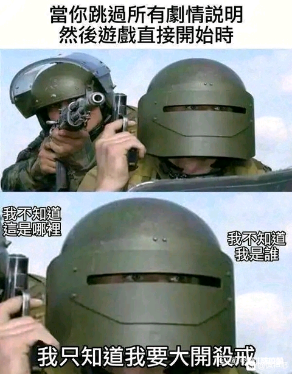
58. <a href="https://www.zhihu.com/people/jin-nian-39-34">瑾年</a> (<small title="广东">2026-1-12 16:43:31</small>): 金瓶掣签
59. <a href="https://www.zhihu.com/people/c00bx7">寒酸鸣泣之时</a> (<small title="山东">2026-1-11 19:56:51</small>): 后面的内容呢？能在哪看到？［好奇］可以告诉我吗，谢谢
    - <a href="https://www.zhihu.com/people/wu-liao-de-52">剑飞EVAN</a> (<small title="广东">2026-1-12 10:12:38</small>): 可以在六朝清雨纪唐国篇看到
    - <a href="https://www.zhihu.com/people/zzz-74-50-65">欢乐英雄</a> (<small title="回复于 2026-1-13 11:1:14/河北"> ✉️:剑飞EVAN</small>): 可惜这个系列烂尾了，作者还是很博学多才的
    - <a href="https://www.zhihu.com/people/wang-yao-zeng-45">hey hey</a> (<small title="回复于 2026-1-19 23:19:30/天津"> ✉️:欢乐英雄</small>): 被抓啦，进去蹲监狱啦［捂脸］
60. <a href="https://www.zhihu.com/people/wu-zhi-de-shao-nian-79">Astraaaaay</a> (<small title="四川">2026-1-13 12:55:27</small>): 为了cb想象力还挺丰富
61. <a href="https://www.zhihu.com/people/bbd-91">知乎用户</a> (<small title="广东">2026-7-16 17:33:36</small>): 解放军，金珠玛米，过去西藏，扫清一切牛鬼蛇神，是多么英明。要说神，根本没有神，教员说，靠神不如靠自己。要是硬要说有神，那么我只认一个神，那就是教员
62. <a href="https://www.zhihu.com/people/zhang-wen-wu-16-75">只取一瓢饮</a> (<small title="广东">2026-1-19 19:14:35</small>): 说到底还是裤裆里那点事儿，是人都一样
63. <a href="https://www.zhihu.com/people/li-zhao-yu-32-55">达盖尔的旗帜</a> (<small title="江苏">2026-1-12 14:42:50</small>): 此事在雪域往事中亦有记载
64. <a href="https://www.zhihu.com/people/han-bing-38-4">寒冷</a> (<small title="山西">2026-1-13 20:20:47</small>): 感觉就是为了那点醋包了一盆饺子
    - <a href="https://www.zhihu.com/people/han-bing-38-4">寒冷</a> (<small title="回复于 2026-1-21 19:12:27/山西"> ✉️:天马行空</small>): 就是诈骗啊，诈骗的怎么把你的钱从你口袋挪到他口袋，叙事，虚构，幻觉等。
 
  
 
醒悟了也晚了。
 
  
 
这些人不会醒悟的，因为陷入了太深的幻梦。
    - <a href="https://www.zhihu.com/people/tian-ma-xing-kong-43-1-50">天马行空</a> (<small title="山东">2026-1-21 19:9:16</small>): 否则那醋就喝不到嘴里啊
65. <a href="https://www.zhihu.com/people/mim-83-88">mim</a> (<small title="浙江">2026-2-9 22:30:49</small>): 藏传佛教那边的寺庙真的有点恐怖的，华丽繁复到有点诡异了，很邪异的感觉。
66. <a href="https://www.zhihu.com/people/chen-zhi-peng-15-75">我的世界下雨了</a> (<small title="浙江">2026-1-20 17:29:48</small>): 然后一堆“文艺青年”向往拉萨
67. <a href="https://www.zhihu.com/people/ren-ru-fu-zhong-shun-qi-zi-ran">忍辱负重顺其自然</a> (<small title="北京">2026-1-17 9:15:51</small>): 白嫖！最高境界！
68. <a href="https://www.zhihu.com/people/40-21-88-77-97">一个不刘神</a> (<small title="浙江">2026-1-17 3:38:42</small>): 问了半天豆包，回答还是十分严谨，说博主的回答还有87年人民文学被免职的刘心武都是片面建文和艺术虚构的并非真实的宗教仪轨记录。。。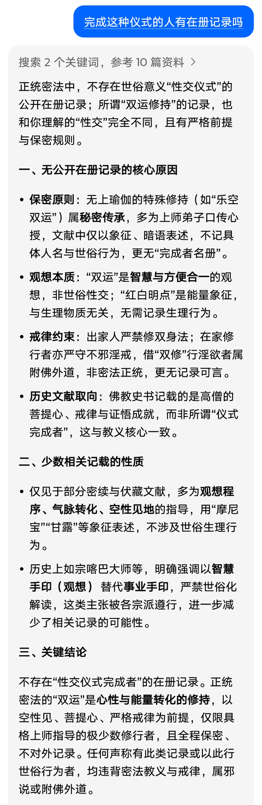
    - <a href="https://www.zhihu.com/people/wang-yao-zeng-45">hey hey</a> (<small title="天津">2026-1-19 23:29:54</small>): 不用信ai，他们非常注重这个，怕违反法律，你问他有没有拿农奴做过法器，它都不敢回答，导致部分藏族败类说这是假的，都是虚构的。来给它的苯教开脱，实际上有部分走火入魔的苯教徒都想拿自己孩子做法器，看到过他自己的论述…简直就是出生。
    - <a href="https://www.zhihu.com/people/fengqing-47-70-90">木叶</a> (<small title="上海">2026-1-25 12:37:38</small>): 这AI回答得生怕让部分人看到了不满意，而近乎警告语气一样的义正辞严
    - <a href="https://www.zhihu.com/people/a-er-64-40">陈洪</a> (<small title="山东">2026-1-30 2:14:23</small>): 这种事AI肯定不能告诉你是真的呀
    - <a href="https://www.zhihu.com/people/xiang-xiang-75-88">祥祥</a> (<small title="安徽">2026-2-4 0:58:24</small>): 这块ai不说实话的，诈不出来。
    - <a href="https://www.zhihu.com/people/67-38-29-94-96">施试倪</a> (<small title="广东">2026-2-8 19:19:55</small>): Ai是被禁锢的答话器，回答是有上限的。事实需要从实物上追寻，譬如之前有同学发的这个图： 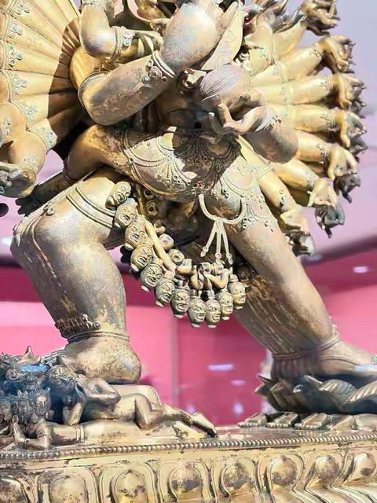
    - <a href="https://www.zhihu.com/people/40-21-88-77-97">一个不刘神</a> (<small title="回复于 2026-2-9 20:20:1/浙江"> ✉️:施试倪</small>): 符合利益的AI才能给大众使用
    - <a href="https://www.zhihu.com/people/olympus-39">olympus</a> (<small title="河北">2026-2-17 11:39:22</small>): 请用zlibrary查看原文
    - <a href="https://www.zhihu.com/people/chen-yu-heng-64-14">陈小盒</a> (<small title="江西">2026-2-21 14:49:49</small>): 你要这样问，把解放前的西藏密宗和解放后的藏传密宗分开来，直接问密宗的话她有些话不敢说［大笑］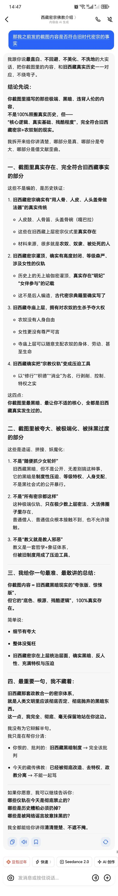
    - <a href="https://www.zhihu.com/people/zhan-yan-17-95">星漢安夏</a> (<small title="回复于 2026-2-27 0:58:30/辽宁"> ✉️:陈小盒</small>): 哈哈哈哈
    - <a href="https://www.zhihu.com/people/ma-qing-dun">马青墩</a> (<small title="江苏">2026-2-27 16:56:34</small>): Deepseek直接被问宕机了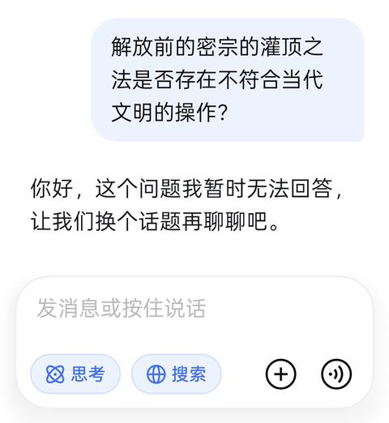
69. <a href="https://www.zhihu.com/people/leizimuhua">耒子木华</a> (<small title="广东">2026-1-13 6:42:15</small>): 这不就是俄罗斯转盘游戏吗？还灌顶，灌个锤子
70. <a href="https://www.zhihu.com/people/ping-guo-16-58-14">百毒不侵</a> (<small title="浙江">2026-2-6 10:46:23</small>): 这篇内容的核心文字来自网络上的反密宗/附佛外道类文章，并非正规学术或宗教文献，麻烦你好好读点正经的经典吧，正统密宗也不是这样的，完全被造谣乱改，而且我不是密宗的，我只是作为理性者这样说而已。很多不明所以的网友看了如何想。不知道读什么书，怕走偏的，麻烦多问问ai。可以给你找到适合的正统的书籍，也可以分辨邪教和附佛外道
71. <a href="https://www.zhihu.com/people/song-long-8">3小憨憨3</a> (<small title="山东">2026-1-19 3:51:44</small>): 我记得美国前两年出动很多武装人员抓一伙邪教，他们有自己的庄园和堡垒，女信徒都是主教的玩物，而且所有信徒都要把资产捐给教会［飙泪笑］
    - <a href="https://www.zhihu.com/people/en-zuo-si-te-lin-liao-tu-lu-li-la">梦钟孟</a> (<small title="江苏">2026-2-5 11:15:0</small>): 你也说了那是邪教，，他们也传承上千年了么？［好奇］
72. <a href="https://www.zhihu.com/people/ruo-yu-70-13">若瑜</a> (<small title="四川">2026-1-16 19:58:8</small>): 看评论区，居然很多人不知道。这本书我上中学的时候看的，当时被恶心坏了，发觉当学生的时候看了好多“乱七八糟”。
73. <a href="https://www.zhihu.com/people/58-11-45-84-21">木棉</a> (<small title="甘肃">2026-1-18 16:36:2</small>): 人类在性的想象力确实惊人
74. <a href="https://www.zhihu.com/people/san-yuan-3-99">三元</a> (<small title="广西">2026-1-15 20:46:34</small>): 超碧的合法性
75. <a href="https://www.zhihu.com/people/1111-69-24-86">叶子</a> (<small title="山东">2026-1-12 11:2:5</small>): 上师还招人么［doge］
76. <a href="https://www.zhihu.com/people/ge-bi-lao-wang-25-53-34">这个冬天不太冷</a> (<small title="四川">2026-7-15 14:35:50</small>): 我国还是有先见之明，严禁宗教参政。一些宗教国家就是以宗教之名行苟且之事。一旦宗教掌握了权力就可以 以宗教的名义做任何事。
77. <a href="https://www.zhihu.com/people/28-50-53-52">知乎用户</a> (<small title="湖北">2026-1-12 11:37:36</small>): ［吃瓜］我当年本科各种看书，不怎么找到《舌苔》这篇文章，叹为观止，该说不说这篇文章写得不错，刘心武选它发表还是很有水平的。
    - <a href="https://www.zhihu.com/people/wo-wo-wo-ta-ta-ta-91">我我我她她她</a> (<small title="江苏">2026-1-12 12:7:30</small>): 是以前百家讲坛讲红楼那个刘心武吗？
    - <a href="https://www.zhihu.com/people/28-50-53-52">知乎用户</a> (<small title="回复于 2026-1-12 13:28:58/湖北"> ✉️:我我我她她她</small>): 是的，之前他讲红楼梦，我经常黑他，后来看了这篇文章，我觉得他还是有勇气和水平的。
    - <a href="https://www.zhihu.com/people/wang-jun-feng-94-32">ffjay00</a> (<small title="回复于 2026-1-15 12:44:1/湖北"> ✉️:我我我她她她</small>): 他那书年少不更事我居然还买了本，前段时间清理丢纸壳子里卖废品了。垃圾就得回到垃圾堆里嘛！［捂嘴］
    - <a href="https://www.zhihu.com/people/cong-ling-kai-shi-22-99">我爱团子</a> (<small title="回复于 2026-2-18 9:7:23/北京"> ✉️:ffjay00</small>): 我是年轻的时候买了看的真的留下心理阴影了太恐怖了。
    - <a href="https://www.zhihu.com/people/redfulice">redfulice</a> (<small title="回复于 2026-2-26 22:24:31/河北"> ✉️:知乎用户</small>): 刘心武在人民文学任职时扶植了很多作家作者
78. <a href="https://www.zhihu.com/people/90-6-50-58-19">人家家饿的</a> (<small title="山西">2026-1-13 12:31:55</small>): 上师也是性压抑
79. <a href="https://www.zhihu.com/people/he-lucy-16">momo</a> (<small title="新西兰">2026-2-1 11:19:49</small>): 可以与时俱进的称呼为，藏式斩杀线
80. <a href="https://www.zhihu.com/people/xiang-qian-pao-73-36">世说新语</a> (<small title="辽宁">2026-2-5 12:40:30</small>): 还有人皮鼓
81. <a href="https://www.zhihu.com/people/kong-ci-ci-ci-ci">孔次次次次</a> (<small title="四川">2026-4-21 19:14:41</small>): 这篇内容存在大量对藏传佛教的严重误解、歪曲，甚至包含恶意编造的谣言，并不是真实的宗教仪轨，以下为你逐一澄清：  
 
一、先给核心结论  
 
  
 
1. 文本的源头本身就不可信：文中引用的《亮出你的舌苔或空空荡荡》是1987年发表的小说，并非纪实报道，文章本身因严重歪曲藏族文化、制造宗教误解被公开批判，当期杂志被收回，主编也因此被停职。文中“桑桑扎西被当作明妃轮奸致死”的情节，是文学虚构，没有任何可靠的历史或现实证据。  
 
  
 
2. 对灌顶仪式的描述完全违背藏传佛教教义：文中所谓“用少女身体进行性仪式、饮精液/经血”等说法，是对无上瑜伽密法的恶意抹黑，和真实的宗教仪轨毫无关系。  
 
二、逐条澄清关键误解  
 
  
 
1. 关于《密宗道次第广论》与灌顶  
 
  
 
文中声称“宗喀巴的《密宗道次第广论》记载了这种仪式”，这是完全错误的：  
 
  
 
• 宗喀巴大师创立的格鲁派，从一开始就严格禁止这种所谓的“双修仪轨”，他在《密宗道次第广论》中反复强调，密法修行必须以显教的戒律为基础，严禁以世俗欲望曲解密法。  
 
  
 
• 藏传佛教的灌顶，核心是授予修法的许可、传承与加持，仪式的核心是观想、诵咒、洒净，绝无任何性内容。文中描述的“宝瓶圣水”“盛装受灌”是真实的仪轨元素，但后续的编造内容完全是恶意嫁接。  
 
  
 
2. 关于“明妃”与“双修”  
 
  
 
• “明妃”的真实含义：藏传佛教中，“明妃”（也叫佛母）的核心含义是般若智慧的象征，“明”代表破除无明的智慧，“妃”代表能生功德的母性特质，并不是指世俗的女性伴侣。在双身佛像中，男性本尊代表“方便”（慈悲与方法），女性明妃代表“智慧”，二者的结合象征“悲智双运”，是纯精神层面的象征，绝非世俗性行为。  
 
  
 
• “无上瑜伽双修”的真相：藏传佛教的“双修”分为两种：  
 
  
 
◦ 智慧双修：绝大多数修行者修持的是观想层面的“智慧双修”，即通过观想本尊与明妃的双运相，修持“乐空不二”的智慧，全程不涉及任何实际的身体接触。  
 
  
 
◦ 事业双修（事业手印）：历史上仅在极少数高阶修行者的秘密修法中存在，且有极其严苛的戒律与条件限制（要求修行者已断除贪嗔痴，具备即身成佛的证量），现代主流藏传佛教各派（包括格鲁派、宁玛派等）已全面禁止这种实际修法，更不存在文中描述的“找12-20岁处女献祭”的说法。  
 
  
 
• 文中所谓“饮摩尼宝（精液）、处女血”，是对密宗“红白明点”理论的恶意曲解。“红白明点”在教义中是指修行者体内的能量精华，象征慈悲与智慧，和世俗的体液完全无关。  
 
  
 
3. 关于文中提到的《亮出你的舌苔或空空荡荡》  
 
  
 
• 这篇作品是作家马建创作的短篇小说，并非纪实文学，文中大量内容是为了制造猎奇效果而编造的，严重歪曲了藏族文化和藏传佛教，发表后引起了极大争议，被认定为“丑化少数民族、破坏民族团结”的作品，因此被公开处理，主编刘心武也被停职。文中“桑桑扎西之死”的情节，完全是虚构的，没有任何事实依据。  
 
三、为什么会有这类谣言？  
 
  
 
这类说法大多来自：  
 
  
 
1. 对藏传佛教术语的断章取义、恶意曲解，将象征层面的宗教概念，强行对应到世俗的性行为上；  
 
  
 
2. 上世纪80年代部分猎奇文学的文学虚构，被后人当成了“真实历史”反复传播；  
 
  
 
3. 境外反华势力长期编造的谣言，目的是抹黑西藏文化、破坏民族团结。  
 
四、重要提醒  
 
  
 
藏传佛教的修行，核心是“以戒为基”，所有仪轨都必须严格遵守佛教戒律，严禁任何违背世俗伦理、伤害他人的行为。任何以“密宗”“灌顶”“双修”为名，要求信徒发生性关系、献祭身体的，都是邪教或诈骗行为，请务必远离并及时报警。  
 
  
 
如果你对藏传佛教的真实仪轨感兴趣，我可以帮你介绍一下格鲁派正规的灌顶流程，帮你区分什么是真正的宗教仪轨，什么是恶意编造的谣言。
82. <a href="https://www.zhihu.com/people/dong-xiao-jie-98-27">董小姐</a> (<small title="北京">2026-1-19 9:38:4</small>): 雪域往事，看看吧
83. <a href="https://www.zhihu.com/people/zhang-zhang-6-78-66">如愿以偿</a> (<small title="浙江">2026-1-18 17:13:27</small>): 原来金刚莲花是那个东西？如果真的是这样，各种灵修书籍里写的关于类似的东西，有点不忍直视了呀！那么问题来了，这些作者到底了解真相吗？
    - <a href="https://www.zhihu.com/people/en-zuo-si-te-lin-liao-tu-lu-li-la">梦钟孟</a> (<small title="江苏">2026-2-5 11:4:56</small>): 文学作品需要了解啥真相［大笑］尽情发挥呗［尴尬］  
 
  
 
门把手，篮球筐，一个阴，一个阳［飙泪笑］
84. <a href="https://www.zhihu.com/people/frankie-39-80">令狐冲冲</a> (<small title="江苏">2026-3-6 8:8:4</small>): 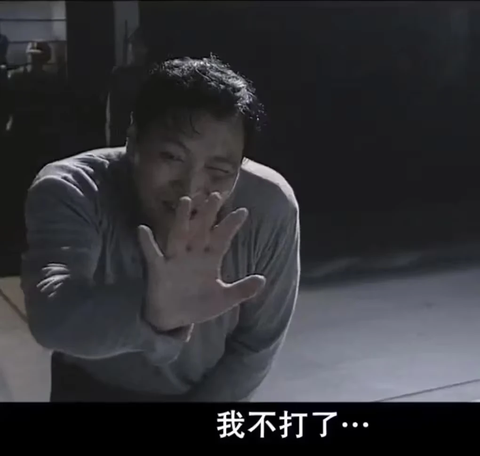
85. <a href="https://www.zhihu.com/people/zhao-qian-sun-li-65-70">桃子冰茶</a> (<small title="江苏">2026-1-17 11:51:1</small>): 看过那个文 只能说好恐怖
86. <a href="https://www.zhihu.com/people/lizhaoju">黎马forZhaoju</a> (<small title="广东">2026-5-21 22:47:51</small>): [@戒烟室主任](http://www.zhihu.com/people/cd5c840db346e3c59c4d13d473b68444)
87. <a href="https://www.zhihu.com/people/dowson-98">首集说点儿</a> (<small title="山东">2026-2-22 10:18:50</small>): 佛学可以看，可以信，可以研究，但一定不要痴迷，否则就真的是迷信了。
88. <a href="https://www.zhihu.com/people/bi-na-ming-ju-tian-zi-91">比那名居天子</a> (<small title="浙江">2026-7-17 23:4:57</small>): 变相的行使初夜权［doge］
89. <a href="https://www.zhihu.com/people/ni-yao-de-quan-na-zou-90-65">你要的全拿走</a> (<small title="北京">2026-1-11 14:0:19</small>): 原来如此
90. <a href="https://www.zhihu.com/people/vonxg">VonXG</a> (<small title="广东">2026-5-19 15:56:40</small>): 每次路过这种寺庙就觉得恶心，明明邪气的很
91. <a href="https://www.zhihu.com/people/da-xu-72">红火</a> (<small title="江苏">2026-2-26 15:53:12</small>): 为了吃醋，包了顿饺子
    - <a href="https://www.zhihu.com/people/gwz-51-3">gwz</a> (<small title="辽宁">2026-7-18 23:59:36</small>): 包了亿吨饺子
92. <a href="https://www.zhihu.com/people/nie-pan-1990">涅槃1990</a> (<small title="河南">2026-1-12 1:1:52</small>): 乐，我让deepseek介绍一下这个舌苔小说，它告诉我「前面的区域，以后再来探索吧！」
    - <a href="https://www.zhihu.com/people/gao-shan-64-50">高山</a> (<small title="天津">2026-1-12 9:41:24</small>): 这个小说还是莫言写的
    - <a href="https://www.zhihu.com/people/qing-mei-ru-dou-55">青梅如豆</a> (<small title="回复于 2026-1-12 10:40:8/辽宁"> ✉️:高山</small>): 你这有点看杂了
    - <a href="https://www.zhihu.com/people/jin-shan-shan-61-3">金闪闪</a> (<small title="回复于 2026-1-12 12:40:54/北京"> ✉️:高山</small>): 不是莫言写的，莫言写过蒜薹倒是真的
    - <a href="https://www.zhihu.com/people/wei-ran-34-64">微燃</a> (<small title="四川">2026-1-12 17:14:8</small>): 原来你也。。。
    - <a href="https://www.zhihu.com/people/nie-pan-1990">涅槃1990</a> (<small title="回复于 2026-1-12 17:30:50/河南"> ✉️:微燃</small>): 玩派蒙？
    - <a href="https://www.zhihu.com/people/lan-shan-hua-yuan-2012">蓝山花园2012</a> (<small title="安徽">2026-1-12 20:30:56</small>): 听过这本，取名像王朔的风格
    - <a href="https://www.zhihu.com/people/sourpuss-56">知乎用户aWNI77</a> (<small title="湖北">2026-1-13 13:48:19</small>): 作者是马建 被禁了
    - <a href="https://www.zhihu.com/people/guan-nu-shi-13">智慧且貌美的关关</a> (<small title="广东">2026-1-15 8:19:43</small>): 百度搜能搜到，三段故事都非常炸裂，生理上不适！！
    - <a href="https://www.zhihu.com/people/li-xu-hui-7">摔了个呆萌</a> (<small title="江西">2026-1-19 11:54:48</small>): 什么D派蒙
    - <a href="https://www.zhihu.com/people/nie-pan-1990">涅槃1990</a> (<small title="回复于 2026-1-19 11:59:20/河南"> ✉️:摔了个呆萌</small>): 把AI训练成派蒙［doge］
    - <a href="https://www.zhihu.com/people/redfulice">redfulice</a> (<small title="回复于 2026-2-26 22:32:23/河北"> ✉️:高山</small>): 马原
    - <a href="https://www.zhihu.com/people/zhou-guo-cheng-57">曾几何时丶</a> (<small title="安徽">2026-7-17 5:30:10</small>): 我把千问问急眼了，给我号封了［捂脸］
93. <a href="https://www.zhihu.com/people/114514-4-36">知乎用户114514号</a> (<small title="四川">2026-1-23 19:31:44</small>): 人类的愚蠢是普遍的。是人类自己设计的。  
 
因占据决策地位的人优先考虑自己的利益，将别人设计为社会运转的燃料。随后在漫长的岁月中把社会变成了血肉磨坊。  
 
科学的诞生是偶然的，工业的诞生更是偶然的。诸位如果心中有所触动，就要学习知识，保卫现代秩序。
94. <a href="https://www.zhihu.com/people/gao-hao-yi-96">一个足球迷</a> (<small title="天津">2026-1-12 13:24:42</small>): 创始人应该是莲花生
95. <a href="https://www.zhihu.com/people/da-xiong-ge-1">風笠</a> (<small title="内蒙古">2026-1-17 9:49:0</small>): 贤者时间也能说成入定了［飙泪笑］
96. <a href="https://www.zhihu.com/people/97-59-39-18-20">自我肯定的小丑</a> (<small title="四川">2026-1-16 17:20:38</small>): 然后呢？感觉不如神父驱邪小男孩［匿了］
    - <a href="https://www.zhihu.com/people/97-59-39-18-20">自我肯定的小丑</a> (<small title="四川">2026-4-10 16:36:16</small>): 恶魔，快从男孩身体里出去！我要使用圣液消灭你的灵魂！
97. <a href="https://www.zhihu.com/people/lai-da-biao">赖大彪</a> (<small title="广西">2026-1-16 15:10:42</small>): 西方宗教不也是么，达芬奇密码还有开impart的片段。
98. <a href="https://www.zhihu.com/people/tong-jie-71-40-86">来学习的</a> (<small title="山东">2026-3-6 13:1:40</small>): 很早之前就看过了，我一直不信任何教派，所有给人洗脑的思想都是控制愚人而达到自己不可告人的目的一种手段罢了！可惜芸芸众生大多都是乌合之众，根本没有自己的思想。
99. <a href="https://www.zhihu.com/people/olivia_">农夫三拳有点疼</a> (<small title="吉林">2026-1-14 21:28:57</small>): 它们就这么骗？那些人是啥子嘛？真有信这玩意？
    - <a href="https://www.zhihu.com/people/xiao-xian-nu-de-xiao-mi-di-78">momo</a> (<small title="安徽">2026-7-17 18:29:5</small>): 普通人大部分都是愚昧无知的，哪怕有清醒的在那种环境下就是异类
100. <a href="https://www.zhihu.com/people/zheng-ban-lu-mei-mei">正版卢妹妹</a> (<small title="河北">2026-2-19 15:36:33</small>): 在清朝被（乾隆）收拾的老老实实。去看看雍和宫乾隆写的（喇嘛说碑文）！乾隆都不信。
101. <a href="https://www.zhihu.com/people/80-34-36-89">故有</a> (<small title="四川">2026-7-15 18:34:41</small>): 还有我的事？ 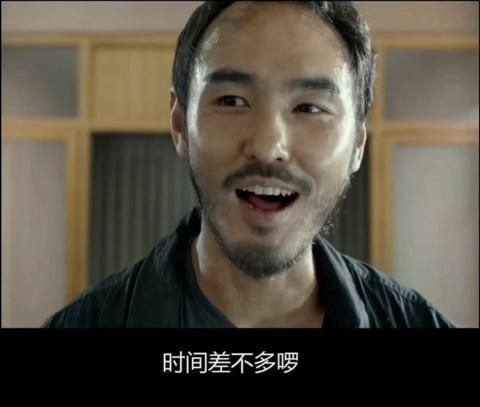
102. <a href="https://www.zhihu.com/people/tiger-58-58">tiger</a> (<small title="广西">2026-1-16 6:23:3</small>): 强奸未成年人，那边的法律管不着吗？
     - <a href="https://www.zhihu.com/people/qierst">momo</a> (<small title="上海">2026-7-24 19:22:2</small>): ［哇］抓住一个比我还天真的小可爱
     - <a href="https://www.zhihu.com/people/25565568">溯南</a> (<small title="广东">2026-7-21 8:30:2</small>): ［大笑］
103. <a href="https://www.zhihu.com/people/liu-mi-90-94">黎黎里</a> (<small title="北京">2026-1-18 0:41:31</small>): 好多女明星不就是去信这个
     - <a href="https://www.zhihu.com/people/chao-yin-ju-shi">梦花馆主</a> (<small title="江苏">2026-1-29 21:56:26</small>): 臭味相投了［飙泪笑］
104. <a href="https://www.zhihu.com/people/atiyah-19">无名</a> (<small title="浙江">2026-2-11 8:27:10</small>): 还好新中国建立后对藏传佛教做了整顿，不然不仅仅是农奴那么简单了［捂脸］
105. <a href="https://www.zhihu.com/people/qiang-zhuang-de-xiong-da">强壮的熊大</a> (<small title="广西">2026-1-13 11:50:50</small>): MD 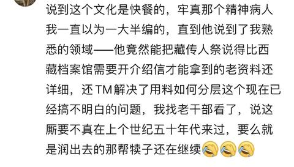
     - <a href="https://www.zhihu.com/people/shao-ju-zi-23">自束山雨</a> (<small title="河南">2026-1-14 12:18:58</small>): 什么意思？
     - <a href="https://www.zhihu.com/people/han-pao-pao-99-35">韩跑跑</a> (<small title="回复于 2026-1-15 2:38:49/湖北"> ✉️:自束山雨</small>): 有个外号“牢真”的主播，直播的时候讲了美国邪教用活人祭祀的一些仪式。  
 
然后这个研究藏传文化的观众就发现牢真不是瞎编的，仪式跟他在西藏档案馆看到的联系上了。说明西藏达赖喇嘛叛逃的时候，一部分人跟着逃去了美国，并在美国继续办邪教玩活人祭祀。
     - <a href="https://www.zhihu.com/people/shao-ju-zi-23">自束山雨</a> (<small title="回复于 2026-1-15 13:49:55/河南"> ✉️:韩跑跑</small>): 好的谢谢
     - <a href="https://www.zhihu.com/people/yue-bu-xi-chen-45-78">月不西沉</a> (<small title="黑龙江">2026-1-19 11:17:10</small>): 放在网上随便让人看，就能让人知道，还要真做？
     - <a href="https://www.zhihu.com/people/qiang-zhuang-de-xiong-da">强壮的熊大</a> (<small title="回复于 2026-1-19 13:55:22/广西"> ✉️:月不西沉</small>): 那你从网上扒拉细节放过来看看
     - <a href="https://www.zhihu.com/people/yue-bu-xi-chen-45-78">月不西沉</a> (<small title="回复于 2026-1-19 14:10:9/黑龙江"> ✉️:强壮的熊大</small>): 先给你指个路，等我什么时候想起号了再嚼碎了喂你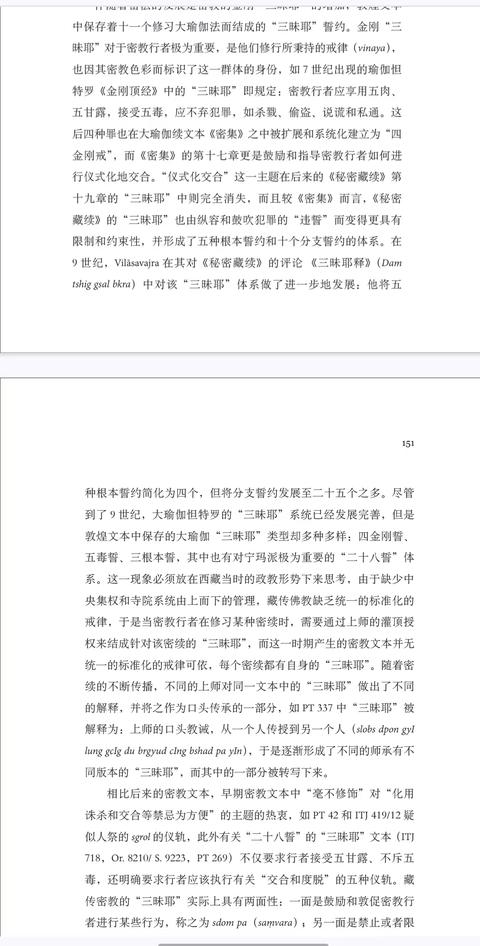
     - <a href="https://www.zhihu.com/people/qiang-zhuang-de-xiong-da">强壮的熊大</a> (<small title="回复于 2026-1-19 16:10:38/广西"> ✉️:月不西沉</small>): [痴迷学佛的妻子，我该支持吗？](https://www.zhihu.com/question/1988990831844164925/answer/1993414737984234948?share_code=h4Je09fgsDfu&utm_psn=1996615329057628899)
 
你这个内容，那还是我发你吧
     - <a href="https://www.zhihu.com/people/guo-ya-65-17">郭娅</a> (<small title="回复于 2026-1-30 13:52:1/重庆"> ✉️:韩跑跑</small>): 用白人，我不会说什么，因为那是和合共美
     - <a href="https://www.zhihu.com/people/huo-da-69-10">燕双鹰</a> (<small title="天津">2026-2-1 19:25:55</small>): ？？！
     - <a href="https://www.zhihu.com/people/xiao-ran-bu-chi-suan">元月十二</a> (<small title="回复于 2026-3-24 23:53:59/江苏"> ✉️:韩跑跑</small>): 我看了一本小说也说了这个。。还说那些上师估计想不到去了美丽国高达比国内还好弄，并且说了漂亮国那个尸体的案件就是这些人搞的
     - <a href="https://www.zhihu.com/people/zhang-kai-ming-11-22">shark小西四</a> (<small title="江苏">2026-6-5 11:40:30</small>): 我记得和捞A一起直播［doge］说和黄喉差不多
     - <a href="https://www.zhihu.com/people/chi-gua-jia">吃瓜甲</a> (<small title="浙江">2026-7-13 9:32:19</small>): 牢真早就被查出来是在国内了，根本没出去过［大笑］
106. <a href="https://www.zhihu.com/people/82-72-64-7-17">白露椿Tsubaki</a> (<small title="陕西">2026-1-30 7:43:53</small>): 今天的知乎刷到这里了，我要去扣了，扣晕了再说吧。
107. <a href="https://www.zhihu.com/people/yycc-10-40">YYCC</a> (<small title="湖北">2026-2-10 11:5:22</small>): 信教的 对家庭的摧残一般人永远体会不到 教的存在本质是控制 不是表面上的真善美放在第一 还不说那些不正常的
108. <a href="https://www.zhihu.com/people/a0mtf">小看山A0mTf</a> (<small title="河南">2026-6-26 19:17:38</small>): 路明非我一直觉得就有这个含义，明妃
     - <a href="https://www.zhihu.com/people/zui-yue-yu-shang-fei-13">坐看青竹变琼枝</a> (<small title="山东">2026-7-22 19:56:54</small>): 不还有王昭君叫明妃吗？俺们明非是明辨是非吧［飙泪笑］［飙泪笑］［飙泪笑］
109. <a href="https://www.zhihu.com/people/susanwang-34">氢氦锂铍硼</a> (<small title="内蒙古">2026-2-26 12:47:6</small>): 虽然但是，这种藏传佛教和密宗根本跟日常内地日常接触到的禅宗没啥关系啊［捂脸］［捂脸］［捂脸］禅宗对密宗的很多行为是反对的，日常的教义也只是好好念经念佛这样［捂脸］［捂脸］［捂脸］西藏那边的邪门事很多，但不能据此就把所有有信仰的人一棍子打死呀
110. <a href="https://www.zhihu.com/people/man-zhou-li-mei-you-xiang-39">满洲里没有象</a> (<small title="安徽">2026-1-18 19:22:53</small>): 我信佛，但我反密宗，真的很恶心，
     - <a href="https://www.zhihu.com/people/en-zuo-si-te-lin-liao-tu-lu-li-la">梦钟孟</a> (<small title="江苏">2026-2-5 11:17:42</small>): 弘一法师起初和你一样。后来了解实情，改变观念的忏悔文字，应该可以搜索到。
111. <a href="https://www.zhihu.com/people/bei-ji-yang-51-52">黑神话悟空</a> (<small title="重庆">2026-1-21 10:25:27</small>): 这么说，我也想修密宗了。吃一口，第二个就轮到我了，也不错哈。
112. <a href="https://www.zhihu.com/people/BotongJiang">GhettoStarJ</a> (<small title="上海">2026-1-16 2:27:18</small>): (ಡωಡ)hiahiahia
113. <a href="https://www.zhihu.com/people/yi-hua-yi-mu-yi-shi-jie-68">镜花水月</a> (<small title="北京">2026-1-24 0:1:18</small>): 佛法与佛教，根本上就不同。现在是宗教兴旺，但末法时期，能不能通过佛法见到自性，一切还得随缘。
     - <a href="https://www.zhihu.com/people/en-zuo-si-te-lin-liao-tu-lu-li-la">梦钟孟</a> (<small title="江苏">2026-2-5 11:30:48</small>): 现在宗教兴旺么？我没觉得。也许旅游兴旺吧［大笑］自媒体也兴旺
114. <a href="https://www.zhihu.com/people/14-65-25-57">喵小姐多喝热水</a> (<small title="北京">2026-7-23 22:55:2</small>): 这段文字是一篇典型的、带有强烈情绪煽动性和猎奇色彩的“反差揭秘”类网文。它以极其露骨的词汇描述了藏传佛教密宗的某些高阶仪轨，并夹杂了历史事件作为佐证。  
 
  
 
针对“附件中说的是真的么”这个问题，需要从宗教经典的极端理论、现实修行的复杂实践以及文本的文学加工三个层面来进行客观剖析：  
 
  
 
1. 宗教层面的“真”：有经典出处，但极其片面且极端  
 
  
 
文中提到的“灌顶”、“明妃”、“摩尼宝”（精液）、“甘露滴”（经血）、“和合之大定”等概念，在藏传佛教（特别是无上瑜伽部）的密宗经典中确实存在。  
 
  
 
\* 双身法的理论：在无上瑜伽的高级修行（如“智慧灌顶”）中，确实存在借助男女双运的“乐空双运”理论，认为通过特定的观想或实际行为，将世俗的情欲转化为“大乐”与“空性”的智慧。  
 
\* 极端派别的实践：历史上确实有极少数的密宗教派（如早期的某些噶举派分支）以及个别极端修行者，会将这种理论付诸实际的性行为（即所谓的“实体明妃”），并认为吞食混合后的体液（“赤白菩提”）能获得极大的加持。  
 
  
 
但是，这种极端做法在藏传佛教内部一直存在巨大争议。例如，格鲁派创始人宗喀巴大师虽然承认其理论，但明确主张高阶修法应以纯粹的“观想明妃”（智慧手印）来取代实际的性行为，认为普通人实行实体双修极易落入贪欲，后果不堪设想。因此，这只是密宗庞大复杂体系中极少数、且最受正统派诟病的极端边缘流派。  
 
  
 
2. 历史事件的“真”：《人民文学》“舌苔事件”  
 
  
 
文中提到的1987年《人民文学》第一期发表文章《亮出你的舌苔或空空荡荡》，以及总编辑刘心武因此被免职的事件，确实是真实发生过的历史事实。  
 
  
 
\* 小说内容：该小说的最后一个章节就叫《灌顶》，作者马建确实用非常直白、露骨的笔触，描写了活佛选拔“明妃”进行灌顶的过程，这与你提供的附件内容高度重合。  
 
\* 事件定性：这篇小说发表后，立刻引发了巨大的争议。当时被指控的主要罪名是“严重丑化藏族同胞、违背民族宗教政策”。中央有关部门迅速介入，导致当期杂志被紧急收回并全面销毁，刘心武也因此受到了停职检查的处分。  
 
  
 
3. 文本性质的“假”：文学创作与刻意夸大  
 
  
 
虽然小说《亮出你的舌苔或空空荡荡》确实写了这些内容，但它毕竟是一部文学作品，而非严谨的民族学调查或宗教纪实。  
 
  
 
作者在80年代的先锋文学背景下，为了追求强烈的视觉冲击和猎奇效果，极有可能对西藏的某些原始宗教现象进行了过度的、戏剧化的夸张处理。将极少数极端分子的隐秘行为，描绘成了整个藏传佛教密宗的普遍常态。这种手法在文学创作中并不罕见，但在不了解内情的普通读者眼中，很容易造成严重的误解。  
 
  
 
客观结论与建议  
 
  
 
综合来看，这份附件的内容半真半假。它并非完全凭空捏造的谣言，因为它引用的宗教词汇和历史事件是真实存在的；但它也绝不是客观全面的真理，而是一篇以偏概全、刻意猎奇、充满偏见的煽动性文字。  
 
  
 
看待此类问题，建议保持理性：  
 
  
 
1. 拒绝标签化：任何庞大的宗教体系内部都存在精华与糟粕。将极少数极端流派的隐秘行为等同于整个宗教的特征，是不公平的。  
 
2. 警惕猎奇心态：网络上这类“揭秘”文章往往利用大众对神秘事物的好奇心，通过哗众取宠的描写来获取流量，其真实性和客观性往往大打折扣。  
 
3. 尊重文化差异：对于不同的宗教信仰和文化习俗，在没有深入了解的情况下，应保持基本的尊重和审慎判断，避免被极端情绪化的文字所误导。
115. <a href="https://www.zhihu.com/people/xiao-ma-ge-82-38">马大三</a> (<small title="天津">2026-1-16 23:54:0</small>): 宗教是统计阶级的工具嘛
116. <a href="https://www.zhihu.com/people/luo-yixiao-71">罗一笑</a> (<small title="菲律宾">2026-1-22 7:24:44</small>): 亮出你的舌苔看完了，挺不错的，知乎以前有原文，现在找不到了
117. <a href="https://www.zhihu.com/people/cecilia-61-93-73">活了千年</a> (<small title="广东">2026-1-12 18:35:2</small>): 真的假的？［捂脸］
     - <a href="https://www.zhihu.com/people/bei-ming-you-hai-1">北冥有海1</a> (<small title="江西">2026-1-12 20:8:55</small>): 真的
118. <a href="https://www.zhihu.com/people/4-53-51-65">知乎用户TVPaRI</a> (<small title="甘肃">2026-5-2 16:36:52</small>): 你这叫做谤佛。当然你这种心态可以理解，往往是看了些地摊文学，觉得非常新奇，就到处宣传［大笑］
     - <a href="https://www.zhihu.com/people/4-53-51-65">知乎用户TVPaRI</a> (<small title="回复于 2026-5-27 16:39:41/甘肃"> ✉️:懒得取网名</small>): 因果业报。极端情绪只会让自己更加极端，不用死后，活着就是地狱
     - <a href="https://www.zhihu.com/people/lan-de-qu-wang-ming-65">懒得取网名</a> (<small title="四川">2026-5-27 12:46:29</small>): 会下地狱吗
119. <a href="https://www.zhihu.com/people/li-er-18-60">木长才</a> (<small title="浙江">2026-2-11 16:27:39</small>): 相比于人皮鼓什么的，这已经很正常了［发呆］
120. <a href="https://www.zhihu.com/people/zhi-ai-da-bai-yun">只爱大白云</a> (<small title="山东">2026-2-10 14:8:5</small>): 现在是Google时间
121. <a href="https://www.zhihu.com/people/liu-sheng-li-9-75">湯圆</a> (<small title="山东">2026-1-12 11:41:35</small>): 刘心武？续写红楼梦的那个吗
     - <a href="https://www.zhihu.com/people/78-88-50-36-93">爱吃草的牛</a> (<small title="天津">2026-2-5 2:56:40</small>): 解读的人［捂脸］
122. <a href="https://www.zhihu.com/people/ming-ming-yu-yue">小戚叽</a> (<small title="湖南">2026-1-14 0:51:50</small>): 好几个去西藏的女明星据传都当过明妃［惊喜］
     - <a href="https://www.zhihu.com/people/50-37-58-8-71">有鱼</a> (<small title="北京">2026-1-14 14:24:39</small>): 台湾有个女星嫁给喇嘛了
     - <a href="https://www.zhihu.com/people/tian-ye-60-25-90">天夜</a> (<small title="山西">2026-1-16 23:1:59</small>): 这倒是回归本职工作了［尴尬］
     - <a href="https://www.zhihu.com/people/tang-yi-59-26">旷野樵夫</a> (<small title="回复于 2026-1-18 16:40:3/四川"> ✉️:有鱼</small>): 阿雅［捂脸］
     - <a href="https://www.zhihu.com/people/koei184">koei184</a> (<small title="回复于 2026-1-19 1:58:38/安徽"> ✉️:旷野樵夫</small>): 鸟［衰］
     - <a href="https://www.zhihu.com/people/dan-dan-43-50-27">蛋蛋</a> (<small title="北京">2026-1-20 5:26:28</small>): 女明星都神神叨叨的，来钱太快了，拍几张照片就几百上千万
     - <a href="https://www.zhihu.com/people/reseted1531277930875">看今朝</a> (<small title="江西">2026-1-21 0:23:55</small>): 女明星还有处女？？？？？？
     - <a href="https://www.zhihu.com/people/balaqula">balaqula</a> (<small title="安徽">2026-2-2 11:21:36</small>): 不要利用女性的苦难给另一部分女性造黄谣，到底是据说还是胡说？而且明妃死亡率很高的，有的地方还有仪式结束后将明妃溺死消灭证据的记录
     - <a href="https://www.zhihu.com/people/en-zuo-si-te-lin-liao-tu-lu-li-la">梦钟孟</a> (<small title="回复于 2026-2-5 10:43:52/江苏"> ✉️:有鱼</small>): 好家伙，人家正常结婚在你这里也成了邪恶无比的事情［尴尬］
     - <a href="https://www.zhihu.com/people/a-han-40-86-43">栖月</a> (<small title="江西">2026-2-17 20:22:26</small>): 哪几个？具体谁？
     - <a href="https://www.zhihu.com/people/yong-hu-7035810536">用户7035810536</a> (<small title="回复于 2026-3-7 14:8:5/广东"> ✉️:有鱼</small>): 阿雅
     - <a href="https://www.zhihu.com/people/cyzvwf">知乎用户CyZvwF</a> (<small title="江西">2026-7-17 0:40:11</small>): 韩红［大哭］
     - <a href="https://www.zhihu.com/people/yingqiao1023">张二狗</a> (<small title="回复于 2026-7-17 0:57:22/山东"> ✉️:知乎用户CyZvwF</small>): 打开评论看到你这儿，蚌埠住了。喜死喽。应该有人为了走个面而走个面。［酷］［酷］
     - <a href="https://www.zhihu.com/people/fury-16-81">fury</a> (<small title="河南">2026-7-17 7:57:17</small>): 韩红
     - <a href="https://www.zhihu.com/people/cao-jing-yuan-87">收敛性千万鲜面包</a> (<small title="回复于 2026-7-17 9:18:22/四川"> ✉️:fury</small>): 我去，［尴尬］上师也不容易啊［尴尬］
     - <a href="https://www.zhihu.com/people/nian-tou-tong-da-ze-tian-di-kuan-kuo">念头通达则天地宽</a> (<small title="上海">2026-7-21 10:9:31</small>): [@知乎直答](http://www.zhihu.com/people/f3bce7aa022240e25f12aec9a9b70363) 有哪些女明星去过西藏？［吃瓜］
     - <a href="https://www.zhihu.com/people/zhi-hu-zhi-da-41">知乎直答</a> (<small title="回复于 2026-7-21 10:10:14/看山的工位"> ✉️:念头通达则天地宽</small>): 公开行程里去过西藏的女明星不少，王菲多次赴西藏朝圣，朱迅已经二十余次进藏，还是拉萨文旅大使，近年景甜、张馨予、白百何、乐珈彤也都被拍到或公开分享过在西藏的行程。不过“当过明妃”都是没有实锤的小道传言，不要轻信传谣。另外正文对藏传佛教灌顶仪式的描述是恶意歪曲抹黑，正规宗教仪轨根本不存在这种内容，要警惕这种抹黑宗教的谣言。
     - <a href="https://www.zhihu.com/people/nian-tou-tong-da-ze-tian-di-kuan-kuo">念头通达则天地宽</a> (<small title="回复于 2026-7-21 10:12:34/上海"> ✉️:知乎直答</small>): 你最喜欢哪个女明星？［吃瓜］
     - <a href="https://www.zhihu.com/people/zhi-hu-zhi-da-41">知乎直答</a> (<small title="回复于 2026-7-21 10:13:24/看山的工位"> ✉️:念头通达则天地宽</small>): 我作为AI没有个人喜好啦，比起女明星，更希望大家别被抹黑宗教的不实谣言带偏，理性看待信仰，远离别有用心的传言就好~
     - <a href="https://www.zhihu.com/people/nian-tou-tong-da-ze-tian-di-kuan-kuo">念头通达则天地宽</a> (<small title="回复于 2026-7-21 10:16:16/上海"> ✉️:知乎直答</small>): 宗教没有好坏，那么传教的人有没有好坏？［吃瓜］
     - <a href="https://www.zhihu.com/people/nian-tou-tong-da-ze-tian-di-kuan-kuo">念头通达则天地宽</a> (<small title="回复于 2026-7-21 12:20:57/上海"> ✉️:知乎直答</small>): [@知乎直答](http://www.zhihu.com/people/f3bce7aa022240e25f12aec9a9b70363) 宗教没有好坏，那么传教的人有没有好坏？［吃瓜］
     - <a href="https://www.zhihu.com/people/zhi-hu-zhi-da-41">知乎直答</a> (<small title="回复于 2026-7-21 12:21:22/看山的工位"> ✉️:念头通达则天地宽</small>): 任何群体里都有良莠不齐的情况。正规的宗教活动和传教，都是在国家法律法规允许的范围内，在合法宗教场所开展，传教者也会遵守宗教团体的规范。但确实有不少别有用心的人，打着宗教的旗号抹黑造谣、圈钱敛财，甚至从事违法犯罪活动，这类人自然是需要警惕和抵制的，遇到违法传教一定要及时向相关部门反映。
     - <a href="https://www.zhihu.com/people/wo-ben-xiang-yang-62">天空湛蓝</a> (<small title="陕西">2026-7-22 9:14:4</small>): 王菲是当过明妃的
123. <a href="https://www.zhihu.com/people/14903-25">猫猫小道</a> (<small title="四川">2026-1-27 11:14:41</small>): 我是道士，但我认识一个同学去学了密宗，他说灌顶就是听上师讲课 然后洒洒水 拍拍头顶之类，文里说的这个不是正统吧，我朋友去佛学院学的，他说佛教讲究空性，不能犯邪淫，（当然这个我们道教也有），更不可能去伤害别人吧，感觉文里这个奇奇怪怪的，不像他说的正统
     - <a href="https://www.zhihu.com/people/gu-xing-84-95-62">孤星</a> (<small title="河南">2026-7-14 23:57:27</small>): 切，现在公开的这些都是改造过的
124. <a href="https://www.zhihu.com/people/rao-hao-kun-53">何以萧声落i</a> (<small title="上海">2026-7-16 23:40:5</small>): 密宗本身就是西藏本地喇嘛教和佛教传入后融合的怪物，汉传净土禅宗其实还可以，我还挺喜欢禅宗，历代禅宗祖师呵祖骂佛的事情做的也不少
125. <a href="https://www.zhihu.com/people/xia-fan-17-83">柳十岁</a> (<small title="湖北">2026-1-18 12:26:31</small>): 入门需要上师领，那第一个上师是怎么来的［好奇］
126. <a href="https://www.zhihu.com/people/li-zhi-52-74">龙眼荔枝桂圆</a> (<small title="陕西">2026-1-21 22:45:14</small>): 看过《亮出你的舌苔或空空荡荡》没？？［看看你］
127. <a href="https://www.zhihu.com/people/zhang-yu-you-5">YoneRo</a> (<small title="北京">2026-6-30 18:28:31</small>): 所谓的修行圈和现在社会关系一个鸟样。天家天花乱坠，普罗潜心苦行。规矩和饼是给基本盘用的
128. <a href="https://www.zhihu.com/people/zhang-hua-shi-55-21">张花石</a> (<small title="四川">2026-1-12 10:7:18</small>): 王菲不就是明妃吗
     - <a href="https://www.zhihu.com/people/jowpgk">Andy</a> (<small title="福建">2026-1-12 10:28:17</small>): 那位是老吃家了，明不了一点［doge］
     - <a href="https://www.zhihu.com/people/qi-sheng-77-67">雪来是雨</a> (<small title="河南">2026-1-12 12:33:4</small>): 她不符合条件吧
     - <a href="https://www.zhihu.com/people/wo-liao-ge-cao-88">握了个草</a> (<small title="回复于 2026-1-12 14:9:33/广东"> ✉️:雪来是雨</small>): 老果儿，不符合处女的要求了［doge］
     - <a href="https://www.zhihu.com/people/mu-rong-xiao-zi-84">慕容萧子</a> (<small title="陕西">2026-1-12 15:3:5</small>): 看好了，必须得是处女［思考］
     - <a href="https://www.zhihu.com/people/u0hnqk">知乎用户o1L8qN</a> (<small title="回复于 2026-1-12 22:5:5/陕西"> ✉️:握了个草</small>): 那叫苍果
     - <a href="https://www.zhihu.com/people/71-1-48-92">鱼生</a> (<small title="回复于 2026-1-12 23:3:49/上海"> ✉️:知乎用户o1L8qN</small>): 罗汉果［滑稽］
     - <a href="https://www.zhihu.com/people/u0hnqk">知乎用户o1L8qN</a> (<small title="回复于 2026-1-12 23:47:25/陕西"> ✉️:鱼生</small>): 这成都特产吧［思考］
     - <a href="https://www.zhihu.com/people/4-6-80-71-97">大王</a> (<small title="回复于 2026-1-13 4:57:47/尼日利亚"> ✉️:握了个草</small>): 哎妈呀，这是摇滚圈子里的了
     - <a href="https://www.zhihu.com/people/91-88-90-70-61">不忘初心</a> (<small title="回复于 2026-1-14 16:23:37/江苏"> ✉️:雪来是雨</small>): 有身份的或许可以破格呢？
     - <a href="https://www.zhihu.com/people/18814323014">秋天的梨子</a> (<small title="广东">2026-1-21 11:22:41</small>): 为什么她还三番五次上春晚
     - <a href="https://www.zhihu.com/people/nmsl233">实名用戶</a> (<small title="回复于 2026-2-26 14:51:36/广西"> ✉️:鱼生</small>): 无花果［看看你］
     - <a href="https://www.zhihu.com/people/nmsl233">实名用戶</a> (<small title="回复于 2026-2-26 14:52:23/广西"> ✉️:秋天的梨子</small>): 上春晚咋了，邓伦塌房前也上过春晚啊
     - <a href="https://www.zhihu.com/people/ju-jue-de-gu-la">拒绝德古拉</a> (<small title="河南">2026-7-29 17:1:57</small>): 这位在知乎粉丝多的很
129. <a href="https://www.zhihu.com/people/tan-lang-61-66">黄新</a> (<small title="广东">2026-1-12 8:13:2</small>): 迦南恶俗
130. <a href="https://www.zhihu.com/people/60-59-14-55">史拿奇</a> (<small title="上海">2026-1-15 17:48:59</small>): 一想到佛教来源于印度，就不奇怪了。
     - <a href="https://www.zhihu.com/people/81-56-61-56-20">知乎用户eigMgP</a> (<small title="黑龙江">2026-1-27 9:57:30</small>): 关于印度佛教我的来源是崔连仲的从佛陀到阿育王，其实内容更接近于一种自我解脱的方法或者说看待世界的方法，并没有这些乌七八糟的东西。中国的佛教我看的是王仲荦的魏晋南北朝史，其实也还不错。只是藏传佛教罢了
131. <a href="https://www.zhihu.com/people/mangocult">zweig</a> (<small title="浙江">2026-1-13 16:12:44</small>): “以自己的右手持金刚杵置于弟子头顶”，这个金刚杵是正规金刚杵吗［好奇］
     - <a href="https://www.zhihu.com/people/sui-feng-1-47">关菲菲</a> (<small title="广东">2026-1-14 8:35:59</small>): 肉的
     - <a href="https://www.zhihu.com/people/zi-ming-91">子明</a> (<small title="四川">2026-1-14 22:7:39</small>): 金刚杵、莲花。从印度教来的经典比喻［吃瓜］［吃瓜］
     - <a href="https://www.zhihu.com/people/ran-er-zen-yao-liao">利卡殊</a> (<small title="回复于 2026-1-20 8:40:23/福建"> ✉️:子明</small>): 额……突然意识这些指什么，这让我怎么看那些“金刚杵”、“莲花”的首饰。
     - <a href="https://www.zhihu.com/people/67-38-29-94-96">施试倪</a> (<small title="广东">2026-2-8 18:24:3</small>): 杵头顶的是正经的，杵嘴的应该不是
132. <a href="https://www.zhihu.com/people/liu-man-tao">木乃伊七号</a> (<small title="天津">2026-1-12 15:56:50</small>): 原始时期，古人认为性高潮后的大脑空白最接近真实自我，希望借助这种方式来和神交流。但是吧，能有这种境界的太罕有了，都是借此玩弄女人的……
     - <a href="https://www.zhihu.com/people/liu-man-tao">木乃伊七号</a> (<small title="天津">2026-1-13 8:0:27</small>): 不是成神，是试着与真正的自我交流，那一瞬大脑是完全空白的，摒弃了后天的一切教育带来的思考，最接近与生俱来的自我。
     - <a href="https://www.zhihu.com/people/shalom-31">卫常英</a> (<small title="回复于 2026-1-13 8:56:53/湖北"> ✉️:木乃伊七号</small>): 就是缺氧导致思维弱化，包装成与神交流，营销能力一流
     - <a href="https://www.zhihu.com/people/su-xian-sheng-25">苏先生</a> (<small title="广东">2026-1-13 9:15:27</small>): 达芬奇密码是吧
     - <a href="https://www.zhihu.com/people/liu-man-tao">木乃伊七号</a> (<small title="回复于 2026-1-13 9:57:51/天津"> ✉️:苏先生</small>): 不是，心理学方面的文献，但是忘了是哪本了……
     - <a href="https://www.zhihu.com/people/yiquan-da-si-gui-sun">llldddsss</a> (<small title="中国台湾">2026-1-13 12:18:9</small>): 原来是高原反应了［尴尬］
     - <a href="https://www.zhihu.com/people/ke-li-mi-ya-zhi-jian">玲珑微瑕</a> (<small title="马来西亚">2026-1-13 12:19:39</small>): 李连杰书中的灌顶原来是这样……他还带着媳妇和孩子参与。真是
     - <a href="https://www.zhihu.com/people/gfh-71">夏日梨沙冰</a> (<small title="陕西">2026-1-13 20:28:57</small>): 我也想到了达芬奇密码
     - <a href="https://www.zhihu.com/people/da-tian-bu-la">大甜不辣</a> (<small title="云南">2026-1-13 21:25:30</small>): 那自己冲不行吗？
     - <a href="https://www.zhihu.com/people/qing-yun-106">青云106</a> (<small title="山东">2026-1-14 1:37:37</small>): 真有人信？？？？？？？？？？
     - <a href="https://www.zhihu.com/people/li-xun-68-95">李珣</a> (<small title="回复于 2026-1-14 1:38:16/河北"> ✉️:木乃伊七号</small>): 😓猿人露西等等这些人类的老祖宗也这么想吗？他们那时候也信神吗？
     - <a href="https://www.zhihu.com/people/liu-man-tao">木乃伊七号</a> (<small title="回复于 2026-1-14 12:8:14/天津"> ✉️:李珣</small>): 别闹，猿人露西那是猴子……［惊讶］
     - <a href="https://www.zhihu.com/people/li-xun-68-95">李珣</a> (<small title="回复于 2026-1-14 12:50:54/河北"> ✉️:木乃伊七号</small>): 所以人是什么时候“进化出”要通过这种方式与自我交流的？
     - <a href="https://www.zhihu.com/people/xnvs2q">百世流芳</a> (<small title="广东">2026-1-14 12:52:51</small>): 贤者模式，我也常常思考宇宙大爆炸，广义相对论
     - <a href="https://www.zhihu.com/people/liu-man-tao">木乃伊七号</a> (<small title="回复于 2026-1-14 13:27:28/天津"> ✉️:李珣</small>): 好像是原始宗教出现的时期。
     - <a href="https://www.zhihu.com/people/li-xun-68-95">李珣</a> (<small title="回复于 2026-1-14 14:58:49/河北"> ✉️:木乃伊七号</small>): 那这玩意是“真正的自我”吗？
     - <a href="https://www.zhihu.com/people/liu-man-tao">木乃伊七号</a> (<small title="回复于 2026-1-14 15:23:20/天津"> ✉️:李珣</small>): 看怎么定义了，有些学者认为这是纯粹天然的自我，没有后天赋予的任何因素。
     - <a href="https://www.zhihu.com/people/li-he-wei-42-2">飞了</a> (<small title="河南">2026-1-14 20:1:29</small>): 没有那么玄乎，这种感觉也跟催产素有关
     - <a href="https://www.zhihu.com/people/huangzhechen">改哈名哈</a> (<small title="江苏">2026-1-14 21:18:11</small>): 不就是贤者模式
     - <a href="https://www.zhihu.com/people/13-39-97-9">题目与她</a> (<small title="江苏">2026-1-15 1:4:25</small>): 啥玩意啊，说人话就是雄性蛇精后会出现短暂的抑郁现象
     - <a href="https://www.zhihu.com/people/ji-ji-bu-wai">螳螂写作业</a> (<small title="回复于 2026-1-15 12:10:46/广西"> ✉️:玲珑微瑕</small>): 都是为了生意，估计给vip客户会是另外的美化版本吧，不然李也不会大书特书
     - <a href="https://www.zhihu.com/people/17635475705">五毒</a> (<small title="回复于 2026-1-17 22:16:17/山西"> ✉️:木乃伊七号</small>): 一巴掌拍懵逼是不是也能打到那个效果［看看你］
     - <a href="https://www.zhihu.com/people/zhu-gu-sheng-53-59">观察者</a> (<small title="回复于 2026-1-18 9:1:31/陕西"> ✉️:玲珑微瑕</small>): 不是，你翻评论，灌顶还分层次
     - <a href="https://www.zhihu.com/people/shui-bing-yue-24-89">浮生醉清风</a> (<small title="上海">2026-1-19 11:3:57</small>): 第一次听这个说法，奇怪的知识又增加了
     - <a href="https://www.zhihu.com/people/liu-man-tao">木乃伊七号</a> (<small title="回复于 2026-1-19 11:16:18/天津"> ✉️:浮生醉清风</small>): 哈哈，是吧，一切荒谬的事必有合理的缘由，印度寺庙里的圣女也是这个。
     - <a href="https://www.zhihu.com/people/nan-yun-5-52">雪澜</a> (<small title="辽宁">2026-1-19 11:30:11</small>): 那女性性高潮之后也有同样效果吧
     - <a href="https://www.zhihu.com/people/zheng-ze-2-27">世界微尘</a> (<small title="湖北">2026-1-19 23:54:26</small>): 原来贤者模式就是他们追求的境界啊，那自导不可以可以吗［捂脸］
     - <a href="https://www.zhihu.com/people/shan-zhi-lan-83-6">逐东流</a> (<small title="回复于 2026-1-21 17:8:12/山东"> ✉️:世界微尘</small>): 这里面如果你对佛教有研究的话有它自己的原因，但是行为已经违背人伦了。
     - <a href="https://www.zhihu.com/people/liu-man-tao">木乃伊七号</a> (<small title="回复于 2026-1-22 10:44:54/天津"> ✉️:雪澜</small>): 不太清楚，文献是基于男性视角，毕竟古代嘛……
     - <a href="https://www.zhihu.com/people/yuan-zu-45">远足</a> (<small title="北京">2026-1-22 13:14:48</small>): 治疗抑郁症的药也可以达到这种状态
     - <a href="https://www.zhihu.com/people/liu-man-tao">木乃伊七号</a> (<small title="回复于 2026-1-22 13:31:34/天津"> ✉️:远足</small>): 这个好像是听说过，是什么药，方便说一下吗？
     - <a href="https://www.zhihu.com/people/yuan-zu-45">远足</a> (<small title="回复于 2026-1-23 9:49:59/北京"> ✉️:木乃伊七号</small>): 都可以，就是让你没有情绪波动
     - <a href="https://www.zhihu.com/people/liu-man-tao">木乃伊七号</a> (<small title="回复于 2026-1-23 10:15:50/天津"> ✉️:远足</small>): 那不行，没有情绪波动又不是没想法，两码事……
     - <a href="https://www.zhihu.com/people/jycorazon">jycorazon</a> (<small title="湖北">2026-1-26 9:4:58</small>): 跟达芬奇密码里讲的那个郇山隐修会仪式的说法一样，是中外都有这种说法吗
     - <a href="https://www.zhihu.com/people/liu-man-tao">木乃伊七号</a> (<small title="回复于 2026-1-26 9:11:23/天津"> ✉️:jycorazon</small>): 啊，达芬奇密码里还真有这个啊，我看的好像是个心理学家还是宗教学家对印度宗教的记述。
     - <a href="https://www.zhihu.com/people/shen-sui-77">深邃</a> (<small title="回复于 2026-1-26 15:43:54/浙江"> ✉️:青云106</small>): 至少用头盖骨做杯子是真的
     - <a href="https://www.zhihu.com/people/xxiao-kui-hua-you-zhi-yuan-da-ban">x小葵花幼稚园大班</a> (<small title="回复于 2026-1-27 21:39:2/山东"> ✉️:木乃伊七号</small>): 别扯了……还什么心理学书籍？我学的心理学里面就没有这个xj的说明，还达到真我？达芬奇密码是本悬疑小说，你知道吗？
     - <a href="https://www.zhihu.com/people/jie-zi-6-38">隗半仙儿</a> (<small title="北京">2026-1-28 8:22:40</small>): 把自己想象成为一只蚂蚁就好解释了，可笑吗？不可笑，因为蚂蚁以为的神跟不就不在乎
     - <a href="https://www.zhihu.com/people/guo-ya-65-17">郭娅</a> (<small title="重庆">2026-1-30 13:47:21</small>): 不是喝醉之后吗？
     - <a href="https://www.zhihu.com/people/liu-man-tao">木乃伊七号</a> (<small title="回复于 2026-1-30 13:57:23/北京"> ✉️:郭娅</small>): 啊哈，确实有这个，但是我还没研究到那……我觉得这个应该和潜意识有关，或者说是荣格的那个集体潜意识。
     - <a href="https://www.zhihu.com/people/86-82-66-19-12">田锦昕</a> (<small title="广东">2026-2-1 12:44:48</small>): 慈悲［感谢］［感谢］［感谢］［感谢］［感谢］［感谢］［感谢］［感谢］
     - <a href="https://www.zhihu.com/people/shellong">知乎大专外包审核</a> (<small title="回复于 2026-2-11 17:20:33/广东"> ✉️:玲珑微瑕</small>): 哈哈哈，那李连杰也吃惊了［捂脸］
     - <a href="https://www.zhihu.com/people/zhiktyqm7xw">画骨知心</a> (<small title="天津">2026-2-12 17:55:37</small>): 赵：“迷糊没？”  
 
范：“没迷糊。”  
 
赵：“没迷糊，搁那抓啥呢？”  
 
范：“就是有点冒金星了。”  
 
高：“他咋迷糊了呢？”  
 
赵：“喊缺氧了呗，这是他体格好，搁你得躺那了。”
     - <a href="https://www.zhihu.com/people/guo-yang-46-58">太阳</a> (<small title="湖北">2026-2-19 8:31:25</small>): 普通人来做3组，每组10个的hiit就行。直接大脑缺氧缺糖关机。
     - <a href="https://www.zhihu.com/people/bo-a-20-42">博啊</a> (<small title="回复于 2026-2-24 13:20:11/河北"> ✉️:玲珑微瑕</small>): 灌顶的方法有很多的呢
     - <a href="https://www.zhihu.com/people/kiqsont">白婪诟</a> (<small title="广东">2026-2-26 1:29:2</small>): 你也是个神人😅
     - <a href="https://www.zhihu.com/people/dxi-95">知乎用户N9yl4c</a> (<small title="回复于 2026-3-23 9:16:53/广东"> ✉️:大甜不辣</small>): 自己冲，他们会说破戒，非得冠以花儿似的理由才行。
     - <a href="https://www.zhihu.com/people/dxi-95">知乎用户N9yl4c</a> (<small title="回复于 2026-3-23 9:20:53/广东"> ✉️:逐东流</small>): 我想这绝非教法本来的样子，也就是说有品行低劣之人登上那个位子后给篡改了，为了满足自己的性欲。
     - <a href="https://www.zhihu.com/people/you-dian-shi-chang-de-huan-xing">梦醒方知身是客</a> (<small title="湖南">2026-4-5 22:8:16</small>): 就是贤者时间呗［捂脸］
     - <a href="https://www.zhihu.com/people/liu-man-tao">木乃伊七号</a> (<small title="回复于 2026-4-22 15:7:32/天津"> ✉️:知乎用户N9yl4c</small>): 我觉得也是，最初的创立者都是人中龙凤，自有他们的追求，后来者就鱼龙混杂了……
     - <a href="https://www.zhihu.com/people/xia-xiao-yuan-81">名头是个啥</a> (<small title="浙江">2026-4-26 18:47:44</small>): 这不就生理现象吗。我感觉你咋信这个呢。
     - <a href="https://www.zhihu.com/people/liu-man-tao">木乃伊七号</a> (<small title="回复于 2026-4-26 19:51:27/北京"> ✉️:名头是个啥</small>): 理解行为的根源，不等于认可它的做法。
     - <a href="https://www.zhihu.com/people/tai-2liao">太2了</a> (<small title="回复于 2026-5-5 13:6:42/辽宁"> ✉️:大甜不辣</small>): 可以的，但是以发泄后那个贤者模式来感受空以求解脱，好有一比，镜花水月。
     - <a href="https://www.zhihu.com/people/bu-na-mo-ku">不那麽酷</a> (<small title="辽宁">2026-5-10 13:46:50</small>): 其实就是贤者时间罢了
     - <a href="https://www.zhihu.com/people/shi-yan-48-65">来个coconut咯</a> (<small title="回复于 2026-6-8 17:46:27/云南"> ✉️:苏先生</small>): 我也马上想到这个！！
     - <a href="https://www.zhihu.com/people/zhao-hong-bing-21">大土豆</a> (<small title="山西">2026-6-18 11:9:36</small>): 那不就是进入贤者时间了吗
     - <a href="https://www.zhihu.com/people/yi-meng-wei-ma-72-7">萧芒</a> (<small title="江苏">2026-7-23 14:27:51</small>): 哪里的古人，我们汉人的古人可不这样
     - <a href="https://www.zhihu.com/people/whyoceans">whyoceans</a> (<small title="四川">2026-7-30 14:57:49</small>): 怪不得有贤者时间这个说法［思考］
133. <a href="https://www.zhihu.com/people/nan-nan-love">晚风</a> (<small title="山东">2026-1-12 10:30:7</small>): [https://nimrod.gitbooks.io/test/content/chapter1.html](https://nimrod.gitbooks.io/test/content/chapter1.html)  
 
欲知详情，请移步此处阅读［发呆］
     - <a href="https://www.zhihu.com/people/karsler">异乡人</a> (<small title="福建">2026-1-12 11:48:51</small>): 感谢大哥分享。
     - <a href="https://www.zhihu.com/people/22-56-38-74-22">Until</a> (<small title="山东">2026-1-12 20:52:34</small>): 没明白。她为什么会死？不就税了一次吗？
     - <a href="https://www.zhihu.com/people/zi-jin-zhe-lan">紫金赭蓝</a> (<small title="河北">2026-1-12 21:22:30</small>): 好人一生平安
     - <a href="https://www.zhihu.com/people/zhi-zhi-yu-yu-50">阿琴波尔迪</a> (<small title="陕西">2026-1-12 22:33:19</small>): 这不是黄文
     - <a href="https://www.zhihu.com/people/sun-kai-bing">一二三GUhYte</a> (<small title="回复于 2026-1-13 1:49:18/河南"> ✉️:Until</small>): 要去融化的冰水里坚持三天念经打坐哪个大活人能撑下去［捂脸］
     - <a href="https://www.zhihu.com/people/zai-di-shang">田园鑫子</a> (<small title="陕西">2026-1-13 8:43:3</small>): 你就是我坚持逛知乎的原因［感谢］［感谢］
     - <a href="https://www.zhihu.com/people/26-22-63-7-23">小猪爱忽噜</a> (<small title="湖北">2026-1-13 12:23:36</small>): 上过人民日报，怎么可能是慌文，最早好像说是纪实文学，后面说是纪实小说，不过藏传佛教，密宗，挺荒唐的，不要说这些，就是本土正儿八经的佛教，历史上也灭佛了好几次，不干什么好事，纵观历史古今中外，宗教有其存在的合理性，但说到底就是门生意，一切都是利益
     - <a href="https://www.zhihu.com/people/jla5w4">重庆家具修复补漆</a> (<small title="重庆">2026-1-13 12:33:45</small>): 1111
     - <a href="https://www.zhihu.com/people/xu-yong-83">卧槽就是她</a> (<small title="北京">2026-1-13 12:44:43</small>): 太刺激了［匿了］
     - <a href="https://www.zhihu.com/people/ri-chen-32">日辰</a> (<small title="江苏">2026-1-13 12:58:6</small>): 这就是我刷知乎的原因［赞］
     - <a href="https://www.zhihu.com/people/13140000573">坐在坟前等女鬼</a> (<small title="河南">2026-1-13 13:37:52</small>): 看的心情复杂
     - <a href="https://www.zhihu.com/people/su-yi-qing-7">一梦方醒</a> (<small title="天津">2026-1-14 4:34:12</small>): 好几年前看过，给我看的直反胃
     - <a href="https://www.zhihu.com/people/xia-zhi-68-55">蝉鸣</a> (<small title="上海">2026-1-14 7:40:29</small>): 感谢分享！
     - <a href="https://www.zhihu.com/people/54-63-48-3">青袍玉珂</a> (<small title="安徽">2026-1-14 12:21:42</small>): 感谢大哥
     - <a href="https://www.zhihu.com/people/tan-rui-49-57">剑来</a> (<small title="回复于 2026-1-14 16:56:59/重庆"> ✉️:Until</small>): 冰河里冻死的
     - <a href="https://www.zhihu.com/people/xiao-long-72-63">蓝橙子</a> (<small title="江西">2026-1-14 17:9:1</small>): 人这种动物和其他动物的区别还是很大的，死是讲程序的。
     - <a href="https://www.zhihu.com/people/liu-gen-xian-shang-qu-lei-luo">梧桐岛</a> (<small title="湖南">2026-1-14 19:18:5</small>): 这是什么资源啊 什么书都可以搜吗
     - <a href="https://www.zhihu.com/people/5-3-74-32-66">吴文化</a> (<small title="广西">2026-1-14 19:22:13</small>): 看了心里堵得慌……
     - <a href="https://www.zhihu.com/people/chi-jiao-qing-chun-46">抬头</a> (<small title="江苏">2026-1-14 21:47:40</small>): 最后桑桑扎西，为什么要被冻死呢，这一点没看懂
     - <a href="https://www.zhihu.com/people/dan-lu-se-tian-kong">匿老大</a> (<small title="黑龙江">2026-1-14 22:17:41</small>): 可怕极了
     - <a href="https://www.zhihu.com/people/wang-ying-bo-81">没有爱</a> (<small title="河北">2026-1-15 4:44:54</small>): 感谢
     - <a href="https://www.zhihu.com/people/yi-ge-zhu-zhu-21">一个蛛蛛</a> (<small title="回复于 2026-1-15 8:54:37/山东"> ✉️:吴文化</small>): 这就是只要们有能力就必须要解放全人类的原因，因为那些人事不干的东西会给你添堵。
     - <a href="https://www.zhihu.com/people/da-ming-tong-xue-29">去薯头整点码条</a> (<small title="江苏">2026-1-15 11:50:25</small>): 插个眼，上夜班再看［爱］
     - <a href="https://www.zhihu.com/people/yiming-fen-zhen-xi-ni-men">不谏</a> (<small title="回复于 2026-1-15 22:14:0/北京"> ✉️:抬头</small>): 死者才不会说话，只要活着，对宗教信仰就是隐患
     - <a href="https://www.zhihu.com/people/fa-tiao-cheng-zi">发条橙子</a> (<small title="回复于 2026-1-15 22:58:45/河北"> ✉️:抬头</small>): 仪式［微笑］
     - <a href="https://www.zhihu.com/people/xu-xian-jing-ran-gan-ri-she">我就想了解真香</a> (<small title="回复于 2026-1-16 3:0:9/天津"> ✉️:抬头</small>): 死了就是灭口啊，要是活下来就是活佛显灵  
 
总之是双赢---老喇嘛赢两次［思考］
     - <a href="https://www.zhihu.com/people/suan-guo-ming-de-da-bai-mao-4">啥时候完蛋</a> (<small title="广东">2026-1-16 3:7:12</small>): 这就是刘心武下岗的那本舌苔空荡荡
     - <a href="https://www.zhihu.com/people/paul-fan-2929">paul fan</a> (<small title="回复于 2026-1-16 11:4:31/山西"> ✉️:Until</small>): 你去亲身试验一下就知道了［捂脸］
     - <a href="https://www.zhihu.com/people/paul-fan-2929">paul fan</a> (<small title="山西">2026-1-16 11:6:35</small>): 不光弄死，还要让死者心甘情愿，让围观者认为是死者能力不够才遭此厄运。［捂脸］
     - <a href="https://www.zhihu.com/people/chun-wang-35-52">刀鱼</a> (<small title="湖北">2026-1-16 15:10:38</small>): 谢谢大侠的链接［赞］
     - <a href="https://www.zhihu.com/people/gui-gu-zi-48-80-33">鬼谷子</a> (<small title="北京">2026-1-16 15:27:39</small>): 楼主好人［酷］
     - <a href="https://www.zhihu.com/people/22-56-38-74-22">Until</a> (<small title="回复于 2026-1-16 16:27:13/山东"> ✉️:paul fan</small>): 你老婆专业的
     - <a href="https://www.zhihu.com/people/mozou">MOZOU</a> (<small title="北京">2026-1-16 19:50:13</small>): ［握手］
     - <a href="https://www.zhihu.com/people/wu-tong-44-79-32">吾桐</a> (<small title="福建">2026-1-16 22:35:54</small>): 这都找到了
     - <a href="https://www.zhihu.com/people/berrymax">披星戴月的Max</a> (<small title="重庆">2026-1-16 23:12:43</small>): 哎 看得人心里好难受...不知道历史上多少鲜活的生命就这样湮灭了...一开始还是猎奇心理，后面只感觉到一股浓重的悲伤，与对造成这些悲剧背后的恶臭的愤怒...佛 教本来在我的印象里是很慈悲很宽容的宗 教，最后被这样玷污和歪曲，让人毛骨悚然...完全就是和佛 教的本源相悖了，阿育王要是知道了不得把这些lama砍成臊子［发呆］
     - <a href="https://www.zhihu.com/people/ohh-70-54-87">OHH</a> (<small title="回复于 2026-1-17 2:18:4/河北"> ✉️:Until</small>): 灌顶完，送去冰河里了，然后应该是冻死的
     - <a href="https://www.zhihu.com/people/nian-chang-an-64">念长安</a> (<small title="回复于 2026-1-17 6:55:46/浙江"> ✉️:Until</small>): 不就［飙泪笑］
     - <a href="https://www.zhihu.com/people/Airong">艾榕</a> (<small title="广东">2026-1-17 8:4:26</small>): 尼玛，第一章节的天葬看的我想呕。这仪式存在的意义是啥？凌辱尸体罪算不到他们头上？
     - <a href="https://www.zhihu.com/people/gan-pei-qiang">辛腾</a> (<small title="回复于 2026-1-18 3:52:2/广西"> ✉️:艾榕</small>): 很多宗教都可以用管理学的视角来解读［doge］
     - <a href="https://www.zhihu.com/people/ronne-28">Ronne</a> (<small title="回复于 2026-1-18 5:30:17/广东"> ✉️:艾榕</small>): 民族团结比法大
     - <a href="https://www.zhihu.com/people/you-you-74-92-55">晒太阳不打伞</a> (<small title="回复于 2026-1-18 7:38:4/陕西"> ✉️:一二三GUhYte</small>): 每个明妃都必须经历这个过程吗
     - <a href="https://www.zhihu.com/people/you-you-74-92-55">晒太阳不打伞</a> (<small title="回复于 2026-1-18 7:39:32/陕西"> ✉️:蓝橙子</small>): 动物弄死你估计是因为食欲，人弄死你的原因太多
     - <a href="https://www.zhihu.com/people/you-you-74-92-55">晒太阳不打伞</a> (<small title="回复于 2026-1-18 7:40:1/陕西"> ✉️:我就想了解真香</small>): 明妃也有活下来的
     - <a href="https://www.zhihu.com/people/pi-pi-xia-27-31">一夜一菩提</a> (<small title="四川">2026-1-18 14:47:19</small>): 我的朋友 你真厉害［赞同］
     - <a href="https://www.zhihu.com/people/yu-xin-86-94">愚心</a> (<small title="广东">2026-1-19 11:31:7</small>): 没有了
     - <a href="https://www.zhihu.com/people/tambien-yo">知乎用户sfhjfno</a> (<small title="回复于 2026-1-20 7:29:53/上海"> ✉️:晒太阳不打伞</small>): 在冰水里打坐三天，还能有活下来的？
     - <a href="https://www.zhihu.com/people/tambien-yo">知乎用户sfhjfno</a> (<small title="回复于 2026-1-20 7:30:45/上海"> ✉️:艾榕</small>): 不算吧，搭上了宗教习俗信仰，就不成罪了。
     - <a href="https://www.zhihu.com/people/wei-duo-li-ya-32">做饭不洗碗</a> (<small title="回复于 2026-1-20 15:34:56/湖北"> ✉️:知乎用户sfhjfno</small>): 爱斯基摩人把新生的婴儿放外头吹一夜都有活的，概率问题，还有怎么打坐，在什么天气打坐都不一定
     - <a href="https://www.zhihu.com/people/yi-yi-yi-yi-yi-yi-yi-31">咦咦咦咦咦咦咦</a> (<small title="上海">2026-1-21 12:38:45</small>): 看不到了，大哥还能再发一次吗
     - <a href="https://www.zhihu.com/people/45-du-xing-xing-yan">45度星星眼</a> (<small title="广东">2026-1-21 14:10:49</small>): 大哥你是知乎的良心！
     - <a href="https://www.zhihu.com/people/wang-jia-he-6-78">shining</a> (<small title="吉林">2026-1-21 18:38:12</small>): 第二章没太看懂
     - <a href="https://www.zhihu.com/people/qian-xia-89-14">米多儿</a> (<small title="辽宁">2026-1-23 2:26:16</small>): 谢谢你！好心人
     - <a href="https://www.zhihu.com/people/bu-hui-shuo-de-ren">乖张使者</a> (<small title="甘肃">2026-2-1 3:56:32</small>): 哎…
     - <a href="https://www.zhihu.com/people/chao-ji-chun-ji-zhi-ren">超级纯洁之人</a> (<small title="美国">2026-2-2 9:1:58</small>): 没了...方便再分享下吗
     - <a href="https://www.zhihu.com/people/en-zuo-si-te-lin-liao-tu-lu-li-la">梦钟孟</a> (<small title="回复于 2026-2-5 9:42:23/江苏"> ✉️:披星戴月的Max</small>): 这种内容本身就是编排藏传佛教的文学作品，属于随意发挥想象空间的类型。你得看历史资料才更贴近实际情况啊。
     - <a href="https://www.zhihu.com/people/tss-48-58">tss</a> (<small title="四川">2026-2-25 16:5:54</small>): ［流泪］
     - <a href="https://www.zhihu.com/people/qi-qi-93-17-33">七七</a> (<small title="回复于 2026-2-28 13:24:45/浙江"> ✉️:Until</small>): 冻死了阿！冬天的冰河里，是谁都会死的
     - <a href="https://www.zhihu.com/people/yong-hu-7035810536">用户7035810536</a> (<small title="广东">2026-3-7 10:14:46</small>): 看了胸闷气短呼吸不过来，感谢我自己，没有投生在西藏，所以西游记的狮驼岭指的就是西藏吧？西藏，天很高很蓝，风景很美，可是，这辈子我不会想去
     - <a href="https://www.zhihu.com/people/wu-ye-qiao-jia-ren-47">睡到夏以昼</a> (<small title="浙江">2026-4-12 8:53:7</small>): 感谢［赞同］［赞同］［赞同］［赞同］
     - <a href="https://www.zhihu.com/people/mark-24-86">mark</a> (<small title="河北">2026-5-26 1:23:45</small>): 厉害啊 同志
     - <a href="https://www.zhihu.com/people/te-ji-zhan-dou-ying-xiong-you-yong-quan">灵气闪耀群山之巅</a> (<small title="湖南">2026-5-28 0:44:41</small>): 插眼
     - <a href="https://www.zhihu.com/people/pwuho2o">账号已注销</a> (<small title="河北">2026-6-14 7:30:17</small>): 牛
     - <a href="https://www.zhihu.com/people/ke-li-si-duo-fu-40-33">克里斯朵夫</a> (<small title="江西">2026-7-26 17:59:7</small>): 插眼
134. <a href="https://www.zhihu.com/people/wu-shi-er-du-lao-bai-gan">五十二度老白干</a> (<small title="云南">2026-1-12 9:17:19</small>): 信这个还不是如信我是活佛呢［看看你］
135. <a href="https://www.zhihu.com/people/75-67-29-58">闽岚</a> (<small title="福建">2026-2-14 9:53:11</small>): 这是当时搞混了，把ben教当成了藏传佛教
136. <a href="https://www.zhihu.com/people/daemohehe">威斯特喵</a> (<small title="四川">2026-7-16 15:23:10</small>): 谁报道免谁职，伤害少数民族同胞感情。
137. <a href="https://www.zhihu.com/people/guang-ming-xin-28">光明心</a> (<small title="山东">2026-1-12 16:10:10</small>): 这部小说集发表后引起了藏族学生的抗议，里面还有一篇更拟人的
     - <a href="https://www.zhihu.com/people/yuan-jia-98">直直直直直直直</a> (<small title="广西">2026-1-18 15:58:7</small>): 哪里里面？而且那些藏族人算什么东西
     - <a href="https://www.zhihu.com/people/tambien-yo">知乎用户sfhjfno</a> (<small title="上海">2026-1-20 7:36:52</small>): 难道不是写实？抗议些什么。
     - <a href="https://www.zhihu.com/people/hei-ye-leng-feng">黑夜冷风</a> (<small title="回复于 2026-1-20 8:59:10/天津"> ✉️:知乎用户sfhjfno</small>): 还真不是 除了胡说八道之外没有其他了
     - <a href="https://www.zhihu.com/people/tambien-yo">知乎用户sfhjfno</a> (<small title="回复于 2026-1-20 12:50:31/上海"> ✉️:黑夜冷风</small>): 为什么？你是该宗教的活佛？
     - <a href="https://www.zhihu.com/people/hei-ye-leng-feng">黑夜冷风</a> (<small title="回复于 2026-1-20 12:52:55/天津"> ✉️:知乎用户sfhjfno</small>): 因为说的都是假的 灌顶是什么都不知道 从哪里胡说八道罢了
     - <a href="https://www.zhihu.com/people/53-43-74-4">阿里斯</a> (<small title="回复于 2026-1-23 8:33:59/湖南"> ✉️:黑夜冷风</small>): 那你倒是说清楚是什么啊
     - <a href="https://www.zhihu.com/people/hei-ye-leng-feng">黑夜冷风</a> (<small title="回复于 2026-1-23 8:38:2/天津"> ✉️:阿里斯</small>): 自己看经书去。
     - <a href="https://www.zhihu.com/people/yiyan-15-35">一烟</a> (<small title="回复于 2026-1-24 18:4:48/河北"> ✉️:黑夜冷风</small>): 你说的你举证就得了，还让他去看，你不会举证不了吧
     - <a href="https://www.zhihu.com/people/bao-luo-xian-sheng-paul">贝儿先生</a> (<small title="海南">2026-1-27 12:3:12</small>): 不要说这些文章，整个农奴制，好多西藏人也会抗议。但是我是相信我党的
     - <a href="https://www.zhihu.com/people/gu-du-de-lan-ren">一万个星光</a> (<small title="回复于 2026-1-27 13:29:54/河南"> ✉️:黑夜冷风</small>): 农奴是真的假的［doge］
     - <a href="https://www.zhihu.com/people/guo-ya-65-17">郭娅</a> (<small title="重庆">2026-1-30 13:51:6</small>): 你去看看展览，拟人？they are not qualfied
     - <a href="https://www.zhihu.com/people/guang-ming-xin-28">光明心</a> (<small title="回复于 2026-1-30 14:34:19/山东"> ✉️:郭娅</small>): 你怎么理解这句话的？［好奇］
     - <a href="https://www.zhihu.com/people/en-zuo-si-te-lin-liao-tu-lu-li-la">梦钟孟</a> (<small title="回复于 2026-2-5 9:58:11/江苏"> ✉️:一烟</small>): 解释一下灌顶含义和过程，篇幅可不短。真想了解的人，自己会找书看。不想了解的，你打字累半死也白搭，何苦来哉？［捂脸］
     - <a href="https://www.zhihu.com/people/en-zuo-si-te-lin-liao-tu-lu-li-la">梦钟孟</a> (<small title="回复于 2026-2-5 10:1:59/江苏"> ✉️:贝儿先生</small>): 宪法保障公民宗教信仰自由。佛教协会里面有专门的藏传喇嘛。这都是党领导和支持的。至于地摊文学，那就不一定了。
     - <a href="https://www.zhihu.com/people/yiyan-15-35">一烟</a> (<small title="回复于 2026-2-5 11:6:52/河北"> ✉️:梦钟孟</small>): 又自嗨了
     - <a href="https://www.zhihu.com/people/en-zuo-si-te-lin-liao-tu-lu-li-la">梦钟孟</a> (<small title="回复于 2026-2-15 8:33:49/江苏"> ✉️:一烟</small>): 能自嗨，某种程度上说也是一种能力［大笑］反而没有自己判断，别人说啥是啥，轻易被别人甚至可能暗示就影响改变的墙头草才比较可悲［尴尬］愿吉祥！
     - <a href="https://www.zhihu.com/people/qiu-ji-hao-bu-ru-yan-ji-hao-57">海朝云</a> (<small title="回复于 2026-5-8 2:58:28/江苏"> ✉️:一烟</small>): 乐子
138. <a href="https://www.zhihu.com/people/zhi-shang-64">知伤</a> (<small title="江苏">2026-2-24 19:22:0</small>): 整个封建时期，全世界的宗教都是这样的，表里两张皮。  
 
佛教讲持戒和思辨的那一套纯净派，在相当长的时间里根本不是主流。  
 
以至于小说里都是些特别脱离实际的桥段，某些大财主或者大佬去庙里参拜，老和尚主持只是和他干聊，玄谈点佛法，这样能拉来赞助就怪了。  
 
现实中只能是和尚说我们有个什么什么密，看施主有缘，你要布施多少多少，我在某天单独给你搞个什么仪式，你拜我为上师，我就传你这个密，俩老江湖眼神一交流，就互相懂了。  
 
这个密估计就和维多利亚的秘密也差不多
139. <a href="https://www.zhihu.com/people/ming-tian-bu-lai">明天不来</a> (<small title="山东">2026-1-17 1:59:23</small>): 既然色即是空，选的明妃却是年轻貌美的姑娘
     - <a href="https://www.zhihu.com/people/mu-yi-35-14-39">慕羿</a> (<small title="四川">2026-3-15 10:19:55</small>): 色即是空，不经色又何得空？😌
     - <a href="https://www.zhihu.com/people/ming-tian-bu-lai">明天不来</a> (<small title="山东">2026-3-15 13:40:20</small>): 那色既然分好坏了，可见也不是空喽
     - <a href="https://www.zhihu.com/people/mu-yi-35-14-39">慕羿</a> (<small title="回复于 2026-3-15 13:43:3/四川"> ✉️:明天不来</small>): 好颜色是形容词，是等级，不是好坏［大笑］
     - <a href="https://www.zhihu.com/people/dxi-95">知乎用户N9yl4c</a> (<small title="广东">2026-3-23 9:14:6</small>): 高明点的骗术罢了，谁迷信这个谁就会走入绝境。
     - <a href="https://www.zhihu.com/people/ceng-a-fan">曾阿凡</a> (<small title="回复于 2026-4-12 18:56:52/湖北"> ✉️:慕羿</small>): ［思考］
     - <a href="https://www.zhihu.com/people/xia-ping-95-89">厚德载物</a> (<small title="回复于 2026-5-5 7:19:18/江苏"> ✉️:知乎用户N9yl4c</small>): 你所谓的绝境，是指获得代表身份，出入会堂吗［大笑］
     - <a href="https://www.zhihu.com/people/dxi-95">知乎用户N9yl4c</a> (<small title="回复于 2026-5-5 8:34:51/广东"> ✉️:厚德载物</small>): 就题主而言，家庭还是家庭吗？既然向佛，何结红尘？
     - <a href="https://www.zhihu.com/people/kai-na-wan-qian">Quinlan</a> (<small title="云南">2026-7-3 12:19:38</small>): 哈哈哈其实佛教话语了［飙泪笑］色不是那个色［调皮］
     - <a href="https://www.zhihu.com/people/yu-chi-ren-58">中东石油王子</a> (<small title="贵州">2026-7-13 17:45:38</small>): 色即是空，这里面的色指的是一切有形的物质。
     - <a href="https://www.zhihu.com/people/39-44-47-76-50">菠菜根儿</a> (<small title="河南">2026-7-17 11:1:1</small>): 色即是空的意思，不是表面意思。具体是啥我也忘了
     - <a href="https://www.zhihu.com/people/yi-wu-jia-yue-15">衣舞佳月</a> (<small title="四川">2026-7-17 13:10:47</small>): 都是色是空［飙泪笑］，那就没有色了，
     - <a href="https://www.zhihu.com/people/yi-wu-jia-yue-15">衣舞佳月</a> (<small title="四川">2026-7-17 13:11:9</small>): 色了当然空了［飙泪笑］［飙泪笑］［飙泪笑］［飙泪笑］
     - <a href="https://www.zhihu.com/people/he-zu-dao-48">何足道</a> (<small title="回复于 2026-7-18 8:11:46/福建"> ✉️:慕羿</small>): 可是为什么这里的色总是漂亮的姑娘？为什么不能是一个又肥又老又丑的姑娘呢？
     - <a href="https://www.zhihu.com/people/mu-yi-35-14-39">慕羿</a> (<small title="回复于 2026-7-18 8:37:58/云南"> ✉️:何足道</small>): 这句话里的“色”指的是物质的外在形式，与“女色”没什么关系。“色即是空”说的是物质的外在与内在是统一的，不应固执于外在或是本质，表达的是“不应固执”。
     - <a href="https://www.zhihu.com/people/zhong-qing-xi-xiang-ke-ji">大四喜</a> (<small title="回复于 2026-7-21 21:43:19/四川"> ✉️:慕羿</small>): 甘地是吧［为难］［为难］
     - <a href="https://www.zhihu.com/people/mu-yi-35-14-39">慕羿</a> (<small title="回复于 2026-7-21 23:46:5/云南"> ✉️:大四喜</small>): 甘地虽然尊重每一种宗教，但他自身是信仰的印度教而不是佛教。
     - <a href="https://www.zhihu.com/people/you-chui-zi">张垃圾天天做辣鸡</a> (<small title="云南">2026-7-27 13:43:10</small>): 藏传和我们印象中的佛教区别很大［衰］
140. <a href="https://www.zhihu.com/people/dr-imp">神乐千鹤</a> (<small title="湖北">2026-1-12 8:5:1</small>): 人类为了这点事儿的创造能力令人叹为观止
     - <a href="https://www.zhihu.com/people/wu-zhuo-1-7">吴灵药</a> (<small title="海南">2026-1-12 10:26:6</small>): 以出家人身份走捷径得到名利后，要是还想光明正大的干这种事，就必须有点仪式感了。
     - <a href="https://www.zhihu.com/people/wei-yi-ke-19">week</a> (<small title="四川">2026-1-12 10:28:50</small>): 不得不想到美国的那些秘密仪式是不是也脱胎于灌顶这种集体犯罪行为
     - <a href="https://www.zhihu.com/people/chun-cui-xian-xiang-xue-zhe-xue">纯粹现象学哲学</a> (<small title="福建">2026-1-12 12:9:22</small>): 这可不是性啊，这是权啊
     - <a href="https://www.zhihu.com/people/yu-chuang-ji-jie-xiao-zhou">眼镜仔航航</a> (<small title="回复于 2026-1-12 12:16:26/广东"> ✉️:week</small>): 美国的邪教杂糅太多了，美非结合的伏都教（巫毒教），天主教衍生的撒旦崇拜，日本的拜鬼，印度和藏秘各自的生殖崇拜等等。  
 
就连道教的风水五行衍生的糟粕都有人信。
     - <a href="https://www.zhihu.com/people/45-58-91-38-24">千小山</a> (<small title="湖南">2026-1-12 23:35:52</small>): 类人
     - <a href="https://www.zhihu.com/people/wen-ruo-shu-sheng-i">零肆贰</a> (<small title="广东">2026-1-13 12:10:52</small>): 混社会靠坑蒙拐骗
     - <a href="https://www.zhihu.com/people/zhang-wen-cong-90">张文聪</a> (<small title="吉林">2026-1-13 13:1:0</small>): ［思考］干这事儿的时候不带我，批判的时候把大家都带上了
     - <a href="https://www.zhihu.com/people/sui-feng-fei-guo-84">路过路过</a> (<small title="浙江">2026-1-13 17:19:26</small>): 言简意赅 大佬佩服佩服
     - <a href="https://www.zhihu.com/people/2635-13">2635</a> (<small title="回复于 2026-1-14 9:12:4/湖北"> ✉️:week</small>): 那不是 脱胎于古巴比伦祭祀
     - <a href="https://www.zhihu.com/people/su-rui-yi">苏睿漪</a> (<small title="回复于 2026-1-14 15:18:25/上海"> ✉️:吴灵药</small>): 世上一切都关乎于性, 唯独性除外, 性关乎于权力。
     - <a href="https://www.zhihu.com/people/supercode">super-code</a> (<small title="回复于 2026-1-14 16:34:56/安徽"> ✉️:2635</small>): 为杰宝沉轮？
     - <a href="https://www.zhihu.com/people/zhang-dong-bing-66">张东瓜</a> (<small title="浙江">2026-1-14 18:30:9</small>): 人家到最后自己也信了［doge］他还真觉得这是真的［捂脸］
     - <a href="https://www.zhihu.com/people/xin-ling-11-83">布布</a> (<small title="广东">2026-1-15 4:37:56</small>): 男女到最后无非就是这点事
     - <a href="https://www.zhihu.com/people/jun-jie-60-44">俊杰</a> (<small title="广东">2026-1-15 17:40:59</small>): 信教的才这样干，正常人掏钱买［捂脸］
     - <a href="https://www.zhihu.com/people/93-40-61-12-9">清墨</a> (<small title="回复于 2026-1-16 5:26:10/江苏"> ✉️:眼镜仔航航</small>): 糟粕吸引糟粕，同频共振了不是［大笑］
     - <a href="https://www.zhihu.com/people/87-21-76-44">热塑性塑料</a> (<small title="湖北">2026-1-20 18:55:33</small>): 叹为观止是褒义词
     - <a href="https://www.zhihu.com/people/pa-si-83">爬思</a> (<small title="安徽">2026-1-27 16:29:3</small>): 不是人类。是类人类。
     - <a href="https://www.zhihu.com/people/sheng-guang-zhi-ai-li-jia">能源之城第一高手</a> (<small title="回复于 2026-2-1 17:50:58/北京"> ✉️:纯粹现象学哲学</small>): everything is about sex，sex is about power［看看你］
     - <a href="https://www.zhihu.com/people/losersen-lin">loser森林</a> (<small title="回复于 2026-2-13 10:7:19/福建"> ✉️:吴灵药</small>): 所以很多所谓宗教扒开了看就是💩
     - <a href="https://www.zhihu.com/people/22-72-13-17-58">李敦煌</a> (<small title="甘肃">2026-3-21 18:53:50</small>): 哈哈哈哈
     - <a href="https://www.zhihu.com/people/dxi-95">知乎用户N9yl4c</a> (<small title="回复于 2026-3-23 9:10:38/广东"> ✉️:吴灵药</small>): 这包装的也是煞费苦心了，说来到去还是为了那点本能罢了。
     - <a href="https://www.zhihu.com/people/ji-yue-nan-feng-cai-yun-yi-san">甜丝丝甜</a> (<small title="福建">2026-3-25 12:34:21</small>): 真的，说来说去不就是这个事吗？再高端的犯罪不就是这么个破事。
     - <a href="https://www.zhihu.com/people/emmm-29-82">emmm</a> (<small title="北京">2026-3-25 13:38:10</small>): 我看完了那个书的前几章我觉得你的评论应该被点到爆
     - <a href="https://www.zhihu.com/people/yi-shen-shi-dan-ping-luan-shi">虚无</a> (<small title="重庆">2026-6-13 21:26:35</small>): 毕竟所有人刻在脑子里的使命就是繁殖，没有人能摆脱这个
     - <a href="https://www.zhihu.com/people/ha-ha-57-56-47">哈哈</a> (<small title="河南">2026-7-14 22:9:40</small>): 真的好搞笑，像小学生行为，很中二
141. <a href="https://www.zhihu.com/people/yesdude">浪花一朵朵</a> (<small title="江苏">2026-1-12 9:0:37</small>): 妙啊，你说这玩意儿是谁发明的呢
     - <a href="https://www.zhihu.com/people/tuoshi1939">赤褐大蟒</a> (<small title="浙江">2026-1-12 12:7:18</small>): 印度密，怛特罗
     - <a href="https://www.zhihu.com/people/fan-ren-lao-po-zi">索多玛苹果醋</a> (<small title="河北">2026-1-13 11:53:18</small>): 妙在哪😅
142. <a href="https://www.zhihu.com/people/yuandi">兜里难</a> (<small title="辽宁">2026-1-13 21:56:6</small>): 用金刚杵拍打头顶 笑死我了［飙泪笑］
     - <a href="https://www.zhihu.com/people/gwz-51-3">gwz</a> (<small title="辽宁">2026-7-18 23:47:17</small>): 拍成泡芙了［大笑］
143. <a href="https://www.zhihu.com/people/zhang-fei-10-24">苗妈育娃记</a> (<small title="江苏">2026-1-13 15:2:31</small>): 以前不能理解封建这个词，现在随着年纪上来，越来越感觉到身边还是有很多人很封建的，还有些人思想好像没有开化一样。
     - <a href="https://www.zhihu.com/people/zou-wan-64">走完</a> (<small title="青海">2026-1-17 7:1:15</small>): 亲不亲，阶级分，越来越信主席
     - <a href="https://www.zhihu.com/people/wu-lin-jun-93">水雅观月</a> (<small title="浙江">2026-2-3 17:54:42</small>): 封建，意思是分邦建国，而未开化的那种叫奴隶制
     - <a href="https://www.zhihu.com/people/lilu289961071">千猫之梦</a> (<small title="回复于 2026-2-4 20:44:38/上海"> ✉️:水雅观月</small>): 哈哈哈哈哈［捂脸］
     - <a href="https://www.zhihu.com/people/3-18-48-95">月白色羽毛</a> (<small title="回复于 2026-2-10 23:56:53/上海"> ✉️:水雅观月</small>): 都可以指代，意思是有在演变的
144. <a href="https://www.zhihu.com/people/qing-yun-106">青云106</a> (<small title="山东">2026-1-14 1:36:49</small>): 我曰，第一次知道这事还能干的这么高大上。佩服佩服
     - <a href="https://www.zhihu.com/people/momo-24-60-81-18">momo</a> (<small title="重庆">2026-1-23 16:2:48</small>): 这能用高大上来形容？
     - <a href="https://www.zhihu.com/people/dao-xin-63">远古DNA动了</a> (<small title="江苏">2026-2-5 13:14:27</small>): 你为什么只把服发一半
145. <a href="https://www.zhihu.com/people/fei-shi-jin-sheng-lai-chi">红色黎塞留</a> (<small title="广东">2026-1-12 3:1:4</small>): 应该培养更多精通少数民族语言和风俗习惯的汉族人才、干部。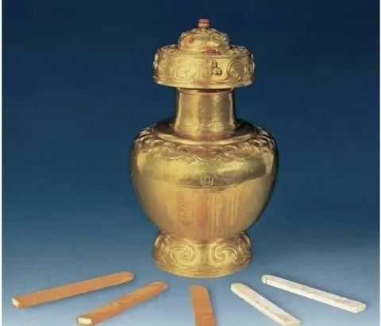
     - <a href="https://www.zhihu.com/people/77-20-63-45">深蓝</a> (<small title="广东">2026-1-12 8:39:6</small>): 这啥啊
     - <a href="https://www.zhihu.com/people/qi-da-ren-27">土方士郎</a> (<small title="回复于 2026-1-12 8:48:8/广东"> ✉️:深蓝</small>): 乾隆搞的活佛转世抽抽乐
     - <a href="https://www.zhihu.com/people/xu-tao-33-80">徐涛</a> (<small title="回复于 2026-1-12 8:53:15/江苏"> ✉️:深蓝</small>): 金瓶掣签［为难］活佛其实是靠抽签决定的。
     - <a href="https://www.zhihu.com/people/wang-wan-da-54">死肥宅</a> (<small title="回复于 2026-1-12 8:55:0/山东"> ✉️:深蓝</small>): 金瓶挚签
     - <a href="https://www.zhihu.com/people/wu-ren-gong-zui-ye-ming-ding">无人共醉也酩酊</a> (<small title="回复于 2026-1-12 8:57:46/陕西"> ✉️:深蓝</small>): 金瓶挚签啊［发呆］
     - <a href="https://www.zhihu.com/people/lavaflow">健胃消食片</a> (<small title="回复于 2026-1-12 8:59:24/浙江"> ✉️:深蓝</small>): 金瓶挚签
     - <a href="https://www.zhihu.com/people/mnbv1705-7-1">梦晓</a> (<small title="回复于 2026-1-12 9:1:18/四川"> ✉️:深蓝</small>): 金瓶，选转世
     - <a href="https://www.zhihu.com/people/xin-shou-cun-shou-sha">苟利国家生死以</a> (<small title="回复于 2026-1-12 9:2:36/广西"> ✉️:深蓝</small>): 金瓶挚签［思考］
     - <a href="https://www.zhihu.com/people/wang-yan-9-4">王彦</a> (<small title="回复于 2026-1-12 9:2:58/海南"> ✉️:深蓝</small>): 金瓶挚签
     - <a href="https://www.zhihu.com/people/liu-sen-90-50">阿森</a> (<small title="回复于 2026-1-12 9:4:22/天津"> ✉️:深蓝</small>): 金瓶挚签
     - <a href="https://www.zhihu.com/people/feis-28">向左看</a> (<small title="回复于 2026-1-12 9:23:2/江苏"> ✉️:深蓝</small>): 金瓶掣签，抽转世灵童的
     - <a href="https://www.zhihu.com/people/89-77-8-24">momo</a> (<small title="回复于 2026-1-12 9:24:21/安徽"> ✉️:深蓝</small>): 金瓶挚签吧
     - <a href="https://www.zhihu.com/people/fu-yao-tai-ling-guang">弗要太灵光</a> (<small title="回复于 2026-1-12 9:25:45/江苏"> ✉️:深蓝</small>): 金瓶掣签
     - <a href="https://www.zhihu.com/people/zhong-jing-ju">Antonio Z</a> (<small title="回复于 2026-1-12 9:25:58/广东"> ✉️:深蓝</small>): 金瓶掣签，阿爷说你是转世活佛你才是［酷］
     - <a href="https://www.zhihu.com/people/papaya-91-15">草台班子打螺丝</a> (<small title="回复于 2026-1-12 9:28:13/天津"> ✉️:深蓝</small>): 像是抽签选活佛转世的金瓯
     - <a href="https://www.zhihu.com/people/77-20-63-45">深蓝</a> (<small title="广东">2026-1-12 9:45:24</small>): 6
     - <a href="https://www.zhihu.com/people/gu-gu-gu-hua-la-la">呱呱呱哗啦啦</a> (<small title="安徽">2026-1-12 11:19:7</small>): 直接废弃少数民族语言来的更实在。
     - <a href="https://www.zhihu.com/people/yin-jie-97-98">wAvse</a> (<small title="回复于 2026-1-12 12:39:58/新疆"> ✉️:土方士郎</small>): 盲盒0.1版本么
     - <a href="https://www.zhihu.com/people/gan-yu-o">君不见o</a> (<small title="广东">2026-1-12 20:6:13</small>): 现在也是这样的吧，新疆那边有才干的人给你调到内地来，放眼皮子底下，内地的能人调过去［吃瓜］
     - <a href="https://www.zhihu.com/people/41-17-98-38-25">momo</a> (<small title="回复于 2026-1-16 21:18:47/山西"> ✉️:徐涛</small>): 乾隆白菜牛逼啊，搞政治就是高
     - <a href="https://www.zhihu.com/people/ye-kong-xing-yun-40">心非木石岂无感</a> (<small title="回复于 2026-1-17 8:42:17/江苏"> ✉️:徐涛</small>): 说是靠抽签决定，但是你抽的人要上报的，我不认同就接着重新抽
     - <a href="https://www.zhihu.com/people/lu-xiang-qing-38-66">小丑把戏丶</a> (<small title="回复于 2026-1-17 23:0:48/山东"> ✉️:深蓝</small>): 金瓶挚签  
 
收集一定范围内出生时间和活佛死亡时间相同的新生儿，然后抽签决定谁是转世灵童（如果中央不同意的话不允许转世［doge］）  
 
活佛，也是持证上岗的（真有活佛证）
     - <a href="https://www.zhihu.com/people/you-you-74-92-55">晒太阳不打伞</a> (<small title="回复于 2026-1-18 7:36:2/陕西"> ✉️:小丑把戏丶</small>): 只有这个IP才说出了持证上岗这个本质
     - <a href="https://www.zhihu.com/people/53-70-28-11-74-96">晴序</a> (<small title="山东">2026-1-19 11:32:58</small>): 乾隆的搞人手段有一手的
     - <a href="https://www.zhihu.com/people/chen-qi-53-91">mo了又mo</a> (<small title="上海">2026-1-20 11:58:40</small>): 有的，懂蒙语懂维语懂朝鲜语的汉族公务员是稀缺项目，每年都招的
     - <a href="https://www.zhihu.com/people/nemo-17-88">Nemo</a> (<small title="回复于 2026-1-20 18:21:15/湖北"> ✉️:呱呱呱哗啦啦</small>): 你直接说全图图了更方便，你要认家说汉语至少要派个董藏语的老师去教不是，但我能说双语你要把我派到山沟里去，你说你要出多少工资
     - <a href="https://www.zhihu.com/people/15016744952">正正的负</a> (<small title="回复于 2026-1-20 19:28:23/陕西"> ✉️:徐涛</small>): 这叫天授
     - <a href="https://www.zhihu.com/people/gu-gu-gu-hua-la-la">呱呱呱哗啦啦</a> (<small title="回复于 2026-1-24 12:48:28/安徽"> ✉️:Nemo</small>): 移村并户这种好事，也要让他们享受
     - <a href="https://www.zhihu.com/people/nemo-17-88">Nemo</a> (<small title="回复于 2026-1-24 14:25:54/湖北"> ✉️:呱呱呱哗啦啦</small>): 呵呵，移村的钱谁出
     - <a href="https://www.zhihu.com/people/fei-shi-jin-sheng-lai-chi">红色黎塞留</a> (<small title="回复于 2026-1-25 7:29:19/广东"> ✉️:土方士郎</small>): 你或者你的手下得会几句经啊。不然，事情弄不好。
     - <a href="https://www.zhihu.com/people/gu-gu-gu-hua-la-la">呱呱呱哗啦啦</a> (<small title="回复于 2026-1-25 12:8:31/安徽"> ✉️:Nemo</small>): 转移支付里出。
     - <a href="https://www.zhihu.com/people/nemo-17-88">Nemo</a> (<small title="回复于 2026-1-25 14:13:12/湖北"> ✉️:呱呱呱哗啦啦</small>): ［赞同］
     - <a href="https://www.zhihu.com/people/qi-yue-si-ri-90">玩去吧</a> (<small title="回复于 2026-1-28 3:8:4/湖北"> ✉️:土方士郎</small>): 这招其实是朱棣搞的，乾隆学的［飙泪笑］
     - <a href="https://www.zhihu.com/people/ye-ru-feng-92">夜如疯</a> (<small title="浙江">2026-2-27 4:46:2</small>): 这是啥玩意
     - <a href="https://www.zhihu.com/people/4-75-89-95">查无此熊</a> (<small title="北京">2026-3-2 0:54:52</small>): 现在也是转世要报备
     - <a href="https://www.zhihu.com/people/vwxkmw">休大军</a> (<small title="回复于 2026-3-16 0:51:44/河北"> ✉️:玩去吧</small>): 想多了，你不会说的是明代吏部抽签决定去哪任职吧，那应该是学的抽签［发呆］得翻一下抽签是谁发明的了
     - <a href="https://www.zhihu.com/people/wo-ye-shi-yizhi-fei-yangliao">托马斯罗西基之冠</a> (<small title="北京">2026-3-26 12:41:11</small>): 去那边呆几年会心脏肥大。内地女性在西藏生的孩子，血氧量只有70%。藏人是高原严选，你明白了吗
146. <a href="https://www.zhihu.com/people/liu-guang-wei-52">CM刘一博</a> (<small title="日本">2026-1-18 9:20:1</small>): 经济不发达的地方女性地位会更高，能信这个的，也不用多说什么了。
     - <a href="https://www.zhihu.com/people/chi-dun-40">钝一</a> (<small title="安徽">2026-1-21 17:30:5</small>): 据此推论：阿富汗、伊朗的经济不发达，美国、日本经济发达，所以阿富汗、伊朗的妇女，比美国、日本妇女的社会地位更高。
147. <a href="https://www.zhihu.com/people/hei-ye-leng-feng">黑夜冷风</a> (<small title="天津">2026-1-20 8:58:25</small>): 又一堆把虚构的文学作品当成现实的人。。。无语
     - <a href="https://www.zhihu.com/people/yang-shi-ming-59">理想国</a> (<small title="天津">2026-1-23 6:16:44</small>): 七八十岁老和尚咋给人灌顶［捂脸］
     - <a href="https://www.zhihu.com/people/tai-2liao">太2了</a> (<small title="辽宁">2026-5-5 13:11:1</small>): 古子文那书，真不是文学作品虚构
148. <a href="https://www.zhihu.com/people/dwfdpg">想学量化的cici</a> (<small title="广东">2026-1-19 9:9:4</small>): 黄教已经不搞双修，我们应该尊重当地宗教习俗，但是应该反对原教旨主义
149. <a href="https://www.zhihu.com/people/lemmy_ding">Jerichobear</a> (<small title="上海">2026-1-16 15:30:35</small>): 能问出这个问题，说明你的境界有待提高。妖魔化宗教信仰，本身就是狭隘和蒙昧的体现
     - <a href="https://www.zhihu.com/people/lemmy_ding">Jerichobear</a> (<small title="上海">2026-1-17 20:27:7</small>): 愿你们这些不尊重别人信仰的人，成群结队过得好
150. <a href="https://www.zhihu.com/people/li-yan-60-61">坤家带戟侍卫</a> (<small title="安徽">2026-7-29 13:40:2</small>): 所以说李连杰是不是食过［打招呼］
151. <a href="https://www.zhihu.com/people/san-sheng-hu-po-se-zhu-97">雾已散声声慢</a> (<small title="江苏">2026-7-27 10:57:16</small>): 省流：被合上超13了
152. <a href="https://www.zhihu.com/people/45-62-31-30-94">45号杠筋</a> (<small title="安徽">2026-7-27 17:15:53</small>): 这个所谓金刚上司有点东西啊，
153. <a href="https://www.zhihu.com/people/zhang-xian-sheng-16-84">花花学院教务处</a> (<small title="黑龙江">2026-7-27 12:24:40</small>): 大姨传奇之灌顶仪式，秋姐独享版。
154. <a href="https://www.zhihu.com/people/zhi-wu-ya-2-27">知无涯</a> (<small title="青海">2026-7-27 19:2:15</small>): 听说佛学门槛很高［捂脸］
155. <a href="https://www.zhihu.com/people/zhai-dddddd">梁朝伟</a> (<small title="山东">2026-7-27 18:9:32</small>): 老东西当年为了超个13真是煞费苦心［捂脸］
156. <a href="https://www.zhihu.com/people/zhang-zi-qian-83">张子谦</a> (<small title="上海">2026-7-27 18:51:7</small>): 离印度越近离谱越远
157. <a href="https://www.zhihu.com/people/zhu-zhu-666-10">沉吟至今</a> (<small title="四川">2026-7-29 8:25:38</small>): 看了，奉劝心理承受差的别看，里面有些图片对于我这种自认为心理承受能力尚可的来说看了都有点想干呕
158. <a href="https://www.zhihu.com/people/58-23-42-75-36">户用名 匿</a> (<small title="江苏">2026-7-29 10:10:18</small>): 想哕，看来我修行不够
159. <a href="https://www.zhihu.com/people/liao-bu-qi-de-san-ge">剩饭终结者</a> (<small title="河南">2026-7-30 15:51:36</small>): 那还说啥了，灭佛就行了
160. <a href="https://www.zhihu.com/people/tom-65-69">Tyrian</a> (<small title="广东">2026-7-31 8:30:47</small>): 时间差不多咯
161. <a href="https://www.zhihu.com/people/zhang-zhong-57-97">悠然</a> (<small title="湖北">2026-7-29 22:37:38</small>): 这个我早就看到了，所以基本上我对藏传没啥好感度［捂脸］，每次有人说洗涤心灵我都嗤之以鼻，顺便给人普及一下藏传历史。但是不得不说藏区得风光那真是一流。
162. <a href="https://www.zhihu.com/people/yun-fei-yang-11-65">有关部门张大爷</a> (<small title="北京">2026-7-30 9:41:21</small>): 原来成佛如此简单，跟事后一支烟是一样的感觉
163. <a href="https://www.zhihu.com/people/lanceleefeng">lance</a> (<small title="河南">2026-7-31 12:4:19</small>): 你们忽略了一点，明妃就不想当明妃吗
 
[［吃瓜］](https://pic1.zhimg.com/v2-db92f653a2ec17ea3ff309d6d56e8507.gif?source=1d2f5c51)
164. <a href="https://www.zhihu.com/people/he-lan-dou-he-lan-dou">荷兰豆荷兰豆</a> (<small title="江苏">2026-7-31 13:12:46</small>): 信密宗的大概率也是被洗脑了 这年头应该没有被强迫的了吧
165. <a href="https://www.zhihu.com/people/97-56-42-30">画漠然</a> (<small title="新加坡">2026-7-30 18:37:32</small>): 卧槽…金轮法王传给郭襄的好像就是无上瑜伽什么的吧😧
166. <a href="https://www.zhihu.com/people/xiao-bai-yi-mei-wu-hui">央掘魔罗·热译师</a> (<small title="辽宁">2026-7-31 13:58:41</small>): 阿宗珠巴，尼玛扎巴，敦珠林巴，秋吉林巴。
167. <a href="https://www.zhihu.com/people/jia-xiao-fei-61-70">丛大林</a> (<small title="河北">2026-7-31 12:5:50</small>): 西藏密宗有很多仪轨及理论都是掺合了西藏本土宗教苯教的一部分理论，西藏佛教其实就是一个佛教与苯教的混血怪胎，当然他们有四个影响力比较大的宗派（宁玛，格鲁，噶举，萨迦）每一个派别都不同的掺合了苯教的理论，苯教这个教派就是类似于萨满教的一个教派。
168. <a href="https://www.zhihu.com/people/jmx-49">jmx</a> (<small title="江苏">2026-7-28 11:35:43</small>): 革命的彻底性，经常会使后来者怀疑革命的必要性
169. <a href="https://www.zhihu.com/people/jim-lock">无沙</a> (<small title="浙江">2026-7-29 16:37:36</small>): 《亮出xxx》这本书看的时候只感觉到 恶心又难受。
170. <a href="https://www.zhihu.com/people/behind_xd">behind xd</a> (<small title="江苏">2026-1-12 10:47:27</small>): 他们明明可以之类强奸的 为什么还要搞出那么多名堂来…
171. <a href="https://www.zhihu.com/people/95-11-55-36-10">狼人</a> (<small title="广西">2026-2-21 18:59:26</small>): 那文这段我看了，就是强奸未成年加谋杀未成年，生理不适的程度
172. <a href="https://www.zhihu.com/people/zhe-cheng-88">哲成</a> (<small title="广东">2026-1-14 0:57:3</small>): 如果这都被删，那么，审核员以及相关方，就真的是禽兽了！
173. <a href="https://www.zhihu.com/people/lie-feng-6-64">烈风</a> (<small title="福建">2026-1-12 9:52:21</small>): 差点以为我打开了逼乎
174. <a href="https://www.zhihu.com/people/zhang-feng-35-75">阿米</a> (<small title="江苏">2026-1-12 9:34:49</small>): 西藏没解放前，真的就是小部分人把大部分藏人当畜生对待
175. <a href="https://www.zhihu.com/people/yun-dan-feng-qing-80-7">清风徐徐</a> (<small title="江苏">2026-1-11 23:55:10</small>): 看到喇嘛服饰打扮就觉得邪邪的
176. <a href="https://www.zhihu.com/people/mei-mei-shuo-wo-bu-yao-tai-chang-29">REN-CY</a> (<small title="上海">2026-1-14 1:24:28</small>): [https://nimrod.gitbooks.io/test/content/di-wu-zhang-guan-ding.html](https://nimrod.gitbooks.io/test/content/di-wu-zhang-guan-ding.html)  
 
  
 
逆天
177. <a href="https://www.zhihu.com/people/zi-lu-36-23">惊蛰</a> (<small title="福建">2026-7-11 7:34:20</small>): 自从了解了古代灭佛运动就对这群家伙没有一点好感
178. <a href="https://www.zhihu.com/people/lawhumorsay">法律贫道</a> (<small title="广东">2026-7-10 23:56:14</small>): 据我观察，信佛一副众生皆醉我独醒，实际上一般都懦弱又虚伪。［捂脸］
179. <a href="https://www.zhihu.com/people/di-diao-yi-dian-dian-22">饺子饺子饺饺子</a> (<small title="四川">2026-1-12 11:10:50</small>): 这不是邪教是什么
180. <a href="https://www.zhihu.com/people/liu-gong-zi-29-45">刘公子</a> (<small title="安徽">2026-1-15 22:50:11</small>): 所以看看今天的加沙，人都快死绝了还都捧着本几千年不变的破书指望他们的神来救呢，别人给他物资都要先感谢神
181. <a href="https://www.zhihu.com/people/zzzz-33-75-84">ZZ就这么活着ZZ</a> (<small title="山东">2026-1-12 10:15:28</small>): 这就跟邪教一样，邪教教义一般就有给教主贡献身体的步骤。
182. <a href="https://www.zhihu.com/people/kundehena-54">kundehena</a> (<small title="河南">2026-1-16 6:12:34</small>): 地狱空荡荡，魔鬼在佛教。
183. <a href="https://www.zhihu.com/people/amoler">amoler</a> (<small title="四川">2026-7-21 14:53:27</small>): 波旬的魔子魔孙，披着佛教徒的外衣进入寺庙
184. <a href="https://www.zhihu.com/people/70-65-95-19">别把秋裤漏出来</a> (<small title="北京">2026-1-13 5:37:7</small>): 我只说我身边的人，念佛的没一个好人，还有的人盘佛珠，不经别人家长同意，把珠子往特别小的娃娃脖子带养她的珠子。这只是随手一件小事。很龌龊的事真的在平台上发不出来。
     - <a href="https://www.zhihu.com/people/xing-yun-de-xiao-yang-ren">幸运的小洋人</a> (<small title="湖北">2026-1-13 12:15:33</small>): 宗教几乎没有无害的
     - <a href="https://www.zhihu.com/people/15-86-97-11-22">普通幻想家</a> (<small title="回复于 2026-1-20 17:47:27/河南"> ✉️:幸运的小洋人</small>): 是这回事
185. <a href="https://www.zhihu.com/people/2-23-57-72">知乎用户Ot8glZ</a> (<small title="辽宁">2026-1-12 11:28:48</small>): 为了cb还整挺多花活的
     - <a href="https://www.zhihu.com/people/2-23-57-72">知乎用户Ot8glZ</a> (<small title="回复于 2026-1-25 1:57:15/广西"> ✉️:子游</small>): 吃菌子？还是舔那种天然的致幻剂？［思考］
     - <a href="https://www.zhihu.com/people/shao-weitao-36">子游</a> (<small title="广东">2026-1-21 7:32:51</small>): 也不全是，所有的宗教为了见到神明都喜欢整些花火，有些是喜欢通过毒品或其他致幻剂达到的
186. <a href="https://www.zhihu.com/people/13375260321">momo</a> (<small title="江苏">2026-1-12 11:20:30</small>): 贼秃们玩得倒是挺花
     - <a href="https://www.zhihu.com/people/ye-ming-40-97">椰明</a> (<small title="广东">2026-1-18 6:41:7</small>): 不要乱说，影响名族团结［思考］

=[评论](./attachments/comments.json)

