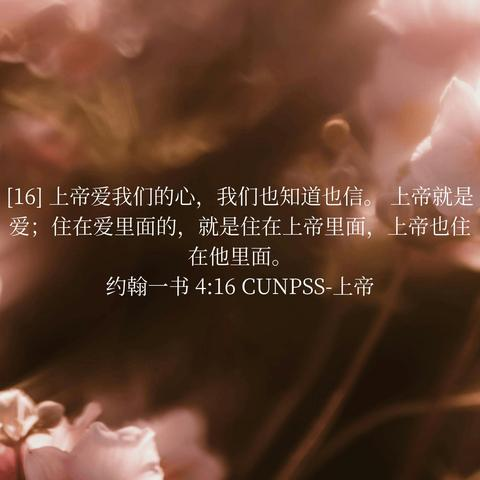

[toc]

# 问题

提问者：**<a href="https://www.zhihu.com/people/8275157506">永州工贸厕改宿舍</a>**
提问时间: 2026-8-10 11:3:7
总回答数: 81
总访问量: 245629

我去教堂考察过，牧师在台上讲信仰的道理，为什么能让那些大字不识的老头老太太听的津津有味？

# 回答

回答者： **<a href="https://www.zhihu.com/people/ma-xiu-">马修</a>**
回答时间: 2026-9-1 11:44:5
点赞总数: 1591
评论总数: 86
收藏总数: 317
喜欢总数：271

你都已经去教堂考察了，回来以后居然还需要问这个。

那你考察了个什么东西？

去菜市场考察一圈，回来问为什么卖鱼的身上有腥味？

人家牧师至少知道下面坐的是张大爷、李阿姨，是一个年轻时候下过矿、老伴死了七年、儿子半年没回家、膝盖一到阴天下雨就疼的人。

你知道什么？

牧师跟一个老太太说，上帝知道你的痛苦。他说一个人有没有钱，识不识字，年轻时候漂不漂亮，在神面前都没有那么要紧。

老太太听懂了。

她这一辈子被人叫过乡毋宁，叫过农村妇女，叫过老太婆。去医院不会用自助机，后面的小年轻嫌她慢，坐地铁掏半天手机，旁边人觉得她碍事，孩子跟她解释个东西，解释两遍以后开始不耐烦。然后她到了教堂，一个穿得整齐体面的人告诉她，你这个人本身有价值，你的灵魂跟别人的灵魂一个克重。

你说她为什么爱听？

我告诉你，我特么都有点爱听。

很多人自诩接受过现代教育，嘴上说人人平等，结果在心里学历一档，收入一档，长相一档，职业一档。再高级一点还可以看看你喝什么酒，开什么车，朋友圈照片在哪个国家拍的。

人类费了这么大劲从猴进化成人，怎么就特么没把你这种丈育淘汰了呢？

一个老太太坐进去，牧师不需要她证明自己识不识字，才决定今天要不要跟她讲灵魂。

他先承认她是个人。

老太太丈夫死了，她晚上一个人睡觉会害怕。你可以把这个叫死亡意识，也可以叫依恋结构断裂。牧师可能就跟她说，别怕，他去了一个好地方，以后还能见。从知识上讲这句话我也没法证明，但从人的角度讲，我很容易理解她为什么愿意听。

我是不信教的，神、天堂、轮回这些东西，我确实也证明不了。不过看完你这个问题，我忽然对宗教增加了一点好感，主要是你提醒了我一个以前没有认真考虑过的问题：

如果真有地狱，某些人确实可以适当安排一下。

倒不用永世受苦，我也看不得这个，太残忍了。就支个油锅，先把那种一进门就说老头老太太大字不识的大聪明扔进去炸两圈。捞出来以后问问感受，如果开始理解人人平等了，就还能勉强当你是个人。

所以，你有没有想过，牧师其实掌握了一样你好像从来没有掌握的东西？

在我看来，他们只是知道自己面前坐着的是一堆大活人。

  

原文地址：[(马修)我去教堂考察过，牧师在台上讲信仰的道理，为什么能让那些大字不识的老头老太太听的津津有味？](https://www.zhihu.com/question/2070102880485381886/answer/2078085722876147397) 

# 评论

1. <a href="https://www.zhihu.com/people/cui-peng-zhi">崔鹏志</a> (<small title="黑龙江">2026-9-1 16:34:7</small>): 我此生最接近归信的时刻，就是我刚开始北漂的那几年，偌大的北京城只有教堂里那些人把我当个人看。
   - <a href="https://www.zhihu.com/people/yun-zheng-35">大梁每日观察</a> (<small title="河南">2026-9-1 17:10:33</small>): 放心吧，过几年你就肯定归信了。
   - <a href="https://www.zhihu.com/people/cui-peng-zhi">崔鹏志</a> (<small title="回复于 2026-9-1 17:21:42/黑龙江"> ✉️:大梁每日观察</small>): 当年没信，现在也不会信，过几年什么样，现在不好说。
   - <a href="https://www.zhihu.com/people/guan-zhu-wen-yi-pian">特有爱一大叔</a> (<small title="北京">2026-9-1 20:14:22</small>): “你们祈求，就给你们；寻找，就寻见；叩门，就给你们开门。 因为凡祈求的，就得着；寻找的，就寻见；叩门的，就给他开门。”  
 
上面这句话，必实现。  
 
记住，一定是“必”这个字。因为那厚厚一本书里，没有一句是似是而非，没有一句谎言，每一句都是确定的，因为神与你立下的约，是契约。只有人会悔约，神永远不会。这就是公平，只有在最高层面上的规定才是标准，才能是公平、公义。人立下的从来不可能是标准，没有最高的制约，立下的都是随时可以被改变的，签字是画押，不是契约。  
 
希望大家不要忘记那句话，不论你是谁，在何时何处，你要叩门，祂必开门，因为祂在等祂所造的孩子回家，那里本就是我们的家，回家只有一条路，没有中间道路。
   - <a href="https://www.zhihu.com/people/YohanTung">YohanTung</a> (<small title="日本">2026-9-2 3:51:59</small>): ［赞］
   - <a href="https://www.zhihu.com/people/jin-wu-dai-24">湫雨</a> (<small title="回复于 2026-9-2 8:14:23/江苏"> ✉️:特有爱一大叔</small>): 现在教堂不让进了，经常关门，无论是新教还是天主教的教堂
   - <a href="https://www.zhihu.com/people/bai-hua-liao-luan-45-93">历史的尘埃</a> (<small title="回复于 2026-9-2 8:24:27/北京"> ✉️:湫雨</small>): 是他们不想开门吗？
   - <a href="https://www.zhihu.com/people/jin-wu-dai-24">湫雨</a> (<small title="回复于 2026-9-2 8:29:39/江苏"> ✉️:历史的尘埃</small>): ［酷］
2. <a href="https://www.zhihu.com/people/xing-zi-66-85">杏子</a> (<small title="江苏">2026-9-1 12:32:25</small>): 写得真好，自我以上人人平等，自我以下阶级分明的人真的太多了
3. <a href="https://www.zhihu.com/people/swdfdcfg">仰观者</a> (<small title="陕西">2026-9-1 14:53:7</small>): 把人当人在中国太稀缺了
4. <a href="https://www.zhihu.com/people/pian-yi-zhi-jiu-31">片翼之鹫</a> (<small title="浙江">2026-9-1 16:48:16</small>): 我家旁边就有个基督教堂，我都想去听听了，无他，现实生活太痛苦了，我想寻求一些心灵上的平静
   - <a href="https://www.zhihu.com/people/c-nancy">C Nancy</a> (<small title="北京">2026-9-1 20:29:33</small>): 想去就去。没事儿。那地方能让人心静。
   - <a href="https://www.zhihu.com/people/qian-liang-47-60-23">实名用户</a> (<small title="浙江">2026-9-1 21:17:19</small>): 去呗，肯定欢迎你的［赞同］
5. <a href="https://www.zhihu.com/people/qiu-huan-yang">邱涣阳</a> (<small title="上海">2026-9-1 18:51:55</small>): 这个角度牛逼，在全民社达的今天，教会提供了最基本的人文关怀。
6. <a href="https://www.zhihu.com/people/tang-yu-46-80">顾义</a> (<small title="上海">2026-9-1 19:28:7</small>): 所以傲慢才是七宗罪第一。
   - <a href="https://www.zhihu.com/people/zhi-hu-bu-dong-a">知乎不懂啊</a> (<small title="北京">2026-9-2 8:36:57</small>): ［打招呼］虽然但是，七宗罪的傲慢好像是指不敬上帝
   - <a href="https://www.zhihu.com/people/hong-hua-hui-chen-jia-luo">358团楚云飞</a> (<small title="河北">2026-9-1 20:25:40</small>): 弱小和无知不是生存的障碍［飙泪笑］
7. <a href="https://www.zhihu.com/people/gulide">尤利乌斯</a> (<small title="北京">2026-9-1 18:11:11</small>): 初一的时候分小组，我自以为知道很多，轻狂的对组内同学说了句没文化，同学直接说多知道就有文化了，看不起人就不要用文化这个词。从那以后，我虽然心里会泛起轻狂，绝不敢再表露出来，如果按我的视角反向看我自己，我也是没文化的一员。
8. <a href="https://www.zhihu.com/people/yan-yi-39-47">走鸡酱</a> (<small title="北京">2026-9-1 17:38:11</small>): 我发现个神奇的事，抖音上有那种火葬场的名单视频，备注信教的普遍非常长寿（85-100岁都有）不知道是因为长寿才去信，还是信了才长寿……真的很神奇。。
   - <a href="https://www.zhihu.com/people/zuo-wang-tian-78">坐望天</a> (<small title="北京">2026-9-1 18:34:3</small>): 有信仰后心理上会更健康
   - <a href="https://www.zhihu.com/people/80-53-13-46-57">小易</a> (<small title="江苏">2026-9-1 19:46:31</small>): 心情也不用说什么愉悦吧，但凡能平静点，都能多活好多岁。
   - <a href="https://www.zhihu.com/people/piao-ruo-mo-shang-chen-10">飘若陌上尘</a> (<small title="河南">2026-9-1 20:45:12</small>): 信教多少能让心情安稳一点。心态健康是非常重要的，是能影响到肉体健康的，但国人很少有人知道这点。
   - <a href="https://www.zhihu.com/people/rao-ling-19">荛岭</a> (<small title="回复于 2026-9-1 21:23:40/宁夏"> ✉️:坐望天</small>): 确实，想象自己不比别人低，也有东西会无条件爱自己有益心理健康
   - <a href="https://www.zhihu.com/people/momo-17-46-1-8">momo</a> (<small title="广东">2026-9-1 22:35:2</small>): 心理精神和肉体是相关联的
   - <a href="https://www.zhihu.com/people/zngj6r">机智的藏獒</a> (<small title="江苏">2026-9-2 8:3:54</small>): 不是信教了导致人寿命长，受到上帝庇护。而是所有的宗教会给生活困苦的人有精神上的慰藉，心里健康也是健康的重要环节之一。  
 
现代人心里不健康的太多了，生活压力大、熬夜。导致交感神经有问题，又会诱发失眠没食欲等等亚健康状态。
9. <a href="https://www.zhihu.com/people/yun-zheng-35">大梁每日观察</a> (<small title="河南">2026-9-1 17:10:8</small>): 平等。我只在基督教精神里见到过。
   - <a href="https://www.zhihu.com/people/bu-wen-bu-wen-55-27">摸着旧社会过河</a> (<small title="江苏">2026-9-1 21:32:7</small>): 舍身饲虎、割肉喂鹰算不算平等精神
   - <a href="https://www.zhihu.com/people/he-zhou-24">空格</a> (<small title="回复于 2026-9-1 21:48:51/湖南"> ✉️:摸着旧社会过河</small>): 不算，这仅仅是施舍，从一个更高维度。
   - <a href="https://www.zhihu.com/people/lin-fei-52">林飞</a> (<small title="回复于 2026-9-2 8:9:46/新西兰"> ✉️:摸着旧社会过河</small>): 比二十四孝更抽象。。。
10. <a href="https://www.zhihu.com/people/liu-neng-6">刘能</a> (<small title="贵州">2026-9-1 19:41:36</small>): 这个地方的天然具有反宗教的政治正确，因此什么阿猫阿狗都可以批判两句，彰显自己的人间清醒
11. <a href="https://www.zhihu.com/people/64-74-27-7">康宁医院王大锤</a> (<small title="河南">2026-9-1 17:28:23</small>): 我草！酣畅淋漓！舒坦！
12. <a href="https://www.zhihu.com/people/zeng-mao-san">曾毛三</a> (<small title="广东">2026-9-1 17:4:32</small>): 把别人当成和自己一样的人，现代社会中有这个技能的越来越少了。
13. <a href="https://www.zhihu.com/people/zhui-feng-shao-nian-7-3-17">追风少年</a> (<small title="四川">2026-9-1 15:44:13</small>): 神爱世人
14. <a href="https://www.zhihu.com/people/mao-shao-jiang-shen-yong-wu-shuang">东东</a> (<small title="广西">2026-9-1 16:54:34</small>): ［感谢］ 每个人都是值得被尊重的
15. <a href="https://www.zhihu.com/people/lu-en-jun-nan">我寻思也没啥</a> (<small title="安徽">2026-9-1 22:44:33</small>): 唯物主义解决不了死后的问题
16. <a href="https://www.zhihu.com/people/guo-wang-ji-shi-xu-zhang">过往即是序章</a> (<small title="北京">2026-9-1 20:58:39</small>): 教堂承担了以前宗祠的社会性功能
17. <a href="https://www.zhihu.com/people/guan-zhu-wen-yi-pian">特有爱一大叔</a> (<small title="北京">2026-9-1 20:12:26</small>): “你们祈求，就给你们；寻找，就寻见；叩门，就给你们开门。 因为凡祈求的，就得着；寻找的，就寻见；叩门的，就给他开门。”  
 
上面这句话，必实现。  
 
记住，一定是“必”这个字。因为那厚厚一本书里，没有一句是似是而非，没有一句谎言，每一句都是确定的，因为神与你立下的约，是契约。只有人会悔约，神永远不会。这就是公平，只有在最高层面上的规定才是标准，才能是公平、公义。人立下的从来不可能是标准，没有最高的制约，立下的都是随时可以被改变的，签字是画押，不是契约。  
 
希望大家不要忘记那句话，不论你是谁，在何时何处，你要叩门，祂必开门，因为祂在等祂所造的孩子回家，那里本就是我们的家，回家只有一条路，没有中间道路。
18. <a href="https://www.zhihu.com/people/xedfwzy">披萨</a> (<small title="山西">2026-9-1 13:19:23</small>): 感受到了圣光
19. <a href="https://www.zhihu.com/people/550b7q">知乎用户550B7Q</a> (<small title="云南">2026-9-1 12:30:33</small>): 刚才在想，是否无法被证实可以到达或者无法到达的彼岸、来世才是好的。
20. <a href="https://www.zhihu.com/people/zheng-xiao-hang">郑晓航</a> (<small title="上海">2026-9-1 18:45:53</small>): 刚看完拳头一紧觉得真有道理，然后想题主一定在问题描述里使用了非常强烈的歧视性描述。  
 
点进去一看并没有。问题下其他回答也都站在中性的角度在回答，只有本答主被标题里的”不识字的老太太”给激惹到认为这是个贬损。  
 
  
 
有没有可能不识字就只是单纯只还没有识字，没有贬损的意思呢。。。  
 
  
 
当然了本回答本身内容读起来节奏很舒畅的，只是题主被竖起来当靶子有点冤。
    - **马修** (<small title="河北">2026-9-1 21:54:7</small>): “大字不识的老头老太太”和“不识字的老人”的区别，我相信还是很容易能够分辨的。  
 
正如医生会对患癌病人讲“确实是癌症，但不用怕，我们全力治疗”，而不是“老头/老太你知道吗你活不了几天了”。
21. <a href="https://www.zhihu.com/people/hammer-stone">下水道的陶渊明</a> (<small title="四川">2026-9-1 16:7:19</small>): 西方平等思想站在人类文明的角度是个绝对的异端，根在基督教。
22. <a href="https://www.zhihu.com/people/3-91-2-81-35">流浪小王子</a> (<small title="广东">2026-9-1 13:18:56</small>): 你们真考察过吗？和尚 道士其实是普通人，没魔法［飙泪笑］  
 
  
 
教堂牧师也差不多，老头老太冬天买不起厚衣服但交给教堂的救赎金 天堂门票啥的一分不能少。。
    - **马修** (<small title="河北">2026-9-1 16:5:47</small>): 你真考察过吗？  
 
那没魔法但是你吃不上饭真有人管。  
 
十一税咱这儿真有几个人掏啊？  
 
还一分也不能少，你凭想象力搁这儿回个啥呢？
    - <a href="https://www.zhihu.com/people/68-17-85-58-61">一花一世界</a> (<small title="湖南">2026-9-1 16:40:50</small>): 说明你只去了庙里面。教堂吃不起饭，买不起厚衣服是真的有人管的。
    - <a href="https://www.zhihu.com/people/yi-zhi-song-shu-33-44">一只松鼠</a> (<small title="江苏">2026-9-1 17:4:11</small>): 答主刚说完就有你这种人来对号入座了［飙泪笑］  
 
救赎金是什么，天堂门票是什么，虽然我不懂但我要踩一脚是吧
    - <a href="https://www.zhihu.com/people/arno-97-43">圣但尼提灯</a> (<small title="湖北">2026-9-1 17:14:29</small>): 醒醒，老头老太冬天没厚衣服人家真会在讲道的时候号召大家募捐或者共享的，我都给教堂捐过衣服，还有救赎金都来了，你当文艺复兴卖赎罪券呢？能不能搞点现代的东西［尴尬］
    - <a href="https://www.zhihu.com/people/3-91-2-81-35">流浪小王子</a> (<small title="回复于 2026-9-1 17:32:34/广东"> ✉️:马修</small>): 我身边的例子，不掏钱就被针对［飙泪笑］
    - <a href="https://www.zhihu.com/people/ming-zi-wu-suo-wei-81">名字无所谓</a> (<small title="陕西">2026-9-1 17:40:25</small>): 建议去吃官家的饺子
    - <a href="https://www.zhihu.com/people/e-e-e-e-85-70-89">争斤论两</a> (<small title="回复于 2026-9-1 17:48:39/山西"> ✉️:圣但尼提灯</small>): 直接送人反而招白眼还不如有个中间商
    - <a href="https://www.zhihu.com/people/da-qin-34-39">达亲</a> (<small title="广东">2026-9-1 18:2:40</small>): 能说出救赎金就说明你还不够了解［感谢］
    - <a href="https://www.zhihu.com/people/wu-si-can-xuan-16">悟死参玄</a> (<small title="黑龙江">2026-9-1 18:9:33</small>): 招笑啊
    - <a href="https://www.zhihu.com/people/24-64-58-26-57">小刺客</a> (<small title="回复于 2026-9-1 19:53:24/浙江"> ✉️:流浪小王子</small>): 我本人就没给教堂掏钱，时不时去教堂坐会儿，为什么我没被针对。同样是身边统计法，怎么我们俩得出的结果就不一样？  
 
  
 
是不是因为你身边的人，他们身边有个你，近墨者黑啊［飙泪笑］
    - <a href="https://www.zhihu.com/people/Aquawtx">Anxeon</a> (<small title="广东">2026-9-1 19:56:33</small>): 以己度人这一块
    - <a href="https://www.zhihu.com/people/hou-er-3-3">小波</a> (<small title="回复于 2026-9-1 22:38:48/广东"> ✉️:流浪小王子</small>): 说说具体怎么针对的，别是因为没有受到特殊对待，就被刺激到觉得被针对了吧［为难］。这类我是见过的，还不止在教堂呢
23. <a href="https://www.zhihu.com/people/iaawo-di">理想</a> (<small title="新加坡">2026-9-1 17:21:45</small>): 你这个护教的方式我听过几百遍了，但是你这种护教的方式就又产生了一个悖论  
 
  
 
越是上帝所不爱的人，越会对上帝产生狂热的信仰
    - <a href="https://www.zhihu.com/people/jia-li-ao-mh370">无名氏</a> (<small title="江苏">2026-9-1 17:36:19</small>): 自己这辈子受苦是因为上辈子的业果/原罪，然后下辈子又可能因为这辈子积攒的苦难前去什么更好的所在［酷］，也不赖吧只能说，不然你纠结自己为什么这么苦也纠结不出结果
    - <a href="https://www.zhihu.com/people/paulshaw">NFC-funs</a> (<small title="广东">2026-9-1 18:18:15</small>): 你怎么知道上帝爱不爱一个人呢？上帝爱世人［飙泪笑］
    - <a href="https://www.zhihu.com/people/paulshaw">NFC-funs</a> (<small title="回复于 2026-9-1 18:20:6/广东"> ✉️:无名氏</small>): 问题是基督教里面没有上辈子也没有下辈子，搁这儿虚空打靶［飙泪笑］
    - <a href="https://www.zhihu.com/people/jia-li-ao-mh370">无名氏</a> (<small title="回复于 2026-9-1 18:56:38/江苏"> ✉️:NFC-funs</small>): 只谈宗教啊，原罪和天堂不都差不多，不过我国基本还是信佛的多
    - <a href="https://www.zhihu.com/people/paulshaw">NFC-funs</a> (<small title="回复于 2026-9-1 23:36:43/广东"> ✉️:无名氏</small>): 所以必须套进佛教的语境才能理解？［大笑］
    - <a href="https://www.zhihu.com/people/jia-li-ao-mh370">无名氏</a> (<small title="回复于 2026-9-1 23:44:23/江苏"> ✉️:NFC-funs</small>): 不然套印度教？你的受难说明你在苦修，一边忍耐这种情况一边祈祷就可以去拿到苦修之力暴打因陀罗？这些不都是一个道理，烂活是为了好死，许多人找不到好活不就只能想要好死了。
24. <a href="https://www.zhihu.com/people/aocdys">知乎用户AOCDYs</a> (<small title="江苏">2026-9-1 18:16:2</small>): 纯唯物的人太少了
    - <a href="https://www.zhihu.com/people/jackdaw-51-85">jackdaw</a> (<small title="天津">2026-9-1 19:28:28</small>): 绝大部分是庸俗的偶像崇拜
25. <a href="https://www.zhihu.com/people/ni-dong-duo">简而言之</a> (<small title="广东">2026-9-2 9:18:49</small>): 其实胡适在容忍与自由里就讨论过这个问题。［微笑］。
26. <a href="https://www.zhihu.com/people/deng-zi-qiang">frog酋长</a> (<small title="新加坡">2026-9-1 22:3:4</small>): 说得真好
27. <a href="https://www.zhihu.com/people/guai-qi-za-huo-pu">怪奇杂货铺</a> (<small title="北京">2026-9-2 8:16:59</small>): 原来神爱世人 是教导人一定要爱自己
28. <a href="https://www.zhihu.com/people/hong-hua-hui-chen-jia-luo">358团楚云飞</a> (<small title="河北">2026-9-1 20:25:2</small>): 神性是人性的升华，一个人如果没有了人性，也就失去了真善美和爱别人的能力。
29. <a href="https://www.zhihu.com/people/ying-xiong-zhong-58">雾凇</a> (<small title="山东">2026-9-2 0:54:54</small>): 宗教最基本的职能：解决现实问题，提供心理慰藉
30. <a href="https://www.zhihu.com/people/jian-jian-feng-14-12">塔兰图拉毒蛛</a> (<small title="四川">2026-9-1 21:15:14</small>): 为什么人人平等了就不能说大字不识？
    - **马修** (<small title="河北">2026-9-1 21:47:35</small>): 因为这个词是带有严重贬义色彩意味的词汇。
31. <a href="https://www.zhihu.com/people/bai-dong-liang">卡卡庇护者</a> (<small title="辽宁">2026-9-2 9:19:29</small>): 用什么油？菜籽油还是大豆油？炸之前裹面糊吗？炸几遍？油温多少？
32. <a href="https://www.zhihu.com/people/pan-yi-yang-43">冲动的大潘</a> (<small title="江苏">2026-9-1 21:40:18</small>): 把人当人看［思考］
33. <a href="https://www.zhihu.com/people/steven-yu-97-55">Steven Yu</a> (<small title="中国香港">2026-9-1 17:54:51</small>): 其实对有些人，区分教义与教会，是有难度的。
34. <a href="https://www.zhihu.com/people/ding-feng-7-79">Elysian</a> (<small title="浙江">2026-9-1 20:30:32</small>): 看到“乡勿宁”，突然有种吴语方言的即视感，让我忍不住看了一下IP［害羞］
35. <a href="https://www.zhihu.com/people/mei-nuo-qia">卡佛里亚</a> (<small title="浙江">2026-9-1 18:54:21</small>): 我痛苦的时候确实想过去教堂
36. <a href="https://www.zhihu.com/people/bai-yu-69-6">匿名知友</a> (<small title="上海">2026-9-1 18:58:45</small>): 骂的漂亮［赞］［赞］［赞］
37. <a href="https://www.zhihu.com/people/shi-se-49">夜雨</a> (<small title="湖南">2026-9-2 3:37:9</small>): 所以唯物主义有时候是很恐怖的
38. <a href="https://www.zhihu.com/people/19-70-89-97">春晓的梦想</a> (<small title="上海">2026-9-2 9:27:2</small>): 其实我很想让我父母去听下的，可惜家附近没有教堂
39. <a href="https://www.zhihu.com/people/dao-tu-og">肉肉他爸</a> (<small title="浙江">2026-9-2 9:25:39</small>): 勇哥你好考察法是这样的，去过一圈啥调研没做，开始我觉得。他甚至不愿意随便找两个大爷大妈聊两句，后面还有教友互帮互助这些生态更是摸不到边。
40. <a href="https://www.zhihu.com/people/ying-du-hui-lang">影度回廊</a> (<small title="北京">2026-9-1 23:7:21</small>): 国内这个生态位本来是另一个东西的，它自己放弃了
41. <a href="https://www.zhihu.com/people/cheng-zhan-17">大她者的凝视</a> (<small title="安徽">2026-9-1 21:25:49</small>): 人道主义关怀给足了
42. <a href="https://www.zhihu.com/people/dan-tui-ren-78">直接变成光</a> (<small title="重庆">2026-9-1 22:41:17</small>): 
43. <a href="https://www.zhihu.com/people/xiao-xie-88-85-37">小叶</a> (<small title="北京">2026-9-1 20:54:54</small>): 大部分人嘴上说着平等, 但一方面认为地位高的理所应当,惹不起还一脸谄媚; 另一方面又对不如他们的嗤之以鼻, 甚至放开欺辱, 他们不会理解什么是平等的, 他们也不理解什么是爱;
 
他们认为的爱其实是繁殖
44. <a href="https://www.zhihu.com/people/gou-zi-de-chun-tian-78">狗子的春天</a> (<small title="河南">2026-9-2 1:4:3</small>): 这他妈才是以人为本
45. <a href="https://www.zhihu.com/people/pink-blu">pink blu</a> (<small title="北京">2026-9-1 18:3:19</small>): 我国虽然没有黑人，但是歧视这种事情我们太擅长了

=[评论](./attachments/comments.json)

