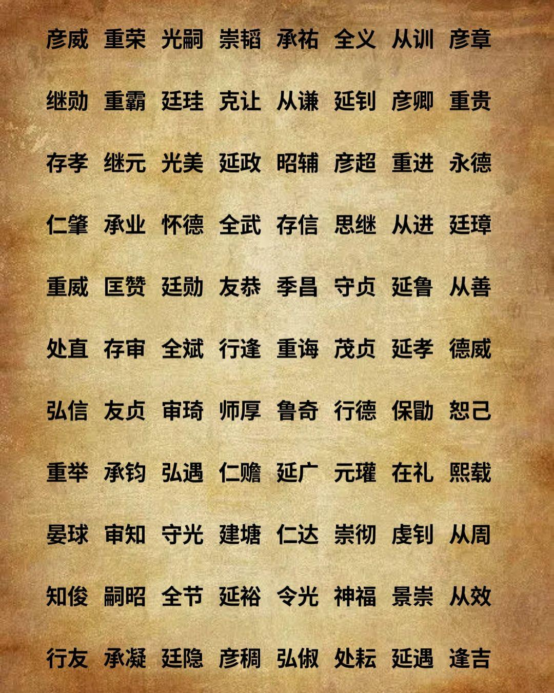
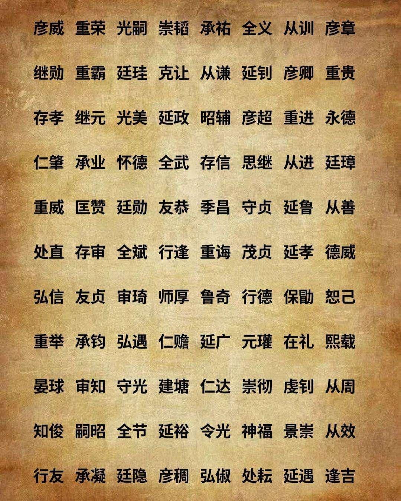
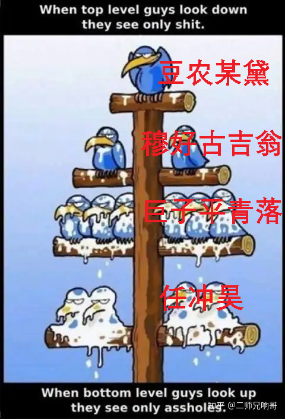
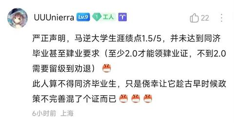

[toc]

# 问题

提问者：**<a href="https://www.zhihu.com/people/zhi-tian-san-lang-ji-fa-shi">伽蓝萨关玛法</a>**
提问时间: 2022-4-18 23:50:56
总回答数: 904
总访问量: 53866763

# 回答

回答者： **<a href="https://www.zhihu.com/people/shui-qian-xiao-xi">马前卒official</a>**
回答时间: 2026-8-20 15:23:33
点赞总数: 80
评论总数: 12
收藏总数: 17
喜欢总数：2

大多数回答都在玩梗，我来认真回答——中国的50后到80初，就采取了图中的晚唐五代取名法，只是因为文化背景变化，你没认出来。

先重发一下问题包含的图。

可以看到，大多数名字是A→B结构。两个字尽量不取并列关系，而是形成祈使式逻辑。

A主要是单字动词，做谓语，比如说光（大）、永（远）、崇（尚）。

B是形容词或名词，做状语或者宾语，又分成两种情况。

一种是概括主流意识形态的某个方面。比如说孝（顺）、德（行）、节（操）。

另一种是对家族事业的期盼，比如说贵（重）、吉（利）、霸（权）。

很巧，50-70年代的中国男性，也流行类似的AB结构。前面是动词，后面是概括性的目标。

卫红、学军、向东，是第一种类型，动词加主流意识形态的简化版，对应全节、从谦、存信。

永强、来福、兆丰，是第二种类型，动词加上（小）家庭对生活的祝愿，对应光嗣、重贵、德威。

结构几乎一致，区别只是文化背景。

类似的民间习俗，背后确实有类似的社会基础。

首先，唐末的军人、百姓甚至是士大夫，都要解决一个新问题，就是在统一的儒家意识形态背景下，如何起好一个双字名？

早期儒家有“二名非礼”的说法，最极端的儒家原教旨皇帝王莽，甚至下令全国的新名字都只用一个字。这是因为早期儒家重视宗族，默认所有人都在宗族秩序下生活。

宗族内部有避讳原则，祖先的名字占了太多的字，就会给后代制造很多麻烦，产生很多无意的“非礼”，所以一个字优于两个字。

宗族内部有天然的排行，不用名字也能彼此区分。首先搞清楚对方的辈分，然后人少就是伯仲叔季，人多了可以直接称数字，比如说刘十八，张七，都可以。所以不需要名字本身做太多的区分。

宗族之间有明显的贵贱，王族或者贵族交友广泛，可以用职务、封地或者是祖宅所在地称呼。自己取一个名号，别人也会刻意记住。至于普通人的小宗族，在早期儒家社会，几乎被固定在某个村落，如果不是服役或者是犯罪，农民一辈子也没有机会离开方圆几十里的土地，也就很难弄错。

所以，无论你属于哪个宗族，都不是非得有一个独一无二的名字，甚至日常生活可以不用名字。“指名道姓”被认为有攻击性，就是因为平时不常用。在这个背景下，王莽推行单名制虽然没有严格落实，但得到了普遍认同。打开汉末的三国演义，凡是真实人物，压倒多数是单名。如果不是少数民族或者虚构人物，想找个二字名都很难。

汉朝解体后，佛教和道教冲击了儒家垄断地位，少数民族姓氏融入中文体系，单名限制没那么严格了。但另一个现象出现了，就是世家-寒门-百姓-贱民的新等级制。这些等级之间，没有先秦宗法和国家（应该理解为“国+家”）制度那么严密，也有一些流动性。但新的世家会用儒家学术去论证等级的合理性，认为家族传承决定了才能，进而决定人的文化圈。

所以，从魏晋到唐朝中前期，总的趋势是世家占据大多数关键职位，也垄断了文化定义权，完全不认为普通人和自己属于同一种文化。世家子弟拜佛学道，在儒法道佛之间取一些飘逸的二字名，比如王羲之、王僧辩、房玄龄。普通人乃至中下层地主，还停留在汉朝乃至先秦的底层文化，只用简单的字区分彼此。

这阶段普通人如果是单字名，往往是王保，张宗，许胜这种简单的正面词。如果是双字名，经常是丑奴、阿欢、苟儿这种简单形象的字，根本不考虑深层寓意。普通人的名字和主流文化完全脱钩，也就不存在起名的问题。

世家垄断管理技术，也垄断文化定义权，核心原因是文化载体稀缺。所谓“遗子黄金满籯，不如一经”，意思是“经”的竹简很重，复制文字很麻烦，一套精准无误且带注解的经义，是进入上流社会的敲门砖，比金砖更可靠

在造纸术和雕版印刷先后出现之后，记录和复制信息的成本快速下降，世家制造的文化割裂现象逐渐动摇，从皇帝到平民都不喜欢这个封闭集团，只是限于历史惯性没办法。从魏晋时代到隋唐，先后四个事件冲击了世家的地位。

首先是侯景下江南，清理南方老世族。

其次是隋唐开科举，在程序上引进更多的中等阶层。

第三是唐朝高层内斗，扶植新力量。比如武则天要当女皇帝，引入了更多的寒门士大夫。

第四就是黄巢杀遍天下。士族的乡土军事力量已经衰落，被砍掉了最后的骨干。

到了唐末后黄巢时代，士族终于失去了文化主导权，中下层读书人看到了上升空间。同时，大型宗族解体，事实上的奴籍大幅度减少，普通人和以往不读书的军人也开始参与主流文化。

宗族解体，所以单字名不再适用。在一个更大的社交圈内，普通人也需要双字名，清晰地标注身份。

士族灭亡，所以文化扩散，普通人也希望尽快加入主流文化圈，至少尽快给自己挂上文化标签。

但因为经过了几百年的士族统治时代，普通人能接触到的文化资源有限，往往是请最基层的寒门书生起名，或者根据自己听说的粗浅道理，取一个意识形态上偏正面的名字。所以，从唐朝中后期开始，到宋朝前期，最主流的名字，是动词+意识形态目标的双字名。

50-70年代的中国，也刚刚经历了一次文化扩散。1000年前唐宋时期解放的寒门地主，在20世纪的下场，类似于当年士族。文化定义权进一步下移。同时，20世纪的平民抛弃传统熟人社会，进入城市和工厂，需要一个拿得出手的正式名字，证明自己是主流文化圈的一部分。

农民的思考方式彼此相似，所以，20世纪的农民和五代时期的农民/士兵一样，找小学老师帮忙，或者在街头的宣传画上取字，写出了类似结构的名字。所以我说五代的名字不奇特，只是文化底色和今天不同。

到了80年代，新一代父母往往还是只有小学文化，保持了70年代的取名思路。与此同时，社会革命文化退潮，儒家文化以畸形的方式短暂复兴。1980年到1995年，农村短暂出现了一批“老名字”，不仅和五代时期的名字结构相似，连用字也相似。

回到最初的那张图。其中的“从谦”、“承业”、“全斌”、“在礼”，放到1985年的农村和县城郊区，依然是常用取名组合。

  

原文地址：[(马前卒official)为什么很少有人用这种名字取名了？](https://www.zhihu.com/question/528743725/answer/2073792300837233927) 

# 评论

1. <a href="https://www.zhihu.com/people/ben-ni-17-55">本尼</a> (<small title="山西">2026-8-20 15:26:39</small>): 督工，什么时候恢复节目。
2. <a href="https://www.zhihu.com/people/song-peng-fei-43">宋鹏飞</a> (<small title="山东">2026-8-20 15:36:19</small>): 
3. <a href="https://www.zhihu.com/people/ji-shi-ben-20">沙雨</a> (<small title="重庆">2026-8-20 15:53:22</small>): 非常赞同，观点和分析和你一致，但线下聊天会被喷，说强行关联［捂脸］
4. <a href="https://www.zhihu.com/people/xie-de-xin-70">蟹的心</a> (<small title="上海">2026-8-20 15:42:19</small>): 给督公点赞［赞］
5. <a href="https://www.zhihu.com/people/killtofu">田上信介</a> (<small title="河南">2026-8-20 15:27:18</small>): 唐朝的地缘优势已彻底丧失［捂嘴］
6. <a href="https://www.zhihu.com/people/song-peng-fei-43">宋鹏飞</a> (<small title="山东">2026-8-20 15:36:51</small>): 美国的主要地缘优势已彻底丧失［捂嘴］［捂嘴］［捂嘴］［捂嘴］[https://zhuanlan.zhihu.com/p/1946913017720701487?share\_code=1fD1nWB3IfBsk&amp;amp;amp;amp;amp;amp;amp;amp;amp;amp;amp;utm\_psn=1984883283528544277](https://zhuanlan.zhihu.com/p/1946913017720701487?share_code=1fD1nWB3IfBsk&amp;amp;amp;amp;amp;amp;amp;amp;amp;amp;amp;utm_psn=1984883283528544277)
7. <a href="https://www.zhihu.com/people/grace-94-24">马桶上的沉思</a> (<small title="江苏">2026-8-20 15:32:7</small>): 一种是概括主流意识形态的某个方面。比如说孝（顺）、德（行）、节（操）。 《冲》  
 
另一种是对家族事业的期盼，比如说贵（重）、吉（利）、霸（权）。 《昊》（昊，汉语二级字，读作昊（hào），其本义为广大无边，指天）  
 
  
 
  
 
马逆父母祖辈还是很有传统文化的…［doge］
   - <a href="https://www.zhihu.com/people/song-peng-fei-43">宋鹏飞</a> (<small title="山东">2026-8-20 15:37:30</small>): 有一说一，任冲昊这名字起的不好  
 
不好听，也不好读
   - <a href="https://www.zhihu.com/people/zai-hou-85">载厚</a> (<small title="山东">2026-8-20 15:48:4</small>): 老马爷爷是民国后期考的公务员。
8. <a href="https://www.zhihu.com/people/5-28-64-29">四球悬铃木</a> (<small title="湖北">2026-8-20 15:41:12</small>): 笨蛋马督工，朱雀三号回收成功了
9. <a href="https://www.zhihu.com/people/song-peng-fei-43">宋鹏飞</a> (<small title="山东">2026-8-20 15:36:28</small>): 
10. <a href="https://www.zhihu.com/people/30-97-36-48-41">铁老大</a> (<small title="河北">2026-8-20 15:40:56</small>): 你贡献了这个问题下最有价值的回答

=[评论](./attachments/comments.json)

