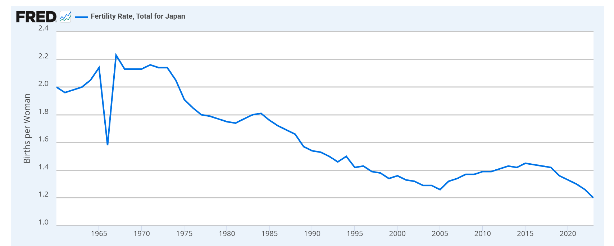
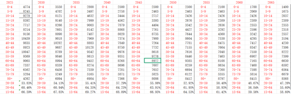
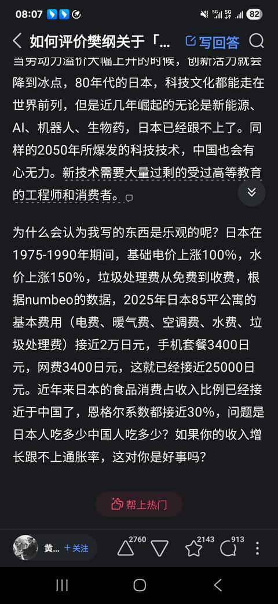
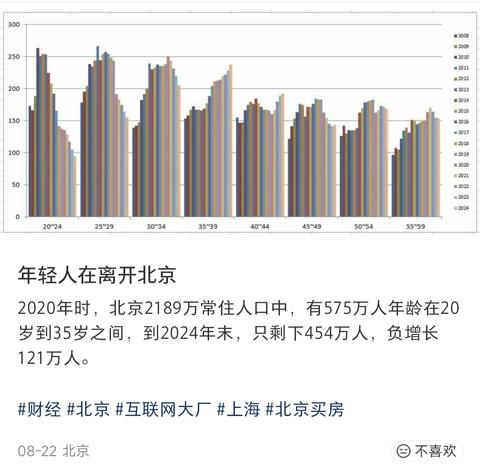
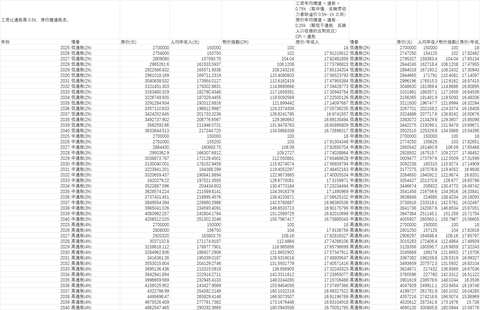
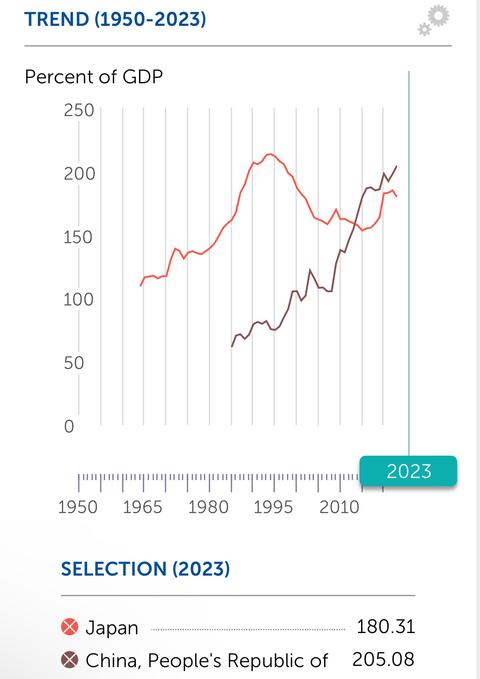

[toc]

# 问题

提问者：**<a href="https://www.zhihu.com/people/xiao-en-78-83">Nobody</a>**
提问时间: 2025-8-26 8:34:30
总回答数: 1324
总访问量: 15424949

跟日本相比，日本60年代以后的发展是战后重新崛起，战前已经有了很大的发展，战后即使是重新崛起的过程，它的教育水平、体制、法治结构、科技水平、企业的制度，比我们现在很多地方都完善。所以在同样的市场环境下，要恢复比较容易， **而且他们走出去的能力很强，很多企业走出去了，它的GDP虽然一直没增长，但是GNP有增长** ，企业走出去的过程中也在挣钱。我们现在很多企业家走出去，也是为了持续在国外增长。

然后就是非常重要的国际环境，当时美国虽然遏制日本，但是它们还是盟友，很多东西还是阵营中的一部分。 **但如今美国对我们的遏制是全方位的** ，这大不一样。

从昨晚到今天，陈启宗先生一直强调大周期，强调历史上最强大的国家对一个人均收入水平还差7倍的落后的发展中国家进行全方位的打压，所有的方面都会产生影响，对经济发展复苏等等都会有影响。

而且恰恰是在过去6、7年，我们一方面承受了3年疫情的冲击，另一方面又承受了3年房地产泡沫破灭的冲击，再加上美国全方位的打压，大家对这些问题确实要有充分的认识， **我们比日本当时难多了。** 

[https://mp.weixin.qq.com/s/Sdw2fyMjVTkNRSxSfEWbWQ](https://mp.weixin.qq.com/s/Sdw2fyMjVTkNRSxSfEWbWQ)

# 回答

回答者： **<a href="https://www.zhihu.com/people/huang-wei-yan-30">黄彦臻</a>**
回答时间: 2025-8-26 16:4:10
点赞总数: 6796
评论总数: 1354
收藏总数: 5820
喜欢总数：450

国内某些经济学家的水平，是非常难评的。

日本真正困难的时期其实是两段，一段是1971-1979，是日本房地产泡沫第一次破裂加上石油危机，大滞胀工业生产下降20％失业率高企且国内通胀率一度飙升至20％。一段是1997-2008，97亚洲金融危机叠加出口份额被中国蚕食,山一证券破产（日本四大证券公司之一）、三洋证券破产、北海道拓殖银行倒闭、兵库银行倒闭，算上小的信用金库信用社破产差不多100多家，1999年开始日本失业率飙升，所谓“女性被赶出职场”就是这个时间节点的事情。（来中国出海的日本工程师差不多也是这个时间，这也是全球制造业转移中国的时间）

中国现在撑死就到了日本70年代第一次房地产泡沫破裂时期，好的地方在于，没有发生真正意义上的石油危机，坏的地方在于没有大通胀，所以房价下跌更深，中东国家后来为什么对单独日本解除石油禁令，日本人能跑到以色列特拉维夫机场屠杀平民，尼克松对日本征高关税，限制日本纺织品出口，我并不觉得日本在70年代的国际关系好。

日本是一个非常好的老师。他用三代人走完了整个后发工业化周期（但是无脑拿90年代对比，简直太脑残了）

1950-1970很类似于中国的2000-2020，全球制造业转移日本，依赖出口，依赖外资，依赖劳动密集型产业，同时是第一次房地产大泡沫。

1970年开始，田中角荣就在搞《日本列岛改造论》简单理解就是都市圈和城市群，1975年政府牵头，富士通、日立、NEC、东芝、三菱五大公司共同成立新合作机构，推进它那个超大规模集成电路计划《VLSI计划》简单理解就是芯片大跃进，至于汽车钢铁那就更多了，抛砖引玉。（70年代的日本内部矛盾重重，高油价工业大幅减产物价飙升，转移矛盾的办法也是反美，而且发生多次大规模冲突，甚至大学生示威冲击美军冲绳基地，具体可以自己研究，之前看采访押井守、奄野秀明应该都有参与，这群人里面出了很多大师）

1980年开始，全球需求复苏，日本经济转型也七七八八了（也是老三样到新三样，从纺织钢铁船舶到汽车电子机械），走上快车道，1985年中曾根康弘开始大量甩卖国企号称“日本三公社私有化”，分别是“日本电信电话公社”“日本盐烟专卖公社”“日本国有铁路公社”（其中国铁公社被改组成了JR集团，JR集团又被拆分成了七家公司，其中四家盈利的JR东日本、JR东海、JR西日本、JR九州私有化了，亏损的三家还给日本政府了），这才有了钱开始发福利（从负面的角度就是侵吞国有资产合理化），同期日元开始大幅升值，日本开启“黑字环流”，大量日元本币从日本走向世界（你逼我升值，我就出去收购），这也就是日元国际化开始，一直到这个时候日本的外汇管制才彻底放开，这也就是后来日本国内边放水边升值边通缩的原因之一。（日本大企业的“正式职工”地位较高也源于此，大多数日本老百姓收入是三十年不变的，而大企业的“正式职工”能有每年5％-8％的涨薪）

  

以上我并不认为它是好的或是坏的，但一定是对一群人好对一群人坏的。

聊点题外的日本养老金，只讨论国民年金不讨论厚生年金（日本大约55％的人有厚生年金），你在2009年退休，可以领取68000日元/月，到2025年，你可以领取82000日元/月，增长20％还不错吧，但你用美元计算，2009年你能拿到800美元/月，2025年你能拿到550美元/月，这还不讨论美元的购买力。

  

还有一个反常识的东西，很多人可能意识不到，从绝对价格的角度，1990年的日本房价是比1974年要高的，但是从租金回报率，房价收入比等指数的角度，1990年泡沫前的日本房价（除东京核心区）的泡沫程度是比1974年要低的。这也就是为什么我之前写从2040年来看，房价应该还有1-2倍的涨幅，但这个涨幅是落后于物价、通胀和收入增长的。

最后就是日本总和生育率，也是在70年代开始断崖式下降，生育率最终会造成劳动力供给不足，出现长期滞胀，这个时间节点在2040年之后开始显现，2050年愈演愈烈，2060年达到极值。大约在2045年左右，中国应该就会开放外来人口。每年的缺口在50万，而2060年每年的缺口可能高达200万。也就是说在2045年之前，工资的收入大约和经济增速是同步的，但是2040年开始，某些行业就能吃到劳动力供给不足的溢价，很多人说去XX国家打工收入不错，往往是这个国家存在普遍性的劳动力供给不足后产生了溢价。（就像之前有些人问我适不适合去日本工作，你要是长居，那没问题，从人口结构计算，2028年后日本的劳动力溢价要开始大幅上升了，但是你要是说赚钱再倒回来，估计不划算）

当劳动力溢价大幅上升的时候，创新活力就会降到冰点，80年代的日本，科技文化都能走在世界前列，但是近几年崛起的无论是新能源、AI、机器人、生物药，日本已经跟不上了。同样的2050年所爆发的科技技术，中国也会有心无力。新技术需要大量过剩的受过高等教育的工程师和消费者。

为什么会认为我写的东西是乐观的呢？日本在1975-1990年期间，基础电价上涨100％，水价上涨150％，垃圾处理费从免费到收费，根据numbeo的数据，2025年日本85平公寓的基本费用（电费、暖气费、空调费、水费、垃圾处理费）接近2万日元，手机套餐3400日元，网费3400日元，这就已经接近25000日元。近年来日本的食品消费占收入比例已经接近于中国了，恩格尔系数都接近30％，问题是日本人吃多少中国人吃多少？如果你的收入增长跟不上通胀率，这对你是好事吗？

绝大多数的问题可以看这一篇

[日本如何从通缩中恢复的？](https://www.zhihu.com/question/629948634/answer/1916562959783686370)[日本东京都 23 区 5 月通胀率达 3.6%，日本经济为何从通缩直升通胀？](https://www.zhihu.com/question/1912069465358726522/answer/1913105772394571592)[世界经济进入大停滞了吗？](https://www.zhihu.com/question/646456959/answer/3420603594)

  

原文地址：[(黄彦臻)如何评价樊纲关于「我们当下，比 90 年代日本难多了」的观点？](https://www.zhihu.com/question/1943592115469772112/answer/1943705278454432744) 

# 评论

1. <a href="https://www.zhihu.com/people/wang-dao-yong-99">逍遥问心</a> (<small title="上海">2025-8-26 16:39:31</small>): 黄大将目前的中国与1970年代的日本进行对比，是否考虑了生育率和老龄化的因素？毕竟1975年日本的总和生育率达到了1.9
   - **黄彦臻** (<small title="湖北">2025-8-26 16:48:42</small>): 生育率最大的危害是劳动力供给不足，这个危害要在2040年开始显现。也就是说日本现在出现的劳动力供给不足问题，在未来的中国会更厉害。
   - <a href="https://www.zhihu.com/people/chen-yu-xiao-14-67">CM菜鸡</a> (<small title="北京">2025-8-26 17:31:39</small>): 现在世界偏向零和博弈，大部分国家的生育率跌幅都差不多，只要竞争对手也跌了，就可以暂时忽略生育率问题
   - <a href="https://www.zhihu.com/people/huo-che-chuang-wai-de-huo-che">火车窗外的火车</a> (<small title="回复于 2025-8-26 17:46:39/浙江"> ✉️:黄彦臻</small>): 劳动力供给多大程度上能用科技进步和生产效率提高弥补，比如广泛运用到第二和第三产业的机器人？
   - **黄彦臻** (<small title="回复于 2025-8-26 17:49:37/湖北"> ✉️:火车窗外的火车</small>): 我尽量不考虑这些东西，这些东西算不出来的。你不知道10年以后怎么样。
   - <a href="https://www.zhihu.com/people/ss-er-49">CkCK</a> (<small title="广东">2025-8-26 18:24:14</small>): 个人认为随着科技发展人口下降不会导致劳动力不足，只会导致内需疲软
   - <a href="https://www.zhihu.com/people/yigejiazhihu">吃啥都胖星人</a> (<small title="回复于 2025-8-26 18:51:50/陕西"> ✉️:火车窗外的火车</small>): 以本人亲身经历来说，替代劳动力这方面发展其实很慢，标准自动化相对容易一些，非标自动化怎么也得20年左右才有可能规模化替代人力，这一点可以参考一下王传福的发言，汽车装备这种既有标准化也有非标的行业，国产新能源第一的大厂目前完全无法解决机器替代人工。
   - <a href="https://www.zhihu.com/people/xu-dong-feng-10">伯劳</a> (<small title="回复于 2025-8-26 18:59:7/浙江"> ✉️:黄彦臻</small>): 这么看来到50年，老中虽然国际地位下降，但劳动力变得抢手，跟现在日本一样只要想做就能有工作好像也挺好。为啥会说到那时就完蛋了
   - **黄彦臻** (<small title="回复于 2025-8-26 19:3:39/湖北"> ✉️:伯劳</small>): 还是回到那个问题，对一部分人好对一部分人坏，看你在什么角度叙事。
   - <a href="https://www.zhihu.com/people/qin-fen-qiu-shi">勤奋求实</a> (<small title="回复于 2025-8-26 19:46:36/浙江"> ✉️:黄彦臻</small>): 但是现在科技的发展也是另一个水平了，机器人可能会解放劳动力的需求
   - <a href="https://www.zhihu.com/people/Leuven-li">Leuven</a> (<small title="回复于 2025-8-26 19:47:22/北京"> ✉️:黄彦臻</small>): 有没有考虑到人口不足导致的短期的内需减少问题呢？要知道单身家庭和已育家庭的消费结构和意愿完全不同
   - **黄彦臻** (<small title="回复于 2025-8-26 19:55:46/湖北"> ✉️:Leuven</small>): 人口前面写了
   - <a href="https://www.zhihu.com/people/li-789">锐克</a> (<small title="回复于 2025-8-26 20:25:30/山东"> ✉️:火车窗外的火车</small>): 供给端可以用机器人弥补，需求端补不了
   - <a href="https://www.zhihu.com/people/2-46-36-58">神经蛙2</a> (<small title="回复于 2025-8-26 20:32:46/河南"> ✉️:伯劳</small>): 只能说如果这样的人口趋势发展下去，未来科技和产业中心会转移到南亚去了。
   - <a href="https://www.zhihu.com/people/moritz-24-1">退了吧</a> (<small title="回复于 2025-8-26 21:23:48/广东"> ✉️:黄彦臻</small>): 如今多了一个变量，就是机器人的发展，智驾和具身智能的发展如果发展够快劳动力因素的影响会降低［思考］
   - <a href="https://www.zhihu.com/people/bei-feng-yu-yu-nan-feng-ting">北风遇雨南峰亭</a> (<small title="回复于 2025-8-26 22:25:2/山东"> ✉️:黄彦臻</small>): 新生儿对消费需求端的影响也很大吧，儿童成长过程几乎是纯消费者
   - **黄彦臻** (<small title="回复于 2025-8-26 22:29:37/湖北"> ✉️:北风遇雨南峰亭</small>): 最重要的消费是汽车、房子，几乎都是26-28岁，你大约就可以估算出2050年开始消费就相当之差了。
   - <a href="https://www.zhihu.com/people/xun-huo-63-35">souvlaki</a> (<small title="回复于 2025-8-26 23:4:11/新加坡"> ✉️:黄彦臻</small>): 那如果加上工业大规模自动化无人化呢🤔
   - <a href="https://www.zhihu.com/people/li-lan-75-53-58">安澜</a> (<small title="回复于 2025-8-27 0:42:21/河南"> ✉️:黄彦臻</small>): 是阿我也认为这些东西算不出来，那会不会基于现在情况对未来的预测很大一部分其实都是杞人忧天？
   - <a href="https://www.zhihu.com/people/mei-you-guo-bu-qu-de-kan-er-29">寻路朝阳</a> (<small title="回复于 2025-8-27 1:47:16/山西"> ✉️:黄彦臻</small>): 我并不这么看，抛开社保，劳动力供给不足未必就是坏事。
 
如果在10—20年内产业升级成功，将产品价格再压下来或者利润留在国内，那低端产业外迁就可以意引导去往交好的发展中国家去了。那自然就不在乎劳动力。
 
如果不成功，那劳动力密集型产业还是只能保留，养活吃饭的人。省点社保和福利。
   - <a href="https://www.zhihu.com/people/wanding-27">Ruclub23</a> (<small title="回复于 2025-8-27 5:13:28/广东"> ✉️:黄彦臻</small>): 东大并不会缺少劳动力供给问题，因为现在最大的工作岗位在未来都会消失，比如农民、农民工、工厂工人
   - <a href="https://www.zhihu.com/people/19-48-62-57">晓文</a> (<small title="回复于 2025-8-27 5:49:18/江苏"> ✉️:锐克</small>): 中国是世界工厂…不缺需求
   - <a href="https://www.zhihu.com/people/yan-ai-li-ke-si">没了体温的鱼</a> (<small title="回复于 2025-8-27 6:13:21/浙江"> ✉️:晓文</small>): 世界工厂不缺需求？
   - <a href="https://www.zhihu.com/people/li-shou-jia-32">李守家</a> (<small title="回复于 2025-8-27 6:46:25/山东"> ✉️:黄彦臻</small>): 以后不会缺人，机器人和自动化会替代大部分人
   - <a href="https://www.zhihu.com/people/wang-kai-50-78">沐风栉雨江大桥</a> (<small title="回复于 2025-8-27 6:56:48/浙江"> ✉️:火车窗外的火车</small>): 社保资金池枯竭问题请问……
   - <a href="https://www.zhihu.com/people/qin-jing-song">三缺狼</a> (<small title="回复于 2025-8-27 6:58:37/湖南"> ✉️:伯劳</small>): 最主要还是分配问题。日本不乏底层七十岁老人还要打工糊口。未来机器人可以广泛应用于非标场景，中国政府会向全体国民支付基本生活费，当然重点会向未成年人和老年人倾斜。
   - <a href="https://www.zhihu.com/people/37-7-69-81">逆天唯我</a> (<small title="回复于 2025-8-27 8:20:11/广东"> ✉️:CkCK</small>): 中国最大问题就是劳动力过剩，
   - <a href="https://www.zhihu.com/people/zhu-bai-19">朱白</a> (<small title="回复于 2025-8-27 8:50:38/四川"> ✉️:CM菜鸡</small>): 竞争对手是谁。只有韩国么？
   - <a href="https://www.zhihu.com/people/mei-chang-su-61-43">梅长苏</a> (<small title="回复于 2025-8-27 9:7:37/上海"> ✉️:黄彦臻</small>): 现在年轻人没人来养老，就干到死呗
   - <a href="https://www.zhihu.com/people/mei-chang-su-61-43">梅长苏</a> (<small title="回复于 2025-8-27 9:10:4/上海"> ✉️:伯劳</small>): 到时候的老年人还是多，对于老年人还是“你不干有的是人干”
   - <a href="https://www.zhihu.com/people/jackie-yu">Jackie Yu</a> (<small title="回复于 2025-8-27 9:10:23/北京"> ✉️:黄彦臻</small>): 考虑人工智能和自动化的推广，劳动力不足可能问题不那么严重，高失业率更严重
   - <a href="https://www.zhihu.com/people/ffgg-45-81">ffgg</a> (<small title="回复于 2025-8-27 9:17:16/四川"> ✉️:黄彦臻</small>): 黄大，人工智能的高速发展，尤其是具身智能对人的替代。应该也就是在15~20年就会落到应用层面了吧。最近在外网用gemini，和非限制版的DeepSeek。效果是真惊艳。
   - <a href="https://www.zhihu.com/people/76-20-15-53">知乎用户MVomP9</a> (<small title="回复于 2025-8-27 11:4:28/江苏"> ✉️:黄彦臻</small>): 中国生育率上世纪末就开始大幅下降了，00后比80后少了多少？
   - <a href="https://www.zhihu.com/people/wang-chao-jun-34">Carson</a> (<small title="回复于 2025-8-27 11:9:43/湖北"> ✉️:火车窗外的火车</small>): 日本央行有相关的论文，至少前些年日本的生产效率提高是弥补不了劳动人口下降的，最终全要素生产率还是下降的。因为到了发达国家的阶段科技进步带来生产效率提高1%是很难很难的（而且本身老龄化社会对科技的接受度也差），但劳动人口说下降1%就下降了。
   - <a href="https://www.zhihu.com/people/mei-hua-xiang-liao">梅花香廖</a> (<small title="回复于 2025-8-27 11:39:20/陕西"> ✉️:CkCK</small>): 那就要看你觉得内需疲软是缺人还是缺钱了［吃瓜］
   - <a href="https://www.zhihu.com/people/zhangaijun-78">金针</a> (<small title="回复于 2025-8-27 11:57:40/湖北"> ✉️:火车窗外的火车</small>): 劳动力供给缺乏，其实就是交社保人员缺乏
   - <a href="https://www.zhihu.com/people/dang-cheng-yuan">Anakin</a> (<small title="回复于 2025-8-27 12:23:10/上海"> ✉️:黄彦臻</small>): 但是很多人之所以咬牙买房子和车子就是因为小孩啊［思考］
   - <a href="https://www.zhihu.com/people/15-34-17-39-49">知乎用户DA4r8a</a> (<small title="回复于 2025-8-27 13:50:18/山东"> ✉️:伯劳</small>): 因为没有老中了。所谓中国中华的概念是根据需要提出来的。通过拉拢和分配来维持。经济不好不落井下石的一定会被饿死。人口多，资源少。社会环境恶劣是没办法阻止人们通过占有更多资源的行为。因为你不多占你就死。至于团结只会在中小群体之间团结。比如按地方和民族。也就是报团。国家机器会直接被瓜分的一干二净。14亿人太多了。一旦掉进坑里爬出来是很困难的。
   - <a href="https://www.zhihu.com/people/tang-feng-61-60">唐峰</a> (<small title="江西">2025-8-27 14:6:59</small>): 那您认为多占的人是哪些人，什么方式去占有呢？锅内人员、锅子外的资本家？
   - <a href="https://www.zhihu.com/people/li-789">锐克</a> (<small title="回复于 2025-8-27 14:44:12/山东"> ✉️:晓文</small>): 如果真的不缺需求那就不用搞内循环了。
   - <a href="https://www.zhihu.com/people/gu-guo-yue-liang">宇宙级像素</a> (<small title="回复于 2025-8-27 15:10:25/北京"> ✉️:黄彦臻</small>): 最大危害应该是社会活力，一个暮气沉沉的社会是难有创新力和创造力的，劳动力供给和养老成本在发达社会中问题不大，但一个没有活力的社会是无法进入发达社会的
   - **黄彦臻** (<small title="回复于 2025-8-27 15:19:31/湖北"> ✉️:宇宙级像素</small>): 没有活力的社会就没有创新了，所以你能看到现在新能源，AI，机器人都能走到前列，但是日本完全没心气干这事。2050年的中国也是一样的。
   - <a href="https://www.zhihu.com/people/philip-4-5">philip</a> (<small title="福建">2025-8-27 16:0:26</small>): 放开移民吧
   - <a href="https://www.zhihu.com/people/gu-guo-yue-liang">宇宙级像素</a> (<small title="回复于 2025-8-27 16:22:16/北京"> ✉️:黄彦臻</small>): 这个形势到不了2050年［飙泪笑］
   - **黄彦臻** (<small title="回复于 2025-8-27 16:37:57/湖北"> ✉️:宇宙级像素</small>): 受教育最高的一批2016-2018婴儿潮35岁，中国就差不多在新技术上没戏了。
   - <a href="https://www.zhihu.com/people/gu-guo-yue-liang">宇宙级像素</a> (<small title="回复于 2025-8-27 16:49:28/北京"> ✉️:黄彦臻</small>): 这一批新生人口规模远比不上90年左右的那批，这批人现在正好到了35岁
   - **黄彦臻** (<small title="回复于 2025-8-27 16:50:20/湖北"> ✉️:宇宙级像素</small>): 人口质量高，基本出生在城市有产家庭。
   - <a href="https://www.zhihu.com/people/da-yao-da-bai-90">郭破虏</a> (<small title="回复于 2025-8-27 21:1:16/浙江"> ✉️:黄彦臻</small>): 以2050年发达的程度，中国有机会成为像现在美国一样的移民国家吗
   - <a href="https://www.zhihu.com/people/shi-gardner">石小呆</a> (<small title="回复于 2025-8-28 9:25:21/江苏"> ✉️:黄彦臻</small>): 手里要有个技术，不能被机器人代替的技术。
   - <a href="https://www.zhihu.com/people/li-fei-45-46">李不文</a> (<small title="回复于 2025-8-30 7:6:40/四川"> ✉️:黄彦臻</small>): 生育率最大的危害不是劳动力不足，而是未来购买力下降。讨论的基础都错了。
   - <a href="https://www.zhihu.com/people/argen">argen</a> (<small title="回复于 2025-8-30 12:26:18/浙江"> ✉️:souvlaki</small>): 关键是东西卖给谁
   - **黄彦臻** (<small title="回复于 2025-8-31 2:20:5/湖北"> ✉️:李不文</small>): 从消费的角度也是2050年，婴儿潮的28岁和48岁都是全社会消费的巅峰。
   - <a href="https://www.zhihu.com/people/ffgg-45-81">ffgg</a> (<small title="回复于 2025-8-31 17:11:58/四川"> ✉️:黄彦臻</small>): 黄大，现在中国也有上千万的人口出生啊，20后，质量极高，美国也没有这么多出生人口啊
   - <a href="https://www.zhihu.com/people/2021shi-nian-chuang">王呱呱十年禁渔</a> (<small title="广西">2025-9-1 12:17:51</small>): 我觉得根本问题是70年代还不是信用货币。布雷顿森林破灭之后，杠杆可不是10倍增长这么简单，直接成为了十个锅一个盖
   - <a href="https://www.zhihu.com/people/62-17-86-11-30">知乎用户gQvk5G</a> (<small title="回复于 2025-9-2 8:47:2/辽宁"> ✉️:火车窗外的火车</small>): 10年内看不到，机器人除非有质的突破，否则效率不如人，而且有质的突破，人类社会就被改变了。
   - <a href="https://www.zhihu.com/people/li-fangjie">Leezard</a> (<small title="回复于 2025-9-9 20:45:21/浙江"> ✉️:黄彦臻</small>): 是2050开始走下坡路吧，2050应该还凉不了。另外就是看2050以后能不能走出一条新路了
   - <a href="https://www.zhihu.com/people/inye3b5">inye3b5</a> (<small title="回复于 2025-9-12 0:13:39/浙江"> ✉️:黄彦臻</small>): 还在把人口当纯粹劳动力［为难］
 
人口最大的意义是消费
 
没有消费能力 劳动力有何意义？
   - <a href="https://www.zhihu.com/people/nqcxp">nqcxp</a> (<small title="回复于 2025-9-16 17:20:46/河南"> ✉️:李守家</small>): 他们只会静态看问题！
   - <a href="https://www.zhihu.com/people/36-61-25-78">根本不能发</a> (<small title="回复于 2025-9-16 18:57:51/福建"> ✉️:黄彦臻</small>): 我不认为，这二十年的机械自动化和机器人足以支撑，最担心的是市场规模。它的根基就是人。人没了就什么都没了。
   - <a href="https://www.zhihu.com/people/36-61-25-78">根本不能发</a> (<small title="回复于 2025-9-16 19:0:10/福建"> ✉️:吃啥都胖星人</small>): 不是，现在这个就业情况你搞非标自动化。造反不远了。没有存蓄的话，就业压力是相当的大。
   - <a href="https://www.zhihu.com/people/36-61-25-78">根本不能发</a> (<small title="回复于 2025-9-16 19:1:47/福建"> ✉️:Leuven</small>): 对，两个世界，两种人生。甚至是两个物种。
   - <a href="https://www.zhihu.com/people/36-61-25-78">根本不能发</a> (<small title="回复于 2025-9-16 19:2:9/福建"> ✉️:锐克</small>): 人口能不能涨呢
   - <a href="https://www.zhihu.com/people/grubbykilkl">延迟多干一年半</a> (<small title="回复于 2025-9-17 7:12:40/河北"> ✉️:黄彦臻</small>): 生育率最大的问题是创新不足，没有大量新生人口不行
   - <a href="https://www.zhihu.com/people/dwbwz-96">dwbwz</a> (<small title="回复于 2025-9-17 8:29:50/江西"> ✉️:黄彦臻</small>): 个人感觉应该在2044年，因为现在就有天量级的失业人口，或者叫灵活就业人口要消化
   - <a href="https://www.zhihu.com/people/noodlesyi-cheng">noodles</a> (<small title="回复于 2025-9-17 8:33:49/浙江"> ✉️:黄彦臻</small>): 我感觉这种类比有一定借鉴意义，但科技在进步，感觉到2050年左右AI和机器人应该可以实现黑灯工厂所要求的，可能真不需要那么多人了［捂脸］
   - <a href="https://www.zhihu.com/people/xiao-luo-ji-82">小逻辑</a> (<small title="回复于 2025-9-22 7:26:39/中国香港"> ✉️:CkCK</small>): 赞同，与生产能力相对照的消费不足
   - <a href="https://www.zhihu.com/people/sss-sss-35">sss sss</a> (<small title="回复于 2025-9-22 9:11:27/江苏"> ✉️:吃啥都胖星人</small>): 我这点比较乐观，我还是觉得我们实现日本八十年代幻想未来，例如攻壳机动队这种，主要各种高端产品已经出现了，虽然价格很贵
   - <a href="https://www.zhihu.com/people/yigejiazhihu">吃啥都胖星人</a> (<small title="回复于 2025-9-22 15:47:42/陕西"> ✉️:sss sss</small>): 成本决定了是否可规模化应用，现在还没到成本问题，是单纯的技术问题，技术难点太多了。还是拿汽车产业为例，这个超长产业链的行业，技术够高端，资金够充足，国内在新能源汽车这一块全世界也没对手吧？依然解决不掉机器替代人工的问题，与汽车产业相比，很多技术含量不高，资金也相对紧张的行业，想进行机器替代人工更是一个超长期目标了。
   - <a href="https://www.zhihu.com/people/18-6-72-33">瑞敏的热爱</a> (<small title="回复于 2025-9-22 20:32:6/北京"> ✉️:黄彦臻</small>): 你说全面放开移民+努力用机器人弥补，能不能维持
   - <a href="https://www.zhihu.com/people/benjamin-zeng">Jupiterrrrr</a> (<small title="回复于 2025-9-23 9:21:11/四川"> ✉️:伯劳</small>): 50年为啥国际地位会下降？
   - <a href="https://www.zhihu.com/people/benjamin-zeng">Jupiterrrrr</a> (<small title="回复于 2025-9-23 9:27:42/四川"> ✉️:inye3b5</small>): 消费可以卖给国外吧？
   - <a href="https://www.zhihu.com/people/inye3b5">inye3b5</a> (<small title="回复于 2025-9-23 13:34:23/浙江"> ✉️:Jupiterrrrr</small>): 近百年全球经济涨了多少倍？是卖给外太空了吗？［为难］
   - <a href="https://www.zhihu.com/people/87-57-3-4">云无心</a> (<small title="回复于 2025-11-30 18:11:47/重庆"> ✉️:火车窗外的火车</small>): 这是未来 人不可能知道这些具体的
   - <a href="https://www.zhihu.com/people/87-57-3-4">云无心</a> (<small title="回复于 2025-11-30 18:13:19/重庆"> ✉️:安澜</small>): 如果不考虑 单纯认为技术问题可以解决  
 
那等于自我休克 放弃治疗
   - <a href="https://www.zhihu.com/people/ye-gui-lu-men-ge-67">夜归鹿门歌</a> (<small title="回复于 2025-12-8 19:46:14/湖北"> ✉️:Ruclub23</small>): 那护工呢？86～97婴儿潮，老了不用护工？垃圾回收可能有人喜欢干，给老头老太太擦屁股有几个人喜欢干？你指望“0分也能上大学”的20后30后吗？现在大学生都不愿意干体力活
   - <a href="https://www.zhihu.com/people/ggboom-10-86">GGBOOM</a> (<small title="回复于 2025-12-19 12:43:12/日本"> ✉️:黄彦臻</small>): “生育率最大的危害是劳动力供给不足”
 
社保方面你是一字不提啊
   - <a href="https://www.zhihu.com/people/666king">666king</a> (<small title="回复于 2026-1-10 11:47:52/湖北"> ✉️:黄彦臻</small>): 那个时候有ai机器人替代肉身了
   - <a href="https://www.zhihu.com/people/fiona-2-48">fiona</a> (<small title="回复于 2026-1-23 16:6:7/上海"> ✉️:Ruclub23</small>): 上下五千年 生产力科技极大发展 解放人类双手 可现在打工人也没比以前轻松多少 996还是福报呢
   - <a href="https://www.zhihu.com/people/seeker-18-71">Seeker</a> (<small title="广东">2026-2-24 19:57:57</small>): 不利于赢［大笑］
   - <a href="https://www.zhihu.com/people/yimengtianya1">QuincyTang</a> (<small title="回复于 2026-3-5 22:11:38/湖北"> ✉️:黄彦臻</small>): 其实危害早已显现，不需要等到2040年。生育率低往前推可以得出这些年结婚率暴跌，与之相应的消费也随之暴跌，包括但不限于买房、装修、酒宴，一对夫妻结婚产生的消费从十万级到百万级以上；往后推还有新生儿的一系列消费暴跌，包括但不限于医疗、奶粉、早教、幼儿园（小学以上影响刚刚开始，疼痛还不够切肤）。按一年减少的800万人口，一个孩子及结婚产生的消费10～100万计算，一年减少的消费额是0.8～8万亿。
   - **黄彦臻** (<small title="回复于 2026-3-5 23:22:50/湖北"> ✉️:QuincyTang</small>): 人作为一个群体，消费最旺盛是婴儿潮的两个阶段，26-28岁和46-48岁，因为最大的消费是房地产和汽车，这样你其实就可以算出来了，2018年是消费高峰，2038年是另一个消费巅峰。
   - <a href="https://www.zhihu.com/people/wo-bu-fan-ren-13">柒夏</a> (<small title="回复于 2026-4-8 13:11:29/浙江"> ✉️:郭破虏</small>): 没可能，最好的发展窗口以及至少一系列的规划都没跟上。未来最有可能的是朝鲜+拉美
   - <a href="https://www.zhihu.com/people/lao-lang-qing-chi-ji-12">老狼请吃鸡</a> (<small title="回复于 2026-4-11 9:35:9/浙江"> ✉️:黄彦臻</small>): 出生率立即会引起的难道不是消费预期下降？
   - <a href="https://www.zhihu.com/people/cheng-kai-jie-66">旧年别院</a> (<small title="回复于 2026-5-18 10:12:58/江苏"> ✉️:瑞敏的热爱</small>): 机器人是技术问题不提，开放移民要解决两个问题：1.人家愿意来，2.你能留得住。
   - <a href="https://www.zhihu.com/people/feng-20-71-21">Feng</a> (<small title="回复于 2026-5-18 13:44:43/新加坡"> ✉️:黄彦臻</small>): 这个问题，中国大概率永远不会碰到。 为啥？ 因为机器人技术迎来了跨越式发展期，现在是创业寒冬期，中国都还有好几个机器人初创公司融资近十亿美元，因为技术到了爆发期了。 更大的问题是有效需求的问题。 不过军事实力到了，也不怕被排除在世界市场之外了
   - <a href="https://www.zhihu.com/people/sun-zhen-fang-15">孙镇方</a> (<small title="回复于 2026-5-18 15:33:3/上海"> ✉️:黄彦臻</small>): 不一定吧，到了2040年劳动力供应不足时，也就是低端服务业劳力不足，应该是机器替代一部分，退休老人再就业和15岁以上孩子提供一部分。
   - <a href="https://www.zhihu.com/people/53-12-4-23-1">爵爷</a> (<small title="回复于 2026-5-26 6:31:3/江西"> ✉️:柒夏</small>): 东北全国化［捂脸］
   - <a href="https://www.zhihu.com/people/8-81-58-2">明朝的不是事儿</a> (<small title="回复于 2026-6-9 14:48:30/湖南"> ✉️:CM菜鸡</small>): 不是，谁叫你这么分析问题的［捂脸］？这么孤立片面，就不考虑产业结构，分配制度等等差异吗［捂脸］［捂脸］？我真的要气笑了［捂脸］….
   - <a href="https://www.zhihu.com/people/8-81-58-2">明朝的不是事儿</a> (<small title="回复于 2026-6-9 14:59:13/湖南"> ✉️:伯劳</small>): 别太乐观了，劳动力的就业率必须考虑人口结构，很多人认为只要人口多，就有“人口红利”，反常识的是，我们改革开放30年的高速发展其实是得益于我们国家在那时拥有人类历史上最接近完美的人口结构，能够适应社会工业化生产。如果人口结构不好，老龄化加剧，政府社保医保支出增加，只会使年轻人压力更大，另外人口老龄化的加剧必然会导致很多产业萎缩，可能就业状况并不会好多少。
   - <a href="https://www.zhihu.com/people/ma-hua-teng-ben-zun">马骅騰本尊</a> (<small title="回复于 2026-6-17 11:3:54/北京"> ✉️:黄彦臻</small>): 劳动力不仅看数量，也要看素质，也要结合未来的技术发展看
   - <a href="https://www.zhihu.com/people/epimetheus-71">epimetheus</a> (<small title="回复于 2026-6-18 16:23:33/安徽"> ✉️:黄彦臻</small>): 生育率不足最大的问题是消费不足导致的一系列严重问题。劳动力不足反而是可解决的，机器人可以解决这个问题。
   - <a href="https://www.zhihu.com/people/unifeeture">Unifeeture</a> (<small title="回复于 2026-6-18 16:51:0/北京"> ✉️:黄彦臻</small>): 最大问题是影响消费和就业
   - <a href="https://www.zhihu.com/people/papajinoo-74">库尼几娃</a> (<small title="回复于 2026-6-27 10:0:24/陕西"> ✉️:黄彦臻</small>): 当然站在普通人的角度啊
   - <a href="https://www.zhihu.com/people/seeker-52-63">seeker</a> (<small title="回复于 2026-7-3 10:13:26/广东"> ✉️:黄彦臻</small>): 算不出来［好奇］能从地理冒出来还是摊派出来［大笑］
2. <a href="https://www.zhihu.com/people/96-59-78-86">红红火火恍恍惚惚</a> (<small title="北京">2025-8-27 7:28:56</small>): 不对呀，日本1975年左右石油危机只是导致房价在两年内回调了15%左右，然后就又恢复上涨了。这种外部危机冲击导致的短暂调整不算泡沫破裂呀....还有日本的金融自由化整体是80年代才开始的，80年以前日本根本不允许私人自由兑换外汇［飙泪笑］
   - <a href="https://www.zhihu.com/people/yi-ge-da-biao-ke">一个大镖客</a> (<small title="广东">2025-8-27 14:37:29</small>): 泡沫有大泡有小泡，资产缩水都是挤泡沫
   - **黄彦臻** (<small title="湖北">2025-8-27 14:45:35</small>): 失业率这种统计数据是最没有意义的，70年代日本到处都是大游行，失业率低，就不可能有那么多人没事游行。
   - **黄彦臻** (<small title="湖北">2025-8-27 14:45:57</small>): 输入性通胀的滞胀环境，就业就不可能高。
   - <a href="https://www.zhihu.com/people/kuang-ben-gua-niu-54-75">狂奔蜗牛</a> (<small title="回复于 2025-8-27 19:55:9/贵州"> ✉️:黄彦臻</small>): 70年代苏攻美守，美国越战失败差点解体的国际大环境你没考虑进去
   - <a href="https://www.zhihu.com/people/shi-xing-9-87">左手</a> (<small title="回复于 2025-9-17 11:43:55/北京"> ✉️:黄彦臻</small>): 游行和失业率有关系吗？我们年年新高，游行还没十几年前多
   - **黄彦臻** (<small title="回复于 2025-9-17 11:58:55/湖北"> ✉️:左手</small>): 充分不必要条件。
   - <a href="https://www.zhihu.com/people/ji-du-shan-bo-jue-85-78">基督山伯爵</a> (<small title="福建">2025-9-27 1:19:26</small>): 所以这个答主的回答，偏向性严重不客观，而且偷换概念。信他的就有了
   - <a href="https://www.zhihu.com/people/luka-82-52">Luka</a> (<small title="回复于 2025-10-23 9:25:12/北京"> ✉️:狂奔蜗牛</small>): 少看点抖音［捂脸］
   - <a href="https://www.zhihu.com/people/kuang-ben-gua-niu-54-75">狂奔蜗牛</a> (<small title="回复于 2025-10-23 12:23:6/贵州"> ✉️:Luka</small>): 少看点yt，免得川普赢学入脑
   - <a href="https://www.zhihu.com/people/666-64-87-22">666</a> (<small title="回复于 2026-1-18 8:43:15/浙江"> ✉️:狂奔蜗牛</small>): 美国差点解体都来了，了解美国的制度吗［捂脸］
   - <a href="https://www.zhihu.com/people/44-68-60-6-49">一点就炸</a> (<small title="回复于 2026-2-24 14:46:46/山西"> ✉️:狂奔蜗牛</small>): 70年代苏联已经不输出了，输出革命的另有其人，美国当时也没到解体的程度吧。
   - <a href="https://www.zhihu.com/people/er-ci-yuan-long-ming-wang">二次元龙鸣王</a> (<small title="回复于 2026-2-25 23:30:15/湖南"> ✉️:黄彦臻</small>): 日本战后游行最厉害的也就GHQ时期，经济完全崩溃之下几十万工人搞总罢工，直接上街游行游到GHQ暴力干涉。七十年代的游行更多是新左翼势力。
   - <a href="https://www.zhihu.com/people/huang-xiao-you-93">黄小优</a> (<small title="回复于 2026-5-19 11:8:5/上海"> ✉️:狂奔蜗牛</small>): 去读一读联邦党人文集，再谈谈一个本就是解体的国家怎么解体［飙泪笑］［飙泪笑］
   - <a href="https://www.zhihu.com/people/wang-xiao-11-10-56">职业做梦师</a> (<small title="北京">2026-7-15 20:9:40</small>): 产业周期上确实像70年代，然而人口周期已经2000年以后了
   - <a href="https://www.zhihu.com/people/gao-yuan-77-4">高原</a> (<small title="回复于 2026-7-16 7:8:28/浙江"> ✉️:左手</small>): 体质不一样，社会主义国家没有游行这种说法
   - <a href="https://www.zhihu.com/people/44-93-72-93">妄语</a> (<small title="回复于 2026-7-20 2:33:10/河南"> ✉️:职业做梦师</small>): 那还幻想房价再涨两倍属实是难绷了［惊喜］
3. <a href="https://www.zhihu.com/people/ye-yu-9-27">momo</a> (<small title="辽宁">2025-8-26 16:31:53</small>): 乐观主义这一块［赞］
   - **黄彦臻** (<small title="湖北">2025-8-26 16:34:47</small>): 我并不认为这是好事，你要知道有人是非常惨的，在这种周期里面。
   - <a href="https://www.zhihu.com/people/ye-yu-9-27">momo</a> (<small title="回复于 2025-8-26 16:37:50/辽宁"> ✉️:黄彦臻</small>): 不少人还惦记买房，看了还不是底
   - <a href="https://www.zhihu.com/people/lu-xin-wei-43">她说戴了不算给</a> (<small title="回复于 2025-8-26 16:59:9/山西"> ✉️:momo</small>): 想换个居住环境的人很多，但炒房客应该是少很多了［doge］
   - <a href="https://www.zhihu.com/people/wang-yun-chen-91">唪唪水水</a> (<small title="回复于 2025-8-26 17:3:42/上海"> ✉️:momo</small>): 房子还是有很多刚需的
   - <a href="https://www.zhihu.com/people/ll-hh-87">知乎用户8LhIMT</a> (<small title="回复于 2025-8-26 17:5:15/江苏"> ✉️:黄彦臻</small>): 什么人惨啊［捂脸］不会是我吧
   - <a href="https://www.zhihu.com/people/you-ni-ka-pei-yin">有你咖啡因</a> (<small title="回复于 2025-8-26 17:35:25/广东"> ✉️:黄彦臻</small>): 很多人未来可能一辈子都买不起一套房［发呆］，租售比合理的过程中，估计是持有成本（租金、税负）以及房价下跌的双向奔赴，也有一部分人应该在房价下跌的过程中，惨痛无比，黄大还能说下具体哪种群体的人在这个周期比较惨吗
   - <a href="https://www.zhihu.com/people/40-11-88-80-70">月下无人江自流</a> (<small title="回复于 2025-8-26 17:37:57/广东"> ✉️:momo</small>): 黄大说过，房产税出来大概就到底了
   - <a href="https://www.zhihu.com/people/xiao-han-xie">香草棒冰</a> (<small title="回复于 2025-8-26 18:1:9/北京"> ✉️:有你咖啡因</small>): 刚看到你在文章下面的其他评论了，你认同现在绝对价格低，将来价格高。和你这里说的房价下跌，双向奔赴不是矛盾的呢？又怎么会有一批人因为房价下跌惨痛呢？房价绝对价格不会跌啊，难道不是有一批人，必需品通胀，工资又跟上不涨幅，房价绝对价格又提高而买不起房子才惨痛么
   - <a href="https://www.zhihu.com/people/you-ni-ka-pei-yin">有你咖啡因</a> (<small title="回复于 2025-8-26 18:39:51/广东"> ✉️:香草棒冰</small>): 不是每个人都能等到黎明，很多人是倒在天亮前［衰］，你说的那也是一群人
   - <a href="https://www.zhihu.com/people/liang-hao-95-35">年迈的珏老师</a> (<small title="回复于 2025-8-26 21:53:6/广东"> ✉️:香草棒冰</small>): 你可以不在北京买 你就不痛苦了
   - <a href="https://www.zhihu.com/people/xiao-han-xie">香草棒冰</a> (<small title="回复于 2025-8-27 8:45:3/北京"> ✉️:年迈的珏老师</small>): 家在北京，走不了。然后我想表达的也不是在北京买房很痛苦…［捂脸］
   - <a href="https://www.zhihu.com/people/lu-ming-64-83">电池侵澈</a> (<small title="回复于 2025-8-27 9:23:43/天津"> ✉️:momo</small>): 大把要改善的
   - <a href="https://www.zhihu.com/people/lu-ming-64-83">电池侵澈</a> (<small title="回复于 2025-8-27 9:23:51/天津"> ✉️:momo</small>): 人口基数太大了
   - <a href="https://www.zhihu.com/people/gu-xu-73">forever38</a> (<small title="回复于 2025-8-27 10:46:54/北京"> ✉️:唪唪水水</small>): 房价跌了之后，大家发现刚需是个伪命题［doge］［doge］［doge］
   - <a href="https://www.zhihu.com/people/wang-yun-chen-91">唪唪水水</a> (<small title="回复于 2025-8-27 10:50:29/上海"> ✉️:forever38</small>): 辩经就很难讲了，你如果觉得这个是伪命题，也可以理解为很多人对房子确实有需求。
   - <a href="https://www.zhihu.com/people/ci-di-yu-zheng-wu">打左向右</a> (<small title="回复于 2025-8-27 15:18:46/宁夏"> ✉️:月下无人江自流</small>): 所以大概率啥时候出呢，我这边房价是一点不降啊［捂脸］
   - <a href="https://www.zhihu.com/people/gu-la-ge-dao-zhu">古拉格岛主</a> (<small title="回复于 2025-9-5 13:24:25/江苏"> ✉️:知乎用户8LhIMT</small>): 文中已经说了，收入不涨的人，换到国内就是非扶持产业的从业者和财政能自给自足的地区的公职以外的全部人
   - <a href="https://www.zhihu.com/people/gua-ke-er-zhi-78-26">适可而止</a> (<small title="北京">2025-9-16 18:40:59</small>): 你还没看明白，信用是货币时代国家的锚定物并不是货币本身，对于中国而言工业产品才是锚定物，只要工业产品和外贸没有出现问题，货币这种东西想印多少印多少，根本无关痛痒。
   - <a href="https://www.zhihu.com/people/momo-17-85-8">momo</a> (<small title="回复于 2025-9-20 3:38:35/湖南"> ✉️:唪唪水水</small>): 房子是真需求，买房是伪需求，除非为了户口，孩子学业，但这种需求是很狭窄的。普遍的房子需求，只是住房需求。我口罩前小赚了一笔，本来准备置换大房子，后来一路看房，一路跌价，跌着跌着，忍住不买了。时隔五年，再回头看，都跌了一半了，幸好没买。至于大房子的需求，租房就解决了，租售比这么低的今天，租房很赚。
   - <a href="https://www.zhihu.com/people/benjamin-zeng">Jupiterrrrr</a> (<small title="回复于 2025-9-23 9:10:18/四川"> ✉️:唪唪水水</small>): 下跌过程中投资需求被抑制，使用需求上升，以前那是梦想，价格不断跌以后变成可以够得着的需求了。
   - <a href="https://www.zhihu.com/people/8-54-64-9-66">momo</a> (<small title="回复于 2025-9-28 14:50:36/湖北"> ✉️:黄彦臻</small>): 实际上是用悲观主义的态度来掩饰乐观主义的本质，用局部苦难代替全局苦难，多说无益，时间会证明一切。
   - <a href="https://www.zhihu.com/people/wen-zhong-dai-pi-73-59">战姿</a> (<small title="回复于 2025-9-29 2:6:44/福建"> ✉️:香草棒冰</small>): 没有什么走不了的，我现在所在的这个厂，那些老职工绝大多数是从外地来的，也在这安了家，时间久了也就适应了
   - <a href="https://www.zhihu.com/people/xiaomaker">天高气爽风飞扬</a> (<small title="回复于 2025-10-17 8:57:59/广东"> ✉️:momo</small>): 对，衣食住行都是真需求，但住不一定要买房
   - <a href="https://www.zhihu.com/people/T-ranger">游奇</a> (<small title="回复于 2025-10-18 14:27:37/江苏"> ✉️:月下无人江自流</small>): 为什么房产税出来就是房价底？
   - <a href="https://www.zhihu.com/people/nuo-hua-fang">诺画坊</a> (<small title="广东">2025-11-1 18:42:21</small>): 不不，看以后人口的走向，如果像日本一样，人口不断的往大城市集中，那么小城市的房子没有要，大城市的房子还是可以维持一定的价格。
   - <a href="https://www.zhihu.com/people/dong-tian-xia-yu-53">冬天下雨</a> (<small title="回复于 2025-12-10 10:26:32/四川"> ✉️:黄彦臻</small>): 是的 我就是很惨的牺牲品
   - <a href="https://www.zhihu.com/people/mei-you-guo-bu-qu-de-kan-er-29">寻路朝阳</a> (<small title="回复于 2026-1-21 22:39:34/山西"> ✉️:有你咖啡因</small>): 黄的意思是房价会上涨，目前在调整阶段，我认为要盯紧新房价格，这个才是标准。  
 
现在放任二手房价格下探是有另外的原因：比如国企收储改造，城中村改造，保障房和公租房等等。这个项目运行差不多了，就会限制二手房砸盘的。
   - <a href="https://www.zhihu.com/people/50-25-2-8-96">新人</a> (<small title="回复于 2026-2-25 11:20:13/重庆"> ✉️:她说戴了不算给</small>): 现在又去倒腾法拍房了，拍下来 拿来卖。
   - <a href="https://www.zhihu.com/people/xi-ri-nan-xia-12">昔日南侠</a> (<small title="回复于 2026-2-28 14:59:52/辽宁"> ✉️:游奇</small>): 因为只有到底才会出房产税
   - <a href="https://www.zhihu.com/people/huang-xiao-you-93">黄小优</a> (<small title="回复于 2026-5-19 11:9:3/上海"> ✉️:forever38</small>): 谁是大家呢？我2025上车了，感觉真心不贵
   - <a href="https://www.zhihu.com/people/wang-mou-20-60">麻瓜</a> (<small title="回复于 2026-6-27 9:0:30/福建"> ✉️:寻路朝阳</small>): 这样不是更加不能买房了，入手之后变现更困难
   - <a href="https://www.zhihu.com/people/-------92-93-35">吃在 二次 吧    </a> (<small title="回复于 2026-8-8 15:21:51/湖北"> ✉️:黄彦臻</small>): 赶紧囤房子，毕竟还能涨两倍
   - <a href="https://www.zhihu.com/people/-------92-93-35">吃在 二次 吧    </a> (<small title="回复于 2026-8-8 15:22:40/湖北"> ✉️:月下无人江自流</small>): 你应该给他加个春，黄大春
4. <a href="https://www.zhihu.com/people/zuo-dong-dan">左东单</a> (<small title="安徽">2025-8-26 16:18:33</small>): 好的，我们来对这个问题和回答进行一次深入的分析。  
 
  
 
这是一个非常高质量的经济史讨论，问题和回答都包含了丰富的信息和视角。我们可以从以下几个方面进行拆解：  
 
  
 
\### 一、问题分析：樊纲观点的核心是什么？  
 
  
 
樊纲作为中国颇具影响力的经济学家，其观点“我们当下，比90年代日本难多了”并非简单的感叹，而是一个旨在\*\*引发深度思考和警示风险\*\*的命题。其核心逻辑可能基于以下几点比较：  
 
  
 
1. \*\*发展阶段的差异性\*\*：日本在90年代泡沫破裂时，已经是一个完成工业化和城市化、人均GDP位居世界前列的成熟发达经济体。而中国当前仍是一个\*\*中等收入国家\*\*，面临“中等收入陷阱”的挑战，在产业升级和技术创新的关键节点上遇到阻力，转型难度更大。  
 
2. \*\*国际环境的严峻性\*\*：日本当时是西方阵营的一员，其面临的贸易摩擦（如广场协议）是在盟友体系内部的利益再平衡。而中国当前面临的是\*\*大国博弈和“脱钩断链”\*\* 的风险，国际科技合作与供应链环境比日本当年恶劣得多。  
 
3. \*\*人口结构的挑战\*\*：日本在90年代老龄化问题刚刚显现，而中国是“\*\*未富先老\*\*”，人口总量见顶下滑和老龄化速度前所未有，对社会保障、劳动力市场和长期经济增长潜力构成巨大压力。  
 
4. \*\*经济体的规模与复杂性\*\*：中国经济的体量远比当年的日本庞大，其内部各地区发展不平衡、产业结构复杂，这意味着化解风险、实现转型的\*\*治理难度和所需协调的资源呈指数级增长\*\*。  
 
  
 
樊纲的观点可以被理解为：中国要在一个更不利的国内外环境下，解决一个更复杂的结构性难题，其挑战性确实可能超过了当年的日本。  
 
  
 
\### 二、回答分析：黄彦臻的反驳逻辑与论据价值  
 
  
 
黄彦臻的回答采取了“釜底抽薪”的策略，他并不直接争论“难不难”，而是直接\*\*质疑樊纲进行对比的基准（90年代日本）本身就不准确\*\*。这是其回答最犀利的地方。  
 
  
 
他的核心论点和论据价值如下：  
 
  
 
1. \*\*立论基础：重新定义日本的“困难时期”\*\*  
 
\* \*\*论点\*\*：日本真正的困难期不是1990年资产价格泡沫破裂初期，而是\*\*1970年代的“滞胀”\*\* 和\*\*1997年后的“金融危机与通货紧缩”\*\*。  
 
\* \*\*论据\*\*：  
 
\* \*\*1971-1979\*\*：石油危机+房地产泡沫破裂+20%高通胀。这与当前中国面临的（输入性）通胀压力、房地产调整有更多可比性。  
 
\* \*\*1997-2008\*\*：亚洲金融危机+大型金融机构连环破产（如山一证券）+失业率飙升。这描绘了一幅“系统性风险”爆发的图景，而作者认为中国尚未走到这一步。  
 
\* \*\*价值\*\*：这个视角非常专业，打破了大众将“1990年”等同于日本“失去的十年”全部过程的刻板印象。他指出，1990年泡沫破裂后，日本社会在最初几年并未感到极度痛苦，真正的阵痛是在数年后金融危机全面爆发时才到来的。  
 
  
 
2. \*\*核心判断：中国处于日本哪个阶段？\*\*  
 
\* \*\*论点\*\*：“中国现在撑死就到了日本70年代”。  
 
\* \*\*论据\*\*：房地产泡沫初步调整（类似日本70年代），但幸运地没有外部石油危机（但隐晦提到了地缘政治风险）。  
 
\* \*\*价值\*\*：这个判断为理解当前中国经济阶段提供了一个新的历史坐标系。如果这个类比成立，意味着中国当前面临的主要是\*\*调整问题而非崩溃问题\*\*，后面还有通过产业升级走出困境的机会窗口。  
 
  
 
3. \*\*建设性观点：日本是学习对象，应学其转型而非对比其崩溃\*\*  
 
\* \*\*论点\*\*：日本是一个非常好的学习对象，但应学习其70-80年代的\*\*成功转型经验\*\*，而非无脑对比其90年代的失败。  
 
\* \*\*论据\*\*：详细列举了日本70-80年代的产业政策：  
 
\* \*\*《日本列岛改造论》\*\*：类似于中国的“城市群”和“新型城镇化”战略。  
 
\* \*\*《VLSI计划》\*\*：政府牵头，企业联盟攻坚关键核心技术（超大规模集成电路），是产官学合作的典范，直接助力日本半导体产业崛起。这与中国当前攻克“卡脖子”技术的努力高度相似。  
 
\* \*\*国企改革（三公社私有化）\*\*：通过甩卖国有资产，缓解财政压力，提升效率，为后续福利政策提供空间。  
 
\* \*\*“黑字环流”与日元国际化\*\*：在贸易顺差巨大、本币升值的背景下，推动资本出海，建立海外“第二经济”。  
 
\* \*\*价值\*\*：这是回答中最具建设性的部分。它跳出了“比惨”的叙事，指出了\*\*历史的另一面：危机之后往往伴随着强有力的转型和升级\*\*。为中国提供了可能的路径参考。  
 
  
 
4. \*\*提出一个“反常识”的细节\*\*  
 
\* \*\*论点\*\*：1990年泡沫顶峰的日本房价（除东京外），从房价收入比等指标看，可能比1974年泡沫时期更健康。  
 
\* \*\*价值\*\*：这个点非常微妙。它暗示，\*\*日本90年代的灾难并非单纯由资产价格绝对值过高引起，而是由金融系统的极度脆弱性和预期逆转导致的信用崩溃\*\*所触发。这对于中国管理房地产风险的重点（保交楼、稳预期、化解金融风险）具有启示意义。  
 
  
 
\### 三、总体评价：一场有价值的“错位”辩论  
 
  
 
1. \*\*双方视角不同\*\*：樊纲是从 \*\*“未来面临的挑战难度”\*\* 出发，进行前瞻性预警；而黄彦臻是从 \*\*“历史阶段的精确对标”\*\* 出发，进行回溯性分析。两者并不完全矛盾，只是侧重点不同。  
 
2. \*\*回答的价值更高\*\*：黄彦臻的回答信息密度大，历史视角独特，成功地将讨论从情绪化的“比惨”引导向了更富建设性的“\*\*日本做对了什么？我们可以学什么？\*\*”的方向上。他提供了一个比简单对比90年代更丰富、更精细的历史分析框架。  
 
3. \*\*共识与启示\*\*：  
 
\* 双方都承认中国正面临严峻的、类似日本过去的结构性挑战，尤其是房地产和转型压力。  
 
\* 历史不会简单重复，但其中的模式和逻辑值得借鉴。日本的经验表明，\*\*危机之后，强有力的产业政策、坚定的金融体系改革和技术创新是走出困境的关键\*\*。  
 
\* 对于中国而言，既要看到挑战的严峻性（如樊纲所言），也要避免盲目悲观，而应从历史中寻找转型成功的智慧和路径（如黄彦臻所展示的）。  
 
  
 
总而言之，这是一个高质量的问答。问题提出了一个引人深思的命题，而回答则以扎实的历史知识进行了纠偏和深化，将讨论提升到了一个更有价值的层次。
   - <a href="https://www.zhihu.com/people/xie-zhen-hua-14">红日星</a> (<small title="广东">2025-8-26 17:20:18</small>): 其实很不理解搬ai的解读上来，巨长一段影响观感，现在自己用个ai又不是什么难事［思考］
   - <a href="https://www.zhihu.com/people/ming-zi-bei-shui-qu-liao-49">入窄门</a> (<small title="湖北">2025-8-26 17:31:16</small>): 建议删了，让我发
   - <a href="https://www.zhihu.com/people/su-lin-11">苏林</a> (<small title="回复于 2025-8-26 17:44:30/山西"> ✉️:红日星</small>): 真的，我们想查可以自已查［飙泪笑］
   - <a href="https://www.zhihu.com/people/84-45-50-32">填点什么</a> (<small title="广西">2025-8-26 18:9:54</small>): 这一篇够直白了吧，没必要用ai吧
   - <a href="https://www.zhihu.com/people/dan-jie-85-62">淡界</a> (<small title="回复于 2025-8-26 18:13:27/河南"> ✉️:红日星</small>): 不觉得，评论区是帮助理解的。把ai结果提出来节约了时间有什么问题吗？
   - <a href="https://www.zhihu.com/people/m.ihatov">M Ihatov</a> (<small title="回复于 2025-8-26 18:26:3/北京"> ✉️:淡界</small>): 这ai总结字数跟原文差不多了
   - <a href="https://www.zhihu.com/people/heroking-qiu">herokingQ</a> (<small title="回复于 2025-8-26 20:37:49/浙江"> ✉️:红日星</small>): 很多人他自己脑子里是空无一物的 写不出什么有价值有亮点的回复 以前只能默默当潜水党和水贴党 现在就改做Ai复制党了
   - <a href="https://www.zhihu.com/people/bai-yue-liang-52">老江讲故事</a> (<small title="重庆">2025-8-26 22:21:52</small>): 我觉得看评论的价值在于用户提供直接体验样本，这种ai其实挺无聊也很没劲
   - <a href="https://www.zhihu.com/people/58-43-19-66">知乎用户NPgzt8</a> (<small title="回复于 2025-8-27 2:42:52/山西"> ✉️:红日星</small>): 你就说ai写的内容有用没用吧［doge］
   - <a href="https://www.zhihu.com/people/erlangzhenjun">杨神盼</a> (<small title="回复于 2025-8-27 4:8:59/江苏"> ✉️:知乎用户NPgzt8</small>): 没用
   - <a href="https://www.zhihu.com/people/erlangzhenjun">杨神盼</a> (<small title="回复于 2025-8-27 4:18:38/江苏"> ✉️:淡界</small>): ai幻觉懂？首先你搬运ai，在很多人看来跟病情讨论你直接贴百度药方差不多，惹人反感不说你还觉得自己在做好事呢？再者，ai的东西你恐怕自己都没看过吧，别人回复无论对错起码是正常交流，自己都懒得看的就抄过来占用版面？
   - <a href="https://www.zhihu.com/people/e-yu-lian-he-ma-shen-de-da-shu-shu">痞老板</a> (<small title="上海">2025-8-27 6:10:24</small>): 太长了，搞得影响评论区观看
   - <a href="https://www.zhihu.com/people/stoner-19">AI蒙眼睛</a> (<small title="重庆">2025-8-27 6:20:17</small>): 我觉得挺好［大笑］
   - <a href="https://www.zhihu.com/people/6388556607">用户6388556607</a> (<small title="内蒙古">2025-8-27 8:10:30</small>): 跪下！
   - <a href="https://www.zhihu.com/people/jerry-tse">嗨森波哥</a> (<small title="广东">2025-8-27 8:52:42</small>): AI牛
   - <a href="https://www.zhihu.com/people/chen-hao-20-72">青青草原乎</a> (<small title="四川">2025-8-27 9:5:21</small>): 你是不是觉得自己很聪明［好奇］
   - <a href="https://www.zhihu.com/people/holic-arc">holic arc</a> (<small title="江西">2025-8-27 10:22:26</small>): 大家都能用ai，有需求自己会去查，用得着这么大一段搬上来影响阅读吗？
   - <a href="https://www.zhihu.com/people/huang-yi-zhi-92">Rirohans</a> (<small title="日本">2025-8-27 13:35:18</small>): 知道你会用AI了，去玩吧
   - <a href="https://www.zhihu.com/people/dan-jie-85-62">淡界</a> (<small title="回复于 2025-8-27 15:49:52/河南"> ✉️:杨神盼</small>): 我自己就是做ai，当生产力整天用的还用你教。省时省力比大多数评论区的人水平高我为什么不看。［大笑］
   - <a href="https://www.zhihu.com/people/joe-46-6-96">勃然大璐</a> (<small title="回复于 2025-8-28 2:36:40/北京"> ✉️:淡界</small>): “做ai”，“水平高”，那你确实不适合看黄大的帖子
   - <a href="https://www.zhihu.com/people/dan-jie-85-62">淡界</a> (<small title="回复于 2025-8-28 11:21:58/河南"> ✉️:勃然大璐</small>): 你有什么高见呢，你有什么水平呢？你投资吗？你用过ai吗？你用ai赚过钱吗？［大笑］
   - <a href="https://www.zhihu.com/people/dan-jie-85-62">淡界</a> (<small title="回复于 2025-8-28 11:23:7/河南"> ✉️:勃然大璐</small>): 你的主页可没有任何有价值的东西。
   - <a href="https://www.zhihu.com/people/joe-46-6-96">勃然大璐</a> (<small title="回复于 2025-8-29 9:46:13/北京"> ✉️:淡界</small>): ［飙泪笑］我又不在纸糊靠ai赚钱，更不会把AI拉的又臭又长的东西当生产力。谁如果需要靠AI理解黄大的话，那它一定不适合搞投资。
   - <a href="https://www.zhihu.com/people/bi-ren-xing-zhang-81">第三闰土</a> (<small title="广东">2025-9-1 3:44:24</small>): 我划了好久，你要不删了吧
   - <a href="https://www.zhihu.com/people/ke-le-77-33">可乐</a> (<small title="重庆">2025-9-2 20:4:58</small>): 有用
   - <a href="https://www.zhihu.com/people/xu-fang-43-37">Calm4focus</a> (<small title="浙江">2025-9-3 22:10:3</small>): AI胜在思路结构特别的清晰［赞］
   - <a href="https://www.zhihu.com/people/25-61-43-70-55">神聊</a> (<small title="广东">2025-9-8 13:34:7</small>): 回答及评论都非常有深度有见地，但其实就是这样的问题:本国的国央企不可能卖了也没人要了；政治国际环境与日本完全不同，现在是全面恶化，七十年代的石油禁运及后来的产业再平衡等等，没有一件是要让日本倒退的事件，日本的半导体等产业还是被带领着发展。
   - <a href="https://www.zhihu.com/people/meng-hua-ye">梦华邪</a> (<small title="回复于 2025-9-9 6:21:11/河南"> ✉️:淡界</small>): 我一开始看完有很多发散思维，想到未来有哪些危机，想到现在如何困难，还想到个人需要怎么做，但是ai分析的太有逻辑了，就把这些发散思维给切断了，也不能说切断，就是把这种天马行空的状态打断了，这种感觉很不好
   - <a href="https://www.zhihu.com/people/yu-yang-10-4-68">卡壳</a> (<small title="湖北">2025-9-22 7:30:57</small>): 把别人的东西复述一遍，有啥意思［好奇］
   - <a href="https://www.zhihu.com/people/liaoyucen">阿罗黑哟</a> (<small title="回复于 2025-9-22 12:33:35/上海"> ✉️:淡界</small>): 这么长一大段话，节约时间了吗？反而浪费了下滑屏幕的时间
   - <a href="https://www.zhihu.com/people/yu-ban-yu-ban-yu-57">御坂御坂御</a> (<small title="广东">2025-9-28 13:2:39</small>): 这ai自己单独开一篇回答不行吗？蹭别人热门答案干什么
   - <a href="https://www.zhihu.com/people/adrian502">HakunaMatata</a> (<small title="湖北">2025-10-18 20:55:6</small>): 总结的很好
   - <a href="https://www.zhihu.com/people/mei-lu-ke-86">嵋陸可</a> (<small title="河北">2025-10-24 0:4:26</small>): 你挡着我看其他评论了
5. <a href="https://www.zhihu.com/people/qian-lan-heng-xing">浅蓝恒星</a> (<small title="江苏">2025-8-26 16:15:52</small>): 知乎投资大v里deepvan很喜欢拿现在的中国无脑和90年代日本对比
   - <a href="https://www.zhihu.com/people/mao-zhi-63">卯知</a> (<small title="上海">2025-8-26 16:36:56</small>): 两个都看怎么说
   - <a href="https://www.zhihu.com/people/reseted1635410072000">小书写</a> (<small title="浙江">2025-8-26 16:38:17</small>): 他自己都买房了［飙泪笑］还投资呢
   - <a href="https://www.zhihu.com/people/reseted1635410072000">小书写</a> (<small title="回复于 2025-8-26 16:39:21/浙江"> ✉️:小书写</small>): 21年高位罗湖买房 现在应该亏50或以上了吧
   - <a href="https://www.zhihu.com/people/mason-72-30">总院精神科主任</a> (<small title="回复于 2025-8-26 16:53:16/北京"> ✉️:小书写</small>): 他已经卖了啊［吃瓜］［吃瓜］
   - <a href="https://www.zhihu.com/people/mason-72-30">总院精神科主任</a> (<small title="回复于 2025-8-26 16:54:39/北京"> ✉️:小书写</small>): 教授指数最近一直新高 你呢［吃瓜］
   - <a href="https://www.zhihu.com/people/fei-chao-17">幽灵散</a> (<small title="浙江">2025-8-26 16:55:9</small>): 那哥们［飙泪笑］［飙泪笑］，之前说永远不会玩A后面有说短线打野，很少看到马后炮和嘴硬的矛盾体，日常踏空永远win
   - <a href="https://www.zhihu.com/people/lu-xin-wei-43">她说戴了不算给</a> (<small title="回复于 2025-8-26 16:57:35/山西"> ✉️:总院精神科主任</small>): 我关注了，但是他推的量化不敢进［流泪］
   - <a href="https://www.zhihu.com/people/lywash">lywash</a> (<small title="广东">2025-8-26 17:3:3</small>): 他算乐观的了，就这样还不能让粉皮们满意［飙泪笑］
   - <a href="https://www.zhihu.com/people/hu-zheng-bo-68">天命破凰</a> (<small title="回复于 2025-8-26 17:9:9/西藏"> ✉️:总院精神科主任</small>): 指数那点收益率值得吹嘛，相信的人坚持去买吧
   - <a href="https://www.zhihu.com/people/qian-lan-heng-xing">浅蓝恒星</a> (<small title="回复于 2025-8-26 17:15:37/江苏"> ✉️:卯知</small>): 我也都看的［大笑］
   - <a href="https://www.zhihu.com/people/qian-lan-heng-xing">浅蓝恒星</a> (<small title="回复于 2025-8-26 17:16:57/江苏"> ✉️:lywash</small>): 那黄大更乐观，你来看他干嘛？［大笑］
   - <a href="https://www.zhihu.com/people/mason-72-30">总院精神科主任</a> (<small title="回复于 2025-8-26 17:18:28/北京"> ✉️:天命破凰</small>): 你找找附近有没有氧气，等清醒了再扣字
   - **黄彦臻** (<small title="湖北">2025-8-26 17:19:36</small>): 哎，他肯定有他的东西。
   - <a href="https://www.zhihu.com/people/ni-huan-hao-ma-24-46">刚复活重生</a> (<small title="回复于 2025-8-26 17:21:44/广东"> ✉️:总院精神科主任</small>): 21年买在深圳最高价，属于重大投资错误
   - <a href="https://www.zhihu.com/people/qian-lan-heng-xing">浅蓝恒星</a> (<small title="回复于 2025-8-26 17:23:54/江苏"> ✉️:黄彦臻</small>): 是的，有东西有想法可以参考的，我对他唯一不太喜欢的可能就是情绪输出有点多了
   - <a href="https://www.zhihu.com/people/ben-pao-de-gua-niu-35-89">奔跑的熊猫</a> (<small title="河南">2025-8-26 17:28:0</small>): 他的话你可以参考，也是一种意见。真投资还是要靠自己，毕竟真金白银是你自己的。
   - <a href="https://www.zhihu.com/people/zhi-xiang-ning-shi-zhao-ni">天国-地狱</a> (<small title="回复于 2025-8-26 17:34:21/天津"> ✉️:lywash</small>): 乐观到高位接盘［赞同］
   - <a href="https://www.zhihu.com/people/zhi-xiang-ning-shi-zhao-ni">天国-地狱</a> (<small title="回复于 2025-8-26 17:42:57/天津"> ✉️:lywash</small>): 不如你们鄐给力啊
   - <a href="https://www.zhihu.com/people/33-46-66-85">万事如意</a> (<small title="辽宁">2025-8-26 17:43:43</small>): 那你的水平是啥？［好奇］
   - <a href="https://www.zhihu.com/people/mei-yan-ji-xiang-73">枸杞布丁珍珠奶茶</a> (<small title="回复于 2025-8-26 18:34:12/山东"> ✉️:总院精神科主任</small>): 他的指数24年6月推出，目前涨22%。同期沪深300涨了30%，中证1000涨47%，科创50涨72%，纳指涨25%，道指涨17%。  
 
吃点好的吧，叫兽指数走的还不如指数。
   - <a href="https://www.zhihu.com/people/yu-ye-45-83-94">苦惱</a> (<small title="回复于 2025-8-26 18:52:33/广东"> ✉️:枸杞布丁珍珠奶茶</small>): 你这让信徒们怎么办［飙泪笑］［飙泪笑］
   - <a href="https://www.zhihu.com/people/reseted1635410072000">小书写</a> (<small title="回复于 2025-8-26 18:56:29/浙江"> ✉️:总院精神科主任</small>): 我23年到25年800%的收益 你呢
   - <a href="https://www.zhihu.com/people/reseted1635410072000">小书写</a> (<small title="回复于 2025-8-26 18:58:29/浙江"> ✉️:总院精神科主任</small>): 告诉我我帖子重仓的洛阳钼业和小鹏哪个收益率没有他高［飙泪笑］
   - <a href="https://www.zhihu.com/people/ba-ji-da-kuang-feng-89-38">清风展愁眉</a> (<small title="回复于 2025-8-26 19:10:55/云南"> ✉️:总院精神科主任</small>): ［飙泪笑］收益率一直新高 你呢
   - <a href="https://www.zhihu.com/people/reseted1635410072000">小书写</a> (<small title="回复于 2025-8-26 20:1:39/浙江"> ✉️:总院精神科主任</small>): 告诉我你的收益率是多少924到现在［飙泪笑］ 不会是那教授的20不到吧［飙泪笑］
   - <a href="https://www.zhihu.com/people/zou-jun-hui-66">神奇的海螺</a> (<small title="云南">2025-8-26 20:20:9</small>): 黄大和教授都是很有能力的人，别来知乎搞拉踩行不
   - <a href="https://www.zhihu.com/people/qian-lan-heng-xing">浅蓝恒星</a> (<small title="回复于 2025-8-26 20:42:56/江苏"> ✉️:神奇的海螺</small>): 是你自己饭圈思维了，我没拉踩，只是客观描述
   - <a href="https://www.zhihu.com/people/fan-xu-58-50">皆可</a> (<small title="回复于 2025-8-26 21:19:23/山东"> ✉️:她说戴了不算给</small>): 我买了5%的仓位，最近每天晚上都看看涨咋样。目前来看跑不赢股神300，可能是入场时机不对
   - <a href="https://www.zhihu.com/people/lu-xin-wei-43">她说戴了不算给</a> (<small title="回复于 2025-8-26 23:2:52/山西"> ✉️:皆可</small>): 沪深前几年的年化还是负的哈哈哈，想追求高收益就去买个股和加密，想当个混子就指数呗［捂脸］
   - <a href="https://www.zhihu.com/people/zou-jun-hui-66">神奇的海螺</a> (<small title="回复于 2025-8-26 23:50:39/云南"> ✉️:浅蓝恒星</small>): 无非是你不同意教授的观点，又没能力组织有效的方法论来反驳，黄大的方法论让你开心了而已。我很喜欢知乎不同观点的方法论议论，别来污染，喜欢情绪宣泄请去短视频平台。
   - <a href="https://www.zhihu.com/people/ma-liao-ge-dun">Stig</a> (<small title="回复于 2025-8-26 23:58:7/江苏"> ✉️:lywash</small>): 他说的时候进了，现在5个点了，跟着玩玩又没事
   - <a href="https://www.zhihu.com/people/32-79-77-68-44">勇敢牛牛哞</a> (<small title="回复于 2025-8-27 1:48:23/马来西亚"> ✉️:幽灵散</small>): 924日本化转型之前他的判断没错啊，三年熊市你赚到了？
   - <a href="https://www.zhihu.com/people/mei-yan-ji-xiang-73">枸杞布丁珍珠奶茶</a> (<small title="回复于 2025-8-27 9:22:23/山东"> ✉️:勇敢牛牛哞</small>): 虽然924前两年亏了一些，但是924一波直接新高了。错过924和大亏没什么区别。
   - <a href="https://www.zhihu.com/people/ji-zhu-wo-jiao-zheng-rong">独行人的歌</a> (<small title="上海">2025-8-27 9:28:45</small>): [@Deep Van](http://www.zhihu.com/people/4546452329453afdcfd3e534325c1e51)
   - <a href="https://www.zhihu.com/people/lian-cheng-82-84">连城</a> (<small title="回复于 2025-8-27 10:22:57/上海"> ✉️:独行人的歌</small>): 挑事，都很优秀好吧
   - <a href="https://www.zhihu.com/people/fan-xu-58-50">皆可</a> (<small title="回复于 2025-8-27 10:36:11/山东"> ✉️:她说戴了不算给</small>): 我满仓的就是指数etf。只是看量化最近涨的好，拿出5%的仓位去试试
   - <a href="https://www.zhihu.com/people/lu-xin-wei-43">她说戴了不算给</a> (<small title="回复于 2025-8-27 11:5:17/山西"> ✉️:皆可</small>): 我也5%［doge］
   - <a href="https://www.zhihu.com/people/joe-46-6-96">勃然大璐</a> (<small title="回复于 2025-8-28 2:32:44/北京"> ✉️:总院精神科主任</small>): ［飙泪笑］你买个etf都比他强
   - <a href="https://www.zhihu.com/people/suibiana-84">suibiana</a> (<small title="回复于 2025-9-18 8:11:12/江苏"> ✉️:勇敢牛牛哞</small>): 没错啊我赚到了，中国船舶，中国海油，联通，电信不行？  
 
  
 
他判断对了？他21年高点去接盘，他亏了多少了？现在指数也跑不赢，你搁这吹他了
   - <a href="https://www.zhihu.com/people/mao-xing-tuan-6">昴星团</a> (<small title="回复于 2025-10-26 19:4:47/陕西"> ✉️:总院精神科主任</small>): 跑不过宽基指数的玩意也来找画面了？［飙泪笑］
6. <a href="https://www.zhihu.com/people/--95-49-70-82">人生态度-莓心莓</a> (<small title="河南">2025-8-27 18:30:22</small>): 1970，苏联还在呢。美日欧再怎么闹都是伙伴关系下的摩擦，比70年代的日本地缘政治关系强这点有待商榷。  
 
内需和分配制度也是相当重要的因素。毕竟很多人选对比90年代的日本是因为同一问题：资产负债表衰退。两个国家轨迹不可能完全一致，拿历史来刻舟求剑不合适，讨论的是同一问题下的可能推测。  
 
而70年代日本的问题是输入性通胀，我觉得没有什么参考价值。
   - <a href="https://www.zhihu.com/people/budfjtadub">大猪</a> (<small title="山东">2025-8-27 19:28:45</small>): 资产负债表持续收缩更像是历史的特例，而产能过剩和通缩从资本主义野蛮生长的时代开始就是常事
   - <a href="https://www.zhihu.com/people/budfjtadub">大猪</a> (<small title="回复于 2025-8-27 19:29:51/山东"> ✉️:大猪</small>): 更何况这才几年，目前中国还称不上资产负债表衰退
   - <a href="https://www.zhihu.com/people/--95-49-70-82">人生态度-莓心莓</a> (<small title="回复于 2025-8-28 8:50:48/河南"> ✉️:大猪</small>): 或许是特例，但是大部分条件都一致的情况，就是那个特例。  
 
1、居民举债率过高，导致居民无法继续加杠杆。日本直到90年代才超过70%，70年代时远比现在东大的居民负债率低。“70-80年代，日本经历了两次石油危机、日美广场协议等冲击，经济增速下台阶，日本央行实施宽松的货币政策，居民债务进一步扩张，规模攀升至1989年的272万亿日元，增速中枢达15.4%，居民杠杆率升至66.3%。”  
 
2、你说是产能过剩，问题70年代日本和东大当前面临的结构性产能过剩完全不一致，东大面临的问题本质是总需求的结构性崩溃，日本面临的事急剧上升的成本，你把日本认为是产能过剩是不正确的。  
 
我大概理解你们想说什么，无非是问题症状不一样，但解决方案都是产业升级。但真是如此？
   - **黄彦臻** (<small title="回复于 2025-8-28 13:22:8/湖北"> ✉️:人生态度-莓心莓</small>): 你是怎么算出来的总需求崩溃？无论是货运量，还是社会商品零售，全是增长的，现在的问题是企业产能的扩张＞需求的扩张。
   - **黄彦臻** (<small title="回复于 2025-8-28 13:25:46/湖北"> ✉️:人生态度-莓心莓</small>): 70年代-80年代日美贸易战，从尼克松开始限制日本纺织出口，单独征收高关税，美国国内爆发反日浪潮，日本国内爆发反美浪潮，你不能用70年代早期的金本位的负债率去计算后续的信用货币，
   - <a href="https://www.zhihu.com/people/--95-49-70-82">人生态度-莓心莓</a> (<small title="回复于 2025-8-28 17:54:0/河南"> ✉️:黄彦臻</small>): 表述可能有问题，黄大请谅解。但考虑到房地产对GDP贡献率和房地产投资的下降。我认为并未成功接力，另外私人部门的杠杆率也基本见顶，不认为需求能继续保持增速。不过确实的，也不能说是总需求崩溃。  
 
70年代日本和90年代日本，一个是短期需求收缩和总需求崩溃。  
 
按照70年代日本的历史来看，出口增速需要比现在要更猛，我很难想象还能比今天更猛，除非其他工业国不活了。另外70年代日本对分配制度改革不小，从1980年开始，内需占GDP就没有低于50%，我查询数据中最低指数也是50.27%了，出口、投资和消费都增长迅猛。  
 
查完数据，跟70年代初期的日本在某些指标上类似，但问题是后面的分配改革和出口增长，当时日本是低端产业面临关税，发展高端产业后才增长的，而东大是已经发展了部分高端产业了，并且是高端产业面临关税和封锁，出口占GDP比重也不一样。另外，分配制度改革这件事难度会更大。走70年代日本路线的可能性有，但是不大。
   - <a href="https://www.zhihu.com/people/--95-49-70-82">人生态度-莓心莓</a> (<small title="回复于 2025-8-28 18:3:39/河南"> ✉️:黄彦臻</small>): 确实，黄大你提出的观点是很严密的。  
 
但我观点不变，虽然金本位背景下的负债率与信用货币环境不可直接比较。但居民自发去杠杆的行为同样能反映债务负担的极限。2024年居民部门的杠杆率出现首次下降，而日本首次下降是90年代。
   - <a href="https://www.zhihu.com/people/28-29-48-87">胡工</a> (<small title="回复于 2025-8-30 17:46:10/广东"> ✉️:人生态度-莓心莓</small>): 难点在，收入分配制度  
 
也就是落实当年政治承诺的后半段，进入攻坚阶段，因为这次要对付的都是所谓自己人
   - <a href="https://www.zhihu.com/people/97-67-86-96">手工智能</a> (<small title="回复于 2025-8-31 3:15:46/广东"> ✉️:胡工</small>): 这个国家是否老到会被尿憋死呢，人口结构上看，真的还没到那个程度。
   - <a href="https://www.zhihu.com/people/97-66-55-67-23">武明司</a> (<small title="回复于 2025-8-31 10:18:25/河南"> ✉️:黄彦臻</small>): “日本外交面临的苦恼是，要伊朗的石油，还是同美国的友好，二者必居其一。 同万斯初次相见。席间，他指责日本大量购买美国禁止进口的伊朗石油，认为这种作法是“反应迟钝”。“
 
  
 
刚才看了前日本外相大来佐武郎的自传。
 
日美关系远远没有大家以为的那么好。
   - <a href="https://www.zhihu.com/people/28-29-48-87">胡工</a> (<small title="回复于 2025-8-31 10:51:36/广东"> ✉️:手工智能</small>): 其实是的，目前还没到那个严峻程度，看20年之后吧  
 
另外就是，不同行业，应该是结构会分化的更大一些，有的行业黄昏，有的行业有新的发展
   - <a href="https://www.zhihu.com/people/84-77-82-78">平原派</a> (<small title="回复于 2025-9-1 19:18:35/黑龙江"> ✉️:人生态度-莓心莓</small>): 盲目历史经验不可取 还得看规律实事求是
   - <a href="https://www.zhihu.com/people/glgafy">小看山GLgafy</a> (<small title="回复于 2026-8-12 13:56:33/陕西"> ✉️:大猪</small>): 现在是2026年了，可以确认的是政府和居民的资产负债表都在收缩。不排除有些行业扩产能，但也不过是k型分化，作为全社会最大的资产类型房地产和土地，过去三四年的贬值直接导致了大多数资产和收入的连锁反应。我想无论是就业率还是工资水平，都可以完全的体现出来了
7. <a href="https://www.zhihu.com/people/bbbu-1-85">bbbu</a> (<small title="广东">2025-8-26 23:46:32</small>): 且不说会不会通胀的问题。  
 
你觉得到40年能涨价的房子，会是现在的房子吗？那种高层都2~30年啦，又是掉皮又是漏水的，这种房子还有人要吗
   - <a href="https://www.zhihu.com/people/e-e-e-39-86-61">哦哦哦</a> (<small title="广西">2025-8-27 7:10:50</small>): 广东ip，广州租售流通性超级好，居住体验又很差的小区不少，祈福缤纷汇等。刚好卡在年轻人上车的价格和地段，漏水掉墙皮异味一层十几户都不是问题。80后视角是改善，00后视角是价格。
   - <a href="https://www.zhihu.com/people/lujun-xia">石空涧</a> (<small title="北京">2025-8-27 10:19:57</small>): 房子看的是地段。外皮可以刷。内部也可以装修。漏水可以用防水沥青，防水布。［飙泪笑］
   - <a href="https://www.zhihu.com/people/mo-mo-mo-55-44">莫莫莫</a> (<small title="回复于 2025-10-27 12:15:20/上海"> ✉️:石空涧</small>): 政府觉得拆迁不划算建个新区也有可能啊，外滩不能动，浦东其他地方还大了去了。
   - <a href="https://www.zhihu.com/people/victor-55-24">victor</a> (<small title="浙江">2026-7-12 7:24:0</small>): 现在国内没有那么大岁数的房子，对于高层维护，管道老化之类的问题没有了解
8. <a href="https://www.zhihu.com/people/shi-ye-88-54">始业</a> (<small title="安徽">2025-8-26 23:42:26</small>): 劳动力缺口那个，以25年的出生人口来算45年的劳动人口，在45年时，20～24岁人口合计约4500w，60～65岁人口合计约9000w，每年劳动人口减少应该是900w，没算过人口年龄比例一般对劳动力减少速度都会极大的乐观估计
   - <a href="https://www.zhihu.com/people/shi-ye-88-54">始业</a> (<small title="安徽">2025-8-26 23:42:44</small>): 
   - <a href="https://www.zhihu.com/people/shi-ye-88-54">始业</a> (<small title="回复于 2025-8-26 23:45:34/安徽"> ✉️:始业</small>): 数据不准确，但不影响2020以后每年的出生人口比几十年前每年净少1000w，也就是2040年以后，每年劳动力都会净减少1000w左右，出生人口是断崖下跌的，那么20年后的劳动人口也是断崖减少的，而不是线性每年减少一点
   - **黄彦臻** (<small title="回复于 2025-8-26 23:53:39/湖北"> ✉️:始业</small>): ［赞］厉害，我是大概计算的没你认真，我主要计算16-35岁，2040年相较2025年大约下滑10％，但是2050年相较2040年可能要下滑25％，2060年相较2050年可能还要下滑30％。
   - **黄彦臻** (<small title="回复于 2025-8-27 0:26:28/湖北"> ✉️:始业</small>): 你可以算16-35这个整体，20-24其实变动非常大。
   - <a href="https://www.zhihu.com/people/yp-llll">OpenEye</a> (<small title="回复于 2025-8-27 13:0:22/北京"> ✉️:始业</small>): 有一点没看明白［笑哭］以表格中2025年 0到4岁的数量举例，这部分人口到了2030年就会变成5到9岁，但是为什么2030年的5到9岁数量一下子减少了很多呢？
   - <a href="https://www.zhihu.com/people/shi-ye-88-54">始业</a> (<small title="回复于 2025-8-27 15:45:32/安徽"> ✉️:OpenEye</small>): 因为各种意外或疾病产生的死亡，拍脑袋填的，54岁之前都按每5年转变时减少1.5%，也就是每年0.3%，根据国家卫健委的数据，2024年5岁一下幼儿死亡率为千分之5.6，我实际上少算了，但在可忽略的范围。54岁之后逐步增加
   - <a href="https://www.zhihu.com/people/dwbwz-96">dwbwz</a> (<small title="回复于 2025-9-17 8:32:9/江西"> ✉️:始业</small>): 这里面还要包含残障人士，他们是很难就业的
   - <a href="https://www.zhihu.com/people/yang-yue-28">某个人</a> (<small title="回复于 2025-9-17 16:29:11/黑龙江"> ✉️:黄彦臻</small>): 怎么判断2040年需要多少劳动人口呢
   - <a href="https://www.zhihu.com/people/zhou-yuan-27">一刻钟的分享呀</a> (<small title="上海">2025-9-22 2:45:1</small>): 其实我觉得2030年劳动力市场缺口就会出现并不会那么晚，中国整体老龄化结构应该是比日本晚10年左右（第一代婴儿潮正好差10年，人口总和下降也是正好差10年），也就是说现在2020年之后日本出现的企业招不到人的现象理论上在2030年中国也会逐步开始发生，你们这个算40年的更多是会大面积发生，但是从拐点看30年应该就会发生。2040年之后担心的应该是总人口大幅下降了，2040年之后60后开始逐步离开人世，这可是中国第一代婴儿潮的人啊，而那个时候对应的2005-2010年出生的年轻家庭如果依旧按照现在的出生率去算依旧1000万人口不到，也就是说从2040年开始基本年年人口大概要减少1000万
   - <a href="https://www.zhihu.com/people/schnelltao-12">schnelltao</a> (<small title="回复于 2025-9-29 8:39:16/浙江"> ✉️:始业</small>): 同意！
9. <a href="https://www.zhihu.com/people/vespertr">vespertr</a> (<small title="天津">2025-8-27 8:48:18</small>): 国情不同 体制也不同 文明程度也不同 不会按照人家的轨迹走的
   - <a href="https://www.zhihu.com/people/lin-wei-wei-11-2">超人</a> (<small title="上海">2025-10-5 20:29:7</small>): 喝多了你
   - <a href="https://www.zhihu.com/people/lin-wei-wei-11-2">超人</a> (<small title="上海">2025-10-5 22:1:14</small>): 看来真喝多了
   - <a href="https://www.zhihu.com/people/hx3d-23">HH XD</a> (<small title="中国香港">2026-1-11 13:3:24</small>): 年末了看看哪国汇率炸了［飙泪笑］［飙泪笑］
   - <a href="https://www.zhihu.com/people/mu-mu-28-52-6">木木</a> (<small title="辽宁">2026-3-18 12:59:45</small>): ［大笑］［大笑］对啊，这才哪到哪
   - <a href="https://www.zhihu.com/people/zhou-xue-sen-11">LanceChow</a> (<small title="河南">2026-4-13 14:28:22</small>): ［为难］
   - <a href="https://www.zhihu.com/people/pasnki">Pasn丶ki</a> (<small title="福建">2026-8-17 18:52:11</small>): 然而经济发展的规律就在那里，不以人的意志为转移。
10. <a href="https://www.zhihu.com/people/you-ni-ka-pei-yin">有你咖啡因</a> (<small title="广东">2025-8-26 17:32:33</small>): 其实还有一个反常识的地方，看着好像日本90年代泡沫最严重，涨幅最大，其实只是基数大，涨幅还不如之前第一波的幅度，前期基数小，涨幅大很多的，90年代涨幅就1倍左右，所以现在买房，绝对价格上来说，亏不了太多，除了个别大城市，当然也不划算
    - **黄彦臻** (<small title="湖北">2025-8-26 17:34:22</small>): 对的。
    - <a href="https://www.zhihu.com/people/blucerchiati">blucerchiati</a> (<small title="广东">2025-8-26 17:43:10</small>): 最终还是要看绝对值的
    - <a href="https://www.zhihu.com/people/26-22-35-32">知乎用户loi2e2</a> (<small title="山东">2025-8-26 19:36:58</small>): 黄大，这还是大通胀呗，工资，物价（水电油气粮食蔬菜水果等）涨价，房子也涨，医疗等等，伤害大的还是我觉得反而是老人，退休金涨幅太低，逼得他们出去工作，香港澳门日韩台湾新加坡也是这么做的，那次看到70的老人还去开出租车
    - <a href="https://www.zhihu.com/people/aaa-37-81-51">aaa</a> (<small title="回复于 2025-8-26 21:21:6/山东"> ✉️:知乎用户loi2e2</small>): 国内特殊情况，a轨通胀个四五倍也没事，农村本来就得出去工作，只有职工会去抢年轻人工作
    - <a href="https://www.zhihu.com/people/26-22-35-32">知乎用户loi2e2</a> (<small title="回复于 2025-8-26 21:24:22/山东"> ✉️:aaa</small>): A股吧？
    - <a href="https://www.zhihu.com/people/26-22-35-32">知乎用户loi2e2</a> (<small title="回复于 2025-8-26 21:44:8/山东"> ✉️:aaa</small>): 后面那句话啥意思？
    - <a href="https://www.zhihu.com/people/you-ni-ka-pei-yin">有你咖啡因</a> (<small title="回复于 2025-8-26 21:48:48/广东"> ✉️:知乎用户loi2e2</small>): 老人确实，退休金涨幅应该跟不上
    - <a href="https://www.zhihu.com/people/26-22-35-32">知乎用户loi2e2</a> (<small title="回复于 2025-8-26 22:18:22/山东"> ✉️:有你咖啡因</small>): 老人没价值了呗
    - <a href="https://www.zhihu.com/people/wei-yi-46-73">微懿</a> (<small title="回复于 2025-8-26 23:46:45/广东"> ✉️:知乎用户loi2e2</small>): 体制内
    - <a href="https://www.zhihu.com/people/you-ni-ka-pei-yin">有你咖啡因</a> (<small title="回复于 2025-8-27 0:19:10/广东"> ✉️:知乎用户loi2e2</small>): 从执政者角度确实是［捂脸］，属于被牺牲的一代
    - <a href="https://www.zhihu.com/people/mei-you-guo-bu-qu-de-kan-er-29">寻路朝阳</a> (<small title="山西">2025-8-27 1:39:19</small>): 亏不了太多，也不划算，就是还没见底的意义。［捂脸］
    - <a href="https://www.zhihu.com/people/bu-ying-bu-ni">快乐是选择</a> (<small title="回复于 2025-8-27 3:15:2/广东"> ✉️:知乎用户loi2e2</small>): 目前60岁以上有3亿，未来10年估计到4亿，再算上2-3未成年，1养1
    - <a href="https://www.zhihu.com/people/sylar-94-89">Sylar</a> (<small title="广东">2025-8-27 6:55:8</small>): 就这样说，人民币还要大幅贬值?感觉不会吧，我看人民币应该大幅升值才对［捂脸］
    - <a href="https://www.zhihu.com/people/zi-zai-chuan-shang-62-40">1234</a> (<small title="广东">2025-8-27 6:59:7</small>): 大城市房价基数太大，比如深圳［飙泪笑］［飙泪笑］现在不敢买
    - <a href="https://www.zhihu.com/people/chun-sheng-9">春风吹又生</a> (<small title="四川">2025-8-27 7:25:27</small>): 日本70年代应该没有我们这么高的宏观负债率吧［思考］
    - <a href="https://www.zhihu.com/people/wo-12">我12</a> (<small title="回复于 2025-8-27 8:28:51/广东"> ✉️:有你咖啡因</small>): 主要有人接盘吗
    - <a href="https://www.zhihu.com/people/you-ni-ka-pei-yin">有你咖啡因</a> (<small title="回复于 2025-8-27 8:53:49/广东"> ✉️:寻路朝阳</small>): 亏不了太多是物有所值，划算是物超所值
    - <a href="https://www.zhihu.com/people/you-ni-ka-pei-yin">有你咖啡因</a> (<small title="回复于 2025-8-27 8:54:12/广东"> ✉️:Sylar</small>): 升值呀［思考］
    - <a href="https://www.zhihu.com/people/you-ni-ka-pei-yin">有你咖啡因</a> (<small title="回复于 2025-8-27 8:54:47/广东"> ✉️:1234</small>): 上海 深圳 北京 杭州这些 就是少部分城市了
    - <a href="https://www.zhihu.com/people/you-ni-ka-pei-yin">有你咖啡因</a> (<small title="回复于 2025-8-27 8:55:13/广东"> ✉️:春风吹又生</small>): 负债率不是问题吧［思考］，不负债才是问题，信用货币时代
    - <a href="https://www.zhihu.com/people/you-ni-ka-pei-yin">有你咖啡因</a> (<small title="回复于 2025-8-27 8:55:48/广东"> ✉️:我12</small>): 三百万房子你觉得贵，因为租房 吃喝拉撒就三千，如果四百万的房子，租房 吃喝拉撒就一万呢？
    - <a href="https://www.zhihu.com/people/peng-xing-5-30">未来总统选举投我</a> (<small title="湖南">2025-8-27 9:2:25</small>): 那也不一定，得结合租售比来看的［思考］  
 
  
 
如果你贷款，每月还款和租金相当了，那么买房还是可以的［思考］
    - <a href="https://www.zhihu.com/people/T-ranger">游奇</a> (<small title="回复于 2025-8-27 9:3:32/江苏"> ✉️:寻路朝阳</small>): 听他们扯淡，日本的一户建和国内棺材房能比？我明确看空，我持有现金，他们看多的，你问他们自己敢买吗？［大笑］
    - <a href="https://www.zhihu.com/people/you-ni-ka-pei-yin">有你咖啡因</a> (<small title="回复于 2025-8-27 9:4:59/广东"> ✉️:未来总统选举投我</small>): 租售比那就是纯粹划算的角度出发，而且租售比不能一概而论的，比如单身公寓租售比是300，那学区呢？大户型呢？靠江靠海呢？好的开发商or物业呢？而且自住有一定的情绪价值加持，至于划不划算，值不值得，房子不是股票，因人而异［思考］，综合考虑
    - <a href="https://www.zhihu.com/people/slaine126">Slain3</a> (<small title="北京">2025-8-27 9:8:51</small>): 我觉得是正好相反的，国内除了北京上海等一线城市，其他的二线城市像武汉西安东三省等，晚上出去逛一圈，多的是一栋楼只亮几盏灯的。这种卖都卖不出去房还升值。哪怕是跟着通胀升也不太可能。
    - <a href="https://www.zhihu.com/people/76-20-15-53">知乎用户MVomP9</a> (<small title="江苏">2025-8-27 11:1:44</small>): 因为你就没区分08年救市和16年涨价去库存两波房价上涨，实际上日本90年代的那一波一倍上涨中国已经在1617年涨完了，这就是中国速度
    - <a href="https://www.zhihu.com/people/mu-rong-shuang-97">慕容霜</a> (<small title="回复于 2025-8-27 18:22:15/广东"> ✉️:Sylar</small>): 外升内贬不矛盾，与过去几年反过来
    - <a href="https://www.zhihu.com/people/02-39">不粘锅233</a> (<small title="回复于 2025-8-27 18:53:59/安徽"> ✉️:Sylar</small>): 应该区分对内对外
    - **黄彦臻** (<small title="回复于 2025-8-28 13:5:33/湖北"> ✉️:游奇</small>): 日本现在一户建是不好卖的，但是公寓很好卖。
    - <a href="https://www.zhihu.com/people/you-ni-ka-pei-yin">有你咖啡因</a> (<small title="回复于 2025-8-28 15:26:35/广东"> ✉️:游奇</small>): 我今年买了，刚需自住［大笑］ 投资五年后做
    - <a href="https://www.zhihu.com/people/chen-yi-8-60">无语的世界</a> (<small title="回复于 2025-8-30 8:18:5/浙江"> ✉️:知乎用户loi2e2</small>): 退休工资双轨制
    - <a href="https://www.zhihu.com/people/dai-qin-57">呼呼拉川川</a> (<small title="回复于 2025-8-30 12:55:29/北京"> ✉️:黄彦臻</small>): 日本公寓的质量和国内的一样？
    - <a href="https://www.zhihu.com/people/bei-you-qing-ning">少数派</a> (<small title="回复于 2025-8-31 1:54:7/河南"> ✉️:知乎用户MVomP9</small>): 那就形成错差了，而15年后的房价加速上涨即是因为棚改，也是因为工资上涨，和土地财政举债的最后狂欢
    - <a href="https://www.zhihu.com/people/xi-xi-33-32-72">东东</a> (<small title="回复于 2025-9-3 13:22:17/广东"> ✉️:有你咖啡因</small>): 如果租房价格涨三倍，那说明平均工资涨多少倍呢？房租是和当地平均工资挂钩的。不好变现的财产留着干嘛，有这四百万通胀期多的是投资机会
    - <a href="https://www.zhihu.com/people/liu-long-75-64">苏墨</a> (<small title="回复于 2025-9-3 15:38:58/安徽"> ✉️:黄彦臻</small>): 黄大，打扰问下，现在还是坚持刚需在今年年底之前上车吗（三线城市）［感谢］［感谢］
    - **黄彦臻** (<small title="回复于 2025-9-3 16:10:12/湖北"> ✉️:呼呼拉川川</small>): 质量这玩意怎么对比？日本还有公寓楼地震倒塌的。
    - <a href="https://www.zhihu.com/people/you-ni-ka-pei-yin">有你咖啡因</a> (<small title="回复于 2025-9-3 16:12:38/广东"> ✉️:东东</small>): 所以你把这东西当成投资性财产 目前没价值，如果你是自住 那是另说，至于租金如何 我认为hk已经做了很好的示例了
    - <a href="https://www.zhihu.com/people/xi-xi-33-32-72">东东</a> (<small title="回复于 2025-9-3 16:22:31/广东"> ✉️:有你咖啡因</small>): 那最低月薪2万也很不错，现在最低工资多少呀？
    - <a href="https://www.zhihu.com/people/xi-xi-33-32-72">东东</a> (<small title="回复于 2025-9-3 16:27:33/广东"> ✉️:有你咖啡因</small>): 自住就是所谓的刚需吗？如果你要六个荷包加上贷款30年买一套房子住那现在是很不划算的。如果你的首付只占你存款的一半以下，那还有的一看。将来租房市场打开了，会有很多正规的物业出租
    - <a href="https://www.zhihu.com/people/you-ni-ka-pei-yin">有你咖啡因</a> (<small title="回复于 2025-9-3 18:56:30/广东"> ✉️:东东</small>): 因人而异，有人也可以一辈子租房
    - <a href="https://www.zhihu.com/people/you-ni-ka-pei-yin">有你咖啡因</a> (<small title="回复于 2025-9-3 18:57:49/广东"> ✉️:东东</small>): 房子在现代社会 不是只有居住功能，至于这个房子在“家”这个事情占比多少，重要性几何，因人而异，所以这也造就了对每个人对划算的理解不一样，纯算经济账，肯定是不划算的，车子也一样，那为什么还买车呢
    - <a href="https://www.zhihu.com/people/xi-xi-33-32-72">东东</a> (<small title="回复于 2025-9-3 19:2:32/广东"> ✉️:有你咖啡因</small>): 人在哪里家就在哪里，不管是租的还是买的房子。以前小时候也没有商品房，也不能说没有家吧。我记得大概是08年开始就把买房和结婚挂钩了，在这之前至少没有普遍意义上的买房这件人生大事。家是一家人整整齐齐就算家。
    - <a href="https://www.zhihu.com/people/xi-xi-33-32-72">东东</a> (<small title="回复于 2025-9-3 19:5:18/广东"> ✉️:有你咖啡因</small>): 我就是打算一辈子租房，现在住的房子是空置的全部布置和家电都是自己添置的。等30年左右也考虑买小户型的房子作为投资出租不会自住。
    - <a href="https://www.zhihu.com/people/xu-fang-43-37">Calm4focus</a> (<small title="回复于 2025-9-3 22:14:57/浙江"> ✉️:东东</small>): 70岁了租哪？好像没见这么大年龄的城市租客。。
    - <a href="https://www.zhihu.com/people/you-ni-ka-pei-yin">有你咖啡因</a> (<small title="回复于 2025-9-3 23:17:6/广东"> ✉️:东东</small>): 你自己觉得好 那就很好［思考］ 有人猪脚饭可以吃一辈子 有人偏爱大排档 有人喜欢米其林 没有对错 只有适合
    - <a href="https://www.zhihu.com/people/xi-xi-33-32-72">东东</a> (<small title="回复于 2025-9-3 23:27:4/广东"> ✉️:Calm4focus</small>): 第一，那是因为国内还没有形成成熟的租房市场，目前还没到这个时候，未来会有很多物业公司做公寓住宅出租生意，类似于酒店管理的公寓。第二，未来围绕老年人的消费市场会比较多，这会是一个买方市场，没办法随着人口越来越少，年轻人口少又没钱消费
    - <a href="https://www.zhihu.com/people/xi-xi-33-32-72">东东</a> (<small title="回复于 2025-9-3 23:28:49/广东"> ✉️:有你咖啡因</small>): 知道自己需要什么很重要，但知道这个需要的来源也很重要
    - <a href="https://www.zhihu.com/people/dai-qin-57">呼呼拉川川</a> (<small title="回复于 2025-9-4 12:50:28/河北"> ✉️:黄彦臻</small>): 所以还是咱赢嘛
    - **黄彦臻** (<small title="回复于 2025-9-4 13:36:35/湖北"> ✉️:呼呼拉川川</small>): 这跟赢麻有什么关系，上海汤山湖别墅200-300万一栋，还不是卖不掉。
 
你算算日本一户建的持有成本和使用成本，你就知道为什么日本年轻人更喜欢公寓了。
    - <a href="https://www.zhihu.com/people/wu-ze-hao-77-43">拾光</a> (<small title="河南">2025-9-8 9:6:38</small>): 亏不了太多也太幽默了，一不看机会成本，二不考虑亏得概率多大，三也没法排除小概率大幅下跌，这还能投资旧房子的脑子被驴踢了
    - <a href="https://www.zhihu.com/people/you-ni-ka-pei-yin">有你咖啡因</a> (<small title="回复于 2025-9-8 9:16:30/广东"> ✉️:拾光</small>): 说投资了吗？
    - <a href="https://www.zhihu.com/people/wu-ze-hao-77-43">拾光</a> (<small title="回复于 2025-9-9 0:0:6/河南"> ✉️:有你咖啡因</small>): 抠字眼来了？
    - <a href="https://www.zhihu.com/people/li-bai-72-99">李白</a> (<small title="江苏">2025-9-16 11:39:29</small>): 赶紧买房，还涨一倍，笑死我
    - <a href="https://www.zhihu.com/people/taskiller">查我此人</a> (<small title="河南">2025-9-17 11:55:45</small>): 啊？坐标郑州，我18年买的房子，加上利息赔的估计有个五六十万，我这还算赔的少的吧
    - <a href="https://www.zhihu.com/people/shi-gardner">石小呆</a> (<small title="回复于 2025-9-19 19:35:18/江苏"> ✉️:有你咖啡因</small>): 大哥，你这个直观化了
    - <a href="https://www.zhihu.com/people/xiao-bai-2-12-47">小白</a> (<small title="回复于 2025-9-22 13:33:44/黑龙江"> ✉️:查我此人</small>): 正因为你亏了五六十万，所以现在买就不会亏了，但是也赚不了钱，都未必能跑赢银行，更不用说通胀了。
    - <a href="https://www.zhihu.com/people/6-80-91-77-20">柏盛</a> (<small title="江苏">2025-9-27 7:6:53</small>): 中国情况不同
    - <a href="https://www.zhihu.com/people/60-4-87-38">知乎用户ZM3eug</a> (<small title="回复于 2025-9-28 7:37:12/广东"> ✉️:有你咖啡因</small>): 因为车是消耗品 买车比租车划算多了
    - <a href="https://www.zhihu.com/people/yun-heng-qin-ling-9">云横秦岭</a> (<small title="回复于 2025-9-28 8:8:39/陕西"> ✉️:知乎用户MVomP9</small>): 16.17之后的那波房价西安安涨了1.5～2倍。
    - <a href="https://www.zhihu.com/people/ji-rou-juan-ni">鸡肉卷呢</a> (<small title="回复于 2025-9-28 14:2:33/浙江"> ✉️:快乐是选择</small>): 太乐观了，有波出生婴儿潮马上开始60+了，每年2000多万，5年就要增加1亿了
    - <a href="https://www.zhihu.com/people/8-54-64-9-66">momo</a> (<small title="湖北">2025-9-28 14:46:24</small>): 国情不同，不能拿国内情况硬套日本70s
    - <a href="https://www.zhihu.com/people/gui-jun-64-86">osmanthus</a> (<small title="安徽">2025-9-28 21:41:36</small>): 哈哈哈哈哈哈哈哈哈无言只能狂笑
    - <a href="https://www.zhihu.com/people/bu-ying-bu-ni">快乐是选择</a> (<small title="回复于 2025-9-29 6:16:38/广东"> ✉️:鸡肉卷呢</small>): 有没有可能还有老掉的，按10年1亿唠
    - <a href="https://www.zhihu.com/people/jiang-zhong-zheng">一罐可乐</a> (<small title="回复于 2025-10-3 8:25:0/浙江"> ✉️:黄彦臻</small>): 现在就是日本90年代，因为中国GDP是美国70%，制造业饱和了。而且房价绝对值很高啊，上海房价普遍在1万美元左右 比巴黎房价都高
    - <a href="https://www.zhihu.com/people/wi7-19">wi7</a> (<small title="回复于 2025-10-10 15:54:5/山东"> ✉️:有你咖啡因</small>): 我也观望了四五年，今年准备购买了。我不懂太多宏观，总感觉国内很多情况没办法参考国外，搞不好以后高房价商品房跟低房租公租房共同存在
    - <a href="https://www.zhihu.com/people/you-ni-ka-pei-yin">有你咖啡因</a> (<small title="回复于 2025-10-10 19:12:33/广东"> ✉️:wi7</small>): 按图索骥
    - <a href="https://www.zhihu.com/people/wi7-19">wi7</a> (<small title="山东">2025-10-11 8:47:59</small>): 想知道你今年买房是怎么考虑的，虽然知乎的人讨论性价比确实没有错，但是真想买的人情况是不一样的，现在降价的是老破小或者已经是十几年楼龄大高层，跟高品质新房子二级分化，而且跟我一样普通人真正的买房子的，打比方买一百的房子，现在一万一平他考虑一百平的，如果五千一平了就考虑二百平的了总预算是不变的。
    - <a href="https://www.zhihu.com/people/xiao-bai-2-12-47">小白</a> (<small title="回复于 2025-10-13 23:49:0/黑龙江"> ✉️:wi7</small>): 其实重要的不是大小，是房子的地理位置和年份
    - <a href="https://www.zhihu.com/people/wi7-19">wi7</a> (<small title="回复于 2025-10-14 8:27:54/山东"> ✉️:小白</small>): 好位置二手房成交价格快跟偏东地方新房价格差不多了
    - <a href="https://www.zhihu.com/people/xiaomaker">天高气爽风飞扬</a> (<small title="回复于 2025-10-17 8:32:47/广东"> ✉️:未来总统选举投我</small>): 折旧不算？
    - <a href="https://www.zhihu.com/people/di-wen-ting-38">12345678</a> (<small title="回复于 2025-11-5 21:44:22/湖北"> ✉️:Sylar</small>): 对外升值，对内贬值
    - <a href="https://www.zhihu.com/people/abomination-69-61">abomination</a> (<small title="陕西">2025-11-8 9:24:32</small>): ？？？？？？？？
    - <a href="https://www.zhihu.com/people/han-xiao-ni-20-98">鱼鱼鱼</a> (<small title="广东">2025-11-10 8:28:44</small>): 买房亏多少，不光看绝对价格，还要看资金成本，尤其对于普通人来说，基本都是贷款上车。
    - <a href="https://www.zhihu.com/people/han-xiao-ni-20-98">鱼鱼鱼</a> (<small title="回复于 2025-11-10 8:30:13/广东"> ✉️:1234</small>): 不仅基数仍然大，还要考虑资金成本。买到即赔，非常刺激［飙泪笑］
    - <a href="https://www.zhihu.com/people/ping-xiao-xing">流浪之王</a> (<small title="回复于 2025-11-18 10:47:57/浙江"> ✉️:我12</small>): 引进外来人口啊
    - <a href="https://www.zhihu.com/people/lelouch-31">Lelouch</a> (<small title="回复于 2025-12-8 7:43:19/上海"> ✉️:有你咖啡因</small>): 我20年至今坚定看空，房子卖了买股票。看到你8月的回复买了房，如果是在上海现价比8月跌了百分之十以上，如果是总价150的房子，15w也就是肉痛一下，1500w的不是人麻了［尴尬］
    - <a href="https://www.zhihu.com/people/you-ni-ka-pei-yin">有你咖啡因</a> (<small title="回复于 2025-12-8 12:37:47/广东"> ✉️:Lelouch</small>): 有一些房子现在买是不划算的 上海就是其中之一
    - <a href="https://www.zhihu.com/people/lelouch-31">Lelouch</a> (<small title="回复于 2025-12-8 12:44:56/上海"> ✉️:有你咖啡因</small>): 如果跌得够多，总价不高的城市，那考虑自住舒适性可以买，毕竟就算后面再阴跌或否都能承受，就当消费了
    - <a href="https://www.zhihu.com/people/you-ni-ka-pei-yin">有你咖啡因</a> (<small title="回复于 2025-12-8 14:47:6/广东"> ✉️:Lelouch</small>): 2025的今天 除了少部分头部城市 大部分城市已经跌幅充分了 虽然不一定是抄底 赚钱 但是肯定不算贵
    - <a href="https://www.zhihu.com/people/6862889683">遥远的某年夏天</a> (<small title="回复于 2026-3-20 18:14:22/黑龙江"> ✉️:有你咖啡因</small>): 确切来讲从90年代末到00年代的年轻人都属于是被牺牲的，记得日本有家电视台在03年时采访当年毕业的高中生，询问他/她们毕业后的就业情况。  
 
  
 
很多受访者都垂头丧气，表示看不到未来。  
 
  
 
20年后的2023年，这家电视台的记者再次做起相关专题，采访23年毕业的高中生时，很多人都开心的表示自己找到了理想的工作。  
 
  
 
从现在开始，也不知得牺牲多少代国人才能像2023年的日本高中生那样轻松找到理想工作啊！［捂脸］
    - <a href="https://www.zhihu.com/people/6862889683">遥远的某年夏天</a> (<small title="黑龙江">2026-3-20 18:21:18</small>): 日本还有个这边不具备的优势就是虽然日本和美国在上个世纪80年代到90年代初有贸易摩擦，  
 
  
 
但是日本跟其它国家的关系还是不错的，没有到处树敌给自己找麻烦。  
 
  
 
尤其是与中国的蜜月期让日本赶上了中国自“改革开放”后到加入WTO之前的短暂“窗口红利期”，虽然出口份额被中国所替代，但是日资企业也赶上了中国出口贸易发展的红利期。  
 
  
 
日本企业愿意把从包括中国在内的海外国家的投资所赚得的钱拿来反哺国内，也是日本能够在经济泡沫破碎后能够平稳落地的原因……［大笑］
    - <a href="https://www.zhihu.com/people/xiao-tiao-yi-dai-bu-tong-shi-82">殊途同归</a> (<small title="回复于 2026-3-22 15:34:24/河北"> ✉️:Sylar</small>): 我理解是对外升值，但通胀导致物价上涨更高，对内相对贬值。
    - <a href="https://www.zhihu.com/people/ajjjjjjjj-98">Ajjjjjjjj</a> (<small title="回复于 2026-6-16 22:15:21/美国"> ✉️:知乎用户loi2e2</small>): 中国农村70多干活的多了去了
11. <a href="https://www.zhihu.com/people/budfjtadub">大猪</a> (<small title="山东">2025-8-27 16:37:11</small>): 帖子热了，回复多了，杠精也多了，不过我还是很乐见的，因为黄大的回复也多了［飙泪笑］
    - <a href="https://www.zhihu.com/people/97-27-3-2">野孩子</a> (<small title="广东">2025-8-28 20:55:20</small>): 嘿嘿多好 可以来评论学习［捂嘴］
12. <a href="https://www.zhihu.com/people/su-ming-18-44">宿命</a> (<small title="云南">2025-8-26 23:50:0</small>): 黄大怎么看东风汽车私有化
    - <a href="https://www.zhihu.com/people/shan-you-mu-xi-qing-you-yi-54">山有木兮卿有意</a> (<small title="辽宁">2025-8-26 23:54:42</small>): 哈哈哈，你的大大的坏［飙泪笑］［飙泪笑］［飙泪笑］［飙泪笑］
    - <a href="https://www.zhihu.com/people/object907">object907</a> (<small title="内蒙古">2025-9-1 17:43:37</small>): 国央企私有化是趋势吧
    - <a href="https://www.zhihu.com/people/momo-60-16-49-35">momo</a> (<small title="回复于 2025-9-2 13:40:41/中国香港"> ✉️:object907</small>): 此私有化非彼私有化
    - <a href="https://www.zhihu.com/people/way-tony">Way Tony</a> (<small title="广东">2025-9-16 7:9:58</small>): 东风汽车那个是私有化退市，不是你理解的私有化。上市公司私有化退市说的是大股东在公开市场上把以前发型的股票回购了然后退市，而不是把公司卖给私人。东风汽车这么有标志性的央企，旗下还有很多非卖品的军工业务，怎么可能私有化…
    - <a href="https://www.zhihu.com/people/way-tony">Way Tony</a> (<small title="回复于 2025-9-16 7:10:20/广东"> ✉️:object907</small>): 哪来的这个趋势？
    - <a href="https://www.zhihu.com/people/object907">object907</a> (<small title="回复于 2025-9-16 13:22:8/山东"> ✉️:Way Tony</small>): 早有了，长城不是第一个私有化的国央企，私有化是指退市，完成国资绝对控股，不是你想的私有化
    - <a href="https://www.zhihu.com/people/gftgrujf">雾月十八</a> (<small title="福建">2025-10-6 20:19:49</small>): 那个私有化指的是由国资委一家控股，从交易所退市
13. <a href="https://www.zhihu.com/people/luo-shui-de-ya-zi-77">周师傅</a> (<small title="广东">2025-9-12 11:6:14</small>): 但是中国新生人口数据腰斩只用了几年，日本用了三十年，中国的速度是日本不能比的［捂脸］
    - **黄彦臻** (<small title="湖北">2025-9-12 13:12:32</small>): 答案2050年的危机比2000年日本的危机要大。
    - <a href="https://www.zhihu.com/people/a-i-26-55">麻辣香锅</a> (<small title="回复于 2025-9-22 0:30:15/广东"> ✉️:黄彦臻</small>): 我靠还要吃25年的苦现在已经很苦了
    - <a href="https://www.zhihu.com/people/monica-20-23-63">Monica</a> (<small title="回复于 2025-9-29 11:45:24/北京"> ✉️:黄彦臻</small>): 那会是不是出生人口低于300万？
    - <a href="https://www.zhihu.com/people/ye-gui-lu-men-ge-67">夜归鹿门歌</a> (<small title="回复于 2025-11-16 17:31:11/湖北"> ✉️:Monica</small>): 不是，那时候是现在是新生儿太少导致的，没年轻劳动力。如果逆城镇化成功，出生率会从30年开始回稳，之后至少到55年都上升
    - <a href="https://www.zhihu.com/people/87-57-3-4">云无心</a> (<small title="回复于 2025-11-29 5:57:55/重庆"> ✉️:黄彦臻</small>): ［思考］我感觉人口数据还算得太乐观了 提前十年您觉得可能吗？
14. <a href="https://www.zhihu.com/people/li-zhou-40-39">LeoZi</a> (<small title="江苏">2025-9-17 14:36:48</small>): 我和你的判断一致，这一轮资本市场上涨本质上就是通过给财政化债的方式把放水的钱实质性流出来，并且反内卷控制上游价格造成所有用品的普遍通胀，一石三鸟的解决地方债、通缩和房地产危机，这个过程里房价肯定是涨幅比吃的喝的慢，并且在资本市场里没赚到钱的跟过去 20 多年没买房的人一样会被时代割了韭菜。
    - <a href="https://www.zhihu.com/people/er-shi-xiong-jun-mo-96">野性的呼唤</a> (<small title="广东">2026-2-25 2:50:15</small>): 过去5年买到房的，要谢谢你了［doge］
    - <a href="https://www.zhihu.com/people/shuxin-1-78">shuxin</a> (<small title="山东">2026-5-21 13:49:20</small>): 呀，说的真好，可信度和上当的概率有多大没讲出来吧。
    - <a href="https://www.zhihu.com/people/li-zhou-40-39">LeoZi</a> (<small title="回复于 2026-5-21 15:20:50/江苏"> ✉️:shuxin</small>): 巧了不是，25年前我就看着报纸上整天说房价高，结果呢？
15. <a href="https://www.zhihu.com/people/xu-xia-ke-81-87">徐侠客</a> (<small title="天津">2025-8-29 23:38:29</small>): 不考虑机器人对体力劳动的替代，ai对脑力劳动的替代，你这样对标日本的过去，分析出来的未来是极度失真的。因为机器人和ai这两个变量的影响，实在是太大了，大到可以得到相反的结论。
    - <a href="https://www.zhihu.com/people/dwbwz-96">dwbwz</a> (<small title="江西">2025-9-17 8:36:16</small>): 机器人和ai如果直接减少用工人数，那政府会压制
    - <a href="https://www.zhihu.com/people/shindo2">shindo2</a> (<small title="广东">2025-9-27 18:25:40</small>): 那就更糟糕了
    - <a href="https://www.zhihu.com/people/du-gu-bo">独孤博</a> (<small title="广东">2025-9-28 22:0:27</small>): 对，最新9月哈佛论文结论就是AI对入门级工作岗位打击非常大，凭什么相信这个AI打击范围不会继续扩大，你看看柯洁的发言就可以预期未来有工作的人可能是少数人口。如果普及UBI低保大家不去找点兴趣爱好吗，还来炒房呢。我认为房产最终还是只能和它的居住价值挂钩了，也就是房租。
    - <a href="https://www.zhihu.com/people/xu-xia-ke-81-87">徐侠客</a> (<small title="回复于 2025-9-29 9:31:53/天津"> ✉️:dwbwz</small>): 996减少了用工数，本来2个人干的活，现在1.5个人，甚至1个人就能干了，压制了吗？  
 
随着生产效率的提升，出现的剩余财富，那都是白花花的银子。  
 
你以为ai把活都干了，因此而失业的人就能分到银子？
    - <a href="https://www.zhihu.com/people/shiyu-43-58">shiyu</a> (<small title="回复于 2025-10-8 9:36:41/江苏"> ✉️:徐侠客</small>): 996不压制因为一直是在扩张产能啊，疫情期间怎么说的，能不用机器就不要用机器。现在也开始假惺惺地谈这个问题缓和矛盾了。压制肯定会压制的，但也不会以他们的意志为转移。在分配更差的地方，ai和机器人造成的财富分化速度肯定更快，以利益阶层的治理能力和贪婪程度看，说不准ai和机器人就是埋葬他们的东西［大笑］
16. <a href="https://www.zhihu.com/people/wo-xi-huan-yi-zhu-xiao">异虫制</a> (<small title="加拿大">2026-4-3 11:12:3</small>): 石油危机这不来了吗？答主个乌鸦嘴［doge］
    - <a href="https://www.zhihu.com/people/A-Side">这里躺着一个人</a> (<small title="上海">2026-4-5 22:29:0</small>): 刷到这里是真没绷住［飙泪笑］
    - <a href="https://www.zhihu.com/people/liu-bu-yi-86">刘不疑</a> (<small title="北京">2026-4-14 16:53:23</small>): 那么大通胀……［doge］
    - <a href="https://www.zhihu.com/people/duan-nian-77-38">Evercloud</a> (<small title="山东">2026-8-14 8:34:33</small>): 那我缺的大通胀这块谁给我补啊［生气］
17. <a href="https://www.zhihu.com/people/bu-zhi-yu-zhi-le">不知鱼之乐</a> (<small title="浙江">2025-8-26 22:40:29</small>): 黄大还是太友善了［感谢］
18. <a href="https://www.zhihu.com/people/chen-jun-hun-32">陈俊珲</a> (<small title="广东">2025-8-26 18:9:58</small>): 90年代初，美国大量资本疯狂涌入日本，日本要萎靡也不是90年代初萎靡的。  
 
后续萎靡感觉亚洲金融风暴影响更大
    - **黄彦臻** (<small title="湖北">2025-8-26 18:17:53</small>): 对的
    - <a href="https://www.zhihu.com/people/you-ni-ka-pei-yin">有你咖啡因</a> (<small title="回复于 2025-8-26 18:21:32/广东"> ✉️:黄彦臻</small>): 黄老师，请教好几次了，我理解广州这个城市房价应该是介于上海 北京 深圳以及其他二三线之间？所以未来下跌空间大概也是这个幅度，可能20％？不知道理解准不准确，还是说黄大，你对广州不了解，所以判断不了［发呆］，一直想听听你对广州这个房价的看法。
    - **黄彦臻** (<small title="回复于 2025-8-26 18:45:56/湖北"> ✉️:有你咖啡因</small>): 我对广州不熟。
    - <a href="https://www.zhihu.com/people/you-ni-ka-pei-yin">有你咖啡因</a> (<small title="回复于 2025-8-26 18:48:50/广东"> ✉️:黄彦臻</small>): 谢谢黄大［感谢］
    - <a href="https://www.zhihu.com/people/you-ni-ka-pei-yin">有你咖啡因</a> (<small title="回复于 2025-8-26 18:50:13/广东"> ✉️:黄彦臻</small>): 刚刚看到广州1-7月家具零售增长是3.1倍，也太恐怖了［捂脸］
    - <a href="https://www.zhihu.com/people/zhang-xiao-yun-42-10">章小云</a> (<small title="回复于 2025-9-17 17:10:59/北京"> ✉️:黄彦臻</small>): 求教北京
19. <a href="https://www.zhihu.com/people/ka-ka-shi-nian-71">咔咔十年</a> (<small title="新加坡">2025-9-18 10:18:54</small>): 我觉得黄先生的回答有点乐观了，中国现在即使不是完全复刻日本九十年代的情况，也绝对不会有七十年代那么舒服。中国现在还有没爆的地方债呢，为了缓解地方债zf会进一步的提高税收压低企业和个人的收入。收入下降的情况下背上高房贷，进一步打击消费能力更加强了通缩的预期和时间，这种负面buff反复叠加下去绝对不是短期就能解决的
    - **黄彦臻** (<small title="湖北">2025-9-22 0:16:58</small>): 自从今年5万亿的买断式逆回购出来，你看还有人提地方债吗？
    - <a href="https://www.zhihu.com/people/ka-ka-shi-nian-71">咔咔十年</a> (<small title="回复于 2025-9-22 1:53:23/北京"> ✉️:黄彦臻</small>): 您觉得5万亿就能解决地方债的问题吗？地方债应该是5万亿的5倍不止吧
    - **黄彦臻** (<small title="回复于 2025-9-22 12:0:40/湖北"> ✉️:咔咔十年</small>): 债这个东西都是借新还旧，不可能解决，只用拖住快要逾期的就行了，地方债总量50万亿左右，风险敞口估计在5-10万亿，所有的债务最终都是被通胀稀释的。
    - <a href="https://www.zhihu.com/people/ka-ka-shi-nian-71">咔咔十年</a> (<small title="回复于 2025-9-22 22:43:35/北京"> ✉️:黄彦臻</small>): 您觉得中国现在是通胀吗？您觉得五年之内中国有可能真正的通胀吗：）我当然知道通胀可以稀释债务，有经济学常识的人都知道。政府也希望通胀，就跟当年的日本政府一样。您做过田野调查吗，背房贷的人有消费能力吗？您要不要去聊聊问问
    - <a href="https://www.zhihu.com/people/shindo2">shindo2</a> (<small title="回复于 2025-9-27 18:51:20/广东"> ✉️:黄彦臻</small>): 但是只要开了头，岂不是当年不借就是亏。现在清了一轮，以后更得借多多，然后把公家绑在这个战车上让它继续回购［飙泪笑］毕竟它不买不行
    - **黄彦臻** (<small title="回复于 2025-9-27 19:10:23/湖北"> ✉️:shindo2</small>): 吸毒开始了就停不下来的［捂脸］
    - <a href="https://www.zhihu.com/people/ka-ka-shi-nian-71">咔咔十年</a> (<small title="中国香港">2025-10-11 21:32:39</small>): 我不同意您的观点我觉得太乐观了，用时间来考验吧。
    - **黄彦臻** (<small title="回复于 2025-10-12 0:55:2/湖北"> ✉️:咔咔十年</small>): 不是乐观是悲观，中国不具备长期通缩的基础和国际环境，那需要非常强的货币信用，如果现在人民币国际化非常顺利，那有可能出现长期对内通缩。
    - **黄彦臻** (<small title="回复于 2025-10-12 0:57:12/湖北"> ✉️:咔咔十年</small>): 日本通缩和所谓的建立“海外日本”是同时发生的，也正是因为“海外日本”的建立，才造成了日本国内通缩的现状，从日本的角度来说，这个通缩是日本上层愿意看到的。中国现在不具备建立“海外中国”的条件基础。
    - <a href="https://www.zhihu.com/people/duo-duo-hui-lai-liao">云上歌丶</a> (<small title="回复于 2025-11-10 10:6:14/内蒙古"> ✉️:黄彦臻</small>): 地方都开始三资改革了，债务压力已经大到了一定程度了
    - **黄彦臻** (<small title="回复于 2025-11-10 13:29:50/湖北"> ✉️:云上歌丶</small>): 三资改革是未来的财政收入，债务压力是被买断式逆回购解决的。
    - <a href="https://www.zhihu.com/people/hx3d-23">HH XD</a> (<small title="回复于 2026-1-11 13:4:18/中国香港"> ✉️:咔咔十年</small>): 年末就打你脸了［飙泪笑］
    - <a href="https://www.zhihu.com/people/perato-38">perato</a> (<small title="广东">2026-2-6 8:49:21</small>): 你这种观点是西方的逻辑，在中国根本就不是这么回事。
    - <a href="https://www.zhihu.com/people/ka-ka-shi-nian-71">咔咔十年</a> (<small title="回复于 2026-2-6 10:15:37/中国香港"> ✉️:perato</small>): 你什么年纪别动不动就西方东方的，有房贷吗？身边的人的有房贷吗？上过班吗？
    - <a href="https://www.zhihu.com/people/perato-38">perato</a> (<small title="回复于 2026-2-7 8:0:3/广东"> ✉️:咔咔十年</small>): 戳中你的嗨点了？
    - <a href="https://www.zhihu.com/people/ka-ka-shi-nian-71">咔咔十年</a> (<small title="回复于 2026-2-7 14:40:47/中国香港"> ✉️:perato</small>): 那无知当个性的人不少，当然大言不惭的也不少
    - <a href="https://www.zhihu.com/people/man-pao-xiao-gua-niu-98">慢跑小蜗牛</a> (<small title="回复于 2026-2-7 16:14:30/江苏"> ✉️:黄彦臻</small>): 如果通胀能解决一切，德国是没有必要挑起二战的！
    - <a href="https://www.zhihu.com/people/man-pao-xiao-gua-niu-98">慢跑小蜗牛</a> (<small title="回复于 2026-2-7 16:18:8/江苏"> ✉️:黄彦臻</small>): 债务滚雪球，如果债务都可以通过通胀去稀释，去融化掉，哪里还有债权关系这一说？？看你洋洋洒洒的写了一堆。。。记住了，债务不会被实质性的稀释，而是被新的买盘进行了转移，直到还债，债务关系消失，另外一个方式，就是破坏债权关系，债务人、债权人死亡一个，债务关系就不再成立了。。这就是德国打二战的核心原因！
    - **黄彦臻** (<small title="回复于 2026-2-7 16:54:52/湖北"> ✉️:慢跑小蜗牛</small>): 首先德国当年的问题是资源品的涨价，特别是1937-1938年，所以德国第一战是波兰，波兰是欧洲煤炭大国。
 
其次1987年中国国企总债务超过200亿，当时政府发了两笔特殊国债，一个是建设债券55亿元，一个是企业债券45亿，然后1988年发生了什么，大家都知道了我就不写了。
    - <a href="https://www.zhihu.com/people/man-pao-xiao-gua-niu-98">慢跑小蜗牛</a> (<small title="回复于 2026-2-7 17:21:18/浙江"> ✉️:黄彦臻</small>): 中国和日本不一样，体制不同，改革开放，后人可能也会以洋务运动一笔带过。
    - <a href="https://www.zhihu.com/people/wisher-84">ZXY77</a> (<small title="回复于 2026-2-24 6:59:43/加拿大"> ✉️:黄彦臻</small>): 所以真的会大通胀吗
    - <a href="https://www.zhihu.com/people/liu-jie-92">迷途</a> (<small title="回复于 2026-3-1 1:32:55/江苏"> ✉️:黄彦臻</small>): 黄大，通胀解决地方债同意，不过可能也会产生地域分化吧，一二线城市地方债好解决，三四五线的城投手上可能接水的盆不够用，得赖掉一部分。［思考］
    - <a href="https://www.zhihu.com/people/19-87-26-84">大最语</a> (<small title="回复于 2026-6-28 20:12:17/湖北"> ✉️:慢跑小蜗牛</small>): 债务本来就是滚雪球短债变长债驱动的啊，至于债权人，债务人你是看经济书上写的吧，以国家，政府，企业，个人债务本来就不一样，你如果买过机场，港口信托债，没有一定的财务和企业知识很容易买到挂名债，兑付极其扯皮。。。金融工具多种多样，名字五花八门，
20. <a href="https://www.zhihu.com/people/cuewo">Cue我</a> (<small title="广西">2025-8-26 22:3:18</small>): 抛开政治谈经济都是扯淡
    - **黄彦臻** (<small title="湖北">2025-8-26 22:35:57</small>): 我写了这么多，不就是施政者的逻辑吗？他在这个时间节点为什么干这个不是干那个？你以为打游戏呢，想干嘛就干嘛。
    - <a href="https://www.zhihu.com/people/cuewo">Cue我</a> (<small title="回复于 2025-8-26 23:26:6/广西"> ✉️:黄彦臻</small>): 以为打游戏的恰恰是你，自然规律不以人类意志为转移，人类社会发展过程中必然会出现各种各样的bug，这是进化的前提，所以你那一套搁米国身上一样适用，但是并不妨碍米日是蓝星强国
    - **黄彦臻** (<small title="回复于 2025-8-26 23:55:49/湖北"> ✉️:Cue我</small>): 你发的什么东西，这跟强不强国什么关系？我写的是和后发工业国家进程。
    - <a href="https://www.zhihu.com/people/luo-ye-chen-97">落叶琛</a> (<small title="浙江">2025-8-27 9:33:14</small>): 如果，如果发生战争呢？
    - <a href="https://www.zhihu.com/people/rong-rong-59-23-7">愚昧山峰</a> (<small title="回复于 2025-8-27 11:19:11/四川"> ✉️:Cue我</small>): 你这反驳水平比答主差太多了
    - <a href="https://www.zhihu.com/people/xing-fu-not">幸福nut</a> (<small title="江苏">2025-8-28 0:38:47</small>): 认知水平和作者不是一个层次，写的太空洞了
    - <a href="https://www.zhihu.com/people/123456-23-33-75">知乎用户</a> (<small title="回复于 2025-8-29 8:40:25/湖南"> ✉️:Cue我</small>): 你自己把这段话读一遍读的通吗？
    - <a href="https://www.zhihu.com/people/28-29-48-87">胡工</a> (<small title="广东">2025-8-30 17:42:45</small>): 你强，你来写一段，让大家开开眼，不就好了
    - <a href="https://www.zhihu.com/people/shindo2">shindo2</a> (<small title="广东">2025-9-27 18:59:24</small>): 经济的力量永远大于政治，兄弟
21. <a href="https://www.zhihu.com/people/supremlubov">supremlubov</a> (<small title="四川">2025-8-27 15:42:37</small>): 过于乐观
    - **黄彦臻** (<small title="湖北">2025-8-27 15:48:44</small>): 没有好和不好，我并不认为这个趋势是好的。未来很多人食品占比都会上升。
    - <a href="https://www.zhihu.com/people/cha-shu-77-37">茶树菇</a> (<small title="回复于 2025-9-4 21:34:0/广东"> ✉️:黄彦臻</small>): 化工行业有没有可能反转
    - <a href="https://www.zhihu.com/people/chenzhenxu-22">旭崽子</a> (<small title="回复于 2026-6-17 8:38:29/湖南"> ✉️:黄彦臻</small>): 这只能类比吧，完全按照日本去推导，还是很难类似的发展。
22. <a href="https://www.zhihu.com/people/chen-mo-zhi-qiu-12">沉默之丘</a> (<small title="四川">2025-8-27 14:36:47</small>): 黄老师用现有的数据，并且假设经济运行方式和环境相似，这么分析是没问题的。  
 
巴特，把数据的失真和社会治理底层架构不同考虑进来，推理结果会否会发生翻天覆地的变化呢。就像我们平常都说三角形内角和是180°，那是因为大家平常默认的都是欧式几何，那万一我们这里适用的是黎曼几何呢。
23. <a href="https://www.zhihu.com/people/huo-shan-28-39-4">火山</a> (<small title="江苏">2025-11-26 3:33:54</small>): 答主是一点不考虑分配体系的差异啊
    - <a href="https://www.zhihu.com/people/wang-san-cao">王三草</a> (<small title="山东">2025-12-5 13:45:57</small>): 这是能说的吗？［捂脸］
    - **黄彦臻** (<small title="湖北">2026-3-8 13:49:23</small>): 因为分配是定死的，绝大部分地区，一个老百姓的月收入就是300份早餐。
    - <a href="https://www.zhihu.com/people/mu-mu-28-52-6">木木</a> (<small title="回复于 2026-3-18 13:17:15/辽宁"> ✉️:黄彦臻</small>): ［尴尬］［尴尬］这有点扯淡了，不到3000块？
    - **黄彦臻** (<small title="回复于 2026-3-18 13:23:10/湖北"> ✉️:木木</small>): 沈阳那边我记得吃点包子豆浆什么的，早餐得10元左右，其实沈阳的水平应该就是3000多。
    - <a href="https://www.zhihu.com/people/22-55-32-4-26">果粒橙</a> (<small title="回复于 2026-4-4 0:57:45/云南"> ✉️:黄彦臻</small>): 你太厉害了
    - <a href="https://www.zhihu.com/people/liu-bin-46-39">刘彬</a> (<small title="回复于 2026-5-19 16:19:53/江苏"> ✉️:木木</small>): 差不多，看来你还是不够了解民生
    - <a href="https://www.zhihu.com/people/mu-mu-28-52-6">木木</a> (<small title="回复于 2026-5-20 5:27:44/辽宁"> ✉️:刘彬</small>): ［飙泪笑］［飙泪笑］差不多在哪？
24. <a href="https://www.zhihu.com/people/xiao-han-xie">香草棒冰</a> (<small title="北京">2025-8-26 16:22:27</small>): 要不趁着现在绝对价格低的时候买一套公寓出租，北京的好地段公寓净租售比能到3.5%，反正通胀起来房租涨房价不涨，租售比还能提高［大笑］
    - <a href="https://www.zhihu.com/people/wo-lai-xue-zhi-shi-43">我来学知识</a> (<small title="江苏">2025-8-26 18:7:32</small>): 有钱是个好选择啊！如果有心思打理搞个现金流公司，再抵押贷款，其实是个不错的生意！［害羞］
    - <a href="https://www.zhihu.com/people/doctorfan-38">doctorfan</a> (<small title="江苏">2025-8-27 9:57:30</small>): 和银行利率比挺高，但是税费比住宅高很多啊，这个成本分摊下去，收益就不出彩了
    - <a href="https://www.zhihu.com/people/xiao-han-xie">香草棒冰</a> (<small title="回复于 2025-8-27 10:7:4/北京"> ✉️:doctorfan</small>): 只有契税和印花税，没有其他税金了
    - <a href="https://www.zhihu.com/people/xiaomaker">天高气爽风飞扬</a> (<small title="广东">2025-10-17 9:5:37</small>): 只有40年使用权和折旧是一点不算？
    - <a href="https://www.zhihu.com/people/xiao-han-xie">香草棒冰</a> (<small title="回复于 2025-10-17 13:28:10/北京"> ✉️:天高气爽风飞扬</small>): 50年产权，北京好地段的房子怎么谈折旧？我家93年买的89年盖公房，当时4万块钱，现在值多少钱？怎么算折旧？
    - <a href="https://www.zhihu.com/people/zero-14-45">Zero</a> (<small title="广东">2025-12-8 20:31:18</small>): ［思考］主要不知道日后房产税怎么收，可能收益率会降到2%左右
25. <a href="https://www.zhihu.com/people/ban-ruo-24-49-64">儒以文乱法</a> (<small title="广东">2025-9-1 10:1:8</small>): 买房呗，一买一个不吱声
26. <a href="https://www.zhihu.com/people/33-28-13-59">护国法师孙德龙</a> (<small title="山东">2025-8-27 10:46:42</small>): 也就是说属于⏰的泡沫时代/柯立芝繁荣还在来的路上［捂脸］
    - <a href="https://www.zhihu.com/people/cuewo">Cue我</a> (<small title="广西">2025-8-27 12:13:10</small>): 笑死了，李嘉诚跑早了，已哭晕在厕所［捂脸］
    - <a href="https://www.zhihu.com/people/18-88-62-12">momo</a> (<small title="回复于 2025-8-28 12:15:54/辽宁"> ✉️:Cue我</small>): 李嘉诚追求的事资本安全，他就从家没重仓过大陆市场［捂脸］
    - <a href="https://www.zhihu.com/people/18-88-62-12">momo</a> (<small title="辽宁">2025-8-28 12:16:35</small>): 我记得黄大不是说过吗，2030左右才会开启，2050年后gg
    - <a href="https://www.zhihu.com/people/cuewo">Cue我</a> (<small title="回复于 2025-8-28 21:59:56/广西"> ✉️:momo</small>): 《别让李嘉诚跑了》到现在也就将将过了十年［魔性笑］
    - <a href="https://www.zhihu.com/people/liu-long-75-64">苏墨</a> (<small title="回复于 2025-9-3 15:54:13/安徽"> ✉️:momo</small>): 柯立芝繁荣没这么久吧，我理解的是由26年大通胀开始，到28年结束，30年陷入最大危机［捂脸］［捂脸］
    - <a href="https://www.zhihu.com/people/18-88-62-12">momo</a> (<small title="回复于 2025-9-3 18:33:27/辽宁"> ✉️:苏墨</small>): 这就都是猜了，毕竟时间长了点
    - <a href="https://www.zhihu.com/people/76-20-15-53">知乎用户MVomP9</a> (<small title="江苏">2025-9-17 12:14:48</small>): 早没了，16-17年那一波已经涨完了
    - <a href="https://www.zhihu.com/people/76-20-15-53">知乎用户MVomP9</a> (<small title="江苏">2025-9-17 12:15:14</small>): 他这就是典型的没有区分08年救市和16-17年涨价去库存
27. <a href="https://www.zhihu.com/people/kavoir">雪宝宝</a> (<small title="四川">2025-8-26 19:3:48</small>): 请教一下黄大，如果“房价应该还有1-2倍的涨幅，但这个涨幅是落后于物价、通胀和收入增长的。”  
 
  
 
那租金呢？应该跟通胀水平差不多？
    - **黄彦臻** (<small title="湖北">2025-8-26 19:8:0</small>): 单身公寓的租金就是你们当地人均GDP的10％-20％，过高和过低都不正常。
    - <a href="https://www.zhihu.com/people/kavoir">雪宝宝</a> (<small title="回复于 2025-8-26 19:12:23/四川"> ✉️:黄彦臻</small>): 谢谢！那就是租金涨幅跟人均gdp涨幅差不多正相关？
    - <a href="https://www.zhihu.com/people/97-66-55-67-23">武明司</a> (<small title="河南">2025-8-26 19:30:27</small>): 我是用早餐估算租金，比如我这边最常见的早餐，热干面五块一碗，肠粉五块一份，煎饼果子五块一个，一个人的租金就是100倍早点价格。
    - <a href="https://www.zhihu.com/people/wang-hua-tang-78">张吉惟林国瑞</a> (<small title="回复于 2025-8-26 19:56:8/山东"> ✉️:武明司</small>): 那我们这里租金现在就偏高了，还不是公寓，是两室一厅的一室
    - <a href="https://www.zhihu.com/people/bai-yue-liang-52">老江讲故事</a> (<small title="回复于 2025-8-26 22:35:51/重庆"> ✉️:武明司</small>): 好像差不多，这个方法好神奇
    - <a href="https://www.zhihu.com/people/wu-zhen-ze-98">赵闲</a> (<small title="回复于 2025-8-26 22:57:57/四川"> ✉️:武明司</small>): 哈哈哈，简单快捷啊
    - <a href="https://www.zhihu.com/people/gin-donovan">Nucky</a> (<small title="回复于 2025-8-26 23:15:50/上海"> ✉️:武明司</small>): 似乎是三餐最低饮食限度的一个月开支左右
    - <a href="https://www.zhihu.com/people/97-66-55-67-23">武明司</a> (<small title="回复于 2025-8-27 0:15:7/河南"> ✉️:Nucky</small>): 对，食宿开支差不多相等。  
 
早餐5，午餐10，晚餐10，一天25，一个月750。  
 
  
 
哪怕是日结工，有一部纪录片拍马驹桥的，也符合这个算法。
    - <a href="https://www.zhihu.com/people/41-97-37-38">江河湖海</a> (<small title="江苏">2025-8-27 7:47:11</small>): 租金一直在降，全国都一样。只要收入下降什么都别想。
    - <a href="https://www.zhihu.com/people/thanealex">ThaneAlex</a> (<small title="回复于 2025-8-27 8:18:34/陕西"> ✉️:雪宝宝</small>): 人均可支配（窄口径：消费+储蓄的总额度）收入30%用于居住开支
    - <a href="https://www.zhihu.com/people/jasonlyf">last</a> (<small title="回复于 2025-8-27 9:36:13/日本"> ✉️:武明司</small>): 早餐当做基准1，按所有吃喝消费的1/5，恩格尔系数按25%，算出来总消费是1\*5\*30/25%为600，房租100的话占总消费16.7%。一般来说在日本新入职的年轻人一个人住得舒服起码得1/3的收入，当然因为租售不同权，国内的租房价格会比较低。
    - <a href="https://www.zhihu.com/people/97-66-55-67-23">武明司</a> (<small title="回复于 2025-8-27 10:17:37/河南"> ✉️:last</small>): 你这是日本大城市吧，国内的话，北京上海也差不多这个水平，五千工资，一千五房租。
    - <a href="https://www.zhihu.com/people/li-ling-chen-yi">立领衬衣</a> (<small title="回复于 2025-8-27 12:1:57/河南"> ✉️:武明司</small>): 那也太低了吧，郑州就只有单间是这个价格
    - <a href="https://www.zhihu.com/people/97-66-55-67-23">武明司</a> (<small title="回复于 2025-8-30 16:1:43/河南"> ✉️:张吉惟林国瑞</small>): 我这就是基础款，比方早餐只吃一碗热干面五块的人，差不多住500一个月的单间，
 
要是早餐再加俩鸡蛋或者豆腐脑，可能就是合租了，月租金700上下。
    - <a href="https://www.zhihu.com/people/xiao-hu-ge-93-81">甄构</a> (<small title="回复于 2025-9-11 1:29:59/江西"> ✉️:黄彦臻</small>): 深圳是低过10%的，至少南山是这样
    - <a href="https://www.zhihu.com/people/zhao-xu-qi-22">赵旭奇</a> (<small title="河南">2025-9-28 6:52:55</small>): 租金是锚定就业，有市场的供需调节
    - <a href="https://www.zhihu.com/people/19-87-26-84">大最语</a> (<small title="回复于 2026-6-28 20:22:38/湖北"> ✉️:武明司</small>): 你这不具备参考价值。。。
    - <a href="https://www.zhihu.com/people/zz3bpq">可灵</a> (<small title="回复于 2026-8-1 10:27:1/广东"> ✉️:武明司</small>): 上海用这个方法不行呀，个人租金两三千
28. <a href="https://www.zhihu.com/people/nai-tong-30">奶桶</a> (<small title="辽宁">2025-8-26 16:25:58</small>): 感谢黄大，化工让我埋伏中了。
    - <a href="https://www.zhihu.com/people/yi-yue-he">易悦賀</a> (<small title="山东">2025-8-26 21:25:4</small>): 为什么是化工呢
    - <a href="https://www.zhihu.com/people/nai-tong-30">奶桶</a> (<small title="回复于 2025-8-26 21:36:9/辽宁"> ✉️:易悦賀</small>): 黄大说的工程师红利冠绝全球，叠加国内反内卷
    - <a href="https://www.zhihu.com/people/yu-wen-hao-34">宇文</a> (<small title="回复于 2025-8-26 22:22:33/广东"> ✉️:奶桶</small>): 买了化工股票？
    - <a href="https://www.zhihu.com/people/nai-tong-30">奶桶</a> (<small title="回复于 2025-8-27 7:58:13/辽宁"> ✉️:宇文</small>): 肯定啊
    - <a href="https://www.zhihu.com/people/RoniZeng">得见天光</a> (<small title="上海">2025-8-27 10:40:24</small>): 今天化工ETF是不是跌了
    - <a href="https://www.zhihu.com/people/bu-bi-tai-mei-98">不必太美</a> (<small title="回复于 2025-8-30 10:21:42/湖南"> ✉️:奶桶</small>): 哪个可以说下吗［感谢］ 鲁西看着不错
    - <a href="https://www.zhihu.com/people/nai-tong-30">奶桶</a> (<small title="回复于 2025-8-30 13:58:53/辽宁"> ✉️:不必太美</small>): 我水平一般，我选的名字里也有个鲁字。
    - <a href="https://www.zhihu.com/people/bu-bi-tai-mei-98">不必太美</a> (<small title="回复于 2025-8-30 19:19:17/湖南"> ✉️:奶桶</small>): 反正互相分享，说不定多看一眼就中了［飙泪笑］
    - <a href="https://www.zhihu.com/people/zhi-chang-xin-ren-qiu-dai">鱼罐罐</a> (<small title="回复于 2025-8-31 16:18:19/河北"> ✉️:奶桶</small>): 华鲁？
29. <a href="https://www.zhihu.com/people/da-bing-ao-ao-ao">大兵嗷嗷嗷</a> (<small title="江西">2025-10-24 20:10:24</small>): “中国现在撑死就到了日本70年代第一次房地产泡沫破裂时期”，论据呢？
    - <a href="https://www.zhihu.com/people/73-94-58-51-86">苦中作乐</a> (<small title="浙江">2026-8-15 18:40:29</small>): 全靠一张嘴［飙泪笑］
30. <a href="https://www.zhihu.com/people/hai-dian-you-min">游民</a> (<small title="日本">2025-8-27 8:40:42</small>): 这是刻日本求剑，都刻到了年份，比喻日本是找对策，不是说中国也高经历两次泡沫［捂嘴］
31. <a href="https://www.zhihu.com/people/81-98-78-3">无名之人</a> (<small title="广西">2025-9-29 7:45:27</small>): 有一个最重要的问题你没有考虑，政策走向，你永远不知道明天会有什么政策出现，这几年的许多事已经让大家噤若寒蝉了，会不断往下。
    - <a href="https://www.zhihu.com/people/chen-wei-jian-94-51">vginchan</a> (<small title="广东">2025-10-16 16:25:58</small>): 你还别说，小心挑动负面情绪。
32. <a href="https://www.zhihu.com/people/bei-zhi-37-35">北枳</a> (<small title="山东">2025-8-26 16:13:20</small>): 以后中国的国内的公用事业燃气、水务、垃圾发电也会私有化吧！
    - **黄彦臻** (<small title="湖北">2025-8-26 16:18:49</small>): 会。
    - <a href="https://www.zhihu.com/people/20-93-84-4-95">呃呃呃</a> (<small title="四川">2025-8-26 16:22:9</small>): 政府没钱就只能放权
    - <a href="https://www.zhihu.com/people/bu-dong-9-90-34">不懂</a> (<small title="回复于 2025-8-26 16:23:10/福建"> ✉️:黄彦臻</small>): 先升值后私有化？
    - <a href="https://www.zhihu.com/people/xiao-han-xie">香草棒冰</a> (<small title="北京">2025-8-26 16:39:57</small>): 有没有一种可能，不会卖掉公共事业上市公司，而是杂七杂八的地方资产都装到上市公司里，然后对地方政府持股的公共事业上市公司业绩和市值纳入考核指标，分红作为财政收入来源。
    - <a href="https://www.zhihu.com/people/mao-zhi-63">卯知</a> (<small title="回复于 2025-8-26 16:44:5/上海"> ✉️:黄彦臻</small>): 侵吞/贱卖国有资产的魔法术语
    - **黄彦臻** (<small title="回复于 2025-8-26 16:45:28/湖北"> ✉️:卯知</small>): 对的。
    - <a href="https://www.zhihu.com/people/mao-zhi-63">卯知</a> (<small title="回复于 2025-8-26 16:50:6/上海"> ✉️:黄彦臻</small>): 法律和观念上不上一个台阶，风险还是不低的。
    - <a href="https://www.zhihu.com/people/mou-mou-ren-44-40">牟某人</a> (<small title="广东">2025-8-26 17:12:2</small>): 水、电不可能私有化。
 
水和电是权力的抓手。
    - <a href="https://www.zhihu.com/people/utawaretumono">UTAWARERUMONO</a> (<small title="回复于 2025-8-26 17:14:29/上海"> ✉️:黄彦臻</small>): 公用事业私有化这个阻力很大吧，这可是中央卡住地方脖子的重要抓手
    - **黄彦臻** (<small title="回复于 2025-8-26 17:30:54/湖北"> ✉️:UTAWARERUMONO</small>): 这个不聊深了，我只能说现在国企都是小王国，现在强龙在，未来大概率就是听调不听宣。
    - <a href="https://www.zhihu.com/people/wang-hua-tang-78">张吉惟林国瑞</a> (<small title="山东">2025-8-26 17:34:21</small>): 都能把卖这件事搞定了，把贱卖搞定也不难吧，无非大家分肥而已［思考］［思考］
    - **黄彦臻** (<small title="回复于 2025-8-26 17:48:28/湖北"> ✉️:张吉惟林国瑞</small>): 没那么善良，要的就是一鱼多吃，拉高先卖，然后大面积亏损，再私有化。
    - <a href="https://www.zhihu.com/people/huo-che-chuang-wai-de-huo-che">火车窗外的火车</a> (<small title="回复于 2025-8-26 17:50:14/浙江"> ✉️:UTAWARERUMONO</small>): 不卖家产可以啊，你财政哐哐发钱不就得了［飙泪笑］
    - <a href="https://www.zhihu.com/people/97-66-55-67-23">武明司</a> (<small title="回复于 2025-8-26 17:58:31/河南"> ✉️:张吉惟林国瑞</small>): 看目的吧，比如台湾蔡英文卖了台铁，是因为台铁管不住，所以要卖高价，有了高价才能有钱养活自己的基本盘。蔡上台后也确实换了很多台湾公营企业的头头，但还是流官管不住，中层都是铁板一块，所以都选择捞一笔就走，这也是当年柯文哲抨击民进党腐败的原因。
    - **黄彦臻** (<small title="回复于 2025-8-26 18:10:47/湖北"> ✉️:武明司</small>): 人类社会都差不多。时间一长都是问题。
    - <a href="https://www.zhihu.com/people/flybird9988-59">xmfd666</a> (<small title="回复于 2025-8-26 18:11:52/福建"> ✉️:黄彦臻</small>): 控制51%不动，然后多次往返暴涨暴跌不就完成任务了［捂嘴］
    - **黄彦臻** (<small title="回复于 2025-8-26 18:16:53/湖北"> ✉️:xmfd666</small>): 不是51％你就说了算的，哪有这么简单。［捂脸］［捂脸］
    - <a href="https://www.zhihu.com/people/flybird9988-59">xmfd666</a> (<small title="回复于 2025-8-26 18:24:20/福建"> ✉️:黄彦臻</small>): 我的意思是并不需要私有化，国有控51%不动；其余股份多次往返，收益也不会少［捂嘴］
    - <a href="https://www.zhihu.com/people/ss-er-49">CkCK</a> (<small title="回复于 2025-8-26 18:25:10/广东"> ✉️:香草棒冰</small>): 大概率是这样，银行，电网，国铁这种不会卖，地方国企大面积私有化
    - <a href="https://www.zhihu.com/people/wu-jin-92-14">疯狂的哆啦</a> (<small title="浙江">2025-8-26 18:29:24</small>): 黄大，当下周期投资央企国企是分红现金流逻辑，还是未来重组或私有化的逻辑？
    - <a href="https://www.zhihu.com/people/95-35-74-26">吴下阿蒙</a> (<small title="回复于 2025-8-26 19:4:0/天津"> ✉️:黄彦臻</small>): 拉高卖给谁呢
    - <a href="https://www.zhihu.com/people/ubnju">ubnju</a> (<small title="回复于 2025-8-26 19:7:26/陕西"> ✉️:吴下阿蒙</small>): 或者说，还给谁？
    - <a href="https://www.zhihu.com/people/xiao-han-xie">香草棒冰</a> (<small title="回复于 2025-8-26 19:9:33/北京"> ✉️:CkCK</small>): 我觉得还得分国情，对于国内来说很大一部分民生相关的公共事业是基本盘，这玩意卖了怕是根基不稳啊，但是可以出让一部分股权。
    - <a href="https://www.zhihu.com/people/ling-xi-45-73">濮阳昕</a> (<small title="回复于 2025-8-26 19:17:23/中国澳门"> ✉️:黄彦臻</small>): ［惊喜］
    - <a href="https://www.zhihu.com/people/cha-shu-77-37">茶树菇</a> (<small title="广东">2025-8-26 23:46:28</small>): 私有化之前都是经营不善，只要还是赚钱自然就很难私有化，什么时候让利于民就差不多要亏损了。
    - <a href="https://www.zhihu.com/people/thanealex">ThaneAlex</a> (<small title="陕西">2025-8-27 8:20:36</small>): REITs［飙泪笑］ 打包资产上市，但融资建设运营还是国企操盘
    - <a href="https://www.zhihu.com/people/tony-23">Yuka</a> (<small title="回复于 2025-8-27 9:14:27/广东"> ✉️:黄彦臻</small>): 我老家地级市已经各种卖办公大楼了
    - <a href="https://www.zhihu.com/people/zhang-kyo">kyo.chang</a> (<small title="陕西">2025-8-27 11:46:57</small>): 不可能，那些企业还有收税功能
    - <a href="https://www.zhihu.com/people/yi-ge-da-biao-ke">一个大镖客</a> (<small title="广东">2025-8-27 14:40:7</small>): 只租不卖，很多城市的水务是包给法国的一个公司了，电网就和三大运营商一样，以后都是外包，坐收租金。
    - <a href="https://www.zhihu.com/people/wei-wen-hua-ming-95-5">科技唐玄奘</a> (<small title="湖南">2025-8-27 15:37:8</small>): 燃气现在已经私有化了吧？现在长沙好多都是新澳燃气，查一下发现是私企
    - <a href="https://www.zhihu.com/people/liu-jie-92">迷途</a> (<small title="江苏">2025-8-27 21:15:38</small>): 燃气现在就有大型民营企业，新奥燃气
    - <a href="https://www.zhihu.com/people/76-75-59-75">厌世别离</a> (<small title="江苏">2025-8-28 10:32:8</small>): 未来可能先搞公私合营发挥潜力后面甩包袱卖掉
    - <a href="https://www.zhihu.com/people/liu-xiao-bo-51">境界上的大贤者</a> (<small title="回复于 2025-9-23 2:38:1/河北"> ✉️:kyo.chang</small>): 税收迟早要依赖消费，你能当一辈子外贸立国吗？
    - <a href="https://www.zhihu.com/people/qiu-yi-42-97">一个很cool的男银</a> (<small title="回复于 2025-9-23 2:54:17/四川"> ✉️:迷途</small>): 上市了吗
    - <a href="https://www.zhihu.com/people/liu-jie-92">迷途</a> (<small title="回复于 2025-9-23 12:34:19/江苏"> ✉️:一个很cool的男银</small>): 600803、HK2688
    - <a href="https://www.zhihu.com/people/shindo2">shindo2</a> (<small title="回复于 2025-9-27 18:48:43/广东"> ✉️:茶树菇</small>): 私有不一定亏，因为你完全可以把一个赚钱的私有了然后同样一帮人持有。  
 
转私有的主要原因是运营压力。现在已经有许多是外包给私有去做。  
 
它完全也可以先拉高溢价赚一波，然后降回来做成亏损卖出去。但是新私有公司仍然同一批人掌握。就相当于，利润就给自己，亏损留给公家，最后再用这个纯白的新公司继续开新业务
    - <a href="https://www.zhihu.com/people/shadow-39-39-52">shadow</a> (<small title="陕西">2026-4-7 11:17:22</small>): 水电油以及烟草和高铁是绝对不可能卖的，烟是财政收入，高铁和水电的地域分布大，这是能管住地方的，油是能源，上面不可能不抓住能源
    - <a href="https://www.zhihu.com/people/19-87-26-84">大最语</a> (<small title="回复于 2026-6-28 20:30:10/湖北"> ✉️:黄彦臻</small>): 你这条［捂脸］［捂脸］［捂脸］水电气提价是需要评议的，是维持社会稳定最重要的基石，敢拉高卖了，一定会打击，要的是稳定，长期吃股息和质押贷款，
    - <a href="https://www.zhihu.com/people/19-87-26-84">大最语</a> (<small title="回复于 2026-6-28 20:34:0/湖北"> ✉️:境界上的大贤者</small>): 红头文件说了，坚持以实体经济为主，就是压低工价，培养各类技工，不可能消费立国的，不把福利和工价搞起来怎么立？？？
33. <a href="https://www.zhihu.com/people/chen-fei-37-45">myland</a> (<small title="美国">2025-9-17 4:44:32</small>): 楼主说的基于日本从70年代开始的产业升级，外贸复苏，本币升值，本币国际化而造成的国内工资，物价，资产价格齐涨，从而推断中国房价可能也有类似的二次起飞。那么能不能分析分析造成以上日本转型升级的条件和中国当下的情况对比。
    - <a href="https://www.zhihu.com/people/19-87-26-84">大最语</a> (<small title="湖北">2026-6-28 20:35:13</small>): 房价不可能二次起飞，
34. <a href="https://www.zhihu.com/people/xi-chi-40-25">曦魑</a> (<small title="四川">2025-8-27 11:46:58</small>): 还是过于乐观了。
35. <a href="https://www.zhihu.com/people/lin-yi-wu-yi-fan">临沂吴亦凡</a> (<small title="北京">2025-9-22 0:33:14</small>): 发展水平是70年代没错，理论上3%的增速还有10年。但太多特色变量是东大独有的，计划生育，以及过度投资。另外一亿人的世界市场和14亿人的世界市场深度压根不是一个次元的。所以没法比，上限差太远了
36. <a href="https://www.zhihu.com/people/zhu-si-yuan-12">张如意</a> (<small title="上海">2025-9-16 17:47:47</small>): 仔细读完了黄大这篇深度好文，我能理解为什么有人评论太乐观了。日本能从一阶段的困境出来，再度发展，走向二阶段，是要有几个条件的。首先是产业升级能成功，也就是所谓老三样变成新三样。第二是80年代国际需求复苏。第三是日本的公社私有化，本质其实是分配的改革。日本很厉害或者说幸运，都做到了。当然我相信我们肯定会在吸取经验的基础上发挥自身优势，做的肯定更好。
    - <a href="https://www.zhihu.com/people/tui-chu-zhi-hu-8">润啊润</a> (<small title="安徽">2026-4-10 23:56:38</small>): 这个郭从来没有体现过什么高水平
    - <a href="https://www.zhihu.com/people/19-87-26-84">大最语</a> (<small title="湖北">2026-6-28 20:40:54</small>): 事物的发展不会以个人意志和某一类人为转移。。。一定是各种经济视角变化的，07年股灾难道那时候的人笨吗？也并不是出几个政策就可以的，一定是在螺旋矛盾中变革，
37. <a href="https://www.zhihu.com/people/yun-kuo-26">云旗</a> (<small title="广东">2025-10-31 18:32:28</small>): 没考虑军事和地缘政治，完全的刻舟求剑不可取。生育率会随着战争迅速回升，参考1945年的婴儿潮，就如今的世界局势，一直和平到2045年几乎没有可能。
38. <a href="https://www.zhihu.com/people/homestory">HomeStory</a> (<small title="上海">2026-2-26 15:14:18</small>): 怎么说呢.....进入互联网时代后，各类周期明显是提速了的.....到了AI时代很可能就更加明显，所以我个人认为除了人口趋势以外，其他答主预测的所有趋势，速率都应该更快。
 
  
 
另外，AI的到来会重塑社会关系，也很可能会带来大量的暴力，所以所有这些趋势，都是基于世界和平发展，人类沿过去的经济模型进行的推演，但是这一切很可能就会打破。
 
  
 
总的来说，从差不多85后到15前的这30年出生的人，想要善终，运气可能比努力更重要，当然，努力学习，提升认知，将会极大的提高你的运气（也就是做出正确选择的几率），同时，遵循经验主义，我个人觉得，将会是最惨的。
    - <a href="https://www.zhihu.com/people/tui-chu-zhi-hu-8">润啊润</a> (<small title="安徽">2026-4-10 23:59:17</small>): ［大哭］［大哭］［大哭］［握手］［握手］［握手］
39. <a href="https://www.zhihu.com/people/2-88-15-78-90">围城</a> (<small title="新疆">2025-9-21 16:41:34</small>): 事实上在保守主义影响下 日本踏过的坑这里都会再接着踏一遍 甚至因为国情不同会有很多新坑出现 而也因国情不同 这里的z时代废柴会比日本的平成废柴更难过［捂脸］
40. <a href="https://www.zhihu.com/people/sang-shai-29">马东雾</a> (<small title="广东">2025-8-27 12:39:44</small>): 请教一下黄大，如果未来房子不是一个好的投资对象，那么对于多套房的人来说，卖掉多余的房子未来好的投资标的会是什么，股市吗？
    - <a href="https://www.zhihu.com/people/liu-xiao-bo-51">境界上的大贤者</a> (<small title="河北">2025-9-23 2:32:5</small>): 房子这个问题变量太大没法预估，假设未来十年在你小区附近诞生华为或者大疆价格的总公司或者分公司你完全可以跑赢大盘，问题不在于这里，在于有多套房就不该把鸡蛋都放在一个篮子里。学习理财知识放在股市和债市里或者其他自己可以掌握的投资渠道才是正道。房子要等开始收房产税的时候才会真正回归价值投资。
    - <a href="https://www.zhihu.com/people/ping-xiao-xing">流浪之王</a> (<small title="回复于 2025-11-18 11:0:59/浙江"> ✉️:境界上的大贤者</small>): 最近不是说房产税已经立法完成了么，就看啥时候执行的问题了，
41. <a href="https://www.zhihu.com/people/ye-p-daren">财神爷家的搬运工</a> (<small title="浙江">2025-8-26 16:53:14</small>): 黄大，从2040年长期看，人均gdp有两倍以上涨幅，也就是能到20万元人民币，叠加人民币升值，大概能到4万美元人均gdp吗，大概是日本2021年峰值水平。
    - **黄彦臻** (<small title="湖北">2025-8-26 16:59:34</small>): 估计3万多美元。但是美元是因为搞制造业回流自己贬值
    - <a href="https://www.zhihu.com/people/mugen-80-68">qxsjak</a> (<small title="回复于 2025-8-26 17:3:16/河南"> ✉️:黄彦臻</small>): 通胀加实际增长加人民币升值都到不了四万美元吗？［思考］
    - **黄彦臻** (<small title="湖北">2025-8-26 17:4:58</small>): 以人民币计价15年增长1倍有点够呛，70％左右应该，以美元计价应该不止一倍。
    - **黄彦臻** (<small title="回复于 2025-8-26 17:8:7/湖北"> ✉️:qxsjak</small>): 到30年代，以人民币计价GDP增速估计就是3％，最终取决于美元是什么情况。
    - <a href="https://www.zhihu.com/people/mugen-80-68">qxsjak</a> (<small title="回复于 2025-8-26 17:11:14/河南"> ✉️:黄彦臻</small>): 人民币名义增速都才3%的话，实际增速30年代难道要跌到2%不到了?［捂脸］
    - **黄彦臻** (<small title="回复于 2025-8-26 17:12:13/湖北"> ✉️:qxsjak</small>): 你看以前经济学家怎么说的，它们管这叫高质量增长，政府投资不多的增长。
    - <a href="https://www.zhihu.com/people/mugen-80-68">qxsjak</a> (<small title="回复于 2025-8-26 17:19:58/河南"> ✉️:黄彦臻</small>): 看着今年5%的实际增长，很难想象十年后能跌到1%-2%［捂脸］
    - <a href="https://www.zhihu.com/people/ye-p-daren">财神爷家的搬运工</a> (<small title="回复于 2025-8-26 17:20:27/浙江"> ✉️:黄彦臻</small>): 那全国人均达到目前杭州市人均，也非常了不起了。这十五年增长主要靠产业升级实现吗？ 整体福利的改善资金来源是将国企私有化吗？这与做大做强国有资本的战略有冲突吧［思考］
    - <a href="https://www.zhihu.com/people/mugen-80-68">qxsjak</a> (<small title="回复于 2025-8-26 17:23:50/河南"> ✉️:财神爷家的搬运工</small>): 到不了杭州人均吧，十五年后的名义人民币人均GDP和现在的杭州还差着通胀呢
    - <a href="https://www.zhihu.com/people/ye-p-daren">财神爷家的搬运工</a> (<small title="回复于 2025-8-26 17:26:46/浙江"> ✉️:qxsjak</small>): 如果物价飞涨，实际生活水平上涨也有限，只能多出国消费了［思考］
    - **黄彦臻** (<small title="回复于 2025-8-26 17:33:12/湖北"> ✉️:财神爷家的搬运工</small>): 吃喝差别不大，房价差别不大，买手机便宜了。日本老百姓当年就这个体感，一人一个大哥大
    - <a href="https://www.zhihu.com/people/91-46-91">挑灯看剑</a> (<small title="回复于 2025-8-26 18:29:45/浙江"> ✉️:黄彦臻</small>): 手机现在也不贵啊  
 
  
 
说实在的 中国gdp增长如果实际购买力不怎么变的话。估计有很多人是不满意的
    - **黄彦臻** (<small title="回复于 2025-8-26 18:44:31/湖北"> ✉️:挑灯看剑</small>): 无论是美国欧洲还是中国，绝大多数老百姓的月收入就是300份早餐，但是你买沙发电视手机便宜。
    - <a href="https://www.zhihu.com/people/ba-ji-da-kuang-feng-89-38">清风展愁眉</a> (<small title="回复于 2025-8-26 19:5:14/云南"> ✉️:黄彦臻</small>): 吃穿住行差别不大，那都什么物价涨了呀［知乎益蜂］
    - **黄彦臻** (<small title="回复于 2025-8-26 19:9:49/湖北"> ✉️:清风展愁眉</small>): 你把收入换算成早餐，富裕的国家10个早餐买个手机，差不多就这样。
    - <a href="https://www.zhihu.com/people/ba-ji-da-kuang-feng-89-38">清风展愁眉</a> (<small title="回复于 2025-8-26 19:21:56/云南"> ✉️:黄彦臻</small>): 这样啊 谢谢回复［感谢］
    - <a href="https://www.zhihu.com/people/91-46-91">挑灯看剑</a> (<small title="回复于 2025-8-26 19:36:32/浙江"> ✉️:黄彦臻</small>): 我的意思是 中国人对发达国家的臆想里可不是什么买手机便宜了。  
 
  
 
你这个其实是等于早餐变贵了，而不是手机便宜了 那更加会骂死
    - **黄彦臻** (<small title="回复于 2025-8-26 19:39:7/湖北"> ✉️:挑灯看剑</small>): 早餐店老板也是人啊，他一个月也只能卖1000份
    - <a href="https://www.zhihu.com/people/piglet-37-44">piglet</a> (<small title="回复于 2025-8-26 20:33:44/四川"> ✉️:挑灯看剑</small>): 发达国家其实也就那样，日本收入一年买辆卡罗拉，中国收入什么时候一年买得起辆比亚迪秦就是发达国家了。大多数人臆想中的发达国家地上天国根本不存在
    - <a href="https://www.zhihu.com/people/91-46-91">挑灯看剑</a> (<small title="回复于 2025-8-26 20:36:53/浙江"> ✉️:piglet</small>): 所以啊 越发达人均越高越不满意
    - <a href="https://www.zhihu.com/people/wu-jin-92-14">疯狂的哆啦</a> (<small title="回复于 2025-8-26 21:59:39/浙江"> ✉️:黄彦臻</small>): 人均GDP涨幅70%，但房价涨一两倍嘛？然后工资物价通胀涨幅还要高于房价？总感觉哪里不对劲啊
    - **黄彦臻** (<small title="回复于 2025-8-26 22:3:40/湖北"> ✉️:疯狂的哆啦</small>): 政府投资减少了，而且房价是从最低点计算的。
    - <a href="https://www.zhihu.com/people/70-84-57-69">子皿</a> (<small title="回复于 2025-8-26 22:31:9/广东"> ✉️:黄彦臻</small>): 最低点计算，那现在一线跌幅30%-40%，后面最高也就回到21～22的峰值呀［飙泪笑］
    - <a href="https://www.zhihu.com/people/veritatis">veritatis</a> (<small title="回复于 2025-8-26 23:30:54/河南"> ✉️:qxsjak</small>): 人民币计价增速 和 人民币名义增速 是两回事，日常一直用的就是人民币计价增速，是通胀调整后的实际增速
    - <a href="https://www.zhihu.com/people/mei-you-guo-bu-qu-de-kan-er-29">寻路朝阳</a> (<small title="回复于 2025-8-27 1:53:12/山西"> ✉️:挑灯看剑</small>): 唉，已经差不多五年没变了。
    - <a href="https://www.zhihu.com/people/mei-you-guo-bu-qu-de-kan-er-29">寻路朝阳</a> (<small title="回复于 2025-8-27 1:56:20/山西"> ✉️:子皿</small>): 好听点叫低增速，难听点就是经济发展停滞。2/3％的增速，生活水平几乎是没什么变化的。
    - <a href="https://www.zhihu.com/people/dainel-42">沐沛霖</a> (<small title="回复于 2025-8-27 7:2:47/吉林"> ✉️:黄彦臻</small>): 你的意思到底是早餐贵了还是手机便宜了？如果是前者，那这样的富裕有什么意义？
    - <a href="https://www.zhihu.com/people/sylar-94-89">Sylar</a> (<small title="回复于 2025-8-27 7:9:52/广东"> ✉️:沐沛霖</small>): 怎么没有意义？什么东西都是同比增长。手上的钱绝对数字就更多［惊喜］［惊喜］［惊喜］
    - <a href="https://www.zhihu.com/people/liu-long-75-64">苏墨</a> (<small title="回复于 2025-8-27 7:17:32/安徽"> ✉️:沐沛霖</small>): 现在的物价水平和收入水平比起90年代如何，以前一个镇上才几个万元户，现在多少个，你还觉得自己没富裕起来吗，只不过贫富差距也更大罢了
    - <a href="https://www.zhihu.com/people/dainel-42">沐沛霖</a> (<small title="回复于 2025-8-27 7:28:50/吉林"> ✉️:Sylar</small>): 意义不大，因为大部分人财富增长比例差距巨大，保持货币平稳即可，大幅度通胀不是好事情，且人民币未来相对美元会升值，所以钱很可能会更值钱。
    - <a href="https://www.zhihu.com/people/dainel-42">沐沛霖</a> (<small title="回复于 2025-8-27 7:31:11/吉林"> ✉️:苏墨</small>): 我反驳的是文章的笔者说的发达国家的标准是10次早餐等于一部手机这样的论述，现在一部手机平均值大概3000左右，那是不是每一天的早餐都要是300元人民币起步？这样的所谓富裕有意义吗？人均gdp是高，但是能够购买的日常消费物品反倒少了，这样的所谓发达是不好的。中国不应该往这个方向发展。
    - <a href="https://www.zhihu.com/people/41-97-37-38">江河湖海</a> (<small title="回复于 2025-8-27 7:50:45/江苏"> ✉️:子皿</small>): 打7-8成，然后再涨1倍，所以不要乱抄底，因为你不知道哪里是底。［大笑］
    - <a href="https://www.zhihu.com/people/hsbc-1">momo</a> (<small title="回复于 2025-8-27 7:51:46/中国香港"> ✉️:寻路朝阳</small>): 我小学毕业的时候是16年，那会儿的工资到现在似乎都没什么变化，老家江门新会时薪仍旧在15-17徘徊，差不多10年了
    - <a href="https://www.zhihu.com/people/25-36-24-1">高贸</a> (<small title="回复于 2025-8-27 9:11:53/广东"> ✉️:沐沛霖</small>): 那时候手机可以1000元一部啊
    - <a href="https://www.zhihu.com/people/dainel-42">沐沛霖</a> (<small title="回复于 2025-8-27 9:15:45/吉林"> ✉️:高贸</small>): 现在也可以啊，几百元也有，200元的手机在华强北一样买得到，是否说明中国已经步入发达国家行列了？那答主说这些的意义是什么？
    - <a href="https://www.zhihu.com/people/lin-da-mu-lin">林大木林</a> (<small title="回复于 2025-8-27 9:20:34/江西"> ✉️:沐沛霖</small>): 富裕是相对而言的，国内大家都富裕的话，日常生活很多东西肯定是跟着涨价的，要不然就变成你一个人的富裕了。但是其他全球性的产品的涨幅是跟不上工资的涨幅的，所以相对现在的购买力是变强了的。
    - <a href="https://www.zhihu.com/people/dainel-42">沐沛霖</a> (<small title="回复于 2025-8-27 9:29:41/吉林"> ✉️:林大木林</small>): 那不对，大家现在相比以前是富裕的，为什么新车的价格一降再降呢？要知道过去一台捷达能卖20万人民币。这和生产能力有关，生产能力跟不上消费能力的提升才会导致物价飞涨的现象，如果中国的产能扩张能力始终超过消费增长能力，物价不但不会涨还会降。
    - <a href="https://www.zhihu.com/people/97-66-55-67-23">武明司</a> (<small title="回复于 2025-8-27 10:7:2/河南"> ✉️:沐沛霖</small>): 这叫“经济增长惠及到了早餐从业者”，对早餐从业者很有意义。
    - <a href="https://www.zhihu.com/people/dainel-42">沐沛霖</a> (<small title="回复于 2025-8-27 10:15:50/吉林"> ✉️:武明司</small>): 早餐从业者也可以通过买更便宜的商品工业品得到惠及啊，一定要通过大幅度提升服务价格这种方式吗？大范围提升服务价格，也会转嫁成更高的工业品价格以及更高的生活成本，这反倒是影响了所有人的消费水平了。
    - <a href="https://www.zhihu.com/people/57-40-18-38-55">李玉生</a> (<small title="回复于 2025-8-27 10:23:6/四川"> ✉️:黄彦臻</small>): 我在包子店上班，包子店日营业额在1500左右要2个人工，每增加1000营业额需要0.8个人工。我这个店每天营业额三千块左右，人均单价6元，店内总共三个人。人均每个月卖5000份。一般的面店人均单价是我们两倍多点，毛利率高个一成多点。如果人均每月卖一千份，一个夫妻店每天70份，即使人均价15也就一千块钱。我认为也就糊口水平。（二线城市的一般区域）
    - <a href="https://www.zhihu.com/people/97-66-55-67-23">武明司</a> (<small title="回复于 2025-8-27 10:28:20/河南"> ✉️:沐沛霖</small>): 经济增量不是平均分配的，全员提升的时候，总有人提升的更多，全员下跌的时候，总有人下跌的少。大家都比以前过得好的，但总有一部分过得更好，这就是风水轮流转的原因，这样大家心理才平衡，一如2001-2008的外贸从业者，2008-2018的房地产和互联网从业者，以及现在的体制内。
 
就像黄大当年举的例子，非洲酋长连自来水和电都没有，但人家有八个老婆十二个娃二十个仆人，你和他谁活的幸福？很多人觉得非洲酋长活得幸福。
    - <a href="https://www.zhihu.com/people/dainel-42">沐沛霖</a> (<small title="回复于 2025-8-27 10:48:58/吉林"> ✉️:武明司</small>): 你这话有问题，把一个根据行业周期和供需关系的客观要素偷换成了整个社会调节贫富差距的手段。外贸从业者也好、房地产或者如今体制内也罢，这些都是时代和社会发展综合作用的结果，不是你或者谁说必须行就一定行的。现在看能把早餐店价格强行提升到每顿饭200到300元么？这做不到呀。门槛不高、需求稳定且劳动力供应充足的行业怎么大幅度提升单价？这也不是评价是否社会发达的标准。要意识到中国和西方不同，中国的发达之路应该是不断降低成本，让大家都能轻松消费的起商品，而不是提升价格来压榨一部分人抬高另一部分人。
    - <a href="https://www.zhihu.com/people/97-66-55-67-23">武明司</a> (<small title="回复于 2025-8-27 11:9:23/河南"> ✉️:沐沛霖</small>): 房价涨就是供需关系，早餐涨就是强行提高??
    - <a href="https://www.zhihu.com/people/dainel-42">沐沛霖</a> (<small title="回复于 2025-8-27 11:31:45/吉林"> ✉️:武明司</small>): 且不说房价降了呀，当时房价涨了好几倍照样有人买，因为当时的房价更多已经是投资属性了，也就是大家相信房价涨将来卖出去能赚钱，但是早餐有这个属性么？吃了就是吃了，消费了就是消费了，房价和早餐价格是有区别的。
    - <a href="https://www.zhihu.com/people/97-66-55-67-23">武明司</a> (<small title="回复于 2025-8-27 11:38:26/河南"> ✉️:沐沛霖</small>): “当时房价涨了好几倍照样有人买，因为当时的房价更多已经是投资属性了”这句话是不成立的，2008-2018的房价量价齐升是1986-1990婴儿潮到了适婚年龄而他们的父母辈又恰好吃到改开红利。买房就是为了消费，就是结婚。
    - <a href="https://www.zhihu.com/people/97-66-55-67-23">武明司</a> (<small title="回复于 2025-8-27 11:40:7/河南"> ✉️:武明司</small>): 任何泡沫的形成都建立在暴涨的刚需之后
    - <a href="https://www.zhihu.com/people/dainel-42">沐沛霖</a> (<small title="回复于 2025-8-27 11:58:44/吉林"> ✉️:武明司</small>): 就算你完全忽略投资需求，按你说的那请问早餐有这个暴涨的需求出现么？
    - <a href="https://www.zhihu.com/people/97-66-55-67-23">武明司</a> (<small title="回复于 2025-8-27 12:7:6/河南"> ✉️:沐沛霖</small>): 农产品涨价大多靠减供给
 
工业品涨价大多靠涨需求
 
几个期货大佬大多是靠一波农产品暴涨吃肥的
    - <a href="https://www.zhihu.com/people/dainel-42">沐沛霖</a> (<small title="回复于 2025-8-27 12:49:7/吉林"> ✉️:武明司</small>): 这在中国现实么？中国农业可是公有制，保障居民基本粮食物价稳定是国策。
    - <a href="https://www.zhihu.com/people/chuan-50-65-35">Chuan</a> (<small title="回复于 2025-8-27 13:23:23/山西"> ✉️:沐沛霖</small>): 计划生育还是基本国策呢［飙泪笑］
    - <a href="https://www.zhihu.com/people/dainel-42">沐沛霖</a> (<small title="回复于 2025-8-27 13:27:10/吉林"> ✉️:Chuan</small>): 那你就等着什么时候国家宣布粮食价格可以跟随市场与资本意愿大幅度波动再说呗，至少现在粮食价格被限制这个政策不改，早餐价格大幅度上涨的基础就不具备。
    - <a href="https://www.zhihu.com/people/97-66-55-67-23">武明司</a> (<small title="回复于 2025-8-27 13:33:10/河南"> ✉️:沐沛霖</small>): 啥是基本粮食？埃及远不如中国富裕，都可以保证大饼便宜到居民吃不完拿去喂骆驼。
 
未来大米白面肯定保证便宜，但是姜你军，蒜你狠，豆你玩，猪瘟时期的猪肉以及期货大佬的棉花。
    - <a href="https://www.zhihu.com/people/97-66-55-67-23">武明司</a> (<small title="回复于 2025-8-27 13:36:32/河南"> ✉️:沐沛霖</small>): 中国农业的底色是小家庭的农业，这种农业面临巨量的老龄化和劳动力短缺，如果任由发展，显然是涨价。如果换成大公司集约化生产，短期肯定能降成本，长期嘛，不涨价难道做慈善。大部分生意都是互联网打法。
    - <a href="https://www.zhihu.com/people/dainel-42">沐沛霖</a> (<small title="回复于 2025-8-27 13:45:20/吉林"> ✉️:武明司</small>): 期货市场的价格波动不一定能体现在实体的经营层面，本质上很多都是数字游戏，期货的本质仍然是风险对冲。
    - <a href="https://www.zhihu.com/people/58-41-23-14-38">复古红</a> (<small title="回复于 2025-8-27 14:49:19/广西"> ✉️:沐沛霖</small>): 他还有一句中美欧人均工资相对早餐价格的次数是一样的，大概率是手机价格不变，工资涨到的早餐价格对应手机价格
    - <a href="https://www.zhihu.com/people/dainel-42">沐沛霖</a> (<small title="回复于 2025-8-27 15:51:2/吉林"> ✉️:复古红</small>): 不要学欧美，欧美社会真的已经达到完美了么？如果完美了，为什么还会选择特朗普出来，欧美社会为什么频发问题？如果不完美，为什么要按照欧美方式照本宣科？
    - <a href="https://www.zhihu.com/people/lincs-12-96">lincs</a> (<small title="回复于 2025-8-27 16:59:22/广东"> ✉️:piglet</small>): 一年收入买秦，有工作的基本没几个达不到的了
    - <a href="https://www.zhihu.com/people/piglet-37-44">piglet</a> (<small title="回复于 2025-8-27 18:18:0/四川"> ✉️:lincs</small>): 我国大多数人还月薪三千
    - <a href="https://www.zhihu.com/people/lincs-12-96">lincs</a> (<small title="回复于 2025-8-27 18:23:49/广东"> ✉️:piglet</small>): 这是把小孩/老人/无业算上去平均了，算劳动力，1w美金很难达不到，外卖小哥都远不止这个数
    - <a href="https://www.zhihu.com/people/dainel-42">沐沛霖</a> (<small title="回复于 2025-8-28 8:44:9/吉林"> ✉️:momo</small>): 物价呢？从16年到现在涨了几倍？比如吃饭买车买房等等。
    - <a href="https://www.zhihu.com/people/hsbc-1">momo</a> (<small title="回复于 2025-8-28 9:11:37/中国香港"> ✉️:沐沛霖</small>): 工资没涨物价涨，现在普通人想靠打工基本不可能买房买车了，除非有家里支持
    - <a href="https://www.zhihu.com/people/dainel-42">沐沛霖</a> (<small title="回复于 2025-8-28 9:45:52/吉林"> ✉️:momo</small>): 按理来讲现在的房价降了很多，车价也降了很多啊，现在很多地方的房价都回归到2015年以前的价格了，花个几万也能买个像样的车了，客观的说即便工资不涨很多，但是生活成本应该比前几年要低才对。
    - <a href="https://www.zhihu.com/people/hsbc-1">momo</a> (<small title="回复于 2025-8-28 9:56:48/中国香港"> ✉️:沐沛霖</small>): 这是我老家江门新会的普遍工资，怎么可能养得起车，一年顶多攒两三万，工作也比前几年难找，满大街旺铺招租，工厂成片倒闭，很多亲戚已经失业了，要么就是一个月只上10天班，按照最低工资发放 
    - <a href="https://www.zhihu.com/people/dainel-42">沐沛霖</a> (<small title="回复于 2025-8-28 10:33:6/吉林"> ✉️:momo</small>): 目前核心还是就业不足，产业抢的还是不够多，还是要从西方饭碗里抢更多的饭才行。
    - **黄彦臻** (<small title="回复于 2025-8-28 14:55:42/湖北"> ✉️:沐沛霖</small>): 如果以15元牛肉粉定价，绝大多数老百姓一个月的收入约等于300份早餐，一个早餐店老板一个月只能卖出2000份-3000份早餐，净利润可能在500-800份早餐，绝大多数国家的恩格尔系数在20％-30％左右，再发达的国家也是一样的，区别在于，在穷苦国家（比如非洲），可能3000份早餐才能购买一台手机，而在富裕国家，10份早餐就能购买一台手机。
    - <a href="https://www.zhihu.com/people/29-45-95-85-80">希望</a> (<small title="回复于 2025-8-29 0:44:42/广东"> ✉️:黄彦臻</small>): 懂了，做空小米，卖早餐去［doge］
    - <a href="https://www.zhihu.com/people/groot-00-00">Groot</a> (<small title="回复于 2025-8-30 2:4:46/广东"> ✉️:沐沛霖</small>): 你好像不太能接受二三十年后每顿饭200多元，但是二三十年已经通胀得很厉害了，同时大部分人收入也是上涨的，根据“大部分人月收入约等于300份早餐”这一观点，到时候大部分人的月收入是六万多元，手机价格可能还是3000多元，你看看日元现在食品价格和工资，是否更容易接受
    - <a href="https://www.zhihu.com/people/groot-00-00">Groot</a> (<small title="回复于 2025-8-30 2:8:13/广东"> ✉️:lincs</small>): 你去餐饮店门口问问外卖小哥月收入多少，扣除生活开销后每月能存下多少，再来发表这个观点
    - <a href="https://www.zhihu.com/people/lincs-12-96">lincs</a> (<small title="回复于 2025-8-30 7:7:19/广东"> ✉️:Groot</small>): 1.这里聊的是收入不是能存下多少  
 
2.我点的外卖不少，聊过不少 暂时没见过低于8k的
    - <a href="https://www.zhihu.com/people/dainel-42">沐沛霖</a> (<small title="回复于 2025-8-30 8:20:29/吉林"> ✉️:Groot</small>): 这个说法不对，之前二三十年的经验不能套用到以后二三十年，之前所谓的通胀，更多的是基于经济高速增长匹配出来的收入增长。未来姑且不说不会像之前那样维持高速经济增长的速度，同时人民币也会在中国国际地位上升的过程当中升值，一方面人民币升值，另一方面，你早餐假设涨了10倍，那就意味着什么？意味着可能一个外国人来中国消费早餐的价格会涨20~30倍。你这不是开玩笑吗？人民币到底是升值还是贬值？所以你的观点实际上是自相矛盾的。
    - <a href="https://www.zhihu.com/people/dainel-42">沐沛霖</a> (<small title="回复于 2025-8-30 8:32:51/吉林"> ✉️:黄彦臻</small>): 但问题是手机在哪里研发和制造的呢？当发达国家长期维持高生活物价和获得从别过制造的低价格手机的时候，意味着这个发达国家的工业能力在被掏空，慢慢的其收入能力在降低，所谓的高早餐价格就真真实实变成了负担了，这不就是欧美正在发生的事情么？所谓发达国家的购买力评价水平不增反降，这是好事情么？
    - <a href="https://www.zhihu.com/people/groot-00-00">Groot</a> (<small title="回复于 2025-8-30 17:6:28/广东"> ✉️:lincs</small>): 搜了一下，是我武断了，深圳确实有不少老手月入上万的，新手也有五六千。确实赚钱，比很多行业的基层白领还要赚钱。但是这行的风险也很高，干久了身体也会有损伤，用来过渡比较合适。能坚持跑几年的人，意志力和体力都是很强的，这种人在骑手里的占比恐怕不多，而其他离开这一行的人，又去了哪里，从事什么行业，收入又如何呢。我认识的人里，有干物流仓储的，也是类似的行业性质和收入水平，但是干两三年后身体实在顶不住，转而贷款去干小买卖了。如果要认真谈论收入的话，国内目前是各行业、各地区的收入水平不平衡，论行业，深圳大型商场服务员月休四天月入五六千，门店销售底薪两三千其他看业绩，论地区，江浙一带进厂也有深圳外卖员的收入水平，但是大部分中西部城市，甚至珠三角部分地区，文员、仓管、客服、进厂或者商场能月入五千已经很高了，这些很多都没有五险一金，每月能存三四千已经算很节俭的了。这部分收入群体恐怕不会去买十万左右的比亚迪秦，而是选择买三四万的二手车。其实这几年新能源的发展也有惠及到这部分群体，至少二手车的价格是降下来了。
    - <a href="https://www.zhihu.com/people/groot-00-00">Groot</a> (<small title="回复于 2025-8-30 17:18:56/广东"> ✉️:沐沛霖</small>): 如果单论人民币升值，对外国人来说，到中国本地买东西，确实会更贵。但是其他国家汇率也会变动，也会通货膨胀，对部分国家是更贵，对部分国家可能持平。全球大通胀的背景下，国内早餐涨10倍，国外的早餐价格也可能涨几倍。
    - <a href="https://www.zhihu.com/people/groot-00-00">Groot</a> (<small title="回复于 2025-8-30 17:50:30/广东"> ✉️:沐沛霖</small>): 不是套用之前二三十年的经验，我的意思是可以参照欧美日等发达国家的货币在本国的购买力水平，来看待未来的早餐涨价。在发达国家，下馆子、理发、看病、大城市租房的费用都很高，而像电视机、手机、服装等工业品的价格则相对较低，这是由于国家在发展过程中工业出海，在发展中国家建造工厂降低生产制造成本，利用发展中国家劳动力差价获利，算是一种“剪刀差”。同时还会叠加人口老龄化的影响。这样的结果就是工业品的价格相对低廉，但是与人相关的服务价格涨了好几倍。早餐就是一个很好的例子，一方面早餐店的食材由于大通胀以及生产农产品的农业从业者数量锐减，价格会上涨，另一方面早餐店雇佣人工的成本上升也会导致价格上涨。
    - <a href="https://www.zhihu.com/people/dainel-42">沐沛霖</a> (<small title="回复于 2025-8-30 19:54:5/吉林"> ✉️:Groot</small>): 这个逻辑仍然不对，如果全球都在通胀，凭什么手机的价格不涨？手机的价格不涨的原因是因为手机都是在中国生产的，明白了吧，这就是原因，因为中国的早餐便宜，因为中国的物价便宜。手机又是在中国生产的，所以手机的价格便宜。如果手机都是在欧洲生产，你想想价格还能是现在的价格吗？
    - <a href="https://www.zhihu.com/people/dainel-42">沐沛霖</a> (<small title="回复于 2025-8-30 20:10:43/吉林"> ✉️:Groot</small>): 你有想过这种方式能长期维持吗？你自己的国家不生产，凭什么别的国家要生产东西低廉的价格卖给你被你剥削呀。这种方式只能在你有优势的时候使用，但是一旦使用这种方式，发达国家将逐渐的放弃自己的制造能力，而那些生产国会逐渐的积累自己的生产能力，当这种势能持续了一段时间之后，你所谓发达国家的综合国力会被生产国家的综合国力超越，步入一个工资看起来很高，但生产能力极差的状态，逐步的因为产业的消失，就业变得越来越困难，工资也难以维持，原有发达的福利体系也难以维持整个社会逐步濒临崩溃。这不就是现在欧美所面临的状态吗？这个状态并不是对的。你所谓发达国家的状态，其实你想进入一个剥削者的角色。想当一个剥削者，国家是要付出代价的。所以中国未来不应该进入这样的剥削者角色。中国应该成为一个综合能力最强的生产国家。不剥削别人，但也不被别人剥削，一直保持自己的竞争力，这样才是长久之道。
    - <a href="https://www.zhihu.com/people/groot-00-00">Groot</a> (<small title="回复于 2025-8-30 21:56:47/广东"> ✉️:沐沛霖</small>): 当年欧美日韩来国内建厂，这几年中国企业去东南亚中东非洲拉美建厂。都是类似的套路，再叠加人民币升值的因素，在海外生产，转回国内销售，价格就不会涨太多，中国企业提供资金和技术标准，东南亚中东非洲拉美提供人力。
    - <a href="https://www.zhihu.com/people/dainel-42">沐沛霖</a> (<small title="回复于 2025-8-30 22:13:33/吉林"> ✉️:Groot</small>): 中国去那边建厂的核心原因是因为美国的关税，是美国刻意打压我们的结果，同时你要看去那边建厂的主要的资本其实是欧美资本，比如耐克、苹果等等，中国的核心的产业资本实际上是在把重点的生产能力都放在中国了。你看华为比亚迪包括大疆，他们的生产不都是在中国呀，只是把很少的比例的工厂放在了国外。况且如果按你所说，中国出研发出技术出标准，如果外国人出生产的话，那么会形成一种什么局面？中国难道几亿人的研发吗？华为的体量足够大了吧，也才几十万人研发。紧靠核心这部分是不足以支撑十几亿人口规模的劳动力就业需求的。这个根本不符合中国的现状，中国现在并不是人均手里n多个offer，老板抢着要。中国实际上还存在很大的就业不足问题，你以为这些不重要的生产基地，其实中国的很多欠发达地区是非常需要这些产业的。中西部东北不都需要这些产业，而这些地区的基础条件和劳动力素质远远比那些国外的要强呀。你为什么不先可自己人来，非要转移到国外啊？再有一个问题，你以为别的国家会甘心情愿的只做产业链下游吗？你以为你出研发出技术出标准，别人就一直长期的做生产嘛，当人家掌握了生产能力，而你丢掉了生产能力的时候，别人实际上作为产业下游就能反制你上游，甚至能够向上顶到上游来。这不就是中国现在对欧美做的事情吗？中国曾经向印度转移过特高压输电技术，然后印度就自己发展起来了特高压输电技术在印度本土把中国的公司给提走了，接下来还想反过来抢中国的生意，所以你以为别的国家真的乖乖的受你的控制吗？别做梦了。生产力在历史上曾经不断的在不同文明之间大规模的转移，现在中国正在做的是想尽办法把生产力就牢牢的固定在中国，不要再向外转移了，让生产能力永远地固定在中国，这才是中国的一个伟大的目标，这才是让中国能够在未来长期的强盛的途径。
    - <a href="https://www.zhihu.com/people/groot-00-00">Groot</a> (<small title="回复于 2025-8-30 22:15:51/广东"> ✉️:沐沛霖</small>): 你说的事已经发生过了，中国加入WTO，过去二十几年就是生产国的角色，就是生产低廉商品卖给欧美日韩，现在换剧本了，要追赶发达国家就是要把部分产业转移到其他国家。国家之间的竞争是很残酷的，这个世界向来就是剥削与被剥削，不论是小到家庭，还是大到国家。而且所谓出海产业链转移，并不是全部转移，国内是要发展高端制造，像半导体、机器人、医药、精密仪器、关键零部件的生产留在国内，把低端的劳动力密集型产业如纺织、家电手机等电子产品的组装让其他国家承担。日韩德在医药、显示屏、电子元器件等部分产业仍有重要话语权，就是靠的高端制造。你说得对，中国应该成为一个综合能力最强的生产国家，一直保持竞争力，避免像美国那样空心化。
    - <a href="https://www.zhihu.com/people/dainel-42">沐沛霖</a> (<small title="回复于 2025-8-30 22:38:6/吉林"> ✉️:Groot</small>): 谁说中国要想追上欧美，就一定要把产业链转移出去的，这是谁给你洗的脑？当年徐小年还说中国要全部私有化，才能赶超欧美的。当年还好上层头脑清醒，没听进了这帮玩意的鬼话。你说的就是被洗脑的结果，就是说中国要想产业升级，一定要把产业链转移出去，这句话不对。谁说必须要把产业链转移出去才能产业升级的？这是什么逻辑啊？中国十几亿人口啊，中国当然有空间既保证全产业链，同时又能实现产业升级啊。中国现在的毕业大学生不够多吗？中国现在的劳动力不够充足吗？如果真的不够充足，那宇树科技的机器人很快也就可以就位了呀。中国其实很多工厂早就能实现黑灯工厂了，只是为了保就业，所以才强行的不上那么多自动化设备。你说的方式是自以为是的方式，当你给了别人生产能力的时候，别人的欲望已经不是你能控制的了。你以为让人家只是组装，但是当人家有了成熟的配套，比如工厂设备，比如受过培训的大规模劳动者，比如为了建设工厂所投入的基建电力各种设施，人家凭什么不能向上游发展呀？你怎么能压制住人家想上游发展的欲望呢？日韩德在部分工业领域还有话语权，那是因为现在还处于交接的过程当中，等到中国把对应的产业抢过来的时候，他们哪里还有话语权呀？比如中国的汽车产业，会培养自己的供应链的，谁还会天天养着博世、大陆、 LG这些高成本低产出的企业啊，日韩德的企业失去话语权是早晚的事情，你不能只看现在，你要着眼未来。不要瞧不起生产制造，生产制造是很核心的能力，不是说想发展就能发展，说拿回来就拿回来的，生产制造伴随着是大量的基建，大量的受培训的劳动者等等是一个生态环境。 欧美现在的问题是他们以为生产制造不重要，但是他们现在不再具有生产的良好环境了，这已经反噬到他们的研发层面了。特斯拉是怎么起死回生的，不就是因为在中国建厂了吗？为什么美国在无人机领域这么拉胯呀？为什么大疆的无人机几乎垄断全球商业市场呀？是因为美国的研发能力不行吗？核心是因为美国的生产制造能力不行了，他的实验室技术已经不能快速转化为商品了，这是核心。不要瞧不起生产制造，生产制造是非常核心的能力，不要被洗脑了。不要抱着想要产业升级，必须扔掉生产制造能力的错误念头。想要产业升级必须要掌握住核心的生产制造能力，这才是正路呀。
    - <a href="https://www.zhihu.com/people/groot-00-00">Groot</a> (<small title="回复于 2025-8-30 22:39:9/广东"> ✉️:沐沛霖</small>): 出海有贸易战的因素，也有本国产能过剩内需不足的因素，日本当年也是如此。
 
你说的“中国曾经向印度转移过特高压输电技术，然后印度就自己发展起来了特高压输电技术在印度本土把中国的公司给提走了，接下来还想反过来抢中国的生意“，这是谣传——[如何评价路透社称“印度制造取代中国制造计划被曝失败”？](https://www.zhihu.com/question/1886736493642510443/answer/1928812228309673136)
 
技术可以靠标准、靠专利保护，施耐德、巴斯夫、大众这几年还在国内投资建厂，你觉得不应该的事情，欧美正在做着。
 
不是人人都想进厂的，未来会有很多人进入服务业，人们宁可送外卖跑滴滴都不想进厂，这是目前正在发生的事情，也是发达国家的现状。
 
这些低端产业未来就是靠出海国外和国内机器人、人工智能发展替代掉人力的。
 
就业是个很复杂的问题，只能尽量平稳过渡。
    - <a href="https://www.zhihu.com/people/groot-00-00">Groot</a> (<small title="回复于 2025-8-30 22:43:35/广东"> ✉️:沐沛霖</small>): 我可没那么极端，不是转移全部产业链，不是0和100%的问题，是两条腿走路。。。
    - <a href="https://www.zhihu.com/people/dainel-42">沐沛霖</a> (<small title="回复于 2025-8-30 22:49:34/吉林"> ✉️:Groot</small>): 不是人人都想进厂，这是事实，那不想进厂的就不进厂呗，保持全产业链又不是让人人都进厂，但总有人要进厂，因为总有人要吃饭。中国有很多人需要有谋生的职业，中国难道已经实现充分就业了吗？再者说如果想进厂的人少了，那也正好，正好有利于中国的工业机器人的大力发展。这就像当年欧美想用碳排放来限制中国，但是中国反倒利用这个实现了新能源产业链的崛起。同样啊，如果中国现在真的是劳动力不足，已经实现了充分就业且有大量的人不想进厂，那就刚好可以推动中国大规模的黑灯工厂以及中国工业机器人的大规模发展。为什么要把这么好发展中国机器人产业的机遇拱手让给别的国家呢？中国就应该把产业链留在国内，哪怕是纺织厂，哪怕是组装厂，也可以通过机器人来实现纺织和组装。推动的是中国工业机器人人形机器人的快速崛起，这难道不好吗？这难道不对吗？
    - <a href="https://www.zhihu.com/people/shan-zhai-gang-da-mu">山寨刚大木</a> (<small title="回复于 2025-8-31 9:37:24/日本"> ✉️:疯狂的哆啦</small>): 说了食物什么的变贵，会变成现在某些人嘲笑的jp的样子
    - <a href="https://www.zhihu.com/people/shan-zhai-gang-da-mu">山寨刚大木</a> (<small title="回复于 2025-8-31 9:44:16/日本"> ✉️:沐沛霖</small>): 工资翻倍，入门手机等工业品价格不变，食品价格相对工资翻几倍。
    - <a href="https://www.zhihu.com/people/dainel-42">沐沛霖</a> (<small title="回复于 2025-8-31 11:39:11/吉林"> ✉️:山寨刚大木</small>): 那实际上这就是相当于让农民变得富有，对不对？或者让农业人口变得富有？如果工业产品不涨价，那我请问你工业人口的工资怎么上涨？你们公司营业的规模假设不会有实质性的巨大提升，且你们公司所卖的产品的价格不变。那请问拿什么来给你们的工资大幅度上涨呢？你仔细想一想，你的话有多么的可笑。这不是典型的左脚踩着右脚，就想飞上天去的说法吗？
    - <a href="https://www.zhihu.com/people/shan-zhai-gang-da-mu">山寨刚大木</a> (<small title="回复于 2025-8-31 12:7:47/中国香港"> ✉️:沐沛霖</small>): 你和答主去说，他说的就是这个意思。
    - <a href="https://www.zhihu.com/people/dainel-42">沐沛霖</a> (<small title="回复于 2025-8-31 12:15:34/吉林"> ✉️:山寨刚大木</small>): 他说的不对，我就是在反驳他。
    - <a href="https://www.zhihu.com/people/shan-zhai-gang-da-mu">山寨刚大木</a> (<small title="回复于 2025-8-31 14:28:41/中国香港"> ✉️:沐沛霖</small>): 人家股票预测还是挺准的［捂脸］
    - <a href="https://www.zhihu.com/people/dainel-42">沐沛霖</a> (<small title="回复于 2025-9-1 6:59:55/吉林"> ✉️:山寨刚大木</small>): 股市预测的准，并不意味着其对社会运行规律的核心真正的理解了，中国的社会也并不推崇资本投机者，这些投机者不是中国社会前进的中坚力量，同时从微观层面讲，很多投机者是有内部消息的，这只能说明他们是金融从业者，对资本的流动更加的敏感。记住金融从业者不是中国前进的中坚力量，这个观点很重要。
    - <a href="https://www.zhihu.com/people/hongson">陈鸿</a> (<small title="回复于 2025-9-4 0:48:5/广东"> ✉️:沐沛霖</small>): 1000 一台手机，早餐涨到 30 块钱😅😅
    - <a href="https://www.zhihu.com/people/dainel-42">沐沛霖</a> (<small title="回复于 2025-9-4 7:6:45/吉林"> ✉️:陈鸿</small>): 如果按1000元一台手机算的话，答主的观点是早餐涨到100块。
    - <a href="https://www.zhihu.com/people/fei-ji-75-64-63">一千三百五十四天</a> (<small title="回复于 2025-9-4 17:2:38/山西"> ✉️:lincs</small>): 兄弟你在广东，你感观是这样的。如果我这边的人能一年买个秦，你那边就该一年买个汉L了。［捂脸］
    - <a href="https://www.zhihu.com/people/xiao-lin-85-24-58">晴天娃娃</a> (<small title="回复于 2025-9-14 23:16:4/福建"> ✉️:黄彦臻</small>): 这么算如果2018年房价20000元的话，2025年10000元的话， 2040年就是20000-30000元之间？
    - **黄彦臻** (<small title="回复于 2025-9-22 12:31:42/湖北"> ✉️:沐沛霖</small>): 早餐店的成本来源于：房租、人工、水电、原材料，原材料的占比可能只有10％-20％，工业生产的原材料的占比更高，而人工和房租的占比更低。
    - <a href="https://www.zhihu.com/people/5s4t4h">国桜Sakura</a> (<small title="广东">2026-6-1 23:53:38</small>): 我倾向于32年左右到2万，40年之前最多到3万。
42. <a href="https://www.zhihu.com/people/marcuss-han">进击的哈维</a> (<small title="广东">2026-5-19 6:13:21</small>): 日本是一个非常好的老师。他用三代人走完了整个后发工业化周期（但是无脑拿90年代对比，简直太脑残了）
43. <a href="https://www.zhihu.com/people/jing-wei-43-32">熬夜必遭报</a> (<small title="山东">2025-11-16 15:33:2</small>): 关键是日本人吃多少，中国人吃多少［捂嘴］
44. <a href="https://www.zhihu.com/people/29-45-95-85-80">希望</a> (<small title="广东">2025-8-26 18:3:19</small>): 黄老师对年轻人有什么建议不，是真的难［捂脸］
    - **黄彦臻** (<small title="湖北">2025-8-26 18:7:29</small>): 没有，每个人只活过一次，找个自己舒心的方式一直走下去就行了。
    - <a href="https://www.zhihu.com/people/reseted1635410072000">小书写</a> (<small title="浙江">2025-8-26 19:20:4</small>): 找到自己的爱好然后利用自己爱好的优势做出高额收益 我自己就是非常喜欢新能源 然后在2023-2024年初非常烂的行情利用新能源也做到了2倍多的收益
    - <a href="https://www.zhihu.com/people/reseted1635410072000">小书写</a> (<small title="回复于 2025-8-26 19:20:36/浙江"> ✉️:小书写</small>): 这个时代是非常强化自己的优点的 利用自己的优点翻身 实在做不到也会开心的度过一生
    - <a href="https://www.zhihu.com/people/29-45-95-85-80">希望</a> (<small title="回复于 2025-8-26 19:25:12/广东"> ✉️:小书写</small>): 老哥你说的是做股票，还是工作？
    - <a href="https://www.zhihu.com/people/reseted1635410072000">小书写</a> (<small title="回复于 2025-8-26 20:1:4/浙江"> ✉️:希望</small>): 投资和工作是可以是同类型
    - <a href="https://www.zhihu.com/people/29-45-95-85-80">希望</a> (<small title="回复于 2025-8-26 20:21:26/广东"> ✉️:小书写</small>): 真好
    - <a href="https://www.zhihu.com/people/reseted1635410072000">小书写</a> (<small title="回复于 2025-8-26 23:11:50/浙江"> ✉️:希望</small>): 找到自己的爱好是一件非常重要的事 我也是00后
    - <a href="https://www.zhihu.com/people/29-45-95-85-80">希望</a> (<small title="回复于 2025-8-27 4:21:27/广东"> ✉️:小书写</small>): 有指引吗，真不知道自己喜欢啥，擅长啥［捂脸］
    - <a href="https://www.zhihu.com/people/1-76-8-43-97">知乎用户1</a> (<small title="回复于 2025-9-2 0:3:15/山西"> ✉️:小书写</small>): 做题家还有没有前途
    - <a href="https://www.zhihu.com/people/a-i-26-55">麻辣香锅</a> (<small title="广东">2025-9-22 0:32:26</small>): 有空多读点宏观经济学把健身练一起来学好英语学点蓝领技能最起码到时候不会饿死
45. <a href="https://www.zhihu.com/people/29-45-95-85-80">希望</a> (<small title="广东">2025-8-31 0:35:25</small>): 埋伏北大荒、第一拖拉机可以吗，但我翻了下韩国这十年来的农业、化肥股好像走得很拉
    - <a href="https://www.zhihu.com/people/shindo2">shindo2</a> (<small title="广东">2025-9-27 18:51:58</small>): 行情好都没前途，行情不好了农业和开荒不是更没前途么
46. <a href="https://www.zhihu.com/people/er-shi-xiong-jun-mo-96">野性的呼唤</a> (<small title="广东">2026-2-25 2:41:21</small>): 劳动力短缺，都还精确到15年后了，到时候国内还能剩下多少制造业都不知道，随着人力成本上升，很多中低端产业会外流的，类似的你觉得印度什么时候会缺乏劳动力？  
 
第二，人工智能和机器人的发展，不知道会替代多少人力，到时候是劳动力不足还是失业问题严重呢？［doge］  
 
第三，不要忘了美国在外的打压和封锁，国外市场打不开，国内就业才是大问题！  
 
第四，还在妄谈什么房价上涨周期，把日本做参照系，真就刻舟求剑，日本人口规模不足中国的十分之一，人口主要集中在三大都市圈，而各行业经济潜力因为众所周知的原因早就被严重透支了，现在因为经济问题引发的35岁退休潮和就业难度，谁还敢背30年房贷？现在的离结比超过40%，有多少人还愿意继续买房结婚？2025年人口减少300多万，要空出多少房子，加上市场上没有消化掉的房子，少子化趋势，市场还缺房子？没有稀缺性，房价涨个毛线？地产税还没收，美国还在外虎视眈眈，扯什么房价上涨？真想预测，那就预测一下房价什么时候止跌吧［doge］
    - <a href="https://www.zhihu.com/people/hai-ou-14-57">海鸥</a> (<small title="中国香港">2026-5-24 8:9:7</small>): 人家预测了你又不认真看，30年止跌
47. <a href="https://www.zhihu.com/people/eatsky-tiger">Eatsky Tiger</a> (<small title="河北">2025-9-8 9:38:37</small>): 俺觉得中国应该提前押宝人造子宫技术［捂脸］
48. <a href="https://www.zhihu.com/people/guang-zhi-zi-12-64">光子</a> (<small title="四川">2026-5-28 2:23:11</small>): 国内不知道为什么光跟日本九十年代绑定，明明美国也有相似的阶段呀，甚至好多无脑套用［大笑］
    - <a href="https://www.zhihu.com/people/jnewking">恨海情天</a> (<small title="江苏">2026-8-5 22:33:58</small>): 套用独立宣言？［好奇］
49. <a href="https://www.zhihu.com/people/feng-xie-30-18-61">风叶</a> (<small title="江苏">2026-2-27 11:15:45</small>): 有点意思，但是太过刻舟求剑。
50. <a href="https://www.zhihu.com/people/xiao-he-cai-lu-77">小河才露</a> (<small title="上海">2025-10-21 11:13:32</small>): 全世界只有东大的养老金缴纳不完全属于个人，大部分用来统筹，应该说只有东大存在缴纳的养老金被统筹的情况
    - <a href="https://www.zhihu.com/people/joe-14-17-4">Joe</a> (<small title="广东">2025-10-21 21:53:30</small>): 本来就是把体制内养老责任推给社会，不统筹怎么行。
51. <a href="https://www.zhihu.com/people/11-26-1-59-74">知乎用户eTpbXN</a> (<small title="河北">2025-9-23 8:9:18</small>): 用剧烈通胀来对比长期通缩也是够民科的，完全不是一回事。还谈什么收入跟不上通胀率，通缩是完全没有收入好吧。
    - **黄彦臻** (<small title="湖北">2025-9-23 13:22:15</small>): 你首先要明白，日本70年代是滞胀，80年代是剧烈通胀一直到1997,1997年到2012年是通缩，2012至今是通胀。
    - <a href="https://www.zhihu.com/people/11-26-1-59-74">知乎用户eTpbXN</a> (<small title="回复于 2025-9-23 18:20:57/河北"> ✉️:黄彦臻</small>): 不是我故意怼你，你还是从失业率角度对比好一点
    - **黄彦臻** (<small title="回复于 2025-9-23 23:40:31/湖北"> ✉️:知乎用户eTpbXN</small>): 失业率用的抽样调查法我只能告诉你，在全球都不准，更何况几十年前。
    - <a href="https://www.zhihu.com/people/11-26-1-59-74">知乎用户eTpbXN</a> (<small title="回复于 2025-9-24 9:20:47/河北"> ✉️:黄彦臻</small>): ［doge］那就对劳动者的保护方面和社会福利方面?也不准是吧
    - **黄彦臻** (<small title="回复于 2025-9-24 14:35:24/湖北"> ✉️:知乎用户eTpbXN</small>): 连续性的时间序列数值型观测数据是最准的，我基本用的都是此类，比如石油价格，石油交易量，汇率变化。它们是最客观的。
 
其次是连续性的时间序列数值型统计数据，比如GDP，它虽然有主观因素，但是条件统一。
 
调查失业率属于非连续性的统计类截面数据，这里面可以操作的点太多了，比如日本常年失业率5％，问题是他只统计男性不统计女性，女性失业率超过40％，那么引申新的问题，家庭主妇算不算失业还是正式职工，这些标准一直在修改。每周工作1小时算不算失业？
    - <a href="https://www.zhihu.com/people/11-26-1-59-74">知乎用户eTpbXN</a> (<small title="回复于 2025-9-24 16:37:19/河北"> ✉️:黄彦臻</small>): 反正就是有难度，赢麻没难度，日本失业率不统计妇女，东大所有人都统计，甚至还有灵活就业概念。
    - **黄彦臻** (<small title="回复于 2025-9-25 13:15:21/湖北"> ✉️:知乎用户eTpbXN</small>): 所以失业率统计基本都是非常不准的。但是可以推算出来。失业率和通胀率是正相关，这个叫菲利普斯曲线。
52. <a href="https://www.zhihu.com/people/hu-peng-hang-36">48786497834878</a> (<small title="日本">2025-9-4 7:47:29</small>): 个人觉得70年代日本在中东的国际关系是很好的。正因为日本人跑到以色列搞恐怖袭击，所以中东对当时的日本是有滤镜的。并且那个年代出了一个重信房子，这位女士几乎就是中东问题本身之一，中东各个小国家的革命分子对她是非常有好感的。所以当时日本一定程度上能逃脱石油制裁。
53. <a href="https://www.zhihu.com/people/iasa-44">iasa</a> (<small title="海南">2025-8-29 22:34:30</small>): 这有点刻舟求剑了啊。［思考］［思考］
54. <a href="https://www.zhihu.com/people/yi-yue-he">易悦賀</a> (<small title="山东">2025-8-26 20:55:43</small>): 你这么讲的话，我们的物价要上涨一倍［好奇］
    - <a href="https://www.zhihu.com/people/da-ming-ji-xiu-bo-li-an-hao">虎鲸爱吃北极熊</a> (<small title="上海">2025-8-26 21:37:57</small>): 很正常啊，但是人民币也会对外升值，所以总体还行［思考］
    - <a href="https://www.zhihu.com/people/zhong-yi-73-94">钟意</a> (<small title="回复于 2025-8-27 0:15:43/浙江"> ✉️:虎鲸爱吃北极熊</small>): 人民币升值，外贸不做了吗？
    - <a href="https://www.zhihu.com/people/32-79-77-68-44">勇敢牛牛哞</a> (<small title="回复于 2025-8-27 2:3:22/马来西亚"> ✉️:钟意</small>): 这个大概率和石油涨价绑定的，不升值别说做生意，企业都破产了
    - <a href="https://www.zhihu.com/people/da-ming-ji-xiu-bo-li-an-hao">虎鲸爱吃北极熊</a> (<small title="回复于 2025-8-27 7:22:8/江苏"> ✉️:钟意</small>): 人口红利的外贸不做了，工程师红利的继续做
    - <a href="https://www.zhihu.com/people/zhang-chun-sen-83">乌鸦栗子</a> (<small title="回复于 2025-8-27 13:27:46/北京"> ✉️:虎鲸爱吃北极熊</small>): 前提是拿到红利之后国内能涨工资，今年北京很多实习生或者零工市场，差不多回到15年水平了
    - <a href="https://www.zhihu.com/people/da-ming-ji-xiu-bo-li-an-hao">虎鲸爱吃北极熊</a> (<small title="回复于 2025-8-27 16:43:44/江苏"> ✉️:乌鸦栗子</small>): 涨工资什么的另说，大学生比例这么高，农民工基本退休或者半退休了，你指望大学生去做农民工吗
55. <a href="https://www.zhihu.com/people/bu-dong-9-90-34">不懂</a> (<small title="福建">2025-8-26 16:22:33</small>): 黄老师我的理解是按升值速度接下去房子不再是好的投资品对吗？您说的刚需九月前买房以现在的行情看仍然成立吗？
    - <a href="https://www.zhihu.com/people/zhao-yun-3-55">赵云</a> (<small title="江苏">2025-8-26 20:39:16</small>): 都这年头了，还刚需
    - <a href="https://www.zhihu.com/people/budfjtadub">大猪</a> (<small title="山东">2025-8-26 22:14:5</small>): 黄大说的刚需是指，住十年不考虑卖，并且能承受15%的回撤
    - <a href="https://www.zhihu.com/people/johnyam">johnYam</a> (<small title="浙江">2025-8-27 8:21:3</small>): 中线来看（5年-10年）价格不会亏，价值会亏
56. <a href="https://www.zhihu.com/people/mikuchowsofen">黄昏油菜花</a> (<small title="广东">2026-8-5 7:53:33</small>): 那普通人要怎么做，给一些可操作的建议，普通人怎么应对。
    - <a href="https://www.zhihu.com/people/jnewking">恨海情天</a> (<small title="江苏">2026-8-5 22:35:56</small>): 把头低下，开开心心每一天［吃瓜］
57. <a href="https://www.zhihu.com/people/hei-se-jin-shu-29">奇马大掌</a> (<small title="北京">2026-6-28 19:20:40</small>): 有借鉴意义，但正因如此历史不会重演
58. <a href="https://www.zhihu.com/people/xiong-qia-67">熊卡</a> (<small title="江西">2026-4-12 0:25:4</small>): 上升期的日本，再困难，能比下降期困难？产业越来越差，还能越来越好？
59. <a href="https://www.zhihu.com/people/76-24-16-62">momo</a> (<small title="湖北">2025-10-22 12:19:24</small>): 1970年日本有这么严重的人口老龄化吗，社保养老金亏空吗
    - **黄彦臻** (<small title="湖北">2025-10-22 12:39:54</small>): 后面发生了大通胀。
    - <a href="https://www.zhihu.com/people/5s4t4h">国桜Sakura</a> (<small title="广东">2026-6-2 0:7:28</small>): 日本相比于1970，1980累计通胀+126%，1990累计+162%  
 
中国2025相比于2010累计上涨+35％  
 
不要跟我说什么体感不符，这个是包括gdp里面所有投资消费品的，全世界都是这个标准。
60. <a href="https://www.zhihu.com/people/yongming-tian">himan</a> (<small title="广东">2025-8-27 10:54:8</small>): 日本的问题不是单独日本国内问题，而是在中国崛起背景下的一个此升彼降的局部现象。
61. <a href="https://www.zhihu.com/people/yang-wen-40-85">敬亭山</a> (<small title="四川">2025-8-27 9:30:21</small>): 照这么说，房价还要涨一波？
    - <a href="https://www.zhihu.com/people/ufo-39-51-55">你们都看不见ufo</a> (<small title="广东">2025-8-27 10:49:46</small>): 是阿，快贷款去买［飙泪笑］
    - <a href="https://www.zhihu.com/people/youyou-super">悠悠</a> (<small title="上海">2025-8-28 3:48:3</small>): 蜜雪一杯30，房价涨一倍［飙泪笑］。
    - <a href="https://www.zhihu.com/people/vicent-87-53">Vinluo46</a> (<small title="四川">2025-9-1 10:38:44</small>): 房价价格上涨，价值降低
    - <a href="https://www.zhihu.com/people/76-20-15-53">知乎用户MVomP9</a> (<small title="江苏">2025-9-17 12:16:21</small>): 没可能的事了［捂脸］，他就没区分08救市和16-17涨价去库存两波大涨
62. <a href="https://www.zhihu.com/people/tang-61-66">vmzvml</a> (<small title="上海">2025-8-26 20:24:43</small>): 黄大，现在卖房配置沪深300、A500、港股红利还有意义？
    - <a href="https://www.zhihu.com/people/daxiong1996">大雄</a> (<small title="湖北">2025-8-27 0:43:57</small>): 追高了
    - <a href="https://www.zhihu.com/people/yu-xiao-dong-58-9">只道寻常</a> (<small title="山东">2025-10-21 15:31:24</small>): 也比房子强
63. <a href="https://www.zhihu.com/people/feng-jing-zhe-bian-33">风景这边</a> (<small title="黑龙江">2026-3-18 19:9:39</small>): 日本去特拉维夫杀人是赤军的行动吧，单独解除石油禁运，好像也是有这个原因，有点记不清楚了，但是赤军这个事情应该是没错的。
64. <a href="https://www.zhihu.com/people/wei-jing-95-78">滑天下之大稽</a> (<small title="广东">2025-8-27 9:5:27</small>): 牛逼啊［赞］［赞］
65. <a href="https://www.zhihu.com/people/11-72-95-13-85">蓝莓芝士煎饼</a> (<small title="安徽">2026-5-5 1:21:57</small>): 房价和人口有异议，尤其人口，我估计2035-2040(十七五前后)可能就要放开移民了，而且缺口量多少也保守了，就算以日本为例，1995深度老龄化，2008左右人口见顶，目前老龄化率近30%，几年前就绷不住放人去了。国内2021深度老龄化及人口见顶，预计2045左右老龄化率30%左右(生育率1.4水平)，我感觉撑不到2045，甚至可能十六五期间就出政策［吃瓜］
    - <a href="https://www.zhihu.com/people/man-zhu-sha-hua-71-77">曼珠沙华</a> (<small title="山东">2026-6-15 17:0:19</small>): 其实应该鼓励国人出去，正好国内企业要出海，把国人带出去就好了
66. <a href="https://www.zhihu.com/people/hei-se-xing-kong-39">看看</a> (<small title="四川">2026-3-22 9:22:17</small>): 2040房价还要翻一倍？这么乐观的吗？试着以市价美元计价看看
67. <a href="https://www.zhihu.com/people/zhang-ji-shuo">张姬朔</a> (<small title="中国香港">2025-9-4 9:37:59</small>): 但你说中国2000年开始相当于日本1950年开始 也是非常难评的 把1980-2000年视作什么
    - **黄彦臻** (<small title="湖北">2025-9-4 10:31:38</small>): 这个东西牵扯到一个话题“全球制造业转移”每20-25年一次，
    - <a href="https://www.zhihu.com/people/29-45-95-85-80">希望</a> (<small title="回复于 2025-9-6 15:11:6/广东"> ✉️:黄彦臻</small>): 黄大，日元/美元哪个会拉胯的呢，短期美元，中长期日元？
    - <a href="https://www.zhihu.com/people/5s4t4h">国桜Sakura</a> (<small title="广东">2026-6-2 0:9:8</small>): 可能是视作一部分地方先试点
68. <a href="https://www.zhihu.com/people/20-93-84-4-95">呃呃呃</a> (<small title="四川">2025-8-27 15:8:30</small>): 黄大，请问你觉得银行这里可以开始买了吗［知乎益蜂］
    - **黄彦臻** (<small title="湖北">2025-8-27 15:27:7</small>): 过两周吧。
    - <a href="https://www.zhihu.com/people/gentlekevin">谨言</a> (<small title="回复于 2025-8-27 15:34:29/安徽"> ✉️:黄彦臻</small>): 沪深300etf是不是也最好过两周？
    - <a href="https://www.zhihu.com/people/20-93-84-4-95">呃呃呃</a> (<small title="回复于 2025-8-27 15:36:6/四川"> ✉️:黄彦臻</small>): 好的，感谢黄大［打招呼］
    - <a href="https://www.zhihu.com/people/84-45-50-32">填点什么</a> (<small title="回复于 2025-8-27 15:51:7/广西"> ✉️:黄彦臻</small>): 意思是市场还能再嗨两周［doge］
    - <a href="https://www.zhihu.com/people/jiu-shi-yao-nong-ni">小汪汪</a> (<small title="回复于 2025-8-27 15:58:26/湖北"> ✉️:黄彦臻</small>): 黄大，想问下化工是不是过两周也可以买了，正好手上还有一笔钱，求回复下［感谢］
    - <a href="https://www.zhihu.com/people/zhong-yang-tao">打工人打工魂</a> (<small title="回复于 2025-8-27 16:23:40/广东"> ✉️:填点什么</small>): 意思是两周后才跌到位
    - <a href="https://www.zhihu.com/people/you-ni-ka-pei-yin">有你咖啡因</a> (<small title="回复于 2025-8-27 17:20:23/广东"> ✉️:黄彦臻</small>): 黄大，请教下，按你操作习惯，这波银行调整，你会考虑做T吗？虽然听你说过不喜欢做T［发呆］
    - <a href="https://www.zhihu.com/people/zhang-huan-huan-65-15">Joey</a> (<small title="回复于 2025-8-28 12:45:16/上海"> ✉️:黄彦臻</small>): 黄大真的太nice了［感谢］
69. <a href="https://www.zhihu.com/people/WhitePawn">WhitePawn</a> (<small title="江西">2026-2-25 7:4:58</small>): 老龄化，负债率比较重要，限制了债务周期的重启
70. <a href="https://www.zhihu.com/people/kang-lang">抗浪</a> (<small title="四川">2026-4-12 14:7:9</small>): 石油危机来了
71. <a href="https://www.zhihu.com/people/zhi-bu-dao-95-48">知不道</a> (<small title="广东">2025-8-27 8:9:58</small>): 哈哈，还会再爬起来的［大笑］
72. <a href="https://www.zhihu.com/people/xiao-bai-56-28-72">小白</a> (<small title="河北">2026-3-13 17:30:30</small>): 2026年，石油危机来了［捂脸］［捂脸］
73. <a href="https://www.zhihu.com/people/xu-cun-ren">果壳中的巨仁</a> (<small title="浙江">2025-11-12 12:33:25</small>): 说的太好了，能去美国宣传一下吗？我怕美国人不信
74. <a href="https://www.zhihu.com/people/v-67-37-47">知乎用户v</a> (<small title="四川">2025-9-28 11:42:28</small>): 日本70年代房地产泡沫破裂的高度和长度能跟日本90年代破裂中国21年破裂相提并论么？日本楼市90年见顶后可是连续下跌了20年，脚踝斩60%以上。
    - **黄彦臻** (<small title="湖北">2025-9-28 23:44:14</small>): 可以计算扣除通胀率后的值。
75. <a href="https://www.zhihu.com/people/dong-zhong-fei">只是看看不给钱</a> (<small title="安徽">2025-9-22 8:29:34</small>): 这个未免太乐观了
76. <a href="https://www.zhihu.com/people/94-76-67-93-46">追不上的猫</a> (<small title="广东">2026-4-16 21:14:23</small>): 人才［大笑］，竟然觉得还有一波，这种乐观实在是学不来［感谢］
    - **黄彦臻** (<small title="湖北">2026-4-16 23:44:36</small>): 我写的是通胀-通缩-剧烈通胀。
    - <a href="https://www.zhihu.com/people/pi-qia-pi-qia-20-27">momo</a> (<small title="回复于 2026-7-30 2:39:21/山东"> ✉️:黄彦臻</small>): 我跟我妈说的是，未来一个馒头五块钱，黄大的意思的钱变成纸了
77. <a href="https://www.zhihu.com/people/hao-yu-wu-sheng-97">蒸馍泥布浮气</a> (<small title="山东">2025-10-22 9:11:15</small>): 中国的劳动环境不会有外国人想不开来这里打工吧
    - <a href="https://www.zhihu.com/people/mei-you-guo-bu-qu-de-kan-er-29">寻路朝阳</a> (<small title="山西">2026-1-21 22:55:40</small>): 体量啊，占据全球产能40%，你不来这里打工去哪里打工？这里的底层温饱问题还是数一数二的，其他地方都是高门槛。
78. <a href="https://www.zhihu.com/people/chen-wei-jian-94-51">vginchan</a> (<small title="广东">2025-10-16 16:17:41</small>): 我是持悲观的，卖地收入已经腰斩再斩了，支出还是那么多，全民房产税迟早要来，房产税一收，房价还要再降。以后海量的基建要维护，关键钱从哪里来？税收必然下降，所以会增加很多的税基，比如存款利息税，还有最近房东税，等等。社保都拿来发工资了。人口减少，势必社保就少了，拿钱的多了，交得少了，社保这个迟早破产，到时候又换个名叫新社保。大家消费不足，产能还是那么多，然后销海外，问题是海外也仅仅有一定接受程度，受不了就加关税。总之不看好！
79. <a href="https://www.zhihu.com/people/ai-de-nuo-yan-72">丝袜高跟控</a> (<small title="广东">2025-8-27 15:34:3</small>): 请问黄大，涪陵榨菜这种传统消费股有没有补涨机会？中报昨晚出来了，4.4亿净利润，就像一台印钞机，每年稳定赚8个亿，缺点是几乎没有增量了。
    - **黄彦臻** (<small title="湖北">2025-8-27 16:11:58</small>): 不贵。
    - <a href="https://www.zhihu.com/people/ai-de-nuo-yan-72">丝袜高跟控</a> (<small title="回复于 2025-8-27 16:15:9/广东"> ✉️:黄彦臻</small>): 好的，那我继续持有了［捂脸］［捂脸］今天-1.5％进的都能套，尾盘下杀太快了［大哭］
    - <a href="https://www.zhihu.com/people/29-45-95-85-80">希望</a> (<small title="回复于 2025-8-28 12:57:52/广东"> ✉️:黄彦臻</small>): 但是感觉这玩意没有未来吧［飙泪笑］还不如味精
    - <a href="https://www.zhihu.com/people/xiao-ma-62-53">小马</a> (<small title="河北">2025-8-30 15:26:9</small>): 感觉吃这个的会越来越少
80. <a href="https://www.zhihu.com/people/wbf-67-82">jff3(56)</a> (<small title="福建">2025-8-27 11:48:55</small>): 黄大，翻了过去的回答美联储二轮加息时间比当初想的延后了很多，现在还是看央行会跟着联储二轮加息一起加吗。现在看感觉走势和当初写的差不多，但是时间节点延后了很多，这轮周期走得很长。
    - <a href="https://www.zhihu.com/people/budfjtadub">大猪</a> (<small title="山东">2025-8-27 21:32:18</small>): 等明年再说吧［思考］
81. <a href="https://www.zhihu.com/people/hei-yu-bai-zhi-guang">黑与白之光</a> (<small title="安徽">2025-8-26 18:23:18</small>): 能不能让劳动力不足加速来到啊，最好30年左右。这样我们90后低层人也能吃点红利，45年不足90后都50多了。真不想那时才吃得到，就是有命赚也没命花了。30多岁与50岁花同样钱，带来的感觉完全不一样啊
    - <a href="https://www.zhihu.com/people/yan-zhong-53">言衷</a> (<small title="上海">2025-8-26 18:25:34</small>): 做梦，生个小孩让他吃红利去吧［捂脸］
    - <a href="https://www.zhihu.com/people/vidavida-46">VivaLaVida</a> (<small title="广东">2025-8-26 20:34:18</small>): 三站［思考］
    - <a href="https://www.zhihu.com/people/mo-xi-an-96">莫蹊鶕</a> (<small title="辽宁">2025-8-26 20:54:49</small>): 红利和缺陷是并肩而行的，如果现在劳动力就不足了，生活成本一下子就会陡增，最直接的例子就是外卖和快递这两个行业的人力成本猛增
    - <a href="https://www.zhihu.com/people/ji-su-xiao-ya-zi">极速小鸭子</a> (<small title="广西">2025-8-26 21:14:30</small>): 产业大幅度升级，现在全面缺211以上硕士，你说的时代早就来了
    - <a href="https://www.zhihu.com/people/shi-ye-88-54">始业</a> (<small title="安徽">2025-8-26 23:51:26</small>): 你就是红利啊，你还想享受红利？到那时候劳动力不足升值的结果，不是你的劳动力更值钱了，是你存下来的钱雇不起人给你养老了［doge］
    - <a href="https://www.zhihu.com/people/ye-gui-lu-men-ge-67">夜归鹿门歌</a> (<small title="湖北">2025-11-18 22:19:47</small>): 劳动力不足是用老人的养老金提供给外来人口［doge］从2045～2065，你自己算算是吃还是被吃
82. <a href="https://www.zhihu.com/people/zkickoff">zkickoff</a> (<small title="广东">2026-3-8 9:50:54</small>): “从绝对价格的角度，1990年的日本房价是比1974年要高的，但是从租金回报率，房价收入比等指数的角度，1990年泡沫前的日本房价（除东京核心区）的泡沫程度是比1974年要低的。”  
 
这一段特别赞同，因为中国房价收入比这么高，租金回报率这么低，是因为以前买房子太赚钱了，屯房子这条路太容易了。所以购房在各国统计里面都是投资而不是消费。
83. <a href="https://www.zhihu.com/people/li-yuan-yi-84-34">风兮雨逝</a> (<small title="广西">2025-8-27 12:48:12</small>): 日本和中国国情又不一样，日本在政治上受美国制衡，他即便有想法有条件解决，美国想吃狗肉会让你这么干？反观中国政治独立，有办法解决就一定会去做，美国拿什么干涉，就拿恒大来举例，如果恒大在日本，那么他早就宣布破产清算，财产进行重新重组，而这时候美国资本就会入场，拿极低的价格收购恒大剩余的优质资产，日本没有任何能力去限制美国资本，只能眼睁睁的看着优质资产被美国低价收购，反过来恒大在中国，即便是已经宣布破产清算，但是他的那些楼盘也掌握在中国资本手里，你外国资本想购买，不好意思请按市场价购买或者是参加拍卖，想超低价收购那是不可能的
    - **黄彦臻** (<small title="湖北">2025-8-27 15:42:26</small>): 你想的太简单了，日本在70年代反美反了十几年，
    - <a href="https://www.zhihu.com/people/li-yuan-yi-84-34">风兮雨逝</a> (<small title="回复于 2025-8-27 21:37:44/广西"> ✉️:黄彦臻</small>): 光在那里喊口号有毛用
    - **黄彦臻** (<small title="回复于 2025-8-27 21:46:55/湖北"> ✉️:风兮雨逝</small>): 美日贸易战，尼克松专门给日本加高关税，限制日本纺织品出口，这些算吗？
    - **黄彦臻** (<small title="回复于 2025-8-27 21:50:21/湖北"> ✉️:风兮雨逝</small>): 80年代美国反日大游行打砸日本车算吗？
    - <a href="https://www.zhihu.com/people/yu-zi-ye-kong-xiang-li-ming">iwere</a> (<small title="回复于 2025-9-27 16:23:4/陕西"> ✉️:黄彦臻</small>): 军事打不过一切都是扯淡，当然不敢打一切也是扯淡［吃瓜］
    - **黄彦臻** (<small title="回复于 2025-9-27 16:27:5/湖北"> ✉️:iwere</small>): 玩过游戏没有，中国还在点科技树，犯病了才打仗，只有科技树点完了的国家才想搞事。
    - <a href="https://www.zhihu.com/people/yu-zi-ye-kong-xiang-li-ming">iwere</a> (<small title="回复于 2025-9-27 16:35:42/陕西"> ✉️:黄彦臻</small>): 你当现实是玩游戏？有个进度条给你？别发表损害自己专业形象的发言了［吃瓜］
    - **黄彦臻** (<small title="回复于 2025-9-27 16:36:47/湖北"> ✉️:iwere</small>): 这个无所谓
    - <a href="https://www.zhihu.com/people/yu-zi-ye-kong-xiang-li-ming">iwere</a> (<small title="回复于 2025-9-27 16:50:37/陕西"> ✉️:黄彦臻</small>): 就是打仗才攀科技树呢，热战催生原子弹，冷战催生互联网，人类科技停滞就是太和平了［飙泪笑］
    - <a href="https://www.zhihu.com/people/2-88-15-78-90">围城</a> (<small title="回复于 2025-9-29 0:57:32/新疆"> ✉️:iwere</small>): 都知道不敢打是扯淡了那还反驳啥［捂脸］
84. <a href="https://www.zhihu.com/people/shi-ye-56-2">十夜</a> (<small title="广东">2026-5-18 10:7:59</small>): 不一定，日本制造巅峰赶上世界消费能力爆发式增长期［思考］
85. <a href="https://www.zhihu.com/people/fu-ying-93">huang liu</a> (<small title="四川">2025-8-26 16:50:26</small>): 中国不存在石油危机，因为新能源已经彻底取代了石油
    - **黄彦臻** (<small title="湖北">2025-8-26 16:53:43</small>): 那也不是，全球石油用量2024年新高每日1.03亿桶，只能说相对约束小一些，当年日本转型期石油用量从每日300万桶飙升440万桶。
    - <a href="https://www.zhihu.com/people/32-79-77-68-44">勇敢牛牛哞</a> (<small title="马来西亚">2025-8-26 16:56:53</small>): ？
    - <a href="https://www.zhihu.com/people/ben-pao-de-gua-niu-35-89">奔跑的熊猫</a> (<small title="河南">2025-8-26 17:31:24</small>): 我们是工业大国世界工厂。石油是很多产业的原材料，离不开。
    - <a href="https://www.zhihu.com/people/fu-ying-93">huang liu</a> (<small title="回复于 2025-8-26 17:42:2/四川"> ✉️:奔跑的熊猫</small>): 石化需要的石油的量很低，中国可以自己满足
    - <a href="https://www.zhihu.com/people/fu-ying-93">huang liu</a> (<small title="回复于 2025-8-26 17:42:32/四川"> ✉️:黄彦臻</small>): 去年就是中国石油消费顶峰，今年已经下降
    - <a href="https://www.zhihu.com/people/40-11-88-80-70">月下无人江自流</a> (<small title="广东">2025-8-26 17:43:16</small>): 原油的作用不仅仅用来开车
    - <a href="https://www.zhihu.com/people/moritz-24-1">退了吧</a> (<small title="回复于 2025-8-26 21:28:15/广东"> ✉️:黄彦臻</small>): 黄大，这里我想到一个，像算力所需的电力。漂亮国电力不是有点跟不上嘛？这里是不是也会成为能源危机的一种？
86. <a href="https://www.zhihu.com/people/xiao-mao-bu-chi-yu-51-48">中海龙三太子嗷呜</a> (<small title="山东">2026-3-7 17:41:59</small>): 波斯跟鱿鱼白头鹰打起来了，高油价或者说石油软禁运应该要补上了，如果阁下说越北处在本子70年代那一波的话［思考］
87. <a href="https://www.zhihu.com/people/mastereye">mastereye</a> (<small title="上海">2026-2-20 22:51:35</small>): 不知道为什么，感觉很奇怪，因为我知道日本经济泡沫的破裂是从1989年开始，房产的引爆是在1993年吧，作者说特别是第2段是从1997~2008完全看不懂
    - **黄彦臻** (<small title="湖北">2026-2-24 15:33:32</small>): 1997年亚洲金融危机才是真正干倒日本的转折点。
    - <a href="https://www.zhihu.com/people/mastereye">mastereye</a> (<small title="回复于 2026-3-3 19:19:16/上海"> ✉️:黄彦臻</small>): 1997年是蛮难的，我在这年离开日本回了国。但这年相当于美国1929年股灾之后的1932年。
88. <a href="https://www.zhihu.com/people/jg10-9">精神科庄主任</a> (<small title="海南">2025-8-27 11:0:28</small>): 客观［赞］
89. <a href="https://www.zhihu.com/people/hgff-83-80">HGFF</a> (<small title="陕西">2026-1-18 5:36:41</small>): 你乐观了，不可能45年才放开入籍，ai发展，劳动力是不缺的，缺的是交社保的年轻人，中国老龄化比日本要快，2020年出生人口因为疫情影响断崖式下跌，打断了平滑下跌的曲线
90. <a href="https://www.zhihu.com/people/zhi-jue-57-58">直觉</a> (<small title="山东">2026-2-23 18:50:22</small>): 解读一下工资倍增计划呗
91. <a href="https://www.zhihu.com/people/duo-duo-hui-lai-liao">云上歌丶</a> (<small title="内蒙古">2025-11-10 10:0:53</small>): 无论什么数据对比，都改变不了现在经济发展的困境，普通人没钱，内循环起不来，各行各业都会凋敝
92. <a href="https://www.zhihu.com/people/li-zhe-lin-84">Zero邻</a> (<small title="广东">2025-9-22 22:35:10</small>): 在2015年到2016年一年的时间里房价涨了一倍，然后2017年到2021年的4年时间房价又涨了一倍，也就是6年的时间里涨了400%。。  
 
  
 
如果你在2015年有30万元，贷款买了100万元的房子，到2021年房子变成400万元。你用本金30万，赚了300万元，收益率1000%。  
 
  
 
可笑当年广州笨的去搞限购，当年就应该大量卖地，用充足的供应平抑房价，同时得到大量资金搞好城建，把城中村铲除了。  
 
  
 
。  
 
。
93. <a href="https://www.zhihu.com/people/wang-xian-ke-38-21">不存在的音阶</a> (<small title="湖北">2026-4-12 21:22:53</small>): 这不，石油危机正在路上了
94. <a href="https://www.zhihu.com/people/du-gu-bo">独孤博</a> (<small title="广东">2025-9-28 22:8:25</small>): 黄老师，哈佛的最新研究生成式AI对于工作岗位从初级开始打击，未来几年或者十几年继续进步不断扩大打击范围的话，怎么从经济学角度看，供给不断上升，失业率不断上涨，最终可能失业率反而下降，因为失业的人失业太久都不计算成失业人口了。但是居民部门收入在这个情况只能依靠资产价格增长来拉动吗？还是说UBI,发低保。大家又找不到工作，但是世界上物质产出又不断丰富，会不会走出全新路径出来。  
 
当绝大多数物质和基础服务可以由AI和自动化系统近乎零边际成本地提供时，大家真的还对房地产兴趣大吗
    - <a href="https://www.zhihu.com/people/jnewking">恨海情天</a> (<small title="江苏">2026-8-5 22:43:44</small>): 中国不养懒汉
95. <a href="https://www.zhihu.com/people/sun-lin-20-51">我老婆超美</a> (<small title="广东">2025-9-1 11:4:22</small>): 日本泡沫期的租金收益率也比国内高多了
96. <a href="https://www.zhihu.com/people/wang-xiao-yu-10-64-42">汪汪队记大过</a> (<small title="浙江">2026-4-22 18:2:17</small>): 现在是2026年4月，现在的讨论热点已经从“未来人不够用”变成了“未来AI效率超过人类，人类退出生产领域，躺在家里领全民基本收入”［飙泪笑］
    - <a href="https://www.zhihu.com/people/jnewking">恨海情天</a> (<small title="江苏">2026-8-5 22:44:11</small>): 中国不养懒汉［吃瓜］
97. <a href="https://www.zhihu.com/people/86-94-92-3">卡通利维坦</a> (<small title="江苏">2026-3-31 7:35:56</small>): 还有人幻想国内一般人房价收入会增长，也不看看出生率崩成什么样子，当然gwy收入会稳定增长
98. <a href="https://www.zhihu.com/people/sun-li-yang-89-6">饿了吃人</a> (<small title="上海">2026-3-9 21:40:6</small>): 投降主义的另一种形式而已。
99. <a href="https://www.zhihu.com/people/cao-rui-xi-10">kinomere</a> (<small title="陕西">2026-3-1 14:45:18</small>): 那么2050以后的科技中心是哪国，印度？
100. <a href="https://www.zhihu.com/people/sin-94-23">something</a> (<small title="山西">2026-2-25 9:48:20</small>): 我倒是认为不能与日本类比，2040年ai机器人将会代替大量劳动力，有着强力政府在，大概率不会大量开放移民，社会在上升，日本发生的中国不会一定发生吧［思考］
101. <a href="https://www.zhihu.com/people/ya-zhou-mu">亚州牧</a> (<small title="黑龙江">2026-2-24 11:17:43</small>): 70s日本对应的应该是08年。现在对应的是90s日本［赞同］［感谢］
102. <a href="https://www.zhihu.com/people/gui-wei-xun">见习WindControl</a> (<small title="北京">2025-11-3 10:27:18</small>): 请问为什么说1971-1979日本房地产泡沫第一次破裂？我看各种数据都显示70年代是涨的啊
     - <a href="https://www.zhihu.com/people/44-93-72-93">妄语</a> (<small title="河南">2026-7-20 2:52:18</small>): 意味着他这论述很上的数据都是错的
103. <a href="https://www.zhihu.com/people/hise-tourca">TreegmentSe</a> (<small title="上海">2025-9-22 11:38:52</small>): 省流：好日子还在后头，该抄底梭哈房地产了
     - <a href="https://www.zhihu.com/people/chen-wei-jian-94-51">vginchan</a> (<small title="广东">2025-10-16 16:29:26</small>): 现在卖地收入减少，税收收入下降，支出还那么多，房产税必然出台的，房产税出台，房价还会降低。
104. <a href="https://www.zhihu.com/people/leelanna-69">海鸥</a> (<small title="天津">2025-9-2 12:25:52</small>): 黄大，这是我从网上看到的图，如果数据属实的话，北京年轻人数据20-24岁比起30-34岁腰斩了，那会对未来10年北京房价有影响吗？还是说只会影响租房市场？（北京每年落户指标有限，不足1万，也就是说，买房的人也有限）
105. <a href="https://www.zhihu.com/people/johnson-31-58-56">Johnson</a> (<small title="中国澳门">2025-8-27 14:44:1</small>): 這個日本當年的失業率又是如何［思考］還有就是公務員的問題
     - **黄彦臻** (<small title="湖北">2025-8-27 15:3:24</small>): 统计的失业率基本就不用信，现在的美国都在造假，何况70年代的日本，但是逻辑下，大滞胀就业就不可能好，1970-1975年，日常长期发生上万人的游行抗议，这就不是就业好的社会有的玩意。
     - <a href="https://www.zhihu.com/people/johnson-31-58-56">Johnson</a> (<small title="回复于 2025-8-27 15:7:50/中国澳门"> ✉️:黄彦臻</small>): 只能用社會事件參考了麼 數據失真也是老生常談了
     - **黄彦臻** (<small title="回复于 2025-8-27 15:17:37/湖北"> ✉️:Johnson</small>): 这种数据人为的东西太多了，但是日本在70年代工业转型，对石油需求猛增，石油价格从1.8美元/桶涨价到11美元/桶，又因为以色列问题，中东对日本石油禁运，日本自己统计的工业生产指数下滑20％，通胀一度飙升20％，房价下跌15％，这种环境下，我想不出哪里来的低失业率？
106. <a href="https://www.zhihu.com/people/vicent-87-53">Vinluo46</a> (<small title="四川">2025-8-27 14:46:57</small>): 黄大如何看到成都房价呢,成都房价是70城跌幅最低,跌幅远小于其他一线和强二线城市,如果自住的话,现在该是入手的timing嘛,求指教,感谢🙏
     - **黄彦臻** (<small title="湖北">2025-8-27 15:2:5</small>): 找个笋盘砍个一口价，差不多了，30年左右还会回踩一次。
     - <a href="https://www.zhihu.com/people/zhong-yang-tao">打工人打工魂</a> (<small title="回复于 2025-8-27 16:24:4/广东"> ✉️:黄彦臻</small>): 黄大 请问深圳也是吗［感谢］
     - <a href="https://www.zhihu.com/people/vicent-87-53">Vinluo46</a> (<small title="回复于 2025-8-27 20:47:0/四川"> ✉️:黄彦臻</small>): 感谢回复，我今天按照您的想法，简单拉了个表简单算了下，感受了一下
 

     - **黄彦臻** (<small title="回复于 2025-8-27 22:7:32/湖北"> ✉️:Vinluo46</small>): 房价/年收入比到2040年可能会到10.
     - <a href="https://www.zhihu.com/people/vicent-87-53">Vinluo46</a> (<small title="回复于 2025-8-27 23:29:15/四川"> ✉️:黄彦臻</small>): 感谢您的分享
107. <a href="https://www.zhihu.com/people/shino-59-59">shino</a> (<small title="贵州">2025-8-26 16:38:13</small>): 还有一事不解，公寓涨幅可能大于住宅，但二手公寓首付50%且利率偏高，住宅首付15%杠杆非常大，也更能获得稳定的租客和租金回报。如果考虑杠杆，大佬还认为应该投资公寓吗？
     - <a href="https://www.zhihu.com/people/xiao-han-xie">香草棒冰</a> (<small title="北京">2025-8-26 16:44:53</small>): 公寓涨幅可能大于住宅，这个指的应该不是价格，指的是租金收入。答主主张买公寓，是因为通常公寓位置好，周围配套齐全，之所以目前价格低于住宅是因为政策原因，而不是房子本身。而现在公寓绝对价格低于住宅，租金回报率也高于住宅，如果你现在购入公寓，相当于在绝对价格低的时候买入，之后通胀起来，租金是会涨的，而你的放假已经在买入时候锁死了，这样你的租金回报率会更高。
     - <a href="https://www.zhihu.com/people/shino-59-59">shino</a> (<small title="回复于 2025-8-26 16:48:10/贵州"> ✉️:香草棒冰</small>): ［捂脸］那为啥这么好的投资，银行却不积极？不能做经营贷，贷款年限非常短，利率非常高
     - <a href="https://www.zhihu.com/people/xiao-han-xie">香草棒冰</a> (<small title="回复于 2025-8-26 16:49:38/北京"> ✉️:shino</small>): 都买公寓去了，谁还买住宅呢［发呆］，北京公寓必须全款，贷款都不行。［大笑］
     - <a href="https://www.zhihu.com/people/qiong-bchao-jia">何添道</a> (<small title="回复于 2025-8-26 17:0:44/河北"> ✉️:shino</small>): 政策没到位
     - <a href="https://www.zhihu.com/people/su-lin-11">苏林</a> (<small title="回复于 2025-8-26 17:29:24/山西"> ✉️:shino</small>): 把银行想太聪明了吧，银行只顾眼下的安全和利益的
     - <a href="https://www.zhihu.com/people/e-e-e-39-86-61">哦哦哦</a> (<small title="广西">2025-8-26 17:51:1</small>): 一个涨幅一倍一个涨幅0，一个租金回报5%一个租金回报1%，小学算术题，借钱炒哪个赚的多。公寓唯一的问题就是部分小公寓折旧可能比住宅更快，但年轻人更愿意租那个折旧快环境差的。
     - <a href="https://www.zhihu.com/people/e-e-e-39-86-61">哦哦哦</a> (<small title="回复于 2025-8-26 17:52:42/广西"> ✉️:shino</small>): 目前看都积极，今年公寓利率下调了，住宅利率上调或者不变。都不怎么看流水，随便买多少套。
108. <a href="https://www.zhihu.com/people/shino-59-59">shino</a> (<small title="贵州">2025-8-26 16:31:9</small>): 反复阅读多次，请教大佬，武汉这样的二线城市，2030年房价绝对值比2025高吗？2025年武汉投资可入吗？买房首付15%，加杠杆，租金可抵月供利息。虽然股市涨幅更大，但没有加杠杆的勇气。房子加杠杆，跌没了首付，房子还在，继续收租，银行也不要求补贷款。但股市加杠杆，跌没了就出局了。据我微观观察，武汉自砍到位的房子，很快就能成交。
     - **黄彦臻** (<small title="湖北">2025-8-26 17:1:27</small>): 这个我不确定，但是差别应该不大。低个10％？
     - <a href="https://www.zhihu.com/people/zhu-zhu-de-bai-cai">摸鱼校尉</a> (<small title="上海">2025-8-26 17:14:40</small>): 股市一定要加杠杆？
     - <a href="https://www.zhihu.com/people/zzlone">Zzlone</a> (<small title="北京">2025-8-26 17:32:34</small>): 既然是投资加杠杆，房子和股市区别点就是流动性吧，房子有房租而股市也有一定的股息。
     - <a href="https://www.zhihu.com/people/shino-59-59">shino</a> (<small title="回复于 2025-8-26 17:50:52/贵州"> ✉️:黄彦臻</small>): ［机智］谢谢回复。按首付15%，2030年比2025年上涨10%，5年收益率是66%，确实比股市差点。目前已经有组抵供的好房，但如大佬所说，不在筹码密集的区域，而是郊区医疗养老版块。大佬看好哪类型的住宅？
     - <a href="https://www.zhihu.com/people/shino-59-59">shino</a> (<small title="回复于 2025-8-26 18:0:15/贵州"> ✉️:摸鱼校尉</small>): 不是，是哪个胜率更大的问题，房子加杠杆爆了，只要老实出租还月供，银行也不会管你。但股市加杠杆，爆了就出局。所以，我只敢楼市加杠杆（国外可不是这样）
     - <a href="https://www.zhihu.com/people/zhu-zhu-de-bai-cai">摸鱼校尉</a> (<small title="回复于 2025-8-26 18:19:48/上海"> ✉️:shino</small>): 股不带杠杆也比房带杠杆强啊
     - <a href="https://www.zhihu.com/people/kong-jian-li-81-97">空间里</a> (<small title="回复于 2025-8-26 18:32:3/河南"> ✉️:黄彦臻</small>): 30年比25年低百分之十吗？
     - <a href="https://www.zhihu.com/people/ge-la-gu-lang">mamihlapinatapai</a> (<small title="回复于 2025-8-26 19:13:41/中国香港"> ✉️:shino</small>): 我和你的想法一样，请教了我的在上海做到打工皇帝房地产相关的亲戚，结论就是现阶段非自住千万别买房，真的找点其他事情干比买房子划算多了。
     - <a href="https://www.zhihu.com/people/miao-wu-hu-hu">喵呜呼呼</a> (<small title="浙江">2025-8-26 23:33:7</small>): 就是想买房呗。［思考］不然完全没法解释你的逻辑，甚至没法解释你为啥这么急。
     - <a href="https://www.zhihu.com/people/cooper-55-91">Patrick</a> (<small title="回复于 2025-8-27 0:37:13/四川"> ✉️:黄彦臻</small>): 深圳还有30%跌幅吧，观测了几年完全有价无市［doge］
     - <a href="https://www.zhihu.com/people/sha-ye-bu-dong-31">略知一二</a> (<small title="湖北">2025-8-27 0:59:43</small>): 这个我可以告诉你，武汉2025别买，2030应该可以（前提2027不打台湾，打了肯定有变数）我是在武汉顶峰卖出的。武汉这种多中心摊这么大，然后建了巨多超高层房子，这种房子以后就是贫民窟了，后湖白沙洲那些。然后这些房子还会拉低市场均价。当然还有人口问题，武汉大学生太多，薪资太低没有那么多能给出太多价格的家庭。还有链家隐藏二手房套数这个问题，武汉是二线城市里第一个，最早秘不发丧。最后是政府的策略有重大失误，把二汽基本从十堰搬到了武汉但是错过了新能源这波，太拉跨了。股市反而今明年必然是牛市，你不愿意参与就算了，举个例子，大a到4006点可能不用到今年9月3日。
     - <a href="https://www.zhihu.com/people/liu-long-75-64">苏墨</a> (<small title="回复于 2025-8-27 7:30:54/安徽"> ✉️:略知一二</small>): 我也觉得，现在大A涨的太快了，本来也预计93到，现在可能真要提前。然后我手里没房，未来结婚也确实算刚需了，可能还是考虑今年年底之前买一个［捂脸］［捂脸］
     - <a href="https://www.zhihu.com/people/tang-feng-61-60">唐峰</a> (<small title="回复于 2025-8-27 15:48:7/江西"> ✉️:Patrick</small>): 这种问题黄老师可不敢回答
109. <a href="https://www.zhihu.com/people/mowenqiancheng">解语电气喵</a> (<small title="江苏">2025-8-26 22:23:4</small>): 中国老龄化速度更快，目前我省已达到日本2006年水平，毛估估在2036年左右就得大规模引入外劳了
     - **黄彦臻** (<small title="湖北">2025-8-26 22:28:6</small>): 日本引进外劳的重要转折点是2019年，2024年开始扩大化，你算嘛，差不多就是13-18年后，大约就是2040年开始，2045年扩大化。和我算的出入不大。
110. <a href="https://www.zhihu.com/people/dou-dou-feng-42-9">兜兜风</a> (<small title="北京">2026-7-8 14:34:7</small>): 黄大将不考虑对比下美国劳动力溢价和创新，与东大的区别吗
111. <a href="https://www.zhihu.com/people/shino-59-59">shino</a> (<small title="贵州">2025-8-26 17:55:40</small>): ［蹲］中海油，中石化，中石油，大佬建议买哪个？买入的价格和时机是？是等美股大跌砸锅卖铁买入吗？
     - <a href="https://www.zhihu.com/people/yi-yue-he">易悦賀</a> (<small title="山东">2025-8-26 21:26:15</small>): 我中石化还是亏损的。
     - <a href="https://www.zhihu.com/people/21-25-14-89">古崖居</a> (<small title="浙江">2025-8-26 21:38:32</small>): 明年买中石化，有一个评论说明年小于五块买入，他说可以
     - <a href="https://www.zhihu.com/people/18-88-62-12">momo</a> (<small title="回复于 2025-8-26 23:3:18/辽宁"> ✉️:古崖居</small>): 他这个前提应该是回到5块吧，但是基本没戏了吧，
     - <a href="https://www.zhihu.com/people/shan-you-mu-xi-qing-you-yi-54">山有木兮卿有意</a> (<small title="回复于 2025-8-26 23:52:46/辽宁"> ✉️:momo</small>): 哈哈哈，只要价格低，无非是赚多少。你看看你们，贪了吧
     - <a href="https://www.zhihu.com/people/daxiong1996">大雄</a> (<small title="湖北">2025-8-27 0:38:56</small>): 中石化现在就5快啊
     - <a href="https://www.zhihu.com/people/chu-kun-86">知乎用户aqIcFo</a> (<small title="回复于 2025-9-29 21:24:11/上海"> ✉️:古崖居</small>): 前提是通胀起风
     - <a href="https://www.zhihu.com/people/hai-ou-14-57">海鸥</a> (<small title="回复于 2026-5-24 8:17:55/中国香港"> ✉️:momo</small>): 现在就到了，就看你敢不敢买了
     - <a href="https://www.zhihu.com/people/18-88-62-12">momo</a> (<small title="回复于 2026-5-24 9:12:24/辽宁"> ✉️:海鸥</small>): 我狠早很早就就买了，不过我买的石油，［捂脸］，
     - <a href="https://www.zhihu.com/people/hai-ou-14-57">海鸥</a> (<small title="回复于 2026-5-24 11:43:20/基里巴斯"> ✉️:momo</small>): 石油可以，比石化强多了［惊喜］
     - <a href="https://www.zhihu.com/people/19-87-26-84">大最语</a> (<small title="回复于 2026-6-28 20:51:34/湖北"> ✉️:海鸥</small>): 基里巴斯在哪［doge］
112. <a href="https://www.zhihu.com/people/qing-lian-tai-bai-zhe-xian-ren">青莲太白谪仙人</a> (<small title="上海">2025-8-26 17:12:56</small>): 国内现在通缩，日本70年代通胀怎么理解
     - **黄彦臻** (<small title="湖北">2025-8-26 17:17:51</small>): 日本那叫输入性通胀，滞胀，石油涨价。
     - <a href="https://www.zhihu.com/people/du-yan-yan-yan">杜焱焱焱</a> (<small title="广东">2025-8-26 17:22:24</small>): 当时有石油危机吧
     - <a href="https://www.zhihu.com/people/qing-lian-tai-bai-zhe-xian-ren">青莲太白谪仙人</a> (<small title="回复于 2025-8-26 19:33:27/上海"> ✉️:黄彦臻</small>): 再请问日本年轻人70年代就业率应该不低吧，现在中国年轻人失业率很高，这有什么原因。
     - **黄彦臻** (<small title="回复于 2025-8-26 19:37:56/湖北"> ✉️:青莲太白谪仙人</small>): 滞胀和中国这种衰退的区别就是都找不到工作一个物价飙升，一个物价下降
     - <a href="https://www.zhihu.com/people/qing-lian-tai-bai-zhe-xian-ren">青莲太白谪仙人</a> (<small title="回复于 2025-8-28 17:43:50/上海"> ✉️:黄彦臻</small>): 黄大，如果没有石油危机，日本70年代很大概率也是通缩吗［好奇］
113. <a href="https://www.zhihu.com/people/zhang-yong-sheng-68-28">且听风吟</a> (<small title="山东">2025-8-26 17:36:16</small>): 刻舟求剑了
     - <a href="https://www.zhihu.com/people/yang-lian-29-19">杨涟</a> (<small title="中国香港">2025-8-26 17:50:19</small>): 你如果相信周期论那就不是刻舟求剑，你如果不相信可以说说自己的想法
     - **黄彦臻** (<small title="回复于 2025-8-26 17:51:15/湖北"> ✉️:杨涟</small>): 按图索骥是对的，刻舟求剑肯定是错的，我们还有这么多工具来修正啊。
     - <a href="https://www.zhihu.com/people/salmon-4-47">momo</a> (<small title="回复于 2025-8-27 14:0:33/福建"> ✉️:杨涟</small>): 国内是有户籍制制度，而且税也跟日本不一样，很多东西就是建立在这二者之上，即使你跟日本处于同一个周期，直接套日本肯定是用问题的。
114. <a href="https://www.zhihu.com/people/80-57-55-5">知乎用户hFTMrD</a> (<small title="上海">2025-10-17 20:16:34</small>): 船都刻烂了。日本有被全球主要发达经济体市场排挤吗？有政治上被主要发达国家视为假想敌吗？有在几乎所有行业向全球无论发达还是欠发达区域倾销进而可能产生冲突吗？
     - **黄彦臻** (<small title="湖北">2025-10-17 21:39:9</small>): 70年代是华约占上风，日本招到了北约和华约的一起围剿。美国和日本打贸易战，华约对日本禁运物资。相当于全部都在围猎日本，1978年《中日和平友好条约》就是这个背景下的产物。
     - <a href="https://www.zhihu.com/people/80-57-55-5">知乎用户hFTMrD</a> (<small title="回复于 2025-10-17 22:24:54/上海"> ✉️:黄彦臻</small>): 还一起围剿，不同党派内部斗而不破和内战是一个级别？这俩情况是一个级别？基本的比例感何在？［捂脸］
     - **黄彦臻** (<small title="回复于 2025-10-17 22:29:8/湖北"> ✉️:知乎用户hFTMrD</small>): 日美贸易战从1971年尼克松对日本的关税开始，一直到各行各业的限制出口，华约则是对日本石油禁运。这还不算双重打击？
 
你起码目前没有看到美国有能力限制中国出口，和限制中国能源进口，其实整个从2016年的中美贸易战到今天，都是这两个环节。和当年的日本区别不大。
     - <a href="https://www.zhihu.com/people/dui-shi-jie-hen-shi-wang">对世界很失望</a> (<small title="河南">2025-10-21 15:17:36</small>): 美国目前针对中国的所有措施都没有超过美国从1971年到1995年针对日本的措施。因为中国比日本强多了，指自身的消费市场。
     - <a href="https://www.zhihu.com/people/kuang-ben-de-tu-zi-38">知乎用户Bceb1Q</a> (<small title="回复于 2025-10-21 17:20:24/安徽"> ✉️:知乎用户hFTMrD</small>): 应该说日本没有改变地缘的可能，中国有，所以变数多，俄罗斯算是开启了一个新时代
     - <a href="https://www.zhihu.com/people/duo-duo-hui-lai-liao">云上歌丶</a> (<small title="回复于 2025-11-10 10:4:46/内蒙古"> ✉️:黄彦臻</small>): 真能扯犊子，08年房地产已经崩了一次了，只不过当时普通人涉足不深，影响不大，第二次是全民参与全民上杠杆，房价不可能再涨了，能跌到一定程度稳住就不错了，一是人们对房子的观念已经大大改变，二是实上不起杠杆了。
115. <a href="https://www.zhihu.com/people/7999051185">得鹿</a> (<small title="天津">2025-8-27 11:37:44</small>): 2030年中国进入超级老龄化时代 这点你怎么没有考虑呢，人口结构对于经济也是重要一环
     - <a href="https://www.zhihu.com/people/dwbwz-96">dwbwz</a> (<small title="江西">2025-9-17 8:35:9</small>): 如果再来次新冠，直接当年死亡4000w+怎么样［吃瓜］
     - <a href="https://www.zhihu.com/people/chen-chen-15-54-46">陈晨</a> (<small title="回复于 2025-9-24 12:22:19/浙江"> ✉️:dwbwz</small>): 怎么可能再来新冠，领导自己也会危险的，应该是用中药
     - <a href="https://www.zhihu.com/people/ye-gui-lu-men-ge-67">夜归鹿门歌</a> (<small title="湖北">2025-11-16 17:27:46</small>): 你咋算的超级老龄化，还有87～91的顶着呢［捂脸］2050～2065才是最可怕的
116. <a href="https://www.zhihu.com/people/50-26-14-24-33">兔浅浅</a> (<small title="广西">2025-9-22 4:40:21</small>): 洼地这块神奇的地方你不能拿正常地区的情况来应对的
     - <a href="https://www.zhihu.com/people/yu-zi-ye-kong-xiang-li-ming">iwere</a> (<small title="陕西">2025-9-27 16:29:9</small>): 确实不能拿仆从国推正常国家
117. <a href="https://www.zhihu.com/people/guo-shi-zhao-29">Superior</a> (<small title="上海">2025-8-27 15:30:36</small>): ［飙泪笑］黄大我说点不同的看法，1.日本的资本家和天龙人永远心系日本，不跑路。2.日本的建筑是小块地自建房为主，地皮有翻新价值，我们的高层呢？3.外交环境不同。
     - **黄彦臻** (<small title="湖北">2025-8-27 15:34:24</small>): 心系日本？海外日本有钱拿回国内了吗？这帮人连抄底日本股市都是抵押海外资产然后从日本银行借钱，就怕自己的钱倒回日本亏了汇率，人都是逐利的。
     - **黄彦臻** (<small title="湖北">2025-8-27 15:38:30</small>): 中国现在的外交环境比日本70-80年代其实强一点，当时日本人猛到在以色列特拉维夫机场屠杀平民。
     - <a href="https://www.zhihu.com/people/97-66-55-67-23">武明司</a> (<small title="回复于 2025-8-28 15:9:57/河南"> ✉️:黄彦臻</small>): 难道重信房子是日本大财团资助的？为了旗下的制造企业能从阿拉伯国家拿到稳定的原油［惊讶］［惊讶］［惊讶］
     - **黄彦臻** (<small title="回复于 2025-8-28 15:12:31/湖北"> ✉️:武明司</small>): 你要说没有日本高层关系政治博弈，重新房子在以色列绝对被弄死了。恐怖袭击判12年好吃好喝，放北欧还有可能，放以色列可能性不大。
     - <a href="https://www.zhihu.com/people/10-68-35-1-90">asa马萨马萨</a> (<small title="回复于 2025-9-21 18:5:2/山东"> ✉️:黄彦臻</small>): 这类事情，是不是日本政府背后推的呀为了取得阿拉伯国家支持
     - <a href="https://www.zhihu.com/people/ji-du-shan-bo-jue-85-78">基督山伯爵</a> (<small title="回复于 2025-9-27 1:25:46/福建"> ✉️:黄彦臻</small>): 那怎么不见日本人移民欧美？多吗？相比较而言中国多少人去
     - **黄彦臻** (<small title="回复于 2025-9-27 13:50:11/湖北"> ✉️:基督山伯爵</small>): 美国华裔500万人，日裔150万人，你可以试着除以总人口算算比例。
     - <a href="https://www.zhihu.com/people/ji-du-shan-bo-jue-85-78">基督山伯爵</a> (<small title="回复于 2025-9-27 14:18:3/福建"> ✉️:黄彦臻</small>): 我说的是欧美，其实加拿大澳大利亚也不少。全球华裔6700万，日裔200万。你再除一下总人口。没必要在这玩文字游戏
     - <a href="https://www.zhihu.com/people/yu-mu-40-86">雨暮</a> (<small title="回复于 2025-9-27 14:44:41/江苏"> ✉️:基督山伯爵</small>): 总体支持你，但直接拿全球来做对比也不太合适，别的不说，下南洋的先辈们都是华裔，新加坡大约600w人，其中3/4都是华裔。光下南洋这一点就把华裔的数据相对刷高了太多。最好还是分门别类再汇总得出更合适的数据。
     - **黄彦臻** (<small title="回复于 2025-9-27 16:4:3/湖北"> ✉️:基督山伯爵</small>): 首先欧洲的数据是没有的，全球6700万华裔主要在东南亚，印尼泰国马来西亚就有3000多万华裔，但这批人不是最近几十年出去的。
     - **黄彦臻** (<small title="回复于 2025-9-27 16:6:35/湖北"> ✉️:基督山伯爵</small>): 这个问题就像日本第一大移民是巴西，是100多年前的事，巴西有200万日裔。
     - **黄彦臻** (<small title="回复于 2025-9-27 16:10:41/湖北"> ✉️:雨暮</small>): 其实按比例，中国往外移民数量无论哪个时代都少于日本，这跟经济文化没关系，和地里关系很大，日本就是一个大福建，坐上船就能走，跑路便利性太高了。
     - <a href="https://www.zhihu.com/people/ji-du-shan-bo-jue-85-78">基督山伯爵</a> (<small title="回复于 2025-9-27 17:47:24/福建"> ✉️:黄彦臻</small>): 东南亚印尼确实多华裔。日本也不是近几十年出去的。一样的都是以前下南洋讨饭吃，远了说就是航海大发现后，同样的明治维新以后日本去东南亚，南亚的人也增加。
 
虽然有国土面积，人口差距的影响，其实严谨一点说，下南洋的主力国内还是福建广东为主。日本也差不多吧。
 
重要的是下东南亚，南亚这些人，不管中日。相对来讲日本留下的比较少，回国的比较多。有战争原因，也有其他方面原因不多做阐述。
 
更重要的是日裔回家乡的多，在外的少，主要原因还是家乡的经济政治，文化生活幸福感更好，更能留住人。有时候华裔也是唉……
     - **黄彦臻** (<small title="回复于 2025-9-27 17:50:39/湖北"> ✉️:基督山伯爵</small>): 所以我跟你说美国啊，中国和日本移民美国主要是来自于近几十年，上世纪日本人是一有钱喜欢移民法国的，这个当时叫“巴黎综合征”，日本是海洋国际，移民从另一个角度来说也是文化殖民
     - **黄彦臻** (<small title="回复于 2025-9-27 17:53:58/湖北"> ✉️:基督山伯爵</small>): 你们福建人会天然高估移民数量，其实日本跟你们也是差不多的，属于偏海洋文明，对于很多内陆中部省份的居民来说，可能周围都没有一个人生活在国外
     - <a href="https://www.zhihu.com/people/godless-16">Godless</a> (<small title="回复于 2025-10-22 8:36:13/陕西"> ✉️:黄彦臻</small>): 就问你从底色看，哪国人跑了就真跑了？别谁反驳下你，都要辩。
     - **黄彦臻** (<small title="回复于 2025-10-22 11:35:43/湖北"> ✉️:Godless</small>): 从底色来说，拿到国籍并开始繁衍后代就是真流出，没有拿到就是假流出
     - <a href="https://www.zhihu.com/people/perato-38">perato</a> (<small title="回复于 2026-2-6 8:48:7/广东"> ✉️:黄彦臻</small>): 你看它IP就知道了
     - <a href="https://www.zhihu.com/people/zhang-jun-fu-69-72">张三</a> (<small title="回复于 2026-4-4 19:25:58/福建"> ✉️:黄彦臻</small>): 从我自己周边的接人上面来看，我认为是从零八年做一条线，零八年之前的基本上去了外国都会获得当地的国籍，当地的身份，哪怕黑也黑在当地，并且在当地娶妻生子一般很少回来，可能过年的时候有可能回来，其他时间一般不回来零八年之后的出国的，一般是以做生意为主，去了很多都还是会回来，平时也经常回来国内哪怕在国外，比如说东南亚娶妻生子也都会带回到国内上户口，就我身边就有娶的缅甸柬埔寨的女孩不过还是按照零八年这一条线零八年之前去海外，而且混得比较好的，基本上都会在零八年之后回来投资，当地可能是各种工地，房地产学校道路包括一些基础建设，很多都是免费的反倒是零八年之后去的，国外的一般很少会把资金带回来，甚至会把国内的资产全部搬空调，我们这边的工厂基本上搬空了全部跑到东南亚去了，都是纺液跟电子信息禁止制造相关的电路板这一类的从一零年开始搬搬到现在基本上是全部能搬的都搬了资产，也开始以海外为主算说生活会经常回来生活，但是资产再也不放在国内了就单单我们自己中组里面去柬埔寨，缅甸，泰国，非洲，日本，美国都很多，但是一般资产很少会牛肉到国内里面的，甚至会主动通过地下钱庄把国内的资产流出去
     - <a href="https://www.zhihu.com/people/19-87-26-84">大最语</a> (<small title="回复于 2026-6-28 19:46:46/湖北"> ✉️:武明司</small>): 日本赤军分裂就是日本高层政治博弈的，左翼反美反霸权可以，转移矛盾但是反日本政府就有问题了。一部分跑朝鲜去，一部分重信房子带人跑黎巴嫩，叙利亚建立营地，先机枪扫射特拉维夫机场建立声势，阿拉伯国家也愿意庇护，后来看房子他们的活动在荷兰的法国大使馆，意大利，新加坡，马来西亚，孟加拉国搞出的事情，明显日本政府委派的啊，再也不炸以色列啦，也没有在美国本土搞过事，搞的全部是各种和日本对着干的有纠纷的国家和组织。。。。至于宣扬什么反美，反以色列，反日本政府资本政府，不过是为了得到阿拉伯国家的庇护，后来冷战一结束，直接就不愿意庇护了。。。真理想主义者早就去朝鲜那一批，但是声势最大影响最深的还是房子这一批，不过是政客的棋子罢了。。最可悲的就是留在日本本土受她影响的一些学生仔。。。。。
     - <a href="https://www.zhihu.com/people/19-87-26-84">大最语</a> (<small title="回复于 2026-6-28 19:54:5/湖北"> ✉️:asa马萨马萨</small>): 各国政客都是为了转移矛盾，阿拉伯国家需要重信房子这样的组织反以色列，日本政府外交需要切入中东阿拉伯地区影响力，以色列经济也是一比吊糟，需要这样的外部恐怖声势转移注意力维持统治，本质还是维护政权和施加影响力，房子还是他的老公在以色列机场机枪扫射，后来赤军在中东基本没有大的武装活动，只是在荷兰，马来西亚，孟加拉搞事情，这不明显最大的后台就是日本政府呗。。。所以媒体不要信，很容易被绕晕，至今无数人还对赤军歌功颂德
118. <a href="https://www.zhihu.com/people/lidali2015">李大力</a> (<small title="四川">2025-8-27 1:28:9</small>): 我认为日本失落30年影响最大的事件，不是股市泡沫破裂、楼市崩盘、广场协议这些，而是FBI钓鱼执法搞的“IBM间谍案”。  
 
这个案件核心逻辑跟阿尔斯通案、华为孟晚舟案是一样的，美国用非市场手段强行干死竞争对手。  
 
美国人通过此类案例，意在树立一种认知：任何他国精英在关键产业做出了超越美国人的成就，美国人就会用盘外招来搞死你，不仅钱赔光，人还要遭罪，而你的国家却没有能力保护你。你想做一番大事业，那只有两条路可走，要么去入籍美国，去美国创业；要么企业由美国资本控股，你给美国人打工。  
 
所以，法国人在阿尔斯通案之后选择了躺平，日本人在IBM间谍案之后迎来了失落的三十年。各行业精英都被动选择了躺平，那不就只能吃老本然后失落吗？
119. <a href="https://www.zhihu.com/people/adhqiao">adh·乔</a> (<small title="山西">2025-8-26 23:0:31</small>): 宁愿开放外来人口也不愿意搞国内福利么？哈集中……另外，到时候新人都没了，房子卖给谁，又怎么涨价一倍？［思考］
     - **黄彦臻** (<small title="湖北">2025-8-26 23:3:12</small>): 你扯什么呢？无数国家已经表演过了，生育率是刺激不了的，生育率的前置指标是结婚率，你告诉我结婚率怎么刺激？给你发2000你就能结婚了？
     - <a href="https://www.zhihu.com/people/mei-you-guo-bu-qu-de-kan-er-29">寻路朝阳</a> (<small title="山西">2025-8-27 2:1:17</small>): 产业成功升级就可以解决你说的问题，我指的是全面的升级，可不仅仅一两个领域，这样才够14亿人的福利，然后用发展中国家的廉价劳动力给中国生产衣服，玩具……
 
所以我们最好期待这个结果，楼主说得则是另一种结果。
     - <a href="https://www.zhihu.com/people/tang-tian-90-71">唐天</a> (<small title="四川">2025-8-27 10:45:33</small>): 发钱有啥用，九牛一毛上的毛尖尖，关掉短视频软件都比你这个有点用
     - <a href="https://www.zhihu.com/people/52-54-34-38-46">三点四十</a> (<small title="回复于 2025-8-27 11:30:19/湖北"> ✉️:黄彦臻</small>): 鼓励非婚生呗
     - <a href="https://www.zhihu.com/people/flybird9988-59">xmfd666</a> (<small title="回复于 2025-8-27 16:19:12/福建"> ✉️:黄彦臻</small>): 世界难题［捂嘴］
     - <a href="https://www.zhihu.com/people/chen-ji-87-94">陈洁</a> (<small title="回复于 2025-8-28 0:50:28/四川"> ✉️:黄彦臻</small>): 反而动乱，战争可以刺激生育率［思考］
     - <a href="https://www.zhihu.com/people/zhang-zhen-yu-57-17">rainxao</a> (<small title="回复于 2025-8-31 0:47:35/山西"> ✉️:黄彦臻</small>): 房价翻倍直接导致了结婚率暴跌
     - <a href="https://www.zhihu.com/people/63-6-98-42-6">花无百日红</a> (<small title="回复于 2025-9-29 14:7:38/湖南"> ✉️:黄彦臻</small>): 需要再革命，重塑社会信仰，否则怎么做都是死局。
     - <a href="https://www.zhihu.com/people/jnewking">恨海情天</a> (<small title="回复于 2026-8-5 23:1:13/江苏"> ✉️:黄彦臻</small>): 刺激生育率为啥要绑定结婚率？学法国那种整个类似pacs不比现在这魔怔婚姻法强？
120. <a href="https://www.zhihu.com/people/ren-hui-81-96">黑色的烟花</a> (<small title="安徽">2025-9-28 11:11:21</small>): 缅甸:相信后人的智慧，先把后人的钱花了 根挖了 后人怎么样我不管 zz斗争一定要做
121. <a href="https://www.zhihu.com/people/zhang-jun-tian-65">劝学</a> (<small title="湖北">2025-10-8 5:1:54</small>): 我们所谓的专家，总拿日美欧说事儿，甚至是多元化类比，这让人厌恶！中国是独立自主的行政机制和市场经济结合的母体，决策机制是独特的，比如外汇管治，这和日本人是不一样的！这就是与美国人打关税战硬气的原因之一。目前中国经济的最大问题是因投资过大而产生的债务泛滥问题，尤其是资本通过房地产过量收割中产。所以，应遵循人民为核心的宗旨，下大力降准降息降费降税，休养生息！
     - **黄彦臻** (<small title="湖北">2025-10-8 14:53:38</small>): 日本一样外汇管制非常多年
     - <a href="https://www.zhihu.com/people/chen-wei-jian-94-51">vginchan</a> (<small title="广东">2025-10-16 16:23:57</small>): 那请问税收少了，支出还要那么多？难道是苦一苦老百姓，骂名你来背？现在利率已经很难再降了，不然为什么情愿贴息也不降利率呢？银行要生存，就要有个最低的息差。
122. <a href="https://www.zhihu.com/people/quan-quan-30-55">全全</a> (<small title="江苏">2025-10-10 17:52:59</small>): 凡是拿日本和中国对比的都是别有用心，日本和中国有本质区别，日本只是西方在东亚的代理人，无论从资源政治经济来看都没有任何自主性，也就是说日本想怎么样不重要，而中国不同，用通俗一点说法就是一力降十会，中国是要做十全国家触手可以往任何方向伸展，发展潜力太大了
     - <a href="https://www.zhihu.com/people/quan-quan-30-55">全全</a> (<small title="江苏">2025-10-16 16:32:8</small>): 秋田就别秀了，你知道中等收入陷阱是什么意思吗［捂脸］，我想我已经说的很明白了，中国和日本不是一个级别的国家没有可比性，在凭实力说话的国际社会有你故乡什么事［捂脸］，不要把冷战时期的经济格局当成日本理所当然的成就，冷战一结束就失去三十年［捂脸］，往后还会一直失去，明白了吗［捂脸］
     - <a href="https://www.zhihu.com/people/chen-wei-jian-94-51">vginchan</a> (<small title="回复于 2025-10-17 15:36:32/广东"> ✉️:全全</small>): 你的评论被删除了啊，你说啥呢？
     - <a href="https://www.zhihu.com/people/quan-quan-30-55">全全</a> (<small title="回复于 2025-10-17 15:55:42/江苏"> ✉️:vginchan</small>): 没有被删除啊，我看见还在啊
     - <a href="https://www.zhihu.com/people/chen-wei-jian-94-51">vginchan</a> (<small title="回复于 2025-10-17 15:56:54/广东"> ✉️:全全</small>): 我这里没有显示啊，你是应该没有回复到我吧？
123. <a href="https://www.zhihu.com/people/ka-pei-yin-197854">咖啡因1987514</a> (<small title="广东">2025-8-27 1:35:43</small>): 我们是一战后的美国和70年代的日本。  
 
而且大概率未来走二战后美国的剧本。  
 
日本的失败，本质是高端产业链被强迫转移，中低端被动转移。  
 
2025年经历了4.2关税战战后，中国已经绝无可能走日本剧本了。  
 
当然人口我有不同看法，随着27年后全球经济重新复苏，我国绝对会大规模刺激生育，并且极可能出现战后生育潮（贸易战也是战）  
 
上面不会允许人口下滑甚至放开外来人口的。  
 
上面啥都不怕，就怕上史书。
     - <a href="https://www.zhihu.com/people/zhang-jia-ming-50-74">解夫楼</a> (<small title="广东">2025-8-27 3:17:49</small>): 完全没有可比性，美的的路只有它自己能走，要复制它的道路，先去把独立宣言背一遍再说吧。
     - <a href="https://www.zhihu.com/people/suibiana-84">suibiana</a> (<small title="江苏">2025-8-27 9:51:0</small>): 从人口结构看大概是2030左右人口回升。
     - <a href="https://www.zhihu.com/people/shui-pang-huang">千里不留行</a> (<small title="甘肃">2025-8-27 11:7:5</small>): 我不认为有什么政策能大规模刺激生育。
     - <a href="https://www.zhihu.com/people/52-54-34-38-46">三点四十</a> (<small title="湖北">2025-8-27 11:27:38</small>): 人口已经下滑了［飙泪笑］［飙泪笑］［飙泪笑］［飙泪笑］［飙泪笑］［飙泪笑］
     - <a href="https://www.zhihu.com/people/kb1-44">空白</a> (<small title="辽宁">2025-8-27 16:50:27</small>): 人口这块，承认客观规律，就那么难吗？
 
总想着人定胜天不是好事
     - <a href="https://www.zhihu.com/people/zhang-zhen-yu-57-17">rainxao</a> (<small title="山西">2025-8-31 0:33:57</small>): 早上了史书了，任何不承认棚改和人口蹦的强相关性的都是死鸭子嘴硬
     - <a href="https://www.zhihu.com/people/fff-65-58">云朵</a> (<small title="回复于 2025-9-3 12:49:46/广东"> ✉️:千里不留行</small>): 有的，只要未来出台了不生三胎直接处决的法律，出生人口不就回来了
     - <a href="https://www.zhihu.com/people/cvn35">霜降</a> (<small title="回复于 2025-9-14 21:45:8/新疆"> ✉️:云朵</small>): 你看看你说的什么话［捂脸］，真有用，早就有国家用了。不是生的问题，是养育的问题，你强迫人生，还指望着别人养18年对吧
     - <a href="https://www.zhihu.com/people/shindo2">shindo2</a> (<small title="广东">2025-9-27 18:57:6</small>): 迄今为止，没有任何一个地方刺激生育有效，就这点就完球了
     - <a href="https://www.zhihu.com/people/jeune-89-8">jeune</a> (<small title="回复于 2025-10-24 23:16:24/广东"> ✉️:shindo2</small>): 战争可以。
     - <a href="https://www.zhihu.com/people/shindo2">shindo2</a> (<small title="回复于 2025-10-24 23:54:34/广东"> ✉️:jeune</small>): 也不行。  
 
打仗后经济复苏的前提是，消耗掉过剩的人口，使人均资源增多，从而复苏。他的本质是靠死人来推动，你还真期待刺激生育呢［飙泪笑］  
 
生一个人到长大十几年，来不及就打完了。
     - <a href="https://www.zhihu.com/people/19-87-26-84">大最语</a> (<small title="湖北">2026-6-28 20:24:12</small>): 三年补一万，早就开始了啊
124. <a href="https://www.zhihu.com/people/mopperwhite">BariaGrr</a> (<small title="江苏">2025-8-27 5:27:56</small>): 但是1970年日本居民负债率没那么高啊… 
     - <a href="https://www.zhihu.com/people/jackie-yu">Jackie Yu</a> (<small title="北京">2025-8-27 9:14:10</small>): 不要用金本位时代的数据刻舟求剑［doge］
     - **黄彦臻** (<small title="湖北">2025-8-27 14:46:45</small>): 1971年之前都是金本位。
     - <a href="https://www.zhihu.com/people/bu-zhi-17-70-92">威尔</a> (<small title="回复于 2025-8-27 15:10:43/安徽"> ✉️:黄彦臻</small>): 博主，我记得地方债务刚刚爆雷时，就有人提到，用健康的中央债务置换地方债务会成为未来的发展动能。请问这是否可行？  
 
另外未来是否是类似16年后的模式（有房者和互联网爆火，普通人掏空钱包痛苦挣扎），部分得意部分挣扎？是的话，那应该是那些行业更有前景呢？
     - <a href="https://www.zhihu.com/people/na-yidao-chen-guang">那一道晨光</a> (<small title="广东">2025-8-27 15:47:3</small>): 以前是房子 互联网 那现在就是持有股票,所以没有持有股票的人会很难受？
     - <a href="https://www.zhihu.com/people/bu-zhi-17-70-92">威尔</a> (<small title="回复于 2025-8-27 16:41:33/安徽"> ✉️:那一道晨光</small>): 我觉得还是有积蓄的人都比较保险。没有搭上快车的人会赚的少。前几年买房的现在肯定亏，后面也不适合投资房子。但通胀起来后，那些有积蓄的人，多半还是能靠指数等保守收益确保不掉队。  
 
最痛苦的应该就是想搭上快车的。至于怎么选择快车，就很难说了。（我也想问问博主的意见，哈哈）  
 
按博主在评论区的说法，至少20年内，中国的人口问题都到不了爆发的程度。而且还有一波真正长在富足时代的婴儿潮能再带动一波增长。这一波人的消费质量也会更高。10年左右还会有一次消费的高峰期。  
 
真正麻烦的是，这群人的消费高峰期结束后，中国的人口问题会比日本还麻烦。  
 
这是后发国家的标准进程。  
 
中国负债率是比70年代的日本高。但负债率肯定不能跨时空比较。当时世界也就是刚走出金本位，负债率高一点就要炸。现在信用货币时代，qe在过去几乎是不道德的，现在是必不可少的。中国对比世界其他国家还有充足的弹药。具体的说，就是中央负债率还算健康。
     - <a href="https://www.zhihu.com/people/bu-zhi-17-70-92">威尔</a> (<small title="回复于 2025-8-27 16:44:59/安徽"> ✉️:那一道晨光</small>): 简单来说，没有资本的年轻人，如果没搭上快车，那在多数岗位上的体验，就只能是“别人前行你负重”，未必比现在的好太多。可以受到别人溢出的乐观情绪的感召，带动的消费兴盛也会多点机会。但分化与焦虑也会伴随而来。
     - <a href="https://www.zhihu.com/people/jackie-yu">Jackie Yu</a> (<small title="北京">2025-8-27 16:47:13</small>): 美元71年才跟黄金脱钩，后面搞无限信用是2008年以后的事了。
     - <a href="https://www.zhihu.com/people/jackie-yu">Jackie Yu</a> (<small title="回复于 2025-8-27 17:38:17/北京"> ✉️:威尔</small>): 我认为会走共同富裕的道路，一方面继续产业升级，扩大产能，发展生产力，另一方面通过税收转移支付等方式让大多数人过得不差。主要就业分布在高端制造业和服务业。
     - <a href="https://www.zhihu.com/people/jackie-yu">Jackie Yu</a> (<small title="回复于 2025-8-27 17:53:14/北京"> ✉️:威尔</small>): 其实没必要焦虑，绝对匮乏越来越少了，相对匮乏谁都没办法，看自己造化。
     - <a href="https://www.zhihu.com/people/mopperwhite">BariaGrr</a> (<small title="江苏">2025-8-27 18:19:25</small>): MMT和居民债务什么关系［思考］
     - <a href="https://www.zhihu.com/people/bu-zhi-17-70-92">威尔</a> (<small title="回复于 2025-8-27 19:37:47/安徽"> ✉️:BariaGrr</small>): 是中央政府债务，为地方乃至个人债务做置换。或者说经济引擎以中央债务驱动。  
 
在地方债爆雷还甚嚣尘上时，就从我关注的博主那里看到了这个思路。近几年却一直不见像以前那样的大放水。看中央负债情况的话，就能看出来主要是有点不作为，而非弹尽粮绝。  
 
提mmt是为了指出现在的债务上限和70年代没法比较。而中央债务状况一直不错，相比于地方的无度，中央一直挺克制，这位未来留足了弹药。只不过配合美联储降息效果最好。
     - <a href="https://www.zhihu.com/people/bu-zhi-17-70-92">威尔</a> (<small title="回复于 2025-8-27 19:46:54/安徽"> ✉️:Jackie Yu</small>): 这是肯定的。只不过战后各国人均超过1万多美元的，还想升上3万以上的。多半要靠本币升值。这个过程中肯定利好消费。也伴随着不可避免的产业转移。这方面，央企国企其实挺积极的。很多转移到东南亚的产能都是由国企背景，也算他们主动转移的。  
 
这就导致了博主提到的，早餐费用这种人工服务占比较高的随着你的收入一起涨，但电子设备等在国外生产的物品更多了，得益于本币升值，反而便宜了。  
 
某些角度看，人工也升值了。只不过1万多升到3万的这种翻倍中，生活水平提升恐怕不如1万之前的翻倍要明显。
     - <a href="https://www.zhihu.com/people/bu-zhi-17-70-92">威尔</a> (<small title="回复于 2025-8-27 19:55:31/安徽"> ✉️:BariaGrr</small>): 中央债务置换个人债务的一个可行的方法，就是中央发钱到个人，让个人消费。当然，未必是消费券之类的。最近的生育补贴就是一个体现。  
 
所以是驱动消费就是一个方法。和日本一直给个人发钱就是一个思路。个人负债太多，就由中央给钱消费。内债上限能垒多高，日本已经演示过了。既然后面是避不可免的老龄化和化债，那现在能负债的时候就先把生活水平提上去吧。  
 
至于置换地方债务，我记得复杂点，记不太清了。好像就是中央为地方兜底的意思。
     - <a href="https://www.zhihu.com/people/jackie-yu">Jackie Yu</a> (<small title="回复于 2025-8-27 21:58:21/北京"> ✉️:威尔</small>): 所以要继续发展生产力，继续爆产能，让一万和五万的生活水平的差距越来越小，就越来越接近共产主义了［doge］
     - <a href="https://www.zhihu.com/people/bu-zhi-17-70-92">威尔</a> (<small title="回复于 2025-8-28 0:20:11/安徽"> ✉️:Jackie Yu</small>): 中国发展到3万的状态，应该就没法像现在这样多品类地爆产能了。中高端产品是比较饱和而且不易更改用户习惯的。中低端产品的使用客户几乎就看性价比。  
 
这就让中国到时候没有爆产能的必要了。
     - <a href="https://www.zhihu.com/people/na-yidao-chen-guang">那一道晨光</a> (<small title="回复于 2025-8-28 18:39:25/广东"> ✉️:威尔</small>): 就是说这一波无产阶级最难受［发呆］，我梭哈了。
     - <a href="https://www.zhihu.com/people/na-yidao-chen-guang">那一道晨光</a> (<small title="回复于 2025-8-28 18:39:52/广东"> ✉️:威尔</small>): 特别是工作也不行的
     - <a href="https://www.zhihu.com/people/bu-zhi-17-70-92">威尔</a> (<small title="回复于 2025-8-28 20:0:6/安徽"> ✉️:那一道晨光</small>): 有一份积蓄。后面外汇肯定会进一步放开，然后产能进一步转移，为了保证就业转向消费是不可避免的。  
 
到时候为了消费，和现在为了外贸的逻辑完全不同。本币肯定要升值——至少从奥巴马开始的美国总统就都让人民币升值。人民币升值对美国制造业恢复意义不小。中国产业转移后也会顺势而为。  
 
到时候试试去其他国家吧。有些国家用来退休其实还好。
     - <a href="https://www.zhihu.com/people/xzh200156">momo</a> (<small title="福建">2025-8-30 16:26:14</small>): 确实要考虑时代的变迁，当年坑死德二的负债率放现在都可以算是财政纪律优秀了
     - <a href="https://www.zhihu.com/people/62-17-86-11-30">知乎用户gQvk5G</a> (<small title="回复于 2025-9-2 8:56:4/辽宁"> ✉️:Jackie Yu</small>): 我赞成你这个说法，好像就要这么做，
     - <a href="https://www.zhihu.com/people/62-17-86-11-30">知乎用户gQvk5G</a> (<small title="回复于 2025-9-2 8:56:50/辽宁"> ✉️:威尔</small>): 人民币目前没法升值，外贸就废了
     - <a href="https://www.zhihu.com/people/bu-zhi-17-70-92">威尔</a> (<small title="回复于 2025-9-3 14:22:45/安徽"> ✉️:知乎用户gQvk5G</small>): 升值会导致外贸份额降低，但利润不会。外贸废了这种情况等价于，大量小外贸商会破产。但像是新能源之类的产品，现在本就是价格战打太狠了。价格过低。在过度价格战的情况下，中高端产品是可以配合本币升值的。  
 
相当部分小型外贸商买的就是各类低利润产品，例如一次性打火机。  
 
这些东西即使你不主动转型升级，也留不住，肯定会转移到国外。
     - <a href="https://www.zhihu.com/people/62-17-86-11-30">知乎用户gQvk5G</a> (<small title="回复于 2025-9-3 17:21:14/辽宁"> ✉️:威尔</small>): 一次性打火机没有任何国家的成本有中国低。
     - <a href="https://www.zhihu.com/people/xu-hua-19-27">徐华</a> (<small title="广东">2025-9-22 20:10:22</small>): 2025年第二季度中国宏观杠杆率达到300%（宏观杠杆率‌是指一国非金融企业、政府部门和居民部门的债务总额与国内生产总值（GDP）的比率，用于衡量经济整体债务负担水平。），2025年上半年名义GDP增长率只有4.25%，而实体经济部门债务增速8.9%。高盛估算中国“广义政府债务（AGD）”在近几年（约 2022–2024 年）余额的年化增速大约在 ≈9% 左右，且他们给出的一个测算口径下 2024 年 AGD 约 179 万亿元，约相当于当年 GDP 的 ~133%，广义财政赤字率大约11%，大摩估算债务总额占GDP的124%，财政赤字率大约11%。“广义政府债务 / AGD”是一个包含显性政府债 + 地方隐性债（LGFV/融资平台）+ 其它或有/表外项的扩展口径。2024年一般公共预算赤字+政府性基金赤字合计10.43万亿元，占GDP的7.7%，2024年美国联邦政府赤字约1.8万亿美元，占GDP的6.4%。更糟糕的是中国财政收入连续两年都是减少。张琳琳的研究显示，在基于现收现付制度的情况下，2020年到2035年，中国养老金的累计缺口将达到30.3万亿元。由于养老保险基金可将一部分资金用于投资，张琳琳的测算显示，即使是按混合型明星基金 9.1%的平均投资回报率测算，2020年到 2035年中国养老金的缺口也将达到26万亿以上。［捂脸］［飙泪笑］举债空间也很小了。
     - <a href="https://www.zhihu.com/people/alsasin">alsasin</a> (<small title="辽宁">2025-9-28 21:23:13</small>): 其实不低，因为这里面没涵盖到包括房产在内的遗产税，从两个人角度来看继承房子之后卖掉交了税还算是赚了一大笔外财，但要是从家庭角度或者家族角度来看，这就是被凭空征走了一大笔钱。70年代日本遗产税额度就已经相当高了，这其实可以视作隐性负债。
     - <a href="https://www.zhihu.com/people/he-hui-68-84">中庸空梦</a> (<small title="浙江">2025-9-29 16:4:35</small>): 那就搞大通胀，印钱发给带身份证号的国民。
 
这样子名义上GDP就上去了，负债率就下来了。因为发钱给国民，所以具体来说通胀对于国民的负面就要少很多
 
当然这个措施有太多的不确定性
     - <a href="https://www.zhihu.com/people/liu-tong-34-27">銀河引力廣播</a> (<small title="四川">2025-10-17 13:47:50</small>): 你跟赢学家讲什么道理，直接点踩就行了
     - <a href="https://www.zhihu.com/people/duo-duo-hui-lai-liao">云上歌丶</a> (<small title="回复于 2025-11-10 9:59:23/内蒙古"> ✉️:Jackie Yu</small>): 这个回答引用的难道不是金本位时代的数据？
     - <a href="https://www.zhihu.com/people/a-dolphin-72">海豚二號機</a> (<small title="回复于 2025-11-23 21:44:21/北京"> ✉️:銀河引力廣播</small>): 赢与输取决于你在什么位置。你觉得他是赢学，可能你的资产相对多，但没配多少人民币资产；然而对于底层来说实际上他这条推导路径是输学，底层绝对不喜欢大通胀。  
 
这人说的话是两头不讨好，有这么多赞也挺神奇的。
     - <a href="https://www.zhihu.com/people/kong-xiang-chen-23">和光同尘</a> (<small title="回复于 2025-12-8 15:21:51/浙江"> ✉️:海豚二號機</small>): 不是所有人都输赢入脑
     - <a href="https://www.zhihu.com/people/mei-you-guo-bu-qu-de-kan-er-29">寻路朝阳</a> (<small title="回复于 2026-1-22 3:18:29/山西"> ✉️:威尔</small>): 房价吸收通胀时人工成本升高但是抛开房子，工资购买力是上升的。  
 
所以未来是：衣食出行等行业通胀？人工成本升高，但是工资购买力下降？
     - <a href="https://www.zhihu.com/people/hong-hong-huo-huo-huang-huang-bu-bu-19-98-8">红红火火恍恍惚惚</a> (<small title="上海">2026-8-16 12:38:22</small>): 请问这是什么软件
     - <a href="https://www.zhihu.com/people/mopperwhite">BariaGrr</a> (<small title="回复于 2026-8-16 13:51:54/江苏"> ✉️:红红火火恍恍惚惚</small>): 世界银行网页版
125. <a href="https://www.zhihu.com/people/gu-du-de-jiu-shi-tiao-gou">炎黄子孙漢家儿郎</a> (<small title="广东">2026-3-18 7:30:17</small>): 日本在90年代的房产泡沫的时候，已经是发达国家都20多年了，而印度到了2026年，最低工资标准才2000出头（还有很多地方连2000都没到）
126. <a href="https://www.zhihu.com/people/chun-ji-de-hyu">纯洁的H鱼</a> (<small title="上海">2025-8-26 16:50:15</small>): ［语塞］生育率的事，那是一点不提啊
     - **黄彦臻** (<small title="湖北">2025-8-26 17:9:4</small>): 补充了
127. <a href="https://www.zhihu.com/people/leo-88-29">飞翔的小猪</a> (<small title="辽宁">2025-8-30 7:29:35</small>): 国内不会出现大规模通胀了，应该说不敢，因为贫富差距已经很大，居民负债率很高，失业率很高，社会保障机制又很差，大规模通胀后不仅解决不了经济问题，会造成社会稳定问题
     - <a href="https://www.zhihu.com/people/zlp666-96">zlp666</a> (<small title="广东">2025-9-1 8:35:9</small>): 国师说底线是不规模饿死人，到时候搞个粥棚发免费粥就行，上世纪90年代真发生过饥荒。
     - <a href="https://www.zhihu.com/people/a-ha-50-1">啊哈</a> (<small title="山东">2025-9-3 0:9:41</small>): 高通胀期中底层劳动力工资上涨更快，而且这个群体是负债率更高的［吃瓜］
     - <a href="https://www.zhihu.com/people/xiao-long-26-64-65">小龙</a> (<small title="回复于 2025-9-10 11:17:9/江苏"> ✉️:zlp666</small>): 五块钱的挂壁盒饭，饿不死人
     - <a href="https://www.zhihu.com/people/10-68-35-1-90">asa马萨马萨</a> (<small title="山东">2025-9-22 15:5:0</small>): 90年代又不是没过过。
     - <a href="https://www.zhihu.com/people/xiao-yixiao-52">笑一笑</a> (<small title="回复于 2025-9-24 2:28:14/广东"> ✉️:asa马萨马萨</small>): 不一样这一批真的干闹事。
     - <a href="https://www.zhihu.com/people/you-ming-shi-jie-de-she-hua">白氏文君</a> (<small title="回复于 2025-9-28 9:50:16/北京"> ✉️:asa马萨马萨</small>): 可不敢乱说90年代末…..
     - <a href="https://www.zhihu.com/people/2020kao-yan-bi-shang-an">萌色记忆</a> (<small title="回复于 2025-10-3 9:10:41/广东"> ✉️:zlp666</small>): 搞粥棚太捞了，只有吃的是满足不了现代人的。不规模饿死人就，大力发展预制菜和推行10块以内拼好饭，再搞些以工代赈把钱发下去［doge］
     - <a href="https://www.zhihu.com/people/ye-gui-lu-men-ge-67">夜归鹿门歌</a> (<small title="湖北">2025-11-16 17:22:52</small>): 不通胀怎么化债呢，地方债问题可比你以上的问题严重多了。现在也在推动个人破产法了，总的来说就是能打工，有房租，有吃的［doge］这就是底线了
     - <a href="https://www.zhihu.com/people/zhe-yi-zhi-wu-10">折翼之舞</a> (<small title="新疆">2026-1-19 2:0:53</small>): 通胀不一定涨工资啊，核心的问题是这个啊，如果每个人的工资都能上涨，那通胀是一个好选择，但是做不到啊，在流入房市，在搞一波，那不就和肥羊一样吗，等着别人来宰杀嘛，化债就是缺钱嘛，开源节流嘛，开源多开税种，节流降低基建规模，降低体制收入这不都在做嘛，严重了卖公司，卖一部分医疗系统嘛，把不挣钱的亏钱的甩到，市场化去，动力源自于经济压力，越缺钱越有动力，现在再去搞房地产市场钱是到不了普通人手里面的，他只会到地方政府的手里面，这一套体系有什么生产效率可言，尽是腐败，重复。我看的政策就是减少基建投入，降工资，医疗改革，民生企业证券化，债务置换，高息转低息，包括三道红线，到了转折点了，现有制度改革，才有经济改革，否则没啥用
     - <a href="https://www.zhihu.com/people/zhe-yi-zhi-wu-10">折翼之舞</a> (<small title="新疆">2026-1-19 2:3:17</small>): 而且还有一个核心的问题，日本当年真的是发达国家了，发展达到边界了，我们现在还处于发展中国家，人均收入还有很大的提升，这个地方做好了，就可以用这一部分搞消费
     - <a href="https://www.zhihu.com/people/la-qze-er">拉Q泽尔</a> (<small title="回复于 2026-4-2 21:50:53/湖北"> ✉️:zlp666</small>): 扯，都接受过现代教育的人，能接受你粥棚发粥？不配套上快乐教育和叶子稳定肯定出大问题
128. <a href="https://www.zhihu.com/people/36-47-91-3-73">阿奈</a> (<small title="上海">2026-1-28 18:41:44</small>): 70年代的日本？能是90年代的拉美就不错了
129. <a href="https://www.zhihu.com/people/pao-pao-long-zi">泡泡龙子</a> (<small title="北京">2026-1-20 13:29:51</small>): 2023年春节期间我和几个朋友聚会，当时A股跌的一塌糊涂，但是大家日子也都还好算过得去，我当时和他们说了一句，“失落的二十年才刚刚开始”好几个听后还很不以为然觉得我是危言耸听，现在来看一语成谶了［爱］
130. <a href="https://www.zhihu.com/people/49-68-87-47">新江东霸王枪</a> (<small title="日本">2025-8-27 10:38:17</small>): 对于房价那块我也有同感，我国和日本有个很大区别，那就是外汇管制。日本人在九十年代后大量换钱去海外买房养老，有钱的去夏威夷，一般的去地中海地区，比较穷的也跑去东南亚。而我国有外汇管制，保证肉烂在锅里，一二线城市过几年房价真有可能或反转
     - <a href="https://www.zhihu.com/people/ufo-39-51-55">你们都看不见ufo</a> (<small title="广东">2025-8-27 10:49:15</small>): 快回来买［飙泪笑］［飙泪笑］［飙泪笑］
     - <a href="https://www.zhihu.com/people/zhen-shi-xing-ming-86-57">幻想国王</a> (<small title="辽宁">2025-9-27 21:37:19</small>): 但是日本国土面积小啊，房子总量没有中国多
     - <a href="https://www.zhihu.com/people/49-68-87-47">新江东霸王枪</a> (<small title="回复于 2025-9-27 21:39:19/日本"> ✉️:幻想国王</small>): 房子总量没啥影响，二线以下的城市肯定是不停下跌，直到价值为零。主要看能否保住一二线
     - <a href="https://www.zhihu.com/people/huai-jian-ting-yu">怀剑听雨</a> (<small title="广东">2025-9-28 10:53:46</small>): 日本被迫提高汇率，就是饮鸩止渴，我们对美元汇率稳定
     - <a href="https://www.zhihu.com/people/49-68-87-47">新江东霸王枪</a> (<small title="回复于 2025-9-28 10:55:20/日本"> ✉️:怀剑听雨</small>): 对的，至少目前我国汇率还是进退有余
     - <a href="https://www.zhihu.com/people/yi-zhi-lai-zi-bei-jing-de-nan-li-69">精罗震怒</a> (<small title="安徽">2025-9-29 8:58:9</small>): 我还以为收离岸税了呢
     - <a href="https://www.zhihu.com/people/xiaomaker">天高气爽风飞扬</a> (<small title="回复于 2025-10-17 9:0:52/广东"> ✉️:新江东霸王枪</small>): 对于大部分人，三四线城市物价房价，或许是适合居住
     - <a href="https://www.zhihu.com/people/49-68-87-47">新江东霸王枪</a> (<small title="回复于 2025-10-17 9:5:7/日本"> ✉️:天高气爽风飞扬</small>): 前提是不需要工作，养老或许可以，不然没收入物价再低也要饿死。
     - <a href="https://www.zhihu.com/people/rain-86-51-42">Jerry</a> (<small title="河北">2025-10-27 9:2:54</small>): 管制了个啥，杨兰兰钱怎么出去的？
     - <a href="https://www.zhihu.com/people/49-68-87-47">新江东霸王枪</a> (<small title="回复于 2025-10-27 10:59:20/日本"> ✉️:Jerry</small>): 有没有一种可能，她就是靠垄断渠道在当地赚的？
     - <a href="https://www.zhihu.com/people/rain-86-51-42">Jerry</a> (<small title="回复于 2025-10-27 14:48:0/河北"> ✉️:新江东霸王枪</small>): 666
     - <a href="https://www.zhihu.com/people/ying-dun-zhe-45">影遁者</a> (<small title="回复于 2025-12-5 15:41:58/北京"> ✉️:你们都看不见ufo</small>): 现在动手明显太早.......
 
还没到崩盘信号开始（虽然我觉得那个原定的崩盘信号真敢出造成的后果十倍一百倍于蒋匪的金圆券），都是买在山顶上的。
     - <a href="https://www.zhihu.com/people/ufo-39-51-55">你们都看不见ufo</a> (<small title="回复于 2025-12-5 17:0:34/广东"> ✉️:影遁者</small>): 恩，地板和地下室是要分清楚［飙泪笑］［飙泪笑］［飙泪笑］
     - <a href="https://www.zhihu.com/people/ying-dun-zhe-45">影遁者</a> (<small title="回复于 2025-12-5 17:7:14/北京"> ✉️:你们都看不见ufo</small>): 回头有机会再说看看最近研究中的新的信号-原来那信号我综合新数据一算，我草...他真敢放，人民币分分钟变金圆券那种玩意［飙泪笑］所以我感觉大概率不敢放了，但是会放别的更没底线的玩意做信号。
 
另外哥们你关注一下万科的情况，万科的债券展期了-深圳地铁/国资委已经不给他们垫钱了，估计是无底洞啊....怕不是恒大2即将开始上演...
     - <a href="https://www.zhihu.com/people/bhoys-xiao-lv-ren">超哥CHECO</a> (<small title="上海">2026-2-27 9:30:39</small>): 正是因为有外汇管制，所以M2M1剪刀差不断扩大，只有稀缺盘(别墅、大平层)会维持高价，剩下会不断阴跌，直到租售比在合理区间(1:30左右)，长远看决定房价大盘的永远是人口数
     - <a href="https://www.zhihu.com/people/zan-wu-yong-hu-71">暂无用户</a> (<small title="广东">2026-3-8 19:15:50</small>): 迅速进场抄底
     - <a href="https://www.zhihu.com/people/wang-shuo-44-46">suwako</a> (<small title="美国">2026-4-17 14:40:31</small>): 日本，加拿大，湾区全是中国人炒房
     - <a href="https://www.zhihu.com/people/49-68-87-47">新江东霸王枪</a> (<small title="日本">2026-5-18 16:28:4</small>): 不确定，就是地中海那地方宣传的好，逼格高，其实就是度假地养老模式，和泰国南边差不多
131. <a href="https://www.zhihu.com/people/36-4-56-73-46">种花家</a> (<small title="山西">2026-8-18 6:28:25</small>): 我其实很怀疑一个问题，就是，我们会不会用一代人去承受日本3代人的阵痛。如果会的话，那么会有一整代人的苦痛是无法想象的。而之后再怎么发展。那和这一代普通人又有什么关系呢？
132. <a href="https://www.zhihu.com/people/yyubgih">乌苏里熊皮</a> (<small title="辽宁">2026-8-13 8:3:24</small>): 6666［魔性笑］
133. <a href="https://www.zhihu.com/people/shi-huai-yi-hou">Jerry Lim</a> (<small title="韩国">2026-8-13 8:5:6</small>): 当前的经济状况以及社会形式比泡沫经济的日本差非差多，当时的日本已经是已开发国家了，整个国家的发展是在历史高位，即使衰退依旧保持发达架势，但是我们不同了，东西部发展不均匀，贫富差距日益拉大，还有普通百姓的权益也得不到保障和维护。
134. <a href="https://www.zhihu.com/people/chvs-76">CHVS</a> (<small title="河南">2026-8-12 16:5:6</small>): 有没有一种可能日本人跑到特拉维夫机场屠杀平民和中东国家解除对日本石油禁令存在因果关系
135. <a href="https://www.zhihu.com/people/shentg">奔跑的暗灵</a> (<small title="上海">2026-8-8 18:14:37</small>): 就这篇文章内容，还真不能碰瓷樊纲，漏洞百出
136. <a href="https://www.zhihu.com/people/ou-yang-yi-20-35">Hikari</a> (<small title="广西">2026-8-8 15:25:4</small>): 我还是第一次看到这样的观点
137. <a href="https://www.zhihu.com/people/bi-na-ming-ju-tian-zi-91">比那名居天子</a> (<small title="浙江">2026-8-7 11:34:42</small>): 大号拉美［doge］
138. <a href="https://www.zhihu.com/people/hui-jin-63">灰烬</a> (<small title="印度尼西亚">2026-8-7 10:20:12</small>): 中国的货币政策导致了中国的房价不会在2040年的时候涨了两倍，因为中国目前的货币政策还是保汇率禁止外部流通，日本当时之所以会出现房子的绝对价格上涨，是因为其外汇政策完全不一样
139. <a href="https://www.zhihu.com/people/o1oaz">小看山O1oAZ</a> (<small title="重庆">2026-7-30 20:43:17</small>): 2040年是怎么算出来的？ 依据20年人口急剧下降往后倒了20年算作劳动力人口弄出来的吗？
     - <a href="https://www.zhihu.com/people/o1oaz">小看山O1oAZ</a> (<small title="重庆">2026-7-30 21:58:35</small>): 评论区还有90年代初美国资本大量涌入日本这种说法。更符合事实的是“90年代后期美国资本主要收购日本资产”。反而由于广场协议和泡沫经济，90年代初期日本企业更倾向于在欧美购买资产。当年美国资本进入日本的背景主要是1997年山一证券等巨头倒闭，日本不得不推行金融自由化改革。此时日本资产价格已经大幅下降，且银行随后开始处理不良资产。
     - <a href="https://www.zhihu.com/people/o1oaz">小看山O1oAZ</a> (<small title="重庆">2026-7-30 21:11:13</small>): 另外从经济历史来看，适度偏高的劳动力成本，反而是创新的重要推动力。至于日本为何现在高科技发展缓慢，我认为是1.日本擅长改良创新；2.平台创新由美国主导，日本新产业生态风险投资，公司和高校的循环过慢；3.泡沫破裂后投资倾向于保守。
140. <a href="https://www.zhihu.com/people/nan-shui-bei-diao-76-95">北水南调</a> (<small title="江苏">2026-7-16 9:20:1</small>): 事实上今年更难了，你去年觉得好，是因为24年爆雷的贷款，银行选择按住没爆。今年开始出清。淘宝上出现大量的法拍。当然也许26年熬过去就好了，谁知道呢？［捂嘴］
141. <a href="https://www.zhihu.com/people/tian-ma-xing-kong-40-31">奈何</a> (<small title="黑龙江">2026-7-13 9:30:41</small>): 保罗克鲁格曼好像也认为 现在中国特别像90年代的日本
142. <a href="https://www.zhihu.com/people/chen-ming-zhong-32-13">陈明忠</a> (<small title="广东">2026-7-10 8:44:3</small>): 老师太乐观了
143. <a href="https://www.zhihu.com/people/63-55-22-71">反三低人士</a> (<small title="河北">2026-7-9 2:17:47</small>): 美国的劳动力溢价如何？创新程度如何？
144. <a href="https://www.zhihu.com/people/97-5-42-27-16">金鱼呀</a> (<small title="山东">2026-7-7 15:38:6</small>): 字太多了［大哭］看不懂了
145. <a href="https://www.zhihu.com/people/12316-68">阳光下的土地</a> (<small title="天津">2026-7-6 6:47:35</small>): 怎么看现在的牢中
146. <a href="https://www.zhihu.com/people/23-1-36-61">团长</a> (<small title="广东">2026-7-4 19:11:5</small>): 在我看来，日本经济腾飞最关键的一环，就是国民收入倍增计划，但是博主整篇内容都没有讲到这一点，实在有些可惜。  
 
文章整体思路条理通顺，可两处史实细节存在偏差：第一，日本的收入倍增计划诞生于60年代，并非博主用来对比的70年代；第二，双方没有去对比所谓相似时期中日两国居民的收入、购买力差距。  
 
当年日本可以顺利完成产业升级，核心原因就是内需被充分激活。庞大的民用市场，对于技术突破的拉动作用，要远远强于高校科研投入。而博主提到的国际关系相关话题也是同理，对外外交拥有充足底气，前提一定是内需足够强劲。  
 
现阶段比亚迪、宁德时代这类龙头产业确实成长起来了，可我们本土消费市场的体量依旧不足。  
 
当下大量科创产业高度依靠政府扶持或者说外贸订单，这样的发展模式，真的能够稳住经济大盘、抵御下行压力吗？我认为这件事还需要打上一个问号。
     - <a href="https://www.zhihu.com/people/23-1-36-61">团长</a> (<small title="回复于 2026-7-5 13:11:57/广东"> ✉️:黄彦臻</small>): 日本依靠政策成功拉高居民收入、提振内需，两国经济禀赋本就存在差异，博主的对比不合理的点就在这里。  
 
而博主这里的观点把个人生活体感奉为经济铁律，存在明显认知偏差。房租与物价由土地供需、区域成本自主决定，收入和民生开支不存在固定倍数，一线务工者收入远达不到房租3倍，农村居民收支更是无法套用这套模型。  
 
其核心谬误在于认定收入只能依靠市场自发形成，无视最低工资、转移支付、乡村帮扶等完整的收入调节手段。这套比值仅代表大城市工薪群体的个人体验，无法覆盖农民、低收入老人等群体，也经不起长周期、跨区域的数据验证，本质是用片面体感否定收入分配的宏观调控作用。
     - **黄彦臻** (<small title="湖北">2026-7-4 23:50:58</small>): 绝大多数老百姓的收入就是当地人均GDP的50％-300％，也就是说绝大多数老百姓的收入约等于当地单身公寓租金的3-4倍，绝大多数老百姓的收入也相当于400份早餐。这几个值是恒定的，“收入”是不可被计划的。
147. <a href="https://www.zhihu.com/people/vale-50">Vale</a> (<small title="河南">2026-6-28 12:18:36</small>): 其实各项问题不管是已经显示出来的还是暂时隐藏的，都比日韩有过之而无不及，只是国人感受度比日韩麻木多了
     - <a href="https://www.zhihu.com/people/jnewking">恨海情天</a> (<small title="江苏">2026-8-5 23:3:43</small>): 小黄人都比较能吃苦
148. <a href="https://www.zhihu.com/people/rocky-27">嬉皮笑脸</a> (<small title="广东">2026-6-28 12:37:42</small>): AI技术的突破，或许会解决劳动力的问题
149. <a href="https://www.zhihu.com/people/bu-zhi-wei-zhi-ye-53">股市亏钱笔记</a> (<small title="河南">2026-6-19 10:6:57</small>): 盲人摸象  
 
希望不会如此
150. <a href="https://www.zhihu.com/people/zhang-hua-16-52">张华</a> (<small title="广东">2026-6-18 3:53:40</small>): 人择定理了解下。  
 
日本，包括全球任何一个制造业国家，倒霉就倒霉在有中国，否则日本将仍然保持制造业领先的优势。现在仍然会很体面。  
 
  
 
中国人口问题麻烦但解决人口问题也很简单，放开越南，缅甸新娘就行了。
     - <a href="https://www.zhihu.com/people/jnewking">恨海情天</a> (<small title="江苏">2026-8-5 23:4:7</small>): 逆天。。。
151. <a href="https://www.zhihu.com/people/li-xiao-yan-96-73">盐汁小油梨</a> (<small title="河南">2026-6-17 13:48:2</small>): 人工智能的发展会对劳动力缺口有弥补作用吗？未来的中国会像上世纪70年代的日本那样缺少产业工人吗？
152. <a href="https://www.zhihu.com/people/az-aw-39">哔哔哩哩</a> (<small title="广东">2026-6-17 12:57:43</small>): 国内根本不会在意生育率不好，在意的话也不会有那么多的中年失业三宝了
153. <a href="https://www.zhihu.com/people/shuxin-1-78">shuxin</a> (<small title="山东">2026-5-21 13:47:26</small>): 真不把屋里的大象当回事［笑哭］。
154. <a href="https://www.zhihu.com/people/yun-dan-feng-qing-83-72-89">云淡风轻</a> (<small title="江苏">2026-5-19 5:21:14</small>): 他山之石可以攻玉［赞］
155. <a href="https://www.zhihu.com/people/lailongmen">印钞机投资</a> (<small title="福建">2026-5-18 20:12:27</small>): 机器人才能救人类，2030年以后应该会开始普及。2040年全面覆盖。
156. <a href="https://www.zhihu.com/people/yue-ling-xiao-nan-hai-de-ke-si-te">德克斯特</a> (<small title="北京">2026-4-25 22:20:46</small>): 感到压力不是我们经济形势的类比，是我们的总和生育率已经接近1，属于超低的人口陷阱了，好消息是我们不可能扩大资源均摊分母不会再卷到哪去，坏消息是老龄化陷阱正在招手，日本就是最好的参照，长期看要解决只能拉长周期，在一个人口迭代周期后依靠腾出来的空间缓慢恢复，中期看海南岛的自贸试点其实也是外来劳动力试点，还有一个就是无人经济的兴起，说不准哪个路线更稳妥所以我们基本上保留所有选项
157. <a href="https://www.zhihu.com/people/ge-lun-bu-3">哥伦布</a> (<small title="四川">2026-4-17 10:33:21</small>): 日本难得时候已经是发达国家［大笑］
     - <a href="https://www.zhihu.com/people/30-67-3-83">空想家</a> (<small title="广东">2026-4-24 9:6:10</small>): 广场协定前是跟现在一个水平的
158. <a href="https://www.zhihu.com/people/si-kao-zhe-e-ni-er">活泼可爱防撞桶</a> (<small title="北京">2026-3-21 16:58:35</small>): 为什么不能借着现在油价暴涨输入性通胀的机会降息放水。。。
159. <a href="https://www.zhihu.com/people/6862889683">遥远的某年夏天</a> (<small title="黑龙江">2026-3-20 18:28:22</small>): 个人认为日本人还能继续吃已有的科技文化红利，毕竟现在的日本动漫已经成功出海，抢占欧美流媒体平台了。  
 
  
 
中国这边目前还不太好说，毕竟中国的文化，尤其是流行文化基础太薄弱了。［大笑］
160. <a href="https://www.zhihu.com/people/6862889683">遥远的某年夏天</a> (<small title="黑龙江">2026-3-20 18:6:53</small>): 庵野秀明没参与过学生运动，“全共斗”时期他的年龄太小，没赶上。安彦良和倒是参与了，前两年还画过一副自己参与学运时期的自画像。  
 
  
 
（有类似经历的人大概还有《太阳之牙》的角度高桥良辅）  
 
  
 
还有，袭击以色列机场的是逃亡到中东日本赤军的残党，这也影响了后来《机动战士高达》的UC宇宙里的吉翁军残党的形象设定。［捂脸］  
 
  
 
（上个世纪90年代初有部日本剧场动画的剧情讲的就是以赤军为原型的恐怖组织和美国联手想在北海道搞事，毁掉日本。）
161. <a href="https://www.zhihu.com/people/44-68-82-11">塔林二月没减肥</a> (<small title="内蒙古">2026-3-10 11:17:2</small>): 所以谁更难呢，还是各有各的难
162. <a href="https://www.zhihu.com/people/andy-21-41">andy</a> (<small title="浙江">2026-3-9 20:17:59</small>): 六个钱包🐂
163. <a href="https://www.zhihu.com/people/feng-bao-zhi-men">风暴之门</a> (<small title="重庆">2026-3-10 1:3:31</small>): 所以答主觉得，现在考公是好的选择吗？
164. <a href="https://www.zhihu.com/people/cs19869">只手扶墙</a> (<small title="山西">2026-3-9 12:48:54</small>): 世界和平能撑到2040？  
 
表示怀疑🤨
165. <a href="https://www.zhihu.com/people/vision-73-22">VISION</a> (<small title="辽宁">2026-3-6 17:12:41</small>): 田中角荣这个人水平咋样
     - **黄彦臻** (<small title="湖北">2026-3-8 13:46:27</small>): 东亚能卷到TOP1的没有菜的，但是政策的执行需要天时地利人和。
166. <a href="https://www.zhihu.com/people/li-bo-81-79">wlgqu1</a> (<small title="安徽">2026-3-2 20:12:29</small>): 现在美伊战争会导致油价大涨，输入性通胀吗？感觉美国控制矿产石油就是为了拉爆zg［思考］
167. <a href="https://www.zhihu.com/people/jsjshs-26-17">jpose</a> (<small title="陕西">2026-3-2 12:40:23</small>): 刻舟求剑就罢了连舟都找不准，根本问题不是生育率，日本失去三十年，欧洲一样失去了二十年，难道欧洲生育率和日本一样。它们唯一的共同点就是国家里有美军基地。
     - **黄彦臻** (<small title="湖北">2026-3-2 14:31:59</small>): 生育率的图我不是给了？
     - <a href="https://www.zhihu.com/people/jsjshs-26-17">jpose</a> (<small title="回复于 2026-3-2 17:36:7/陕西"> ✉️:黄彦臻</small>): 生育率怎么解释欧洲的停滞?日本赶不上新技术，欧洲就赶上了?欧洲不仅生育率高还能吸纳移民呢。接下来你又要罗列一串其他理由解释欧洲为什么没赶上。日本停滞了且生育率低，日本就是中国的参考，欧洲停滞了但生育率不低，那不行，不能拿来当参考［飙泪笑］
     - <a href="https://www.zhihu.com/people/la-la-71-47-26">匿名问答</a> (<small title="回复于 2026-3-14 17:57:32/江西"> ✉️:jpose</small>): 苏联没有所以解体了，是吧［飙泪笑］［飙泪笑］
     - **黄彦臻** (<small title="回复于 2026-3-16 14:42:48/湖北"> ✉️:jpose</small>): 欧洲的生育率主要靠非裔、印度裔和阿拉伯人，欧洲难民问题指的也是他们，日本还没到移民这一步才刚开始，2019年法国黑人大游行，还想公投让“白人滚出巴黎”，其实就说明白人在巴黎的比例很有可能已经低于50％了。
     - <a href="https://www.zhihu.com/people/hai-ou-14-57">海鸥</a> (<small title="回复于 2026-5-24 8:26:33/中国香港"> ✉️:黄彦臻</small>): 黄老师，其实这个地方我也有疑问，韩国的生育率也崩，但是现在韩国的产业发展势头一直挺猛的。乎上讨论人口问题都说日本，为什么很少有人聊聊韩国的呢？
168. <a href="https://www.zhihu.com/people/colourgreen-17">colourgreen</a> (<small title="广东">2026-2-27 0:42:16</small>): 我们没遇上石油危机，但我们撞上了更糟的AI
169. <a href="https://www.zhihu.com/people/zhao-yao-jing-78-63">null</a> (<small title="北京">2026-2-24 22:19:29</small>): 他们玩了！
170. <a href="https://www.zhihu.com/people/meng-xin-lian-lian-kan">萌新连连看</a> (<small title="四川">2026-2-25 10:15:8</small>): 劳动力这一块，到2040机器人能不能顶呢［思考］
171. <a href="https://www.zhihu.com/people/wisher-84">ZXY77</a> (<small title="加拿大">2026-2-24 6:57:3</small>): 我记得我之前在北京读研的时候我们老师说，未来也许会物价大涨房价基本不涨，同时工资大涨，其实就像日韩的感觉，但我总感觉工资大涨概率不大
172. <a href="https://www.zhihu.com/people/srha-ha">SR哈哈</a> (<small title="江苏">2026-1-25 16:8:4</small>): ［赞同］26年回头来打卡
173. <a href="https://www.zhihu.com/people/xian-zhi-60-22">先知</a> (<small title="北京">2026-1-26 8:18:0</small>): 它的这个20%是真的吗
174. <a href="https://www.zhihu.com/people/mei-you-guo-bu-qu-de-kan-er-29">寻路朝阳</a> (<small title="山西">2026-1-21 21:40:32</small>): 中日发展模式和时间差距太大。  
 
从现实看，中韩其实更接近，大概十多年的距离。［捂脸］，
175. <a href="https://www.zhihu.com/people/80-10-30-90-45">机器卫兵扫大街</a> (<small title="上海">2026-1-20 12:31:35</small>): 日本的巅峰是91-97［思考］
176. <a href="https://www.zhihu.com/people/80-10-30-90-45">机器卫兵扫大街</a> (<small title="上海">2026-1-20 12:30:42</small>): 二战前如何［思考］
177. <a href="https://www.zhihu.com/people/zheng-bo-wen-2-86">Shark Beer</a> (<small title="广东">2026-1-18 18:57:34</small>): ［捂脸］在外面的资本回流日本同时日元贬值，这一招太狠了。利多资本利空普通人。
178. <a href="https://www.zhihu.com/people/44-21-38-54-32">知乎用户nxnvbl</a> (<small title="江西">2026-1-18 12:57:10</small>): 外汇管制锁资金，一二线房价或反转
179. <a href="https://www.zhihu.com/people/alphai">ALPHA I</a> (<small title="北京">2026-1-15 16:10:38</small>): 拿现在对比日本95-96年是因为人口，少子老龄化节奏与那时候的日本相仿。
 
只有扭转了少子化趋势，才能从根本上扭转经济向下的周期。
180. <a href="https://www.zhihu.com/people/73-94-11-16-87">于定一</a> (<small title="天津">2026-1-10 4:42:30</small>): 请教一下黄大 我想多生几个孩子 假设这些孩子都是普娃 从事普通工作 哪一年出生 对他们最好（劳动力溢价较高）？
     - <a href="https://www.zhihu.com/people/huang-yu-cheng-65-53">武之成亦玉</a> (<small title="湖北">2026-1-17 4:23:43</small>): 这不显然越晚越好啊，人越少，统战价值越高
     - <a href="https://www.zhihu.com/people/moon-28-28-82">moon</a> (<small title="湖北">2026-3-31 3:25:48</small>): 前面有这样的回答，去翻翻
     - <a href="https://www.zhihu.com/people/hai-ou-14-57">海鸥</a> (<small title="基里巴斯">2026-5-24 8:29:2</small>): 之前回答过了，现在到30年就是最好的时间，劳动力减少+成年时赶上下一次经济繁荣期
181. <a href="https://www.zhihu.com/people/huang-he-5-41">黄河</a> (<small title="广西">2026-1-8 19:21:17</small>): 高手
182. <a href="https://www.zhihu.com/people/feng-huo-chuang-shi">烽火创世</a> (<small title="江苏">2025-11-10 7:2:44</small>): 机器人产业发展起来了，那是不是劳动力就不需要太多人了［大笑］
183. <a href="https://www.zhihu.com/people/kuai-le-xiao-nan-hai-61">灼魂之炎</a> (<small title="天津">2025-11-9 22:37:41</small>): 咱们国家的大通胀到底什么时候来呀？
184. <a href="https://www.zhihu.com/people/liu-yan-kun-65-29">叶二叔</a> (<small title="北京">2025-10-24 7:44:54</small>): Ai和机器人发展速度这么快，到2040年怎么也能替代大比例的劳动人口，所以人口的变化也没那么可怕
185. <a href="https://www.zhihu.com/people/gao-er-qian-5">GaryG</a> (<small title="浙江">2025-10-22 14:57:5</small>): 1966年的生育率低谷是怎么造成的呢，看着像统计错误一样
186. <a href="https://www.zhihu.com/people/yorhadust">YoRHaDust</a> (<small title="广东">2025-10-21 14:20:55</small>): 黄大，湖北国资加快国有资产证券化是不是和日本的公社私有化走在同一条路上
     - <a href="https://www.zhihu.com/people/daxiong1996">大雄</a> (<small title="湖北">2025-10-22 10:32:27</small>): 是的。另一个回答有说。
     - <a href="https://www.zhihu.com/people/kuang-ben-de-tu-zi-38">知乎用户Bceb1Q</a> (<small title="安徽">2025-10-21 17:17:9</small>): ［思考］应该没那么快，毕竟国私争端中国还是有基础的
187. <a href="https://www.zhihu.com/people/zhu-ge-kong-ming-14-50">白洲梓offical</a> (<small title="河北">2025-10-21 16:23:58</small>): 1970年日本的生育率远远比现在的中国高吧（）这难道不是一个负面因素吗
188. <a href="https://www.zhihu.com/people/chu-tian-kuo-74-39">楚天阔</a> (<small title="江苏">2025-10-11 21:46:2</small>): 知乎确实有高人，隔段时间总会出几篇高质量的文章，必须赞一个［耶］

=[评论](./attachments/comments.json)

