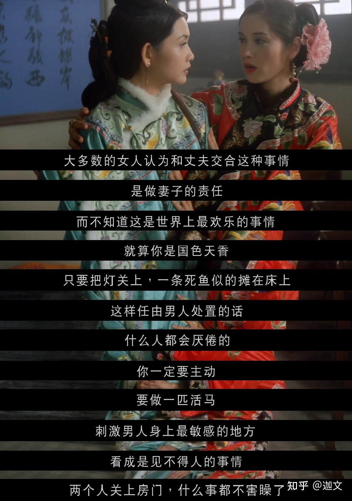
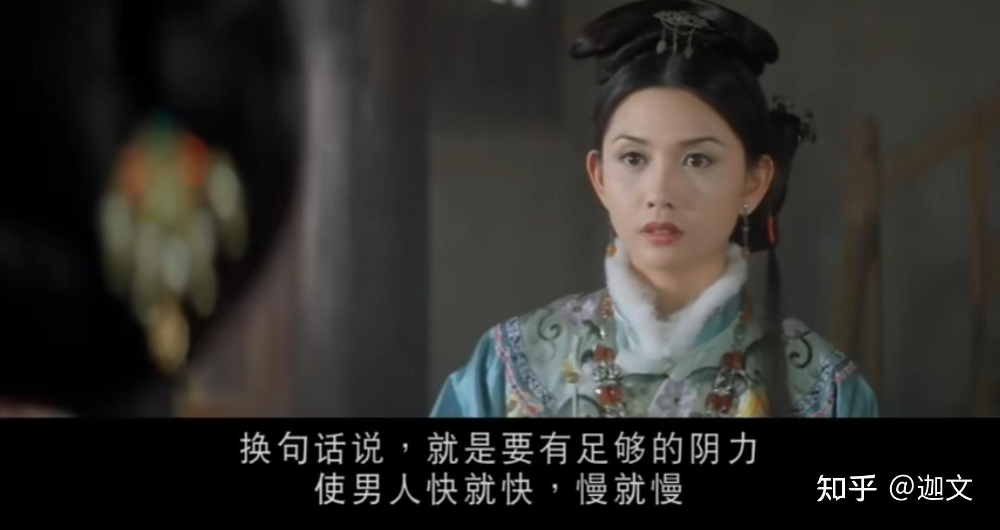
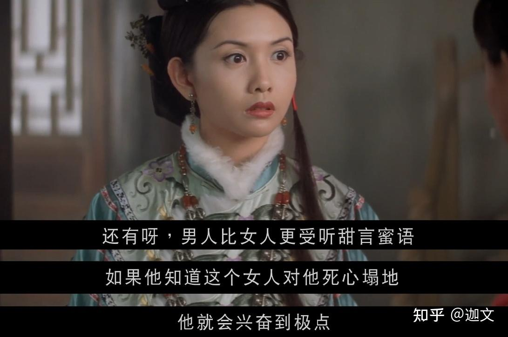
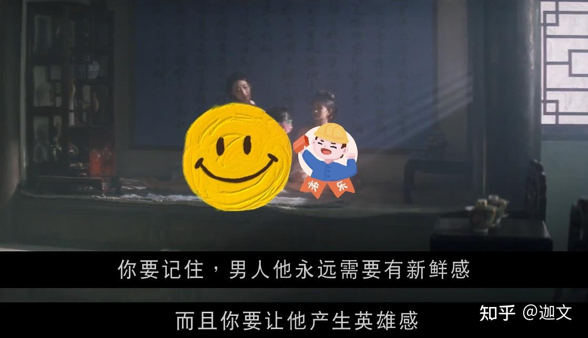
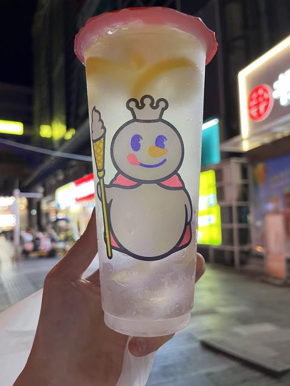
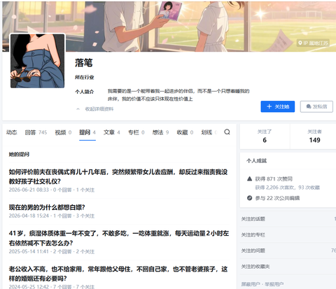

[toc]

发布于: 辽宁
创建时间: 2026-7-8 10:9:30
点赞总数: 2764
评论总数: 320
收藏总数: 4904
喜欢总数: 153

终于活到了老登的年纪，忍不住登味十足和未婚小姑娘说点什么。

  

 **1、床上功夫必不可少，事后软功夫也要到位。** 

这事对男的太重要了，男人对于女人的迷恋就是容貌和那方面的体验。

具体来讲呢就是解放思想，放下道德感和羞耻感，不要扭扭捏捏。试想一下，你的智人老祖宗断情绝欲、正义凛然...基因都灭绝了。

男女之间的亲密接触是你的责任，但也是世界上最快乐的事情。

⚠️⚠️⚠️这不是见不得人的事情，而且是和你合法的老公。

如果真的不知道怎么表现，让老公找点爱情动作电影，一起欣赏，一起学习。

很多情感博主也都卖这种房～中～术秘籍，这种见仁见智吧，以前我觉得怎么会有人学习这些，可不耽误情感博主赚的盆满钵满。

看来，大家都是嘴巴硬，身体很诚实。

男情女爱是最大的需求。

有需求就有市场。

  

反正我也是这岁数了，没有啥是我不能讲的。

接着说这件事，古人总结要练习坐冥纸。练到磨了20下之内，要把冥纸坐成一把扇子，而且下面的鸡蛋不能碎，要完整无缺。

以此达到什么目的呢？

下 面 有足够的力量，能让 男人 快就快，慢就慢。

时间虽然长点，至少3年，期间每天还都得 **坐瓮子，** 这样腿部和臀部肌肉会变得非常发达，这种训练不仅增强了身体素质，还会在性行为中能够达到超越常人极限的摆动，给人以极大的愉悦感。

仔细想想，不就是锻炼腿部肌肉和臀部肌肉吗？网上都有教程啊，就看能不能坚持。

如果你属于腰细腿粗类型，恭喜你，盆底肌发达的天赋型选手，基因上就占优势。

身体底子好，生命力旺盛，饮食上一定要注意，这个我说过无数遍了，现代人都低估了饮食对身体、情绪的影响。

如果你吃的不好，会变丑，老的也快，血糖不稳、炎症超标，女的都表现为妇科炎症，慢慢的身上会散发出异味。不是病理性的，是一种怎么代谢也代谢不出去的味道。

硬功夫的本质其实就是身体健康，生命力旺盛。

  

软功夫也很重要， **男人比女人更爱听甜言蜜语** ，所以，别觉得夸人的话恶心肉麻，无脑夸就是了，你还别说，男的就会当真！他听不出是假话。

 **男人的自尊心得到极大满足的时候，他就会兴奋到极点。** 

 **男人永远需要新鲜感，而且要让男人产生英雄感，说白了就是满足男人的自尊心。** 

高小凤一个服务员对明史能知道多少啊，也就能说上几句，剩下不都是高育良装X？

男人一装X自尊心可不就得到满足了。但面对自己妻子，一个明史专家，高育良可就没啥满足感了。

真不是我魅男，关键男的就是这样啊。

或许你会说我讨好男人，行吧，不耽误你去做独立大女主。

  

还有很想说一句：你没有需求，不代表别人没有需求，犯不着拿这事给自己抬咖。

关于这件事，郭延娇郭律师曾说过： **你作为丈夫，作为妻子，你有义务让你的伴侣觉得自己被爱、被珍视，这是义务啊，不是你的权利。** 

 **很多人伤害别人，还义正言辞的。** 伴侣有需求，你直接拒绝，还义正言辞的一年365天你有360天不愿意，你还觉得对方过分。

 **是你在伤害别人，这是婚姻的义务，不是你的权利，更不是兴趣。** 

 **你要是做不到，那你不结婚得了。** 

不要占着婚姻这个茅坑，你又不拉屎，你这个样子， **对别人的伤害是从心理里到身体，别人还说不出来。** 

婚姻的便宜，你全都占了，你有家庭有老公有孩子，搞的自己很完美。让对方在这个婚姻中度日如年，这个道理人家还讲不出去。

如果你就是没需求，身体不耐受这件事，那就解除婚姻关系，财产和孩子商量来，让对方寻找幸福去。别搞的自己很委屈。

 **这件事男女同理啊。** 

  

 **2、找个性欲旺盛的伴侣，然后观察对方在性需求得到满足后有没有正事做。** 

如果你想让婚姻这个公司走上持续盈利的道路，就要遵循最朴素的东西，接着再谈三观、思维方式等。

 **性欲旺盛的本质是身体好。**

  

原文地址：[36+中年妇女对未婚小姑娘的忠告](https://zhuanlan.zhihu.com/p/2057853022668075220) 

# 评论

1. <a href="https://www.zhihu.com/people/chang-an-jue-qiang">杨槿</a> (<small title="山西">2026-7-8 10:21:29</small>): 确实登味十足
   - <a href="https://www.zhihu.com/people/chun-ge-16-27-43">春哥</a> (<small title="安徽">2026-7-8 20:57:35</small>): 看文风语气是男人写的
   - **迦文** (<small title="回复于 2026-7-8 21:13:26/辽宁"> ✉️:春哥</small>): 可我是个中年妇女［捂嘴］
   - <a href="https://www.zhihu.com/people/chun-ge-16-27-43">春哥</a> (<small title="回复于 2026-7-8 22:17:58/安徽"> ✉️:迦文</small>): ［大笑］看来你非常了解男人
   - <a href="https://www.zhihu.com/people/jtbrwz">恒真</a> (<small title="回复于 2026-7-9 8:41:20/贵州"> ✉️:迦文</small>): 懂点床上功夫，知道床笫欢愉的女人其实很难得的。男女交合确实是双方最大的快乐，而不是责任或例行公事。
   - <a href="https://www.zhihu.com/people/fang-fa-14-47">新桐初引</a> (<small title="回复于 2026-7-9 9:30:19/安徽"> ✉️:迦文</small>): 中年妇女经验应该很多了，为什么不写点男的怎么更好服务女的
   - **迦文** (<small title="回复于 2026-7-9 9:59:36/辽宁"> ✉️:新桐初引</small>): 如果女的赚钱比男的多，那么男的必须服务于女的。  
 
但是，女的一般瞧不上比自己弱的男的。
   - <a href="https://www.zhihu.com/people/fang-fa-14-47">新桐初引</a> (<small title="回复于 2026-7-9 10:6:24/安徽"> ✉️:迦文</small>): 如果结婚是看谁钱多钱少，建议男人强强联合
   - <a href="https://www.zhihu.com/people/dejavu-60-21">dejavu</a> (<small title="回复于 2026-7-9 11:9:19/江苏"> ✉️:迦文</small>): 作者写的能实实在在的拉进亲密关系，营造充满爱的家庭氛围。可惜啊，这些绕指柔的内容是对抗性拉满的大龄剩女们理解不了的。
   - <a href="https://www.zhihu.com/people/52-17-13-67">四叶草</a> (<small title="回复于 2026-7-9 12:58:50/内蒙古"> ✉️:dejavu</small>): 真的是剩的吗［思考］我认为相比于女的，男的才更容易被剩下
   - <a href="https://www.zhihu.com/people/wdnmd-87-44">3Miku9</a> (<small title="回复于 2026-7-9 16:41:29/山西"> ✉️:四叶草</small>): 那就大家都剩着呗，自己的选择别后悔就行
   - <a href="https://www.zhihu.com/people/lisy-11-50">老鼠爱吃米</a> (<small title="回复于 2026-7-10 7:45:46/未知"> ✉️:dejavu</small>): 不是理解不了，是没遇到生理性喜欢的那个人
   - <a href="https://www.zhihu.com/people/sdfg-93-73">sdfg</a> (<small title="回复于 2026-7-10 11:11:9/上海"> ✉️:新桐初引</small>): 刘启：说的对，我就喜欢man
   - <a href="https://www.zhihu.com/people/sheng-dai-de-ti-cao">无独有偶</a> (<small title="回复于 2026-7-11 16:43:56/北京"> ✉️:新桐初引</small>): 反正你也没打算讨好男人，那你还搁这耍什么贫嘴？［捂嘴］
   - <a href="https://www.zhihu.com/people/sheng-dai-de-ti-cao">无独有偶</a> (<small title="回复于 2026-7-11 16:44:30/北京"> ✉️:四叶草</small>): 相亲市场男女比例1：3［大笑］
   - <a href="https://www.zhihu.com/people/sheng-dai-de-ti-cao">无独有偶</a> (<small title="回复于 2026-7-11 16:51:22/北京"> ✉️:新桐初引</small>): 别急，被秒删了
   - <a href="https://www.zhihu.com/people/fang-fa-14-47">新桐初引</a> (<small title="回复于 2026-7-11 17:1:10/安徽"> ✉️:无独有偶</small>): 看来你很焦虑呀，这么关注别人讨不讨好，评论有没有被删呢！［滑稽］［滑稽］
   - **迦文** (<small title="回复于 2026-7-11 17:4:38/辽宁"> ✉️:无独有偶</small>): 不不不，了解知乎的都知道，被删是系统秒删啊，我不删评论。
   - **迦文** (<small title="回复于 2026-7-11 17:4:51/辽宁"> ✉️:新桐初引</small>): 对对对，你说的好对［捂嘴］
   - <a href="https://www.zhihu.com/people/sheng-dai-de-ti-cao">无独有偶</a> (<small title="回复于 2026-7-11 20:5:44/北京"> ✉️:迦文</small>): 我没跟你说话啊。你咋老给我回复。我在跟那个新桐说话。
   - <a href="https://www.zhihu.com/people/luo-bi-13-46">落笔</a> (<small title="回复于 2026-7-12 19:35:36/江苏"> ✉️:dejavu</small>): 你理解，你去学嘛，又没人拦着你去学了
   - <a href="https://www.zhihu.com/people/luo-bi-13-46">落笔</a> (<small title="回复于 2026-7-12 19:40:45/江苏"> ✉️:无独有偶</small>): 别拿1:3的比例制造焦虑了，你连因果都没搞清。  
 
真相是：真正有本事的男人，早在校园、职场或朋友圈里就被内部消化了，根本不需要沦落到相亲市场被人挑挑拣拣。  
 
会去那里的，要么是迫不得已，要么就是被剩下的尾货。  
 
这就导致了一个死结：能剩下来的女性，往往是有能力赚钱养自己的优质女；而剩下的男性，很多是因为自身条件差才被剩下的。  
 
让优秀的独立女性去迁就低质的相亲男，这本身就是个无解的矛盾，怎么可能凑得拢？
   - <a href="https://www.zhihu.com/people/dejavu-60-21">dejavu</a> (<small title="回复于 2026-7-12 23:49:40/江苏"> ✉️:落笔</small>): 抱歉，如果答主出了男人版忠告篇我真会认认真真的学习。毕竟那是始于校园度过疫情熬过异地的我深爱着的人。
   - <a href="https://www.zhihu.com/people/sheng-dai-de-ti-cao">无独有偶</a> (<small title="回复于 2026-7-13 22:41:58/四川"> ✉️:落笔</small>): 所以到底是谁在愁呢？有能耐别去相亲啊［大笑］
   - <a href="https://www.zhihu.com/people/luo-bi-13-46">落笔</a> (<small title="回复于 2026-7-14 17:9:45/江苏"> ✉️:无独有偶</small>): 反正不关我的事，我有孩子，有房有车有事业，压根就不需要婚姻，也不需要结婚，男人死绝了都可以
   - <a href="https://www.zhihu.com/people/sheng-dai-de-ti-cao">无独有偶</a> (<small title="回复于 2026-7-14 22:10:58/四川"> ✉️:落笔</small>): 明白了。你捡的孩子
   - <a href="https://www.zhihu.com/people/ham-19-89">ham</a> (<small title="回复于 2026-7-15 5:14:16/海南"> ✉️:落笔</small>): 剩女不等于优质女性，哪来这么多优质女性。赚个一万叫优质女性，月薪万以上比例男性更多。卖货也要人识货，才叫好货［捂脸］
   - <a href="https://www.zhihu.com/people/luo-bi-13-46">落笔</a> (<small title="回复于 2026-7-15 13:28:1/江苏"> ✉️:无独有偶</small>): 孩子是男人捞我肚子生的，生孩子连哄带骗，生下来不闻不问，算是我捡的吧，只不过是我自己生的而已
   - <a href="https://www.zhihu.com/people/sheng-dai-de-ti-cao">无独有偶</a> (<small title="回复于 2026-7-16 18:32:26/四川"> ✉️:落笔</small>): 别扯别的，你就说没有男的你能不能有这孩子吧。再问个题外话，你孩子知道你这么想吗？［好奇］
   - <a href="https://www.zhihu.com/people/luo-bi-13-46">落笔</a> (<small title="回复于 2026-7-17 6:37:38/江苏"> ✉️:无独有偶</small>): 只是他刚好可用，不然我也可以去精子库挑选一个生，国家又不是不允许
   - <a href="https://www.zhihu.com/people/sheng-dai-de-ti-cao">无独有偶</a> (<small title="回复于 2026-7-17 8:5:1/四川"> ✉️:落笔</small>): 所以没男的会有精子库吗？人工合成？［好奇］。还有你另外两条被删了看不到。还有我发的另外一条你是选择性失明了吗？
   - <a href="https://www.zhihu.com/people/ting-ting-connie">Wertiofddhhjjbcv</a> (<small title="回复于 2026-7-21 15:24:4/广东"> ✉️:dejavu</small>): 能理解的是真正夫妻生活上在这方面受益的人，年轻时我也不懂，生完孩子才懂的，哈哈
   - <a href="https://www.zhihu.com/people/xiao-qiao-lao-shu-91">小桥老树</a> (<small title="回复于 2026-7-24 23:7:45/湖南"> ✉️:恒真</small>): 年纪大了，有兴趣了才一起做，日常还是做自己喜欢的事情
   - <a href="https://www.zhihu.com/people/wei-hong-li">他她它</a> (<small title="北京">2026-7-27 14:44:7</small>): 抠脚大汉写的
   - <a href="https://www.zhihu.com/people/james-62-41">Momo</a> (<small title="回复于 2026-8-9 17:27:3/山东"> ✉️:dejavu</small>): 有道理
   - <a href="https://www.zhihu.com/people/hnwz2008">hnwz2008</a> (<small title="回复于 2026-8-11 16:46:2/河南"> ✉️:新桐初引</small>): 这是抬杠了
   - <a href="https://www.zhihu.com/people/37-31-50-48">眼镜猫</a> (<small title="江苏">2026-8-14 8:47:11</small>): 啰里啰嗦一大堆无稽之谈，还是不结婚自由，省得婚后那么多事。上个班养活自己就行了。
   - **迦文** (<small title="回复于 2026-8-19 10:51:45/辽宁"> ✉️:新桐初引</small>): 写过，但被和谐了［捂脸］［捂脸］［捂脸］
2. <a href="https://www.zhihu.com/people/cang-cang-43-78">藏藏</a> (<small title="广东">2026-7-8 16:50:48</small>): ［捂脸］楼主，你性欲强但不是每个女人都一样，你老公性欲弱要靠挑逗是你老公个人的事，要因人而异，要个体化设计适配，真有就算死鱼那样躺着男人也欲罢不能的女人的哦，人家不是不会，是不需要也没必要，再加一点挑逗那简直不能过日子了，因为生活除了这点儿事还有很多有趣的好吗？不能全在床上过。。
   - **迦文** (<small title="辽宁">2026-7-8 16:54:49</small>): 你是对的。
   - <a href="https://www.zhihu.com/people/wei-0i">喂0I</a> (<small title="回复于 2026-7-8 16:59:39/河北"> ✉️:迦文</small>): 楼主的回答很棒［赞］
   - <a href="https://www.zhihu.com/people/lu-xiang-28">城北徐公</a> (<small title="江苏">2026-7-9 10:9:47</small>): 对对对，你说的对！
   - <a href="https://www.zhihu.com/people/miriam-38-27">Miriam</a> (<small title="浙江">2026-7-9 10:11:54</small>): 关键她还都是服务男性的角度出发 男的才是该多学一下的 别只顾自己舒服
   - <a href="https://www.zhihu.com/people/huang-mao-27-63">黄猫</a> (<small title="回复于 2026-7-9 10:47:50/重庆"> ✉️:迦文</small>): ［赞］［doge］
   - <a href="https://www.zhihu.com/people/zhou-yuan-48-69">舟自恒</a> (<small title="回复于 2026-7-9 13:13:55/湖北"> ✉️:Miriam</small>): 相互学习吧
   - <a href="https://www.zhihu.com/people/liu-liu-liu-8-5-89">keyboard man</a> (<small title="广东">2026-7-10 9:10:22</small>): 太卷了
   - <a href="https://www.zhihu.com/people/6-89-61-26">云飞</a> (<small title="山东">2026-7-10 13:39:8</small>): 楼主都懒得跟你抬杠！
   - <a href="https://www.zhihu.com/people/sha-bu-la-ji-de-dk">阿你好赛哟</a> (<small title="山东">2026-7-10 14:54:57</small>): 你是对的［大笑］
   - <a href="https://www.zhihu.com/people/cang-cang-43-78">藏藏</a> (<small title="回复于 2026-7-10 17:38:40/广东"> ✉️:云飞</small>): 抬杠这个词的确包治说不过［发呆］
   - <a href="https://www.zhihu.com/people/ru-feng-zai">法徒铭纹</a> (<small title="回复于 2026-7-11 8:35:48/山东"> ✉️:迦文</small>): 有些事儿，是劝不明白的。
   - <a href="https://www.zhihu.com/people/aphonia-sniper">广思</a> (<small title="北京">2026-7-12 15:21:22</small>): 那是你小概率的遇到练视苉了
   - <a href="https://www.zhihu.com/people/cang-cang-43-78">藏藏</a> (<small title="回复于 2026-7-13 8:47:3/广东"> ✉️:广思</small>): 楼主这种才是小概率的，概率问题你得看自然性［捂脸］，自然设计男女是为繁衍服务的，以激素推动，所以性需求是有大差别的，再加上人为挑逗？不是所有都受得住。。甚至育后女性会倾向于把精力转给孩子而不是性。。客观地说一说罢了，你是男人我当然建议你找楼主那种女人，以达成大和谐。。但绝对数摆在那里，她的建议只适用于同类的情况
   - <a href="https://www.zhihu.com/people/aphonia-sniper">广思</a> (<small title="回复于 2026-7-13 8:50:3/北京"> ✉️:藏藏</small>): 说到自然 那你可撞我枪口上了 动物都知道发情的去找发情期的［捂脸］
   - <a href="https://www.zhihu.com/people/cang-cang-43-78">藏藏</a> (<small title="回复于 2026-7-13 8:52:34/广东"> ✉️:广思</small>): 这辈子只有发情期？［捂脸］
   - <a href="https://www.zhihu.com/people/aphonia-sniper">广思</a> (<small title="回复于 2026-7-13 8:53:27/北京"> ✉️:藏藏</small>): 人类没有发情期
   - <a href="https://www.zhihu.com/people/cang-cang-43-78">藏藏</a> (<small title="回复于 2026-7-13 8:54:2/广东"> ✉️:广思</small>): 枪啥口？客观就是客观，讨论个客观事情用私利倾向用预设结论说话？
   - <a href="https://www.zhihu.com/people/cang-cang-43-78">藏藏</a> (<small title="回复于 2026-7-13 8:56:17/广东"> ✉️:广思</small>): 你这句话又不客观了，你得去看一些生理知识。
   - <a href="https://www.zhihu.com/people/tao-zhu-gong-35">陶朱公</a> (<small title="浙江">2026-7-13 11:9:54</small>): 楼主话都懒的和她说
   - <a href="https://www.zhihu.com/people/cang-cang-43-78">藏藏</a> (<small title="回复于 2026-7-13 11:28:58/广东"> ✉️:陶朱公</small>): 嗤！你们也就自嗨
   - <a href="https://www.zhihu.com/people/hua-qing-21-96">桦清</a> (<small title="回复于 2026-7-13 12:2:5/广东"> ✉️:藏藏</small>): 因为女性育后将精力转向孩子而不是性，因此男性就应该压制点自己，而不要在那方面有太多要求？是这个意思么？纯讨论，没有指责哪一方的意思
   - <a href="https://www.zhihu.com/people/cang-cang-43-78">藏藏</a> (<small title="回复于 2026-7-13 12:12:47/广东"> ✉️:桦清</small>): 不是啊，大和谐也要照顾男方需求啊，所以我说的一直是实事求是，因人而异。。楼主说的这情况我是支持她做法的，但也得看到有其它情况，男人纵欲对自己身体也不好的，女方也该适当帮忙控制，而且人也当有其它一些个人性的爱好，也要适当分精力照顾后代。。所以过犹不及，不能光纠缠在床上。。应该根据实际情况作对策，具体人具体分析，只以家庭幸福，夫妻孩子身心健康为最终目标。
   - <a href="https://www.zhihu.com/people/hua-qing-21-96">桦清</a> (<small title="回复于 2026-7-13 13:30:4/广东"> ✉️:藏藏</small>): 不要纵欲，注意适当，这肯定是毋庸置疑的。我理解楼主应该是觉得太多的女性不重视这方面，甚至对伴侣这方面的正常要求都不以为然（至于个人观念的原因，觉得这方面脏，下贱，这种就没必要讨论了），因此楼主强调这些而已。其实从和谐和所谓真爱的角度而言，无论男女，都要学习和了解如何优化这方面，让对方开心而不是单单自己爽。想来肯定有女的一动不动男的也如饥似渴的，但个人感觉这样的情况应该不多吧？指的是至少经历了几年婚姻生活的，那些年轻时候或新婚期间的，就不要去讨论了。
   - <a href="https://www.zhihu.com/people/cang-cang-43-78">藏藏</a> (<small title="回复于 2026-7-13 15:4:41/广东"> ✉️:桦清</small>): 这个我说了没反对楼主。。［捂脸］但深入了解到一些家庭，女方烦恼的是，太多。。我说的情况，并不少，你得从高一维度的男女自然性激素上看。。不是什么脏不脏的问题，是社会生存压力客观也存在，如果你有钱你养了保姆照顾好孩子处理好家务，女人只需要打扮美美的，锻炼柔韧性，练好床上技术，你自然有资格享受一切，有钱人都供着娇妻不沾阳春水，不是人家傻，但是很多时候，女人要应付很多方面压力，还要貌美如花地搞提供优质性服务？以女人那种弱兮兮体质能撑得住才怪，古人都知道这种瘦马型女人要重金养的。  
 
男人为什么不一样？性方面的事，对男人来说，反而是一种解压的。。但对女人来说，就未必甚至相反了，你要晓得，有些女人高潮都是装的，甚至一辈子达不到（看看客观研究数据）。。真能搞定女人高潮的男人绝对数少，也很抢手。。这种根本不需刻意迎合，女人天然能很痴缠。  
 
楼主其实很聪明，女人用性当然可以交换到很多东西，冠以幸福名义，前提是，男女都还有余力。普通人家吧，别那么高要求了，双方都舒服就好。。楼主那种，嘿，她老公未必不头疼。
   - <a href="https://www.zhihu.com/people/aphonia-sniper">广思</a> (<small title="回复于 2026-7-14 10:38:35/北京"> ✉️:藏藏</small>): 人类发情期是几月份啊？
   - <a href="https://www.zhihu.com/people/cang-cang-43-78">藏藏</a> (<small title="回复于 2026-7-14 12:25:18/广东"> ✉️:广思</small>): ［捂脸］论月么？你这辈子没对女人有兴致高昂时段？不是所有人都萎的好吗？
   - <a href="https://www.zhihu.com/people/ham-19-89">ham</a> (<small title="海南">2026-7-15 5:18:15</small>): 人家就探讨一下。你那点生活乐趣，谁没经历过没。［捂脸］
   - <a href="https://www.zhihu.com/people/yang-shi-hao-63">莓良心</a> (<small title="上海">2026-7-17 8:12:2</small>): 确实是因人而异的，但是现在很多人结婚都会因为顾忌这个，从而不谈性生活，其实无非 聊的到一起，吃的到一起，睡得到一起（换而言之就是三观一致，经济基础差不多，性生活和谐），最起码得满足一方面需求，不然两个人在一起干嘛？
   - <a href="https://www.zhihu.com/people/cang-cang-43-78">藏藏</a> (<small title="回复于 2026-7-17 9:57:13/广东"> ✉️:莓良心</small>): 说的没问题啊，我又不反对！不过是说每家情况不同
   - <a href="https://www.zhihu.com/people/cang-cang-43-78">藏藏</a> (<small title="回复于 2026-7-17 13:59:14/广东"> ✉️:莓良心</small>): 这么说吧……长相前七成女生，哪怕长红爷那样都轻易能激起男性性欲，前三成男生才能成功频繁激起女性性欲，而且女人更倾向于情绪安抚，表现为美食聊天，为了总体平衡吧，男人学些挑逗的本事比女人学有用得多。
   - <a href="https://www.zhihu.com/people/cang-cang-43-78">藏藏</a> (<small title="回复于 2026-7-17 14:0:0/广东"> ✉️:莓良心</small>): 两个人在一起同居可以只看爱情和性，但结婚，主要还是为养育后代
   - <a href="https://www.zhihu.com/people/xiao-zhu-94-89">小主</a> (<small title="广西">2026-7-20 12:0:35</small>): 哈哈哈哈破防了
   - <a href="https://www.zhihu.com/people/cang-cang-43-78">藏藏</a> (<small title="回复于 2026-7-22 21:40:49/山西"> ✉️:小主</small>): ［捂脸］虚空扣帽子真厉害
   - <a href="https://www.zhihu.com/people/chen-xi-yu-lu-65-79">南柯一梦</a> (<small title="河南">2026-7-26 10:24:6</small>): 说的很对，喜欢的啥也不做 也是激情澎拜，不喜欢做啥都没用
   - <a href="https://www.zhihu.com/people/jiang-zhu-cao-41-8">绛珠草</a> (<small title="内蒙古">2026-7-26 14:50:31</small>): 你还真自信！
   - <a href="https://www.zhihu.com/people/13855490605">相逢</a> (<small title="回复于 2026-7-27 14:35:23/安徽"> ✉️:迦文</small>): 苦口婆心 难劝要死的鬼。。［捂脸］
   - <a href="https://www.zhihu.com/people/cang-cang-43-78">藏藏</a> (<small title="回复于 2026-7-27 20:19:2/山西"> ✉️:绛珠草</small>): ［捂脸］和自信不自信有啥关系？你多和几个幸福家庭的妻子聊聊就懂了。。结婚几年以上那种。。新婚没代表性
   - <a href="https://www.zhihu.com/people/cang-cang-43-78">藏藏</a> (<small title="回复于 2026-7-27 20:29:30/山西"> ✉️:绛珠草</small>): 生理性喜欢的那种，真的床上完全不动，甚至满面抗拒，对方也时刻想要，平时一举一动一嗔一笑，甚至生气恼怒，都能刺激到欲望的（其实不分男女啊）。。楼主那种，实际中，感觉事实是她先生对她没那么有性趣。。［捂脸］
   - <a href="https://www.zhihu.com/people/song-zhao-yang-76-51">风吹雁雪</a> (<small title="回复于 2026-7-29 1:3:40/湖南"> ✉️:藏藏</small>): 她已经说明白了，性方面，男女一样。她应该是有高人指点，你是看不到认知以外的东西。
   - <a href="https://www.zhihu.com/people/cang-cang-43-78">藏藏</a> (<small title="回复于 2026-7-29 7:47:2/山西"> ✉️:风吹雁雪</small>): 是你们看不到认识外的东西，不可能一样的，激素类和刺激点和频繁度和自然生理目的都不一样，建议你们了解一下性科学，从广泛性说话，而不是从个人经验说话
   - <a href="https://www.zhihu.com/people/wei-si-li-26">卫斯理</a> (<small title="泰国">2026-7-29 9:53:23</small>): 楼主写了那么多你就记住了一句死鱼，那看来这句戳的最痛
   - <a href="https://www.zhihu.com/people/cang-cang-43-78">藏藏</a> (<small title="回复于 2026-7-29 18:43:34/山西"> ✉️:卫斯理</small>): ［捂脸］你幻想力很丰富
   - <a href="https://www.zhihu.com/people/song-zhao-yang-76-51">风吹雁雪</a> (<small title="回复于 2026-8-1 19:16:50/湖南"> ✉️:藏藏</small>): 我以前看了一部阿根廷的电影，好像是个西班牙还是意大利一个姑娘去阿根廷，然后和那个男做的时候，他的灵魂到了巴塞罗那。事后和那个女的说，真去巴塞罗那。我一直觉得那个情节有夸张的手段，最近我学了一些东西，这个现象确实会存在。什么叫鱼水之欢。
   - <a href="https://www.zhihu.com/people/cang-cang-43-78">藏藏</a> (<small title="回复于 2026-8-1 23:56:47/广东"> ✉️:风吹雁雪</small>): ［发呆］找到生理性喜欢的那个人超难的，楼主说的是靠主动性弥补，也没错吧，但遇到了的人才懂得，这事儿根本不需要刻意。。真生理喜欢那种，反而要适当控制。所以说，不能一概而论
   - <a href="https://www.zhihu.com/people/34-12-69-11">随性人生</a> (<small title="回复于 2026-8-3 17:48:2/辽宁"> ✉️:藏藏</small>): 作者懒得理你，但是我说几句，爱听就听。  
 
男欢女爱不仅仅在床上，更多的是在生活中，比如充满爱意的骚扰和触摸，拥抱和爱抚。  
 
对于男人来说，没有任何东西比得上爱人的一个笑脸和拥抱更能解压了。  
 
而且，互相之间的骚扰和挑逗，是维持婚姻最好的东西。谁试谁知道
   - <a href="https://www.zhihu.com/people/cang-cang-43-78">藏藏</a> (<small title="回复于 2026-8-4 9:33:5/广东"> ✉️:随性人生</small>): 你懂得我说啥了吗？真会发散。［捂脸］驳不过就搞一堆理由，还左右扯
   - <a href="https://www.zhihu.com/people/cang-cang-43-78">藏藏</a> (<small title="回复于 2026-8-4 9:38:42/广东"> ✉️:随性人生</small>): 谁试谁知道？你有对象了没，结婚了没，结几年了？圈子里是结几年有儿女的幸福家庭多还是单身者靠幻想的多？有没和这种家庭女性深入聊过这方面问题。。你如果是男性，没体验过女性生理，也没体验过恩爱夫妻的长久日子，出于个人利益立场偏颇说话，那不叫客观的理。
   - <a href="https://www.zhihu.com/people/cang-cang-43-78">藏藏</a> (<small title="回复于 2026-8-4 9:50:57/广东"> ✉️:随性人生</small>): 骚扰挑逗不需要刻意装的，甚至很多时候是无意的，遇到那个真合适的人后，做自己就是一种强烈挑逗，装出来的矫出来的根本不长久，很容易离的，你究竟懂不懂？
   - <a href="https://www.zhihu.com/people/cang-cang-43-78">藏藏</a> (<small title="回复于 2026-8-4 10:53:23/广东"> ✉️:随性人生</small>): 再给你举些例子吧，有个朋友家庭，人家就是爱妻子的清冷高傲和欲拒还迎；还有个女的是纯纯说话的模样特吸引她老公，有点华妃那样冷嘲热讽的，她好端端的旁边自己说话呢，老公看见就想扑了她；还有个被爱的原因是翘手指歪头的方式特娇滴滴，但人家小学就这样了，不是什么专门挑逗；我当年同桌收到玫瑰是因为那男的爱被她凶，被骂爽了。。就些都是从小的自然习性，不需刻意的，蛇缠那种挑逗不是人人爱的，别自以为是。甚有玩得花的，扭打也是情趣。。别估量着老靠强装，难道对方看不出来？不反感？当然也有其它例外，所以我说因人而异，有问题吗？
   - <a href="https://www.zhihu.com/people/42-92-35-32">待退休人士</a> (<small title="回复于 2026-8-5 18:38:6/浙江"> ✉️:迦文</small>): 8/凸［打招呼］［百分百赞］）。。/［打招呼］［打招呼］［打招呼］［打招呼］［打招呼］［打招呼］。
   - <a href="https://www.zhihu.com/people/ma-xiao-jie-62-35">星月酒</a> (<small title="回复于 2026-8-7 7:59:31/广东"> ✉️:藏藏</small>): 看看回复你那些男的就知道他们在想啥了，你都多余回［飙泪笑］
   - <a href="https://www.zhihu.com/people/song-zhao-yang-76-51">风吹雁雪</a> (<small title="回复于 2026-8-14 3:27:56/湖南"> ✉️:藏藏</small>): 性心理喜欢，你找到这样的人，跟你中彩票那种感觉差不多。但的确可以通过锻炼达到这样的境界，但是人有个厌倦期，就是“雄鸡效应”。
   - <a href="https://www.zhihu.com/people/cang-cang-43-78">藏藏</a> (<small title="回复于 2026-8-14 11:27:23/广东"> ✉️:风吹雁雪</small>): 又回到原观点了，女找男的难，男找女的不难。。所以人家夫妻根据情况自己调节平衡，论不到楼主用自己的特例指手画脚
   - <a href="https://www.zhihu.com/people/cang-cang-43-78">藏藏</a> (<small title="回复于 2026-8-15 15:23:20/广东"> ✉️:风吹雁雪</small>): 感觉锻炼不行，天生的，一眼过去，内心究竟想不想睡这个人，成就成，不成就不成。强扭的瓜装不了一辈子的甜
   - <a href="https://www.zhihu.com/people/er-shi-fu-59">二师傅</a> (<small title="回复于 2026-8-17 7:38:53/河北"> ✉️:迦文</small>): 智者从不与人争辩
   - <a href="https://www.zhihu.com/people/xiang-pang-de-shou-zi-74">想胖的瘦子</a> (<small title="回复于 2026-8-17 14:21:9/江苏"> ✉️:迦文</small>): 这五个字的回答就很有水平［酷］
3. <a href="https://www.zhihu.com/people/max-ray">想辉的鱼</a> (<small title="美国">2026-7-11 12:26:17</small>): 说得很对，男生少年时期肥胖，会影响下面的发育。简单来说就是脂肪细胞会侵占睾丸和激素分泌器官。所以你说的第六点是有科学依据的
4. <a href="https://www.zhihu.com/people/song-shan-93-68">樱桃草莓</a> (<small title="湖南">2026-7-8 12:31:14</small>): 懂了，直接去看邱淑贞演的电影《慈禧的秘密生活》［惊喜］ 
   - <a href="https://www.zhihu.com/people/yi-shi-feng-hua-57-90">吱唔猪</a> (<small title="广东">2026-7-9 9:41:36</small>): 这理解力顶尖［捂脸］
   - <a href="https://www.zhihu.com/people/cang-lang-ruo-shui">青衫仗剑行</a> (<small title="内蒙古">2026-7-9 10:8:24</small>): 我正想问下文中电影是何名
   - <a href="https://www.zhihu.com/people/song-shan-93-68">樱桃草莓</a> (<small title="回复于 2026-7-9 12:54:9/湖南"> ✉️:青衫仗剑行</small>): 不用谢，请叫我雷锋［酷］
   - <a href="https://www.zhihu.com/people/peon">momo</a> (<small title="回复于 2026-7-10 13:33:37/广东"> ✉️:樱桃草莓</small>): 谢谢雷锋
   - <a href="https://www.zhihu.com/people/long-zhu-81-77">龙珠</a> (<small title="江西">2026-7-10 15:23:32</small>): 孝庄秘史
   - <a href="https://www.zhihu.com/people/fen-li-qian-xing-57">奋力前行</a> (<small title="四川">2026-7-12 15:45:49</small>): 咱自己演［惊喜］
5. <a href="https://www.zhihu.com/people/ju-zi-pi-3-21">橘子皮</a> (<small title="河北">2026-7-8 18:3:46</small>): 一个男人看到这个都感觉是人间清醒，给的忠告都很贴切，这样充满正能量的女性不多见［赞］［赞］
   - <a href="https://www.zhihu.com/people/5grdpkv">知乎用户lfO2pg</a> (<small title="云南">2026-7-13 14:40:59</small>): 哈哈哈哈
   - <a href="https://www.zhihu.com/people/esets">Esets</a> (<small title="北京">2026-7-13 17:36:39</small>): 还没到36的女的看完了已经不想找男人了
   - <a href="https://www.zhihu.com/people/ju-zi-pi-3-21">橘子皮</a> (<small title="回复于 2026-7-13 19:6:55/河北"> ✉️:Esets</small>): 还没碰到合适的［感谢］
   - <a href="https://www.zhihu.com/people/esets">Esets</a> (<small title="回复于 2026-7-14 18:40:32/北京"> ✉️:橘子皮</small>): 看完了已经没有信心找了，你说咋办吧
   - <a href="https://www.zhihu.com/people/ling-er-16-45-84">凌儿</a> (<small title="回复于 2026-8-9 22:30:35/北京"> ✉️:Esets</small>): 40多的女人告诉你，大部分男人都不值得～ 不信你随便加一个育儿群宝妈群看看～
   - <a href="https://www.zhihu.com/people/ling-er-16-45-84">凌儿</a> (<small title="回复于 2026-8-9 22:31:35/北京"> ✉️:Esets</small>): 你们这一代，想结婚的女人只会更少～
   - <a href="https://www.zhihu.com/people/esets">Esets</a> (<small title="回复于 2026-8-10 0:16:54/北京"> ✉️:凌儿</small>): ［捂脸］
6. <a href="https://www.zhihu.com/people/tao-li-bu-yan-24-74">桃李不言</a> (<small title="广西">2026-7-8 11:36:49</small>): 子宫有问题不一定是私生活不干净，也有可能是生育带来的不可逆转的损伤。去搜一下剖腹产后遗症。
   - <a href="https://www.zhihu.com/people/nina-76-20">知乎用户Xuvfbu</a> (<small title="江苏">2026-7-8 14:33:42</small>): 啊？？？？
   - <a href="https://www.zhihu.com/people/yu-han-52-96">一抹晨光</a> (<small title="回复于 2026-7-9 12:22:48/浙江"> ✉️:知乎用户Xuvfbu</small>): 又来了
   - <a href="https://www.zhihu.com/people/xin-nian-65-83">淼淼</a> (<small title="回复于 2026-7-11 15:17:8/海南"> ✉️:一抹晨光</small>): 你有子宫吗？有些人产后宫颈糜烂你知道吗？
   - <a href="https://www.zhihu.com/people/jing-jing-55-12-43">不知</a> (<small title="回复于 2026-7-26 14:22:34/陕西"> ✉️:淼淼</small>): 是的，慢性宫颈炎宫颈糜烂
   - <a href="https://www.zhihu.com/people/ling-er-16-45-84">凌儿</a> (<small title="北京">2026-8-9 22:32:53</small>): 贴主是男性，因为他完全不理解女性的想法［捂脸］
7. <a href="https://www.zhihu.com/people/41-29-98-75-4">上官丽</a> (<small title="北京">2026-7-8 12:56:1</small>): ［思考］英雄所见相同。以前我曾经在贴吧里跟别人说过，1、做爱，就是夫妻生活，意思是只有道德及法律都认可的夫妻关系才可以做的事；2、两口子关起门来决定之后，就大大方方的，就当自己是正在享受欢愉的动物而已。
   - <a href="https://www.zhihu.com/people/a-cai-45-40">阿猜</a> (<small title="浙江">2026-7-15 15:22:38</small>): 我也很认可答主说的，她说到了很多方面，是很符合实际的。夫妻关系最重要的就是性，放在第一步，很多年轻女孩觉得没有性无所谓，但是正常男的不一样性是夫妻第一需求。
   - <a href="https://www.zhihu.com/people/98-92-12-75-46">知乎用户暖</a> (<small title="陕西">2026-7-23 15:32:42</small>): 不知你是男是女？但是，有个问题我想问，就是有过前任的男女，如果在床上放的太开，会不会让对方想起以前啊［捂脸］，虽然我是二婚，已经36了，我老公33一婚，彼此都有过前任，不止一个，我也总是很纠结，我们都挺保守的，感觉很传统，也都很克制，比如连续两天我都会不好意思，看得出来他也是，很多时候他如果想要一般也不明说，我更不好意思开口，如果说了有一方拒绝另一个也立马答应绝不纠缠。比如结婚当晚，睡在他家，他就亲呀亲，我是觉得今天很累而且怕被他父母听到，我就说改天吧，然后他就说好［捂脸］。我感觉我俩好奇葩啊，加起来都能退休的人了。会因为这个不好意思，夫妻会因为一方很开放被另一方用有色眼镜看待吗？真的是心里有包袱做不到像动物那样感受欢愉
   - **迦文** (<small title="回复于 2026-7-23 17:6:7/辽宁"> ✉️:知乎用户暖</small>): 我是女的呀
   - <a href="https://www.zhihu.com/people/41-29-98-75-4">上官丽</a> (<small title="回复于 2026-7-23 21:10:32/新疆"> ✉️:知乎用户暖</small>): 我？和丈夫相识时都是处子身，从婚前同居的开头就曾经把这事给商量透了，于是他帮忙立了三条规矩——壹、婚前不做爱，理由是万一我们中的任何一人反悔了可以全身而退，而且为了这一点，他在沙发上睡了一年；二、彼此相互尊重对方，这是双向的，除了特别严重的客观情况，如生病、累得腰酸背痛不想动什么的，那就不来了；三、俩人平时可以随时粘糊撩骚。
8. <a href="https://www.zhihu.com/people/53-23-91-85">小草</a> (<small title="上海">2026-7-8 17:13:9</small>): 此文价值千金，哪些离婚的、分手的。不能说全部是性的问题，最少有90%以上都是性生活不和谐而导致的。
   - <a href="https://www.zhihu.com/people/ban-ma-ban-ma-40-36-90">斑马斑马</a> (<small title="吉林">2026-7-9 6:42:45</small>): 真的么？
   - <a href="https://www.zhihu.com/people/jtbrwz">恒真</a> (<small title="贵州">2026-7-9 8:43:49</small>): 确实是的。夫妻性生活和谐，同等条件下，离婚率会大大降低。
   - <a href="https://www.zhihu.com/people/ru-feng-zai">法徒铭纹</a> (<small title="回复于 2026-7-11 8:36:37/山东"> ✉️:斑马斑马</small>): 真的
   - <a href="https://www.zhihu.com/people/luo-bi-13-46">落笔</a> (<small title="江苏">2026-7-12 10:40:13</small>): 有没有可能性生活不和谐是男人床上不行？
   - <a href="https://www.zhihu.com/people/zhen-xiang-bu-ming">真相不明</a> (<small title="上海">2026-7-14 13:26:5</small>): 应该是三观不合吧？
   - <a href="https://www.zhihu.com/people/lian-yuan-yuan-35-10">若曦</a> (<small title="广东">2026-8-2 8:17:9</small>): 我就是
   - <a href="https://www.zhihu.com/people/ling-er-16-45-84">凌儿</a> (<small title="北京">2026-8-9 22:43:7</small>): 法律数据显示，大部分离婚是女性提出来的。女性对婚姻不满～ 大部分男人都不能独立养家，还的老婆出门工作，也雇不起保姆，还的老婆干家务～所以男人多研究如何保持自身魅力，不变成中年老登更有意义，对社会和家庭风有价值～ 当然自身比较成功的或本身家底好的那一波男性，自然不缺不断挑逗他们的女性，人家也不把这些当回事儿，结婚也是强强联手，除非同圈层的漂亮聪明的女性看不上他。
   - <a href="https://www.zhihu.com/people/30-62-50-66-68">咕咕</a> (<small title="回复于 2026-8-10 3:3:22/辽宁"> ✉️:凌儿</small>): 人人可以有汽车，住房等等是可以的，人人有司机，飞机，保姆，这是与现实事实冲突的，基本原理性错误。
9. <a href="https://www.zhihu.com/people/30-71-2-39-49">乌梅茶</a> (<small title="湖北">2026-7-11 18:39:15</small>): 以前觉得不重要 ，到了中年知道很重要了，好多中年男人出轨就是因为外面的女人会来事
   - <a href="https://www.zhihu.com/people/zhen-xiang-bu-ming">真相不明</a> (<small title="上海">2026-7-14 13:41:2</small>): 问题在于感受到“会来事”之前，原配问题已经  
 
非常岌岌可危了吧？
   - <a href="https://www.zhihu.com/people/30-71-2-39-49">乌梅茶</a> (<small title="回复于 2026-7-15 16:3:45/湖北"> ✉️:真相不明</small>): 是的，已经知道他去商k 好多次了，渣男
10. <a href="https://www.zhihu.com/people/duo-xia-mu-yan">朵夏沐妍</a> (<small title="新加坡">2026-7-8 13:59:28</small>): 直接点，告诉我卖啥的？
    - <a href="https://www.zhihu.com/people/ban-ma-ban-ma-40-36-90">斑马斑马</a> (<small title="吉林">2026-7-9 6:43:16</small>): 哈哈哈
11. <a href="https://www.zhihu.com/people/uumin-85">nnmin</a> (<small title="湖南">2026-7-15 22:21:7</small>): 深知博主说的都很对，可是现实生活中女人要工作，要带孩子，做家务，有时候要照顾老人，老公并不多体贴，这样的白天过去了，晚上还能兴致盎然还要有服务意识真的很难
    - <a href="https://www.zhihu.com/people/xixi-50-22-11">xixi</a> (<small title="四川">2026-7-28 13:31:49</small>): 不可否认，这样的日子还不如🐔除非另一半真的值得付出
12. <a href="https://www.zhihu.com/people/lu-yue-hai-77">海纳百川</a> (<small title="山东">2026-7-9 5:47:29</small>): 如果没有什么疾病的话，身体确实是最诚实的，爱他就他最好的，至少得尽力配合他的身体。同样，如果真的不爱，逢场作戏，身体也是不好掩饰的。
13. <a href="https://www.zhihu.com/people/an-ni-ta-85-15">安妮塔</a> (<small title="安徽">2026-7-9 10:56:16</small>): 我只有一个好奇的点，花了这么多功夫去做这些事情，能得到什么好处呢？慈溪最终得到了一个帝国，虽然是千疮八孔的。普通人在三室一厅里搞这么高端的技术，能得到什么［思考］
    - <a href="https://www.zhihu.com/people/yu-han-52-96">一抹晨光</a> (<small title="浙江">2026-7-9 12:34:36</small>): 得到如胶似漆的夫妻关系，然后各种幸福
    - <a href="https://www.zhihu.com/people/max-ray">想辉的鱼</a> (<small title="美国">2026-7-11 12:29:24</small>): 快乐不是靠物质衡量的，物质只是一个因素，但最终的快乐还得来自内心。身体的舒适感受也是一个重要来源
    - <a href="https://www.zhihu.com/people/sheng-dai-de-ti-cao">无独有偶</a> (<small title="北京">2026-7-11 16:47:25</small>): 你写了这么多字发出来又得到什么了？
    - **迦文** (<small title="回复于 2026-7-11 16:51:1/辽宁"> ✉️:无独有偶</small>): 想不通的时候从利益角度想呢。
    - <a href="https://www.zhihu.com/people/sheng-dai-de-ti-cao">无独有偶</a> (<small title="回复于 2026-7-11 16:52:23/北京"> ✉️:迦文</small>): 这帮大女主是为了那点面子活的［捂嘴］
    - <a href="https://www.zhihu.com/people/ai-mi-27-46">小白</a> (<small title="上海">2026-7-12 3:47:29</small>): 其他我不敢说，至少出轨率可以降低不少…［捂脸］
    - <a href="https://www.zhihu.com/people/fen-li-qian-xing-57">奋力前行</a> (<small title="四川">2026-7-12 15:46:51</small>): 欲仙欲死，升天啊［惊喜］
    - <a href="https://www.zhihu.com/people/zhen-xiang-bu-ming">真相不明</a> (<small title="上海">2026-7-14 13:44:29</small>): 慈禧？
    - <a href="https://www.zhihu.com/people/yi-ran-zi-de-3-41">怡然自得</a> (<small title="福建">2026-8-15 10:27:34</small>): 得到一个满心满眼都是你的老公，而不是相互算计，彼此冷言冷语，过得生不如死的家庭生活。
14. <a href="https://www.zhihu.com/people/53-23-91-85">小草</a> (<small title="上海">2026-7-9 8:8:27</small>): 如果把两性生活比做盖楼房，那么性就是地基，你说地基不稳，楼不会塌吗？
    - <a href="https://www.zhihu.com/people/yun-duo-72-56-69">云朵很好奇</a> (<small title="河南">2026-7-10 6:37:26</small>): 共同利益是地基。没有比这个更稳的。
    - <a href="https://www.zhihu.com/people/ru-feng-zai">法徒铭纹</a> (<small title="回复于 2026-7-11 8:37:40/山东"> ✉️:云朵很好奇</small>): 不是，利益是建立在相互关系上的，夫妻关系没了，利益保不住。夫妻之间，性爱是最根本的交流。
    - <a href="https://www.zhihu.com/people/max-ray">想辉的鱼</a> (<small title="回复于 2026-7-11 12:30:55/美国"> ✉️:云朵很好奇</small>): 两人在一起体验身体爽感，也是一种共同利益。年纪越大越知道这有多重要，跟自己玩自己是完全没法可比的
    - <a href="https://www.zhihu.com/people/25-58-68-78">最爱王子奇</a> (<small title="回复于 2026-7-30 9:49:8/辽宁"> ✉️:法徒铭纹</small>): 生育需求怎么不算一种共同利益呢
    - <a href="https://www.zhihu.com/people/ling-er-16-45-84">凌儿</a> (<small title="回复于 2026-8-9 22:48:9/北京"> ✉️:云朵很好奇</small>): 对～对于真成功的男人，女性资源并不缺～
15. <a href="https://www.zhihu.com/people/mai-mai-sang-96">买卖桑</a> (<small title="上海">2026-7-9 16:10:37</small>): 登不登味不知道。但确实不太理解有些人，面对自己的另一半在矜持些什么！？嫌弃看不上就直说
    - <a href="https://www.zhihu.com/people/vivi-wei-61">开心嘛很重要的</a> (<small title="四川">2026-7-9 21:39:53</small>): 看不上很正常，绝大部分婚姻都是搭伙过日子而已，尽量忍着［飙泪笑］
    - <a href="https://www.zhihu.com/people/zhen-xiang-bu-ming">真相不明</a> (<small title="上海">2026-7-14 13:48:23</small>): 太对了！
16. <a href="https://www.zhihu.com/people/zhou-gong-zi-5-10">周养穿搭</a> (<small title="广东">2026-7-20 12:25:45</small>): 夫妻生活，真正的小姑娘哪里懂那么多，除非已有许多经验看起来像小姑娘的。再或者，有人教。
17. <a href="https://www.zhihu.com/people/xi-wu-16-29">水煮咖啡豆</a> (<small title="山东">2026-7-10 6:49:40</small>): ［捂脸］我觉得最重要的是双方真心的爱护对方，得到正反馈自然会心到一处越来越亲。我和我老公的手机银行卡密码都是互相知道的。他工资全上交，有事都会说。偶尔记性不好忘了或者闯个小祸从来不会互相指责，都是想办法解决问题。看得见对方的辛苦为难。自从结婚以后，我俩和自己父母的关系都更融洽了，因为我们对彼此父母都很贴心做事都周到体面
    - <a href="https://www.zhihu.com/people/xi-wu-16-29">水煮咖啡豆</a> (<small title="山东">2026-7-10 7:20:38</small>): 作者强调⭐吸引力，其实我觉得这是果。真心的爱另一个人，她干啥你都觉得很稀罕很想抱怀里亲一口。给对方留一点私人空间，支持他的爱好，不要在婚姻里强行改变一个人，保留他原本的样子，你一开始爱上他的地方以后还会反复爱上的。他会请假陪我去外市看话剧，我也会到处买他喜欢的酒。虽然他不文艺不看话剧也不喝酒，但是这不影响我们都从中得到了幸福。这种情况下自然而然对方的身体就是解千愁的良药。我犯了累了，抱抱我老公就会感觉好很多
18. <a href="https://www.zhihu.com/people/adamruby2025">某故事会会长</a> (<small title="上海">2026-7-13 11:57:56</small>): 老登的娇妻幻想，没几千万资产别想了，没人愿意给你演这个［笑哭］
    - <a href="https://www.zhihu.com/people/ling-er-16-45-84">凌儿</a> (<small title="北京">2026-8-9 23:14:21</small>): 确实，我周围资产一千多的男人，在家还是被老婆骂，当然家庭稳定幸福，孩子都好几个了。而且还有几个未婚资产一千多两千多的男士学的一手好菜……一方面也是为了找强强联手的老婆。
19. <a href="https://www.zhihu.com/people/miao-shu-da-mo-wang">喵叔大魔王</a> (<small title="天津">2026-7-8 15:51:24</small>): 我这是在上班时间看了什么虎狼回答［思考］
20. <a href="https://www.zhihu.com/people/bai-yi-16-45">火中取火</a> (<small title="辽宁">2026-7-12 8:44:33</small>): 真有意思，一个男的给小姑娘建议，而且通篇都是那点事。。。
21. <a href="https://www.zhihu.com/people/vincenzo-90">代斯</a> (<small title="浙江">2026-7-8 17:11:28</small>): 是的，说的对，邱淑贞就是因为提高了技术，才当上了慈禧的。［酷］
22. <a href="https://www.zhihu.com/people/joker-51-30-85">人生百态</a> (<small title="广东">2026-7-9 15:24:23</small>): 这个观点是好的，就是现实中很多夫妻一个是被生活磨平了棱角，太熟悉反而没有新鲜感。加上女的一般都是坚守所谓的传统，有些甚至宁愿出轨，也不给自家老公。所以，还是得你情我愿，互相学习，在生活上努力奋斗。
 
在感情上努力经营，在性方面，多配合多学习和探索，性生活在婚姻中也是必要之一。能够调和很多情绪和矛盾，让两个人情感升温
23. <a href="https://www.zhihu.com/people/jin-sheng-shui-qi-34-63">百事食为先</a> (<small title="河北">2026-7-9 7:31:44</small>): 坐瓮的功夫古代有一说是大同比较出名
    - <a href="https://www.zhihu.com/people/ting-ting-connie">Wertiofddhhjjbcv</a> (<small title="广东">2026-7-21 15:27:48</small>): 怎么坐翁？
24. <a href="https://www.zhihu.com/people/ai-xin-jue-luo-dui">渣渣大官人</a> (<small title="上海">2026-7-8 11:37:51</small>): 不愿意也没关系，我可以自己解决
25. <a href="https://www.zhihu.com/people/luo-yue-yao-qing-99">落月摇情</a> (<small title="北京">2026-7-9 10:49:34</small>): 讨厌登味
    - <a href="https://www.zhihu.com/people/zhen-xiang-bu-ming">真相不明</a> (<small title="上海">2026-7-14 13:57:32</small>): 那就该提出离婚，退还彩礼等，对吗？
26. <a href="https://www.zhihu.com/people/yu-shi-72-38">于释</a> (<small title="河北">2026-7-8 16:24:13</small>): 第二条深以为然，你得满足他或者她的基础欲望后再谈其他的。不然就会累觉不爱。。。
27. <a href="https://www.zhihu.com/people/gary-zhao-58">三楼楼长</a> (<small title="美国">2026-7-9 0:1:1</small>): 我得说啊，男人不是不知道哪些是假话，但是谁还没有个情绪付费的时候？
28. <a href="https://www.zhihu.com/people/hu-duan-mei">虎断眉</a> (<small title="四川">2026-7-8 11:43:14</small>): 只想看第一点［机智］
29. <a href="https://www.zhihu.com/people/86-75-77-25">布衣荒士</a> (<small title="江苏">2026-7-27 16:31:11</small>): 其实吧，男的女的都期待能从对方获得肯定与支持，夫妻双方如果想要情感稳定、婚姻长久，就要往同一个方向群策群力，最怕的就是彼此埋怨，或者变着法的要求对方向自己期待的方向改变(这一点对婚姻的伤害值是最大的，大家结婚时基本都是三观、习惯已养成，所以没有人会期待着在家里还有个人生导师的）。性重要，但只是两人情感的润滑剂，能帮忙消除一些冲突带来的不适，但不适全部。大家不妨想一下，为何男的在外面会龙精虎猛，在家反而如同高僧大德呢？（一个最可能的原因是厌烦了老婆今天要求这个，明天要求那个。）  
 
最后说一句题外话，为什么有时候人被外面的异性吸引，明面上是因为和外面的异性在一起只关注性，聊天时也大多说着彼此爱听的话，其实最关键的原因是两人没有共同利益，彼此的未来不需要对方负责，两人纯粹就图个眼下的身心舒适。但如果你让他们真正走到一起，呵呵，估计婚姻结束得会更快。
30. <a href="https://www.zhihu.com/people/liu-ye-21-2">瑾瑜</a> (<small title="广西">2026-7-15 10:0:54</small>): 现实是很多当三的女人，很多都是大学生，她们不是为了爱去当三，而是为了钱，明码标价被包养，每个月打工资，赚完几年钱，转身再找个男人嫁了……有些大学生学习并不差，甚至工作都不差，但也没有被包养赚得多，这才是事实真相。
    - <a href="https://www.zhihu.com/people/wei-xin-yong-hu-8-58-59-72">微信用户</a> (<small title="河北">2026-7-17 21:41:40</small>): 不得不服我知道一个也不是大学生找个大哥三月给了200多万［思考］
31. <a href="https://www.zhihu.com/people/li-jian-fei-28-2">随心而动</a> (<small title="山西">2026-7-8 10:42:23</small>): 行家啊［赞］
32. <a href="https://www.zhihu.com/people/hao-da-de-da-long-79">好大的大龙</a> (<small title="广东">2026-7-9 23:0:13</small>): 在人最傲娇的年龄，让人放下骄傲，首先要学会老成和世故。  
 
然后，年轻的那点灵性，迅速消失，这辈子都不会再有。当然，灵性不能变现，没有人欣赏，老成和世故却能分分钟获得收益。  
 
各取所需吧
33. <a href="https://www.zhihu.com/people/tian-yue-shu-11">天悦书</a> (<small title="湖北">2026-7-9 11:30:46</small>): 这是能发的出来的嘛？
    - <a href="https://www.zhihu.com/people/zhou-yuan-48-69">舟自恒</a> (<small title="湖北">2026-7-9 13:14:26</small>): 这里可以发
34. <a href="https://www.zhihu.com/people/song-zhao-yang-76-51">风吹雁雪</a> (<small title="湖南">2026-7-29 1:4:45</small>): 对了，这个东西一般不知道。应该是有高人指点，楼主你是在哪里学的？
35. <a href="https://www.zhihu.com/people/deng-xue-feng-56">云淡风轻</a> (<small title="北京">2026-7-10 10:39:8</small>): 这东西和考清北一样，还是得有天生就带来的天赋才行。
36. <a href="https://www.zhihu.com/people/li-nian-san-60">及时雨RiverSong</a> (<small title="北京">2026-8-12 13:49:18</small>): 句句肺腑之言，字字珠玑啊［哇］
37. <a href="https://www.zhihu.com/people/mai-bao-de-cheng-xu-yuan">Harry</a> (<small title="浙江">2026-7-28 9:1:22</small>): 图一这女人好有女人味，是什么电视
38. <a href="https://www.zhihu.com/people/chen-sir-85-7-35">陈Sir</a> (<small title="湖北">2026-7-28 9:40:55</small>): 首先有这个意识，就领先99%
39. <a href="https://www.zhihu.com/people/ao-jiao-de-xiao-a-yi-13">用户5864789321</a> (<small title="浙江">2026-7-22 22:6:48</small>): 单身两年找不到对象了，好尴尬
40. <a href="https://www.zhihu.com/people/bi-jun-cheng">嗜睡婴儿</a> (<small title="广西">2026-7-27 17:18:28</small>): 没事，你永远叫不醒装睡的人，或者劝得动死鸭子嘴硬的人
41. <a href="https://www.zhihu.com/people/lian-yuan-yuan-35-10">若曦</a> (<small title="广东">2026-8-2 8:12:28</small>): 早点看到就好了［捂脸］
42. <a href="https://www.zhihu.com/people/32-71-79-44-48">柠檬茶</a> (<small title="山西">2026-7-13 7:9:23</small>): 马蓉翟欣欣燕冬萍太多了，你不研究，你说这些
    - <a href="https://www.zhihu.com/people/zhen-xiang-bu-ming">真相不明</a> (<small title="上海">2026-7-14 14:3:16</small>): 能有几个男人研究得透小女人的小心机呢？
43. <a href="https://www.zhihu.com/people/xia-zi-11-60">夏子</a> (<small title="重庆">2026-8-18 11:5:16</small>): 其实人家写的是劝善，好好经营家庭，不要卖，不要图短期利益——奈何世人偏见，经历过婚姻且失败的中年女性，是同意他的观点的。  
 
人的成熟在于，包容他人观点，且替他证明，本来也没有谁需要说服谁，感受是独一的，至少我听懂了。。
44. <a href="https://www.zhihu.com/people/han-yun-hao-75">避风岛</a> (<small title="山东">2026-8-18 11:6:36</small>): 认真看完以后我还特地看了一下这谁写的，厉害啊，我为啥能共情，因为自己也真是到了“都这个年纪，已经没有什么不能说的了”的时候了
45. <a href="https://www.zhihu.com/people/dodo-28-67">DoDo</a> (<small title="湖北">2026-8-9 13:6:8</small>): 我想知道事后软功夫是什么？事后亲亲抱抱撒娇吗？
46. <a href="https://www.zhihu.com/people/daisy-46-42-76">Daisy</a> (<small title="四川">2026-8-9 0:32:4</small>): 男人也得学吧
47. <a href="https://www.zhihu.com/people/bu-hui-si-kao-de-zhong-nian-xiong">不会思考的中年熊</a> (<small title="山东">2026-7-24 6:59:59</small>): 关于性这个话题，没有接触过男性的女孩是不懂的，结婚了之后是老公带领探索的，如果又一下子怀孕了，根本体验不到鱼水之欢，各种体验只有育娃辛苦
    - <a href="https://www.zhihu.com/people/ling-er-16-45-84">凌儿</a> (<small title="北京">2026-8-9 23:18:1</small>): 看到你这个IP就理解你的回答了
    - <a href="https://www.zhihu.com/people/le-xing-tian-xia-85">乐行天下</a> (<small title="回复于 2026-8-10 6:25:0/浙江"> ✉️:凌儿</small>): 建议也写个，男对女
48. <a href="https://www.zhihu.com/people/zao-tang-lao-ban-68">小咪哒</a> (<small title="辽宁">2026-7-9 9:27:34</small>): 劝导文，这是好事，但现在价值观已经大乱了
49. <a href="https://www.zhihu.com/people/78-24-62-91-66">束云担雪</a> (<small title="安徽">2026-7-8 11:30:56</small>): ［发呆］其实床上功夫好不好都可以学，重点是真的愿意学和为了眼前这个人去学，愿意为了他去尝试，改变和提高，两个人共同努力才是最重要的
    - <a href="https://www.zhihu.com/people/koma-13">梅赛嘚瑟·奔驰</a> (<small title="江苏">2026-7-9 11:46:34</small>): 又在这里卖赎罪券了
    - <a href="https://www.zhihu.com/people/song-zhao-yang-76-51">风吹雁雪</a> (<small title="湖南">2026-7-29 1:38:16</small>): 黄帝内经上面就有，几个真正的研究了？更高的就是拆白党或者道家有这个东西，真正用心去学习的，都是大富大贵
    - <a href="https://www.zhihu.com/people/ling-er-16-45-84">凌儿</a> (<small title="回复于 2026-8-9 22:24:32/北京"> ✉️:风吹雁雪</small>): 好莱坞女明星就是腰细臀腿粗，有几个男人娶得起呢。普通男人家里能长期请住家保姆的都很少，那还不是把家里女性当保姆了，就这还要求啥呢～ 有数据显示，经济能力和那个频率是成正比的，有能力的男性周围自然围满了这样的女性，他们也不想找这样的女人结婚，这样找这样的玩玩。婚姻他们更想强强联合。没能力的男性才既要又要。我比贴主年纪大不少，周围有同学朋友长期家庭主妇，生活幸福的基本都是娘家条件好给力的，老公有能力的。
    - <a href="https://www.zhihu.com/people/ling-er-16-45-84">凌儿</a> (<small title="回复于 2026-8-9 22:26:39/北京"> ✉️:风吹雁雪</small>): 确实只有大富大贵才会吃山珍海味，普通人先解决有饭吃，吃健康的基本  
 
问题。
    - <a href="https://www.zhihu.com/people/song-zhao-yang-76-51">风吹雁雪</a> (<small title="回复于 2026-8-14 3:22:54/湖南"> ✉️:凌儿</small>): 根本不是，那一行有个最基本的要求，是一年要跑1000公里，你见过几个特别有钱的人，每年跑1000公里。学习那个厉害，不管是女方还是男方，可以带动另一方人。
    - <a href="https://www.zhihu.com/people/song-zhao-yang-76-51">风吹雁雪</a> (<small title="回复于 2026-8-14 3:26:22/湖南"> ✉️:凌儿</small>): 其实这个贴子已经告诉你怎么做了，你的认知有问题。一般大富大贵玩这个，要不是有钱，要不就是有权，而且有钱的人，不能做了实业的，做实业的人太忙了，太操心了，他们一般是搞投资的。
50. <a href="https://www.zhihu.com/people/wu-dao-xi-ren">冷叔看电影</a> (<small title="云南">2026-7-8 17:57:3</small>): 感觉作者不像是个女的，都像是个男的。
    - <a href="https://www.zhihu.com/people/chun-ge-16-27-43">春哥</a> (<small title="安徽">2026-7-8 20:58:12</small>): 本座支持你的看法
    - <a href="https://www.zhihu.com/people/yang-lao-san-73">沐云墨雨</a> (<small title="北京">2026-7-11 9:8:26</small>): 正常人不会写这么多。。。
    - <a href="https://www.zhihu.com/people/ling-er-16-45-84">凌儿</a> (<small title="北京">2026-8-9 23:10:25</small>): 而且是基本需求没有得到满足的男人～
51. <a href="https://www.zhihu.com/people/luo-bi-13-46">落笔</a> (<small title="江苏">2026-7-9 13:56:48</small>): 在经济面前，男人算个屁啊，女人最该学的是赚钱，让自己有生存的底气
    - <a href="https://www.zhihu.com/people/vivi-wei-61">开心嘛很重要的</a> (<small title="四川">2026-7-9 21:44:38</small>): 这种文一看就是老登YY啊［飙泪笑］
    - <a href="https://www.zhihu.com/people/wfe3214122">wfe6868</a> (<small title="广东">2026-7-10 8:20:38</small>): 就是，女人有钱，让男人施展各种技能讨好女人。
    - <a href="https://www.zhihu.com/people/max-ray">想辉的鱼</a> (<small title="美国">2026-7-11 12:27:37</small>): 想养弟弟？要不要求弟弟上进？［doge］
    - <a href="https://www.zhihu.com/people/luo-bi-13-46">落笔</a> (<small title="回复于 2026-7-12 6:52:43/江苏"> ✉️:想辉的鱼</small>): 又不是养儿子，你说呢？
    - <a href="https://www.zhihu.com/people/max-ray">想辉的鱼</a> (<small title="回复于 2026-7-13 23:57:30/美国"> ✉️:落笔</small>): 那就不要怪弟弟短择不结婚了［doge］
    - <a href="https://www.zhihu.com/people/jiang-yijiang-28">蒋一讲</a> (<small title="回复于 2026-7-14 11:19:59/江苏"> ✉️:想辉的鱼</small>): 为什么非要结婚？本身婚姻对于经济优越的一方就是有风险的。
    - <a href="https://www.zhihu.com/people/zhen-xiang-bu-ming">真相不明</a> (<small title="上海">2026-7-14 13:20:36</small>): 女性该自尊自爱自强自立。
    - <a href="https://www.zhihu.com/people/max-ray">想辉的鱼</a> (<small title="回复于 2026-7-20 0:37:13/美国"> ✉️:蒋一讲</small>): 那得问姐姐为啥不接受弟弟短择了［尴尬］
    - <a href="https://www.zhihu.com/people/jiang-yijiang-28">蒋一讲</a> (<small title="回复于 2026-7-20 9:10:5/江苏"> ✉️:想辉的鱼</small>): 又在虚空索敌了，我身边都是姐姐要短择的，玩够了就换呗。
    - <a href="https://www.zhihu.com/people/wissenssucher">精神卫生科副主任</a> (<small title="回复于 2026-7-21 15:31:43/日本"> ✉️:想辉的鱼</small>): ［感谢］［感谢］［感谢］
 

    - <a href="https://www.zhihu.com/people/max-ray">想辉的鱼</a> (<small title="回复于 2026-7-24 7:50:1/美国"> ✉️:精神卫生科副主任</small>): 谢谢公布答案 ［赞同］［飙泪笑］［酷］
    - <a href="https://www.zhihu.com/people/xixi-50-22-11">xixi</a> (<small title="四川">2026-7-28 13:32:55</small>): 我终于看到一个正常的回答了
    - <a href="https://www.zhihu.com/people/ling-er-16-45-84">凌儿</a> (<small title="回复于 2026-8-9 23:5:52/北京"> ✉️:想辉的鱼</small>): 真有魅力的姐姐，可以选择的弟弟也不止一两个，我周围结婚的姐弟恋就不少～ 最大年龄差距十岁，都是男追女～ 而且姐姐没多有钱，就是普通人～
52. <a href="https://www.zhihu.com/people/53-39-70-56">禾安</a> (<small title="江苏">2026-7-12 10:20:17</small>): 这是什么电影
53. <a href="https://www.zhihu.com/people/33-34-97-3">医养规划主理人</a> (<small title="上海">2026-7-14 6:37:14</small>): 你是怎么写出这么长的
54. <a href="https://www.zhihu.com/people/da-da-49-65-6">叫我女王大人</a> (<small title="江苏">2026-7-8 13:49:15</small>): 扎心又真实啊［捂嘴］
    - <a href="https://www.zhihu.com/people/jie-gou-si-ji">牛排橘子</a> (<small title="江苏">2026-7-9 8:1:42</small>): ［思考］
55. <a href="https://www.zhihu.com/people/ming-yue-qiu-shui-19">明月秋水</a> (<small title="广东">2026-8-21 10:22:22</small>): 吸引力，还是吸引力，只要足够的吸引力，才能让女人始终利于不败之地
56. <a href="https://www.zhihu.com/people/mo-mo-41-60-9">蔚蓝</a> (<small title="广东">2026-7-8 14:5:48</small>): 看了下就第四条有用
57. <a href="https://www.zhihu.com/people/fsszbt">蓑笠翁</a> (<small title="辽宁">2026-8-20 13:8:7</small>): 知乎的话题越来越狂野。［思考］
58. <a href="https://www.zhihu.com/people/you-yi-ge-hao-ren">maaa</a> (<small title="北京">2026-7-9 0:48:2</small>): 才结婚8年，已经对老公没兴趣了怎么办［发呆］
    - <a href="https://www.zhihu.com/people/yu-han-52-96">一抹晨光</a> (<small title="浙江">2026-7-9 12:34:50</small>): 换个男人你又有兴趣了
    - <a href="https://www.zhihu.com/people/you-yi-ge-hao-ren">maaa</a> (<small title="回复于 2026-7-11 14:38:19/北京"> ✉️:一抹晨光</small>): 您说对了
59. <a href="https://www.zhihu.com/people/zang-jin-ju-56">臧金菊</a> (<small title="山东">2026-8-19 10:40:0</small>): 此文价值千金～～评论里那些大女主的思想，真是奇葩至极
    - **迦文** (<small title="辽宁">2026-8-19 10:51:1</small>): 哼，你都不关注我
60. <a href="https://www.zhihu.com/people/fhlx202509">fhlx202509</a> (<small title="浙江">2026-8-17 16:46:17</small>): 缺个男人 没法享受这鱼水之欢
61. <a href="https://www.zhihu.com/people/han-xi-feng-90">红色高跟鞋</a> (<small title="江苏">2026-8-14 14:55:28</small>): 看过，还行
62. <a href="https://www.zhihu.com/people/huang-xing-89-32">Huang Steven</a> (<small title="辽宁">2026-8-11 12:11:35</small>): 信这个真有了。
 
这年头，成年人是只筛选不改变的。
 
你就不喜欢性关系、就喜欢死鱼躺，那对方不喜欢怎么了？不喜欢就不过呗。
 
而且某些人说不喜欢，当咸鱼，碰上彦祖，那水蛇腰骑大马，玩的比谁都花。
 
不喜欢性可能是为了钱妥协了，实际是不喜欢这个床伴。
 
打比方说搞体育的，有几个不行的，都是久经锻炼的肉体，那他们婚姻出问题的少吗？
 
看似从性方面叙事，实际婚姻生活哪有那么多性生活，在有孩子之后、在结婚久了没有新鲜感、家里遭遇经济危机，种种生活重压之下，两人的互相扶持和谅解更重要。
63. <a href="https://www.zhihu.com/people/xiao-mi-tao-86">Zenny</a> (<small title="上海">2026-8-11 14:12:52</small>): 实在是……看不下去，再见
64. <a href="https://www.zhihu.com/people/43-90-9-71">不思</a> (<small title="北京">2026-8-10 9:27:4</small>): 我惊讶的是，两千多赞，还会更多
65. <a href="https://www.zhihu.com/people/20190420942">三无文科生</a> (<small title="陕西">2026-8-10 8:44:38</small>): 比较认可第三条的分析，尤其是现在笑贫不笑娼的时代。
66. <a href="https://www.zhihu.com/people/89-61-81-64-93">公道自在人心</a> (<small title="甘肃">2026-8-6 9:5:52</small>): 写的很在理
67. <a href="https://www.zhihu.com/people/xing-fu-ji-xiang-74-63">幸福吉祥</a> (<small title="山西">2026-8-5 11:29:2</small>): 有一些表达，准确👍
68. <a href="https://www.zhihu.com/people/wang-mei-79-2">王捷</a> (<small title="浙江">2026-7-9 6:41:15</small>): 句句锱铢
69. <a href="https://www.zhihu.com/people/lin-jin-yan-78-16">锦木</a> (<small title="广东">2026-8-4 18:45:42</small>): 答主是男的女的
70. <a href="https://www.zhihu.com/people/aaawanda-50">AAAwanda</a> (<small title="安徽">2026-8-3 12:17:14</small>): 为什么没有一条是女性好好工作的？
    - <a href="https://www.zhihu.com/people/ling-er-16-45-84">凌儿</a> (<small title="北京">2026-8-9 23:15:45</small>): 因为好好工作的女性不媚男，找贤惠性格好脾气好帅气顾家的好男人了～
71. <a href="https://www.zhihu.com/people/zwmk-zwmk">zwmk zwmk</a> (<small title="河南">2026-8-3 16:48:53</small>): 其实文章本省并没有对错或者那么重要，写出本文又有那么多评论才是重要
72. <a href="https://www.zhihu.com/people/xiao-lei-35-83">大雷哥20331818</a> (<small title="江苏">2026-8-2 16:47:40</small>): 起立敬礼
73. <a href="https://www.zhihu.com/people/86-81-65-95-26">哄哄</a> (<small title="广东">2026-7-31 10:44:6</small>): 冒昧的请教下男人上年纪了那东东是不是会变小？还是只是硬度不够也坚持不了多久了？
74. <a href="https://www.zhihu.com/people/Colin9Lee">芹泽旋风雄</a> (<small title="北京">2026-7-9 7:22:28</small>): 好文章［打招呼］
75. <a href="https://www.zhihu.com/people/xixi-50-22-11">xixi</a> (<small title="四川">2026-7-28 14:1:47</small>): 说说我的看法，看似是在苦口婆心地劝告，实际上这个婚姻是必须建立在两情相悦并且相互体谅的以及经济基础之上。我觉得你应该提醒的是小姑娘们怎么分辨好男和渣男，只有婚姻幸福才值得你心甘情愿去给对方付出。现实生活中，有多少女性是被困在育儿的枷锁中失去工作或者更好的升职机会，失去稳定经济来源，承担绝大部分的家务育儿琐事后还要时刻怀疑自己的价值还有走样的身材。所以结婚前擦亮眼睛，要不然不要着急结婚。
    - <a href="https://www.zhihu.com/people/xixi-50-22-11">xixi</a> (<small title="四川">2026-7-28 14:3:5</small>): 这个对于男女是一样的，也有渣女，还是在结婚之前辨别清楚再说下一步的事情吧。
76. <a href="https://www.zhihu.com/people/xiao-hai-xian-007">小马</a> (<small title="山东">2026-7-9 16:46:21</small>): 真乃良言
77. <a href="https://www.zhihu.com/people/fei-tian-33-91">潮起潮落</a> (<small title="湖南">2026-7-22 10:57:34</small>): 哪怕帮老公取得皇位，也不要得理不饶人,更不能经常无理取闹.否则参看金屋藏娇的阿娇.
    - <a href="https://www.zhihu.com/people/98-92-12-75-46">知乎用户暖</a> (<small title="陕西">2026-7-23 15:38:20</small>): 能帮老公取得皇位，现代女人早就自己坐上皇位了，毕竟现代什么位置是女人不可以坐的？
78. <a href="https://www.zhihu.com/people/cmm-28">空里流霜</a> (<small title="上海">2026-7-21 16:40:1</small>): 吓死，我是初三高一开始发胖的。。。。。。
79. <a href="https://www.zhihu.com/people/echo-21-42-7">Echo</a> (<small title="广东">2026-7-21 14:49:22</small>): …
80. <a href="https://www.zhihu.com/people/hellen-70-5">hellen</a> (<small title="江西">2026-7-21 10:1:8</small>): 主要不是学不学的问题，是身边人让你没欲望［思考］有些人不用学自然有欲望［大笑］
81. <a href="https://www.zhihu.com/people/angelasun-89">Angela Sun</a> (<small title="山东">2026-7-21 14:33:45</small>): 说的很实在透彻了，不知道年轻人能听进去多少
82. <a href="https://www.zhihu.com/people/mu-hua-xi-23">木华兮</a> (<small title="浙江">2026-7-20 15:45:25</small>): 真的没和有钱人相处过，是咋样的？
83. <a href="https://www.zhihu.com/people/wx20545d3a95be4e91">修心养性积德忘我</a> (<small title="上海">2026-7-20 17:12:40</small>): 不用那么麻烦，赚钱就好，让他讨好你，一招走天下。
84. <a href="https://www.zhihu.com/people/lisy-11-50">老鼠爱吃米</a> (<small title="浙江">2026-7-10 7:43:57</small>): 说实话生理性喜欢还会愿意去做这些事，如果好感度达不到，不是性欲极强的是不可能高频率做这种事的！会慢慢觉得没意思
85. <a href="https://www.zhihu.com/people/nv-27-85">谢nv</a> (<small title="广东">2026-7-16 8:54:8</small>): 讲的很棒［思考］
86. <a href="https://www.zhihu.com/people/zhang-rui-lin-29-39">游吟笑生</a> (<small title="河南">2026-7-15 18:53:45</small>): 生动诠释了什么叫“登味十足”［大笑］［大笑］［大笑］
87. <a href="https://www.zhihu.com/people/LoneGone">王鬼Ghost Won</a> (<small title="江苏">2026-7-15 11:20:52</small>): 这玩意儿还是20年前天涯风，老登的风还是吹给了老登，相信老登还会继续点赞的。
88. <a href="https://www.zhihu.com/people/56-69-33-30-74">好久冇见</a> (<small title="刚果民主共和国">2026-7-15 2:45:6</small>): 1500号发表言论，说的太对了
89. <a href="https://www.zhihu.com/people/lan-se-de-hai-yang-70-83">海洋的阳</a> (<small title="广东">2026-7-10 6:12:26</small>): 推给我媳妇呀，给我看，有啥用，我都快成和尚了［大哭］［大哭］［大哭］
    - <a href="https://www.zhihu.com/people/guo-guo-74-67">Bemyownhero</a> (<small title="湖南">2026-7-10 13:31:32</small>): ［捂嘴］
    - <a href="https://www.zhihu.com/people/5grdpkv">知乎用户lfO2pg</a> (<small title="云南">2026-7-13 14:43:54</small>): 哈哈哈哈
    - <a href="https://www.zhihu.com/people/lan-se-de-hai-yang-70-83">海洋的阳</a> (<small title="回复于 2026-7-15 7:31:10/广东"> ✉️:知乎用户lfO2pg</small>): ［捂脸］［捂脸］［捂脸］［捂脸］
90. <a href="https://www.zhihu.com/people/zhen-xiang-bu-ming">真相不明</a> (<small title="上海">2026-7-14 11:16:24</small>): 愚以为不该是放下道德感，而该是摆正修正道德感，对吗？
91. <a href="https://www.zhihu.com/people/ben-pao-de-fei-mao-39">奔跑的肥猫</a> (<small title="江苏">2026-7-9 15:35:58</small>): 收藏学习［doge］
92. <a href="https://www.zhihu.com/people/liuchao-93-89">六朝2526</a> (<small title="山东">2026-7-14 16:58:53</small>): 收藏一下，给我媳妇看［害羞］
93. <a href="https://www.zhihu.com/people/sun-xiao-yi-7-46">亭外古道</a> (<small title="北京">2026-7-14 10:27:0</small>): 推销瑜伽课的？
94. <a href="https://www.zhihu.com/people/DrC-77">YouKnow</a> (<small title="甘肃">2026-7-14 12:26:48</small>): ［赞］［赞］［赞］
95. <a href="https://www.zhihu.com/people/51-38-73-62">山涧水</a> (<small title="安徽">2026-7-13 18:7:13</small>): 最好能搞钱
96. <a href="https://www.zhihu.com/people/wang-xin-4-93-86">今晚打松鼠</a> (<small title="河南">2026-7-13 19:28:55</small>): 成功的人生不一定能复制，失败的人生复制了也没用啊。如果你都不羡慕一个人现在的状态，那你听她胡咧咧啥呢？一个五百分复读生的备考经验吗？
97. <a href="https://www.zhihu.com/people/yi-xu-jing-ren">一续惊人</a> (<small title="河北">2026-7-14 11:2:58</small>): 18的模仿你36的,那她不白18了吗
98. <a href="https://www.zhihu.com/people/roxchem">roxche</a> (<small title="陕西">2026-7-13 15:18:44</small>): 什么时候出个书,或视频介绍,不行吗?看了太费劲［飙泪笑］
99. <a href="https://www.zhihu.com/people/esets">Esets</a> (<small title="北京">2026-7-13 17:34:54</small>): 看完了已经对男人没信心了
100. <a href="https://www.zhihu.com/people/93-73-84-19">知乎用户苏</a> (<small title="日本">2026-7-13 12:58:28</small>): 我想知道人家这篇忠告篇，来看的是不是都是女的［捂嘴］
101. <a href="https://www.zhihu.com/people/hua-hu-die-72-35">又是想躺平的一天</a> (<small title="广东">2026-7-13 13:38:19</small>): 我觉得说的是非常对的。前夫占好几条。。。
102. <a href="https://www.zhihu.com/people/yue-mi-li-15">月迷離</a> (<small title="广西">2026-7-12 20:32:46</small>): 搓纸那个太典了，使用腕关节“阴力”搓，就是……压住表面那张，但是力不要透到底面，用纸本身的摩擦力带动下一张纸。
103. <a href="https://www.zhihu.com/people/neo-19">Neo</a> (<small title="河北">2026-7-9 14:32:34</small>): 公众号关注不了［doge］
     - **迦文** (<small title="辽宁">2026-7-9 15:4:24</small>): 别提了，被处罚了，明天吧就解封了［捂脸］
104. <a href="https://www.zhihu.com/people/ming-di-wu-gong-zhu">塞浦路斯的谢顿</a> (<small title="浙江">2026-7-12 16:35:24</small>): 这么多人没看过邱淑贞［捂脸］
105. <a href="https://www.zhihu.com/people/aphonia-sniper">广思</a> (<small title="北京">2026-7-13 8:49:4</small>): 你的评论删掉了
106. <a href="https://www.zhihu.com/people/li-yun-fan-90">李云凡</a> (<small title="山东">2026-7-12 10:12:37</small>): 邱淑贞这个图是什么电影
107. <a href="https://www.zhihu.com/people/mu-mei-42">小蒸米</a> (<small title="重庆">2026-7-10 8:14:53</small>): 都是大实话呢，也是现实。
108. <a href="https://www.zhihu.com/people/aphonia-sniper">广思</a> (<small title="北京">2026-7-12 15:20:28</small>): 插图那是什么电影啊？
109. <a href="https://www.zhihu.com/people/yoyo-58-75-69">青葱大人</a> (<small title="四川">2026-7-12 10:31:22</small>): 哥哥，多发点让女性朋友们学习一下。［思考］［思考］
110. <a href="https://www.zhihu.com/people/qi-da-dao">齐大刀</a> (<small title="山东">2026-7-11 17:2:53</small>): 当三的，我听说过一个，老头每月只给她一千五（算是二十年前吧，当年工资可能是两三千），另外给租一套房，她自己在商铺打工能再赚两三千……
111. <a href="https://www.zhihu.com/people/shi-wei-99-59">Hadza Bushman</a> (<small title="新加坡">2026-7-10 11:18:6</small>): 只要你长得像邱淑贞，啥都没有我也愿意
112. <a href="https://www.zhihu.com/people/bu-qi-21-53">不起</a> (<small title="陕西">2026-7-12 14:41:36</small>): 说的对不对不评价，但这个收藏比率应该能说明很多［捂脸］
113. <a href="https://www.zhihu.com/people/chi-huo-da-ren-3">吃货达人</a> (<small title="江苏">2026-7-11 16:9:23</small>): 只赞同第四条
114. <a href="https://www.zhihu.com/people/hongmoshibie">评综侠影</a> (<small title="陕西">2026-7-10 8:54:1</small>): 这个有一点颠覆认知：男女不太一样的点就是，男性的生理构造使得他可以带病生存，但可以通过性传给女人，遭殃的是这个女人。
115. <a href="https://www.zhihu.com/people/hui-yihui-yi-xiu-46">挥一挥衣袖</a> (<small title="黑龙江">2026-7-11 11:54:36</small>): 那么卑微吗？要练这些武艺，宁愿不做吃点美食喝点小酒。
     - <a href="https://www.zhihu.com/people/max-ray">想辉的鱼</a> (<small title="美国">2026-7-11 20:55:52</small>): 练会了这些武艺，也能提升女方的爽感，又不是只有男人觉得爽。这种提升获得的舒服感，是吃美食喝小酒替代不了的。
116. <a href="https://www.zhihu.com/people/huangnh">huangnh</a> (<small title="河南">2026-7-11 10:56:57</small>): 正点。。。
117. <a href="https://www.zhihu.com/people/long-zhu-81-77">龙珠</a> (<small title="江西">2026-7-10 15:26:17</small>): 我感觉被欺骗了，婚前这方面挺好，婚后有了娃，每年次数两只手能数过来，关键还脸皮厚，就好像你那我没办法似的，不看孩子和我念旧，早早白白了。
118. <a href="https://www.zhihu.com/people/xu-qian-qian-99-95">徐倩倩</a> (<small title="江苏">2026-7-10 18:31:9</small>): 或许你说得对，但是读着十分不舒服，就。。很抗拒
     - <a href="https://www.zhihu.com/people/xu-qian-qian-99-95">徐倩倩</a> (<small title="回复于 2026-7-11 21:28:39/江苏"> ✉️:想辉的鱼</small>): 就这个隐私话题谈自己的，我会竖大拇指，了不起，豁得出去。谈身边的例子，我会鄙夷，什么人品，什么大嘴巴，这种朋友可要不得。普及性知识，属于做公益，没毛病。教别人怎么做才爽，也是某种技术人才，有市场。告诫别人重视性生活才能维持夫妻感情，爹味太重，油得很。
     - <a href="https://www.zhihu.com/people/max-ray">想辉的鱼</a> (<small title="美国">2026-7-11 20:53:43</small>): 为啥要抗拒，夫妻生活质量好，双方都舒服，又不是只有男人爽。
119. <a href="https://www.zhihu.com/people/93-12-46-2">快乐的小美女</a> (<small title="湖北">2026-7-10 23:23:49</small>): 学不了［大笑］［大笑］［大笑］
120. <a href="https://www.zhihu.com/people/tao-tao-19-24-33">韬韬</a> (<small title="美国">2026-7-9 11:17:38</small>): 这所有都基于这个男人强大 值得你去崇拜讨好。跟我挣的一样多 做梦吧你🥹
     - <a href="https://www.zhihu.com/people/vivi-wei-61">开心嘛很重要的</a> (<small title="四川">2026-7-9 21:42:8</small>): 哈哈哈哈哈哈哈
121. <a href="https://www.zhihu.com/people/qi-xin-you-yang">其心悠扬</a> (<small title="山东">2026-7-12 17:27:19</small>): 虽然是对的，但是严重违背女权思想，女权是既要也要还要，至于义务那就是恶魔，是撒旦，是阻扰女权独立女性的红灯。
122. <a href="https://www.zhihu.com/people/yi-dun-mei-chi">一顿没吃</a> (<small title="山东">2026-8-2 8:42:23</small>): 严重认同！清醒且明确，这才是女性该有的自尊和边界！现在很多女的全被莫书某音带偏了，完全背离了人的基本属性和作为女人在这个社会中的义务和权利，认为只有权利没有义务！换来的只有被抛弃和ai成人玩具的兴盛！
123. <a href="https://www.zhihu.com/people/folk-60-50">folk</a> (<small title="江西">2026-7-14 11:39:33</small>): 本大女主/独立女性听不得这个［doge］
124. <a href="https://www.zhihu.com/people/dao-bi-xuan-qing">爹要不咱家改姓吧</a> (<small title="吉林">2026-7-19 14:29:22</small>): 终于知道娱乐圈那种下三路的来源了……还真是思想的厕所啊……
125. <a href="https://www.zhihu.com/people/tian-tian-zao-qi">天天早起</a> (<small title="河南">2026-7-23 9:10:4</small>): 大概率不是女性写出来的，而是40岁以上的中年老登。
126. <a href="https://www.zhihu.com/people/chen-xin-40-27-87">清霖安澜</a> (<small title="黑龙江">2026-8-20 16:59:6</small>): 全篇所有前提都是要训练自己如何满足男人。已经是下位者和把自己性器化姿态。
127. <a href="https://www.zhihu.com/people/qing-gu-you-lan">青谷幽兰</a> (<small title="广东">2026-8-10 16:13:48</small>): 其实现在很多女性不是缺乏方法论（楼主提供的这些方法论都特别好），而是一颗愿意付出的心。多少人眼高于顶，月薪3000住集体宿舍想着找A8的，结果找了个有车有房年入几十个的，还觉得男的配不上她。这种人可能会去锻炼床上功夫吗？会自己去赚钱吗？真到资不抵债的时候，你猜她们会不会下海？唉，很多人观念错了，放尊真神在他面前也把握不住。
128. <a href="https://www.zhihu.com/people/zhang-zhen-63-32-44">知乎学习者</a> (<small title="浙江">2026-7-9 14:4:12</small>): 也有很多细菌男人得了就发病 女人带毒没有症状的
129. <a href="https://www.zhihu.com/people/wingsla">热雪</a> (<small title="辽宁">2026-7-10 11:13:26</small>): 楼主快去工作

=[评论](./attachments/comments.json)

