[toc]


发布于: 上海
创建时间: 2024-10-13 11:33:24
点赞总数: 39
评论总数: 6
收藏总数: 99
喜欢总数: 1

大家好，我是前端西瓜哥。

opentype.js 是一个 JavaScript 库，支持浏览器和 Node.js，可以解析字体文件，拿到字体信息，并提供一些渲染方法。

虽然名字叫做 opentype.js，但除了可以解析 OpenType，也可以解析 TrueType。

支持常见的字体类型，比如 WOFF, OTF, TTF。像是 AutoCAD 的 shx 就不支持了。

> 本文使用的 opentype.js 版本为 1.3.4

## 加载文字

加载文件字体为二进制数据，然后使用 opentype.js 解析：

```text
import opentype from 'opentype.js'

const buffer = await fetch('./SourceHanSansCN-Normal.otf').then(
  (res) => res.arrayBuffer(),
);

const font = opentype.parse(buffer);
```

> 需要注意的是，woff2 字体是用 Brotli 压缩过的文件，需要你额外用解压库做解压。  
> opentype.js 没有提供对应解压 Brotli 的能力，倒是提供了 Inflate 解压能力，所以可以解析 woff 字体。

font 这个对象保存了很多属性。

比如所有的 glyph（字形）、一些 table（表）、字体的信息（字体名、设计师等）等等。

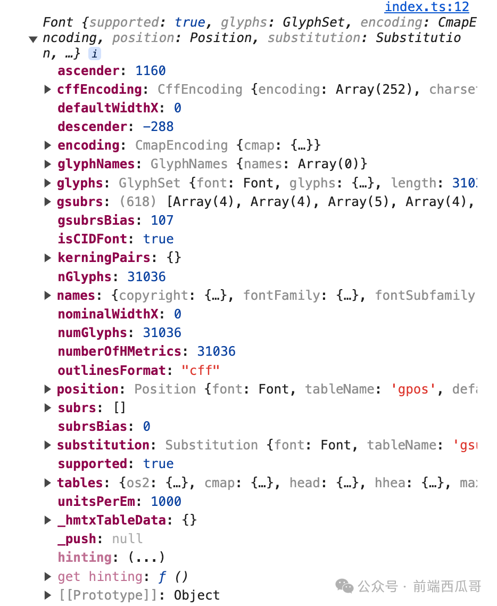

## 获取字形（glyph）信息

glyph 为单个需要渲染的字形，是渲染的最小单位。

```text
const glyph = font.charToGlyph('i')
```

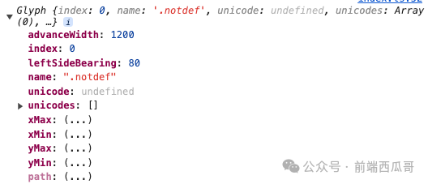

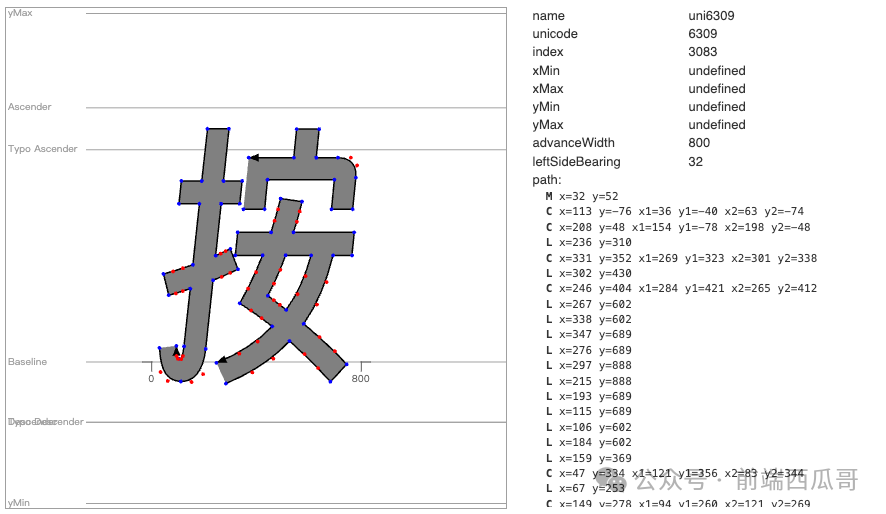

另外 `stringToGlyphs` 方法会返回一个 glyph 数组。

```text
const glyphs = font.stringToGlyph('abcd');
```

## 获取文字轮廓（path）

getPaths 计算得到一段字符串中每个 glyph 的轮廓数据。传入的坐标值为文字的左下角位置和文字大小。

```text
const x = 60;
const y = 60;
const fontSize = 24;
const text = '前端西瓜哥/Ab1';

const textPaths = font.getPaths(text, x, y, fontSize);
```

textPaths 是一个 path 数组。

字符串长度为 9，产生了 9 个 glyph（字形），所以一共有 9 个 path 对象。

形状的表达使用了经典的 SVG 的 Path 命令，对应着 command 属性。

TrueType 字体的曲线使用二阶贝塞尔曲线（对应 Q 命令）；而 OpenType 支持三阶贝塞尔曲线（对应 C 命令）。

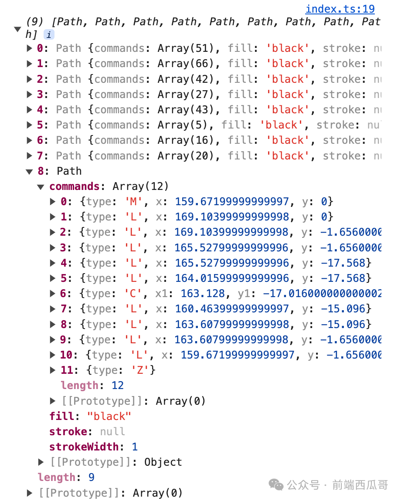

## 渲染

我们有了 Path 数据，就能渲染 SVG 或 Canvas。

当然这个 OpenType.js 专门暴露了方法给我们，不用自己折腾做这层转换实现。

### Canvas

基于 Canvas 2D 的方式绘制文字。

```text
const canvas = document.querySelector('canvas');
const ctx = canvas.getContext('2d');

// ...

font.draw(ctx, text, x, y, fontSize);
```

渲染效果：

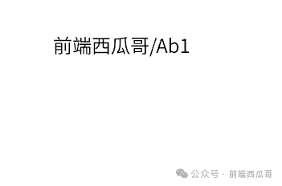

如果使用的字体找不到对应的字形，比如只支持英文的字体，但是却想要渲染中文字符。

此时 opentype.js 会帮你显示一个  **豆腐块（“tofu” glyph）** 。豆腐块是取自字体自己设定的 glyph，不同字体的豆腐块还长得不一样，挺有意思的。

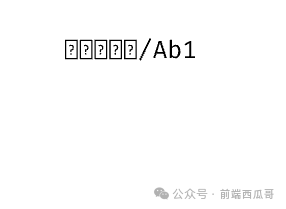

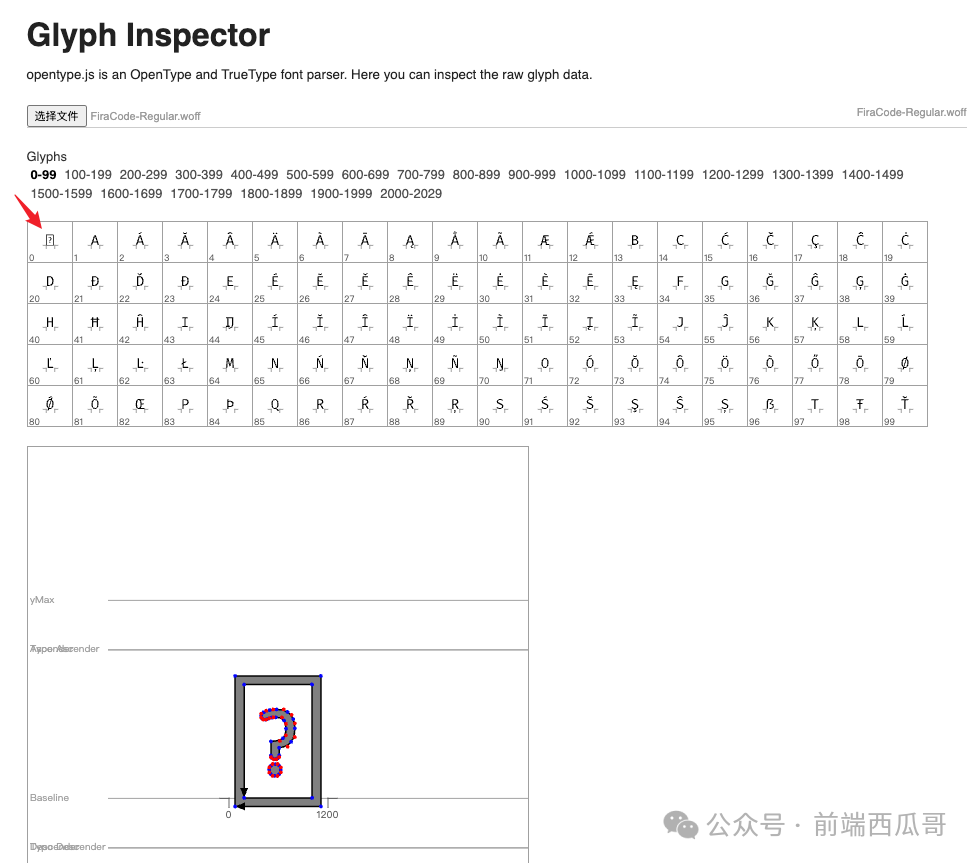

### 辅助点和线

字体是基于直线和贝塞尔曲线控制点形成的轮廓线进行表达的，我们可以绘制字体的控制点：

```text
font.drawPoints(ctx, text, x, y, fontSize);
```

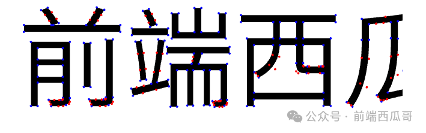

对文字做度量（metrics）得到尺寸数据。蓝色线为包围盒，绿色线为前进宽度。

```text
font.drawMetrics(ctx, text, x, y, fontSize);
```

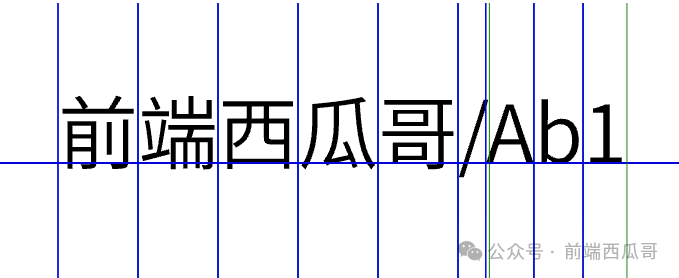

### SVG

Path 实例有方法可以转为 SVG 中 Path 的 pathData 字符串。（Glyph 对象也支持这些方法）

path 长这个样子：

```text
"M74.5920 47.6640L74.5920 57.5040L76.1040 57.5040L76.1040 47.6640ZM79.4640 46.9200L79.4640 59.8080C79.4640 60.1440 79.3440 60.2400 78.9600 60.2640C78.5520 60.2880 77.2320 60.2880 75.7440 60.2400C75.9840 60.6720 76.2480 61.3440 76.3200 61.7760Z"
```

拿到一段字符串对应的 path。

```text
const textPath = font.getPath(text, x, y, fontSize);
const pathData = textPath.toPathData(4); // 4 为小数精度

// 创建 path 元素，指定 d 属性，添加到 SVG 上...
```

渲染结果。

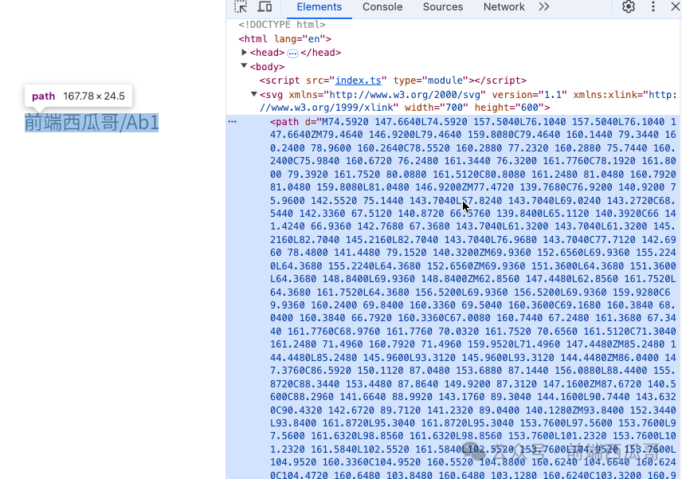

另外还有一个 getPaths 方法，会返回一个 path 数组，里面是每个 glyph 的 path。

也可以直接拿到一个 path 元素的字符串形式。

```text
path.toSVG(4)
```

会返回类似这样的字符串：

```text
<path d="M74.5920 47.6640L74.5920 57.5040L76.1040 57.5040L76.1040 47.6640ZM79.4640 46.9200L79.4640 59.8080C79.4640 60.1440 79.3440 60.2400 78.9600 60.2640C78.5520 60.2880 77.2320 60.2880 75.7440 60.2400C75.9840 60.6720 76.2480 61.3440 76.3200 61.7760Z"/>
```

## 连字（ligature）

连字（合字、Ligatrue），指的是能够将多个字符组成成一个字符（glyph）。如：

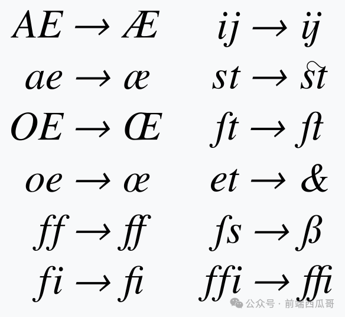

像是 FiraCode 编程字体，该字体会将一些符号进行连字。

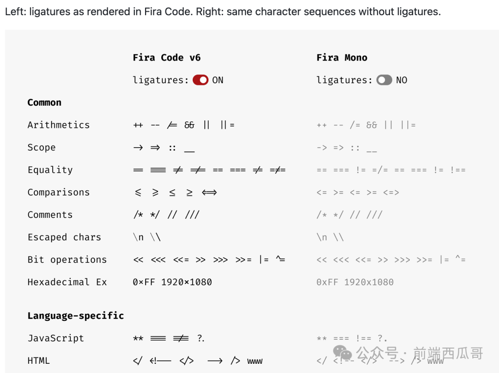

opentype.js 虽然说自己支持连字（Support for ligatures），但实际测试发现 API 好像并不会做处理。

用法为：

```text
const textPath = font.getPath(text, x, y, fontSize, {
  features: { liga: true },
});
```

## 字距（kerning）

两个 glyph 的距离如果为 0，会因为负空间不均匀，导致视觉上的失衡。

此时字体设计师就会额外调整特定 glyph 之间的字距（kerning），使其空间布局保持均衡。如下图：

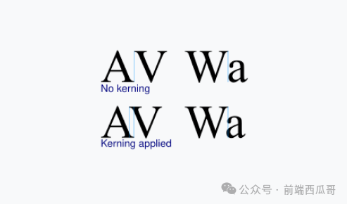

opentype.js 可以帮我们获取两个 glyph 之间的字距。

```text
const leftGlyph = font.charToGlyph('A');
const rightGlyph = font.charToGlyph('V');

font.getKerningValue(leftGlyph, rightGlyph)
// -15
```

返回值为 -15。代表右侧的字形 V 需往左移动 15 的距离。

## 结尾

本文简单介绍了 opentype.js 的一些用法，更多用法可以阅读官方文档。

不过你大概发现里面有某些方法对不上号，应该是迟迟未发布的 2.0.0 版本的文档。所以正确做法是切为 1.3.4 分支阅读 README.md 文档。

我是前端西瓜哥，关注我学习更多前端知识。

  

原文地址：[opentype.js 使用与文字渲染](https://zhuanlan.zhihu.com/p/984481026) 


# 评论


1. <a href="https://www.zhihu.com/people/xiao-bai-41-10">Punk</a> (<small title="重庆">2025-3-27 15:32:43</small>): 怎么看这个加载的进度哦
2. <a href="https://www.zhihu.com/people/chen-xuan-90-57">轩先生</a> (<small title="广东">2024-10-14 11:52:38</small>): 那是不是可以用opentype.js把文字转svg来实现反爬虫
   - **前端西瓜哥** (<small title="上海">2024-10-14 12:11:40</small>): 可以，但也只能提高爬虫成本。canvas 绘制也可以
   - <a href="https://www.zhihu.com/people/chengwei-liu">Blank</a> (<small title="广东">2024-10-17 20:58:56</small>): 还是别吧，基本的选区体验都稀烂了
   - <a href="https://www.zhihu.com/people/yu-tang-88-16">鱼塘</a> (<small title="浙江">2024-11-8 21:28:26</small>): 用处不大，如果你们信息价值很高，爬虫也可以通过ocr来破解
3. <a href="https://www.zhihu.com/people/zhou-tu-sheng-27">土土先生</a> (<small title="广东">2024-10-13 13:5:32</small>): 写的不错不错


=[评论](./attachments/comments.json)

