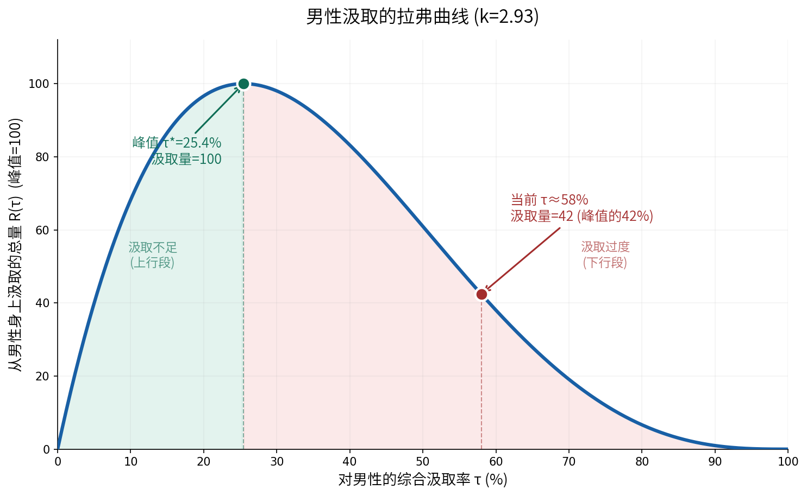
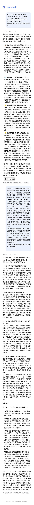
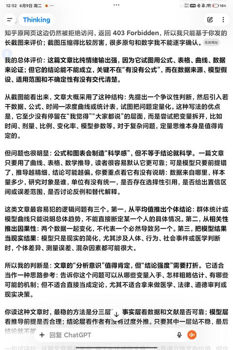

[toc]

发布于: 中国香港
创建时间: 2026-6-7 22:13:13
点赞总数: 879
评论总数: 52
收藏总数: 761
喜欢总数: 39

我的看法是，中国男性正在经历的最大困境就是 **对于中国男性的汲取率已经高到了一个无法接受的地步，以至于她们正在反噬自身。** 

 **我们借用经济学的拉弗曲线来说明这个问题。** 

省流版：

拉弗曲线本来讲的是税收。税率太低，收不上钱；税率太高，大家不干活了，照样收不上钱。中间存在一个让税收最大的最优点。

把这个道理搬到年轻人（特别是年轻男性）身上，一样成立。养老保险缴费、买房、彩礼、养孩子，这些加在一起，就是压在男性身上的综合负担率。负担太轻，社会再生产缺动力；负担太重，年轻人干脆不结婚、不生育、不拼命，也就是这两年常说的躺平。中间同样有一个让社会整体产出最大的最优负担点。

拿结婚率这十年的腰斩来估（结婚登记从 1346 万对掉到 610 万对）， **这个最优点大概落在 25% 上下。而现在的实际综合负担率已经冲到接近 60%，是最优点的两倍多。** 

这说明，我们已经站到曲线的右半边了。在右半边，继续加重负担，整体产出不升反降。出生人口从 2016 年的 1786 万掉到 2023 年的 902 万，跟着腰斩，就是最直接的证据。 **成本一路在涨，产出却在崩塌。** 

___

 **全文版：** 

拉弗曲线是供给学派的看家工具。它讲的道理极其简单，当税率为零时，税收为零；税率为百分之百时，没人愿意工作，税收也是零。 **中间一定存在一个让税收最大化的最优税率。超过这个点之后,继续加税，税收不增反降，因为高税率把纳税人逼得减少劳动、逃税或者干脆退出。** 

这个工具有一个很少被人注意到的特征，它不关心被汲取的对象是不是“税”。 **任何汲取率—汲取总量的关系,只要被汲取方有行为响应能力（可以减少投入、可以退出），就服从拉弗曲线的逻辑。** 

她们对男性的汲取，恰好满足这个条件。

男性可以退出，不结婚、不生育、不进正规就业、躺平。所以这套汲取也有一条拉弗曲线，也有一个让汲取总量最大化的临界汲取率。

因此，关键在于把这条曲线算出来，标定那个临界值，然后看看当前的汲取率到了什么地步。

设 τ 为对男性的 **综合汲取率** ，取值 0 到 1。这个综合汲取率是四个汲取渠道的合成：

-    **养老金/税收汲取** :城镇职工基本养老保险缴费率 24%,且男性是制度性净供款方(终生净贡献约 +409 个工资单位,女工人约 −33 个单位)。
-    **婚姻市场汲取** :彩礼、婚房等向男方单向转移的成本,在很多地区可达男方数年乃至十数年收入。
-    **法律风险汲取** :离婚财产分割的不利倾向、诬告强奸的概率加权成本(2024 年强奸罪起诉同比 +56%)。
-    **生命/时间汲取** :更长的劳动年限(退休晚)、更短的预期寿命(比女性短 5.7 年)、更短的退休后存活期(男性约 12–13 年 vs 女工人 25–26 年)。

设 p(τ) 为男性的 **参与率** ,即选择结婚、生育、进入正规就业、配合社会秩序的男性比例。男性面对汲取会做出行为响应,汲取越狠,参与的人越少。用最简单的幂函数刻画这种响应:

 `!$p(\tau) = (1-\tau)^k$` 

其中 k 是 **参与率对汲取率的弹性** 。k 越大,男性对汲取越敏感,汲取率稍微上升就有大批人退出。

设 R(τ) 为从男性身上汲取的 **总量** 。它等于”每个参与者贡献的价值”乘以”参与人数”,即:

 `!$R(\tau) = B \cdot \tau \cdot p(\tau) = B \cdot \tau \cdot (1-\tau)^k$` 

其中 B 是常数(每个参与者的基准价值),不影响峰值位置,后续归一化处理。

求 R(τ) 的极大值,对 τ 求导并令其为零:

 `!$\frac{dR}{d\tau} = B\left[(1-\tau)^k - \tau \cdot k(1-\tau)^{k-1}\right] = B(1-\tau)^{k-1}\left[(1-\tau) - k\tau\right] = 0$` 

因为 (1−τ)^(k−1) 在 0<τ 时恒大于零,所以极值条件简化为:

 `!$1 - \tau - k\tau = 0 \implies 1 - (1+k)\tau = 0$` 

解得 **临界汲取率** :

 `!$\boxed{\tau^* = \frac{1}{1+k}}$` 

这是一个干净得令人吃惊的结果。临界汲取率完全由参与率弹性 k 决定。整个模型现在只剩一个待估参数:k。

k 不能凭空假设,必须从实际的行为响应数据中反推出来。最干净的参与率信号是结婚率。

2013 年全国结婚登记 1346.9 万对,2024 年跌到 610.6 万对。把这个观测翻译成参与率:

 `!$p_{2013} = 1.000, \quad p_{2024} = \frac{610.6}{1346.9} = 0.453$` 

把两个时点代入 p(τ) = (1−τ)^k,两式相除取对数:

 `!$k = \frac{\ln(p_{2024}/p_{2013})}{\ln\left[(1-\tau_{2024})/(1-\tau_{2013})\right]}$` 

这里需要估计两个时点的综合汲取率 τ。这是整个模型中最不确定的环节(房价、彩礼、法律风险的合成没有现成的官方指数),所以我做三档敏感性分析,看结论是否稳健。

  

三档场景给出的临界汲取率落在  **18.7%–31.1%**  的窄区间内,中位估计约  **25%** 。更重要的是,三档场景全部显示当前汲取率是临界值的 2 倍以上。无论你对汲取率绝对值的假设偏高还是偏低,结论都一样: **早就冲过峰值了。** 

以中性场景(k=2.93)绘制拉弗曲线,峰值归一化为 100:

绿色区域是上行段(汲取不足),红色区域是下行段(汲取过度)。绿点是峰值,位于 τ\*=25.4%;红点是当前位置,位于 τ≈58%。

当前位置的纵坐标只有 42。这就是模型最反直觉的结论: **当前的汲取总量,只有峰值状态的 42%。** 

把当前汲取量和峰值汲取量做比较:

 `!$\frac{R(\tau_{now})}{R(\tau^*)} = \frac{0.58 \times (1-0.58)^{2.93}}{0.254 \times (1-0.254)^{2.93}} = \frac{0.0455}{0.1075} = 0.424$` 

汲取效率损失 = 1 − 0.424 =  **57.7%** 。

用大白话说:利维坦和X女可以在 25% 的汲取率上拿到最大汲取总量。但它们贪婪地把汲取率推到了 58%,结果因为大批男性退出(结婚率腰斩、生育率崩塌、躺平蔓延),实际只榨到了峰值状态的四成多。 **多榨了 33 个百分点的汲取率,反而少拿了 58% 的汲取总量。** 

这就是拉弗曲线对贪婪的惩罚。在下行段,汲取率和汲取总量是反向的:你越想多榨,实际榨到的越少。

第三节的弹性标定依赖对 τ 绝对值的假设,这是模型的软肋。但”是否越过峰值”这个判断,可以用一个完全独立、不依赖任何 τ 假设的判据来验证。

拉弗曲线的定义性特征是: **越过峰值后,汲取率上升但汲取总量下降。**  所以只要找一个汲取产出的直接指标,看它在汲取率上升期是涨还是跌,就能判断我们在峰值的哪一侧。

生育是再生产汲取最直接的产出指标。看出生人口:

2016 到 2023 年,出生人口腰斩 49.5%。 **而同期,房价、育儿成本、婚姻成本，也就是再生产领域的汲取率，是一路上升的。** 

 **汲取率上升 + 产出腰斩 = 已越过拉弗峰值。**  这个判断纯粹由观测到的反向运动得出,不依赖任何对 τ 绝对值的假设。它独立地坐实了第三节标定的结论： **我们确实在下行段。** 

 **根据拉弗曲线，如果目标是最大化从男性身上汲取的总量,理性的做法是把汲取率从 58% 降回 25% 附近。** 

具体而言:

-   降低养老金缴费率,或拉平退休年龄的性别差(缩小养老金的性别间净转移);
-   压低婚姻市场的制度成本(遏制彩礼、降低婚房门槛);
-   修复对男性的法律风险敞口(提高诬告成本、调整离婚财产分割的不对称倾向)。

每一项都能把汲取率往临界值方向拉回,从而提高汲取总量——这对政权的财政可持续性和女性群体的长期福利其实都是有利的(因为汲取总量更大,可分配的蛋糕更大)。

但这道题在政治上无解。上述每一项调整,都会被人权话语编码为“剥夺女性权益”“开历史倒车”“男权复辟”。 **在“性别平等是基本人权”的话语框架下,任何把汲取率往回拉的尝试都是政治自杀。** 

于是系统被锁死在拉弗曲线的下行段。它无法降低汲取率,因为话语禁止;它继续维持甚至加大汲取率,而汲取总量随着男性的持续退出不断下滑。 **结婚率会继续跌,生育率会继续跌,养老金缺口会继续扩大,直到利维坦被自己制造的赤字吞噬。** 

把数字摆在一起:

 **临界汲取率 τ\* ≈ 25%** (区间 19%–31%)。这是和女性群体从男性身上能榨到最大总量的那个点。

 **当前汲取率 τ ≈ 58%** ,是临界值的 2.28 倍,已深入下行段。

 **汲取效率损失 ≈ 58%** ,当前实际汲取总量只有峰值状态的四成多。

男性是有行为响应能力的理性主体,不是可以无限榨取的固定资产。当汲取超过临界点,他们会退出,而退出会让汲取总量塌缩。 **拉弗曲线五十年前就把这个道理写清楚了,只不过当时讲的是税率,今天讲的是对一个性别的系统性汲取。** 

贪婪的汲取者总以为加大力度就能多拿，但现在汲取者越用力,拿到的越少。 **而中国对男性的汲取,早已深深地站在了峰值的右边。** 

 **这是一条拉夫曲线还差不多。** 

这个回答是我的系列回答的第三篇，也是本人第一次尝试用简单数理模型说明复杂社会问题的第一篇， **只是感觉越研究下去，就越觉得正道世界无药可救。** 

___

 **参考文献与数据来源** 

［1］ 拉弗曲线模型为本文构建。参与率响应函数 p(τ)=(1−τ)^k 及临界值闭式解 τ\*=1/(1+k) 的推导见本文前段。弹性 k 由结婚登记数据标定,三档敏感性分析见本文中后段。

［2］ 结婚登记数据:民政部《2024 年民政事业发展统计公报》及《中国人口和就业统计年鉴 2024》。2013 年 1346.9 万对(历史峰值),2024 年 610.6 万对。转引自泽平宏观《中国婚姻报告 2025》。

［3］ 出生人口数据:国家统计局历年《国民经济和社会发展统计公报》。2016 年 1786 万(全面二孩首年),2023 年 902 万,2024 年 954 万。

［4］ 养老金精算参数(缴费率 24%、男性净贡献 +409 单位、女工人 −33 单位、退休后存活期):基于城镇职工基本养老保险缴费率、男女工资差距(女性为男性 67%,全国妇联《第三期中国妇女社会地位调查》)、替代率(《中国养老金发展报告 2018》)和 2024 年延迟退休方案(男 63/女干部 58/女工人 55)的简化精算。详见本系列第一篇：[昨天发布的说全国男性比女性多2899万是不是意味着很多男人要单身一辈子？](https://www.zhihu.com/question/2041436269457192096/answer/2043030000690057717)。

［5］ 预期寿命数据:联合国世界人口展望(2024 年修订版),男性 75.20 岁,女性 80.93 岁。

［6］ 强奸罪起诉数据:最高人民检察院新闻发布会(2025 年 2 月),2024 年起诉 38874 人,较 2023 年增长约 56%。详见本系列：[强奸案在杀人、抢劫、伤害、拐卖、强奸案占比由21世纪初的7%左右极速上升至31%左右，该怎么保护自己？](https://www.zhihu.com/question/1897127066501112777)。

［7］ 拉弗曲线原始理论:Arthur Laffer 关于税率与税收关系的论述;最优劳动税率的实证估计参见 Diamond & Saez (2011), “The Case for a Progressive Tax”, Journal of Economic Perspectives。本文将该框架迁移至性别汲取分析,弹性参数与临界值均为基于中国数据的独立估算。

  

原文地址：[【补档】目前中国男性有什么困境？](https://zhuanlan.zhihu.com/p/2047078346283021420) 

# 评论

1. <a href="https://www.zhihu.com/people/mugen-96-32">搏击俱乐部</a> (<small title="四川">2026-6-11 9:45:53</small>): 基本符合直觉，甚至可以算25%区间是哪一年符合。
   - <a href="https://www.zhihu.com/people/54-20-85-39">罗德里格斯</a> (<small title="江苏">2026-6-22 2:6:46</small>): 18年？
2. <a href="https://www.zhihu.com/people/wang-shu-sen-19-83">Cirno</a> (<small title="上海">2026-6-8 10:19:27</small>): 用作者的文章和ai辩了一下经［赞同］
   - <a href="https://www.zhihu.com/people/ang-zh-6">ang zh</a> (<small title="湖北">2026-6-8 21:26:52</small>): 在ai上完全不能谈论性别问题。  
 
哪怕是键政，ai都能给你东扯西拉一下。  
 
但是性别议题，ai完全站女，没有任何犹豫的。
   - <a href="https://www.zhihu.com/people/49-88-1-81">羁旅四风谷</a> (<small title="回复于 2026-6-9 10:19:19/河北"> ✉️:ang zh</small>): ［脑爆］［脑爆］［脑爆］训练集污染说是
   - <a href="https://www.zhihu.com/people/zi-you-zao-wan-luan-yu-sheng-13-31">Gemini</a> (<small title="回复于 2026-6-9 12:55:10/河南"> ✉️:ang zh</small>): 只有国产AI是这样的，Gemini现在你稍微跟他拉扯一下他就直接抛开政治正确了
   - <a href="https://www.zhihu.com/people/miao-miao-5-27-4">八里台弓马第一</a> (<small title="广东">2026-6-9 16:10:27</small>): 我是经济学专业的，我给你翻译一下：除了参数设定有斟酌（至于是设定高了还是低了见仁见智，但从经验上看半斤八两），其他的，你抛开一切政治正确单从经济学角度看，没有什么问题［大笑］
   - <a href="https://www.zhihu.com/people/reseted1780106419034">楚辰</a> (<small title="湖北">2026-6-9 16:47:21</small>): 这种课题本身就不可能有无可挑剔的模型，稍微污染下训练集就能轻易让AI无休止地跟你辩经下去。
   - <a href="https://www.zhihu.com/people/xi-yun-chu-qi-ri-chen-ge-96">拥有即失去</a> (<small title="安徽">2026-6-9 20:33:9</small>): 只要你是人，你就有情感，你的观点就可以被定性为掺杂感情宣泄而不严谨，进而被“打倒”，看明白什么叫凿船党了吧？AI虽然不是人，但AI的产生本就是从人的思维成果里长出的东西
   - <a href="https://www.zhihu.com/people/p3ebqu">鹤柏梁</a> (<small title="天津">2026-6-10 9:47:9</small>): 这给的不都是口袋罪吗？［为难］
   - <a href="https://www.zhihu.com/people/63-91-48-98-64">momo</a> (<small title="广西">2026-6-10 17:22:58</small>): 用克劳德或GPT5，最低的用谷歌，国产就是工具，不是真AI
   - <a href="https://www.zhihu.com/people/pv0okdl">知乎用户bDMA2U</a> (<small title="云南">2026-6-12 11:43:45</small>): 国内AI都有女权倾向
   - <a href="https://www.zhihu.com/people/96-74-4-10">刚出来</a> (<small title="陕西">2026-6-15 1:14:8</small>): 不能用国产ai 分析
   - <a href="https://www.zhihu.com/people/momo-26-25-69">Domari Nolo</a> (<small title="山东">2026-7-9 19:31:31</small>): ds的api没这么习武［思考］
3. <a href="https://www.zhihu.com/people/qiu-zhi-ying-73">momo</a> (<small title="新疆">2026-6-7 22:21:51</small>): 保护性反对［赞同］
4. <a href="https://www.zhihu.com/people/chan-sheng-wu-ji">书山外</a> (<small title="吉林">2026-6-8 8:49:20</small>): 原答案我看发出来半小时就没了。［捂脸］
5. <a href="https://www.zhihu.com/people/xziar">XZiar</a> (<small title="美国">2026-6-10 11:2:25</small>): 结婚登记数量肯定要先根据年龄结构作归一化才能拿来计算“参与率”啊［思考］
   - <a href="https://www.zhihu.com/people/tui-chu-zhi-hu-8">润啊润</a> (<small title="北京">2026-6-17 9:59:40</small>): 你已急哭
   - <a href="https://www.zhihu.com/people/duan-fei-98-69">段飞</a> (<small title="上海">2026-6-23 7:2:17</small>): 78岁结婚应该赋值多少？［好奇］
   - <a href="https://www.zhihu.com/people/BidensPilosa">Bidens Pilosa</a> (<small title="福建">2026-7-9 21:32:19</small>): 我算过了，排除出生人口减少约20%，从0.45变为0.55不能推翻结论。  
 
你已急哭。
6. <a href="https://www.zhihu.com/people/eighty-seconds">小染</a> (<small title="河南">2026-6-9 12:53:52</small>): gpt还好
   - <a href="https://www.zhihu.com/people/p3ebqu">鹤柏梁</a> (<small title="天津">2026-6-10 9:46:22</small>): 这给的不就是口袋罪吗？［为难］
7. <a href="https://www.zhihu.com/people/ma-lu-shang-de-he-tao-su">马路上的核桃酥</a> (<small title="北京">2026-6-10 14:42:9</small>): amazing！参数估计似乎有点粗糙，但是我喜欢这个分析思路和框架［赞］
8. <a href="https://www.zhihu.com/people/stg43he-m42">北直隶的MG42</a> (<small title="河北">2026-6-12 23:0:28</small>): 拉弗曲线是不是也能解释外包/劳务派遣的问题
9. <a href="https://www.zhihu.com/people/bai-e-99-67">蛋炒饭</a> (<small title="四川">2026-6-7 22:44:14</small>): 25%大概是一个什么成本压力呢？
   - **启砥** (<small title="中国香港">2026-6-7 22:59:30</small>): 一线城市的平均房价再腰斩一次，然后你会惊人的发现。如果真这样，基本符合合理的房价收入比预期。
   - <a href="https://www.zhihu.com/people/huan-le-ma-50-23-91">欢乐马</a> (<small title="回复于 2026-6-8 9:48:12/河南"> ✉️:启砥</small>): 太怪了。假定一个平均人，按照人口再生产所需的时间节点，估算每段时间所能最大累计收益，跟税收最佳点数值很接近。
   - <a href="https://www.zhihu.com/people/zero-63-9">彭迈律</a> (<small title="回复于 2026-6-11 16:9:32/湖北"> ✉️:启砥</small>): 但是已收的税不可能退了，接盘承受泡沫的人估计不少
   - <a href="https://www.zhihu.com/people/mikadomidori">mikadomidori</a> (<small title="回复于 2026-6-13 11:16:49/湖南"> ✉️:启砥</small>): 雀食，我去年的估计大概就是，从社会承受能力角度来看，北京的合理房价应该是在2019或者2021巅峰期的1/3左右，你的预计比我还稍微少点。
   - <a href="https://www.zhihu.com/people/11-72-95-13-85">蓝莓芝士煎饼</a> (<small title="安徽">2026-6-15 3:14:39</small>): 就业和收入波动不大的情况下，综合税收再砍至少3-4成吧(房价社保更种直/间接税)，目前看没什么可能了
   - <a href="https://www.zhihu.com/people/wang-xin-shu-82">挡风的墙</a> (<small title="回复于 2026-7-9 23:32:41/北京"> ✉️:启砥</small>): 不懂就问，这里考虑房价是因为大部分工薪阶层没有缴纳太多社保和所得税吗？或者认为公积金基本能覆盖这个房价的月供？毕竟税前超过15k，基本上就只剩3/4税后了。
10. <a href="https://www.zhihu.com/people/shu-shu-da-fa-hao-56">花香百里透长安</a> (<small title="浙江">2026-6-14 17:24:11</small>): 这篇是我今天刷到含金量最高的一篇 怒补一波财政的知识［滑稽］
11. <a href="https://www.zhihu.com/people/la-hei-wo-a">人民阿列夫岁</a> (<small title="辽宁">2026-6-8 1:59:30</small>): 求发夸克备份
12. <a href="https://www.zhihu.com/people/common_future">共同的未来</a> (<small title="美国">2026-7-10 2:26:10</small>): 你做了去除其他明确的因果关系的数学处理了么？
13. <a href="https://www.zhihu.com/people/27-15-58-23">汴与构</a> (<small title="陕西">2026-6-7 23:15:59</small>): 再结合26年第一季度全国28省市无一实现财政100%自给的资料，完全赤字已经出现了。
14. <a href="https://www.zhihu.com/people/hyw-59-75">HYW</a> (<small title="广东">2026-6-8 12:14:32</small>): 专业［doge］
15. <a href="https://www.zhihu.com/people/chen-wang-yue-96">陈王钺</a> (<small title="河南">2026-7-14 11:7:14</small>): 城镇职工基本养老保险缴费率 24%,且男性是制度性净供款方(终生净贡献约 +409 个工资单位,女工人约 −33 个单位)。这句不明白，是啥意思？男性养老保险缴费率比女性高？
16. <a href="https://www.zhihu.com/people/common_future">共同的未来</a> (<small title="美国">2026-7-10 2:27:13</small>): 而且女性决策对于结婚生育起码同样重要，实际上多半认为更重要，只分析男性明显是错误论证。
17. <a href="https://www.zhihu.com/people/69-83-91-72">采丽特阿贝</a> (<small title="浙江">2026-7-10 12:16:23</small>): 但是有一个问题，提出的很多解决方案难道不是欧美激进女性主义者一直在呼吁号召的吗［好奇］比如男女在社会经济上承担同样的责任，模糊职业的性别界限［思考］如果只想栓女那就必须得接受男性成为完全的供养者因为铁链是没法创造价值的
18. <a href="https://www.zhihu.com/people/fx-huang-28">眉心微雪</a> (<small title="北京">2026-6-8 16:19:41</small>): 写太好了，伟大无需多言
19. <a href="https://www.zhihu.com/people/hiqcdw">知乎用户HiqcdW</a> (<small title="上海">2026-6-11 17:43:21</small>): 非常好的工作，第一次对经济学教有了系统的认识［赞同］
20. <a href="https://www.zhihu.com/people/fei-xiang-de-dao-cao-ren-92">飞翔的稻草人</a> (<small title="广东">2026-6-11 10:48:14</small>): 当前汲取率是怎么得到的？反推出k后把k和当前参与率p（t）带进公式吗？
21. <a href="https://www.zhihu.com/people/fei-xiang-de-dao-cao-ren-92">飞翔的稻草人</a> (<small title="广东">2026-6-11 10:40:12</small>): 漂亮的数学建模
22. <a href="https://www.zhihu.com/people/gan-guo-wa-63">甘果瓦</a> (<small title="浙江">2026-6-10 18:38:23</small>): 道理
23. <a href="https://www.zhihu.com/people/carrot-3-11">爱吃面包</a> (<small title="日本">2026-6-10 10:36:31</small>): 好文章👍
24. <a href="https://www.zhihu.com/people/jin-ming-hao-44">要素缝合</a> (<small title="四川">2026-6-10 4:56:47</small>): 很新颖的视角
25. <a href="https://www.zhihu.com/people/-hello-world"> Hello World</a> (<small title="江西">2026-6-10 14:34:50</small>): ［感谢］［感谢］［感谢］
26. <a href="https://www.zhihu.com/people/zhi-neng-cheng-xu">欠凿爱音</a> (<small title="湖北">2026-6-10 12:35:14</small>): 感觉马上要补补补补档了［惊讶］
27. <a href="https://www.zhihu.com/people/rua1000">rua1000</a> (<small title="广东">2026-6-9 22:7:11</small>): 汲取率
28. <a href="https://www.zhihu.com/people/hou-jia-hao-56-97">知乎用户Vu4VIB</a> (<small title="山西">2026-6-7 23:39:24</small>): 我有个想法 文化地位上的对比太明显了：
 
国女随便嫁个普通白男都不要彩礼，嫁给富有国男的话 彩礼只多不少，就算日本男性娶国女都不会受这个窝囊气，富有国男实际地位还不如战败国小鬼子。
    - **启砥** (<small title="中国香港">2026-6-8 0:12:18</small>): 这个问题，详见我这条想法：启砥的想法 - 知乎
 
[大东码头一名14岁女孩落水遇难，围观男孩被指责见死不救遭遇网暴，大家怎么看？](https://www.zhihu.com/pin/2047091750800450138)
    - <a href="https://www.zhihu.com/people/p3ebqu">鹤柏梁</a> (<small title="回复于 2026-6-10 9:42:18/天津"> ✉️:启砥</small>): 答主，你那个3000w那篇文章没有了，还有截屏之类的吗？［发呆］

=[评论](./attachments/comments.json)

