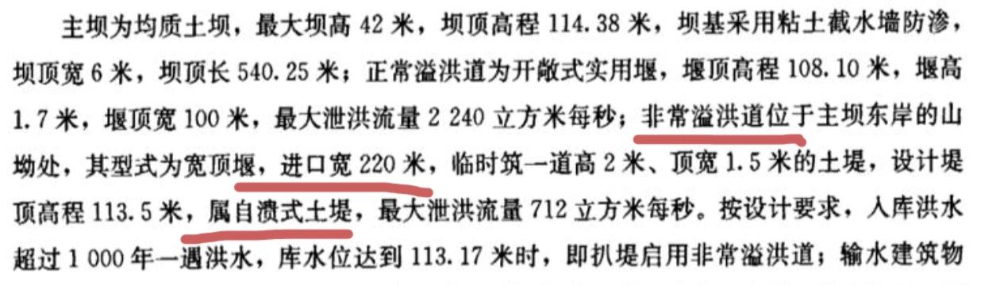
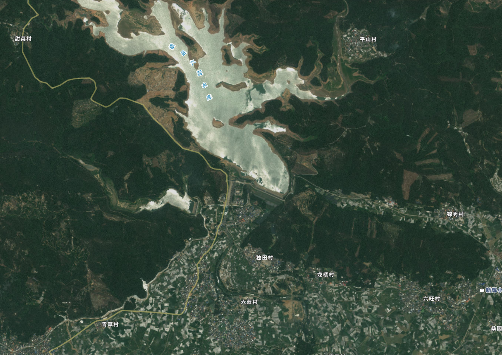
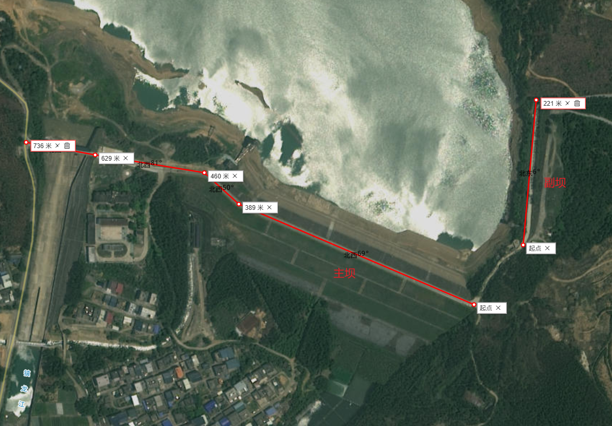
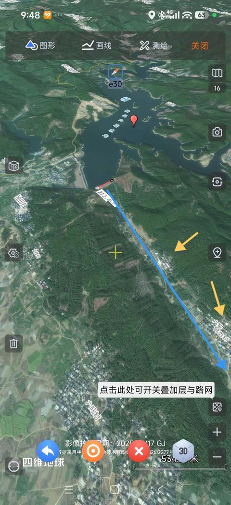
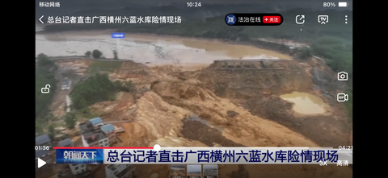
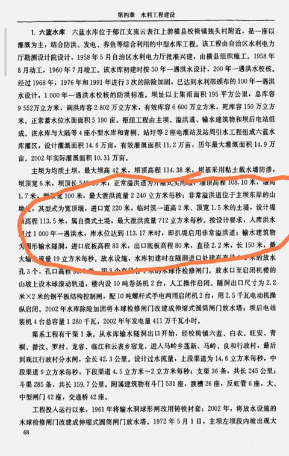
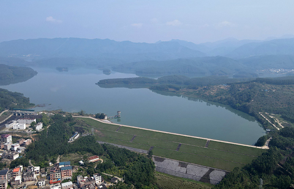
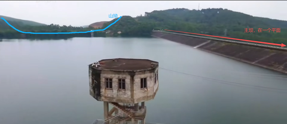
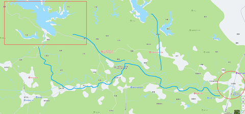

[toc]

发布于: 广西
创建时间: 2026-7-7 9:33:12
点赞总数: 99
评论总数: 51
收藏总数: 32
喜欢总数: 9

关于六蓝水库非常溢洪道在哪？发生溃坝的地方是不是位于非常溢洪道？网上讨论很多。我说说我的看法。

  

 **很明显，东侧这个副坝才是所谓的非常溢洪道。** 

不难判断，东侧这座副坝实际上承担的就是非常溢洪道的功能。无论是其在枢纽布置中的相对位置，还是入口段的宽度特征，都与非常溢洪道的文字描述更为吻合。

___

非常溢洪道的设计逻辑是"舍小保大"——在极端紧急情况下，让相对次要、溃决影响范围更小的副坝先行可控地自溃，以牺牲局部为代价保住主坝这一核心挡水建筑物。那么反过来说，如果最终的结果是主坝自己溃了，这个"牺牲"的逻辑就完全崩塌了：主坝替副坝挡了灾，保住副坝又是为了保护谁呢？

自溃式非常溢洪道的核心要求是"可控"——平时必须绝对安全，不该垮的时候决不能垮；一旦需要启用，又要能在极短时间内迅速溃决泄洪，甚至不排除采用炸药爆破强制引溃。那么问题来了：为什么这次是主坝先于副坝溃坝？

【叠个甲：以下仅为个人分析，以最终官方调查报告为准。】

个人判断，这座非常溢洪道在此前的加固工程中，很可能已按常规挡水建筑物的最严格标准进行了施工补强，导致其事实上丧失了"自溃"功能。真正实施自溃式泄洪对技术条件和决策权限有着极高的要求，需要精确的水文预报、专业的爆破设计和果断的指挥体系。六蓝水库作为一座中型水库，无论从专业力量储备还是应急决策机制来看，都不具备实施自溃泄洪的可行条件，即便想"炸副坝保主坝"，也难以安全可控地完成这一操作。

  

原文地址：[六蓝水库非常溢洪道在哪？](https://zhuanlan.zhihu.com/p/2057755588428297484) 

# 评论

1. <a href="https://www.zhihu.com/people/erk-7">前线勇</a> (<small title="湖南">2026-7-7 20:29:9</small>): 副坝这边排水也不太行，下游800米处为居民点，1.8km处为村庄，该淹还是得淹。甚至由于通道狭窄，水位还会比现在溃坝后下游的水位更高 
   - <a href="https://www.zhihu.com/people/92-5-39-36-85">唠唠叨叨大叔</a> (<small title="广东">2026-7-10 12:16:35</small>): 副坝溃坝总比主坝溃坝损害轻。
   - <a href="https://www.zhihu.com/people/xue-gao-pi">雪糕皮</a> (<small title="山东">2026-7-11 12:6:47</small>): 舍小保大啊［发呆］
2. <a href="https://www.zhihu.com/people/san-ren-57-64">怒怼红夷陈则赓</a> (<small title="福建">2026-7-7 14:36:29</small>): 而且副坝明显高于主坝，是不是被垫高了
   - <a href="https://www.zhihu.com/people/2327236318">初心未改</a> (<small title="福建">2026-7-11 5:49:13</small>): 修乡道加高了
3. <a href="https://www.zhihu.com/people/45-61-88-1">逍遥子</a> (<small title="浙江">2026-7-7 11:22:26</small>): 1972年五一，六蓝水库发生了严重的大坝滑坡。事故发生时，持续强降雨导致坝体土料饱和，水库正在放水，水位已降至较低位置，主河床处的坝体内坡突然失稳滑动，滑坡体长达140米，最大垂直位移达到7米。
4. <a href="https://www.zhihu.com/people/san-ren-57-64">怒怼红夷陈则赓</a> (<small title="福建">2026-7-7 14:35:56</small>): 副坝下游谷口处是另外一个镇子的镇政府所在地。
5. <a href="https://www.zhihu.com/people/zhao-jian-wei-28">人生路漫漫</a> (<small title="湖南">2026-7-8 6:50:11</small>): 非常溢洪道岩石基础会好些，溃坝后不会一次放空库容。
6. <a href="https://www.zhihu.com/people/renfrew">深海睡觉的加菲猫</a> (<small title="加拿大">2026-7-8 0:59:17</small>): 从其它答案流传的照片看，你标的那部分明显比南边的部分高不少。这能当泄洪道就很离谱且奇怪。我甚至可以怀疑说南边地质沉降，“非常泄洪道”早就偏离设计失效没用了。
   - <a href="https://www.zhihu.com/people/renfrew">深海睡觉的加菲猫</a> (<small title="加拿大">2026-7-8 1:4:24</small>): 回答里“逍遥子”说的1972年发生的事倒能很好的解释。滑坡过了，早就应该重新评估蓄水能力，而不是拿着过时的设计图纸来讨论。按理滑坡过的坝蓄水能力不及设计的，从这次溃坝的水位来看，平时维护还是挺到位的。
   - <a href="https://www.zhihu.com/people/kalthy-b">Kalthy b</a> (<small title="上海">2026-7-9 16:43:11</small>): 加高的部分是因为本世纪修了乡道，这部分坝体被加高加固夯实了。
   - <a href="https://www.zhihu.com/people/renfrew">深海睡觉的加菲猫</a> (<small title="回复于 2026-7-9 19:24:42/加拿大"> ✉️:Kalthy b</small>): 那就是说“非常泄洪道”早在加高的时候就在设计和实际意义上取消了，现在说那是设计的溃坝就站不住脚了
   - <a href="https://www.zhihu.com/people/64-58-9-85-2">澄之</a> (<small title="回复于 2026-7-11 14:6:35/广东"> ✉️:深海睡觉的加菲猫</small>): 这种接近大型水库的夯型土坝，如果没有自溃式设计对下游的破坏程度难以想象，竟然将保命的东西加以改造，此次溃坝，无解！
7. <a href="https://www.zhihu.com/people/1-14-4-76">天庭饱满</a> (<small title="广东">2026-7-7 10:12:49</small>): 正常有翻水坝，比主坝低好几米，里外都是水泥的，为啥要自溃。
   - <a href="https://www.zhihu.com/people/xiao-bai-7-23-41">小白</a> (<small title="江苏">2026-7-7 13:22:26</small>): 这种粘土坝不能长时间高水位泡着，这次连续几天的强降雨泄洪赶不上蓄洪，当初的设计就是千年一遇的大降雨舍小保大，只是结果反了
   - <a href="https://www.zhihu.com/people/cao-yuan-zhi-huo">草原之火</a> (<small title="北京">2026-7-7 14:33:5</small>): 60几年设计的坝，那时候哪有那么多水泥
   - <a href="https://www.zhihu.com/people/pian-shan-18">穿堂风</a> (<small title="广东">2026-7-7 20:16:58</small>): 如果是这样哪需要翻水坝，水都已经漫堤了，早就淹过闸门了。
   - <a href="https://www.zhihu.com/people/fain.yx">从善如流</a> (<small title="云南">2026-7-12 13:13:50</small>): 土石坝不能漫顶，漫顶就垮，可以过水的是混凝土坝
8. <a href="https://www.zhihu.com/people/dell-riven-99">戎贝</a> (<small title="安徽">2026-7-7 9:50:36</small>): 不过东边这下面也是一堆聚落啊
   - <a href="https://www.zhihu.com/people/xiao-hai-zi-de-zi-luo-lan">琥珀在翁法洛斯</a> (<small title="广东">2026-7-7 18:16:18</small>): 聚落，这给我干到史前了吗［捂脸］
   - <a href="https://www.zhihu.com/people/64-58-9-85-2">澄之</a> (<small title="广东">2026-7-11 14:3:3</small>): 下面是有几个村寨，但是主坝下面更多
9. <a href="https://www.zhihu.com/people/di-guo-de-li-ming">帝国的黎明</a> (<small title="北京">2026-7-9 18:0:10</small>): 非常溢洪道不能用了，一帮大聪明，把非常溢洪道修成路了。［害羞］［害羞］［害羞］，六蓝水库可以说是生生自己作死的。明明已经通知了，还不泄洪，在大暴雨前，不腾库容，一帮大聪明害怕后面没有水，你看看记录，一开始怎么泄水的流量。到快撑不住的时候泄水流量 ，可以说这是自己找死的。
   - <a href="https://www.zhihu.com/people/xue-gao-pi">雪糕皮</a> (<small title="山东">2026-7-11 12:12:3</small>): 赌的就是这么多年了水库没事，把非常溢洪道改了也不能有事。把钱用在维护水库上是把粉抹在屁股上，修乡道可是看得见的政绩
10. <a href="https://www.zhihu.com/people/zhi-nian-52-46-26">中输神经</a> (<small title="广东">2026-7-7 14:35:53</small>): 那上面是山，比水库还高怎么排
11. <a href="https://www.zhihu.com/people/shang-yu-12-13">上虞</a> (<small title="广西">2026-7-7 11:41:23</small>): 主坝已经发生漫坝，自溃式副坝没有起到作用呢
    - <a href="https://www.zhihu.com/people/xiao-bai-7-23-41">小白</a> (<small title="江苏">2026-7-11 11:33:16</small>): 副坝被改成乡道了，说明早就加固取消了自溃泄洪功能。这个坝当初的设计思路还是比较深思熟虑的，架不住后人为了经济效益各种原因乱改。
12. <a href="https://www.zhihu.com/people/a-yue-a-yue">阿约</a> (<small title="广西">2026-7-9 16:27:28</small>): 这是水库上游镇龙乡受灾的情况，可想而知当时水多大了，估计要炸副坝才能泄洪 
13. <a href="https://www.zhihu.com/people/kong-lin-69-42">空林</a> (<small title="内蒙古">2026-7-7 9:52:19</small>): 最近的一次除险加固是哪年做的？
14. <a href="https://www.zhihu.com/people/peng-peng-51-46">彭彭</a> (<small title="上海">2026-7-7 10:17:30</small>): 首先，东边下面没有任何水体，而且直接就有很多村落，显然不是。其次，东边泄洪直冲本次最严重的云集镇，结果会更糟糕。第三，其他答主已经翻出改开前的卫星图，证实现在溃坝区就是泄洪道。
 
本次事故最核心的问题是预警和提前疏散工作很糟糕。前天晚上已经发现水位快速上升开始泄洪了，到凌晨发现水库顶不住了计划早上等沿途居民醒了大规模泄洪，到第二天早上八点发现水已经漫坝随时可能崩溃，仍然没有做好预警和提前疏散工作。到十点，漫坝水长时间冲刷后开始溃坝，下游损失惨重，而云集镇上连银行职员都是发现洪水了才破门而出逃离。
 
自溃坝也好，其他原因也好，预警和疏散工作的缺失才是本次的核心问题。
    - <a href="https://www.zhihu.com/people/peng-peng-51-46">彭彭</a> (<small title="上海">2026-7-7 10:18:36</small>): 说错，是云表镇
    - <a href="https://www.zhihu.com/people/zhu-ce-zhang-hao-2-65">momo</a> (<small title="黑龙江">2026-7-7 10:45:51</small>): 就是主坝垮了，你看下央视截图吧 
    - <a href="https://www.zhihu.com/people/dan-che-wen-bian-98">单车问边</a> (<small title="广西">2026-7-7 11:41:4</small>): 主坝用来泄洪，这不合理啊
    - <a href="https://www.zhihu.com/people/peng-peng-51-46">彭彭</a> (<small title="回复于 2026-7-7 12:35:55/上海"> ✉️:momo</small>): 任何一个土石坝，让水漫顶冲刷两小时，都会垮。一个是泄洪要及时，第二是要提前预警和疏散。出问题的是这两项
    - <a href="https://www.zhihu.com/people/peng-peng-51-46">彭彭</a> (<small title="回复于 2026-7-7 12:37:39/上海"> ✉️:momo</small>): 事故前一天实际上库容不到一半，需要留点水位用于生活供水。然后这个库容一天不到就漫顶了，泄洪量太小，预警疏散也不足
    - <a href="https://www.zhihu.com/people/sssnake-21">勃鲍去上快冲</a> (<small title="广西">2026-7-7 15:38:49</small>): 首先水库一大功能就是灌溉，下游有村落是很常见的事，其次自溃坝本来就是舍车保帅，不是淹这就是淹那，只能说几十年前副坝下游还没有那么多人口聚集。第三现在溃坝区就是主坝，有两处大决口，从剖面看来不符合自溃坝的设计。
    - <a href="https://www.zhihu.com/people/edith966">张翼飞</a> (<small title="广西">2026-7-7 15:50:52</small>): 你这个分析根本不对，自溃坝不可能与主坝建在同一个平面，那这样主坝还有什么意义？因为都是土坝，自溃坝崩了，主坝保得住吗？，皮之不存，毛将焉附？我找了相关资料分析一下（回复不能发多张图片，后续发）：首先，资料详细说明了，主坝设计的顶高程是114.38，长540米；自溃坝顶高程是113.5米，长220米；从多个图片看得出来，主坝是一体的，并没有左侧高，右侧低；从长度占比来看，假设按你的说法，这个长度已经占了主坝2/5；另外资料描述：自溃坝是建在山坳处，你看哪个是山坳；还有关于云表镇严重情况，这没办法，无论怎么泄，它都是最严重的，因为下游河道都经过此镇。
 

    - <a href="https://www.zhihu.com/people/edith966">张翼飞</a> (<small title="回复于 2026-7-7 15:51:35/广西"> ✉️:张翼飞</small>): 
    - <a href="https://www.zhihu.com/people/edith966">张翼飞</a> (<small title="回复于 2026-7-7 15:53:44/广西"> ✉️:张翼飞</small>): 
    - <a href="https://www.zhihu.com/people/edith966">张翼飞</a> (<small title="回复于 2026-7-7 15:55:17/广西"> ✉️:张翼飞</small>): 云表镇河道流经情况
 

    - <a href="https://www.zhihu.com/people/edith966">张翼飞</a> (<small title="回复于 2026-7-7 16:11:43/广西"> ✉️:单车问边</small>): 对啊，主坝就是用来挡水的，不是用来泄洪的
    - <a href="https://www.zhihu.com/people/29-56-94-88">一瑾</a> (<small title="湖南">2026-7-7 17:4:27</small>): 唐。没了。全部评价。
    - <a href="https://www.zhihu.com/people/cong-cong-11-52-97">匆匆</a> (<small title="广西">2026-7-8 9:12:20</small>): 人家答主都量出来了 你还在这里说否定答案
15. <a href="https://www.zhihu.com/people/yi-si-zhi-tu">已死之徒</a> (<small title="内蒙古">2026-7-7 10:54:27</small>): 如果副坝是非常泄洪道，那问题更大了，泄洪道尽头居然多出了一整个村子
16. <a href="https://www.zhihu.com/people/56-21-29-72-35">白乐</a> (<small title="辽宁">2026-7-13 11:42:48</small>): 非常泄洪道数据有点问题，一般是正常泄洪道的10倍，712立方米/秒，只是正常泄洪道的一半，根本起不到非常泄洪的作用。
17. <a href="https://www.zhihu.com/people/da-cai-jun-91">大才君</a> (<small title="贵州">2026-7-11 0:34:31</small>): 别整这些有的没的，说直白点，是不是天灾
18. <a href="https://www.zhihu.com/people/2327236318">初心未改</a> (<small title="福建">2026-7-11 5:53:41</small>): 很明显，而且副坝是有河道的下泄速度不会太小，自溃以后也不会导致库容全部排空，洪峰水位不会那么深，而主坝溃坝以后库容全部排空了损失极大
19. <a href="https://www.zhihu.com/people/sun-yang-3-65-63">白驴非马</a> (<small title="江苏">2026-7-7 12:22:31</small>): 确实，副坝确实可以炸开保坝，也淹不到这么多东西和人
    - <a href="https://www.zhihu.com/people/bu-zai-mi-shi-2">不再迷失</a> (<small title="江苏">2026-7-7 13:49:48</small>): 问题是副坝下游有村子，还无河道
    - <a href="https://www.zhihu.com/people/erk-7">前线勇</a> (<small title="回复于 2026-7-7 20:24:15/湖南"> ✉️:不再迷失</small>): 有河道，但很窄
    - <a href="https://www.zhihu.com/people/zhang-san-de-ge-51-36">张三的歌</a> (<small title="回复于 2026-7-10 10:23:59/四川"> ✉️:不再迷失</small>): 至少比大坝塌了，淹更多强
    - <a href="https://www.zhihu.com/people/huang-jun-peng-7-89">眉袭冉然</a> (<small title="回复于 2026-7-11 13:30:10/广东"> ✉️:不再迷失</small>): 两害取其轻罢了。主坝副坝下方都是一堆人。要是溃了副坝保住主坝好歹修复的时候容易一点儿。

=[评论](./attachments/comments.json)

