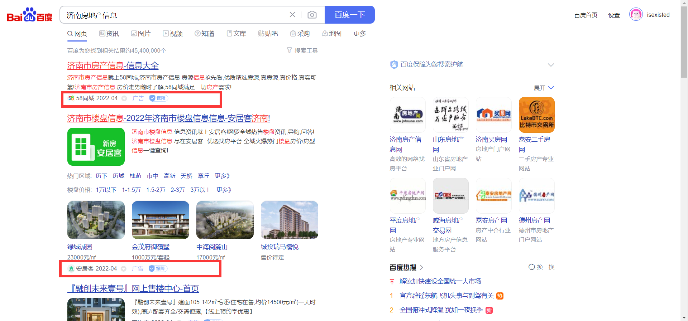
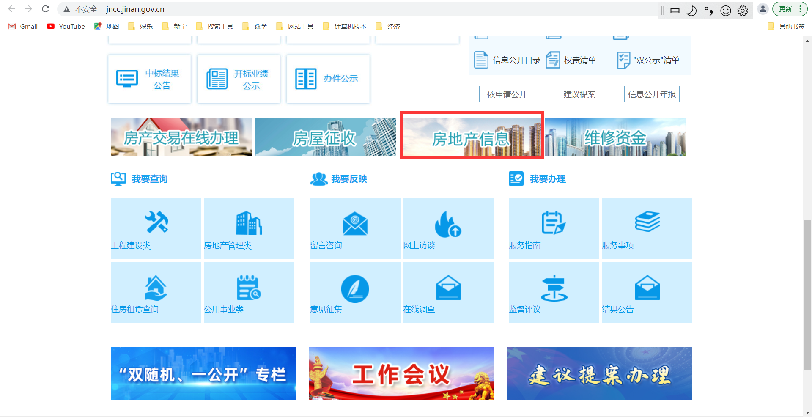
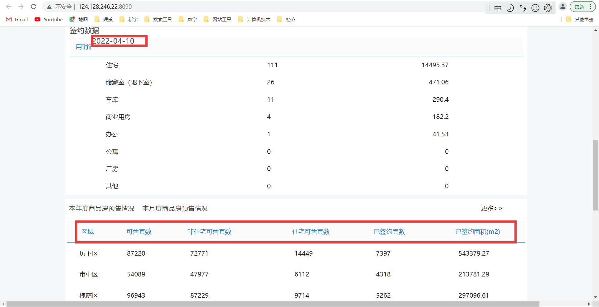

[toc]

发布于: 
创建时间: 2022-4-13 10:28:23
点赞总数: 5
评论总数: 0
收藏总数: 7
喜欢总数: 0

## 数据在哪

济南目前到底有多少存量房，你知道吗？你知道国家要求公开的数据如何查询吗？

网络世界纷繁复杂，庞大的数据信息让人眼花缭乱。当我在浏览器百度搜索“济南房地产信息”时，网络展示是下面这样子的

排在前面的几条都是广告。我们需要的信息被淹没在商业信息的汪洋大海中。这时候不妨换个关键词搜索“济南住房和城乡建设局官网”，这才是我们要找的国家正规的住建部的官网。以gov作为域名的才是国家政务部门的官方网站，如下图

http://weixin.qq.com/r/JDgOFgLEpV-arUZ19202 (二维码自动识别)

点击上图中的“房地产信息”进入目前存量房交易明细数据页面。

## 详细数据

  

上图是截止4月10号的数据。也可以查询某个小区或地块的网签情况，查询济南各区的存量房（包括公寓写字楼，住宅）情况。由于数据是动态的，有时候会看到有销量但剩余套数却不减反增的情况，可能就是有新房完工。

  

原文地址：[济南目前房子有多少？](https://zhuanlan.zhihu.com/p/497588836) 

