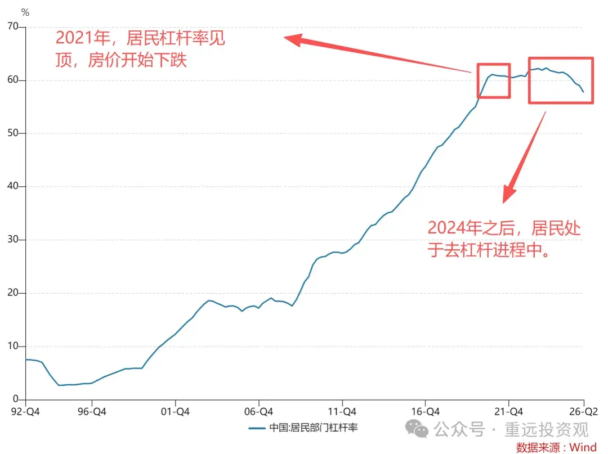
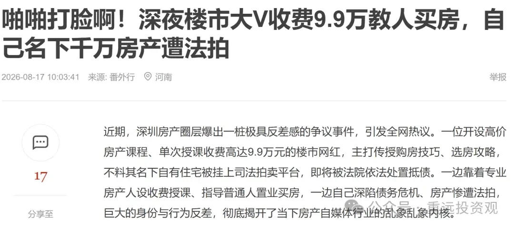
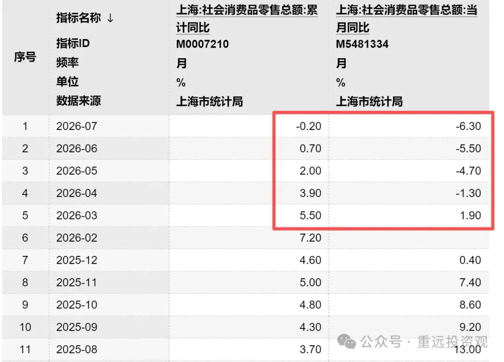

[toc]

发布于: 上海
创建时间: 2026-8-25 10:0:54
点赞总数: 462
评论总数: 69
收藏总数: 438
喜欢总数: 16

在讨论房价之前，先问一个问题，如果不依靠劳动，也不依靠欺骗和抢夺，怎么合法的把钱从别人口袋，弄到自己口袋。

答案只有一个：趁你病要你命。

所以，古代的地主都是喜欢灾年的，尽管在灾年地主的收成也变少了，但余粮只要足够，就可以乘势兼并土地。而那些余粮不够的农民，就只能变卖土地换取粮食熬过饥荒。

到了现代，我们又给了这种兼并一个文雅的名字：抄底。

所谓抄底，表面看是低价买入，但这里面却存在一个悖论。那就是，既然是低价，那对手盘为什么要卖给你。

这从逻辑上根本就讲不通。

所以答案也是一样，那就是，对方虽然知道是低价，却有不得不卖的理由，就像古代灾年的农民一样。

反过来说，如果对手盘没有不得不卖的理由，却愿意卖给你，那你就不是抄底。

我在知识星球经常会收到提问，说自己有多少多少钱，打算去买哪些品类的资产，配比是否合适，而我的回答一般都是：

等！

如果你去观察鳄鱼捕食，你会发现，它的绝大部分时间都在水中等待，直到有的动物渴的受不了，不得不去河边喝水时，蛰伏的鳄鱼才会突然发动袭击。

我们又把金融上拥有这种持续等待并抄底行为的投资客，称为金融大鳄。

当大鳄知道大众散户加杠杆的爆仓点在哪里，他们就一定会把价格拉到他们爆仓为止。

他们赚的，就是对手盘不得不卖的钱。这样，即使未来价格涨回去了，对手盘也看不到明天的太阳了。

即使是以价值投资著称的巴菲特，在其投资的分水岭，喜诗糖果的收购案中，一样是等到了绝佳的机会：喜诗大股东兼经营者去世，继承者急于变现交遗产税时，通过低价拿下了这头现金奶牛。

从这个视角出发，你就知道，你用来击杀对手盘的核心武器，就是现金（类比古代灾年的余粮），它不该在对手盘没有不得不卖的理由时，白白浪费掉。

就像巴菲特说的那样，现金是一种永不过期的看涨期权。

只有当对手盘面临现金流压力，面临爆仓时，才是值得你出手的时刻。

以这个视角，我们再来看楼市。

当居民杠杆率见顶，并开始反向去杠杆时，过去的那些高杠杆炒房客，杠杆就会被逐渐拉爆。

而这种炒房客去杠杆的进程，又分为两个阶段。

第一个阶段，是主动去杠杆。

一部分人通过数据判断出楼市见顶，就会开始抛售逃顶，我们也曾在2023年，多次劝告大家楼市逃顶（参考2023年初的逃顶文：[当人们开始坚信货币贬值，镰刀就变换了它的方式](https://mp.weixin.qq.com/s?__biz=MzkwNzI1OTc0Nw==&mid=2247484753&idx=1&sn=a1c2c51dd9ed37ab2826264e6ec47dd6&scene=21#wechat_redirect)），这部分人，是本轮楼市周期的真正赢家。

而另一部分炒房客，则是在房价跌入负资产平衡线了，才开始考虑是否要卖房保命。

这时止损虽然会把财富清零，但至少避免了被债务拖入深渊，至少还能重新开始。

这个，就是不得不卖的理由。

我在2024年和2025年，一对一咨询中，有一半以上的咨询案例，都是炒房客询问是否要卖房止损，然后去还债的（去杠杆）。

第二个阶段，主动去杠杆的进程之后，就是被动去杠杆，又称为暴力去杠杆。

当炒房客们错过了房产进入负资产时的止损，就不得不一条道走到黑了。

比如，当他们通过30%首付买入房产，并且房价下跌30%以上时，他们就已经变为负资产了。但如果他们又不甘心财富清零，就会硬撑，希望撑到救市，撑到楼市触底回升。

但是，如果救市只是挤牙膏式的托而不举，只要房价继续下行，甚至只需房价在底部长期横盘（比如东京的底部横盘期长达8年，美国一线城市也有3年横盘期），那么当他们的贷款期限到期（经营抵押贷一般最长3年期限），面临房产市值重估和贷款展期时，就会因为无法提供现金流而被银行强制拍卖。从而陷入债务牢笼。

比如，最近深圳的某楼市大V（为避免麻烦，不提名字了），深陷债务危机，房子将在下个月以1400万的起拍价被法拍。

曾经，他的炒房课程，要卖粉丝9.9万，而如今，他自己在楼市下行周期也面临了暴力去杠杆的惨痛结局，没能熬过周期。

所以，楼市也是一样，抄底，抄的就是对手盘（炒房客）带血的筹码。

并且，只要被动去杠杆的进程不结束，楼市的被动卖出的供给，也就不会停止。

以上，是从供给侧来说的，那么，需求侧呢？

在炒房客要持续被迫吐出带血的筹码时，需求方的承接力决定了后续房价的走势。

我们以今年楼市成交最为强势的上海为例，来看上海的楼市承接方，也就是买方处于一种怎样的经济状况。

上周，上海刚公布了2026的社保基数，那么我们列出下疫情后的2023~2026（也是楼市下行周期），这4年上海社保的社会平均工资，分别为：

2023：12183元

2024：12307元

2025：12434元

2026：12577元

可以看到，每年的增长率仅为1%左右。但这个只是没有失业，在职人员的平均工资。

如果我们看更加反映上海全社会居民收入状况的消费品零售总额，就会更加清晰。

以上红框框出来的，就是今年以来，上海消费品零售总额的当月同比，以及累计同比。

从数据上看，消费当月同比数据4月变为负增长，并持续向下到7月，至今尚未观察到数据的向上拐点。所以楼市的承接方，也就是买方的购买力，也并不乐观。

那么结合供给侧的被动去杠杆（法拍）还在继续。也就是说，楼市的触底反转，我们依然需要继续等待。

  

后记：

抄底的铁则，就是承接对手盘不得不卖出的带血的筹码。

从当下进程看，主动去杠杆已经过渡到被动去杠杆，被动去杠杆结束之时，所有高债务持房者被迫卖房出清完成的时点，就是一线和强二线楼市（三线以下城市人口基本面不支持就不必看了）触底横盘或反转的时点。但目前还没有确切证据，证明被动去杠杆已接近尾声。

而我们现在要做的，就是拿好你的现金，去等待带血的筹码全部吐出后，那个最佳的击球点。

  

原文地址：[炒房客暴雷正在失控，房价走向没有悬念了](https://zhuanlan.zhihu.com/p/2075522103881873137) 

# 评论

1. <a href="https://www.zhihu.com/people/2-69-66-20-8">绝情</a> (<small title="广东">2026-8-25 18:33:0</small>): 《我是刚需，不买房住哪里？》  
 
《结婚不买房，安全感从哪里来？》  
 
《孩子要读书，不买房如何上学？》  
 
《租房不能随意添置家具，不买房哪来的生活品质？》  
 
《现金留在手上只会贬值，唯有买房才能保值升值》  
 
《政府不会允许房价下跌的，不然经济就完了》  
 
《年轻的时候不买房，老了都没人把房子租给你》  
 
《说房价会下跌的都是买不起房子的loser》  
 
《买房是普通人跨越阶层的唯一机会》  
 
《地价越拍越高，面粉贵过面包，房价不可能下跌》  
 
《一二线城市的房价不可能跌》  
 
《一线城市的房价不可能跌》  
 
《一线城市核心区的房价不可能跌》  
 
《一线城市核心区的豪宅不可能跌》  
 
《一线城市的房价不可能一直跌》  
 
《掏空所有买房，三年不到亏光首付，与自己和解》
   - <a href="https://www.zhihu.com/people/giampaolo-pazzini">Giampaolo Pazzini</a> (<small title="上海">2026-8-25 20:21:32</small>): 《自住无所谓 跌了就跌了》 ［开心］［开心］［开心］
   - <a href="https://www.zhihu.com/people/fanmz">我爱起笔名</a> (<small title="陕西">2026-8-26 23:5:51</small>): 你这是不提，买房挣了钱这波人
   - <a href="https://www.zhihu.com/people/14-49-74-74">乐平和拓荒牛</a> (<small title="回复于 2026-9-2 15:7:20/辽宁"> ✉️:Giampaolo Pazzini</small>): 前提必须无债！
2. <a href="https://www.zhihu.com/people/53-41-79-44">青岛明码</a> (<small title="山东">2026-8-25 13:34:27</small>): 还想抄房？逆大势？中国最大问题是人口，从2016年开始，1786万至792万人，房价降多少？一线房价降多少？你敢跟时代大趋势对着干？
3. <a href="https://www.zhihu.com/people/wen-wen-18-58-32">温温</a> (<small title="河北">2026-8-25 10:27:6</small>): 如果还把房子当投资品，一定一定记得，得是一线城市的。房子以后应该要定义为消费品。
   - <a href="https://www.zhihu.com/people/hanyutaiyang">风吟鸟唱</a> (<small title="上海">2026-8-25 13:18:36</small>): 即使是一线城市也很难，也必须得在核心地段，而且还要买在一个合适的价格。如果买的价格比较高，可能买入两三年跌20%，又要花个四五年才能涨回来，差不多七八年就没了。如果这中间想换房，那就只能亏钱。
   - <a href="https://www.zhihu.com/people/you-ling-46-84">游灵</a> (<small title="中国香港">2026-8-26 12:46:51</small>): 二线城市房子可能会跌，但是跌幅也不会太大了。一线城市一套房四五百万起步，我严重怀疑是不是真的有这么多有钱人，还是上巨额杠杆英上车，这里面泡沫可能很大的。
   - <a href="https://www.zhihu.com/people/ai-mei-yitian-27">莫少轩</a> (<small title="广东">2026-8-26 15:22:41</small>): 按照租售比和房价收入比，一线城市照样还有很大泡沫
   - <a href="https://www.zhihu.com/people/zhi-hu-zhe-ye-9-88-58">于无声处999</a> (<small title="回复于 2026-8-26 16:32:22/河南"> ✉️:游灵</small>): 左手倒右手，自卖自买套银行钱。房价越高套的钱越多。  
 
这是另一类变形的庞氏骗局!  
 
该骗局持续维持不断链的条件是“下一轮开发的房价必须高于上一轮”!所以一线城市核心炒作区的房价必须是持续上涨越来越高，否则就崩盘!  
 
每平米百万不是梦!但永远找不到接盘人。  
 
点拨到此，其它自悟。
   - <a href="https://www.zhihu.com/people/zhi-hu-zhe-ye-9-88-58">于无声处999</a> (<small title="回复于 2026-8-26 16:48:57/河南"> ✉️:莫少轩</small>): 不要钻到书本里像个书呆子!人家玩的是书本之外的套路。  
 
左手倒右手，自卖自买套银行钱。房价越高套的钱越多。  
 
这是另一类变形的庞氏骗局!  
 
该骗局持续维持不断链的条件是“下一轮开发的房价必须高于上一轮”!所以一线城市核心炒作区的房价必须是持续上涨越来越高，否则就崩盘!  
 
每平米百万不是梦!但永远找不到接盘人。  
 
点拨到此，其它自悟。
4. <a href="https://www.zhihu.com/people/shi-tou-de-shi-jie-7-46">石头的视界</a> (<small title="广东">2026-8-25 13:18:59</small>): 其实就是经营贷和消费贷到期了，房价跌幅大，过桥续贷对于普通炒房客而言难如登天
   - <a href="https://www.zhihu.com/people/li-hua-xia-42">最爱米库德</a> (<small title="重庆">2026-8-26 6:7:51</small>): 也还好，现在跟银行经理好好说，要么续贷我继续还利息，要么我本金和利息都不还了，一般都能续
5. <a href="https://www.zhihu.com/people/jamesliu-86-29">一致性</a> (<small title="广东">2026-8-25 10:24:0</small>): 有这个认知和耐心，就算不炒房，随便炒点其他的东西，也能实现稳稳的幸福［赞］
6. <a href="https://www.zhihu.com/people/dian-zhan-37">牧云天边</a> (<small title="上海">2026-8-25 16:34:7</small>): 以我对中国的了解，当一样资产开始走A，它下跌的时间不会低于它A上来的时间
7. <a href="https://www.zhihu.com/people/43-63-35-35-27">羌塘</a> (<small title="湖北">2026-8-25 14:1:51</small>): 你看动物世界中的老虎等大猫在觅食时有多警惕，都是长期的等待，缓慢而悄无声息的接近，只在最佳时机出手，如果错过，就会静等下一个机会
8. <a href="https://www.zhihu.com/people/tai-cheng-liu-92">台城柳</a> (<small title="北京">2026-8-25 22:0:43</small>): 真要是雪崩，反而没人敢买了
   - <a href="https://www.zhihu.com/people/tai-cheng-liu-92">台城柳</a> (<small title="回复于 2026-8-26 16:52:42/北京"> ✉️:砸盘春舞</small>): 雪崩毛头小子也看不到。------ 没看懂你这句话的意思
   - <a href="https://www.zhihu.com/people/bai-he-liang-zhi">砸盘春舞</a> (<small title="广东">2026-8-26 15:29:15</small>): 雪崩毛头小子也看不到。
9. <a href="https://www.zhihu.com/people/yan-ding-er-17">盐丁儿</a> (<small title="河北">2026-8-26 5:42:43</small>): 从杠杆的角度快到击球区了，但房子不是资产是负债；从财富分配角度看没有接手盘，买个负债砸自己手里？是资产的话可以不考虑接手盘。  
 
结论，还不可考虑
10. <a href="https://www.zhihu.com/people/luo-xi-pin">罗浩宇</a> (<small title="上海">2026-8-25 17:11:7</small>): 抄底的铁则，就是承接对手盘不得不卖出的带血的筹码。  
 
  
 
从当下进程看，主动去杠杆已经过渡到被动去杠杆，被动去杠杆结束之时，所有高债务持房者被迫卖房出清完成的时点，就是一线和强二线楼市（三线以下城市人口基本面不支持就不必看了）触底横盘或反转的时点。但目前还没有确切证据，证明被动去杠杆已接近尾声。  
 
  
 
而我们现在要做的，就是拿好你的现金，去等待带血的筹码全部吐出后，那个最佳的击球点。
    - <a href="https://www.zhihu.com/people/yideng-49-63">知乎用户SXNEL</a> (<small title="河南">2026-8-27 8:12:2</small>): 要带血才行，得有人上吊跳楼。
    - <a href="https://www.zhihu.com/people/71-55-25-67-40">tt112</a> (<small title="湖南">2026-8-28 14:48:59</small>): 跳的人肯定不能少了，不然对不起这么波澜壮阔的大行情。
    - <a href="https://www.zhihu.com/people/12-98-47-83-88">自律的小草</a> (<small title="回复于 2026-8-29 1:22:9/湖北"> ✉️:知乎用户SXNEL</small>): 还是万恶的资本主义
11. <a href="https://www.zhihu.com/people/xiaojing-jin-61">xiaojing jin</a> (<small title="上海">2026-8-25 17:37:25</small>): 在美国，可以长期持有现金，美元币值稳定。
    - <a href="https://www.zhihu.com/people/da-jing-yu-8152-20">大鲸鱼8152</a> (<small title="辽宁">2026-8-25 19:53:39</small>): 美国以后也不行了。美元可能变成日元。
    - <a href="https://www.zhihu.com/people/12-98-47-83-88">自律的小草</a> (<small title="回复于 2026-8-29 1:22:27/湖北"> ✉️:大鲸鱼8152</small>): 有见地
12. <a href="https://www.zhihu.com/people/lao-mao-diao-yu-52">绝宕</a> (<small title="江苏">2026-8-25 21:30:15</small>): 都说房价k型分化，以后二手房只会更旧更贬值，不像田地可以持续产出，抄底卖给谁？
    - <a href="https://www.zhihu.com/people/han-hui-46-99">韩铁牛</a> (<small title="四川">2026-8-25 23:49:37</small>): 博主好像只考虑了接盘时候的对手盘，没考虑出货时候的对手盘。  
 
估计到时候剩下的都是人精，抄底人把带血筹码拿走，也要掂量自己是不是也要吐出带血筹码。
    - <a href="https://www.zhihu.com/people/bai-he-liang-zhi">砸盘春舞</a> (<small title="回复于 2026-8-26 15:31:28/广东"> ✉️:韩铁牛</small>): 不要介入别人因果。
    - <a href="https://www.zhihu.com/people/jqyi-qi-kan-shi-jie">SeeWorldTogether</a> (<small title="广东">2026-8-26 16:27:41</small>): 手里有闲钱的。如果贷款，有资金压力的，还是拿着观望个10年8年的，甚至20年，租房也不是不能过。如果租房换来房价腰斩，白赚的。但是可能 美元降息又拉一波，反正都是机遇
13. <a href="https://www.zhihu.com/people/pu-gong-ying-28-53-38">蒲公英</a> (<small title="上海">2026-8-25 22:1:56</small>): 现在我的同事连星巴克都喝不起了。
14. <a href="https://www.zhihu.com/people/fang-hen-shao-41-37">方恨少</a> (<small title="广东">2026-8-25 22:21:56</small>): 不可能像以前那样涨了，以前老百姓还有个不切实际的幻想，国家银行会兜底，现在看明白了，你只能自己去兜底，再也不会随随便便去负债了。应该要换赛道诱惑你去负债
15. <a href="https://www.zhihu.com/people/yang-can-38-21">燕归人</a> (<small title="安徽">2026-8-26 8:33:12</small>): 天之道，损有余而补不足。人之道，损不足以奉有余。 不遵天道，等着被天道轮回吧。
16. <a href="https://www.zhihu.com/people/shou-wang-lai-yin">守望莱茵</a> (<small title="上海">2026-8-25 13:52:9</small>): 关键是信息不透明，大量的违约房产还在银行里，不敢放出来法拍
    - <a href="https://www.zhihu.com/people/han-hui-46-99">韩铁牛</a> (<small title="四川">2026-8-25 23:40:34</small>): 这种行为算不算捂盘
    - <a href="https://www.zhihu.com/people/shou-wang-lai-yin">守望莱茵</a> (<small title="回复于 2026-8-26 0:51:43/上海"> ✉️:韩铁牛</small>): 不算吧，是怕砸盘，卖价更低了，银行账面亏损扩大。只能看市场行情，慢慢卖出来。只有看涨，才捂盘
    - <a href="https://www.zhihu.com/people/byandroid1">我是游戏设计师</a> (<small title="上海">2026-8-26 5:27:55</small>): 大量是多少数量级的［大笑］
    - <a href="https://www.zhihu.com/people/mei-dan-de-dan-chao-fan">骑鱼的猫</a> (<small title="回复于 2026-8-26 8:16:23/安徽"> ✉️:我是游戏设计师</small>): 多一个数量级，现在放出来的是大几十万套，实际几百万套，徐律师曾在他的文中说，现在真正走到法拍这一步的只有大概十分之一
    - <a href="https://www.zhihu.com/people/shuang-xiong-9">双雄</a> (<small title="回复于 2026-8-26 14:6:34/上海"> ✉️:韩铁牛</small>): 可以理解为变相的债务展期，本来断供两个月就进入法拍流程，现在流程搞个两年，是不是进入法拍池的就少了，银行的不良资产也不会快速增长
    - <a href="https://www.zhihu.com/people/jqyi-qi-kan-shi-jie">SeeWorldTogether</a> (<small title="回复于 2026-8-26 16:20:57/广东"> ✉️:守望莱茵</small>): 就是捂盘，当然捂的是跌盘
17. <a href="https://www.zhihu.com/people/qia-cheng-43">恰骋</a> (<small title="江苏">2026-9-6 20:18:3</small>): 明年打算去看看市场了［赞同］［发火］［思考］
18. <a href="https://www.zhihu.com/people/jiangksj">Jiangksj</a> (<small title="广东">2026-9-5 19:49:8</small>): 1400万也叫炒房吗？深圳高价区域的一套房都不够啊。  
 
我2017年卖房，帮忙处理的中介在办理过程中闲聊时说，卖房的老板在一线城市有47套房……  
 
个人认为炒房客至少是几十上百的吧，这些人一次两次尝到吸血的味道，会止不住的更加疯狂
19. <a href="https://www.zhihu.com/people/you-cheng-7-44">大头小手</a> (<small title="广西">2026-9-6 7:3:22</small>): 就中国这操作，我敢说盘底期是最久的。
20. <a href="https://www.zhihu.com/people/jin-xiao-jun-66">苍南居士</a> (<small title="新加坡">2026-9-4 17:49:1</small>): 谁是炒房客，找几个出来晒晒
21. <a href="https://www.zhihu.com/people/xavier-23-36-63">xavier</a> (<small title="北京">2026-9-2 1:28:9</small>): 没看国家最新政策吧。［大笑］
22. <a href="https://www.zhihu.com/people/zol146">zol146</a> (<small title="北京">2026-9-2 13:16:52</small>): 北京已经有房产中介倒闭了，炒房永远结束了
23. <a href="https://www.zhihu.com/people/14-49-74-74">乐平和拓荒牛</a> (<small title="辽宁">2026-9-2 15:6:18</small>): 说得好：“我们现在要做的，就是拿好你的现金，去等待带血的筹码全部吐出后，那个最佳的击球点”
24. <a href="https://www.zhihu.com/people/ai-gao-ji-96">爱搞机</a> (<small title="北京">2026-8-30 10:48:12</small>): 躺赚、不打工、空手套白狼、合法地取别人钱包里的钱、阶级跃升。博主说这些完全违背社会主义核心价值观的语句的时候，是否考虑再婉转一点。。。比如这篇开门见山就是
25. <a href="https://www.zhihu.com/people/www-4-89-11">一www</a> (<small title="广东">2026-8-28 12:25:40</small>): 讲的是干货［赞同］
26. <a href="https://www.zhihu.com/people/xmtm">xmtm</a> (<small title="上海">2026-8-27 15:54:12</small>): 好像还有一个好听的名字，公私合营
27. <a href="https://www.zhihu.com/people/plan2004">plan2004</a> (<small title="四川">2026-8-27 11:11:39</small>): 居民负责概率依然非常高，杠杆率下降太慢了，调整周期依然漫长！
28. <a href="https://www.zhihu.com/people/xiao-ya-6-43">小丫</a> (<small title="上海">2026-8-27 9:57:30</small>): 什么时候出击呢
29. <a href="https://www.zhihu.com/people/16-19-84-29-57">在都市放牛的人生</a> (<small title="山东">2026-8-27 16:53:40</small>): 刚来，住桥洞的和多套房子的谁赢了？
30. <a href="https://www.zhihu.com/people/liu-xian-sheng-john-liu">刘先森</a> (<small title="北京">2026-8-27 11:35:47</small>): 当那个守株待兔者真爽啊，可是有些炒房者却是恨之入骨的，没办法，谁叫他们当初不早点逃跑呢。
31. <a href="https://www.zhihu.com/people/zhang-bing-15-66-2">不在乎</a> (<small title="河北">2026-8-26 19:30:52</small>): 未来是AI的时代，抄底砖头可能有几倍收益，抓住AI才是几何倍率上涨。
32. <a href="https://www.zhihu.com/people/cyanpupil">cyanpupil</a> (<small title="湖北">2026-8-26 10:59:51</small>): 出清阶段了
33. <a href="https://www.zhihu.com/people/wjn-52">wjn</a> (<small title="上海">2026-8-26 3:36:6</small>): 永不过期的期权的恶性通胀
34. <a href="https://www.zhihu.com/people/xiao-zhi-zhi-ai-xiao-xiao">小小OK绷贴上</a> (<small title="吉林">2026-8-25 16:27:17</small>): 好文章，一直在关注你，太厉害了大佬
35. <a href="https://www.zhihu.com/people/wjn-52">wjn</a> (<small title="上海">2026-8-25 17:27:15</small>): 现金如果是一种永不过期的看涨期权，那国民政府的金圆券，在1949年就不会用来擦屁股
    - <a href="https://www.zhihu.com/people/kang-kang-71-29-78">康康</a> (<small title="上海">2026-8-26 0:42:1</small>): 你说的是恶性通胀
36. <a href="https://www.zhihu.com/people/4-81-32-62">海东青的天空</a> (<small title="河北">2026-8-26 6:16:56</small>): 连地产公司都一个接一个爆雷，没提前跑出来的炒房客，只能呵呵了
37. <a href="https://www.zhihu.com/people/xiao-shi-tou-64-80-10">小石头</a> (<small title="河北">2026-8-26 5:53:34</small>): 送出一个礼物～
38. <a href="https://www.zhihu.com/people/lklk731">渐行渐远</a> (<small title="广东">2026-8-26 8:18:15</small>): 抄底带血的筹码不会免责你出货时也是别人抄底的带血筹码。
    - <a href="https://www.zhihu.com/people/bai-he-liang-zhi">砸盘春舞</a> (<small title="广东">2026-8-26 15:32:32</small>): 不介入别人因果。
39. <a href="https://www.zhihu.com/people/sou-lao-tou">叟老头</a> (<small title="北京">2026-8-25 11:53:1</small>): 好文章！我最擅长抄底，包括′人和物。
    - <a href="https://www.zhihu.com/people/bai-he-liang-zhi">砸盘春舞</a> (<small title="回复于 2026-8-26 15:34:39/广东"> ✉️:韩铁牛</small>): 别介入别人因果。
    - <a href="https://www.zhihu.com/people/han-hui-46-99">韩铁牛</a> (<small title="四川">2026-8-25 23:50:14</small>): 人，咋理解？

=[评论](./attachments/comments.json)

